全国优秀教材特等奖

# 数学

必修

第一册

普通高中教科书

# 数学

必修

第一册

人民教育出版社 课程教材研究所

中学数学课程教材研究开发中心

编著

人民教育出版社

· 北京 ·

A版

主 编：章建跃 李增沪

副主编：李勇 李海东 李龙才

本册主编：李海东 郭玉峰

编写人员：王嵘 白涛 刘长明 刘春艳 李柏青 宋莉莉 张劲松

周远方 赵昕 胡永建 俞求是 郭玉峰 郭慧清 黄炳锋

章建跃 薛红霞

责任编辑：王嵘

美术编辑：王俊宏

普通高中教科书 数学 必修 第一册

人民教育出版社 课程教材研究所

中学数学课程教材研究开发中心

编著

出版 人民教育出版社

（北京市海淀区中关村南大街17号院1号楼 邮编：100081）

网址 http://www.pep.com.cn

# 主编寄语

亲爱的同学，欢迎使用这套教科书，希望它能成为你学习数学的好帮手。在开始学习前，我们想就数学学习中的一些问题与你做点交流。

首先，你想过为什么要学那么多数学吗？高中生应该认真思考这个问题了。其实道理很明显，就是因为数学有用。数学不仅对社会发展和科技进步作用巨大，而且对你个人的发展也很重要。努力学好数学对你的人生幸福意义重大，这个道理在你今后学习、工作和生活中会逐步体会到。

第二，要采用多样化学习方式。高中数学内容的抽象程度提高了，要以更加积极主动的态度、刻苦钻研的精神，采取阅读自学、独立思考、实践探究、合作交流等多种学习方式，才能更好地掌握它。内容越抽象，就越需要静下心来，持之以恒地思考，然后才能有所领悟、有所收获。

第三，注重基础，拾阶而上。数学的特点是逻辑严谨，从概念到性质再到应用环环相扣，前面知识未理解，后续学习就必然会遇上实质性困难。学数学，既没有捷径，也没有灵丹妙药，唯有按数学的方式，按部就班地学，循序渐进地想，在基础知识上下足功夫，才能取得好成效。

第四，按学习规律办事。理解概念、熟练技能和准确表达是数学学习的“三要素”，做好这些的要诀是遵循学习规律，掌握学习节奏。概念是数学的精要所在，必须深刻理解、牢固掌握，因此概念学习要“慢慢来”。例如，函数是贯穿高中数学的一条主线，是重中之重的内容，因为其抽象程度高而成为许多同学的学习难点。在起始阶段囫囵吞枣、贪多求快，就会给后续学习埋下隐患。学好它的秘诀在于慢，慢下来，仔细阅读教科书，用心揣摩每句话，搞懂每个例题，在探究、质疑、反思中逐渐领悟函数的概念及其蕴含的数学思想和方法，并用简明扼要的语言概括出来，从而实现认识的升华。这个过程，貌似慢而实为快，在反复推敲中悟出学习窍门，达到举一反三、触类旁通的效果，进而一通百通，由慢转快。这样的快是真快，是无后顾之忧的快，是充满智慧的快。

第五，重视严格的数学训练，独立完成作业。做作业的目的是：加深理解知识，熟练基本技能；学会思考，培养数学能力；查漏补缺，培养良好的学习习惯。本套书中的习题是精心挑选的，看似不难但寓意深刻，要高度重视。完成作业，独立思考最重要，遇到困难不能轻言放弃。有含金量的数学题往往要绞尽脑汁，一时做不出很正常，如果浅尝辄止，急于“刷题”看答案，这是自欺欺人，受害的是你自己。

最后，学习贵在创新。理解概念、学会证明、领会思想、掌握方法都是必备基础，还要善于发现和提出问题，“凡事问个为什么”，这样才能学会学习。在这套教科书中，我们注重在提问方面做出示范，期望你能“看过问题三百个，不会解题也会问”。

学数学趁年轻. 高中阶段是接受数学训练、打好数学基础的最佳时期. 这个时期下功夫学数学, 将使你终生受益. 期盼这套教科书能给你带来愉快, 使你的数学素养得到大幅提升.

# 本册导引

本书根据《普通高中数学课程标准（2017年版）》编写，包括“集合与常用逻辑用语”“一元二次函数、方程和不等式”“函数的概念与性质”“指数函数与对数函数”“三角函数”五章内容和“数学建模 建立函数模型解决实际问题”.

集合是刻画一类事物的语言和工具，是现代数学的基础；常用逻辑用语是数学语言的重要组成部分，是数学表达和交流的工具。在“集合与常用逻辑用语”的学习中，同学们将学习集合的概念、基本关系和运算，学习用集合语言刻画一类事物的方法；并学习用逻辑用语表达数学对象、进行数学推理，为高中数学学习做准备。

相等关系和不等式关系是数学中最基本的数量关系。在“一元二次函数、方程和不等式”的学习中，同学们将类比等式学习不等式。通过梳理初中数学的相关内容，理解一元二次函数、一元二次方程和一元二次不等式之间的联系，从函数观点认识方程与不等式，感悟数学知识之间的关联，完成初高中数学学习的过渡。

函数是描述客观世界变化规律的重要数学模型，它的思想方法贯穿了高中数学课程的始终。在“函数的概念与性质”中，同学们将在初中的基础上，进一步学习运用集合与对应的语言刻画函数概念，学习函数的基本性质，并通过幂函数的学习感受如何研究一个函数，如研究的内容、思路和方法，进一步感受函数的思想方法和广泛应用。

“指数爆炸”“对数增长”是生活中常见的变化现象。在“指数函数与对数函数”中，同学们将类比幂函数的研究方法，学习指数函数与对数函数的概念、图象和性质。通过对几类基本初等函数的变化差异的比较，体会如何根据变化差异选择合适的函数类型构建数学模型，刻画现实问题的变化规律，解决简单的实际问题。

三角函数也是一类基本的、重要的函数，它是刻画现实世界中具有周期性变化现象的数学模型。在“三角函数”的学习中，同学们将学习借助单位圆建立一般三角函数的概念，学习三角函数的图象和性质，探索和研究三角函数之间的一些恒等关系。通过建立三角函数模型刻画周期变化现象，进一步体会函数的广泛应用。

祝愿同学们通过本册书的学习，不但学到更多的数学知识，而且在数学能力、数学核心素养等方面都有较大的提高，并培养起更高的数学学习兴趣，形成对数学的更加全面的认识.

# 目录

# 第一章 集合与常用逻辑用语 …… 1

1.1 集合的概念…… 2  
1.2 集合间的基本关系……7  
1.3 集合的基本运算 …… 10

阅读与思考 集合中元素的个数 …… 15

1.4 充分条件与必要条件 …… 17

阅读与思考 几何命题与充分条件、必要条件 … 24

1.5 全称量词与存在量词 26

小结 33

复习参考题1 34

# 第二章 一元二次函数、方程和不等式 …… 36

2.1 等式性质与不等式性质 …… 37   
2.2 基本不等式 44  
2.3 二次函数与一元二次方程、不等式 …… 50

小结 56

复习参考题 2 …… 57

# 第三章 函数的概念与性质 …… 59

3.1 函数的概念及其表示 …… 60

阅读与思考 函数概念的发展历程 …… 75

3.2 函数的基本性质 76

信息技术应用 用计算机绘制函数图象 …… 87

3.3 幂函数 89

探究与发现 探究函数 $y = x + \frac{1}{x}$ 的图象与性质 …… 92

3.4 函数的应用（一） 93

文献阅读与数学写作\* 函数的形成与发展 97

小结 99

复习参考题 3 …… 100


<details>
<summary>natural_image</summary>

Circular field of grazing cattle with no visible text or symbols
</details>


<details>
<summary>natural_image</summary>

Rural landscape with yellow rapeseed fields and traditional white-walled houses under a blue sky (no text or symbols visible)
</details>

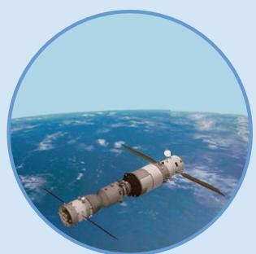

<details>
<summary>natural_image</summary>

Satellite in orbit above Earth, showing continents and cloud cover (no text or symbols visible)
</details>

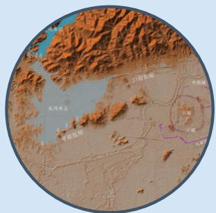

<details>
<summary>text_image</summary>

山麓地貌
外廓地
台湾
平原地形
13
4.3
平原地形
台湾
平原
</details>

# 第四章 指数函数与对数函数 …… 103

4.1 指数…… 104  
4.2 指数函数…… 111

阅读与思考 放射性物质的衰减…… 115

信息技术应用 探究指数函数的性质…… 120

4.3 对数…… 122

阅读与思考 对数的发明…… 128

4.4 对数函数…… 130

探究与发现 互为反函数的两个函数图象间的关系 … 135

4.5 函数的应用（二） 142

阅读与思考 中外历史上的方程求解…… 147

文献阅读与数学写作\* 对数概念的形成与发展 …… 157

小结 158

复习参考题 4 …… 159

# 数学建模 建立函数模型解决实际问题 …… 162

# 第五章 三角函数 …… 167

5.1 任意角和弧度制…… 168  
5.2 三角函数的概念…… 177

阅读与思考 三角学与天文学…… 186

5.3 诱导公式…… 188  
5.4 三角函数的图象与性质…… 196

探究与发现 函数 $y = A\sin (\omega x + \varphi)$ 及

函数 $y = A\cos (\omega x + \varphi)$ 的周期…… 203

探究与发现 利用单位圆的性质研究正弦函数、

余弦函数的性质…… 208

5.5 三角恒等变换…… 215  
信息技术应用 利用信息技术制作三角函数表…… 224  
5.6 函数 $y=A\sin(\omega x+\varphi)$ 231  
5.7 三角函数的应用…… 242

阅读与思考 振幅、周期、频率、相位…… 250

小结 251

复习参考题 5 …… 253

# 部分中英文词汇索引…… 258


<details>
<summary>text_image</summary>

上伏月
C月
星
满月
乙月
下伏月
镜面月
新月
蝶面月
太阳
太阳
光
</details>

# 第一章 集合与常用逻辑用语

我们知道，方程 $x^{2} = 2$ 在有理数范围内无解，但在实数范围内有解。在平面内，所有到定点的距离等于定长的点组成一个圆；而在空间中，所有到定点的距离等于定长的点组成一个球面。因此，明确研究对象、确定研究范围是研究数学问题的基础。为了简洁、准确地表述数学对象及研究范围，我们需要使用集合的语言和工具。事实上，集合的知识是现代数学的基础，也是高中数学的基础，在后面各章的学习中将越来越多地应用它。在本章，我们将学习集合的概念、基本关系和运算，学习用集合语言刻画一类事物的方法。

逻辑用语是数学语言的重要组成部分，是数学表达和交流的工具。学习一些常用逻辑用语，可以使我们正确理解数学概念、合理论证数学结论、准确表达数学内容。逻辑用语也是日常交往、学习和工作中必不可少的工具，正确使用逻辑用语是每一位公民应具备的基本素养。本章我们将通过常用逻辑用语的学习，理解使用逻辑用语表达数学对象、进行数学推理的方法，体会逻辑用语在表述数学内容和论证数学结论中的作用，学会使用集合和逻辑语言表达和交流数学问题，提升交流的逻辑性和准确性。


<details>
<summary>text_image</summary>

人民教育出版社
</details>

## 1.1 集合的概念

在小学和初中，我们已经接触过一些集合。例如，自然数的集合，同一平面内到一个定点的距离等于定长的点的集合（即圆）等。为了更有效地使用集合语言，我们需要进一步了解集合的有关知识。下面先从集合的含义开始。

看下面的例子:
(1) 1\~10 之间的所有偶数；  
(2) 立德中学今年入学的全体高一学生；  
(3) 所有的正方形;  
（4）到直线 l 的距离等于定长 d 的所有点；  
(5) 方程 $x^{2}-3x+2=0$ 的所有实数根；  
(6) 地球上的四大洋.

例（1）中，我们把 $1 \sim 10$ 之间的每一个偶数作为元素，这些元素的全体就是一个集合；同样地，例（2）中，把立德中学今年入学的每一位高一学生作为元素，这些元素的全体也是一个集合.

> [!think] 思考
上面的例（3）到例（6）也都能组成集合吗？它们的元素分别是什么？

一般地，我们把研究对象统称为元素（element），把一些元素组成的总体叫做集合（set）（简称为集）.

给定的集合，它的元素必须是确定的。也就是说，给定一个集合，那么一个元素在或不在这个集合中就确定了。例如，“1～10 之间的所有偶数”构成一个集合，2，4，6，8，10 是这个集合的元素，1，3，5，7，9，…不是它的元素；“较小的数”不能构成集合，因为组成它的元素是不确定的。

一个给定集合中的元素是互不相同的．也就是说，集合中的元素是不重复出现的.

只要构成两个集合的元素是一样的，我们就称这两个集合是相等的.

我们通常用大写拉丁字母 A, B, C, … 表示集合，用小写拉丁字母 a, b, c, … 表示集合中的元素.
如果 a 是集合 A 的元素，就说 a 属于（belong to）集合 A，记作 $a \in A$ ；如果 a 不是

集合 A 中的元素，就说 a 不属于集合 A，记作 $a \notin A$ .

例如，若用 A 表示前面例（1）中 “1～10 之间的所有偶数” 组成的集合，则有 $4 \in A, 3 \notin A$ ，等等.

<table><tr><td>数学中一些常用的数集及其记法</td></tr><tr><td>全体非负整数组成的集合称为非负整数集(或自然数集),记作N;全体正整数组成的集合称为正整数集,记作 $N^*$ 或 $N_+$ ;全体整数组成的集合称为整数集,记作Z;全体有理数组成的集合称为有理数集,记作Q;全体实数组成的集合称为实数集,记作R.</td></tr></table>

从上面的例子看到，我们可以用自然语言描述一个集合。除此之外，还可以用什么方式表示集合呢？

# 列举法

“地球上的四大洋”组成的集合可以表示为 $\{太平洋, 大西洋, 印度洋, 北冰洋\}$ ; “方程 $x^{2}-3x+2=0$ 的所有实数根” 组成的集合可以表示为 $\{1, 2\}$ .

像这样把集合的所有元素一一列举出来，并用花括号“{ }”括起来表示集合的方法叫做列举法.

> [!example]- 例 1 用列举法表示下列集合:
(1) 小于 10 的所有自然数组成的集合;  
(2) 方程 $x^{2}=x$ 的所有实数根组成的集合.
解：（1）设小于 10 的所有自然数组成的集合为 A，那么
$A = \{0, 1, 2, 3, 4, 5, 6, 7, 8, 9 \}.$
(2) 设方程 $x^{2} = x$ 的所有实数根组成的集合为 $B$ ，那么
$B = \{0, 1 \}.$
由于元素完全相同的两个集合相等，而与列举的顺序无关，因此一个集合可以有不同的列举方法。例如，例1（1）的集合还可以写成
$A = \{9, 8, 7, 6, 5, 4, 3, 2, 1, 0 \}$

等.

> [!think] 思考
(1) 你能用自然语言描述集合 $\{0, 3, 6, 9\}$ 吗?  
(2) 你能用列举法表示不等式 x-7<3 的解集吗?

# 描述法

不等式 $x - 7 < 3$ 的解是 $x < 10$ ，因为满足 $x < 10$ 的实数有无数个，所以 $x - 7 < 3$ 的解集无法用列举法表示。但是，我们可以利用解集中元素的共同特征，即： $x$ 是实数，且 $x < 10$ ，把解集表示为
$\{x \in \mathbf {R} \mid x <   1 0 \}.$
又如，整数集 $\mathbf{Z}$ 可以分为奇数集和偶数集。对于每一个 $x \in \mathbf{Z}$ ，如果它能表示为 $x = 2k + 1 (k \in \mathbf{Z})$ 的形式，那么它是一个奇数；反之，如果 $x$ 是一个奇数，那么它能表示为 $x = 2k + 1 (k \in \mathbf{Z})$ 的形式。所以， $x = 2k + 1 (k \in \mathbf{Z})$ 是所有奇数的一个共同特征，于是奇数集可以表示为
$\{x \in \mathbf {Z} | x = 2 k + 1, k \in \mathbf {Z} \}.$

一般地，设 $A$ 是一个集合，我们把集合 $A$ 中所有具有共同特征 $P(x)$ 的元素 $x$ 所组成的集合表示为
$\{x \in A | P (x) \},$

这种表示集合的方法称为描述法.

例如，实数集 $\mathbf{R}$ 中，有限小数和无限循环小数都具有 $\frac{q}{p}$ （ $p, q \in \mathbf{Z}, p \neq 0$ ）的形式，这些数组成有理数集，我们将它表示为

你能用这样的方法表示偶数集吗？

有时也用冒号或分号代替竖线，写成
$\{x \in A: P (x) \}$

或
$\{x \in A; P (x) \}.$
$\mathbf {Q} = \{x \in \mathbf {R} | x = \frac {q}{p}, p, q \in \mathbf {Z}, p \neq 0 \}.$

其中， $x=\frac{q}{p}(p,\quad q\in\mathbf{Z},\quad p\neq0)$ 就是所有有理数具有的共同特征.
显然，对于任何 $y \in \{x \in A \mid P(x)\}$ ，都有 $y \in A$ ，且 $P(y)$ 成立.

> [!example]- 例 2 试分别用描述法和列举法表示下列集合:
(1) 方程 $x^{2}-2=0$ 的所有实数根组成的集合 A;  
(2) 由大于 10 且小于 20 的所有整数组成的集合 B.
解：（1）设 $x \in A$ ，则 x 是一个实数，且 $x^{2}-2=0$ 。因此，用描述法表示为
$A = \{x \in \mathbf {R} | x ^ {2} - 2 = 0 \}.$

方程 $x^{2}-2=0$ 有两个实数根 $\sqrt{2}$ ， $-\sqrt{2}$ ，因此，用列举法表示为
$A = \{\sqrt {2}, - \sqrt {2} \}.$
（2）设 $x \in B$ ，则 $x$ 是一个整数，即 $x \in \mathbf{Z}$ ，且 $10 < x < 20$ 。因此，用描述法表示为
$B = \{x \in \mathbf {Z} | 1 0 <   x <   2 0 \}.$

大于 10 且小于 20 的整数有 11，12，13，14，15，16，17，18，19，因此，用列举法表示为
$B = \{1 1, 1 2, 1 3, 1 4, 1 5, 1 6, 1 7, 1 8, 1 9 \}.$

我们约定，如果从上下文的关系看， $x \in R$ ， $x \in Z$ 是明确的，那么 $x \in R$ ， $x \in Z$ 可以省略，只写其元素 x。例如，集合 $D = \{x \in R | x < 10\}$ 也可表示为 $D = \{x | x < 10\}$ ；集合 $E = \{x \in Z | x = 2k + 1, k \in Z\}$ 也可表示为 $E = \{x | x = 2k + 1, k \in Z\}$ 。

> [!think] 思考
举例说明，用自然语言、列举法和描述法表示集合时各自的特点.

#### 练习

1. 判断下列元素的全体是否组成集合，并说明理由：
(1) A, B 是平面 $\alpha$ 内的定点，在平面 $\alpha$ 内与 A, B 等距离的点；  
(2) 高中学生中的游泳能手.

2. 用符号 “∈” 或 “∉” 填空：

0 \_\_\_\_ N; -3 \_\_\_\_ N; 0.5 \_\_\_\_ Z; $\sqrt{2}$ \_\_\_\_ Z; $\frac{1}{3}$ \_\_\_\_ Q; $\pi$ \_\_\_\_ R.

3. 用适当的方法表示下列集合：
(1) 由方程 $x^{2}-9=0$ 的所有实数根组成的集合；  
(2) 一次函数 $y = x + 3$ 与 $y = -2x + 6$ 图象的交点组成的集合；  
(3) 不等式 4x-5<3 的解集.

## 习题1.1

### 复习巩固

1. 用符号 “∈” 或 “∉” 填空：
（1）设 $A$ 为所有亚洲国家组成的集合，则  
中国\_\_\_\_A，美国\_\_\_\_A，印度\_\_\_\_A，英国\_\_\_\_A；  
(2) 若 $A=\{x \mid x^{2}=x\}$ ，则 $-1$ \_\_\_\_ A；  
(3) 若 $B=\{x \mid x^{2}+x-6=0\}$ ，则 3\_B；  
(4) 若 $C=\{x\in N \mid 1\leqslant x\leqslant10\}$ ，则 8 \_\_\_\_ C，9.1 \_\_\_\_ C.

2. 用列举法表示下列集合：
(1) 大于 1 且小于 6 的整数;  
(2) $A = \{x\mid (x - 1)(x + 2) = 0\}$   
(3) $B = \{x\in \mathbf{Z}| - 3 <   2x - 1 <   3\} .$

### 综合运用

3. 把下列集合用另一种方法表示出来：
(1) $\{2, 4, 6, 8, 10\}$ ;   
（2）由 1，2，3 这三个数字抽出一部分或全部数字（没有重复）所组成的一切自然数；  
(3) $\{x\in \mathbf{N}|3 <   x <   7\}$   
(4) 中国古代四大发明.

4. 用适当的方法表示下列集合：
(1) 二次函数 $y = x^{2} - 4$ 的函数值组成的集合；  
(2) 反比例函数 $y=\frac{2}{x}$ 的自变量的取值组成的集合；  
(3) 不等式 $3x \geqslant 4 - 2x$ 的解集.

### 拓广探索

5. 集合论是德国数学家康托尔于 19 世纪末创立的。当时，康托尔在解决涉及无限量研究的数学问题时，越过“数集”限制，提出了一般性的“集合”概念。关于集合论，希尔伯特赞誉其为“数学思想的惊人的产物，在纯粹理性的范畴中人类活动的最美的表现之一”，罗素描述其为“可能是这个时代所能夸耀的最伟大的工作”。请你查阅相关资料，用简短的报告阐述你对这些评价的认识。

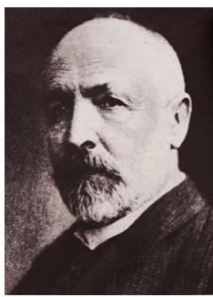

<details>
<summary>natural_image</summary>

Portrait of a bearded man in formal attire (no visible text or symbols)
</details>

康托尔（Georg Cantor, 1845—1918）

## 1.2 集合间的基本关系

我们知道，两个实数之间有相等关系、大小关系，如 $5 = 5$ ， $5 < 7$ ， $5 > 3$ ，等等．两个集合之间是否也有类似的关系呢？

> [!observe] 观察
观察下面几个例子，类比实数之间的相等关系、大小关系，你能发现下面两个集合之间的关系吗？
(1) $A = \{1, 2, 3\}$ , $B = \{1, 2, 3, 4, 5\}$ ;   
（2）C 为立德中学高一（2）班全体女生组成的集合，D 为这个班全体学生组成的集合；  
(3) $E = \{x \mid x \text{ 是有两条边相等的三角形}\}$ , $F = \{x \mid x \text{ 是等腰三角形}\}$ .

可以发现，在（1）中，集合 $A$ 的任何一个元素都是集合 $B$ 的元素。这时我们说集合 $A$ 包含于集合 $B$ ，或集合 $B$ 包含集合 $A$ 。（2）中的集合 $C$ 与集合 $D$ 也有这种关系。

一般地，对于两个集合 A, B，如果集合 A 中任意一个元素都是集合 B 中的元素，就称集合 A 为集合 B 的子集 (subset)，记作
$A \subseteq B (\text {或} B \supseteq A),$

读作 “A 包含于 B”（或 “B 包含 A”）.

在数学中，我们经常用平面上封闭曲线的内部代表集合，这种图称为Venn图．这样，上述集合 $A$ 与集合 $B$ 的包含关系，可以用图1.2-1表示.

在（3）中，由于“两条边相等的三角形”是等腰三角形，因此，集合 $E$ ， $F$ 都是由所有等腰三角形组成的集合.即集合 $E$ 中任何一个元素都是集合 $F$ 中的元素，同时，集合 $F$ 中任何一个元素也都是集合 $E$ 中的元素．这样，集合 $E$ 的元素与集合 $F$ 的元素是一样的.

一般地，如果集合 A 的任何一个元素都是集合 B 的元素，同时集合 B 的任何一个元素都是集合 A 的元素，那么集合 A 与集合 B 相等，记作 A=B。

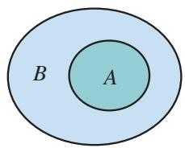

<details>
<summary>text_image</summary>

B
A
</details>

图1.2-1

请你举出几个具有包含关系、相等关系的集合实例.

也就是说，若 $A \subseteq B$ ，且 $B \subseteq A$ ，则 $A = B$ .
如果集合 $A \subseteq B$ ，但存在元素 $x \in B$ ，且 $x \notin A$ ，就称集合 $A$ 是集合 $B$ 的真子集（proper subset），记作
$A \subsetneqq B (\text {或} B \supsetneqq A),$

读作 “A 真包含于 B”（或 “B 真包含 A”）.

例如，在（1）中， $A \subseteq B$ ，但 $4 \in B$ ，且 $4 \notin A$ ，所以集合 A 是集合 B 的真子集.

我们知道，方程 $x^{2} + 1 = 0$ 没有实数根，所以方程 $x^{2} + 1 = 0$ 的实数根组成的集合中没有元素.

一般地，我们把不含任何元素的集合叫做空集（empty set），记为 $\varnothing$ ，并规定：空集是任何集合的子集.

与实数中的结论“若 $a \geqslant b$ ，且 $b \geqslant a$ ，则 $a = b$ ”相类比，你有什么体会？

你能举出几个空集的例子吗？

> [!think] 思考
包含关系 $\{a\}\subseteq A$ 与属于关系 $a\in A$ 有什么区别？试结合实例作出解释.
由上述集合之间的基本关系，可以得到下列结论：
(1) 任何一个集合是它本身的子集，即
$A \subseteq A;$
(2) 对于集合 A, B, C，如果 $A \subseteq B$ ，且 $B \subseteq C$ ，那么 $A \subseteq C$ .

> [!example]- 例1 写出集合 $\{a, b\}$ 的所有子集，并指出哪些是它的真子集.
解：集合 $\{a, b\}$ 的所有子集为 $\varnothing, \{a\}, \{b\}, \{a, b\}$ . 真子集为 $\varnothing, \{a\}, \{b\}$ .

> [!example]- 例2 判断下列各题中集合 $A$ 是否为集合 $B$ 的子集，并说明理由：
(1) $A = \{1, 2, 3\}$ , $B = \{x \mid x$ 是8的约数 $\}$ ;  
(2) $A = \{x\mid x$ 是长方形}， $B = \{x\mid x$ 是两条对角线相等的平行四边形}.
解：（1）因为 3 不是 8 的约数，所以集合 A 不是集合 B 的子集.
（2）因为若 $x$ 是长方形，则 $x$ 一定是两条对角线相等的平行四边形，所以集合 $A$ 是集合 $B$ 的子集.

#### 练习

1. 写出集合 $\{a, b, c\}$ 的所有子集.  
2. 用适当的符号填空：
(1) $a$ \_\_\_\_ $\{a, b, c\}$ ;
(2) 0 $\underline{\quad}$ {x | x $^{2}$ =0};
(3) $\varnothing$ $\{x\in \mathbf{R}|x^2 +1 = 0\}$
(4) $\{0, 1\}$ N;
(5) $\{0\}$ \_\_\_\_ $\{x \mid x^2 = x\}$ ;
(6) $\{2, 1\}$ \_\_\_\_ $\{x \mid x^2 - 3x + 2 = 0\}$ .

3. 判断下列两个集合之间的关系：
(1) $A = \{x\mid x <   0\} ,B = \{x\mid x <   1\} ;$   
(2) $A = \{x\mid x = 3k,k\in \mathbf{N}\} ,B = \{x\mid x = 6z,z\in \mathbf{N}\} ;$   
(3) $A = \{x\in \mathbf{N}_{+}\mid x$ 是4与10的公倍数}， $B = \{x\mid x = 20m,m\in \mathbf{N}_{+}\}$

## 习题1.2

### 复习巩固

1. 选用适当的符号填空：
(1) 若集合 $A=\{x\mid2x-3<3x\}$ ， $B=\{x\mid x\geqslant2\}$ ，则
$- 4 \_ B, - 3 \_ A, \{2 \} \_ B, B \_ A;$
(2) 若集合 $A = \{x \mid x^2 - 1 = 0\}$ ，则
$1 \_ A, \{- 1 \} \_ A, \varnothing \_ A, \{1, - 1 \} \_ A;$
(3) $\{x \mid x \text{ 是菱形}\} \_\_ \{x \mid x \text{ 是平行四边形}\}$ ;
$\{x \mid x \text{ 是等腰三角形}\}$ \_\_\_\_ $\{x \mid x \text{ 是等边三角形}\}$ .

2. 指出下列各集合之间的关系，并用Venn图表示：
$A = \{x\mid x$ 是四边形}， $B = \{x\mid x$ 是平行四边形}， $C = \{x\mid x$ 是矩形}， $D = \{x\mid x$ 是正方形}.

### 综合运用

3. 举出下列各集合的一个子集：
(1) $A = \{x \mid x$ 是立德中学的学生\};
(2) $B = \{x\mid x$ 是三角形};
(3) $C = \{0\}$ ;
(4) $D = \{x\in \mathbf{Z}|3 <   x <   30\} .$

4. 在平面直角坐标系中，集合 $C = \{(x, y) | y = x\}$ 表示直线 $y = x$ ，从这个角度看，集合 $D = \left\{ (x, y) \mid \left\{ \begin{array}{l} 2x - y = 1 \\ x + 4y = 5 \end{array} \right\} \text{表示什么？集合 } C, D \text{ 之间有什么关系？} \right.$

### 拓广探索

5.（1）设 $a, b \in \mathbf{R}$ ， $P = \{1, a\}$ ， $Q = \{-1, -b\}$ ，若 $P = Q$ ，求 $a - b$ 的值；
(2) 已知集合 $A = \{x \mid 0 < x < a\}$ , $B = \{x \mid 1 < x < 2\}$ , 若 $B \subseteq A$ , 求实数 $a$ 的取值范围.

## 1.3 集合的基本运算

我们知道，实数有加、减、乘、除等运算。集合是否也有类似的运算呢？

并集

> [!observe] 观察
观察下面的集合，类比实数的加法运算，你能说出集合 $C$ 与集合 $A, B$ 之间的关系吗？
(1) $A = \{1, 3, 5\}$ , $B = \{2, 4, 6\}$ , $C = \{1, 2, 3, 4, 5, 6\}$ ;   
(2) $A = \{x\mid x$ 是有理数}， $B = \{x\mid x$ 是无理数}， $C = \{x\mid x$ 是实数}.

在上述两个问题中，集合 A，B 与集合 C 之间都具有这样一种关系：集合 C 是由所有属于集合 A 或属于集合 B 的元素组成的.

一般地，由所有属于集合 A 或属于集合 B 的元素组成的集合，称为集合 A 与 B 的并集（union set），记作 $A \cup B$ （读作 “A 并 B”），即
$A \bigcup B = \{x   |   x \in A  ,   \text {或}   x \in B \}  ,$

可用 Venn 图（图 1.3-1）表示.

这样，在问题（1）（2）中，集合 $A$ 与 $B$ 的并集是 $C$ ，即
$A \bigcup B = C.$

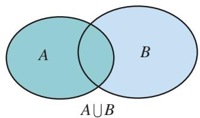

<details>
<summary>text_image</summary>

A
B
A ∪ B
</details>

图1.3-1

> [!example]- 例 1 设 $A=\{4, 5, 6, 8\}$ ， $B=\{3, 5, 7, 8\}$ ，求 $A \cup B$ .
解： $A \cup B = \{4, 5, 6, 8\} \cup \{3, 5, 7, 8\}$
$= \{3, 4, 5, 6, 7, 8 \}.$

> [!example]- 例 2 设集合 $A=\{x \mid -1 < x < 2\}$ ，集合 $B=\{x \mid 1 < x < 3\}$ ，求 $A \cup B$ .
解： $A \cup B = \{x \mid -1 < x < 2\} \cup \{x \mid 1 < x < 3\}$
$= \{x \mid - 1 <   x <   3 \}.$

在求两个集合的并集时，它们的公共元素在并集中只能出现一次。如元素5，8.

如图 1.3-2，还可以利用数轴直观表示例 2 中求并集 $A \cup B$ 的过程.

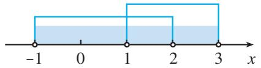

<details>
<summary>text_image</summary>

-1
0
1
2
3
x
</details>

图1.3-2

> [!think] 思考
下列关系式成立吗？
(1) $A \cup A = A$ ; (2) $A \cup \varnothing = A$ .

交集

> [!think] 思考
观察下面的集合，集合 A，B 与集合 C 之间有什么关系？
(1) $A = \{2, 4, 6, 8, 10\}$ , $B = \{3, 5, 8, 12\}$ , $C = \{8\}$ ;   
(2) $A = \{x \mid x$ 是立德中学今年在校的女同学 $\}$ , $B = \{x \mid x$ 是立德中学今年在校的高一年级同学 $\}$ , $C = \{x \mid x$ 是立德中学今年在校的高一年级女同学 $\}$ .

在上述两个问题中，集合 $C$ 是由所有既属于集合 $A$ 又属于集合 $B$ 的元素组成的.

一般地，由所有属于集合 A 且属于集合 B 的元素组成的集合，称为集合 A 与 B 的交集（intersection set），记作 $A \cap B$ （读作 “A 交 B”），即
$A \cap B = \{x \mid x \in A, \text {且} x \in B \},$

可用 Venn 图（图 1.3-3）表示.

这样，在上述问题(1)(2)中， $A \cap B = C$ .

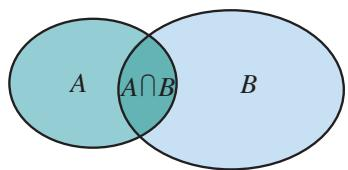

<details>
<summary>text_image</summary>

A
A∩B
B
</details>

图1.3-3

> [!example]- 例 3 立德中学开运动会，设
$A=\{x\mid x$ 是立德中学高一年级参加百米赛跑的同学\},
$B=\{x \mid x \text{ 是立德中学高一年级参加跳高比赛的同学}\}$ ,

求 $A \cap B$ .
解： $A \cap B$ 就是立德中学高一年级中那些既参加百米赛跑又参加跳高比赛的同学组成的集合．所以，
$A \cap B = \{ x \mid x  是立德中学高一年级既参加百米赛跑又参加跳高比赛的同学 \} .$

> [!example]- 例4设平面内直线 $l_{1}$ 上点的集合为 $L_{1}$ ，直线 $l_{2}$ 上点的集合为 $L_{2}$ ，试用集合的运算表示 $l_{1}, l_{2}$ 的位置关系.
解：平面内直线 $l_{1}$ ， $l_{2}$ 可能有三种位置关系，即相交于一点、平行或重合.
(1) 直线 $l_{1}$ ， $l_{2}$ 相交于一点 P 可表示为
$L _ {1} \cap L _ {2} = \{\text {点} P \};$
(2) 直线 $l_{1}$ ， $l_{2}$ 平行可表示为
$L _ {1} \cap L _ {2} = \varnothing ;$
(3) 直线 $l_{1}$ ， $l_{2}$ 重合可表示为
$L _ {1} \cap L _ {2} = L _ {1} = L _ {2}.$

> [!think] 思考
下列关系式成立吗？
(1) $A \cap A = A$ ; (2) $A \cap \varnothing = \varnothing$ .

#### 练习

1. 设 $A = \{3, 5, 6, 8\}$ , $B = \{4, 5, 7, 8\}$ , 求 $A \cap B$ , $A \cup B$ .   
2. 设 $A = \{x \mid x^2 - 4x - 5 = 0\}$ , $B = \{x \mid x^2 = 1\}$ , 求 $A \cup B, A \cap B$ .   
3. 设 $A = \{x \mid x$ 是等腰三角形 $\}$ ， $B = \{x \mid x$ 是直角三角形 $\}$ ，求 $A \cap B$ ， $A \cup B$ .  
4. 设 $A = \{x \mid x$ 是幸福农场的汽车 $\}$ ， $B = \{x \mid x$ 是幸福农场的货车 $\}$ ，求 $A \cup B$ .

# 补集

在研究问题时，我们经常需要确定研究对象的范围.

例如，从小学到初中，数的研究范围逐步地由自然数到正分数，再到有理数，引进无理数后，数的研究范围扩充到实数。在高中阶段，数的研究范围将进一步扩充。

在不同范围研究同一个问题，可能有不同的结果。例如方程 $(x - 2)(x^2 -3) = 0$ 的解集，在有理数范围内只有一个解2，即
$\{x \in \mathbf {Q} | (x - 2) \left(x ^ {2} - 3\right) = 0 \} = \{2 \};$

在实数范围内有三个解： $2, \sqrt{3}, -\sqrt{3}$ ，即
$\{x \in \mathbf {R} | (x - 2) (x ^ {2} - 3) = 0 \} = \{2, \sqrt {3}, - \sqrt {3} \}.$

一般地，如果一个集合含有所研究问题中涉及的所有元素，那么就称这个集合为全集（universal set），通常记作 U.

通常也把给定的集合作为全集.

对于一个集合 A，由全集 U 中不属于集合 A 的所有元素组成的集合称为集合 A 相对于全集 U 的补集（complementary set），简称为集合 A 的补集，记作 $C_{U}A$ ，即
$\complement_ {U} A = \{x   |   x \in U,   \text {且}   x \notin A \},$

可用 Venn 图（图 1.3-4）表示.

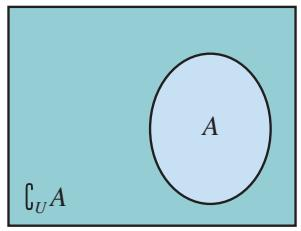

<details>
<summary>text_image</summary>

U A
A
</details>

图1.3-4

> [!example]- 例 5 设 $U=\{x \mid x$ 是小于 9 的正整数 $\}$ ， $A=\{1,2,3\}$ ， $B=\{3,4,5,6\}$ ，求 $C_{U}A$ ， $C_{U}B$ .
解：根据题意可知， $U=\{1,2,3,4,5,6,7,8\}$ ，所以
$\complement_ {U} A = \{4, 5, 6, 7, 8 \},$
$\complement_ {U} B = \{1, 2, 7, 8 \}.$

> [!example]- 例 6 设全集 $U=\{x \mid x$ 是三角形 $\}$ ， $A=\{x \mid x$ 是锐角三角形 $\}$ ， $B=\{x \mid x$ 是钝角三角形 $\}$ ，求 $A \cap B$ ， $\complement_{U}(A \cup B)$ .
解：根据三角形的分类可知
$A \cap B = \varnothing ,$
$A \cup B = \{x \mid x \text{ 是锐角三角形或钝角三角形}\}$ ,
$\complement_{U}(A\cup B)=\{x\mid x\text{是直角三角形}\}.$

#### 练习

1. 已知 $U = \{1, 2, 3, 4, 5, 6, 7\}$ , $A = \{2, 4, 5\}$ , $B = \{1, 3, 5, 7\}$ , 求 $A \cap (\complement_U B)$ , $(\complement_U A) \cap (\complement_U B)$ .  
2. 设 $S = \{x \mid x$ 是平行四边形或梯形\}, $A = \{x \mid x$ 是平行四边形\}, $B = \{x \mid x$ 是菱形\}, $C = \{x \mid x$ 是矩形\}, 求 $B \cap C, \complement_A B, \complement_S A$ .  
3. 图中 $U$ 是全集， $A$ ， $B$ 是 $U$ 的两个子集，用阴影表示：
(1) $(\complement_U A) \cap (\complement_U B)$ ; (2) $(\complement_U A) \cup (\complement_U B)$ .

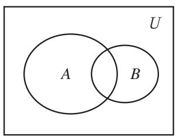

<details>
<summary>text_image</summary>

U
A
B
</details>
(1)


<details>
<summary>text_image</summary>

U
A
B
</details>
(2)   
(第3题)

# 习题 1.3

### 复习巩固

1. 集合 $A = \{x \mid 2 \leqslant x < 4\}$ , $B = \{x \mid 3x - 7 \geqslant 8 - 2x\}$ , 求 $A \cup B, A \cap B$ .  
2. 设 $A = \{x \mid x$ 是小于9的正整数\}, $B = \{1, 2, 3\}$ , $C = \{3, 4, 5, 6\}$ . 求 $A \cap B$ , $A \cap C$ , $A \cap (B \cup C)$ , $A \cup (B \cap C)$ .  
3. 学校开运动会，设 $A = \{x \mid x$ 是参加 $100 \mathrm{~m}$ 跑的同学\}， $B = \{x \mid x$ 是参加 $200 \mathrm{~m}$ 跑的同学\}， $C = \{x \mid x$ 是参加 $400 \mathrm{~m}$ 跑的同学\}，学校规定，每个参加上述比赛的同学最多只能参加两项比赛，请你用集合的运算说明这项规定，并解释以下集合运算的含义：
(1) $A \cup B$ ;
(2) $A \cap C$ .

### 综合运用

4. 已知集合 $A = \{x \mid 3 \leqslant x < 7\}$ ， $B = \{x \mid 2 < x < 10\}$ ，求 $\complement_{\mathbb{R}}(A \cup B), \complement_{\mathbb{R}}(A \cap B), (\complement_{\mathbb{R}} A) \cap B, A \cup (\complement_{\mathbb{R}} B)$ .  
5. 设集合 $A = \{x \mid (x - 3)(x - a) = 0, a \in \mathbf{R}\}$ , $B = \{x \mid (x - 4)(x - 1) = 0\}$ , 求 $A \cup B$ , $A \cap B$ .

### 拓广探索

6. 已知全集 $U = A \cup B = \{x \in \mathbf{N} | 0 \leqslant x \leqslant 10\}$ , $A \cap (\complement_U B) = \{1, 3, 5, 7\}$ , 试求集合 $B$ .


## 阅读与思考

### 集合中元素的个数

在研究集合时，经常遇到有关集合中元素的个数问题。我们把含有限个元素的集合 A 叫做有限集，用 card(A) 来表示有限集合 A 中元素的个数。例如， $A=\{a,b,c\}$ ，则 $\text{card}(A)=3$ 。

card 是英文 cardinal
(基数) 的缩写.

看一个问题. 某超市进了两次货, 第一次进的货是圆珠笔、钢笔、橡皮、笔记本、方便面、汽水共6种, 第二次进的货是圆珠笔、铅笔、火腿肠、方便面共4种, 两次一共进了几种货?

回答两次一共进了 $10(= 6 + 4)$ 种，显然是不对的。让我们试着从集合的角度考虑这个问题。

用集合 $A$ 表示第一次进货的品种，用集合 $B$ 表示第二次进货的品种，就有
$A = \{$ 圆珠笔，钢笔，橡皮，笔记本，方便面，汽水 $\}$
$B=\{圆珠笔，铅笔，火腿肠，方便面\}.$

这里 $\operatorname{card}(A) = 6$ ， $\operatorname{card}(B) = 4$ 。求两次一共进了几种货，这个问题指的是求 $\operatorname{card}(A \cup B)$ 。这个例子中，两次进的货里有相同的品种，相同的品种数实际就是 $\operatorname{card}(A \cap B)$ 。 $\operatorname{card}(A)$ ， $\operatorname{card}(B)$ ， $\operatorname{card}(A \cup B)$ ， $\operatorname{card}(A \cap B)$ 之间有什么关系呢？

可以算出
$\operatorname{card} (A \bigcup B) = 8,$
$\operatorname{card} (A \cap B) = 2.$

一般地，对任意两个有限集合 $A, B$ ，有
$\operatorname{card} (A \bigcup B) = \operatorname{card} (A) + \operatorname{card} (B) - \operatorname{card} (A \cap B).$

再来看一个问题。学校先举办了一次田径运动会，某班有8名同学参赛，又举办了一次球类运动会，这个班有12名同学参赛，两次运动会都参赛的有3人。两次运动会中，这个班共有多少名同学参赛？

用集合 $A$ 表示田径运动会参赛的学生，用集合 $B$ 表示球类运动会参赛的学生，就有
$A = \{x \mid x \text {是田径运动会参赛的学生} \},$
$B = \{x \mid x \text {是球类运动会参赛的学生} \},$

那么
$A \cap B = \{x \mid x \text {是两次运动会都参赛的学生} \},$
$A \bigcup B = \{x \mid x \text {是所有参赛的学生} \},$
$\operatorname{card} (A \bigcup B) = \operatorname{card} (A) + \operatorname{card} (B) - \operatorname{card} (A \cap B)$
$= 8 + 1 2 - 3 = 1 7.$
所以，在两次运动会中，这个班共有17名同学参赛.

我们也可以用 Venn 图来求解.

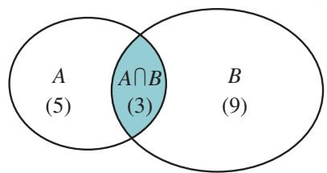

<details>
<summary>other</summary>

| Set | Count |
|---|---|
| A only | 5 |
| B only | 9 |
| A ∩ B only | 3 |
</details>

在上图中相应于 $A \cap B$ 的区域里先填上 $3^{①}(\text{card}(A \cap B)=3)$ ，再在 A 中不包括 $A \cap B$ 的区域里填上 $5(\text{card}(A)-\text{card}(A \cap B)=5)$ ，在 B 中不包括 $A \cap B$ 的区域里填上 $9(\text{card}(B)-\text{card}(A \cap B)=9)$ 。最后把这三个数加起来得 17，这就是 $\text{card}(A \cup B)$ 。

这种图解法对于解比较复杂的问题（例如涉及三个①这里的3是表示元素的个数，而不是元素。图中我们特别加上括号，另外两个数5，9也一样。

以上集合的并、交的问题）更能显示出它的优越性。对于有限集合 $A, B, C$ ，你能发现 $\operatorname{card}(A \cup B \cup C)$ ， $\operatorname{card}(A)$ ， $\operatorname{card}(B)$ ， $\operatorname{card}(C)$ ， $\operatorname{card}(A \cap B)$ ， $\operatorname{card}(B \cap C)$ ， $\operatorname{card}(A \cap C)$ ， $\operatorname{card}(A \cap B \cap C)$ 之间的关系吗？通过一个具体的例子，算一算。

有限集合中元素的个数，我们可以一一数出来。而对于元素个数无限的集合，如
$A = \{1, 2, 3, 4, \dots , n, \dots \},$
$B = \{2, 4, 6, 8, \dots , 2 n, \dots \},$

我们无法数出集合中元素的个数，但可以比较这两个集合中元素个数的多少。你能设计一种比较这两个集合中元素个数多少的方法吗？

## 1.4 充分条件与必要条件

在初中，我们已经对命题有了初步的认识。一般地，我们把用语言、符号或式子表达的，可以判断真假的陈述句叫做命题。判断为真的语句是真命题，判断为假的语句是假命题。中学数学中的许多命题可以写成“若 $p$ ，则 $q$ ”“如果 $p$ ，那么 $q$ ”等形式。其中 $p$ 称为命题的条件， $q$ 称为命题的结论。本节主要讨论这种形式的命题。下面我们将进一步考察“若 $p$ ，则 $q$ ”形式的命题中 $p$ 和 $q$ 的关系，学习数学中的三个常用的逻辑用语——充分条件、必要条件和充要条件。

### 1.4.1 充分条件与必要条件

> [!think] 思考
下列 “若 p，则 q” 形式的命题中，哪些是真命题？哪些是假命题？
(1) 若平行四边形的对角线互相垂直, 则这个平行四边形是菱形;  
(2) 若两个三角形的周长相等，则这两个三角形全等；  
(3) 若 $x^{2}-4x+3=0$ ，则 x=1；  
(4) 若平面内两条直线 a 和 b 均垂直于直线 l，则 $a \parallel b$ .

在命题（1）（4）中，由条件 $p$ 通过推理可以得出结论 $q$ ，所以它们是真命题．在命题（2）（3）中，由条件 $p$ 不能得出结论 $q$ ，所以它们是假命题.

一般地，“若 $p$ ，则 $q$ ”为真命题，是指由 $p$ 通过推理可以得出 $q$ 。这时，我们就说，由 $p$ 可以推出 $q$ ，记作
$p \Rightarrow q,$

并且说，p 是 q 的充分条件（sufficient condition），q 是 p 的必要条件 $^{①}$ （necessary condition）.
如果 “若 p，则 q” 为假命题，那么由条件 p 不能推出结论 q，记作 $p \neq q$ 。此时，我们就说 p 不是 q 的充分条件，q 不是 p 的必要条件。

上述命题（1）（4）中的 p 是 q 的充分条件，q 是 p 的必

①此时，如果 $q$ 不成立，则 $p$ 一定不成立。所以， $q$ 对于 $p$ 成立而言是必要的。请举例说明。

要条件，而命题（2）（3）中的 $p$ 不是 $q$ 的充分条件， $q$ 不是 $p$ 的必要条件.

> [!example]- 例 1 下列 “若 p，则 q” 形式的命题中，哪些命题中的 p 是 q 的充分条件？
（1）若四边形的两组对角分别相等，则这个四边形是平行四边形；  
(2) 若两个三角形的三边成比例，则这两个三角形相似；  
（3）若四边形为菱形，则这个四边形的对角线互相垂直；  
(4) 若 $x^{2}=1$ ，则 x=1；  
(5) 若 a=b，则 ac=bc；  
(6) 若 x, y 为无理数，则 xy 为无理数.
解：（1）这是一条平行四边形的判定定理， $p \Rightarrow q$ ，所以 p 是 q 的充分条件.
（2）这是一条相似三角形的判定定理， $p \Rightarrow q$ ，所以 p 是 q 的充分条件.  
（3）这是一条菱形的性质定理， $p \Rightarrow q$ ，所以 p 是 q 的充分条件.  
（4）由于 $(-1)^{2} = 1$ ，但 $-1\neq 1$ ， $p\nRightarrow q$ ，所以 $p$ 不是 $q$ 的充分条件.  
（5）由等式的性质知， $p \Rightarrow q$ ，所以 p 是 q 的充分条件.  
(6) $\sqrt{2}$ 为无理数，但 $\sqrt{2} \times \sqrt{2} = 2$ 为有理数， $p \neq q$ ，所以 $p$ 不是 $q$ 的充分条件.

举反例是判断一个命题是假命题的重要方法.

> [!think] 思考
> [!example]- 例 1 中命题（1）给出了 “四边形是平行四边形” 的一个充分条件，即 “四边形的两组对角分别相等”。这样的充分条件唯一吗？如果不唯一，那么你能再给出几个不同的充分条件吗？
我们说 $p$ 是 $q$ 的充分条件，是指由条件 $p$ 可以推出结论 $q$ ，但这并不意味着只能由这个条件 $p$ 才能推出结论 $q$ ．一般来说，对给定结论 $q$ ，使得 $q$ 成立的条件 $p$ 是不唯一的.例如，我们知道，下列命题均为真命题：

①若四边形的两组对边分别相等，则这个四边形是平行四边形；  
②若四边形的一组对边平行且相等，则这个四边形是平行四边形；  
③若四边形的两条对角线互相平分，则这个四边形是平行四边形.
所以，“四边形的两组对边分别相等”“四边形的一组对边平行且相等”“四边形的两条对角线互相平分”都是“四边形是平行四边形”的充分条件.
事实上，例1中命题（1）及上述命题①②③均是平行四边形的判定定理。所以，平行四边形的每一条判定定理都给出了“四边形是平行四边形”的一个充分条件，即这个条件能充分保证四边形是平行四边形。类似地，平行线的每一条判定定理都给出了“两直线平行”的一个充分条件，例如“内错角相等”这个条件就充分保证了“两条直线平行”。

一般地，数学中的每一条判定定理都给出了相应数学结论成立的一个充分条件.

> [!example]- 例 2 下列 “若 p，则 q” 形式的命题中，哪些命题中的 q 是 p 的必要条件？
（1）若四边形为平行四边形，则这个四边形的两组对角分别相等；  
(2) 若两个三角形相似，则这两个三角形的三边成比例；  
（3）若四边形的对角线互相垂直，则这个四边形是菱形；  
(4) 若 x=1，则 $x^{2}=1$ ;   
(5) 若 ac=bc，则 a=b；  
(6) 若 $xy$ 为无理数，则 $x, y$ 为无理数.
解：（1）这是平行四边形的一条性质定理， $p \Rightarrow q$ ，所以，q 是 p 的必要条件.
（2）这是三角形相似的一条性质定理， $p \Rightarrow q$ ，所以，q 是 p 的必要条件.
（3）如图1.4-1，四边形ABCD的对角线互相垂直，但它不是菱形， $p \neq q$ ，所以， $q$ 不是 $p$ 的必要条件.
（4）显然， $p \Rightarrow q$ ，所以，q 是 p 的必要条件.
（5）由于 $(-1) \times 0 = 1 \times 0$ ，但 $-1 \neq 1$ ， $p \neq q$ ，所以， $q$ 不是 $p$ 的必要条件.
（6）由于 $1 \times \sqrt{2} = \sqrt{2}$ 为无理数，但 $1, \sqrt{2}$ 不全是无理数， $p \neq q$ ，所以， $q$ 不是 $p$ 的必要条件.

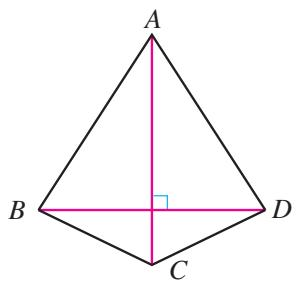

<details>
<summary>text_image</summary>

A
B
C
D
</details>

图1.4-1

一般地，要判断“若 $p$ ，则 $q$ ”形式的命题中 $q$ 是否为 $p$ 的必要条件，只需判断是否有“ $p \Rightarrow q$ ”，即“若 $p$ ，则 $q$ ”是否为真命题.

> [!think] 思考
> [!example]- 例 2 中命题（1）给出了“四边形是平行四边形”的一个必要条件，即“这个四边形的两组对角分别相等”。这样的必要条件是唯一的吗？如果不唯一，你能给出“四边形是平行四边形”的几个其他必要条件吗？
我们说 $q$ 是 $p$ 的必要条件，是指以 $p$ 为条件可以推出结论 $q$ ，但这并不意味着由条件 $p$ 只能推出结论 $q$ 。一般来说，给定条件 $p$ ，由 $p$ 可以推出的结论 $q$ 是不唯一的。例如，下列命题都是真命题：

①若四边形是平行四边形，则这个四边形的两组对边分别相等；  
②若四边形是平行四边形，则这个四边形的一组对边平行且相等；
③若四边形是平行四边形，则这个四边形的两条对角线互相平分.

这表明，“四边形的两组对边分别相等”“四边形的一组对边平行且相等”“四边形的两条对角线互相平分”都是“四边形是平行四边形”的必要条件.

我们知道，例 2 中命题(1)及上述命题①②③均为平行四边形的性质定理。所以，平行四边形的每条性质定理都给出了“四边形是平行四边形”的一个必要条件。类似地，平行线的每条性质定理都给出了“两直线平行”的一个必要条件，例如“同位角相等”是“两直线平行”的必要条件，也就是说，如果同位角不相等，那么就不可能有“两直线平行”。

一般地，数学中的每一条性质定理都给出了相应数学结论成立的一个必要条件.

#### 练习

1. 下列 “若 p，则 q” 形式的命题中，哪些命题中的 p 是 q 的充分条件？
(1) 若平面内点 P 在线段 AB 的垂直平分线上，则 PA = PB；  
(2) 若两个三角形的两边及一边所对的角分别相等，则这两个三角形全等；  
（3）若两个三角形相似，则这两个三角形的面积比等于周长比的平方.

2. 下列 “若 p，则 q” 形式的命题中，哪些命题中的 q 是 p 的必要条件？
（1）若直线 l 与 $\odot O$ 有且仅有一个交点，则 l 为 $\odot O$ 的一条切线；  
(2) 若 x 是无理数，则 $x^{2}$ 也是无理数.

3. 如图，直线 $a$ 与 $b$ 被直线 $l$ 所截，分别得到了 $\angle 1, \angle 2, \angle 3$ 和 $\angle 4$ . 请根据这些信息，写出几个“ $a // b$ ”的充分条件和必要条件.

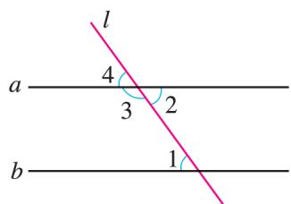

<details>
<summary>text_image</summary>

l
a 4 2
3
b 1
</details>

(第3题)

### 1.4.2 充要条件

> [!think] 思考
下列 “若 p，则 q” 形式的命题中，哪些命题与它们的逆命题都是真命题？
(1) 若两个三角形的两角和其中一角所对的边分别相等, 则这两个三角形全等;  
(2) 若两个三角形全等，则这两个三角形的周长相等；  
(3) 若一元二次方程 $ax^{2}+bx+c=0$ 有两个不相等的实数根，则 ac<0;  
(4) 若 $A \cup B$ 是空集，则 A 与 B 均是空集.

不难发现，上述命题中的命题（1）（4）和它们的逆命题都是真命题；命题（2）是真命题，但它的逆命题是假命题；命题（3）是假命题，但它的逆命题是真命题。
如果 “若 p，则 q” 和它的逆命题 “若 q，则 p” 均是真命题，即既有 $p \Rightarrow q$ ，又有 $q \Rightarrow p$ ，就记作

将命题 “若 p，则 q” 中的条件 p 和结论 q 互换，就得到一个新的命题 “若 q，则 p”，称这个命题为原命题的逆命题.
$p \Longleftrightarrow q.$

此时， $p$ 既是 $q$ 的充分条件，也是 $q$ 的必要条件，我们说 $p$ 是 $q$ 的充分必要条件，简称为充要条件（necessary and sufficient condition）。显然，如果 $p$ 是 $q$ 的充要条件，那么 $q$ 也是 $p$ 的充要条件。

概括地说，如果 $p \Leftrightarrow q$ ，那么 $p$ 与 $q$ 互为充要条件。上述命题（1）（4）中的 $p$ 与 $q$ 互为充要条件。

> [!example]- 例3 下列各题中，哪些 $p$ 是 $q$ 的充要条件？
(1) p：四边形是正方形，q：四边形的对角线互相垂直且平分；  
(2) p：两个三角形相似，q：两个三角形三边成比例；  
(3) $p: xy > 0, q: x > 0, y > 0;$
(4) p: x=1 是一元二次方程 $ax^{2}+bx+c=0$ 的一个根， $q: a+b+c=0 (a\neq0)$ .
解：（1）因为对角线互相垂直且平分的四边形不一定是正方形（为什么），所以 $q \neq p$ ，所以 $p$ 不是 $q$ 的充要条件.
（2）因为 “若 p，则 q” 是相似三角形的性质定理，“若 q，则 p” 是相似三角形的判定定理，所以它们均为真命题，即 $p \Leftrightarrow q$ ，所以 p 是 q 的充要条件.  
（3）因为 $xy > 0$ 时， $x > 0$ ， $y > 0$ 不一定成立（为什么），所以 $p \neq q$ ，所以 $p$ 不是 $q$ 的充要条件.  
（4）因为 “若 p，则 q” 与 “若 q，则 p” 均为真命题，即 $p \Leftrightarrow q$ ，所以 p 是 q 的充要条件.

> [!explore] 探究
通过上面的学习，你能给出“四边形是平行四边形”的充要条件吗？

可以发现，“四边形的两组对角分别相等”“四边形的两组对边分别相等”“四边形的一组对边平行且相等”和“四边形的对角线互相平分”既是“四边形是平行四边形”的充分条件，又是必要条件，所以它们都是“四边形是平行四边形”的充要条件.

另外，我们再看平行四边形的定义：

两组对边分别平行的四边形叫做平行四边形，

它表明 “四边形的两组对边分别平行” 也是 “四边形是平行四边形” 的一个充要条件.

上面的这些充要条件从不同角度刻画了“平行四边形”这个概念，据此我们可以给出平行四边形的其他定义形式。例如：

两组对边分别相等的四边形叫做平行四边形；
对角线互相平分的四边形叫做平行四边形.

类似地，利用 “两个三角形全等” 的充要条件，可以给出 “三角形全等” 的其他定义形式，而且这些定义是相互等价的；同样，利用“两个三角形相似”的充要条件，可以给出“相似三角形”其他定义形式，这些定义也是相互等价的；等等.

> [!example]- 例4 已知： $\odot O$ 的半径为 $r$ ，圆心 $O$ 到直线 $l$ 的距离为 $d$ 。求证： $d = r$ 是直线 $l$ 与 $\odot O$ 相切的充要条件。
分析：设 $p: d = r$ ， $q$ ：直线 $l$ 与 $\odot O$ 相切。要证 $p$ 是 $q$ 的充要条件，只需分别证明充分性（ $p \Rightarrow q$ ）和必要性（ $q \Rightarrow p$ ）即可。
证明：设 $p: d = r, q$ ：直线 $l$ 与 $\odot O$ 相切.
（1）充分性 $(p\Rightarrow q)$ ：如图1.4-2，作 $OP\perp l$ 于点P，则OP=d。若d=r，则点P在 $\odot O$ 上。在直线l上任取一点Q（异于点P），连接OQ。在Rt△OPQ中， $OQ>OP=r$ 。所以，除点P外直线l上的点都在 $\odot O$ 的外部，即直线l与 $\odot O$ 仅有一个公共点P。所以直线l与 $\odot O$ 相切。
（2）必要性 $(q\Rightarrow p)$ ：若直线l与 $\odot O$ 相切，不妨设切点为P，则 $OP\perp l$ 。因此，d=OP=r。

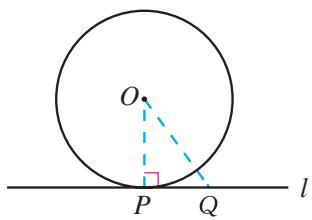

<details>
<summary>text_image</summary>

O
P Q
l
</details>

图1.4-2
由（1）（2）可得， $d = r$ 是直线 $l$ 与 $\odot O$ 相切的充要条件.

#### 练习

1. 下列各题中，哪些 $p$ 是 $q$ 的充要条件？
(1) p：三角形为等腰三角形，q：三角形存在两角相等；
(2) p: $\odot O$ 内两条弦相等，q: $\odot O$ 内两条弦所对的圆周角相等；
(3) $p: A \cap B$ 为空集, $q: A$ 与 $B$ 之一为空集.

2. 分别写出 “两个三角形全等” 和 “两个三角形相似” 的几个充要条件.

3. 证明：如图，AC=BD 是梯形 ABCD 为等腰梯形的充要条件。

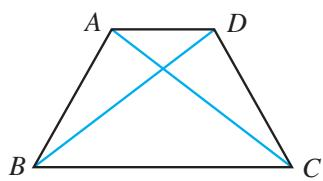

<details>
<summary>text_image</summary>

A
D
B
C
</details>

(第3题)

## 习题1.4

### 复习巩固

1. 举例说明：
(1) p 是 q 的充分不必要条件；  
(2) p 是 q 的必要不充分条件;  
(3) p 是 q 的充要条件.

2. 在下列各题中，判断 $p$ 是 $q$ 的什么条件（请用“充分不必要条件”“必要不充分条件”“充要条件”“既不充分也不必要条件”回答）：
(1) p: 三角形是等腰三角形, q: 三角形是等边三角形;  
(2) p: 一元二次方程 $ax^{2} + bx + c = 0$ 有实数根， $q: b^{2} - 4ac \geqslant 0 (a \neq 0)$ ;  
(3) $p: a \in P \cap Q, q: a \in P$ ;   
(4) $p: a \in P \cup Q, q: a \in P$ ;   
(5) $p: x > y, q: x^2 > y^2$ .

3. 判断下列命题的真假：
（1）点 P 到圆心 O 的距离大于圆的半径是点 P 在 $\odot O$ 外的充要条件；  
(2) 两个三角形的面积相等是这两个三角形全等的充分不必要条件；  
(3) $A \cup B = A$ 是 $B \subseteq A$ 的必要不充分条件；  
(4) x 或 y 为有理数是 xy 为有理数的既不充分也不必要条件.

### 综合运用

4. 已知 $A = \{x \mid x$ 满足条件 $p\}$ ， $B = \{x \mid x$ 满足条件 $q\}$ ，
(1) 如果 $A \subseteq B$ ，那么 p 是 q 的什么条件？  
(2) 如果 $B \subseteq A$ ，那么 p 是 q 的什么条件？  
（3）如果 $A = B$ ，那么 $\pmb{p}$ 是 $\pmb{q}$ 的什么条件？

5. 设 $a, b, c \in \mathbf{R}$ . 证明: $a = b = c$ 是 $a^2 + b^2 + c^2 = ab + ac + bc$ 的充要条件.

### 拓广探索

6. 设 $a, b, c$ 分别是 $\triangle ABC$ 的三条边，且 $a \leqslant b \leqslant c$ 。我们知道，如果 $\triangle ABC$ 为直角三角形，那么 $a^2 + b^2 = c^2$ （勾股定理）。反过来，如果 $a^2 + b^2 = c^2$ ，那么 $\triangle ABC$ 为直角三角形（勾股定理的逆定理）。由此可知， $a^2 + b^2 = c^2$ 是 $\triangle ABC$ 为直角三角形的充要条件。

请利用边长 a, b, c 分别给出 $\triangle ABC$ 为锐角三角形和钝角三角形的一个充要条件，并证明.

## 阅读与思考

### 几何命题与充分条件、必要条件

通过前面的学习我们发现，对于一种几何图形或几何图形之间的关系，可以通过充要条件给出它的等价定义，通过充分条件给出它的判定定理，通过必要条件给出它的性质定理。利用充分条件、必要条件梳理已学的几何命题，可以促进我们更深入地理解几何图形及其关系。下面以相似三角形为例进行说明。

为了方便，我们记 q：两个三角形相似.

#### 1. 相似三角形的定义

三角形的相似是三角形之间的一种关系，它的定义是：三个角分别相等、三条边成比例的两个三角形叫做相似三角形.

记 $p$ ：三个角分别相等且三条边成比例．因为 $p \Rightarrow q$ ， $q \Rightarrow p$ ，所以 $p$ 是 $q$ 的充要条件.

三条边、三个内角是三角形的六个要素，相似三角形的定义从两个三角形各要素间的相互关系给出了两个三角形相似的充要条件.

#### 2. 相似三角形的判定

相似三角形的判定指出了“满足什么条件的两个三角形相似”。初中学过如下判定定理：
(1) 三边成比例的两个三角形相似;  
(2) 两边成比例且夹角相等的两个三角形相似；  
(3) 两角分别相等的两个三角形相似.

记 $p_1$ ：三边成比例， $p_2$ ：两边成比例且夹角相等， $p_3$ ：两角分别相等，我们有 $p_1 \Rightarrow q$ ， $p_2 \Rightarrow q$ ， $p_3 \Rightarrow q$ ，即 $p_1$ ， $p_2$ ， $p_3$ 分别给出了 $q$ 的一个充分条件.

上述判定定理分别从两个三角形的边、边角、角等要素之间的相互关系给出了相似三角形的充分条件。事实上，我们还可以给出相似三角形的其他充分条件，例如“相似于同一个三角形的两个三角形相似”（这表明，“相似”具有传递性）。

利用判定定理我们可以判定两个三角形是相似三角形.

想一想: (1) 你能给出相似三角形的其他充分条件吗? (2) 利用判定定理可以判定两个三角形不是相似三角形吗? 为什么?

#### 3. 相似三角形的性质

相似三角形的性质给出了两个三角形相似所必须满足的条件。换言之，如果不满足这个条件，那么这两个三角形就一定不相似。在初中，我们学过的相似三角形性质定理有：
（1）相似三角形对应线段的比都相等（等于相似比），特别地，相似三角形的对应边之比、对应高之比、对应中线之比、对应角平分线之比都相等（等于相似比）；  
(2) 相似三角形的对应角相等;  
(3) 相似三角形周长的比等于对应边之比（相似比）；  
(4) 相似三角形面积的比等于对应边之比的平方（相似比的平方）.

记 $r_{1}$ ：对应线段的比等于相似比， $r_{2}$ ：对应角相等， $r_{3}$ ：周长的比等于对应边之比， $r_{4}$ ：面积的比等于对应边之比的平方，我们有 $q\Rightarrow r_{1},q\Rightarrow r_{2},q\Rightarrow r_{3},q\Rightarrow r_{4}$ ，即 $r_{1},r_{2},r_{3},r_{4}$ 分别给出了q的一个必要条件。例如，如果 $r_{1}$ 不成立，即对应线段的比不全相等，那么这两个三角形就一定不相似。因此，利用性质定理可以判定两个三角形不是相似三角形。

想一想：利用性质定理可以判定两个三角形是相似三角形吗？为什么？

以上性质定理分别从三角形的要素、三角形中的重要线段及重要几何量等方面给出了相似三角形的必要条件。你能给出相似三角形的其他必要条件吗？
分析上述命题，可以发现，有些条件是 $q$ 的充要条件，例如 $p_1(r_1)$ ， $p_2$ ， $p_3(r_2)$ ，据此可以构造出相似三角形的等价定义：
(1) 三边成比例的两个三角形叫做相似三角形；  
(2) 两边成比例且夹角相等的两个三角形叫做相似三角形；  
(3) 两角分别相等的两个三角形叫做相似三角形.
由上述任意一个定义出发，我们也可以推出相似三角形的其他性质，你能试一试吗？

请你仿照上述思路，对等腰三角形、直角三角形、平行四边形（矩形、菱形、正方形）等图形的知识进行梳理.

## 1.5 全称量词与存在量词

我们知道，命题是可以判断真假的陈述句。在数学中，有时会遇到一些含有变量的陈述句，由于不知道变量代表什么数，无法判断真假，因此它们不是命题。但是，如果在原语句的基础上，用一个短语对变量的取值范围进行限定，就可以使它们成为一个命题，我们把这样的短语称为量词。本节将学习全称量词和存在量词，以及如何正确地对含有一个量词的命题进行否定。

### 1.5.1 全称量词与存在量词

> [!think] 思考
下列语句是命题吗？比较（1）和（3），（2）和（4），它们之间有什么关系？
(1) x > 3;   
(2) $2x+1$ 是整数；  
(3) 对所有的 $x \in R, x > 3;$   
(4) 对任意一个 $x \in Z$ ， $2x + 1$ 是整数.

语句（1）（2）中含有变量 x，由于不知道变量 x 代表什么数，无法判断它们的真假，所以它们不是命题。语句（3）在（1）的基础上，用短语 “所有的” 对变量 x 进行限定；语句（4）在（2）的基础上，用短语 “任意一个” 对变量 x 进行限定，从而使（3）（4）成为可以判断真假的语句，因此语句（3）（4）是命题。

短语 “所有的” “任意一个” 在逻辑中通常叫做全称量词（universal quantifier），并用符号 “∀” 表示。含有全称量词的命题，叫做全称量词命题。例如，命题 “对任意的 $n \in Z, 2n + 1$ 是奇数” “所有的正方形都是矩形” 都是全称量词命题。

通常，将含有变量 x 的语句用 $p(x)$ ， $q(x)$ ， $r(x)$ ，…表示，变量 x 的取值范围用 M 表示。那么，全称量词命题“对 M 中任意一个 x， $p(x)$ 成立”可用符号简记为
$\forall x \in M, p (x).$

常见的全称量词还有“一切”“每一个”“任给”等.

> [!example]- 例 1 判断下列全称量词命题的真假:
(1) 所有的素数 $^{①}$ 都是奇数；  
(2) $\forall x\in \mathbf{R},|x| + 1\geqslant 1;$   
（3）对任意一个无理数 x， $x^{2}$ 也是无理数.
分析：要判定全称量词命题“ $\forall x \in M, p(x)$ ”是真命题，需要对集合 $M$ 中每个元素 $x$ ，证明 $p(x)$ 成立；如果在集合 $M$ 中找到一个元素 $x_0$ ，使 $p(x_0)$ 不成立，那么这个全称量词命题就是假命题。②
解：（1）2 是素数，但 2 不是奇数。所以，全称量词命题 “所有的素数是奇数” 是假命题。
（2） $\forall x \in \mathbf{R}$ ，总有 $|x| \geqslant 0$ ，因而 $|x| + 1 \geqslant 1$ 。所以，全称量词命题“ $\forall x \in \mathbf{R}$ ， $|x| + 1 \geqslant 1$ ”是真命题。  
（3） $\sqrt{2}$ 是无理数，但 $(\sqrt{2})^2 = 2$ 是有理数。所以，全称量词命题“对每一个无理数 $x$ ， $x^2$ 也是无理数”是假命题。

> [!think] 思考
① 如果一个大于 1 的整数，除 1 和自身外无其他正因数，则称这个正整数为素数.

②这个方法就是“举反例”.

下列语句是命题吗？比较（1）和（3），（2）和（4），它们之间有什么关系？
(1) $2x+1=3;$   
(2) x 能被 2 和 3 整除;  
(3) 存在一个 $x \in R$ ，使 $2x + 1 = 3$ ;  
(4) 至少有一个 $x \in Z$ ，x 能被 2 和 3 整除.

容易判断，（1）（2）不是命题。语句（3）在（1）的基础上，用短语“存在一个”对变量 $x$ 的取值进行限定；语句（4）在（2）的基础上，用“至少有一个”对变量 $x$ 的取值进行限定，从而使（3）（4）变成了可以判断真假的陈述句，因此（3）（4）是命题。

短语 “存在一个” “至少有一个” 在逻辑中通常叫做存在量词 (existential quantifier)，并用符号 “∃” 表示。含有存在量词的命题，叫做存在量词命题。

例如，命题 “有的平行四边形是菱形” “有一个素数不是奇数” 都是存在量词命题.

存在量词命题 “存在 M 中的元素 x， $p(x)$ 成立” 可用符号简记为
$\exists x \in M, p (x).$

常见的存在量词还有“有些”“有一个”“对某些”“有的”等.

> [!example]- 例 2 判断下列存在量词命题的真假:
(1) 有一个实数 x，使 $x^{2}+2x+3=0$ ;  
(2) 平面内存在两条相交直线垂直于同一条直线;  
(3) 有些平行四边形是菱形.
分析：要判定存在量词命题 “ $\exists x \in M, p(x)$ ” 是真命题，只需在集合 $M$ 中找到一个元素 $x$ ，使 $p(x)$ 成立即可；如果在集合 $M$ 中，使 $p(x)$ 成立的元素 $x$ 不存在，那么这个存在量词命题是假命题.
解：（1）由于 $\Delta=2^{2}-4\times3=-8<0$ ，因此一元二次方程 $x^{2}+2x+3=0$ 无实根。所以，存在量词命题 “有一个实数 x，使 $x^{2}+2x+3=0$ ” 是假命题。
(2) 由于平面内垂直于同一条直线的两条直线互相平行, 因此平面内不可能存在两条相交直线垂直于同一条直线. 所以, 存在量词命题 “平面内存在两条相交直线垂直于同一条直线” 是假命题.
（3）由于正方形既是平行四边形又是菱形，所以存在量词命题 “有些平行四边形是菱形” 是真命题.

#### 练习

1. 判断下列全称量词命题的真假：
(1) 每个四边形的内角和都是 $360^{\circ}$ ;   
(2) 任何实数都有算术平方根；  
(3) $\forall x\in\{y|y$ 是无理数 $\}$ ， $x^{3}$ 是无理数.

2. 判断下列存在量词命题的真假：
(1) 存在一个四边形，它的两条对角线互相垂直；  
(2) 至少有一个整数 n，使得 $n^{2}+n$ 为奇数；  
(3) $\exists x \in \{y \mid y$ 是无理数 $\}$ , $x^{2}$ 是无理数.

### 1.5.2 全称量词命题和存在量词命题的否定

一般地，对一个命题进行否定，就可以得到一个新的命题，这一新命题称为原命题的否定。例如，“56 是 7 的倍数”的否定为“56 不是 7 的倍数”，“空集是集合 $A = \{1, 2, 3\}$ 的真子集”的否定为“空集不是集合 $A = \{1, 2, 3\}$ 的真子集”。下面，我们学习利用存在量词对全称量词命题进行否定，以及利用全称量词对存在量词命题进行否定。

一个命题和它的否定不能同时为真命题，也不能同时为假命题，只能一真一假.

> [!explore] 探究
写出下列命题的否定：
(1) 所有的矩形都是平行四边形;  
(2) 每一个素数都是奇数；  
(3) $\forall x\in \mathbf{R}, x + |x|\geqslant 0.$   
它们与原命题在形式上有什么变化？

上面三个命题都是全称量词命题，即具有“ $\forall x \in M, p(x)$ ”的形式。其中命题（1）的否定是“并非所有的矩形都是平行四边形”，也就是说，

存在一个矩形不是平行四边形；
命题（2）的否定是“并非每一个素数都是奇数”，也就是说，

存在一个素数不是奇数；
命题（3）的否定是“并非所有的 $x \in R, x + |x| \geqslant 0$ ”，也就是说，
$\exists x \in \mathbf {R}, x + | x | <   0.$

从命题形式看，这三个全称量词命题的否定都变成了存在量词命题.

一般来说，对含有一个量词的全称量词命题进行否定，我们只需把“所有的”“任意一个”等全称量词，变成“并非所有的”“并非任意一个”等短语即可．也就是说，假定全称量词命题为“ $\forall x \in M, p(x)$ ”，则它的否定为“并非 $\forall x \in M, p(x)$ ”，也就是“ $\exists x \in M, p(x)$ 不成立”。通常，用符号“ $\neg p(x)$ ”表示“ $p(x)$ 不成立”。

对于含有一个量词的全称量词命题的否定，有下面的结论：

全称量词命题：
$\forall x \in M, p (x),$

它的否定：
$\exists x \in M, \neg p (x).$

也就是说，全称量词命题的否定是存在量词命题.

> [!example]- 例 3 写出下列全称量词命题的否定：
(1) 所有能被 3 整除的整数都是奇数;  
(2) 每一个四边形的四个顶点在同一个圆上;  
(3) 对任意 $x \in Z$ ， $x^{2}$ 的个位数字不等于 3.
解：（1）该命题的否定：存在一个能被3整除的整数不是奇数.
(2) 该命题的否定: 存在一个四边形, 它的四个顶点不在同一个圆上.
(3) 该命题的否定: $\exists x \in \mathbf{Z}, x^2$ 的个位数字等于 3.

> [!explore] 探究
写出下列命题的否定：
(1) 存在一个实数的绝对值是正数；  
(2) 有些平行四边形是菱形；  
(3) $\exists x \in \mathbf{R}, x^2 - 2x + 3 = 0.$   
它们与原命题在形式上有什么变化？

这三个命题都是存在量词命题，即具有“ $\exists x \in M, p(x)$ ”的形式。其中命题（1）的否定是“不存在一个实数，它的绝对值是正数”，也就是说，

所有实数的绝对值都不是正数；
命题（2）的否定是“没有一个平行四边形是菱形”，也就是说，

每一个平行四边形都不是菱形；
命题（3）的否定是“不存在 $x \in \mathbf{R}$ ， $x^2 - 2x + 3 = 0$ ”，也就是说，
$\forall x \in \mathbf {R}, x ^ {2} - 2 x + 3 \neq 0.$

从命题形式看，这三个存在量词命题的否定都变成了全称量词命题.

一般来说，对含有一个量词的存在量词命题进行否定，我们只需把“存在一个”“至少有一个”“有些”等存在量词，变成“不存在一个”“没有一个”等短语即可。也就是说，假定存在量词命题为“ $\exists x \in M, p(x)$ ”，则它的否定为“不存在 $x \in M$ ，使 $p(x)$ 成立”，也就是“ $\forall x \in M, p(x)$ 不成立”。

对含有一个量词的存在量词命题的否定，有下面的结论：

存在量词命题：
$\exists x \in M, p (x),$

它的否定：
$\forall x \in M, \neg p (x).$

也就是说，存在量词命题的否定是全称量词命题.

> [!example]- 例 4 写出下列存在量词命题的否定:
(1) $\exists x \in \mathbf{R}, x + 2 \leqslant 0$ ;   
(2) 有的三角形是等边三角形；  
(3) 有一个偶数是素数.
解：（1）该命题的否定： $\forall x\in R,\quad x+2>0.$
(2) 该命题的否定: 所有的三角形都不是等边三角形.
(3) 该命题的否定: 任意一个偶数都不是素数.

> [!example]- 例5 写出下列命题的否定，并判断真假：
（1）任意两个等边三角形都相似；  
(2) $\exists x \in \mathbf{R}, x^2 - x + 1 = 0.$
解：（1）该命题的否定：存在两个等边三角形，它们不相似。因为任意两个等边三角形的三边成比例，所以任意两个等边三角形都相似。因此这是一个假命题。
(2) 该命题的否定: $\forall x \in \mathbf{R}, x^2 - x + 1 \neq 0$ . 因为对任意 $x \in \mathbf{R}$ ,
$x ^ {2} - x + 1 = \left(x - \frac {1}{2}\right) ^ {2} + \frac {3}{4} > 0,$
所以这是一个真命题.

#### 练习

1. 写出下列命题的否定：
(1) $\forall n\in \mathbf{Z}, n\in \mathbf{Q};$   
(2) 任意奇数的平方还是奇数；  
（3）每个平行四边形都是中心对称图形.

2. 写出下列命题的否定：
(1) 有些三角形是直角三角形；  
(2) 有些梯形是等腰梯形；  
（3）存在一个实数，它的绝对值不是正数.

# 习题 1.5

### 复习巩固

1. 判断下列全称量词命题的真假：
（1）每一个末位是0的整数都是5的倍数；  
(2) 线段垂直平分线上的点到这条线段两个端点的距离相等;  
（3）对任意负数 $x$ ， $x$ 的平方是正数；  
(4) 梯形的对角线相等.

2. 判断下列存在量词命题的真假：
(1) 有些实数是无限不循环小数；  
(2) 存在一个三角形不是等腰三角形;  
(3) 有些菱形是正方形；  
(4) 至少有一个整数 n， $n^{2}+1$ 是 4 的倍数.

3. 写出下列命题的否定：
(1) $\forall x\in \mathbf{Z},|x|\in \mathbf{N};$
(2) 所有可以被 5 整除的整数，末位数字都是 0;  
(3) $\exists x\in \mathbf{R}, x + 1\geqslant 0;$   
（4）存在一个四边形，它的对角线互相垂直.

### 综合运用

4. 判断下列命题的真假，并写出这些命题的否定：
(1) 平面直角坐标系下每条直线都与 x 轴相交;  
(2) 每个二次函数的图象都是轴对称图形；  
（3）存在一个三角形，它的内角和小于 $180^{\circ}$ ；  
（4）存在一个四边形，它的四个顶点不在同一个圆上.

5. 将下列命题改写成含有一个量词的全称量词命题或存在量词命题的形式，并写出它们的否定：
(1) 平行四边形的对角线互相平分;  
(2) 三个连续整数的乘积是 6 的倍数;  
（3）三角形不都是中心对称图形；  
(4) 一元二次方程不总有实数根.

### 拓广探索

6. 在本节，我们介绍了命题的否定的概念，知道一个命题的否定仍是一个命题，它和原先的命题只能一真一假，不能同真或同假.

在数学中，有很多“若 $p$ ，则 $q$ ”形式的命题，有的是真命题，有的是假命题．例如：

① 若 $x > 1$ ，则 $2x + 1 > 5$ ；（假命题）  
② 若四边形为等腰梯形，则这个四边形的对角线相等。（真命题）  
这里，命题①②都是省略了量词的全称量词命题.
（1）有人认为，①的否定是“若 $x > 1$ ，则 $2x + 1 \leqslant 5$ ”，②的否定是“若四边形为等腰梯形，则这个四边形的对角线不相等”。你认为对吗？如果不对，请你正确地写出命题①②的否定。  
（2）请你列举几个“若 $p$ ，则 $q$ ”形式的省略了量词的全称量词命题，分别写出它们的否定，并判断真假.

## 小结

### 一、本章知识结构

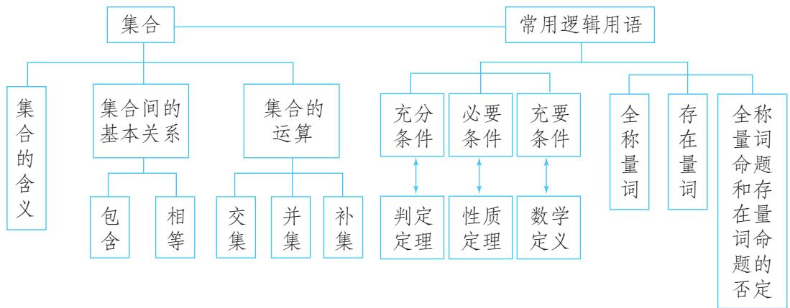

<details>
<summary>flowchart</summary>

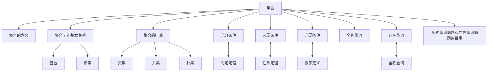
</details>

### 二、回顾与思考

本章我们学习了集合的有关概念、关系和运算，还学习了充分条件、必要条件、充要条件，全称量词、存在量词、全称量词命题与存在量词命题的否定。这些知识在后续学习中会得到大量应用，是进一步学习的重要基础。

为了有效使用集合语言表述数学的研究对象，首先应掌握集合语言的表述方式。为此，我们先学习了集合的含义，明确了集合中元素的确定性、无序性和互异性等特征；再学习了列举法、描述法等集合的表示法，其中描述法利用了研究对象的某种特征，需要先理解研究对象的性质；类比数与数的关系，我们研究了集合之间的包含关系与相等关系，这些关系是由元素与集合的关系决定的，其中集合的相等关系很重要；类比数的运算，我们学习了集合的交、并、补运算，通过这些运算可以得到与原有集合紧密关联的集合，由此可以表示研究对象的某些关系，从中我们可以体会到，数学中的运算并不局限于数的运算，这对提升我们的数学运算素养是很有意义的。在学习中，要注意“集合的含义与表示—集合的关系—集合的运算”这个研究路径。

常用逻辑用语是数学语言的重要组成部分，是逻辑思维的基本语言，也是数学表达和交流的工具。结合初中学过的平面几何和代数知识，我们学习了常用逻辑用语，发现初中学过的数学定义、定理、命题都可以用常用逻辑用语表达，利用常用逻辑用语表述数学内容、进行推理论证，可以大大提升表述的逻辑性和准确性，从而提升我们的逻辑推理素养。

本章的学习不仅要为后续学习做好知识技能的准备，更重要的是要为整个高中数学学习做好心理准备，初步形成适合高中数学学习的方式方法，使我们

能更好地适应高中数学学习.

请你带着下面的问题，复习一下全章的内容吧！

1. 集合中的元素具有确定性、互异性和无序性，你能结合例子说明这些特性吗？  
2. 你能用集合表示平面内线段 $AB$ 的垂直平分线吗？结合集合的描述法谈谈你的体会.  
3. 用联系的观点看问题，可以使我们更深刻地理解数学知识。本章中，我们类比数与数的关系和运算研究了集合与集合的关系和运算。你认为这样的类比对发现和提出集合的问题有什么意义？你能类比数的减法运算给出集合的减法运算吗？  
4. 对给定的 $p$ 和 $q$ , 如何判定 $p$ 是 $q$ 的充分不必要条件、必要不充分条件、充要条件、既不充分也不必要条件？你能举例说明吗？  
5. 如何否定含有一个量词的全称量词命题和存在量词命题？你能举例说明吗？

## 复习参考题1

### 复习巩固

1. 用列举法表示下列集合：
(1) $A = \{x\mid x^2 = 9\}$
(2) $B = \{x\in \mathbf{N}\mid 1\leqslant x\leqslant 2\}$
(3) $C = \{x\mid x^2 -3x + 2 = 0\} .$

2. 设 P 表示平面内的动点，属于下列集合的点组成什么图形？
(1) $\{P \mid PA = PB\}$ (A, B 是两个不同定点);
(2) $\{P \mid PO=3\ cm\}$ (O 是定点).

3. 设平面内有 $\triangle ABC$ ，且 $P$ 表示这个平面内的动点，指出属于集合 $\{P \mid PA = PB\} \cap \{P \mid PA = PC\}$ 的点是什么.

4. 请用 “充分不必要条件” “必要不充分条件” “充要条件” “既不充分也不必要条件” 填空：
（1）三角形两边上的高相等是这个三角形为等腰三角形的\_\_\_\_；  
(2) $x \in A$ 是 $x \in A \cup B$ 的 \_\_\_\_；  
(3) $x \in A$ 是 $x \in A \cap B$ 的 \_\_\_\_；  
(4) x, y 为无理数是 $x + y$ 为无理数的 \_\_\_\_.

5. 已知 $a, b, c$ 是实数，判断下列命题的真假：
(1) “a > b” 是 “ $a^{2} > b^{2}$ ” 的充分条件；
( )
(2) “a>b” 是 “ $a^{2}>b^{2}$ ” 的必要条件；
( )
(3) “a > b” 是 “ $ac^{2} > bc^{2}$ ” 的充分条件； （）  
(4) “a > b” 是 “ $ac^{2} > bc^{2}$ ” 的必要条件. （）

6. 用符号 “∀” 与 “∃” 表示下列含有量词的命题，并判断真假：
(1) 任意实数的平方大于或等于 0;  
(2) 对任意实数 a，二次函数 $y = x^{2} + a$ 的图象关于 y 轴对称；  
（3）存在整数 x，y，使得 $2x + 4y = 3$ ;  
（4）存在一个无理数，它的立方是有理数.

7. 写出下列命题的否定，并判断它们的真假：
(1) $\forall a \in \mathbf{R}$ , 一元二次方程 $x^{2} - ax - 1 = 0$ 有实根;  
(2) 每个正方形都是平行四边形；  
(3) $\exists m\in \mathbf{N},\sqrt{m^2 + 1}\in \mathbf{N};$   
（4）存在一个四边形 ABCD，其内角和不等于 $360^{\circ}$ .

### 综合运用

8. 已知集合 $A = \{(x, y) | 2x - y = 0\}$ , $B = \{(x, y) | 3x + y = 0\}$ , $C = \{(x, y) | 2x - y = 3\}$ , 求 $A \cap B$ , $A \cap C$ , 并解释它们的几何意义.  
9. 已知集合 $A = \{1, 3, a^2\}$ , $B = \{1, a + 2\}$ , 是否存在实数 $a$ , 使得 $A \cup B = A$ ? 若存在, 试求出实数 $a$ 的值; 若不存在, 请说明理由.  
10. 把下列定理表示的命题写成含有量词的命题：
(1) 勾股定理;   
(2) 三角形内角和定理.

### 拓广探索

11. 学校举办运动会时, 高一 (1) 班共有 28 名同学参加比赛, 有 15 人参加游泳比赛, 有 8 人参加田径比赛, 有 14 人参加球类比赛, 同时参加游泳比赛和田径比赛的有 3 人, 同时参加游泳比赛和球类比赛的有 3 人, 没有人同时参加三项比赛。同时参加田径和球类比赛的有多少人? 只参加游泳一项比赛的有多少人?  
12. 根据下述事实，分别写出含有量词的全称量词命题或存在量词命题：
(1) $1=1^{2}$ ,
$1 + 3 = 2 ^ {2},$
$1 + 3 + 5 = 3 ^ {2},$
$1 + 3 + 5 + 7 = 4 ^ {2},$
$1 + 3 + 5 + 7 + 9 = 5 ^ {2},$

......

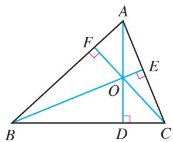

<details>
<summary>text_image</summary>

A
F
E
O
B
D
C
</details>

(第 12 (2) 题)
(2) 如图, 在 $\triangle ABC$ 中, $AD$ , $BE$ 与 $CF$ 分别为 $BC$ , $AC$ 与 $AB$ 边上的高, 则 $AD$ , $BE$ 与 $CF$ 所在的直线交于一点 $O$ .

# 第二章 一元二次函数、方程和不等式

相等关系和不等关系是数学中最基本的数量关系。我们可以利用相等关系、不等关系构建方程、不等式，再通过方程、不等式解决数学内外的各种问题。在初中，我们已学过一次函数与方程、不等式，还学过二次函数与一元二次方程，知道方程（组）、不等式与函数之间具有内在联系，可以用函数的观点把它们统一起来，这是数学知识的联系性与整体性的体现。

本章将在初中学习的基础上，通过具体实例理解不等式，认识不等关系和不等式的意义与价值；在梳理等式性质的基础上，通过类比，研究不等式的性质，并利用这些性质研究一类重要的不等式——基本不等式；通过从实际情境中抽象一元二次不等式的过程，了解一元二次不等式的现实意义，理解一元二次不等式的概念，并像利用一次函数、方程和不等式的关系解决一元一次不等式的问题那样，利用二次函数、方程和不等式的关系解决一元二次不等式的有关问题，从而进一步体会用函数观点统一方程和不等式的数学思想方法.


<details>
<summary>natural_image</summary>

Scenic view of traditional white-walled houses with tiled roofs behind a vibrant yellow rapeseed field, mountains in the background (no text or symbols visible)
</details>

## 2.1 等式性质与不等式性质

在现实世界和日常生活中，大量存在着相等关系和不等关系，例如多与少、大与小、长与短、高与矮、远与近、快与慢、涨与跌、轻与重、不超过或不少于等．类似于这样的问题，反映在数量关系上，就是相等与不等．相等用等式表示，不等用不等式表示.

问题 1 你能用不等式或不等式组表示下列问题中的不等关系吗？
(1) 某路段限速 40 km/h;   
（2）某品牌酸奶的质量检查规定，酸奶中脂肪的含量 f 应不少于 2.5%，蛋白质的含量 p 应不少于 2.3%；  
（3）三角形两边之和大于第三边、两边之差小于第三边；  
（4）连接直线外一点与直线上各点的所有线段中，垂线段最短.

对于（1），设在该路段行驶的汽车的速度为 v km/h，“限速 40 km/h”就是 v 的大小不能超过 40，于是 $0 < v \leqslant 40$ .

对于（2），由题意，得 $\left\{\begin{aligned}f&\geqslant2.5\%,\\ p&\geqslant2.3\%.\end{aligned}\right.$

对于（3），设 $\triangle ABC$ 的三条边为 $a, b, c$ ，则 $a + b > c, a - b < c$ .

对于（4），如图2.1-1，设 $C$ 是直线 $AB$ 外的任意一点， $CD$ 垂直于 $AB$ ，垂足为 $D$ ， $E$ 是直线 $AB$ 上不同于 $D$ 的任意一点，则 $CD < CE$ .


<details>
<summary>text_image</summary>

①你能写出其他的可能情况吗？
</details>

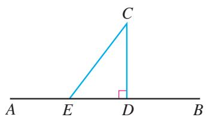

<details>
<summary>text_image</summary>

C
A E D B
</details>

图2.1-1

以上我们根据实际问题所蕴含的不等关系抽象出了不等式.接着，就可以用不等式研究相应的问题了.

问题 2 某种杂志原以每本 2.5 元的价格销售，可以售出 8 万本。据市场调查，杂志的单价每提高 0.1 元，销售量就可能减少 2000 本。如何定价才能使提价后的销售总收入

不低于 20 万元?
设提价后每本杂志的定价为 $x$ 元，则销售总收入为 $\left(8 - \frac{x - 2.5}{0.1} \times 0.2\right)x$ 万元。于是，不等关系“销售总收入不低于20万元”可以用不等式表示为
$\left(8 - \frac {x - 2 . 5}{0 . 1} \times 0. 2\right) x \geqslant 2 0. \tag {①}$

求出不等式①的解集，就能知道满足条件的杂志的定价范围.

如何解不等式①呢？与解方程要用等式的性质一样，解不等式要用不等式的性质。为此，我们需要先研究不等式的性质。

实际上，在初中我们已经通过具体实例归纳出了一些不等式的性质。那么，这些性质为什么是正确的？还有其他不等式的性质吗？回答这些问题要用到关于两个实数大小关系的基本事实。
由于数轴上的点与实数一一对应，所以可以利用数轴上点的位置关系来规定实数的大小关系：如图2.1-2，设 $a, b$ 是两个实数，它们在数轴上所对应的点分别是 $A, B$ 。那么，当点 $A$ 在点 $B$ 的左边时， $a < b$ ；当点 $A$ 在点 $B$ 的右边时， $a > b$ 。

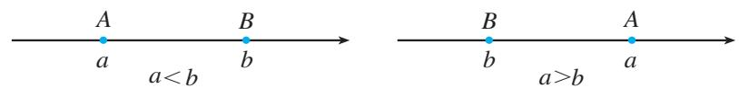

<details>
<summary>text_image</summary>

A
a
a < b
B
b
→
B
b
a > b
A
a
</details>

图2.1-2

关于实数 $a, b$ 大小的比较，有以下基本事实：
如果 $a - b$ 是正数，那么 $a > b$ ；如果 $a - b$ 等于0，那么 $a = b$ ；如果 $a - b$ 是负数，那么 $a < b$ 。反过来也对。

这个基本事实可以表示为
$a > b \Leftrightarrow a - b > 0;$
$a = b \Leftrightarrow a - b = 0;$
$a <   b \Leftrightarrow a - b <   0.$

从上述基本事实可知，要比较两个实数的大小，可以转化为比较它们的差与0的大小.

> [!example]- 例 1 比较 $(x+2)(x+3)$ 和 $(x+1)(x+4)$ 的大小.
分析：通过考察这两个多项式的差与0的大小关系，可以得出它们的大小关系.
解：因为
$(x + 2) (x + 3) - (x + 1) (x + 4)$
$= (x ^ {2} + 5 x + 6) - (x ^ {2} + 5 x + 4)$
$= 2 > 0,$

0 是正数与负数的分界点，它为实数比较大小提供了“标杆”.
所以
$(x + 2) (x + 3) > (x + 1) (x + 4).$

这里，我们借助多项式减法运算，得出了一个明显大于0的数（式）。这是解决不等式问题的常用方法。

> [!explore] 探究
图2.1-3是在北京召开的第24届国际数学家大会的会标，会标是根据中国古代数学家赵爽的弦图设计的，颜色的明暗使它看上去像一个风车，代表中国人民热情好客。你能在这个图中找出一些相等关系和不等关系吗？


<details>
<summary>natural_image</summary>

Abstract geometric design with red and white triangular shapes forming a square (no text or symbols)
</details>

图2.1-3

将图2.1-3中的“风车”抽象成图2.1-4. 在正方形ABCD中有4个全等的直角三角形．设直角三角形的两条直角边的长为 $a$ ， $b(a \neq b)$ ，那么正方形的边长为 $\sqrt{a^2 + b^2}$ ．这样，4个直角三角形的面积和为 $2ab$ ，正方形的面积为 $a^2 + b^2$ ．由于正方形ABCD的面积大于4个直角三角形的面积和，我们就得到了一个不等式
$a ^ {2} + b ^ {2} > 2 a b.$
当直角三角形变为等腰直角三角形，即 a=b 时，正方形 EFGH 缩为一个点，这时有
$a ^ {2} + b ^ {2} = 2 a b.$
于是就有 $a^2 + b^2 \geqslant 2ab$ .

一般地， $\forall a,b\in \mathbf{R}$ ，有
$a ^ {2} + b ^ {2} \geqslant 2 a b,$
当且仅当 a=b 时，等号成立.
事实上，利用完全平方公式，得
$a ^ {2} + b ^ {2} - 2 a b = (a - b) ^ {2}.$
因为 $\forall a, b \in R, (a - b)^{2} \geqslant 0$ ，当且仅当 a = b 时，等号成立，所以 $a^{2} + b^{2} - 2ab \geqslant 0$ 。因此，由两个实数大小关系的基本事实，得 $a^{2} + b^{2} \geqslant 2ab$ ，当且仅当 a = b 时，等号成立。

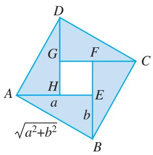

<details>
<summary>text_image</summary>

D
G
F
C
A
H
a
E
b
B
√(a²+b²)
</details>

图2.1-4

#### 练习

1. 用不等式或不等式组表示下面的不等关系：
(1) 某高速公路规定通过车辆的车货总高度 $h$ (单位: $\mathrm{m}$ ) 从地面算起不能超过 $4 \mathrm{~m}$ ;  
(2) a 与 b 的和是非负实数；  
（3）如图，在一个面积小于 $350\mathrm{m}^2$ 的矩形场地的中心位置上建造一个仓库，仓库的四周建成绿地，仓库的长 $L$ （单位： $\mathrm{m}$ ）大于宽 $W$ （单位： $\mathrm{m}$ ）的4倍.

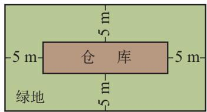

<details>
<summary>text_image</summary>

-5 m-
仓库
-5 m-
-5 m-
绿地
-5 m-
</details>

(第1（3）题)

2. 比较 $(x + 3)(x + 7)$ 和 $(x + 4)(x + 6)$ 的大小.  
3. 已知 $a > b$ ，证明 $a > \frac{a + b}{2} > b$ .

关于两个实数大小关系的基本事实为研究不等式的性质奠定了基础. 那么, 不等式到底有哪些性质呢?
因为不等式与等式一样，都是对大小关系的刻画，所以我们可以从等式的性质及其研究方法中获得启发.

> [!think] 思考
请你先梳理等式的基本性质，再观察它们的共性。你能归纳一下发现等式基本性质的方法吗？

等式有下面的基本性质：

性质 1 如果 a=b，那么 b=a；
性质 2 如果 a=b，b=c，那么 a=c；
性质 3 如果 a=b，那么 $a \pm c = b \pm c$ ;

性质 4 如果 a=b，那么 ac=bc；
性质 5 如果 a=b， $c \neq 0$ ，那么 $\frac{a}{c} = \frac{b}{c}$ .

可以发现，性质 1，2 反映了相等关系自身的特性，性质 3，4，5 是从运算的角度提出的，反映了等式在运算中保持的不变性.

运算中的不变性就是性质.

> [!explore] 探究
类比等式的基本性质，你能猜想不等式的基本性质，并加以证明吗？

类比等式的性质 1, 2, 可以猜想不等式有如下性质:

性质1 如果 $a > b$ ，那么 $b < a$ ；如果 $b < a$ ，那么 $a > b$ .即
$a > b \Leftrightarrow b <   a.$

性质2 如果 $a > b$ ， $b > c$ ，那么 $a > c$ .即
$a > b, b > c \Rightarrow a > c.$

我们来证明性质 2:
由两个实数大小关系的基本事实知
$\begin{array}{l} \left. \begin{array}{l} a > b \Rightarrow a - b > 0 \\ b > c \Rightarrow b - c > 0 \end{array} \right\} \Rightarrow (a - b) + (b - c) > 0 \\ \Rightarrow a - c > 0 \Rightarrow a > c. \\ \end{array}$

类比等式的性质 3～5，可以猜想不等式还有如下性质：

性质 3 如果 a > b，那么 $a + c > b + c$ .
这就是说，不等式的两边都加上同一个实数，所得不等式与原不等式同向.

如图2.1-5，把数轴上的两个点 $A$ 与 $B$ 同时沿相同方向移动相等的距离，得到另两个点 $A_{1}$ 与 $B_{1}$ ， $A$ 与 $B$ 和 $A_{1}$ 与 $B_{1}$ 的左右位置关系不会改变。用不等式的语言表示，就是上述性质3。

从不同角度表述不等式的性质，可以加深理解。对其他不等式的性质，你能用文字语言表述吗？

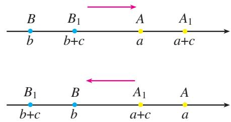

<details>
<summary>text_image</summary>

B B₁ A A₁
b b+c a a+c
B₁ B A₁ A
b+c b a+c a
</details>

图2.1-5
由性质3可得，
$\begin{array}{l} a + b > c \Rightarrow a + b + (- b) > c + (- b) \\ \Rightarrow a > c - b. \\ \end{array}$

这表明，不等式中任何一项可以改变符号后移到不等号的另一边.

性质 4 如果 a > b，c > 0，那么 ac > bc；如果 a > b，c < 0，那么 ac < bc。
这就是说，不等式两边同乘一个正数，所得不等式与原不等式同向；不等式两边同乘一个负数，所得不等式与原不等式反向.

利用这些基本性质，我们还可以推导出其他一些常用的不等式的性质。例如，利用性质2，3可以推出：

性质 5 如果 a > b，c > d，那么 $a + c > b + d$ .
事实上，由 $a > b$ 和性质3，得 $a + c > b + c$ ；由 $c > d$ 和性质3，得 $b + c > b + d$ 。再

根据性质 2，即得 $a+c>b+d$ .

利用性质 4 和性质 2 可以推出：

性质 6 如果 a > b > 0，c > d > 0，那么 ac > bd.

性质 7 如果 a > b > 0，那么 $a^{n} > b^{n}$ ( $n \in N, n \geqslant 2$ ).

实数大小关系的基本事实和不等式的性质是解决不等式问题的基本依据.

> [!example]- 例 2 已知 a > b > 0, c < 0，求证 $\frac{c}{a} > \frac{c}{b}$ .
分析：要证明 $\frac{c}{a} >\frac{c}{b}$ ，因为 $c < 0$ ，所以可以先证明 $\frac{1}{a} < \frac{1}{b}$ .利用已知 $a > b > 0$ 和性质4，即可证明 $\frac{1}{a} < \frac{1}{b}$
证明：因为 $a > b > 0$ ，所以 $ab > 0$ ， $\frac{1}{ab} >0.$
于是 $a\cdot \frac{1}{ab} >b\cdot \frac{1}{ab},$
即 $\frac{1}{b} >\frac{1}{a}.$
由 $c < 0$ ，得 $\frac{c}{a} >\frac{c}{b}$

#### 练习

1. 证明不等式性质 1, 3, 4, 6.   
2. 用不等号 “>” 或 “<” 填空：
(1) 如果 a > b，c < d，那么 $a - c \quad b - d$ ;  
(2) 如果 a > b > 0, c < d < 0，那么 ac \_\_\_\_ bd；  
（3）如果 $a > b > 0$ ，那么 $\frac{1}{a^2}$ $\frac{1}{b^2}$   
（4）如果 $a > b > c > 0$ ，那么 $\frac{c}{a}$ \_\_\_\_ $\frac{c}{b}$ .

## 习题2.1

### 复习巩固

1. 举出几个现实生活中与不等式有关的例子.  
2. 某市生态环境局为增加城市的绿地面积，提出两个投资方案：方案A为一次性投资500万元；方

案 B 为第一年投资 100 万元，以后每年投资 10 万元。列出不等式表示 “经过 n 年之后，方案 B 的投入不少于方案 A 的投入”。

3. 比较下列各组中两个代数式的大小:
(1) $x^{2} + 5x + 6$ 与 $2x^{2} + 5x + 9$ ;
(2) $(x - 3)^{2}$ 与 $(x - 2)(x - 4)$ ;
(3) 当 x > 1 时， $x^{2}$ 与 $x^{2} - x + 1$ ;
(4) $x^{2} + y^{2} + 1$ 与 $2(x + y - 1)$ .

4. 一个大于50且小于60的两位数，其个位数字比十位数字大2. 试用不等式表示上述关系，并求出这个两位数（用 $a$ 和 $b$ 分别表示这个两位数的十位数字和个位数字）.

5. 已知 $2 < a < 3$ ， $-2 < b < -1$ ，求 $2a + b$ 的取值范围.

6. 证明： $c < b$ ， $b < a \Rightarrow c < a$ .

### 综合运用

7. 已知 $a > b > 0, c < d < 0, e < 0$ ，求证 $\frac{e}{a - c} > \frac{e}{b - d}$ .

8. 下列命题为真命题的是（）.

(A) 若 $a > b > 0$ ，则 $ac^2 > bc^2$

(B) 若 $a > b > 0$ ，则 $a^2 > b^2$

(C) 若 $a < b < 0$ ，则 $a^2 < ab < b^2$

(D) 若 $a < b < 0$ ，则 $\frac{1}{a} < \frac{1}{b}$

9. 证明：圆的面积大于与它具有相同周长的正方形的面积。并据此说明，人们通常把自来水管的横截面制成圆形，而不是正方形的原因。

10. 已知 $b$ 克糖水中含有 $a$ 克糖 $(b > a > 0)$ ，再添加 $m$ 克糖 $(m > 0)$ （假设全部溶解），糖水变甜了。请将这一事实表示为一个不等式，并证明这个不等式成立。

### 拓广探索

11. 已知 $a > b > 0$ ，求证 $\sqrt{a} > \sqrt{b}$ .

12. 火车站有某公司待运的甲种货物 1530 t，乙种货物 1150 t。现计划用 A，B 两种型号的货厢共 50 节运送这批货物。已知 35 t 甲种货物和 15 t 乙种货物可装满一节 A 型货厢，25 t 甲种货物和 35 t 乙种货物可装满一节 B 型货厢，据此安排 A，B 两种货厢的节数，共有几种方案？若每节 A 型货厢的运费是 0.5 万元，每节 B 型货厢的运费是 0.8 万元，哪种方案的运费较少？

## 2.2 基本不等式

我们知道，乘法公式在代数式的运算中有重要作用。那么，是否也有一些不等式，它们在解决不等式问题时有着与乘法公式类似的重要作用呢？下面就来研究这个问题。

前面我们利用完全平方公式得出了一类重要不等式：
$\forall a, b \in \mathbf{R}$ , 有
$a ^ {2} + b ^ {2} \geqslant 2 a b,$
当且仅当 a=b 时，等号成立.

特别地，如果 $a > 0$ ， $b > 0$ ，我们用 $\sqrt{a}$ ， $\sqrt{b}$ 分别代替上式中的 $a$ ， $b$ ，可得
$\sqrt {a b} \leqslant \frac {a + b}{2}, \tag {1}$
当且仅当 a=b 时，等号成立.

通常称不等式（1）为基本不等式（basic inequality）。其中， $\frac{a + b}{2}$ 叫做正数 $a, b$ 的算术平均数， $\sqrt{ab}$ 叫做正数 $a, b$ 的几何平均数。

基本不等式表明：两个正数的算术平均数不小于它们的几何平均数.

上面通过考察 $a^2 + b^2 \geqslant 2ab$ 的特殊情形获得了基本不等式。能否直接利用不等式的性质推导出基本不等式呢？下面我们来分析一下。

要证
$\sqrt {a b} \leqslant \frac {a + b}{2}, \tag {①}$

只要证
$2 \sqrt {a b} \leqslant a + b. \tag {②}$

要证②，只要证
$2 \sqrt {a b} - a - b \leqslant 0. \tag {③}$

要证③，只要证
$- (\sqrt {a} - \sqrt {b}) ^ {2} \leqslant 0. \tag {4}$

要证④，只要证
$(\sqrt {a} - \sqrt {b}) ^ {2} \geqslant 0. \tag {⑤}$
显然，⑤成立，当且仅当 a=b 时，⑤中的等号成立.

只要把上述过程倒过来，就能直接推出基本不等式了.

> [!explore] 探究
在图 2.2-1 中，AB 是圆的直径，点 C 是 AB 上一点，AC=a，BC=b。过点 C 作垂直于 AB 的弦 DE，连接 AD，BD。你能利用这个图形，得出基本不等式的几何解释吗？

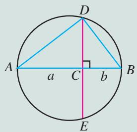

<details>
<summary>text_image</summary>

D
A
a
C
b
B
E
</details>

图2.2-1

如图2.2-1，可证 $\triangle ACD\sim \triangle DCB$ ，因而 $CD = \sqrt{ab}$ ．由于 $CD$ 小于或等于圆的半径，用不等式表示为
$\sqrt {a b} \leqslant \frac {a + b}{2}.$
显然，当且仅当点 C 与圆心重合，即当 a=b 时，上述不等式的等号成立.

> [!example]- 例1 已知 $x > 0$ ，求 $x + \frac{1}{x}$ 的最小值.
分析：求 $x + \frac{1}{x}$ 的最小值，就是要求一个 $y_0\left(= x_0 + \frac{1}{x_0}\right)$ ，使 $\forall x > 0$ ，都有 $x + \frac{1}{x} \geqslant y_0$ 。观察 $x + \frac{1}{x}$ ，发现 $x \cdot \frac{1}{x} = 1$ 。联系基本不等式，可以利用正数 $x$ 和 $\frac{1}{x}$ 的算术平均数与几何平均数的关系得到 $y_0 = 2$ 。
解：因为 $x > 0$ ，所以
$x + \frac {1}{x} \geqslant 2 \sqrt {x \cdot \frac {1}{x}} = 2,$
当且仅当 $x = \frac{1}{x}$ ，即 $x^{2} = 1$ ， $x = 1$ 时，等号成立，因此所求的最小值为2.

在本题的解答中，我们不仅明确了 $\forall x > 0$ ，有 $x + \frac{1}{x} \geqslant 2$ ，而且给出了“当且仅当 $x = \frac{1}{x}$ ，即 $x^2 = 1$ ， $x = 1$ 时，等号成立”，这是为了说明2是 $x + \frac{1}{x} (x > 0)$ 的一个取值。想一想，当 $y_0 < 2$ 时， $x + \frac{1}{x} \geqslant y_0$ 成立吗？这时能说 $y_0$ 是 $x + \frac{1}{x} (x > 0)$ 的最小值吗？

> [!example]- 例 2 已知 x, y 都是正数，求证：
（1）如果积 $xy$ 等于定值 $P$ ，那么当 $x = y$ 时，和 $x + y$ 有最小值 $2\sqrt{P}$ （2）如果和 $x + y$ 等于定值 $S$ ，那么当 $x = y$ 时，积 $xy$ 有最大值 $\frac{1}{4} S^2$
证明：因为 $x, y$ 都是正数，所以
$\frac {x + y}{2} \geqslant \sqrt {x y}.$
(1) 当积 xy 等于定值 P 时，
$\frac {x + y}{2} \geqslant \sqrt {P},$
所以
$x + y \geqslant 2 \sqrt {P},$
当且仅当 $x = y$ 时，上式等号成立．于是，当 $x = y$ 时，和 $x + y$ 有最小值 $2\sqrt{P}$
(2) 当和 $x + y$ 等于定值 S 时，
$\sqrt {x y} \leqslant \frac {S}{2},$
所以
$x y \leqslant \frac {1}{4} S ^ {2},$
当且仅当 $x = y$ 时，上式等号成立．于是，当 $x = y$ 时，积 $xy$ 有最大值 $\frac{1}{4} S^2$

#### 练习

1. 已知 $a, b \in \mathbf{R}$ ，求证 $ab \leqslant \left(\frac{a + b}{2}\right)^2$ .  
2. 已知 $x, y$ 都是正数，且 $x \neq y$ ，求证：
(1) $\frac{x}{y} + \frac{y}{x} > 2$ ;
(2) $\frac{2xy}{x + y} < \sqrt{xy}$ .

3. 当 $x$ 取什么值时， $x^{2} + \frac{1}{x^{2}}$ 取得最小值？最小值是多少？  
4. 已知 $-1 \leqslant x \leqslant 1$ ，求 $1 - x^{2}$ 的最大值.  
5. 已知直角三角形的面积等于 $50 \mathrm{~cm}^2$ ，当两条直角边的长度各为多少时，两条直角边的和最小？最小值是多少？

基本不等式在解决实际问题中有广泛的应用，是解决最大（小）值问题的有力工具.

> [!example]- 例 3 （1）用篱笆围一个面积为 $100 \, m^{2}$ 的矩形菜园，当这个矩形的边长为多少时，所用篱笆最短？最短篱笆的长度是多少？
(2) 用一段长为 $36 \mathrm{~m}$ 的篱笆围成一个矩形菜园, 当这个矩形的边长为多少时, 菜园

的面积最大？最大面积是多少？
分析：（1）矩形菜园的面积是矩形的两邻边之积，于是问题转化为：矩形的邻边之积为定值，边长多大时周长最短.
（2）矩形菜园的周长是矩形两邻边之和的2倍，于是问题转化为：矩形的邻边之和为定值，边长多大时面积最大.
解：设矩形菜园的相邻两条边的长分别为 $x\mathrm{m}$ ， $\mathcal{Y}\mathrm{m}$ ，篱笆的长度为 $2(x + y)\mathrm{m}$
(1) 由已知得 xy=100.
由
$\frac {x + y}{2} \geqslant \sqrt {x y},$

可得
$x + y \geqslant 2 \sqrt {x y} = 2 0,$
所以
$2 (x + y) \geqslant 4 0,$
当且仅当 x=y=10 时，上式等号成立.
因此，当这个矩形菜园是边长为 $10 \, m$ 的正方形时，所用篱笆最短，最短篱笆的长度为 $40 \, m$ .
(2) 由已知得 $2(x+y)=36$ ，矩形菜园的面积为 $xy\ m^{2}$ .
由
$\sqrt {x y} \leqslant \frac {x + y}{2} = \frac {1 8}{2} = 9,$

可得
$x y \leqslant 8 1,$
当且仅当 x=y=9 时，上式等号成立.
因此，当这个矩形菜园是边长为 $9 \, m$ 的正方形时，菜园的面积最大，最大面积是 $81 \, m^{2}$ .

> [!example]- 例 4 某工厂要建造一个长方体形无盖贮水池，其容积为 $4800 \, m^{3}$ ，深为 $3 \, m$ 。如果池底每平方米的造价为 150 元，池壁每平方米的造价为 120 元，那么怎样设计水池能使总造价最低？最低总造价是多少？
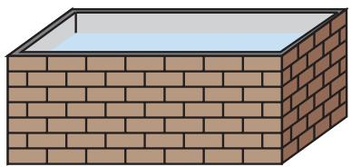

<details>
<summary>natural_image</summary>

Illustration of a brick wall with a rectangular opening (no text or symbols)
</details>
分析：贮水池呈长方体形，它的高是 $3\mathrm{m}$ ，池底的边长没有确定。如果池底的边长确定了，那么水池的总造价也就确定了。因此，应当考察池底的边长取什么值时，水池的总造价最低。
解：设贮水池池底的相邻两条边的边长分别为 $x \mathrm{~m}, y \mathrm{~m}$ ，水池的总造价为 $z$ 元。根据题意，有
$\begin{array}{l} z = 1 5 0 \times \frac {4 8 0 0}{3} + 1 2 0 (2 \times 3 x + 2 \times 3 y) \\ = 2 4 0 0 0 0 + 7 2 0 (x + y). \\ \end{array}$
由容积为 $4800\mathrm{m}^3$ ，可得
$3 x y = 4 8 0 0,$
因此
$x y = 1 6 0 0.$
所以
$z \geqslant 2 4 0 0 0 0 + 7 2 0 \times 2 \sqrt {x y},$
当 x=y=40 时，上式等号成立，此时 z=297 600.
所以，将贮水池的池底设计成边长为 $40 \, m$ 的正方形时总造价最低，最低总造价是 297 600 元.

#### 练习

1. 用 $20 \mathrm{~cm}$ 长的铁丝折成一个面积最大的矩形，应当怎样折？  
2. 用一段长为 $30 \mathrm{~m}$ 的篱笆围成一个一边靠墙的矩形菜园, 墙长 $18 \mathrm{~m}$ . 当这个矩形的边长为多少时, 菜园的面积最大? 最大面积是多少?  
3. 做一个体积为 $32 \, m^{3}$ ，高为 $2 \, m$ 的长方体纸盒，当底面的边长取什么值时，用纸最少？  
4. 已知一个矩形的周长为 $36 \mathrm{~cm}$ , 矩形绕它的一条边旋转形成一个圆柱. 当矩形的边长为多少时, 旋转形成的圆柱的侧面积最大?

## 习题2.2

### 复习巩固

1.（1）已知 $x > 1$ ，求 $x + \frac{1}{x - 1}$ 的最小值；
(2) 求 $\sqrt{x(10-x)}$ 的最大值.

2.（1）把36写成两个正数的积，当这两个正数取什么值时，它们的和最小？
(2) 把 18 写成两个正数的和，当这两个正数取什么值时，它们的积最大？

3. 某公司建造一间地面为矩形、背面靠墙的房屋，地面面积为 $48 \mathrm{~m}^{2}$ ，房屋正面每平方米的造价为 1200 元，房屋侧面每平方米的造价为 800 元，屋顶的造价为 5800 元。如果墙高为 $3 \mathrm{~m}$ ，且不计房屋背面和地面的费用，那么怎样设计房屋能使总造价最低？最低总造价是多少？

### 综合运用

4. 已知 $x, y, z$ 都是正数，求证： $(x + y)(y + z)(z + x) \geqslant 8xyz$ .  
5. 已知 $x > 0$ ，求证： $2 - 3x - \frac{4}{x}$ 的最大值是 $2 - 4\sqrt{3}$ .  
6. 一家货物公司计划租地建造仓库储存货物，经过市场调查了解到下列信息：每月土地占地费 $y_{1}$ （单位：万元）与仓库到车站的距离 $x$ （单位：km）成反比，每月库存货物费 $y_{2}$ （单位：万元）与 $x$ 成正比；若在距离车站 $10\mathrm{km}$ 处建仓库，则 $y_{1}$ 和 $y_{2}$ 分别为2万元和8万元。这家公司应该把仓库建在距离车站多少千米处，才能使两项费用之和最小？

### 拓广探索

7. 一家商店使用一架两臂不等长的天平称黄金。一位顾客到店里购买 $10 \mathrm{~g}$ 黄金，售货员先将 $5 \mathrm{~g}$ 的砝码放在天平左盘中，取出一些黄金放在天平右盘中使天平平衡；再将 $5 \mathrm{~g}$ 的砝码放在天平右盘中，再取出一些黄金放在天平左盘中使天平平衡；最后将两次称得的黄金交给顾客。你认为顾客购得的黄金是小于 $10 \mathrm{~g}$ ，等于 $10 \mathrm{~g}$ ，还是大于 $10 \mathrm{~g}$ ？为什么？  
8. 设矩形 $ABCD (AB > AD)$ 的周长为 $24 \mathrm{~cm}$ , 把 $\triangle ABC$ 沿 $AC$ 向 $\triangle ADC$ 折叠, $AB$ 折过去后交 $DC$ 于点 $P$ . 设 $AB = x \mathrm{~cm}$ , 求 $\triangle ADP$ 的最大面积及相应 $x$ 的值.

## 2.3 二次函数与一元二次方程、不等式

在初中，我们从一次函数的角度看一元一次方程、一元一次不等式，发现了三者之间的内在联系，利用这种联系可以更好地解决相关问题。对于二次函数、一元二次方程和一元二次不等式，是否也有这样的联系呢？先来看一个问题。

问题 园艺师打算在绿地上用栅栏围一个矩形区域种植花卉. 若栅栏的长度是 $24 \mathrm{~m}$ , 围成的矩形区域的面积要大于 $20 \mathrm{~m}^{2}$ , 则这个矩形的边长为多少米?
设这个矩形的一条边长为 $x \mathrm{~m}$ ，则另一条边长为 $(12 - x) \mathrm{~m}$ 。由题意，得


<details>
<summary>natural_image</summary>

Aerial view of a white fence structure filled with colorful flowers on grass, no visible text or symbols.
</details>
$(1 2 - x) x > 2 0,$

其中 $x \in \{x \mid 0 < x < 12\}$ . 整理得
$x ^ {2} - 1 2 x + 2 0 <   0, x \in \{x \mid 0 <   x <   1 2 \}. \tag {①}$

求得不等式①的解集，就得到了问题的答案.

一般地，我们把只含有一个未知数，并且未知数的最高次数是 2 的不等式，称为一元二次不等式（quadratic inequality with one unknown）。一元二次不等式的一般形式是
$a x ^ {2} + b x + c > 0 \text {或} a x ^ {2} + b x + c <   0,$

其中 a, b, c 均为常数， $a \neq 0$ .

> [!think] 思考
在初中，我们学习了从一次函数的观点看一元一次方程、一元一次不等式的思想方法。类似地，能否从二次函数的观点看一元二次不等式，进而得到一元二次不等式的求解方法呢？

下面，我们先考察一元二次不等式 $x^{2} - 12x + 20 < 0$ 与二次函数 $y = x^{2} - 12x + 20$ 之间的关系.

如图 2.3-1，在平面直角坐标系中画出二次函数 $y=x^{2}-12x+20$ 的图象，图象与 x 轴有两个交点。这两个交点的横坐标就是方程 $x^{2}-12x+20=0$ 的两个实数根 $x_{1}=2$ ， $x_{2}=10$ ，因此二次函数 $y=x^{2}-12x+20$ 的图象与 x 轴的两个交点是 $(2,0)$ 和 $(10,0)$ 。

一般地，对于二次函数 $y=ax^{2}+bx+c$ ，我们把使 $ax^{2}+bx+c=0$ 的实数 x 叫做二次函数 $y=ax^{2}+bx+c$ 的零点。于是，二次函数 $y=x^{2}-12x+20$ 的两个零点是 $x_{1}=2,\quad x_{2}=10$ 。

从图2.3-1可以看出，二次函数 $y = x^{2} - 12x + 20$ 的两个零点 $x_{1} = 2$ ， $x_{2} = 10$ 将 $x$ 轴分成三段。相应地，当 $x < 2$ 或 $x > 10$ 时，函数图象位于 $x$ 轴上方，此时 $y > 0$ ，即 $x^{2} - 12x + 20 > 0$ ；当 $2 < x < 10$ 时，函数图象位于 $x$ 轴下方，此时 $y < 0$ ，即 $x^{2} - 12x + 20 < 0$ 。所以，一元二次不等式 $x^{2} - 12x + 20 < 0$ 的解集是

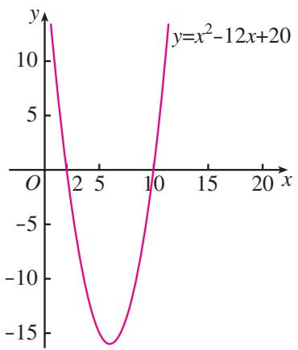

<details>
<summary>line</summary>

| x  | y          |
|----|------------|
| 0  | 12.5       |
| 2  | 0          |
| 5  | -12.5      |
| 10 | 0          |
| 12 | 12.5       |
</details>

图2.3-1
$\{x \mid 2 <   x <   1 0 \}.$
因为 $\{x\mid 2 <   x <   10\} \subseteq \{x\mid 0 <   x <   12\}$ ，因此当围成的矩形的一条边长 $x$ 满足 $2 <   x <   10$ 时，围成的矩形区域的面积大于 $20~\mathrm{m}^2$

上述方法可以推广到求一般的一元二次不等式 $ax^2 + bx + c > 0 (a > 0)$ 和 $ax^2 + bx + c < 0 (a > 0)$ 的解集。因为一元二次方程的根是相应一元二次函数的零点，所以先求出一元二次方程的根，再根据二次函数图象与 $x$ 轴的相关位置确定一元二次不等式的解集。

我们知道，对于一元二次方程 $ax^2 + bx + c = 0 (a > 0)$ ，设 $\Delta = b^2 - 4ac$ ，它的根按照 $\Delta > 0$ ， $\Delta = 0$ ， $\Delta < 0$ 可分为三种情况。相应地，二次函数 $y = ax^2 + bx + c (a > 0)$ 的图象与 $x$ 轴的位置关系也分为三种情况。因此，我们分三种情况来讨论对应的一元二次不等式 $ax^2 + bx + c > 0 (a > 0)$ 和 $ax^2 + bx + c < 0 (a > 0)$ 的解集（表2.3-1）。

表 2.3-1 二次函数与一元二次方程、不等式的解的对应关系

<table><tr><td>项目</td><td> $\Delta >0$ </td><td> $\Delta = 0$ </td><td> $\Delta < 0$ </td></tr><tr><td> $y=ax^{2}+bx+c(a>0)$ 的图象</td><td></td><td></td><td></td></tr><tr><td> $ax^{2}+bx+c=0(a>0)$ 的根</td><td>有两个不相等的实数根  $x_{1},x_{2}(x_{1有两个相等的实数根}$  $x_{1}=x_{2}=-\frac{b}{2a}$ </td><td>有两个相等的实数根 $x_{1}=x_{2}=-\frac{b}{2a}$ </td><td>没有实数根</td></tr><tr><td> $ax^{2}+bx+c>0(a>0)$ 的解集</td><td> $\{x|x< x_{1},或 x>x_{2}\}$ </td><td> $\{x|x\neq-\frac{b}{2a}\}$ </td><td>R</td></tr><tr><td> $ax^{2}+bx+c<0(a>0)$ 的解集</td><td> $\{x|x_{1}<x< x_{2}\}$ </td><td>∅</td><td>∅</td></tr></table>

> [!example]- 例 1 求不等式 $x^{2}-5x+6>0$ 的解集.
分析：因为方程 $x^{2}-5x+6=0$ 的根是函数 $y=x^{2}-5x+6$ 的零点，所以先求出 $x^{2}-5x+6=0$ 的根，再根据函数图象得到 $x^{2}-5x+6>0$ 的解集.
解：对于方程 $x^{2} - 5x + 6 = 0$ ，因为 $\Delta >0$ ，所以它有两个实数根．解得 $x_{1} = 2$ ， $x_{2} = 3$

画出二次函数 $y=x^{2}-5x+6$ 的图象（图 2.3-2），结合图象得不等式 $x^{2}-5x+6>0$ 的解集为 $\{x|x<2,$ 或 $x>3\}$ .

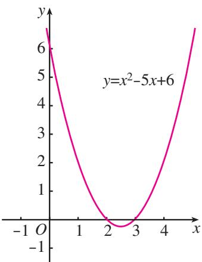

<details>
<summary>line</summary>

| x   | y     |
| --- | ----- |
| -1  | 7.0   |
| 0   | 5.0   |
| 1   | 3.0   |
| 2   | 0.5   |
| 3   | 1.0   |
| 4   | 3.0   |
| 5   | 5.0   |
| 6   | 7.0   |
</details>

图2.3-2

> [!example]- 例 2 求不等式 $9x^{2}-6x+1>0$ 的解集.
解：对于方程 $9x^{2} - 6x + 1 = 0$ ，因为 $\Delta = 0$ ，所以它有两个相等的实数根，解得 $x_{1} = x_{2} = \frac{1}{3}$

画出二次函数 $y = 9x^{2} - 6x + 1$ 的图象（图2.3-3），结合图象得不等式 $9x^{2} - 6x + 1 > 0$ 的解集为 $\{x \mid x \neq \frac{1}{3}\}$ .

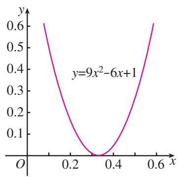

<details>
<summary>line</summary>

| x    | y     |
| ---- | ----- |
| 0.0  | 0.6   |
| 0.2  | 0.2   |
| 0.35 | 0.0   |
| 0.4  | 0.1   |
| 0.5  | 0.3   |
| 0.6  | 0.6   |
</details>

图2.3-3

> [!example]- 例 3 求不等式 $-x^{2}+2x-3>0$ 的解集.
解：不等式可化为 $x^{2} - 2x + 3 < 0$
因为 $\Delta = -8 < 0$ ，所以方程 $x^{2} - 2x + 3 = 0$ 无实数根.

画出二次函数 $y=x^{2}-2x+3$ 的图象（图 2.3-4）.

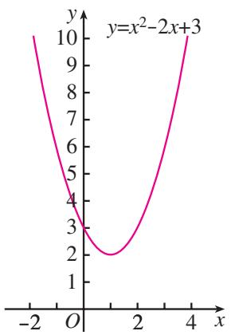

<details>
<summary>line</summary>

| x | y |
|---|---|
| -2 | 10 |
| 0 | 3 |
| 1 | 2 |
| 4 | 10 |
</details>

图2.3-4

对于二次项系数是负数（即 $a < 0$ ）的不等式，可以先把二次项系数化成正数，再求解.

结合图象得不等式 $x^{2}-2x+3<0$ 的解集为 $\varnothing$ .
因此，原不等式的解集为∅.

现在，你能解决第2.1节的“问题2”了吗？

利用框图可以清晰地表示求解一元二次不等式的过程. 这里, 我们以求解可化成 $ax^2 + bx + c > 0 (a > 0)$ 形式的不等式为例, 用框图表示其求解过程 (图 2.3-5).

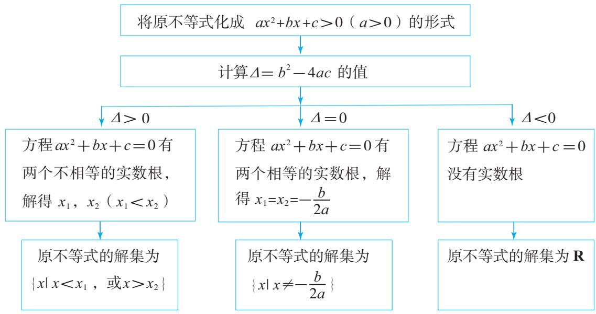

<details>
<summary>flowchart</summary>

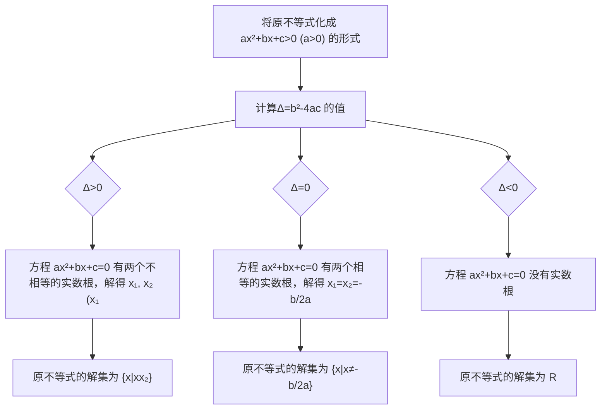
</details>

图2.3-5

#### 练习

1. 求下列不等式的解集：
(1) $(x + 2)(x - 3) > 0$ ;
(2) $3x^{2} - 7x \leqslant 10$ ;
(3) $-x^{2} + 4x - 4 < 0$ ;
(4) $x^{2} - x + \frac{1}{4} < 0;$
(5) $-2x^{2} + x \leqslant -3$ ;
(6) $x^{2} - 3x + 4 > 0.$

2. 当自变量 x 在什么范围取值时，下列函数的值等于 0？大于 0？小于 0？
(1) $y = 3x^{2} - 6x + 2;$
(2) $y = 25 - x^{2}$ ;
(3) $y = x^{2} + 6x + 10;$
(4) $y = -3x^{2} + 12x - 12.$

利用一元二次不等式可以解决一些实际问题，下面看两个例子.

> [!example]- 例 4 一家车辆制造厂引进了一条摩托车整车装配流水线，这条流水线生产的摩托车数量 x （单位：辆）与创造的价值 y （单位：元）之间有如下的关系：
$y = - 2 0 x ^ {2} + 2 2 0 0 x.$

若这家工厂希望在一个星期内利用这条流水线创收60 000元以上，则在一个星期内大约应该生产多少辆摩托车？
解：设这家工厂在一个星期内大约应该利用这条流水线生产 $x$ 辆摩托车，根据题意，得
$- 2 0 x ^ {2} + 2 2 0 0 x > 6 0 0 0 0.$

移项整理，得
$x ^ {2} - 1 1 0 x + 3 0 0 0 <   0.$

对于方程 $x^{2}-110x+3\ 000=0,\ \Delta=100>0$ ，方程有两个实数根 $x_{1}=50,\ x_{2}=60$

画出二次函数 $y=x^{2}-110x+3\ 000$ 的图象(图 2.3-6)，结合图象得不等式 $x^{2}-110x+3\ 000<0$ 的解集为 $\{x\mid50<x<60\}$ ，从而原不等式的解集为
$\{x \mid 5 0 <   x <   6 0 \}.$
因为 x 只能取整数值，所以当这条流水线在一周内生产的摩托车数量在 51～59 辆时，这家工厂能够获得 60 000 元以上的收益.

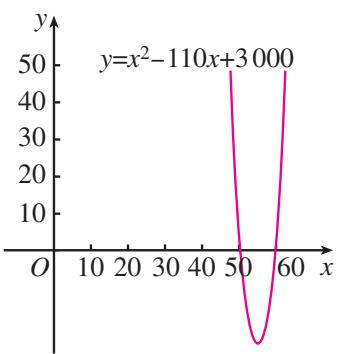

<details>
<summary>line</summary>

| x   | y     |
| --- | ----- |
| 50  | 50    |
| 60  | 50    |
</details>

图2.3-6

> [!example]- 例 5 某种汽车在水泥路面上的刹车距离 s （单位：m）和汽车刹车前的车速 v （单位：km/h）之间有如下关系：
$s = \frac {1}{2 0} v + \frac {1}{1 8 0} v ^ {2}.$

在一次交通事故中，测得这种车的刹车距离大于 39.5 m，那么这辆汽车刹车前的车速至少为多少（精确到 1 km/h）？
解：根据题意，得
$\frac {1}{2 0} v + \frac {1}{1 8 0} v ^ {2} > 3 9. 5.$

移项整理，得
$v ^ {2} + 9 v - 7 1 1 0 > 0.$

对于方程 $v^{2}+9v-7\ 110=0,\ \Delta>0$ ，方程有两个实数根
$v _ {1} = \frac {- 9 - \sqrt {2 8 5 2 1}}{2}, v _ {2} = \frac {- 9 + \sqrt {2 8 5 2 1}}{2}.$

画出二次函数 $s = v^{2} + 9v - 7110$ 的图象（图 2.3-7），结合图象得不等式的解集为 $\{v \mid v < v_{1}, \text{或 } v > v_{2}\}$ ，从而原不等式的解集为

刹车距离是指汽车刹车后由于惯性往前滑行的距离.

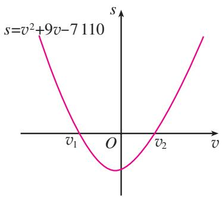

<details>
<summary>line</summary>

| v     | s       |
|-------|---------|
| v₁    | v²+9v-7110 |
| o     | 0       |
| v₂    | v       |
</details>

图2.3-7
$\{v \mid v <   v _ {1}, \text {或} v > v _ {2} \}.$
因为车速 $v > 0$ ，所以 $v > v_{2}$ .而 $79.9 <   v_{2} <   80$ ，所以这辆汽车刹车前的车速至少为 $80~\mathrm{km / h}$

类似地，第2.1节的不等式①经移项整理，得 $2x^{2}-13x+20\leqslant0$ 。用上述方法解这个不等式，得 $\{x\mid2.5\leqslant x\leqslant4\}$ 。所以，当每本杂志的定价不低于2.5元且不超过4元时，提价后的销售总收入不低于20万元。

#### 练习

1. $x$ 是什么实数时， $\sqrt{x^2 + x - 12}$ 有意义？

2. 如图, 在长为 $8 \mathrm{~m}$ , 宽为 $6 \mathrm{~m}$ 的矩形地面的四周种植花卉, 中间种植草坪. 如果要求花卉带的宽度相同, 且草坪的面积不超过总面积的一半, 那么花卉带的宽度应为多少米?  
3. 某网店销售一批新款削笔器，每个削笔器的最低售价为 15 元。若按最低售价销售，每天能卖出 30 个；若一个削笔器的售价每提高 1 元，日销售量将减少 2 个。

为了使这批削笔器每天获得400元以上的销售收入，应怎样制定这批削笔器的销售价格？<center>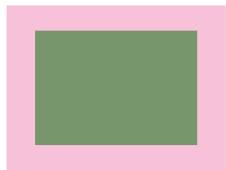</center><center>（第2题）</center>

## 习题2.3

### 复习巩固

1. 求下列不等式的解集：
(1) $13-4x^{2}>0;$
(2) $(x - 3)(x - 7) < 0$ ;
(3) $x^{2} - 3x - 10 > 0$
(4) $-3x^{2} + 5x - 4 > 0.$

2. $x$ 是什么实数时，下列各式有意义？
(1) $\sqrt{x^2 - 4x + 9}$ ;
(2) $\sqrt{-2x^2 + 12x - 18}$ .

### 综合运用

3. 已知 $M = \{x \mid 4x^2 - 4x - 15 > 0\}$ ， $N = \{x \mid x^2 - 5x - 6 > 0\}$ ，求 $M \cap N$ ， $M \cup N$ .  
4. 一名同学以初速度 $v_{0} = 12 \mathrm{~m/s}$ 竖直上抛一排球，排球能够在抛出点 $2 \mathrm{~m}$ 以上的位置最多停留多长时间（精确到 $0.01 \mathrm{~s}$ ）？  
5. 已知集合 $A = \{x \mid x^2 - 16 < 0\}$ , $B = \{x \mid x^2 - 4x + 3 > 0\}$ , 求 $A \cup B$ .

若不计空气阻力，则竖直上抛的物体距离抛出点的高度 h 与时间 t 满足关系 $h = v_{0}t - \frac{1}{2}gt^{2}$ ，其中 $g \approx 10 \, m/s^{2}$ .

### 拓广探索

6. 如图，据气象部门预报，在距离某码头南偏东 $45^{\circ}$ 方向 $600 \mathrm{~km}$ 处的热带风暴中心正以 $20 \mathrm{~km} / \mathrm{h}$ 的速度向正北方向移动，距风暴中心 $450 \mathrm{~km}$ 以内的地区都将受到影响。据以上预报估计，从现在起多长时间后，该码头将受到热带风暴的影响，影响时间大约为多长（精确到 $0.1 \mathrm{~h}$ ）？

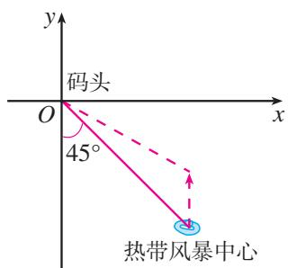

<details>
<summary>text_image</summary>

y
码头
O
x
45°
热带风暴中心
</details>

(第6题)

## 小结

### 一、本章知识结构

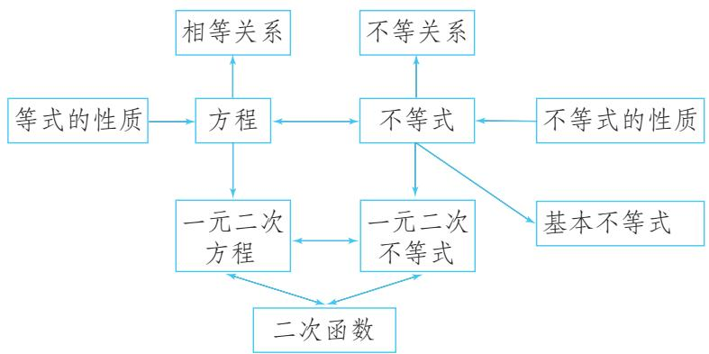

<details>
<summary>flowchart</summary>

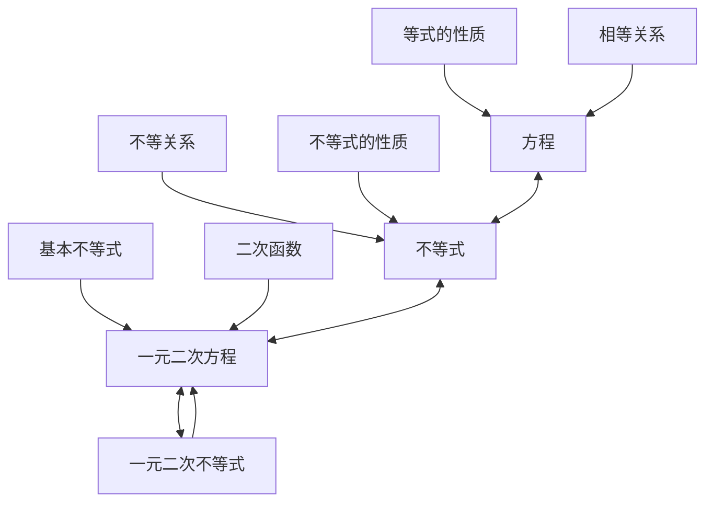
</details>

### 二、回顾与思考

本章我们类比初中学过的等式与方程学习了不等式的一些知识。与用方程刻画相等关系类似，我们用不等式刻画不等关系。解决不等式问题需要利用不等式的性质，为此，在学习关于实数大小关系的基本事实的基础上，类比等式的性质，先研究了不等式的一些性质；接着，利用不等式的性质研究了基本不等式，并用基本不等式解决了一些最值问题；最后，学习了一元二次不等式，并利用它与二次函数、一元二次方程的联系获得了求解它的一种方法。

关于实数大小关系的基本事实是解决等式、不等式问题的逻辑基础。不等式与等式之间既有共性又有差异，所以可以通过类比等式的内容和研究方法，获得关于不等式的内容和研究方法的启发。其中，“运算中的不变性就是性质”指引我们发现了一些不等式的性质；等号没有方向性而不等号具有方向性，这使我们注意到，在不等式两边同乘一个数（式）时，所乘数（式）的符号对不等号方向的影响；等等。以实数大小关系的基本事实为基础，先通过类比，归纳猜想出不等式性质；再运用逻辑推理证明不等式性质。这个过程不仅可以使我们学习发现数学关系、规律的方法，而且可以培养我们借助直观理解数学内容、通过逻辑推理证明数学结论的思维习惯。
同样地，类比用一次函数的观点看一元一次方程、一元一次不等式，我们得到了以二次函数为纽带，把一元二次方程、一元二次不等式联系起来的思想方法，并得到了一种利用函数的零点求一元二次不等式解集的简捷方法.
因此，类比是发现的引路人，在今后的学习中我们会经常用到它。

请你带着下面的问题，复习一下本章内容吧！

1. 举出一些蕴含不等关系的实际例子，并用不等式描述这些不等关系.  
2. 你能说说用两个实数大小关系的基本事实解决问题时的基本思路吗?  
3. 在类比等式的基本性质研究不等式的基本性质时，你认为应特别注意哪些问题？  
4. 两个正数的大小关系是完全确定的，但通过运算就会产生非常奇妙的变化，基本不等式就是其中之一。你还能通过运算（代数变形）得出基本不等式的一些变式吗？通过对变式的研究，你有什么体会？  
5. 用基本不等式解决最大值、最小值问题时，你认为应注意哪些问题？  
6. 用函数理解方程和不等式是数学的基本思想方法，其中函数的图象、零点、图象与 $x$ 轴的关系等是关键要素。你能以函数观点看一元二次方程、一元二次不等式为例，谈谈体会吗？

## 复习参考题2

### 复习巩固

1. 某夏令营有 48 人，出发前要从 A，B 两种型号的帐篷中选择一种。A 型号的帐篷比 B 型号的少 5 顶。若只选 A 型号的，每顶帐篷住 4 人，则帐篷不够；每顶帐篷住 5 人，则有一顶帐篷没有住满。若只选 B 型号的，每顶帐篷住 3 人，则帐篷不够；每顶帐篷住 4 人，则有帐篷多余。设 A 型号的帐篷有 x 顶，用不等式将题目中的不等关系表示出来。

2. 用不等号“>”或“<”填空：
(1) 若 a > b，且 $\frac{1}{a} > \frac{1}{b}$ ，则 ab \_\_\_\_ 0；  
(2) 若 $c > a > b > 0$ ，则 $\frac{a}{c - a} = \frac{b}{c - b}$ ;  
(3) 若 $a > b > c > 0$ ，则 $\frac{a}{b} = \frac{a + c}{b + c}$ .

3.（1）在面积为定值 $S$ 的扇形中，半径是多少时扇形的周长最小？
(2) 在周长为定值 P 的扇形中，半径是多少时扇形的面积最大？

4. 求下列不等式的解集：
(1) $14-4x^{2}\geqslant x;$   
(3) $x^{2} + 6x + 10 > 0$
(2) $x^{2} - 14x + 45 \leqslant 0$ ;   
(4) $x(x + 2) > x(3 - x) + 1.$


<details>
<summary>natural_image</summary>

Two blue and purple camping tents in a grassy outdoor setting with bare trees and hills in the background (no visible text or symbols)
</details>

(第1题)

### 综合运用

5. 若 $a, b > 0$ ，且 $ab = a + b + 3$ ，求 $ab$ 的取值范围.  
6. 当 $k$ 取什么值时，一元二次不等式 $2kx^{2} + kx - \frac{3}{8} < 0$ 对一切实数 $x$ 都成立？  
7. 一般认为，民用住宅的窗户面积必须小于地板面积，但窗户面积与地板面积的比应不小于 $10\%$ ，而且这个比值越大，采光效果越好.
(1) 若一所公寓窗户面积与地板面积的总和为 $220 \mathrm{~m}^{2}$ , 则这所公寓的窗户面积至少为多少平方米?   
(2) 若同时增加相同的窗户面积和地板面积, 公寓的采光效果是变好了还是变坏了?

8. 相等关系和不等关系之间具有对应关系：即只要将一个相等关系的命题中的等号改为不等号就可得到一个相应的不等关系的命题。请你用类比的方法探索相等关系和不等关系的对应性质，仿照下表列出尽可能多的有关对应关系的命题；指出所列的对应不等关系的命题是否正确，并说明理由。

<table><tr><td>相等关系</td><td colspan="2">不等关系</td></tr><tr><td>相等关系的命题</td><td>不等关系的命题</td><td>判断正误</td></tr><tr><td>(1) 若  $x = y$ ,则  $x^{3} = y^{3}$ </td><td>(1) 若  $x > y$ ,则  $x^{3} > y^{3}$ </td><td>正确</td></tr><tr><td></td><td></td><td></td></tr></table>

### 拓广探索

9. 如图，居民小区要建一座八边形的休闲场所，它的主体造型平面图是由两个相同的矩形 ABCD 和 EFGH 构成的面积为 $200 \, m^{2}$ 的十字形地域。计划在正方形 MNPQ 上建一座花坛，造价为 $4200 \, 元/m^{2}$ ；在四个相同的矩形（图中阴影部分）上铺花岗岩地坪，造价为 $210 \, 元/m^{2}$ ；再在四个空角（图中四个三角形）上铺草坪，造价为 $80 \, 元/m^{2}$ 。设总造价为 S（单位：元），AD 长为 x（单位：m）。当 x 为何值时，S 最小？并求出这个最小值。

10. 购买同一种物品，可以用两种不同的策略，第一种是不考虑物品价格的升降，每次购买这种物品的数量一定；第二种是不考虑物品价格的升降，每次购买这种物品所花的钱数一定。哪种购物方式比较经济？你能把所得结论作一些推广吗？

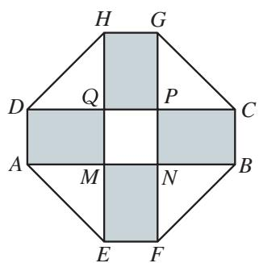

<details>
<summary>text_image</summary>

H G
D Q P C
A M N B
E F
</details>

(第9题)

# 第三章 函数的概念与性质

客观世界中有各种各样的运动变化现象。例如，天宫二号在发射过程中，离发射点的距离随时间的变化而变化；一个装满水的蓄水池在使用过程中，水面高度随时间的变化而不断降低；我国高速铁路营业里程逐年增加……所有这些都表现为变量间的对应关系，这种关系常常可用函数模型来描述，并且通过研究函数模型就可以把握相应的运动变化规律。

随着学习的深入你会发现，函数是贯穿高中数学的一条主线，是解决数学问题的基本工具；函数概念及其反映的数学思想方法已渗透到数学的各个领域，是进一步学习数学的重要基础。同时，函数知识有广泛的实际应用，并且是学习其他学科的重要基础。

本章我们将在初中的基础上，通过具体实例学习用集合语言和对应关系刻画函数概念，通过函数的不同表示法加深对函数概念的认识，学习用精确的符号语言刻画函数性质的方法，并通过幂函数的学习感受研究函数的基本内容、过程和方法。在此基础上，学习运用函数理解和处理问题的方法。


<details>
<summary>text_image</summary>

人民教育出版社
</details>

## 3.1 函数的概念及其表示

在初中我们已经接触过函数的概念，知道函数是刻画变量之间对应关系的数学模型和工具。例如，正方形的周长 $l$ 与边长 $x$ 的对应关系是 $l = 4x$ ，而且对于每一个确定的 $x$ 都有唯一的 $l$ 与之对应，所以 $l$ 是 $x$ 的函数。这个函数与正比例函数 $y = 4x$ 相同吗？又如，你能用已有的函数知识判断 $y = x$ 与 $y = \frac{x^2}{x}$ 是否相同吗？要解决这些问题，就需要进一步学习函数概念。

### 3.1.1 函数的概念

先分析以下问题.

问题 1 某 “复兴号” 高速列车加速到 350 km/h 后保持匀速运行半小时. 这段时间内, 列车行进的路程 s (单位: km) 与运行时间 t (单位: h) 的关系可以表示为
$s = 3 5 0 t.$

这里， $t$ 和 $s$ 是两个变量，而且对于 $t$ 的每一个确定的值， $s$ 都有唯一确定的值与之对应，所以 $s$ 是 $t$ 的函数.


<details>
<summary>natural_image</summary>

High-speed train traveling through a yellow rapeseed field with mountainous backdrop (no visible text or symbols)
</details>

> [!think] 思考
有人说：“根据对应关系 $s = 350t$ ，这趟列车加速到 $350\mathrm{km / h}$ 后，运行 $1\mathrm{h}$ 就前进了 $350\mathrm{km}$ 。”你认为这个说法正确吗？

根据问题 1 的条件，我们不能判断列车以 350 km/h 运行半小时后的情况，所以上述说法不正确。显然，其原因是没有关注到 t 的变化范围。

下面用更精确的语言表示问题 1 中 s 与 t 的对应关系.

列车行进的路程 s 与运行时间 t 的对应关系是
$s = 3 5 0 t. \tag {①}$

其中，t 的变化范围是数集 $A_{1}=\{t\mid0\leqslant t\leqslant0.5\}$ ，s 的变化范围是数集 $B_{1}=\{s\mid0\leqslant s\leqslant175\}$ 。对于数集 $A_{1}$ 中的任一时刻 t，按照对应关系①，在数集 $B_{1}$ 中都有唯一确定的路程 s 和它对应。

问题 2 某电气维修公司要求工人每周工作至少 1 天，至多 6 天。如果公司确定的工资标准是每人每天 350 元，而且每周付一次工资，那么你认为该怎样确定一个工人每周的工资？一个工人的工资 w（单位：元）是他工作天数 d 的函数吗？
显然，工资 $w$ 是一周工作天数 $d$ 的函数，其对应关系是
$w = 3 5 0 d. \tag {②}$

其中，d 的变化范围是数集 $A_{2}=\{1,2,3,4,5,6\}$ ，w 的变化范围是数集 $B_{2}=\{350,700,1050,1400,1750,2100\}$ 。对于数集 $A_{2}$ 中的任一个工作天数 d，按照对应关系②，在数集 $B_{2}$ 中都有唯一确定的工资 w 与它对应。

问题 1 和问题 2 中的函数有相同的对应关系，你认为它们是同一个函数吗？为什么？

问题 3 图 3.1-1 是某市某日的空气质量指数（Air Quality Index，简称 AQI）变化图。如何根据该图确定这一天内任一时刻 t h 的空气质量指数（AQI）的值 I？你认为这里的 I 是 t 的函数吗？

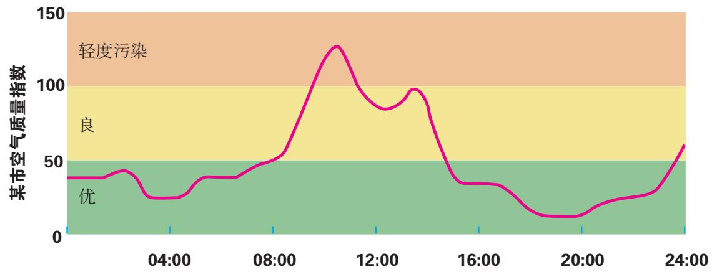

<details>
<summary>area</summary>

| Time   | 某市空气质量指数 |
| ------ | ---------------- |
| 04:00  | ~40              |
| 08:00  | ~55              |
| 12:00  | ~130             |
| 16:00  | ~35              |
| 20:00  | ~15              |
| 24:00  | ~60              |
</details>

图3.1-1

从图3.1-1中的曲线可知， $t$ 的变化范围是数集 $A_{3} = \{t\mid 0\leqslant t\leqslant 24\}$ ，AQI的值 $I$ 都在数集 $B_{3} = \{I\mid 0 < I < 150\}$ 中．对于数集 $A_{3}$ 中的任一时刻 $t$ ，按照图3.1-1中曲线所给定的对应关系，在数集 $B_{3}$ 中都有唯一确定的AQI的值 $I$ 与之对应．因此，这里的 $I$ 是 $t$ 的函数.

你能根据图 3.1-1 找到中午 12 时的 AQI 的值吗?

问题 4 国际上常用恩格尔系数 $r\left(r=\frac{\text{食物支出金额}}{\text{总支出金额}}\times100\%\right)$ 反映一个地区人民生活质量的高低，恩格尔系数越低，生活质量越高。表 3.1-1 是我国城镇居民恩格尔系数变化情况。

表 3.1-1 我国城镇居民恩格尔系数变化情况

<table><tr><td>年份 y</td><td>2012</td><td>2013</td><td>2014</td><td>2015</td><td>2016</td><td>2017</td><td>2018</td><td>2019</td><td>2020</td><td>2021</td></tr><tr><td>恩格尔系数 r(%)</td><td>32.0</td><td>30.1</td><td>30.0</td><td>29.7</td><td>29.3</td><td>28.6</td><td>27.7</td><td>27.6</td><td>29.2</td><td>28.6</td></tr></table>

你认为按表3.1-1给出的对应关系，恩格尔系数 $r$ 是年份 $y$ 的函数吗？如果是，你会用怎样的语言来刻画这个函数？

这里， $y$ 的取值范围是数集 $A_{4} = \{2012, 2013, 2014, 2015, 2016, 2017, 2018, 2019, 2020, 2021\}$ ；根据恩格尔系数的定义可知， $r$ 的取值范围是数集 $B_{4} = \{r \mid 0 < r \leqslant 1\}$ 。对于数集 $A_{4}$ 中的任意一个年份 $y$ ，根据表3.1-1所给定的对应关系，在数集 $B_{4}$ 中都有唯一确定的恩格尔系数 $r$ 与之对应。所以， $r$ 是 $y$ 的函数。


> [!tip] 归纳

上述问题 1～问题 4 中的函数有哪些共同特征？由此你能概括出函数概念的本质特征吗？

上述问题的共同特征有：
（1）都包含两个非空数集，用 A, B 来表示；  
(2) 都有一个对应关系;  
（3）尽管对应关系的表示方法不同，但它们都有如下特性：对于数集 A 中的任意一个数 x，按照对应关系，在数集 B 中都有唯一确定的数 y 和它对应.
事实上，除解析式、图象、表格外，还有其他表示对应关系的方法。为了表示方便，我们引进符号 $f$ 统一表示对应关系。

一般地，设 A，B 是非空的实数集，如果对于集合 A 中的任意一个数 x，按照某种确定的对应关系 f，在集合 B 中都有唯一确定的数 y 和它对应，那么就称 $f: A \rightarrow B$ 为从集合 A 到集合 B 的一个函数（function），记作
$y = f (x), x \in A.$

其中，x 叫做自变量，x 的取值范围 A 叫做函数的定义域（domain）；与 x 的值相对应的 y 值叫做函数值，函数值的集合 $\{f(x) | x \in A\}$ 叫做函数的值域（range）.
显然，值域是集合 $B$ 的子集。在问题1与问题2中，值域就是 $B_{1}$ 和 $B_{2}$ ；在问题3中，值域是数集 $B_{3}$ 的真子集；在问题4中，值域 $C_4 = \{0.32, 0.301, 0.3, 0.297, 0.293, 0.286, 0.277, 0.276, 0.292\}$ ，是数集 $B_{4} = \{r \mid 0 < r \leqslant 1\}$ 的真子集。

17世纪后期，德国数学家莱布尼茨第一次将“function”一词作为专门的数学术语；19世纪，李善兰首次将function翻译成“函数”.

我们所熟悉的一次函数 $y = ax + b (a \neq 0)$ 的定义域是 $\mathbf{R}$ ，值域也是 $\mathbf{R}$ . 对应关系 $f$ 把 $\mathbf{R}$ 中的任意一个数 $x$ ，对应到 $\mathbf{R}$ 中唯一确定的数 $ax + b (a \neq 0)$ .

二次函数 $y = ax^2 + bx + c (a \neq 0)$ 的定义域是 $\mathbf{R}$ ，值域是 $B$ 。当 $a > 0$ 时， $B = \left\{y \mid y \geqslant \frac{4ac - b^2}{4a}\right\}$ ；当 $a < 0$ 时， $B = \left\{y \mid y \leqslant \frac{4ac - b^2}{4a}\right\}$ 。对应关系 $f$ 把 $\mathbf{R}$ 中的任意一个数 $x$ ，对应到 $B$ 中唯一确定的数 $ax^2 + bx + c (a \neq 0)$ 。

> [!think] 思考
反比例函数 $y = \frac{k}{x} (k \neq 0)$ 的定义域、对应关系和值域各是什么？请用函数定义描述这个函数.

> [!example]- 例1 函数的解析式是舍弃问题的实际背景而抽象出来的，它所反映的两个量之间的对应关系，可以广泛地用于刻画一类事物中的变量关系和规律。例如，正比例函数 $y = kx$ ( $k \neq 0$ ) 可以用来刻画匀速运动中路程与时间的关系、一定密度的物体的质量与体积的关系、圆的周长与半径的关系等。
试构建一个问题情境，使其中的变量关系可以用解析式 $y=x(10-x)$ 来描述.
解：把 $y = x(10 - x)$ 看成二次函数，那么它的定义域是 $\mathbf{R}$ ，值域是 $B = \{y \mid y \leqslant 25\}$ . 对应关系 $f$ 把 $\mathbf{R}$ 中的任意一个数 $x$ ，对应到 $B$ 中唯一确定的数 $x(10 - x)$ .
如果对 $x$ 的取值范围作出限制，例如 $x \in \{x \mid 0 < x < 10\}$ ，那么可以构建如下情境：

长方形的周长为 20，设一边长为 x，面积为 y，那么 $y = x(10 - x)$ .

其中，x 的取值范围是 $A=\{x\mid0<x<10\}$ ，y 的取值范围是 $B=\{y\mid0<y\leqslant25\}$ 。对应关系 f 把每一个长方形的边长 x，对应到唯一确定的面积 $x(10-x)$ 。

> [!explore] 探究
构建其他可用解析式 $y=x(10-x)$ 描述其中变量关系的问题情境.

#### 练习

1. 一枚炮弹发射后，经过 $26 \mathrm{~s}$ 落到地面击中目标。炮弹的射高为 $845 \mathrm{~m}$ ，且炮弹距地面的高度 $h$ （单位： $\mathrm{m}$ ）与时间 $t$ （单位： $\mathrm{s}$ ）的关系为
$h = 1 3 0 t - 5 t ^ {2}. \tag {①}$

求①所表示的函数的定义域与值域，并用函数的定义描述这个函数.

2. 某日 8 时至次日 8 时（次日的时间前加 0 表示）某市的温度走势如图所示.
（1）求对应关系为图中曲线的函数的定义域与值域；  
(2) 根据图象，求这一天 12 时所对应的温度.

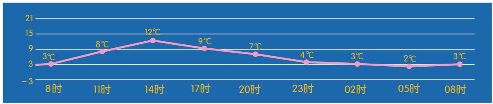

<details>
<summary>line</summary>

| 时间 | 温度 (°C) |
| :--- | :--- |
| 8时 | 3 |
| 11时 | 8 |
| 14时 | 12 |
| 17时 | 9 |
| 20时 | 7 |
| 23时 | 4 |
| 02时 | 3 |
| 05时 | 2 |
| 08时 | 3 |
</details>

(第2题)

3. 集合 $A, B$ 与对应关系 $f$ 如下图所示：

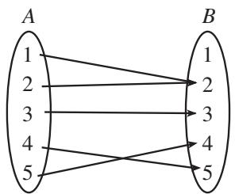

<details>
<summary>flowchart</summary>

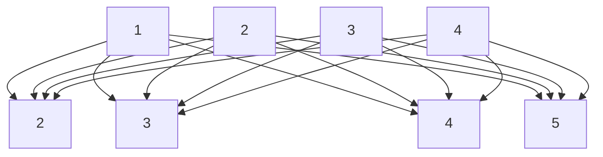
</details>

(第3题)
$f: A \to B$ 是否为从集合 $A$ 到集合 $B$ 的函数？如果是，那么定义域、值域与对应关系各是什么？

4. 构建一个问题情境，使其中的变量关系能用解析式 $y=\sqrt{x}$ 来描述.

研究函数时常会用到区间的概念.
设 $a, b$ 是两个实数，而且 $a < b$ 。我们规定：
（1）满足不等式 $a \leqslant x \leqslant b$ 的实数 x 的集合叫做闭区间，表示为 $[a, b]$ ;  
(2) 满足不等式 a < x < b 的实数 x 的集合叫做开区间，表示为 $(a, b)$ ;  
（3）满足不等式 $a \leqslant x < b$ 或 $a < x \leqslant b$ 的实数 $x$ 的集合叫做半开半闭区间，分别表示为 $[a, b), (a, b]$ .

这里的实数 a 与 b 都叫做相应区间的端点.

这些区间的几何表示如表 3.1-2 所示。在数轴表示时，用实心点表示包括在区间内的端点，用空心点表示不包括在区间内的端点。

表3.1-2

<table><tr><td>区间</td><td>数轴表示</td></tr><tr><td> $[a, b]$ </td><td></td></tr><tr><td> $(a, b)$ </td><td></td></tr><tr><td> $[a, b)$ </td><td></td></tr><tr><td> $(a, b]$ </td><td></td></tr></table>

实数集 R 可以用区间表示为 $(-∞, +∞)$ ，“∞”读作“无穷大”，“-∞”读作“负

无穷大”，“+∞”读作“正无穷大”.

满足 $x \geqslant a, x > a, x \leqslant b, x < b$ 的实数 $x$ 的集合，可以用区间分别表示为 $[a, +\infty), (a, +\infty), (-\infty, b], (-\infty, b)$ . 这些区间的几何表示如表3.1-3所示.

表3.1-3

<table><tr><td>区间</td><td>数轴表示</td></tr><tr><td>[a,+∞)</td><td>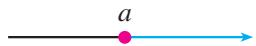</td></tr><tr><td>(a,+∞)</td><td>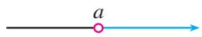</td></tr><tr><td>(-∞,b]</td><td></td></tr><tr><td>(-∞,b)</td><td>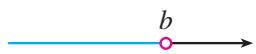</td></tr></table>

> [!example]- 例 2 已知函数 $f(x)=\sqrt{x+3}+\frac{1}{x+2}$ ,
(1) 求函数的定义域;   
(2) 求 $f(-3)$ ， $f\left(\frac{2}{3}\right)$ 的值；  
(3) 当 a > 0 时，求 $f(a)$ ， $f(a - 1)$ 的值.
分析：函数的定义域通常由问题的实际背景确定。如果只给出解析式 $y = f(x)$ ，而没有指明它的定义域，那么函数的定义域就是指能使这个式子有意义的实数的集合。

在函数定义中，我们用符号 $y = f(x)$ 表示函数，其中 $f(x)$ 表示 $x$ 对应的函数值，而不是 $f$ 乘 $x$ .
解：（1）使根式 $\sqrt{x + 3}$ 有意义的实数 $x$ 的集合是 $\{x \mid x \geqslant -3\}$ ，使分式 $\frac{1}{x + 2}$ 有意义的实数 $x$ 的集合是 $\{x \mid x \neq -2\}$ . 所以，这个函数的定义域是
$\{x \mid x \geqslant - 3 \} \cap \{x \mid x \neq - 2 \} = \{x \mid x \geqslant - 3, \text {且} x \neq - 2 \},$
即 $\left[-3,-2\right)\cup(-2,+\infty)$ .
(2) 将 -3 与 $\frac{2}{3}$ 代入解析式，有
$f (- 3) = \sqrt {- 3 + 3} + \frac {1}{- 3 + 2} = - 1;$
$f \left(\frac {2}{3}\right) = \sqrt {\frac {2}{3} + 3} + \frac {1}{\frac {2}{3} + 2} = \sqrt {\frac {1 1}{3}} + \frac {3}{8} = \frac {3}{8} + \frac {\sqrt {3 3}}{3}.$
（3）因为 a > 0，所以 $f(a)$ ， $f(a - 1)$ 有意义.
$f (a) = \sqrt {a + 3} + \frac {1}{a + 2};$
$f (a - 1) = \sqrt {a - 1 + 3} + \frac {1}{a - 1 + 2} = \sqrt {a + 2} + \frac {1}{a + 1}.$
由函数的定义可知，一个函数的构成要素为：定义域、对应关系和值域。因为值域是由定义域和对应关系决定的，所以，如果两个函数的定义域相同，并且对应关系完全一致，即相同的自变量对应的函数值也相同，那么这两个函数是同一个函数。

两个函数如果仅有对应关系相同，但定义域不相同，那么它们不是同一个函数。例如，前面的问题1和问题2中，尽管两个函数的对应关系都是 $y = 350x$ ，但它们的定义域不相同，因此它们不是同一个函数；同时，它们的定义域都不是R，而是R的真子集，因此它们与正比例函数 $y = 350x (x \in \mathbf{R})$ 也不是同一个函数。

此外，函数 $u = t^2$ ， $t\in (-\infty , + \infty)$ ， $x = y^{2}$ ， $y\in (-\infty , + \infty)$ 与 $y = x^{2}$ $x\in (-\infty , + \infty)$ ，虽然表示它们的字母不同，但因为它们的对应关系和定义域相同，所以它们是同一个函数.

> [!example]- 例 3 下列函数中哪个与函数 y=x 是同一个函数?
(1) $y = (\sqrt{x})^2$ ;
(2) $u=\sqrt[3]{v^{3}}$ ;
(3) $y = \sqrt{x^2}$ ;
(4) $m = \frac{n^2}{n}$ .
解：（1） $y=(\sqrt{x})^{2}=x(x\in\{x|x\geqslant0\})$ ，它与函数 $y=x(x\in\mathbf{R})$ 虽然对应关系相同，但是定义域不相同，所以这个函数与函数 $y=x(x\in\mathbf{R})$ 不是同一个函数.
(2) $u = \sqrt[3]{v^3} = v(v \in \mathbf{R})$ ，它与函数 $y = x (x \in \mathbf{R})$ 不仅对应关系相同，而且定义域也相同，所以这个函数与函数 $y = x (x \in \mathbf{R})$ 是同一个函数.
(3) $y = \sqrt{x^2} = |x| = \begin{cases} -x, & x < 0, \\ x, & x \geqslant 0, \end{cases}$ 它与函数 $y = x (x \in \mathbf{R})$ 的定义域都是实数集 $\mathbf{R}$ ，但是当 $x < 0$ 时，它的对应关系与函数 $y = x (x \in \mathbf{R})$ 不相同。所以这个函数与函数 $y = x (x \in \mathbf{R})$ 不是同一个函数。
(4) $m = \frac{n^2}{n} = n (n \in \{n \mid n \neq 0\})$ ，它与函数 $y = x (x \in \mathbf{R})$ 的对应关系相同但定义域不相同。所以这个函数与函数 $y = x (x \in \mathbf{R})$ 不是同一个函数。

也可以利用信息技术画出例3中四个函数的图象，根据图象进行判断.

> [!think] 思考
至此，我们在初中学习的基础上，运用集合语言和对应关系刻画了函数，并引进了符号 $y = f(x)$ ，明确了函数的构成要素。比较函数的这两种定义，你对函数有什么新的认识？

#### 练习

1. 求下列函数的定义域：
(1) $f(x)=\frac{1}{4x+7};$
(2) $f(x) = \sqrt{1 - x} + \sqrt{x + 3} - 1.$

2. 已知函数 $f(x)=3x^{3}+2x$ ,
(1) 求 $f(2)$ ， $f(-2)$ ， $f(2)+f(-2)$ 的值；  
(2) 求 $f(a)$ ， $f(-a)$ ， $f(a)+f(-a)$ 的值.

3. 判断下列各组中的函数是否为同一个函数，并说明理由：
（1）表示炮弹飞行高度 $h$ 与时间 $t$ 关系的函数 $h = 130t - 5t^2$ 和二次函数 $y = 130x - 5x^2$   
(2) $f(x) = 1$ 和 $g(x) = x^0$ .

### 3.1.2 函数的表示法

我们在初中已经接触过函数的三种表示法：解析法、列表法和图象法.
解析法，就是用解析式表示两个变量之间的对应关系，如 3.1.1 的问题 1、2.

列表法，就是列出表格来表示两个变量之间的对应关系，如3.1.1的问题4.

图象法，就是用图象表示两个变量之间的对应关系，如 3.1.1 的问题 3.

这三种方法是常用的函数表示法.

> [!example]- 例 4 某种笔记本的单价是 5 元，买 $x(x \in \{1, 2, 3, 4, 5\})$ 个笔记本需要 y 元。试用函数的三种表示法表示函数 $y = f(x)$ 。
解：这个函数的定义域是数集 $\{1,2,3,4,5\}$ .

用解析法可将函数 $y = f(x)$ 表示为
$y = 5 x, x \in \{1, 2, 3, 4, 5 \}.$

用列表法可将函数 $y = f(x)$ 表示为

<table><tr><td>笔记本数x</td><td>1</td><td>2</td><td>3</td><td>4</td><td>5</td></tr><tr><td>钱数y</td><td>5</td><td>10</td><td>15</td><td>20</td><td>25</td></tr></table>

用图象法可将函数 $y=f(x)$ 表示为图 3.1-2.

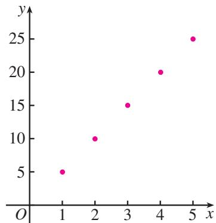

<details>
<summary>scatter</summary>

| x | y |
|---|---|
| 1 | 5 |
| 2 | 10 |
| 3 | 15 |
| 4 | 20 |
| 5 | 25 |
</details>

图3.1-2

函数图象既可以是光滑的曲线，也可以是直线、折线、离散的点等。那么判断一个图形是不是函数图象的依据是什么？

> [!think] 思考
(1) 比较函数的三种表示法，它们各自的特点是什么？  
(2) 所有函数都能用解析法表示吗？请你举出实例加以说明.

> [!example]- 例 5 画出函数 $y=|x|$ 的图象.
解：由绝对值的概念，我们有
$y = \left\{ \begin{array}{l l} - x, & x <   0, \\ x, & x \geqslant 0. \end{array} \right.$
所以，函数 $y=|x|$ 的图象如图 3.1-3 所示.

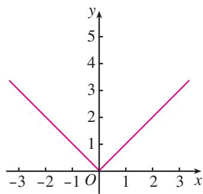

<details>
<summary>line</summary>

| x | y |
|---|---|
| -3 | 3.5 |
| -2 | 2.5 |
| -1 | 1.5 |
| 0 | 0 |
| 1 | 1.5 |
| 2 | 2.5 |
| 3 | 3.5 |
</details>

图3.1-3

像例 5 中 $y=\left\{\begin{aligned}-x,&x<0,\\ x,&x\geqslant0\end{aligned}\right.$ 这样的函数称为分段函数。生活中，有很多可以用分段函数描述的实际问题，如出租车的计费、个人所得税纳税额等。

> [!example]- 例 6 给定函数 $f(x)=x+1$ ， $g(x)=(x+1)^{2}$ ， $x\in\mathbf{R}$ ，
(1) 在同一直角坐标系中画出函数 $f(x)$ ， $g(x)$ 的图象；  
(2) $\forall x \in \mathbf{R}$ , 用 $M(x)$ 表示 $f(x)$ , $g(x)$ 中的最大者, 记为
$M (x) = \max \{f (x), g (x) \}.$

例如，当 $x = 2$ 时， $M(2) = \max \{f(2), g(2)\} = \max \{3, 9\} = 9.$

请分别用图象法和解析法表示函数 $M(x)$ .
解：（1）在同一直角坐标系中画出函数 $f(x)$ ， $g(x)$ 的图象（图 3.1-4）.
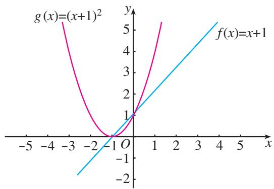

<details>
<summary>line</summary>

| x    | g(x)=(x+1)² | f(x)=x+1 |
| ---- | ----------- | -------- |
| -5   | 5           | -2       |
| -4   | 3           | -1       |
| -3   | 1           | 0        |
| -2   | 0           | 1        |
| -1   | -1          | 2        |
| 0    | 0           | 3        |
| 1    | 1           | 4        |
| 2    | 2           | 5        |
| 3    | 3           | 6        |
| 4    | 4           | 7        |
| 5    | 5           | 8        |
</details>

图3.1-4

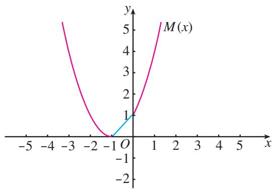

<details>
<summary>line</summary>

| x   | y    |
| --- | ---- |
| -5  | 6.0  |
| -4  | 4.0  |
| -3  | 2.0  |
| -2  | 1.0  |
| -1  | 0.5  |
| 0   | 1.0  |
| 1   | 2.0  |
| 2   | 4.0  |
| 3   | 6.0  |
| 4   | 8.0  |
| 5   | 10.0 |
</details>

图3.1-5
（2）由图3.1-4中函数取值的情况，结合函数 $M(x)$ 的定义，可得函数 $M(x)$ 的图象（图3.1-5).
由 $(x+1)^{2}=x+1$ ，得 $x(x+1)=0$ 。
解得 x = -1，或 x = 0。

结合图3.1-5，得出函数 $M(x)$ 的解析式为
$M (x) = \left\{ \begin{array}{l l} (x + 1) ^ {2}, & x \leqslant - 1, \\ x + 1, & - 1 <   x \leqslant 0, \\ (x + 1) ^ {2}, & x > 0. \end{array} \right.$

你能用其他方法求出 $M(x)$ 的解析式吗？

#### 练习

1. 如图，把直截面半径为 $25 \mathrm{~cm}$ 的圆柱形木头锯成直截面为矩形的木料，如果矩形的一边长为 $x$ （单位： $\mathrm{cm}$ ），面积为 $y$ （单位： $\mathrm{cm}^2$ ），把 $y$ 表示为 $x$ 的函数。  
2. 画出函数 $y = |x - 2|$ 的图象.  
3. 给定函数 $f(x) = -x + 1$ , $g(x) = (x - 1)^{2}$ , $x \in R$ ,
(1) 画出函数 $f(x)$ ， $g(x)$ 的图象；
(2) $\forall x \in \mathbf{R}$ , 用 $m(x)$ 表示 $f(x)$ , $g(x)$ 中的最小者, 记为 $m(x) = \min\{f(x), g(x)\}$ , 请分别用图象法和解析法表示函数 $m(x)$ .

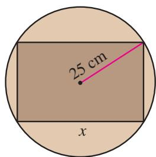

<details>
<summary>text_image</summary>

25 cm
x
</details>

(第1题)

对于一个具体的问题，如果涉及函数，那么应当学会选择恰当的方法表示问题中的函数关系.

> [!example]- 例 7 表 3.1-4 是某校高一（1）班三名同学在高一学年度六次数学测试的成绩及班级平均分表.
表3.1-4

<table><tr><td rowspan="2">姓名</td><td colspan="6">测试序号</td></tr><tr><td>第1次</td><td>第2次</td><td>第3次</td><td>第4次</td><td>第5次</td><td>第6次</td></tr><tr><td>王伟</td><td>98</td><td>87</td><td>91</td><td>92</td><td>88</td><td>95</td></tr><tr><td>张城</td><td>90</td><td>76</td><td>88</td><td>75</td><td>86</td><td>80</td></tr><tr><td>赵磊</td><td>68</td><td>65</td><td>73</td><td>72</td><td>75</td><td>82</td></tr><tr><td>班级平均分</td><td>88.2</td><td>78.3</td><td>85.4</td><td>80.3</td><td>75.7</td><td>82.6</td></tr></table>

请你对这三位同学在高一学年的数学学习情况做一个分析.
解：从表3.1-4中可以知道每位同学在每次测试中的成绩，但不太容易分析每位同学的成绩变化情况。如果将每位同学的“成绩”与“测试序号”之间的函数关系分别用图象（均为6个离散的点）表示出来，如图3.1-6，那么就能直观地看到每位同学成绩变化的情况，这对我们的分析很有帮助。

从图 3.1-6 可以看到，王伟同学的数学学习成绩始终高于班级平均水平，学习情况比较稳定而且成绩优秀。张城同学的数学学习成绩不稳定，总是在班级平均水平上下波动，而且波动幅度较大. 赵磊同学的数学学习成绩低于班级平均水平, 但表示他成绩变化的图象呈上升趋势, 表明他的数学成绩在稳步提高.

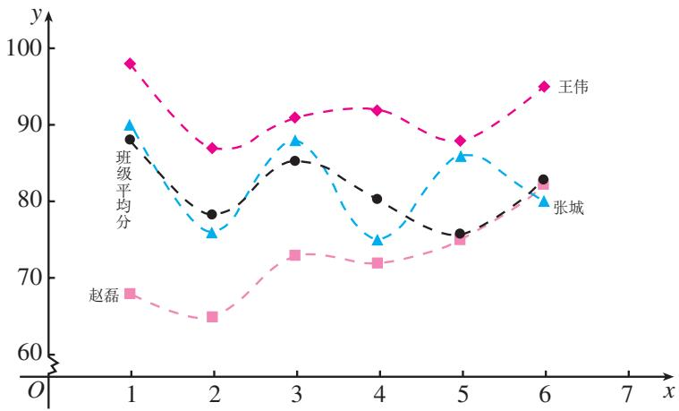

<details>
<summary>line</summary>

| x | 班级平均分 | 张城 | 赵磊 |
|---|---|---|---|
| 1 | 88 | 90 | 68 |
| 2 | 78 | 75 | 65 |
| 3 | 85 | 88 | 73 |
| 4 | 80 | 75 | 72 |
| 5 | 75 | 85 | 74 |
| 6 | 82 | 80 | 82 |
| 1 | 98 | 90 | - |
| 2 | 87 | - | - |
| 3 | 91 | - | - |
| 4 | 92 | - | - |
| 5 | 88 | - | - |
| 6 | 95 | - | - |
</details>

图3.1-6

为了更容易看出一个同学的学习情况，我们将表示每位同学成绩的函数图象（离散的点）用虚线连接.

> [!example]- 例 8 依法纳税是每个公民应尽的义务，个人取得的所得应依照《中华人民共和国个人所得税法》向国家缴纳个人所得税（简称个税）。2019年1月1日起，个税税额根据应纳税所得额、税率和速算扣除数确定，计算公式为
个税税额=应纳税所得额×税率-速算扣除数. ①

应纳税所得额的计算公式为

应纳税所得额=综合所得收入额-基本减除费用-专项扣除

一专项附加扣除一依法确定的其他扣除. ②

其中，“基本减除费用”（免征额）为每年60 000元. 税率与速算扣除数见表3.1-5.

表3.1-5

<table><tr><td>级数</td><td>全年应纳税所得额所在区间</td><td>税率(%)</td><td>速算扣除数</td></tr><tr><td>1</td><td>[0,36 000]</td><td>3</td><td>0</td></tr><tr><td>2</td><td>(36 000,144 000]</td><td>10</td><td>2 520</td></tr><tr><td>3</td><td>(144 000,300 000]</td><td>20</td><td>16 920</td></tr><tr><td>4</td><td>(300 000,420 000]</td><td>25</td><td>31 920</td></tr><tr><td>5</td><td>(420 000,660 000]</td><td>30</td><td>52 920</td></tr><tr><td>6</td><td>(660 000,960 000]</td><td>35</td><td>85 920</td></tr><tr><td>7</td><td>(960 000,+∞)</td><td>45</td><td>181 920</td></tr></table>
（1）设全年应纳税所得额为 $t$ ，应缴纳个税税额为 $y$ 求 $y = f(t)$ ，并画出图象；  
（2）小王全年综合所得收入额为 117 600 元，假定缴纳的基本养老保险、基本医疗保险、失业保险等社会保险费和住房公积金占综合所得收入额的比例分别是 8%，2%，

“综合所得”包括工资、薪金，劳务报酬，稿酬，特许权使用费；“专项扣除”包括居民个人按照国家规定的范围和标准缴纳的基本养老保险、基本医疗保险、失业保险等社会保险费和住房公积金等；“专项附加扣除”包括子女教育、继续教育、大病医疗、住房贷款利息或者住房租金、赡养老人等支出；“其他扣除”是指除上述基本减除费用、专项扣除、专项附加扣除之外，由国务院决定以扣除方式减少纳税的优惠政策规定的费用。

1%，9%，专项附加扣除是9600元，依法确定其他扣除是560元，那么他全年应缴纳多少综合所得个税？
分析：根据个税产生办法，可按下列步骤计算应缴纳个税税额：

第一步，根据②计算出应纳税所得额 t；
第二步，由 $t$ 的值并根据表3.1-5得出相应的税率与速算扣除数；
第三步，根据①计算出个税税额 y 的值.
由于不同应纳税所得额 $t$ 对应不同的税率与速算扣除数，所以 $y$ 是 $t$ 的分段函数.
解：（1）根据表3.1-5，可得函数 $y = f(t)$ 的解析式为
$y = \left\{ \begin{array}{l} 0. 0 3 t, 0 \leqslant t \leqslant 3 6 0 0 0, \\ 0. 1 t - 2 5 2 0, 3 6 0 0 0 <   t \leqslant 1 4 4 0 0 0, \\ 0. 2 t - 1 6 9 2 0, 1 4 4 0 0 0 <   t \leqslant 3 0 0 0 0 0, \\ 0. 2 5 t - 3 1 9 2 0, 3 0 0 0 0 0 <   t \leqslant 4 2 0 0 0 0, \\ 0. 3 t - 5 2 9 2 0, 4 2 0 0 0 0 <   t \leqslant 6 6 0 0 0 0, \\ 0. 3 5 t - 8 5 9 2 0, 6 6 0 0 0 0 <   t \leqslant 9 6 0 0 0 0, \\ 0. 4 5 t - 1 8 1 9 2 0, t > 9 6 0 0 0. \end{array} \right. \tag {③}$

函数图象如图 3.1-7 所示.


<details>
<summary>line</summary>

| t       | y        |
| ------- | -------- |
| 36000   | 11880    |
| 420000  | 73080    |
| 660000  | 145080   |
| 960000  | 250080   |
</details>

图3.1-7
(2) 根据②，小王全年应纳税所得额为
$\begin{array}{l} t = 117600 - 60000 - 117600 \times (8 \% + 2 \% + 1 \% + 9 \%) - 9600 - 560 \\ = 0. 8 \times 1 1 7 6 0 0 - 7 0 1 6 0 \\ = 2 3 9 2 0. \\ \end{array}$

将 $t$ 的值代入③，得
$y = 0. 0 3 \times 2 3 9 2 0 = 7 1 7. 6.$
所以，小王应缴纳的综合所得个税税额为 717.6 元.

#### 练习

1. 下图中哪几个图象与下述三件事分别吻合得最好？请你为剩下的那个图象写出一件事.
（1）我离开家不久，发现自己把作业本忘在家里了，于是返回家里找到了作业本再上学；  
(2) 我骑着车离开家后一路匀速行驶，只是在途中遇到一次交通堵塞，耽搁了一些时间；  
（3）我从家出发后，心情轻松，一路缓缓加速行进.


<details>
<summary>line</summary>

| 时间 | 离开家的距离 |
| ---- | ------------ |
| 0    | 0            |
| >0   | 2.5          |
| 10   | 2.5          |
| >10  | 3.5          |
</details>

(A)


<details>
<summary>line</summary>

| 时间 | 离开家的距离 |
| ---- | ------------ |
| 0    | 0            |
| >0   | >1.5         |
</details>

(B)


<details>
<summary>line</summary>

| 时间 | 离开家的距离 |
| ---- | ------------ |
| 0    | 0            |
| 1    | >0           |
</details>

(C)


<details>
<summary>line</summary>

| 时间 | 离开家的距离 |
| ---- | ------------ |
| 0    | 0            |
| 1    | 峰值         |
| 2    | 0            |
| 3    | 0            |
| 4    | 0            |
| 5    | 高点         |
</details>

(D)   
(第1题)

2. 某市 “招手即停” 公共汽车的票价按下列规则制定：
(1) 5 km 以内（含 5 km），票价 2 元；  
(2) 5 km 以上，每增加 5 km，票价增加 1 元（不足 5 km 的按 5 km 计算）.
如果某条线路的总里程为 $20 \, km$ ，请根据题意，写出票价与里程之间的函数解析式，并画出函数的图象.

## 习题3.1

### 复习巩固

1. 求下列函数的定义域：
(1) $f(x) = \frac{3x}{x - 4}$ ;
(2) $f(x) = \sqrt{x^2}$ ;
(3) $f(x) = \frac{6}{x^2 - 3x + 2};$
(4) $f(x) = \frac{\sqrt{4 - x}}{x - 1}.$

2. 下列哪一组中的函数 $f(x)$ 与 $g(x)$ 是同一个函数?
(1) $f(x) = x - 1, g(x) = \frac{x^2}{x} - 1;$   
(2) $f(x) = x^{2}, g(x) = (\sqrt{x})^{4}$ ;   
(3) $f(x) = x^{2}, g(x) = \sqrt[3]{x^{6}}.$

3. 画出下列函数的图象，并说出函数的定义域、值域：
(1) $y = 3x$
(2) $y = \frac{8}{x}$ ;
(3) $y = -4x + 5;$
(4) $y = x^{2} - 6x + 7.$

4. 已知函数 $f(x) = 3x^{2} - 5x + 2$ ，求 $f(-\sqrt{2})$ ， $f(-a)$ ， $f(a + 3)$ ， $f(a) + f(3)$ 的值.  
5. 已知函数 $f(x) = \frac{x + 2}{x - 6}$ ,
(1) 点 (3, 14) 在 $f(x)$ 的图象上吗?  
(2) 当 x=4 时，求 $f(x)$ 的值.  
(3) 当 $f(x)=2$ 时，求 x 的值.

6. 若 $f(x)=x^{2}+bx+c$ ，且 $f(1)=0$ ， $f(3)=0$ ，求 $f(-1)$ 的值.

7. 画出下列函数的图象：
(1) $f(x) = \begin{cases} 0, & x \leqslant 0, \\ 1, & x > 0; \end{cases}$
(2) $G(n) = 3n + 1, n \in \{1,2,3\}$ .

### 综合运用

8. 如图，矩形的面积为 10. 如果矩形的长为 $x$ ，宽为 $y$ ，对角线为 $d$ ，周长为 $l$ ，那么你能获得关于这些量的哪些函数？  
9. 一个圆柱形容器的底部直径是 $d \mathrm{~cm}$ , 高是 $h \mathrm{~cm}$ . 现在向容器内每秒注入某种溶液 $v \mathrm{~cm}^{3}$ . 求容器内溶液的高度 $x$ (单位: $\mathrm{cm}$ ) 关于注入溶液的时间 $t$ (单位: $\mathrm{s}$ ) 的函数解析式, 并写出函数的定义域和值域.  
10. 一个老师用 5 分制对数学作业评分. 一次作业中, 第一小组同学按座位序号 1, 2, 3, 4, 5, 6 的次序, 得分依次是 5, 3, 4, 2, 4, 5. 你会怎样表示这次作业的得分情况? 用 $x$ , $y$ 分别表示序号和对应的得分, $y$ 是 $x$ 的函数吗? 如果是, 那么它的定义域、值域和对应关系各是什么?  
11. 函数 $r = f(p)$ 的图象如图所示，
(1) 函数 $r=f(p)$ 的定义域、值域各是什么?  
(2) r 取何值时，只有唯一的 p 值与之对应？


<details>
<summary>line</summary>

| p    | r    |
| ---- | ---- |
| -5   | 1    |
| 0    | 2    |
| 2    | 3    |
| 6    | 5    |
</details>

(第11题)


<details>
<summary>text_image</summary>

d
x
y
</details>

(第8题)

图中，曲线 $l$ 与直线 $m$ 无限接近，但永不相交.

12. 画出定义域为 $\{x \mid -3 \leqslant x \leqslant 8, \text{且 } x \neq 5\}$ ，值域为 $\{y \mid -1 \leqslant y \leqslant 2, y \neq 0\}$ 的一个函数的图象.
（1）将你的图象和其他同学的相比较，有什么差别吗？  
(2) 如果平面直角坐标系中点 $P(x, y)$ 的坐标满足 $-3 \leqslant x \leqslant 8, -1 \leqslant y \leqslant 2$ ，那么其中哪些点不能在图象上？

13. 函数 $f(x) = [x]$ 的函数值表示不超过 $x$ 的最大整数，例如， $[-3.5] = -4$ ， $[2.1] = 2$ 当 $x \in (-2.5, 3]$ 时，写出函数 $f(x)$ 的解析式，并画出函数的图象.  
14. 构建一个问题情境，使其中的变量关系能用解析式 $y = \frac{1}{2} ax^2 (a > 0)$ 来描述.

### 拓广探索

15. 如图所示，一座小岛距离海岸线上最近的点 $P$ 的距离是 $2 \mathrm{~km}$ ，从点 $P$ 沿海岸正东 $12 \mathrm{~km}$ 处有一个城镇。
（1）假设一个人驾驶的小船的平均速度为 $3\mathrm{km / h}$ ，步行的速度是 $5\mathrm{km / h}$ ， $t$ （单位：h）表示他从小岛到城镇的时间， $x$ （单位： $\mathrm{km}$ ）表示此人将船停在海岸处距点 $P$ 的距离.请将 $t$ 表示为 $x$ 的函数.  
（2）如果将船停在距点 $P4\mathrm{km}$ 处，那么从小岛到城镇要多长时间（精确到 $0.1\mathrm{h})$ ？


<details>
<summary>text_image</summary>

P
城镇
x
12-x
12km
2km
d₁
小岛
</details>

(第 15 题)

16. 给定数集 $A = \mathbf{R}$ , $B = (-\infty, 0]$ , 方程
$u ^ {2} + 2 v = 0, \tag {①}$
（1）任给 $u \in A$ ，对应关系 $f$ 使方程①的解 $v$ 与 $u$ 对应，判断 $v = f(u)$ 是否为函数；  
（2）任给 $v \in B$ ，对应关系 $g$ 使方程①的解 $u$ 与 $v$ 对应，判断 $u = g(v)$ 是否为函数.

17. 探究是否存在函数 $f(x)$ ， $g(x)$ 满足条件：
（1）定义域相同，值域相同，但对应关系不同；  
(2) 值域相同，对应关系相同，但定义域不同.

18. 在一个展现人脑智力的综艺节目中，一位参加节目的少年能将圆周率 $\pi$ 准确地记忆到小数点后面200位，更神奇的是，当主持人说出小数点后面的位数时，这位少年都能准确地说出该数位上的数字。如果记圆周率 $\pi$ 小数点后第 $n$ 位上的数字为 $y$ ，那么你认为 $y$ 是 $n$ 的函数吗？如果是，请写出函数的定义域、值域与对应关系；如果不是，请说明理由。


## 阅读与思考

### 函数概念的发展历程

17 世纪，科学家们致力于运动的研究，如计算天体的位置，远距离航海中对经度和纬度的测量，炮弹的速度对于高度和射程的影响等。诸如此类的问题都需要探究两个变量之间的关系，并根据这种关系对事物的变化规律作出判断，如根据炮弹的发射角和初速度推测它能达到的高度和射程。这正是函数概念产生和发展的背景。

“function”一词最初由德国数学家莱布尼茨（G.W.Leibniz，1646—1716）使用。在中国，清代数学家李善兰（1811—1882）在1859年和英国传教士伟烈亚力合译的《代微积拾级》中首次将“function”译作“函数”。


<details>
<summary>text_image</summary>

代数推移著
米利坚嵩岩土課
新宿
李善蘭條迹
代数幾何
凡幾何道理，以代数發掘之揚高時明代数數云疾
而風流故此以代数論同何諸書用之。
觀何起中用代数之位，使其作與圖籍題之
全所設原來數係性內，法則可知於
同數者說從圖籍可則，若可或
吟而積者長等于三兩而一較，故以於數者
顯明的映分之中，而顯明而低為三
十度所稱皆為三千度之正為二節
天鉄上式為高
即得一兩，其數句數形時時域
面積之為高，而兩分之正為其以一
</details>

《代微积拾级》

莱布尼茨用“函数”表示随曲线的变化而改变的几何量，如坐标、切线等．1718年，他的学生、瑞士数学家约翰·伯努利（J. Bernoulli，1667—1748）强调函数要用式子表示．后来，数学家认为这不是判断函数的标准．只要一些变量变化，另一些变量随之变化就可以了．所以，1755年，瑞士数学家欧拉（L. Euler，1707—1783）将函数定义为“如果某些变量，以一种方式依赖于另一些变量，我们将前面的变量称为后面变量的函数”.
当时很多数学家对于不用式子表示函数很不习惯，甚至抱怀疑态度。函数的概念仍然是比较模糊的。

随着对微积分研究的深入，18世纪末19世纪初，人们对函数的认识向前推进了。德国数学家狄利克雷（P. G. L. Dirichlet，1805—1859）在1837年时提出：“如果对于 $x$ 的每一个值， $y$ 总有一个完全确定的值与之对应，那么 $y$ 是 $x$ 的函数。”这个定义较清楚地说明了函数的内涵。只要有一个法则，使得取值范围中的每一个 $x$ ，有一个确定的 $y$ 和它对应就行了，不管这个法则是用解析式还是用图象、表格等形式表示。例如，狄利克雷函数，即：当自变量取有理数时，函数值为1；当自变量取无理数时，函数值为0。19世纪70年代以后，随着集合概念的出现，函数概念又进而用更加严谨的集合和对应语言表述，这就是本节学习的函数概念。

综上所述可知，函数概念的发展与生产、生活以及科学技术的实际需要紧密相关，而且随着研究的深入，函数概念不断得到严谨化、精确化的表达，这与我们学习函数的过程是一样的。

你能以函数概念的发展为背景，谈谈从初中到高中学习函数概念的体会吗？

## 3.2 函数的基本性质

变化中的不变性就是性质，变化中的规律性也是性质.

前面学习了函数的定义和表示法，知道函数 $y=f(x)$ $(x\in A)$ 描述了客观世界中变量之间的一种对应关系。这样，我们就可以通过研究函数的变化规律来把握客观世界中事物的变化规律。因此，研究函数的性质，如随着自变量的增大函数值是增大还是减小，有没有最大值或最小值，函数图象有什么特征等，是认识客观规律的重要方法。

我们知道，先画出函数图象，通过观察和分析图象的特征，可以得到函数的一些性质．观察图3.2-1中的各个函数图象，你能说说它们分别反映了相应函数的哪些性质吗？


<details>
<summary>line</summary>

| x   | y    |
| --- | ---- |
| -6  | -100 |
| -4  | -50  |
| -2  | 0    |
| 0   | 0    |
| 2   | 25   |
| 4   | 75   |
| 6   | 125  |
</details>


<details>
<summary>line</summary>

| x   | y    |
| --- | ---- |
| -2  | -1.0 |
| -1  | 4.0  |
| 0   | -1.0 |
| 1   | 1.0  |
| 2   | -4.0 |
</details>


<details>
<summary>line</summary>

| x | y |
|---|---|
| -5 | 6 |
| -4 | 5 |
| -3 | 3 |
| -2 | 1 |
| -1 | 0.5 |
| 0 | 2 |
| 1 | 0.5 |
| 2 | 1 |
| 3 | 3 |
| 4 | 5 |
| 5 | 6 |
</details>

图3.2-1

### 3.2.1 单调性与最大（小）值

在初中，我们利用函数图象研究过函数值随自变量的增大而增大（或减小）的性质，这一性质叫做函数的单调性。下面进一步用符号语言刻画这种性质。

先研究二次函数 $f(x)=x^{2}$ 的单调性.

画出它的图象（如图 3.2-2），可以看到：

图象在 $y$ 轴左侧部分从左到右是下降的，也就是说，当 $x \leqslant 0$ 时， $y$ 随 $x$ 的增大而减小。用符号语言描述，就是任意取 $x_1, x_2 \in (-\infty, 0]$ ，得到 $f(x_1) = x_1^2, f(x_2) = x_2^2$ ，那么当 $x_1 < x_2$ 时，有 $f(x_1) > f(x_2)$ 。这时我们就说函数 $f(x) = x^2$ 在区间 $(- \infty, 0]$ 上是单调递减的。

图象在 $y$ 轴右侧部分从左到右是上升的，也就是说，当


<details>
<summary>text_image</summary>

f(x₁)
f(x₂)
f(x)=x²
x₁ x₂ O x
</details>

图3.2-2

你能说明为什么 $f(x_{1}) > f(x_{2})$ 吗？
$x \geqslant 0$ 时， $y$ 随 $x$ 的增大而增大。用符号语言表达，就是任意取 $x_1, x_2 \in [0, +\infty)$ ，得到 $f(x_1) = x_1^2, f(x_2) = x_2^2$ ，那么当 $x_1 < x_2$ 时，有 $f(x_1) < f(x_2)$ 。这时我们就说函数 $f(x) = x^2$ 在区间 $[0, +\infty)$ 上是单调递增的。

你能说明为什么 $f(x_{1}) < f(x_{2})$ 吗？

> [!think] 思考
函数 $f(x) = |x|$ ， $f(x) = -x^2$ 各有怎样的单调性？

一般地，设函数 $f(x)$ 的定义域为 $D$ ，区间 $I\subseteq D$
如果 $\forall x_{1}, x_{2} \in I$ ，当 $x_{1} < x_{2}$ 时，都有 $f(x_{1}) < f(x_{2})$ ，那么就称函数 $f(x)$ 在区间 $I$ 上单调递增（图3.2-3（1））.

特别地，当函数 $f(x)$ 在它的定义域上单调递增时，我们就称它是增函数（increasing function）.


<details>
<summary>text_image</summary>

y
y=f(x)
f(x₁)
f(x₂)
O
x₁
x₂
x
</details>
(1)


<details>
<summary>text_image</summary>

y
y=f(x)
f(x₁)
f(x₂)
O
x₁
x₂
x
</details>
(2)   
图3.2-3
如果 $\forall x_{1}, x_{2} \in I$ ，当 $x_{1} < x_{2}$ 时，都有 $f(x_{1}) > f(x_{2})$ ，那么就称函数 $f(x)$ 在区间 $I$ 上单调递减（图3.2-3（2））.

特别地，当函数 $f(x)$ 在它的定义域上单调递减时，我们就称它是减函数（decreasing function）.
如果函数 $y = f(x)$ 在区间 $I$ 上单调递增或单调递减，那么就说函数 $y = f(x)$ 在这一区间具有（严格的）单调性，区间 $I$ 叫做 $y = f(x)$ 的单调区间.

> [!think] 思考
（1）设 $A$ 是区间 $I$ 上某些自变量的值组成的集合，而且 $\forall x_{1}, x_{2} \in A$ ，当 $x_{1} < x_{2}$ 时，都有 $f(x_{1}) < f(x_{2})$ ，我们能说函数 $f(x)$ 在区间 $I$ 上单调递增吗？你能举例说明吗？  
（2）函数的单调性是对定义域内某个区间而言的，你能举出在整个定义域内是单调递增的函数例子吗？你能举出在定义域内的某些区间上单调递增但在另一些区间上单调递减的函数例子吗？

> [!example]- 例 1 根据定义，研究函数 $f(x)=kx+b(k\neq0)$ 的单调性.
分析：根据函数单调性的定义，需要考察当 $x_{1} < x_{2}$ 时， $f(x_{1}) < f(x_{2})$ 还是 $f(x_{1}) > f(x_{2})$ 。根据实数大小关系的基本事实，只要考察 $f(x_{1}) - f(x_{2})$ 与0的大小关系。
解：函数 $f(x) = kx + b (k \neq 0)$ 的定义域是 R. $\forall x_{1}, x_{2} \in \mathbf{R}$ ，且 $x_{1} < x_{2}$ ，则
$\begin{array}{l} f \left(x _ {1}\right) - f \left(x _ {2}\right) = \left(k x _ {1} + b\right) - \left(k x _ {2} + b\right) \\ = k \left(x _ {1} - x _ {2}\right). \\ \end{array}$
由 $x_{1} < x_{2}$ ，得 $x_{1} - x_{2} < 0$ 。所以

①当 $k > 0$ 时， $k(x_{1} - x_{2}) < 0$ 。于是
$f (x _ {1}) - f (x _ {2}) <   0,$
即
$f (x _ {1}) <   f (x _ {2}).$

这时， $f(x)=kx+b$ 是增函数.

②当 $k < 0$ 时， $k(x_{1} - x_{2}) > 0$ 。于是
$f \left(x _ {1}\right) - f \left(x _ {2}\right) > 0,$
即
$f (x _ {1}) > f (x _ {2}).$

这时， $f(x)=kx+b$ 是减函数.

在初中，我们利用函数图象得到了上述结论，这里用严格的推理运算得到了函数 $f(x) = kx + b$ 的单调性.

> [!example]- 例 2 物理学中的玻意耳定律 $p=\frac{k}{V}$ （k 为正常数）告诉我们，对于一定质量的气体，当其温度不变时，体积 V 减小，压强 p 将增大。试对此用函数的单调性证明。
分析：根据题意，只要证明函数 $p = \frac{k}{V} (V \in (0, +\infty))$ 是减函数即可.
证明： $\forall V_{1},V_{2}\in (0, + \infty)$ ，且 $V_{1} <   V_{2}$ ，则
$p _ {1} - p _ {2} = \frac {k}{V _ {1}} - \frac {k}{V _ {2}} = k \frac {V _ {2} - V _ {1}}{V _ {1} V _ {2}}.$
由 $V_{1}, V_{2} \in (0, +\infty)$ ，得 $V_{1}V_{2} > 0$ ;
由 $V_{1}<V_{2}$ ，得 $V_{2}-V_{1}>0$ .
又 $k > 0$ ，于是
$p _ {1} - p _ {2} > 0,$
即
$p _ {1} > p _ {2}.$
所以，根据函数单调性的定义，函数 $p = \frac{k}{V}$ ， $V \in (0, +\infty)$ 是减函数。也就是说，当体积 $V$ 减小时，压强 $p$ 将增大。

> [!example]- 例 3 根据定义证明函数 $y=x+\frac{1}{x}$ 在区间 $(1, +\infty)$ 上单调递增.
证明： $\forall x_{1},x_{2}\in (1, + \infty)$ ，且 $x_{1} <   x_{2}$ ，有
$\begin{array}{l} y _ {1} - y _ {2} = \left(x _ {1} + \frac {1}{x _ {1}}\right) - \left(x _ {2} + \frac {1}{x _ {2}}\right) = (x _ {1} - x _ {2}) + \left(\frac {1}{x _ {1}} - \frac {1}{x _ {2}}\right) \\ = (x _ {1} - x _ {2}) + \frac {x _ {2} - x _ {1}}{x _ {1} x _ {2}} = \frac {x _ {1} - x _ {2}}{x _ {1} x _ {2}} (x _ {1} x _ {2} - 1). \\ \end{array}$
由 $x_{1}, x_{2} \in (1, +\infty)$ ，得 $x_{1} > 1, x_{2} > 1$ .
所以 $x_{1}x_{2}>1,\quad x_{1}x_{2}-1>0.$
又由 $x_{1} < x_{2}$ ，得 $x_{1} - x_{2} < 0$ 。
于是 $\frac{x_1 - x_2}{x_1x_2} (x_1x_2 - 1) < 0,$
即 $y_{1} <   y_{2}$
所以，函数 $y = x + \frac{1}{x}$ 在区间（1， $+\infty$ ）上单调递增.

#### 练习

1. 请根据下图描述某装配线的生产效率与生产线上工人数量间的关系.


<details>
<summary>line</summary>

| 工人数 | 生产效率 |
| ------ | -------- |
| 0      | 0        |
</details>

(第1题)

2. 根据定义证明函数 $f(x)=3x+2$ 是增函数.  
3. 证明函数 $f(x) = -\frac{2}{x}$ 在区间（-∞，0）上单调递增.  
4. 画出反比例函数 $y = \frac{k}{x}$ 的图象.
(1) 这个函数的定义域 D 是什么?  
(2) 它在定义域 D 上的单调性是怎样的？证明你的结论.

通过观察图象，先对函数是否具有某种性质做出猜想，然后通过逻辑推理，证明这种猜想的正确性，是研究函数性质的一种常用方法.

再来观察本节的图3.2-2，可以发现，二次函数 $f(x) = x^2$ 的图象上有一个最低点(0, 0)，即 $\forall x \in \mathbf{R}$ ，都有 $f(x) \geqslant f(0)$ 。当一个函数 $f(x)$ 的图象有最低点时，我们就说函数 $f(x)$ 有最小值。

> [!think] 思考
你能以函数 $f(x) = -x^2$ 为例说明函数 $f(x)$ 的最大值的含义吗？

一般地，设函数 $y = f(x)$ 的定义域为 $D$ ，如果存在实数 $M$ 满足：
(1) $\forall x \in D$ ，都有 $f(x) \leqslant M$ ;  
(2) $\exists x_0 \in D$ ，使得 $f(x_0) = M$ .

那么，我们称 M 是函数 $y=f(x)$ 的最大值（maximum value）.

> [!think] 思考
你能仿照函数最大值的定义，给出函数 $y = f(x)$ 的最小值（minimum value）的定义吗？

> [!example]- 例 4 “菊花” 烟花是最壮观的烟花之一．制造时一般是期望在它达到最高点时爆裂．如果烟花距地面的高度 h （单位：m）与时间 t （单位：s）之间的关系为 $h(t) = -4.9t^{2} + 14.7t + 18$ ，那么烟花冲出后什么时候是它爆裂的最佳时刻？这时距地面的高度是多少（精确到 1 m）？
解：画出函数 $h(t)=-4.9t^{2}+14.7t+18$ 的图象（图 3.2-4）. 显然，函数图象的顶点就是烟花上升的最高点，顶点的横坐标就是烟花爆竹裂的最佳时刻，纵坐标就是这时距地面的高度.


<details>
<summary>natural_image</summary>

Colorful fireworks display in black and white against a dark sky (no text or symbols visible)
</details>


<details>
<summary>line</summary>

| t | h |
|---|---|
| 0.0 | 18 |
| 1.0 | 25 |
| 1.5 | 28 |
| 2.0 | 27 |
| 3.0 | 20 |
| 4.0 | 0 |
</details>

烟花设计者就是按照这些数据设定引火线的长度，以达到施放烟花的最佳效果.

图3.2-4
由二次函数的知识，对于函数 $h(t) = -4.9t^2 + 14.7t + 18$ ，我们有：
当 $t = -\frac{14.7}{2 \times (-4.9)} = 1.5$ 时，函数有最大值
$h = \frac {4 \times (- 4 . 9) \times 1 8 - 1 4 . 7 ^ {2}}{4 \times (- 4 . 9)} \approx 2 9.$
于是，烟花冲出后 1.5 s 是它爆裂的最佳时刻，这时距地面的高度约为 29 m.

> [!example]- 例 5 已知函数 $f(x)=\frac{2}{x-1}$ ( $x\in[2,6]$ )，求函数的最大值和最小值.
分析：由函数 $f(x) = \frac{2}{x - 1} (x \in [2,6])$ 的图象（图3.2-5）可知，函数 $f(x) = \frac{2}{x - 1}$ 在区间[2，6]上单调递减。所以，函数 $f(x) = \frac{2}{x - 1}$ 在区间[2，6]的两个端点上分别取得最大值和最小值。


<details>
<summary>line</summary>

| x | y |
|---|---|
| 2 | 2 |
| 6 | 0.5 |
</details>

图3.2-5
解： $\forall x_{1},x_{2}\in [2,6]$ ，且 $x_{1} <   x_{2}$ ，则
$\begin{array}{l} f \left(x _ {1}\right) - f \left(x _ {2}\right) = \frac {2}{x _ {1} - 1} - \frac {2}{x _ {2} - 1} \\ = \frac {2 [ (x _ {2} - 1) - (x _ {1} - 1) ]}{(x _ {1} - 1) (x _ {2} - 1)} \\ = \frac {2 \left(x _ {2} - x _ {1}\right)}{\left(x _ {1} - 1\right) \left(x _ {2} - 1\right)}. \\ \end{array}$
由 $2 \leqslant x_{1} < x_{2} \leqslant 6$ ，得 $x_{2} - x_{1} > 0$ ， $(x_{1} - 1)(x_{2} - 1) > 0$
于是
$f (x _ {1}) - f (x _ {2}) > 0,$
即
$f (x _ {1}) > f (x _ {2}).$
所以，函数 $f(x) = \frac{2}{x - 1}$ 在区间[2，6]上单调递减.
因此，函数 $f(x) = \frac{2}{x - 1}$ 在区间[2，6]的两个端点上分别取得最大值与最小值。在 $x = 2$ 时取得最大值，最大值是2；在 $x = 6$ 时取得最小值，最小值是0.4。

#### 练习

1. 整个上午（8：00～12：00）天气越来越暖，中午时分（12：00～13：00）一场暴风雨使天气骤然凉爽了许多。暴风雨过后，天气转暖，直到太阳落山（18：00）才又开始转凉。画出这一天8：00～20：00期间气温作为时间函数的一个可能的图象（示意图），并说出所画函数的单调区间。  
2. 设函数 $f(x)$ 的定义域为 $[-6, 11]$ . 如果 $f(x)$ 在区间 $[-6, -2]$ 上单调递减，在区间 $[-2, 11]$ 上单调递增，画出 $f(x)$ 的一个大致的图象，从图象上可以发现 $f(-2)$ 是函数 $f(x)$ 的一个 \_\_\_\_.  
3. 已知函数 $f(x) = \frac{1}{x}$ ，求函数在区间 [2, 6] 上的最大值和最小值.

### 3.2.2 奇偶性

前面我们用符号语言精确地描述了函数图象在定义域的某个区间上“上升”（或“下降”）的性质. 下面继续研究函数的其他性质.

画出并观察函数 $f(x) = x^2$ 和 $g(x) = 2 - |x|$ 的图象（图3.2-6），你能发现这两个函数图象有什么共同特征吗？


<details>
<summary>line</summary>

| x   | y     |
| --- | ----- |
| -3  | 5     |
| -2  | 2.5   |
| -1  | 1     |
| 0   | 0     |
| 1   | 1     |
| 2   | 2.5   |
| 3   | 5     |
</details>


<details>
<summary>line</summary>

| x | y |
|---|---|
| -3 | 0 |
| -2 | 1 |
| -1 | 2 |
| 0 | 2 |
| 1 | 1 |
| 2 | 0 |
| 3 | -1 |
</details>

图3.2-6

可以发现，这两个函数的图象都关于 y 轴对称.

> [!explore] 探究
类比函数单调性，你能用符号语言精确地描述“函数图象关于 $y$ 轴对称”这一特征吗？

不妨取自变量的一些特殊值，观察相应函数值的情况，如表 3.2-1.

表3.2-1

<table><tr><td>x</td><td>...</td><td>-3</td><td>-2</td><td>-1</td><td>0</td><td>1</td><td>2</td><td>3</td><td>...</td></tr><tr><td> $f(x)=x^{2}$ </td><td>...</td><td>9</td><td>4</td><td>1</td><td>0</td><td>1</td><td>4</td><td>9</td><td>...</td></tr><tr><td> $g(x)=2-|x|$ </td><td>...</td><td>-1</td><td>0</td><td>1</td><td>2</td><td>1</td><td>0</td><td>-1</td><td>...</td></tr></table>

可以发现，当自变量取一对相反数时，相应的两个函数值相等.

例如，对于函数 $f(x)=x^{2}$ ，有
$f (- 3) = 9 = f (3);$
$f (- 2) = 4 = f (2);$
$f (- 1) = 1 = f (1).$

实际上， $\forall x \in \mathbf{R}$ ，都有 $f(-x) = (-x)^2 = x^2 = f(x)$ ，这时称函数 $f(x) = x^2$ 为偶函数。

请你仿照这个过程，说明函数 $g(x)=2-|x|$ 也是偶函数.

一般地，设函数 $f(x)$ 的定义域为 $D$ ，如果 $\forall x \in D$ ，都有 $-x \in D$ ，且 $f(-x) = f(x)$ ，那么函数 $f(x)$ 就叫做偶函数（even function）.

例如，函数 $f(x) = x^{2} + 1$ ， $g(x) = \frac{2}{x^2 + 11}$ 都是偶函数，它们的图象分别如图3.2-7(1)(2）所示.


<details>
<summary>line</summary>

| x | y |
|---|---|
| -3 | 6 |
| -2 | 4 |
| -1 | 2 |
| 0 | 1 |
| 1 | 2 |
| 2 | 4 |
| 3 | 6 |
</details>
(1)


<details>
<summary>line</summary>

| x    | y     |
| ---- | ----- |
| -5   | 0.08  |
| -4   | 0.10  |
| -3   | 0.13  |
| -2   | 0.16  |
| -1   | 0.19  |
| 0    | 0.20  |
| 1    | 0.19  |
| 2    | 0.16  |
| 3    | 0.13  |
| 4    | 0.10  |
| 5    | 0.08  |
</details>
(2)   
图3.2-7

> [!explore] 探究
观察函数 $f(x) = x$ 和 $g(x) = \frac{1}{x}$ 的图象（图3.2-8），你能发现这两个函数图象有什么共同特征吗？你能用符号语言精确地描述这一特征吗？


<details>
<summary>line</summary>

| x | f(x) |
|---|------|
| -3 | -3.0 |
| -2 | -1.5 |
| -1 | 0.0 |
| 0 | 1.5 |
| 1 | 2.5 |
| 2 | 3.5 |
| 3 | 4.5 |
</details>


<details>
<summary>line</summary>

| x   | y    |
| --- | ---- |
| -3  | 3    |
| -2  | 2    |
| -1  | 1    |
| 0   | 0    |
| 1   | -1   |
| 2   | -2   |
| 3   | -3   |
</details>

图3.2-8

可以发现，两个函数的图象都关于原点成中心对称图形。为了用符号语言描述这一特征，不妨取自变量的一些特殊值，看相应函数值的情况，请完成表3.2-2。

表3.2-2

<table><tr><td>x</td><td>...</td><td>-3</td><td>-2</td><td>-1</td><td>0</td><td>1</td><td>2</td><td>3</td><td>...</td></tr><tr><td>f(x)=x</td><td>...</td><td></td><td></td><td></td><td></td><td></td><td></td><td></td><td>...</td></tr><tr><td>g(x)= $\frac{1}{x}$ </td><td>...</td><td></td><td></td><td></td><td></td><td></td><td></td><td></td><td>...</td></tr></table>

可以发现，当自变量 x 取一对相反数时，相应的函数值 $f(x)$ 也是一对相反数.

例如，对于函数 $f(x) = x$ ，有
$f (- 3) = - 3 = - f (3);$
$f (- 2) = - 2 = - f (2);$
$f (- 1) = - 1 = - f (1).$

实际上， $\forall x \in \mathbf{R}$ ，都有 $f(-x) = -x = -f(x)$ 。这时称函数 $f(x) = x$ 为奇函数。

一般地，设函数 $f(x)$ 的定义域为 $D$ ，如果 $\forall x \in D$ ，都有 $-x \in D$ ，且 $f(-x) = -f(x)$ ，那么函数 $f(x)$ 就叫做奇函数（odd function）.

请你仿照这个过程，说明函数 $g(x) = \frac{1}{x}$ 也是奇函数.

> [!example]- 例6 判断下列函数的奇偶性：
(1) $f(x) = x^4$ ;
(2) $f(x) = x^{5}$ ;
(3) $f(x) = x + \frac{1}{x}$ ;
(4) $f(x) = \frac{1}{x^2}$ .
解：（1）函数 $f(x)=x^{4}$ 的定义域为 R.
因为 $\forall x \in R$ ，都有 $-x \in R$ ，且

奇偶性是函数在它的定义域上的整体性质，所以判断函数的奇偶性应先明确它的定义域.
$f (- x) = (- x) ^ {4} = x ^ {4} = f (x),$
所以，函数 $f(x)=x^{4}$ 为偶函数.
(2) 函数 $f(x)=x^{5}$ 的定义域为 R.
因为 $\forall x \in R$ ，都有 $-x \in R$ ，且
$f (- x) = (- x) ^ {5} = - x ^ {5} = - f (x),$
所以，函数 $f(x)=x^{5}$ 为奇函数.
(3) 函数 $f(x)=x+\frac{1}{x}$ 的定义域为 $\{x \mid x \neq 0\}$ .
因为 $\forall x\in \{x|x\neq 0\}$ ，都有一 $x\in \{x|x\neq 0\}$ ，且
$f (- x) = - x + \frac {1}{- x} = - \left(x + \frac {1}{x}\right) = - f (x),$
所以，函数 $f(x)=x+\frac{1}{x}$ 为奇函数.
(4) 函数 $f(x)=\frac{1}{x^{2}}$ 的定义域为 $\{x \mid x \neq 0\}$ .
因为 $\forall x\in \{x|x\neq 0\}$ ，都有一 $x\in \{x|x\neq 0\}$ ，且
$f (- x) = \frac {1}{(- x) ^ {2}} = \frac {1}{x ^ {2}} = f (x),$
所以，函数 $f(x)=\frac{1}{x^{2}}$ 为偶函数.

> [!think] 思考
(1) 判断函数 $f(x)=x^{3}+x$ 的奇偶性.  
(2) 图 3.2-9 是函数 $f(x) = x^3 + x$ 图象的一部分，你能根据 $f(x)$ 的奇偶性画出它在 $y$ 轴左边的图象吗？  
（3）一般地，如果知道 $y=f(x)$ 为偶（奇）函数，那么我们可以怎样简化对它的研究？


<details>
<summary>line</summary>

| x | y |
|---|---|
| -3 | 0 |
| -2 | 0 |
| -1 | 0 |
| 0 | 0 |
| 1 | 2 |
| 2 | 4 |
| 3 | 6 |
</details>

图3.2-9

#### 练习

1. 已知 $f(x)$ 是偶函数， $g(x)$ 是奇函数，试将下图补充完整.


<details>
<summary>text_image</summary>

y
f(x)
O
x
</details>


<details>
<summary>text_image</summary>

y
g(x)
O
x
</details>

(第1题)

2. 判断下列函数的奇偶性：
(1) $f(x)=2x^{4}+3x^{2}$ ;
(2) $f(x) = x^{3} - 2x.$

3.（1）从偶函数的定义出发，证明函数 $y = f(x)$ 是偶函数的充要条件是它的图象关于 $y$ 轴对称；  
(2) 从奇函数的定义出发，证明函数 $y = f(x)$ 是奇函数的充要条件是它的图象关于原点对称.

## 习题3.2

### 复习巩固

1. 根据下图说出函数的单调区间及在每一单调区间上的单调性.<center></center><center>（第1题）</center>

2. 画出下列函数的图象，并根据图象说出函数 $y = f(x)$ 的单调区间及在每一单调区间上的单调性.
(1) $y = x^{2} - 5x - 6;$
(2) $y = 9 - x^{2}$ .

3. 证明：
(1) 函数 $f(x) = -2x + 1$ 是减函数；  
(2) 函数 $f(x)=x^{2}+1$ 在 $(0,+\infty)$ 上单调递增；  
(3) 函数 $f(x)=1-\frac{1}{x}$ 在 $(-∞,0)$ 上单调递增.

4. 某汽车租赁公司的月收益 $y$ (单位：元)与每辆车的月租金 $x$ (单位：元)间的关系为 $y = -\frac{x^2}{50} + 162x - 21000$ ，那么，每辆车的月租金为多少元时，租赁公司的月收益最大？最大月收益是多少？

5. 判断下列函数的奇偶性：
(1) $f(x) = x^{2} + 1;$
(2) $f(x) = \frac{x}{x^2 + 1}$ .

### 综合运用

6. 一名心率过速患者服用某种药物后心率立刻明显减慢，之后随着药力的减退，心率再次慢慢升高。画出自服药那一刻起，心率关于时间的一个可能的图象（示意图）。  
7. 已知函数 $f(x) = x^2 - 2x$ , $g(x) = x^2 - 2x (x \in [2, 4])$ ,
(1) 求 $f(x)$ ， $g(x)$ 的单调区间；
(2) 求 $f(x)$ ， $g(x)$ 的最小值.

8.（1）根据函数单调性的定义证明函数 $y = x + \frac{9}{x}$ 在区间 $[3, +\infty)$ 上单调递增.
(2) 讨论函数 $y=x+\frac{9}{x}$ 在区间 $(0, +\infty)$ 上的单调性.  
(3) 讨论函数 $y=x+\frac{k}{x}(k>0)$ 在区间 $(0, +\infty)$ 上的单调性.

9. 设函数 $y = f(x)$ 的定义域为 $D$ ，区间 $I \subseteq D$ ，记 $\Delta x = x_1 - x_2$ ， $\Delta y = f(x_1) - f(x_2)$ . 证明：
（1）函数 $y = f(x)$ 在区间 $I$ 上单调递增的充要条件是： $\forall x_{1}, x_{2} \in I, x_{1} \neq x_{2}$ ，都有 $\frac{\Delta y}{\Delta x} > 0$ ;  
（2）函数 $y = f(x)$ 在区间 $I$ 上单调递减的充要条件是： $\forall x_{1}, x_{2} \in I, x_{1} \neq x_{2}$ ，都有 $\frac{\Delta y}{\Delta x} < 0$ .

10. 如图所示，动物园要建造一面靠墙的两间面积相同的矩形熊猫居室，如果可供建造围墙的材料总长是 $30 \mathrm{~m}$ ，那么宽 $x$ （单位： $\mathrm{m}$ ）为多少时才能使所建造的每间熊猫居室面积最大？每间熊猫居室的最大面积是多少？

11. 已知函数 $f(x)$ 是定义域为 $\mathbf{R}$ 的奇函数，当 $x \geqslant 0$ 时， $f(x) = x(1 + x)$ . 画出函数 $f(x)$ 的图象，并求出函数的解析式.


<details>
<summary>text_image</summary>

x
</details>

(第10题)

### 拓广探索

12. 已知函数 $f(x)$ 是偶函数，而且在 $(0, +\infty)$ 上单调递减，判断 $f(x)$ 在 $(- \infty, 0)$ 上单调递增还是单调递减，并证明你的判断.
13. 我们知道，函数 $y = f(x)$ 的图象关于坐标原点成中心对称图形的充要条件是函数 $y = f(x)$ 为奇函数，有同学发现可以将其推广为：函数 $y = f(x)$ 的图象关于点 $P(a, b)$ 成中心对称图形的充要条件是函数 $y = f(x + a) - b$ 为奇函数.
(1) 求函数 $f(x)=x^{3}-3x^{2}$ 图象的对称中心；  
(2) 类比上述推广结论，写出“函数 $y = f(x)$ 的图象关于 $y$ 轴成轴对称图形的充要条件是函数 $y = f(x)$ 为偶函数”的一个推广结论.


# 信息技术应用

# 用计算机绘制函数图象

利用计算机软件可以便捷、迅速地绘制各种函数图象。不同的计算机软件绘制函数图象的具体操作不尽相同，但都是基于我们熟悉的描点作图，即给自变量赋值，用计算法则算出相应的函数值，再由这些对应值生成一系列的点，最后连接这些点描绘出函数图象。下面以软件《GeoGebra》为例，介绍用计算机软件绘制函数图象的方法。

### 一、直接输入函数绘制函数 $y = x^3$ 的图象

打开软件《GeoGebra》，在下方的输入框内直接输入“ $y = x^3$ ”，回车，在代数区就会显示该函数的解析式“ $f(x) = x^3$ ”，而在绘图区就会自动显示相应函数 $y = x^3$ 的图象（如图1）.


<details>
<summary>text_image</summary>

函数
f(x) = x³
f
</details>

图1

### 二、绘制含参数 $b$ 的函数 $y = bx^{2}(b\neq 0)$ 的图象
(1) 打开软件《GeoGebra》，在输入框内输入参数“b”，回车，创建滑动条 $b$ ，选择 $b$ 的“属性”，依图2提示可自由设置其最小值、最大值、增量等后关闭。  
（2）在输入框内直接输入函数“ $y = b*x^2$ ”，回车，在绘图区直接显示出当时参数 $b$ 的值对应的函数 $y = bx^2$ 的图象（图2）.
当你左右移动滑动条中点 $b$ 的位置时，函数 $y = bx^2$ 的图象就会“动”起来，如图2.


<details>
<summary>line</summary>

| Point | Value |
|-------|-------|
| b     | -0.4  |
</details>

图2
如果有条件，请你绘制函数 $y = ax^{2} + bx + c (a \neq 0)$ 的图象，并探究系数 $a, b, c$ 对函数图象的影响.

## 3.3 幕函数

前面学习了函数的概念，利用函数概念和对图象的观察，研究了函数的一些性质。本节我们利用这些知识研究一类新的函数。先看几个实例。
（1）如果张红以 1 元/kg 的价格购买了某种蔬菜 w kg，那么她需要支付 p=w 元，这里 p 是 w 的函数；  
（2）如果正方形的边长为 a，那么正方形的面积 $S=a^{2}$ ，这里 S 是 a 的函数；  
（3）如果立方体的棱长为 b，那么立方体的体积 $V=b^{3}$ ，这里 V 是 b 的函数；  
（4）如果一个正方形场地的面积为 S，那么这个正方形的边长 $c=\sqrt{S}$ ，这里 c 是 S 的函数；  
（5）如果某人 $t$ s 内骑车行进了 $1\mathrm{km}$ ，那么他骑车的平均速度 $v = \frac{1}{t}\mathrm{km / s}$ ，即 $v = t^{-1}$ ，这里 $v$ 是 $t$ 的函数.
$\sqrt{S}$ 也可以表示为 $S^{\frac{1}{2}}$ .

> [!observe] 观察
观察（1）～（5）中的函数解析式，它们有什么共同特征？

实际上，这些函数的解析式都具有幂的形式，而且都是以幂的底数为自变量；幂的指数都是常数，分别是1，2，3， $\frac{1}{2}$ ，-1；它们都是形如 $y=x^{\alpha}$ 的函数.

一般地，函数 $y=x^{\alpha}$ 叫做幂函数（power function），其中 x 是自变量， $\alpha$ 是常数.

对于幂函数，我们只研究 $\alpha=1,2,3,\frac{1}{2},-1$ 时的图象与性质.

幂的指数除了可以取整数之外，还可以取其他实数，当它们取其他实数时幂也具有各自的含义，这些会在后面学习.

> [!think] 思考
结合以往学习函数的经验，你认为应该如何研究这些函数？

通常可以先根据函数解析式求出函数的定义域，画出函数的图象；再利用图象和解析式，讨论函数的值域、单调性、奇偶性等问题.

在同一坐标系中画出函数 $y = x$ ， $y = x^2$ ， $y = x^3$ ， $y = x^{\frac{1}{2}}$ 和 $y = x^{-1}$ 的图象（图3.3-1）.<center></center><center>图3.3-1</center>

> [!explore] 探究
观察函数图象并结合函数解析式，将你发现的结论写在表3.3-1内.

表3.3-1

<table><tr><td>项目</td><td> $y = x$ </td><td> $y = {x}^{2}$ </td><td> $y = {x}^{3}$ </td><td> $y = {x}^{\frac{1}{2}}$ </td><td> $y = {x}^{-1}$ </td></tr><tr><td>定义域</td><td></td><td></td><td></td><td></td><td></td></tr><tr><td>值域</td><td></td><td></td><td></td><td></td><td></td></tr><tr><td>奇偶性</td><td></td><td></td><td></td><td></td><td></td></tr><tr><td>单调性</td><td></td><td></td><td></td><td></td><td></td></tr></table>

这些函数图象有公共点吗？

通过图 3.3-1 与表 3.3-1，我们得到：
(1) 函数 $y = x$ , $y = x^2$ , $y = x^3$ , $y = x^{\frac{1}{2}}$ 和 $y = x^{-1}$ 的图象都通过点 (1, 1);  
(2) 函数 $y = x$ ， $y = x^3$ ， $y = x^{-1}$ 是奇函数，函数 $y = x^2$ 是偶函数；  
（3）在区间 $(0, +\infty)$ 上，函数 $y = x$ ， $y = x^{2}$ ， $y = x^{3}$ ， $y = x^{\frac{1}{2}}$ 单调递增，函数 $y = x^{-1}$ 单调递减；  
（4）在第一象限内，函数 $y=x^{-1}$ 的图象向上与 y 轴无限接近，向右与 x 轴无限接近.

例 证明幂函数 $f(x)=\sqrt{x}$ 是增函数.
证明：函数的定义域是 $[0, +\infty)$ .
$\forall x_{1}, x_{2}\in[0,+\infty)$ ，且 $x_{1}<x_{2}$ ，有
$\begin{array}{l} f (x _ {1}) - f (x _ {2}) = \sqrt {x _ {1}} - \sqrt {x _ {2}} \\ = \frac {(\sqrt {x _ {1}} - \sqrt {x _ {2}}) (\sqrt {x _ {1}} + \sqrt {x _ {2}})}{\sqrt {x _ {1}} + \sqrt {x _ {2}}} \\ = \frac {x _ {1} - x _ {2}}{\sqrt {x _ {1}} + \sqrt {x _ {2}}}. \\ \end{array}$
因为 $x_{1} - x_{2} < 0, \sqrt{x_{1}} + \sqrt{x_{2}} > 0,$
所以 $f(x_{1})<f(x_{2})$ ，即幂函数 $f(x)=\sqrt{x}$ 是增函数.

#### 练习

1. 已知幂函数 $y = f(x)$ 的图象过点（2， $\sqrt{2}$ ），求这个函数的解析式.  
2. 利用幂函数的性质，比较下列各题中两个值的大小：
(1) $(-1.5)^{3}$ , $(-1.4)^{3}$ ;
(2) $\frac{1}{-1.5}, \frac{1}{-1.4}$ .

3. 根据单调性和奇偶性的定义，讨论函数 $f(x) = x^3$ 的单调性，并判断其奇偶性.

## 习题3.3

### 复习巩固

1. 画出函数 $y = \sqrt{|x|}$ 的图象，并判断函数的奇偶性，讨论函数的单调性.

### 综合运用

2. 在固定压力差（压力差为常数）下，当气体通过圆形管道时，其流量 $v$ （单位： $\mathrm{cm}^3/\mathrm{s}$ ）与管道半径 $r$ （单位： $\mathrm{cm}$ ）的四次方成正比.
(1) 写出气体流量 v 关于管道半径 r 的函数解析式；  
(2) 若气体在半径为 $3 \mathrm{~cm}$ 的管道中, 流量为 $400 \mathrm{~cm}^{3} / \mathrm{s}$ , 求该气体通过半径为 $r$ 的管道时, 其流量 $v$ 的表达式;  
（3）已知（2）中的气体通过的管道半径为 $5 \, cm$ ，计算该气体的流量（精确到 $1 \, cm^{3}/s$ ）。

3. 试用描点法画出函数 $f(x) = x^{-2}$ 的图象，求函数的定义域、值域；讨论函数的单调性、奇偶性，并证明.


## 探究与发现

### 探究函数 $y = x + \frac{1}{x}$ 的图象与性质

在初中，我们知道 $y = x$ 是正比例函数， $y = \frac{1}{x}$ 是反比例函数。学习了幂函数以后，我们知道它们都是幂函数。不同的函数通过加、减、乘、除等运算可以构成新的函数。那么，将这两个函数相加构成的函数有哪些性质？这些性质与这两个函数的性质有联系吗？

下面请同学们带着问题探究一下函数 $y=x+\frac{1}{x}$ .

1. 你认为可以从哪些方面研究这个函数？

2. 你认为可以按照怎样的路径研究这个函数？

3. 按照你构建的路径研究你想到的问题.

4. 证明：当 $x > 0$ 时， $x + \frac{1}{x} \geqslant 2$ ，当且仅当 $x = \frac{1}{x}$ ，即 $x = 1$ 时取得等号；当 $x < 0$ 时， $x + \frac{1}{x} \leqslant -2$ ，当且仅当 $x = \frac{1}{x}$ ，即 $x = -1$ 时取得等号。

5. 你画出的函数图象与图1类似吗?


<details>
<summary>line</summary>

| x  | y (solid) | y (dashed) |
|----|-----------|------------|
| -10 | 8.0       | -8.0       |
| -8  | 6.0       | -6.0       |
| -6  | 4.0       | -4.0       |
| -4  | 2.0       | -2.0       |
| -2  | 0.0       | 0.0        |
| 0   | -2.0      | 2.0        |
| 2   | -4.0      | 4.0        |
| 4   | -6.0      | 6.0        |
| 6   | -8.0      | 8.0        |
| 8   | -10.0     | 10.0       |
| 10  | -12.0     | 12.0       |
</details>

图1

6. 函数 $y = x + \frac{1}{x}$ 的图象有什么变化趋势？你能利用函数 $y = x$ 和 $y = \frac{1}{x}$ 的图象变化趋势说明函数 $y = x + \frac{1}{x}$ 的图象变化趋势吗？

7. 通过对函数 $y = x + \frac{1}{x}$ 图象与性质的探究，你有哪些体会？

## 3.4 函数的应用（一）

我们学习过的一次函数、二次函数、幂函数等都与现实世界有紧密联系。下面通过一些实例感受它们的广泛应用，体会利用函数模型解决实际问题的过程与方法。

> [!example]- 例 1 设小王的专项扣除比例、专项附加扣除金额、依法确定的其他扣除金额与 3.1.2 例 8 相同，全年综合所得收入额为 x （单位：元），应缴纳综合所得个税税额为 y （单位：元）.
(1) 求 y 关于 x 的函数解析式;
（2）如果小王全年的综合所得由 117 600 元增加到 153 600 元，那么他全年应缴纳多少综合所得个税？
分析：根据3.1.2例8中公式②，可得应纳税所得额 $t$ 关于综合所得收入额 $x$ 的解析式 $t = g(x)$ ，再结合 $y = f(t)$ 的解析式③，即可得出 $y$ 关于 $x$ 的函数解析式.
解：（1）由个人应纳税所得额计算公式，可得
$\begin{array}{l} t = x - 60000 - x \left(8 \% + 2 \% + 1 \% + 9 \%\right) - 9600 - 560 \\ = 0. 8 x - 7 0 1 6 0. \\ \end{array}$

令 t=0，得 x=87 700.

根据个人应纳税所得额的规定可知，当 $0 \leqslant x \leqslant 87700$ 时， $t = 0$ 。所以，个人应纳税所得额 $t$ 关于综合所得收入额 $x$ 的函数解析式为
$t = \left\{ \begin{array}{l} 0, 0 \leqslant x \leqslant 8 7 7 0 0, \\ 0. 8 x - 7 0 1 6 0, x > 8 7 7 0 0. \end{array} \right.$

结合3.1.2例8的解析式③，可得：
当 $0 \leqslant x \leqslant 87\ 700$ 时，t = 0，所以 y = 0；
当 $87\ 700 < x \leqslant 132\ 700$ 时， $0 < t \leqslant 36\ 000$ ，所以
$y = t \times 3 \% = 0.024x - 2104.8;$
当 $132700 < x \leqslant 267700$ 时， $36000 < t \leqslant 144000$ ，所以
$y = t \times 10 \% - 2520 = 0.08x - 9536;$
当 $267700 < x \leqslant 462700$ 时， $144000 < t \leqslant 300000$ ，所以
$y = t \times 20 \% - 16920 = 0.16x - 30952;$
当 $462700 < x \leqslant 612700$ 时， $300000 < t \leqslant 420000$ ，所以
$y = t \times 25 \% - 31920 = 0.2x - 49460;$
当 $612700 < x \leqslant 912700$ 时， $420000 < t \leqslant 660000$ ，所以
$y = t \times 30 \% - 52920 = 0.24x - 73968;$
当 $912700 < x \leqslant 1287700$ 时， $660000 < t \leqslant 960000$ ，所以
$y = t \times 35 \% - 85920 = 0.28x - 110476;$
当 $x > 1287700$ 时， $t > 960000$ ，所以
$y = t \times 45 \% - 181920 = 0.36x - 213492.$
所以，函数解析式为
$y = \left\{ \begin{array}{l} 0, 0 \leqslant x \leqslant 8 7 7 0 0, \\ 0. 0 2 4 x - 2 1 0 4. 8, 8 7 7 0 0 <   x \leqslant 1 3 2 7 0 0, \\ 0. 0 8 x - 9 5 3 6, 1 3 2 7 0 0 <   x \leqslant 2 6 7 7 0 0, \\ 0. 1 6 x - 3 0 9 5 2, 2 6 7 7 0 0 <   x \leqslant 4 6 2 7 0 0, \\ 0. 2 x - 4 9 4 6 0, 4 6 2 7 0 0 <   x \leqslant 6 1 2 7 0 0, \\ 0. 2 4 x - 7 3 9 6 8, 6 1 2 7 0 0 <   x \leqslant 9 1 2 7 0 0, \\ 0. 2 8 x - 1 1 0 4 7 6, 9 1 2 7 0 0 <   x \leqslant 1 2 8 7 7 0 0, \\ 0. 3 6 x - 2 1 3 4 9 2, x > 1, \quad \text {④} \end{array} \right.$
(2) 根据④，当 x=153 600 时，
$y = 0. 0 8 \times 1 5 3 6 0 0 - 9 5 3 6 = 2 7 5 2.$
所以，小王全年需要缴纳的综合所得个税税额为 2752 元.

根据个人收入情况，利用上面获得的个税和综合所得收入关系的函数解析式，就可以直接求得应缴纳的个税.

> [!example]- 例 2 一辆汽车在某段路程中行驶的平均速率 v（单位：km/h）与时间 t（单位：h）的关系如图 3.4-1 所示，
（1）求图3.4-1中阴影部分的面积，并说明所求面积的实际含义；  
(2) 假设这辆汽车的里程表在汽车行驶这段路程前的读数为 $2004 \mathrm{~km}$ , 试建立行驶这段路程时汽车里程表读数 $s$ (单位: $\mathrm{km}$ ) 与时间 $t$ 的函数解析式, 并画出相应的图象.


<details>
<summary>bar</summary>

| t | v |
|---|---|
| 1 | 50 |
| 2 | 80 |
| 3 | 90 |
| 4 | 75 |
| 5 | 65 |
</details>

图3.4-1

你能根据图 3.4-1 画出汽车行驶路程关于时间变化的图象吗？
分析：当时间 $t$ 在 $[0, 5]$ 内变化时，对于任意的时刻 $t$ 都有唯一确定的行驶路程与之相对应。根据图3.4-1，在时间段 $[0, 1)$ ， $[1, 2)$ ， $[2, 3)$ ， $[3, 4)$ ， $[4, 5]$ 内行驶的平均速率分别为 $50 \mathrm{~km} / \mathrm{h}$ ， $80 \mathrm{~km} / \mathrm{h}$ ， $90 \mathrm{~km} / \mathrm{h}$ ， $75 \mathrm{~km} / \mathrm{h}$ ， $65 \mathrm{~km} / \mathrm{h}$ ，因此在每个时间段内，行驶路程与时间的关系也不一样，需要分段表述。
解：（1）阴影部分的面积为
$5 0 \times 1 + 8 0 \times 1 + 9 0 \times 1 + 7 5 \times 1 + 6 5 \times 1 = 3 6 0.$

阴影部分的面积表示汽车在这 5 h 内行驶的路程为 360 km.
(2) 根据图 3.4-1, 有
$s = \left\{ \begin{array}{l} 5 0 t + 2 0 0 4, 0 \leqslant t <   1, \\ 8 0 (t - 1) + 2 0 5 4, 1 \leqslant t <   2, \\ 9 0 (t - 2) + 2 1 3 4, 2 \leqslant t <   3, \\ 7 5 (t - 3) + 2 2 2 4, 3 \leqslant t <   4, \\ 6 5 (t - 4) + 2 2 9 9, 4 \leqslant t \leqslant 5. \end{array} \right.$

这个函数的图象如图 3.4-2 所示.


<details>
<summary>line</summary>

| t | s |
|---|---|
| 0 | 2000 |
| 1 | 2050 |
| 2 | 2120 |
| 3 | 2230 |
| 4 | 2290 |
| 5 | 2360 |
</details>

图3.4-2

本题的解答过程表明，函数图象对分析和理解题意很有帮助。因此，我们要注意提高读图能力。另外，本题用到了分段函数，解决现实问题时经常会用到这类函数。

#### 练习

1. 若用模型 $y = ax^2$ 描述汽车紧急刹车后滑行的距离 $y$ (单位：m) 与刹车时的速率 $x$ (单位：km/h) 的关系，而某种型号的汽车在速率为 $60 \mathrm{~km/h}$ 时，紧急刹车后滑行的距离为 $20 \mathrm{~m}$ 。在限速为 $100 \mathrm{~km/h}$ 的高速公路上，一辆这种型号的车紧急刹车后滑行的距离为 $50 \mathrm{~m}$ ，那么这辆车是否超速行驶？  
2. 某广告公司要为客户设计一幅周长为 $l$ (单位： $\mathrm{m}$ ) 的矩形广告牌，如何设计这个广告牌可以使广告牌的面积最大？  
3. 某公司生产某种产品的固定成本为 150 万元，而每件产品的可变成本为 2500 元，每件产品的售价为 3500 元。若该公司所生产的产品全部销售出去，则
（1）设总成本为 $y_{1}$ （单位：万元），单位成本为 $y_{2}$ （单位：万元），销售总收入为 $y_{3}$ （单位：万元），总利润为 $y_{4}$ （单位：万元），分别求出它们关于总产量 x（单位：件）的函数解析式；
（2）根据所求函数的图象，对这个公司的经济效益做出简单分析.

## 习题3.4

### 综合运用

1. 某人开汽车以 $60 \mathrm{~km} / \mathrm{h}$ 的速率从 A 地到 $150 \mathrm{~km}$ 远处的 B 地，在 B 地停留 $1 \mathrm{~h}$ 后，再以 $50 \mathrm{~km} / \mathrm{h}$ 的速率返回 A 地。把汽车与 A 地的距离 $x$ （单位： $\mathrm{km}$ ）表示为时间 $t$ （单位： $\mathrm{h}$ ）（从 A 地出发时开始）的函数；再把车速 $v$ （单位： $\mathrm{km} / \mathrm{h}$ ）表示为时间 $t$ 的函数，并分别画出这两个函数的图象。  
2. 要建造一个容积为 $1200 \mathrm{~m}^{3}$ , 深为 $6 \mathrm{~m}$ 的长方体无盖蓄水池, 池壁的造价为 $95 \mathrm{~元} / \mathrm{m}^{2}$ , 池底的造价为 $135 \mathrm{~元} / \mathrm{m}^{2}$ , 如何设计水池的长与宽, 才能使水池的总造价控制在 7 万元以内 (精确到 $0.1 \mathrm{~m}$ )?  
3. 为了保护水资源，提倡节约用水，某城市对居民生活用水实行“阶梯水价”。计费方法如下表：

<table><tr><td>每户每月用水量</td><td>水价</td></tr><tr><td>不超过12m3的部分</td><td>3元/m3</td></tr><tr><td>超过12m3但不超过18m3的部分</td><td>6元/m3</td></tr><tr><td>超过18m3的部分</td><td>9元/m3</td></tr></table>

若某户居民本月交纳的水费为 48 元，求此户居民本月用水量.

### 拓广探索

4. 图（1）是某条公共汽车线路收支差额 $y$ 关于乘客量 $x$ 的图象.
（1）试说明图（1）上点 A，点 B 以及射线 AB 上的点的实际意义；  
（2）由于目前本条线路亏损，公司有关人员提出了两种扭亏为盈的建议，如图（2）（3）所示.你能根据图象，说明这两种建议是什么吗？


<details>
<summary>text_image</summary>

y
O
A
B
x
</details>
(1)


<details>
<summary>text_image</summary>

y
O
x
</details>
(2)


<details>
<summary>text_image</summary>

y
O
x
</details>
(3)   
(第4题)

5. 下表是拉力 $F$ (单位: N) 与弹簧伸长长度 $x$ (单位: cm) 的相关数据:

<table><tr><td>F</td><td>1</td><td>2</td><td>3</td><td>4</td><td>5</td></tr><tr><td>x</td><td>14.2</td><td>28.8</td><td>41.3</td><td>57.5</td><td>70.2</td></tr></table>

描点画出弹簧伸长长度随拉力变化的图象，并写出一个能基本反映这一变化现象的函数解析式.


# 文献阅读与数学写作\*

# 函数的形成与发展

自 17 世纪近代数学产生以来，函数一直处于数学的核心位置。数学和科学的绝大部分都与函数内容有关，在数学、物理和其他学科中，函数关系随处可见。例如，圆柱体的体积和表面积是其底面半径的函数，气体膨胀的体积是温度的函数，运动物体的路程是时间的函数，等等。
如果用心搜集、广泛阅读、仔细观察，那么就会在很多书籍、网页中发现有关函数的介绍，也能在生活中发现许多函数应用的实例。

请同学们根据下面的建议和参考选题，通过自主活动，了解函数的发展历程及其广泛应用.

### 一、目标

1. 了解函数形成、发展的历史.  
2. 体验文献综述的写作过程与方法.

### 二、实施建议

1. 确定选题：根据个人兴趣初步确定选题范围，明确阅读方向，拟定写作题目.   
2. 搜集资料：针对写作题目，通过查阅书籍、上网等方式搜集素材，包括文字、图片、数据以及音像资料等，并记录相关资料.  
3. 素材整理：认真分析素材，按照一定的主题进行归纳概括，并用文献综述的方式形成读书报告。  
4. 交流讨论：开展组内或全班交流、讨论和总结.

### 三、参考选题

1. 函数产生的社会背景.  
2. 函数概念发展的历史过程.  
3. 函数符号的故事.  
4. 数学家与函数.

众多数学家对函数的完善作出了贡献，例如开普勒、伽利略、笛卡儿、牛顿、莱布尼茨和欧拉等。可以选取一位或多位数学家，说明他们对函数发展作出的贡献，感受数学家的精神。

可以从以上选题中选择一个，也可以采用自己的题目.

### 四、文献综述的结构

1. 标题.   
2. 提要或前言：简要介绍研究意义；介绍搜集的资料范围及资料来源，包括查阅了哪些主要著作、查询了哪些网络资料库（如中国学术期刊全文数据库、中国学位论文全文数据库等），搜索到的相关论文的篇目数量等。  
3. 正文：这是文献综述的核心部分。应在归类整理的基础上，对自己搜集到的有用资料进行系统介绍。  
4. 参考文献：列出所有参考文献，并按论文中的参考文献的格式将作者名、文献名、文献页码、文献出处、时间等信息全面标示出来。

## 小结

### 一、本章知识结构


<details>
<summary>flowchart</summary>


</details>

### 二、回顾与思考

本章我们用集合的语言与对应关系进一步描述了函数概念。与初中的函数定义相比较，突出了函数概念的本质：两个数集之间的一种确定的对应关系；明确了函数的三个构成要素：定义域、对应关系和值域；引入了函数符号： $y = f(x)$ 。与初中基于变量关系的函数定义相比，本章基于两个实数集之间对应关系的函数定义，抽象层次显然提高了。在今后的学习中我们会逐渐体会到这种函数定义的必要性，例如，在这种定义下，不同的函数可以进行加、减、乘、除等运算，从而使函数研究的内容和应用的范围得到扩展。

函数是描述变量之间依赖关系的重要数学模型。函数的表示方法主要有解析法、图象法、列表法等。在解决问题时，面对不同的需要，选择恰当的方法表示函数是很重要的。

研究函数的基本性质不仅是解决实际问题的需要，也是数学本身的自然要求。例如：事物的变化趋势，用料最省、利润最大、效率最高，对称性等，这些特性反映在函数上，就是函数的基本性质，如单调性、最大（小）值和奇偶性等。在研究这些基本性质时，一般是先从几何直观（观察图象）入手，然后运用自然语言描述函数的图象特征，最后抽象到用数学符号刻画相应的数量特征。研究某个函数的性质，则要利用单调性、奇偶性等定义，通过推理、运算来实现。这是一个渐进的过程，也是数学学习和研究中经常使用的方法。

本章的学习对后面研究有关函数问题具有指导作用，我们可以按照下面的“逻辑图”获得研究内容：


<details>
<summary>flowchart</summary>


</details>

请你带着下面的问题，复习一下全章内容吧！

1. 通过本章学习，你对函数概念有什么新的认识？  
2. 你能结合具体实例，分析、比较函数的各种表示方法的特点吗？  
3. 函数的性质一般包括哪些方面？为什么要研究这些性质？你能总结一下研究函数性质的一般过程和方法吗？

## 复习参考题3

### 复习巩固

1. 求下列函数的定义域：
(1) $y = \sqrt{x - 2}\sqrt{x + 5}$ ;
(2) $y = \frac{\sqrt{x - 4}}{|x| - 5}.$

2. 已知函数 $f(x) = \frac{1 - x}{1 + x}$ ，求：
(1) $f(a) + 1 (a \neq -1)$ ;
(2) $f(a + 1)(a\neq -2)$

3. 设 $f(x) = \frac{1 + x^2}{1 - x^2}$ ，求证：
(1) $f(-x) = f(x)$ ;
(2) $f\left(\frac{1}{x}\right) = -f(x)(x \neq 0).$

4. 已知函数 $f(x)=4x^{2}-kx-8$ 在 [5, 20] 上具有单调性，求实数 k 的取值范围.

5. 已知幂函数 $y = f(x)$ 的图象过点 $\left(2, \frac{\sqrt{2}}{2}\right)$ ，试求出此函数的解析式，并画出图象，判断奇偶性、单调性.

6. 某公司生产某种电子仪器的固定成本为 20 000 元，每生产一台仪器需增加投入 100 元，已知总收入 R（单位：元）关于月产量 x（单位：台）满足函数：
$R = \left\{ \begin{array}{l l} 4 0 0 x - \frac {1}{2} x ^ {2}, & 0 \leqslant x \leqslant 4 0 0, \\ 8 0 0 0 0, & x > 4 0 0. \end{array} \right.$
(1) 将利润 P (单位：元) 表示为月产量 x 的函数；  
(2) 当月产量为何值时，公司所获利润最大？最大利润为多少元？（总收入 $=$ 总成本 $+$ 利润）

### 综合运用

7. 已知函数 $f(x) = \begin{cases} x(x + 4), & x \geqslant 0, \\ x(x - 4), & x < 0, \end{cases}$ 求 $f(1), f(-3), f(a + 1)$ 的值.  
8. 证明：
(1) 若 $f(x)=ax+b$ ，则 $f\left(\frac{x_{1}+x_{2}}{2}\right)=\frac{f(x_{1})+f(x_{2})}{2}$ ;  
(2) 若 $g(x) = x^2 + ax + b$ ，则 $g\left(\frac{x_1 + x_2}{2}\right) \leqslant \frac{g(x_1) + g(x_2)}{2}$ .

9.（1）已知奇函数 $f(x)$ 在 $[a, b]$ 上单调递减，那么它在 $[-b, -a]$ 上单调递增还是单调递减？  
（2）已知偶函数 $g(x)$ 在 $[a, b]$ 上单调递减，那么它在 $[-b, -a]$ 上单调递增还是单调递减？  
10. 某地区上年度电价为 0.8 元/(kW·h)，年用电量为 a kW·h，本年度计划将电价下降到 0.55 元/(kW·h) 至 0.75 元/(kW·h) 之间，而用户期望电价为 0.4 元/(kW·h). 经测算，下调电价后新增用电量和实际电价与用户的期望电价的差成反比（比例系数为 k）. 该地区的电力成本价为 0.3 元/(kW·h).
(1) 写出本年度电价下调后电力部门的收益 $y$ (单位: 元) 关于实际电价 $x$ (单位: 元/(kW·h)) 的函数解析式; (收益=实际电量×(实际电价-成本价))  
（2）设 $k = 0.2a$ ，当电价最低定为多少时，仍可保证电力部门的收益比上年至少增长 $20\%$

### 拓广探索

11. 经济学家在研究供求关系时，一般用纵轴表示产品价格（自变量），而用横轴来表示产品数量（因变量）。下列供求曲线，哪条表示厂商希望的供应曲线，哪条表示客户希望的需求曲线？为什么？


<details>
<summary>line</summary>

| 数量 | 单价 |
| ---- | ---- |
| 0    | 0    |
</details>
(1)


<details>
<summary>line</summary>

| 数量 | 单价 |
| ---- | ---- |
| 0    | High |
| >0   | Decreasing |
</details>
(2)   
(第 11 题)

12. 试讨论函数 $y = x - \frac{1}{x}$ 的定义域、值域、单调性、奇偶性，并画出函数图象.

13. 如图， $\triangle OAB$ 是边长为 2 的正三角形，记 $\triangle OAB$ 位于直线 $x = t(t > 0)$ 左侧的图形的面积为 $f(t)$ . 试求函数 $y = f(t)$ 的解析式，并画出函数 $y = f(t)$ 的图象.  
14. 某商场经营一批进价为 30 元/件的商品，在市场试销中发现，此商品的销售单价 x（单位：元）与日销售量 y（单位：件）之间有如下表所示的关系.

<table><tr><td>x</td><td>...</td><td>30</td><td>40</td><td>45</td><td>50</td><td>...</td></tr><tr><td>y</td><td>...</td><td>60</td><td>30</td><td>15</td><td>0</td><td>...</td></tr></table>
（1）根据表中提供的数据描出实数对 $(x, y)$ 的对应点，根据画出的点猜想 $y$ 与 $x$ 之间的函数关系，并写出一个函数解析式；  
(2) 设经营此商品的日销售利润为 $P$ (单位：元)，根据上述关系，写出 $P$ 关于 $x$ 的函数解析式，并求销售单价为多少元时，才能获得最大日销售利润.


<details>
<summary>text_image</summary>

y
B
O
x=t
A
x
</details>

(第 13 题)

# 第四章 指数函数与对数函数

良渚遗址位于浙江省杭州市余杭区良渚街道和瓶窑镇，1936年首次发现。这里的巨型城址，面积近630万平方米，包括古城、水坝和多处高等级建筑。考古学家利用遗址中遗存物碳14的残留量测定，古城存在时期为公元前3300年～前2300年。你知道考古学家在测定遗址年代时用了什么数学知识吗？

实际上，考古学家所用的数学知识就是本章即将学习的指数函数。指数函数在解决实际问题中有着广泛的应用。例如，在自然条件下，细胞的分裂、人口的增长、放射性物质的衰减等问题，都可以利用指数函数构建数学模型来刻画它们的变化规律。

通过幂函数的学习，我们已经体验了研究一类函数的过程和方法。在本章，我们将类比幂函数的研究方法，学习指数函数和对数函数的概念、图象和性质，并对这几类基本初等函数的变化差异进行比较。在此基础上，通过解决简单实际问题，体会如何根据变化差异，选择合适的函数类型构建数学模型，刻画现实问题的变化规律。


<details>
<summary>text_image</summary>

高坝库区
谷口高坝 8 7 6
山前长堤
低坝库区
平原低坝
5
10 9
11
1
2
3
4
5
外郭城
宫城
王城
外郭城
人民音乐出版社
</details>

## 4.1 指数

为了研究指数函数，我们需要把指数的范围拓展到全体实数.

初中已经学过整数指数幂。在学习幂函数时，我们把正方形场地的边长 $c$ 关于面积 $S$ 的函数 $c = \sqrt{S}$ 记作 $c = S^{\frac{1}{2}}$ 。像 $S^{\frac{1}{2}}$ 这样以分数为指数的幂，其意义是什么呢？下面从已知的平方根、立方根的意义入手展开研究。

### 4.1.1 $n$ 次方根与分数指数幂

我们知道：
如果 $x^{2}=a$ ，那么 x 叫做 a 的平方根。例如， $\pm2$ 就是 4 的平方根。
如果 $x^{3}=a$ ，那么 x 叫做 a 的立方根。例如，2 就是 8 的立方根。

类似地，由于 $(\pm 2)^{4} = 16$ ，我们把 $\pm 2$ 叫做16的4次方根；由于 $2^{5} = 32$ ，2叫做32的5次方根.

一般地，如果 $x^{n}=a$ ，那么 x 叫做 a 的 n 次方根，其中 n>1，且 $n\in N^{*}$ .
当 $n$ 是奇数时，正数的 $n$ 次方根是一个正数，负数的 $n$ 次方根是一个负数。这时， $a$ 的 $n$ 次方根用符号 $\sqrt[n]{a}$ 表示。例如，
$\sqrt [ 5 ]{3 2} = 2, \sqrt [ 5 ]{- 3 2} = - 2, \sqrt [ 3 ]{a ^ {6}} = a ^ {2}.$
当 $n$ 是偶数时，正数的 $n$ 次方根有两个，这两个数互为相反数。这时，正数 $a$ 的正的 $n$ 次方根用符号 $\sqrt[n]{a}$ 表示，负的 $n$ 次方根用符号 $-\sqrt[n]{a}$ 表示。正的 $n$ 次方根与负的 $n$ 次方根可以合并写成 $\pm \sqrt[n]{a} (a > 0)$ 。例如，
$\sqrt [ 4 ]{1 6} = 2, - \sqrt [ 4 ]{1 6} = - 2, \pm \sqrt [ 4 ]{1 6} = \pm 2.$

负数没有偶次方根.

0 的任何次方根都是 0，记作 $\sqrt[n]{0}=0$ .

式子 $\sqrt[n]{a}$ 叫做根式（radical），这里 n 叫做根指数，a 叫做被开方数.

根据 $n$ 次方根的意义，可得
$\left(\sqrt [ n ]{a}\right) ^ {n} = a.$

例如， $(\sqrt{5})^2 = 5$ ， $(\sqrt[5]{-3})^5 = -3.$

为什么负数没有偶次方根？

> [!explore] 探究
$\sqrt[n]{a^n}$ 表示 $a^n$ 的 $n$ 次方根， $\sqrt[n]{a^n} = a$ 一定成立吗？如果不一定成立，那么 $\sqrt[n]{a^n}$ 等于什么？

可以得到：
当 n 为奇数时， $\sqrt[n]{a^{n}}=a$ ;
当 n 为偶数时， $\sqrt[n]{a^{n}}=|a|=\begin{cases}a,&a\geqslant0,\\-a,&a<0.\end{cases}$

> [!example]- 例 1 求下列各式的值:
(1) $\sqrt[3]{(-8)^{3}}$ ;
(2) $\sqrt{(-10)^2}$ ;
(3) $\sqrt[4]{(3 - \pi)^{4}}$ ;
(4) $\sqrt{(a - b)^2}$ .
解：(1) $\sqrt[3]{(-8)^{3}} = -8;$
(2) $\sqrt{(-10)^2} = |-10| = 10$ ;
(3) $\sqrt[4]{(3 - \pi)^{4}} = |3 - \pi| = \pi - 3;$
(4) $\sqrt{(a - b)^2} = |a - b| = \begin{cases} a - b, & a \geqslant b, \\ b - a, & a < b. \end{cases}$

根据 $n$ 次方根的定义和数的运算，我们知道
$\sqrt [ 5 ]{a ^ {1 0}} = \sqrt [ 5 ]{\left(a ^ {2}\right) ^ {5}} = a ^ {2} = a ^ {\frac {1 0}{5}} (a > 0),$
$\sqrt [ 4 ]{a ^ {1 2}} = \sqrt [ 4 ]{(a ^ {3}) ^ {4}} = a ^ {3} = a ^ {\frac {1 2}{4}} (a > 0).$
这就是说，当根式的被开方数（看成幂的形式）的指数能被根指数整除时，根式可以表示为分数指数幂的形式.

> [!think] 思考
当根式的被开方数的指数不能被根指数整除时，根式是否也可以表示为分数指数幂的形式？

把根式表示为分数指数幂的形式时，例如，把 $\sqrt[3]{a^2}$ ， $\sqrt{b}$ ， $\sqrt[4]{c^5}$ 等写成下列形式：
$\sqrt [ 3 ]{a ^ {2}} = a ^ {\frac {2}{3}} (a > 0),$
$\sqrt {b} = b ^ {\frac {1}{2}} (b > 0),$
$\sqrt [ 4 ]{c ^ {5}} = c ^ {\frac {5}{4}} (c > 0),$

我们希望整数指数幂的运算性质，如 $(a^k)^n = a^{kn}$ ，对分数指数幂仍然适用.
由此，我们规定，正数的正分数指数幂的意义是
$a ^ {\frac {m}{n}} = \sqrt [ n ]{a ^ {m}} (a > 0, m, n \in \mathrm{N} ^ {*}, n > 1).$
于是，在条件 $a > 0$ ， $m$ ， $n\in \mathbf{N}^*$ ， $n > 1$ 下，根式都可以写成分数指数幂的形式.

正数的负分数指数幂的意义与负整数指数幂的意义相仿，我们规定，
$a ^ {- \frac {m}{n}} = \frac {1}{a ^ {\frac {m}{n}}} = \frac {1}{\sqrt [ n ]{a ^ {m}}} (a > 0, m, n \in \mathbf {N} ^ {*}, n > 1).$

数学中，引进一个新的概念或法则时，总希望它与已有的概念或法则相容.

这里，略去了规定合理性的说明.

例如， $5^{-\frac{4}{3}} = \frac{1}{5^{\frac{4}{3}}} = \frac{1}{\sqrt[3]{5^4}}$ ， $a^{-\frac{2}{3}} = \frac{1}{a^{\frac{2}{3}}} = \frac{1}{\sqrt[3]{a^2}}.$

与 0 的整数指数幂的意义相仿，我们规定，

0 的正分数指数幂等于 0，0 的负分数指数幂没有意义.

规定了分数指数幂的意义以后，幂 $a^{x}$ 中指数 x 的取值范围就从整数拓展到了有理数.

整数指数幂的运算性质对于有理数指数幂也同样适用，即对于任意有理数 $r$ ， $s$ ，均有下面的运算性质.
(1) $a^r a^s = a^{r + s}$ $(a > 0, r, s \in \mathbf{Q})$ ;   
(2) $(a^r)^s = a^{rs}$ ( $a > 0$ , $r$ , $s \in \mathbf{Q}$ );   
(3) $(ab)^{r} = a^{r}b^{r}$ $(a > 0, b > 0, r\in \mathbf{Q})$

> [!example]- 例 2 求值:
(1) $8^{\frac{2}{3}}$ ;
(2) $\left(\frac{16}{81}\right)^{-\frac{3}{4}}.$
解：（1） $8^{\frac{2}{3}}=\left(2^{3}\right)^{\frac{2}{3}}=2^{3\times\frac{2}{3}}=2^{2}=4;$
(2) $\left(\frac{16}{81}\right)^{-\frac{3}{4}} = \left(\frac{81}{16}\right)^{\frac{3}{4}} = \left(\frac{3^4}{2^4}\right)^{\frac{3}{4}} = \left(\frac{3}{2}\right)^{4 \times \frac{3}{4}} = \left(\frac{3}{2}\right)^3 = \frac{27}{8}.$

> [!example]- 例 3 用分数指数幂的形式表示并计算下列各式（其中 a>0）：
(1) $a^2 \cdot \sqrt[3]{a^2}$ ;
(2) $\sqrt{a\sqrt[3]{a}}$
解：（1） $a^2\cdot \sqrt[3]{a^2} = a^2 a^{\frac{2}{3}} = a^{2 + \frac{2}{3}} = a^{\frac{8}{3}};$
(2) $\sqrt{a\sqrt[3]{a}} = (a a^{\frac{1}{3}})^{\frac{1}{2}} = (a^{\frac{4}{3}})^{\frac{1}{2}} = a^{\frac{2}{3}}.$

> [!example]- 例4 计算下列各式（式中字母均是正数）：
(1) $\left(2a^{\frac{2}{3}}b^{\frac{1}{2}}\right)\left(-6a^{\frac{1}{2}}b^{\frac{1}{3}}\right)\div\left(-3a^{\frac{1}{6}}b^{\frac{5}{6}}\right);$
(2) $\left(m^{\frac{1}{4}}n^{-\frac{3}{8}}\right)^8;$
(3) $(\sqrt[3]{a^2} - \sqrt{a^3}) \div \sqrt[4]{a^2}$ .
解：（1） $\left(2a^{\frac{2}{3}}b^{\frac{1}{2}}\right)\left(-6a^{\frac{1}{2}}b^{\frac{1}{3}}\right)\div \left(-3a^{\frac{1}{6}}b^{\frac{5}{6}}\right)$
$\begin{array}{l} = [ 2 \times (- 6) \div (- 3) ] a ^ {\frac {2}{3} + \frac {1}{2} - \frac {1}{6}} b ^ {\frac {1}{2} + \frac {1}{3} - \frac {5}{6}} \\ = 4 a b ^ {0} \\ = 4 a; \\ \end{array}$
(2) $\left(m^{\frac{1}{4}}n^{-\frac{3}{8}}\right)^8 = \left(m^{\frac{1}{4}}\right)^8\left(n^{-\frac{3}{8}}\right)^8$
$\begin{array}{l} = m ^ {2} n ^ {- 3} \\ = \frac {m ^ {2}}{n ^ {3}}; \\ \end{array}$
(3) $(\sqrt[3]{a^2} - \sqrt{a^3}) \div \sqrt[4]{a^2} = (a^{\frac{2}{3}} - a^{\frac{3}{2}}) \div a^{\frac{1}{2}}$
$\begin{array}{l} = a ^ {\frac {2}{3}} \div a ^ {\frac {1}{2}} - a ^ {\frac {3}{2}} \div a ^ {\frac {1}{2}} \\ = a ^ {\frac {1}{6}} - a \\ = \sqrt [ 6 ]{a} - a. \\ \end{array}$

#### 练习

1. 用根式的形式表示下列各式 $(a > 0)$ :
(1) $a^{\frac{1}{2}}$ ;
(2) $a^{\frac{3}{4}}$ ;
(3) $a^{-\frac{3}{5}};$
(4) $a^{-\frac{2}{3}}$

2. 用分数指数幂的形式表示并计算下列各式：
(1) $\sqrt[3]{x^2} (x > 0)$ ;
(2) $\sqrt[5]{(m - n)^4} (m > n)$ ;
(3) $\sqrt{p^6}\sqrt{p^5} (p > 0)$ ;
(4) $\frac{a^3}{\sqrt{a}} (a > 0)$ .

3. 计算下列各式:
(1) $\left(\frac{36}{49}\right)^{\frac{3}{2}}$ ;
(2) $2\sqrt{3} \times 3\sqrt[3]{1.5} \times \sqrt[6]{12}$ ;
(3) $a^{\frac{1}{2}}a^{\frac{1}{4}}a^{-\frac{1}{8}} (a > 0)$ ;
(4) $2x^{-\frac{1}{3}}\left(\frac{1}{2} x^{\frac{1}{3}} - 2x^{-\frac{2}{3}}\right)$ .

### 4.1.2 无理数指数幂及其运算性质

上面我们将 $a^x (a > 0)$ 中指数 $x$ 的取值范围从整数拓展到了有理数.那么，当指数 $x$ 是无理数时， $a^x$ 的意义是什么？它是一个确定的数吗？如果是，那么它有什么运算性质？

在初中的学习中，我们通过有理数认识了一些无理数。类似地，也可以通过有理数指数幂来认识无理数指数幂。

> [!explore] 探究
根据 $\sqrt{2}$ 的不足近似值 $x$ 和过剩近似值 $y$ （表4.1-1），利用计算工具计算相应的 $5^{x}$ ， $5^{y}$ 的近似值并填入表中，观察它们的变化趋势，你有什么发现？

表 4.1-1

<table><tr><td> $\sqrt{2}$ 的不足近似值x</td><td> $5^x$ 的近似值</td><td> $\sqrt{2}$ 的过剩近似值y</td><td> $5^y$ 的近似值</td></tr><tr><td>1.4</td><td></td><td>1.5</td><td></td></tr><tr><td>1.41</td><td></td><td>1.42</td><td></td></tr><tr><td>1.414</td><td></td><td>1.415</td><td></td></tr><tr><td>1.4142</td><td></td><td>1.4143</td><td></td></tr><tr><td>1.41421</td><td></td><td>1.41422</td><td></td></tr><tr><td>1.414213</td><td></td><td>1.414214</td><td></td></tr><tr><td>1.4142135</td><td></td><td>1.4142136</td><td></td></tr><tr><td>1.41421356</td><td></td><td>1.41421357</td><td></td></tr><tr><td>1.414213562</td><td></td><td>1.414213563</td><td></td></tr><tr><td>...</td><td>...</td><td>...</td><td>...</td></tr></table>

可以发现，当 $\sqrt{2}$ 的不足近似值 x 和过剩近似值 y 逐渐逼近 $\sqrt{2}$ 时， $5^{x}$ 和 $5^{y}$ 都趋向于同一个数，这个数就是 $5^{\sqrt{2}}$ 。也就是说， $5^{\sqrt{2}}$ 是一串逐渐增大的有理数指数幂 $5^{1.4}$ ， $5^{1.41}$ ， $5^{1.414}$ ， $5^{1.4142}$ ，…和另一串逐渐减小的有理数指数幂 $5^{1.5}$ ， $5^{1.42}$ ， $5^{1.415}$ ， $5^{1.4143}$ ，…逐步逼近的结果，它是一个确定的实数。这个过程可以用图 4.1-1 表示。


<details>
<summary>text_image</summary>

5^{1.4}
5^{1.41} 5^{1.414} 5^{1.4142} 5^{√2} 5^{1.4143} 5^{1.415} 5^{1.42} 5^{1.5}
</details>

图4.1-1

> [!think] 思考
参照以上过程，你能再给出一个无理数指数幂，如 $2^{\sqrt{3}}$ ，说明它也是一个确定的实数吗？

一般地，无理数指数幂 $a^{\alpha}(a > 0, \alpha$ 为无理数)是一个确定的实数。这样，我们就将指数幂 $a^{x}(a > 0)$ 中指数 $x$ 的取值范围从整数逐步拓展到了实数。实数指数幂是一个确定的实数。

整数指数幂的运算性质也适用于实数指数幂，即对于任意实数 $r$ ，s，均有下面的运算性质.
(1) $a^r a^s = a^{r + s}$ $(a > 0, r, s \in \mathbf{R})$ ;   
(2) $(a^r)^s = a^{rs}$ ( $a > 0$ , $r$ , $s \in \mathbf{R}$ );   
(3) $(ab)^{r} = a^{r}b^{r}$ $(a > 0, b > 0, r \in \mathbf{R})$ .

#### 练习

1. 计算下列各式:
(1) $\left(2^{\sqrt{3}}\sqrt{m^{\sqrt{3}}}\right)^{2\sqrt{3}};$
(2) $a^{\frac{\pi}{3}}a^{\frac{2\pi}{3}}a^{-\pi}.$

2. 利用计算工具，探究下列实数指数幂的变化规律：
(1) $x$ 取负实数，使得 $|x|$ 的值逐渐增大并趋向于无穷大，计算相应的 $2^{x} (x \in \mathbf{R})$ 的值，观察变化趋势；
(2) $x$ 取正实数，使得 $x$ 的值逐渐增大并趋向于无穷大，计算相应的 $\left(\frac{1}{2}\right)^x (x\in \mathbf{R})$ 的值，观察变化趋势.

## 习题4.1

### 复习巩固

1. 求下列各式的值：
(1) $\sqrt[4]{100^4}$ ;
(2) $\sqrt[5]{\left(-0.1\right)^{5}}$ ;
(3) $\sqrt{(\pi - 4)^2}$ ;
(4) $\sqrt[6]{(x - y)^{6}}$ .

2. 选择题
（1）设 $a > 0$ ，则下列运算中正确的是（ ）.

(A) $a^{\frac{4}{3}}a^{\frac{3}{4}} = a$

(B) $a \div a^{\frac{2}{3}} = a^{\frac{3}{2}}$

(C) $a^{\frac{2}{3}}a^{-\frac{2}{3}} = 0$

(D) $(a^{\frac{1}{4}})^{4} = a$
(2) 设 $a > 0, m, n$ 是正整数，且 $n > 1$ ，则下列各式
$a ^ {\frac {m}{n}} = \sqrt [ n ]{a ^ {m}}, a ^ {0} = 1, a ^ {- \frac {m}{n}} = \frac {1}{\sqrt [ n ]{a ^ {m}}},$

正确的个数是（ ）.

(A) 3

(B) 2

(C) 1

(D) 0

3. 填空题
（1）在 $\left(-\frac{1}{2}\right)^{-1}$ ， $2^{-\frac{1}{2}}$ ， $\left(\frac{1}{2}\right)^{-1}$ ， $2^{-1}$ 中，最大的数是\_\_\_\_；
(2) 按从小到大的顺序，可将 $2^{\sqrt{3}}$ ， $3^{\sqrt{2}}$ ， $\pi^{\sqrt{5}}$ ， $2^{\pi}$ 重新排列为 \_\_\_\_（可用计算工具）.

4. 用分数指数幂表示并计算下列各式（式中字母均为正数）：
(1) $\sqrt{\frac{b^3}{a}\sqrt{\frac{a^2}{b^6}}}$ ;
(2) $\sqrt{a^{\frac{1}{2}}\sqrt{a^{\frac{1}{2}}\sqrt{a}}}$ ;
(3) $\frac{\sqrt{m}\sqrt[3]{m}\sqrt[4]{m}}{\left(\sqrt[6]{m}\right)^5 m^{\frac{1}{4}}}$ .

5. 计算下列各式（式中字母均为正数）：
(1) $a^{\frac{1}{3}}a^{\frac{3}{4}}a^{\frac{7}{12}}$ ;
(2) $a^{\frac{2}{3}}a^{\frac{3}{4}}\div a^{\frac{5}{6}};$
(3) $\left(x^{\frac{1}{3}}y^{-\frac{3}{4}}\right)^{12}$ ;
(4) $4a^{\frac{2}{3}}b^{-\frac{1}{3}}\div \left(-\frac{2}{3} a^{-\frac{1}{3}}b^{-\frac{1}{3}}\right).$

### 综合运用

6. 如果在某种细菌培养过程中，细菌每 10 min 分裂 1 次（1 个分裂成 2 个），那么经过 1 h，1 个这种细菌可以分裂成 \_\_\_\_ 个.

7.（1）已知 $10^{m}=2$ ， $10^{n}=3$ ，求 $10^{\frac{3m-2n}{2}}$ 的值；
(2) 已知 $a^{2x}=3$ ，求 $\frac{a^{3x}+a^{-3x}}{a^{x}+a^{-x}}$ 的值.

8. 已知 $a^{\frac{1}{2}} + a^{-\frac{1}{2}} = 3$ ，求下列各式的值：
(1) $a + a^{-1}$ ;
(2) $a^2 + a^{-2}$ .

### 拓广探索

9. 从盛有 $1 \mathrm{~L}$ 纯酒精的容器中倒出 $\frac{1}{3} \mathrm{~L}$ ，然后用水填满；再倒出 $\frac{1}{3} \mathrm{~L}$ ，又用水填满……
(1) 连续进行 5 次，容器中的纯酒精还剩下多少？
(2) 连续进行 n 次，容器中的纯酒精还剩下多少?

10.（1）当 $n = 1,2,3,10,100,1000,10000,100000,\dots$ 时，用计算工具计算 $\left(1 + \frac{1}{n}\right)^n$ （ $n\in \mathbf{N}^*$ ）的值；
（2）当 $n$ 越来越大时， $\left(1 + \frac{1}{n}\right)^n$ 的底数越来越小，而指数越来越大，那么 $(1 + \frac{1}{n})^n$ 是否也会越来越大？有没有最大值？

## 4.2 指数函数

对于幂 $a^x (a > 0)$ ，我们已经把指数 $x$ 的范围拓展到了实数．上一章学习了函数的概念和基本性质，通过对幂函数的研究，进一步了解了研究一类函数的过程和方法．下面继续研究其他类型的基本初等函数.

### 4.2.1 指数函数的概念

问题 1 随着中国经济高速增长，人民生活水平不断提高，旅游成了越来越多家庭的重要生活方式。由于旅游人数不断增加，A，B两地景区自2001年起采取了不同的应对措施，A地提高了景区门票价格，而B地则取消了景区门票。表4.2-1给出了A，B两地景区2001年至2015年的游客人次以及逐年增加量。

表4.2-1

<table><tr><td rowspan="2">时间/年</td><td colspan="2">A地景区</td><td colspan="2">B地景区</td></tr><tr><td>人次/万次</td><td>年增加量/万次</td><td>人次/万次</td><td>年增加量/万次</td></tr><tr><td>2001</td><td>600</td><td></td><td>278</td><td></td></tr><tr><td>2002</td><td>609</td><td>9</td><td>309</td><td>31</td></tr><tr><td>2003</td><td>620</td><td>11</td><td>344</td><td>35</td></tr><tr><td>2004</td><td>631</td><td>11</td><td>383</td><td>39</td></tr><tr><td>2005</td><td>641</td><td>10</td><td>427</td><td>44</td></tr><tr><td>2006</td><td>650</td><td>9</td><td>475</td><td>48</td></tr><tr><td>2007</td><td>661</td><td>11</td><td>528</td><td>53</td></tr><tr><td>2008</td><td>671</td><td>10</td><td>588</td><td>60</td></tr><tr><td>2009</td><td>681</td><td>10</td><td>655</td><td>67</td></tr><tr><td>2010</td><td>691</td><td>10</td><td>729</td><td>74</td></tr><tr><td>2011</td><td>702</td><td>11</td><td>811</td><td>82</td></tr><tr><td>2012</td><td>711</td><td>9</td><td>903</td><td>92</td></tr><tr><td>2013</td><td>721</td><td>10</td><td>1 005</td><td>102</td></tr><tr><td>2014</td><td>732</td><td>11</td><td>1 118</td><td>113</td></tr><tr><td>2015</td><td>743</td><td>11</td><td>1 244</td><td>126</td></tr></table>

比较两地景区游客人次的变化情况，你发现了怎样的变化规律？

为了有利于观察规律，根据表 4.2-1，分别画出 A，B 两地景区采取不同措施后的 15 年游客人次的图象（图 4.2-1 和图 4.2-2）.

为了便于观察，可以先根据表格中的数据描点，然后用光滑的曲线将离散的点连起来.


<details>
<summary>line</summary>

| 时间/年 | 人次/万次 |
| ------- | --------- |
| 2001    | 600       |
| 2003    | 650       |
| 2005    | 700       |
| 2007    | 750       |
| 2009    | 800       |
| 2011    | 850       |
| 2013    | 900       |
| 2015    | 950       |
</details>

图4.2-1


<details>
<summary>line</summary>

| 时间/年 | 人次/万次 |
| ------- | --------- |
| 2001    | 300       |
| 2003    | 350       |
| 2005    | 450       |
| 2007    | 550       |
| 2009    | 650       |
| 2011    | 800       |
| 2013    | 1000      |
| 2015    | 1300      |
</details>

图4.2-2

观察图象和表格，可以发现，A 地景区的游客人次近似于直线上升（线性增长），年增加量大致相等（约为 10 万次）；B 地景区的游客人次则是非线性增长，年增加量越来越大，但从图象和年增加量都难以看出变化规律.

> [!explore] 探究
我们知道，年增加量是对相邻两年的游客人次做减法得到的。能否通过对B地景区每年的游客人次做其他运算发现游客人次的变化规律呢？请你试一试。

从 2002 年起，将 B 地景区每年的游客人次除以上一年的游客人次，可以得到
$\frac {2 0 0 2 \text {年游客人次}}{2 0 0 1 \text {年游客人次}} = \frac {3 0 9}{2 7 8} \approx 1. 1 1,$
$\frac {2 0 0 3 \text {年游客人次}}{2 0 0 2 \text {年游客人次}} = \frac {3 4 4}{3 0 9} \approx 1. 1 1,$

• • • • • •
$\frac {2 0 1 5 \text {年游客人次}}{2 0 1 4 \text {年游客人次}} = \frac {1 2 4 4}{1 1 1 8} \approx 1. 1 1.$

结果表明，B地景区的游客人次的年增长率都约为 $1.11 - 1 = 0.11$ ，是一个常数.

像这样，增长率为常数的变化方式，我们称为指数增长。因此，B地景区的游客人次近似于指数增长。
显然，从 2001 年开始，B 地景区游客人次的变化规律可以近似描述为：

1年后，游客人次是2001年的 $1.11^{1}$ 倍；
做减法可以得到游客人次的年增加量，做除法可以得到游客人次的年增长率。增加量、增长率是刻画事物变化规律的两个很重要的量。

2年后，游客人次是2001年的 $1.11^{2}$ 倍；  
3年后，游客人次是2001年的 $1.11^{3}$ 倍；
......

x 年后，游客人次是 2001 年的 $1.11^{x}$ 倍.
如果设经过 x 年后的游客人次为 2001 年的 y 倍，那么
$y = 1. 1 1 ^ {x} (x \in [ 0, + \infty)). \tag {①}$

这是一个函数，其中指数 x 是自变量.

问题 2 当生物死亡后，它机体内原有的碳 14 含量会按确定的比率衰减（称为衰减率），大约每经过 5730 年衰减为原来的一半，这个时间称为“半衰期”。按照上述变化规律，生物体内碳 14 含量与死亡年数之间有怎样的关系？
设死亡生物体内碳14含量的年衰减率为 $p$ ，如果把刚死亡的生物体内碳14含量看成1个单位，那么

死亡 1 年后，生物体内碳 14 含量为 $(1-p)^{1}$ ;

死亡 2 年后，生物体内碳 14 含量为 $(1-p)^{2}$ ;

死亡 3 年后，生物体内碳 14 含量为 $(1-p)^{3}$ ;

......

死亡 5 730 年后，生物体内碳 14 含量为 $(1-p)^{5\ 730}$ .

根据已知条件， $(1 - p)^{5730} = \frac{1}{2}$ ，从而 $1 - p = \left(\frac{1}{2}\right)^{\frac{1}{5730}}$ ，所以 $p = 1 - \left(\frac{1}{2}\right)^{\frac{1}{5730}}$ 。
设生物死亡年数为 x，死亡生物体内碳 14 含量为 y，那么 $y=(1-p)^{x}$ ，即
$y = \left(\left(\frac {1}{2}\right) ^ {\frac {1}{5 7 3 0}}\right) ^ {x} (x \in [ 0, + \infty)). \tag {②}$

这也是一个函数，指数 $x$ 是自变量。死亡生物体内碳14含量每年都以 $1 - \left(\frac{1}{2}\right)^{\frac{1}{5730}}$ 的衰减率衰减。像这样，衰减率为常数的变化方式，我们称为指数衰减。因此，死亡生物体内碳14含量呈指数衰减。
如果用字母 $a$ 代替上述①②两式中的底数1.11和 $\left(\frac{1}{2}\right)^{\frac{1}{5730}}$ ，那么函数 $y = 1.11^{x}$ 和 $y = \left(\left(\frac{1}{2}\right)^{\frac{1}{5730}}\right)^{x}$ 就可以表示为
$y = a ^ {x}$

的形式，其中指数 x 是自变量，底数 a 是一个大于 0 且不等于 1 的常量.

一般地，函数 $y=a^{x}(a>0$ ，且 $a\neq1)$ 叫做指数函数（exponential function），其中指数 x 是自变量，定义域是 R.

> [!example]- 例1 已知指数函数 $f(x) = a^{x} (a > 0$ ，且 $a \neq 1$ ，且 $f(3) = \pi$ ，求 $f(0), f(1), f(-3)$ 的值.
分析：要求 $f(0)$ ， $f(1)$ ， $f(-3)$ 的值，应先求出 $f(x)=a^{x}$ 的解析式，即先求 a 的值.
解：因为 $f(x) = a^x$ ，且 $f(3) = \pi$ ，则 $a^3 = \pi$ ，解得 $a = \pi^{\frac{1}{3}}$ ，于是
$f (x) = \pi^ {\frac {x}{3}}.$
所以， $f(0)=\pi^{0}=1,\quad f(1)=\pi^{\frac{1}{3}}=\sqrt[3]{\pi},\quad f(-3)=\pi^{-1}=\frac{1}{\pi}.$

> [!example]- 例 2 （1）在问题 1 中，如果平均每位游客出游一次可给当地带来 1 000 元（不含门票）的收入，A 地景区的门票价格为 150 元，比较这 15 年间 A，B 两地旅游收入变化情况.
(2) 在问题 2 中, 某生物死亡 10000 年后, 它体内碳 14 的含量衰减为原来的百分之几?
解：（1）设经过 $x$ 年，游客给A，B两地带来的收入分别为 $f(x)$ 和 $g(x)$ ，则
$f (x) = 1 1 5 0 \times (1 0 x + 6 0 0),$
$g (x) = 1 0 0 0 \times 2 7 8 \times 1. 1 1 ^ {x}.$

利用计算工具可得，
当 $x = 0$ 时， $f(0) - g(0) = 412000.$
当 $x \approx 10.22$ 时， $f(10.22) \approx g(10.22)$ .

结合图 4.2-3 可知：
当 $x < 10.22$ 时， $f(x) > g(x)$ ，
当 $x > 10.22$ 时， $f(x) < g(x)$ .
当 $x = 14$ 时， $g(14) - f(14) \approx 347303$ .


<details>
<summary>line</summary>

| x/年 | g(x) (收入/亿元) | f(x) (收入/亿元) |
| ---- | ---------------- | ---------------- |
| 0    | 28               | 70               |
| 15   | 135              | 85               |
</details>

图4.2-3

这说明，在 2001 年，游客给 A 地带来的收入比 B

地多 412 000 万元；随后 10 年，虽然 $f(x) > g(x)$ ，但 $g(x)$ 的增长速度大于 $f(x)$ ；根据上述数据，并考虑到实际情况，在 2011 年 3 月某个时刻就有 $f(x) = g(x)$ ，这时游客给 A 地带来的收入和 B 地差不多；此后， $f(x) < g(x)$ ，游客给 B 地带来的收入超过了 A 地；由于 $g(x)$ 增长得越来越快，在 2015 年，B 地的收入已经比 A 地多 347 303 万元了。
(2) 设生物死亡 $x$ 年后，它体内碳 14 含量为 $h(x)$ .
如果把刚死亡的生物体内碳14含量看成1个单位，那么
$h (x) = \left(\left(\frac {1}{2}\right) ^ {\frac {1}{5 7 3 0}}\right) ^ {x}.$
当 $x = 10000$ 时，利用计算工具求得 $h(10000) = \left(\frac{1}{2}\right)^{\frac{10000}{5730}} \approx 0.30.$
所以，生物死亡 10 000 年后，它体内碳 14 含量衰减为原来的约 30%.

在实际问题中，经常会遇到类似于例2(1)的指数增长模型：设原有量为 $N$ ，每次的增长率为 $p$ ，经过 $x$ 次增长，该量增长到 $y$ ，则 $y = N(1 + p)^x (x \in \mathbf{N})$ 。形如 $y = ka^x (k \in \mathbf{R}$ 且 $k \neq 0; a > 0$ ，且 $a \neq 1$ ）的函数是刻画指数增长或指数衰减变化规律的非常有用的函数模型。

#### 练习

1. 下列图象中，有可能表示指数函数的是（）.


<details>
<summary>text_image</summary>

y
O
x
</details>

(A)


<details>
<summary>text_image</summary>

y
O
x
</details>

(B)


<details>
<summary>text_image</summary>

y
O x
</details>

(C)


<details>
<summary>text_image</summary>

y
O
x
</details>

(D)

2. 已知函数 $y=f(x)$ ， $x\in\mathbf{R}$ ，且 $f(0)=3$ ， $\frac{f(0.5)}{f(0)}=2$ ， $\frac{f(1)}{f(0.5)}=2,\cdots,\frac{f(0.5n)}{f(0.5(n-1))}=2$ ， $n\in N^{*}$ ，求函数 $y=f(x)$ 的一个解析式.  
3. 在某个时期，某湖泊中的蓝藻每天以 $6.25\%$ 的增长率呈指数增长，那么经过30天，该湖泊的蓝藻会变为原来的多少倍？（可以使用计算工具）


## 阅读与思考

### 放射性物质的衰减

本节问题2中的碳14是一种著名的放射性物质，像铀235、锶90、碘131、铯137、镭226等也都是放射性物质。放射性物质是指那些能自然地向外辐射能量，发出射线的物质。在一个给定的单位时间内，放射性物质的质量会按某个衰减率衰减。一般是用放射性物质质量衰减一半所用的时间来描述其衰减情况，这个时间被称做半衰期。那么连续两个半衰期是否就是一个“全衰期”（放射性物质质量衰减为0所用的时间）？

实际上，在连续两个半衰期里，放射性物质将衰减为原有质量的 $\left(\frac{1}{2}\right)^2 = \frac{1}{4}$ . 所以，连续两个半衰期并非是一个全衰期.

在问题2中，我们知道碳14的半衰期为5730年，如果 $C_0$ 是碳14的初始质量，那么经过 $t$ 年后，碳14所剩的质量 $C(t) = C_0\left(\frac{1}{2}\right)^{\frac{t}{5730}}$

一般地，如果某物质的半衰期为 h，那么经过时间 t 后，该物质所剩的质量 $Q(t)=Q_{0}\left(\frac{1}{2}\right)^{\frac{t}{h}}$ ，其中 $Q_{0}$ 是该物质的初始质量。你能说明理由吗？
如果某函数呈指数增长，那么称函数值增长为原来两倍所用的时间为“倍增期”。你能通过上网查询，给出一个倍增的指数函数模型实例吗？

### 4.2.2 指数函数的图象和性质

下面我们类比研究幂函数性质的过程和方法，进一步研究指数函数。首先画出指数函数的图象，然后借助图象研究指数函数的性质。

先从简单的函数 $y=2^{x}$ 开始.

请同学们完成 x，y 的对应值表 4.2-2，并用描点法画出函数 $y=2^{x}$ 的图象（图 4.2-4）.

表4.2-2

<table><tr><td>x</td><td>y</td></tr><tr><td>-2</td><td></td></tr><tr><td>-1.5</td><td>0.35</td></tr><tr><td>-1</td><td></td></tr><tr><td>-0.5</td><td>0.71</td></tr><tr><td>0</td><td></td></tr><tr><td>0.5</td><td>1.41</td></tr><tr><td>1</td><td></td></tr><tr><td>1.5</td><td>2.83</td></tr><tr><td>2</td><td></td></tr></table>


<details>
<summary>line</summary>

| x   | y     |
| --- | ----- |
| -3  | 0.00  |
| -2  | 0.05  |
| -1  | 0.50  |
| 0   | 1.00  |
| 1   | 2.50  |
| 2   | 5.00  |
| 3   | 8.00  |
</details>

图4.2-4

为了得到指数函数 $y=a^{x}(a>0$ ，且 $a\neq1)$ 的性质，我们还需要画出更多的具体指数函数的图象进行观察.

> [!explore] 探究
画出函数 $y = \left(\frac{1}{2}\right)^x$ 的图象，并与函数 $y = 2^x$ 的图象进行比较，它们有什么关系？能否利用函数 $y = 2^x$ 的图象，画出函数 $y = \left(\frac{1}{2}\right)^x$ 的图象？
因为 $y = \left(\frac{1}{2}\right)^x = 2^{-x}$ ，点（ $x, y$ ）与点（- $x, y$ ）关于 $y$ 轴对称，所以函数 $y = 2^x$ 图象上任意一点 $P(x, y)$ 关于 $y$ 轴的对称点 $P_1(-x, y)$ 都在函数 $y = \left(\frac{1}{2}\right)^x$ 的图象上，反之亦然。由此可知，底数互为倒数的两个指数函数的图象关于 $y$ 轴对称。根据这种对称性，就可以利用一个函数的图象，画出另一个函数的图象，比如利用函数 $y = 2^x$ 的图象，画出 $y = \left(\frac{1}{2}\right)^x$ 的图象（图4.2-5）。


<details>
<summary>line</summary>

| Point | x-coordinate | y-coordinate |
|---|---|---|
| P₁ | 0 | 1 |
| P | 1 | 0 |
| P₂ | 2 | -1 |
</details>

图4.2-5

> [!explore] 探究
选取底数 $a(a > 0$ ，且 $a \neq 1)$ 的若干个不同的值，在同一直角坐标系内画出相应的指数函数的图象。观察这些图象的位置、公共点和变化趋势，它们有哪些共性？由此你能概括出指数函数 $y = a^{x}(a > 0$ ，且 $a \neq 1)$ 的值域和性质吗？

如图4.2-6，选取底数 $a$ 的若干值，用信息技术画图，发现指数函数 $y = a^x$ 的图象按底数 $a$ 的取值，可分为 $0 < a < 1$ 和 $a > 1$ 两种类型。因此，指数函数的性质也可以分 $0 < a < 1$ 和 $a > 1$ 两种情况进行研究。

一般地，指数函数的图象和性质如表 4.2-3 所示.

表4.2-3

<table><tr><td>项目</td><td>01</td><td>a&gt;1</td></tr><tr><td>图象</td><td></td><td></td></tr><tr><td>定义域</td><td colspan="2">R</td></tr><tr><td>值域</td><td colspan="2">(0,+∞)</td></tr><tr><td rowspan="2">性质</td><td colspan="2">(1)过定点(0,1),即x=0时,y=1</td></tr><tr><td>(2)减函数</td><td>(2)增函数</td></tr></table>

图4.2-6

> [!example]- 例 3 比较下列各题中两个值的大小:
(1) $1.7^{2.5}$ , $1.7^{3}$ ;   
(2) $0.8^{-\sqrt{2}}$ ， $0.8^{-\sqrt{3}}$   
(3) $1.7^{0.3}$ , $0.9^{3.1}$ .
分析：对于（1）(2)，要比较的两个值可以看作一个指数函数的两个函数值，因此可以直接利用指数函数的单调性进行比较；对于（3）， $1.7^{0.3}$ 和 $0.9^{3.1}$ 不能看作某一个指数函数的两个函数值。可以利用函数 $y=1.7^{x}$ 和 $y=0.9^{x}$ 的单调性，以及“x=0时，y=1”这条性质把它们联系起来。
解：（1） $1.7^{2.5}$ 和 $1.7^{3}$ 可看作函数 $y=1.7^{x}$ 当 x 分别取 2.5 和 3 时所对应的两个函数值。因为底数 1.7>1，所以指数函数 $y=1.7^{x}$ 是增函数。
因为 2.5<3，所以 $1.7^{2.5}<1.7^{3}$ .
（2）同（1）理，因为 0 < 0.8 < 1，所以指数函数 $y = 0.8^{x}$ 是减函数.
因为 $-\sqrt{2} > -\sqrt{3}$ ，所以 $0.8^{-\sqrt{2}} < 0.8^{-\sqrt{3}}$ 。
(3) 由指数函数的性质知
$1. 7 ^ {0. 3} > 1. 7 ^ {0} = 1,$
$0. 9 ^ {3. 1} <   0. 9 ^ {0} = 1,$
所以 $1.7^{0.3} > 0.9^{3.1}$ .
由例3可以看到，利用指数函数的单调性，通过自变量的大小关系可以判断相应函数值的大小关系.

> [!example]- 例 4 如图 4.2-7，某城市人口呈指数增长.
（1）根据图象，估计该城市人口每翻一番所需的时间（倍增期）；  
(2) 该城市人口从 80 万人开始，经过 20 年会增长到多少万人？
分析：（1）因为该城市人口呈指数增长，而同一指数函数的倍增期是相同的，所以可以从图象中选取适当的点计算倍增期.
（2）要计算 20 年后的人口数，关键是要找到 20 年与倍增期的数量关系.
解：（1）观察图 4.2-7，发现该城市人口经过 20 年约为 10 万人，经过 40 年约为 20 万人，即由 10 万人口增加到 20 万人口所用的时间约为 20 年，所以该城市人口每翻一番所需的时间约为 20 年.
（2）因为倍增期为 20 年，所以每经过 20 年，人口将翻一番。因此，从 80 万人开始，经过 20 年，该城市人口大约会增长到 160 万人。


<details>
<summary>line</summary>

| x/年 | y/万人 |
|---|---|
| 0 | 5 |
| 10 | 7 |
| 20 | 10 |
| 30 | 14 |
| 40 | 20 |
| 50 | 28 |
| 60 | 38 |
| 70 | 55 |
| 80 | 82 |
</details>

图4.2-7

#### 练习

1. 在同一直角坐标系中画出函数 $y = 3^x$ 和 $y = \left(\frac{1}{3}\right)^x$ 的图象，并说明它们的关系.  
2. 比较下列各题中两个值的大小:
(1) $6^{\sqrt{2}}$ ， $7^{\sqrt{2}}$
(2) $0.3^{-3.5}, 0.3^{-2.3}$ ;
(3) $1.2^{0.5}, 0.5^{1.2}$ .

3. 体内癌细胞初期增加得很缓慢，但到了晚期就急剧增加，画一幅能反映体内癌细胞数量随时间变化的示意图.

## 习题4.2

### 复习巩固

1. 求下列函数的定义域:
(1) $y = 2^{3 - x}$ ;
(2) $y = 3^{2x + 1}$ ;
(3) $y = \left(\frac{1}{2}\right)^{5x}$ ;
(4) $y = 0.7^{\frac{1}{x}}$

2. 一种产品原来的年产量是 $a$ 件，今后 $m$ 年内，计划使产量平均每年比上一年增加 $p\%$ ，写出年产量 $y$ （单位：件）关于经过的年数 $x$ 的函数解析式.

3. 比较满足下列条件的 $m, n$ 的大小：
(1) $2^{m} < 2^{n}$ ;
(2) $0.2^{m} < 0.2^{n}$ ;
(3) $a^m < a^n (0 < a < 1)$ ;
(4) $a^m > a^n (a > 1)$ .

4. 设函数 $f(x)=Q_{0}(1+r)^{x}$ ，且 $f(10)=20.23$ ， $f(11)=23.26$ .
(1) 求函数 $f(x)$ 的增长率 r;
(2) 求 $f(12)$ 的值.

### 综合运用

5. 求下列函数可能的一个解析式：
(1) 函数 $f(x)$ 的数据如下表:

<table><tr><td>x</td><td>0</td><td>1</td><td>2</td></tr><tr><td>f(x)</td><td>3.50</td><td>4.20</td><td>5.04</td></tr></table>
(2) 函数 $g(x)$ 的图象如下:


<details>
<summary>line</summary>

| Point | x   | y   |
|-------|-----|-----|
| (-1, 8) | -1  | 8   |
| (1, 2) | 1   | 2   |
</details>

(第 5 题)

6. 比较下列各题中两个值的大小:
(1) $3^{0.8}, 3^{0.7}$ ;
(2) $0.75^{-0.1}$ , $0.75^{0.1}$ ;
(3) $1.01^{2.7}$ , $1.01^{3.5}$ ;
(4) $0.99^{3.3}$ , $0.99^{4.5}$ .

7. 当死亡生物组织内碳 14 的含量不足死亡前的千分之一时，用一般的放射性探测器就测不到碳 14 了。如果死亡生物组织内的碳 14 经过九个“半衰期”后，那么用一般的放射性探测器能测到碳 14 吗？

8. 按复利计算利息的一种储蓄，本金为 $a$ （单位：元），每期利率为 $r$ ，本利和为 $y$ （单位：元），存期数为 $x$
（1）写出本利和 $y$ 关于存期数 $x$ 的函数解析式；
（2）如果存入本金1000元，每期利率为 $2.25\%$ ，试计算5期后的本利和.

复利是一种计算利息的方法，即把前一期的利息和本金加在一起算作本金，再计算下一期的利息。我国现行定期储蓄中的自动转存业务就是类似复利计算的储蓄。

### 拓广探索

9. 已知函数 $y = a\left(\frac{1}{2}\right)^{|x|} + b$ 的图象过原点，且无限接近直线 $y = 2$ 但又不与该直线相交.
(1) 求该函数的解析式，并画出图象；  
(2) 判断该函数的奇偶性和单调性.

10. 已知 $f(x) = a^x$ ， $g(x) = \left(\frac{1}{a}\right)^x (a > 0$ ，且 $a \neq 1$ ，
(1) 讨论函数 $f(x)$ 和 $g(x)$ 的单调性.  
(2) 如果 $f(x) < g(x)$ ，那么 x 的取值范围是多少？


# 信息技术应用

# 探究指数函数的性质

函数图象是研究函数性质和进一步理解其概念的重要载体。利用信息技术强大的作图以及对图象和数据的分析功能，例如函数图象的动态演示，引起图象变化的关键因素分析，图象的局部放大和缩小等，有利于我们观察函数的整体变化情况，并考察其中的细节，从而获得大量关于函数特点的信息。这将极大地方便我们归纳、概括函数的性质以及发现不同函数之间的区别与联系。下面，我们就利用信息技术来探究指数函数的性质。

1. 用信息技术绘制函数 $y = a^{x} (a > 0$ ，且 $a \neq 1$ 的图象。由于底数 $a$ 可取大于 0 且不等于 1 的所有实数，所以不妨用一端固定于 $y$ 轴的水平线段 $PA$ 的长度来表示底数 $a$ 的值，即点 $A$ 的横坐标 $x_{A}$ 显示的就是 $a$ 的取值。  
2. 如图1，从左向右拖动点 $A(0 < x_{A} < 1)$ ，则 $x_{A}$ 的值逐渐增大。当 $x_{A}$ 的值越来越接近于1时，图象就越来越接近于直线 $y = 1$ ；当 $x_{A} = 1$ 时，图象就是直线 $y = 1$ ；继续向右拖动点 $A(x_{A} > 1)$ ，如图2，图象发生了变化，随着 $x_{A}$ 的值逐渐


<details>
<summary>line</summary>

| x    | f(x) = x_A |
| ---- | ---------- |
| -5   | 8          |
| -4   | 6          |
| -3   | 4          |
| -2   | 2          |
| -1   | 1          |
| 0    | 0          |
| 1    | 0.95       |
| 2    | 0.95       |
| 3    | 0.95       |
| 4    | 0.95       |
| 5    | 0.95       |
</details>

图1


<details>
<summary>line</summary>

| x_A    | f(x) = x_A^x |
| ------ | ------------ |
| 9.97   | 8            |
</details>

图2

增大，在第一象限内，图象越来越接近于 $y$ 轴，在第二象限内，图象越来越接近于 $x$ 轴.

3. 根据图1和图2，可以容易地发现指数函数的下列性质：
(1) 所有函数的图象都过点 $(0, 1)$ .  
(2) 所有函数的定义域都是 $(-∞, +∞)$ ，值域都是 $(0, +∞)$ .  
（3）在图1中，当 $0 < a < 1$ 时，函数图象均呈下降趋势，即函数为减函数；在图2中，当 $a > 1$ 时，函数图象均呈上升趋势，即函数为增函数.

接下来，请你思考和探究下列问题：

1. 继续观察图 1 和图 2，当自变量 $x$ 取同一个数时，对应的函数值 $y$ 的大小关系是什么，你从中发现了什么规律？  
2. 类似地，你可以利用信息技术绘制幂函数 $y = x^{\alpha}$ 的图象，通过改变 $\alpha$ 的大小，认识幂函数的变化规律.

## 4.3 对数

在 4.2.1 的问题 1 中，通过指数幂运算，我们能从 y=1.11 $^{x}$ 中求出经过 x 年后 B 地景区的游客人次为 2001 年的倍数 y．反之，如果要求经过多少年游客人次是 2001 年的 2 倍，3 倍，4 倍，…，那么该如何解决？

### 4.3.1 对数的概念

上述问题实际上就是从 $2=1.11^{x}$ ， $3=1.11^{x}$ ， $4=1.11^{x}$ ，…中分别求出 x，即已知底数和幂的值，求指数。这是本节要学习的对数。

一般地，如果 $a^x = N (a > 0$ ，且 $a \neq 1)$ ，那么数 $x$ 叫做以 $a$ 为底 $N$ 的对数（logarithm），记作
$x = \log_ {a} N,$

其中 a 叫做对数的底数，N 叫做真数.

例如，由于 $2=1.11^{x}$ ，所以 x 就是以 1.11 为底 2 的对数，记作 $x=\log_{1.11}2$ ；再如，由于 $4^{2}=16$ ，所以以 4 为底 16 的对数是 2，记作 $\log_{4}16=2$ 。

通常，我们将以 10 为底的对数叫做常用对数（common logarithm），并把 $\log_{10}N$ 记为 $\lg N$ 。另外，在科技、经济以及社会生活中经常使用以无理数 $e=2.718\ 28\cdots$ 为底数的对数，以 e 为底的对数称为自然对数（natural logarithm），并把 $\log_{e}N$ 记为 $\ln N$ 。

“log”是 logarithm （对数）的缩写.

通过查询互联网，进一步了解无理数 e、常用对数和自然对数.

根据对数的定义，可以得到对数与指数间的关系：
当 $a > 0$ ， $a\neq 1$ 时， $a^x = N\Leftrightarrow x = \log_aN.$
由指数与对数的这个关系，可以得到关于对数的如下结论：

负数和 0 没有对数；
$\log_ {a} 1 = 0, \log_ {a} a = 1.$

请你利用对数与指数间的关系证明这两个结论.

> [!example]- 例 1 把下列指数式化为对数式，对数式化为指数式：
(1) $5^{4} = 625$ ;
(2) $2^{-6}=\frac{1}{64};$
(3) $\left(\frac{1}{3}\right)^m = 5.73$ ;
(4) $\log_{\frac{1}{2}} 16 = -4$ ;
(5) $\lg 0.01 = -2$ ;
(6) $\ln 10 = n$ .
解：（1） $\log_5625 = 4$
(2) $\log_2\frac{1}{64} = -6;$
(3) $\log_{\frac{1}{3}} 5.73 = m$ ;
(4) $\left(\frac{1}{2}\right)^{-4} = 16$ ;
(5) $10^{-2} = 0.01$ ;
(6) $e^{n}=10.$

> [!example]- 例2 求下列各式中 $x$ 的值：
(1) $\log_{64}x = -\frac{2}{3}$ ;
(2) $\log_x 8 = 6$ ;
(3) $\lg 100 = x$ ;
(4) $-\ln \mathrm{e}^2 = x$
解：（1）因为 $\log_{64}x = -\frac{2}{3}$ ，所以
$x = 6 4 ^ {- \frac {2}{3}} = (4 ^ {3}) ^ {- \frac {2}{3}} = 4 ^ {- 2} = \frac {1}{1 6}.$
(2) 因为 $\log_{x}8=6$ ，所以 $x^{6}=8$ 。又 x>0，所以
$x = 8 ^ {\frac {1}{6}} = (2 ^ {3}) ^ {\frac {1}{6}} = 2 ^ {\frac {1}{2}} = \sqrt {2}.$
(3) 因为 $\lg 100 = x$ ，所以
$1 0 ^ {x} = 1 0 0, \quad 1 0 ^ {x} = 1 0 ^ {2},$
于是
$x = 2.$
（4）因为 $-\ln e^{2} = x$ ，所以
$\ln \mathrm{e} ^ {2} = - x, \mathrm{e} ^ {2} = \mathrm{e} ^ {- x},$
于是
$x = - 2.$

#### 练习

1. 把下列指数式写成对数式，对数式写成指数式：
(1) $2^{3} = 8$ ;
(2) $\mathrm{e}^{\sqrt{3}} = m$ ;
(3) $27^{-\frac{1}{3}} = \frac{1}{3}$ ;
(4) $\log_39 = 2$ ;
(5) $\lg n = 2.3$ ;
(6) $\log_3\frac{1}{81} = -4.$

2. 求下列各式的值：
(1) $\log_525$ ;
(2) $\log_{0.4}1$ ;
(3) $\ln \frac{1}{e}$ ;
(4) $\lg 0.001$ .

3. 求下列各式中 $x$ 的值：
(1) $\log_{\frac{1}{3}}x = -3;$
(2) $\log_x 49 = 4$ ;
(3) $\lg 0.00001 = x$ ;
(4) $\ln \sqrt{\mathrm{e}} = -x$ .

### 4.3.2 对数的运算

在引入对数之后，自然应研究对数的运算性质。你认为可以怎样研究？

> [!explore] 探究
我们知道了对数与指数间的关系，能否利用指数幂运算性质得出相应的对数运算性质呢？
设 $M = a^{m}$ ， $N = a^n$
因为 $a^m a^n = a^{m + n}$
所以 $MN = a^{m + n}$

根据对数与指数间的关系可得
$\log_ {a} M = m, \log_ {a} N = n,$
$\log_ {a} (M N) = m + n.$

这样，就得到了对数的一个运算性质：
$\log_ {a} (M N) = \log_ {a} M + \log_ {a} N.$
同样地，同学们可以仿照上述过程，由 $a^m \div a^n = a^{m - n}$ 和 $(a^m)^n = a^{mn}$ ，自己推出对数运算的其他性质.
于是，我们得到如下的对数运算性质.
如果 $a > 0$ ，且 $a \neq 1$ ， $M > 0$ ， $N > 0$ ，那么
(1) $\log_a(MN) = \log_aM + \log_aN;$   
(2) $\log_a\frac{M}{N} = \log_aM - \log_aN;$   
(3) $\log_a M^n = n\log_a M (n \in \mathbf{R})$ .

> [!example]- 例 3 求下列各式的值:
(1) $\lg \sqrt[5]{100}$ ; (2) $\log_2(4^7 \times 2^5)$ .
解：（1） $\lg \sqrt[5]{100} = \lg 100^{\frac{1}{5}} = \frac{1}{5}\lg 100 = \frac{2}{5};$
(2) $\log_2(4^7\times 2^5) = \log_24^7 +\log_22^5$
$\begin{array}{l} = 7 \log_ {2} 4 + 5 \log_ {2} 2 \\ = 7 \times 2 + 5 \times 1 \\ = 1 9. \\ \end{array}$

> [!example]- 例 4 用 $\ln x$ ， $\ln y$ ， $\ln z$ 表示 $\ln \frac{x^{2}\sqrt{y}}{\sqrt[3]{z}}$ .
解： $\ln \frac{x^2\sqrt{y}}{\sqrt[3]{z}} = \ln (x^2\sqrt{y}) - \ln \sqrt[3]{z}$
$\begin{array}{l} = \ln x ^ {2} + \ln \sqrt {y} - \ln \sqrt [ 3 ]{z} \\ = 2 \ln x + \frac {1}{2} \ln y - \frac {1}{3} \ln z. \\ \end{array}$

数学史上，人们经过大量的努力，制作了常用对数表和自然对数表，只要通过查表就能求出任意正数的常用对数或自然对数。现在，利用计算工具，也可以直接求出任意正数的常用对数或自然对数。这样，如果能将其他底的对数转换为以10或e为底的对数，就能方便地求出这些对数。

> [!explore] 探究
(1) 利用计算工具求 $\ln 2$ ， $\ln 3$ 的近似值；  
(2) 根据对数的定义，你能利用 $\ln 2, \ln 3$ 的值求 $\log_{2}3$ 的值吗？  
（3）根据对数的定义，你能用 $\log_c a$ ， $\log_c b$ 表示 $\log_a b (a > 0$ ，且 $a \neq 1; b > 0; c > 0$ ，且 $c \neq 1$ ）吗？
设 $\log_a b = x$ ，则 $a^x = b$ ，于是
$\log_ {c} a ^ {x} = \log_ {c} b.$

根据性质（3）得 $x\log_c a = \log_c b$ ，即
$\log_ {a} b = \frac {\log_ {c} b}{\log_ {c} a} (a > 0, \text {且} a \neq 1; b > 0; c > 0, \text {且} c \neq 1).$

我们把上式叫做对数换底公式.

在 4.2.1 的问题 1 中，求经过多少年 B 地景区的游客人次是 2001 年的 2 倍，就是计算 $x=\log_{1.11}2$ 的值。由换底公式，可得
$x = \log_ {1. 1 1} 2 = \frac {\lg 2}{\lg 1 . 1 1}.$

利用计算工具，可得
$x = \frac {\lg 2}{\lg 1 . 1 1} \approx 6. 6 4 \approx 7.$
由此可得，大约经过7年，B地景区的游客人次就达到2001年的2倍.

类似地，可以求出游客人次是2001年的3倍，4倍，…所需要的年数.

> [!example]- 例5 尽管目前人类还无法准确预报地震，但科学家通过研究，已经对地震有所了解，例如，地震时释放出的能量 $E$ （单位：焦耳)与地震里氏震级 $M$ 之间的关系为
$\lg E = 4. 8 + 1. 5 M.$

2011年3月11日，日本东北部海域发生里氏9.0级地震，它所释放出来的能量是2008年5月12日我国汶川发生里氏8.0级地震的多少倍（精确到1)?
解：设里氏9.0级和8.0级地震的能量分别为 $E_{1}$ 和 $E_{2}$
由 $\lg E = 4.8 + 1.5M$ ，可得
$\lg E _ {1} = 4. 8 + 1. 5 \times 9. 0,$
$\lg E _ {2} = 4. 8 + 1. 5 \times 8. 0.$
于是， $\lg \frac{E_1}{E_2} = \lg E_1 - \lg E_2$
$= (4. 8 + 1. 5 \times 9. 0) - (4. 8 + 1. 5 \times 8. 0) = 1. 5.$

利用计算工具可得， $\frac{E_{1}}{E_{2}}=10^{1.5}\approx32.$

想一想，为什么两次地震的里氏震级仅差1级，而释放的能量却相差那么多呢？

虽然里氏 9.0 级地震与里氏 8.0 级地震仅相差 1 级，但前者释放出来的能量却是后者的约 32 倍.

#### 练习

1. 求下列各式的值:
(1) $\log_3(27\times 9^2)$ ;
(2) $\lg 5 + \lg 2$ ;
(3) $\ln 3 + \ln \frac{1}{3}$ ;
(4) $\log_35 - \log_315$ .

2. 用 $\lg x, \lg y, \lg z$ 表示下列各式：
(1) $\lg (xyz)$ ;
(2) $\lg \frac{xy^2}{z}$ ;
(3) $\lg \frac{xy^3}{\sqrt{z}};$
(4) $\lg \frac{\sqrt{x}}{y^2z}$ .

3. 化简下列各式:
(1) $\log_23\times \log_34\times \log_45\times \log_52;$
(2) $2(\log_43 + \log_83)(\log_32 + \log_92)$ .

## 习题4.3

### 复习巩固

1. 把下列指数式写成对数式，对数式写成指数式：
(1) $3^{x} = 1$ ;
(2) $4^{x} = \frac{1}{6}$ ;
(3) $10^{x} = 6$ ;
(4) $\mathrm{e}^x = 25$ ;
(5) $x = \log_527;$
(6) $x = \log_7\frac{1}{3}$ ;
(7) $x = \lg 0.3$ ;
(8) $x = \ln \sqrt{3}$ .

#### 2. 选择题
（1）使式子 $\log_{(2x - 1)}(2 - x)$ 有意义的 $x$ 的取值范围是（ ）.

(A) $x > 2$

(B) $x <   2$

(C) $\frac{1}{2} < x < 2$

(D) $\frac{1}{2} < x < 2$ ，且 $x \neq 1$
(2) 若 $\lg a (a > 0)$ 与 $\lg b (b > 0)$ 互为相反数，则（ ）.

(A) $a + b = 0$

(B) $a - b = 0$

(C) ab=1

(D) $\frac{a}{b} = 1$

#### 3. 求下列各式的值:
(1) $\log_a 2 + \log_a \frac{1}{2}$ ;
(2) $\log_3 18 - \log_3 2$ ;
(3) $\lg \frac{1}{4} - \lg 25$ ;
(4) $2\log_{5}25 - 3\log_{2}64;$
(5) $\log_2(\log_216)$ ;
(6) $\log_225\times \log_34\times \log_59.$

#### 4. 求满足下列条件的 $x$ 的值：
(1) $\ln x = \ln a + \ln b$ ;
(2) $\lg x = 3\lg n - \lg m$ ;
(3) $\log_a x = \frac{1}{2} \log_a b - \log_a c$ ;
(4) $\log_2[\log_3(\log_4x)] = 0.$

### 综合运用

#### 5. 已知 $\lg 2 = a$ ， $\lg 3 = b$ ，求下列各式的值：
(1) $\lg 6$ ;
(2) $\log_34$ ;
(3) $\log_212$ ;
(4) $\lg \frac{3}{2}.$

#### 6. 求满足下列条件的各式的值：
(1) 若 $x \log_{3}4 = 1$ ，求 $4^{x} + 4^{-x}$ 的值；
(2) 若 $f(x)=3^{x}$ ，求 $f(\log_{3}2)$ 的值.

#### 7. 证明：
(1) $\log_a b \cdot \log_b c \cdot \log_c a = 1$ ;
(2) $\log_{a^m}b^n = \frac{n}{m}\log_ab.$

#### 8. 某地 GDP 的年平均增长率为 6.5%，按此增长率，多少年后该地 GDP 会翻两番？

### 拓广探索

9. 我们可以把 $(1 + 1\%)^{365}$ 看作每天的“进步”率都是 $1\%$ ，一年后是 $1.01^{365}$ ；而把 $(1 - 1\%)^{365}$ 看作每天的“落后”率都是 $1\%$ ，一年后是 $0.99^{365}$ 。利用计算工具计算并回答下列问题：
(1) 一年后 “进步” 的是 “落后” 的多少倍?  
(2) 大约经过多少天后 “进步” 的分别是 “落后” 的 10 倍、100 倍、1 000 倍?

10. 酒驾是严重危害交通安全的违法行为。为了保障交通安全，根据国家有关规定：100 mL 血液中酒精含量达到 20～79 mg 的驾驶员即为酒后驾车，80 mg 及以上认定为醉酒驾车。假设某驾驶员喝了一定量的酒后，其血液中的酒精含量上升到了 1 mg/mL。如果在停止喝酒以后，他血液中酒精含量会以每小时 30% 的速度减少，那么他至少经过几个小时才能驾驶？

## 阅读与思考

### 对数的发明

16、17世纪之交，天文、航海、工程、贸易以及军事快速发展，对大数的运算提出了更高的要求，改进数字计算方法、提高计算速度和准确度成了当务之急。苏格兰数学家纳皮尔（J. Napier，1550—1617）在研究天文学的过程中，经过对运算体系的多年研究，最终找到了简化大数运算的有效工具，于1614年出版了《奇妙的对数定律说明书》，标志着对数的诞生。在这本书中，纳皮尔借助运动学，用几何术语阐述了对数方法。

如图1，假定两点 $P$ ， $Q$ 以相同的初速度运动．点 $Q$ 沿直线 $CD$ 作匀速运动， $CQ = x$ ；点 $P$ 沿线段 $AB$ （长度为 $10^{7}$ 单位）运动，它在任何一点的速度值等于它尚未经过的距离（ $PB = y$ ）。令 $P$ 与 $Q$ 同时分别从 $A$ ， $C$ 出发，那么，定义 $x$ 为 $y$ 的对数.


<details>
<summary>text_image</summary>

A P y B
C x Q D
</details>

图1

用现在的数学符号来叙述，纳皮尔的对数中， $x$ 与 $y$ 的对应关系就是
$y = 1 0 ^ {7} \left(\frac {1}{\mathrm{e}}\right) ^ {\frac {x}{1 0 ^ {7}}}.$

其中，e 为自然对数的底。利用对数，纳皮尔制作了 $0^{\circ} \sim 90^{\circ}$ 每隔 $1'$ 的八位三角函数表，但是这种方法不够方便和简捷。

把对数加以改造并使之广泛流传的是纳皮尔的朋友布里格斯（H. Briggs, 1561—1631）。他通过研究《奇妙的对数定律说明书》，感到其中的对数用起来很不方便，于是与纳皮尔商定，使1的对数为0，10的对数为1，这样就得到了现在所用的以10为底的常用对数。由于我们的数系是十进制，因此它在数值计算上具有优越性。1624年，布里格斯出版了《对数算术》，公布了以10为底包含1～20 000及90 000～100 000的14位常用对数表。

根据对数运算原理，人们还发明了对数计算尺。300多年来，对数计算尺一直是科学工作者，特别是工程技术人员必备的计算工具，直到20世纪70年代才让位给电子计算器。尽管作为一种计算工具，对数计算尺、对数表现在都不再重要了，但是，对数的思想方法，即把乘方和乘法运算分别转化为乘法和加法，在今天仍然具有生命力。

从对数发明的过程可以发现，纳皮尔在讨论对数概念时，并没有使用指数与对数的互逆关系，主要是当时还没有明确的指数概念，就连指数符号也是在20多年后的1637年由法国数学家笛卡儿开始使用。直到18世纪，瑞士数学家欧拉才发现指数与对数的互逆关系，并在1770年出版的一部著作中，首先使用 $y = a^{x}$ 来定义 $x = \log_{a}y$ 。他指出，“对数源出于指数”。然而对数的发明先于指数，这成为数学史上的珍闻。

从对数的发明过程可以看到，社会生产、科学技术的需要是数学发展的主要动力。建立对数与指数之间联系的过程表明，使用较好的符号体系和运算规则不仅对数学的发展至关重要，而且可以大大减轻人们的思维负担。

## 4.4 对数函数

在 4.2 节中，我们用指数函数模型研究了呈指数增长或衰减变化规律的问题。对这样的问题，在引入对数后，我们还可以从另外的角度，对其蕴含的规律作进一步的研究。

### 4.4.1 对数函数的概念

> [!think] 思考
在 4.2.1 的问题 2 中，我们已经研究了死亡生物体内碳 14 的含量 y 随死亡时间 x 的变化而衰减的规律。反过来，已知死亡生物体内碳 14 的含量，如何得知它死亡了多长时间呢？进一步地，死亡时间 x 是碳 14 的含量 y 的函数吗？

根据指数与对数的关系，由 $y=\left(\frac{1}{2}\right)^{\frac{x}{5730}}(x\geqslant0)$ 得到 $x=\log_{\sqrt[730]{\frac{1}{2}}}y$ ( $0<y\leqslant1$ ). 如图 4.4-1，过 y 轴正半轴上任意一点 $(0,y_{0})(0<y_{0}\leqslant1)$ 作 x 轴的平行线，与 $y=\left(\frac{1}{2}\right)^{\frac{x}{5730}}(x\geqslant0)$ 的图象有且只有一个交点 $(x_{0},y_{0})$ . 这就说明，对于任意一个 $y\in(0,1]$ ，通过对应关系 $x=\log_{\sqrt[730]{\frac{1}{2}}}y$ ，在 $[0,+\infty)$ 上都有唯一确定的数 $x$ 和它对应，所以 $x$ 也是 $y$ 的函数。也就是说，函数 $x = \log_{5\sqrt[730]{\frac{1}{2}}} y, y \in (0, 1]$ 刻画了时间 $x$ 随碳14含量 $y$ 的衰减而变化的规律。


<details>
<summary>text_image</summary>

y
1
y0 - (x0,y0)
O
x
</details>

图4.4-1
同样地，根据指数与对数的关系，由 $y=a^{x}(a>0$ ，且 $a\neq1)$ 可以得到 $x=\log_{a}y$ (a>0，且 $a\neq1$ )，x 也是 y 的函数。通常，我们用 x 表示自变量，y 表示函数。为此，将 $x=\log_{a}y$ (a>0，且 $a\neq1)$ 中的字母 x 和 y 对调，写成 $y=\log_{a}x$ (a>0，且 $a\neq1)$ 。

一般地，函数 $y=\log_{a}x(a>0$ ，且 $a\neq1)$ 叫做对数函数（logarithmic function），其中 x 是自变量，定义域是 $(0,+\infty)$ .

> [!example]- 例 1 求下列函数的定义域:
(1) $y=\log_{3}x^{2}$ ;   
(2) $y = \log_a (4 - x)$ ( $a > 0$ , 且 $a \neq 1$ ).
解：（1）因为 $x^{2} > 0$ ，即 $x \neq 0$ ，所以函数 $y = \log_3 x^2$ 的定义域是
$\{x \mid x \neq 0 \}.$
（2）因为 $4 - x > 0$ ，即 $x < 4$ ，所以函数 $y = \log_a(4 - x)$ 的定义域是
$\{x \mid x <   4 \}.$

> [!example]- 例 2 假设某地初始物价为 1，每年以 5% 的增长率递增，经过 t 年后的物价为 w.
(1) 该地的物价经过几年后会翻一番?   
(2) 填写下表，并根据表中的数据，说明该地物价的变化规律.

<table><tr><td>物价w</td><td>1</td><td>2</td><td>3</td><td>4</td><td>5</td><td>6</td><td>7</td><td>8</td><td>9</td><td>10</td></tr><tr><td>年数t</td><td>0</td><td></td><td></td><td></td><td></td><td></td><td></td><td></td><td></td><td></td></tr></table>
解：（1）由题意可知，经过 $t$ 年后物价 $\omega$ 为
$w = \left(1 + 5\%\right) ^ {t}, \text {即} w = 1.05^{t}(t\in [0, + \infty)).$
由对数与指数间的关系，可得
$t = \log_ {1. 0 5} w, w \in [ 1, + \infty).$
由计算工具可得，当 $w = 2$ 时， $t \approx 14$ .
所以，该地区的物价大约经过 14 年后会翻一番.
（2）根据函数 $t=\log_{1.05}w,\quad w\in[1,+\infty)$ ，利用计算工具，可得下表：

<table><tr><td>物价w</td><td>1</td><td>2</td><td>3</td><td>4</td><td>5</td><td>6</td><td>7</td><td>8</td><td>9</td><td>10</td></tr><tr><td>年数t</td><td>0</td><td>14</td><td>23</td><td>28</td><td>33</td><td>37</td><td>40</td><td>43</td><td>45</td><td>47</td></tr></table>
由表中的数据可以发现，该地区的物价随时间的增长而增长，但大约每增加1所需要的年数在逐渐缩小.

#### 练习

1. 求下列函数的定义域：
(1) $y = \ln (1 - x)$ ;
(2) $y = \frac{1}{\lg x}$ ;
(3) $y = \log_7\frac{1}{1 - 3x}$ ;
(4) $y = \log_a |x|$ (a > 0, 且 $a \neq 1$ ).

2. 画出下列函数的图象：
(1) $y = \lg 10^{x}$ ;
(2) $y = 10^{\lg x}$ .

3. 已知集合 $A=\{1,2,3,4,\cdots\}$ ，集合 $B=\{2,4,6,8,10,\cdots\}$ ，下列表达式能建立从集合 A 到集合 B 的函数关系的是 \_\_\_\_.

① $y=2^{x}$ ;

② $y=x^{2}$ ;

③ $y=\log_{2}x$ ;

④ y=2x.

### 4.4.2 对数函数的图象和性质

与研究指数函数一样，我们首先画出其图象，然后借助图象研究其性质.

不妨先画函数 $y=\log_{2}x$ 的图象.

请同学们完成 $x$ ， $y$ 的对应值表4.4-1，并用描点法画出函数 $y = \log_2x$ 的图象（图4.4-2).

表 4.4-1

<table><tr><td>x</td><td>y</td></tr><tr><td>0.5</td><td>-1</td></tr><tr><td>1</td><td>0</td></tr><tr><td>2</td><td>1</td></tr><tr><td>4</td><td></td></tr><tr><td>6</td><td></td></tr><tr><td>8</td><td></td></tr><tr><td>12</td><td></td></tr><tr><td>16</td><td></td></tr></table>


<details>
<summary>line</summary>

| x  | y     |
|----|-------|
| 0  | -2.0  |
| 5  | 2.0   |
| 10 | 3.0   |
| 15 | 4.0   |
</details>

图4.4-2

> [!think] 思考
我们知道，底数互为倒数的两个指数函数的图象关于 $y$ 轴对称。对于底数互为倒数的两个对数函数，比如 $y = \log_2 x$ 和 $y = \log_{\frac{1}{2}} x$ ，它们的图象是否也有某种对称关系呢？可否利用其中一个函数的图象画出另一个函数的图象？

利用换底公式，可以得到 $y = \log_{\frac{1}{2}}x = -\log_2x$ 。因为点 $(x, y)$ 与点 $(x, -y)$ 关于 $x$ 轴对称，所以 $y = \log_2x$ 图象上任意一点 $P(x, y)$ 关于 $x$ 轴的对称点 $P_1(x, -y)$ 都在 $y = \log_{\frac{1}{2}}x$ 的图象上，反之亦然。由此可知，底数互为倒数的两个对数函数的图象关于 $x$ 轴对称。根据这种对称性，就可以利用 $y = \log_2x$ 的图象画出 $y = \log_{\frac{1}{2}}x$ 的图象（图4.4-3）。

为了得到对数函数 $y = \log_a x (a > 0$ ，且 $a \neq 1)$ 的性质，我们还需要画出更多具体对数函数的图象进行观察.


<details>
<summary>line</summary>

| Point | y=log₂x | y=log₁/₂x |
|-------|---------|-----------|
| P     |         |           |
| P₁    |         |           |
</details>

图4.4-3

> [!explore] 探究
选取底数 $a(a > 0$ ，且 $a \neq 1)$ 的若干个不同的值，在同一直角坐标系内画出相应的对数函数的图象。观察这些图象的位置、公共点和变化趋势，它们有哪些共性？由此你能概括出对数函数 $y = \log_a x (a > 0$ ，且 $a \neq 1)$ 的值域和性质吗？

如图4.4-4，选取底数 $a$ 的若干值，用计算工具画图，发现对数函数 $y = \log_a x$ 的图象按底数 $a$ 的取值，可分为 $0 < a < 1$ 和 $a > 1$ 两种类型。因此，对数函数的性质也可以分 $0 < a < 1$ 和 $a > 1$ 两种情况进行研究。

一般地，对数函数的图象和性质如表 4.4-2 所示.

表 4.4-2  


<details>
<summary>line</summary>

| x    | y=log₂x | y=log₃x | y=log₄x | y=log₁/4 | y=log₁/3 | y=log₁/2 |
| ---- | ------- | ------- | ------- | -------- | -------- | -------- |
| 0    | -1.0    | -1.0    | -1.0    | -1.0     | -1.0     | -1.0     |
| 1    | 0.0     | 0.0     | 0.0     | 0.0      | 0.0      | 0.0      |
| 2    | 1.0     | 0.8     | 0.6     | 0.4      | 0.2      | 0.0      |
| 3    | 1.8     | 1.4     | 1.2     | 1.0      | 0.8      | 0.4      |
| 4    | 2.4     | 1.9     | 1.7     | 1.5      | 1.3      | 0.8      |
| 5    | 3.0     | 2.3     | 2.1     | 2.0      | 1.8      | 1.2      |
| 6    | 3.6     | 2.7     | 2.5     | 2.3      | 2.1      | 1.6      |
| 7    | 4.2     | 3.1     | 2.9     | 2.7      | 2.5      | 2.0      |
| 8    | 4.8     | 3.5     | 3.3     | 3.1      | 3.0      | 2.4      |
| 9    | 5.4     | 3.9     | 3.7     | 3.5      | 3.3      | 2.8      |
| 10   | 6.0     | 4.3     | 4.1     | 3.9      | 3.7      | 3.2      |
| 11   | 6.6     | 4.7     | 4.5     | 4.2      | 4.0      | 3.6      |
| 12   | 7.2     | 5.1     | 4.9     | 4.5      | 4.3      | 4.0      |
| 13   | 7.8     | 5.5     | 5.3     | 4.9      | 4.6      | 4.4      |
| 14   | 8.4     | 5.9     | 5.7     | 5.2      | 4.9      | 4.8      |
| 15   | 9.0     | 6.3     | 6.1     | 5.5      | 5.2      | 5.2      |
| 16   | 9.6     | 6.7     | 6.5     | 5.8      | 5.5      | 5.6      |
| 17   | 10.2    | 7.1     | 6.9     | 6.1      | 5.8      | 5.9      |
| 18   | 10.8    | 7.5     | 7.3     | 6.4      | 6.1      | 6.2      |
| 19   | 11.4    | 7.9     | 7.7     | 6.7      | 6.4      | 6.5      |
| 20   | 12.0    | 8.3     | 8.1     | 7.0      | 6.7      | 6.8      |
| 21   | 12.6    | 8.7     | 8.5     | 7.3      | 7.0      | 7.1      |
| 22   | 13.2    | 9.1     | 8.9     | 7.6      | 7.3      | 7.4      |
| 23   | 13.8    | 9.5     | 9.3     | 7.9      | 7.6      | 7.7      |
| 24   | 14.4    | 9.9     | 9.7     | 8.2      | 7.9      | 7.9      |
| 25   | 15.0    | 10.3    | 10.1    | 8.5      | 8.2      | 8.2      |
| 26   | nan     | nan     | nan     | nan      | nan       | nan       |
| π/2   | nan     | nan     | nan     | nan      | nan       | nan       |
| π/4   | nan     | nan     | nan     | nan      | nan       | nan       |
| π/8   | nan     | nan     | nan     | nan      | nan       | nan       |
| π/16   | nan     | nan     | nan     | nan      | nan       | nan       |
| π/24   | nan     | nan     | nan     | nan      | nan       | nan       |
| π/32   | nan     | nan     | nan     | nan      | nan       | nan       |
| π/48   | nan     | nan     | nan     | nan      | nan       | nan       |
| π/84   | nan     | nan     | nan     | nan      | nan       | nan       |
| π/168  | nan     | nan     | nan     | nan      | nan       | nan       |
| π/256  | nan     | nan     | nan     | nan      | nan       | nan       |
| π/372  | nan     | nan     | nan     | nan      | nan       | nan       |
| π/6   | nan     | nan     | nan     | nan      | nan       | nan       |
| π/1288                 | nan    | nan     | nan     | nan      | nan       | nan       |
| π/2568                  | nan    | nan     | nan     | nan      | nan       | nan       |
| π/5136                  | nan    | nan     | nan     | nan      | nan       | nan       |
| π/10256                 | nan    | nan     | nan     | nan      | nan       | nan       |
| π/2048                   | nan    | nan     | nan     | nan      | nan       | nan       |
| π/4857                   | nan    | nan     | nan     | nan      | nan       | nan       |
| π/997                    | nan    | nan     | nan     | nan      | nan       | nan       |
| π/199                     \)           (π/2)             (π/4)              (π/8)                (π/4)               (π/8)              (π/8)               (π/8)               (π/8)               (π/8)               (π/8)               (π/8)               (π/8)               (π/8)               (π/8)               (π/8)               (π/8)               (π/8)               (π/8)               (π/8)               (π/8)               (π/8)               (π/8)               (π/4)              (π/4)              (π/4)              (π/4)              (π/4)              (π/4)              (π/4)              (π/4)              (π/4)               (π/4)              (π/4)              (π/4)              (π/4)               (π/4)               (π/4)              (π/4)              (π/4)              (π/4)              (π/4)               (π/4)              (π/4)              (π/4)              (π/4)              (π/4)              (π/4)              (π/4)              (π/4)              (π/4)              (π/4)              (π/4)              (π/4)              (π/4)              (π/4)              (π/4)              (π/4)              (π/4)              (π/2)              (π/2)             (π/2)             (π/2)             (π/2)             (π/2)             (π/2)             (π/2)             (π/2)             (π/2)             (π/2)             (π/2)             (π/2)             (π/2)             (π/2)             (π/2)             (π/2)             (π/2)             (π/4)             (π/4)             (π/4)             (π/4)             (π/4)             (π/4)             (π/4)             (π/4)             (π/4)             (π/4)             (π/4)             (π/4)             (π/4)             (π/4)             (π/4)             (π/4)             (π/4)             (τ / τ / τ^T / τ^T / τ^T / τ^T / τ^T / τ^T / τ^T / τ^T / τ^T / τ^T / τ^T / τ^T / τ^T / τ^T / τ^T / τ^T / τ^T / τ^T / τ^T / τ^T / τ^T / τ^T / τ^T / τ^T / τ^T / τ^N / τ^T / τ^T / τ^T / τ^T / τ^T / τ^T / τ^T / τ^T / τ^T / τ^T / τ^T / τ^T / τ^T / τ^T / τ^T / τ^T / τ^T / τ^T / τ^T / τ^T / τ^T / τ^T / τ^T / τ^T / τ^S / τ^T / τ^T / τ^T / τ^T / τ^T / τ^T / τ^T / τ^T / τ^T / τ^T / τ^T / τ^T / τ^T / τ^T / τ^T / τ^T / τ^T / τ^T / τ^T / τ^T / τ^T / τ^T / τ^T / τ^T / τ^U / τ^U = π)^N + π)^X + π)^Y + π)^Z + π)^Y + π)^Z + π)^X + π)^Y + π)^Z + π)^X + π)^Y + π)^Z + π)^X + π)^Y + π)^Z + π)^X + π)^Y + π)^Y + π)^Z + π)^X + π)^Y + π)^Y + π)^Z + π)^X + π)^Y + π)^Y + π)^Z + π)^X + π)^Y + π)^Y + π)^Z + π)^X + π)^Y + π)^Y + π)^Z + π)^X + π)^Y + π)^Y + π)^Z + π)^X + π)^Y + π)^Z + π)^X + π)^Y + π)^Y + π)^Z + π)^X + π)^Y + π)^Y + π)^Z + π)^X + π)^Y + π)^Y + π)^Z + π)^X + π)^Y + π)^Y + π)^Z + π)^X + π)^Y + π)^Y + π)^Y + π)^Z + π)^X + π)^Y + π)^Y + π)^Z + π)^X + π)^Y + π)^Y + π)^Z + π)^X + π)^Y + π)^Y + π)^Z + π)^X + π)^Y + π)^Y + π)^Z + π)^X + π)^Y + π)^Y + π)^Z + π)^X + π)^X + π)^Y + π)^Z + π)^X + π)^Y + π)^Y + π)^Z + π)^X + π)^X + π)^Y + π)^Z + π)^X + π)^Y + π)^Y + π)^Z + π)^X + π)^X + π)^Y + π)^Z + π)^X + π)^Y + π)^Y + π)^Z + π)^X + π)^X + π)^X + π)^Y + π)^Z + π)^X + π)^X + π)^Y + π)^Z + π)^X + π)^X + π)^Y + π)^Z + π)^X + π)^X + π)^Y + π)^Z + π)^X + π)^X + π)^Y + π)^Z + π)^X + π)^X + π)^Y + π)^Z + π)^X + π)^X + π)^Y + π)^Z + π)^XI - X - X - X - X - X - X - X - X - X - X - X - X - X - X - X - X - X - X - X - X - X - X - X - X - X - X - X - X - X - X - X - X - X - X - X - X - X - X - X - X - X - X - X - X - X - X - X - X - X - X - Y - X - Y - Y - Y - Y - Y - Y - Y - Y - Y - Y - Y - Y - Y - Y - Y - Y - Y - Y - Y - Y - Y - Y - Y - Y - Y - Y - Y - Y - Y - Y - Y - Y - Y - Y - Y - Y - Y - Y - Y - Y - Y - Y - Y - Y - Y - Y < T > T > T > T > T > T > T > T > T > T > T > T > T > T > T > T > T > T > T > T > T > T > T > T > T > T > T > T > T > T > T > T > T > T > T > T > T > T > T > T > T > T > T > T > T > T > T > T > T > T > T> T > T > T > T > T > T > T > T > T > T > T > T > T > T > T > T > T > T > T > T > T > T > T > T > T > T > T > T > T > T> T> T> T> T> T> T> T> T> T> T> T> T> T> T> T> T> T> T> T> T> T> T> T> T> T> T> T> T> T> T> T> T> T> T> T> T> T> T> T> T> T> T> T> T> T> T> T> T> T> T
</details>

图4.4-4

<table><tr><td>项目</td><td>01</td><td>a&gt;1</td></tr><tr><td>图象</td><td></td><td></td></tr><tr><td>定义域</td><td colspan="2">(0,+∞)</td></tr><tr><td>值域</td><td colspan="2">R</td></tr><tr><td rowspan="2">性质</td><td colspan="2">(1)过定点(1,0),即x=1时,y=0</td></tr><tr><td>(2)减函数</td><td>(2)增函数</td></tr></table>

> [!example]- 例 3 比较下列各题中两个值的大小:
(1) $\log_{2}3.4,\ \log_{2}8.5;$   
(2) $\log_{0.3}1.8,\ \log_{0.3}2.7;$   
(3) $\log_a 5.1, \log_a 5.9 (a > 0$ , 且 $a \neq 1$ ).
解：（1） $\log_2 3.4$ 和 $\log_2 8.5$ 可看作函数 $y = \log_2 x$ 的两个函数值。因为底数 $2 > 1$ ，对数函数 $y = \log_2 x$ 是增函数，且 $3.4 < 8.5$ ，所以
$\log_ {2} 3. 4 <   \log_ {2} 8. 5.$
(2) $\log_{0.3} 1.8$ 和 $\log_{0.3} 2.7$ 可看作函数 $y = \log_{0.3} x$ 的两个函数值。因为底数 $0.3 < 1$ ，对数函数 $y = \log_{0.3} x$ 是减函数，且 $1.8 < 2.7$ ，所以
$\log_ {0. 3} 1. 8 > \log_ {0. 3} 2. 7.$
（3） $\log_a 5.1$ 和 $\log_a 5.9$ 可看作函数 $y = \log_a x$ 的两个函数值。对数函数的单调性取决于底数 $a$ 是大于 1 还是小于 1，因此需要对底数 $a$ 进行讨论。
当 $a > 1$ 时，因为函数 $y = \log_a x$ 是增函数，且5.1<5.9，所以
$\log_ {a} 5. 1 <   \log_ {a} 5. 9;$
当 $0 < a < 1$ 时，因为函数 $y = \log_a x$ 是减函数，且 $5.1 < 5.9$ ，所以
$\log_ {a} 5. 1 > \log_ {a} 5. 9.$

> [!example]- 例 4 溶液酸碱度的测量.
溶液酸碱度是通过 $\mathrm{pH}$ 计量的. $\mathrm{pH}$ 的计算公式为 $\mathrm{pH} = -\lg [\mathrm{H}^{+}]$ , 其中 $[\mathrm{H}^{+}]$ 表示溶液中氢离子的浓度, 单位是摩尔/升.
（1）根据对数函数性质及上述 $\mathrm{pH}$ 的计算公式，说明溶液酸碱度与溶液中氢离子的浓度之间的变化关系；  
(2) 已知纯净水中氢离子的浓度为 $\left[\mathrm{H}^{+}\right] = 10^{-7}$ 摩尔/升，计算纯净水的 $\mathrm{pH}$ .
解：（1）根据对数的运算性质，有
$\mathrm{pH} = - \lg [ \mathrm{H} ^ {+} ] = \lg [ \mathrm{H} ^ {+} ] ^ {- 1} = \lg \frac {1}{[ \mathrm{H} ^ {+} ]}.$

在 $(0, +\infty)$ 上，随着 $[H^{+}]$ 的增大， $\frac{1}{[H^{+}]}$ 减小，相应地， $\lg \frac{1}{[H^{+}]}$ 也减小，即 pH 减小。所以，随着 $[H^{+}]$ 的增大，pH 减小，即溶液中氢离子的浓度越大，溶液的酸性就越强。

胃酸中氢离子的浓度是 $2.5 \times 10^{-2}$ 摩尔/升，胃酸的 $\mathrm{pH}$ 是多少？
（2）当 $\left[\mathrm{H}^{+}\right] = 10^{-7}$ 时， $\mathrm{pH} = -\lg 10^{-7} = 7$ ，所以，纯净水的 $\mathrm{pH}$ 是7.

前面根据指数与对数间的关系，由 $y = \left(\frac{1}{2}\right)^{\frac{x}{5730}} (x \geqslant 0)$ 得 $x = \log_{\sqrt[730]{\frac{1}{2}}} y (0 < y \leqslant 1)$ . 由函数定义可知 $x = \log_{\sqrt[730]{\frac{1}{2}}} y, y \in (0, 1]$ 是一个函数. 这样，由指数函数 $y = \left(\frac{1}{2}\right)^{\frac{x}{5730}}$ ， $x \in [0, +\infty)$ 可得到对数函数 $x = \log_{\sqrt[730]{\frac{1}{2}}} y, y \in (0, 1]$ ，这个对数函数的定义域（0，1]、值域 $[0, +\infty)$ 分别是指数函数 $y = \left(\frac{1}{2}\right)^{\frac{x}{5730}}, x \in [0, +\infty)$ 的值域和定义域. 这时就说函数 $x = \log_{\sqrt[730]{\frac{1}{2}}} y, y \in (0, 1]$ 是函数 $y = \left(\frac{1}{2}\right)^{\frac{x}{5730}}, x \in [0, +\infty)$ 的反函数（inverse function）.

通常，我们用 $x$ 表示自变量， $y$ 表示函数。为此，把 $x = \log_{\sqrt[730]{\frac{1}{2}}} y$ 写成 $y = \log_{\sqrt[730]{\frac{1}{2}}} x$ ，这样，对数函数 $y = \log_{\sqrt[730]{\frac{1}{2}}} x, x \in (0, 1]$ 是指数函数 $y = \left(\frac{1}{2}\right)^{\frac{x}{5730}}$ ， $x \in [0, +\infty)$ 的反函数。同时，指数函数 $y = \left(\frac{1}{2}\right)^{\frac{x}{5730}}$ ， $x \in [0, +\infty)$ 也是对数函数 $y = \log_{\sqrt[730]{\frac{1}{2}}} x, x \in (0, 1]$ 的反函数。因此，指数函数 $y = \left(\frac{1}{2}\right)^{\frac{x}{5730}}$ ， $x \in [0, +\infty)$ 与对数函数 $y = \log_{\sqrt[730]{\frac{1}{2}}} x, x \in (0, 1]$ 互为反函数，它们的定义域与值域正好互换。

> [!explore] 探究
对于指数函数 $y = 2^{x}$ ，你能利用指数与对数间的关系，得到与之对应的对数函数吗？它们的定义域、值域之间有什么关系？它们也互为反函数吗？

一般地，指数函数 $y = a^{x} (a > 0$ ，且 $a \neq 1$ 与对数函数 $y = \log_{a} x (a > 0$ ，且 $a \neq 1$ 互为反函数，它们的定义域与值域正好互换.

#### 练习

1. 在同一直角坐标系中画出函数 $y = \log_3 x$ 和 $y = \log_{\frac{1}{3}} x$ 的图象，并说明它们的关系.  
2. 比较下列各题中两个值的大小:
(1) $\lg 0.6, \lg 0.8$ ;
(2) $\log_{0.5}6, \log_{0.5}4$ ;
(3) $\log_m 5$ , $\log_m 7$ .

3. 某地去年的 GDP（国内生产总值）为 3000 亿元人民币，预计未来 5 年的平均增长率为 6.8%.
（1）设经过 $x$ 年达到的年GDP为 $y$ 亿元，试写出未来5年内， $y$ 关于 $x$ 的函数解析式；  
(2) 经过几年该地 GDP 能达到 3900 亿元人民币?


## 探究与发现

### 互为反函数的两个函数图象间的关系

我们知道，指数函数 $y = a^{x} (a > 0$ ，且 $a \neq 1$ 与对数函数 $y = \log_{a} x (a > 0$ ，且 $a \neq 1$ 互为反函数。它们的图象是否有关系？有什么关系呢？下面，请你运用所学的数学知识和计算工具，探索几个问题，亲自发现其中的奥秘吧！

1. 在同一直角坐标系中，画出指数函数 $y = 2^{x}$ 及其反函数 $y = \log_2 x$ 的图象。你能发现这两个函数的图象有什么对称关系吗？  
2. 取 $y = 2^x$ 图象上的几个点，如 $P_1\left(-1, \frac{1}{2}\right), P_2(0, 1), P_3(1, 2). P_1, P_2, P_3$ 关于直线 $y = x$ 的对称点的坐标是什么？它们在 $y = \log_2 x$ 的图象上吗？为什么？  
3. 如果点 $P_{0}(x_{0}, y_{0})$ 在函数 $y = 2^{x}$ 的图象上，那么 $P_{0}$ 关于直线 $y = x$ 的对称点在函数 $y = \log_2 x$ 的图象上吗？为什么？  
4. 根据上述探究过程，你可以得到什么结论？  
5. 上述结论对于指数函数 $y = a^{x} (a > 0$ ，且 $a \neq 1$ ）及其反函数 $y = \log_{a} x (a > 0$ ，且 $a \neq 1$ ）也成立吗？为什么？

### 4.4.3 不同函数增长的差异

在前面的学习中我们看到，一次函数与指数函数的增长方式存在很大差异。事实上，这种差异正是不同类型现实问题具有不同增长规律的反映。因此，如果把握了不同函数增长方式的差异，那么就可以根据现实问题的增长情况，选择合适的函数模型刻画其变化规律。下面就来研究一次函数、指数函数和对数函数增长方式的差异。

> [!explore] 探究
选取适当的指数函数与一次函数，探索它们在区间 $[0, +\infty)$ 上的增长差异，你能描述一下指数函数增长的特点吗？

不妨以函数 $y=2^{x}$ 和 y=2x 为例.

利用信息技术，列出上述两个函数的自变量与函数值的对应值表（表4.4-3），并在同一直角坐标系中画出它们的图象（图4.4-5）。可以看到，函数 $y = 2^{x}$ 和 $y = 2x$ 的图象有两个交点(1,2)，(2,4)。在区间[0,1)上，函数 $y = 2^{x}$ 的图象位于 $y = 2x$ 的图象之上， $2^{x} > 2x$ ；在区间(1,2)上，函数 $y = 2^{x}$ 的图象位于 $y = 2x$ 的图象之下， $2^{x} < 2x$ ；在区间(2,3)上，函数 $y = 2^{x}$ 的图象位于 $y = 2x$ 的图象之上， $2^{x} > 2x$ 。这表明，虽然这两个函数在[0，+∞)上都单调递增，但它们的增长速度不同，函数 $y = 2x$ 的增长速度保持不变，而函数 $y = 2^{x}$ 的增长速度在变化。

表 4.4-3

<table><tr><td>x</td><td> $y=2^{x}$ </td><td>y=2x</td></tr><tr><td>0</td><td>1</td><td>0</td></tr><tr><td>0.5</td><td>1.414</td><td>1</td></tr><tr><td>1</td><td>2</td><td>2</td></tr><tr><td>1.5</td><td>2.828</td><td>3</td></tr><tr><td>2</td><td>4</td><td>4</td></tr><tr><td>2.5</td><td>5.657</td><td>5</td></tr><tr><td>3</td><td>8</td><td>6</td></tr><tr><td>...</td><td>...</td><td>...</td></tr></table>


<details>
<summary>line</summary>

| x | y=2^x | y=2^x |
|---|-------|-------|
| 0 | 1     | 0     |
| 1 | 2     | 2     |
| 2 | 4     | 4     |
| 3 | 8     | 6     |
</details>

图4.4-5

下面在更大的范围内，观察 $y=2^{x}$ 和 y=2x 的增长情况.

从表4.4-4和图4.4-6可以看到，当自变量 $x$ 越来越大时， $y = 2^x$ 的图象就像与 $x$ 轴垂直一样， $2^x$ 的值快速增长；而函数 $y = 2x$ 的增长速度依然保持不变，与函数 $y = 2^x$ 的增长速度相比几乎微不足道.

表4.4-4

<table><tr><td>x</td><td> $y=2^{x}$ </td><td>y=2x</td></tr><tr><td>0</td><td>1</td><td>0</td></tr><tr><td>2</td><td>4</td><td>4</td></tr><tr><td>4</td><td>16</td><td>8</td></tr><tr><td>6</td><td>64</td><td>12</td></tr><tr><td>8</td><td>256</td><td>16</td></tr><tr><td>10</td><td>1 024</td><td>20</td></tr><tr><td>12</td><td>4 096</td><td>24</td></tr><tr><td>...</td><td>...</td><td>...</td></tr></table>


<details>
<summary>line</summary>

| x   | y=2^x | y=2^x |
| --- | ----- | ----- |
| 0   | 0     | 0     |
| 5   | ~50   | ~10   |
| 10  | ~1000 | ~30   |
| 15  | -     | ~40   |
| 20  | -     | ~50   |
</details>

图4.4-6

综上所述，虽然函数 $y = 2^{x}$ 与 $y = 2x$ 在区间 $[0, +\infty)$ 上都单调递增，但它们的增长速度不同，而且不在同一个“档次”上。随着 $x$ 的增大， $y = 2^{x}$ 的增长速度越来越快，会超过并远远大于 $y = 2x$ 的增长速度。尽管在 $x$ 的一定变化范围内， $2^{x}$ 会小于 $2x$ ，但由于 $y = 2^{x}$ 的增长最终会快于 $y = 2x$ 的增长，因此，总会存在一个 $x_{0}$ ，当 $x > x_{0}$ 时，恒有 $2^{x} > 2x$ 。

一般地，指数函数 $y = a^{x} (a > 1)$ 与一次函数 $y = kx (k > 0)$ 的增长差异都与上述情况类似。即使 $k$ 的值远远大于 $a$ 的值， $y = a^{x} (a > 1)$ 的增长速度最终都会大大超过 $y = kx (k > 0)$ 的增长速度。

指数函数不像一次函数那样按同一速度增长，而是越来越快，呈爆炸性增长.

> [!explore] 探究
选取适当的对数函数与一次函数，探索它们在区间 $(0, +\infty)$ 上的增长差异，你能描述一下对数函数增长的特点吗？

不妨以函数 $y = \lg x$ 和 $y = \frac{1}{10} x$ 为例.

利用信息技术，列出上述两个函数的自变量与函数值的对应值表（表4.4-5），并在同一直角坐标系中画出它们的图象（图4.4-7）。可以看到，虽然它们在 $(0, +\infty)$ 上都单调递增，但增长速度存在着明显的差异。函数 $y = \frac{1}{10} x$ 的增长速度保持不变，而 $y = \lg x$ 的增长速度在变化。随着 $x$ 的增大，函数 $y = \frac{1}{10} x$ 的图象离 $x$ 轴越来越远，而函数 $y = \lg x$ 的图象越来越平缓，就像与 $x$ 轴平行一样。例如 $\lg 10 = 1$ ， $\lg 100 = 2$ ， $\lg 1000 = 3$ $\lg 10000 = 4$ ；而 $\frac{1}{10} \times 10 = 1$ ， $\frac{1}{10} \times 100 = 10$ ， $\frac{1}{10} \times 1000 = 100$ ， $\frac{1}{10} \times 10000 = 1000$ 。这说明，当 $x > 10$ ，即 $y = \lg x > 1$ 时， $y = \lg x$ 与 $y = \frac{1}{10} x$ 相比增长得就很慢了。

表4.4-5

<table><tr><td>x</td><td>y=lg x</td><td> $y=\frac{1}{10}x$ </td></tr><tr><td>0</td><td>不存在</td><td>0</td></tr><tr><td>10</td><td>1</td><td>1</td></tr><tr><td>20</td><td>1.301</td><td>2</td></tr><tr><td>30</td><td>1.477</td><td>3</td></tr><tr><td>40</td><td>1.602</td><td>4</td></tr><tr><td>50</td><td>1.699</td><td>5</td></tr><tr><td>60</td><td>1.778</td><td>6</td></tr><tr><td>...</td><td>...</td><td>...</td></tr></table>


<details>
<summary>line</summary>

| x  | y = 1/10 x | y = lg x |
|----|------------|----------|
| 0  | 0          | 0        |
| 10 | 1          | 1        |
| 20 | 2          | ~1.2     |
| 30 | 3          | ~1.4     |
| 40 | 4          | ~1.5     |
| 50 | 5          | ~1.6     |
| 60 | 6          | ~1.7     |
</details>

图4.4-7

> [!think] 思考
如果将 $\lg x$ 放大1000倍，再对函数 $y = 1000\lg x$ 和 $y = \frac{1}{10} x$ 的增长情况进行比较，那么仍有上述规律吗？

一般地，虽然对数函数 $y = \log_a x (a > 1)$ 与一次函数 $y = kx (k > 0)$ 在区间 $(0, +\infty)$ 上都单调递增，但它们的增长速度不同。随着 $x$ 的增大，一次函数 $y = kx (k > 0)$ 保持固定的增长速度，而对数函数 $y = \log_a x (a > 1)$ 的增长速度越来越慢。即使 $k$ 的值很小，在一定范围内， $\log_a x$ 可能会大于 $kx$ ，但由于 $\log_a x$ 的增长最终会慢于 $kx$ 的增长，因此总会存在一个 $x_0$ ，当 $x > x_0$ 时，恒有 $\log_a x < kx$ 。

对数函数比较适合于描述增长速度平缓的变化规律.

> [!explore] 探究
类比上述过程，
（1）画出一次函数 $y = 2x$ ，对数函数 $y = \lg x$ 和指数函数 $y = 2^x$ 的图象，并比较它们的增长差异；  
（2）试着概括一次函数 $y = kx (k > 0)$ ，对数函数 $y = \log_a x (a > 1)$ 和指数函数 $y = b^x (b > 1)$ 的增长差异；  
（3）讨论交流“直线上升”“对数增长”“指数爆炸”的含义.

#### 练习

1. 三个变量 $y_{1}$ ， $y_{2}$ ， $y_{3}$ 随变量 $x$ 变化的数据如下表：

<table><tr><td> $x$ </td><td>0</td><td>5</td><td>10</td><td>15</td><td>20</td><td>25</td><td>30</td></tr><tr><td> $y_1$ </td><td>5</td><td>130</td><td>505</td><td>1 130</td><td>2 005</td><td>3 130</td><td>4 505</td></tr><tr><td> $y_2$ </td><td>5</td><td>90</td><td>1 620</td><td>29 160</td><td>524 880</td><td>9 447 840</td><td>170 061 120</td></tr><tr><td> $y_3$ </td><td>5</td><td>30</td><td>55</td><td>80</td><td>105</td><td>130</td><td>155</td></tr></table>

其中关于 x 呈指数增长的变量是 \_\_\_\_.

2. (1)(2)(3)分别是函数 $y = 3^x$ 和 $y = 5x$ 在不同范围的图象，借助计算工具估算出使 $3^x > 5x$ 的 $x$ 的取值范围（精确到0.01）.


<details>
<summary>line</summary>

| x    | y=5x | y=3x |
| ---- | ---- | ---- |
| 0.0  | 0.0  | 1.0  |
| 0.3  | 2.0  | 1.5  |
| 0.6  | 4.0  | 2.0  |
| 0.9  | 6.0  | 2.5  |
| 1.2  | 8.0  | 3.5  |
| 1.5  | 10.0 | 5.0  |
</details>
(1)


<details>
<summary>line</summary>

| x | y=3^x | y=5^x |
|---|-------|-------|
| 0 | 0     | 0     |
| 1 | ~2.5  | ~4    |
| 2 | ~7    | ~9    |
| 3 | ~26   | ~15   |
</details>
(2)


<details>
<summary>line</summary>

| x | y=3^x | y=5^x |
|---|-------|-------|
| 0 | 0     | 0     |
| 1 | ~10   | ~10   |
| 2 | ~30   | ~20   |
| 3 | ~70   | ~30   |
| 4 | ~150  | ~40   |
| 5 | ~300  | ~50   |
| 6 | ~700  | ~60   |
</details>
(3)   
(第2题)

3. 如图，对数函数 $y = \lg x$ 的图象与一次函数 $y = f(x)$ 的图象有 $A$ ， $B$ 两个公共点。求一次函数 $y = f(x)$ 的解析式。


<details>
<summary>text_image</summary>

y
y=f(x)
A
B
O
2
x
y=lg x
</details>

(第3题)


<details>
<summary>line</summary>

| x | y = f(x) |
|---|----------|
| 0 | -1       |
| 1 | 0        |
| 2 | 1        |
| 3 | 1.5      |
| 4 | 2        |
</details>

(第4题)

4. 函数 $y = f(x)$ 的图象如图所示，则 $y = f(x)$ 可能是（ ）.

(A) $y = 1 - x^{-1}, x \in (0, +\infty)$

(B) $y = \frac{3}{2} - \left(\frac{1}{2}\right)^x, x \in (0, +\infty)$

(C) $y=\ln x$

(D) $y = x - 1, x \in (0, +\infty)$

## 习题4.4

### 复习巩固

1. 求下列函数的定义域:
(1) $y = \sqrt[3]{\log_2 x}$ ;
(2) $y = \sqrt{\log_{0.5}(4x - 3)}$ .

2. 比较满足下列条件的两个正数 $m, n$ 的大小：
(1) $\log_3m < \log_3n$ ;
(2) $\log_{0.3}m < \log_{0.3}n$ ;
(3) $\log_a m < \log_a n (0 < a < 1)$ ;
(4) $\log_a m > \log_a n (a > 1)$ .

3. 假设在不考虑空气阻力的条件下，火箭的最大速度 $v$ (单位： $\mathrm{m/s}$ ) 和燃料的质量 $M$ （单位： $\mathrm{kg}$ ）、火箭（除燃料外）的质量 $m$ (单位： $\mathrm{kg}$ ) 的函数关系是 $v = 2000 \ln \left(1 + \frac{M}{m}\right)$ . 当燃料质量是火箭质量的多少倍时，火箭的最大速度可达到 $12 \mathrm{~km/s}$ ?

4. 函数 $y = \log_2 x$ ， $y = \log_5 x$ ， $y = \lg x$ 的图象如图所示，
（1）试说明哪个函数对应于哪个图象，并解释为什么；
(2) 以已有图象为基础，在同一直角坐标系中画出 $y = \log_{\frac{1}{2}} x$ ， $y = \log_{\frac{1}{5}} x$ ， $y = \log_{\frac{1}{10}} x$ 的图象；
（3）从（2）的图中你发现了什么？

5. 大西洋鲑鱼每年都要逆流而上，游回产地产卵．研究鲑鱼的科学家发现鲑鱼的游速 v（单位：m/s）可以表示为 $v=\frac{1}{2}\log_{3}\frac{O}{100}$ ，其中 O 表示鱼的耗氧量的单位数.


<details>
<summary>line</summary>

| Point | x    | y    |
|-------|------|------|
| ①     | 1    | 0.5  |
| ②     | 1    | 0.75 |
| ③     | 1    | 1    |
</details>

(第4题)
（1）当一条鱼的耗氧量是2700个单位时，它的游速是多少？
(2) 计算一条鱼静止时耗氧量的单位数.

6. 在 $2 \mathrm{~h}$ 内将某种药物注射进患者的血液中。在注射期间，血液中的药物含量呈线性增加；停止注射后，血液中的药物含量呈指数衰减。能反映血液中药物含量 $Q$ 随时间 $t$ 变化的图象是（ ）.


<details>
<summary>line</summary>

| t   | Q     |
| --- | ----- |
| 0   | 0     |
| 1   | 3.5   |
| 2   | 0     |
</details>

(A)


<details>
<summary>line</summary>

| t   | Q     |
| --- | ----- |
| 0   | 0     |
| 1   | 1     |
| 2   | 3     |
| 3   | 1     |
| 4   | 0.5   |
| 5   | 0.2   |
| 6   | 0.1   |
</details>

(B)

  
(C)


<details>
<summary>line</summary>

| t   | Q     |
| --- | ----- |
| 0   | 0     |
| 2   | Peak  |
| >2  | Decreasing to near 0 |
</details>

(D)

### 综合运用

7. 判断下列各对函数是否互为反函数. 若是, 则求出它们的定义域和值域:
(1) $y = \ln x, y = e^{x};$
(2) $y = -\log_a x, \ y = \left(\frac{1}{a}\right)^x.$

8. 设 $y = f(x)$ 表示摄氏温度为 $x$ 时，华氏温度为 $y$ ，
（1）如果函数 $y=f(x)$ 的反函数是 $y=g(x)$ ，那么 $y=g(x)$ 表示什么？  
(2) 如果 $f(30)=86$ ，那么求 $g(86)$ ，并说明其实际意义.

9. 某地由于人们健康水平的不断提高，某种疾病的患病率正以每年 $15\%$ 的比例降低。要将当前的患病率降低一半，需要多少年？

10. 声强级 $L_{I}$ （单位：dB）由公式
$L _ {I} = 1 0 \lg \left(\frac {I}{1 0 ^ {- 1 2}}\right)$

给出，其中 I 为声强（单位：W/m $^{2}$ ）.
(1) 一般正常人听觉能忍受的最高声强为 $1 \mathrm{~W} / \mathrm{m}^{2}$ , 能听到的最低声强为 $10^{-12} \mathrm{~W} / \mathrm{m}^{2}$ . 求人听觉的声强级范围.  
(2) 平时常人交谈时的声强约为 $10^{-6} \, W/m^{2}$ ，求其声强级.

11. 假设有一套住房的房价从 2002 年的 20 万元上涨到 2012 年的 40 万元. 下表给出了两种价格增长方式, 其中 $P_{1}$ 是按直线上升的房价, $P_{2}$ 是按指数增长的房价, $t$ 是 2002 年以来经过的年数.

<table><tr><td>t</td><td>0</td><td>5</td><td>10</td><td>15</td><td>20</td></tr><tr><td> $P_{1}$ /万元</td><td>20</td><td></td><td>40</td><td></td><td></td></tr><tr><td> $P_{2}$ /万元</td><td>20</td><td></td><td>40</td><td></td><td></td></tr></table>
(1) 求函数 $P_{1}=f(t)$ 的解析式;  
(2) 求函数 $P_{2}=g(t)$ 的解析式;  
(3) 完成上表空格中的数据，并在同一直角坐标系中画出两个函数的图象，然后比较两种价格增长方式的差异.

### 拓广探索

12. 已知 $\log_a \frac{1}{2} < 1, \left(\frac{1}{2}\right)^a < 1, a^{\frac{1}{2}} < 1$ ，求实数 $a$ 的取值范围.  
13. 比较下列各题中三个值的大小:
(1) $\log_{0.2}6, \log_{0.3}6, \log_{0.4}6;$   
(2) $\log_{2}3,\ \log_{3}4,\ \log_{4}5.$

## 4.5 函数的应用（二）

在 “函数的应用（一）” 中，通过一些实例，我们初步了解了建立函数模型解决实际问题的过程，学习了用函数描述客观事物变化规律的方法。本节将先学习运用函数性质求方程近似解的基本方法（二分法），再结合实例，更深入地理解用函数构建数学模型的基本过程，学习运用模型思想发现和提出问题、分析和解决问题的方法。

### 4.5.1 函数的零点与方程的解

> [!think] 思考
我们已经学习了用二次函数的观点认识一元二次方程，知道一元二次方程的实数根就是相应二次函数的零点．像 $\ln x + 2x - 6 = 0$ 这样不能用公式求解的方程，是否也能采用类似的方法，用相应的函数研究它的解的情况呢？

与二次函数的零点一样，对于一般函数 $y = f(x)$ ，我们把使 $f(x) = 0$ 的实数 $x$ 叫做函数 $y = f(x)$ 的零点（zero）.

这样，函数 $y = f(x)$ 的零点就是方程 $f(x) = 0$ 的实数解，也就是函数 $y = f(x)$ 的图象与 $x$ 轴的公共点的横坐标。所以

方程 $f(x) = 0$ 有实数解
$\Leftrightarrow$ 函数 $y = f(x)$ 有零点
$\Leftrightarrow$ 函数 $y = f(x)$ 的图象与 $x$ 轴有公共点.
由此可知，求方程 $f(x) = 0$ 的实数解，就是确定函数 $y = f(x)$ 的零点。一般地，对于不能用公式求解的方程 $f(x) = 0$ ，我们可以把它与相应的函数 $y = f(x)$ 联系起来，利用函数的图象和性质找出零点，从而得到方程的解。

下面从考察二次函数存在零点时函数图象的特征，以及零点附近函数值的变化规律入手.

> [!explore] 探究
对于二次函数 $f(x) = x^{2} - 2x - 3$ ，观察它的图象（图4.5-1），发现它在区间[2，4]上有零点。这时，函数图象与 $x$ 轴有什么关系？在区间[-2，0]上是否也有这种关系？你认为应如何利用函数 $f(x)$ 的取值规律来刻画这种关系？

再任意画几个函数的图象，观察函数零点所在区间，以及这一区间内函数图象与 $x$ 轴的关系，并探究用 $f(x)$ 的取值刻画这种关系的方法.


<details>
<summary>line</summary>

| x | y |
|---|---|
| -2 | 3 |
| -1 | 0 |
| 0 | -3 |
| 1 | -4 |
| 2 | -3 |
| 3 | 0 |
| 4 | 3 |
</details>

图4.5-1

可以发现，在零点附近，函数图象是连续不断的，并且“穿过” $x$ 轴。函数在端点 $x = 2$ 和 $x = 4$ 的取值异号，即 $f(2)f(4) < 0$ ，函数 $f(x) = x^2 - 2x - 3$ 在区间（2，4）内有零点 $x = 3$ ，它是方程 $x^2 - 2x - 3 = 0$ 的一个根。同样地， $f(-2)f(0) < 0$ ，函数 $f(x) = x^2 - 2x - 3$ 在 $(-2, 0)$ 内有零点 $x = -1$ ，它是方程 $x^2 - 2x - 3 = 0$ 的另一个根。

一般地，我们有：

函数零点存在定理 如果函数 $y = f(x)$ 在区间 $[a, b]$ 上的图象是一条连续不断的曲线，且有 $f(a)f(b) < 0$ ，那么，函数 $y = f(x)$ 在区间 $(a, b)$ 内至少有一个零点，即存在 $c \in (a, b)$ ，使得 $f(c) = 0$ ，这个 $c$ 也就是方程 $f(x) = 0$ 的解.

> [!example]- 例 1 求方程 $\ln x + 2x - 6 = 0$ 的实数解的个数.
分析：可以先借助计算工具画出函数 $y = \ln x + 2x - 6$ 的图象或列出 $x$ ， $y$ 的对应值表，为观察、判断零点所在区间提供帮助.
解：设函数 $f(x) = \ln x + 2x - 6$ ，利用计算工具，列出函数 $y = f(x)$ 的对应值表（表4.5-1），并画出图象（图4.5-2）.

表 4.5-1

<table><tr><td>x</td><td>y</td></tr><tr><td>1</td><td>-4</td></tr><tr><td>2</td><td>-1.3069</td></tr><tr><td>3</td><td>1.0986</td></tr><tr><td>4</td><td>3.3863</td></tr><tr><td>5</td><td>5.6094</td></tr><tr><td>6</td><td>7.7918</td></tr><tr><td>7</td><td>9.9459</td></tr><tr><td>8</td><td>12.0794</td></tr><tr><td>9</td><td>14.1972</td></tr></table>


<details>
<summary>line</summary>

| x  | y  |
|----|----|
| 0  | -7 |
| 5  | 6  |
| 10 | 14 |
</details>

图4.5-2
由表 4.5-1 和图 4.5-2 可知， $f(2)<0,\ f(3)>0$ ，则 $f(2)f(3)<0$ 。由函数零点存在定理可知，函数 $f(x)=\ln x+2x-6$ 在区间 $(2,3)$ 内至少有一个零点。

容易证明，函数 $f(x) = \ln x + 2x - 6, x \in (0, +\infty)$ 是增函数，所以它只有一个零点，即相应方程 $\ln x + 2x - 6 = 0$ 只有一个实数解.

为什么由图4.5-2和 $f(2)f(3) < 0$ 还不能说明函数 $f(x)$ 只有一个零点？你能证明函数 $y = f(x)$ 是增函数吗？

#### 练习

1. 图（1）(2)(3) 分别为函数 $y = f(x)$ 在三个不同范围的图象。能否仅根据其中一个图象，得出函数 $y = f(x)$ 在某个区间只有一个零点的判断？为什么？


<details>
<summary>line</summary>

| x    | y    |
| ---- | ---- |
| -200 | -200 |
| 0    | 0    |
| 100  | 200  |
</details>


<details>
<summary>line</summary>

| x  | y  |
|----|----|
| -20| -20|
| 0  | 0  |
| 20 | 20 |
</details>


<details>
<summary>line</summary>

| x   | y    |
| --- | ---- |
| -3  | -2.5 |
| 0   | 0    |
| 1   | -0.5 |
| 2   | 2    |
</details>

(第1题)

2. 利用计算工具画出函数的图象，并指出下列函数零点所在的大致区间：
(1) $f(x) = -x^{3} - 3x + 5;$
(2) $f(x) = 2x \ln (x - 2) - 3$ ;
(3) $f(x) = \mathrm{e}^{x - 1} + 4x - 4;$
(4) $f(x) = 3(x + 2)(x - 3)(x + 4) + x.$

### 4.5.2 用二分法求方程的近似解

我们已经知道，函数 $f(x) = \ln x + 2x - 6$ 在区间(2,3)内存在一个零点．进一步的问题是，如何求出这个零点呢？

一个直观的想法是：如果能将零点所在的范围尽量缩小，那么在一定精确度的要求下，就可以得到符合要求的零点的近似值。为了方便，可以通过取区间中点的方法，逐步缩小零点所在的范围。

取区间(2, 3)的中点2.5，用计算工具算得 $f(2.5) \approx -0.084$ . 因为 $f(2.5)f(3) < 0$ ，所以零点在区间(2.5, 3)内.

大多数方程都不能像一元二次方程那样用公式求出精确解。在实际问题中，往往只需求出满足一定精确度的近似解。

一般地，称 $x = \frac{a + b}{2}$ 为区间 $(a, b)$ 的中点.

再取区间(2.5, 3)的中点2.75，用计算工具算得 $f(2.75)\approx0.512$ 。因为 $f(2.5)f(2.75)<0$ ，所以零点在区间(2.5, 2.75)内。
由于 $(2,3)\equiv (2.5,3)\equiv (2.5,2.75)$ ，所以零点所在的范围变小了。如果重复上述步骤，那么零点所在的范围会越来越小（如表4.5-2和图4.5-3）。这样，我们就可以通过有限次重复相同的步骤，将零点所在范围缩小到满足一定精确度的区间，区间内的任意一点都可以作为函数零点的近似值。为了方便，我们把区间的一个端点作为零点的近似值。

表4.5-2

<table><tr><td>零点所在区间</td><td>中点的值</td><td>中点函数近似值</td></tr><tr><td>(2,3)</td><td>2.5</td><td>-0.084</td></tr><tr><td>(2.5,3)</td><td>2.75</td><td>0.512</td></tr><tr><td>(2.5,2.75)</td><td>2.625</td><td>0.215</td></tr><tr><td>(2.5,2.625)</td><td>2.5625</td><td>0.066</td></tr><tr><td>(2.5,2.5625)</td><td>2.53125</td><td>-0.009</td></tr><tr><td>(2.53125,2.5625)</td><td>2.546875</td><td>0.029</td></tr><tr><td>(2.53125,2.546875)</td><td>2.5390625</td><td>0.010</td></tr><tr><td>(2.53125,2.5390625)</td><td>2.53515625</td><td>0.001</td></tr></table>


<details>
<summary>line</summary>

| x    | y     |
| ---- | ----- |
| 2.0  | -0.5  |
| 2.5  | -0.1  |
| 2.625| 0.2   |
| 2.75 | 0.5   |
</details>

图4.5-3

例如，当精确度为0.01时，因为 $|2.5390625 - 2.53125| = 0.0078125 < 0.01$ ，所以区间(2.53125，2.5390625)内任意一点都可以作为零点的近似值，也可以将 $x = 2.53125$ 作为函数 $f(x) = \ln x + 2x - 6$ 零点的近似值，也即方程 $\ln x + 2x - 6 = 0$ 的近似解.

对于在区间 $[a, b]$ 上图象连续不断且 $f(a)f(b) < 0$ 的函数 $y = f(x)$ ，通过不断地把它的零点所在区间一分为二，使所得区间的两个端点逐步逼近零点，进而得到零点近似值的方法叫做二分法（bisection method）.

给定精确度 $\varepsilon$ ，用二分法求函数 $y=f(x)$ 零点 $x_{0}$ 的近似值的一般步骤如下：

1. 确定零点 $x_{0}$ 的初始区间 $[a, b]$ ，验证 $f(a)f(b)<0$ .  
2. 求区间 $(a, b)$ 的中点 $c$ .  
3. 计算 $f(c)$ ，并进一步确定零点所在的区间：
(1) 若 $f(c)=0$ （此时 $x_{0}=c$ ），则 c 就是函数的零点；  
(2) 若 $f(a)f(c)<0$ （此时 $x_{0}\in(a,c)$ ），则令 b=c；  
(3) 若 $f(c)f(b) < 0$ （此时 $x_0 \in (c, b)$ ），则令 $a = c$ .

4. 判断是否达到精确度 $\varepsilon$ ：若 $|a-b|<\varepsilon$ ，则得到零点近似值 a（或 b）；否则重复步骤 2～4。

为了刻画与准确值的接近程度，这里给出了精确度 $\varepsilon$ ，由 $|a-b|<\varepsilon$ 可知，区间 $[a,b]$ 中任意一个值都是零点 $x_{0}$ 满足精确度 $\varepsilon$ 的近似值（想一想，为什么）.
由函数零点与相应方程解的关系，我们可用二分法来求方程的近似解.

> [!example]- 例 2 借助信息技术，用二分法求方程 $2^{x} + 3x = 7$ 的近似解（精确度为 0.1）.
解：原方程即 $2^{x}+3x-7=0$ ，令 $f(x)=2^{x}+3x-7$ ，用信息技术画出函数 $y=f(x)$ 的图象（图 4.5-4），并列出它的对应值表（表 4.5-3）.

表4.5-3

<table><tr><td>x</td><td>0</td><td>1</td><td>2</td><td>3</td><td>4</td><td>5</td><td>6</td><td>7</td><td>8</td></tr><tr><td>y</td><td>-6</td><td>-2</td><td>3</td><td>10</td><td>21</td><td>40</td><td>75</td><td>142</td><td>273</td></tr></table>

观察图 4.5-4 或表 4.5-3，可知 $f(1)f(2)<0$ ，说明该函数在区间 $(1,2)$ 内存在零点 $x_{0}$ .

取区间（1，2）的中点 $x_{1} = 1.5$ ，用信息技术算得 $f(1.5)\approx 0.33.$ 因为 $f(1)f(1.5) <   0$ ，所以 $x_0\in$ (1，1.5).

再取区间（1，1.5）的中点 $x_{2} = 1.25$ ，用信息技术算得 $f(1.25)\approx -0.87$ 。因为 $f(1.25)f(1.5) < 0$ 所以 $x_0\in (1.25,1.5)$
同理可得， $x_0\in (1.375, 1.5)$ ， $x_0\in (1.375, 1.4375)$
由于
$\left| 1. 3 7 5 - 1. 4 3 7 5 \right| = 0. 0 6 2 5 <   0. 1,$
所以，原方程的近似解可取为1.375.
由例 2 可见，用二分法求方程的近似解，计算量较大，而且是重复相同的步骤。因此，可以通过设计一定的计算程序，借助信息技术完成计算。图 4.5-5 就是表示二分法求方程近似解过程的程序框图。有兴趣的同学，可以在此基础上用有关算法语言编写程序，利用信息技术求方程的近似解。


<details>
<summary>line</summary>

| x  | y  |
|----|----|
| -2 | -8 |
| 0  | 0  |
| 2  | 4  |
| 4  | 12 |
| 6  | 16 |
</details>

图4.5-4


<details>
<summary>flowchart</summary>

```mermaid
graph TD
    A["开始"] --> B["定义 f(x)"]
    B --> C["输入 ε, a, b"]
    C --> D["c = (a + b)/2"]
    D --> E{f(a) f(c) < 0}
    E -->|否| F{f(c) = 0}
    E -->|是| G["b = c"]
    G --> H{|a - b| < ε}
    H -->|否| I["输出解x=a"]
    H -->|是| J["a = c"]
    J --> F
    F --> K["a = c"]
    K --> H
    F --> L["结束"]
```
</details>

图4.5-5

#### 练习

1. 借助信息技术，用二分法求函数 $f(x) = x^{3} + 1.1x^{2} + 0.9x - 1.4$ 在区间（0，1）内零点的近似值（精确度为0.1）.  
2. 借助信息技术，用二分法求方程 $x = 3 - \lg x$ 在区间（2，3）内的近似解（精确度为0.1）.


## 阅读与思考

### 中外历史上的方程求解

在人类用智慧架设的无数座从已知通向未知的金桥中，方程的求解是其中璀璨的一座。虽然今天我们可以从教科书中了解各式各样方程的解法，但这一切却经历了相当漫长的岁月。

我国古代数学家已比较系统地解决了某些类型方程求解的问题。约公元50～100年编成的《九章算术》，已经记载有开平方、开立方的开方方法，这些开方问题与求解两项方程，如求解 $x^{2}=a$ ， $x^{3}=b$ 正根的方法是一致的；7世纪，隋唐数学家王孝通找出了求三次方程正根的数值解法；11世纪，北宋数学家贾宪在《黄帝九章算法细草》中提出的“开方作法本源图”，以“立成释锁法”来解三次或三次以上的高次方程。同时，他还提出了一种更简便的“增乘开方法”；13世纪，南宋数学家秦九韶在《数书九章》中提出了“正负开方术”，提供了一种用算筹布列解任意数字方程的有效算法，此法可以求出任意次代数方程的正根。

国外数学家对方程求解也有很多研究。9世纪，阿拉伯数学家花拉子米（Al-Khowarizmi，约780—850）给出了一次方程和二次方程的一般解法；1541年，意大利数学家塔尔塔利亚（N. Tartaglia，约1499—1557）给出了三次方程的一般解法；1545年，意大利数学家卡尔达诺（G. Cardano，1501—1576）的名著《大术》一书中，把塔尔塔利亚的解法加以发展，并记载了费拉里（L. Ferrari，1522—1565）的四次方程的一般解法。

数学史上，人们曾希望得到一般的五次及以上代数方程的根式解，但经过长期的努力仍无结果。1778年，法国数学大师拉格朗日（J.-L. Lagrange，1736—1813）提出了五次方程不存在根式解的猜想。1824年，挪威年轻数学家阿贝尔（N. H. Abel，1802—1829）成功地证明了五次及以上一般方程没有根式解。1828年，法国天才数学家伽罗瓦（E. Galois，1811—1832）巧妙而简洁地证明了存在不能用开方运算求解的具体方程，同时还给出了一个代数方程能用根式求解的充要条件，他完全解决了高次方程的求解问题，并创立了对代数学发展影响深远的“伽罗瓦理论”。

虽然指数方程、对数方程等超越方程和五次及以上的高次代数方程不能用代数运算求解，但其数值解法却随着现代计算技术的发展得到了广泛的运用，如本章介绍的二分法，就是一种常见的利用计算技术的数值解法。除了二分法，牛顿法、拟牛顿法、弦截法等也都是典型的数值解法。关于这些方法，感兴趣的同学还可以查阅相关资料作进一步的了解。

### 4.5.3 函数模型的应用

我们知道，函数是描述客观世界变化规律的数学模型，不同的变化规律需要用不同的函数模型来刻画。面临一个实际问题，该如何选择恰当的函数模型来刻画它呢？

> [!example]- 例 3 人口问题是当今世界各国普遍关注的问题. 认识人口数量的变化规律, 可以为制定一系列相关政策提供依据. 早在 1798 年, 英国经济学家马尔萨斯 (T. R. Malthus, 1766—1834) 就提出了自然状态下的人口增长模型
$y = y _ {0} \mathrm{e} ^ {r t},$

其中 t 表示经过的时间， $y_{0}$ 表示 t=0 时的人口数，r 表示人口的增长率，r 是常数.

尽管对马尔萨斯人口理论存在一些争议，但它对人口学和经济学的发展都产生了一定的影响。上网了解，还有哪些人口模型，它们与我们所学的函数有怎样的关系？
（1）根据国家统计局网站公布的数据，我国1950年末、1959年末的人口总数分别为55196万和67207万．根据这

些数据，用马尔萨斯人口增长模型建立我国在 1950～1959 年期间的具体人口增长模型.
（2）利用（1）中的模型计算 1951～1958 年各年末的人口总数。查阅国家统计局网站公布的我国在 1951～1958 年间各年末的实际人口总数，检验所得模型与实际人口数据是否相符。
（3）以（1）中的模型作预测，大约在什么时候我国人口总数达到13亿？
分析：用马尔萨斯人口增长模型建立具体人口增长模型，就是要确定其中的初始量 $y_{0}$ 和增长率 $r$ .
解：（1）由题意可设 1950 年为 t=0，则 $y_{0}=55\ 196$ 。根据马尔萨斯人口增长模型，有
$6 7 2 0 7 = 5 5 1 9 6 \mathrm{e} ^ {9 r},$
由计算工具得
$r \approx 0. 0 2 1 8 7 6.$
因此，用马尔萨斯人口增长模型建立的我国在 1950～1959 年期间的人口增长模型为
$y = 5 5 1 9 6 \mathrm{e} ^ {0. 0 2 1 8 7 6 t}, t \in [ 0, 9 ].$
（2）分别取 $t=1,2,\cdots,8$ ，由 $y=55\ 196e^{0.021\ 876t}$ 可得我国在 1951～1958 年间的各年末人口总数；查阅国家统计局网站，得到我国 1951～1958 年各年末的实际人口总数，如表 4.5-4 所示.

表4.5-4

<table><tr><td>年份</td><td>1951</td><td>1952</td><td>1953</td><td>1954</td><td>1955</td><td>1956</td><td>1957</td><td>1958</td></tr><tr><td>计算所得人口总数/万</td><td>56 417</td><td>57 665</td><td>58 940</td><td>60 243</td><td>61 576</td><td>62 938</td><td>64 330</td><td>65 753</td></tr><tr><td>实际人口总数/万</td><td>56 300</td><td>57 482</td><td>58 796</td><td>60 266</td><td>61 465</td><td>62 828</td><td>64 563</td><td>65 994</td></tr></table>

根据 $1950\sim 1959$ 年我国人口总数的实际数据画出散点图，并画出函数 $y = 55196\mathrm{e}^{0.021876t}$ （ $t\in [0,9]$ ）的图象（图4.5-6）.


<details>
<summary>line</summary>

| x | y |
|---|---|
| 0 | 55000 |
| 1 | 56000 |
| 2 | 57000 |
| 3 | 58000 |
| 4 | 59000 |
| 5 | 60000 |
| 6 | 61000 |
| 7 | 62000 |
| 8 | 63000 |
| 9 | 64000 |
</details>

图4.5-6
由表 4.5-4 和图 4.5-6 可以看出，所得模型与 1950～1959 年的实际人口数据基本吻合.
(3) 将 y=130 000 代入
$y = 5 5 1 9 6 \mathrm{e} ^ {0. 0 2 1 8 7 6 t},$
由计算工具得
$t \approx 3 9. 1 6.$
所以，如果人口按照（1）中的模型增长，那么大约在 1950 年后的第 40 年（即 1990 年），我国的人口就已达到 13 亿.

> [!think] 思考
事实上，我国1990年的人口数为11.43亿，直到2005年才突破13亿。对由函数模型所得的结果与实际情况不符，你有何看法？
因为人口基数较大，人口增长过快，与我国经济发展水平产生了较大矛盾，所以我国从20世纪70年代逐步实施了计划生育政策。因此这一阶段的人口增长条件并不符合马尔萨斯人口增长模型的条件，自然就出现了依模型得到的结果与实际不符的情况。

在用已知的函数模型刻画实际问题时，应注意模型的适用条件.

下面来解决章引言中的问题.

> [!example]- 例 4 2010 年，考古学家对良渚古城水利系统中一条水坝的建筑材料（草裹泥）上提取的草茎遗存进行碳 14 年代学检测，检测出碳 14 的残留量约为初始量的 55.2%，能否以此推断此水坝大概是什么年代建成的？
分析：因为死亡生物机体内碳14的初始量按确定的衰减率衰减，属于指数衰减，所以应选择函数 $y = ka^{x} (k \in \mathbf{R}$ ，且 $k \neq 0; a > 0$ ，且 $a \neq 1)$ 建立数学模型.
解：设样本中碳14的初始量为 $k$ ，衰减率为 $p(0 < p < 1)$ ，经过 $x$ 年后，残余量为 $y$ 。根据问题的实际意义，可选择如下模型：
$y = k (1 - p) ^ {x} \quad (k \in \mathbf {R}, \text {且} k \neq 0; 0 <   p <   1; x \geqslant 0).$
由碳14的半衰期为5730年，得
$k (1 - p) ^ {5 7 3 0} = \frac {1}{2} k.$
于是 $1 - p = \sqrt[5730]{\frac{1}{2}}$
所以 $y = k\left(\sqrt[5730]{\frac{1}{2}}\right)^x.$
由样本中碳 14 的残余量约为初始量的 55.2% 可知，
$k \left(\sqrt [ 5730]{\frac {1}{2}}\right) ^ {x} = 55.2 \% k,$
即 $\left(\sqrt[5730]{\frac{1}{2}}\right)^x = 0.552.$
解得 $x = \log_{5\sqrt[730]{\frac{1}{2}}}0.552.$
由计算工具得 $x \approx 4912$ .
因为 2010 年之前的 4912 年是公元前 2903 年，所以推断此水坝大概是公元前 2903 年建成的.

#### 练习

1. 已知 1650 年世界人口为 5 亿，当时人口的年增长率为 0.3%；1970 年世界人口为 36 亿，当时人口的年增长率为 2.1%.
（1）用马尔萨斯人口模型计算，什么时候世界人口是 1650 年的 2 倍？什么时候世界人口是 1970 年的 2 倍？  
（2）实际上，1850年以前世界人口就超过了10亿；而2004年世界人口还没有达到72亿．你对同样的模型得出的两个结果有何看法？

2. 在一段时间内，某地的野兔快速繁殖，野兔总只数的倍增期为 21 个月，那么 1 万只野兔增长到 1 亿只野兔大约需要多少年？

3. 1959 年，考古学家在河南洛阳偃师二里头村发掘出了一批古建筑群，从其中的某样本中检测出碳 14 的残余量约为初始量的 62.76%，能否以此推断二里头遗址大概是什么年代的？

在实际问题中，有的能应用已知的函数模型解决，有的需要根据问题的条件建立函数模型加以解决.

> [!example]- 例5 假设你有一笔资金用于投资，现有三种投资方案供你选择，这三种方案的回报如下：
方案一：每天回报40元；
方案二：第一天回报 10 元，以后每天比前一天多回报 10 元；
方案三：第一天回报 0.4 元，以后每天的回报比前一天翻一番.

请问，你会选择哪种投资方案？
分析：我们可以先建立三种投资方案所对应的函数模型，再通过比较它们的增长情况，为选择投资方案提供依据.
解：设第 $x$ 天所得回报是 $y$ 元，则方案一可以用函数 $y = 40(x \in \mathbf{N}^*)$ 进行描述；方案二可以用函数 $y = 10x (x \in \mathbf{N}^*)$ 进行描述；方案三可以用函数 $y = 0.4 \times 2^{x - 1}(x \in \mathbf{N}^*)$ 进行描述。三个模型中，第一个是常数函数，后两个都是增函数。要对三个方案作出选择，就要对它们的增长情况进行分析。

我们先用信息技术计算一下三种方案所得回报的增长情况（表 4.5-5）.

表4.5-5

<table><tr><td rowspan="2">x</td><td colspan="2">方案一</td><td colspan="2">方案二</td><td colspan="2">方案三</td></tr><tr><td>y</td><td>增加量/元</td><td>y</td><td>增加量/元</td><td>y</td><td>增加量/元</td></tr><tr><td>1</td><td>40</td><td></td><td>10</td><td></td><td>0.4</td><td></td></tr><tr><td>2</td><td>40</td><td>0</td><td>20</td><td>10</td><td>0.8</td><td>0.4</td></tr><tr><td>3</td><td>40</td><td>0</td><td>30</td><td>10</td><td>1.6</td><td>0.8</td></tr><tr><td>4</td><td>40</td><td>0</td><td>40</td><td>10</td><td>3.2</td><td>1.6</td></tr><tr><td>5</td><td>40</td><td>0</td><td>50</td><td>10</td><td>6.4</td><td>3.2</td></tr><tr><td>6</td><td>40</td><td>0</td><td>60</td><td>10</td><td>12.8</td><td>6.4</td></tr><tr><td>7</td><td>40</td><td>0</td><td>70</td><td>10</td><td>25.6</td><td>12.8</td></tr><tr><td>8</td><td>40</td><td>0</td><td>80</td><td>10</td><td>51.2</td><td>25.6</td></tr><tr><td>9</td><td>40</td><td>0</td><td>90</td><td>10</td><td>102.4</td><td>51.2</td></tr><tr><td>10</td><td>40</td><td>0</td><td>100</td><td>10</td><td>204.8</td><td>102.4</td></tr><tr><td>...</td><td>...</td><td>...</td><td>...</td><td>...</td><td>...</td><td>...</td></tr><tr><td>30</td><td>40</td><td>0</td><td>300</td><td>10</td><td>214 748 364.8</td><td>107 374 182.4</td></tr></table>

再画出三个函数的图象（图4.5-7）.


<details>
<summary>line</summary>

| x  | y=0.4 × 2^x - 1 | y=10x | y=40 |
|----|-----------------|-------|------|
| 0  | 0               | 10    | 40   |
| 2  | 0               | 20    | 40   |
| 4  | 0               | 30    | 40   |
| 6  | 10              | 50    | 40   |
| 8  | 50              | 70    | 40   |
| 10 | 100             | 90    | 40   |
| 12 | 120             | 110   | 40   |
</details>

图4.5-7

函数图象是分析问题的好帮手．为了便于观察，用虚线连接离散的点.
由表 4.5-5 和图 4.5-7 可知，方案一的函数是常数函数，方案二、方案三的函数都是增函数，但方案三的函数与方案二的函数的增长情况很不相同。可以看到，尽管方案一、方案二在第 1 天所得回报分别是方案三的 100 倍和 25 倍，但它们的增长量固定不变，而方案三是“指数增长”，其“增长量”是成倍增加的，从第 7 天开始，方案三比其他两个方案增长得快得多，这种增长速度是方案一、方案二所无法企及的。从每天所得回报看，在第 1～3 天，方案一最根据这里的分析，是否应作这样的选择：投资5天以下选方案一，投资5～8天选方案二，投资8天以上选方案三？

多；在第 4 天，方案一和方案二一样多，方案三最少；在第 5～8 天，方案二最多；第 9 天开始，方案三比其他两个方案所得回报多得多，到第 30 天，所得回报已超过 2 亿元.

下面再看累计的回报数. 通过信息技术列表如下（表4.5-6）.

表4.5-6

<table><tr><td rowspan="2">方案</td><td colspan="11">天数</td></tr><tr><td>1</td><td>2</td><td>3</td><td>4</td><td>5</td><td>6</td><td>7</td><td>8</td><td>9</td><td>10</td><td>11</td></tr><tr><td>一</td><td>40</td><td>80</td><td>120</td><td>160</td><td>200</td><td>240</td><td>280</td><td>320</td><td>360</td><td>400</td><td>440</td></tr><tr><td>二</td><td>10</td><td>30</td><td>60</td><td>100</td><td>150</td><td>210</td><td>280</td><td>360</td><td>450</td><td>550</td><td>660</td></tr><tr><td>三</td><td>0.4</td><td>1.2</td><td>2.8</td><td>6</td><td>12.4</td><td>25.2</td><td>50.8</td><td>102</td><td>204.4</td><td>409.2</td><td>818.8</td></tr></table>
因此，投资 1～6 天，应选择方案一；投资 7 天，应选择方案一或方案二；投资 8～10 天，应选择方案二；投资 11 天（含 11 天）以上，则应选择方案三.

上述例子只是一种假想情况，但从中可以看到，不同的函数增长模型，增长变化存在很大差异.

> [!example]- 例 6 某公司为了实现 1 000 万元利润的目标，准备制定一个激励销售人员的奖励方案：在销售利润达到 10 万元时，按销售利润进行奖励，且奖金 y（单位：万元）随销售利润 x（单位：万元）的增加而增加，但奖金总数不超过 5 万元，同时奖金不超过利润的 25%。现有三个奖励模型： $y=0.25x$ ， $y=\log_{7}x+1$ ， $y=1.002^{x}$ ，其中哪个模型能符合公司的要求？
分析：本例提供了三个不同增长方式的奖励模型，按要求选择其中一个函数作为刻画奖金总数与销售利润的关系。由于公司总的利润目标为1000万元，所以销售人员的销售利润一般不会超过公司总的利润。于是，只需在区间[10, 1000]上，寻找并验证所选函数是否满足两条要求：第一，奖金总数不超过5万元，即最大值不大于5；第二，奖金不超过利润的 $25\%$ ，即 $y \leqslant 0.25x$ 。

不妨先画出函数图象，通过观察函数图象，得到初步的结论，再通过具体计算，确认结果.
解：借助信息技术画出函数 $y = 5$ ， $y = 0.25x$ ， $y = \log_7 x + 1$ ， $y = 1.002^x$ 的图象（图4.5-8）。观察图象发现，在区间[10，1000]上，模型 $y = 0.25x$ ， $y = 1.002^x$ 的图象都有一部分在直线 $y = 5$ 的上方，只有模型 $y = \log_7 x + 1$ 的图象始终在 $y = 5$ 的下方，这说明只有按模型 $y = \log_7 x + 1$ 进行奖励时才符合公司的要求。


<details>
<summary>line</summary>

| x    | y=0.25x | y=log₇x+1 |
| ---- | ------- | --------- |
| 0    | 8       | 1         |
| 1000 | 7       | 4.5       |
</details>

图4.5-8

下面通过计算确认上述判断.

先计算哪个模型的奖金总数不超过 5 万元.

对于模型 $y = 0.25x$ ，它在区间[10，1000]上单调递增，而且当 $x = 20$ 时， $y = 5$ ，因此，当 $x > 20$ 时， $y > 5$ ，所以该模型不符合要求；
对于模型 $y = 1.002^{x}$ ，由函数图象，并利用信息技术，可知在区间(805，806)内有一个点 $x_0$ 满足 $1.002^{x_0} = 5$ ，由于它在区间[10，1000]上单调递增，因此当 $x > x_0$ 时， $y > 5$ ，所以该模型也不符合要求；
对于模型 $y = \log_7 x + 1$ ，它在区间[10，1000]上单调递增，而且当 $x = 1000$ 时， $y = \log_7 1000 + 1 \approx 4.55 < 5$ ，所以它符合奖金总数不超过5万元的要求。

再计算按模型 $y = \log_7 x + 1$ 奖励时，奖金是否不超过利润的 $25\%$ ，即当 $x \in [10, 1000]$ 时，是否有 $y \leqslant 0.25x$ ，即 $\log_7 x + 1 \leqslant 0.25x$ 成立.

令 $f(x) = \log_7 x + 1 - 0.25x$ ， $x \in [10, 1000]$ ，利用信息技术画出它的图象（图4.5-9）.


<details>
<summary>line</summary>

| x | y |
|---|---|
| 0 | 0 |
| 200 | -50 |
| 400 | -100 |
| 600 | -150 |
| 800 | -200 |
| 1000 | -250 |
| 1200 | -300 |
</details>

图4.5-9
由图象可知函数 $f(x)$ 在区间[10，1000]上单调递减，因此
$f (x) \leqslant f (1 0) \approx - 0. 3 1 6 7 <   0,$
即
$\log_ {7} x + 1 <   0. 2 5 x.$
所以，当 $x \in [10, 1000]$ 时， $y \leqslant 0.25x$ ，说明按模型 $y = \log_7 x + 1$ 奖励，奖金不会超过利润的 $25\%$ .

综上所述，模型 $y=\log_{7}x+1$ 确实能符合公司要求.


> [!tip] 归纳

用函数建立数学模型解决实际问题的基本过程如下：


<details>
<summary>flowchart</summary>


</details>

这一过程包括分析和理解实际问题的增长情况（是“对数增长”“直线上升”还是“指数爆炸”）；根据增长情况选择函数类型构建数学模型，将实际问题化归为数学问题；通过运算、推理求解函数模型；用得到的函数模型描述实际问题的变化规律，解决有关问题。在这一过程中，往往需要利用信息技术帮助画图、运算等。

#### 练习

1. 某地今年 1 月，2 月，3 月患某种传染病的人数分别为 52，61，68。为了预测以后各月的患病人数，甲选择了模型 $y = ax^2 + bx + c$ ，乙选择了模型 $y = pq^x + r$ ，其中 $y$ 为患病人数， $x$ 为月份数， $a, b, c, p, q, r$ 都是常数。结果 4 月，5 月，6 月份的患病人数分别为 74，78，83，你认为谁选择的模型更符合实际？  
2. 由于提高了养殖技术并扩大了养殖规模，某地的肉鸡产量在不断增加。2008～2018年的11年，上市的肉鸡数量如下：

<table><tr><td>时间/年</td><td>2008</td><td>2009</td><td>2010</td><td>2011</td><td>2012</td><td>2013</td><td>2014</td><td>2015</td><td>2016</td><td>2017</td><td>2018</td></tr><tr><td>肉鸡数量/吨</td><td>7 690</td><td>7 850</td><td>8 000</td><td>8 150</td><td>8 310</td><td>8 460</td><td>8 620</td><td>8 770</td><td>8 920</td><td>9 080</td><td>9 230</td></tr></table>

同期该地的人口数如下：

<table><tr><td>时间/年</td><td>2008</td><td>2009</td><td>2010</td><td>2011</td><td>2012</td><td>2013</td><td>2014</td><td>2015</td><td>2016</td><td>2017</td><td>2018</td></tr><tr><td>人口数/万</td><td>100.0</td><td>101.2</td><td>102.4</td><td>103.6</td><td>104.9</td><td>106.1</td><td>107.4</td><td>108.7</td><td>110.0</td><td>111.3</td><td>112.7</td></tr></table>
（1）分别求出能近似地反映上述两组数据变化规律的函数；  
（2）如果 2017 年该地上市的肉鸡基本能满足本地的需求，那么 2018 年是否能满足市场的需求？  
（3）按上述两表的变化趋势，你对该地2018年后肉鸡市场的发展有何建议？

## 习题4.5

### 复习巩固

1. 下列函数图象与 $x$ 轴均有交点，其中不能用二分法求其零点的是\_\_\_\_。（填写上所有符合条件的图号）


<details>
<summary>text_image</summary>

y
O
x
</details>

①


<details>
<summary>text_image</summary>

y
O
x
</details>

②


<details>
<summary>line</summary>

| x    | y    |
| ---- | ---- |
| 0    | 1.2  |
| 0.5  | 0    |
| 1.0  | 1.2  |
| 1.5  | 0    |
| 2.0  | 1.2  |
| 2.5  | 0    |
| 3.0  | 1.2  |
| 3.5  | 0    |
| 4.0  | 1.2  |
| 4.5  | 0    |
| 5.0  | 1.2  |
| 5.5  | 0    |
| 6.0  | 1.2  |
| 6.5  | 0    |
| 7.0  | 1.2  |
| 7.5  | 0    |
| 8.0  | 1.2  |
| 8.5  | 0    |
| 9.0  | 1.2  |
| 9.5  | 0    |
| 10.0 | 1.2  |
</details>

③


<details>
<summary>text_image</summary>

y
O
x
</details>

④

2. 已知函数 $y = f(x)$ 的图象是一条连续不断的曲线，且有如下对应值表：

<table><tr><td>x</td><td>1</td><td>2</td><td>3</td><td>4</td><td>5</td><td>6</td></tr><tr><td>y</td><td>136.136</td><td>15.552</td><td>-3.92</td><td>10.88</td><td>-52.488</td><td>-232.064</td></tr></table>

函数 $y = f(x)$ 在哪几个区间内一定有零点？为什么？

3. 已知函数 $f(x)=x^{3}-2x+1$ ，求证：方程 $f(x)=x$ 在 $(-1,2)$ 内至少有两个实数解.  
4. 利用信息技术，用二分法求函数 $f(x) = \ln x - \frac{2}{x}$ 的零点（精确度为0.1）.  
5. 利用信息技术，用二分法求方程 $0.8^{x} - 1 = \ln x$ 的近似解（精确度为0.1）.  
6. 一种专门占据内存的计算机病毒，开机时占据内存 2 KB，然后每 3 分自身复制一次，复制后所占内存是原来的 2 倍。那么开机后多少分，该病毒会占据 64 MB 内存（1 MB = 1024 KB）?

### 综合运用

7. 设函数 $f(x) = ax^2 + bx + c (a > 0, b, c \in \mathbf{R})$ ，且 $f(1) = -\frac{a}{2}$ ，求证：函数 $f(x)$ 在（0，2）内至少有一个零点.  
8. 已知函数 $f(x) = -x^2 - 3x - 2$ , $g(x) = 2 - [f(x)]^2$ ,
(1) 求函数 $y=g(x)$ 的解析式；  
(2) 利用信息技术，画出函数 $y=g(x)$ 的图象；  
(3) 求函数 $y=g(x)$ 的零点(精确度为 0.1).

9. 如图，某池塘里浮萍的面积 $y$ （单位： $\mathrm{m}^2$ ）与时间 $t$ （单位：月）的关系为 $y = a^t$ . 关于下列说法：

① 浮萍每月的增长率为 1;  
② 第 5 个月时，浮萍面积就会超过 $30 \, m^{2}$ ;  
③ 浮萍每月增加的面积都相等；  
④ 若浮萍蔓延到 $2 \, m^{2}$ ， $3 \, m^{2}$ ， $6 \, m^{2}$ 所经过的时间分别是 $t_{1}$ ， $t_{2}$ ， $t_{3}$ ，则 $t_{1} + t_{2} = t_{3}$ 。其中正确的说法是（）。


<details>
<summary>line</summary>

| x | y |
|---|---|
| 0 | 1 |
| 1 | 2 |
| 2 | 4 |
| 3 | 8 |
| 4 | 12 |
</details>

(第9题)

(A) ①②

(B) ①②③

(C) ①②④

(D) ①②③④

10. 一种药在病人血液中的量保持在 $1500\mathrm{mg}$ 以上时才有疗效。现给某病人的静脉注射了这种药 $2500\mathrm{mg}$ ，如果药在血液中以每小时 $20\%$ 的比例衰减，为保证有疗效，最迟应在什么时候再向病人的血液补充这种药（精确到 $0.1\mathrm{h}$ ）？

11. 人类已进入大数据时代. 目前, 数据量已经从 TB (1 TB=1024 GB) 级别跃升到 PB (1 PB=1024 TB), EB (1 EB=1024 PB) 乃至 ZB (1 ZB=1024 EB) 级别. 曾经的研究结果表明, 2008 年全球产生的数据量为 0.49 ZB, 2009 年的数据量为 0.8 ZB, 2010 年增长到 1.2 ZB, 2011 年的数据量更是高达 1.82 ZB.
（1）为了较好地描述2008年起全球产生的数据量与时间 $x$ （单位：年)的关系，根据上述数据信息，从函数 $f(x) = kx + b$ 和 $g(x) = ab^{x}$ 中选择一个，并求出解析式.  
（2）根据（1）中所求函数模型，估计 2018 年全球所产生的数据量，并与所公布数据比较，你有何看法？

12. 某地不同身高的未成年男性的体重平均值如下表：

<table><tr><td>身高/cm</td><td>60</td><td>70</td><td>80</td><td>90</td><td>100</td><td>110</td><td>120</td><td>130</td><td>140</td><td>150</td><td>160</td><td>170</td></tr><tr><td>平均体重/kg</td><td>6.13</td><td>7.90</td><td>9.99</td><td>12.15</td><td>15.02</td><td>17.50</td><td>20.92</td><td>26.86</td><td>31.11</td><td>38.85</td><td>47.25</td><td>55.05</td></tr></table>
（1）根据表中提供的数据建立恰当的函数模型，使它能近似地反映这个地区未成年男性平均体重 $y$ （单位：kg）与身高 $x$ （单位：cm）的函数关系，并写出这个函数的解析式.  
(2) 若体重超过相同身高男性体重平均值的 1.2 倍为偏胖, 低于 0.8 倍为偏瘦, 那么该地一名身高为 $175 \mathrm{~cm}$ , 体重为 $78 \mathrm{~kg}$ 的在校男生的体重是否正常?

### 拓广探索

13. 有一道题 “若函数 $f(x)=24ax^{2}+4x-1$ 在区间 $(-1,1)$ 内恰有一个零点，求实数 a 的取值范围”，某同学给出了如下解答：
由 $f(-1)f(1) = (24a - 5)(24a + 3) < 0$ ，解得 $-\frac{1}{8} < a < \frac{5}{24}$
所以，实数 $a$ 的取值范围是 $\left(-\frac{1}{8}, \frac{5}{24}\right)$ .

上述解答正确吗？若不正确，请说明理由，并给出正确的解答.

14. 从甲地到乙地的距离约为 240 km，经多次实验得到一辆汽车每小时耗油量 Q（单位：L）与速度 v（单位：km/h）（ $0 \leqslant v \leqslant 120$ ）的下列数据：

<table><tr><td>v</td><td>0</td><td>40</td><td>60</td><td>80</td><td>120</td></tr><tr><td>Q</td><td>0.000</td><td>6.667</td><td>8.125</td><td>10.000</td><td>20.000</td></tr></table>

为了描述汽车每小时耗油量与速度的关系，现有以下三种模型供选择：
$Q = a v ^ {3} + b v ^ {2} + c v, Q = 0. 5 ^ {v} + a, Q = k \log_ {a} v + b.$
（1）选出你认为最符合实际的函数模型，并写出相应的函数解析式；  
（2）从甲地到乙地，这辆车应以什么速度行驶才能使总耗油量最少？


# 文献阅读与数学写作\*

# 对数概念的形成与发展

对数的发明、解析几何的创始和微积分的建立被恩格斯并称为17世纪数学的三大成就。对数的发明及其计算是数学史上的重大事件，天文学界更是以近乎狂喜的心情来迎接这一发明。意大利科学家伽利略（Galileo Galilei，1564—1642）说：“给我空间、时间及对数，我就可以创造一个宇宙。”法国数学家拉普拉斯（P.\_S. Laplace，1749—1827）也曾评价道：“因为省时省力，对数倍增了天文学家的寿命。”

作为重要而简便的计算工具，对数是如何产生和发展的？在数学的发展、人类社会的发展历史中起了什么作用？请你按以下要求，查阅与对数有关的文献，自己选题，写一篇数学小论文.

### 一、主题

1. 对数概念形成和发展的过程.  
2. 对数对简化运算的作用.

### 二、实施建议

1. 选题：根据个人兴趣，围绕主题，初步确定选题范围.   
2. 分组：将相近选题的 5～6 人分为一个小组，确定一名组长.  
3. 分配任务：根据个人的具体情况，经小组共同商议，由组长确定每人的具体任务.  
4. 搜集资料：针对具体的论文题目，通过互联网、书店、图书馆等多种途径搜集素材，包括文字、图片、数据以及音像资料，并记录相关资料。  
5. 素材整理：用论文的形式展现小组的实践成果.   
6. 交流讨论：开展组内或全班的交流、讨论和总结.

### 三、参考选题

1. 对数产生的背景.  
2. 对数发明的过程.  
3. 对数的具体应用.  
4. 对数对简化运算的作用.  
5. 对数对人类文明进步的贡献.

## 小结

### 一、本章知识结构


<details>
<summary>flowchart</summary>


</details>

### 二、回顾与思考

本章我们先将指数概念由整数指数逐步拓展到了实数指数，并给出了实数指数幂的运算法则；通过对指数增长方式的实例分析，引入指数函数的概念，并研究了它的图象和性质。从对数与指数的相互联系出发，引入对数的概念，研究了对数的运算法则；在此基础上研究了对数函数的概念、图象和性质。指数函数和对数函数是两种不同类型但联系紧密的函数模型，是刻画客观世界中“指数爆炸”“对数增长”现象的重要数学模型。利用函数零点与方程解之间的关系，我们引入了函数零点存在定理，探索了用二分法求方程近似解的思路。二分法是求方程近似解的一般性方法。不同类型的函数具有不同的增长方式，通过比较，我们认识了对数函数、线性函数、指数函数增长速度的差异，并通过具体实例，学习了如何根据增长速度的差异，选择合适的函数类型构建数学模型、刻画现实问题变化规律的方法。

本章中，先从整数指数拓展到有理数指数，再利用有理数指数幂逼近无理数指数幂的思想认识无理数指数幂，从而将指数的概念拓展到实数指数；通过问题“在 $a^x = N$ （ $a > 0$ ，且 $a \neq 1$ ）中，已知 $a$ ， $N$ 求 $x$ ”引入，按照“定义—表示—性质—运算（法则）—应用”的路径研究对数。这里要注意体会数学概念推广的基本思想。整体而言，对指数函数、对数函数的研究，都是按照“实际问题—函数概念—图象与性质—应用”的路径展开。这里要特别注意在对现实问题增长方式分析的基础上引入相应的函数概念，再通过对函数图象、性质的研究，把握相应函数的本质。这是建立函数模型解决实际问题的基础。

在应用函数解决实际问题时，首先应注意分析实际问题属于哪种类型的增长方式，这是选择和建立函数模型的基础；其次，要注意理解用函数构建数学模型的基本过程，体会运用模型思想发现和提出问题、分析和解决问题的数学方法.

请你带着下面的问题，复习一下全章内容吧！

1. 指数和对数的概念都有现实背景，你能举出一些实际例子吗？  
2. 概述指数概念的拓展过程，你能由此说说数学概念拓展的过程与方法吗？  
3. 对数概念是如何提出来的？它对发现和提出问题有什么启示？  
4. 回忆指数函数、对数函数的研究过程，你能由此说说如何研究一类函数吗？例如研究的内容、过程和方法。  
5. 不同函数模型刻画了现实世界不同类型问题的变化规律，你能说说指数函数和对数函数分别刻画了怎样的变化规律吗？你能举出“直线上升”“对数增长”“指数爆炸”的实际例子吗？  
6. 你能举例说明函数的零点与方程解的关系吗？在什么条件下，函数在 $(a, b)$ 内一定有零点？  
7. 你能说说用二分法求方程近似解的一般步骤吗？  
8. 你能结合实例说明应用函数模型解决问题的基本过程吗?  
9. 函数图象是研究函数性质的重要载体，信息技术是研究函数图象与性质的有力工具，你能结合实例谈谈这方面的体会吗？

## 复习参考题4

### 复习巩固

#### 1. 选择题
(1) 函数 $y = -2^{-x}$ 与 $y = 2^{x}$ 的图象（）.

(A) 关于 $x$ 轴对称

(B) 关于 $y$ 轴对称

(C) 关于原点对称

(D) 关于直线 $y = x$ 对称
(2) 如图 (1)，①②③④中不属于函数 $y = 2^x$ ， $y = 6^x$ ， $y = \left(\frac{1}{2}\right)^x$ 的一个是（ ）.

(A) ①

(B) ②

(C) ③

(D) ④
（3）如图（2），①②③④中不属于函数 $y = \log_{\frac{1}{2}}x$ ， $y = \log_{\frac{1}{3}}x$ ， $y = \log_2 x$ 的一个是（ ）.

(A) ①

(B) ②

(C) ③

(D) ④


<details>
<summary>line</summary>

| x    | y (①) | y (②) | y (③) | y (④) |
| ---- | ------ | ------ | ------ | ------ |
| -1   | 2.5    | 2.0    | 0.5    | 0.3    |
| 0    | 1.0    | 0.5    | 0.7    | 0.8    |
</details>
(1)


<details>
<summary>line</summary>

| x    | Curve 1 | Curve 2 | Curve 3 | Curve 4 |
| ---- | ------- | ------- | ------- | ------- |
| -3   | 3       | 1       | -2      | -3      |
| 0    | 0       | 0       | 0       | 0       |
| 1    | -1      | -1      | 1       | 1       |
| 2    | -2      | -2      | 2       | 2       |
| 3    | -3      | -3      | 3       | 3       |
</details>
(2)   
(第1题)

2. 用“<”“>”“=”填空：
(1) $e^{0.8}$ \_\_\_\_ $0.8^{e}$ ;
(2) $2^{a+1}$ \_\_\_\_ $3^{a}(a>2)$ ;
(3) $a^{0.2}$ \_\_\_\_ $a^{0.3}(0 < a < 1)$ ;
(4) $\lg e \ln 0.8$ ;
(5) $\log_{2}3\_\_\_\log_{3}2;$
(6) $\log_a 0.2 \log_a 0.3 (a > 1)$ .

3. 借助信息技术，用二分法求：
（1）方程 $2x^{3} - 4x^{2} - 3x + 1 = 0$ 的最大的根（精确度为0.01）；
(2) 函数 $f(x)=\lg x$ 和 $g(x)=\frac{1}{x}$ 交点的横坐标（精确度为 0.1）.

4. 已知函数 $f(x) = \begin{cases} x^2 + 2x - 3, & x \leqslant 0, \\ -2 + \ln x, & x > 0, \end{cases}$ 求使方程 $f(x) = k$ 的实数解个数分别为 1, 2, 3 时 $k$ 的相应取值范围.

### 综合运用

5. 选择题
（1）已知集合 $A = \{y\mid y = \log_2x,x > 1\}$ ， $B = \{y\mid y = \frac{1}{2^x},x > 1\}$ ，则 $A\cap B = (\quad)$

(A) $\{y\mid0<y<\frac{1}{2}\}$

(B) $\{y\mid 0 <   y <   1\}$

(C) $\{y\mid \frac{1}{2} <  y <   1\}$

(D) ∅
(2) 已知 $f(x)=\left|\lg x\right|$ ，若 $a=f\left(\frac{1}{4}\right)$ ， $b=f\left(\frac{1}{3}\right)$ ， $c=f(2)$ ，则（）.

(A) a < b < c

(B) b<c<a

(C) $c < a < b$

(D) $c < b < a$
（3）已知函数 $f(x) = 2^{x} + x$ ， $g(x) = \log_2 x + x$ ， $h(x) = x^3 + x$ 的零点分别为 $a, b, c$ ，则 $a, b, c$ 的大小顺序为（ ）.

(A) $a > b > c$

(B) $b > c > a$

(C) c > a > b

(D) $b > a > c$

6. 设 $f(x) = \frac{\mathrm{e}^x - \mathrm{e}^{-x}}{2}$ , $g(x) = \frac{\mathrm{e}^x + \mathrm{e}^{-x}}{2}$ , 求证:
(1) $[g(x)]^2 - [f(x)]^2 = 1$ ;
(2) $f(2x) = 2f(x)g(x)$ ;
(3) $g(2x) = [g(x)]^2 + [f(x)]^2.$

7. 指数函数 $y = \left(\frac{b}{a}\right)^x$ 的图象如图所示，求二次函数 $y = ax^2 + bx$ 图象顶点的横坐标的取值范围.

8. 1986 年 4 月 26 日，乌克兰境内的切尔诺贝利核电站爆炸，核泄漏导致事故所在地被严重污染。主要的核污染物是锶 90，它每年的衰减率为 2.47%。专家估计，要完全消除这次核事故对自然环境的影响至少需要 800 年，到那时原有的锶 90 还剩百分之几？

9. 某工厂产生的废气经过滤后排放，过滤过程中废气的污染物含量 P(单位：mg/L) 与时间 t(单位：h) 间的关系为


<details>
<summary>text_image</summary>

y
O
x
</details>

(第7题)
$P = P _ {0} \mathrm{e} ^ {- k t},$

其中 $P_{0}$ ， $k$ 是正的常数。如果在前 $5 \mathrm{~h}$ 消除了 $10\%$ 的污染物，那么
(1) 10 h 后还剩百分之几的污染物?
(2) 污染物减少 50% 需要花多少时间（精确到 1 h)?
(3) 画出 P 关于 t 变化的函数图象.

10. 把物体放在冷空气中冷却，如果物体原来的温度是 $\theta_{1}^{\circ}C$ ，空气的温度是 $\theta_{0}^{\circ}C$ ，那么 t min 后物体的温度 $\theta$ （单位：℃）可由公式
$\theta = \theta_ {0} + (\theta_ {1} - \theta_ {0}) \mathrm{e} ^ {- k t}$

求得，其中 $k$ 是一个随着物体与空气的接触状况而定的正常数。现有 $62^{\circ}\mathrm{C}$ 的物体，放在 $15^{\circ}\mathrm{C}$ 的空气中冷却， $1\mathrm{min}$ 以后物体的温度是 $52^{\circ}\mathrm{C}$
(1) 求 k 的值（精确到 0.01）;  
(2) 若要将物体的温度降为 $42^{\circ}C$ ， $32^{\circ}C$ ，求分别需要冷却的时间（精确到 0.1 min）.

### 拓广探索

11. 已知函数 $f(x) = \log_a (x + 1)$ ， $g(x) = \log_a (1 - x)$ ( $a > 0$ ，且 $a \neq 1$ )
(1) 求函数 $f(x)+g(x)$ 的定义域；  
(2) 判断函数 $f(x)+g(x)$ 的奇偶性，并说明理由.

12. 对于函数 $f(x) = a - \frac{2}{2^x + 1} (a \in \mathbf{R})$ ,
(1) 探索函数 $f(x)$ 的单调性;  
(2) 是否存在实数 a 使函数 $f(x)$ 为奇函数?

13. 如图，函数 $y=f(x)$ 的图象由曲线段 OA 和直线段 AB 构成.
(1) 写出函数 $y=f(x)$ 的一个解析式；  
(2) 提出一个能满足函数 $y=f(x)$ 图象变化规律的实际问题.


<details>
<summary>line</summary>

| x | y |
|---|---|
| 0 | 0 |
| 1 | 1 |
| 2 | 3 |
| 3 | 2 |
| 4 | 1 |
| 5 | 0 |
</details>

(第 13 题)

# 建立函数模型解决实际问题

我们知道，用函数构建数学模型解决实际问题时，首先要对实际问题中的变化过程进行分析，析出其中的常量、变量及其相互关系；明确其运动变化的基本特征，从而确定它的运动变化类型。然后根据分析结果，选择适当的函数类型构建数学模型，将实际问题化归为数学问题；再通过运算、推理，求解函数模型。最后利用函数模型的解说明实际问题的变化规律，达到解决问题的目的。在构建函数模型时，经常会遇到没有现成数据可用的情况，这时就需要先收集数据。

### 一、数学建模活动的一个实例

#### 1. 观察实际情景，发现和提出问题

中国茶文化博大精深. 茶水的口感与茶叶类型和水的温度有关. 经验表明, 某种绿茶用 $85^{\circ} \mathrm{C}$ 的水泡制, 再等到茶水温度降至 $60^{\circ} \mathrm{C}$ 时饮用, 可以产生最佳口感. 那么在 $25^{\circ} \mathrm{C}$ 室温下, 刚泡好的茶水大约需要放置多长时间才能达到最佳饮用口感?
显然，如果能建立茶水温度随时间变化的函数模型，那么就能容易地解决这个问题。为此，需要收集一些茶水温度随时间变化的数据，再利用这些数据建立适当的函数模型。

#### 2. 收集数据

我们可以利用秒表、温度计等工具（若用计算机、数据采集器、温度传感器等信息技术更好），收集茶水温度随时间变化的数据.

例如，某研究人员每隔 1 min 测量一次茶水温度，得到表 1 的一组数据.

表1

<table><tr><td>时间/min</td><td>0</td><td>1</td><td>2</td><td>3</td><td>4</td><td>5</td></tr><tr><td>水温/°C</td><td>85.00</td><td>79.19</td><td>74.75</td><td>71.19</td><td>68.19</td><td>65.10</td></tr></table>

#### 3. 分析数据

茶水温度是时间的函数，但没有现成的函数模型。为此，可以先画出散点图，利用图象直观分析这组数据的变化规律，从而帮助我们选择函数类型。
设茶水温度从 $85^{\circ}$ C 开始，经过 x min 后的温度为 $y^{\circ}$ C。根据表 1，画散点图（图 1）.


<details>
<summary>scatter</summary>

| x | y  |
|---|----|
| 0 | 85 |
| 1 | 80 |
| 2 | 75 |
| 3 | 70 |
| 4 | 68 |
| 5 | 65 |
</details>

图1

实际上，你可以利用信息技术，通过函数拟合的方法来帮助选择适当的函数模型.

观察散点图的分布状况，并考虑到茶水温度降至室温就不能再降的事实，可选择函数 $y = ka^{x} + 25 (k \in \mathbf{R}, 0 < a < 1, x \geqslant 0)$ 来近似地刻画茶水温度随时间变化的规律.

#### 4. 建立模型

根据实际情况可知，当 x=0 时，y=85，可得 k=60.

为了求出温度的衰减比例 a，可从第 2 min 的温度数据开始，计算每分 $(y-25)$ 的值与上一分 $(y-25)$ 值的比值，列出表 2.

表 2

<table><tr><td>x</td><td>0</td><td>1</td><td>2</td><td>3</td><td>4</td><td>5</td></tr><tr><td>y-25</td><td>60.00</td><td>54.19</td><td>49.75</td><td>46.19</td><td>43.19</td><td>40.10</td></tr><tr><td>比值</td><td></td><td>0.9032</td><td>0.9181</td><td>0.9284</td><td>0.9351</td><td>0.9285</td></tr></table>

能否直接将表1中的一组数据代入 $y = 60a^{x} + 25$ 求 $a$ ? 这与用比值的平均值作为 $a$ 建立函数模型有什么差异?

计算各比值的平均值，得
$\begin{array}{l} a = \frac {1}{5} (0. 9 0 3 2 + 0. 9 1 8 1 + 0. 9 2 8 4 + 0. 9 3 5 1 + 0. 9 2 8 5) \\ = 0. 9 2 2 7. \\ \end{array}$

我们把这个平均值作为衰减比例，就得到一个函数模型
$y = 6 0 \times 0. 9 2 2 7 ^ {x} + 2 5 (x \geqslant 0). \tag {①}$

#### 5. 检验模型

将已知数据代入①式，或画出函数①的图象（图2），可以发现，这个函数模型与实际数据基本吻合，这说明它能较好地反映茶水温度随时间的变化规律.


<details>
<summary>line</summary>

| x | y |
|---|---|
| 0 | 85 |
| 1 | 80 |
| 2 | 75 |
| 3 | 71 |
| 4 | 69 |
| 5 | 66 |
</details>

图 2

#### 6. 求解问题

将 y=60 代入 $y=60\times0.9227^{x}+25$ ，得
$6 0 \times 0. 9 2 2 7 ^ {x} + 2 5 = 6 0.$
解得
$x = \log_ {0. 9 2 2 7} \frac {7}{1 2}.$
由信息技术得
$x \approx 6. 6 9 9 7.$
所以，泡制一杯最佳口感茶水所需时间大约是 7 min.

上述过程可以概括为：


<details>
<summary>flowchart</summary>


</details>

### 二、数学建模活动的选题

请同学们仿照上述过程开展一次建立函数模型解决实际问题的活动。可以继续研究不同室温下泡制一杯最佳口感茶水所需的时间，也可以从下列选题中选择一个：

1. 应在炒菜之前多长时间将冰箱里的肉拿出来解冻?   
2. 根据某一同学的身高和体重，判断该同学是否超重.  
3. 用微波炉或电磁炉烧一壶开水，找到最省电的功率设定方法.  
4. 估计阅读一本书所需要的时间.

也可以根据自己的兴趣，与老师协商后确定一个课题进行研究.

### 三、数学建模活动的要求

#### 1. 组建合作团队

数学建模活动需要团队协作。首先，在班级中组成 $3 \sim 5$ 人的研究小组，每位同学参加其中一个小组。在小组内，要确定一个课题负责人，使每位成员都有明确的分工。拟定研究课题、确定研究方案、规划研究步骤、编制研究手册，然后在班里进行一次开题报告。

# 人民教育出版社

#### 2. 开展研究活动

根据开题报告所规划的研究步骤，通过背景分析、数据收集、数据分析、数学建模、获得结论等过程，完成课题研究。在研究过程中，可以借助信息技术解决问题。

#### 3. 撰写研究报告

以小组为单位，撰写一份研究报告.

#### 4. 交流展示
（1）对同一个课题，先由 3～4 个小组进行小组交流，每个小组都展示自己的研究成果，相互借鉴、取长补短。在小组研究报告的基础上形成大组的研究报告。选定代表，制作向全班汇报的演示文稿。  
（2）与老师一起进行全班研究成果展示与交流，在各组代表作研究报告的基础上，通过质疑、辩论、评价，总结成果，分享体会，分析不足。开展自我评价、同学评价和老师评价，完成本次数学建模活动。

### 四、数学建模活动研究报告的参考形式

建立函数模型解决实际问题  
\_\_\_\_年\_\_\_\_班 完成时间：

<table><tr><td>1. 课题名称</td><td></td></tr><tr><td>2. 课题组成员及分工</td><td></td></tr><tr><td colspan="2">3. 选题的意义</td></tr><tr><td colspan="2">4. 研究计划(包括对选题的分析,解决问题的思路等)</td></tr><tr><td colspan="2">5. 研究过程(收集数据、分析数据、建立模型、求解模型的过程,以及过程中出现的难点及解决方案等)</td></tr><tr><td colspan="2">6. 研究结果</td></tr><tr><td colspan="2">7. 收获与体会</td></tr><tr><td colspan="2">8. 对此研究的评价(由评价小组或老师填写)</td></tr></table>

# 第五章 三角函数

现实世界中的许多运动、变化都有着循环往复、周而复始的规律，这种变化规律称为周期性。例如：地球自转引起的昼夜交替变化和公转引起的四季交替变化，月亮圆缺，潮汐变化，物体做匀速圆周运动时的位置变化，物体做简谐运动时的位移变化，交变电流变化等。这些现象都可以用三角函数刻画。

前面我们学习了函数的一般概念，并研究了指数函数、对数函数等，知道了函数的研究内容、过程和方法，以及如何用某类函数刻画相应现实问题的变化规律。本章我们将利用这些经验，学习刻画周期性变化规律的三角函数。

三角函数是怎样的函数？它具有哪些特性？如何利用三角函数模型刻画各种周期性变化现象？本章我们就来研究这些问题。


<details>
<summary>text_image</summary>

上弦月
凸月
望
满月
上弦月
蛾眉月
朔
新月
下弦月
凸月
蛾眉月
太阳
阳
光
人民春刊出版社
</details>

## 5.1 任意角和弧度制


<details>
<summary>text_image</summary>

P
α
O
A
</details>

图5.1-1

圆周运动是一种常见的周期性变化现象. 如图 5.1-1, $\odot O$ 上的点 $P$ 以 $A$ 为起点做逆时针方向的旋转. 如何刻画点 $P$ 的位置变化呢?

我们知道，角可以看成一条射线绕着它的端点旋转所成的图形。在图5.1-1中，射线的端点是圆心 $O$ ，它从起始位置 $OA$ 按逆时针方向旋转到终止位置 $OP$ ，形成一个角 $\alpha$ ，射线 $OA$ ， $OP$ 分别是角 $\alpha$ 的始边和终边。当角 $\alpha$ 确定时，终边 $OP$ 的位置就确定了。这时，射线 $OP$ 与 $\odot O$ 的交点 $P$ 也就确定了。由此想到，可以借助角 $\alpha$ 的大小变化刻画点 $P$ 的位置变化。
由初中知识可知，射线 OA 绕端点 O 按逆时针方向旋转一周回到起始位置，在这个过程中可以得到 $0^{\circ} \sim 360^{\circ}$ 范围内的角。如果继续旋转，那么所得到的角就超出这个范围了。所以，为了借助角的大小变化刻画圆周运动，需要先扩大角的范围。

### 5.1.1 任意角

现实生活中随处可见超出 $0^{\circ} \sim 360^{\circ}$ 范围的角。例如，体操中有“前空翻转体540度”“后空翻转体720度”这样的动作名称，这里不仅有超出 $0^{\circ} \sim 360^{\circ}$ 范围的角，而且旋转的方向也不相同；又如，图5.1-2是两个齿轮旋转的示意图，被动轮随着主动轮的旋转而旋转，而且被动轮与主动轮有相反的旋转方向。这样，OA绕点O旋转所成的角与 $O'B$ 绕点 $O'$ 旋转所成的角就会有不同的方向。因此，要准确地描述这些现象，不仅要知道旋转的度数，还要知道旋转的方向，这就需要对角的概念进行推广。

我们规定，一条射线绕其端点按逆时针方向旋转形成的角叫做正角，按顺时针方向旋转形成的角叫做负角.


<details>
<summary>text_image</summary>

被动轮
主动轮
</details>

图5.1-2

为了简单起见，在不引起混淆的前提下，“角 $\alpha$ ”或“ $\angle \alpha$ ”可以简记成“ $\alpha$ ”.
如果一条射线没有做任何旋转，就称它形成了一个零角。这样，零角的始边与终边重合。如果 $\alpha$ 是零角，那么 $\alpha = 0^{\circ}$ 。图5.1-3(1)中的角是一个正角，它等于 $750^{\circ}$ ；图5.1-3(2)中，正角 $\alpha = 210^{\circ}$ ，负角 $\beta = -150^{\circ}$ ， $\gamma = -660^{\circ}$ 。正常情况下，如果以零时为起始位置，那么钟表的时针或分针在旋转时所形成的角总是负角。<center></center><center>图5.1-3</center>

这样，我们就把角的概念推广到了任意角，包括正角、负角和零角。设角 $\alpha$ 由射线 OA 绕端点 O 旋转而成，角 $\beta$ 由射线 $O'A'$ 绕端点 $O'$ 旋转而成。如果它们的旋转方向相同且旋转量相等，那么就称 $\alpha = \beta$ 。
设 $\alpha$ ， $\beta$ 是任意两个角．我们规定，把角 $\alpha$ 的终边旋转角 $\beta$ ，这时终边所对应的角是 $\alpha +\beta$

类似于实数 $a$ 的相反数是 $-a$ ，我们引入任意角 $\alpha$ 的相反角的概念。如图5.1-4，我们把射线 $OA$ 绕端点 $O$ 按不同方向旋转相同的量所成的两个角叫做互为相反角。角 $\alpha$ 的相反角记为 $-\alpha$ 。于是，像实数减法的“减去一个数等于加上这个数的相反数”一样，我们有
$\alpha - \beta = \alpha + (- \beta).$

这样，角的减法可以转化为角的加法.


<details>
<summary>text_image</summary>

O
α
-α
A
B₁
B₂
</details>
(1)


<details>
<summary>text_image</summary>

O
-α
α
A
B₂
B₁
</details>
(2)   
图5.1-4


<details>
<summary>text_image</summary>

y
30°
O
-120°
x
</details>

图5.1-5

我们通常在直角坐标系内讨论角．为了方便，使角的顶点与原点重合，角的始边与 x 轴的非负半轴重合．那么，角的终边在第几象限，就说这个角是第几象限角．例如，图 5.1-5 中的 $30^{\circ}$ 角、 $-120^{\circ}$ 角分别是第一象限角和第三象限角．如果角的终边在坐标轴上，那么就认为这个角不属于任何一个象限．

你能说说在直角坐标系内讨论角的好处吗？

> [!explore] 探究
将角按照上述方法放在直角坐标系中后，给定一个角，就有唯一的一条终边与之对应。反之，对于直角坐标系内任意一条射线 OB（图 5.1-6），以它为终边的角是否唯一？如果不唯一，那么终边相同的角有什么关系？


<details>
<summary>text_image</summary>

y
-392°
328°
O
-32°
x
B
</details>

图5.1-6

不难发现，在图 5.1-6 中，如果 $-32^{\circ}$ 角的终边是 OB，那么 $328^{\circ}$ ， $-392^{\circ}$ ，…角的终边都是 OB，并且与 $-32^{\circ}$ 角终边相同的这些角都可以表示成 $-32^{\circ}$ 的角与 k 个 $(k \in \mathbf{Z})$ 周角的和，如
$3 2 8 ^ {\circ} = - 3 2 ^ {\circ} + 3 6 0 ^ {\circ} (\text {这里} k = \underline {{\quad}}),$
$- 3 9 2 ^ {\circ} = - 3 2 ^ {\circ} - 3 6 0 ^ {\circ} (\text {这里} k = \underline {{\quad}}).$
设 $S = \{\beta \mid \beta = -32^{\circ} + k \cdot 360^{\circ}, k \in \mathbf{Z}\}$ ，则 $328^{\circ}$ ， $-392^{\circ}$ 角都是 $S$ 的元素， $-32^{\circ}$ 角也是 $S$ 的元素（此时 $k = \_$ ）。因此，所有与 $-32^{\circ}$ 角终边相同的角，连同 $-32^{\circ}$ 角在内，都是集合 $S$ 的元素；反过来，集合 $S$ 的任一元素显然与 $-32^{\circ}$ 角的终边相同。

一般地，我们有：

所有与角 $\alpha$ 终边相同的角，连同角 $\alpha$ 在内，可构成一个集合
$S = \{\beta \mid \beta = \alpha + k \cdot 3 6 0 ^ {\circ}, k \in \mathbf {Z} \},$
即任一与角 $\alpha$ 终边相同的角，都可以表示成角 $\alpha$ 与整数个周角的和.

> [!example]- 例 1 在 $0^{\circ} \sim 360^{\circ}$ 范围内，找出与 $-950^{\circ}12'$ 角终边相同的角，并判定它是第几象限角.
解： $-950^{\circ}12' = 129^{\circ}48' - 3 \times 360^{\circ}$ ，所以在 $0^{\circ} \sim 360^{\circ}$ 范围内，与 $-950^{\circ}12'$ 角终边相同的角是 $129^{\circ}48'$ ，它是第二象限角.

> [!example]- 例 2 写出终边在 y 轴上的角的集合.
解：在 $0^{\circ} \sim 360^{\circ}$ 范围内，终边在 $y$ 轴上的角有两个，即 $90^{\circ}$ ， $270^{\circ}$ 角（图5.1-7）。因此，所有与 $90^{\circ}$ 角终边相同的角构成集合
$S _ {1} = \{\beta \mid \beta = 9 0 ^ {\circ} + k \cdot 3 6 0 ^ {\circ}, k \in \mathbf {Z} \},$

在直角坐标系中，角的终边绕原点旋转 $360^{\circ}$ 后回到原来的位置。因此，在直角坐标系中讨论角可以很好地表现角的“周而复始”的变化规律。


<details>
<summary>text_image</summary>

270°
90°
O
x
y
</details>

图5.1-7

而所有与 $270^{\circ}$ 角终边相同的角构成集合
$S _ {2} = \{\beta \mid \beta = 2 7 0 ^ {\circ} + k \cdot 3 6 0 ^ {\circ}, k \in \mathbf {Z} \},$
于是，终边在 $y$ 轴上的角的集合
$\begin{array}{l} S = S _ {1} \cup S _ {2} \\ = \{\beta \mid \beta = 9 0 ^ {\circ} + 2 k \cdot 1 8 0 ^ {\circ}, k \in \mathbf {Z} \} \cup \{\beta \mid \beta = 9 0 ^ {\circ} + 1 8 0 ^ {\circ} + 2 k \cdot 1 8 0 ^ {\circ}, k \in \mathbf {Z} \} \\ = \{\beta \mid \beta = 9 0 ^ {\circ} + 2 k \cdot 1 8 0 ^ {\circ}, k \in \mathbf {Z} \} \cup \{\beta \mid \beta = 9 0 ^ {\circ} + (2 k + 1) 1 8 0 ^ {\circ}, k \in \mathbf {Z} \} \\ = \{\beta \mid \beta = 9 0 ^ {\circ} + n \cdot 1 8 0 ^ {\circ}, n \in \mathbf {Z} \}. \\ \end{array}$

> [!example]- 例3 写出终边在直线 $y = x$ 上的角的集合 $S$ . $S$ 中满足不等式 $-360^{\circ} \leqslant \beta < 720^{\circ}$ 的元素 $\beta$ 有哪些？
解：如图 5.1-8，在直角坐标系中画出直线 y=x，可以发现它与 x 轴的夹角是 $45^{\circ}$ ，在 $0^{\circ} \sim 360^{\circ}$ 范围内，终边在直线 y=x 上的角有两个： $45^{\circ}$ ， $225^{\circ}$ 。因此，终边在直线 y=x 上的角的集合
$\begin{array}{l} S = \{\beta | \beta = 4 5 ^ {\circ} + k \cdot 3 6 0 ^ {\circ}, k \in \mathbf {Z} \} \cup \\ \{\beta | \beta = 2 2 5 ^ {\circ} + k \cdot 3 6 0 ^ {\circ}, k \in \mathbf {Z} \} \\ = \{\beta | \beta = 4 5 ^ {\circ} + n \cdot 1 8 0 ^ {\circ}, n \in \mathbf {Z} \}. \\ \end{array}$
$S$ 中适合不等式 $-360^{\circ} \leqslant \beta < 720^{\circ}$ 的元素 $\beta$ 有
$\begin{array}{l} 4 5 ^ {\circ} - 2 \times 1 8 0 ^ {\circ} = - 3 1 5 ^ {\circ}, \\ 4 5 ^ {\circ} - 1 \times 1 8 0 ^ {\circ} = - 1 3 5 ^ {\circ}, \\ 4 5 ^ {\circ} + 0 \times 1 8 0 ^ {\circ} = 4 5 ^ {\circ}, \\ 4 5 ^ {\circ} + 1 \times 1 8 0 ^ {\circ} = 2 2 5 ^ {\circ}, \\ 4 5 ^ {\circ} + 2 \times 1 8 0 ^ {\circ} = 4 0 5 ^ {\circ}, \\ 4 5 ^ {\circ} + 3 \times 1 8 0 ^ {\circ} = 5 8 5 ^ {\circ}. \\ \end{array}$


<details>
<summary>text_image</summary>

y
y=x
225°
45°
O
x
</details>

图5.1-8

#### 练习

1.（口答）锐角是第几象限角？第一象限角一定是锐角吗？再分别就直角、钝角来回答这两个问题.  
2.（口答）今天是星期三，那么 $7k(k \in \mathbf{Z})$ 天后的那一天是星期几？ $7k(k \in \mathbf{Z})$ 天前的那一天是星期几？100天后的那一天是星期几？

3. 已知角的顶点与直角坐标系的原点重合，始边与 $x$ 轴的非负半轴重合，作出下列各角，并指出它们是第几象限角：
(1) $420^{\circ}$ ;
(2) $-75^{\circ}$ ;
(3) $855^{\circ}$ ;
(4) $-510^{\circ}$ .

4. 在 $0^{\circ} \sim 360^{\circ}$ 范围内，找出与下列各角终边相同的角，并指出它们是第几象限角：
(1) $-54^{\circ}18'$ ;
(2) $395^{\circ}8^{\prime}$ ;
(3) $-1190^{\circ}30'$ .

5. 写出与下列各角终边相同的角的集合，并找出集合中适合不等式 $-720^{\circ} \leqslant \beta < 360^{\circ}$ 的元素 $\beta$
(1) $1303^{\circ}18'$ ;
(2) $-225^{\circ}$ .

### 5.1.2 弧度制

度量长度可以用米、英尺等不同的单位制，度量质量可以用千克、磅等不同的单位制。不同的单位制能给解决问题带来方便。角的度量是否也能用不同的单位制呢？能否像度量长度那样，用十进制的实数来度量角的大小呢？

我们知道，角可以用度为单位进行度量，1度的角等于周角的 $\frac{1}{360}$ 。这种用度作为单位来度量角的单位制叫做角度制。

下面介绍在数学和其他科学研究中经常采用的另一种度量角的单位制——弧度制.

如图 5.1-9，射线 OA 绕端点 O 旋转到 OB 形成角 $\alpha$ 。在旋转过程中，射线 OA 上的一点 P（不同于点 O）的轨迹是一条圆弧，这条圆弧对应于圆心角 $\alpha$ 。
设 $\alpha = n^{\circ}$ ， $OP = r$ ，点 $P$ 所形成的圆弧 $\widehat{PP_1}$ 的长为 $l$ ．由初中所学知识可知 $l = \frac{n\pi r}{180}$ ，于是
$\frac {l}{r} = n \frac {\pi}{1 8 0}.$


<details>
<summary>text_image</summary>

P₁
α
O
P
A
B
</details>

图5.1-9

> [!explore] 探究
如图 5.1-10，在射线 OA 上任取一点 Q（不同于点 O）， $OQ=r_{1}$ 。在旋转过程中，点 Q 所形成的圆弧 $\widehat{QQ_{1}}$ 的长为 $l_{1}$ 。 $l_{1}$ 与 $r_{1}$ 的比值是多少？你能得出什么结论？


<details>
<summary>text_image</summary>

O
P
Q
A
P₁
Q₁
B
α
</details>

图5.1-10

可以发现，圆心角 $\alpha$ 所对的弧长与半径的比值，只与 $\alpha$ 的大小有关。也就是说，这个比值随 $\alpha$ 的确定而唯一确定。这就启发我们，可以利用圆的弧长与半径的关系度量圆心角。

我们规定：长度等于半径长的圆弧所对的圆心角叫做1弧度（radian）的角，弧度单位用符号rad表示，读作弧度.

我们把半径为 1 的圆叫做单位圆. 如图 5.1-11, 在单位圆 $O$ 中, $\widehat{AB}$ 的长等于 1, $\angle AOB$ 就是 1 弧度的角.

根据上述规定，在半径为 r 的圆中，弧长为 l 的弧所对的圆心角为 $\alpha$ rad，那么
$| \alpha | = \frac {l}{r}.$


<details>
<summary>text_image</summary>

B
1 rad
O
A
1
</details>

图5.1-11

其中， $\alpha$ 的正负由角 $\alpha$ 的终边的旋转方向决定，即逆时针旋转为正，顺时针旋转为负。当角的终边旋转一周后继续旋转，就可以得到弧度数大于 $2\pi$ 或小于 $-2\pi$ 的角。这样就可以得到弧度为任意大小的角。

一般地，正角的弧度数是一个正数，负角的弧度数是一个负数，零角的弧度数是0.

> [!explore] 探究
角度制、弧度制都是角的度量制，它们之间应该可以换算．如何换算呢？

用角度制和弧度制来度量零角，单位不同，但量数相同（都是0）；用角度制和弧度制度量任一非零角，单位不同，量数也不同．因为周角的弧度数是 $2\pi$ ，而在角度制下的度数是360，所以

公元6世纪，印度人在制作正弦表时，曾用同一单位度量半径和圆周，孕育着最早的弧度制概念。欧拉是明确提出弧度制思想的数学家。1748年，在他的一部划时代著作《无穷小分析概论》中，提出把圆的半径作为弧长的度量单位，使一个圆周角等于 $2\pi$ 弧度，1弧度等于周角的 $\frac{1}{2\pi}$ 。这一思想将线段与弧的度量统一起来，大大简化了三角公式及计算。
$3 6 0 ^ {\circ} = 2 \pi \mathrm{rad}, 1 8 0 ^ {\circ} = \pi \mathrm{rad},$
$1 ^ {\circ} = \frac {\pi}{1 8 0} \mathrm{rad} \approx 0. 0 1 7 4 5 \mathrm{rad}.$

反过来有
$1 \mathrm{rad} = \left(\frac {1 8 0}{\pi}\right) ^ {\circ} \approx 5 7. 3 0 ^ {\circ} = 5 7 ^ {\circ} 1 8 ^ {\prime}.$

一般地，只需根据


<details>
<summary>flowchart</summary>


</details>

就可以进行弧度与角度的换算了.

> [!example]- 例 4 按照下列要求，把 $67^{\circ}30'$ 化成弧度：
（1）精确值； （2）精确到0.001的近似值.
解：（1）因为 $67^{\circ}30' = \left(\frac{135}{2}\right)^{\circ}$ ，所以
$6 7 ^ {\circ} 3 0 ^ {\prime} = \frac {1 3 5}{2} \times \frac {\pi}{1 8 0} \mathrm{rad} = \frac {3}{8} \pi \mathrm{rad}.$

(2) 利用计算器有


<details>
<summary>text_image</summary>

6 7 " , " 3 0 " , " OPTN 2 1 = S⇔D 1.178 097 245.
</details>
因此， $67^{\circ}30'\approx1.178\ rad.$

> [!example]- 例 5 将 3.14 rad 换算成角度（用度数表示，精确到 0.001）.
解：利用计算器有


<details>
<summary>text_image</summary>

3 • 1 4 OPTN 2 2 = 179.908 747 7.
</details>
因此，3.14 rad≈179.909°.

今后用弧度制表示角时，“弧度”二字或“rad”通常略去不写，而只写该角所对应的弧度数。例如，角 $\alpha = 2$ 就表示 $\alpha$ 是 $2\mathrm{rad}$ 的角； $\sin \frac{\pi}{3}$ 就表示 $\frac{\pi}{3}$ rad的角的正弦，即 $\sin \frac{\pi}{3} = \sin 60^{\circ} = \frac{\sqrt{3}}{2}$ 。

填写下列特殊角的度数与弧度数的对应表：

<table><tr><td>度</td><td> $0^{\circ}$ </td><td> $30^{\circ}$ </td><td> $45^{\circ}$ </td><td></td><td></td><td> $120^{\circ}$ </td><td> $135^{\circ}$ </td><td> $150^{\circ}$ </td><td></td><td></td><td> $360^{\circ}$ </td></tr><tr><td>弧度</td><td></td><td></td><td></td><td> $\frac{\pi}{3}$ </td><td> $\frac{\pi}{2}$ </td><td></td><td></td><td></td><td> $\pi$ </td><td> $\frac{3\pi}{2}$ </td><td></td></tr></table>

角的概念推广后，在弧度制下，角的集合与实数集 R 之间建立起一一对应的关系：每一个角都有唯一的一个实数（等于这个角的弧度数）与它对应；反过来，每一个实数也都有唯一的一个角（即弧度数等于这个实数的角）与它对应（图 5.1-12）.


<details>
<summary>text_image</summary>

正角
零角
负角
正实数
0
负实数
</details>

图5.1-12

> [!example]- 例6 利用弧度制证明下列关于扇形的公式：
(1) $l = \alpha R$
(2) $S = \frac{1}{2}\alpha R^2;$
(3) $S = \frac{1}{2} lR.$

其中 R 是圆的半径， $\alpha(0<\alpha<2\pi)$ 为圆心角，l 是扇形的弧长，S 是扇形的面积.
证明：由公式 $|\alpha| = \frac{l}{r}$ 可得
$l = \alpha R.$

下面证明 (2)(3).

半径为 $R$ ，圆心角为 $n^{\circ}$ 的扇形的弧长公式和面积公式分别是
$l = \frac {n \pi R}{1 8 0}, S = \frac {n \pi R ^ {2}}{3 6 0},$

将 $n^{\circ}$ 转换为弧度，得
$\alpha = \frac {n \pi}{1 8 0},$
于是，
$S = \frac {1}{2} \alpha R ^ {2}.$

将 $l = \alpha R$ 代入上式，即得
$S = \frac {1}{2} l R.$
显然，弧度制下的弧长公式和扇形面积公式形式简单了。在今后的学习中，我们还将进一步看到弧度制带来的便利。

#### 练习

1. 把下列角度化成弧度：
(1) $22^{\circ}30^{\prime}$ ;
(2) $-210^{\circ}$ ;
(3) $1200^{\circ}$ .

2. 把下列弧度化成角度：
(1) $\frac{\pi}{12};$
(2) $-\frac{4\pi}{3};$
(3) $\frac{3\pi}{10}.$

3. 用弧度表示:
(1) 终边在 x 轴上的角的集合;  
(2) 终边在 y 轴上的角的集合.

4. 利用计算工具比较下列各对值的大小:
(1) $\cos 0.75^{\circ}$ 和 $\cos 0.75$ ;
(2) $\tan 1.2^{\circ}$ 和 $\tan 1.2$ .

5. 分别用角度制、弧度制下的弧长公式，计算半径为 $1 \mathrm{~m}$ 的圆中， $60^{\circ}$ 的圆心角所对的弧的长度（可用计算工具）.  
6. 已知半径为 $120 \, mm$ 的圆上，有一条弧的长是 $144 \, mm$ ，求该弧所对的圆心角（正角）的弧度数.

## 习题5.1

### 复习巩固

1. 在 $0^{\circ} \sim 360^{\circ}$ 范围内，找出与下列各角终边相同的角，并指出它们是哪个象限的角：
(1) $-265^{\circ}$ ;
(2) $-1000^{\circ}$ ;
(3) $-843^{\circ}10^{\prime}$ ;
(4) $3\ 900^{\circ}$ .

2. 写出与下列各角终边相同的角的集合，并找出集合中适合不等式 $-360^{\circ} \leqslant \beta < 360^{\circ}$ 的元素 $\beta$
(1) $60^{\circ}$ ;
(2) $-75^{\circ}$ ;
(3) $-824^{\circ}30'$ ;
(4) $475^{\circ}$ ;
(5) $90^{\circ}$ ;
(6) $270^{\circ}$ ;
(7) $180^{\circ}$ ;
(8) $0^{\circ}$ .

3. 分别用角度和弧度写出第一、二、三、四象限角的集合.

4. 一条弦的长等于半径，这条弦所对的圆心角等于1弧度吗？为什么？

5. 把下列角度化成弧度：
(1) $36^{\circ}$ ;
(2) $-150^{\circ}$ ;
(3) $1095^{\circ}$ ;
(4) $1440^{\circ}$ .

6. 把下列弧度化成角度（第(3)(4)题精确到 $0.01^{\circ}$ ）：
(1) $-\frac{7}{6}\pi;$
(2) $-\frac{10}{3}\pi;$
(3) 1.4;
(4) $\frac{2}{3}.$

### 综合运用

#### 7. 选择题
（1）已知 $\alpha$ 是锐角，那么 $2\alpha$ 是（ ）.

(A) 第一象限角

(B) 第二象限角

(C) 小于 $180^{\circ}$ 的正角

(D) 第一或第二象限角
(2) 已知 $\alpha$ 是第一象限角，那么 $\frac{\alpha}{2}$ 是（）.

(A) 第一象限角

(B) 第二象限角

(C) 第一或第二象限角

(D) 第一或第三象限角

8. 要在半径 $OA = 100 \mathrm{~cm}$ 的圆形金属板上截取一块扇形板，使其弧 $AB$ 的长为 $112 \mathrm{~cm}$ ，那么圆心角 $\angle AOB$ 是多少度（可用计算工具，精确到 $1^{\circ}$ ）？

9. 已知弧长 $50 \, cm$ 的弧所对圆心角为 $200^{\circ}$ ，求这条弧所在的圆的半径（可用计算工具，精确到 $1 \, cm$ ）.

### 拓广探索

10. 每人准备一把扇形的扇子，然后与本小组其他同学的对比，从中选出一把展开后看上去形状较为美观的扇子，并用计算工具算出它的面积 $S_{1}$ .
（1）假设这把扇子是从一个圆面中剪下的，而剩余部分的面积为 $S_{2}$ ，求 $S_{1}$ 与 $S_{2}$ 的比值；  
(2) 要使 $S_{1}$ 与 $S_{2}$ 的比值为 0.618，则扇子的圆心角应为几度（精确到 $1^{\circ}$ ）？

11.（1）时间经过 4 h（时），时针、分针各转了多少度？各等于多少弧度？
（2）有人说，钟的时针和分针一天内会重合24次．你认为这种说法是否正确？请说明理由．（提示：从午夜零时算起，假设分针走了 $t\mathrm{min}$ 会与时针重合，一天内分针和时针会重合 $n$ 次，利用分针与时针转动的速度，建立 $t$ 关于 $n$ 的函数解析式，并求解.）

12. 已知相互啮合的两个齿轮，大轮有 48 齿，小轮有 20 齿.
（1）当大轮转动一周时，求小轮转动的角度；  
(2) 如果大轮的转速为 $180 \mathrm{r} / \mathrm{min}$ (转/分), 小轮的半径为 $10.5 \mathrm{~cm}$ , 那么小轮周上一点每 $1 \mathrm{~s}$ 转过的弧长是多少?

## 5.2 三角函数的概念


<details>
<summary>text_image</summary>

P
O
A
</details>

图5.2-1

在弧度制下，我们已经将角的范围扩展到全体实数。下面借助这些知识研究上一节开头提出的问题。不失一般性，先研究单位圆上点的运动。现在的任务是：

如图 5.2-1，单位圆 $\odot O$ 上的点 P 以 A 为起点做逆时针方向旋转，建立一个数学模型，刻画点 P 的位置变化情况.

### 5.2.1 三角函数的概念

根据研究函数的经验，我们利用直角坐标系来研究上述问题.

如图 5.2-2，以单位圆的圆心 O 为原点，以射线 OA 为 x 轴的非负半轴，建立直角坐标系，点 A 的坐标为 $(1, 0)$ ，点 P 的坐标为 $(x, y)$ 。射线 OA 从 x 轴的非负半轴开始，绕点 O 按逆时针方向旋转角 $\alpha$ ，终止位置为 OP。


<details>
<summary>text_image</summary>

P(x,y)
α
O
A(1,0) x
</details>

图5.2-2

> [!explore] 探究
当 $\alpha = \frac{\pi}{6}$ 时，点 $P$ 的坐标是什么？当 $\alpha = \frac{\pi}{2}$ 或 $\frac{2\pi}{3}$ 时，点 $P$ 的坐标又是什么？它们是唯一确定的吗？

一般地，任意给定一个角 $\alpha$ ，它的终边 $OP$ 与单位圆交点 $P$ 的坐标能唯一确定吗？

利用勾股定理可以发现，当 $\alpha=\frac{\pi}{6}$ 时，点 P 的坐标是 $\left(\frac{\sqrt{3}}{2},\frac{1}{2}\right)$ ；当 $\alpha=\frac{\pi}{2}$ 或 $\frac{2\pi}{3}$ 时，点 P 的坐标分别是 $(0,1)$ 和 $\left(-\frac{1}{2},\frac{\sqrt{3}}{2}\right)$ 。它们都是唯一确定的。

一般地，任意给定一个角 $\alpha \in \mathbf{R}$ ，它的终边 $OP$ 与单位圆交点 $P$ 的坐标，无论是横坐标 $x$ 还是纵坐标 $y$ ，都是唯一确定的。所以，点 $P$ 的横坐标 $x$ 、纵坐标 $y$ 都是角 $\alpha$ 的函数。下面给出这些函数的定义。
设 $\alpha$ 是一个任意角， $\alpha \in R$ ，它的终边 OP 与单位圆相交于点 $P(x, y)$ .
(1) 把点 $P$ 的纵坐标 $y$ 叫做 $\alpha$ 的正弦函数（sine function），记作 $\sin \alpha$ ，即
$y = \sin \alpha ;$
(2) 把点 $P$ 的横坐标 $x$ 叫做 $\alpha$ 的余弦函数（cosine function），记作 $\cos \alpha$ ，即
$x = \cos \alpha ;$
（3）把点 $P$ 的纵坐标与横坐标的比值 $\frac{y}{x}$ 叫做 $\alpha$ 的正切，记作 $\tan \alpha$ ，即
$\frac {y}{x} = \tan \alpha (x \neq 0).$

可以看出，当 $\alpha = \frac{\pi}{2} + k\pi (k \in \mathbf{Z})$ 时， $\alpha$ 的终边在 $y$ 轴上，这时点 $P$ 的横坐标 $x$ 等于 0，所以 $\frac{y}{x} = \tan \alpha$ 无意义。除此之外，对于确定的角 $\alpha$ ， $\frac{y}{x}$ 的值也是唯一确定的。所以， $\frac{y}{x} = \tan \alpha (x \neq 0)$ 也是以角为自变量，以单位圆上点的纵坐标与横坐标的比值为函数值的函数，称为正切函数（tangent function）。

我们将正弦函数、余弦函数和正切函数统称为三角函数（trigonometric function），通常将它们记为：

正弦函数 $y=\sin x,\quad x\in R;$

余弦函数 $y=\cos x,\quad x\in R;$

正切函数 $y = \tan x, x \in \{x \mid x \neq \frac{\pi}{2} + k\pi (k \in \mathbf{Z})\}$ .

> [!explore] 探究
在初中我们学了锐角三角函数，知道它们都是以锐角为自变量，以比值为函数值的函数。设 $x \in \left(0, \frac{\pi}{2}\right)$ ，把按锐角三角函数定义求得的锐角 $x$ 的正弦记为 $z_1$ ，并把按本节三角函数定义求得的 $x$ 的正弦记为 $y_1$ 。 $z_1$ 与 $y_1$ 相等吗？对于余弦、正切也有相同的结论吗？

> [!example]- 例 1 求 $\frac{5\pi}{3}$ 的正弦、余弦和正切值.
解：在直角坐标系中，作 $\angle AOB = \frac{5\pi}{3}$ （图5.2-3). 易知 $\angle AOB$ 的终边与单位圆的交点坐标为 $\left(\frac{1}{2}, -\frac{\sqrt{3}}{2}\right)$ . 所以，
$\sin \frac {5 \pi}{3} = - \frac {\sqrt {3}}{2},$


<details>
<summary>text_image</summary>

y
5π/3
O
A x
B
</details>

图5.2-3
$\cos \frac {5 \pi}{3} = \frac {1}{2},$
$\tan \frac {5 \pi}{3} = - \sqrt {3}.$

> [!example]- 例 2 如图 5.2-4，设 $\alpha$ 是一个任意角，它的终边上任意一点 P（不与原点 O 重合）的坐标为 $(x, y)$ ，点 P 与原点的距离为 r。求证： $\sin \alpha = \frac{y}{r}$ ， $\cos \alpha = \frac{x}{r}$ ， $\tan \alpha = \frac{y}{x}$ 。
分析：观察图5.2-5，由 $\triangle OMP\sim \triangle OM_0P_0$ ，根据三角函数的定义可以得到证明.
证明：如图5.2-5，设角 $\alpha$ 的终边与单位圆交于点 $P_0(x_0, y_0)$ 。分别过点 $P$ ， $P_0$ 作 $x$ 轴的垂线 $PM$ ， $P_0M_0$ ，垂足分别为 $M$ ， $M_0$ ，则
$P _ {0} M _ {0} = \left| y _ {0} \right|, P M = \left| y \right|,$
$O M _ {0} = \left| x _ {0} \right|, O M = | x |,$
$\triangle O M P \sim \triangle O M _ {0} P _ {0}.$
于是
$\frac {P _ {0} M _ {0}}{1} = \frac {P M}{r},$
即
$\left| y _ {0} \right| = \frac {\left| y \right|}{r}.$
因为 $y_0$ 与 $y$ 同号，所以
$y _ {0} = \frac {y}{r},$
即
$\sin \alpha = \frac {y}{r}.$
同理可得
$\cos \alpha = \frac {x}{r}, \tan \alpha = \frac {y}{x}.$

根据勾股定理， $r=\sqrt{x^{2}+y^{2}}$ ．由例2可知，只要知道角 $\alpha$ 终边上任意一点P的坐标，就可以求得角 $\alpha$ 的各个三角函数值，并且这些函数值不会随P点位置的改变而改变.


<details>
<summary>text_image</summary>

y
α
O
x
P
</details>

图5.2-4


<details>
<summary>text_image</summary>

y
M M₀ O A(1,0)
x
P₀
P
</details>

图5.2-5

#### 练习

1. 利用三角函数定义，求 $0, \frac{\pi}{2}, \pi, \frac{3\pi}{2}$ 的三个三角函数值.

2. 利用三角函数定义，求 $\frac{7\pi}{6}$ 的三个三角函数值.  
3. 已知角 $\theta$ 的终边过点 $P(-12, 5)$ ，求角 $\theta$ 的三角函数值.  
4. 已知点 $P$ 在半径为 2 的圆上按顺时针方向做匀速圆周运动，角速度为 $1 \mathrm{rad} / \mathrm{s}$ . 求 $2 \mathrm{~s}$ 时点 $P$ 所在的位置.

学习了三角函数的定义，接下来研究它们的一些性质.

> [!explore] 探究
根据任意角的三角函数定义，先将正弦、余弦、正切函数在弧度制下的定义域填入表5.2-1，再将这三种函数的值在各象限的符号填入图5.2-6中的括号.

表 5.2-1

<table><tr><td>三角函数</td><td>定义域</td></tr><tr><td>sin α</td><td></td></tr><tr><td>cos α</td><td></td></tr><tr><td>tan α</td><td></td></tr></table>


<details>
<summary>text_image</summary>

( )
+
O
x
(
)
(
)
sin α
</details>


<details>
<summary>text_image</summary>

( )
( )
O
x
( )
( )
cos α
</details>


<details>
<summary>text_image</summary>

y
( ) ( )
O x
( ) ( )
tan α
</details>

图5.2-6

> [!example]- 例3 求证：角 $\theta$ 为第三象限角的充要条件是
$\left\{ \begin{array}{l l} \sin \theta <   0, & \\ \tan \theta > 0. & \end{array} \right. \tag {①}$
证明：先证充分性，即如果①②式都成立，那么 $\theta$ 为第三象限角.
因为①式 $\sin \theta < 0$ 成立，所以 $\theta$ 角的终边可能位于第三或第四象限，也可能与 $y$ 轴的负半轴重合；
又因为②式 $\tan\theta>0$ 成立，所以 $\theta$ 角的终边可能位于第一或第三象限.
因为①②式都成立，所以 $\theta$ 角的终边只能位于第三象限．于是角 $\theta$ 为第三象限角.

必要性请同学们自己证明.
由三角函数的定义，可以知道：终边相同的角的同一三角函数的值相等.
由此得到一组公式：

公式一
$\sin (\alpha + k \cdot 2 \pi) = \sin \alpha ,$
$\cos (\alpha + k \cdot 2 \pi) = \cos \alpha ,$
$\tan (\alpha + k \cdot 2 \pi) = \tan \alpha ,$

其中 $k \in \mathbf{Z}$ .
由公式一可知，三角函数值有“周而复始”的变化规律，即角 $\alpha$ 的终边每绕原点旋转一周，函数值将重复出现.

利用公式一，可以把求任意角的三角函数值，转化为求 $0 \sim 2\pi$ （或 $0^{\circ} \sim 360^{\circ}$ ）角的三角函数值.

> [!example]- 例4 确定下列三角函数值的符号，然后用计算工具验证：
(1) $\cos 250^{\circ}$ ;
(2) $\sin \left(-\frac{\pi}{4}\right)$ ;
(3) $\tan (-672^{\circ})$
(4) $\tan 3\pi$
解：（1）因为 $250^{\circ}$ 是第三象限角，所以
$\cos 2 5 0 ^ {\circ} <   0;$
(2) 因为 $-\frac{\pi}{4}$ 是第四象限角，所以
$\sin \left(- \frac {\pi}{4}\right) <   0;$
（3）因为 $\tan (-672^{\circ}) = \tan (48^{\circ} - 2\times 360^{\circ}) = \tan 48^{\circ}$ ，而 $48^{\circ}$ 是第一象限角，所以
$\tan (- 6 7 2 ^ {\circ}) > 0;$
(4) 因为
$\tan 3 \pi = \tan (\pi + 2 \pi) = \tan \pi ,$

而 $\pi$ 的终边在 $x$ 轴上，所以
$\tan \pi = 0.$

请同学们自己完成用计算工具验证.

> [!example]- 例5 求下列三角函数值：
(1) $\sin 1480^{\circ}10'$ (精确到 0.001);
(2) $\cos \frac{9\pi}{4}$ ;
(3) $\tan \left(-\frac{11\pi}{6}\right)$ .
解：(1) $\sin 1480^{\circ}10' = \sin (40^{\circ}10' + 4\times 360^{\circ})$
$= \sin 4 0 ^ {\circ} 1 0 ^ {\prime} \approx 0. 6 4 5;$
(2) $\cos \frac{9\pi}{4} = \cos \left(\frac{\pi}{4} + 2\pi\right) = \cos \frac{\pi}{4} = \frac{\sqrt{2}}{2}$ ;
(3) $\tan \left(-\frac{11\pi}{6}\right) = \tan \left(\frac{\pi}{6} - 2\pi\right) = \tan \frac{\pi}{6} = \frac{\sqrt{3}}{3}$ .

可以直接利用计算工具求三角函数的值. 用计算工具求值时要注意设置角的适当的度量制.

#### 练习

1. 填表：

<table><tr><td> $\alpha$ </td><td> $2\pi$ </td><td> $\frac{13\pi}{6}$ </td><td> $-\pi$ </td><td> $-\frac{4\pi}{3}$ </td><td> $\frac{15\pi}{4}$ </td></tr><tr><td> $\sin \alpha$ </td><td></td><td></td><td></td><td></td><td></td></tr><tr><td> $\cos \alpha$ </td><td></td><td></td><td></td><td></td><td></td></tr><tr><td> $\tan \alpha$ </td><td></td><td></td><td></td><td></td><td></td></tr></table>

2.（口答）设 $\alpha$ 是三角形的一个内角，在 $\sin \alpha$ ， $\cos \alpha$ ， $\tan \alpha$ ， $\tan \frac{\alpha}{2}$ 中，哪些有可能取负值？

3. 确定下列三角函数值的符号：
(1) $\sin 156^{\circ}$ ;
(2) $\cos \frac{16}{5}\pi$ ;
(3) $\cos (-450^{\circ})$
(4) $\tan\left(-\frac{17}{8}\pi\right)$ ;
(5) $\sin \left(-\frac{4\pi}{3}\right)$ ;
(6) $\tan 556^{\circ}$ .

4. 对于 ① $\sin \theta > 0$ ，② $\sin \theta < 0$ ，③ $\cos \theta > 0$ ，④ $\cos \theta < 0$ ，⑤ $\tan \theta > 0$ 与 ⑥ $\tan \theta < 0$ ，选择恰当的关系式序号填空：
(1) 角 $\theta$ 为第一象限角的充要条件是 \_\_\_\_；
(2) 角 $\theta$ 为第二象限角的充要条件是 \_\_\_\_；
(3) 角 $\theta$ 为第三象限角的充要条件是 \_\_\_\_；
(4) 角 $\theta$ 为第四象限角的充要条件是 \_\_\_\_ .

5. 求下列三角函数值（可用计算工具，第（1）题精确到 0.0001）：
(1) $\cos 1109^{\circ}$ ;
(2) $\tan\frac{19\pi}{3}$ ;
(3) $\sin (-1050^{\circ})$
(4) $\tan\left(-\frac{31\pi}{4}\right)$ .

### 5.2.2 同角三角函数的基本关系

> [!explore] 探究
公式一表明终边相同的角的同一三角函数值相等，那么，终边相同的角的三个三角函数值之间是否也有某种关系呢？
因为三个三角函数值都是由角的终边与单位圆交点所唯一确定的，所以终边相同的角的三个三角函数值一定有内在联系。由公式一可知，我们不妨讨论同一个角的三个三角函数值之间的关系。

如图 5.2-7，设点 $P(x, y)$ 是角 $\alpha$ 的终边与单位圆的交点。过 P 作 x 轴的垂线，交 x 轴于 M，则 $\triangle OMP$ 是直角三角形，而且 OP=1。由勾股定理有
$O M ^ {2} + M P ^ {2} = 1.$
因此， $x^{2} + y^{2} = 1$ ，即
$\sin^ {2} \alpha + \cos^ {2} \alpha = 1.$
显然，当 $\alpha$ 的终边与坐标轴重合时，这个公式也成立.根据三角函数的定义，当 $\alpha \neq k\pi +\frac{\pi}{2} (k\in \mathbf{Z})$ 时，有
$\boxed {\frac {\sin \alpha}{\cos \alpha} = \tan \alpha .}$


<details>
<summary>text_image</summary>

y
P
1
α
M O A(1,0) x
</details>

图5.2-7
这就是说，同一个角 $\alpha$ 的正弦、余弦的平方和等于1，商等于角 $\alpha$ 的正切.

> [!example]- 例6 已知 $\sin \alpha = -\frac{3}{5}$ ，求 $\cos \alpha$ ， $\tan \alpha$ 的值.
解：因为 $\sin \alpha < 0,\quad \sin \alpha \neq -1$ ，所以 $\alpha$ 是第三或第四象限角.
由 $\sin^2\alpha +\cos^2\alpha = 1$ 得
$\cos^ {2} \alpha = 1 - \sin^ {2} \alpha = 1 - \left(- \frac {3}{5}\right) ^ {2} = \frac {1 6}{2 5}.$
如果 $\alpha$ 是第三象限角，那么 $\cos \alpha < 0$ 。于是
$\cos \alpha = - \sqrt {\frac {1 6}{2 5}} = - \frac {4}{5},$
从而
$\tan \alpha = \frac {\sin \alpha}{\cos \alpha} = (- \frac {3}{5}) \times (- \frac {5}{4}) = \frac {3}{4}.$
如果 $\alpha$ 是第四象限角，那么
$\cos \alpha = \frac {4}{5}, \tan \alpha = - \frac {3}{4}.$

> [!example]- 例7 求证： $\frac{\cos x}{1 - \sin x} = \frac{1 + \sin x}{\cos x}$
证法1：由 $\cos x\neq 0$ ，知 $\sin x\neq -1$ ，所以 $1 + \sin x\neq 0$ ，于是
$\begin{array}{l} = \frac {\cos x (1 + \sin x)}{1 - \sin^ {2} x} \\ = \frac {\cos x (1 + \sin x)}{\cos^ {2} x} \\ = \frac {1 + \sin x}{\cos x} = \text {右边}. \\ \end{array}$

左边 $= \frac{\cos x(1 + \sin x)}{(1 - \sin x)(1 + \sin x)}$

今后，除特殊注明外，我们假定三角恒等式是在使两边都有意义的情况下的恒等式.
所以，原式成立.

证法 2：因为
$\begin{array}{l} (1 - \sin x) (1 + \sin x) \\ = 1 - \sin^ {2} x = \cos^ {2} x \\ = \cos x \cos x, \\ \end{array}$

且 $1 - \sin x \neq 0$ ， $\cos x \neq 0$ ，所以
$\frac {\cos x}{1 - \sin x} = \frac {1 + \sin x}{\cos x}.$

#### 练习

1. 已知 $\cos \alpha = -\frac{4}{5}$ ，且 $\alpha$ 为第三象限角，求 $\sin \alpha$ ， $\tan \alpha$ 的值.  
2. 已知 $\tan \varphi = -\sqrt{3}$ ，求 $\sin \varphi$ ， $\cos \varphi$ 的值.  
3. 已知 $\sin \theta = 0.35$ ，求 $\cos \theta$ ， $\tan \theta$ 的值（精确到 0.01）.  
4. 化简：
(1) $\cos \theta \tan \theta$ ;
(2) $\frac{2\cos^2\alpha - 1}{1 - 2\sin^2\alpha}$ ;
(3) $(1 + \tan^2\alpha)\cos^2\alpha$

5. 求证： $\sin^{4}\alpha+\sin^{2}\alpha\cos^{2}\alpha+\cos^{2}\alpha=1.$

## 习题5.2

### 复习巩固

1. 用定义法、公式一求下列角的三个三角函数值（可用计算工具）：
(1) $-\frac{17\pi}{3}$ ;
(2) $\frac{21\pi}{4};$
(3) $-\frac{23\pi}{6}$ ;
(4) $1500^{\circ}$ .

2. 已知角 $\alpha$ 的终边上有一点 $P$ 的坐标是（3a，4a），其中 $a \neq 0$ ，求 $\sin \alpha$ ， $\cos \alpha$ ， $\tan \alpha$ 的值.

3. 计算：
(1) $6\sin (-90^{\circ}) + 3\sin 0^{\circ} - 8\sin 270^{\circ} + 12\cos 180^{\circ};$   
(2) $10\cos 270^{\circ} + 4\sin 0^{\circ} + 9\tan 0^{\circ} + 15\cos 360^{\circ};$   
(3) $2\cos \frac{\pi}{2} - \tan \frac{\pi}{4} + \frac{3}{4}\tan^2\frac{\pi}{6} - \sin \frac{\pi}{6} + \cos^2\frac{\pi}{6} + \sin \frac{3\pi}{2};$   
(4) $\sin^2\frac{\pi}{3} + \cos^4\frac{3\pi}{2} - \tan^2\frac{\pi}{3}$ .

4. 化简：
(1) $a \sin 0^{\circ} + b \cos 90^{\circ} + c \tan 180^{\circ}$ ;   
(2) $-p^2\cos 180^\circ + q^2\sin 90^\circ - 2pq\cos 0^\circ$ ;
(3) $a^2\cos 2\pi - b^2\sin \frac{3\pi}{2} + ab\cos \pi - ab\sin \frac{\pi}{2}$ ;
(4) $m \tan 0 + n \cos \frac{1}{2} \pi - p \sin \pi - q \cos \frac{3}{2} \pi - r \sin 2\pi.$

5. 确定下列三角函数值的符号：
(1) $\sin 186^{\circ}$ ;
(2) $\tan 505^{\circ}$ ;
(3) $\sin 7.6\pi$ ;
(4) $\tan \left(-\frac{23\pi}{4}\right)$ ;
(5) $\cos 940^{\circ}$ ;
(6) $\cos \left(-\frac{59\pi}{17}\right)$ .

6.（1）已知 $\sin \alpha = -\frac{\sqrt{3}}{2}$ ，且 $\alpha$ 为第四象限角，求 $\cos \alpha$ ， $\tan \alpha$ 的值；
（2）已知 $\cos \alpha = -\frac{5}{13}$ ，且 $\alpha$ 为第二象限角，求 $\sin \alpha$ ， $\tan \alpha$ 的值；
（3）已知 $\tan \alpha = -\frac{3}{4}$ ，求 $\sin \alpha$ ， $\cos \alpha$ 的值；
(4) 已知 $\cos \alpha = 0.68$ ，求 $\sin \alpha$ ， $\tan \alpha$ 的值（精确到 0.01）.
(2) 已知 $\cos\alpha=-\frac{5}{13}$ ，且 $\alpha$ 为第二象限角，求 $\sin\alpha,\tan\alpha$ 的值；
(3) 已知 $\tan\alpha=-\frac{3}{4}$ ，求 $\sin\alpha,\cos\alpha$ 的值；
(4) 已知 $\cos\alpha=0.68$ ，求 $\sin\alpha,\tan\alpha$ 的值（精确到 0.01）.

### 综合运用

7. 根据下列条件求函数 $f(x) = \sin \left( x + \frac{\pi}{4} \right) + 2\sin \left( x - \frac{\pi}{4} \right) - 4\cos 2x + 3\cos \left( x + \frac{3\pi}{4} \right)$ 的值：
(1) $x = \frac{\pi}{4}$ ;
(2) $x = \frac{3\pi}{4}$ .

8. 确定下列式子的符号：
(1) $\tan 125^{\circ}\sin 273^{\circ}$ ;
(2) $\frac{\tan 108^{\circ}}{\cos 305^{\circ}};$
(3) $\sin \frac{5\pi}{4}\cos \frac{4\pi}{5}\tan \frac{11\pi}{6};$
(4) $\frac{\cos\frac{5\pi}{6}\tan\frac{11\pi}{6}}{\sin\frac{2\pi}{3}}.$

9. 求下列三角函数值（可用计算工具，第（1）(3)(4）题精确到 0.0001）：
(1) $\sin \left(-\frac{67\pi}{12}\right)$ ;
(2) $\tan \left(-\frac{15\pi}{4}\right)$ ;
(3) $\cos 398^{\circ}13^{\prime}$ ;
(4) $\tan 766^{\circ}15'$ .

10. 求证：
（1）角 $\theta$ 为第二或第三象限角的充要条件是 $\sin\theta\tan\theta<0$ ;
(2) 角 $\theta$ 为第三或第四象限角的充要条件是 $\cos\theta\tan\theta<0$ ;
（3）角 $\theta$ 为第一或第四象限角的充要条件是 $\frac{\sin\theta}{\tan\theta} >0$
（4）角 $\theta$ 为第一或第三象限角的充要条件是 $\sin\theta\cos\theta>0$ .
(1) 角 $\theta$ 为第二或第三象限角的充要条件是 $\sin \theta \tan \theta < 0$ ;  
(2) 角 $\theta$ 为第三或第四象限角的充要条件是 $\cos \theta \tan \theta < 0$ ;  
(3) 角 $\theta$ 为第一或第四象限角的充要条件是 $\frac{\sin \theta}{\tan \theta} > 0$ ;  
(4) 角 $\theta$ 为第一或第三象限角的充要条件是 $\sin \theta \cos \theta > 0$ .

11. 已知 $\sin x = -\frac{1}{3}$ ，求 $\cos x$ ， $\tan x$ 的值.

12. 已知 $\tan \alpha = \sqrt{3}$ ， $\pi < \alpha < \frac{3}{2}\pi$ ，求 $\cos \alpha - \sin \alpha$ 的值.

13. 已知角 $\alpha$ 的终边不在坐标轴上，
(1) 用 $\cos \alpha$ 表示 $\sin \alpha$ ， $\tan \alpha$ ;
(2) 用 $\sin \alpha$ 表示 $\cos \alpha, \tan \alpha$ .

14. 求证：
(1) $\frac{1 - 2\sin x\cos x}{\cos^2x - \sin^2x} = \frac{1 - \tan x}{1 + \tan x};$
(2) $\tan^2\alpha - \sin^2\alpha = \tan^2\alpha \sin^2\alpha$ ;
(3) $(\cos \beta - 1)^2 + \sin^2\beta = 2 - 2\cos \beta;$
(4) $\sin^4 x + \cos^4 x = 1 - 2\sin^2 x\cos^2 x.$

15. 已知 $\tan \alpha = 2$ ，求 $\frac{\sin \alpha + \cos \alpha}{\sin \alpha - \cos \alpha}$ 的值.

### 拓广探索

16. 化简 $\sqrt{\frac{1 + \sin\alpha}{1 - \sin\alpha}} - \sqrt{\frac{1 - \sin\alpha}{1 + \sin\alpha}}$ ，其中 $\alpha$ 为第二象限角.

17. 从本节的例7可以看出， $\frac{\cos x}{1 - \sin x} = \frac{1 + \sin x}{\cos x}$ 就是 $\sin^2 x + \cos^2 x = 1$ 的一个变形。你能利用同角三角函数的基本关系推导出更多的关系式吗？

18.（1）分别计算 $\sin^4\frac{\pi}{3} -\cos^4\frac{\pi}{3}$ 和 $\sin^2\frac{\pi}{3} -\cos^2\frac{\pi}{3}$ 的值，你有什么发现？
（2）任取一个 $\alpha$ 的值，分别计算 $\sin^4\alpha -\cos^4\alpha$ ， $\sin^2\alpha -\cos^2\alpha$ ，你又有什么发现？
（3）证明： $\forall x\in \mathbf{R}$ ， $\sin^2 x - \cos^2 x = \sin^4 x - \cos^4 x.$


## 阅读与思考

### 三角学与天文学

三角学的起源、发展与天文学密不可分，它是天文观察结果推算的一种方法。在1450年以前的三角学主要是球面三角，这不但是因为航海、历法推算以及天文观测等人类实践活动的需要，而且也因为宇宙的奥秘对人类的巨大吸引力，这种“量天的学问”确实太诱人了。后来，由于间接测量、测绘工作的需要而出现了平面三角。

在欧洲，最早将三角学从天文学中独立出来的数学家是德国人雷格蒙塔努斯(J. Regiomontanus, 1436—1476). 他在1464年完成的5卷本的著作《论各种三角形》，是欧洲第一部独立于天文学的三角学著作，这部著作首次对三角学做出了完整、独立的阐述. 前2卷论述平面三角学，后3卷讨论球面三角学. 前2卷中，他采用印度人的正弦，即弧的半弦，明确使用了正弦函数，讨论了一般三角形的正弦定理，提出了求三角形边长的代数解法；后3卷中，给出了球面三角的正弦定理和关于边的余弦定理。他的工作为三角学在平面与球面几何中的应用奠定了牢固基础，对16世纪的数学家产生了极大影响，也对哥白尼等一批天文学家产生了很大影响。
由于雷格蒙塔努斯仅仅采用正弦函数和余弦函数，而且函数值也限定在正数范围内，因而不能推出应有的三角公式，导致计算的困难。后来，哥白尼的学生雷提库斯（G. J. Rheticus，1514—1576）将传统的弧与弦的关系改进为角的三角函数关系，把三角函数定义为直角三角形的边长之比，从而使平面三角学从球面三角学中独立出来。他还采用了六个函数（正弦、余弦、正切、余切、正割、余割），制定了更为精确的正弦、正切、正割表。这些工作都极大推进了三角学的发展。实际上，由于天文学研究的需要，制定更加精确的三角函数表一直是数学家奋斗的目标，这大大推动了三角学的发展。

法国数学家韦达（F. Viete，1540—1603）所做的平面三角与球面三角系统化工作，使得三角学得到进一步发展。他总结了前人的三角学研究成果，将解平面直角三角形和斜三角形的公式汇集在一起，还补充了自己发现的新公式，如正切公式、和差化积公式等。他将解斜三角形的问题转化为解直角三角形的问题。对球面直角三角形，他给出了计算的方法和一套完整的公式及其记忆法则，并将这套公式表示成了代数形式，这是非常重要的工作。

16 世纪，三角学从天文学中分离出来，成为数学的一个独立分支。后来，在微积分、物理学的研究和应用（如对振动、声音传播等的研究）中，三角学又找到了新的用武之地。

## 5.3 诱导公式

前面利用圆的几何性质，得到了同角三角函数之间的基本关系。我们知道，圆的最重要的性质是对称性，而对称性（如奇偶性）也是函数的重要性质。由此想到，可以利用圆的对称性，研究三角函数的对称性。


# 探究1

如图 5.3-1，在直角坐标系内，设任意角 $\alpha$ 的终边与单位圆交于点 $P_{1}$ .
（1）作 $P_{1}$ 关于原点的对称点 $P_{2}$ ，以 $OP_{2}$ 为终边的角 $\beta$ 与角 $\alpha$ 有什么关系？角 $\beta, \alpha$ 的三角函数值之间有什么关系？  
（2）如果作 $P_{1}$ 关于 $x$ 轴（或 $y$ 轴）的对称点 $P_{3}$ （或 $P_{4}$ ），那么又可以得到什么结论？


<details>
<summary>text_image</summary>

y
P₁
β
α
O
x
P₂
</details>

图5.3-1

下面，借助单位圆的对称性进行探究.

如图 5.3-2，以 $OP_{2}$ 为终边的角 $\beta$ 都是与角 $\pi + \alpha$ 终边相同的角，即 $\beta = 2k\pi + (\pi + \alpha)(k \in \mathbf{Z})$ 。因此，只要探究角 $\pi + \alpha$ 与 $\alpha$ 的三角函数值之间的关系即可。
设 $P_{1}(x_{1},y_{1})$ ， $P_{2}(x_{2},y_{2})$ .因为 $P_{2}$ 是点 $P_{1}$ 关于原点的对称点，所以
$x _ {2} = - x _ {1}, y _ {2} = - y _ {1}.$

根据三角函数的定义，得
$\sin \alpha = y _ {1}, \quad \cos \alpha = x _ {1}, \quad \tan \alpha = \frac {y _ {1}}{x _ {1}};$
$\sin (\pi + \alpha) = y _ {2}, \cos (\pi + \alpha) = x _ {2}, \tan (\pi + \alpha) = \frac {y _ {2}}{x _ {2}}.$
从而得


<details>
<summary>text_image</summary>

y
π+α
O
x
P₁
α
P₂
</details>

图5.3-2

角 $\pi + \alpha$ 还可以看作是角 $\alpha$ 的终边按逆时针方向旋转角 $\pi$ 得到的.

公式二
$\sin (\pi + \alpha) = - \sin \alpha ,$
$\cos (\pi + \alpha) = - \cos \alpha ,$
$\tan (\pi + \alpha) = \tan \alpha .$

如图 5.3-3，作 $P_{1}$ 关于 x 轴的对称点 $P_{3}$ ，则以 $OP_{3}$ 为终边的角为 $-\alpha$ ，并且有

公式三
$\sin (- \alpha) = - \sin \alpha ,$
$\cos (- \alpha) = \cos \alpha ,$
$\tan (- \alpha) = - \tan \alpha .$

如图5.3-4，作 $P_{1}$ 关于 $y$ 轴的对称点 $P_{4}$ ，则以 $OP_{4}$ 为终边的角为 $\pi -\alpha$ ，并且有

公式四
$\sin (\pi - \alpha) = \sin \alpha ,$
$\cos (\pi - \alpha) = - \cos \alpha ,$
$\tan (\pi - \alpha) = - \tan \alpha .$


<details>
<summary>text_image</summary>

y
P₁
α
O
-α
x
P₃
</details>

图5.3-3


<details>
<summary>text_image</summary>

y
P₄
π-α
O
x
P₁
α
</details>

图5.3-4

请你类比公式二，证明公式三和公式四.

> [!example]- 例 1 利用公式求下列三角函数值:
(1) $\cos 225^{\circ}$ ;   
(2) $\sin \frac{8\pi}{3}$ ;   
(3) $\sin \left(-\frac{16\pi}{3}\right)$ ;   
(4) $\tan (-2040^{\circ})$
解：(1) $\cos 225^{\circ} = \cos (180^{\circ} + 45^{\circ})$
$= - \cos 4 5 ^ {\circ} = - \frac {\sqrt {2}}{2};$
(2) $\sin \frac{8\pi}{3} = \sin \left(2\pi + \frac{2\pi}{3}\right)$
$= \sin \frac {2 \pi}{3} = \sin \left(\pi - \frac {\pi}{3}\right)$
$= \sin \frac {\pi}{3} = \frac {\sqrt {3}}{2};$
(3) $\sin \left(-\frac{16\pi}{3}\right) = -\sin \frac{16\pi}{3}$
$= - \sin \left(5 \pi + \frac {\pi}{3}\right)$
$= - \left(- \sin \frac {\pi}{3}\right) = \frac {\sqrt {3}}{2};$
(4) $\tan (-2040^{\circ}) = -\tan 2040^{\circ}$
$= - \tan (6 \times 3 6 0 ^ {\circ} - 1 2 0 ^ {\circ})$
$= \tan 1 2 0 ^ {\circ} = \tan (1 8 0 ^ {\circ} - 6 0 ^ {\circ})$
$= - \tan 6 0 ^ {\circ} = - \sqrt {3}.$

> [!think] 思考
由例 1，你对公式一～公式四的作用有什么进一步的认识？你能自己归纳一下把任意角的三角函数转化为锐角三角函数的步骤吗？

利用公式一～公式四，可以把任意角的三角函数转化为锐角三角函数，一般可按下面步骤进行：


<details>
<summary>flowchart</summary>


</details>

数学史上，求三角函数值曾经是一个重要而困难的问题。数学家制作了锐角三角函数表，并通过公式一～公式四，按上述步骤解决了问题。现在，我们可以利用计算工具方便地求任意角的三角函数值，所以这些公式的“求值”作用已经不重要了，但它们所体现的三角函数的对称性，在解决三角函数的各种问题中却依然有重要的作用。

> [!example]- 例2 化简
$\frac {\cos (1 8 0 ^ {\circ} + \alpha) \sin (\alpha + 3 6 0 ^ {\circ})}{\tan (- \alpha - 1 8 0 ^ {\circ}) \cos (- 1 8 0 ^ {\circ} + \alpha)}.$
解： $\tan (-\alpha -180^{\circ}) = \tan [-(180^{\circ} + \alpha)]$
$= - \tan (1 8 0 ^ {\circ} + \alpha)$
$= - \tan \alpha ,$
$\cos (- 1 8 0 ^ {\circ} + \alpha) = \cos [ - (1 8 0 ^ {\circ} - \alpha) ]$
$= \cos (1 8 0 ^ {\circ} - \alpha)$
$= - \cos \alpha ,$
所以
$\text {原式} = \frac {- \cos \alpha \sin \alpha}{(- \tan \alpha) (- \cos \alpha)} = - \cos \alpha .$

#### 练习

1. 将下列三角函数转化为锐角三角函数，并填在题中横线上：
(1) $\cos\frac{13}{9}\pi=$ \_\_\_\_;
(2) $\sin (1 + \pi) =$
(3) $\sin \left(-\frac{\pi}{5}\right) =$ \_\_\_\_；
(4) $\tan (-70^{\circ}6^{\prime}) =$
(5) $\cos \frac{6\pi}{7} =$ \_\_\_\_；
(6) $\tan 1000^{\circ}21' = \underline{\quad}$ .

2. 利用公式求下列三角函数值：
(1) $\cos (-420^{\circ})$
(2) $\sin \left(-\frac{7}{6}\pi\right)$ ;
(3) $\tan (-1140^{\circ})$
(4) $\cos \left(-\frac{77}{6}\pi\right)$ ;
(5) $\tan 315^{\circ}$ ;
(6) $\sin \left(-\frac{11}{4}\pi\right)$ .

3. 化简：
(1) $\sin (-\alpha - 180^{\circ})\cos (-\alpha)\sin (-\alpha + 180^{\circ})$ ;   
(2) $\cos^3 (-\alpha)\sin (2\pi +\alpha)\tan^3 (-\alpha -\pi).$

4. 填表：

<table><tr><td> $\alpha$ </td><td> $-\frac{4\pi}{3}$ </td><td> $-\frac{5\pi}{4}$ </td><td> $-\frac{5\pi}{3}$ </td><td> $-\frac{7\pi}{4}$ </td><td> $-\frac{8\pi}{3}$ </td><td> $-\frac{11\pi}{4}$ </td></tr><tr><td> $\sin \alpha$ </td><td></td><td></td><td></td><td></td><td></td><td></td></tr><tr><td> $\cos \alpha$ </td><td></td><td></td><td></td><td></td><td></td><td></td></tr><tr><td> $\tan \alpha$ </td><td></td><td></td><td></td><td></td><td></td><td></td></tr></table>

下面在探究 1 的基础上继续探究.


# 探究2

作 $P_{1}$ 关于直线 $y = x$ 的对称点 $P_{5}$ ，以 $OP_{5}$ 为终边的角 $\gamma$ 与角 $\alpha$ 有什么关系？角 $\gamma$ 与角 $\alpha$ 的三角函数值之间有什么关系？

如图5.3-5，以 $OP_{5}$ 为终边的角 $\gamma$ 都是与角 $\frac{\pi}{2} -\alpha$ 终边相同的角，即 $\gamma = 2k\pi +\left(\frac{\pi}{2} -\alpha\right)$ $(k\in \mathbf{Z})$ ，因此，只要探究角 $\frac{\pi}{2} -\alpha$ 与 $\alpha$ 的三角函数值之间的关系即可.
设 $P_{5}(x_{5},y_{5})$ ，由于 $P_{5}$ 是点 $P_{1}$ 关于直线 $y = x$ 的对称点，可以证明
$x _ {5} = y _ {1}, y _ {5} = x _ {1}. \tag {①}$

根据三角函数的定义，得
$\sin \left(\frac {\pi}{2} - \alpha\right) = y _ {5}, \cos \left(\frac {\pi}{2} - \alpha\right) = x _ {5}.$
从而得

公式五
$\sin \left(\frac {\pi}{2} - \alpha\right) = \cos \alpha ,$
$\cos \left(\frac {\pi}{2} - \alpha\right) = \sin \alpha .$


<details>
<summary>text_image</summary>

y
P5
y=x
π/2 - α
α
O
x
P1
</details>

图5.3-5

你能利用平面几何的知识，就图5.3-5所示的情况证明①式吗？其他情况呢？


# 探究3

作 $P_{5}$ 关于 $y$ 轴的对称点，又能得到什么结论？

类似地，可得

公式六
$\sin \left(\frac {\pi}{2} + \alpha\right) = \cos \alpha ,$
$\cos \left(\frac {\pi}{2} + \alpha\right) = - \sin \alpha .$

角 $\frac{\pi}{2} + \alpha$ 的终边与角 $\alpha$ 的终边具有怎样的对称性？据此你将如何证明公式六？

利用公式五或公式六，可以实现正弦函数与余弦函数的相互转化.

公式一～公式六都叫做诱导公式.

> [!example]- 例 3 证明:
(1) $\sin \left(\frac{3\pi}{2} - \alpha\right) = -\cos \alpha$ ;   
(2) $\cos \left(\frac{3\pi}{2} + \alpha\right) = \sin \alpha.$
证明：（1） $\sin \left(\frac{3\pi}{2} -\alpha\right) = \sin \left[\pi +\left(\frac{\pi}{2} -\alpha\right)\right]$
$= - \sin \left(\frac {\pi}{2} - \alpha\right) = - \cos \alpha ;$
(2) $\cos \left(\frac{3\pi}{2} + \alpha\right) = \cos \left[\pi + \left(\frac{\pi}{2} + \alpha\right)\right]$
$= - \cos \left(\frac {\pi}{2} + \alpha\right) = \sin \alpha .$

> [!example]- 例4 化简
$\frac {\sin (2 \pi - \alpha) \cos (\pi + \alpha) \cos \left(\frac {\pi}{2} + \alpha\right) \cos \left(\frac {1 1 \pi}{2} - \alpha\right)}{\cos (\pi - \alpha) \sin (3 \pi - \alpha) \sin (- \pi - \alpha) \sin \left(\frac {9 \pi}{2} + \alpha\right)}.$
解：原式
$\begin{array}{l} = \frac {(- \sin \alpha) (- \cos \alpha) (- \sin \alpha) \cos \left[ 5 \pi + \left(\frac {\pi}{2} - \alpha\right) \right]}{(- \cos \alpha) \sin (\pi - \alpha) [ - \sin (\pi + \alpha) ] \sin \left[ 4 \pi + \left(\frac {\pi}{2} + \alpha\right) \right]} \\ = \frac {- \sin^ {2} \alpha \cos \alpha \left[ - \cos \left(\frac {\pi}{2} - \alpha\right) \right]}{(- \cos \alpha) \sin \alpha [ - (- \sin \alpha) ] \sin \left(\frac {\pi}{2} + \alpha\right)} \\ = - \frac {\sin \alpha}{\cos \alpha} = - \tan \alpha . \\ \end{array}$

> [!example]- 例5 已知 $\sin (53^{\circ} - \alpha) = \frac{1}{5}$ ，且 $-270^{\circ} < \alpha < -90^{\circ}$ ，求 $\sin (37^{\circ} + \alpha)$ 的值.
分析：联系条件与结论，注意到 $(53^{\circ} - \alpha) + (37^{\circ} + \alpha) = 90^{\circ}$ ，由此可利用诱导公式解决问题.
解：因为 $(53^{\circ} - \alpha) + (37^{\circ} + \alpha) = 90^{\circ}$ ，所以由诱导公式五，得
$\begin{array}{l} \sin (3 7 ^ {\circ} + \alpha) = \sin [ 9 0 ^ {\circ} - (5 3 ^ {\circ} - \alpha) ] \\ = \cos (5 3 ^ {\circ} - \alpha) \\ \end{array}$
因为 $-270^{\circ} < \alpha < -90^{\circ}$ ,
所以 $143^{\circ} < 53^{\circ} - \alpha < 323^{\circ}.$
由 $\sin (53^{\circ} - \alpha) = \frac{1}{5} >0$ ，得 $143^{\circ} <   53^{\circ} - \alpha <  180^{\circ}.$
所以 $\cos (53^{\circ} - \alpha) = -\sqrt{1 - \sin^{2}(53^{\circ} - \alpha)} = -\sqrt{1 - \left(\frac{1}{5}\right)^{2}} = -\frac{2\sqrt{6}}{5},$
所以 $\sin (37^{\circ} + \alpha) = -\frac{2\sqrt{6}}{5}.$

#### 练习

1. 用诱导公式求下列三角函数值（可用计算工具，第(3)(4)(6)题精确到0.0001）：
(1) $\cos \frac{65}{6}\pi$ ;
(2) $\sin \left(-\frac{31}{4}\pi\right)$ ;
(3) $\cos(-1\ 182^{\circ}13')$ ;
(4) $\sin 670^{\circ}39'$ ;
(5) $\tan \left(-\frac{26\pi}{3}\right)$ ;
(6) $\tan 580^{\circ}21'$ .

2. 证明：
(1) $\cos \left(\frac{5}{2}\pi - \alpha\right) = \sin \alpha$ ;
(2) $\cos \left(\frac{7}{2}\pi + \alpha\right) = \sin \alpha$ ;
(3) $\sin \left(\frac{9}{2}\pi -\alpha\right) = \cos \alpha ;$
(4) $\sin \left(\frac{11}{2}\pi -\alpha\right) = -\cos \alpha .$

3. 化简：
(1) $\frac{\cos\left(\alpha - \frac{\pi}{2}\right)}{\sin\left(\frac{5\pi}{2} + \alpha\right)} \sin (\alpha - 2\pi) \cos (2\pi - \alpha)$ ;
(2) $\cos^2 (-\alpha) - \frac{\tan(2\pi + \alpha)}{\cos\left(\frac{\pi}{2} + \alpha\right)};$
(3) $\frac{\cos\left(\alpha - 3\pi\right)\cos\left(\frac{3\pi}{2} - \alpha\right)}{\sin^2\left(\alpha - \frac{\pi}{2}\right)}.$

## 习题5.3

### 复习巩固

1. 用诱导公式求下列三角函数值（可用计算工具，第(2)(3)(4)(5)题精确到0.0001）：
(1) $\cos \left(-\frac{17\pi}{4}\right)$ ;
(2) $\sin (-1574^{\circ})$
(3) $\sin (-2160^{\circ}52^{\prime})$
(4) $\cos(-1\ 751^{\circ}36')$ ;
(5) $\cos 1615^{\circ}8'$ ;
(6) $\sin \left(-\frac{26}{3}\pi\right)$ .

2. 求证：
(1) $\sin (360^{\circ} - \alpha) = -\sin \alpha ;$
(2) $\cos (360^{\circ} - \alpha) = \cos \alpha ;$
(3) $\tan (360^{\circ} - \alpha) = -\tan \alpha .$

3. 化简：
(1) $1 + \sin (\alpha - 2\pi)\sin (\pi + \alpha) - 2\cos^2 (-\alpha)$ ;
(2) $\sin (-1071^{\circ})\sin 99^{\circ} + \sin (-171^{\circ})\sin (-261^{\circ}).$

4. 在单位圆中，已知角 $\alpha$ 的终边与单位圆的交点为 $P\left(-\frac{3}{5}, \frac{4}{5}\right)$ ，分别求角 $\pi + \alpha, -\alpha, \frac{\pi}{2} + \alpha$ 的正弦、余弦函数值.

### 综合运用

5. 已知 $\sin \left(\frac{7\pi}{2} + \alpha\right) = \frac{3}{5}$ ，那么 $\cos \alpha = (\quad)$ .

(A) $-\frac{4}{5}$

(B) $-\frac{3}{5}$

(C) $\frac{3}{5}$

(D) $\frac{4}{5}$

6. 已知 $\sin (\pi + \alpha) = -\frac{1}{2}$ ，计算：
(1) $\sin (5\pi -\alpha)$
(2) $\sin \left(\frac{\pi}{2} + \alpha\right)$ ;
(3) $\cos \left(\alpha - \frac{3\pi}{2}\right)$ ;
(4) $\tan \left(\frac{\pi}{2} -\alpha\right)$ .

7. 在 $\triangle ABC$ 中，试判断下列关系是否成立，并说明理由.
(1) $\cos (A + B) = \cos C;$
(2) $\sin (A + B) = \sin C;$
(3) $\sin \frac{A + B}{2} = \sin \frac{C}{2}$ ;
(4) $\cos \frac{A + B}{2} = \cos \frac{C}{2}$ .

8. 已知 $\sin \left(\frac{\pi}{3} - x\right) = \frac{1}{3}$ ，且 $0 < x < \frac{\pi}{2}$ ，求 $\sin \left(\frac{\pi}{6} + x\right)$ 和 $\cos \left(\frac{2\pi}{3} + x\right)$ 的值.

### 拓广探索

9. 化简下列各式，其中 $n \in \mathbf{Z}$ :
(1) $\sin \left(\frac{n\pi}{2} +\alpha\right)$
(2) $\cos \left(\frac{n\pi}{2} - \alpha\right)$ .

10. 借助单位圆，还可以建立角的终边之间的哪些特殊位置关系？由此还能得到三角函数值之间的哪些恒等关系？

## 5.4 三角函数的图象与性质

前面给出了三角函数的定义，如何从定义出发研究这个函数呢？类比已有的研究方法，可以先画出函数图象，通过观察图象的特征，获得函数性质的一些结论.

我们知道，单位圆上任意一点在圆周上旋转一周就回到原来的位置，这一现象可以用公式
$\sin (x \pm 2 \pi) = \sin x, \cos (x \pm 2 \pi) = \cos x$

来表示. 这说明, 自变量每增加 (减少) $2 \pi$ , 正弦函数值、余弦函数值将重复出现. 利用这一特性, 就可以简化正弦函数、余弦函数的图象与性质的研究过程.

### 5.4.1 正弦函数、余弦函数的图象

下面先研究函数 $y = \sin x$ ， $x \in \mathbf{R}$ 的图象，从画函数 $y = \sin x$ ， $x \in [0, 2\pi]$ 的图象开始.

> [!think] 思考
在 $[0, 2\pi]$ 上任取一个值 $x_0$ ，如何利用正弦函数的定义，确定正弦函数值 $\sin x_0$ ，并画出点 $T(x_0, \sin x_0)$ ?

如图 5.4-1，在直角坐标系中画出以原点 O 为圆心的单位圆， $\odot O$ 与 x 轴正半轴的交点为 A(1, 0). 在单位圆上，将点 A 绕着点 O 旋转 $x_{0}$ 弧度至点 B，根据正弦函数的定义，点 B 的纵坐标 $y_{0} = \sin x_{0}$ . 由此，以 $x_{0}$ 为横坐标， $y_{0}$ 为纵坐标画点，即得到函数图象上的点 $T(x_{0}, \sin x_{0})$ .


<details>
<summary>text_image</summary>

y
1
B
x0
y0
M O A π/2 x0 π 3π/2 2π x
-1
T(x0,sin x0)
</details>

图5.4-1

若把 x 轴上从 0 到 $2\pi$ 这一段分成 12 等份，使 $x_{0}$ 的值分别为 0, $\frac{\pi}{6}$ , $\frac{\pi}{3}$ , $\frac{\pi}{2}$ , $\cdots$ , $2\pi$ ，它们所对应的角的终边与单位圆的交点将圆周 12 等分，再按上述画点 $T(x_{0}, \sin x_{0})$ 的方法，就可画出自变量取这些值时对应的函数图象上的点（图 5.4-2）.


<details>
<summary>text_image</summary>

y
O
A
π/2
π
3π/2
2π
x
</details>

图5.4-2
事实上，利用信息技术，可使 $x_{0}$ 在区间 $[0, 2\pi]$ 上取到足够多的值而画出足够多的点 $T(x_{0}, \sin x_{0})$ ，将这些点用光滑的曲线连接起来，可得到比较精确的函数 $y = \sin x, x \in [0, 2\pi]$ 的图象（图5.4-3）.


<details>
<summary>text_image</summary>

y
B
O
A
π/2
x₀
T (x₀, sin x₀)
π
3π/2
2π
x
</details>

图5.4-3

> [!think] 思考
根据函数 $y = \sin x, x \in [0, 2\pi]$ 的图象，你能想象函数 $y = \sin x, x \in \mathbf{R}$ 的图象吗？
由诱导公式一可知，函数 $y = \sin x, x \in [2k\pi, 2(k + 1)\pi], k \in \mathbf{Z}$ 且 $k \neq 0$ 的图象与 $y = \sin x, x \in [0, 2\pi]$ 的图象形状完全一致。因此将函数 $y = \sin x, x \in [0, 2\pi]$ 的图象不断向左、向右平移（每次移动 $2\pi$ 个单位长度），就可以得到正弦函数 $y = \sin x, x \in \mathbf{R}$ 的图象（图5.4-4）。

正弦函数的图象叫做正弦曲线（sine curve），是一条“波浪起伏”的连续光滑曲线.


<details>
<summary>line</summary>

| x       | y         |
| ------- | --------- |
| -4π     | -1        |
| -3π/2   | 1         |
| -2π     | -1        |
| -π      | 1         |
| 0       | 0         |
| π/2     | -1        |
| π       | 1         |
| 3π/2    | -1        |
| 2π      | 1         |
| 5π/2    | -1        |
| 3π/2    | 1         |
| 7π/2    | -1        |
| 4π      | 1         |
</details>

图5.4-4

> [!think] 思考
在确定正弦函数的图象形状时，应抓住哪些关键点？

观察图5.4-3，在函数 $y = \sin x, x \in [0, 2\pi]$ 的图象上，以下五个点：
$(0, 0), \left(\frac {\pi}{2}, 1\right), (\pi , 0), \left(\frac {3 \pi}{2}, - 1\right), (2 \pi , 0)$

在确定图象形状时起关键作用。描出这五个点，函数 $y = \sin x, x \in [0, 2\pi]$ 的图象形状就基本确定了。因此，在精确度要求不高时，常先找出这五个关键点，再用光滑的曲线将它们连接起来，得到正弦函数的简图。这种近似的“五点（画图）法”是非常实用的。
由三角函数的定义可知，正弦函数、余弦函数是一对密切关联的函数。下面我们利用这种关系，借助正弦函数的图象画出余弦函数的图象。

> [!think] 思考
你认为应该利用正弦函数和余弦函数的哪些关系，通过怎样的图形变换，才能将正弦函数的图象变换为余弦函数的图象？

对于函数 $y = \cos x$ ，由诱导公式 $\cos x = \sin \left( x + \frac{\pi}{2} \right)$ 得，
$y = \cos x = \sin \left(x + \frac {\pi}{2}\right), x \in \mathbf {R}.$

而函数
$y = \sin \left(x + \frac {\pi}{2}\right), x \in \mathbf {R}$

的图象可以通过正弦函数
$y = \sin x, x \in \mathbf {R}$

你能说明理由吗？

的图象向左平移 $\frac{\pi}{2}$ 个单位长度而得到．所以，将正弦函数的图象向左平移 $\frac{\pi}{2}$ 个单位长度，就得到余弦函数的图象，如图5.4-5所示.


<details>
<summary>line</summary>

| x         | y=cos x, x∈R | y=sin x, x∈R |
| --------- | ------------ | ------------ |
| -4π       | 0            | 0            |
| -3π/2     | -0.5          | 0.5          |
| -2π       | 0            | 1            |
| -π/2      | -0.5          | 0.5          |
| 0         | 0            | 0            |
| π/2       | -0.5          | -0.5         |
| π         | 0            | -1           |
| 3π/2      | -0.5          | -0.5         |
| 2π        | 0            | 0            |
| 5π/2      | -0.5          | 0.5          |
| 3π/2      | 0            | 1            |
| 7π/2      | -0.5          | 0.5          |
| 4π        | 0            | 0            |
</details>

图5.4-5

余弦函数 $y = \cos x$ ， $x \in \mathbf{R}$ 的图象叫做余弦曲线（cosine curve）。它是与正弦曲线具有相同形状的“波浪起伏”的连续光滑曲线。

> [!explore] 探究
类似于用“五点法”画正弦函数图象，找出余弦函数在区间 $[- \pi, \pi]$ 上相应的五个关键点，将它们的坐标填入表5.4-1，然后画出 $y = \cos x, x \in [-\pi, \pi]$ 的简图.

表5.4-1

<table><tr><td>x</td><td></td><td></td><td></td><td></td><td></td></tr><tr><td>cos x</td><td></td><td></td><td></td><td></td><td></td></tr></table>

> [!example]- 例 1 画出下列函数的简图:
(1) $y=1+\sin x, x\in[0,2\pi];$
(2) $y = -\cos x, x \in [0, 2\pi]$ .
解：（1）按五个关键点列表：

<table><tr><td>x</td><td>0</td><td> $\frac{\pi}{2}$ </td><td>π</td><td> $\frac{3\pi}{2}$ </td><td>2π</td></tr><tr><td>sin x</td><td>0</td><td>1</td><td>0</td><td>-1</td><td>0</td></tr><tr><td>1+sin x</td><td>1</td><td>2</td><td>1</td><td>0</td><td>1</td></tr></table>

描点并将它们用光滑的曲线连接起来（图 5.4-6）：


<details>
<summary>line</summary>

| x       | y=1+sin x, x∈[0, 2π] | y=sin x, x∈[0, 2π] |
| ------- | --------------------- | ------------------- |
| 0       | 1                     | 0                   |
| π/2     | 2                     | 1                   |
| π       | 1                     | 0                   |
| 3π/2    | 0                     | -1                  |
| 2π      | 1                     | 0                   |
</details>

图5.4-6
(2) 按五个关键点列表:

<table><tr><td>x</td><td>0</td><td> $\frac{\pi}{2}$ </td><td>π</td><td> $\frac{3\pi}{2}$ </td><td>2π</td></tr><tr><td>cos x</td><td>1</td><td>0</td><td>-1</td><td>0</td><td>1</td></tr><tr><td> $-\cos x$ </td><td>-1</td><td>0</td><td>1</td><td>0</td><td>-1</td></tr></table>

描点并将它们用光滑的曲线连接起来（图 5.4-7）：


<details>
<summary>line</summary>

| x       | y=-cos x, x∈[0, 2π] | y=cos x, x∈[0, 2π] |
| ------- | ------------------- | ------------------ |
| 0       | 1                   | -1                 |
| π/2     | 0                   | 0                  |
| π       | 1                   | -1                 |
| 3π/2    | 0                   | 0                  |
| 2π      | 1                   | -1                 |
</details>

图5.4-7

> [!think] 思考
你能利用函数 $y = \sin x, x \in [0, 2\pi]$ 的图象，通过图象变换得到 $y = 1 + \sin x, x \in [0, 2\pi]$ 的图象吗？同样地，利用函数 $y = \cos x, x \in [0, 2\pi]$ 的图象，通过怎样的图象变换就能得到函数 $y = -\cos x, x \in [0, 2\pi]$ 的图象？

#### 练习

1. 在同一直角坐标系中，画出函数
$y = \sin x, x \in [ 0, 2 \pi ],$
$y = \cos x, x \in \left[ - \frac {\pi}{2}, \frac {3 \pi}{2} \right]$

的图象. 通过观察两条曲线, 说出它们的异同.

2. 用五点法分别画下列函数在 $[- \pi, \pi]$ 上的图象：
(1) $y = -\sin x;$
(2) $y = 2 - \cos x.$

3. 想一想函数 $y = |\sin x|$ 与 $y = \sin x$ 的图象及其关系，并借助信息技术画出函数的图象进行检验.

4.（多项选择题）函数 $y = 1 + \cos x$ ， $x \in \left(\frac{\pi}{3}, 2\pi\right)$ 的图象与直线 $y = t(t$ 为常数)的交点可能有（ ）.

(A) 0 个

(B) 1 个

(C) 2 个

(D) 3 个

(E) 4 个

### 5.4.2 正弦函数、余弦函数的性质

> [!explore] 探究
类比以往对函数性质的研究，你认为应研究正弦函数、余弦函数的哪些性质？观察它们的图象，你能发现它们具有哪些性质？

根据研究函数的经验，我们要研究正弦函数、余弦函数的单调性、奇偶性、最大（小）值等。另外，三角函数是刻画“周而复始”现象的数学模型，与此对应的性质是特别而重要的。

#### 1. 周期性

观察正弦函数的图象，可以发现，在图象上，横坐标每隔 $2\pi$ 个单位长度，就会出现纵坐标相同的点，这就是正弦函数值具有的“周而复始”的变化规律。实际上，这一点既可从定义中看出，也能从诱导公式 $\sin (x + 2k\pi) = \sin x(k\in \mathbf{Z})$ 中得到反映，即自变量 $x$ 的值增加 $2\pi$ 整数倍时所对应的函数值，与 $x$ 所对应的函数值相等。数学上，用周期性这个概念来定量地刻画这种“周而复始”的变化规律。

一般地，设函数 $f(x)$ 的定义域为 $D$ ，如果存在一个非零常数 $T$ ，使得对每一个 $x \in D$ 都有 $x + T \in D$ ，且
$f (x + T) = f (x),$

那么函数 $f(x)$ 就叫做周期函数（periodic function）。非零常数 T 叫做这个函数的周期（period）。

周期函数的周期不止一个．例如， $2\pi, 4\pi, 6\pi, \cdots$ 以及 $-2\pi, -4\pi, -6\pi, \cdots$ 都是正弦函数的周期．事实上， $\forall k \in Z$ 且 $k \neq 0$ ，常数 $2k\pi$ 都是它的周期.
如果在周期函数 $f(x)$ 的所有周期中存在一个最小的正数，那么这个最小正数就叫做 $f(x)$ 的最小正周期.

根据上述定义，我们有：

正弦函数是周期函数， $2k\pi(k\in\mathbf{Z}$ 且 $k\neq0)$ 都是它的周期，最小正周期是 $2\pi$ .

类似地，余弦函数也是周期函数， $2k\pi(k\in\mathbf{Z}$ 且 $k\neq0)$ 都是它的周期，最小正周期是 $2\pi.$ $^{①}$

> [!example]- 例 2 求下列函数的周期:
(1) $y=3\sin x, x \in R;$   
(2) $y = \cos 2x, x \in R;$   
(3) $y=2\sin\left(\frac{1}{2}x-\frac{\pi}{6}\right)$ , $x\in R.$

① 证明从略。同学们可以从函数图象上观察出这一结论。今后本书中所涉及的周期，如果不加特别说明，一般都是指函数的最小正周期。
分析：通常可以利用三角函数的周期性，通过代数变形，得出等式 $f(x + T) = f(x)$ 而求出相应的周期.

对于（2），应从余弦函数的周期性出发，通过代数变形得出 $\cos 2(x + T) = \cos 2x, x \in \mathbf{R}$ ;

对于（3），应从正弦函数的周期性出发，通过代数变形得出 $\sin \left[\frac{1}{2} (x + T) - \frac{\pi}{6}\right] =$ $\sin \left(\frac{1}{2} x - \frac{\pi}{6}\right), x\in \mathbf{R}.$
解：（1） $\forall x \in \mathbf{R}$ ，有
$3 \sin (x + 2 \pi) = 3 \sin x.$
由周期函数的定义可知，原函数的周期为 $2\pi$
(2) 令 $z = 2x$ ，由 $x \in \mathbf{R}$ 得 $z \in \mathbf{R}$ ，且 $y = \cos z$ 的周期为 $2\pi$ ，即
$\cos (z + 2 \pi) = \cos z,$
于是 $\cos (2x + 2\pi) = \cos 2x$
所以 $\cos2(x+\pi)=\cos2x,\quad x\in\mathbf{R}.$
由周期函数的定义可知，原函数的周期为 $\pi$ .
（3）令 $z = \frac{1}{2} x - \frac{\pi}{6}$ ，由 $x\in \mathbf{R}$ 得 $z\in \mathbf{R}$ ，且 $y = 2\sin z$ 的周期为 $2\pi$ ，即
$2 \sin (z + 2 \pi) = 2 \sin z,$
于是 $2\sin \left(\frac{1}{2} x - \frac{\pi}{6} + 2\pi\right) = 2\sin \left(\frac{1}{2} x - \frac{\pi}{6}\right)$ ,
所以 $2\sin \left[\frac{1}{2} (x + 4\pi) - \frac{\pi}{6}\right] = 2\sin \left(\frac{1}{2} x - \frac{\pi}{6}\right).$
由周期函数的定义可知，原函数的周期为 $4\pi$ .

> [!think] 思考
回顾例2的解答过程，你能发现这些函数的周期与解析式中哪些量有关吗？

#### 2. 奇偶性

观察正弦曲线和余弦曲线，可以看到正弦曲线关于原点 $O$ 对称，余弦曲线关于 $y$ 轴对称。这个事实，也可由诱导公式
$\sin (- x) = - \sin x, \cos (- x) = \cos x$

得到. 所以

正弦函数是奇函数，余弦函数是偶函数.

> [!think] 思考
知道一个函数具有周期性和奇偶性，对研究它的图象与性质有什么帮助？

#### 练习

1. 等式 $\sin \left(\frac{\pi}{6} + \frac{2}{3}\pi\right) = \sin \frac{\pi}{6}$ 是否成立？如果这个等式成立，能否说 $\frac{2}{3}\pi$ 是正弦函数 $y = \sin x, x \in \mathbf{R}$ 的一个周期？为什么？  
2. 求下列函数的周期，并借助信息技术画出下列函数的图象进行检验：
(1) $y = \sin \frac{3}{4} x, x \in \mathbf{R};$
(2) $y = \cos 4x, x \in \mathbf{R};$
(3) $y = \frac{1}{2}\cos \left(2x - \frac{\pi}{3}\right), x \in \mathbf{R};$
(4) $y = \sin \left( \frac{1}{3} x + \frac{\pi}{4} \right)$ , $x \in \mathbf{R}$ .

3. 下列函数中，哪些是奇函数？哪些是偶函数？
(1) $y = 2\sin x$ ;
(2) $y = 1 - \cos x$ ;
(3) $y = x + \sin x$ ;
(4) $y = -\sin x \cos x.$

4. 设函数 $f(x)(x \in \mathbf{R})$ 是以 2 为最小正周期的周期函数，且当 $x \in [0, 2]$ 时， $f(x) = (x - 1)^2$ . 求 $f(3)$ ， $f\left(\frac{7}{2}\right)$ 的值.


## 探究与发现

函数 $y = A\sin (\omega x + \varphi)$ 及函数 $y = A\cos (\omega x + \varphi)$ 的周期

从前面的例子中可以看出，函数
$y = A \sin (\omega x + \varphi), x \in \mathbf {R}$

及函数
$y = A \cos (\omega x + \varphi), x \in \mathbf {R}$

（其中 $A, \omega, \varphi$ 为常数，且 $A \neq 0, \omega > 0$ ）的周期仅与自变量的系数有关。那么，如何用自变量的系数表示上述函数的周期呢？
事实上，令 $z = \omega x + \varphi$ ，那么由 $x\in \mathbf{R}$ 得 $z\in \mathbf{R}$ ，且函数 $y = A\sin z$ ， $z\in \mathbf{R}$ 及函数 $y = A\cos z$ ， $z\in \mathbf{R}$ 的周期都是 $2\pi$
因为
$z + 2 \pi = (\omega x + \varphi) + 2 \pi = \omega \left(x + \frac {2 \pi}{\omega}\right) + \varphi ,$
所以，对于任意 $x$ ，当自变量 $x$ 增加 $\frac{2\pi}{\omega}$ 时，函数值就重复出现；并且当增加量小于 $\frac{2\pi}{\omega}$ 时，函数值不会总重复出现。即
$T = \frac {2 \pi}{\omega}$

是使等式
$A \sin [ \omega (x + T) + \varphi ] = A \sin (\omega x + \varphi),$
$A \cos [ \omega (x + T) + \varphi ] = A \cos (\omega x + \varphi)$

成立的最小正数. 从而, 函数
$y = A \sin (\omega x + \varphi), x \in \mathbf {R}$

及函数
$y = A \cos (\omega x + \varphi), x \in \mathbf {R}$

的周期 $T = \frac{2\pi}{\omega}$

根据这个结论，我们可以由这类函数的解析式直接写出函数的周期.

想一想：上述求函数 $y = A\sin (\omega x + \varphi)$ ， $x \in \mathbf{R}$ 及函数 $y = A\cos (\omega x + \varphi)$ ， $x \in \mathbf{R}$ 周期的方法是否能推广到求一般周期函数的周期？即命题“如果函数 $y = f(x)$ 的周期是 $T$ ，那么函数 $y = f(\omega x) (\omega > 0)$ 的周期是 $\frac{T}{\omega}$ ”是否成立？

#### 3. 单调性

根据正弦函数的周期性，我们可以先在它的一个周期的区间（如 $\left[-\frac{\pi}{2}, \frac{3\pi}{2}\right]$ ）上讨论它的单调性，再利用它的周期性，将单调性扩展到整个定义域.

观察图 5.4-8，可以看到：
当 $x$ 由 $-\frac{\pi}{2}$ 增大到 $\frac{\pi}{2}$ 时，曲线逐渐上升， $\sin x$ 的值由-1增大到1；当 $x$ 由 $\frac{\pi}{2}$ 增大到 $\frac{3\pi}{2}$ 时，曲线逐渐下降， $\sin x$ 的值由1减小到-1.
$\sin x$ 的值的变化情况如表5.4-2所示：

根据三角函数的周期性，只要把握了它一个周期内的规律，就把握了整个三角函数的规律.


<details>
<summary>line</summary>

| x | y |
|---|---|
| -π/2 | -1 |
| 0 | 0 |
| π/2 | 1 |
| π | 0 |
| 3π/2 | -1 |
</details>

图5.4-8

表5.4-2

<table><tr><td>x</td><td>-π/2</td><td>↗</td><td>0</td><td>↗</td><td>π/2</td><td>↗</td><td>π</td><td>↗</td><td>3π/2</td></tr><tr><td>sin x</td><td>-1</td><td>↗</td><td>0</td><td>↗</td><td>1</td><td>↘</td><td>0</td><td>↘</td><td>-1</td></tr></table>
这就是说，

正弦函数 $y = \sin x$ 在区间 $\left[-\frac{\pi}{2}, \frac{\pi}{2}\right]$ 上单调递增，在区间 $\left[\frac{\pi}{2}, \frac{3\pi}{2}\right]$ 上单调递减.
由正弦函数的周期性可得，

正弦函数在每一个闭区间 $\left[-\frac{\pi}{2} + 2k\pi, \frac{\pi}{2} + 2k\pi\right](k \in \mathbf{Z})$ 上都单调递增，其值从-1增大到1；在每一个闭区间 $\left[\frac{\pi}{2} + 2k\pi, \frac{3\pi}{2} + 2k\pi\right](k \in \mathbf{Z})$ 上都单调递减，其值从1减小到-1.

类似地，观察余弦函数在一个周期区间（如 $[- \pi, \pi]$ ）上函数值的变化规律，将看到的函数值的变化情况填入表5.4-3：

表5.4-3

<table><tr><td>x</td><td> $-\pi$ </td><td> $\nearrow$ </td><td> $-\frac{\pi}{2}$ </td><td> $\nearrow$ </td><td>0</td><td> $\nearrow$ </td><td> $\frac{\pi}{2}$ </td><td> $\nearrow$ </td><td> $\pi$ </td></tr><tr><td> $\cos x$ </td><td></td><td></td><td></td><td></td><td></td><td></td><td></td><td></td><td></td></tr></table>
由此可得，

函数 $y=\cos x,\quad x\in[-\pi,\quad\pi]$ 在区间 \_\_\_\_ 上单调递增，其值从 -1 增大到 1；在区间 \_\_\_\_ 上单调递减，其值从 1 减小到 -1.
由余弦函数的周期性可得，

余弦函数在每一个闭区间 \_\_\_\_ 上都单调递增，其值从 -1 增大到 1；在每一个闭区间 \_\_\_\_ 上都单调递减，其值从 1 减小到 -1.

#### 4. 最大值与最小值

从上述对正弦函数、余弦函数的单调性的讨论中容易得到，

正弦函数当且仅当 $x =$ \_\_\_\_时取得最大值1，当且仅当 $x =$ \_\_\_\_时取得最小值-1；
余弦函数当且仅当 $x =$ \_\_\_\_时取得最大值1，当且仅当 $x =$ \_\_\_\_时取得最小值-1.

> [!example]- 例 3 下列函数有最大值、最小值吗？如果有，请写出取最大值、最小值时自变量 x 的集合，并求出最大值、最小值.
(1) $y=\cos x+1,\quad x\in R;$   
(2) $y = -3\sin 2x, x \in \mathbf{R}.$
解：容易知道，这两个函数都有最大值、最小值.
（1）使函数 $y = \cos x + 1$ ， $x \in \mathbf{R}$ 取得最大值的 $x$ 的集合，就是使函数 $y = \cos x$ ， $x \in \mathbf{R}$ 取得最大值的 $x$ 的集合
$\{x \mid x = 2 k \pi , k \in \mathbf {Z} \};$

使函数 $y=\cos x+1,\quad x\in R$ 取得最小值的 x 的集合，就是使函数 $y=\cos x,\quad x\in R$ 取得最小值的 x 的集合
$\{x \mid x = (2 k + 1) \pi , k \in \mathbf {Z} \}.$

函数 $y=\cos x+1,\quad x\in R$ 的最大值是 $1+1=2$ ；最小值是 $-1+1=0$ .
（2）令 $z = 2x$ ，使函数 $y = -3\sin z$ ， $z \in \mathbf{R}$ 取得最大值的 $z$ 的集合，就是使 $y = \sin z$ ， $z \in \mathbf{R}$ 取得最小值的 $z$ 的集合
$\{z \mid z = - \frac {\pi}{2} + 2 k \pi , k \in \mathbf {Z} \}.$
由 $2x = z = -\frac{\pi}{2} + 2k\pi$ ，得 $x = -\frac{\pi}{4} + k\pi$ 。所以，使函数 $y = -3\sin 2x$ ， $x \in \mathbf{R}$ 取得最大值的 $x$ 的集合是
$\{x \mid x = - \frac {\pi}{4} + k \pi , k \in \mathbf {Z} \}.$
同理，使函数 $y = -3\sin 2x$ ， $x \in \mathbf{R}$ 取得最小值的 $x$ 的集合是
$\{x \mid x = \frac {\pi}{4} + k \pi , k \in \mathbf {Z} \}.$

函数 $y = -3 \sin 2x$ ， $x \in R$ 的最大值是 3，最小值是 -3.

> [!example]- 例4 不通过求值，比较下列各组数的大小：
(1) $\sin \left(-\frac{\pi}{18}\right)$ 与 $\sin \left(-\frac{\pi}{10}\right)$ ;
(2) $\cos \left(-\frac{23\pi}{5}\right)$ 与 $\cos \left(-\frac{17\pi}{4}\right)$ .
分析：可利用三角函数的单调性比较两个同名三角函数值的大小．为此，先用诱导公式将已知角化为同一单调区间内的角，然后再比较大小.
解：（1）因为
$- \frac {\pi}{2} <   - \frac {\pi}{1 0} <   - \frac {\pi}{1 8} <   0,$

正弦函数 $y = \sin x$ 在区间 $\left[-\frac{\pi}{2}, 0\right]$ 上单调递增，所以
$\sin \left(- \frac {\pi}{1 8}\right) > \sin \left(- \frac {\pi}{1 0}\right).$
(2) $\cos \left(-\frac{23\pi}{5}\right) = \cos \frac{23\pi}{5} = \cos \frac{3\pi}{5},$
$\cos \left(- \frac {1 7 \pi}{4}\right) = \cos \frac {1 7 \pi}{4} = \cos \frac {\pi}{4}.$
因为 $0 < \frac{\pi}{4} < \frac{3\pi}{5} < \pi$ ，且函数 $y = \cos x$ 在区间 $[0, \pi]$ 上单调递减，所以
$\cos \frac {\pi}{4} > \cos \frac {3 \pi}{5},$
即
$\cos \left(- \frac {1 7 \pi}{4}\right) > \cos \left(- \frac {2 3 \pi}{5}\right).$

你能借助单位圆直观地比较上述两对函数值的大小吗？试一试.

> [!example]- 例 5 求函数 $y=\sin\left(\frac{1}{2}x+\frac{\pi}{3}\right)$ ， $x\in[-2\pi,2\pi]$ 的单调递增区间.
分析：令 $z = \frac{1}{2} x + \frac{\pi}{3}$ ， $x \in [-2\pi, 2\pi]$ ，当自变量 $x$ 的值增大时， $z$ 的值也随之增大，因此若函数 $y = \sin z$ 在某个区间上单调递增，则函数 $y = \sin \left(\frac{1}{2} x + \frac{\pi}{3}\right)$ 在相应的区间上也一定单调递增.
解：令 $z = \frac{1}{2} x + \frac{\pi}{3}, x \in [-2\pi, 2\pi]$ ，则 $z \in \left[-\frac{2}{3}\pi, \frac{4}{3}\pi\right]$ .
因为 $y = \sin z, z \in \left[-\frac{2\pi}{3}, \frac{4\pi}{3}\right]$ 的单调递增区间是 $\left[-\frac{\pi}{2}, \frac{\pi}{2}\right]$ ，且由
$- \frac {\pi}{2} \leqslant \frac {1}{2} x + \frac {\pi}{3} \leqslant \frac {\pi}{2},$

得 $-\frac{5\pi}{3} \leqslant x \leqslant \frac{\pi}{3}$ .
所以，函数 $y = \sin \left(\frac{1}{2} x + \frac{\pi}{3}\right), x \in [-2\pi, 2\pi]$ 的单调递增区间是 $\left[-\frac{5\pi}{3}, \frac{\pi}{3}\right]$ .

> [!think] 思考
你能求出函数 $y = \sin \left(-\frac{1}{2} x + \frac{\pi}{3}\right)$ ， $x \in [-2\pi, 2\pi]$ 的单调递增区间吗？

#### 练习

1. 观察正弦曲线和余弦曲线，写出满足下列条件的 $x$ 所在的区间：
(1) $\sin x > 0$ ;
(2) $\sin x < 0$ ;
(3) $\cos x > 0$ ;
(4) $\cos x < 0$ .

2. 求使下列函数取得最大值、最小值的自变量的集合，并求出最大值、最小值.
(1) $y = 2\sin x, x \in \mathbf{R};$
(2) $y = 2 - \cos \frac{x}{3}, x \in \mathbf{R}.$

3. 下列关于函数 $y = 4\sin x$ ， $x \in [0, 2\pi]$ 的单调性的叙述，正确的是（）.

(A) 在 $[0, \pi]$ 上单调递增，在 $[\pi, 2\pi]$ 上单调递减  
(B) 在 $\left[0, \frac{\pi}{2}\right]$ 上单调递增，在 $\left[\frac{3\pi}{2}, 2\pi\right]$ 上单调递减  
(C) 在 $\left[0, \frac{\pi}{2}\right]$ 及 $\left[\frac{3\pi}{2}, 2\pi\right]$ 上单调递增，在 $\left[\frac{\pi}{2}, \frac{3\pi}{2}\right]$ 上单调递减  
(D) 在 $\left[\frac{\pi}{2}, \frac{3\pi}{2}\right]$ 上单调递增，在 $\left[0, \frac{\pi}{2}\right]$ 及 $\left[\frac{3\pi}{2}, 2\pi\right]$ 上单调递减

4. 不通过求值，比较下列各组中两个三角函数值的大小：
(1) $\cos \frac{2}{7}\pi$ 与 $\cos \left(-\frac{3\pi}{5}\right)$ ;
(2) $\sin 250^{\circ}$ 与 $\sin 260^{\circ}$ .

5. 求函数 $y = 3\sin \left(2x + \frac{\pi}{4}\right)$ ， $x \in [0, \pi]$ 的单调递减区间.


## 探究与发现

### 利用单位圆的性质研究正弦函数、余弦函数的性质

根据三角函数的定义可知，“单位圆上点的坐标就是三角函数”。因此，单位圆的性质与三角函数的性质有天然的联系，单位圆是研究三角函数性质的好工具。例如，借助单位圆的对称性可以方便地得到诱导公式。借助单位圆研究三角函数的性质体现了数形结合的思想方法，有利于从整体上把握三角函数。

如图1，在直角坐标系 $uOv$ 中，角 $x$ 的顶点与原点重合，始边与 $Ou$ 轴重合，终边与单位圆交于点 $P(\cos x, \sin x)$ 。容易发现，当角 $x$ 的终边绕原点从 $Ou$ 轴的正半轴开始，按照逆时针方向旋转时，点 $P$ 的横坐标按照
$1 \rightarrow 0 \rightarrow - 1 \rightarrow 0 \rightarrow 1 \dots$

的规律连续地、周而复始地变化；同时，纵坐标按照


<details>
<summary>text_image</summary>

P(u,v)
x
M O A(1,0) u
v
</details>

图1
$0 \rightarrow 1 \rightarrow 0 \rightarrow - 1 \rightarrow 0 \dots$

的规律连续地、周而复始地变化.
由上述变化规律，可得余弦函数、正弦函数的各种性质（下述表格中的 $k \in \mathbf{Z}$ ）.

(1) 周期性

自变量每增加 $2\pi$ （角 $x$ 的终边旋转一周），余弦函数值、正弦函数值重复出现，所以余弦函数、正弦函数的周期都是 $2\pi$

(2) 奇偶性

角 $x$ 、角 $-x$ 与单位圆的交点 $P(\cos x, \sin x)$ 、 $P'(\cos (-x), \sin (-x))$ 关于 $Ou$ 轴对称，所以 $\cos (-x) = \cos x$ ， $\sin (-x) = -\sin x$ ，所以余弦函数为偶函数，正弦函数为奇函数.

(3) 单调性

余弦函数的单调性：

<table><tr><td>角x</td><td>2kπ→2kπ+π/2</td><td>2kπ+π/2→2kπ+π</td><td>2kπ+π→2kπ+3π/2</td><td>2kπ+3π/2→2kπ+2π</td></tr><tr><td>P点横坐标的变化</td><td>1→0</td><td>0→-1</td><td>-1→0</td><td>0→1</td></tr><tr><td>cos x的单调性</td><td>单调递减</td><td>单调递减</td><td>单调递增</td><td>单调递增</td></tr></table>

正弦函数的单调性：

<table><tr><td>角x</td><td>2kπ→2kπ+π/2</td><td>2kπ+π/2→2kπ+π</td><td>2kπ+π→2kπ+3π/2</td><td>2kπ+3π/2→2kπ+2π</td></tr><tr><td>P点纵坐标的变化</td><td>0→1</td><td>1→0</td><td>0→-1</td><td>-1→0</td></tr><tr><td>sin x的单调性</td><td>单调递增</td><td>单调递减</td><td>单调递减</td><td>单调递增</td></tr></table>

(4) 最大值、最小值

余弦函数的最大值、最小值：

<table><tr><td>角x</td><td>π+2kπ</td><td>2kπ</td></tr><tr><td>P点的横坐标</td><td>-1</td><td>1</td></tr><tr><td>cos x</td><td>最小值</td><td>最大值</td></tr></table>

正弦函数的最大值、最小值：

<table><tr><td>角x</td><td>-π/2+2kπ</td><td>π/2+2kπ</td></tr><tr><td>P点的纵坐标</td><td>-1</td><td>1</td></tr><tr><td>sin x</td><td>最小值</td><td>最大值</td></tr></table>

在后续的学习中我们还可以看到，借助单位圆的性质（主要是对称性），不仅可以得到三角函数的各种性质，而且可以推导各种三角公式.

### 5.4.3 正切函数的性质与图象

> [!think] 思考
(1) 根据研究正弦函数、余弦函数的经验, 你认为应如何研究正切函数的图象与性质?  
(2) 你能用不同的方法研究正切函数吗?

有了前面的知识准备，我们可以换个角度，即从正切函数的定义出发研究它的性质，再利用性质研究正切函数的图象.

#### 1. 周期性
由诱导公式
$\tan (x + \pi) = \tan x, x \in \mathbf {R}, \text {且} x \neq \frac {\pi}{2} + k \pi , k \in \mathbf {Z}$

可知，正切函数是周期函数，周期是 $\pi$ .

#### 2. 奇偶性
由诱导公式
$\tan (- x) = - \tan x, x \in \mathbf {R}, \text {且} x \neq \frac {\pi}{2} + k \pi , k \in \mathbf {Z}$

可知，正切函数是奇函数.

> [!think] 思考
你认为正切函数的周期性和奇偶性对研究它的图象及其他性质会有什么帮助？

可以先考察函数 $y = \tan x, x \in \left[0, \frac{\pi}{2}\right)$ 的图象与性质，然后再根据奇偶性、周期性进行拓展.

> [!explore] 探究
如何画出函数 $y = \tan x, x \in \left[0, \frac{\pi}{2}\right)$ 的图象？

如图 5.4-9，设 $x \in \left[0, \frac{\pi}{2}\right)$ ，在直角坐标系中画出角 x 的终边与单位圆的交点 $B(x_{0}, y_{0})$ 。过点 B 作 x 轴的垂线，垂足为 M；过点 A(1, 0) 作 x 轴的垂线与角 x 的终边交于点 T，则
$\tan x = \frac {y _ {0}}{x _ {0}} = \frac {M B}{O M} = \frac {A T}{O A} = A T.$
由此可见，当 $x \in \left[0, \frac{\pi}{2}\right)$ 时，线段 $AT$ 的长度就是相应角 $x$ 的正切值。我们可以利用线段 $AT$ 画出函数 $y = \tan x, x \in \left[0, \frac{\pi}{2}\right)$ 的图象，如图5.4-10所示。

观察图 5.4-10 可知，当 $x \in \left[0, \frac{\pi}{2}\right)$ 时，随着 x 的增大，线段 AT 的长度也在增大，而且当 x 趋向于 $\frac{\pi}{2}$ 时，AT 的长度


<details>
<summary>text_image</summary>

y
B
T
x
O
M
A(1,0) x
</details>

图5.4-9


<details>
<summary>text_image</summary>

T
B
O₁
y
O
π/2
x
</details>

图5.4-10

趋向于无穷大．相应地，函数 $y=\tan x,\quad x\in\left[0,\frac{\pi}{2}\right)$ 的图象从左向右呈不断上升趋势，
且向右上方无限逼近直线 $x=\frac{\pi}{2}$ .

> [!explore] 探究
你能借助以上结论，并根据正切函数的性质，画出正切函数的图象吗？正切函数的图象有怎样的特征？

根据正切函数是奇函数，只要画 $y = \tan x, x \in \left[0, \frac{\pi}{2}\right)$ 的图象关于原点的对称图形，就可得到 $y = \tan x, x \in \left(-\frac{\pi}{2}, 0\right]$ 的图象；根据正切函数的周期性，只要把函数 $y = \tan x, x \in \left(-\frac{\pi}{2}, \frac{\pi}{2}\right)$ 的图象向左、右平移，每次平移 $\pi$ 个单位，就可得到正切函数
$y = \tan x, x \in \mathbf {R}, x \neq \frac {\pi}{2} + k \pi , k \in \mathbf {Z}$

的图象，我们把它叫做正切曲线（tangent curve）（图 5.4-11）.


<details>
<summary>line</summary>

| x       | y        |
| ------- | -------- |
| -2π     | -5π/2    |
| -π      | -3π/2    |
| 0       | 0        |
| π       | π/2      |
| 2π      | 3π/2     |
| 3π/2    | 5π/2     |
</details>

图5.4-11

从图5.4-11可以看出，正切曲线是由被与 $y$ 轴平行的一系列直线 $x = \frac{\pi}{2} + k\pi, k \in \mathbf{Z}$ 所隔开的无穷多支形状相同的曲线组成的.

#### 3. 单调性

观察正切曲线可知，正切函数在区间 $\left(-\frac{\pi}{2}, \frac{\pi}{2}\right)$ 上单调递增.
由正切函数的周期性可得，

正切函数在每一个区间 $\left(-\frac{\pi}{2} + k\pi, \frac{\pi}{2} + k\pi\right) (k \in \mathbf{Z})$ 上都单调递增.

#### 4. 值域
当 $x \in \left(-\frac{\pi}{2}, \frac{\pi}{2}\right)$ 时， $\tan x$ 在 $(-\infty, +\infty)$ 内可取到任意实数值，但没有最大值、最小值。因此，正切函数的值域是实数集 R.

> [!example]- 例6 求函数 $y = \tan \left(\frac{\pi}{2} x + \frac{\pi}{3}\right)$ 的定义域、周期及单调区间.
分析：利用正切函数的性质，通过代数变形可以得出相应的结论.
解：自变量 $x$ 的取值应满足
$\frac {\pi}{2} x + \frac {\pi}{3} \neq k \pi + \frac {\pi}{2}, k \in \mathbf {Z},$
即
$x \neq 2 k + \frac {1}{3}, k \in \mathbf {Z}.$
所以，函数的定义域是 $\{x\mid x\neq 2k + \frac{1}{3}, k\in \mathbf{Z}\}$
设 $z = \frac{\pi}{2} x + \frac{\pi}{3}$ ，又 $\tan (z + \pi) = \tan z$
所以 $\tan \left[\left(\frac{\pi}{2} x + \frac{\pi}{3}\right) + \pi\right] = \tan \left(\frac{\pi}{2} x + \frac{\pi}{3}\right),$
即 $\tan \left[\frac{\pi}{2} (x + 2) + \frac{\pi}{3}\right] = \tan \left(\frac{\pi}{2} x + \frac{\pi}{3}\right).$
因为 $\forall x\in \{x\mid x\neq 2k + \frac{1}{3}, k\in \mathbf{Z}\}$ 都有
$\tan \left[ \frac {\pi}{2} (x + 2) + \frac {\pi}{3} \right] = \tan \left(\frac {\pi}{2} x + \frac {\pi}{3}\right),$
所以，函数的周期为2.
由 $-\frac{\pi}{2} + k\pi < \frac{\pi}{2} x + \frac{\pi}{3} < \frac{\pi}{2} + k\pi, k \in \mathbf{Z}$ 解得
$- \frac {5}{3} + 2 k <   x <   \frac {1}{3} + 2 k, k \in \mathbf {Z}.$
因此，函数的单调递增区间为 $\left(-\frac{5}{3} + 2k, \frac{1}{3} + 2k\right), k \in \mathbf{Z}$ .

#### 练习

1. 借助函数 $y = \tan x$ 的图象解不等式 $\tan x \geqslant -1, x \in \left[0, \frac{\pi}{2}\right) \cup \left(\frac{\pi}{2}, \pi\right)$ .  
2. 观察正切曲线，写出满足下列条件的 $x$ 值的范围：
(1) $\tan x > 0;$
(2) $\tan x = 0$ ;
(3) $\tan x < 0$ .

3. 求函数 $y=\tan 3x$ 的定义域.  
4. 求下列函数的周期：
(1) $y = \tan 2x, x \neq \frac{\pi}{4} + \frac{k\pi}{2} (k \in \mathbf{Z})$ ;
(2) $y = 5 \tan \frac{x}{2}, x \neq (2k + 1) \pi (k \in \mathbf{Z})$ .

5. 不通过求值，比较下列各组中两个正切值的大小：
(1) $\tan (-52^{\circ})$ 与 $\tan (-47^{\circ})$ ;
(2) $\tan \frac{13\pi}{4}$ 与 $\tan \frac{17\pi}{5}$ .

## 习题5.4

### 复习巩固

1. 画出下列函数的简图：
(1) $y = 1 - \sin x, x \in [0, 2\pi]$ ;
(2) $y = 3\cos x + 1, x \in [0, 2\pi]$ .

2. 求下列函数的周期：
(1) $y = \sin \frac{2}{3} x, x \in \mathbf{R};$
(2) $y = \frac{1}{2}\cos 4x, x \in \mathbf{R}.$

3. 下列函数中，哪些是奇函数？哪些是偶函数？哪些既不是奇函数，也不是偶函数？
(1) $y = |\sin x|$ ;
(2) $y = 1 - \cos 2x$ ;
(3) $y = -3\sin 2x$ ;
(4) $y = 1 + 2\tan x$ .

4. 求使下列函数取得最大值、最小值的自变量 $x$ 的集合，并求出最大值、最小值：
(1) $y = 1 - \frac{1}{2} \cos \frac{\pi}{3} x, x \in \mathbf{R};$
(2) $y = 3\sin \left(2x + \frac{\pi}{4}\right), x \in \mathbf{R};$
(3) $y = -\frac{3}{2}\cos \left(\frac{1}{2} x - \frac{\pi}{6}\right), x \in \mathbf{R};$
(4) $y = \frac{1}{2}\sin \left(\frac{1}{2} x + \frac{\pi}{3}\right), x \in \mathbf{R}.$

5. 利用函数的单调性比较下列各组中两个三角函数值的大小：
(1) $\sin 103^{\circ}15'$ 与 $\sin 164^{\circ}30'$ ;
(2) $\cos \left(-\frac{3}{10}\pi\right)$ 与 $\cos \left(-\frac{4}{9}\pi\right)$ ;
(3) $\sin 508^{\circ}$ 与 $\sin 144^{\circ}$ ;
(4) $\cos \left(\frac{47}{10}\pi\right)$ 与 $\cos \left(\frac{44}{9}\pi\right)$ .

6. 求下列函数的单调区间：
(1) $y = 1 + \sin x, x \in [0, 2\pi]$ ;
(2) $y = -\cos x, x \in [0, 2\pi]$ .

7. 求函数 $y = -\tan \left( x + \frac{\pi}{6} \right) + 2$ 的定义域.

8. 求函数 $y = \tan \left(2x - \frac{\pi}{3}\right)$ ， $x \neq \frac{5\pi}{12} + \frac{k\pi}{2} (k \in \mathbf{Z})$ 的周期.

9. 利用正切函数的单调性比较下列各组中两个函数值的大小：
(1) $\tan \left(-\frac{\pi}{5}\right)$ 与 $\tan \left(-\frac{3\pi}{7}\right)$ ;
(2) $\tan 1519^{\circ}$ 与 $\tan 1493^{\circ}$ ;
(3) $\tan 6\frac{9}{11}\pi$ 与 $\tan \left(-5\frac{3}{11}\pi\right)$ ;
(4) $\tan \frac{7\pi}{8}$ 与 $\tan \frac{\pi}{6}$ .

### 综合运用

10. 求下列函数的值域：
(1) $y = \sin x, x \in \left[\frac{\pi}{4}, \frac{5\pi}{4}\right]$ ;
(2) $y = \cos \left(x + \frac{\pi}{3}\right), x \in \left[0, \frac{\pi}{2}\right].$

11. 根据正弦函数、余弦函数的图象，写出使下列不等式成立的 $x$ 的取值集合：
(1) $\sin x \geqslant \frac{\sqrt{3}}{2} (x \in \mathbf{R})$ ;
(2) $\sqrt{2} + 2\cos x \geqslant 0 (x \in \mathbf{R})$ .

12. 下列四个函数中，以 $\pi$ 为最小正周期，且在区间 $\left(\frac{\pi}{2}, \pi\right)$ 上单调递减的是（ ）.

(A) $y = |\sin x|$

(B) $y = \cos x$

(C) $y = \tan x$

(D) $y=\cos\frac{x}{2}$

13. 若 $x$ 是斜三角形的一个内角，写出使下列不等式成立的 $x$ 的集合：
(1) $1 + \tan x \leqslant 0;$
(2) $\tan x - \sqrt{3} \geqslant 0$ .

14. 求函数 $y = -\tan \left(2x - \frac{3\pi}{4}\right)$ 的单调区间.

15. 已知函数 $y=f(x)$ 是定义在 R 上周期为 2 的奇函数，若 $f(0.5)=1$ ，求 $f(1)$ ， $f(3.5)$ 的值.

16. 已知函数 $f(x) = \frac{1}{2}\sin \left(2x - \frac{\pi}{3}\right)$ ， $x \in \mathbf{R}$ ，
(1) 求 $f(x)$ 的最小正周期；
(2) 求 $f(x)$ 在区间 $\left[-\frac{\pi}{4}, \frac{\pi}{4}\right]$ 上的最大值和最小值.

### 拓广探索

17. 在直角坐标系中，已知 $\odot O$ 是以原点 $O$ 为圆心，半径长为2的圆，角 $x(\mathrm{rad})$ 的终边与 $\odot O$ 的交点为 $B$ ，求点 $B$ 的纵坐标 $y$ 关于 $x$ 的函数解析式，并借助信息技术画出其图象.

18. 已知函数 $y = f(x)$ ( $x \in \mathbf{R}$ ) 是周期函数，周期为 2，其部分图象如图所示，
(1) 写出函数 $y=f(x)$ 的解析式；  
(2) 画出函数 $y=f(x+1)$ 的图象.

19. 容易知道，正弦函数 $y = \sin x$ 是奇函数，正弦曲线关于原点对称，即原点是正弦曲


<details>
<summary>line</summary>

| x | y |
|---|---|
| -1 | 1 |
| 0 | 0 |
| 1 | 1 |
| 2 | 0 |
| 3 | 1 |
| 4 | 0 |
</details>

(第 18 题)

线的对称中心．除原点外，正弦曲线还有其他对称中心吗？如果有，那么对称中心的坐标是什么？另外，正弦曲线是轴对称图形吗？如果是，那么对称轴的方程是什么？你能用已经学过的正弦函数性质解释上述现象吗？对余弦函数和正切函数，讨论上述同样的问题.

## 5.5 三角恒等变换

前面我们学习了诱导公式，利用它们对三角函数式进行恒等变形，可以达到化简、求值或证明的目的。这种利用公式对三角函数式进行的恒等变形就是三角恒等变换。观察诱导公式，可以发现它们都是特殊角与任意角 $\alpha$ 的和（或差）的三角函数与这个任意角 $\alpha$ 的三角函数的恒等关系。如果把特殊角换为任意角 $\beta$ ，那么任意角 $\alpha$ 与 $\beta$ 的和（或差）的三角函数与 $\alpha$ ， $\beta$ 的三角函数会有什么关系呢？下面来研究这个问题。

### 5.5.1 两角和与差的正弦、余弦和正切公式

#### 1. 两角差的余弦公式

> [!explore] 探究
如果已知任意角 $\alpha$ ， $\beta$ 的正弦、余弦，能由此推出 $\alpha + \beta$ ， $\alpha - \beta$ 的正弦、余弦吗？

下面，我们来探究 $\cos(\alpha-\beta)$ 与角 $\alpha,\beta$ 的正弦、余弦之间的关系.

不妨令 $\alpha\neq2k\pi+\beta,\ k\in Z.$

如图 5.5-1，设单位圆与 x 轴的正半轴相交于点 A(1, 0)，以 x 轴非负半轴为始边作角 $\alpha$ ， $\beta$ ， $\alpha - \beta$ ，它们的终边分别与单位圆相交于点 $P_{1}(\cos \alpha, \sin \alpha)$ ， $A_{1}(\cos \beta, \sin \beta)$ ， $P(\cos (\alpha - \beta), \sin (\alpha - \beta))$ 。

连接 $A_{1}P_{1}$ ，AP。若把扇形 OAP 绕着点 O 旋转 $\beta$ 角，则点 A，P 分别与点 $A_{1}$ ， $P_{1}$ 重合。根据圆的旋转对称性可知， $\widehat{AP}$ 与 $\widehat{A_{1}P_{1}}$ 重合，从而 $\widehat{AP} = \widehat{A_{1}P_{1}}$ ，所以 $AP = A_{1}P_{1}$ 。


<details>
<summary>text_image</summary>

α终边
P₁
A₁
β终边
α-β终边
P
O
A(1,0)
x
y
</details>

图5.5-1

任意一个圆绕着其圆心旋转任意角后都与原来的圆重合，这一性质叫做圆的旋转对称性.

根据两点间的距离公式，得
$\begin{array}{l} \left[ \cos (\alpha - \beta) - 1 \right] ^ {2} + \sin^ {2} (\alpha - \beta) \\ = (\cos \alpha - \cos \beta) ^ {2} + (\sin \alpha - \sin \beta) ^ {2}, \\ \end{array}$

化简得
$\cos (\alpha - \beta) = \cos \alpha \cos \beta + \sin \alpha \sin \beta .$
当 $\alpha = 2k\pi +\beta (k\in \mathbf{Z})$ 时，容易证明上式仍然成立.
所以，对于任意角 $\alpha$ ， $\beta$ 有

平面上任意两点 $P_{1}$ $(x_{1}, y_{1})$ , $P_{2}(x_{2}, y_{2})$ 间的距离公式 $P_{1}P_{2}=$
$\sqrt {(x _ {2} - x _ {1}) ^ {2} + (y _ {2} - y _ {1}) ^ {2}}.$
$\cos (\alpha - \beta) = \cos \alpha \cos \beta + \sin \alpha \sin \beta . \quad \left(\mathrm{C} _ {(\alpha - \beta)}\right)$

此公式给出了任意角 $\alpha$ ， $\beta$ 的正弦、余弦与其差角 $\alpha - \beta$ 的余弦之间的关系，称为差角的余弦公式，简记作 $C_{(\alpha - \beta)}$ 。

> [!example]- 例 1 利用公式 $C_{(\alpha-\beta)}$ 证明：
(1) $\cos \left(\frac{\pi}{2} - \alpha\right) = \sin \alpha$ ;
(2) $\cos (\pi -\alpha) = -\cos \alpha .$
证明：（1） $\cos \left(\frac{\pi}{2} -\alpha\right) = \cos \frac{\pi}{2}\cos \alpha +\sin \frac{\pi}{2}\sin \alpha$
$= 0 + 1 \times \sin \alpha$
$= \sin \alpha .$
(2) $\cos (\pi -\alpha) = \cos \pi \cos \alpha +\sin \pi \sin \alpha$
$= (- 1) \times \cos \alpha + 0$
$= - \cos \alpha .$

> [!example]- 例 2 已知 $\sin\alpha=\frac{4}{5}$ ， $\alpha\in\left(\frac{\pi}{2},\pi\right)$ ， $\cos\beta=-\frac{5}{13}$ ， $\beta$ 是第三象限角，求 $\cos(\alpha-\beta)$ 的值.解：由 $\sin \alpha = \frac{4}{5},\alpha \in \left(\frac{\pi}{2},\pi\right)$ ，得
$\cos \alpha = - \sqrt {1 - \sin^ {2} \alpha}$
$= - \sqrt {1 - \left(\frac {4}{5}\right) ^ {2}} = - \frac {3}{5}.$
又由 $\cos \beta = -\frac{5}{13}$ ， $\beta$ 是第三象限角，得
$\sin \beta = - \sqrt {1 - \cos^ {2} \beta}$
$= - \sqrt {1 - \left(- \frac {5}{1 3}\right) ^ {2}} = - \frac {1 2}{1 3}.$
所以
$\begin{array}{l} \cos (\alpha - \beta) = \cos \alpha \cos \beta + \sin \alpha \sin \beta \\ = \left(- \frac {3}{5}\right) \times \left(- \frac {5}{1 3}\right) + \frac {4}{5} \times \left(- \frac {1 2}{1 3}\right) \\ = - \frac {3 3}{6 5}. \\ \end{array}$

#### 练习

1. 利用公式 $\mathrm{C}_{(\alpha -\beta)}$ 证明：
(1) $\cos \left(\frac{3\pi}{2} - \alpha\right) = -\sin \alpha$ ;
(2) $\cos (-\alpha) = \cos \alpha.$

2. 利用公式 $C_{(\alpha-\beta)}$ 求 $\cos 15^{\circ}$ 的值.  
3. 已知 $\cos \alpha = -\frac{3}{5}$ , $\alpha \in \left(\frac{\pi}{2}, \pi\right)$ , 求 $\cos \left(\frac{\pi}{4} - \alpha\right)$ 的值.  
4. 已知 $\sin \theta = \frac{15}{17}$ , $\theta$ 是第二象限角, 求 $\cos \left( \theta - \frac{\pi}{3} \right)$ 的值.  
5. 已知 $\sin \alpha = -\frac{2}{3}$ , $\alpha \in \left(\pi, \frac{3\pi}{2}\right)$ , $\cos \beta = \frac{3}{4}$ , $\beta \in \left(\frac{3\pi}{2}, 2\pi\right)$ , 求 $\cos (\beta - \alpha)$ 的值.

#### 2. 两角和与差的正弦、余弦、正切公式

> [!think] 思考
由公式 $\mathrm{C}_{(\alpha -\beta)}$ 出发，你能推导出两角和与差的三角函数的其他公式吗？

下面以公式 $C_{(\alpha-\beta)}$ 为基础来推导其他公式.

例如，比较 $\cos (\alpha -\beta)$ 与 $\cos (\alpha +\beta)$ ，并注意到 $\alpha +\beta$ 与 $\alpha -\beta$ 之间的联系： $\alpha +\beta = \alpha -(-\beta)$ ，则由公式 $C_{(\alpha -\beta)}$ ，有
$\begin{array}{l} \cos (\alpha + \beta) = \cos [ \alpha - (- \beta) ] \\ = \cos \alpha \cos (- \beta) + \sin \alpha \sin (- \beta) \\ = \cos \alpha \cos \beta - \sin \alpha \sin \beta . \\ \end{array}$
于是得到了两角和的余弦公式，简记作 $\mathrm{C}_{(\alpha +\beta)}$
$\cos (\alpha + \beta) = \cos \alpha \cos \beta - \sin \alpha \sin \beta . \quad \left(\mathrm{C} _ {(\alpha + \beta)}\right)$

这里用到的是加法和减法的联系，也可用换元的观点来考虑：由于公式 $C_{(\alpha-\beta)}$ 对于任意 $\alpha$ ， $\beta$ 都成立，那么把其中的 $\beta$ 换成 $-\beta$ 后，也一定成立。由此也可推得公式 $C_{(\alpha+\beta)}$ 。

> [!explore] 探究
上面得到了两角和与差的余弦公式．我们知道，用诱导公式五（或六）可以实现正弦、余弦的互化．你能根据 $\mathrm{C}_{(\alpha+\beta)}$ ， $\mathrm{C}_{(\alpha-\beta)}$ 及诱导公式五（或六），推导出用任意角 $\alpha$ ， $\beta$ 的正弦、余弦表示 $\sin(\alpha+\beta)$ ， $\sin(\alpha-\beta)$ 的公式吗？

通过推导，可以得到：
$\sin (\alpha + \beta) = \sin \alpha \cos \beta + \cos \alpha \sin \beta , \quad \left(S _ {(\alpha + \beta)}\right)$
$\sin (\alpha - \beta) = \sin \alpha \cos \beta - \cos \alpha \sin \beta . \quad \left(\mathrm{S} _ {(\alpha - \beta)}\right)$

> [!explore] 探究
你能根据正切函数与正弦函数、余弦函数的关系，从 $C_{(\alpha \pm \beta)}$ ， $S_{(\alpha \pm \beta)}$ 出发，推导出用任意角 $\alpha$ ， $\beta$ 的正切表示 $\tan (\alpha +\beta)$ ， $\tan (\alpha -\beta)$ 的公式吗？

通过推导，可以得到：
$\tan (\alpha + \beta) = \frac {\tan \alpha + \tan \beta}{1 - \tan \alpha \tan \beta}, \quad \left(\mathrm{T} _ {(\alpha + \beta)}\right)$
$\tan (\alpha - \beta) = \frac {\tan \alpha - \tan \beta}{1 + \tan \alpha \tan \beta}. \quad \left(\mathrm{T} _ {(\alpha - \beta)}\right)$

公式 $S_{(\alpha + \beta)}$ ， $C_{(\alpha + \beta)}$ ， $T_{(\alpha + \beta)}$ 给出了任意角 $\alpha$ ， $\beta$ 的三角函数值与其和角 $\alpha + \beta$ 的三角函数值之间的关系．为方便起见，我们把这三个公式都叫做和角公式.

类似地， $S_{(\alpha-\beta)}$ ， $C_{(\alpha-\beta)}$ ， $T_{(\alpha-\beta)}$ 都叫做差角公式.

> [!explore] 探究
和（差）角公式中， $\alpha, \beta$ 都是任意角。如果令 $\alpha$ 为某些特殊角，就能得到许多有用的公式。你能从和（差）角公式出发推导出诱导公式吗？你还能得到哪些等式？

> [!example]- 例 3 已知 $\sin\alpha=-\frac{3}{5}$ ， $\alpha$ 是第四象限角，求 $\sin\left(\frac{\pi}{4}-\alpha\right)$ ， $\cos\left(\frac{\pi}{4}+\alpha\right)$ ， $\tan\left(\alpha-\frac{\pi}{4}\right)$ 的值.解：由 $\sin \alpha = -\frac{3}{5}$ ， $\alpha$ 是第四象限角，得
$\cos \alpha = \sqrt {1 - \sin^ {2} \alpha} = \sqrt {1 - \left(- \frac {3}{5}\right) ^ {2}} = \frac {4}{5},$
所以 $\tan \alpha = \frac{\sin \alpha}{\cos \alpha} = \frac{-\frac{3}{5}}{\frac{4}{5}} = -\frac{3}{4}.$
于是有
$\begin{array}{l} \sin \left(\frac {\pi}{4} - \alpha\right) = \sin \frac {\pi}{4} \cos \alpha - \cos \frac {\pi}{4} \sin \alpha \\ = \frac {\sqrt {2}}{2} \times \frac {4}{5} - \frac {\sqrt {2}}{2} \times \left(- \frac {3}{5}\right) = \frac {7 \sqrt {2}}{1 0}; \\ \end{array}$
$\begin{array}{l} \cos \left(\frac {\pi}{4} + \alpha\right) = \cos \frac {\pi}{4} \cos \alpha - \sin \frac {\pi}{4} \sin \alpha \\ = \frac {\sqrt {2}}{2} \times \frac {4}{5} - \frac {\sqrt {2}}{2} \times \left(- \frac {3}{5}\right) = \frac {7 \sqrt {2}}{1 0}; \\ \tan \left(\alpha - \frac {\pi}{4}\right) = \frac {\tan \alpha - \tan \frac {\pi}{4}}{1 + \tan \alpha \tan \frac {\pi}{4}} \\ = \frac {\tan \alpha - 1}{1 + \tan \alpha} \\ = \frac {- \frac {3}{4} - 1}{1 + \left(- \frac {3}{4}\right)} = - 7. \\ \end{array}$

> [!think] 思考
由以上解答可以看到，在本题条件下有 $\sin \left(\frac{\pi}{4} - \alpha\right) = \cos \left(\frac{\pi}{4} + \alpha\right)$ . 那么对于任意角 $\alpha$ ，此等式成立吗？若成立，你会用几种方法予以证明？

> [!example]- 例4 利用和（差）角公式计算下列各式的值：
(1) $\sin 72^{\circ}\cos 42^{\circ} - \cos 72^{\circ}\sin 42^{\circ};$   
(2) $\cos 20^{\circ}\cos 70^{\circ} - \sin 20^{\circ}\sin 70^{\circ};$   
(3) $\frac{1 + \tan 15^{\circ}}{1 - \tan 15^{\circ}}.$
分析：和、差角公式把 $\alpha \pm \beta$ 的三角函数式转化成了 $\alpha$ ， $\beta$ 的三角函数式。如果反过来，从右到左使用公式，就可以将上述三角函数式化简。
解：（1）由公式 $S_{(\alpha -\beta)}$ ，得
$\begin{array}{l} \sin 7 2 ^ {\circ} \cos 4 2 ^ {\circ} - \cos 7 2 ^ {\circ} \sin 4 2 ^ {\circ} \\ = \sin (7 2 ^ {\circ} - 4 2 ^ {\circ}) \\ = \sin 3 0 ^ {\circ} \\ = \frac {1}{2}. \\ \end{array}$
(2) 由公式 $C_{(\alpha+\beta)}$ ，得
$\begin{array}{l} \cos 2 0 ^ {\circ} \cos 7 0 ^ {\circ} - \sin 2 0 ^ {\circ} \sin 7 0 ^ {\circ} \\ = \cos (2 0 ^ {\circ} + 7 0 ^ {\circ}) \\ = \cos 9 0 ^ {\circ} \\ = 0. \\ \end{array}$
（3）由公式 $\mathrm{T}_{(\alpha +\beta)}$ 及 $\tan 45^{\circ} = 1$ ，得
$\begin{array}{l} \frac {1 + \tan 1 5 ^ {\circ}}{1 - \tan 1 5 ^ {\circ}} = \frac {\tan 4 5 ^ {\circ} + \tan 1 5 ^ {\circ}}{1 - \tan 4 5 ^ {\circ} \tan 1 5 ^ {\circ}} \\ = \tan (4 5 ^ {\circ} + 1 5 ^ {\circ}) \\ = \tan 6 0 ^ {\circ} \\ = \sqrt {3}. \\ \end{array}$

#### 练习

1. 利用和（差）角公式，求下列各式的值：
(1) $\sin 15^{\circ}$ ;
(2) $\cos 75^{\circ}$ ;
(3) $\sin 75^{\circ}$ ;
(4) $\tan 15^{\circ}$ .

2.（1）已知 $\cos \theta = -\frac{3}{5}$ ， $\theta \in \left(\frac{\pi}{2}, \pi\right)$ ，求 $\sin \left(\theta + \frac{\pi}{3}\right)$ 的值；
(2) 已知 $\sin \theta = -\frac{12}{13}$ , $\theta$ 是第三象限角, 求 $\cos \left(\frac{\pi}{6} + \theta\right)$ 的值;
(3) 已知 $\tan\alpha=3$ ，求 $\tan\left(\alpha+\frac{\pi}{4}\right)$ 的值.

3. 求下列各式的值：
(1) $\sin 72^{\circ}\cos 18^{\circ}+\cos 72^{\circ}\sin 18^{\circ};$
(2) $\cos 72^{\circ}\cos 12^{\circ} + \sin 72^{\circ}\sin 12^{\circ};$
(3) $\frac{\tan 12^{\circ} + \tan 33^{\circ}}{1 - \tan 12^{\circ}\tan 33^{\circ}};$
(4) $\cos 74^{\circ}\sin 14^{\circ} - \sin 74^{\circ}\cos 14^{\circ}$ ;
(5) $\sin 34^{\circ}\sin 26^{\circ} - \cos 34^{\circ}\cos 26^{\circ};$
(6) $\sin 20^{\circ}\cos 110^{\circ} + \cos 160^{\circ}\sin 70^{\circ}$ .

4. 化简：
(1) $\frac{1}{2}\cos x - \frac{\sqrt{3}}{2}\sin x;$
(2) $\sqrt{3}\sin x + \cos x;$
(3) $\sqrt{2} (\sin x - \cos x)$ ;
(4) $\sqrt{2}\cos x - \sqrt{6}\sin x.$

5. 已知 $\sin (\alpha - \beta)\cos \alpha - \cos (\beta - \alpha)\sin \alpha = \frac{3}{5}$ ， $\beta$ 是第三象限角，求 $\sin \left(\beta + \frac{5\pi}{4}\right)$ 的值.

#### 3. 二倍角的正弦、余弦、正切公式

以公式 $C_{(\alpha-\beta)}$ 为基础，我们已经得到六个和（差）角公式，下面将以和（差）角公式为基础来推导倍角公式.

> [!explore] 探究
你能利用 $\mathrm{S}_{(\alpha \pm \beta)}$ ， $\mathrm{C}_{(\alpha \pm \beta)}$ ， $\mathrm{T}_{(\alpha \pm \beta)}$ 推导出 $\sin 2\alpha$ ， $\cos 2\alpha$ ， $\tan 2\alpha$ 的公式吗？

通过推导，可以得到：
$\sin 2 \alpha = 2 \sin \alpha \cos \alpha ,$
$\cos 2 \alpha = \cos^ {2} \alpha - \sin^ {2} \alpha ,$
$\tan 2 \alpha = \frac {2 \tan \alpha}{1 - \tan^ {2} \alpha}.$
$(S_{2\alpha})$
$(C_{2\alpha})$
$(T_{2\alpha})$
如果要求二倍角的余弦公式（ $\mathrm{C}_{2\alpha}$ ）中仅含 $\alpha$ 的正弦（余弦），那么又可得到：
$\cos 2 \alpha = 1 - 2 \sin^ {2} \alpha ,$
$\cos 2 \alpha = 2 \cos^ {2} \alpha - 1.$

以上这些公式都叫做倍角公式. 倍角公式给出了 $\alpha$ 的三角函数与 $2\alpha$ 的三角函数之间的关系.

这里的“倍角”专指“二倍角”，遇到“三倍角”等名词时，“三”字等不可省去.


> [!tip] 归纳

从和（差）角公式、倍角公式的推导过程可以发现，这些公式存在紧密的逻辑联系，请你进行归纳总结.

> [!example]- 例5 已知 $\sin 2\alpha = \frac{5}{13}$ ， $\frac{\pi}{4} < \alpha < \frac{\pi}{2}$ ，求 $\sin 4\alpha$ ， $\cos 4\alpha$ ， $\tan 4\alpha$ 的值.
分析：已知条件给出了 $2\alpha$ 的正弦函数值。由于 $4\alpha$ 是 $2\alpha$ 的二倍角，因此可以考虑用倍角公式。
解：由 $\frac{\pi}{4} < \alpha < \frac{\pi}{2}$ ，得
$\frac {\pi}{2} <   2 \alpha <   \pi .$
又 $\sin 2\alpha = \frac{5}{13},$
所以 $\cos 2\alpha = -\sqrt{1 - \left(\frac{5}{13}\right)^2} = -\frac{12}{13}.$

“倍”是描述两个数量之间关系的， $2\alpha$ 是 $\alpha$ 的二倍， $4\alpha$ 是 $2\alpha$ 的二倍， $\frac{\alpha}{2}$ 是 $\frac{\alpha}{4}$ 的二倍，这里蕴含着换元思想.
于是
$\begin{array}{l} \sin 4 \alpha = \sin [ 2 \times (2 \alpha) ] \\ = 2 \sin 2 \alpha \cos 2 \alpha \\ = 2 \times \frac {5}{1 3} \times \left(- \frac {1 2}{1 3}\right) = - \frac {1 2 0}{1 6 9}; \\ \cos 4 \alpha = \cos [ 2 \times (2 \alpha) ] \\ = 1 - 2 \sin^ {2} 2 \alpha \\ = 1 - 2 \times \left(\frac {5}{1 3}\right) ^ {2} = \frac {1 1 9}{1 6 9}; \\ \end{array}$
$\begin{array}{l} \tan 4 \alpha = \frac {\sin 4 \alpha}{\cos 4 \alpha} \\ = - \frac {1 2 0}{1 6 9} \times \frac {1 6 9}{1 1 9} = - \frac {1 2 0}{1 1 9}. \\ \end{array}$

> [!example]- 例6 在 $\triangle ABC$ 中， $\cos A = \frac{4}{5}$ ， $\tan B = 2$ ，求 $\tan (2A + 2B)$ 的值.
解法 1: 在 $\triangle ABC$ 中,
由 $\cos A = \frac{4}{5}$ ， $0 < A < \pi$ ，得
$\sin A = \sqrt {1 - \cos^ {2} A} = \sqrt {1 - \left(\frac {4}{5}\right) ^ {2}} = \frac {3}{5},$
所以 $\tan A=\frac{\sin A}{\cos A}=\frac{3}{5}\times\frac{5}{4}=\frac{3}{4},$
$\tan 2 A = \frac {2 \tan A}{1 - \tan^ {2} A} = \frac {2 \times \frac {3}{4}}{1 - \left(\frac {3}{4}\right) ^ {2}} = \frac {2 4}{7}.$
$2A + 2B$ 与 $A, B$ 之间能构成怎样的关系？
又 $\tan B = 2$
所以 $\tan 2B = \frac{2\tan B}{1 - \tan^2B} = \frac{2\times 2}{1 - 2^2} = -\frac{4}{3}.$
于是 $\tan(2A+2B)=\frac{\tan 2A+\tan 2B}{1-\tan 2A\tan 2B}=\frac{\frac{24}{7}-\frac{4}{3}}{1-\frac{24}{7}\times\left(-\frac{4}{3}\right)}=\frac{44}{117}.$
解法 2: 在 $\triangle ABC$ 中,
由 $\cos A = \frac{4}{5}$ ， $0 < A < \pi$ ，得
$\sin A = \sqrt {1 - \cos^ {2} A} = \sqrt {1 - \left(\frac {4}{5}\right) ^ {2}} = \frac {3}{5},$
所以
$\tan A = \frac {\sin A}{\cos A} = \frac {3}{5} \times \frac {5}{4} = \frac {3}{4}.$
又 $\tan B = 2$
所以
$\tan (A + B) = \frac {\tan A + \tan B}{1 - \tan A \tan B} = \frac {\frac {3}{4} + 2}{1 - \frac {3}{4} \times 2} = - \frac {1 1}{2},$
所以
$\begin{array}{l} \tan (2 A + 2 B) = \tan [ 2 (A + B) ] \\ = \frac {2 \tan (A + B)}{1 - \tan^ {2} (A + B)} \\ = \frac {2 \times \left(- \frac {1 1}{2}\right)}{1 - \left(- \frac {1 1}{2}\right) ^ {2}} = \frac {4 4}{1 1 7}. \\ \end{array}$

#### 练习

1. 已知 $\cos \frac{\alpha}{8} = -\frac{4}{5}$ ， $8\pi < \alpha < 12\pi$ ，求 $\sin \frac{\alpha}{4}$ ， $\cos \frac{\alpha}{4}$ ， $\tan \frac{\alpha}{4}$ 的值.

2. 已知 $\sin (\alpha - \pi) = \frac{3}{5}$ ，求 $\cos 2\alpha$ 的值.

3. 已知 $\sin 2\alpha = -\sin \alpha, \alpha \in \left(\frac{\pi}{2}, \pi\right)$ ，求 $\tan \alpha$ 的值.

4. 已知 $\tan 2\alpha = \frac{1}{3}$ ，求 $\tan \alpha$ 的值.

5. 求下列各式的值:
(1) $\sin 15^{\circ}\cos 15^{\circ}$ ;
(2) $\cos^2\frac{\pi}{8} - \sin^2\frac{\pi}{8}$ ;
(3) $\frac{\tan 22.5^{\circ}}{1 - \tan^{2}22.5^{\circ}};$
(4) $2\cos^2 22.5^\circ - 1.$


# 信息技术应用

# 利用信息技术制作三角函数表

前面在“对数的发明”中曾经谈到，纳皮尔利用对数制作了 $0^{\circ} \sim 90^{\circ}$ 每隔 $1'$ 的八位三角函数表。应当说，纳皮尔仅仅凭借手工运算得到这个三角函数表的工作量是非常大的，这也显示出他超人的毅力和为科学献身的精神。今天，我们可以利用已经学会的三角函数知识以及算法知识，借助信息技术，容易地制作出非常精确的三角函数表。下面我们借助信息技术来作一个 $0^{\circ} \sim 90^{\circ}$ 每隔 $1'$ 的八位三角函数表。

用计算工具可得:
$\sin 1 ^ {\prime} \approx 2. 9 0 8 8 8 2 0 4 6 \times 1 0 ^ {- 4}$
$\approx 0. 0 0 0 2 9 0 8 8 8.$

以此作为初始值，利用
$\cos 1 ^ {\prime} = \sqrt {1 - \sin^ {2} 1 ^ {\prime}};$
$\alpha_ {0} = 1 ^ {\prime}, \alpha_ {n} = \alpha_ {n - 1} + 1 ^ {\prime}, n \geqslant 1;$
$\sin \alpha_ {n} = \sin 1 ^ {\prime} \cos \alpha_ {n - 1} + \cos 1 ^ {\prime} \sin \alpha_ {n - 1},$
$\cos \alpha_ {n} = \sqrt {1 - \sin^ {2} \alpha_ {n}},$

就可以写出一个程序框图（如右图所示），然后通过信息技术得到一个正弦函数的三角函数表.

请同学们根据上述思路，自己编写程序，得出一个三角函数表.


<details>
<summary>flowchart</summary>


</details>

### 5.5.2 简单的三角恒等变换

学习了和（差）角公式、二倍角公式以后，我们就有了进行三角恒等变换的新工具，从而使三角恒等变换的内容、思路和方法更加丰富.

> [!example]- 例 7 试以 $\cos \alpha$ 表示 $\sin^{2}\frac{\alpha}{2}$ ， $\cos^{2}\frac{\alpha}{2}$ ， $\tan^{2}\frac{\alpha}{2}$ .
解： $\alpha$ 是 $\frac{\alpha}{2}$ 的二倍角。在倍角公式 $\cos 2\alpha = 1 - 2\sin^2\alpha$ 中，以 $\alpha$ 代替 $2\alpha$ ，以 $\frac{\alpha}{2}$ 代替 $\alpha$ ，得
$\alpha$ 与 $\frac{\alpha}{2}$ 有什么关系？
$\cos \alpha = 1 - 2 \sin^ {2} \frac {\alpha}{2},$
所以 $\sin^{2}\frac{\alpha}{2}=\frac{1-\cos\alpha}{2}.$ ①

在倍角公式 $\cos 2\alpha = 2\cos^{2}\alpha - 1$ 中，以 $\alpha$ 代替 $2\alpha$ ，以 $\frac{\alpha}{2}$ 代替 $\alpha$ ，得
$\cos \alpha = 2 \cos^ {2} \frac {\alpha}{2} - 1,$
所以 $\cos^{2}\frac{\alpha}{2}=\frac{1+\cos\alpha}{2}.$ ②

将①②两个等式的左右两边分别相除，得
$\tan^ {2} \frac {\alpha}{2} = \frac {1 - \cos \alpha}{1 + \cos \alpha}.$

> [!example]- 例 7 的结果还可以表示为:
$\sin \frac {\alpha}{2} = \pm \sqrt {\frac {1 - \cos \alpha}{2}},$
$\cos \frac {\alpha}{2} = \pm \sqrt {\frac {1 + \cos \alpha}{2}},$
$\tan \frac {\alpha}{2} = \pm \sqrt {\frac {1 - \cos \alpha}{1 + \cos \alpha}},$

并称之为半角公式，符号由 $\frac{\alpha}{2}$ 所在象限决定.
因为不同的三角函数式不仅会有结构形式方面的差异，而且还会存在所包含的角，以及这些角的三角函数种类方面的差异，所以进行三角恒等变换时，常常要先寻找式子所包含的各个角之间的联系，并以此为依据选择适当的公式。这是三角恒等变换的一个重要特点。

> [!example]- 例8 求证：
(1) $\sin \alpha \cos \beta = \frac{1}{2} [\sin (\alpha + \beta) + \sin (\alpha - \beta)]$ ;   
(2) $\sin \theta + \sin \varphi = 2\sin \frac{\theta + \varphi}{2}\cos \frac{\theta - \varphi}{2}$ .
证明：（1）因为
$\sin (\alpha + \beta) = \sin \alpha \cos \beta + \cos \alpha \sin \beta ,$
$\sin (\alpha - \beta) = \sin \alpha \cos \beta - \cos \alpha \sin \beta ,$

将以上两式的左右两边分别相加，得

这两个式子的左右两边在结构形式上有什么不同？
$\sin (\alpha + \beta) + \sin (\alpha - \beta) = 2 \sin \alpha \cos \beta ,$
即
$\sin \alpha \cos \beta = \frac {1}{2} [ \sin (\alpha + \beta) + \sin (\alpha - \beta) ].$
(2) 由 (1) 可得
$\sin (\alpha + \beta) + \sin (\alpha - \beta) = 2 \sin \alpha \cos \beta . \tag {①}$
设 $\alpha +\beta = \theta$ ， $\alpha -\beta = \varphi$

那么
$\alpha = \frac {\theta + \varphi}{2}, \beta = \frac {\theta - \varphi}{2}.$

把 $\alpha, \beta$ 的值代入①，即得
$\sin \theta + \sin \varphi = 2 \sin \frac {\theta + \varphi}{2} \cos \frac {\theta - \varphi}{2}.$
如果不用（1）的结果，如何证明？

> [!example]- 例8的证明用到了换元的方法. 如把 $\alpha + \beta$ 看作 $\theta, \alpha - \beta$ 看作 $\varphi$ , 从而把包含 $\alpha, \beta$ 的三角函数式转化为 $\theta, \varphi$ 的三角函数式. 或者, 把 $\sin \alpha \cos \beta$ 看作 $x, \cos \alpha \sin \beta$ 看作 $y$ , 把等式看作 $x, y$ 的方程, 则原问题转化为解方程（组）求 $x$ . 它们都体现了化归思想.
#### 练习

1. 求证： $\tan \frac{\alpha}{2} = \frac{\sin \alpha}{1 + \cos \alpha} = \frac{1 - \cos \alpha}{\sin \alpha}$ .   
2. 已知 $\cos \theta = \frac{1}{3}$ ，且 $270^{\circ} < \theta < 360^{\circ}$ ，试求 $\sin \frac{\theta}{2}$ 和 $\cos \frac{\theta}{2}$ 的值.  
3. 已知等腰三角形的顶角的余弦等于 $\frac{7}{25}$ ，求这个三角形的一个底角的正切.  
4. 求证：
(1) $\cos \alpha \sin \beta = \frac{1}{2} [\sin (\alpha +\beta) - \sin (\alpha -\beta)]$   
(2) $\cos \alpha \cos \beta = \frac{1}{2} [\cos (\alpha +\beta) + \cos (\alpha -\beta)]$   
(3) $\sin \alpha \sin \beta = -\frac{1}{2} [\cos (\alpha + \beta) - \cos (\alpha - \beta)]$ .

5. 求证：
(1) $\sin \theta - \sin \varphi = 2\cos \frac{\theta + \varphi}{2}\sin \frac{\theta - \varphi}{2};$   
(2) $\cos \theta + \cos \varphi = 2\cos \frac{\theta + \varphi}{2}\cos \frac{\theta - \varphi}{2}$ ;   
(3) $\cos \theta - \cos \varphi = -2\sin \frac{\theta + \varphi}{2}\sin \frac{\theta - \varphi}{2}$ .

> [!example]- 例 9 求下列函数的周期，最大值和最小值：
(1) $y = \sin x + \sqrt{3} \cos x;$
(2) $y = 3\sin x + 4\cos x.$
分析：便于求周期和最大值、最小值的三角函数式是 $y = A\sin (x + \varphi)$ ，利用和角公式将其展开，可化为 $y = a\sin x + b\cos x$ 的形式。反之，利用和（差）角公式，可将 $y = a\sin x + b\cos x$ 转化为 $y = A\sin (x + \varphi)$ 的形式，进而就可以求得其周期和最值了。
解：（1） $y=\sin x+\sqrt{3}\cos x$
$= 2 \left(\frac {1}{2} \sin x + \frac {\sqrt {3}}{2} \cos x\right) ^ {\bullet}$
$= 2 \left(\sin x \cos \frac {\pi}{3} + \cos x \sin \frac {\pi}{3}\right) = 2 \sin \left(x + \frac {\pi}{3}\right).$
因此，所求周期为 $2\pi$ ，最大值为 2，最小值为 -2.

①你能说说这一步变形的理由吗？
(2) 设 $3\sin x + 4\cos x = A\sin(x + \varphi)$ ，则
$3 \sin x + 4 \cos x = A \sin x \cos \varphi + A \cos x \sin \varphi .$
于是 $A\cos \varphi = 3, A\sin \varphi = 4,$
于是 $A^2\cos^2\varphi + A^2\sin^2\varphi = 25,$
所以 $A^2 = 25.$

取 $A = 5$ ，则 $\cos \varphi = \frac{3}{5}$ ， $\sin \varphi = \frac{4}{5}$
由 $y=5\sin(x+\varphi)$ 可知，所求周期为 $2\pi$ ，最大值为 5，最小值为 -5.

> [!example]- 例 10 如图 5.5-2，在扇形 OPQ 中，半径 OP=1，圆心角 $\angle POQ=\frac{\pi}{3}$ ，C 是扇形弧上的动点，矩形 ABCD 内接于扇形。记 $\angle POC=\alpha$ ，求当角 $\alpha$ 取何值时，矩形 ABCD 的面积最大？并求出这个最大面积。
分析：可先建立矩形ABCD的面积 $S$ 与 $\alpha$ 之间的函数关系 $S = f(\alpha)$ ，再求函数 $S = f(\alpha)$ 的最大值.


<details>
<summary>text_image</summary>

Q
D
C
O
α
A
B
P
</details>

图5.5-2
解：在 Rt△OBC 中，OB=cos α，BC=sin α.

在 Rt△OAD 中， $\frac{DA}{OA}=\tan\frac{\pi}{3}=\sqrt{3}$ .
所以
$O A = \frac {\sqrt {3}}{3} D A = \frac {\sqrt {3}}{3} B C = \frac {\sqrt {3}}{3} \sin \alpha ,$
$A B = O B - O A = \cos \alpha - \frac {\sqrt {3}}{3} \sin \alpha .$
设矩形 ABCD 的面积为 S，则
$\begin{array}{l} S = A B \cdot B C \\ = \left(\cos \alpha - \frac {\sqrt {3}}{3} \sin \alpha\right) \sin \alpha \\ = \sin \alpha \cos \alpha - \frac {\sqrt {3}}{3} \sin^ {2} \alpha \\ = \frac {1}{2} \sin 2 \alpha - \frac {\sqrt {3}}{6} (1 - \cos 2 \alpha) \\ = \frac {1}{2} \sin 2 \alpha + \frac {\sqrt {3}}{6} \cos 2 \alpha - \frac {\sqrt {3}}{6} \\ = \frac {1}{\sqrt {3}} \left(\frac {\sqrt {3}}{2} \sin 2 \alpha + \frac {1}{2} \cos 2 \alpha\right) - \frac {\sqrt {3}}{6} \\ = \frac {1}{\sqrt {3}} \sin \left(2 \alpha + \frac {\pi}{6}\right) - \frac {\sqrt {3}}{6}. \\ \end{array}$
由 $0 < \alpha < \frac{\pi}{3}$ ，得 $\frac{\pi}{6} < 2\alpha + \frac{\pi}{6} < \frac{5\pi}{6}$ ，所以当 $2\alpha + \frac{\pi}{6} = \frac{\pi}{2}$ ，即 $\alpha = \frac{\pi}{6}$ 时，
$S _ {\text {最大}} = \frac {1}{\sqrt {3}} - \frac {\sqrt {3}}{6} = \frac {\sqrt {3}}{6}.$
因此，当 $\alpha = \frac{\pi}{6}$ 时，矩形ABCD的面积最大，最大面积为 $\frac{\sqrt{3}}{6}$ .
由例 9、例 10 可以看到，通过三角恒等变换，我们把 $y = a \sin x + b \cos x$ 转化为 $y = A \sin(x + \varphi)$ 的形式，这个过程中蕴含了化归思想.

#### 练习

1. 求下列函数的周期，最大值和最小值：
(1) $y = 5\cos x - 12\sin x$ ;
(2) $y = \cos x + 2\sin x.$

2. 要在半径为 $R$ 的圆形场地内建一个矩形的花坛，应怎样截取，才能使花坛的面积最大？

3. 已知正 $n$ 边形的边长为 $a$ ，内切圆的半径为 $r$ ，外接圆的半径为 $R$ 。求证 $R + r = \frac{a}{2\tan\frac{\pi}{2n}}$ 。

## 习题5.5

### 复习巩固

1. 已知 $\sin \alpha = \frac{2}{3}$ , $\cos \beta = -\frac{3}{4}$ , $\alpha \in \left(\frac{\pi}{2}, \pi\right)$ , $\beta \in \left(\pi, \frac{3\pi}{2}\right)$ , 求 $\cos (\alpha - \beta)$ 的值.

2. 已知 $\alpha, \beta$ 都是锐角， $\cos \alpha = \frac{1}{7}$ ， $\cos (\alpha + \beta) = -\frac{11}{14}$ ，求 $\cos \beta$ 的值。（提示： $\beta = (\alpha + \beta) - \alpha$ ）

3. 已知 $\sin (30^{\circ} + \alpha) = \frac{3}{5}$ ， $60^{\circ} < \alpha < 150^{\circ}$ ，求 $\cos \alpha$ 的值.

4. 在 $\triangle ABC$ 中， $\cos A = \frac{12}{13}$ ， $\cos B = \frac{3}{5}$ ，求 $\cos C$ 的值.

5. 已知 $\tan (\alpha + \beta) = 3$ ， $\tan (\alpha - \beta) = 5$ ，求 $\tan 2\alpha$ ， $\tan 2\beta$ 的值.

6. 化简：
(1) $\sin 347^{\circ}\cos 148^{\circ} + \sin 77^{\circ}\cos 58^{\circ}$ ;
(2) $\sin 164^{\circ}\sin 224^{\circ} + \sin 254^{\circ}\sin 314^{\circ};$
(3) $\sin (\alpha +\beta)\cos (\gamma -\beta) - \cos (\beta +\alpha)\sin (\beta -\gamma);$
(4) $\sin (\alpha -\beta)\sin (\beta -\gamma) - \cos (\alpha -\beta)\cos (\gamma -\beta);$
(5) $\frac{\tan\frac{5\pi}{4} + \tan\frac{5\pi}{12}}{1 - \tan\frac{5\pi}{12}};$
(6) $\frac{\sin(\alpha + \beta) - 2\sin\alpha\cos\beta}{2\sin\alpha\sin\beta + \cos(\alpha + \beta)}.$

7. 已知 $\sin \alpha = 0.80, \alpha \in \left(0, \frac{\pi}{2}\right)$ ，求 $\sin 2\alpha, \cos 2\alpha$ 的值（精确到0.01）.

8. 求证：
(1) $(\sin 2\alpha - \cos 2\alpha)^{2} = 1 - \sin 4\alpha$
(2) $\tan \left(\frac{x}{2} + \frac{\pi}{4}\right) + \tan \left(\frac{x}{2} - \frac{\pi}{4}\right) = 2\tan x$ ;
(3) $\frac{1 + \sin 2\varphi}{\cos \varphi + \sin \varphi} = \cos \varphi + \sin \varphi;$
(4) $\frac{2\sin\alpha\cos\alpha}{\cos^2\alpha - \sin^2\alpha} = \frac{2\tan\alpha}{(1 - \tan\alpha)(1 + \tan\alpha)};$
(5) $\frac{1 - \cos 2\theta}{1 + \cos 2\theta} = \tan^2\theta ;$
(6) $\frac{1 + \sin 2\theta - \cos 2\theta}{1 + \sin 2\theta + \cos 2\theta} = \tan \theta.$

9. 已知 $\sin (\alpha + \beta) = \frac{1}{2}$ , $\sin (\alpha - \beta) = \frac{1}{3}$ , 求证:
(1) $\sin \alpha \cos \beta = 5\cos \alpha \sin \beta;$
(2) $\tan \alpha = 5\tan \beta.$

10. 已知 $\frac{1 - \tan\theta}{2 + \tan\theta} = 1$ ，求证 $\tan 2\theta = -4\tan \left(\theta +\frac{\pi}{4}\right)$ .

11. 已知一段圆弧所对的圆心角的正弦值等于 $\frac{3}{5}$ ，求这段圆弧所对的圆周角的正弦、余弦和正切。

12. 化简：
(1) $3\sqrt{15}\sin x + 3\sqrt{5}\cos x;$
(2) $\frac{3}{2}\cos x - \frac{\sqrt{3}}{2}\sin x$ ;
(3) $\sqrt{3}\sin \frac{x}{2} +\cos \frac{x}{2};$
(4) $\frac{\sqrt{2}}{4}\sin \left(\frac{\pi}{4} - x\right) + \frac{\sqrt{6}}{4}\cos \left(\frac{\pi}{4} - x\right)$ .

### 综合运用

13. 在 $\triangle ABC$ 中，已知 $\tan A$ ， $\tan B$ 是 $x$ 的方程 $x^{2} + p(x + 1) + 1 = 0$ 的两个实根，求 $\angle C$

14. 在 $\triangle ABC$ 中， $B = \frac{\pi}{4}$ ， $BC$ 边上的高等于 $\frac{1}{3} BC$ ，则 $\cos A = (\quad)$ .

(A) $\frac{3\sqrt{10}}{10}$

(B) $\frac{\sqrt{10}}{10}$

(C) $-\frac{\sqrt{10}}{10}$

(D) $-\frac{3\sqrt{10}}{10}$

15. 求证：
(1) $3 + \cos 4\alpha - 4\cos 2\alpha = 8\sin^4\alpha$ ;   
(2) $\frac{\tan\alpha\tan 2\alpha}{\tan 2\alpha - \tan\alpha} +\sqrt{3} (\sin^2\alpha -\cos^2\alpha) = 2\sin \left(2\alpha -\frac{\pi}{3}\right).$

16. 是否存在锐角 $\alpha, \beta$ ，使 $\alpha + 2\beta = \frac{2\pi}{3}$ ， $\tan \frac{\alpha}{2} \tan \beta = 2 - \sqrt{3}$ 同时成立？若存在，求出 $\alpha, \beta$ 的度数；若不存在，请说明理由。

17.（1）求函数 $f(x) = \sin \left(\frac{\pi}{3} + 4x\right) + \sin \left(4x - \frac{\pi}{6}\right)$ 的周期和单调递增区间；  
(2) 求函数 $f(x)=a\sin x+b\cos x(a^{2}+b^{2}\neq0)$ 的最大值和最小值.

### 拓广探索

18. 观察以下各等式:
$\sin^ {2} 3 0 ^ {\circ} + \cos^ {2} 6 0 ^ {\circ} + \sin 3 0 ^ {\circ} \cos 6 0 ^ {\circ} = \frac {3}{4},$
$\sin^ {2} 2 0 ^ {\circ} + \cos^ {2} 5 0 ^ {\circ} + \sin 2 0 ^ {\circ} \cos 5 0 ^ {\circ} = \frac {3}{4},$
$\sin^ {2} 1 5 ^ {\circ} + \cos^ {2} 4 5 ^ {\circ} + \sin 1 5 ^ {\circ} \cos 4 5 ^ {\circ} = \frac {3}{4}.$
分析上述各式的共同特点，写出能反映一般规律的等式，并对等式的正确性作出证明.

19. 你能利用所给图形，证明下列两个等式吗？
$\frac {1}{2} (\sin \alpha + \sin \beta) = \sin \frac {\alpha + \beta}{2} \cos \frac {\alpha - \beta}{2};$
$\frac {1}{2} (\cos \alpha + \cos \beta) = \cos \frac {\alpha + \beta}{2} \cos \frac {\alpha - \beta}{2}.$


<details>
<summary>text_image</summary>

y
B (cos β,sin β)
C(cos 1/2(α+β),sin 1/2(α+β))
M
A(cos α,sin α)
O
x
1/2(β-α)
</details>

(第 19 题)

20. 设 $f(\alpha) = \sin^x\alpha + \cos^x\alpha, x \in \{n \mid n = 2k, k \in \mathbf{N}_+\}$ . 利用三角变换，估计 $f(\alpha)$ 在 $x = 2, 4, 6$ 时的取值情况，进而猜想 $x$ 取一般值时 $f(\alpha)$ 的取值范围.

## 5.6 函数 $y = A \sin(\omega x + \varphi)$

我们知道，单位圆上的点，以（1，0）为起点，以单位速度按逆时针方向运动，其运动规律可用三角函数加以刻画。对于一个一般的匀速圆周运动可以用怎样的数学模型刻画呢？下面先看一个实际问题。

### 5.6.1 匀速圆周运动的数学模型

问题 筒车是我国古代发明的一种水利灌溉工具，因其经济又环保，至今还在农业生产中得到使用（图 5.6-1）。明朝科学家徐光启在《农政全书》中用图画描绘了筒车的工作原理（图 5.6-2）。


<details>
<summary>natural_image</summary>

Exterior view of a wooden waterwheel structure with greenery in the background (no signage or text visible)
</details>

图5.6-1


<details>
<summary>text_image</summary>

欽定四庫全書
藏藏全書
</details>

图5.6-2

假定在水流量稳定的情况下，筒车上的每一个盛水筒都做匀速圆周运动。你能用一个合适的函数模型来刻画盛水筒（视为质点）距离水面的相对高度与时间的关系吗？

因筒车上盛水筒的运动具有周期性，可以考虑利用三角函数模型刻画它的运动规律.

> [!think] 思考
与盛水筒运动相关的量有哪些？它们之间有怎样的关系？

如图 5.6-3，将筒车抽象为一个几何图形，设经过 t s 后，盛水筒 M 从点 $P_{0}$ 运动到点 P．由筒车的工作原理可知，这个盛水筒距离水面的高度 H，由以下量所决定：筒车转轮的中心 O 到水面的距离 h，筒车的半径 r，筒车转动的角速度 $\omega$ ，盛水筒的初始位置 $P_{0}$ 以及所经过的时间 t．

下面我们分析这些量的相互关系，进而建立盛水筒 M 运动的数学模型.

如图 5.6-3，以 O 为原点，以与水平面平行的直线为 x 轴建立直角坐标系。设 t=0 时，盛水筒 M 位于点 $P_{0}$ ，以 Ox 为始边， $OP_{0}$ 为终边的角为 $\varphi$ ，经过 t s 后运动到点 $P(x, y)$ 。于是，以 Ox 为始边，OP 为终边的角为 $\omega t + \varphi$ ，并且有
$y = r \sin (\omega t + \varphi). \tag {①}$
所以，盛水筒 M 距离水面的高度 H 与时间 t 的关系是
$H = r \sin (\omega t + \varphi) + h. \tag {②}$

函数②就是要建立的数学模型，只要将它的性质研究清楚，就能把握盛水筒的运动规律。由于 $h$ 是常量，我们可以只研究函数①的性质。


<details>
<summary>text_image</summary>

y
P
r
P₀
O
x
h
水面
</details>

图5.6-3

### 5.6.2 函数 $y=A\sin(\omega x+\varphi)$ 的图象

上面我们利用三角函数的知识建立了一个形如 $y = A \sin(\omega x + \varphi)$ （其中 A > 0, $\omega > 0$ ）的函数。显然，这个函数由参数 A, $\omega$ , $\varphi$ 所确定。因此，只要了解这些参数的意义，知道它们的变化对函数图象的影响，就能把握这个函数的性质。

> [!think] 思考
从解析式看，函数 $y=\sin x$ 就是函数 $y=A\sin(\omega x+\varphi)$ 在 A=1, $\omega=1$ , $\varphi=0$ 时的特殊情形.
（1）能否借助我们熟悉的函数 $y=\sin x$ 的图象与性质研究参数 A, $\omega$ , $\varphi$ 对函数 $y=A\sin(\omega x+\varphi)$ 的影响？  
(2) 函数 $y = A \sin(\omega x + \varphi)$ 含有三个参数，你认为应按怎样的思路进行研究？

#### 1. 探索 $\varphi$ 对 $y=\sin(x+\varphi)$ 图象的影响

为了更加直观地观察参数 $\varphi$ 对函数图象的影响，下面借助信息技术做一个数学实验。如图 5.6-4，取 A=1， $\omega=1$ ，动点 M 在单位圆 $O_{1}$ 上以单位角速度按逆时针方向运动。如果动点 M 以 $Q_{0}$ 为起点（此时 $\varphi=0$ ），经过 x s 后运动到点 P，那么点 P 的纵坐标y 就等于 $\sin x$ . 以 $(x, y)$ 为坐标描点，可得正弦函数 $y = \sin x$ 的图象.


<details>
<summary>text_image</summary>

P
O₁
π/6
Q₁
Q₀
O
x-π/6
F
y=sin(x+π/6)
y=sin(x)
</details>

图5.6-4

> [!explore] 探究
在单位圆上拖动起点 $Q_{0}$ ，使点 $Q_{0}$ 绕点 $O_{1}$ 旋转 $\frac{\pi}{6}$ 到 $Q_{1}$ ，你发现图象有什么变化？如果使点 $Q_{0}$ 绕点 $O_{1}$ 旋转 $-\frac{\pi}{6}, \frac{\pi}{3}, -\frac{\pi}{3}$ ，或者旋转一个任意角 $\varphi$ 呢？
当起点位于 $Q_{1}$ 时， $\varphi = \frac{\pi}{6}$ ，可得函数 $y = \sin \left(x + \frac{\pi}{6}\right)$ 的图象.

进一步，在单位圆上，设两个动点分别以 $Q_{0}$ ， $Q_{1}$ 为起点同时开始运动。如果以 $Q_{0}$ 为起点的动点到达圆周上点 $P$ 的时间为 $x \mathrm{~s}$ ，那么以 $Q_{1}$ 为起点的动点相继到达点 $P$ 的时间是 $\left(x - \frac{\pi}{6}\right)\mathrm{s}$ 。这个规律反映在图象上就是：如果 $F(x, y)$ 是函数 $y = \sin x$ 图象上的一点，那么 $G\left(x - \frac{\pi}{6}, y\right)$ 就是函数 $y = \sin \left(x + \frac{\pi}{6}\right)$ 图象上的点，如图5.6-4所示。这说明，把正弦曲线 $y = \sin x$ 上的所有点向左平移 $\frac{\pi}{6}$ 个单位长度，就得到 $y = \sin \left(x + \frac{\pi}{6}\right)$ 的图象。

分别说一说旋转 $-\frac{\pi}{6}$ $\frac{\pi}{3}, -\frac{\pi}{3}$ 时的情况.

一般地，当动点 $M$ 的起点位置 $Q$ 所对应的角为 $\varphi$ 时，对应的函数是 $y = \sin (x + \varphi)$ ( $\varphi \neq 0$ )，把正弦曲线上的所有点向左（当 $\varphi > 0$ 时）或向右（当 $\varphi < 0$ 时）平移 $|\varphi|$ 个单位长度，就得到函数 $y = \sin (x + \varphi)$ 的图象.

#### 2. 探索 $\omega (\omega > 0)$ 对 $y = \sin (\omega x + \varphi)$ 图象的影响

下面，仍然通过数学实验来探索．如图5.6-5，取圆的半径 $A = 1$ ，为了研究方便，不妨令 $\varphi = \frac{\pi}{6}$ 当 $\omega = 1$ 时得到 $y = \sin \left(x + \frac{\pi}{6}\right)$ 的图象.


<details>
<summary>text_image</summary>

P
O₁
π/6
Q₁
y=sin(2x+π/6)
x/2
G₁
x
y=sin(x+π/6)
</details>

图5.6-5

> [!explore] 探究
取 $\omega = 2$ ，图象有什么变化？取 $\omega = \frac{1}{2}$ 呢？取 $\omega = 3$ ， $\omega = \frac{1}{3}$ ，图象又有什么变化？当 $\omega$ 取任意正数呢？

取 $\omega = 2$ 时，得到函数 $y = \sin \left(2x + \frac{\pi}{6}\right)$ 的图象.

进一步，在单位圆上，设以 $Q_{1}$ 为起点的动点，当 $\omega = 1$ 时到达点 $P$ 的时间为 $x_{1}\mathrm{s}$ ，当 $\omega = 2$ 时到达点 $P$ 的时间为 $x_{2}\mathrm{s}$ 。因为 $\omega = 2$ 时动点的转速是 $\omega = 1$ 时的2倍，所以 $x_{2} = \frac{1}{2} x_{1}$ 。这样，设 $G(x, y)$ 是函数 $y = \sin \left(x + \frac{\pi}{6}\right)$ 图象上的一点，那么 $K\left(\frac{1}{2} x, y\right)$ 就是函数 $y = \sin \left(2x + \frac{\pi}{6}\right)$ 图象上的相应点，如图5.6-5所示。这说明，把 $y = \sin \left(x + \frac{\pi}{6}\right)$ 的图象上所有点的横坐标缩短到原来的 $\frac{1}{2}$ （纵坐标不变），就得到 $y = \sin \left(2x + \frac{\pi}{6}\right)$ 的图象。 $y = \sin \left(2x + \frac{\pi}{6}\right)$ 的周期为 $\pi$ ，是 $y = \sin \left(x + \frac{\pi}{6}\right)$ 的周期的 $\frac{1}{2}$ 。
同理，当 $\omega=\frac{1}{2}$ 时，动点的转速是 $\omega=1$ 时的 $\frac{1}{2}$ ，以 $Q_{1}$ 为起点，到达点 P 的时间是 $\omega=1$ 时的 2 倍。这样，把 $y=\sin\left(x+\frac{\pi}{6}\right)$ 图象上所有点的横坐标伸长到原来的 2 倍（纵坐标不变），就得到 $y=\sin\left(\frac{1}{2}x+\frac{\pi}{6}\right)$ 的图象。 $y=\sin\left(\frac{1}{2}x+\frac{\pi}{6}\right)$ 的周期为 $4\pi$ ，是 $y=\sin\left(x+\frac{\pi}{6}\right)$ 的周期的 2 倍。

说一说 $\omega = 3$ ， $\omega = \frac{1}{3}$ 时的情况.

一般地，函数 $y = \sin (\omega x + \varphi)$ 的周期是 $\frac{2\pi}{\omega}$ ，把 $y = \sin (x + \varphi)$ 图象上所有点的横坐标缩短（当 $\omega > 1$ 时）或伸长（当 $0 < \omega < 1$ 时）到原来的 $\frac{1}{\omega}$ 倍（纵坐标不变），就得到 $y = \sin (\omega x + \varphi)$ 的图象.

#### 3. 探索 $A(A > 0)$ 对 $y = A\sin (\omega x + \varphi)$ 图象的影响

下面通过数学实验探索 A 对函数图象的影响. 为了研究方便, 不妨令 $\omega=2$ , $\varphi=\frac{\pi}{6}$ .
当 A=1 时，如图 5.6-6，可得 $y=\sin\left(2x+\frac{\pi}{6}\right)$ 的图象.


<details>
<summary>text_image</summary>

T
P
O₁
Q₁
π/6
O
y
2y
T₁y
K
N
x
y=sin(2x+π/6)
y=2sin(2x+π/6)
</details>

图5.6-6

> [!explore] 探究
改变 $A$ 的取值，使 $A$ 取 $2, \frac{1}{2}, 3, \frac{1}{3}$ 等，你发现图象有什么变化？当 $A$ 取任意正数呢？
当 $A = 2$ 时，得到函数 $y = 2\sin \left(2x + \frac{\pi}{6}\right)$ 的图象.

进一步，设射线 $O_{1}Q_{1}$ 与以 $O_{1}$ 为圆心、2为半径的圆交于 $T_{1}$ 。如果单位圆上以 $Q_{1}$ 为起点的动点，以 $\omega = 2$ 的转速经过 $x$ s到达圆周上点 $P$ ，那么点 $P$ 的纵坐标是 $\sin \left(2x + \frac{\pi}{6}\right)$ ；相应地，点 $T_{1}$ 在以 $O_{1}$ 为圆心、2为半径的圆上运动到点 $T$ ，点 $T$ 的纵坐标是 $2\sin \left(2x + \frac{\pi}{6}\right)$ 。这样，设 $K(x, y)$ 是函数 $y = \sin \left(2x + \frac{\pi}{6}\right)$ 图象上的一点，那么点 $N(x, 2y)$ 就是函数 $y = 2\sin \left(2x + \frac{\pi}{6}\right)$ 图象上的相应点，如图5.6-6所示。这说明，把 $y = \sin \left(2x + \frac{\pi}{6}\right)$ 图象上所有点的纵坐标伸长到原来的2倍（横坐标不变），就得到 $y = 2\sin \left(2x + \frac{\pi}{6}\right)$ 的图象。
同理，把 $y=\sin\left(2x+\frac{\pi}{6}\right)$ 图象上所有点的纵坐标缩短到原来的 $\frac{1}{2}$ （横坐标不变），就得到 $y=\frac{1}{2}\sin\left(2x+\frac{\pi}{6}\right)$ 的图象.

一般地，函数 $y=A\sin(\omega x+\varphi)$ 的图象，可以看作是把 $y=\sin(\omega x+\varphi)$ 图象上所有点的纵坐标伸长（当 A>1 时）或缩短（当 0<A<1 时）到原来的 A 倍（横坐标不变）而得到。从而，函数 $y=A\sin(\omega x+\varphi)$ 的值域是 $[-A, A]$ ，最大值是 A，最小值是 -A。

说一说 $A = 3$ ， $A = \frac{1}{3}$ 时的情况.

> [!think] 思考
你能总结一下从正弦函数图象出发，通过图象变换得到 $y = A\sin (\omega x + \varphi)$ （ $A > 0, \omega > 0$ ）图象的过程与方法吗？

一般地，函数 $y = A\sin (\omega x + \varphi)(A > 0, \omega > 0)$ 的图象，可以用下面的方法得到：先画出函数 $y = \sin x$ 的图象；再把正弦曲线向左（或右）平移 $|\varphi|$ 个单位长度，得到函数 $y = \sin (x + \varphi)$ 的图象；然后把曲线上各点的横坐标变为原来的 $\frac{1}{\omega}$ 倍（纵坐标不变），得到函数 $y = \sin (\omega x + \varphi)$ 的图象；最后把曲线上各点的纵坐标变为原来的 $A$ 倍（横坐标不变），这时的曲线就是函数 $y = A\sin (\omega x + \varphi)$ 的图象.

这一过程的步骤如下：


<details>
<summary>flowchart</summary>


</details>

补全步骤2和3的函数及图象.

从上述步骤可以清楚地看到，参数 $A$ ， $\omega$ ， $\varphi$ 是如何对函数图象产生影响的.

> [!example]- 例1 画出函数 $y = 2\sin \left(3x - \frac{\pi}{6}\right)$ 的简图.
解：先画出函数 $y = \sin x$ 的图象；再把正弦曲线向右平移 $\frac{\pi}{6}$ 个单位长度，得到函数 $y = \sin \left(x - \frac{\pi}{6}\right)$ 的图象；然后使曲线上各点的横坐标变为原来的 $\frac{1}{3}$ ，得到函数 $y = \sin \left(3x - \frac{\pi}{6}\right)$ 的图象；最后把曲线上各点的纵坐标变为原来的2倍，这时的曲线就是函数 $y = 2\sin \left(3x - \frac{\pi}{6}\right)$ 的图象，如图5.6-7所示.


<details>
<summary>line</summary>

| x    | y=sin x | y=2sin(3x-π/6) |
| ---- | ------- | -------------- |
| 0    | 0       | 0              |
| 1    | 1       | 2              |
| 2    | 0       | 0              |
| 3    | -1      | 2              |
| 4    | -2      | 0              |
| 5    | -1      | 2              |
| 6    | 0       | 0              |
</details>

图5.6-7

下面用 “五点法” 画函数 $y=2\sin\left(3x-\frac{\pi}{6}\right)$ 在一个周期 $\left(T=\frac{2\pi}{3}\right)$ 内的图象.

令 $X = 3x - \frac{\pi}{6}$ ，则 $x = \frac{1}{3}\left(X + \frac{\pi}{6}\right)$ 。列表（表5.6-1），描点画图（图5.6-8）。

表5.6-1

<table><tr><td>X</td><td>0</td><td> $\frac{\pi}{2}$ </td><td>π</td><td> $\frac{3\pi}{2}$ </td><td>2π</td></tr><tr><td>x</td><td> $\frac{\pi}{18}$ </td><td> $\frac{2\pi}{9}$ </td><td> $\frac{7\pi}{18}$ </td><td> $\frac{5\pi}{9}$ </td><td> $\frac{13\pi}{18}$ </td></tr><tr><td>y</td><td>0</td><td>2</td><td>0</td><td>-2</td><td>0</td></tr></table>


<details>
<summary>line</summary>

| x       | y     |
| ------- | ----- |
| 0       | 0     |
| π/18    | 0     |
| 2π/9    | 2     |
| 7π/18   | 0     |
| 5π/9    | -2    |
| 13π/18  | 0     |
</details>

图5.6-8

> [!example]- 例 2 摩天轮是一种大型转轮状的机械建筑设施，游客坐在摩天轮的座舱里慢慢地往上转，可以从高处俯瞰四周景色。如图 5.6-9，某摩天轮最高点距离地面高度为 120 m，转盘直径为 110 m，设置有 48 个座舱，开启后按逆时针方向匀速旋转，游客在座舱转到距离地面最近的位置进舱，转一周大约需要 30 min。


<details>
<summary>natural_image</summary>

Exterior view of a modern cable-fleet tower with blue and red circular architecture, situated beside a river with city skyline in background (no signage or text visible)
</details>

图5.6-9
（1）游客甲坐上摩天轮的座舱，开始转动 $t \min$ 后距离地面的高度为 $H \mathrm{~m}$ ，求在转动一周的过程中， $H$ 关于 $t$ 的函数解析式；
(2) 求游客甲在开始转动 5 min 后距离地面的高度;  
（3）若甲、乙两人分别坐在两个相邻的座舱里，在运行一周的过程中，求两人距离地面的高度差 h （单位：m）关于 t 的函数解析式，并求高度差的最大值（精确到 0.1）.
分析：摩天轮上的座舱运动可以近似地看作质点在圆周上做匀速旋转。在旋转过程中，游客距离地面的高度 $H$ 呈现周而复始的变化，因此可以考虑用三角函数来刻画。
解：如图 5.6-10，设座舱距离地面最近的位置为点 P，以轴心 O 为原点，与地面平行的直线为 x 轴建立直角坐标系.
（1）设 $t = 0\mathrm{min}$ 时，游客甲位于点 $P(0, -55)$ ，以 $OP$ 为终边的角为 $-\frac{\pi}{2}$ ；根据摩天轮转一周大约需要 $30\mathrm{min}$ ，可知座舱转动的角速度约为 $\frac{\pi}{15}\mathrm{rad / min}$ ，由题意可得


<details>
<summary>text_image</summary>

y
A
B
O
x
P
</details>

图5.6-10
$H = 5 5 \sin \left(\frac {\pi}{1 5} t - \frac {\pi}{2}\right) + 6 5, 0 \leqslant t \leqslant 3 0.$
(2) 当 t=5 时，
$H = 5 5 \sin \left(\frac {\pi}{1 5} \times 5 - \frac {\pi}{2}\right) + 6 5 = 3 7. 5.$
所以，游客甲在开始转动 5 min 后距离地面的高度约为 37.5 m.
（3）如图5.6-10，设甲、乙两人的位置分别用点 $A$ ， $B$ 表示，则 $\angle AOB = \frac{2\pi}{48} = \frac{\pi}{24}$ 经过 $t\min$ 后甲距离地面的高度为 $H_{1} = 55\sin \left(\frac{\pi}{15} t - \frac{\pi}{2}\right) + 65$ ，点 $B$ 相对于点 $A$ 始终落后 $\frac{\pi}{24}\mathrm{rad}$ ，此时乙距离地面的高度为 $H_{2} = 55\sin \left(\frac{\pi}{15} t - \frac{13\pi}{24}\right) + 65.$ 则甲、乙距离地面的高度差
$h = \left| H _ {1} - H _ {2} \right| = 5 5 \left| \sin \left(\frac {\pi}{1 5} t - \frac {\pi}{2}\right) - \sin \left(\frac {\pi}{1 5} t - \frac {1 3 \pi}{2 4}\right) \right| = 5 5 \left| \sin \left(\frac {\pi}{1 5} t - \frac {\pi}{2}\right) + \sin \left(\frac {1 3 \pi}{2 4} - \frac {\pi}{1 5} t\right) \right|,$

利用 $\sin \theta +\sin \varphi = 2\sin \frac{\theta + \varphi}{2}\cos \frac{\theta - \varphi}{2}$ ，可得
$h = 1 1 0 \left| \sin \frac {\pi}{4 8} \sin \left(\frac {\pi}{1 5} t - \frac {\pi}{4 8}\right) \right|, 0 \leqslant t \leqslant 3 0.$
当 $\frac{\pi}{15} t - \frac{\pi}{48} = \frac{\pi}{2}\left(\text{或} \frac{3\pi}{2}\right)$ ，即 $t \approx 7.8$ (或22.8)时， $h$ 的最大值为 $110\sin \frac{\pi}{48} \approx 7.2$ .
所以，甲、乙两人距离地面的高度差的最大值约为 7.2 m.

#### 练习

1. 画出下列函数在长度为一个周期的闭区间上的简图，并用信息技术检验：
(1) $y = \frac{1}{2}\sin x;$
(2) $y = \sin 3x$ ;
(3) $y = \sin \left( x - \frac{\pi}{3} \right)$ ;
(4) $y = 2\sin \left(2x - \frac{\pi}{4}\right).$

2. 已知函数 $y = 3\sin \left(x + \frac{\pi}{5}\right)$ 的图象为 $C$ .
（1）为了得到函数 $y = 3\sin \left(x - \frac{\pi}{5}\right)$ 的图象，只要把 $C$ 上所有的点（ ）.

(A) 向右平行移动 $\frac{\pi}{5}$ 个单位长度

(B) 向左平行移动 $\frac{\pi}{5}$ 个单位长度

(C) 向右平行移动 $\frac{2\pi}{5}$ 个单位长度

(D) 向左平行移动 $\frac{2\pi}{5}$ 个单位长度
（2）为了得到函数 $y = 3\sin \left(2x + \frac{\pi}{5}\right)$ 的图象，只要把 $C$ 上所有的点（ ）.

(A) 横坐标伸长到原来的 2 倍, 纵坐标不变

(B) 横坐标缩短到原来的 $\frac{1}{2}$ , 纵坐标不变

(C) 纵坐标伸长到原来的 2 倍，横坐标不变

(D) 纵坐标缩短到原来的 $\frac{1}{2}$ , 横坐标不变
（3）为了得到函数 $y = 4\sin \left(x + \frac{\pi}{5}\right)$ 的图象，只要把 $C$ 上所有的点（ ）.

(A) 横坐标伸长到原来的 $\frac{4}{3}$ 倍，纵坐标不变

(B) 横坐标缩短到原来的 $\frac{3}{4}$ , 纵坐标不变

(C) 纵坐标伸长到原来的 $\frac{4}{3}$ 倍，横坐标不变

(D) 纵坐标缩短到原来的 $\frac{3}{4}$ , 横坐标不变

3. 函数 $y = \frac{2}{3}\sin \left(\frac{1}{2} x - \frac{\pi}{4}\right)$ 的图象与正弦曲线有什么关系？

4. 函数 $y = \sin \left( x + \frac{\pi}{12} \right)$ ， $x \in \left[0, +\infty \right)$ 的图象与正弦曲线有什么关系？

## 习题5.6

### 复习巩固

#### 1. 选择题
（1）为了得到函数 $y = \cos \left(x + \frac{1}{3}\right)$ 的图象，只需把余弦曲线上所有的点（ ）.

(A) 向左平行移动 $\frac{\pi}{3}$ 个单位长度  
(B) 向右平行移动 $\frac{\pi}{3}$ 个单位长度  
(C) 向左平行移动 $\frac{1}{3}$ 个单位长度  
(D) 向右平行移动 $\frac{1}{3}$ 个单位长度
（2）为了得到函数 $y = \cos \frac{x}{5}$ 的图象，只需把余弦曲线上所有的点（ ）.

(A) 横坐标伸长到原来的 5 倍，纵坐标不变  
(B) 横坐标缩短到原来的 $\frac{1}{5}$ , 纵坐标不变  
(C) 纵坐标伸长到原来的 5 倍，横坐标不变  
(D) 纵坐标缩短到原来的 $\frac{1}{5}$ , 横坐标不变
（3）为了得到函数 $y = \frac{1}{4}\cos x$ 的图象，只需把余弦曲线上所有的点（ ）.

(A) 横坐标伸长到原来的 4 倍，纵坐标不变  
(B) 横坐标缩短到原来的 $\frac{1}{4}$ ，纵坐标不变  
(C) 纵坐标伸长到原来的 4 倍，横坐标不变  
(D) 纵坐标缩短到原来的 $\frac{1}{4}$ ，横坐标不变

2. 画出下列函数在长度为一个周期的闭区间上的简图，并用信息技术检验：
(1) $y = 4 \sin \frac{1}{2} x$ ;
(2) $y = \frac{1}{2}\cos 3x$ ;
(3) $y = 3\sin \left(2x + \frac{\pi}{6}\right)$ ;
(4) $y = 2\cos \left(\frac{1}{2} x - \frac{\pi}{4}\right).$

3. 说明下列函数的图象可由正弦曲线经过怎样的变换得到（注意定义域）：
(1) $y = 8\sin \left(\frac{x}{4} - \frac{\pi}{8}\right), x \in [0, +\infty);$   
(2) $y = \frac{1}{3}\sin \left(3x + \frac{\pi}{7}\right), x \in [0, +\infty).$

### 综合运用

4. 函数 $y = A \sin(\omega x + \varphi) (A > 0, \omega > 0, 0 < \varphi < \pi)$ 在一个周期内的图象如图所示，此函数的解析式为 \_\_\_\_.  
5. 将函数 $y = 3\sin \left(2x + \frac{\pi}{4}\right)$ 的图象向左平移 $\frac{\pi}{3}$ 后得到函数 $y = g(x)$ 的图象，求 $y = g(x)$ 的解析式.  
6. 某时钟的秒针端点 A 到中心点 O 的距离为 5 cm，秒针绕点 O 匀速旋转，当时间 t=0 时，点 A 与钟面上标 12 的点 B 重合。将 A, B 两点间的距离 d（单位：cm）表示成 t（单位：s）的函数，则 d=\_\_\_\_， $t \in [0, 60]$ .  
7. 如图，一个半径为 $3\mathrm{m}$ 的筒车按逆时针方向每分转1.5圈，筒车的轴心 $O$ 距离水面的高度为 $2.2\mathrm{m}$ 。设筒车上的某个盛水筒 $P$ 到水面的距离为 $d$ （单位： $\mathrm{m}$ ）（在水面下则 $d$ 为负数），若以盛水筒 $P$ 刚浮出水面时开始计算时间，则 $d$ 与时间 $t$ （单位：s）之间的关系为
$d = A \sin (\omega t + \varphi) + K (A > 0, \omega > 0, - \frac {\pi}{2} <   \varphi <   \frac {\pi}{2}).$
(1) 求 $A, \omega, \varphi, K$ 的值 ( $\varphi$ 精确到 0.0001);  
(2) 盛水筒出水后至少经过多长时间就可到达最高点（精确到 $0.01 \mathrm{~s}$ ）？<center></center><center>（第4题）</center>


<details>
<summary>text_image</summary>

O
P
d
水面
</details>

(第7题)

## 5.7 三角函数的应用


<details>
<summary>natural_image</summary>

Diagram of three spring-mass systems with red balls and blue springs, connected by vertical lines (no text or labels)
</details>

现实生活中存在大量具有周而复始、循环往复特点的周期运动变化现象，如果某种变化着的现象具有周期性，那么就可以考虑借助三角函数来描述。本节通过几个具体实例，说明三角函数模型的简单应用。

问题 1 某个弹簧振子（简称振子）在完成一次全振动的过程中，时间 t （单位：s）与位移 y （单位：mm）之间的对应数据如表 5.7-1 所示．试根据这些数据确定这个振子的位移关于时间的函数解析式.

表5.7-1

<table><tr><td>t</td><td>0.00</td><td>0.05</td><td>0.10</td><td>0.15</td><td>0.20</td><td>0.25</td><td>0.30</td><td>0.35</td><td>0.40</td><td>0.45</td><td>0.50</td><td>0.55</td><td>0.60</td></tr><tr><td>y</td><td>-20.0</td><td>-17.8</td><td>-10.1</td><td>0.1</td><td>10.3</td><td>17.7</td><td>20.0</td><td>17.7</td><td>10.3</td><td>0.1</td><td>-10.1</td><td>-17.8</td><td>-20.0</td></tr></table>

振子的振动具有循环往复的特点，由振子振动的物理学原理可知，其位移 y 随时间 t 的变化规律可以用函数 $y = A \sin(\omega t + \varphi)$ 来刻画.

根据已知数据作出散点图，如图 5.7-1 所示.

请你查阅资料，了解振子的运动原理.


<details>
<summary>scatter</summary>

| t     | y   |
|-------|-----|
| 0.05  | -18 |
| 0.10  | -10 |
| 0.15  | -2  |
| 0.20  | 10  |
| 0.25  | 18  |
| 0.30  | 22  |
| 0.35  | 18  |
| 0.40  | 10  |
| 0.45  | -2  |
| 0.50  | -10 |
| 0.55  | -18 |
| 0.60  | -22 |
</details>

图5.7-1
由数据表和散点图可知，振子振动时位移的最大值为 20 mm，因此 A=20；振子振动的周期为 0.6 s，即 $\frac{2\pi}{\omega}=0.6$ ，解得 $\omega=\frac{10\pi}{3}$ ；再由初始状态（t=0）振子的位移为 -20，

得 $\sin \varphi = -1$ ，可取 $\varphi = -\frac{\pi}{2}$ 所以振子位移关于时间的函数解析式为
$y = 2 0 \sin \left(\frac {1 0 \pi}{3} t - \frac {\pi}{2}\right), t \in [ 0, + \infty).$

现实生活中存在大量类似弹簧振子的运动，如钟摆的摆动，水中浮标的上下浮动，琴弦的振动，等等。这些都是物体在某一中心位置附近循环往复的运动。在物理学中，把物体受到的力（总是指向平衡位置）正比于它离开平衡位置的距离的运动称为“简谐运动”。可以证明，在适当的直角坐标系下，简谐运动可以用函数 $y = A\sin (\omega x + \varphi)$ ， $x \in [0, +\infty)$ 表示，其中 $A > 0$ ， $\omega > 0$ 。描述简谐运动的物理量，如振幅、周期和频率等都与这个解析式中的常数有关：

A 就是这个简谐运动的振幅，它是做简谐运动的物体离开平衡位置的最大距离；
这个简谐运动的周期是 $T=\frac{2\pi}{\omega}$ ，它是做简谐运动的物体往复运动一次所需要的时间；
这个简谐运动的频率由公式 $f=\frac{1}{T}=\frac{\omega}{2\pi}$ 给出，它是做简谐运动的物体在单位时间内往复运动的次数；
$\omega x + \varphi$ 称为相位；x = 0 时的相位 $\varphi$ 称为初相.

问题 2 图 5.7-2(1) 是某次实验测得的交变电流 i （单位：A）随时间 t （单位：s）变化的图象。将测得的图象放大，得到图 5.7-2(2)。

请你查阅资料，了解交变电流的产生原理.
(1) 求电流 i 随时间 t 变化的函数解析式;  
(2) 当 $t = 0, \frac{1}{600}, \frac{1}{150}, \frac{7}{600}, \frac{1}{60}$ 时，求电流 $i$ .


<details>
<summary>line</summary>

| t  | i    |
|----|------|
| 1  | 5.0  |
| 2  | 4.0  |
| 3  | 5.0  |
| 4  | 4.0  |
| 5  | 5.0  |
| 6  | 4.0  |
| 7  | 5.0  |
| 8  | 4.0  |
| 9  | 5.0  |
| 10 | 4.0  |
| 11 | 5.0  |
| 12 | 4.0  |
| 13 | 5.0  |
| 14 | 4.0  |
</details>
(1)


<details>
<summary>line</summary>

| t     | i     |
|-------|-------|
| 0.00  | 4.33  |
| 0.01  | -5.00 |
| 0.02  | 5.00  |
| 0.03  | -5.00 |
| 0.04  | 4.33  |
</details>
(2)   
图5.7-2

# 人民教育出版社
由交变电流的产生原理可知，电流 $i$ 随时间 $t$ 的变化规律可用 $i = A\sin (\omega t + \varphi)$ 来刻画，其中 $\frac{\omega}{2\pi}$ 表示频率， $A$ 表示振幅， $\varphi$ 表示初相.
由图 5.7-2(2) 可知，电流最大值为 5 A，因此 A=5；电流变化的周期为 $\frac{1}{50}$ s，频率为 50 Hz，即 $\frac{\omega}{2\pi}=50$ ，解得 $\omega=100\pi$ ；再由初始状态（t=0）的电流约为 4.33 A，可得 $\sin \varphi=0.866$ ，因此 $\varphi$ 约为 $\frac{\pi}{3}$ 。所以电流 i 随时间 t 变化的函数解析式是
$i = 5 \sin \left(1 0 0 \pi t + \frac {\pi}{3}\right), t \in [ 0, + \infty).$
当 $t = 0$ 时， $i = \frac{5\sqrt{3}}{2}$ ；
当 $t=\frac{1}{600}$ 时，i=5；
当 $t = \frac{1}{150}$ 时， $i = 0$ ；
当 $t = \frac{7}{600}$ 时， $i = -5$ ；
当 $t = \frac{1}{60}$ 时， $i = 0$ .

#### 练习

1. 某简谐运动的图象如图所示，试根据图象回答下列问题：
(1) 这个简谐运动的振幅、周期与频率各是多少?  
(2) 写出这个简谐运动的函数解析式.


<details>
<summary>line</summary>

| x/s | y/cm |
| --- | ---- |
| 0   | 3    |
| 1.2 | 3    |
| 3.2 | -3   |
</details>

(第1题)


<details>
<summary>text_image</summary>

Diagram illustrating a physics experiment with a pendulum suspended on a wooden block, showing force direction and motion arrows.
</details>

(第2题)

2. 如图，一根绝对刚性且长度不变、质量可忽略不计的线，一端固定，另一端悬挂一个沙漏。让沙漏在偏离平衡位置一定角度（最大偏角）后在重力作用下在铅垂面内做周期摆动。若线长为 $l \mathrm{~cm}$ ，沙漏摆动时离开平衡位置的位移 $s$ （单位： $\mathrm{cm}$ ）与时间 $t$ （单位： $\mathrm{s}$ ）的函数关系是
$s = 3 \cos \left(\sqrt {\frac {g}{l}} t + \frac {\pi}{3}\right), t \in [ 0, + \infty).$
（1）当 $l = 25$ 时，求该沙漏的最大偏角（精确到0.0001rad）；  
（2）已知 $g=9.8\ m/s^{2}$ ，要使沙漏摆动的周期是 1 s，线的长度应当是多少（精确到 0.1 cm)?

3. 一台发电机产生的电流是正弦式电流，电压和时间之间的关系如图所示。由图象说出它的周期、频率和电压的最大值，并求出电压 $U$ （单位：V）关于时间 $t$ （单位：s）的函数解析式。


<details>
<summary>line</summary>

| t     | U    |
|-------|------|
| 0.00  | 0    |
| 0.02  | +311 |
| 0.04  | 0    |
</details>

(第3题)

匀速圆周运动、简谐运动和交变电流都是理想化的运动变化现象，可以用三角函数模型准确地描述它们的运动变化规律。在现实生活中也有大量运动变化现象，仅在一定范围内呈现出近似于周期变化的特点，这些现象也可以借助三角函数近似地描述。

> [!example]- 例 1 如图 5.7-3，某地一天从 6～14 时的温度变化曲线近似满足函数
$y = A \sin (\omega x + \varphi) + b.$
(1) 求这一天 6\~14 时的最大温差;  
(2) 写出这段曲线的函数解析式.
解：（1）由图 5.7-3 可知，这段时间的最大温差是 $20^{\circ}$ C.
(2) 由图 5.7-3 可以看出，从 6\~14 时的图象是函数
$y = A \sin (\omega x + \varphi) + b$

①


<details>
<summary>line</summary>

| x/h | y/℃ |
|---|---|
| 6 | 10 |
| 8 | 15 |
| 10 | 20 |
| 12 | 28 |
| 14 | 30 |
</details>

图5.7-3

的半个周期的图象，所以
$A = \frac {1}{2} (3 0 - 1 0) = 1 0, b = \frac {1}{2} (3 0 + 1 0) = 2 0.$
因为 $\frac{1}{2} \times \frac{2\pi}{\omega} = 14 - 6$ ，所以 $\omega = \frac{\pi}{8}$ .

将 $A = 10, b = 20, \omega = \frac{\pi}{8}, x = 6, y = 10$ 代入①式，可得 $\varphi = \frac{3\pi}{4}$ .

综上，所求解析式为
$y = 1 0 \sin \left(\frac {\pi}{8} x + \frac {3 \pi}{4}\right) + 2 0, x \in [ 6, 1 4 ].$

一般地，所求出的函数模型只能近似刻画这天某个时段的温度变化情况，因此应当特别注意自变量的变化范围.

> [!example]- 例 2 海水受日月的引力，在一定的时候发生涨落的现象叫潮。一般地，早潮叫潮，晚潮叫汐。在通常情况下，船在涨潮时驶进航道，靠近码头；卸货后，在落潮时返回海洋。表 5.7-2 是某港口某天的时刻与水深关系的预报。
表5.7-2

<table><tr><td>时刻</td><td>水深/m</td><td>时刻</td><td>水深/m</td><td>时刻</td><td>水深/m</td></tr><tr><td>0:00</td><td>5.0</td><td>9:18</td><td>2.5</td><td>18:36</td><td>5.0</td></tr><tr><td>3:06</td><td>7.5</td><td>12:24</td><td>5.0</td><td>21:42</td><td>2.5</td></tr><tr><td>6:12</td><td>5.0</td><td>15:30</td><td>7.5</td><td>24:00</td><td>4.0</td></tr></table>
（1）选用一个函数来近似描述这一天该港口的水深与时间的关系，给出整点时水深的近似数值（精确到 0.001 m）.  
(2) 一条货船的吃水深度（船底与水面的距离）为 $4 \mathrm{~m}$ ，安全条例规定至少要有 $1.5 \mathrm{~m}$ 的安全间隙（船底与洋底的距离），该船这一天何时能进入港口？在港口能待多久？  
（3）某船的吃水深度为 4 m，安全间隙为 1.5 m，该船这一天在 2:00 开始卸货，吃水深度以 0.3 m/h 的速度减少。如果这条船一直卸货，那么港口水深将在某一时刻与这条船需要的安全水深相等。为了安全，这条船需要在这一时刻前至少 0.4 h 停止卸货并驶离港口，那么该船最好在什么时间停止卸货并驶离港口？
分析：观察问题中所给出的数据，可以看出，水深的变化具有周期性。根据表5.7-2中的数据画出散点图，如图5.7-4。从散点图的形状可以判断，这个港口的水深与时间的关系可以用形如 $y = A\sin (\omega x + \varphi) + h$ 的函数来刻画，其中 $x$ 是时间， $y$ 是水深。根据数据可以确定 $A, \omega, \varphi, h$ 的值。
解：（1）以时间 x （单位：h）为横坐标，水深 y （单位：m）为纵坐标，在直角坐标系中画出散点图（图 5.7-4）. 根据图象，可以考虑用函数 $y = A \sin(\omega x + \varphi) + h$ 刻画水深与时间之间的对应关系．从数据和图象可以得出：<center></center><center>图5.7-4</center>
$A = 2. 5, h = 5, T = 1 2. 4, \varphi = 0;$
由 $T = \frac{2\pi}{\omega} = 12.4$ ，得
$\omega = \frac {5 \pi}{3 1}.$
所以，这个港口的水深与时间的关系可用函数 $y = 2.5\sin \frac{5\pi}{31} x + 5$ 近似描述.
由上述关系式易得港口在整点时水深的近似值（表 5.7-3）：

表5.7-3

<table><tr><td>时刻</td><td>0:00</td><td>1:00</td><td>2:00</td><td>3:00</td><td>4:00</td><td>5:00</td><td>6:00</td><td>7:00</td><td>8:00</td><td>9:00</td><td>10:00</td><td>11:00</td></tr><tr><td>水深/m</td><td>5.000</td><td>6.213</td><td>7.122</td><td>7.497</td><td>7.245</td><td>6.428</td><td>5.253</td><td>4.014</td><td>3.023</td><td>2.529</td><td>2.656</td><td>3.372</td></tr><tr><td>时刻</td><td>12:00</td><td>13:00</td><td>14:00</td><td>15:00</td><td>16:00</td><td>17:00</td><td>18:00</td><td>19:00</td><td>20:00</td><td>21:00</td><td>22:00</td><td>23:00</td></tr><tr><td>水深/m</td><td>4.497</td><td>5.748</td><td>6.812</td><td>7.420</td><td>7.420</td><td>6.812</td><td>5.748</td><td>4.497</td><td>3.372</td><td>2.656</td><td>2.529</td><td>3.023</td></tr></table>
(2) 货船需要的安全水深为 $4+1.5=5.5\ m$ ，所以当 $y \geqslant 5.5$ 时就可以进港。令
$2. 5 \sin \frac {5 \pi}{3 1} x + 5 = 5. 5,$
$\sin \frac {5 \pi}{3 1} x = 0. 2.$
由计算器可得


科学计算器上，有 $\sin^{-1}$ 、 $\cos^{-1}$ 、 $\tan^{-1}$ 三个键，在已知一个三角函数值时，可以利用它们求出对应的角.


<details>
<summary>text_image</summary>

SHIFT
sin^1 D_1
sin
0
·
2
=
0.201 357 9208≈0.201 4.
</details>

如图5.7-5，在区间[0，12]内，函数 $y = 2.5\sin \frac{5\pi}{31} x + 5$ 的图象与直线 $y = 5.5$ 有两个交点 $A, B$ ，因此
$\frac {5 \pi}{3 1} x \approx 0.   2 0 1    4,    \text {或}    \pi - \frac {5 \pi}{3 1} x \approx 0.   2 0 1    4.$


<details>
<summary>line</summary>

| Point | x    | y      |
|-------|------|--------|
| A     | 0    | 5.5    |
| B     | 6    | 5.5    |
| C     | 13   | 5.5    |
| D     | 17   | 5.5    |
</details>

图5.7-5
解得
$x _ {A} \approx 0. 3 9 7 5, x _ {B} \approx 5. 8 0 2 5.$
由函数的周期性易得:
$x _ {C} \approx 1 2. 4 + 0. 3 9 7 5 = 1 2. 7 9 7 5,$
$x _ {D} \approx 1 2. 4 + 5. 8 0 2 5 = 1 8. 2 0 2 5.$
因此，货船可以在零时30分左右进港，5时45分左右出港；或在13时左右进港，18时左右出港。每次可以在港口停留5小时左右。
（3）设在 $x\mathrm{h}$ 时货船的安全水深为 $\mathcal{Y}\mathrm{m}$ ，那么 $y = 5.5 - 0.3(x - 2)(x\geqslant 2)$ 。在同一直角坐标系内画出这两个函数的图象，可以看到在 $6\sim 8$ 时之间两个函数图象有一个交点（图5.7-6）。

借助计算工具，用二分法可以求得点 P 的坐标约为 $(7.016, 3.995)$ ，因此为了安全，货船最好在 6.6 时之前停止卸货并驶离港口.


<details>
<summary>line</summary>

| x  | y (blue curve) | y (pink line) |
|----|----------------|---------------|
| 0  | 5              | 5             |
| 2  | 7              | 5             |
| 4  | 7.5            | 4.5           |
| 6  | 6              | 4             |
| 8  | 4              | 3.5           |
| 10 | 2.5            | 3             |
| 12 | 4              | 2.5           |
</details>

图5.7-6

三角函数作为描述现实世界中周期现象的一种数学模型，可以用来研究很多问题，在刻画周期变化规律、预测其未来等方面都发挥着十分重要的作用.

具体地，我们可以利用搜集到的数据，先画出相应的“散点图”、观察散点图，然后进行函数拟合获得具体的函数模型，最后利用这个函数模型来解决相应的实际问题.

实际问题通常涉及复杂的数据，因此往往需要使用信息技术.

#### 练习

1. 下图为一向右传播的绳波在某一时刻绳子各点的位置图，经过 $\frac{1}{2}$ 周期后，乙点的位置将移至何处？


<details>
<summary>line</summary>

| Point | x    | y    |
|-------|------|------|
| 甲     | 0    | -4   |
| 乙     | 1    | 4    |
| 丙     | 2    | 0    |
| 丁     | 3    | -4   |
| 戊     | 4    | 4    |
</details>

(第1题)

2. 自出生之日起，人的体力、情绪、智力等心理、生理状况就呈周期变化。根据心理学家的统计，人体节律分为体力节律、情绪节律和智力节律三种。这些节律的时间周期分别为 23 天、28 天、33 天。每个节律周期又分为高潮期、临界日和低潮期三个阶段。以上三个节律周期的半数为临界日，这就是说 11.5 天、14 天、16.5 天分别为体力节律、情绪节律和智力节律的临界日。临界日的前半期为高潮期，后半期为低潮期。生日前一天是起始位置（平衡位置），请根据自己的出生日期，绘制自己的体力、情绪和智力曲线，并总结自己在什么时候应当控制情绪，在什么时候应当鼓励自己；在什么时候应当加强锻炼，在什么时候应当保持体力。

## 习题5.7

### 综合运用

1. 天上有些恒星的亮度是会变化的，其中一种称为造父（型）变星，本身体积会膨胀收缩造成亮度周期性的变化。下图是一造父变星的亮度随时间的周期变化图。此变星的亮度变化的周期为多少天？最亮时是几等星？最暗时是几等星？


<details>
<summary>line</summary>

| Time | 视星等 |
| ---- | ------ |
| 0    | 3.3    |
| 1    | 3.1    |
| 2    | 2.8    |
| 3    | 2.5    |
| 4    | 2.3    |
| 5    | 2.7    |
| 6    | 3.2    |
| 7    | 2.9    |
| 8    | 2.6    |
| 9    | 2.4    |
| 10   | 2.8    |
| 11   | 3.2    |
| 12   | 2.9    |
| 13   | 2.6    |
| 14   | 2.4    |
| 15   | 2.8    |
| 16   | 3.2    |
| 17   | 2.9    |
| 18   | 2.6    |
| 19   | 2.3    |
| 20   | 2.1    |
</details>

(第1题)

2. 如图，弹簧挂着的小球做上下运动，它在 $t$ s 时相对于平衡位置的高度 $h$ （单位：cm）由关系式 $h = 2\sin \left(t + \frac{\pi}{4}\right)$ 确定。以 $t$ 为横坐标， $h$ 为纵坐标，画出这个函数在一个周期的闭区间上的图象，并回答下列问题：


<details>
<summary>text_image</summary>

h>0
h=0
h<0
</details>

(第2题)
（1）小球在开始振动（即 $t = 0$ ）时的位置在哪里？  
(2) 小球的最高点和最低点与平衡位置的距离分别是多少?  
(3) 经过多少时间小球往复运动一次?  
(4) 每秒钟小球能往复振动多少次?

### 拓广探索

3. 北京天安门广场的国旗每天是在日出时随太阳升起，在日落时降旗。请根据年鉴或其他参考资料，统计过去一年不同日期的日出和日落时间。
（1）在同一直角坐标系中，以日期为横轴，画出散点图，并用曲线去拟合这些数据，同时找到函数模型；  
(2) 某同学准备在五一长假时去看升旗，他应当在几点前到达天安门广场？

4. 夏天是用电的高峰时期，特别是在晚上，为保证居民空调制冷用电，电力部门不得不对企事业单位拉闸限电，而到了零时以后，又出现电力过剩的情况。因此每天的用电也出现周期性的变化。为保证居民用电，电力部门提出了“削峰平谷”的想法，即提高晚上高峰时期的电价，同时降低后半夜低峰时期的电价，鼓励各单位在低峰时用电。请调查你们地区每天的用电情况，制定一项“削峰平谷”的电价方案。

## 阅读与思考

### 振幅、周期、频率、相位

人体就是一个包含各种周期运动的生物体，医学上把周期为24小时的生理运动称为中周期运动，如血压、血糖浓度的变化；小于24小时的叫短周期运动，如心跳、脉搏每分50～70次、呼吸每分16～24次；大于24小时的叫长周期运动，如人的情绪、体力、智力等.

声音中也包含着正弦函数，声音是由于物体的振动产生的能引起听觉的波。每一个音都是由纯音合成的，纯音的数学模型是函数 $y = A \sin \omega t$ 。音有四要素：音调、响度、音长和音色。这都与正弦函数的参数有关。响度与振幅有关，即与声波的能量有关，振幅越大，响度越大。音长也与振幅有关，声音消失过程是由于声波在传播过程中受阻尼振动，系统的机械能随时间逐渐减小，振动的振幅也逐渐减小。音调与声波的振动频率是有关的，频率低的声音低沉，频率高的声音尖利。像我们平时听到的乐音不只是一个音在响，而是许多个音的结合，称为复合音。复合音的产生是因为发声体在全段振动，产生频率为 f 的基音的同时，其各部分，如二分之一、三分之一、四分之一部分也在振动，产生的频率恰好是全段振动频率的倍数，如 2f, 3f, 4f 等。这些音叫谐音，因为其振幅较小，我们一般不易单独听出来。所以我们听到的声音的函数是 $y = \sin x + \frac{1}{2} \sin 2x + \frac{1}{3} \sin 3x + \frac{1}{4} \sin 4x + \cdots$ 。


音色一般是由基音和谐音的综合作用所决定的，不同乐器、不同人发出的音调可以相同，但音色不同，人们由此分辨出不同的声音。

周期函数产生了美妙的音乐！

## 小结

### 一、本章知识结构


<details>
<summary>flowchart</summary>


</details>

### 二、回顾与思考

现实世界中存在着大量周期现象，任意角的三角函数就是刻画这种现象的基本而有效的数学模型.

为了建立三角函数概念，本章我们先把角的范围推广到任意角，并引进弧度制；然后借助单位圆建立了一般三角函数的概念。接着，利用单位圆的性质（主要是对称性），用几何直观和代数运算的方法研究了三角函数的周期性、对称性、单调性和最大（小）值等性质。和（差）角公式、倍角公式等反映了三角函数之间的内在联系，也是圆的几何性质的代数表示，我们借助单位圆，通过代数运算对这些关系进行了研究。最后，利用三角函数的概念和性质，建立了具有广泛应用价值的函数 $y = A\sin (\omega x + \varphi)$ ，并用它解决了许多实际问题。

根据第三章给出的概念，函数是两个实数集之间的对应。这样，我们不仅可以对各种函数进行加、减、乘、除等运算，还可以在自变量与函数值之间进行运算，从而使函数具有更广泛的应用。弧度制的本质是用长度单位来度量角的大小，统一了三角函数自变量和函数值的单位，从而使三角函数成为从实数集到实数集之间的对应。如果只用角度制，那么将导致自变量是60进位的角度、函数值是10进位的实数，例如 $60^{\circ}+\sin60^{\circ}$ 之类的运算将失去意义。所以，弧度制的引入对建立任意角的三角函数概念是至关重要的。在本章中已经看到，三角函数可以刻画振动、波动等大量周期现象，它们的自变量不是角度，而是时间、距离等其他量，这也说明了引入弧度制的必要性。在今后的学习中，我们还会不断体验到引入弧度制对拓展三角函数应用范围的必要性。

将角放在直角坐标系中讨论不但使角的表示有了统一的方法，而且使我们能够借助直角坐标系中的单位圆，建立角的变化与单位圆上点的变化之间的对应关系，从而建立正弦函数、余弦函数。因此，正弦函数、余弦函数的性质与圆的几何性质（主要是对称性）之间存在着非常紧密的联系。例如，和单位圆相关的“勾股定理”与同角三角函数的基本关系有内在的一致性；单位圆周长为 $2\pi$ 与正弦函数、余弦函数的周期为 $2\pi$ 是一致的；圆的各种对称性与三角函数的奇偶性、诱导公式等也是一致的；等等。因此，在研究三角函数时，单位圆的作用非常重要。

周期性是三角函数最重要的性质，利用周期性，我们只要研究清楚三角函数在一个最小正周期内的性质即可；除了奇偶性外，三角函数还有非常丰富的对称性，诱导公式就是三角函数对称性的体现。利用周期性、奇偶性和诱导公式等可以发现， $x$ 轴上的点 $(k\pi, 0)(k \in \mathbf{Z})$ 都是正弦函数 $y = \sin x$ 的对称中心，而直线 $x = k\pi + \frac{\pi}{2}(k \in \mathbf{Z})$ 则都是正弦函数 $y = \sin x$ 的对称轴。对于余弦函数、正切函数可以得到类似的结论。

本章出现了大量三角公式，这些公式具有紧密的联系。其中，和（差）角公式具有一般意义，诱导公式、倍角公式等都可以看作它的特例。学习时要充分利用这种联系性，避免对公式的死记硬背。

三角函数是一类特殊的周期函数，在研究三角函数时，既可以联系物理、生物、自然界中的周期现象（运动），也可以从已学过的指数函数、对数函数、幂函数等得到启发，还要注意与锐角三角函数建立联系。这种关系可以用以下框图表示：


<details>
<summary>flowchart</summary>


</details>

请你带着下面的问题，复习一下全章内容吧！

1. 从本章的学习中可以看到，弧度制的引入为三角函数的研究奠定了基础。你能概括一下引入弧度制的必要性吗？

2. 回顾三角函数的定义方法，说说它与幂函数、指数函数的定义方法的共性和差异性.  
3. 单位圆在三角函数的研究中有非常重要的作用。你能借助单位圆，自己归纳一下研究三角函数的图象与性质的过程与方法吗？  
4. 两角差的余弦公式 $C_{(\alpha - \beta)}$ 不仅是和（差）角公式的基础，也可以看成诱导公式的一般化。你能画一张本章公式的“逻辑图”吗？推导这些公式的过程中用到了哪些数学思想方法？  
5. 函数 $y = A \sin (\omega x + \varphi)$ 在刻画周期现象时有着非常重要的作用，其中参数 $\omega, \varphi, A$ 都有相应的实际意义。你能借助匀速圆周运动或其他周期现象（如简谐振动、单摆等），说明这些参数的意义，以及它们的变化对函数图象的影响吗？  
6. 你能针对现实生活中的某种周期现象，用适当的方法搜集数据，并利用这些数据为这种周期现象建立一个函数模型吗？

## 复习参考题5

### 复习巩固

1. 写出与下列各角终边相同的角的集合 $S$ ，并且把 $S$ 中适合不等式 $-2\pi \leqslant \beta < 4\pi$ 的元素 $\beta$ 写出来：
(1) $\frac{\pi}{4};$
(2) $-\frac{2}{3}\pi;$
(3) $\frac{12}{5}\pi$ ;
(4) 0.

2. 一个扇形的弧长与面积的数值都是5，求这个扇形中心角的度数（精确到 $1^{\circ}$ ）.

3. (1) 已知 $\cos \varphi = \frac{1}{4}$ ，求 $\sin \varphi, \tan \varphi$ .
(2) 已知 $\sin x = 2\cos x$ ，求角 x 的三个三角函数值.

4. 已知 $\tan \alpha = -\frac{1}{3}$ ，计算：
(1) $\frac{\sin\alpha + 2\cos\alpha}{5\cos\alpha - \sin\alpha};$
(2) $\frac{1}{2\sin\alpha\cos\alpha + \cos^2\alpha}$ ;
(3) $\sin \alpha \cos \alpha$ ;
(4) $(\sin \alpha + \cos \alpha)^2$ .

5. 计算（可用计算工具，第(2)(3)题精确到 0.0001）：
(1) $\sin \frac{25}{6}\pi + \cos \frac{25}{3}\pi + \tan \left(-\frac{25}{4}\pi\right)$ ;
(2) $\sin 2 + \cos 3 + \tan 4$ ;
(3) $\cos (\sin 2)$ .

6. 设 $\pi < x < 2\pi$ ，填表：

<table><tr><td>x</td><td> $\frac{7\pi}{6}$ </td><td></td><td></td><td></td><td> $\frac{7\pi}{4}$ </td><td></td></tr><tr><td>sin x</td><td></td><td></td><td></td><td>-1</td><td></td><td></td></tr><tr><td>cos x</td><td></td><td> $-\frac{\sqrt{2}}{2}$ </td><td></td><td></td><td></td><td> $\frac{\sqrt{3}}{2}$ </td></tr><tr><td>tan x</td><td></td><td></td><td> $\sqrt{3}$ </td><td></td><td></td><td></td></tr></table>

7. 求下列函数的最大值、最小值，并求使函数取得最大、最小值的 $x$ 的集合：
(1) $y = \sqrt{2} + \frac{\sin x}{\pi};$
(2) $y = 3 - 2\cos x.$

8. 画出下列函数在长度为一个周期的闭区间上的简图，并指出分别由函数 $y = \sin x$ ， $x \in \mathbf{R}$ 的图象经过怎样的变换得到：
(1) $y = \frac{1}{2}\sin \left(3x - \frac{\pi}{3}\right);$
(2) $y = -2\sin \left(x + \frac{\pi}{4}\right)$ ;
(3) $y = 1 - \sin \left(2x - \frac{\pi}{5}\right)$ ;
(4) $y = 3\sin \left(\frac{\pi}{6} - \frac{x}{3}\right)$ .

9.（1）用描点法画出函数 $y = \sin x, x \in \left[0, \frac{\pi}{2}\right]$ 的图象.
（2）如何根据第（1）小题并运用正弦函数的性质，得到函数 $y=\sin x,\quad x\in[0,2\pi]$ 的图象？
（3）如何根据第（2）小题并通过平行移动坐标轴，得到函数 $y = \sin (x + \varphi) + k, x \in [0, 2\pi]$ (φ, k 都是常数)的图象?

10. 不通过画图，写出下列函数的振幅、周期、初相，并说明如何由正弦曲线得到它们的图象：
(1) $y = \sin \left(5x + \frac{\pi}{6}\right)$ ;
(2) $y = 2\sin \frac{1}{6} x.$

11.（1）已知 $\alpha$ ， $\beta$ 都是锐角， $\sin \alpha = \frac{4}{5}$ ， $\cos (\alpha +\beta) = \frac{5}{13}$ ，求 $\sin \beta$ 的值；
(2) 已知 $\cos\left(\frac{\pi}{4}-\alpha\right)=\frac{3}{5}$ ， $\sin\left(\frac{5\pi}{4}+\beta\right)=-\frac{12}{13}$ ， $\alpha\in\left(\frac{\pi}{4},\frac{3\pi}{4}\right)$ ， $\beta\in\left(0,\frac{\pi}{4}\right)$ ，求 $\sin(\alpha+\beta)$ 的值；
（3）已知 $\alpha$ ， $\beta$ 都是锐角， $\tan \alpha = \frac{1}{7}$ ， $\sin \beta = \frac{\sqrt{10}}{10}$ ，求 $\tan (\alpha +2\beta)$ 的值.

12.（1）证明 $\tan \alpha +\tan \beta = \tan (\alpha +\beta) - \tan \alpha \tan \beta \tan (\alpha +\beta);$
(2) 求 $\tan 20^{\circ} + \tan 40^{\circ} + \sqrt{3} \tan 20^{\circ} \tan 40^{\circ}$ 的值；
（3）若 $\alpha +\beta = \frac{3\pi}{4}$ ，求 $(1 - \tan \alpha)(1 - \tan \beta)$ 的值；
(4) 求 $\frac{\tan 20^{\circ} + \tan 40^{\circ} + \tan 120^{\circ}}{\tan 20^{\circ} \tan 40^{\circ}}$ 的值.

13. 化简：
(1) $\frac{1}{\sin 10^{\circ}} - \frac{\sqrt{3}}{\cos 10^{\circ}};$
(2) $\sin 40^{\circ} (\tan 10^{\circ} - \sqrt{3})$ ;
(3) $\tan 70^{\circ}\cos 10^{\circ}(\sqrt{3}\tan 20^{\circ} - 1)$ ;
(4) $\sin 50^{\circ}(1 + \sqrt{3}\tan 10^{\circ})$

14.（1）已知 $\cos \theta = -\frac{3}{5}$ ， $\pi < \theta < \frac{3\pi}{2}$ ，求 $\left(\sin \frac{\theta}{2} - \cos \frac{\theta}{2}\right)^2$ 的值；
(2) 已知 $\sin \frac{\alpha}{2} - \cos \frac{\alpha}{2} = \frac{1}{5}$ ，求 $\sin \alpha$ 的值；  
(3) 已知 $\sin^{4}\theta + \cos^{4}\theta = \frac{5}{9}$ ，求 $\sin 2\theta$ 的值；  
(4) 已知 $\cos 2\theta = \frac{3}{5}$ ，求 $\sin^{4}\theta + \cos^{4}\theta$ 的值.

15.（1）已知 $\cos (\alpha +\beta) = \frac{1}{5},\cos (\alpha -\beta) = \frac{3}{5}$ ，求 $\tan \alpha \tan \beta$ 的值；
(2) 已知 $\cos\alpha+\cos\beta=\frac{1}{2}$ ， $\sin\alpha+\sin\beta=\frac{1}{3}$ ，求 $\cos(\alpha-\beta)$ 的值.

### 综合运用

16. 证明：
(1) $\cos 4\alpha + 4\cos 2\alpha + 3 = 8\cos^4\alpha$ ;
(2) $\frac{1 + \sin 2\alpha}{2\cos^2\alpha + \sin 2\alpha} = \frac{1}{2}\tan \alpha + \frac{1}{2};$
(3) $\frac{\sin(2\alpha + \beta)}{\sin\alpha} - 2\cos (\alpha + \beta) = \frac{\sin\beta}{\sin\alpha};$
(4) $\frac{3 - 4\cos 2A + \cos 4A}{3 + 4\cos 2A + \cos 4A} = \tan^4 A.$

17. 已知 $\sin \alpha - \cos \alpha = \frac{1}{5}$ , $0 \leqslant \alpha \leqslant \pi$ , 求 $\sin \left(2\alpha - \frac{\pi}{4}\right)$ 的值.  
18. 已知 $\cos \left(\frac{\pi}{4} + x\right) = \frac{3}{5}, \frac{17\pi}{12} < x < \frac{7\pi}{4}$ ，求 $\frac{\sin 2x + 2\sin^2 x}{1 - \tan x}$ 的值.  
19. 已知 $\sin \theta + \cos \theta = 2\sin \alpha$ ， $\sin \theta \cos \theta = \sin^2 \beta$ ，求证 $4\cos^2 2\alpha = \cos^2 2\beta$ .  
20. 已知函数 $f(x) = \cos^4 x - 2\sin x\cos x - \sin^4 x$ ，
(1) 求 $f(x)$ 的最小正周期；
（2）当 $x \in \left[0, \frac{\pi}{2}\right]$ 时，求 $f(x)$ 的最小值以及取得最小值时 $x$ 的集合.

21. 已知函数 $f(x) = \sin \left( x + \frac{\pi}{6} \right) + \sin \left( x - \frac{\pi}{6} \right) + \cos x + a$ 的最大值为 1，
(1) 求常数 a 的值;  
(2) 求函数 $f(x)$ 的单调递减区间；  
(3) 求使 $f(x) \geqslant 0$ 成立的 x 的取值集合.

22. 已知函数 $f(x) = \sqrt{3} \sin 2x + 2\cos^2 x + m$ 在区间 $\left[0, \frac{\pi}{2}\right]$ 上的最大值为6，
(1) 求常数 m 的值;  
(2) 当 $x \in R$ 时，求函数 $f(x)$ 的最小值，以及相应 x 的集合.

23. 如图，正方形 ABCD 的边长为 1, P, Q 分别为边 AB, DA 上的点.
当 $\triangle APQ$ 的周长为2时，求 $\angle PCQ$ 的大小.


<details>
<summary>text_image</summary>

D
Q
C
A
P
B
</details>

(第 23 题)

### 拓广探索

24. 已知 $\sin \beta + \cos \beta = \frac{1}{5}, \beta \in (0, \pi)$ ,
(1) 求 $\tan \beta$ 的值;  
(2) 你能根据所给的条件，自己构造出一些求值问题吗？

25. 如图，已知直线 $l_{1} \parallel l_{2}$ ， $A$ 是 $l_{1}, l_{2}$ 之间的一定点，并且点 $A$ 到 $l_{1}, l_{2}$ 的距离分别为 $h_{1}, h_{2}$ . $B$ 是直线 $l_{2}$ 上一动点，作 $AC \perp AB$ ，且使 $AC$ 与直线 $l_{1}$ 交于点 $C$ . 设 $\angle ABD = \alpha$ .


<details>
<summary>text_image</summary>

E C
h₁
A
h₂
D B
α
l₁
l₂
</details>

(第 25 题)
(1) 写出 $\triangle ABC$ 的面积 S 关于角 $\alpha$ 的函数解析式 $S(\alpha)$ ;  
(2) 画出上述函数的图象;  
(3) 由(2)中的图象求 $S(\alpha)$ 的最小值.

26. 英国数学家泰勒给出如下公式：
$\sin x = x - \frac {x ^ {3}}{3 !} + \frac {x ^ {5}}{5 !} - \frac {x ^ {7}}{7 !} + \dots ,$
$\cos x = 1 - \frac {x ^ {2}}{2 !} + \frac {x ^ {4}}{4 !} - \frac {x ^ {6}}{6 !} + \dots ,$

其中 $n!=1\times2\times3\times4\times\cdots\times n.$

这些公式被编入计算工具，计算工具计算足够多的项就可以确保显示值的精确性．比如，用前三项计算 $\cos 0.3$ ，就得到 $\cos 0.3 \approx 1 - \frac{0.3^{2}}{2!} + \frac{0.3^{4}}{4!} = 0.9553375$ .

试用你的计算工具计算 $\cos 0.3$ ，并与上述结果比较.

27. 在地球公转过程中，太阳直射点的纬度随时间周而复始不断变化.
（1）如图，设地球表面某地正午太阳高度角为 $\theta$ ， $\delta$ 为此时太阳直射点的纬度， $\varphi$ 为当地的纬度值，那么这三个量满足 $\theta = 90^{\circ} - |\varphi -\delta |$

某科技小组以某年春分（太阳直射赤道且随后太阳直射点逐渐北移的时间）为初始时间，统计了连续400天太阳直射点的纬度平均值（太阳直射北半球时取正值，太阳直射南半球时取负值）。下面是该科技小组的三处观测站成员在春分后第45天测得的当地太阳高度角数据：


<details>
<summary>text_image</summary>

φ-δ
θ
φ
δ
太阳光
</details>

(第 27 题)

<table><tr><td rowspan="2">项目</td><td colspan="3">观测站</td></tr><tr><td>A</td><td>B</td><td>C</td></tr><tr><td>观测站所在纬度 $\varphi$ /度</td><td>40.000 0</td><td>23.439 3</td><td>0.000 0</td></tr><tr><td>观测站正午太阳高度角 $\theta$ /度</td><td>66.387 0</td><td>82.946 4</td><td>73.614 1</td></tr><tr><td>太阳直射点的纬度 $\delta$ /度</td><td></td><td></td><td></td></tr><tr><td>太阳直射点的纬度平均值/度</td><td colspan="3"></td></tr></table>

请根据数据完成上面的表格（计算结果精确到 0.0001）；
(2) 设第 $x$ 天时太阳直射点的纬度平均值为 $y$ 。该科技小组通过对数据的整理和分析，推断 $y$ 与 $x$ 近似满足函数 $y = A \sin w x$ ，其中 $A$ 为北回归线的纬度值，约为 23.4392911，试利用（1）中的数据，估计 $w$ 的值（精确到 $10^{-8}$ ）；  
(3) 定义从某年春分到次年春分所经历的时间为一个回归年，求一个回归年对应的天数（精确到 0.0001）；  
（4）利用（3）的结果，估计每 400 年中，应设定多少个闰年，可使这 400 年与 400 个回归年所含的天数最为接近（精确到 1）.

# 部分中英文词汇索引

<table><tr><td>中文</td><td>英文</td><td>页码</td></tr><tr><td>元素</td><td>element</td><td>2</td></tr><tr><td>集合</td><td>set</td><td>2</td></tr><tr><td>属于</td><td>belong to</td><td>2</td></tr><tr><td>子集</td><td>subset</td><td>7</td></tr><tr><td>真子集</td><td>proper subset</td><td>8</td></tr><tr><td>空集</td><td>empty set</td><td>8</td></tr><tr><td>并集</td><td>union set</td><td>10</td></tr><tr><td>交集</td><td>intersection set</td><td>11</td></tr><tr><td>全集</td><td>universal set</td><td>12</td></tr><tr><td>补集</td><td>complementary set</td><td>13</td></tr><tr><td>充分条件</td><td>sufficient condition</td><td>17</td></tr><tr><td>必要条件</td><td>necessary condition</td><td>17</td></tr><tr><td>充要条件</td><td>necessary and sufficient condition</td><td>21</td></tr><tr><td>全称量词</td><td>universal quantifier</td><td>26</td></tr><tr><td>存在量词</td><td>existential quantifier</td><td>27</td></tr><tr><td>基本不等式</td><td>basic inequality</td><td>44</td></tr><tr><td>一元二次不等式</td><td>quadratic inequality with one unknown</td><td>50</td></tr><tr><td>函数</td><td>function</td><td>62</td></tr><tr><td>定义域</td><td>domain</td><td>62</td></tr><tr><td>值域</td><td>range</td><td>62</td></tr><tr><td>增函数</td><td>increasing function</td><td>77</td></tr><tr><td>减函数</td><td>decreasing function</td><td>77</td></tr><tr><td>最大值</td><td>maximum value</td><td>80</td></tr><tr><td>最小值</td><td>minimum value</td><td>80</td></tr><tr><td>偶函数</td><td>even function</td><td>83</td></tr><tr><td>奇函数</td><td>odd function</td><td>84</td></tr><tr><td>幂函数</td><td>power function</td><td>89</td></tr><tr><td>根式</td><td>radical</td><td>104</td></tr><tr><td>指数函数</td><td>exponential function</td><td>113</td></tr><tr><td>对数</td><td>logarithm</td><td>122</td></tr><tr><td>常用对数</td><td>common logarithm</td><td>122</td></tr><tr><td>自然对数</td><td>natural logarithm</td><td>122</td></tr><tr><td>对数函数</td><td>logarithmic function</td><td>130</td></tr><tr><td>反函数</td><td>inverse function</td><td>134</td></tr><tr><td>零点</td><td>zero</td><td>142</td></tr><tr><td>二分法</td><td>bisection method</td><td>145</td></tr><tr><td>弧度</td><td>radian</td><td>172</td></tr><tr><td>正弦函数</td><td>sine function</td><td>178</td></tr><tr><td>余弦函数</td><td>cosine function</td><td>178</td></tr><tr><td>正切函数</td><td>tangent function</td><td>178</td></tr><tr><td>三角函数</td><td>trigonometric function</td><td>178</td></tr><tr><td>正弦曲线</td><td>sine curve</td><td>197</td></tr><tr><td>余弦曲线</td><td>cosine curve</td><td>199</td></tr><tr><td>周期函数</td><td>periodic function</td><td>201</td></tr><tr><td>周期</td><td>period</td><td>201</td></tr><tr><td>正切曲线</td><td>tangent curve</td><td>211</td></tr></table>

# 后记

本册教科书是人民教育出版社课程教材研究所中学数学课程教材研究开发中心依据教育部《普通高中数学课程标准（2017年版）》编写的，2019年经国家教材委员会专家委员会审核通过.

本册教科书的编写，集中反映了我国十余年来普通高中课程改革的成果，吸取了2004年版《普通高中课程标准实验教科书·数学（A版）》的编写经验，凝聚了参与课改实验的教育专家、学科专家、教材编写专家、教研人员和一线教师，以及教材设计装帧专家的集体智慧。本册教科书的编写者还有李世杰、汪晓勤、金克勤等；本书插图绘制为王俊宏，为本书提供照片的有IC photo（第1，36，59，167页各一张图）等。

我们感谢 2004 年版《普通高中课程标准实验教科书·数学（A 版）》的主编刘绍学，副主编钱珮玲、章建跃，以及所有编写人员。我们感谢所有对教科书的编写、出版、试教等提供过帮助与支持的同仁和社会各界朋友。

本册教科书出版之前，我们通过多种渠道与教科书选用作品（包括照片、画作）的作者进行了联系，得到了他们的大力支持。对此，我们表示衷心的感谢！恳请未联系到的作者与我们联系，以便及时支付稿酬。

本册教科书投入使用后，我们根据各方意见作了修订，真诚希望广大师生和家长继续提出宝贵意见！

联系方式

电话：010-58758866

电子邮箱：jcfk@pep.com.cn

人民教育出版社 课程教材研究所

中学数学课程教材研究开发中心

2024年7月

人民教育出版社

人民教育出版社

PUTONG GAOZHONG JIAOKESHU

SHUXUE