#### 数学

必修

第二册

普通高中教科书

#### 数学

必修

第二册

人民教育出版社 课程教材研究所

中学数学课程教材研究开发中心

编著

人民教育出版社

· 北京 ·

A版

主 编：章建跃 李增沪

副主编：李勇 李海东 李龙才

本册主编：薛彬 张淑梅

编写人员：丁益祥 马波 王芝平 申铁 李龙才 李海东 吴明华

沈婕 张唯一 张淑梅 张惠英 章建跃 程海奎 薛彬

责任编辑：宋莉莉

美术编辑：王俊宏

普通高中教科书 数学 必修 第二册

人民教育出版社 课程教材研究所

中学数学课程教材研究开发中心

编著

出版 人民教育出版社

（北京市海淀区中关村南大街17号院1号楼 邮编：100081）

网址 http://www.pep.com.cn

#### 本册导引

本书根据《普通高中数学课程标准(2017年版)》编写，包括“平面向量及其应用”“复数”“立体几何初步”“统计”“概率”五章内容和“数学探究 用向量法研究三角形的性质”.

平面向量有着极其丰富的实际背景，是近代数学中重要和基本的概念之一，它是沟通几何与代数的桥梁。在“平面向量及其应用”中，同学们将在了解向量的实际背景的基础上，学习平面向量及其运算的一些基本知识，用向量方法解决一些平面几何问题、物理问题，探索三角形边长与角度的关系，从中可以看到向量这一工具的强大力量。

数系的扩充过程体现了数学的发现和创造过程，从中可以看到数学发展的内在需求和背景，复数是一种重要的运算对象。在“复数”中，同学们将了解引入复数的必要性，经历数系扩充的基本过程，学习复数的一些基本知识，体会人类理性思维在数系扩充中的作用。

立体几何研究现实世界中物体的形状、大小与位置关系. 在 “立体几何初步” 的学习中, 同学们将从对空间几何体的整体观察入手, 认识空间图形; 再以长方体为载体, 直观认识和理解空间中点、直线、平面之间的位置关系, 并利用数学语言表述有关平行、垂直的性质与判定, 对某些结论进行论证. 在认识和探索几何图形及其性质的过程中, 同学们将学到直观感知、操作确认、推理论证、度量计算等立体几何的主要研究方法.

统计学是通过收集数据和分析数据来认识未知现象的一门科学. 在 “统计” 中，同学们将在初中的基础上，进一步学习数据收集和整理的方法、数据直观图表的表示方法、数据统计特征的刻画方法．通过运用数据分析的方法解决简单的实际问题，体会用样本估计总体分布及其特征的思想，体会统计思维与确定性思维的差异、归纳推断与演绎证明的差异.

在客观世界中，随机现象到处可见。概率论是研究随机现象数量规律的科学，它为人们认识客观世界提供了重要的思维模式和解决问题的方法，也为统计学的发展提供了理论基础。在“概率”中，同学们将结合具体实例，理解样本点、有限样本空间、随机事件，学会计算古典概型中简单随机事件的概率，加深对随机现象的认识和理解，提高用概率的方法解决问题的能力。

希望同学们以更高的学习热情投入学习，通过本册书的学习，掌握更多的数学知识，学会更多的数学方法，在思维能力、用数学解决实际问题的能力等方面都有更大的提高.

人民教育出版社

# 第六章 平面向量及其应用

在现实生活中，我们会遇到很多量，其中一些量在取定单位后只用一个实数就可以表示出来，如长度、质量等。还有一些量则不是这样，例如下图中小船的位移，小船由 A 地向东南方向航行 15 n mile 到达 B 地（速度的大小为 10 n mile/h）。这里，如果仅指出“由 A 地航行 15 n mile”，而不指明“向东南方向”航行，那么小船就不一定到达 B 地了。这就是说，位移是既有大小又有方向的量。力、速度、加速度等也是这样的量。对这种既有大小又有方向的量加以抽象，就得到了我们本章将要研究的向量。

向量是近代数学中重要和基本的概念之一，向量理论具有丰富的物理背景、深刻的数学内涵。向量既是代数研究对象，也是几何研究对象，是沟通几何与代数的桥梁，是进一步学习和研究其他数学领域问题的基础，在解决实际问题中发挥着重要作用。

本章我们将通过实际背景引入向量的概念，类比数的运算学习向量的运算及其性质，建立向量的运算体系。在此基础上，用向量的语言、方法表述和解决现实生活、数学和物理中的一些问题。

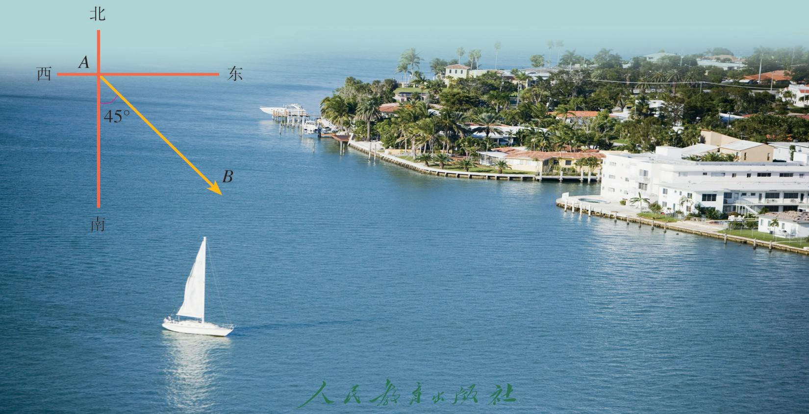

## 6.1 平面向量的概念

我们知道，力、位移、速度等物理量是既有大小、又有方向的量。本节我们将通过对这些量的抽象，形成向量概念及其表示方法；通过研究向量之间的一些特殊关系，初步认识向量的一些特征。

### 6.1.1 向量的实际背景与概念

在本章引言中，小船位移的大小是 A，B 两地之间的距离 15 n mile，位移的方向是东南方向；小船航行速度的大小是 10 n mile/h，速度的方向是东南方向。又如，物体受到的重力是竖直向下的（图 6.1-1），物体的质量越大，它受到的重力越大；物体在液体中受到的浮力是竖直向上的（图 6.1-2），物体浸在液体中的体积越大，它受到的浮力越大。

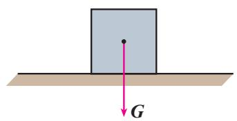

图6.1-1

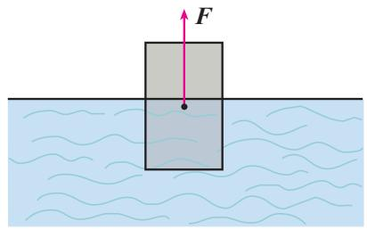

图6.1-2

力、位移、速度等有各自的特性，而“既有大小，又有方向”是它们的共同属性。我们知道，从一支笔、一棵树、一本书……中，可以抽象出只有大小的数量“1”。类似地，我们可以对力、位移、速度……这些量进行抽象，形成一种新的量。

在数学中，我们把既有大小又有方向的量叫做向量（vector），而把只有大小没有方向的量称为数量，如年龄、身高、长度、面积、体积、质量等都是数量.

物理学中常称向量为矢量，数量为标量，你还能举出物理学中的一些向量和数量吗？

### 6.1.2 向量的几何表示
由于数量可以用实数表示，而实数与数轴上的点一一对应，所以数量可用数轴上的点表示，而且不同的点表示不同的数量.那么，该如何表示向量呢？

我们仍以位移为例，小船以 A 为起点，B 为终点，我们可以用连接 A，B 两点的线段长度代表小船行进的距离，并在终点 B 处加上箭头表示小船行驶的方向。于是，这条 “带有方向的线段” 就可以用来表示位移。受此启发，我们可以用带箭头的线段来表示向量，线段按一定比例（标度）画出，它的长短表示向量的大小，箭头的指向表示向量的方向。

通常，在线段 AB 的两个端点中，规定一个顺序，假设 A 为起点，B 为终点，我们就说线段 AB 具有方向，具有方向的线段叫做有向线段（directed line segment）（图 6.1-3）。通常在有向线段的终点处画上箭头表示它的方向。以 A 为起点、B 为终点的有向线段记作 $\overrightarrow{AB}$ ，线段 AB 的长度也叫做有向线段 $\overrightarrow{AB}$ 的长度，记作 $|\overrightarrow{AB}|$ 。

有向线段包含三个要素：起点、方向、长度。知道了有向线段的起点、方向和长度，它的终点就唯一确定了。

向量可以用有向线段 $\overrightarrow{AB}$ 来表示，我们把这个向量记作向量 $\overrightarrow{AB}$ . 有向线段的长度 $|\overrightarrow{AB}|$ 表示向量的大小，有向线段的方向表示向量的方向. 用有向线段表示向量，使向量有了直观形象.

向量 $\overrightarrow{AB}$ 的大小称为向量 $\overrightarrow{AB}$ 的长度（或称模），记作 $|\overrightarrow{AB}|$ . 长度为0的向量叫做零向量（zero vector），记作0.长度等于1个单位长度的向量，叫做单位向量（unit vector）.

向量也可以用字母 $a^{①}$ ，b，c，…表示.

表示有向线段时，起点一定要写在终点的前面.

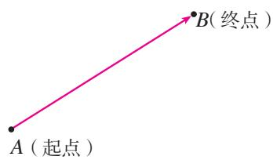

图6.1-3

① 印刷用黑体 a，书写用 $\vec{a}$ .
> [!example]- 例 1 在图 6.1-4 中，分别用向量表示 A 地至 B，C 两地的位移，并根据图中的比例尺，求出 A 地至 B，C 两地的实际距离（精确到 1 km）.
解： $\overrightarrow{AB}$ 表示 $A$ 地至 $B$ 地的位移，且 $|\overrightarrow{AB}| \approx$ \_\_\_\_； $\overrightarrow{AC}$ 表示 $A$ 地至 $C$ 地的位移，且 $|\overrightarrow{AC}| \approx$ \_\_\_\_.
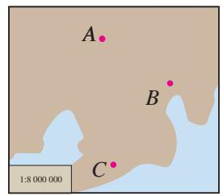

图6.1-4

### 6.1.3 相等向量与共线向量

下面，我们通过向量之间的关系进一步认识向量.

方向相同或相反的非零向量叫做平行向量（parallel vectors）. 如图 6.1-5，用有向线段表示的向量 a 与 b 是两个平行向量. 向量 a 与 b 平行，记作 $a \parallel b$ .

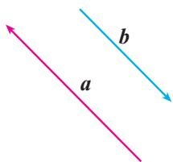

图6.1-5

我们规定：零向量与任意向量平行，即对于任意向量 a，都有 $0 \parallel a$ .

长度相等且方向相同的向量叫做相等向量（equal vectors）。如图6.1-6，用有向线段表示的向量 a 与 b 相等，记作 a=b。

任意两个相等的非零向量，都可用同一条有向线段表示，并且与有向线段的起点无关；同时，两条方向相同且长度相等的有向线段表示同一个向量，因为向量完全由它的模和方向确定.
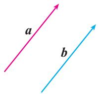

图6.1-6

如图 6.1-7, a, b, c 是一组平行向量，任作一条与 a 所在直线平行的直线 l，在 l 上任取一点 O，则可在 l 上分别作出 $\overrightarrow{OA}=a$ ， $\overrightarrow{OB}=b$ ， $\overrightarrow{OC}=c$ 。这就是说，任一组平行向量都可以平移到同一条直线上，因此，平行向量也叫做共线向量（collinear vectors）。
> 

> 
> | 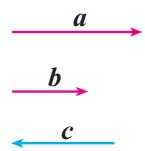 | 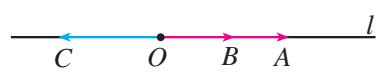 |
> | --- | --- |
> 
 
图6.1-7
 
> [!example]- 例 2 如图 6.1-8，设 O 是正六边形 ABCDEF 的中心.  
（1） 写出图中的共线向量;  
（2） 分别写出图中与 $\overrightarrow{OA}$ ， $\overrightarrow{OB}$ ， $\overrightarrow{OC}$ 相等的向量.
解：（1） $\overrightarrow{OA}$ ， $\overrightarrow{CB}$ ， $\overrightarrow{DO}$ ， $\overrightarrow{FE}$ 是共线向量； $\overrightarrow{OB}$ ， $\overrightarrow{DC}$ ， $\overrightarrow{EO}$ ， $\overrightarrow{AF}$ 是共线向量； $\overrightarrow{OC}$ ， $\overrightarrow{AB}$ ， $\overrightarrow{ED}$ ， $\overrightarrow{FO}$ 是共线向量.
$\begin{array}{l} \overrightarrow {O B} = \overrightarrow {D C} = \overrightarrow {E O}; \\ \overrightarrow {O C} = \overrightarrow {A B} = \overrightarrow {E D} = \overrightarrow {F O}. \\ \end{array}$  
（2） $\overrightarrow{OA} = \overrightarrow{CB} = \overrightarrow{DO}$ ;

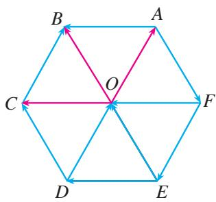

图6.1-8

#### 练习

1. 下列量中哪些是向量？  

悬挂物受到的拉力，压强，摩擦力，频率，加速度.  
2. 画两条有向线段，分别表示一个竖直向下、大小为 $18 \mathrm{~N}$ 的力和一个水平向左、大小为 $28 \mathrm{~N}$ 的力。（用 $1 \mathrm{~cm}$ 长表示 $10 \mathrm{~N}$ ）  
3. 指出图中各向量的长度. (规定小方格的边长为 0.5)  
4. 将向量用具有同一起点 O 的有向线段表示.  
（1）当 $\overrightarrow{OM}$ 与 $\overrightarrow{ON}$ 是相等向量时，判断终点 $M$ 与 $N$ 的位置关系；  
（2） 当 $\overrightarrow{OM}$ 与 $\overrightarrow{ON}$ 是平行向量，且 $|\overrightarrow{OM}| = 2|\overrightarrow{ON}| = 1$ 时，求向量 $\overrightarrow{MN}$ 的长度，并判断 $\overrightarrow{MN}$ 的方向与 $\overrightarrow{ON}$ 的方向之间的关系.

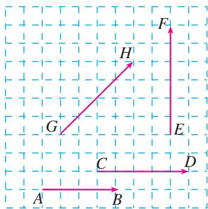

(第3题)

##### 习题6.1

###### 复习巩固

1. 在如图所示的坐标纸（规定小方格的边长为 1）中，用直尺和圆规画出下列向量：  
（1） $|\overrightarrow{OA}| = 4$ ，点 $A$ 在点 $O$ 正南方向；  
（2） $|\overrightarrow{OB}| = 2\sqrt{2}$ ，点 $B$ 在点 $O$ 北偏西 $45^{\circ}$ 方向；  
（3） $|\overrightarrow{OC}| = 2$ ，点 $C$ 在点 $O$ 南偏西 $30^{\circ}$ 方向.

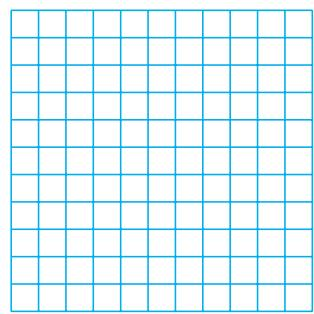

(第1题)

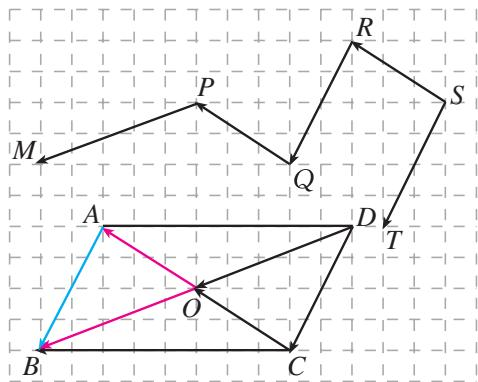

(第2题)

2. 如图，点 $O$ 是 $\square ABCD$ 的对角线的交点，且 $\overrightarrow{OA} = a, \overrightarrow{OB} = b, \overrightarrow{AB} = c$ ，分别写出 $\square ABCD$ 和折线 MPQRST 中与 $a, b, c$ 相等的向量.

###### 综合运用

3. 判断下列结论是否正确（正确的在括号内打“√”，错误的打“×”），并说明理由.  
（1）若 $a$ 与 $\pmb{b}$ 都是单位向量，则 $a = b$ （  
（2） 方向为南偏西 $60^{\circ}$ 的向量与北偏东 $60^{\circ}$ 的向量是共线向量. （）  
（3）直角坐标平面上的 $x$ 轴、 $y$ 轴都是向量. （ ）  
（4）若 a 与 b 是平行向量，则 a=b. （）  
（5） 若用有向线段表示的向量 $\overrightarrow{AM}$ 与 $\overrightarrow{AN}$ 不相等，则点 M 与 N 不重合. ()  
（6） 海拔、温度、角度都不是向量. ( )

###### 拓广探索

4. 如图，在矩形 $ABCD$ 中， $AB = 2BC = 2$ ， $M$ ， $N$ 分别为边 $AB$ ， $CD$ 的中点，在以 $A$ ， $B$ ， $C$ ， $D$ ， $M$ ， $N$ 为起点和终点的所有有向线段表示的向量中，相等的向量共有多少对？

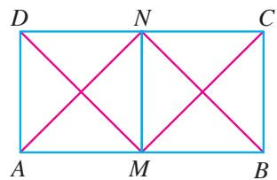

(第4题)

##### 阅读与思考

### 阅读与思考 向量及向量符号的由来

向量最初应用于物理学，被称为矢量。很多物理量，如力、位移、速度、电场强度、磁感应强度等都是向量。向量的概念萌芽于两千多年前，大约在公元前350年，古希腊著名学者亚里士多德（Aristotle，公元前384—前322）就知道了力可以表示成向量。“向量”一词来自力学、解析几何中的有向线段。最先使用有向线段表示向量的是英国科学家牛顿（Isaac Newton，1643—1727）。

向量是一种带几何性质的量，除零向量外，总可以画出“箭头表示方向，线段长表示大小”的有向线段来表示它。1806年，瑞士人阿尔冈（J. R. Argand, 1768—1822）以 $\overrightarrow{AB}$ 表示有向线段或向量。1827年，默比乌斯（A. F. Möbius, 1790—1868）以 $\overrightarrow{AB}$ 表示起点为 $A$ ，终点为 $B$ 的向量，这种用法被数学家广泛接受。另外，哈密顿（W. R. Hamilton, 1805—1865）、吉布斯（J. W. Gibbs, 1839—1903）等人则以小写希腊字母表示向量。后来，字母上加箭头表示向量的方法逐渐流行，尤其用在手写稿中；为了方便印刷，人们又用粗黑体小写字母 $a$ ， $b$ 等表示向量。这两种符号一直沿用至今。

莱布尼茨（G. W. Leibniz，1646—1716）曾经从位置几何学研究的视角进行过预想：“我已经发现了一些完全不同的有新特点的元素，即使在没有任何图形的情况下，它也能有利于表达思想、表达事物的本质。我的这个新系统能紧跟可见的图形，以一种自然的、分析的方式，通过一个确定的程序同时给出解、构造和几何的证明。”莱布尼茨所说的“有新特点的元素”和“新系统”就是逐渐形成和发展起来的向量及其理论。

向量进入数学并得到发展，是从复数的几何表示开始的。1797年，丹麦测量学家韦塞尔（Caspar Wessel，1745—1818）把复数表示为向量，并利用向量定义复数运算。他把坐标平面上的点用向量表示出来，并把向量的几何表示用于研究几何与三角问题。人们逐步接受了复数，也学会了利用复数表示、研究平面中的向量。

发展到现在，向量在数学、物理、计算机科学与技术等学科，以及社会生产、生活、经济、金融与贸易等各领域中都有广泛的应用，成为解决这些学科或领域中各种问题的有力工具。

你能说一说用符号表示向量所起的重要作用吗？

## 6.2 平面向量的运算

我们知道，数能进行运算，因为有了运算而使数的威力无穷。那么，向量是否也能像数一样进行运算呢？人们从向量的物理背景和数的运算中得到启发，引进了向量的运算。本节我们就来研究平面向量的运算，探索其运算性质，体会向量运算的作用。

下面先学习向量的加法.

### 6.2.1 向量的加法运算

我们知道，位移、力是向量，它们可以合成。能否从位移、力的合成中得到启发，引进向量的加法呢？

> [!think] 思考
如图6.2-1，某质点从点 $A$ 经过点 $B$ 到点 $C$ ，这个质点的位移如何表示？

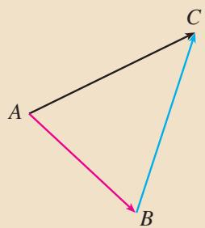

图6.2-1

物理知识告诉我们，这个质点两次位移 $\overrightarrow{AB}$ ， $\overrightarrow{BC}$ 的结果，与从点 $A$ 直接到点 $C$ 的位移 $\overrightarrow{AC}$ 结果相同。因此，位移 $\overrightarrow{AC}$ 可以看作位移 $\overrightarrow{AB}$ 与 $\overrightarrow{BC}$ 合成的。数的加法启发我们，从运算的角度看， $\overrightarrow{AC}$ 可以看作 $\overrightarrow{AB}$ 与 $\overrightarrow{BC}$ 的和，即位移的合成可以看作向量的加法。

如图6.2-2，已知非零向量 $a$ ， $b$ ，在平面内取任意一点 $A$ ，作 $\overrightarrow{AB} = a$ ， $\overrightarrow{BC} = b$ ，则向量 $\overrightarrow{AC}$ 叫做 $a$ 与 $b$ 的和，记作 $a + b$ ，即 $a + b = \overrightarrow{AB} +\overrightarrow{BC} = \overrightarrow{AC}$

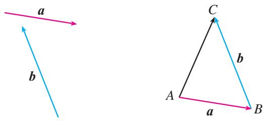

图6.2-2

求两个向量和的运算，叫做向量的加法。这种求向量和的方法，称为向量加法的三角形法则。位移的合成可以看作向量加法三角形法则的物理模型。

我们再来看力的合成问题.
> [!think] 思考
如图 6.2-3，在光滑的平面上，一个物体同时受到两个外力 $F_{1}$ 与 $F_{2}$ 的作用，你能作出这个物体所受的合力 F 吗？
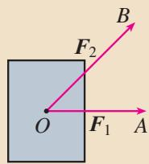

图6.2-3

我们知道，合力 $\pmb{F}$ 在以 $OA$ ，OB为邻边的平行四边形的对角线上，并且大小等于这条对角线的长.从运算的角度看， $\pmb{F}$ 可以看作 $\pmb{F}_{1}$ 与 $\pmb{F}_{2}$ 的和，即力的合成可以看作向量的加法.

如图 6.2-4，以同一点 O 为起点的两个已知向量 a，b，以 OA，OB 为邻边作 □OACB，则以 O 为起点的向量 $\overrightarrow{OC}$ （OC 是 □OACB 的对角线）就是向量 a 与 b 的和。我们把这种作两个向量和的方法叫做向量加法的平行四边形法则。力的合成可以看作向量加法平行四边形法则的物理模型。

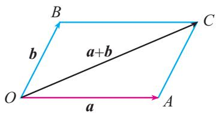

图6.2-4
> [!think] 思考
向量加法的平行四边形法则与三角形法则一致吗？为什么？

对于零向量与任意向量 $a$ ，我们规定
$a + 0 = 0 + a = a.$
> [!example]- 例 1 如图 6.2-5，已知向量 a, b，求作向量 $a + b$ .
作法1：在平面内任取一点 $O$ （图6.2-6（1）），作 $\overrightarrow{OA} = a$ ， $\overrightarrow{AB} = b$ .则 $\overrightarrow{OB} = a + b$
作法 2：在平面内任取一点 O（图 6.2-6（2）），作 $\overrightarrow{OA}=a,\overrightarrow{OB}=b$ 。以 OA，OB 为邻边作 □OACB，连接 OC，则 $\overrightarrow{OC}=\overrightarrow{OA}+\overrightarrow{OB}=a+b$ 。
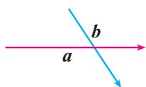

图6.2-5

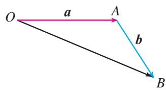  
（1）

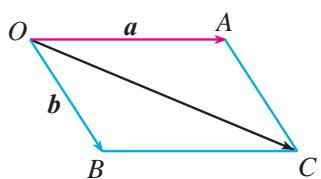  
（2）   
图6.2-6
> [!explore] 探究  
（1）如果向量 $a, b$ 共线，它们的加法与数的加法有什么关系？你能作出向量 $a + b$ 吗？  
（2） 结合例 1，探索 $\left|a+b\right|$ ， $\left|a\right|$ ， $\left|b\right|$ 之间的关系.

一般地，我们有
$\left| a + b \right| \leqslant \left| a \right| + \left| b \right|,$
当且仅当 a, b 中有一个是零向量或 a, b 是方向相同的非零向量时，等号成立.

根据数的运算的学习经验，定义了一种运算，就要研究相应的运算律，运算律可以有效地简化运算.
> [!explore] 探究
数的加法满足交换律、结合律，向量的加法是否也满足交换律和结合律呢？

如图 6.2-7（1），作 $\overrightarrow{AB}=a,\quad\overrightarrow{AD}=b$ ，以 AB，AD 为邻边作 $\square ABCD$ ，容易发现 $\overrightarrow{BC}=b,\quad\overrightarrow{DC}=a$ ，故 $\overrightarrow{AC}=\overrightarrow{AB}+\overrightarrow{BC}=a+b.$ 又 $\overrightarrow{AC}=\overrightarrow{AD}+\overrightarrow{DC}=b+a$ ，所以 $a+b=b+a.$

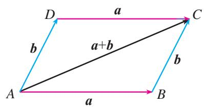  
（1）

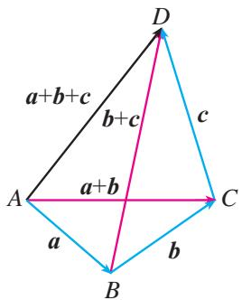  
（2）   
图6.2-7
由图6.2-7（2），你能否验证
$(a + b) + c = a + (b + c)?$
综上所述，向量的加法满足交换律和结合律.
> [!example]- 例 2 长江两岸之间没有大桥的地方，常常通过轮渡进行运输．如图 6.2-8，一艘船从长江南岸 A 地出发，垂直于对岸航行，航行速度的大小为 15 km/h，同时江水的速度为向东 6 km/h.  
（1）用向量表示江水速度、船速以及船实际航行的速度；
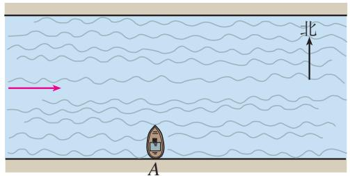

图6.2-8  
（2）求船实际航行的速度的大小（结果保留小数点后一位）与方向（用与江水速度间的夹角表示，精确到 $1^{\circ}$ ）.
解：（1）如图6.2-9. $\overrightarrow{AD}$ 表示船速， $\overrightarrow{AB}$ 表示江水速度，以 $AD$ ， $AB$ 为邻边作□ABCD，则 $\overrightarrow{AC}$ 表示船实际航行的速度.  
（2） 在Rt△ABC中， $|\overrightarrow{AB}|=6,\quad|\overrightarrow{BC}|=15$ ，于是
$| \overrightarrow {A C} | = \sqrt {| \overrightarrow {A B} | ^ {2} + | \overrightarrow {B C} | ^ {2}} = \sqrt {6 ^ {2} + 1 5 ^ {2}} = \sqrt {2 6 1} \approx 1 6. 2.$
因为 $\tan \angle CAB = \frac{|\overrightarrow{BC}|}{|\overrightarrow{AB}|} = \frac{5}{2}$ ，所以利用计算工具可得 $\angle CAB \approx 68^{\circ}$
因此，船实际航行速度的大小约为 $16.2 \, km/h$ ，方向与江水速度间的夹角约为 $68^{\circ}$ .
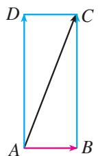

图6.2-9

#### 练习

1. 如图，在下列各小题中，已知向量 a, b，分别用两种方法求作向量 $a + b$ .
> 

> 
> | 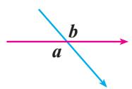 | 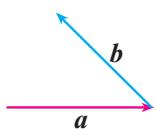 | 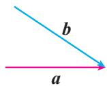 | 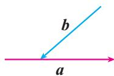 |
> | --- | --- | --- | --- |
> | （1） | （2） | （3） | （4） |
> 
 
(第1题)
 

2. 当向量 a, b 满足什么条件时， $|a+b|=|a|-|b|$ （或 $|b|-|a|$ ）?

3. 根据图示填空：  
（1） $a+b=$ \_\_\_\_;   
（2） $c+d=$ \_\_\_\_;   
（3） $a+b+d=$ \_\_\_\_;   
（4） $c+d+e=$ \_\_\_\_.

4. 如图，四边形 ABCD 是平行四边形，点 P 在 CD 上，判断下列各式是否正确（正确的在括号内打 “√”，错误的打 “×”）.  
（1） $\overrightarrow{DA} +\overrightarrow{DP} = \overrightarrow{PA}$ （）  
（2） $\overrightarrow{DA} +\overrightarrow{AB} +\overrightarrow{BP} = \overrightarrow{DP}.$ （）  
（3） $\overrightarrow{AB} +\overrightarrow{BC} +\overrightarrow{CP} = \overrightarrow{PA}.$ （ ）

5. 有一条东西向的小河，一艘小船从河南岸的渡口出发渡河。小船航行速度的大小为 $15 \, km/h$ ，方向为北偏西 $30^{\circ}$ ，水流的速度为向东 $7.5 \, km/h$ ，求小船实际航行速度的大小与方向。

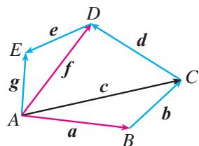

(第3题)  
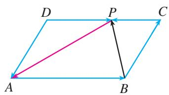

(第4题)

### 6.2.2 向量的减法运算
> [!think] 思考
在数的运算中，减法是加法的逆运算，其运算法则是“减去一个数等于加上这个数的相反数”。类比数的减法，向量的减法与加法有什么关系？如何定义向量的减法法则？

与数 $x$ 的相反数是 $-x$ 类似，我们规定，与向量 $a$ 长度相等，方向相反的向量，叫做 $a$ 的相反向量，记作 $-a$ 。由于方向反转两次仍回到原来的方向，因此 $a$ 和 $-a$ 互为相反向量，于是
$- (- a) = a.$

我们规定，零向量的相反向量仍是零向量.
由两个向量和的定义易知
$\boldsymbol {a} + (- \boldsymbol {a}) = (- \boldsymbol {a}) + \boldsymbol {a} = \mathbf {0},$
即任意向量与其相反向量的和是零向量. 这样，如果 $a, b$ 互为相反向量，那么
$a = - b, b = - a, a + b = 0.$

向量 a 加上 b 的相反向量，叫做 a 与 b 的差，即
$a - b = a + (- b).$

求两个向量差的运算叫做向量的减法.

我们看到，向量的减法可以转化为向量的加法来进行：减去一个向量相当于加上这个向量的相反向量.
> [!explore] 探究
向量减法的几何意义是什么？

如图 6.2-10，设 $\overrightarrow{OA}=a,\quad\overrightarrow{OB}=b,\quad\overrightarrow{OD}=-b$ ，连接 AB，由向量减法的定义知
$a - b = a + (- b) = \overrightarrow {O A} + \overrightarrow {O D} = \overrightarrow {O C}.$

在四边形 OCAB 中， $OB \perp CA$ ，所以 OCAB 是平行四边形。所以
$\overrightarrow {B A} = \overrightarrow {O C} = a - b.$
由此，我们得到 a-b 的作图方法.

如图 6.2-11，已知向量 a, b，在平面内任取一点 O，作$\overrightarrow{OA} = a$ ， $\overrightarrow{OB} = b$ ，则 $\overrightarrow{BA} = a - b$ .即 $a - b$ 可以表示为从向量 $\pmb{b}$ 的终点指向向量 $\pmb{a}$ 的终点的向量，这是向量减法的几何意义.

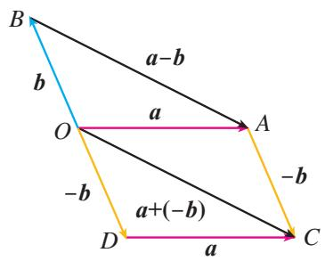

图6.2-10

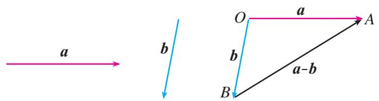

图6.2-11
> [!think] 思考  
（1） 在图 6.2-11 中，如果从 a 的终点到 b 的终点作向量，那么所得向量是什么？  
（2） 如果改变图 6.2-11 中向量 a 的方向，使 $a \parallel b$ ，怎样作出 a - b 呢？

> [!example]- 例 3 如图 6.2-12（1），已知向量 a, b, c, d，求作向量 a-b, c-d.
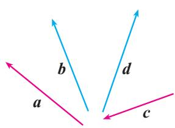  
（1）

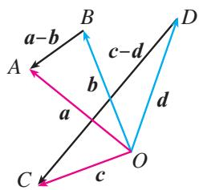  
（2）   
图6.2-12
作法：如图6.2-12（2），在平面内任取一点 $O$ ，作 $\overrightarrow{OA} = a$ ， $\overrightarrow{OB} = b$ ， $\overrightarrow{OC} = c$ ， $\overrightarrow{OD} = d$ .则
$\overrightarrow {B A} = a - b,$
$\overrightarrow {D C} = c - d.$
> [!example]- 例 4 如图 6.2-13，在□ABCD 中， $\overrightarrow{AB}=a,\overrightarrow{AD}=b$ ，你能用 a，b 表示向量 $\overrightarrow{AC},\overrightarrow{DB}$ 吗？
解：由向量加法的平行四边形法则，我们知道
$\overrightarrow {A C} = \boldsymbol {a} + \boldsymbol {b}.$
同样，由向量的减法，知
$\overrightarrow {D B} = \overrightarrow {A B} - \overrightarrow {A D} = a - b.$

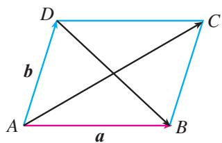

图6.2-13

#### 练习

1. 如下页图，在各小题中，已知 $a, b$ ，分别求作 $a - b$ .
> 

> 
> | 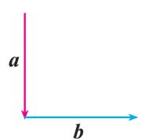 | 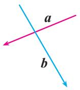 | 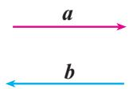 | 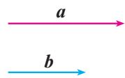 |
> | --- | --- | --- | --- |
> | （1） | （2） | （3） | （4） |
> 
 
(第1题)
 

2. 填空：
$\begin{array}{l} \overrightarrow {A B} - \overrightarrow {A D} = \underline {{{\quad}}}; \overrightarrow {B A} - \overrightarrow {B C} = \underline {{{\quad}}}; \overrightarrow {B C} - \overrightarrow {B A} = \underline {{{\quad}}}; \\ \overrightarrow {O D} - \overrightarrow {O A} = \underline {{\quad}}; \overrightarrow {O A} - \overrightarrow {O B} = \underline {{\quad}}. \\ \end{array}$

3. 作图验证： $-(a+b)=-a-b$ .

### 6.2.3 向量的数乘运算
> [!explore] 探究
已知非零向量 $a$ ，作出 $a + a + a$ 和 $(-a) + (-a) + (-a)$ . 它们的长度和方向分别是怎样的？

如图 6.2-14， $\overrightarrow{OC}=\overrightarrow{OA}+\overrightarrow{AB}+\overrightarrow{BC}=a+a+a$ 。类比数的乘法，我们把 $a+a+a$ 记作 3a，即 $\overrightarrow{OC}=3a$ 。显然 3a 的方向与 a 的方向相同，3a 的长度是 a 的长度的 3 倍，即 $\left|3a\right|=3\left|a\right|$ 。

类似地，由图6.2-14可知， $\overrightarrow{PN} = \overrightarrow{PQ} + \overrightarrow{QM} + \overrightarrow{MN} = (-a) + (-a) + (-a)$ ，我们把 $(-a) + (-a) + (-a)$ 记作 $-3a$ ，即 $\overrightarrow{PN} = -3a$ 。显然 $-3a$ 的方向与 $a$ 的方向相反， $-3a$ 的长度是 $a$ 的长度的3倍，即 $|-3a| = 3|a|$ 。

一般地，我们规定实数 $\lambda$ 与向量 a 的积是一个向量，这种运算叫做向量的数乘（scalar multiplication of vectors），记作 $\lambda a$ ，它的长度与方向规定如下：

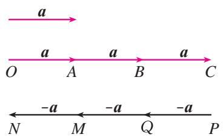

图6.2-14  
（1） $|\lambda a| = |\lambda ||a|$ ;   
（2）当 $\lambda > 0$ 时， $\lambda a$ 的方向与 $a$ 的方向相同；当 $\lambda < 0$ 时， $\lambda a$ 的方向与 $a$ 的方向相反.
由（1）可知，当 $\lambda=0$ 时， $\lambda a=0$ .
由（1）（2）可知， $(-1)a=-a$ .

你对零向量、相反向量有什么新的认识？

> [!think] 思考
如果把非零向量 a 的长度伸长到原来的 3.5 倍，方向不变得到向量 b，向量 b 该如何表示？向量 a, b 之间的关系怎样？

根据实数与向量的积的定义，可以验证下面的运算律是成立的.
设 $\lambda, \mu$ 为实数，那么  
（1） $\lambda (\mu a) = (\lambda \mu)a$   
（2） $(\lambda + \mu)a = \lambda a + \mu a$ ;   
（3） $\lambda(a + b) = \lambda a + \lambda b$ .

你能证明这些运算律吗？

特别地，我们有
$(- \lambda) a = - (\lambda a) = \lambda (- a),$
$\lambda (\boldsymbol {a} - \boldsymbol {b}) = \lambda \boldsymbol {a} - \lambda \boldsymbol {b}.$

向量的加、减、数乘运算统称为向量的线性运算. 向量线性运算的结果仍是向量.

对于任意向量 a, b，以及任意实数 $\lambda$ ， $\mu_{1}$ ， $\mu_{2}$ ，恒有
$\lambda \left(\mu_ {1} \boldsymbol {a} \pm \mu_ {2} \boldsymbol {b}\right) = \lambda \mu_ {1} \boldsymbol {a} \pm \lambda \mu_ {2} \boldsymbol {b}.$
> [!example]- 例5 计算：  
（1） $(-3)\times 4a$ ； （2） $3(a + b) - 2(a - b) - a$ ；  
（3） $(2a + 3b - c) - (3a - 2b + c)$ .
解：（1）原式 $= (-3 \times 4)a = -12a$ ；  
（2） 原式=3a+3b-2a+2b-a=5b;  
（3） 原式=2a+3b-c-3a+2b-c
$= - a + 5 b - 2 c.$
> [!example]- 例 6 如图 6.2-15，□ABCD 的两条对角线相交于点 M，且 $\overrightarrow{AB} = a, \overrightarrow{AD} = b$ ，用 a, b 表示 $\overrightarrow{MA}, \overrightarrow{MB}, \overrightarrow{MC}$ 和 $\overrightarrow{MD}$ .
解：在□ABCD中，
$\overrightarrow {A C} = \overrightarrow {A B} + \overrightarrow {A D} = \boldsymbol {a} + \boldsymbol {b},$
$\overrightarrow {D B} = \overrightarrow {A B} - \overrightarrow {A D} = a - b.$
由平行四边形的两条对角线互相平分，得
$\overrightarrow {M A} = - \frac {1}{2} \overrightarrow {A C} = - \frac {1}{2} (\boldsymbol {a} + \boldsymbol {b}) = - \frac {1}{2} \boldsymbol {a} - \frac {1}{2} \boldsymbol {b},$
$\overrightarrow {M B} = \frac {1}{2} \overrightarrow {D B} = \frac {1}{2} (\boldsymbol {a} - \boldsymbol {b}) = \frac {1}{2} \boldsymbol {a} - \frac {1}{2} \boldsymbol {b},$

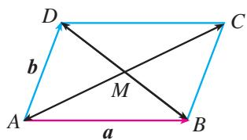

图6.2-15
$\overrightarrow {M C} = \frac {1}{2} \overrightarrow {A C} = \frac {1}{2} a + \frac {1}{2} b,$
$\overrightarrow {M D} = - \frac {1}{2} \overrightarrow {D B} = - \frac {1}{2} a + \frac {1}{2} b.$

#### 练习

1. 任画一向量 e，分别求作向量 a=4e，b=-4e。  
2. 点 C 在线段 AB 上，且 $\frac{AC}{CB} = \frac{5}{2}$ ，则 $\overrightarrow{AC} = \underline{\hspace{2cm}} \overrightarrow{AB}$ ， $\overrightarrow{BC} = \underline{\hspace{2cm}} \overrightarrow{AB}$ .  
3. 把下列各小题中的向量 b 表示为实数与向量 a 的积:  
（1） $a = 3e, b = 6e$ ;  
（2） $a = 8e, b = -14e$ ;  
（3） $a = -\frac{2}{3} e, b = \frac{1}{3} e;$  
（4） $a = -\frac{3}{4} e, b = -\frac{2}{3} e.$
> [!explore] 探究
引入向量数乘运算后，你能发现实数与向量的积与原向量之间的位置关系吗？

可以发现，实数与向量的积与原向量共线.
事实上，对于向量 $a$ （ $a \neq 0$ ）， $b$ ，如果有一个实数 $\lambda$ ，使 $b = \lambda a$ ，那么由向量数乘的定义可知 $a$ 与 $b$ 共线。

反过来，已知向量 $a$ 与 $b$ 共线，且向量 $b$ 的长度是向量 $a$ 的长度的 $\mu$ 倍，即 $|b| = \mu |a|$ ，那么当 $a$ 与 $b$ 同方向时，有 $b = \mu a$ ；当 $a$ 与 $b$ 反方向时，有 $b = -\mu a$ 。

综上，我们有如下定理：

向量 $a$ （ $a \neq 0$ ）与 $b$ 共线的充要条件是：存在唯一一个实数 $\lambda$ ，使 $b = \lambda a$ .

根据这一定理，设非零向量 a 位于直线 l 上，那么对于直线 l 上的任意一个向量 b，都存在唯一的一个实数 $\lambda$ ，使 $b = \lambda a$ 。也就是说，位于同一直线上的向量可以由位于这条直线上的一个非零向量表示。
> [!example]- 例 7 如图 6.2-16，已知任意两个非零向量 a, b，试作 $\overrightarrow{OA} = a + b$ ， $\overrightarrow{OB} = a + 2b$ ， $\overrightarrow{OC} = a + 3b$ 。猜想 A, B, C 三点之间的位置关系，并证明你的猜想。
分析：判断三点之间的位置关系，主要是看这三点是否共线，为此只要看其中一点是否在另两点所确定的直线上。在本题中，应用向量知识判断 $A$ ， $B$ ， $C$ 三点是否共线，可以通过判断向量 $\overrightarrow{AC}$ ， $\overrightarrow{AB}$ 是否共线，即是否存在 $\lambda$ ，使 $\overrightarrow{AC} = \lambda \overrightarrow{AB}$ 成立。
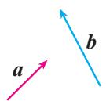

图6.2-16

解：分别作向量 $\overrightarrow{OA}$ ， $\overrightarrow{OB}$ ， $\overrightarrow{OC}$ ，过点 $A$ ， $C$ 作直线 $AC$ （图6.2-17）。观察发现，不论向量 $a$ ， $b$ 怎样变化，点 $B$ 始终在直线 $AC$ 上，猜想 $A$ ， $B$ ， $C$ 三点共线。
事实上，因为
$\overrightarrow {A B} = \overrightarrow {O B} - \overrightarrow {O A} = a + 2 b - (a + b) = b,$
$\overrightarrow {A C} = \overrightarrow {O C} - \overrightarrow {O A} = a + 3 b - (a + b) = 2 b,$
所以 $\overrightarrow{AC}=2\overrightarrow{AB}.$
因此，A，B，C三点共线.

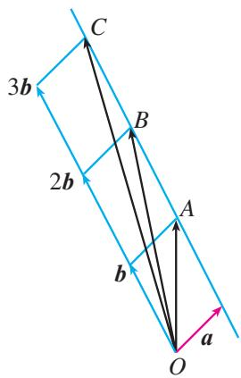

图6.2-17
> [!example]- 例 8 已知 a, b 是两个不共线的向量，向量 b-ta, $\frac{1}{2}a-\frac{3}{2}b$ 共线，求实数 t 的值.
解：由 a, b 不共线，易知向量 $\frac{1}{2}a - \frac{3}{2}b$ 为非零向量。由向量 b - ta， $\frac{1}{2}a - \frac{3}{2}b$ 共线，可知存在实数 $\lambda$ ，使得
$\boldsymbol {b} - t \boldsymbol {a} = \lambda \left(\frac {1}{2} \boldsymbol {a} - \frac {3}{2} \boldsymbol {b}\right),$
即
$\left(t + \frac {1}{2} \lambda\right) \boldsymbol {a} = \left(\frac {3}{2} \lambda + 1\right) \boldsymbol {b}.$
由 $a, b$ 不共线，必有 $t + \frac{1}{2}\lambda = \frac{3}{2}\lambda + 1 = 0$ . 否则，不妨设 $t + \frac{1}{2}\lambda \neq 0$ ，则 $a = \frac{\frac{3}{2}\lambda + 1}{t + \frac{1}{2}\lambda}b$ . 由两个向量共线的充要条件知， $a, b$ 共线，与已知矛盾.
由 $\left\{\begin{aligned}t+\frac{1}{2}\lambda=0,\\ \frac{3}{2}\lambda+1=0,\end{aligned}\right.$ 解得 $t=\frac{1}{3}.$
因此，当向量 b-ta， $\frac{1}{2}a-\frac{3}{2}b$ 共线时， $t=\frac{1}{3}$ .

#### 练习

1. 判断下列各小题中的向量 $a$ 与 $b$ 是否共线：  
（1） $a = -2e, b = 2e$ ;  
（2） $a = e_1 - e_2, b = -2e_1 + 2e_2.$

2. 化简：  
（1） $5(3a - 2b) + 4(2b - 3a)$ ;  
（2） $\frac{1}{3} (\pmb {a} - 2\pmb {b}) - \frac{1}{4} (3\pmb {a} - 2\pmb {b}) - \frac{1}{2} (\pmb {a} - \pmb {b})$  
（3） $(x + y)\pmb {a} - (x - y)\pmb{a}$ .

3. 已知 $e_1$ ， $e_2$ 是两个不共线的向量， $a = e_1 - 2e_2$ ， $b = 2e_1 + ke_2$ . 若 $a$ 与 $b$ 是共线向量，求实数 $k$ 的值.

### 6.2.4 向量的数量积

前面我们学习了向量的加、减运算. 类比数的运算，出现了一个自然的问题：向量能否相乘？如果能，那么向量的乘法该怎样定义？

在物理课中我们学过功的概念. 一般地, 如果一个物体在力 $\mathbf{F}$ 的作用下产生位移 $s$ (图6.2-18), 那么力 $\mathbf{F}$ 所做的功
$W = | \boldsymbol {F} | | \boldsymbol {s} | \cos \theta ,$

其中 $\theta$ 是 F 与 s 的夹角.

功是一个标量，它由力和位移两个向量来确定。这给我们一种启示，能否把“功”看作两个向量“相乘”的结果呢？受此启发，我们引入向量“数量积”的概念。
因为力做功的计算公式中涉及力与位移的夹角，所以我们先要定义向量的夹角概念.

已知两个非零向量 a, b （图 6.2-19），O 是平面上的任意一点，作 $\overrightarrow{OA}=a,\overrightarrow{OB}=b$ ，则 $\angle AOB=\theta(0\leqslant\theta\leqslant\pi)$ 叫做向量 a 与 b 的夹角.
显然，当 $\theta = 0$ 时， $\pmb{a}$ 与 $\pmb{b}$ 同向；当 $\theta = \pi$ 时， $\pmb{a}$ 与 $\pmb{b}$ 反向.
如果 $a$ 与 $b$ 的夹角是 $\frac{\pi}{2}$ ，我们说 $a$ 与 $b$ 垂直，记作 $a \perp b$ .

已知两个非零向量 a 与 b，它们的夹角为 $\theta$ ，我们把数量 $|a||b|\cos\theta$ 叫做向量 a 与 b 的数量积（或内积（inner product）），记作 $a \cdot b$ ，即
$\boldsymbol {a} \cdot \boldsymbol {b} = | \boldsymbol {a} | | \boldsymbol {b} | \cos \theta .$

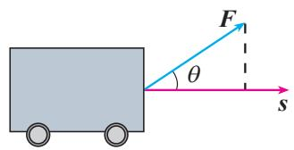

图6.2-18

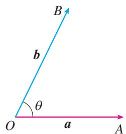

图6.2-19
$a, b$ 的夹角记作 $\langle a, b \rangle$ .

规定：零向量与任一向量的数量积为0.

对比向量的线性运算，我们发现，向量线性运算的结果是一个向量，而两个向量的数量积是一个数量，这个数量的大小与两个向量的长度及其夹角有关.
> [!example]- 例9 已知 $|\pmb{a}| = 5$ ， $|\pmb{b}| = 4$ ， $\pmb{a}$ 与 $\pmb{b}$ 的夹角 $\theta = \frac{2\pi}{3}$ ，求 $\pmb{a} \cdot \pmb{b}$ .
解： $a\cdot b = |a||b|\cos \theta$
$= 5 \times 4 \times \cos \frac {2 \pi}{3}$
$= 5 \times 4 \times \left(- \frac {1}{2}\right)$
$= - 1 0.$
> [!example]- 例 10 设 $\left|a\right|=12,\quad\left|b\right|=9,\quad a\cdot b=-54\sqrt{2}$ ，求 a 与 b 的夹角 $\theta$ .
解：由 $a \cdot b = |a||b|\cos \theta$ ，得
$\cos \theta = \frac {\boldsymbol {a} \cdot \boldsymbol {b}}{| \boldsymbol {a} | | \boldsymbol {b} |} = \frac {- 5 4 \sqrt {2}}{1 2 \times 9} = - \frac {\sqrt {2}}{2}.$
因为 $\theta \in [0, \pi]$ ，所以 $\theta = \frac{3\pi}{4}$ .

如图6.2-20（1），设 $a$ ， $b$ 是两个非零向量， $\overrightarrow{AB} = a$ ， $\overrightarrow{CD} = b$ ，我们考虑如下的变换：过 $\overrightarrow{AB}$ 的起点 $A$ 和终点 $B$ ，分别作 $\overrightarrow{CD}$ 所在直线的垂线，垂足分别为 $A_{1}$ ， $B_{1}$ ，得到 $\overrightarrow{A_1B_1}$ ，我们称上述变换为向量 $a$ 向向量 $\pmb{b}$ 投影（project)， $\overrightarrow{A_1B_1}$ 叫做向量 $\pmb{a}$ 在向量 $\pmb{b}$ 上的投影向量.

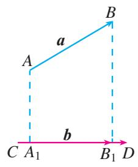  
（1）

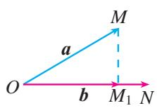  
（2）   
图6.2-20

如图 6.2-20（2），我们可以在平面内任取一点 O，作 $\overrightarrow{OM}=a,\overrightarrow{ON}=b$ 。过点 M 作直线 ON 的垂线，垂足为 $M_{1}$ ，则 $\overrightarrow{OM_{1}}$ 就是向量 a 在向量 b 上的投影向量。
> [!explore] 探究
如图6.2-20（2），设与 $\pmb{b}$ 方向相同的单位向量为 $e$ ， $\pmb{a}$ 与 $\pmb{b}$ 的夹角为 $\theta$ ，那么 $\overrightarrow{OM_1}$ 与 $\pmb {e},\pmb {a},\theta$ 之间有怎样的关系？
显然， $\overrightarrow{OM_{1}}$ 与 e 共线，于是
$\overrightarrow {O M _ {1}} = \lambda e.$

下面我们探究 $\lambda$ 与 $a, \theta$ 的关系，进而给出 $\overrightarrow{OM_1}$ 的明确表达式。我们分 $\theta$ 为锐角、直角、钝角以及 $\theta = 0, \theta = \pi$ 等情况进行讨论。
当 $\theta$ 为锐角（图6.2-21(1))时， $\overrightarrow{OM_1}$ 与 $\pmb{e}$ 方向相同， $\lambda = |\overrightarrow{OM_1}| = |\pmb {a}|\cos \theta$ ，所以
$\overrightarrow {O M _ {1}} = | \overrightarrow {O M _ {1}} | e = | a | \cos \theta e;$
当 $\theta$ 为直角（图6.2-21(2))时， $\lambda = 0$ ，所以
$\overrightarrow {O M _ {1}} = \mathbf {0} = | \boldsymbol {a} | \cos \frac {\pi}{2} \boldsymbol {e};$
当 $\theta$ 为钝角（图6.2-21(3))时， $\overrightarrow{OM_1}$ 与 $e$ 方向相反，所以
$\lambda = - | \overrightarrow {O M _ {1}} | = - | \boldsymbol {a} | \cos \angle M O M _ {1}$
$= - | \boldsymbol {a} | \cos (\pi - \theta) = | \boldsymbol {a} | \cos \theta ,$
即
$\overrightarrow {O M _ {1}} = | \boldsymbol {a} | \cos \theta \boldsymbol {e};$

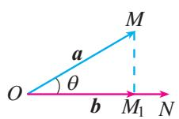  
（1）

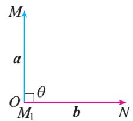  
（2）

  
（3）   
图6.2-21
当 $\theta=0$ 时， $\lambda=|a|$ ，所以
$\overrightarrow {O M _ {1}} = | \boldsymbol {a} | \boldsymbol {e} = | \boldsymbol {a} | \cos 0 \boldsymbol {e};$
当 $\theta = \pi$ 时， $\lambda = -|a|$ ，所以
$\overrightarrow {O M _ {1}} = - | \boldsymbol {a} | \boldsymbol {e} = | \boldsymbol {a} | \cos \pi \boldsymbol {e}.$

从上面的讨论可知，对于任意的 $\theta \in [0, \pi]$ ，都有
$\overrightarrow {O M _ {1}} = | \boldsymbol {a} | \cos \theta \boldsymbol {e}.$
> [!explore] 探究
从上面的探究我们看到，两个非零向量 $a$ 与 $b$ 相互平行或垂直时，向量 $a$ 在向量 $b$ 上的投影向量具有特殊性。这时，它们的数量积又有怎样的特殊性？
由向量数量积的定义，可以得到向量数量积的如下重要性质.
设 a, b 是非零向量，它们的夹角是 $\theta$ ，e 是与 b 方向相同的单位向量，则  
（1） $a \cdot e = e \cdot a = |a| \cos \theta.$   
（2） $a \perp b \Leftrightarrow a \cdot b = 0.$   
（3）当 $a$ 与 $b$ 同向时， $a \cdot b = |a||b|$ ；当 $a$ 与 $b$ 反向时， $a \cdot b = -|a||b|$ . 特别地， $a \cdot a = |a|^2$ 或 $|a| = \sqrt{a \cdot a}$ .

此外，由 $|\cos \theta |\leqslant 1$ 还可以得到  
（4） $|\mathbf{a}\cdot \mathbf{b}| \leqslant |\mathbf{a}||\mathbf{b}|$ .
如果 $a \cdot b = 0$ ，是否有 $a = 0$ ，或 $b = 0$ ?
$a \cdot a$ 常常记作 $a^{2}$ .

#### 练习

1. 已知 $|p| = 8$ ， $|q| = 6$ ， $p$ 和 $q$ 的夹角是 $60^\circ$ ，求 $p \cdot q$ .  
2. 已知 $\triangle ABC$ 中， $\overrightarrow{AB} = a$ ， $\overrightarrow{AC} = b$ ，当 $a \cdot b < 0$ 或 $a \cdot b = 0$ 时，试判断 $\triangle ABC$ 的形状.  
3. 已知 $|a| = 6$ ， $e$ 为单位向量，当向量 $a$ ， $e$ 的夹角 $\theta$ 分别等于 $45^{\circ}$ ， $90^{\circ}$ ， $135^{\circ}$ 时，求向量 $a$ 在向量 $e$ 上的投影向量.

与向量的线性运算一样，定义了向量的数量积后，就要研究数量积运算是否满足一些运算律.
> [!explore] 探究
类比数的乘法运算律，结合向量的线性运算的运算律，你能得到数量积运算的哪些运算律？你能证明吗？
由向量数量积的定义，可以发现下列运算律成立：

对于向量 $a, b, c$ 和实数 $\lambda$ ，有  
（1） $a \cdot b = b \cdot a$ ;   
（2） $(\lambda a) \cdot b = \lambda (a \cdot b) = a \cdot (\lambda b)$ ;   
（3） $(a + b) \cdot c = a \cdot c + b \cdot c$ .

下面我们利用向量投影证明分配律（3）.
证明：如图6.2-22，任取一点 $O$ ，作 $\overrightarrow{OA} = a$ ， $\overrightarrow{OB} = b$ ， $\overrightarrow{OC} = c$ ， $\overrightarrow{OD} = a + b.$
设向量 a, b, $a + b$ 与 c 的夹角分别为 $\theta_{1}$ , $\theta_{2}$ , $\theta$ , 它们在向量 c 上的投影向量分别为 $\overrightarrow{OA_{1}}$ , $\overrightarrow{OB_{1}}$ , $\overrightarrow{OD_{1}}$ , 与 c 方向相同的单位向量为 e, 则
$\overrightarrow {O A _ {1}} = | \boldsymbol {a} | \cos \theta_ {1} \boldsymbol {e},$
$\overrightarrow {O B _ {1}} = | \boldsymbol {b} | \cos \theta_ {2} \boldsymbol {e},$
$\overrightarrow {O D _ {1}} = | \boldsymbol {a} + \boldsymbol {b} | \cos \theta \boldsymbol {e}.$
因为 $a=\overrightarrow{BD}$ ，所以 $\overrightarrow{OA_{1}}=\overrightarrow{B_{1}D_{1}}$ 。于是
$\overrightarrow {O D _ {1}} = \overrightarrow {O B _ {1}} + \overrightarrow {B _ {1} D _ {1}} = \overrightarrow {O B _ {1}} + \overrightarrow {O A _ {1}},$

图6.2-22
即
$\left| \boldsymbol {a} + \boldsymbol {b} \right| \cos \theta \boldsymbol {e} = \left| \boldsymbol {a} \right| \cos \theta_ {1} \boldsymbol {e} + \left| \boldsymbol {b} \right| \cos \theta_ {2} \boldsymbol {e}.$

整理，得
$(| \boldsymbol {a} + \boldsymbol {b} | \cos \theta - | \boldsymbol {a} | \cos \theta_ {1} - | \boldsymbol {b} | \cos \theta_ {2}) \boldsymbol {e} = \mathbf {0},$
所以
$\left| \boldsymbol {a} + \boldsymbol {b} \right| \cos \theta - \left| \boldsymbol {a} \right| \cos \theta_ {1} - \left| \boldsymbol {b} \right| \cos \theta_ {2} = 0,$
即
$\left| \boldsymbol {a} + \boldsymbol {b} \right| \cos \theta = \left| \boldsymbol {a} \right| \cos \theta_ {1} + \left| \boldsymbol {b} \right| \cos \theta_ {2}.$
所以
$\left| \boldsymbol {a} + \boldsymbol {b} \right| \left| \boldsymbol {c} \right| \cos \theta = \left| \boldsymbol {a} \right| \left| \boldsymbol {c} \right| \cos \theta_ {1} + \left| \boldsymbol {b} \right| \left| \boldsymbol {c} \right| \cos \theta_ {2}.$
因此
$(a + b) \cdot c = a \cdot c + b \cdot c.$
> [!think] 思考
设 $a, b, c$ 是向量， $(a \cdot b)c = a(b \cdot c)$ 一定成立吗？为什么？

> [!example]- 例11 我们知道，对任意 $a, b \in \mathbf{R}$ ，恒有
$(a + b) ^ {2} = a ^ {2} + 2 a b + b ^ {2}, (a + b) (a - b) = a ^ {2} - b ^ {2}.$

对任意向量 a, b，是否也有下面类似的结论？  
（1） $(a + b)^2 = a^2 + 2a \cdot b + b^2$ ;   
（2） $(a + b) \cdot (a - b) = a^2 - b^2$ .
解：（1） $(a + b)^2 = (a + b) \cdot (a + b)$
$\begin{array}{l} = a \cdot a + a \cdot b + b \cdot a + b \cdot b \\ = \boldsymbol {a} ^ {2} + 2 \boldsymbol {a} \cdot \boldsymbol {b} + \boldsymbol {b} ^ {2}; \\ \end{array}$  
（2） $(a + b) \cdot (a - b) = a \cdot a - a \cdot b + b \cdot a - b \cdot b$
$= a ^ {2} - b ^ {2}.$
因此，上述结论是成立的.
> [!example]- 例 12 已知 $\left|a\right|=6,\quad\left|b\right|=4,\quad a$ 与 b 的夹角为 $60^{\circ}$ ，求 $(a+2b)\cdot(a-3b)$ .
解： $(a + 2b)\cdot (a - 3b)$
$\begin{array}{l} = a \cdot a - 3 a \cdot b + 2 b \cdot a - 6 b \cdot b \\ = | \boldsymbol {a} | ^ {2} - \boldsymbol {a} \cdot \boldsymbol {b} - 6 | \boldsymbol {b} | ^ {2} \\ = | \boldsymbol {a} | ^ {2} - | \boldsymbol {a} | | \boldsymbol {b} | \cos \theta - 6 | \boldsymbol {b} | ^ {2} \\ = 6 ^ {2} - 6 \times 4 \times \cos 6 0 ^ {\circ} - 6 \times 4 ^ {2} \\ = - 7 2. \\ \end{array}$
> [!example]- 例13 已知 $|\pmb{a}| = 3$ ， $|\pmb{b}| = 4$ ，且 $\pmb{a}$ 与 $\pmb{b}$ 不共线.当 $k$ 为何值时，向量 $a + kb$ 与 $a - kb$ 互相垂直？
解： $a + kb$ 与 $a - kb$ 互相垂直的充要条件是
$(a + k b) \cdot (a - k b) = 0,$
即
$\boldsymbol {a} ^ {2} - k ^ {2} \boldsymbol {b} ^ {2} = 0.$
因为 $a^{2}=3^{2}=9,\quad b^{2}=4^{2}=16,$
所以 $9-16k^{2}=0.$
解得 $k = \pm \frac{3}{4}$ .
也就是说，当 $k = \pm \frac{3}{4}$ 时， $a + kb$ 与 $a - kb$ 互相垂直.

#### 练习

1. 已知 $|a| = 1$ ， $|b| = 2$ ， $|c| = 3$ ，向量 $a$ 与 $b$ 的夹角为 $\frac{\pi}{6}$ ，向量 $b$ 与 $c$ 的夹角为 $\frac{\pi}{4}$ ，计算：  
（1） $(\pmb {a}\cdot \pmb {b})\pmb {c}$ ;  
（2） $a(b \cdot c)$ .

2. 已知 $\left|a\right|=\sqrt{2}$ ， $\left|b\right|=1$ ，且 a-b 与 $a+2b$ 互相垂直，求证 $a\perp b$ .

3. 求证： $(a+b)^{2}-(a-b)^{2}=4a\cdot b.$

##### 习题6.2

###### 复习巩固

1. 如果 a 表示 “向东走 10 km”，b 表示 “向西走 5 km”，c 表示 “向北走 10 km”，d 表示 “向南走 5 km”，那么下列向量具有什么意义？  
（1） $a + a$ ;  
（2） $a + b$ ;  
（3） $a + c$ ;  
（4） $b+d$ ;  
（5） $b+c+b;$  
（6） $d + a + d$ .

2. 一架飞机向北飞行 $300 \mathrm{~km}$ , 然后改变方向向西飞行 $400 \mathrm{~km}$ , 求飞机飞行的路程及两次位移的合成.

3. 一艘船垂直于对岸航行，航行速度的大小为 $16 \mathrm{~km} / \mathrm{h}$ ，同时河水流速的大小为 $4 \mathrm{~km} / \mathrm{h}$ . 求船实际航行的速度的大小与方向（精确到 $1^{\circ}$ ）.

4. 化简：  
（1） $\overrightarrow{AB} +\overrightarrow{BC} +\overrightarrow{CA}$  
（2） $(\overrightarrow{AB} +\overrightarrow{MB}) + \overrightarrow{BO} +\overrightarrow{OM};$  
（3） $\overrightarrow{OA} +\overrightarrow{OC} +\overrightarrow{BO} +\overrightarrow{CO};$  
（4） $\overrightarrow{AB} -\overrightarrow{AC} +\overrightarrow{BD} -\overrightarrow{CD};$  
（5） $\overrightarrow{OA} -\overrightarrow{OD} +\overrightarrow{AD};$  
（6） $\overrightarrow{AB} -\overrightarrow{AD} -\overrightarrow{DC};$  
（7） $\overrightarrow{NQ} +\overrightarrow{QP} +\overrightarrow{MN} -\overrightarrow{MP}.$

5. 作图验证：  
（1） $\frac{1}{2} (a + b) + \frac{1}{2} (a - b) = a$ ;  
（2） $\frac{1}{2} (a + b) - \frac{1}{2} (a - b) = b.$

6.（1）已知向量 a, b，求作向量 c，使 $a + b + c = 0$ .  
（2） （1） 中表示 $a, b, c$ 的有向线段能构成三角形吗?

7. 已知 $a, b$ 为两个非零向量，  
（1） 求作向量 $a + b$ , a - b;  
（2） 当向量 $a, b$ 成什么位置关系时，满足 $|a + b| = |a - b|$ ? （不要求证明）

8. 化简：  
（1） $5(2a-2b)+4(2b-3a)$ ;  
（2） $6(a - 3b + c) - 4(-a + b - c)$ ;  
（3） $\frac{1}{2}\left[(3a - 2b) + 5a - \frac{1}{3}(6a - 9b)\right]$ ;  
（4） $(x - y)(a + b) - (x - y)(a - b)$ .

9. 如图， $\overrightarrow{AM} = \frac{1}{3}\overrightarrow{AB}$ ， $\overrightarrow{AN} = \frac{1}{3}\overrightarrow{AC}$ . 求证 $\overrightarrow{MN} = \frac{1}{3}\overrightarrow{BC}$ .

(第9题)

10. 填空：  
（1）若 $a, b$ 满足 $|a| = 2, |b| = 3$ ，则 $|a + b|$ 的最大值为 \_\_\_\_，最小值为 \_\_\_\_；  
（2） 当不共线的向量 $a, b$ 满足 \_\_\_\_ 时， $a + b$ 平分 $a$ 与 $b$ 的夹角.

11.（1）已知 $|a| = 3$ ， $|b| = 4$ ，且 $\pmb{a}$ 与 $\pmb{b}$ 的夹角 $\theta = 150^{\circ}$ ，求 $a\cdot b$ ， $(a + b)^2$ ， $|a + b|$  
（2） 已知 $\left|a\right|=2,\quad\left|b\right|=5$ ，且 $a \cdot b = -3$ ，求 $\left|a + b\right|,\quad\left|a - b\right|$

12. 求证：
$(\lambda a) \cdot b = \lambda (a \cdot b) = a \cdot (\lambda b).$

###### 综合运用

13. 根据下列各小题中的条件，分别判断四边形ABCD的形状，并给出证明：  
（1） $\overrightarrow{AD} = \overrightarrow{BC}$ ;   
（2） $\overrightarrow{AD} = \frac{1}{3}\overrightarrow{BC};$   
（3） $\overrightarrow{AB} = \overrightarrow{DC}$ , 且 $|\overrightarrow{AB}| = |\overrightarrow{AD}|$ .

14. 在 $\triangle ABC$ 中， $\overrightarrow{AD} = \frac{1}{4}\overrightarrow{AB}$ ， $DE \parallel BC$ ，且与边 $AC$ 相交于点 $E$ ， $\triangle ABC$ 的中线 $AM$ 与 $DE$ 相交于点 $N$ 。设 $\overrightarrow{AB} = a$ ， $\overrightarrow{AC} = b$ ，用 $a, b$ 分别表示向量 $\overrightarrow{AE}$ ， $\overrightarrow{BC}$ ， $\overrightarrow{DE}$ ， $\overrightarrow{DB}$ ， $\overrightarrow{EC}$ ， $\overrightarrow{DN}$ ， $\overrightarrow{AN}$ 。

15. 如图，在任意四边形 ABCD 中，E，F 分别为 AD，BC 的中点，求证： $\overrightarrow{AB}+\overrightarrow{DC}=2\overrightarrow{EF}$ .

16. 飞机从甲地沿北偏西 $15^{\circ}$ 的方向飞行 $1400 \mathrm{~km}$ 到达乙地, 再从乙地沿南偏东 $75^{\circ}$ 的方向飞行 $1400 \mathrm{~km}$ 到达丙地. 画出飞机飞行的位移示意图, 并说明丙地在甲地的什么方向? 丙地距甲地多远?

(第 15 题)

17.（1）如图（1），在 $\triangle ABC$ 中，计算 $\overrightarrow{AB} +\overrightarrow{BC} +\overrightarrow{CA}$  
（2） 如图 （2），在四边形 ABCD 中，计算 $\overrightarrow{AB} + \overrightarrow{BC} + \overrightarrow{CD} + \overrightarrow{DA}$ ;  
（3）如图（3），在 n 边形 $A_{1}A_{2}A_{3}\cdots A_{n}$ 中， $\overrightarrow{A_{1}A_{2}}+\overrightarrow{A_{2}A_{3}}+\overrightarrow{A_{3}A_{4}}+\cdots+\overrightarrow{A_{n-1}A_{n}}+\overrightarrow{A_{n}A_{1}}=$ ? 证明你的结论.

  
（1）

  
（2）

  
（3）

(第 17 题)

18. 已知 $\left|a\right|=4,\quad\left|b\right|=3$ ，且 $(2a-3b)\cdot(2a+b)=61$ ，求 a 与 b 的夹角 $\theta$ .  
19. 已知 $|a| = 8$ ， $|b| = 10$ ，且 $|a + b| = 16$ ，求 $a$ 与 $b$ 的夹角 $\theta$ （精确到 $1^\circ$ ）。（可用计算工具）  
20. 已知 $a$ 是非零向量， $b \neq c$ ，求证：
$a \cdot b = a \cdot c \Leftrightarrow a \perp (b - c).$

###### 拓广探索

21. 已知 $\triangle ABC$ 的外接圆圆心为 $O$ ，且 $2\overrightarrow{AO} = \overrightarrow{AB} + \overrightarrow{AC}$ ， $|\overrightarrow{OA}| = |\overrightarrow{AB}|$ ，则向量 $\overrightarrow{BA}$ 在向量 $\overrightarrow{BC}$ 上的投影向量为（ ）.

(A) $\frac{1}{4}\overrightarrow{BC}$

(B) $\frac{\sqrt{3}}{4}\overrightarrow{BC}$

(C) $-\frac{1}{4}\overrightarrow{BC}$

(D) $-\frac{\sqrt{3}}{4}\overrightarrow{BC}$

22. 如图， $O$ 是平行四边形 $ABCD$ 外一点，用 $\overrightarrow{OA}$ ， $\overrightarrow{OB}$ ， $\overrightarrow{OC}$ 表示 $\overrightarrow{OD}$ .

(第22题)

23. 已知 O 为四边形 ABCD 所在平面内一点，且向量 $\overrightarrow{OA}$ ， $\overrightarrow{OB}$ ， $\overrightarrow{OC}$ ， $\overrightarrow{OD}$ 满足等式 $\overrightarrow{OA} + \overrightarrow{OC} = \overrightarrow{OB} + \overrightarrow{OD}$ .  
（1） 作出满足条件的四边形 ABCD.   
（2） 四边形 ABCD 有什么特点？请证明你的猜想.

24. 如图，在 $\odot C$ 中，是不是只需知道 $\odot C$ 的半径或弦 $AB$ 的长度，就可以求出 $\overrightarrow{AB} \cdot \overrightarrow{AC}$ 的值？

(第 24 题)

## 6.3 平面向量基本定理及坐标表示

上节我们学习了向量的运算，知道位于同一直线上的向量可以由位于这条直线上的一个非零向量表示。类似地，平面内任一向量是否可以由同一平面内的两个不共线向量表示呢？

### 6.3.1 平面向量基本定理

我们知道，已知两个力，可以求出它们的合力；反过来，一个力可以分解为两个力。如图6.3-1，我们可以根据解决实际问题的需要，通过作平行四边形，将力 $F$ 分解为多组大小、方向不同的分力。
由力的分解得到启发，我们能否通过作平行四边形，将向量 $a$ 分解为两个向量，使向量 $a$ 是这两个向量的和呢？

图6.3-1
> [!explore] 探究
如图6.3-2（1），设 $e_1, e_2$ 是同一平面内两个不共线的向量， $a$ 是这一平面内与 $e_1, e_2$ 都不共线的向量。如图6.3-2（2），在平面内任取一点 $O$ ，作 $\overrightarrow{OA} = e_1, \overrightarrow{OB} = e_2, \overrightarrow{OC} = a$ 。将 $a$ 按 $e_1, e_2$ 的方向分解，你有什么发现？

  
（1）

  
（2）   
图6.3-2

如图6.3-3，过点 $C$ 作平行于直线 $OB$ 的直线，与直线 $OA$ 交于点 $M$ ；过点 $C$ 作平行于直线 $OA$ 的直线，与直线 $OB$ 交于点 $N$ ，则 $\overrightarrow{OC} = \overrightarrow{OM} + \overrightarrow{ON}$ 。由 $\overrightarrow{OM}$ 与 $e_1$ 共线， $\overrightarrow{ON}$ 与 $e_2$ 共线可得，存在实数 $\lambda_1, \lambda_2$ ，使得 $\overrightarrow{OM} = \lambda_1 e_1, \overrightarrow{ON} = \lambda_2 e_2$ ，所以 $a = \lambda_1 e_1 + \lambda_2 e_2$ 。也就是说，与 $e_1, e_2$ 都不共线的向量 $a$ 都可以表示成 $\lambda_1 e_1 + \lambda_2 e_2$ 的形式。
当 $a$ 是与 $e_1$ 或 $e_2$ 共线的非零向量时， $a$ 也可以表示成 $\lambda_1 e_1 + \lambda_2 e_2$ 的形式；当 $a$ 是零向量时， $a$ 同样可以表示成 $\lambda_1 e_1 + \lambda_2 e_2$ 的形式。（为什么？）

图6.3-3

利用信息技术工具，可以动态地展示 $a = \lambda_1 e_1 + \lambda_2 e_2$

上述讨论表明，平面内任一向量 $\pmb{a}$ 都可以按 $e_1$ ， $e_2$ 的方向分解，表示成 $\lambda_1 e_1 + \lambda_2 e_2$ 的形式，而且这种表示形式是唯一的。事实上，如果 $\pmb{a}$ 还可以表示成 $\mu_1 e_1 + \mu_2 e_2$ 的形式，那么 $\lambda_1 e_1 + \lambda_2 e_2 = \mu_1 e_1 + \mu_2 e_2$ 。可得 $(\lambda_1 - \mu_1) e_1 + (\lambda_2 - \mu_2) e_2 = 0$ 。由此式可以推出 $\lambda_1 - \mu_1$ ， $\lambda_2 - \mu_2$ 全为0（假设 $\lambda_1 - \mu_1$ ， $\lambda_2 - \mu_2$ 不全为0，不妨假设 $\lambda_1 - \mu_1 \neq 0$ ，则 $e_1 = -\frac{\lambda_2 - \mu_2}{\lambda_1 - \mu_1} e_2$ 。由此可得 $e_1$ ， $e_2$ 共线。这与已知 $e_1$ ， $e_2$ 不共线矛盾），即 $\lambda_1 = \mu_1$ ， $\lambda_2 = \mu_2$ 。也就是说，有且只有一对实数 $\lambda_1$ ， $\lambda_2$ ，使 $a = \lambda_1 e_1 + \lambda_2 e_2$ 。

综上，我们得到如下定理：

平面向量基本定理 如果 $e_1, e_2$ 是同一平面内的两个不共线向量，那么对于这一平面内的任一向量 $a$ ，有且只有一对实数 $\lambda_1, \lambda_2$ ，使
$a = \lambda_ {1} e _ {1} + \lambda_ {2} e _ {2}.$
若 $e_1, e_2$ 不共线，我们把 $\{e_1, e_2\}$ 叫做表示这一平面内所有向量的一个基底（base）.
由平面向量基本定理可知，任一向量都可以由同一个基底唯一表示，这为我们研究问题带来了极大的方便.
> [!example]- 例 1 如图 6.3-4， $\overrightarrow{OA}$ ， $\overrightarrow{OB}$ 不共线，且 $\overrightarrow{AP}=t\overrightarrow{AB}$ $(t\in\mathbf{R})$ ，用 $\overrightarrow{OA}$ ， $\overrightarrow{OB}$ 表示 $\overrightarrow{OP}$ .
解：因为 $\overrightarrow{AP}=t\overrightarrow{AB}$ ,
所以 $\overrightarrow{OP} = \overrightarrow{OA} +\overrightarrow{AP}$
$\begin{array}{l} = \overrightarrow {O A} + t \overrightarrow {A B} \\ = \overrightarrow {O A} + t (\overrightarrow {O B} - \overrightarrow {O A}) \\ = \overrightarrow {O A} + t \overrightarrow {O B} - t \overrightarrow {O A} \\ = (1 - t) \overrightarrow {O A} + t \overrightarrow {O B}. \\ \end{array}$

图6.3-4
> [!observe] 观察 $\overrightarrow{OP} = (1 - t)\overrightarrow{OA} +$ $t\overrightarrow{OB}$ ，你有什么发现？

> [!example]- 例 2 如图 6.3-5, CD 是 $\triangle ABC$ 的中线, CD = $\frac{1}{2}AB$ , 用向量方法证明 $\triangle ABC$ 是直角三角形.
分析：由平面向量基本定理可知，任一向量都可由同一个基底表示.本题可取 $\{\overrightarrow{CD},\overrightarrow{DA}\}$ 为基底，用它表示 $\overrightarrow{CA}$ $\overrightarrow{CB}$ .证明 $\overrightarrow{CA}\cdot \overrightarrow{CB} = 0$ ，可得 $\overrightarrow{CA}\bot \overrightarrow{CB}$ ，从而证得△ABC是

图6.3-5

直角三角形.
证明：如图6.3-6，设 $\overrightarrow{CD} = a$ ， $\overrightarrow{DA} = b$ ，则 $\overrightarrow{CA} = a + b$ $\overrightarrow{DB} = -b$ ，于是 $\overrightarrow{CB} = a - b.$
$\overrightarrow {C A} \cdot \overrightarrow {C B} = (a + b) \cdot (a - b) = a ^ {2} - b ^ {2}.$

图6.3-6
因为 $CD=\frac{1}{2}AB$ ,
所以 $CD = DA$
因为 $a^{2}=CD^{2}$ ， $b^{2}=DA^{2}$ ，
所以 $\overrightarrow{CA} \cdot \overrightarrow{CB} = 0.$
因此 $CA \perp CB$ .
于是 $\triangle ABC$ 是直角三角形.

向量的数量积是否为零，是判断相应的两条线段（或直线）是否垂直的重要方法之一.

#### 练习

1. 如图，AD，BE，CF 是△ABC 的三条中线， $\overrightarrow{CA}=a,\overrightarrow{CB}=b$ 。用 a，b 表示 $\overrightarrow{AB},\overrightarrow{AD},\overrightarrow{BE},\overrightarrow{CF}$

(第1题)

(第2题)

2. 如图，平行四边形 ABCD 的两条对角线相交于点 O， $\overrightarrow{AB}=a,\overrightarrow{AD}=b$ ，点 E，F 分别是 OA，OC 的中点，G 是 CD 的三等分点 $(DG=\frac{1}{3}CD)$ .  
（1） 用 a, b 表示 $\overrightarrow{DE}$ , $\overrightarrow{FB}$ , $\overrightarrow{OG}$ ;  
（2） 能由 （1） 得出 $DE, BF$ 的关系吗?

3. 如图，在 $\triangle ABC$ 中， $AD = \frac{1}{4} AB$ ，点 $E$ ， $F$ 分别是 $AC$ ， $BC$ 的中点。设 $\overrightarrow{AB} = a$ ， $\overrightarrow{AC} = b$ 。  
（1） 用 a, b 表示 $\overrightarrow{CD}$ , $\overrightarrow{EF}$ .  
（2） 如果 $\angle A = 60^{\circ}$ , $AB = 2AC$ , $CD$ , $EF$ 有什么关系? 用向量方法证明你的结论.

(第3题)

### 6.3.2 平面向量的正交分解及坐标表示

给定平面内两个不共线的向量 $e_{1}$ ， $e_{2}$ ，由平面向量基本定理可知，平面上的任意向量 a，均可分解为两个向量 $\lambda_{1}e_{1}$ ， $\lambda_{2}e_{2}$ ，即 $a=\lambda_{1}e_{1}+\lambda_{2}e_{2}$ ，其中向量 $\lambda_{1}e_{1}$ 与 $e_{1}$ 共线，向

量 $\lambda_{2}e_{2}$ 与 $e_{2}$ 共线.

不共线的两个向量相互垂直是一种重要的情形. 把一个向量分解为两个互相垂直的向量，叫做把向量作正交分解. 如图6.3-7，重力 $\mathbf{G}$ 沿互相垂直的两个方向分解就是正交分解. 正交分解是向量分解中常见而实用的一种情形.

图6.3-7

重力 G 可以分解为这样两个分力：平行于斜面使木块沿斜面下滑的力 $F_{1}$ ，垂直于斜面的压力 $F_{2}$ .

在平面上，如果选取互相垂直的向量作为基底，将为我们研究问题带来方便.
> [!think] 思考
我们知道，在平面直角坐标系中，每一个点都可用一对有序实数（即它的坐标）表示.那么，如何表示直角坐标平面内的一个向量呢？

如图 6.3-8，在平面直角坐标系中，设与 x 轴、y 轴方向相同的两个单位向量分别为 i, j，取 $\{i, j\}$ 作为基底。对于平面内的任意一个向量 a，由平面向量基本定理可知，有且只有一对实数 x, y，使得
$\boldsymbol {a} = x \boldsymbol {i} + y \boldsymbol {j}.$

这样，平面内的任一向量 a 都可由 x，y 唯一确定，我们把有序数对 $(x, y)$ 叫做向量 a 的坐标，记作
$\boldsymbol {a} = (x, y). \tag {①}$

其中，x 叫做 a 在 x 轴上的坐标，y 叫做 a 在 y 轴上的坐标，①叫做向量 a 的坐标表示.
显然， $i=(1,0)$ ， $j=(0,1)$ ， $0=(0,0)$ .

如图6.3-9，在直角坐标平面中，以原点 $O$ 为起点作 $\overrightarrow{OA} = a$ ，则点 $A$ 的位置由向量 $a$ 唯一确定.
设 $\overrightarrow{OA} = xi + yj$ ，则向量 $\overrightarrow{OA}$ 的坐标（ $x, y$ ）就是终点 $A$ 的坐标；反过来，终点 $A$ 的坐标（ $x, y$ ）也就是向量 $\overrightarrow{OA}$ 的坐标. 因为 $\overrightarrow{OA} = a$ ，所以终点 $A$ 的坐标（ $x, y$ ）就是向量 $a$ 的坐标. 这样就建立了向量的坐标与点的坐标之间的联系.

图6.3-8

图6.3-9
> [!example]- 例 3 如图 6.3-10，分别用基底 $\{i, j\}$ 表示向量 a, b, c, d，并求出它们的坐标.
解：由图6.3-10可知， $a = \overrightarrow{AA_1} +\overrightarrow{AA_2} = 2i + 3j$
所以 $a=(2,3)$ .
同理，
$\boldsymbol {b} = - 2 \boldsymbol {i} + 3 \boldsymbol {j} = (- 2, 3),$
$\boldsymbol {c} = - 2 \boldsymbol {i} - 3 \boldsymbol {j} = (- 2, - 3),$
$\boldsymbol {d} = 2 \boldsymbol {i} - 3 \boldsymbol {j} = (2, - 3).$

图 6.3-10

### 6.3.3 平面向量加、减运算的坐标表示
> [!think] 思考
已知 $\boldsymbol{a}=(x_{1},y_{1})$ ， $\boldsymbol{b}=(x_{2},y_{2})$ ，你能得出 $a+b$ ，a-b 的坐标吗？

$\begin{array}{l} \boldsymbol {a} + \boldsymbol {b} = (x _ {1} \boldsymbol {i} + y _ {1} \boldsymbol {j}) + (x _ {2} \boldsymbol {i} + y _ {2} \boldsymbol {j}) \\ = x _ {1} \boldsymbol {i} + x _ {2} \boldsymbol {i} + y _ {1} \boldsymbol {j} + y _ {2} \boldsymbol {j} \\ = \left(x _ {1} + x _ {2}\right) \boldsymbol {i} + \left(y _ {1} + y _ {2}\right) \boldsymbol {j}, \\ \end{array}$
即
$\boldsymbol {a} + \boldsymbol {b} = (x _ {1} + x _ {2}, y _ {1} + y _ {2}).$
同理可得
$\boldsymbol {a} - \boldsymbol {b} = (x _ {1} - x _ {2}, y _ {1} - y _ {2}).$
这就是说，两个向量和（差）的坐标分别等于这两个向量相应坐标的和（差）.
> [!example]- 例 4 已知 $a=(2,1)$ ， $b=(-3,4)$ ，求 $a+b$ ，a-b 的坐标.
解： $a+b=(2,1)+(-3,4)=(-1,5)$ ,
$\boldsymbol {a} - \boldsymbol {b} = (2, 1) - (- 3, 4) = (5, - 3).$
> [!explore] 探究
如图 6.3-11，已知 $A(x_{1}, y_{1})$ ， $B(x_{2}, y_{2})$ ，你能得出 $\overrightarrow{AB}$ 的坐标吗？

图 6.3-11

如图6.3-12，作向量 $\overrightarrow{OA}$ ， $\overrightarrow{OB}$ ，则
$\begin{array}{l} \overrightarrow {A B} = \overrightarrow {O B} - \overrightarrow {O A} \\ = (x _ {2}, y _ {2}) - (x _ {1}, y _ {1}) \\ = \left(x _ {2} - x _ {1}, y _ {2} - y _ {1}\right). \\ \end{array}$
因此，一个向量的坐标等于表示此向量的有向线段的终点的坐标减去起点的坐标.
> [!example]- 例 5 如图 6.3-13，已知 □ABCD 的三个顶点 A，B，C 的坐标分别是 $(-2, 1)$ ， $(-1, 3)$ ， $(3, 4)$ ，求顶点 D 的坐标.
解法 1：如图 6.3-13，设顶点 D 的坐标为 $(x, y)$ .
因为 $\overrightarrow{AB} = (-1 - (-2), 3 - 1) = (1, 2)$ ,
$\overrightarrow {D C} = (3 - x, 4 - y),$
又 $\overrightarrow{AB} = \overrightarrow{DC}$
所以 $(1, 2) = (3 - x, 4 - y)$ .
即 $\left\{\begin{aligned}1&=3-x,\\ 2&=4-y,\end{aligned}\right.$ 解得 $\left\{\begin{aligned}x&=2,\\ y&=2.\end{aligned}\right.$
所以顶点 D 的坐标为 $(2, 2)$ .
解法 2：如图 6.3-14，由向量加法的平行四边形法则可知
$\begin{array}{l} \overrightarrow {B D} = \overrightarrow {B A} + \overrightarrow {B C} \\ = (- 2 - (- 1), 1 - 3) + (3 - (- 1), 4 - 3) \\ = (3, - 1), \\ \end{array}$

而
$\begin{array}{l} \overrightarrow {O D} = \overrightarrow {O B} + \overrightarrow {B D} \\ = (- 1, 3) + (3, - 1) \\ = (2, 2). \\ \end{array}$
所以顶点 D 的坐标为 $(2, 2)$ .

图6.3-12

图6.3-13  

图6.3-14

你能比较一下两种解法在思想方法上的异同点吗？

#### 练习

1. 在下列各小题中，已知向量 a, b 的坐标，分别求 $a + b$ ，a - b 的坐标：  
（1） $a = (-2, 4), b = (5, 2)$ ;  
（2） $a = (4, 3), b = (-3, 8)$ ;  
（3） $a = (2, 3), b = (-2, -3)$ ;  
（4） $a = (3,0),b = (0,4).$

2. 在下列各小题中，已知 $A, B$ 两点的坐标，分别求 $\overrightarrow{AB}, \overrightarrow{BA}$ 的坐标：  
（1） $A(3,5),B(6,9);$  
（2） $A(-3, 4), B(6, 3)$ ;  
（3） $A(0, 3), B(0, 5)$ ;  
（4） $A(3,0),B(8,0)$ .

3. 若点 $A(0, 1)$ , $B(1, 0)$ , $C(1, 2)$ , $D(2, 1)$ , 则 $AB$ 与 $CD$ 有什么位置关系? 证明你的猜想.

### 6.3.4 平面向量数乘运算的坐标表示
> [!think] 思考
已知 $\boldsymbol{a}=(x,y)$ ，你能得出 $\lambda\boldsymbol{a}$ 的坐标吗？

$\lambda \boldsymbol {a} = \lambda (x \boldsymbol {i} + y \boldsymbol {j}) = \lambda x \boldsymbol {i} + \lambda y \boldsymbol {j},$
即
$\lambda \boldsymbol {a} = (\lambda x, \lambda y).$
这就是说，实数与向量的积的坐标等于用这个实数乘原来向量的相应坐标.
> [!example]- 例 6 已知 $a=(2,1)$ ， $b=(-3,4)$ ，求 $3a+4b$ 的坐标.
解： $3a+4b=3(2,1)+4(-3,4)=(6,3)+(-12,16)$
$= (- 6, 1 9).$
> [!explore] 探究
如何用坐标表示两个向量共线的条件?
设 $a = (x_{1}, y_{1})$ ， $b = (x_{2}, y_{2})$ ，其中 $b \neq 0$ 。我们知道， $a$ ， $b$ 共线的充要条件是存在实数 $\lambda$ ，使
$\boldsymbol {a} = \lambda \boldsymbol {b}.$
如果用坐标表示，可写为
$\left(x _ {1}, y _ {1}\right) = \lambda \left(x _ {2}, y _ {2}\right),$
即
$\left\{ \begin{array}{l} x _ {1} = \lambda x _ {2}, \\ y _ {1} = \lambda y _ {2}. \end{array} \right.$
消去 $\lambda$ ，得
$x _ {1} y _ {2} - x _ {2} y _ {1} = 0.$
这就是说，向量 $a$ ， $b$ 共线的充要条件是
$x _ {1} y _ {2} - x _ {2} y _ {1} = 0.$
> [!example]- 例 7 已知 $a=(4,2)$ ， $b=(6,y)$ ，且 $a \parallel b$ ，求 y.
解：因为 $a \parallel b$
所以 $4y - 2 \times 6 = 0$ .
解得 y=3.
> [!example]- 例8 已知 $A(-1, -1)$ , $B(1, 3)$ , $C(2, 5)$ , 判断 $A, B$ , $C$ 三点之间的位置关系.
解：在平面直角坐标系中作出 A, B, C 三点（图 6.3-15）. 观察图形，我们猜想 A, B, C 三点共线. 下面来证明.
因为 $\overrightarrow{AB} = (1 - (-1), 3 - (-1)) = (2, 4)$
$\overrightarrow {A C} = (2 - (- 1), 5 - (- 1)) = (3, 6),$
又 $2 \times 6 - 4 \times 3 = 0$
所以 $\overrightarrow{AB} \parallel \overrightarrow{AC}.$
又 直线 $AB$ ，直线 $AC$ 有公共点 $A$ ，
所以 A, B, C 三点共线.

图6.3-15
> [!example]- 例 9 设 P 是线段 $P_{1}P_{2}$ 上的一点，点 $P_{1}$ ， $P_{2}$ 的坐标分别是 $(x_{1}, y_{1})$ ， $(x_{2}, y_{2})$ .  
（1） 当 P 是线段 $P_{1}P_{2}$ 的中点时，求点 P 的坐标；  
（2） 当 P 是线段 $P_{1}P_{2}$ 的一个三等分点时，求点 P 的坐标.
解：（1）如图6.3-16，由向量的线性运算可知
$\overrightarrow {O P} = \frac {1}{2} (\overrightarrow {O P _ {1}} + \overrightarrow {O P _ {2}}) = \left(\frac {x _ {1} + x _ {2}}{2}, \frac {y _ {1} + y _ {2}}{2}\right).$
所以，点 P 的坐标是 $\left(\frac{x_{1}+x_{2}}{2}, \frac{y_{1}+y_{2}}{2}\right)$ .

图6.3-16
若点 $P_{1}$ ， $P_{2}$ 的坐标分别为 $(x_{1}, y_{1})$ ， $(x_{2}, y_{2})$ ，线段 $P_{1}P_{2}$ 的中点 P 的坐标为 $(x, y)$ ，则
$\left\{ \begin{array}{l} x = \frac {x _ {1} + x _ {2}}{2}, \\ y = \frac {y _ {1} + y _ {2}}{2}. \end{array} \right.$

此公式为线段 $P_{1}P_{2}$ 的中点坐标公式.  
（2）如图6.3-17，当点 $P$ 是线段 $P_{1}P_{2}$ 的一个三等分点时，有两种情况，即 $\overrightarrow{P_1P} = \frac{1}{2}\overrightarrow{PP_2}$ 或 $\overrightarrow{P_1P} = 2\overrightarrow{PP_2}$ .
如果 $\overrightarrow{P_1P} = \frac{1}{2}\overrightarrow{PP_2}$ （图6.3-17(1))，那么
$\begin{array}{l} \overrightarrow {O P} = \overrightarrow {O P _ {1}} + \overrightarrow {P _ {1} P} = \overrightarrow {O P _ {1}} + \frac {1}{3} \overrightarrow {P _ {1} P _ {2}} \\ = \overrightarrow {O P _ {1}} + \frac {1}{3} (\overrightarrow {O P _ {2}} - \overrightarrow {O P _ {1}}) = \frac {2}{3} \overrightarrow {O P _ {1}} + \frac {1}{3} \overrightarrow {O P _ {2}} \\ = \left(\frac {2 x _ {1} + x _ {2}}{3}, \frac {2 y _ {1} + y _ {2}}{3}\right), \\ \end{array}$
即点 P 的坐标是 $\left(\frac{2x_{1}+x_{2}}{3}, \frac{2y_{1}+y_{2}}{3}\right)$ .

  
（1）

  
（2）   
图6.3-17
同理，如果 $\overrightarrow{P_1P} = 2\overrightarrow{PP_2}$ （图6.3-17(2))，那么点 $P$ 的坐标是 $\left(\frac{x_1 + 2x_2}{3},\frac{y_1 + 2y_2}{3}\right)$ .
> [!explore] 探究
如图 6.3-18，线段 $P_{1}P_{2}$ 的端点 $P_{1}$ ， $P_{2}$ 的坐标分别是 $(x_{1}, y_{1})$ ， $(x_{2}, y_{2})$ ，点 P 是直线 $P_{1}P_{2}$ 上的一点。当 $\overrightarrow{P_{1}P} = \lambda \overrightarrow{PP_{2}}$ 时，点 P 的坐标是什么？

图6.3-18

#### 练习

1. 已知 $a=(3,2)$ ， $b=(0,-1)$ ，求 $-2a+4b$ ， $4a+3b$ 的坐标.  
2. 当 $x$ 为何值时， $a = (2, 3)$ 与 $b = (x, -6)$ 共线？  

3. 若点 $A(-2, -3)$ ， $B(2, 2)$ ， $C(-1, 3)$ ， $D(-7, -4.5)$ ，则 $\overrightarrow{AB}$ 与 $\overrightarrow{CD}$ 是否共线？  

4. 求线段 AB 的中点坐标:  
（1） $A(2, 1), B(4, 3)$ ;  
（2） $A(-1, 2), B(3, 6)$ ;  
（3） A (5, -4), B (3, -6).

5. 已知点 $O(0, 0)$ ，向量 $\overrightarrow{OA} = (2, 3)$ ， $\overrightarrow{OB} = (6, -3)$ ，点 $P$ 是线段 $AB$ 的三等分点，求点 $P$ 的坐标.

### 6.3.5 平面向量数量积的坐标表示
> [!explore] 探究
已知 $\boldsymbol{a}=(x_{1},y_{1})$ ， $\boldsymbol{b}=(x_{2},y_{2})$ ，怎样用 a 与 b 的坐标表示 $a\cdot b$ 呢？
因为 $a=x_{1}i+y_{1}j,\quad b=x_{2}i+y_{2}j$
所以 $\boldsymbol{a} \cdot \boldsymbol{b} = (x_{1}\boldsymbol{i} + y_{1}\boldsymbol{j}) \cdot (x_{2}\boldsymbol{i} + y_{2}\boldsymbol{j}) = x_{1}x_{2}\boldsymbol{i}^{2} + x_{1}y_{2}\boldsymbol{i} \cdot \boldsymbol{j} + y_{1}x_{2}\boldsymbol{j} \cdot \boldsymbol{i} + y_{1}y_{2}\boldsymbol{j}^{2}.$
又 $i \cdot i = 1, j \cdot j = 1, i \cdot j = j \cdot i = 0,$
所以 $a \cdot b = x_{1}x_{2} + y_{1}y_{2}.$
这就是说，两个向量的数量积等于它们对应坐标的乘积的和.
由此可得  
（1） 若 $\boldsymbol{a}=(x,y)$ ，则 $\left|\boldsymbol{a}\right|^{2}=x^{2}+y^{2}$ ，或 $\left|\boldsymbol{a}\right|=\sqrt{x^{2}+y^{2}}$ .
如果表示向量 a 的有向线段的起点和终点的坐标分别为 $(x_{1}, y_{1})$ ， $(x_{2}, y_{2})$ ，那么
$\boldsymbol {a} = \left(x _ {2} - x _ {1}, y _ {2} - y _ {1}\right),$
$\left| \boldsymbol {a} \right| = \sqrt {\left(x _ {2} - x _ {1}\right) ^ {2} + \left(y _ {2} - y _ {1}\right) ^ {2}}.$  
（2） 设 a, b 是非零向量, $\boldsymbol{a}=(x_{1}, y_{1})$ , $\boldsymbol{b}=(x_{2}, y_{2})$ , 则
$\boldsymbol {a} \perp \boldsymbol {b} \Leftrightarrow x _ {1} x _ {2} + y _ {1} y _ {2} = 0.$
> [!example]- 例 10 若点 A(1, 2), B(2, 3), C(-2, 5), 则 $\triangle ABC$ 是什么形状？证明你的猜想.
解：如图 6.3-19，在平面直角坐标系中画出点 A，B，C，我们发现 $\triangle ABC$ 是直角三角形。证明如下。
因为 $\overrightarrow{AB}=(2-1,3-2)=(1,1)$ ,
$\overrightarrow {A C} = (- 2 - 1, 5 - 2) = (- 3, 3),$
所以 $\overrightarrow{AB} \cdot \overrightarrow{AC} = 1 \times (-3) + 1 \times 3 = 0.$
于是 $\overrightarrow{AB} \perp \overrightarrow{AC}.$
因此， $\triangle ABC$ 是直角三角形.

图6.3-19
设 a, b 都是非零向量， $\boldsymbol{a} = (x_{1}, y_{1})$ ， $\boldsymbol{b} = (x_{2}, y_{2})$ ， $\theta$ 是 a 与 b 的夹角，根据向量数量积的定义及坐标表示可得
$\cos \theta = \frac {\boldsymbol {a} \cdot \boldsymbol {b}}{| \boldsymbol {a} | | \boldsymbol {b} |} = \frac {x _ {1} x _ {2} + y _ {1} y _ {2}}{\sqrt {x _ {1} ^ {2} + y _ {1} ^ {2}} \sqrt {x _ {2} ^ {2} + y _ {2} ^ {2}}}.$
> [!example]- 例11 设 $a = (5, -7)$ , $b = (-6, -4)$ , 求 $a \cdot b$ 及 $a$ , $b$ 的夹角 $\theta$ (精确到 $1^{\circ}$ ).
解： $a \cdot b = 5 \times (-6) + (-7) \times (-4)$
$= - 3 0 + 2 8$
$= - 2.$
因为 $|\boldsymbol{a}| = \sqrt{5^2 + (-7)^2} = \sqrt{74}$ ， $|\boldsymbol{b}| = \sqrt{(-6)^2 + (-4)^2} = \sqrt{52}$ ，所以用计算器计算可得
$\cos \theta = \frac {\boldsymbol {a} \cdot \boldsymbol {b}}{| \boldsymbol {a} | | \boldsymbol {b} |} = \frac {- 2}{\sqrt {7 4} \times \sqrt {5 2}} \approx - 0. 0 3.$

利用计算工具可得 $\theta \approx 92^{\circ}$ .
> [!example]- 例12 用向量方法证明两角差的余弦公式
$\cos (\alpha - \beta) = \cos \alpha \cos \beta + \sin \alpha \sin \beta .$
证明：如图6.3-20，在平面直角坐标系 $Oxy$ 内作单位圆 $O$ ，以 $x$ 轴的非负半轴为始边作角 $\alpha$ ， $\beta$ ，它们的终边与单位圆 $O$ 的交点分别为 $A$ ， $B$ ．则
$\overrightarrow {O A} = (\cos \alpha , \sin \alpha), \overrightarrow {O B} = (\cos \beta , \sin \beta).$

  
（1）

  
（2）   
图6.3-20
由向量数量积的坐标表示，有
$\overrightarrow {O A} \cdot \overrightarrow {O B} = \cos \alpha \cos \beta + \sin \alpha \sin \beta .$
设 $\overrightarrow{OA}$ 与 $\overrightarrow{OB}$ 的夹角为 $\theta$ ，则
$\overrightarrow {O A} \cdot \overrightarrow {O B} = | \overrightarrow {O A} | | \overrightarrow {O B} | \cos \theta = \cos \theta .$
所以
$\cos \theta = \cos \alpha \cos \beta + \sin \alpha \sin \beta .$
另一方面，由图6.3-20（1）可知， $\alpha = 2k\pi +\beta +\theta$ ；由图6.3-20（2）可知， $\alpha =$ $2k\pi +\beta -\theta .$ 于是 $\alpha -\beta = 2k\pi \pm \theta$ ， $k\in \mathbf{Z}$ 所以
$\cos (\alpha - \beta) = \cos \theta .$
于是
$\cos (\alpha - \beta) = \cos \alpha \cos \beta + \sin \alpha \sin \beta .$

运用向量工具进行探索，过程多么简洁啊！

#### 练习

1. 已知 $a = (-3, 4)$ , $b = (5, 2)$ , 求 $|a|$ , $|b|$ , $a \cdot b$ .  
2. 已知 $a = (2, 3)$ , $b = (-2, 4)$ , $c = (-1, -2)$ . 求 $a \cdot b$ , $(a + b) \cdot (a - b)$ , $a \cdot (b + c)$ , $(a + b)^2$ .  
3. 已知 $a = (3, 2)$ , $b = (5, -7)$ , 利用计算工具, 求 $a$ 与 $b$ 的夹角 $\theta$ (精确到 $1^{\circ}$ ).

##### 习题6.3

###### 复习巩固

1. 如图，在 $\triangle ABC$ 中， $AD = \frac{1}{3} AB$ ，点 $E$ 是 $CD$ 的中点。设 $\overrightarrow{AB} = a$ ， $\overrightarrow{AC} = b$ ，用 $a, b$ 表示 $\overrightarrow{CD}$ ， $\overrightarrow{AE}$ 。  
2. 已知作用在坐标原点的三个力分别为 $F_{1}=(3,4)$ ， $F_{2}=(2,-5)$ ， $F_{3}=(3,1)$ ，求作用在原点的合力 $F_{1}+F_{2}+F_{3}$ 的坐标.  
3. 在下列各小题中，已知向量 a 的坐标，以及表示 a 的有向线段 $\overrightarrow{AB}$ 的起点 A 的坐标，求终点 B 的坐标：  
（1） $a = (-2, 1), A(0, 0)$ ;   
（2） $a = (1, 3), A(-1, 5)$ ;   
（3） $a = (-2, -5), A(3, 7)$ .

(第1题)

4. 已知□ABCD 的顶点 A(-1, -2), B(3, -1), C(5, 6), 求顶点 D 的坐标.  
5. 已知点 $O(0, 0)$ , $A(1, 2)$ , $B(-1, 3)$ , 且 $\overrightarrow{OA'} = 2\overrightarrow{OA}$ , $\overrightarrow{OB'} = 3\overrightarrow{OB}$ , 求点 $A'$ , $B'$ 及向量 $\overrightarrow{A'B'}$ 的坐标.  
6. 已知点 $A(1, 1)$ , $B(-1, 5)$ , 且 $\overrightarrow{AC} = \frac{1}{2}\overrightarrow{AB}$ , $\overrightarrow{AD} = 2\overrightarrow{AB}$ , $\overrightarrow{AE} = -\frac{1}{2}\overrightarrow{AB}$ , 求点 $C, D, E$ 的坐标.  
7. 你认为下列各组点具有什么样的位置关系？证明你的猜想.  
（1） $A(1,2),B(-3, - 4),C(2,3.5);$   
（2） $P(-1, 2), Q(0.5, 0), R(5, -6)$ ;   
（3） $E(9,1), F(1, -3), G(8, 0.5)$ .

8. 分别在平面直角坐标系中作出下列各组点，猜想以 $A, B, C$ 为顶点的三角形的形状，然后给出证明：  
（1） $A(-1, -4), B(5, 2), C(3, 4)$ ;   
（2） $A(-2, -3), B(19, 4), C(-1, -6)$ ;   
（3） $A(2,5),B(5,2),C(10,7).$

9. 已知 $|a| = 3$ ， $b = (1, 2)$ ，且 $a // b$ ，求 $a$ 的坐标.

10. 已知 $a=(4,2)$ ，求与 a 垂直的单位向量的坐标.

###### 综合运用

11. 如图，在平行四边形 ABCD 中，点 E 是 AB 的中点，点 F，G 分别是 AD，BC 的三等分点 $(AF=\frac{1}{3}AD, BG=\frac{1}{3}BC)$ . 设 $\overrightarrow{AB}=a, \overrightarrow{AD}=b$ ,  
（1） 用 a, b 表示 $\overrightarrow{EF}$ , $\overrightarrow{EG}$ .  
（2）如果 $|\pmb{b}| = \frac{3}{2} |\pmb{a}|$ ， $EF$ ， $EG$ 有什么位置关系？用向量方法证明你的结论.

12. 已知点 $O(0, 0)$ , $A(1, 2)$ , $B(4, 5)$ , $\overrightarrow{OP} = \overrightarrow{OA} + t\overrightarrow{AB}$ . 当 $t = 1$ , $\frac{1}{2}$ , $-2$ , $2$ 时, 分别求点 $P$ 的坐标.  
13. 已知 $A(2, 3)$ , $B(4, -3)$ , 点 $P$ 在线段 $AB$ 的延长线上, 且 $|\overrightarrow{AP}| = \frac{3}{2} |\overrightarrow{PB}|$ , 求点 $P$ 的坐标.  
14. 求证：以 $A(1,0)$ ， $B(5,-2)$ ， $C(8,4)$ ， $D(4,6)$ 为顶点的四边形是一个矩形.

(第 11 题)

###### 拓广探索

15. 如图，设 $Ox$ ， $Oy$ 是平面内相交成 $60^{\circ}$ 角的两条数轴， $\boldsymbol{e}_{1}$ ， $\boldsymbol{e}_{2}$ 分别是与 $x$ 轴、 $y$ 轴正方向同向的单位向量。若向量 $\overrightarrow{OP} = x\boldsymbol{e}_{1} + y\boldsymbol{e}_{2}$ ，则把有序数对 $(x, y)$ 叫做向量 $\overrightarrow{OP}$ 在坐标系 $Oxy$ 中的坐标。设 $\overrightarrow{OP} = 3\boldsymbol{e}_{1} + 2\boldsymbol{e}_{2}$ ，  
（1） 计算 $\left|\overrightarrow{OP}\right|$ 的大小;  
（2） 根据平面向量基本定理判断, 本题中对向量坐标的规定是否合理.

16. 用向量方法证明：对于任意的 $a, b, c, d \in \mathbf{R}$ ，恒有不等式
$(a c + b d) ^ {2} \leqslant (a ^ {2} + b ^ {2}) (c ^ {2} + d ^ {2}).$

(第 15 题)

## 6.4 平面向量的应用

前面我们学习了平面向量的概念和运算，并通过平面向量基本定理，把向量的运算化归为实数的运算。本节我们将学习运用向量方法解决平面几何、物理中的问题，感受向量在解决数学和实际问题中的作用。同时我们还将借助向量的运算，探索三角形边长与角度的关系，把解直角三角形问题拓展到解任意三角形问题。

### 6.4.1 平面几何中的向量方法
由于向量的线性运算和数量积运算具有鲜明的几何背景，平面几何图形的许多性质，如全等、相似、长度、夹角等都可以由向量的线性运算及数量积表示出来，因此平面几何中的许多问题都可用向量运算的方法加以解决。下面通过两个具体实例，说明向量方法在平面几何中的应用。

有了运算，向量的力量无限；没有运算，向量就只是一个路标.
> [!example]- 例 1 如图 6.4-1, DE 是△ABC 的中位线, 用向量方法证明: $DE \parallel BC$ , $DE = \frac{1}{2} BC$ .
分析：初中证明过这个结论时要加辅助线，有一定难度. 如果用向量方法证明这个结论，可以取 $\{\overrightarrow{AB}, \overrightarrow{AC}\}$ 为基底，用 $\overrightarrow{AB}, \overrightarrow{AC}$ 表示 $\overrightarrow{DE}, \overrightarrow{BC}$ ，证明 $\overrightarrow{DE} = \frac{1}{2} \overrightarrow{BC}$ 即可.
证明：如图6.4-2，因为 $DE$ 是 $\triangle ABC$ 的中位线，所以
$\overrightarrow {A D} = \frac {1}{2} \overrightarrow {A B}, \overrightarrow {A E} = \frac {1}{2} \overrightarrow {A C}.$
从而 $\overrightarrow{DE} = \overrightarrow{AE} -\overrightarrow{AD} = \frac{1}{2}\overrightarrow{AC} -\frac{1}{2}\overrightarrow{AB} = \frac{1}{2} (\overrightarrow{AC} -\overrightarrow{AB}).$
又 $\overrightarrow{BC} = \overrightarrow{AC} -\overrightarrow{AB},$
所以 $\overrightarrow{DE}=\frac{1}{2}\overrightarrow{BC}.$
于是 $DE \parallel BC, DE = \frac{1}{2} BC.$

图6.4-1

图6.4-2

平面几何经常涉及距离（线段长度）和角度问题，而平面向量的运算，特别是数量积主要涉及向量的模以及向量之间的夹角，因此我们可以用向量方法解决某些几何问题。用向量方法解决几何问题时，通常先用向量表示相应的点、线段、夹角等几何元素，然后通过向量的运算来研究点、线段等元素之间的关系，最后再把运算结果“翻译”成几何关系，便得到几何问题的结论。

用向量方法解决平面几何问题的“三步曲”：  
（1）建立平面几何与向量的联系，用向量表示问题中涉及的几何元素，将平面几何问题转化为向量问题；  
（2） 通过向量运算, 研究几何元素之间的关系, 如距离、夹角等问题;  
（3） 把运算结果 “翻译” 成几何关系.
> [!example]- 例 2 如图 6.4-3，已知平行四边形 ABCD，你能发现对角线 AC 和 BD 的长度与两条邻边 AB 和 AD 的长度之间的关系吗？

分析：平行四边形中与两条对角线对应的向量恰是与两条邻边对应的两个向量的和与差，我们可以通过向量运算来探索它们的模之间的关系.
解：第一步，建立平面几何与向量的联系，用向量表示问题中的几何元素，将平面几何问题转化为向量问题：

如图6.4-4，取 $\{\overrightarrow{AB},\overrightarrow{AD}\}$ 为基底，设 $\overrightarrow{AB} = a$ ， $\overrightarrow{AD} = b$ ，则
$\overrightarrow {A C} = \boldsymbol {a} + \boldsymbol {b}, \overrightarrow {D B} = \boldsymbol {a} - \boldsymbol {b}.$

第二步，通过向量运算，研究几何元素之间的关系：
$\overrightarrow {A C ^ {2}} = (a + b) ^ {2} = a ^ {2} + 2 a \cdot b + b ^ {2},$
$\overrightarrow {D B} ^ {2} = (a - b) ^ {2} = a ^ {2} - 2 a \cdot b + b ^ {2}.$

上面两式相加，得 $\overrightarrow{AC^{2}} + \overrightarrow{DB^{2}} = 2(a^{2} + b^{2})$ .

第三步，把运算结果“翻译”成几何关系：
$A C ^ {2} + B D ^ {2} = 2 (A B ^ {2} + A D ^ {2}).$

图6.4-3

图6.4-4

你能用自然语言叙述这个关系式的意义吗？

#### 练习

1. 证明：等腰三角形的两个底角相等.  
2. 如下页图，正方形 $ABCD$ 的边长为 $a$ ， $E$ 是 $AB$ 的中点， $F$ 是 $BC$ 边上靠近点 $B$ 的三等分点， $AF$ 与 $DE$ 交于点 $M$ ，求 $\angle EMF$ 的余弦值.

3. 如图，在 $\triangle ABC$ 中，点 $O$ 是 $BC$ 的中点，过点 $O$ 的直线分别交直线 $AB$ ， $AC$ 于不同的两点 $M$ ， $N$ . 设 $\overrightarrow{AB} = m\overrightarrow{AM}$ ， $\overrightarrow{AC} = n\overrightarrow{AN}$ ，求 $m + n$ 的值.

(第2题)

(第3题)

### 6.4.2 向量在物理中的应用举例

下面，我们再来感受一下向量在物理中的应用.
> [!example]- 例3 在日常生活中，我们有这样的经验：两个人共提一个旅行包，两个拉力夹角越大越费力；在单杠上做引体向上运动，两臂的夹角越小越省力。你能从数学的角度解释这种现象吗？

分析：不妨以两人共提旅行包为例，只要研究清楚两个拉力的合力、旅行包所受的重力以及两个拉力的夹角三者之间的关系，就可以获得问题的数学解释.
解：先来看共提旅行包的情况. 如图 6.4-5，设作用在旅行包上的两个拉力分别为 $F_{1}$ ， $F_{2}$ ，为方便起见，我们不妨设 $\left|F_{1}\right|=\left|F_{2}\right|$ . 另设 $F_{1}$ ， $F_{2}$ 的夹角为 $\theta$ ，旅行包所受的重力为 G.
由向量的平行四边形法则、力的平衡以及直角三角形的知识，可以知道
$\left| \boldsymbol {F} _ {1} \right| = \frac {\left| \boldsymbol {G} \right|}{2 \cos \frac {\theta}{2}}.$

图6.4-5

这里， $|G|$ 为定值. 分析上面的式子，我们发现，当 $\theta$ 由 0 逐渐变大到 $\pi$ 时， $\frac{\theta}{2}$ 由 0 逐渐变大到 $\frac{\pi}{2}$ ， $\cos\frac{\theta}{2}$ 的值由大逐渐变小，此时 $|F_{1}|$ 由小逐渐变大；反之，当 $\theta$ 由 $\pi$ 逐渐变小到0时， $\frac{\theta}{2}$ 由 $\frac{\pi}{2}$ 逐渐变小到0， $\cos \frac{\theta}{2}$ 的值由小逐渐变大，此时 $|F_1|$ 由大逐渐变小。这就是说， $F_1, F_2$ 之间的夹角越大越费力，夹角越小越省力。同理，在单杠上做引体向上运动，两臂的夹角越小越省力。
> [!explore] 探究  
（1） 当 $\theta$ 为何值时， $|F_{1}|$ 最小？最小值是多少？  
（2） $|\pmb{F}_1|$ 能等于 $|\pmb{G}|$ 吗？为什么？

事实上，要使 $|\pmb{F}_1|$ 最小，只需 $\cos \frac{\theta}{2}$ 最大，此时 $\cos \frac{\theta}{2} = 1$ ，可得 $\theta = 0.$ 于是 $|\pmb{F}_1|$ 的最小值为 $\frac{|\pmb{G}|}{2}$ .若要使 $|\pmb{F}_1| = |\pmb{G}|$ ，只需 $\cos \frac{\theta}{2} = \frac{1}{2}$ ，此时 $\frac{\theta}{2} = \frac{\pi}{3}$ ，即 $\theta = \frac{2\pi}{3}$
> [!example]- 例 4 如图 6.4-6，一条河两岸平行，河的宽度 d=500 m，一艘船从河岸边的 A 地出发，向河对岸航行。已知船的速度 $v_{1}$ 的大小为 $|v_{1}|=10\ km/h$ ，水流速度 $v_{2}$ 的大小为 $|v_{2}|=2\ km/h$ ，那么当航程最短时，这艘船行驶完全程需要多长时间（精确到 0.1 min）？

分析：如果水是静止的，那么船只要取垂直于河岸的方向行驶，就能使航程最短，此时所用时间也是最短的。考虑到水的流速，要使航程最短，船的速度与水流速度的合速度 v 必须垂直于河岸。

图6.4-6
解：设点 B 是河对岸一点，AB 与河岸垂直，那么当这艘船实际沿着 AB 方向行驶时，船的航程最短.

如图6.4-7，设 $\pmb {v} = \pmb{v}_1 + \pmb{v}_2$ ，则
$| \boldsymbol {v} | = \sqrt {\left| \boldsymbol {v} _ {1} \right| ^ {2} - \left| \boldsymbol {v} _ {2} \right| ^ {2}} = \sqrt {9 6} (\mathrm{km/h}).$

此时，船的航行时间
$t = \frac {d}{| \boldsymbol {v} |} = \frac {0 . 5}{\sqrt {9 6}} \times 6 0 \approx 3. 1 (\min).$
所以，当航程最短时，这艘船行驶完全程需要 3.1 min.

图6.4-7

#### 练习

1. 一物体在力 F 的作用下，由点 A(20, 15) 移动到点 B(7, 0). 已知 $F = (4, -5)$ ，求 F 对该物体所做的功.  
2. 如图，一滑轮组中有两个定滑轮 A, B，在从连接点 O 出发的三根绳的端点处，挂着 3 个重物，它们所受的重力分别为 4 N, 4 N 和 $4\sqrt{3}$ N. 此时整个系统恰处于平衡状态，求 $\angle AOB$ 的大小.  
3. 若平面上的三个力 $F_{1}$ , $F_{2}$ , $F_{3}$ 作用于一点, 且处于平衡状态. 已知 $|\mathbf{F}_1| = 1 \mathrm{~N}$ , $|\mathbf{F}_2| = \frac{\sqrt{6} + \sqrt{2}}{2} \mathrm{~N}$ , $F_{1}$ 与 $F_{2}$ 的夹角为 $45^{\circ}$ , 求:  
（1） $F_{3}$ 的大小;  
（2） $F_{3}$ 与 $F_{1}$ 夹角的大小.

(第2题)

### 6.4.3 余弦定理、正弦定理

一个三角形含有各种各样的几何量，例如三边边长、三个内角的度数、面积等，它们之间存在着确定的关系。例如，在初中，我们得到过勾股定理、锐角三角函数，这是直角三角形中的边、角定量关系。对于一般三角形，我们已经定性地研究过三角形的边、角关系，得到了 SSS，SAS，ASA，AAS 等判定三角形全等的方法。这些判定方法表明，给定三角形的三个角、三条边这六个元素中的某些元素，这个三角形就是唯一确定的。那么三角形的其他元素与给定的某些元素有怎样的数量关系？

下面我们利用向量方法研究这个问题.

#### 1. 余弦定理

我们知道，两边和它们的夹角分别相等的两个三角形全等. 这说明，给定两边及其夹角的三角形是唯一确定的. 也就是说，三角形的其他边、角都可以用这两边及其夹角来表示. 那么，表示的公式是什么？

> [!explore] 探究
在 $\triangle ABC$ 中，三个角 $A, B, C$ 所对的边分别是 $a, b, c$ ，怎样用 $a, b$ 和 $C$ 表示 $c$ ?
因为涉及的是三角形的两边长和它们的夹角，所以我们考虑用向量的数量积来探究.

如图6.4-8，设 $\overrightarrow{CB} = a$ ， $\overrightarrow{CA} = b$ ， $\overrightarrow{AB} = c$ ，那么
$c = a - b. \tag {①}$

我们的研究目标是用 $|a|$ ， $|b|$ 和C表示 $|c|$ ，联想到数量积的性质 $c\cdot c=|c|^{2}$ ，可以考虑用向量c（即a-b）与其自身作数量积运算.

图6.4-8
由①得
$\begin{array}{l} \mid c \mid^ {2} = c \cdot c = (a - b) \cdot (a - b) \\ = a \cdot a + b \cdot b - 2 a \cdot b \\ = \boldsymbol {a} ^ {2} + \boldsymbol {b} ^ {2} - 2 | \boldsymbol {a} | | \boldsymbol {b} | \cos C. \\ \end{array}$
所以
$c ^ {2} = a ^ {2} + b ^ {2} - 2 a b \cos C.$
同理可得
$a ^ {2} = b ^ {2} + c ^ {2} - 2 b c \cos A,$
$b ^ {2} = c ^ {2} + a ^ {2} - 2 c a \cos B.$

从这里的推导过程，
你感受到向量运算的力量
了吗？
于是，我们得到了三角形中边角关系的一个重要定理：

余弦定理（cosine theorem）三角形中任何一边的平方，等于其他两边平方的和减去这两边与它们夹角的余弦的积的两倍. 即
$a ^ {2} = b ^ {2} + c ^ {2} - 2 b c \cos A,$
$b ^ {2} = c ^ {2} + a ^ {2} - 2 c a \cos B,$
$c ^ {2} = a ^ {2} + b ^ {2} - 2 a b \cos C.$

你能用其他方法证明余弦定理吗？

利用余弦定理，我们可以从三角形已知的两边及其夹角直接求出第三边.
> [!think] 思考
余弦定理指出了三角形的三条边与其中的一个角之间的关系. 应用余弦定理, 我们可以解决已知三角形的三边确定三角形的角的问题, 怎么确定呢?
由余弦定理，可以得到如下推论：
$\cos A = \frac {b ^ {2} + c ^ {2} - a ^ {2}}{2 b c},$
$\cos B = \frac {c ^ {2} + a ^ {2} - b ^ {2}}{2 c a},$
$\cos C = \frac {a ^ {2} + b ^ {2} - c ^ {2}}{2 a b}.$

余弦定理及其推论把用 “SAS” 和 “SSS” 判定三角形全等的方法从数量化的角度进行了刻画.

利用推论，可以由三角形的三边直接计算出三角形的三个角.

从余弦定理及其推论可以看出，三角函数把几何中关于三角形的定性结论变成了可定量计算的公式.
> [!think] 思考
勾股定理指出了直角三角形中三边之间的关系，余弦定理则指出了三角形的三条边与其中的一个角之间的关系。你能说说这两个定理之间的关系吗？

如果 $\triangle ABC$ 中有一个角是直角，例如， $C = 90^{\circ}$ ，这时 $\cos C = 0$ 。由余弦定理可得 $c^{2} = a^{2} + b^{2}$ ，这就是勾股定理。由此可见，余弦定理是勾股定理的推广，而勾股定理是余弦定理的特例。

一般地，三角形的三个角 A, B, C 和它们的对边 a, b, c 叫做三角形的元素. 已知三角形的几个元素求其他元素的过程叫做解三角形（solving a triangle）.
> [!example]- 例 5 在 $\triangle ABC$ 中，已知 $b=60\ \text{cm}$ ， $c=34\ \text{cm}$ ， $A=41^{\circ}$ ，解这个三角形（角度精确到 $1^{\circ}$ ，边长精确到 $1\ \text{cm}$ ）.
解：由余弦定理，得
$\begin{array}{l} a ^ {2} = b ^ {2} + c ^ {2} - 2 b c \cos A \\ = 6 0 ^ {2} + 3 4 ^ {2} - 2 \times 6 0 \times 3 4 \times \cos 4 1 ^ {\circ} \\ \approx 1 6 7 6. 7 8, \\ \end{array}$
所以
$a \approx 4 1 (\mathrm{cm}).$
由余弦定理的推论，得
$\cos B = \frac {c ^ {2} + a ^ {2} - b ^ {2}}{2 c a} = \frac {3 4 ^ {2} + 4 1 ^ {2} - 6 0 ^ {2}}{2 \times 3 4 \times 4 1} = - \frac {7 6 3}{2 7 8 8},$

利用计算器，可得 $B \approx 106^{\circ}$ .
所以 $C = 180^{\circ} - (A + B)\approx 180^{\circ} - (41^{\circ} + 106^{\circ}) = 33^{\circ}.$
> [!example]- 例 6 在 $\triangle ABC$ 中， $a=7$ ， $b=8$ ，锐角 $C$ 满足 $\sin C=\frac{3\sqrt{3}}{14}$ ，求 $B$ （精确到 $1^{\circ}$ ）.
分析：由条件可求 $\cos C$ ，再利用余弦定理及其推论可求出 B 的值.
解：因为 $\sin C = \frac{3\sqrt{3}}{14}$ ，且 $C$ 为锐角，
所以 $\cos C = \sqrt{1 - \sin^2C} = \sqrt{1 - \left(\frac{3\sqrt{3}}{14}\right)^2} = \frac{13}{14}.$
由余弦定理，得
$c ^ {2} = a ^ {2} + b ^ {2} - 2 a b \cos C = 4 9 + 6 4 - 2 \times 7 \times 8 \times \frac {1 3}{1 4} = 9,$
所以 $c = 3$
进而 $\cos B = \frac{c^2 + a^2 - b^2}{2ca} = \frac{9 + 49 - 64}{2\times 3\times 7} = -\frac{1}{7}.$

利用计算器，可得
$B \approx 9 8 ^ {\circ}.$

#### 练习

1.（1）在 $\triangle ABC$ 中，已知 $b = 12.9\mathrm{cm}$ ， $c = 15.4\mathrm{cm}$ ， $A = 42.3^{\circ}$ ，解这个三角形（角度精确到 $0.1^{\circ}$ 边长精确到 $0.1\mathrm{cm}$ )；  
（2） 在 $\triangle ABC$ 中，已知 $a = 5, b = 2, C = \frac{\pi}{3}$ ，求 $c$ .  
2. 在 $\triangle ABC$ 中，已知 $a = 2$ ， $b = \sqrt{2}$ ， $c = \sqrt{3} + 1$ ，解这个三角形.  
3. 在 $\triangle ABC$ 中，已知 $b = 5, c = 2$ ，锐角 $A$ 满足 $\sin A = \frac{\sqrt{231}}{20}$ ，求 $C$ （精确到 $1^{\circ}$ ）.

#### 2. 正弦定理
> [!explore] 探究
余弦定理及其推论分别给出了已知两边及其夹角、已知三边直接解三角形的公式. 如果已知两角和一边，是否也有相应的直接解三角形的公式呢？

在初中，我们得到了三角形中等边对等角的结论. 实际上，三角形中还有大边对大角，小边对小角的边角关系. 从量化的角度看，可以将这个边、角关系转化为：

在 $\triangle ABC$ 中，设 $A$ 的对边为 $a$ ， $B$ 的对边为 $b$ ，求 $A$ ， $B$ ， $a$ ， $b$ 之间的定量关系.
如果得出了这个定量关系，那么就可以直接解决“在 $\triangle ABC$ 中，已知 $A, B, a$ ，求 $b$ ”的问题.

我们从熟悉的直角三角形的边、角关系的分析入手. 根据锐角三角函数，在 Rt△ABC 中（如图 6.4-9），有
$\sin A = \frac {a}{c},$
$\sin B = \frac {b}{c},$
显然，上述两个关系式在一般三角形中不成立。观察发现，它们有一个共同元素 $c$ ，利用它把两个式子联系起来，可得

图6.4-9
$\frac {a}{\sin A} = \frac {b}{\sin B} = c.$
又因为 $\sin C = \sin 90^{\circ} = 1$ ，所以上式可以写成边与它的对角的正弦的比相等的形式，即
$\frac {a}{\sin A} = \frac {b}{\sin B} = \frac {c}{\sin C}.$

对于锐角三角形和钝角三角形，以上关系式是否仍然成立？
因为涉及三角形的边、角关系，所以仍然采用向量方法来研究.

我们希望获得 $\triangle ABC$ 中的边 $a, b, c$ 与它们所对角 $A, B, C$ 的正弦之间的关系式。在向量运算中，两个向量的数量积与长度、角度有关，这就启示我们可以用向量的数量积来探究。
> [!think] 思考
向量的数量积运算中出现了角的余弦，而我们需要的是角的正弦. 如何实现转化？
由诱导公式 $\cos \left(\frac{\pi}{2} -\alpha\right) = \sin \alpha$ 可知，我们可以通过构造角之间的互余关系，把边与角的余弦关系转化为正弦关系.

下面先研究锐角三角形的情形.

如图 6.4-10，在锐角 $\triangle ABC$ 中，过点 A 作与 $\overrightarrow{AC}$ 垂直的单位向量 j，则 j 与 $\overrightarrow{AB}$ 的夹角为 $\frac{\pi}{2}-A$ ，j 与 $\overrightarrow{CB}$ 的夹角为 $\frac{\pi}{2}-C$ .
因为 $\overrightarrow{AC} +\overrightarrow{CB} = \overrightarrow{AB}$ ，所以
$j \cdot (\overrightarrow {A C} + \overrightarrow {C B}) = j \cdot \overrightarrow {A B}.$
由分配律，得
$\boldsymbol {j} \cdot \overrightarrow {A C} + \boldsymbol {j} \cdot \overrightarrow {C B} = \boldsymbol {j} \cdot \overrightarrow {A B},$

图6.4-10
即
$| \boldsymbol {j} | | \overrightarrow {A C} | \cos \frac {\pi}{2} + | \boldsymbol {j} | | \overrightarrow {C B} | \cos (\frac {\pi}{2} - C) = | \boldsymbol {j} | | \overrightarrow {A B} | \cos (\frac {\pi}{2} - A),$

也即
$a \sin C = c \sin A.$
所以
$\frac {a}{\sin A} = \frac {c}{\sin C}.$
同理，过点 C 作与 $\overrightarrow{CB}$ 垂直的单位向量 m，可得
$\frac {b}{\sin B} = \frac {c}{\sin C}.$
因此
$\frac {a}{\sin A} = \frac {b}{\sin B} = \frac {c}{\sin C}.$
当 $\triangle ABC$ 是钝角三角形时，不妨设 $A$ 为钝角（如图6.4-11）.过点 $A$ 作与 $\overrightarrow{AC}$ 垂直的单位向量 $j$ ，则 $j$ 与 $\overrightarrow{AB}$ 的夹角为 $A-\frac{\pi}{2}$ ， $j$ 与 $\overrightarrow{CB}$ 的夹角为 $\frac{\pi}{2}-C$ .仿照上述方法，同样可得
$\frac {a}{\sin A} = \frac {b}{\sin B} = \frac {c}{\sin C}.$

图6.4-11

综上，我们得到下面的定理：

正弦定理（sine theorem）在一个三角形中，各边和它所对角的正弦的比相等，即
$\frac {a}{\sin A} = \frac {b}{\sin B} = \frac {c}{\sin C}.$

正弦定理给出了任意三角形中三条边与它们各自所对的角的正弦之间的一个定量关系. 利用正弦定理，不仅可以解决 “已知两角和一边，解三角形” 的问题，还可以解决 “已这个公式表达形式的统一性、对称性，不仅使结果更和谐优美，而且更突显了三角形边角关系的本质.

知两边和其中一边的对角，解三角形”的问题.

以上我们利用向量方法获得了正弦定理、余弦定理. 事实上，探索和证明这两个定理的方法很多，有些方法甚至比上述方法更加简洁. 你还能想到其他方法吗?
> [!example]- 例 7 在 $\triangle ABC$ 中，已知 $A=15^{\circ}$ ， $B=45^{\circ}$ ， $c=3+\sqrt{3}$ ，解这个三角形.
解：由三角形内角和定理，得
$C = 1 8 0 ^ {\circ} - (A + B) = 1 8 0 ^ {\circ} - (1 5 ^ {\circ} + 4 5 ^ {\circ}) = 1 2 0 ^ {\circ}.$
由正弦定理，得
$\begin{array}{l} a = \frac {c \sin A}{\sin C} = \frac {(3 + \sqrt {3}) \sin 1 5 ^ {\circ}}{\sin 1 2 0 ^ {\circ}} = \frac {(3 + \sqrt {3}) \sin (4 5 ^ {\circ} - 3 0 ^ {\circ})}{\sin 1 2 0 ^ {\circ}} \\ = \frac {(3 + \sqrt {3}) (\sin 4 5 ^ {\circ} \cos 3 0 ^ {\circ} - \cos 4 5 ^ {\circ} \sin 3 0 ^ {\circ})}{\sin 1 2 0 ^ {\circ}} \\ = \frac {(3 + \sqrt {3}) (\frac {\sqrt {2}}{2} \times \frac {\sqrt {3}}{2} - \frac {\sqrt {2}}{2} \times \frac {1}{2})}{\frac {\sqrt {3}}{2}} = \sqrt {2}, \\ \end{array}$
$b = \frac {c \sin B}{\sin C} = \frac {(3 + \sqrt {3}) \sin 4 5 ^ {\circ}}{\sin 1 2 0 ^ {\circ}}$
$= \frac {(3 + \sqrt {3}) \times \frac {\sqrt {2}}{2}}{\frac {\sqrt {3}}{2}} = \sqrt {6} + \sqrt {2}.$
> [!example]- 例8 在 $\triangle ABC$ 中，已知 $B = 30^{\circ}$ ， $b = \sqrt{2}$ ， $c = 2$ ，解这个三角形.
分析：这是已知三角形两边及其一边的对角求解三角形的问题，可以利用正弦定理.
解：由正弦定理，得
$\sin C = \frac {c \sin B}{b} = \frac {2 \sin 3 0 ^ {\circ}}{\sqrt {2}} = \frac {\sqrt {2}}{2}.$
因为 $c > b$ ， $B = 30^{\circ}$
所以 $30^{\circ} < C < 180^{\circ}$ .
于是 $C = 45^{\circ}$ ，或 $C = 135^{\circ}$  
（1） 当 $C=45^{\circ}$ 时， $A=105^{\circ}$ .

此时
$\begin{array}{l} a = \frac {b \sin A}{\sin B} = \frac {\sqrt {2} \sin 1 0 5 ^ {\circ}}{\sin 3 0 ^ {\circ}} = \frac {\sqrt {2} \sin (6 0 ^ {\circ} + 4 5 ^ {\circ})}{\sin 3 0 ^ {\circ}} \\ = \frac {\sqrt {2} (\sin 6 0 ^ {\circ} \cos 4 5 ^ {\circ} + \cos 6 0 ^ {\circ} \sin 4 5 ^ {\circ})}{\sin 3 0 ^ {\circ}} \\ \end{array}$

为什么角 $C$ 有两个值？

$= \frac {\sqrt {2} \left(\frac {\sqrt {3}}{2} \times \frac {\sqrt {2}}{2} + \frac {1}{2} \times \frac {\sqrt {2}}{2}\right)}{\frac {1}{2}} = \sqrt {3} + 1.$  
（2） 当 $C=135^{\circ}$ 时， $A=15^{\circ}$ .

此时
$\begin{array}{l} a = \frac {b \sin A}{\sin B} = \frac {\sqrt {2} \sin 1 5 ^ {\circ}}{\sin 3 0 ^ {\circ}} = \frac {\sqrt {2} \sin (4 5 ^ {\circ} - 3 0 ^ {\circ})}{\sin 3 0 ^ {\circ}} \\ = \frac {\sqrt {2} (\sin 4 5 ^ {\circ} \cos 3 0 ^ {\circ} - \cos 4 5 ^ {\circ} \sin 3 0 ^ {\circ})}{\sin 3 0 ^ {\circ}} \\ = \frac {\sqrt {2} \times (\frac {\sqrt {2}}{2} \times \frac {\sqrt {3}}{2} - \frac {\sqrt {2}}{2} \times \frac {1}{2})}{\frac {1}{2}} = \sqrt {3} - 1. \\ \end{array}$
由三角函数的性质可知，在区间 $(0,\pi)$ 内，余弦函数单调递减，所以利用余弦定理求角，只有一解；正弦函数在区间 $\left(0,\frac{\pi}{2}\right)$ 内单调递增，在区间 $\left(\frac{\pi}{2},\pi\right)$ 内单调递减，所以利用正弦定理求角，可能有两解.

#### 练习

1. 完成下列解三角形问题（角度精确到 $1^{\circ}$ ，边长精确到 1 cm）：  
（1）在△ABC中，已知 $A=60^{\circ}$ ， $B=45^{\circ}$ ，c=20 cm；  
（2） 在 $\triangle ABC$ 中，已知 $a=20\ \text{cm}$ ， $b=11\ \text{cm}$ ， $B=30^{\circ}$ .

2.（1）在 $\triangle ABC$ 中，已知 $a = 2$ ， $c = \frac{2\sqrt{3}}{3}$ ， $A = 120^{\circ}$ ，求 $b$ 和 $C$  
（2） 在 $\triangle ABC$ 中，已知 $b = 2$ ， $A = 45^{\circ}$ ， $C = 75^{\circ}$ ，求 $c$ .

3. 在 $\triangle ABC$ 中，已知 $\cos A = \frac{4}{5}$ ， $B = \frac{\pi}{3}$ ， $b = \sqrt{3}$ ，求 $a, c$ .

#### 3. 余弦定理、正弦定理应用举例

在实践中，我们经常会遇到测量距离、高度、角度等实际问题。解决这类问题，通常需要借助经纬仪以及卷尺等测量角和距离的工具进行测量。

具体测量时，我们常常遇到“不能到达”的困难，这就需要设计恰当的测量方案。下面我们通过几道例题来说明这种情况。需要注意的是，题中为什么要给出这些已知条件，而不是其他的条件. 事实上，这些条件往往隐含着相应测量问题在某种特定情境和条件限制下的一个测量方案，而且是这种情境与条件限制下的恰当方案.

经纬仪
> [!example]- 例 9 如图 6.4-12, A, B 两点都在河的对岸（不可到达），设计一种测量 A, B 两点间距离的方法，并求出 A, B 间的距离.
分析：若测量者在 A，B 两点的对岸取定一点 C（称作测量基点），则在点 C 处只能测出 $\angle ACB$ 的大小，因而无法解决问题。为此，可以再取一点 D，测出线段 CD 的长，以及 $\angle ACD$ ， $\angle CDB$ ， $\angle BDA$ ，这样就可借助正弦定理和余弦定理算出距离了。
解：如图 6.4-13，在 A，B 两点的对岸选定两点 C，D，测得 CD = a，并且在 C，D 两点分别测得 $\angle BCA = \alpha$ ， $\angle ACD = \beta$ ， $\angle CDB = \gamma$ ， $\angle BDA = \delta$ 。

在 $\triangle ADC$ 和 $\triangle BDC$ 中，由正弦定理，得
$A C = \frac {a \sin (\gamma + \delta)}{\sin [ 1 8 0 ^ {\circ} - (\beta + \gamma + \delta) ]} = \frac {a \sin (\gamma + \delta)}{\sin (\beta + \gamma + \delta)},$
$B C = \frac {a \sin \gamma}{\sin [ 1 8 0 ^ {\circ} - (\alpha + \beta + \gamma) ]} = \frac {a \sin \gamma}{\sin (\alpha + \beta + \gamma)}.$
于是，在 $\triangle ABC$ 中，由余弦定理可得 $A, B$ 两点间的距离
$\begin{array}{l} A B = \sqrt {A C ^ {2} + B C ^ {2} - 2 A C \times B C \cos \alpha} \\ = \sqrt {\frac {a ^ {2} \sin^ {2} (\gamma + \delta)}{\sin^ {2} (\beta + \gamma + \delta)} + \frac {a ^ {2} \sin^ {2} \gamma}{\sin^ {2} (\alpha + \beta + \gamma)} - \frac {2 a ^ {2} \sin (\gamma + \delta) \sin \gamma \cos \alpha}{\sin (\beta + \gamma + \delta) \sin (\alpha + \beta + \gamma)}}. \\ \end{array}$
> [!think] 思考
在上述测量方案下，还有其他计算 A, B 两点间距离的方法吗？

在测量过程中，我们把根据测量的需要而确定的线段叫做基线，如例9中的 $CD$ 。为使测量具有较高的精确度，应根据实际需要选取合适的基线长度。一般来说，基线越长，测量的精确度越高。

下面看一个测量高度的问题.
> [!example]- 例 10 如图 6.4-14, AB 是底部 B 不可到达的一座建筑物, A 为建筑物的最高点. 设计一种测量建筑物高度 AB 的方法, 并求出建筑物的高度.

图6.4-12

图 6.4-13

图6.4-14
分析：由锐角三角函数知识可知，只要获得一点 C（点 C 到地面的距离可求）到建筑物的顶部 A 的距离 CA，并测出由点 C 观察 A 的仰角，就可以计算出建筑物的高度。为此，应再选取一点 D，构造另一个含有 CA 的 $\triangle ACD$ ，并进行相关的长度和角度的测量，然后通过解三角形的方法计算出 CA。
解：如图 6.4-14，选择一条水平基线 HG，使 H，G，B 三点在同一条直线上。在 G，H 两点用测角仪器测得 A 的仰角分别是 $\alpha$ ， $\beta$ ，CD = a，测角仪器的高是 h。那么，在 $\triangle ACD$ 中，由正弦定理，得
$A C = \frac {a \sin \beta}{\sin (\alpha - \beta)}.$
所以，这座建筑物的高度为
$\begin{array}{l} A B = A E + h \\ = A C \sin \alpha + h \\ = \frac {a \sin \alpha \sin \beta}{\sin (\alpha - \beta)} + h. \\ \end{array}$

下面再来看一个测量角度的问题.

在实际操作时，使 $H, G, B$ 三点共线不是一件容易的事情。你有什么替代方案吗？

> [!example]- 例 11 位于某海域 A 处的甲船获悉，在其正东方向相距 20 n mile 的 B 处有一艘渔船遇险后抛锚等待营救。甲船立即前往救援，同时把消息告知位于甲船南偏西 $30^{\circ}$ ，且与甲船相距 7 n mile 的 C 处的乙船。那么乙船前往营救遇险渔船时的目标方向线（由观测点看目标的视线）的方向是北偏东多少度（精确到 $1^{\circ}$ ）？需要航行的距离是多少海里（精确到 1 n mile）？

分析：首先应根据“正东方向”“南偏西30°”“目标方向线”等信息，画出示意图.
解：根据题意，画出示意图（图6.4-15).由余弦定理，得

图6.4-15
由于题目中没有给出图形，因此正确理解题意、画出示意图，是解决问题的重要环节.
$\begin{array}{l} B C ^ {2} = A B ^ {2} + A C ^ {2} - 2 A B \cdot A C \cdot \cos 1 2 0 ^ {\circ} \\ = 2 0 ^ {2} + 7 ^ {2} - 2 \times 2 0 \times 7 \times \left(- \frac {1}{2}\right) = 5 8 9. \\ \end{array}$
于是
$B C \approx 2 4 (\mathrm{nmile}).$
由正弦定理，得
$\frac {\sin C}{2 0} = \frac {\sin 1 2 0 ^ {\circ}}{2 4},$
于是
$\sin C = \frac {2 0 \times \frac {\sqrt {3}}{2}}{2 4} = \frac {5 \sqrt {3}}{1 2}.$
由于 $0^{\circ}<C<90^{\circ}$ ,
所以 $C \approx 46^{\circ}$ .
因此，乙船前往营救遇险渔船时的方向约是北偏东 $46^{\circ} + 30^{\circ} = 76^{\circ}$ ，大约需要航行24 n mile.

#### 练习

1. 如图，一艘船向正北航行，航行速度的大小为 $32.2 \mathrm{~n} \mathrm{mile} / \mathrm{h}$ ，在 $A$ 处看灯塔 $S$ 在船的北偏东 $20^{\circ}$ 的方向上。 $30 \mathrm{~min}$ 后，船航行到 $B$ 处，在 $B$ 处看灯塔在船的北偏东 $65^{\circ}$ 的方向上。已知距离此灯塔 $6.5 \mathrm{~n} \mathrm{mile}$ 以外的海区为航行安全区域，这艘船可以继续沿正北方向航行吗？  

2. 如图，在山脚 $A$ 测得山顶 $P$ 的仰角为 $\alpha$ ，沿倾斜角为 $\beta$ 的斜坡向上走 $a \mathrm{~m}$ 到达 $B$ 处，在 $B$ 处测得山顶 $P$ 的仰角为 $\gamma$ . 求证：山高 $h = \frac{a \sin \alpha \sin (\gamma - \beta)}{\sin (\gamma - \alpha)}$ .  
3. 如图，一艘海轮从 $A$ 出发，沿北偏东 $75^{\circ}$ 的方向航行 $67.5 \mathrm{~n mile}$ 后到达海岛 $B$ 然后从 $B$ 出发，沿北偏东 $32^{\circ}$ 的方向航行 $54 \mathrm{~n mile}$ 后到达海岛 $C$ 。如果下次航行

直接从 A 出发到达 C，那么这艘船应该沿怎样的方向航行，需要航行的距离是多少？（角度精确到 $0.1^{\circ}$ ，距离精确到 0.01 n mile）

(第1题)

(第2题)

(第3题)

##### 习题6.4

###### 复习巩固

1. 若非零向量 $\overrightarrow{AB}$ 与 $\overrightarrow{AC}$ 满足 $\left(\frac{\overrightarrow{AB}}{|\overrightarrow{AB}|} + \frac{\overrightarrow{AC}}{|\overrightarrow{AC}|}\right) \cdot \overrightarrow{BC} = 0$ ，且 $\frac{\overrightarrow{AB}}{|\overrightarrow{AB}|} \cdot \frac{\overrightarrow{AC}}{|\overrightarrow{AC}|} = \frac{1}{2}$ ，则 $\triangle ABC$ 为（ ）.

(A) 三边均不相等的三角形

(B) 直角三角形

(C) 底边和腰不相等的等腰三角形

(D) 等边三角形

2. 已知 $O, N, P$ 在 $\triangle ABC$ 所在平面内，满足 $|\overrightarrow{OA}| = |\overrightarrow{OB}| = |\overrightarrow{OC}|$ ， $\overrightarrow{NA} + \overrightarrow{NB} + \overrightarrow{NC} = 0$ ，且 $\overrightarrow{PA} \cdot \overrightarrow{PB} = \overrightarrow{PB} \cdot \overrightarrow{PC} = \overrightarrow{PC} \cdot \overrightarrow{PA}$ ，则点 $O, N, P$ 依次是 $\triangle ABC$ 的（）.

垂心是三角形三条高所在直线的交点.

(A) 重心，外心，垂心

(B) 重心，外心，内心

(C) 外心，重心，垂心

(D) 外心，重心，内心

3. 用向量法证明：直径所对的圆周角是直角.

4. 两个粒子 A, B 从同一发射源发射出来，在某一时刻，它们的位移分别为 $s_{A}=(4,3)$ ， $s_{B}=(2,10)$ .  
（1） 写出此时粒子 B 相对粒子 A 的位移 s;  
（2） 计算 s 在 $s_{A}$ 上的投影向量.

5. 一个人在静水中游泳时，速度的大小为 $2\sqrt{3} \mathrm{~km} / \mathrm{h}$ . 当他在水流速度的大小为 $2 \mathrm{~km} / \mathrm{h}$ 的河中游泳时，  
（1） 如果他垂直游向河对岸, 那么他实际沿什么方向前进 (角度精确到 $1^{\circ}$ )? 实际前进速度的大小为多少?  
（2） 他必须朝哪个方向游, 才能沿与水流垂直的方向前进 (角度精确到 $1^{\circ}$ )? 实际前进速度的大小为多少?

6. 在 $\triangle ABC$ 中，分别根据下列条件解三角形（角度精确到 $1^{\circ}$ ，边长精确到 $1\mathrm{cm}$ ）：  
（1） $a = 49\mathrm{cm}$ , $b = 26\mathrm{cm}$ , $C = 107^{\circ}$ ;   
（2） $a = 9\mathrm{cm}, b = 10\mathrm{cm}, c = 15\mathrm{cm}$ .

7. 在 $\triangle ABC$ 中，分别根据下列条件解三角形（角度精确到 $1^{\circ}$ ，边长精确到 $1\mathrm{cm}$ ）：  
（1） $A = 70^{\circ}, C = 30^{\circ}, c = 20 \mathrm{~cm}$ ;  
（2） $b = 26\mathrm{cm}, c = 15\mathrm{cm}, C = 23^{\circ}.$

8. 如图，测量河对岸的塔高 $AB$ 时，可以选取与塔底 $B$ 在同一水平面内的两个测量基点 $C$ 与 $D$ . 现测得 $\angle BCD = \alpha, \angle BDC = \beta, CD = s$ ，在点 $C$ 测得塔顶 $A$ 的仰角为 $\theta$ ，求塔高 $AB$ .

9. 在气象台 A 的正西方向 300 km 处有一台风中心，它正向东北方向移动，移动速度的大小为 40 km/h，距台风中心 250 km 以内的地区都将受到影响。若台风中心的这种移动趋势不变，气象台所在地是否会受到台风的影响？如果会，大约多长时间后受到影响？持续时间有多长（精确到 1 min）？

(第8题)

10. 你能用三角形的边和角的正弦表示三角形的面积吗?

###### 综合运用

11. 已知对任意平面向量 $\overrightarrow{AB} = (x, y)$ ，把 $\overrightarrow{AB}$ 绕其起点沿逆时针方向旋转 $\theta$ 角得到向量 $\overrightarrow{AP} = (x\cos \theta - y\sin \theta, x\sin \theta + y\cos \theta)$ ，叫做把点 $B$ 绕点 $A$ 沿逆时针方向旋转 $\theta$ 角得到点 $P$ 。已知平面内点 $A(1, 2)$ ，点 $B(1 + \sqrt{2}, 2 - 2\sqrt{2})$ ，把点 $B$ 绕点 $A$ 沿顺时针方向旋转 $\frac{\pi}{4}$ 后得到点 $P$ ，求点 $P$ 的坐标。  
12. 如图，在 $\triangle ABC$ 中，已知 $AB = 2$ ， $AC = 5$ ， $\angle BAC = 60^{\circ}$ ， $BC$ AC边上的两条中线 $AM$ ，BN相交于点 $P$ ，求 $\angle MPN$ 的余弦值.  
13. 一条河的两岸平行，河的宽度 $d = 500 \mathrm{~m}$ ，一艘船从河岸边的 $A$ 处出发到河对岸。已知船在静水中的速度 $\nu_{1}$ 的大小为 $|\nu_{1}| = 10 \mathrm{~km/h}$ ，水流速度 $\nu_{2}$ 的大小为 $|\nu_{2}| = 2 \mathrm{~km/h}$ 。如果要使船行驶的时间最短，那么船行驶的距离与合速度的大小的比值必须最小。此时我们分三种情况讨论：  
（1） 当船逆流行驶，与水流成钝角时；  
（2） 当船顺流行驶，与水流成锐角时；  
（3） 当船垂直于对岸行驶，与水流成直角时.

请同学们计算上面三种情况下船行驶的时间，判断是否当船垂直于对岸行驶，与水流成直角时所用时间最短.

(第 12 题)

14. 一条东西方向的河流两岸平行，河宽 $250 \mathrm{~m}$ ，水流的速度为向东 $2 \sqrt{3} \mathrm{~km} / \mathrm{h}$ . 一艘小货船准备从河的南岸码头 $A$ 处出发，航行到位于河对岸 $B$ （ $AB$ 与河的方向垂直）的正西方向并且与 $B$ 相距 $250 \sqrt{3} \mathrm{~m}$ 的码头 $C$ 处卸货. 若水流的速度与小货船航行的速度的合速度的大小为 $6 \mathrm{~km} / \mathrm{h}$ ，则当小货船的航程最短时，求合速度的方向，并求此时小货船航行速度的大小.  
15. $\triangle ABC$ 的三边分别为 $a, b, c$ , 边 $BC, CA, AB$ 上的中线分别记为 $m_a, m_b, m_c$ , 利用余弦定理证明
$m _ {a} = \frac {1}{2} \sqrt {2 (b ^ {2} + c ^ {2}) - a ^ {2}},$
$m _ {b} = \frac {1}{2} \sqrt {2 \left(a ^ {2} + c ^ {2}\right) - b ^ {2}},$
$m _ {c} = \frac {1}{2} \sqrt {2 (a ^ {2} + b ^ {2}) - c ^ {2}}.$

16. 在 $\triangle ABC$ 中，求证： $c(a\cos B - b\cos A) = a^2 - b^2$ .  
17. 证明：设三角形的外接圆的半径是 R，则 $a=2R\sin A$ ， $b=2R\sin B$ ， $c=2R\sin C$ .  
18. 利用第 10 题的结论，证明三角形的面积公式
$S = \frac {1}{2} a ^ {2} \frac {\sin B \sin C}{\sin A}.$

###### 拓广探索

19. 如图，在 $\square ABCD$ 中，点 $E, F$ 分别是 $AD, DC$ 边的中点， $BE, BF$ 分别与 $AC$ 交于 $R, T$ 两点，你能发现 $AR, RT, TC$ 之间的关系吗？用向量方法证明你的结论.  
20. 已知 $\triangle ABC$ 的三个角 $A, B, C$ 的对边分别为 $a, b, c$ , 设 $p = \frac{1}{2}(a + b + c)$ , 求证:  
（1） 三角形的面积 $S=\sqrt{p(p-a)(p-b)(p-c)}$ ;  
（2） 若 r 为三角形的内切圆半径，则
$r = \sqrt {\frac {(p - a) (p - b) (p - c)}{p}};$  
（3）把边 $BC$ ， $AC$ ， $AB$ 上的高分别记为 $h_a$ ， $h_b$ ， $h_c$ ，则
$h _ {a} = \frac {2}{a} \sqrt {p (p - a) (p - b) (p - c)},$
$h _ {b} = \frac {2}{b} \sqrt {p (p - a) (p - b) (p - c)},$
$h _ {c} = \frac {2}{c} \sqrt {p (p - a) (p - b) (p - c)}.$

21. 如图，为了测量两山顶 $M, N$ 间的距离，飞机沿水平方向在 $A, B$ 两点进行测量， $A, B, M, N$ 在同一个铅垂平面内。请设计一个测量方案，包括：  
（1） 指出要测量的数据（用字母表示，并标示在图中）；

(第 21 题)  
（2） 用文字和公式写出计算 M, N 间的距离的步骤.

22. 已知 $a, b, c$ 分别为 $\triangle ABC$ 三个内角 $A, B, C$ 的对边，且 $a\cos C + \sqrt{3} a\sin C - b - c = 0$ .  
（1）求 A；（2）若 a=2，且 $\triangle ABC$ 的面积为 $\sqrt{3}$ ，求 b，c.  
23. 根据实际需要，利用本节所学的知识完成一次有关测量的实习作业，并写出实习报告（包括测量问题、测量工具、测得数据和计算过程及结论）.

(第 19 题)

##### 阅读与思考

### 阅读与思考 海伦和秦九韶

古希腊的数学发展到亚历山大里亚时期，数学的应用性得到了很大的发展，其突出的一点就是三角术的发展。三角术是人们为了建立定量的天文学，以便用来预报天体的运行路线和位置以帮助报时，计算日历、航海和研究地理而产生的。

在解三角形的问题中，一个比较困难的问题是如何由三角形的三边 $a, b, c$ 直接求出三角形的面积。据说这个问题最早是由古希腊数学家阿基米德解决的，他得到了公式
$S = \sqrt {p (p - a) (p - b) (p - c)},$

这里 $p = \frac{1}{2} (a + b + c)$ .

但现在人们常常以古希腊的数学家海伦（Heron，约1世纪）的名字命名这个公式，因为这个公式最早出现在海伦的著作《测地术》中，公式的证明在海伦的著作《测量仪器》和《度量术》中可以找到。海伦公式解决了由三角形的三边直接求出三角形面积的问题，它具有轮换对称的特点，形式很美，大家很容易记住它。

海伦是古希腊的数学家，他还是一位优秀的测绘工程师。他的代表作是《度量术》，此书讨论平面图形的面积、立体图形的体积，以及把图形分成几部分，使所分成的各部分的面积或体积的比等于给定的比。《测量仪器》是他的另一本代表作，其中描述的一种仪器，功能相当于现代的经纬仪。在此书中他还讨论了许多测量问题，如怎样挖隧道，从山的两侧开始，找准方向，使隧道准确会合；确定两点间高度的差；测量可望不可即的两点之间的距离；还有各种高度和距离的测量问题。

我国南宋著名数学家秦九韶（约1202—约1261）也发现了与海伦公式等价的从三角形三边求面积的公式，他把这种方法称为“三斜求积”。在他的著作《数书九章》卷五“田域类”里有一个题目：“问有沙田一段，有三斜。其小斜一十三里，中斜一十四里，大斜一十五里。里法三百步。欲知为田几何。”这道题实际上就是已知三角形的三边长，求三角形的面积。《数书九章》中的求法是：“以小斜幂并大斜幂减中斜幂，余半之，自乘于上。以小斜幂乘大斜幂减上，余四约之，为实。一为从隅，开平方得积。”如果把以上这段文字写成公式，就是
$S = \sqrt {\frac {1}{4} \left[ c ^ {2} a ^ {2} - \left(\frac {c ^ {2} + a ^ {2} - b ^ {2}}{2}\right) ^ {2} \right]}.$

秦九韶独立推出了“三斜求积”公式。它虽然与海伦公式形式上不一样，但两者完全等价，从中可以充分说明我国古代学者已具有很高的数学水平。

秦九韶是我国古代数学家的杰出代表之一，他的《数书九章》概括了宋元时期中国传统数学的主要成就，尤其是系统总结和发展了高次方程的数值解法与一次同余问题的解法，提出了相当完备的“正负开方术”和“大衍求一术”，对数学发展产生了广泛的影响。秦九韶是一位既重视理论又重视实践，既善于继承又勇于创新的数学家，他被国外科学史家赞誉为“他那个民族，那个时代，并且确实也是所有时代最伟大的数学家之一”。

### 小结

###### 一、本章知识结构

###### 二、回顾与思考

向量是刻画现实世界中“既有大小又有方向的量”的数学工具。本章我们类比数及其运算，学习了向量及其运算，以及向量运算的几何意义，并用向量方法解决了一些几何问题、物理问题，特别是用向量方法研究了任意三角形的边角关系，得到了正弦定理、余弦定理。其研究的内容、过程是：向量现实背景、几何背景—向量的概念—向量的运算和运算律—相关知识的联系—实际应用。

我们通过分析位移、力、速度等了解了向量的实际背景，引入了向量概念。其中，位移是向量的最佳现实模型。定义向量概念时，我们首先明确了向量的内涵（大小、方向），并用有向线段表示向量，然后认识了单位向量、零向量等“特殊”向量，明确了两个向量的平行、相等、共线等“特殊关系”。这里，明确数学对象的内涵及表示是定义一个数学对象的基本要求。

向量的运算，是“带方向的量的运算”。这里，如何对方向进行运算是核心问题。“位移的合成”很好地解释了“两个方向之和”，以此为背景我们定义了向量加法的三角形法则；而以“力的合成”为背景定义了向量加法的平行四边形法则。“定义了一种运算就要研究运算律”，向量加法满足交换律、结合律，而交换律就是“平行四边形的两组对边分别平行且相等”的向量表达式。

类比数 $a$ 的整数倍 $na$ 是 $n$ 个 $a$ 相加的总和，可以把 $n$ 个向量 $\pmb{a}$ 相加的总和写为 $na$ . 一般地，实数 $\lambda$ 与向量 $\pmb{a}$ 的乘积 $\lambda \pmb{a}$ 是一个向量，它所满足的运算律 （1） $\lambda a + \mu a = (\lambda + \mu)a$ ，（2） $\lambda (\mu a) = (\lambda \mu)a$ ，（3） $\lambda (a + b) = \lambda a + \lambda b$ 与实数乘法的运算律有所差异. 这里有两个特别有用的结论：一是 $k(a + b) = ka + kb$ 是“相似三角形对应边的比等于相似比”的代数化形式；二是 $\lambda a$ 与 $a$ 共线，由此，两个非零向量 $a, b$ 共线（平行）的充要条件是 $a = \lambda b$ . 其实，联系数轴概念，如果设 $e$ 是与数轴 $Ox$ 的方向相同的单位向量，数轴上任意一点 $P$ 的坐标为 $x$ 那么 $\overrightarrow{OP} = xe$ ；反之也对.

以物理中力做功为背景，我们定义了两个向量的数量积，并研究了它的运算律，其中分配律是非常重要的。向量数量积不同于向量的线性运算，因为它的运算结果是数量，不是向量。向量数量积与距离、夹角等紧密相联，用它可以解决一些涉及距离、夹角的几何问题。

为了彻底实现几何的代数化，需要进一步研究平面上点的向量表示问题。对于平面 $\alpha$ 上任意一点 $P$ ，可以利用向量的加法和数乘向量，把平面 $\alpha$ 上的向量 $\overrightarrow{OP}$ 表示为 $k_{1}a + k_{2}b$ （其中向量 $a, b$ 不共线），从而使它成为可运算的对象。在解决几何问题时，这种表示发挥了基础性作用，因此我们把它叫做平面向量基本定理。特别地，我们以 $\{i, j\}$ 为基底，建立了平面直角坐标系 $Oxy$ 中的向量 $\overrightarrow{OA}$ 与点 $A$ 的坐标间的一一对应。

通过本章的学习我们发现，与集合是一种特殊的运算对象类似，向量也是一种不同于实数的运算对象，而向量运算与实数运算既有差别又有共性。在定义向量的运算法则，探索其相应的运算律时，我们总是类比数及其运算来发现和提出问题。因此，本章的学习对于提高我们对数学运算的认识水平，理解数学运算和逻辑推理的关系等，都有很大的帮助。

用向量方法解决平面几何问题，其特色是仅用向量加法法则（称为“向量回路”）、向量数乘的意义及其运算律、向量数量积的意义和运算律（特别是相互垂直的向量数量积为0），以及平面向量基本定理等4条基本法则、定理。与平面几何有大量基本事实、定理比较，向量法在解决某些几何问题时简捷得多。例如，利用“三角形回路” $\overrightarrow{AB} +\overrightarrow{BC} = \overrightarrow{AC}$ 和数量积，我们非常快捷地得到了余弦定理。

平面向量及其运算与空间向量及其运算紧密联系，与数及其运算也直接相关，在其他学科（特别是物理）中也有广泛应用。这种联系我们可以用下面的框图表示。

请你带着下面的问题，复习一下全章的内容吧！

1. 向量的概念是什么？用有向线段如何表示一个向量？  

2. 你能说说向量的加法、减法、向量的数乘运算、向量的数量积是如何定义的吗？  

3. 运算律是运算的灵魂。你能通过实例，说明向量的加法、向量的数乘运算、向量的数量积有哪些运算律吗？这些运算律的几何意义是什么？这些运算律与数的运算律的联系与区别是什么？  

4. 平面向量基本定理是什么？这个定理的意义是什么？你能说说什么是向量的坐标表示吗？  

5. 你能用向量的坐标表示描述向量共线的条件吗？你能用向量的坐标表示描述向量的长度及两个向量的夹角吗？  

6. 用向量方法解决平面几何问题要经过哪些步骤？要注意哪些问题？你能通过实例说明如何选择基底吗？  

7. 你能通过实例，说明向量在物理中的应用吗？  

8. 回顾用向量方法推导正弦定理、余弦定理的过程，你能总结一下其中的思想方法吗？

### 复习参考题6

###### 复习巩固

1. 判断下列命题是否正确（正确的在括号内打“√”，错误的打“×”）.  
（1） $\overrightarrow{AB} +\overrightarrow{BA} = 0.$ （）  
（2） $\overrightarrow{AB} +\overrightarrow{BC} = \overrightarrow{AC}$ （）  
（3） $\overrightarrow{AB} -\overrightarrow{AC} = \overrightarrow{BC}$ （）  
（4） $0\overrightarrow{AB} = 0.$ （）

#### 2. 选择题  
（1）如果 $a, b$ 是两个单位向量，那么下列四个结论中正确的是（ ）.

(A) a=b

(B) $a \cdot b = 1$

(C) $a^2 \neq b^2$

(D) $|\pmb{a}|^2 = |\pmb{b}|^2$  
（2） 对于任意两个向量 a 和 b，下列命题中正确的是（）.

(A) 若 $a, b$ 满足 $|a| > |b|$ ，且 $a$ 与 $b$ 同向，则 $a > b$

(B) $|a + b|\leqslant |a| + |b|$

(C) $|a \cdot b| \geqslant |a| |b|$

(D) $|a - b| \leqslant |a| - |b|$  
（3）在四边形ABCD中，若 $\overrightarrow{AC} = \overrightarrow{AB} +\overrightarrow{AD}$ ，则（ ）.

(A) 四边形 $ABCD$ 是矩形

(B) 四边形 $ABCD$ 是菱形

(C) 四边形 $ABCD$ 是正方形

(D) 四边形 $ABCD$ 是平行四边形  
（4）设 a 是非零向量， $\lambda$ 是非零实数，下列结论中正确的是（）.

(A) a 与 $-\lambda a$ 的方向相反

(B) $|\text{-}\lambda a|\geqslant |a|$

(C) a 与 $\lambda^{2}a$ 的方向相同

(D) $|\lambda a| = |\lambda |a$  
（5）设 M 是 □ABCD 的对角线的交点，O 为任意一点，则 $\overrightarrow{OA} + \overrightarrow{OB} + \overrightarrow{OC} + \overrightarrow{OD} = (\quad)$ .

(A) $\overrightarrow{OM}$

(B) $2 \overrightarrow{OM}$

(C) $3 \overrightarrow{OM}$

(D) $4 \overrightarrow{OM}$  
（6） 在下列各组向量中，可以作为基底的是（）.

(A) $e_1 = (0, 0), e_2 = (1, -2)$

(B) $e_1 = (-1, 2), e_2 = (5, 7)$

(C) $e_1 = (3, 5), e_2 = (6, 10)$

(D) $e_1 = (2, -3), e_2 = \left(\frac{1}{2}, -\frac{3}{4}\right)$

3. 已知六边形 $ABCDEF$ 为正六边形，且 $\overrightarrow{AC} = a$ ， $\overrightarrow{BD} = b$ ，分别用 $a$ ， $b$ 表示 $\overrightarrow{DE}$ ， $\overrightarrow{AD}$ ， $\overrightarrow{BC}$ ， $\overrightarrow{EF}$ ， $\overrightarrow{FA}$ ， $\overrightarrow{AB}$ ， $\overrightarrow{CE}$ .

4. 已知平面直角坐标系中，点 O 为原点， $A(-3, -4)$ ， $B(5, -12)$ .  
（1） 求 $\overrightarrow{AB}$ 的坐标及 $\left|\overrightarrow{AB}\right|$ 的值；  
（2） 若 $\overrightarrow{OC} = \overrightarrow{OA} + \overrightarrow{OB}$ ， $\overrightarrow{OD} = \overrightarrow{OA} - \overrightarrow{OB}$ ，求 $\overrightarrow{OC}$ 与 $\overrightarrow{OD}$ 的坐标；  
（3） 求 $\overrightarrow{OA} \cdot \overrightarrow{OB}$ 的值.

5. 已知点 $A(1, 1)$ , $B(-1, 0)$ , $C(0, 1)$ . 若 $\overrightarrow{AB} = \overrightarrow{CD}$ , 则点 $D$ 的坐标是什么?

6. 已知向量 $a=(1,0)$ ， $b=(1,1)$ ， $c=(-1,0)$ ，求满足 $c=\lambda a+\mu b$ 的 $\lambda$ 和 $\mu$ 的值.

7. 已知 $\triangle ABC$ 的顶点坐标分别为 $A(1, 1)$ , $B(4, 1)$ , $C(4, 5)$ , 求 $\cos A$ , $\cos B$ , $\cos C$ 的值.

8. 已知向量 $a=(1,0)$ ， $b=(1,1)$ 。当 $\lambda$ 为何值时， $a+\lambda b$ 与 a 垂直？

9. 已知向量 $a$ 与 $b$ 的夹角为 $30^{\circ}$ , $|a| = \sqrt{3}$ , $|b| = 2$ , 求 $|a + b|$ , $|a - b|$ 的值.

10. 如图，支座 A 受 $F_{1}$ ， $F_{2}$ 两个力的作用，已知 $F_{1}$ 与水平线成 $\theta$ 角， $|F_{1}| = 40 \, N$ ， $F_{2}$ 沿水平方向， $|F_{2}| = 70 \, N$ ， $F_{1}$ 与 $F_{2}$ 的合力 F 的大小为 100 N，求 $\cos \theta$ 以及 F 与 $F_{2}$ 的夹角 $\beta$ 的余弦值.

(第10题)

11. 在 $\triangle ABC$ 中，分别根据下列条件解三角形（角度精确到 $1'$ ，边长精确到 $0.01\mathrm{cm}$ ）：  
（1） $a = 12\mathrm{cm}$ , $b = 5\mathrm{cm}$ , $A = 120^{\circ}$ ;   
（2） $a = 6\mathrm{cm}, b = 8\mathrm{cm}, A = 30^{\circ};$   
（3） $a = 7\mathrm{cm}$ , $b = 23\mathrm{cm}$ , $C = 130^{\circ}$ ;   
（4） $a = 2\mathrm{cm}$ , $b = 3\mathrm{cm}$ , $c = 4\mathrm{cm}$ .

12. 海中有一座小岛，周围 3 n mile 内有暗礁。一艘海轮由西向东航行，望见该岛在北偏东 $75^{\circ}$ ；海轮航行 8 n mile 以后，望见该岛在北偏东 $55^{\circ}$ 。如果这艘海轮不改变航向继续前进，有没有触礁的危险？

###### 综合运用

13. 选择题  
（1）已知 $a$ ， $\pmb{b}$ 是不共线的向量，且 $\overrightarrow{AB} = a + 5b$ ， $\overrightarrow{BC} = -2a + 8b$ ， $\overrightarrow{CD} = 3(a - b)$ ，则（ ）.

(A) A, B, D 三点共线

(B) $A, B, C$ 三点共线

(C) B, C, D 三点共线

(D) $A, C, D$ 三点共线  
（2） 已知正方形 ABCD 的边长为 1， $\overrightarrow{AB}=a$ ， $\overrightarrow{BC}=b$ ， $\overrightarrow{AC}=c$ ，则 $|a+b+c|=()$ .

(A) 0

(B) 3

(C) $\sqrt{2}$

(D) $2\sqrt{2}$  
（3）已知 $\overrightarrow{OA} = a$ ， $\overrightarrow{OB} = b$ ， $\overrightarrow{OC} = c$ ， $\overrightarrow{OD} = d$ ，且四边形ABCD为平行四边形，则（ ）.

(A) $a + b + c + d = 0$

(B) $a - b + c - d = 0$

(C) $a + b - c - d = 0$

(D) $a - b - c + d = 0$  
（4）若 $e_1$ ， $e_2$ 是夹角为 $60^{\circ}$ 的两个单位向量，则 $a = 2e_{1} + e_{2}$ 与 $\pmb {b} = -3\pmb {e}_1 + 2\pmb {e}_2$ 的夹角为（ ）.

(A) $30^{\circ}$

(B) $60^{\circ}$

(C) $120^{\circ}$

(D) $150^{\circ}$  
（5）已知等边三角形 ABC 的边长为 1， $\overrightarrow{BC}=a,\quad\overrightarrow{CA}=b,\quad\overrightarrow{AB}=c$ ，那么 $a\cdot b+b\cdot c+c\cdot a=$ （）.

(A) 3

(B) -3

(C) $\frac{3}{2}$

(D) $-\frac{3}{2}$  
（6）若向量 $a, b, c$ 两两的夹角相等，且 $|a| = 1, |b| = 1, |c| = 3$ ，则 $|a + b + c| = (\quad)$ .

(A) 2

(B) 5

(C) 2 或 5

(D) $\sqrt{2}$ 或 $\sqrt{5}$

14. 已知 $a, b, c, d$ 为非零向量，证明下列结论，并解释其几何意义.  
（1） $a \perp b \Leftrightarrow |a + b| = |a - b|$ ;  
（2） 若 $a + b = c, a - b = d$ ，则 $|a| = |b| \Leftrightarrow c \perp d$ .

15. 已知 $\triangle P_{1}P_{2}P_{3}$ ，向量 $\overrightarrow{OP_1}$ ， $\overrightarrow{OP_2}$ ， $\overrightarrow{OP_3}$ 满足条件 $\overrightarrow{OP_1} + \overrightarrow{OP_2} + \overrightarrow{OP_3} = 0$ ， $|\overrightarrow{OP_1}| = |\overrightarrow{OP_2}| = |\overrightarrow{OP_3}|$ . 求证： $\triangle P_{1}P_{2}P_{3}$ 是等边三角形.

16. 如图，已知 $\overrightarrow{OA} = a$ ， $\overrightarrow{OB} = b$ ，任意点 $M$ 关于点 $A$ 的对称点为 $S$ ，点 $S$ 关于点 $B$ 的对称点为 $N$ ，用 $a$ ， $b$ 表示向量 $\overrightarrow{MN}$ 。（本题可以运用信息技术发现规律）

(第 16 题)

17. 一个人骑自行车由 A 地出发向东骑行了 9 km 到达 B 地，然后由 B 地向南偏东 $30^{\circ}$ 方向骑行了 6 km 到达 C 地，再从 C 地向北偏东 $30^{\circ}$ 骑行了 16 km 到达 D 地，求这个人由 A 地到 D 地的位移（角度精确到 $1^{\circ}$ ）.

###### 拓广探索

18. 设计一种借助两个观察点 $C, D$ （其中 $C, D$ 之间的距离是 $d$ ）测量航船的航向与速度的方法.

19. 如图，直线 $l$ 与 $\triangle ABC$ 的边 $AB$ ， $AC$ 分别相交于点 $D$ ， $E$ 。设 $AB = c$ ， $BC = a$ ， $CA = b$ ， $\angle ADE = \theta$ ，请用向量方法探究 $\theta$ 与 $\triangle ABC$ 的边和角之间的等量关系。

(第 19 题)

#### 数学探究

# 数学探究 用向量法研究三角形的性质

我们知道，向量集数与形于一身，每一种向量运算都有相应的几何意义。例如，向量加法和三角形、平行四边形有密切联系，数乘向量和平行、图形的相似有密切联系，而向量的数量积与距离、夹角有密切联系。向量运算与几何图形性质的这种内在联系，使我们自然地想到：利用向量运算研究几何图形的性质，是否会更加方便、简捷呢？

在前面的学习中我们看到，“有了运算，向量的力量无限”。实际上，通过向量运算证明某些几何图形的性质，比平面几何的“从图形的已知性质推出待证的性质”简便多了。例如，平面几何中证明勾股定理时，需要添加辅助线、构造正方形等，不仅复杂，而且不容易想到。但用向量法，我们有：

如图 1，在 Rt△ABC 中，∠C=90°. 根据向量的加法法则，有
$\overrightarrow {A B} = \overrightarrow {A C} + \overrightarrow {C B}.$
所以 $\overrightarrow{AB}^2 = \overrightarrow{AC}^2 +\overrightarrow{CB}^2 +2\overrightarrow{AC}\cdot \overrightarrow{CB}.$
因为 $\overrightarrow{CB} \perp \overrightarrow{AC}$ ,
所以 $\overrightarrow{AC} \cdot \overrightarrow{CB} = 0$ .
因此 $\overrightarrow{AB}^2 = \overrightarrow{AC}^2 +\overrightarrow{CB}^2.$

图1

这个证明仅仅用到了“三角形回路（向量加法）”和数量积运算，而且证明过程是程序化的，充分体现了向量运算的作用，确实简单多了.

下面请同学们以向量为工具，展开一次数学探究之旅吧.

###### 一、探究的内容：用向量法研究三角形的性质

三角形是简单而重要的平面图形，它是平面几何研究的主角。初中我们对三角形进行了较深入的研究，获得了许多性质。在数学研究中，常常用新的工具、新的方法对已研究过的对象进行再研究，这不仅可以站在新的高度重新审视研究对象，加深对数学对象的认识，而且可以有所发现。因此，以向量为工具对三角形进行再研究是非常有意义的。

1. 回顾初中研究三角形的过程，从研究的思路、内容、方法等角度进行梳理，并列出已经得到的结论.  
2. 用向量方法对已证的结论进行证明，总结用向量方法处理几何问题的基本程序，并与平面几何中的推理论证过程进行比较，阐述各自的特点.

3. 用向量方法证明以往未加证明或你自己新发现的结论.

例如，在八年级，我们曾经学过三角形的中线，知道“三角形的三条中线相交于一点，这个交点叫做三角形的重心”。而物理学知识告诉我们，重心是物体各部分所受重力的合力的作用点，形状规则且密度均匀的物体的重心就是它的几何中心。“重心”是几何学和物理学的共同研究对象，应该是很重要的，但我们对它知之甚少。那么，它到底有哪些神秘的性质呢？

其实，从严谨性的角度看，三角形的两条中线相交于一点是肯定的，但第三条中线是否经过这个交点是需要证明的。下面我们就用向量方法来探究它是否成立。

如图2，在 $\triangle ABC$ 中， $D$ ， $E$ ， $F$ 分别是 $BC$ ， $CA$ ， $AB$ 的中点，设 $BE$ ， $CF$ 交于一点 $O$ ，连接 $AO$ ， $OD$

取 $\overrightarrow{OB}$ ， $\overrightarrow{OC}$ 为基底，并设 $EO = t_{1}\overrightarrow{OB}$ ， $\overrightarrow{FO} = t_2\overrightarrow{OC}$ ，则
$\overrightarrow {E C} = \overrightarrow {E O} + \overrightarrow {O C} = t _ {1} \overrightarrow {O B} + \overrightarrow {O C};$
$\overrightarrow {F B} = \overrightarrow {F O} + \overrightarrow {O B} = t _ {2} \overrightarrow {O C} + \overrightarrow {O B}.$

图2
所以
$\overrightarrow {B C} = \overrightarrow {A C} - \overrightarrow {A B} = 2 \overrightarrow {E C} - 2 \overrightarrow {F B}$
$= 2 \left(t _ {1} \overrightarrow {O B} + \overrightarrow {O C}\right) - 2 \left(t _ {2} \overrightarrow {O C} + \overrightarrow {O B}\right)$
$= 2 \left(t _ {1} - 1\right) \overrightarrow {O B} - 2 \left(t _ {2} - 1\right) \overrightarrow {O C}.$
又因为 $\overrightarrow{BC} = \overrightarrow{OC} -\overrightarrow{OB}$ ，所以由平面向量基本定理，得
$\left\{ \begin{array}{l} 2 (t _ {1} - 1) = - 1, \\ 2 (t _ {2} - 1) = - 1. \end{array} \right.$

基底可以有不同的选择，你可以选择其他基底试一试.
解得
$t _ {1} = \frac {1}{2}, t _ {2} = \frac {1}{2}.$
所以
$\overrightarrow {E O} = \frac {1}{2} \overrightarrow {O B}, \overrightarrow {F O} = \frac {1}{2} \overrightarrow {O C}.$
因此
$\begin{array}{l} \overrightarrow {A O} = \overrightarrow {F O} - \overrightarrow {F A} = \overrightarrow {F O} + \overrightarrow {F B} \\ = \overrightarrow {F O} + \overrightarrow {F O} + \overrightarrow {O B} = \overrightarrow {O C} + \overrightarrow {O B}, \\ \end{array}$
$\overrightarrow {O D} = \overrightarrow {B D} - \overrightarrow {B O} = \frac {1}{2} \overrightarrow {B C} + \overrightarrow {O B}$
$= \frac {1}{2} (\overrightarrow {O C} - \overrightarrow {O B}) + \overrightarrow {O B} = \frac {1}{2} (\overrightarrow {O C} + \overrightarrow {O B}).$
于是
$\overrightarrow {A O} = 2 \overrightarrow {O D}.$

这样， $\overrightarrow{AO}$ 与 $\overrightarrow{OD}$ 共线，即 $AD$ 是 $\triangle ABC$ 的 $BC$ 边上的中线，且过 $BE$ ， $CF$ 的交点 $O$ 。所以，“三角形的三条中线交于一点”成立。

另外，你有没有发现， $\overrightarrow{EO} = \frac{1}{2}\overrightarrow{OB}$ ， $\overrightarrow{FO} = \frac{1}{2}\overrightarrow{OC}$ ， $\overrightarrow{DO} = \frac{1}{2}\overrightarrow{OA}$ 。这表明：三角形的重心分每条中线为 $1:2$ 的两条线段，即三角形的重心是中线的三等分点。这样，我们在证明三角形的三条中线交于一点的过程中，“顺便”得到了三角形的一个重要性质。是不是很有趣？

如果把眼光聚焦在三角形的边、外心、中线、重心、角平分线、内心、高、垂心等，你还可以发现更多的性质.

###### 二、对探究活动的要求

以独立探究和小组合作相结合的方式开展探究活动.

建议按如下步骤完成：

1. 小组集体讨论探究方案，确定研究思路；  
2. 小组成员各自开展独立探究，并以专题作业的形式撰写研究报告；  
3. 小组内进行交流讨论，完善研究成果，并形成一份小组研究报告；  
4. 全班进行成果交流、评价.

###### 三、研究报告的参考形式

用向量法研究三角形的性质

\_\_\_\_年级\_\_\_\_班
完成时间：\_\_\_\_

<table><tr><td>1. 本课题组的成员姓名</td></tr><tr><td>2. 发现的数学结论及发现过程概述</td></tr><tr><td>3. 证明思路及其形成过程描述</td></tr><tr><td>4. 结论的证明或否定</td></tr><tr><td>5. 用向量方法探索几何图形性质的一般步骤</td></tr><tr><td>6. 收获与体会</td></tr></table>

# 第七章 复数

我们知道，对于实系数一元二次方程 $ax^2 + bx + c = 0 (a \neq 0)$ ，当 $\Delta = b^2 - 4ac < 0$ 时没有实数根。因此，在研究代数方程的过程中，如果限于实数集，有些问题就无法解决。事实上，数学家在研究解方程问题时早就遇到了负实数的开平方问题，但他们一直在回避。到16世纪，数学家在研究实系数一元三次方程的求根公式时，再也无法回避这个问题了，于是开始尝试解决。在解决这个问题的过程中，数学家们遇到了许多困扰，例如负实数到底能不能开平方？如何开平方？负实数开平方的意义是什么？等等。

本章我们将体会数学家排除这些困扰的思想，通过解方程等具体问题，感受引入复数的必要性，了解从实数系到复数系的扩充过程和方法，研究复数的表示、运算及其几何意义，体会“数”与“形”的融合，感受人类理性思维在数系扩充中的作用.

## 7.1 复数的概念

在解决求判别式小于 0 的实系数一元二次方程根的问题时，一个自然的想法是，能否像引进无理数而把有理数集扩充到实数集那样，通过引进新的数而使实数集得到扩充，从而使方程变得可解呢？复数概念的引入与这种想法直接相关.

### 7.1.1 数系的扩充和复数的概念

从方程的角度看，负实数能不能开平方，就是方程 $x^{2}+a=0\quad(a>0)$ 有没有解，进而可以归结为方程 $x^{2}+1=0$ 有没有解.

想一想，这是为什么？

> [!explore] 探究
我们知道，方程 $x^{2} + 1 = 0$ 在实数集中无解. 联系从自然数集到实数集的扩充过程，你能给出一种方法，适当扩充实数集，使这个方程有解吗？

回顾已有的数集扩充过程，可以看到，每一次扩充都与实际需求密切相关。例如，为了解决正方形对角线的度量，以及 $x^{2} - 2 = 0$ 这样的方程在有理数集中无解的问题，人们把有理数集扩充到了实数集。数集扩充后，在实数集中规定的加法运算、乘法运算，与原来在有理数集中规定的加法运算、乘法运算协调一致，并且加法和乘法都满足交换律和结合律，乘法对加法满足分配律。

依照这种思想，为了解决 $x^{2}+1=0$ 这样的方程在实数系中无解的问题，我们设想引入一个新数 i，使得 x=i 是方程 $x^{2}+1=0$ 的解，即使得 $i^{2}=-1$ .

i 是数学家欧拉（Leonhard Euler，1707—1783）最早引入的，它取自 imaginary（想象的，假想的）一词的词头。 $i^{2}=i\cdot i$
> [!think] 思考
把新引进的数 i 添加到实数集中，我们希望数 i 和实数之间仍然能像实数那样进行加法和乘法运算，并希望加法和乘法都满足交换律、结合律，以及乘法对加法满足分配律。那么，实数系经过扩充后，得到的新数系由哪些数组成呢？

依照以上设想，把实数 $b$ 与 $\mathrm{i}$ 相乘，结果记作 $bi$ ；把实数 $a$ 与 $bi$ 相加，结果记作 $a + bi$ . 注意到所有实数以及 $\mathrm{i}$ 都可以写成 $a + bi(a, b \in \mathbf{R})$ 的形式，从而这些数都在扩充后的新数集中.

我们把形如 $a + bi(a, b \in \mathbf{R})$ 的数叫做复数（complex number），其中 i 叫做虚数单位（imaginary unit）。全体复数构成的集合 $\mathbf{C} = \{a + bi \mid a, b \in \mathbf{R}\}$ 叫做复数集（set of complex numbers）。这样，方程 $x^2 + 1 = 0$ 在复数集 C 中就有解 $x = i$ 了。

复数通常用字母 $z$ 表示，即 $z = a + bi(a, b \in \mathbf{R})$ 。以后不作特殊说明时，复数 $z = a + bi$ 都有 $a, b \in \mathbf{R}$ ，其中的 $a$ 与 $b$ 分别叫做复数 $z$ 的实部（real part）与虚部（imaginary part）。

在复数集 $\mathbf{C} = \{a + b\mathrm{i}\mid a,b\in \mathbf{R}\}$ 中任取两个数 $a + b\mathrm{i},c + d\mathrm{i}(a,b,c,d\in \mathbf{R})$ ，我们规定：
$a + b \mathrm{i} \text {与} c + d \mathrm{i} \text {相等当且仅当} a = c \text {且} b = d.$

对于复数 $a + b\mathrm{i}$ （ $a, b \in \mathbf{R}$ ），当且仅当 $b = 0$ 时，它是实数；当且仅当 $a = b = 0$ 时，它是实数0；当 $b \neq 0$ 时，它叫做虚数（imaginary number）；当 $a = 0$ 且 $b \neq 0$ 时，它叫做纯虚数.

例如， $3 + 2\mathrm{i}$ ， $\frac{1}{2} -\sqrt{3}\mathrm{i}$ ， $-\sqrt{3} -\frac{1}{2}\mathrm{i}$ ，-0.2i都是虚数，它们的实部分别是 $3,\frac{1}{2},$ $-\sqrt{3},0$ ，虚部分别是 $2, - \sqrt{3}, - \frac{1}{2}, - 0.2$ ，并且其中只有-0.2i是纯虚数.
> [!think] 思考
复数集 C 与实数集 R 之间有什么关系?
显然，实数集 R 是复数集 C 的真子集，即 $R \subsetneq C$ .

这样，复数 $z=a+bi\quad(a,\quad b\in\mathbf{R})$ 可以分类如下：

复数 $\left\{\begin{aligned}&实数(b=0),\\ &虚数(b\neq0)(当a=0时为纯虚数).\end{aligned}\right.$

复数集、实数集、虚数集、纯虚数集之间的关系，可用图 7.1-1 表示.

图7.1-1
> [!example]- 例1 当实数 $m$ 取什么值时，复数 $z = m + 1 + (m - 1)\mathrm{i}$ 是下列数？  
（1）实数；（2）虚数；（3）纯虚数.
分析：因为 $m \in \mathbf{R}$ ，所以 $m + 1, m - 1$ 都是实数。由复数 $z = a + b\mathrm{i}$ （ $a, b \in \mathbf{R}$ ）是实数、虚数和纯虚数的条件可以确定 $m$ 的取值。
解：（1）当 m-1=0，即 m=1 时，复数 z 是实数.  
（2） 当 $m-1 \neq 0$ ，即 $m \neq 1$ 时，复数 z 是虚数.  
（3）当 $m + 1 = 0$ ，且 $m - 1 \neq 0$ ，即 $m = -1$ 时，复数 $z$ 是纯虚数.

#### 练习

1. 说出下列复数的实部和虚部：
$- 2 + \frac {1}{3} \mathrm{i}, \sqrt {2} + \mathrm{i}, \frac {\sqrt {2}}{2}, - \sqrt {3} \mathrm{i}, \mathrm{i}, 0.$

2. 指出下列各数中，哪些是实数，哪些是虚数，哪些是纯虚数。为什么？

$2 + \sqrt {7}, 0. 6 1 8, \frac {2}{7} \mathrm{i}, 0, \mathrm{i}, 5 \mathrm{i} + 8, 3 - 9 \sqrt {2} \mathrm{i}, \mathrm{i} (1 - \sqrt {3}), \sqrt {2} - \sqrt {2} \mathrm{i}.$

3. 求满足下列条件的实数 $x, y$ 的值：  
（1） $(x + y) + (y - 1)\mathrm{i} = (2x + 3y) + (2y + 1)\mathrm{i};$  
（2） $(x + y - 3) + (x - 2)\mathrm{i} = 0.$

### 7.1.2 复数的几何意义

我们知道，实数与数轴上的点一一对应，因此实数可以用数轴上的点来表示. 复数有什么几何意义呢？

> [!think] 思考
根据复数相等的定义，任何一个复数 $z = a + bi$ 都可以由一个有序实数对 $(a, b)$ 唯一确定；反之也对。由此你能想到复数的几何表示方法吗？
因为任何一个复数 $z = a + b\mathrm{i}$ 都可以由一个有序实数对（ $a, b$ ）唯一确定，并且任给一个复数也可以唯一确定一个有序实数对，所以复数 $z = a + b\mathrm{i}$ 与有序实数对（ $a, b$ ）是一一对应的。而有序实数对（ $a, b$ ）与平面直角坐标系中的点是一一对应的，所以复数集与平面直角坐标系中的点集之间可以建立一一对应关系。

如图 7.1-2，点 Z 的横坐标是 a，纵坐标是 b，复数 $z=a+bi$ 可用点 $Z(a,b)$ 表示。这个建立了直角坐标系来表示复数的平面叫做复平面，x 轴叫做实轴，y 轴叫做虚轴。显然，实轴上的点都表示实数；除了原点外，虚轴上的点都表示纯虚数。

例如，复平面内的原点（0，0）表示实数0，实轴上的点（2，0）表示实数2，虚轴上的点（0，-1）表示纯虚数-i，点（-2，3）表示复数 $-2+3i$ 等.

图7.1-2

按照这种表示方法，每一个复数，有复平面内唯一的一个点和它对应；反过来，复平面内的每一个点，有唯一的一个复数和它对应。由此可知，复数集 C 中的数与复平面内的点按如下方式建立了一一对应关系

复数 $z = a + bi\xleftarrow{\text{一一对应}}$ 复平面内的点 $Z(a,b)$

这是复数的一种几何意义.
> [!think] 思考
在平面直角坐标系中，每一个平面向量都可以用一个有序实数对来表示，而有序实数对与复数是一一对应的。你能用平面向量来表示复数吗？

如图 7.1-3，设复平面内的点 Z 表示复数 $z=a+bi$ ，连接 OZ，显然向量 $\overrightarrow{OZ}$ 由点 Z 唯一确定；反过来，点 Z 也可以由向量 $\overrightarrow{OZ}$ 唯一确定。因此，复数集 C 中的数与复平面内以原点为起点的向量建立了如下一一对应关系（实数 0 与零向量对应），即

图 7.1-3

复数 $z = a + bi \xleftarrow{\text{一一对应}}$ 平面向量 $\overrightarrow{OZ}$

这是复数的另一种几何意义.

为方便起见，我们常把复数 $z = a + bi$ 说成点 $Z$ 或说成向量 $\overrightarrow{OZ}$ ，并且规定，相等的向量表示同一个复数.

图 7.1-3 中向量 $\overrightarrow{OZ}$ 的模叫做复数 $z=a+bi$ 的模（modulus of a complex number）或绝对值，记作 $|z|$ 或 $|a+bi|$ 。即
$| z | = | a + b \mathrm{i} | = \sqrt {a ^ {2} + b ^ {2}},$

在本书的第六章，我们提到复数的这种几何表示是由韦塞尔在1797年提出的。后来，阿尔冈出书对此进行讨论，并得到高斯的认同，因此这种几何表示也称阿尔冈图（Argand diagram）。正是这种直观的几何表示，揭开了复数的神秘的、不可思议的“面纱”，确立了复数在数学中的地位。

其中 $a, b \in \mathbf{R}$ .
如果 b=0，那么 $z=a+bi$ 是一个实数 a，它的模就等于 $\left|a\right|$ （a 的绝对值）.
> [!example]- 例 2 设复数 $z_{1}=4+3i,\quad z_{2}=4-3i.$  
（1）在复平面内画出复数 $z_{1}$ ， $z_{2}$ 对应的点和向量；  
（2） 求复数 $z_{1}$ ， $z_{2}$ 的模，并比较它们的模的大小.
解：（1）如图7.1-4，复数 $z_{1}$ ， $z_{2}$ 对应的点分别为 $Z_{1}$ ， $Z_{2}$ ，对应的向量分别为 $\overrightarrow{OZ_1}$ ， $\overrightarrow{OZ_2}$

图7.1-4

点 $Z_{1}$ ， $Z_{2}$ 有怎样的关系？  
（2） $|z_1| = |4 + 3\mathrm{i}| = \sqrt{4^2 + 3^2} = 5,$
$\left| z _ {2} \right| = \left| 4 - 3 \mathrm{i} \right| = \sqrt {4 ^ {2} + (- 3) ^ {2}} = 5.$
所以 $|z_1| = |z_2|$

一般地，当两个复数的实部相等，虚部互为相反数时，这两个复数叫做互为共轭复数(conjugate complex number). 虚部不等于0的两个共轭复数也叫做共轭虚数. 复数 $z$ 的共轭复数用 $\bar{z}$ 表示，即如果 $z = a + bi$ ，那么 $\bar{z} = a - bi$ .
> [!think] 思考
如果 $z_{1}$ ， $z_{2}$ 是共轭复数，那么在复平面内它们所对应的点有怎样的关系？

> [!example]- 例3 设 $z \in \mathbf{C}$ ，在复平面内 $z$ 对应的点为 $Z$ ，那么满足下列条件的点 $Z$ 的集合是什么图形？  
（1） $|z| = 1$ ;  
（2） $1 < |z| < 2$ .
解：（1）由 $|z| = 1$ 得，向量 $\overrightarrow{OZ}$ 的模等于1，所以满足条件 $|z| = 1$ 的点 $Z$ 的集合是以原点 $O$ 为圆心，以1为半径的圆.  
（2） 不等式 $1 < |z| < 2$ 可化为不等式 $\left\{ \begin{array}{l} |z| < 2, \\ |z| > 1. \end{array} \right.$

不等式 $|z| < 2$ 的解集是圆 $|z| = 2$ 的内部所有的点组成的集合，不等式 $|z| > 1$ 的解集是圆 $|z| = 1$ 外部所有的点组成的集合，这两个集合的交集，就是上述不等式组的解集，也就是满足条件 $1 < |z| < 2$ 的点 $Z$ 的集合。容易看出，所求的集合是以原点 $O$ 为圆心，以1及2为半径的两个圆所夹的圆环，但不包括圆环的边界（图7.1-5）。

图7.1-5

#### 练习

1. 说出图中复平面内各点所表示的复数（每个小方格的边长为 1）.  
2. 在复平面内，描出表示下列复数的点：  
（1） $2+5i;$  
（2） $-3 + 2\mathrm{i}$ ;  
（3） 2—4i;  
（4） -3-i;  
（5） 5;  
（6） -3i.

3. 已知复数 $2 + \mathrm{i}, -2 + 4\mathrm{i}, -2\mathrm{i}, 4, \frac{3}{2} - 4\mathrm{i}$ ,  
（1）在复平面内画出这些复数对应的向量；  
（2） 求这些复数的模.

(第1题)

##### 习题7.1

###### 复习巩固

1. 符合下列条件的复数一定存在吗？若存在，请举出例子；若不存在，请说明理由.  
（1） 实部为 $-\sqrt{2}$ 的虚数；  
（2） 虚部为 $-\sqrt{2}$ 的虚数；  
（3） 虚部为 $-\sqrt{2}$ 的纯虚数.

2. 当实数 $m$ 取什么值时，复数 $(m^2 - 5m + 6) + (m^2 - 3m)\mathrm{i}$ 是下列数？  
（1） 实数;   
（2） 虚数;   
（3） 纯虚数.

3. 求适合下列方程的实数 $x$ 与 $y$ 的值：  
（1） $(3x + 2y) + (5x - y)\mathrm{i} = 17 - 2\mathrm{i}$ ;  
（2） $(x + y - 3) + (x - 4)\mathrm{i} = 0.$

4. 如果 P 是复平面内表示复数 $a + bi(a, b \in \mathbf{R})$ 的点，分别指出在下列条件下点 P 的位置.  
（1） $a > 0, b > 0$ ;  
（2） $a < 0, b > 0$ ;  
（3） $a = 0, b \leqslant 0$ ;  
（4） b<0.

5. 求复数 $z_{1} = 3 + 4\mathrm{i}$ 及 $z_{2} = \frac{1}{2} - \sqrt{2}\mathrm{i}$ 的模，并比较它们的模的大小.

###### 综合运用

6. 当实数 $m$ 取什么值时，复平面内表示复数 $z = (m^2 - 8m + 15) + (m^2 - 5m - 14)\mathrm{i}$ 的点分别满足下列条件？  
（1） 位于第四象限；  
（2） 位于第一象限或第三象限；  
（3） 位于直线 y = x 上.

7. 在复平面内， $O$ 是原点，向量 $\overrightarrow{OA}$ 对应的复数是 $2 + \mathrm{i}$ .  
（1）如果点 A 关于实轴的对称点为点 B，求向量 $\overrightarrow{OB}$ 对应的复数；  
（2）如果（1）中点 B 关于虚轴的对称点为点 C，求点 C 对应的复数.

8. 设 $z \in \mathbf{C}$ , 在复平面内 $z$ 对应的点为 $Z$ , 那么满足下列条件的点 $Z$ 的集合是什么图形?  
（1） $|z| = 3;$  
（2） $2 \leqslant |z| < 5$ .

9. 如果复数 $z$ 的实部为正数，虚部为3，那么在复平面内，复数 $z$ 对应的点应位于怎样的图形上？

###### 拓广探索

10. 已知复数 $z$ 的虚部为 $\sqrt{3}$ ，在复平面内复数 $z$ 对应的向量的模为 2，求这个复数 $z$ .  
11. 在复平面内指出与复数 $z_{1} = 1 + 2\mathrm{i}$ ， $z_{2} = \sqrt{2} + \sqrt{3}\mathrm{i}$ ， $z_{3} = \sqrt{3} - \sqrt{2}\mathrm{i}$ ， $z_{4} = -2 + \mathrm{i}$ 对应的点 $Z_{1}$ ， $Z_{2}$ ， $Z_{3}$ ， $Z_{4}$ . 判断这4个点是否在同一个圆上，并证明你的结论.

## 7.2 复数的四则运算

在上一节，我们把实数集扩充到了复数集。引入新数集后，就要研究其中的数之间的运算。下面就来讨论复数集中的运算问题。

### 7.2.1 复数的加、减运算及其几何意义

我们规定，复数的加法法则如下：
设 $z_{1} = a + bi, z_{2} = c + di$ （ $a, b, c, d \in \mathbf{R}$ ）是任意两个复数，那么它们的和
$(a + b \mathrm{i}) + (c + d \mathrm{i}) = (a + c) + (b + d) \mathrm{i}.$

很明显，两个复数的和仍然是一个确定的复数。特别地，当 $z_{1}$ ， $z_{2}$ 都是实数时，把它们看作复数时的和就是这两个实数的和。

可以看出，两个复数相加，类似于两个多项式相加.
> [!think] 思考
复数的加法满足交换律、结合律吗？

容易得到，对任意 $z_{1}, z_{2}, z_{3} \in \mathbf{C}$ ，有
$z _ {1} + z _ {2} = z _ {2} + z _ {1},$
$(z _ {1} + z _ {2}) + z _ {3} = z _ {1} + (z _ {2} + z _ {3}).$
> [!explore] 探究
我们知道，复数与复平面内以原点为起点的向量一一对应。而我们讨论过向量加法的几何意义，你能由此出发讨论复数加法的几何意义吗？
设 $\overrightarrow{OZ_1}$ ， $\overrightarrow{OZ_2}$ 分别与复数 $a + bi$ ， $c + di$ 对应，则 $\overrightarrow{OZ_1} = (a,b)$ ， $\overrightarrow{OZ_2} = (c,d)$ .由平面向量的坐标运算法则，得
$\overrightarrow {O Z _ {1}} + \overrightarrow {O Z _ {2}} = (a + c, b + d).$

这说明两个向量 $\overrightarrow{OZ_1}$ 与 $\overrightarrow{OZ_2}$ 的和就是与复数 $(a + c) + (b + d)\mathrm{i}$ 对应的向量.因此，复数的加法可以按照向量的加法来进行（图7.2-1)，这就是复数加法的几何意义.

图7.2-1
> [!think] 思考
我们知道，实数的减法是加法的逆运算。类比实数减法的意义，你认为该如何定义复数的减法？

我们规定，复数的减法是加法的逆运算，即把满足
$(c + d \mathrm{i}) + (x + y \mathrm{i}) = a + b \mathrm{i}$

的复数 $x + y\mathrm{i}(x, y \in \mathbf{R})$ 叫做复数 $a + b\mathrm{i}(a, b \in \mathbf{R})$ 减去复数 $c + d\mathrm{i}(c, d \in \mathbf{R})$ 的差，记作 $(a + b\mathrm{i}) - (c + d\mathrm{i})$ .

根据复数相等的含义，
$c + x = a, d + y = b,$
因此
$x = a - c, y = b - d,$
所以
$x + y \mathrm{i} = (a - c) + (b - d) \mathrm{i},$
即
$(a + b \mathrm{i}) - (c + d \mathrm{i}) = (a - c) + (b - d) \mathrm{i}.$

这就是复数的减法法则. 由此可见, 两个复数的差是一个确定的复数. 可以看出, 两个复数相减, 类似于两个多项式相减.
> [!explore] 探究
类比复数加法的几何意义，你能得出复数减法的几何意义吗？

> [!example]- 例 1 计算 $(5-6i)+(-2-i)-(3+4i)$ .
解： $(5 - 6\mathrm{i}) + (-2 - \mathrm{i}) - (3 + 4\mathrm{i})$
$\begin{array}{l} = (5 - 2 - 3) + (- 6 - 1 - 4) \mathrm{i} \\ = - 1 1 \mathrm{i}. \\ \end{array}$
> [!example]- 例2 根据复数及其运算的几何意义，求复平面内的两点 $Z_{1}(x_{1},y_{1})$ ， $Z_{2}(x_{2},y_{2})$ 之间的距离.
分析：由于复平面内的点 $Z_{1}(x_{1},y_{1})$ ， $Z_{2}(x_{2},y_{2})$ 对应的复数分别为 $z_{1} = x_{1} + y_{1}\mathrm{i}$ ， $z_{2} = x_{2} + y_{2}\mathrm{i}$ ，由复数减法的几何意义知，复数 $z_{2} - z_{1}$ 对应的向量为 $\overrightarrow{Z_1Z_2}$ ，从而点 $Z_{1}$ ， $Z_{2}$ 之间的距离为 $|\overrightarrow{Z_1Z_2}| = |z_2 - z_1|$
解：因为复平面内的点 $Z_{1}(x_{1},y_{1})$ ， $Z_{2}(x_{2},y_{2})$ 对应的复数分别为 $z_{1} = x_{1} + y_{1}\mathrm{i},$ $z_{2} = x_{2} + y_{2}\mathrm{i}$ ，所以点 $Z_{1}$ ， $Z_{2}$ 之间的距离为
$\begin{array}{l} \left| Z _ {1} Z _ {2} \right| = \left| \overrightarrow {Z _ {1} Z _ {2}} \right| = \left| z _ {2} - z _ {1} \right| = \left| (x _ {2} + y _ {2} \mathrm{i}) - (x _ {1} + y _ {1} \mathrm{i}) \right| \\ = \left| \left(x _ {2} - x _ {1}\right) + \left(y _ {2} - y _ {1}\right) \mathrm{i} \right| \\ = \sqrt {(x _ {2} - x _ {1}) ^ {2} + (y _ {2} - y _ {1}) ^ {2}}. \\ \end{array}$

#### 练习

1. 计算：  
（1） $(2 + 4\mathrm{i}) + (3 - 4\mathrm{i})$  
（2） $5-(3+2i)$ ;  
（3） $(-3 - 4\mathrm{i}) + (2 + \mathrm{i}) - (1 - 5\mathrm{i})$  
（4） $(2 - \mathrm{i}) - (2 + 3\mathrm{i}) + 4\mathrm{i}$ .

2. 如图，向量 $\overrightarrow{OZ}$ 对应的复数是 $z$ ，分别作出下列运算的结果对应的向量：  
（1） $z + 1$ ;  
（2） $z - \mathrm{i}$ ;  
（3） $z + (-2 + \mathrm{i})$

3. 证明复数的加法满足交换律、结合律.

4. 求复平面内下列两个复数对应的两点之间的距离：  
（1） $z_{1} = 2 + \mathrm{i}, z_{2} = 3 - \mathrm{i};$  
（2） $z_{3} = 8 + 5\mathrm{i}, z_{4} = 4 + 2\mathrm{i}$ .

(第2题)

### 7.2.2 复数的乘、除运算

我们规定，复数的乘法法则如下：
设 $z_{1} = a + bi, z_{2} = c + di$ （ $a, b, c, d \in \mathbf{R}$ ）是任意两个复数，那么它们的积
$\begin{array}{l} (a + b \mathrm{i}) (c + d \mathrm{i}) = a c + b c \mathrm{i} + a d \mathrm{i} + b d \mathrm{i} ^ {2} \\ = (a c - b d) + (a d + b c) \mathrm{i}. \\ \end{array}$

很明显，两个复数的积是一个确定的复数。特别地，当 $z_{1}, z_{2}$ 都是实数时，把它们看作复数时的积就是这两个实数的积。

可以看出，两个复数相乘，类似于两个多项式相乘，只要在所得的结果中把 $i^2$ 换成-1，并且把实部与虚部分别合并即可.
> [!think] 思考
复数的乘法是否满足交换律、结合律？乘法对加法满足分配律吗？

容易得到，对于任意 $z_{1}$ ， $z_{2}$ ， $z_{3}\in \mathbf{C}$ ，有
$z _ {1} z _ {2} = z _ {2} z _ {1},$
$\left(z _ {1} z _ {2}\right) z _ {3} = z _ {1} \left(z _ {2} z _ {3}\right),$
$z _ {1} (z _ {2} + z _ {3}) = z _ {1} z _ {2} + z _ {1} z _ {3}.$
> [!example]- 例 3 计算 $(1-2i)(3+4i)(-2+i)$ .
解： $(1 - 2\mathrm{i})(3 + 4\mathrm{i})(-2 + \mathrm{i})$
$= (1 1 - 2 \mathrm{i}) (- 2 + \mathrm{i})$
$= - 2 0 + 1 5 \mathrm{i}.$
> [!example]- 例4 计算：  
（1） $(2 + 3\mathrm{i})(2 - 3\mathrm{i})$ （2） $(1 + \mathrm{i})^2$
分析：本例可以用复数的乘法法则计算，也可以用乘法公式 $^{①}$ 计算.
解：（1） $(2 + 3\mathrm{i})(2 - 3\mathrm{i})$
$= 2 ^ {2} - (3 \mathrm{i}) ^ {2}$
$= 4 - (- 9)$
$= 1 3;$  
（2） $(1 + \mathrm{i})^2 = 1 + 2\mathrm{i} + \mathrm{i}^2$
$= 1 + 2 \mathrm{i} - 1$
$= 2 \mathrm{i}.$

①指的是与实数系中的乘法公式相对应的公式.
若 $z_{1}, z_{2}$ 是共轭复数，则 $z_{1}z_{2}$ 是一个怎样的数？

> [!explore] 探究
类比实数的除法是乘法的逆运算，我们规定复数的除法是乘法的逆运算. 请探求复数除法的法则.

复数除法的法则是：
$(a + b \mathrm{i}) \div (c + d \mathrm{i}) = \frac {a c + b d}{c ^ {2} + d ^ {2}} + \frac {b c - a d}{c ^ {2} + d ^ {2}} \mathrm{i} (a, b, c, d \in \mathbf {R}, \text {且} c + d \mathrm{i} \neq 0).$
由此可见，两个复数相除（除数不为0），所得的商是一个确定的复数.

在进行复数除法运算时，通常先把 $(a + b\mathrm{i})\div (c + d\mathrm{i})$ 写成 $\frac{a + b\mathrm{i}}{c + d\mathrm{i}}$ 的形式，再把分子与分母都乘分母的共轭复数 $c - d\mathrm{i}$ ，化简后就可得到上面的结果.这里分子、分母都乘分母的“实数化因式”（共轭复数)，从而使分母“实数化”.
> [!example]- 例 5 计算 $(1+2i)\div(3-4i)$ .
解： $(1+2\mathrm{i})\div(3-4\mathrm{i})=\frac{1+2\mathrm{i}}{3-4\mathrm{i}}$
$= \frac {(1 + 2 \mathrm{i}) (3 + 4 \mathrm{i})}{(3 - 4 \mathrm{i}) (3 + 4 \mathrm{i})} = \frac {3 - 8 + 6 \mathrm{i} + 4 \mathrm{i}}{3 ^ {2} + 4 ^ {2}}$
$= \frac {- 5 + 1 0 \mathrm{i}}{2 5} = - \frac {1}{5} + \frac {2}{5} \mathrm{i}.$
> [!example]- 例6 在复数范围内解下列方程：  
（1） $x^{2} + 2 = 0$   
（2） $ax^2 + bx + c = 0$ ，其中 $a, b, c \in \mathbf{R}$ ，且 $a \neq 0$ ， $\Delta = b^2 - 4ac < 0$ .
分析：利用复数的乘法容易得到（1）中方程的根. 对于（2），当 $\Delta = b^{2} - 4ac < 0$ 时，一元二次方程 $ax^{2} + bx + c = 0$ 无实数根. 利用求解一元二次方程的“根本大法”——配方法，类似于（1），就能在复数范围内求得（2）中方程的根.
解：（1）因为 $(\sqrt{2}\mathrm{i})^{2}=(-\sqrt{2}\mathrm{i})^{2}=-2$ ，所以方程 $x^{2}+2=0$ 的根为 $x=\pm\sqrt{2}\mathrm{i}$ .  
（2） 将方程 $ax^{2} + bx + c = 0$ 的二次项系数化为 1，得
$x ^ {2} + \frac {b}{a} x + \frac {c}{a} = 0.$

配方，得
$\left(x + \frac {b}{2 a}\right) ^ {2} = \frac {b ^ {2} - 4 a c}{4 a ^ {2}},$
即
$\left(x + \frac {b}{2 a}\right) ^ {2} = - \frac {- (b ^ {2} - 4 a c)}{(2 a) ^ {2}}.$
由 $\Delta < 0$ ，知 $\frac{-(b^2 - 4ac)}{(2a)^2} = \frac{-\Delta}{(2a)^2} > 0.$ 类似（1），可得
$x + \frac {b}{2 a} = \pm \frac {\sqrt {- (b ^ {2} - 4 a c)}}{2 a} \mathrm{i}.$
所以原方程的根为 $x = -\frac{b}{2a} \pm \frac{\sqrt{-(b^2 - 4ac)}}{2a}\mathrm{i}$ .

在复数范围内，实系数一元二次方程 $ax^{2}+bx+c=0\quad(a\neq0)$ 的求根公式为：  
（1） 当 $\Delta \geqslant 0$ 时， $x = \frac{-b \pm \sqrt{b^{2} - 4ac}}{2a}$ ;  
（2） 当 $\Delta < 0$ 时， $x = \frac{-b \pm \sqrt{-(b^{2} - 4ac)} i}{2a}$ .
> [!think] 思考
根据复数的加法法则、乘法法则，你能说明实数系经过扩充后得到的新数集就是复数集 $\mathbf{C}$ 吗？

#### 练习

1. 计算：  
（1） $(7 - 6\mathrm{i})(-3\mathrm{i})$  
（2） $(3 + 4\mathrm{i})(-2 - 3\mathrm{i})$  
（3） $(1 + 2\mathrm{i})(3 - 4\mathrm{i})(-2 - \mathrm{i})$

2. 计算：  
（1） $(\sqrt{3} + \sqrt{2}\mathrm{i})(-\sqrt{3} + \sqrt{2}\mathrm{i})$  
（2） $(1 - \mathrm{i})^2$ ;  
（3） i(2-i)(1-2i).

3. 计算：  
（1） $\frac{1+i}{1-i};$  
（2） $\frac{1}{\mathrm{i}};$  
（3） $\frac{7+i}{3+4i};$  
（4） $\frac{(-1 + \mathrm{i})(2 + \mathrm{i})}{-\mathrm{i}}.$

4. 在复数范围内解下列方程：  
（1） $9x^{2}+16=0;$  
（2） $x^{2} + x + 1 = 0.$

##### 习题7.2

###### 复习巩固

1. 计算：  
（1） $(6 - 5\mathrm{i}) + (3 + 2\mathrm{i})$  
（2） $5\mathrm{i}-(2+2\mathrm{i})$ ;  
（3） $\left(\frac{2}{3} +\mathrm{i}\right) + \left(1 - \frac{2}{3}\mathrm{i}\right) - \left(\frac{1}{2} +\frac{3}{4}\mathrm{i}\right);$  
（4） $(0.5 + 1.3\mathrm{i}) - (1.2 + 0.7\mathrm{i}) + (1 - 0.4\mathrm{i}).$

2. 在复平面内，复数 $6 + 5\mathrm{i}$ ， $-3 + 4\mathrm{i}$ 对应的向量分别是 $\overrightarrow{OA}$ ， $\overrightarrow{OB}$ ，其中 $O$ 是原点，求向量 $\overrightarrow{AB}$ ， $\overrightarrow{BA}$ 对应的复数.

3. 计算：  
（1） $(-8 - 7\mathrm{i})(-3\mathrm{i})$  
（2） $(4 - 3\mathrm{i})(-5 - 4\mathrm{i})$  
（3） $\left(-\frac{1}{2} + \frac{\sqrt{3}}{2}\mathrm{i}\right)(1 + \mathrm{i})$ ;  
（4） $\left(\frac{\sqrt{3}}{2}\mathrm{i} - \frac{1}{2}\right)\left(-\frac{1}{2} +\frac{\sqrt{3}}{2}\mathrm{i}\right);$  
（5） $(1 + \mathrm{i})(1 - \mathrm{i}) + (-1 + \mathrm{i})$

4. 计算：  
（1） $\frac{2i}{2-i};$  
（2） $\frac{2+i}{7+4i};$  
（3） $\frac{1}{(2 - \mathrm{i})^2}$ ;  
（4） $\frac{5(4 + \mathrm{i})^2}{\mathrm{i}(2 + \mathrm{i})}$ .

###### 综合运用

5. 四边形 ABCD 是复平面内的平行四边形，A, B, C 三点对应的复数分别是 $1+3i$ ，-i， $2+i$ ，求点 D 对应的复数.

6. 在复数范围内解下列方程：  
（1） $x^{2} + 4x + 5 = 0$  
（2） $2x^{2}-3x+4=0.$

7. 已知 2i-3 是关于 x 的方程 $2x^{2} + px + q = 0$ 的一个根，求实数 p, q 的值.

###### 拓广探索

8. 利用公式 $a^2 + b^2 = (a + bi)(a - bi)$ ，把下列各式分解成一次因式的积：  
（1） $x^{2} + 4$ ;  
（2） $a^4 - b^4$ .

9. 若 $z = x + y\mathrm{i}$ （ $x, y \in \mathbf{R}$ ），则复平面内满足 $|z - (2 + \mathrm{i})| = 3$ 的点 $Z$ 的集合是什么图形？

10. 使用信息技术手段进行试验：尝试在复数集中对实系数多项式进行因式分解，观察并记录所发现的规律.

##### 阅读与思考

### 阅读与思考 代数基本定理

在代数发展史上的很长一段时期内，解一元多项式方程一直是人们研究的一个中心问题。早在古巴比伦时期，人们就会解一元二次方程。16世纪上半叶，数学家们得到了一元三次方程、一元四次方程的解法（包括求根公式）。此后，数学家们转向求解一元五次及五次以上的方程。他们想弄清楚以下问题：一般的一元多项式方程有没有根？如果有根，根的个数是多少？是否存在求根公式？

我们可以发现这样一个现象：随机生成的一元多项式，在复数集中最终都可以分解成一次因式的乘积，且一次因式的个数（包括重复因式）就是被分解的多项式的次数。事实上，数学中有如下定理：

代数基本定理（fundamental theorem of algebra） 任何一元 $n$ （ $n \in \mathbf{N}^*$ ）次复系数多项式方程 $f(x) = 0$ 至少有一个复数根.

代数基本定理是数学中最重要的定理之一，它在代数学中起着基础作用。代数基本定理的证明方法有很多种，但每种证法都涉及高等数学知识，此处不作介绍。有兴趣的同学可以查阅相关资料。
由代数基本定理可以得到：任何一元 $n$ ( $n \in \mathbf{N}^*$ ) 次复系数多项式 $f(x)$ 在复数集中可以分解为 $n$ 个一次因式的乘积。进而，一元 $n$ 次多项式方程有 $n$ 个复数根（重根按重数计）。你能给出证明吗？

尽管一元 $n$ 次多项式方程有 $n$ 个复数根（重根按重数计），但是一元五次及五次以上的方程没有用四则运算及开方运算的公式解.

下面我们从代数基本定理出发，看看一元多项式方程的根与系数之间的关系.
设实系数一元二次方程
$a _ {2} x ^ {2} + a _ {1} x + a _ {0} = 0 (a _ {2} \neq 0)$

在复数集 $\mathbf{C}$ 内的根为 $x_{1}$ ， $x_{2}$ ，容易得到
$\left\{ \begin{array}{l} x _ {1} + x _ {2} = - \frac {a _ {1}}{a _ {2}}, \\ x _ {1} x _ {2} = \frac {a _ {0}}{a _ {2}}. \end{array} \right.$
设实系数一元三次方程
$a _ {3} x ^ {3} + a _ {2} x ^ {2} + a _ {1} x + a _ {0} = 0 (a _ {3} \neq 0) \tag {①}$

在复数集 C 内的根为 $x_{1}$ ， $x_{2}$ ， $x_{3}$ ，可以得到，方程①可变形为
$a _ {3} \left(x - x _ {1}\right) \left(x - x _ {2}\right) \left(x - x _ {3}\right) = 0,$

展开得
$a _ {3} x ^ {3} - a _ {3} \left(x _ {1} + x _ {2} + x _ {3}\right) x ^ {2} + a _ {3} \left(x _ {1} x _ {2} + x _ {1} x _ {3} + x _ {2} x _ {3}\right) x - a _ {3} x _ {1} x _ {2} x _ {3} = 0. \tag {②}$

比较①②可以得到
$\left\{ \begin{array}{l} x _ {1} + x _ {2} + x _ {3} = - \frac {a _ {2}}{a _ {3}}, \\ x _ {1} x _ {2} + x _ {1} x _ {3} + x _ {2} x _ {3} = \frac {a _ {1}}{a _ {3}}, \\ x _ {1} x _ {2} x _ {3} = - \frac {a _ {0}}{a _ {3}}. \end{array} \right.$
如果实系数一元四次方程
$a _ {4} x ^ {4} + a _ {3} x ^ {3} + a _ {2} x ^ {2} + a _ {1} x + a _ {0} = 0 (a _ {4} \neq 0)$

在复数集 C 内的根为 $x_{1}$ ， $x_{2}$ ， $x_{3}$ ， $x_{4}$ ，那么它们与方程的系数之间有什么关系呢？

对于上述方程，如果系数是复数，那么根与系数的这些关系仍然成立吗？

## 7.3\* 复数的三角表示

前面我们研究了复数 $a + bi$ 及其四则运算，本节研究复数的另一种重要表示——复数的三角表示。它可以帮助我们进一步认识复数，同时能给复数的运算带来便利。

### 7.3.1 复数的三角表示式

我们知道，复数可以用 $a + b\mathrm{i}(a,b\in \mathbf{R})$ 的形式来表示，复数 $a + b\mathrm{i}$ 与复平面内的点 $Z(a,b)$ 是一一对应的，与平面向量 $\overrightarrow{OZ} = (a,b)$ 也是一一对应的.借助复数的几何意义，复数能不能用其他形式来表示呢？

> [!explore] 探究
如图 7.3-1，复数 $z=a+bi$ 与向量 $\overrightarrow{OZ}=(a,b)$ ——对应，复数 z 由向量 $\overrightarrow{OZ}$ 的坐标 $(a,b)$ 唯一确定。我们知道向量也可以由它的大小和方向唯一确定，那么能否借助向量的大小和方向这两个要素来表示复数呢？如何表示？

图7.3-1

向量的大小可以用模来刻画，那么向量的方向如何刻画呢？由图7.3-1容易想到，可以借助以 $x$ 轴的非负半轴为始边，以向量 $\overrightarrow{OZ}$ 所在射线（射线 $OZ$ ）为终边的角 $\theta$ 来刻画 $\overrightarrow{OZ}$ 的方向.
> [!think] 思考
你能用向量 $\overrightarrow{OZ}$ 的模和角 $\theta$ 来表示复数 $z$ 吗？

记向量的模 $|\overrightarrow{OZ}| = |a + bi| = r$ ，由图7.3-1可以得到，
$\left\{ \begin{array}{l} a = r \cos \theta , \\ b = r \sin \theta . \end{array} \right.$
所以
$a + b \mathrm{i} = r \cos \theta + \mathrm{i} r \sin \theta = r (\cos \theta + \mathrm{i} \sin \theta),$

其中
$r = \sqrt {a ^ {2} + b ^ {2}},$
$\cos \theta = \frac {a}{r},$
$\sin \theta = \frac {b}{r}.$
当点 $Z$ 在实轴或虚轴上时，这个结论成立吗？

这样，我们就用刻画向量大小的模 $r$ 和刻画向量方向的角 $\theta$ 表示了复数 $z$ .

一般地，任何一个复数 $z = a + b\mathrm{i}$ 都可以表示成
$r (\cos \theta + \mathrm{i} \sin \theta)$

的形式. 其中, $r$ 是复数 $z$ 的模; $\theta$ 是以 $x$ 轴的非负半轴为始边, 向量 $\overrightarrow{OZ}$ 所在射线 (射线 $OZ$ ) 为终边的角, 叫做复数 $z = a + bi$ 的辐角 (argument of a complex number). $r(\cos \theta + \mathrm{i} \sin \theta)$ 叫做复数 $z = a + bi$ 的三角表示式, 简称三角形式. 为了与三角形式区分开来, $a + bi$ 叫做复数的代数表示式, 简称代数形式.
显然，任何一个不为零的复数的辐角有无限多个值，且这些值相差 $2\pi$ 的整数倍。例如，复数i的辐角是 $\frac{\pi}{2} + 2k\pi$ ，其中 $k$ 可以取任何整数。对于复数0，因为它对应着零向量，而零向量的方向是任意的，所以复数0的辐角也是任意的。我们规定在 $0 \leqslant \theta < 2\pi$ 范围内的辐角 $\theta$ 的值为辐角的主值。通常记作 $\arg z$ ，即 $0 \leqslant \arg z < 2\pi$ 。例如， $\arg 1 = 0$ ， $\arg i = \frac{\pi}{2}$ ， $\arg (-1) = \pi$ ， $\arg (-i) = \frac{3\pi}{2}$ 。

复数的代数形式可以转化为三角形式，三角形式也可以转化为代数形式. 我们可以根据运算的需要，将复数的三角形式和代数形式进行互化.
> [!example]- 例1 画出下列复数对应的向量，并把这些复数表示成三角形式：  
（1） $\frac{1}{2} + \frac{\sqrt{3}}{2}\mathrm{i};$  
（2） 1-i.
分析：只要确定复数的模和一个辐角，就能将复数的代数形式转化为三角形式.
解：（1）复数 $\frac{1}{2} +\frac{\sqrt{3}}{2}\mathrm{i}$ 对应的向量如图7.3-2所示，则
$r = \sqrt {\left(\frac {1}{2}\right) ^ {2} + \left(\frac {\sqrt {3}}{2}\right) ^ {2}} = 1, \cos \theta = \frac {1}{2}.$

图7.3-2
因为与 $\frac{1}{2} +\frac{\sqrt{3}}{2}\mathrm{i}$ 对应的点在第一象限，所以 $\arg \left(\frac{1}{2} +\frac{\sqrt{3}}{2}\mathrm{i}\right) = \frac{\pi}{3}.$
于是 $\frac{1}{2} +\frac{\sqrt{3}}{2}\mathrm{i} = \cos \frac{\pi}{3} +\mathrm{i}\sin \frac{\pi}{3}.$  
（2） 复数 1-i 对应的向量如图 7.3-3 所示，则
$r = \sqrt {1 ^ {2} + (- 1) ^ {2}} = \sqrt {2}, \cos \theta = \frac {1}{\sqrt {2}} = \frac {\sqrt {2}}{2}.$
因为与 1-i 对应的点在第四象限，所以 $\arg(1-i)=\frac{7\pi}{4}$ .
于是 $1 - \mathrm{i} = \sqrt{2}\left(\cos \frac{7\pi}{4} +\mathrm{i}\sin \frac{7\pi}{4}\right).$

图7.3-3
当然，把一个复数表示成三角形式时，辐角 $\theta$ 不一定取主值。例如 $\sqrt{2}\left[\cos \left(-\frac{\pi}{4}\right) + \mathrm{i}\sin \left(-\frac{\pi}{4}\right)\right]$ 也是 $1 - \mathrm{i}$ 的三角形式。
> [!example]- 例 2 分别指出下列复数的模和一个辐角，画出它们对应的向量，并把这些复数表示成代数形式：  
（1） $\cos \pi + \mathrm{i}\sin \pi$ ;  
（2） $6\left(\cos \frac{11\pi}{6} + \mathrm{i}\sin \frac{11\pi}{6}\right)$ .
解：（1）复数 $\cos \pi + \mathrm{i}\sin \pi$ 的模 $r = 1$ ，一个辐角 $\theta = \pi$ ，对应的向量如图7.3-4所示。所以
$\cos \pi + \mathrm{i} \sin \pi = - 1 + 0 \mathrm{i} = - 1.$  
（2）复数 $6\left(\cos \frac{11\pi}{6} +\mathrm{i}\sin \frac{11\pi}{6}\right)$ 的模 $r = 6$ ，一个辐角 $\theta = \frac{11\pi}{6}$ ，对应的向量如图7.3-5所示.所以
$\begin{array}{l} 6 \left(\cos \frac {1 1 \pi}{6} + \mathrm{i} \sin \frac {1 1 \pi}{6}\right) = 6 \cos \frac {1 1 \pi}{6} + (6 \sin \frac {1 1 \pi}{6}) \mathrm{i} \\ = 6 \times \frac {\sqrt {3}}{2} + 6 \times \left(- \frac {1}{2}\right) \mathrm{i} \\ = 3 \sqrt {3} - 3 \mathrm{i}. \\ \end{array}$
> [!think] 思考
两个用三角形式表示的复数在什么条件下相等？

图7.3-4  

图7.3-5

每一个不等于零的复数有唯一的模与辐角的主值，并且由它的模与辐角的主值唯一确定。因此，两个非零复数相等当且仅当它们的模与辐角的主值分别相等。

#### 练习

1. 画出下列复数对应的向量，并把这些复数表示成三角形式：  
（1） 4;  
（2） $-\mathrm{i}$ ;  
（3） $2\sqrt{3} + 2\mathrm{i}$ ;  
（4） $-\frac{1}{2} - \frac{\sqrt{3}}{2}\mathrm{i}$ .

2. 下列复数是不是三角形式？如果不是，把它们表示成三角形式。  
（1） $\frac{1}{2}\left(\cos \frac{\pi}{4} - \mathrm{i}\sin \frac{\pi}{4}\right)$ ;  
（2） $-\frac{1}{2}\left(\cos \frac{\pi}{3} + \mathrm{i}\sin \frac{\pi}{3}\right)$ ;  
（3） $\frac{1}{2}\left(\sin \frac{5\pi}{12} + \mathrm{i}\cos \frac{5\pi}{12}\right)$ ;  
（4） $\cos \frac{7\pi}{5} + \mathrm{i}\sin \frac{7\pi}{5}$ ;  
（5） $2\left(\cos \frac{\pi}{3} + \mathrm{i}\sin \frac{\pi}{6}\right)$ .

3. 把下列复数表示成代数形式：  
（1） $6\left(\cos \frac{3\pi}{2} + \mathrm{i}\sin \frac{3\pi}{2}\right)$ ;  
（2） $2\left(\cos \frac{5\pi}{3} + \mathrm{i}\sin \frac{5\pi}{3}\right)$ .

### 7.3.2 复数乘、除运算的三角表示及其几何意义

前面，我们研究了复数代数形式的乘、除运算，下面我们利用复数的三角表示研究复数的乘、除运算及其几何意义.
> [!think] 思考
如果把复数 $z_{1}$ ， $z_{2}$ 分别写成三角形式 $z_{1} = r_{1}(\cos \theta_{1} + \mathrm{i}\sin \theta_{1})$ ， $z_{2} = r_{2}(\cos \theta_{2}+$ $\mathrm{i}\sin \theta_2)$ ，你能计算 $z_{1}z_{2}$ 并将结果表示成三角形式吗？

根据复数的乘法法则以及两角和的正弦、余弦公式，可以得到
$\begin{array}{l} z _ {1} z _ {2} = r _ {1} \left(\cos \theta_ {1} + \mathrm{i} \sin \theta_ {1}\right) \cdot r _ {2} \left(\cos \theta_ {2} + \mathrm{i} \sin \theta_ {2}\right) \\ = r _ {1} r _ {2} \left(\cos \theta_ {1} + \mathrm{i} \sin \theta_ {1}\right) \left(\cos \theta_ {2} + \mathrm{i} \sin \theta_ {2}\right) \\ = r _ {1} r _ {2} \left[ \left(\cos \theta_ {1} \cos \theta_ {2} - \sin \theta_ {1} \sin \theta_ {2}\right) + \mathrm{i} \left(\sin \theta_ {1} \cos \theta_ {2} + \cos \theta_ {1} \sin \theta_ {2}\right) \right] \\ = r _ {1} r _ {2} \left[ \cos \left(\theta_ {1} + \theta_ {2}\right) + \mathrm{i} \sin \left(\theta_ {1} + \theta_ {2}\right) \right], \\ \end{array}$
即
$\begin{array}{l} r _ {1} \left(\cos \theta_ {1} + \mathrm{i} \sin \theta_ {1}\right) \cdot r _ {2} \left(\cos \theta_ {2} + \mathrm{i} \sin \theta_ {2}\right) \\ = r _ {1} r _ {2} \left[ \cos \left(\theta_ {1} + \theta_ {2}\right) + \mathrm{i} \sin \left(\theta_ {1} + \theta_ {2}\right) \right]. \\ \end{array}$
这就是说，两个复数相乘，积的模等于各复数的模的积，积的辐角等于各复数的辐角的和.
> [!explore] 探究
由复数乘法运算的三角表示，你能得到复数乘法的几何意义吗？

两个复数 $z_{1}$ ， $z_{2}$ 相乘时，可以像图7.3-6那样，先分别画出与 $z_{1}$ ， $z_{2}$ 对应的向量 $\overrightarrow{OZ_1}$ ， $\overrightarrow{OZ_2}$ ，然后把向量 $\overrightarrow{OZ_1}$ 绕点 $O$ 按逆时针方向旋转角 $\theta_{2}$ （如果 $\theta_{2} < 0$ ，就要把 $\overrightarrow{OZ_1}$ 绕点 $O$ 按顺时针方向旋转角 $|\theta_{2}|$ ），再把它的模变为原来的 $r_2$ 倍，得到向量 $\overrightarrow{OZ}$ ， $\overrightarrow{OZ}$ 表示的复数就是积 $z_{1}z_{2}$ . 这是复数乘法的几何意义.

图7.3-6

你能解释 $\mathrm{i}^2 = -1$ 和 $(-1)^{2} = 1$ 的几何意义吗？

> [!example]- 例 3 已知 $z_{1}=\frac{3}{2}\left(\cos\frac{\pi}{6}+\mathrm{i}\sin\frac{\pi}{6}\right)$ ， $z_{2}=2\left(\cos\frac{\pi}{3}+\mathrm{i}\sin\frac{\pi}{3}\right)$ 求 $z_{1}z_{2}$ ，请把结果化为代数形式，并作出几何解释.
解： $z_{1}z_{2} = \frac{3}{2}\big(\cos \frac{\pi}{6} +\mathrm{i}\sin \frac{\pi}{6}\big)\times 2\big(\cos \frac{\pi}{3} +\mathrm{i}\sin \frac{\pi}{3}\big)$
$\begin{array}{l} = \frac {3}{2} \times 2 \left[ \cos \left(\frac {\pi}{6} + \frac {\pi}{3}\right) + \mathrm{i} \sin \left(\frac {\pi}{6} + \frac {\pi}{3}\right) \right] \\ = 3 \left(\cos \frac {\pi}{2} + \mathrm{i} \sin \frac {\pi}{2}\right) \\ = 3 \mathrm{i}. \\ \end{array}$

首先作与 $z_{1}$ ， $z_{2}$ 对应的向量 $\overrightarrow{OZ_1}$ ， $\overrightarrow{OZ_2}$ ，然后把向量 $\overrightarrow{OZ_1}$ 绕点 $O$ 按逆时针方向旋转 $\frac{\pi}{3}$ ，再将其长度伸长为原来的 2 倍，这样得到一个长度为 3，辐角为 $\frac{\pi}{2}$ 的向量 $\overrightarrow{OZ}$ （图 7.3-7）。 $\overrightarrow{OZ}$ 即为积 $z_{1}z_{2}=3i$ 所对应的向量。
当不要求把计算结果化为代数形式时，也可以用三角形式表示.

图7.3-7
> [!example]- 例 4 如图 7.3-8，向量 $\overrightarrow{OZ}$ 对应的复数为 1+i，把 $\overrightarrow{OZ}$ 绕点 O 按逆时针方向旋转 $120^{\circ}$ ，得到 $\overrightarrow{OZ'}$ 。求向量 $\overrightarrow{OZ'}$ 对应的复数（用代数形式表示）。
分析：根据复数乘法的几何意义，向量 $\overrightarrow{OZ'}$ 对应的复数是复数 $1 + \mathrm{i}$ 与 $z_0$ 的积，其中复数 $z_0$ 的模是1，辐角的主值是 $120^{\circ}$

图7.3-8
解：向量 $\overrightarrow{OZ'}$ 对应的复数为
$\begin{array}{l} (1 + \mathrm{i}) (\cos 1 2 0 ^ {\circ} + \mathrm{i} \sin 1 2 0 ^ {\circ}) \\ = (1 + \mathrm{i}) \left(- \frac {1}{2} + \frac {\sqrt {3}}{2} \mathrm{i}\right) \\ = \frac {- 1 - \sqrt {3}}{2} + \frac {\sqrt {3} - 1}{2} \mathrm{i}. \\ \end{array}$
> [!explore] 探究
复数的除法运算是乘法运算的逆运算. 根据复数乘法运算的三角表示, 你能得出复数除法运算的三角表示吗?
设 $z_{1} = r_{1}(\cos \theta_{1} + \mathrm{i}\sin \theta_{1}), z_{2} = r_{2}(\cos \theta_{2} + \mathrm{i}\sin \theta_{2})$ ，且 $z_{2} \neq 0$ ，因为
$r _ {2} \left(\cos \theta_ {2} + \mathrm{i} \sin \theta_ {2}\right) \cdot \frac {r _ {1}}{r _ {2}} \left[ \cos \left(\theta_ {1} - \theta_ {2}\right) + \mathrm{i} \sin \left(\theta_ {1} - \theta_ {2}\right) \right] = r _ {1} \left(\cos \theta_ {1} + \mathrm{i} \sin \theta_ {1}\right),$
所以根据复数除法的定义，有
$\frac {r _ {1} (\cos \theta_ {1} + \mathrm{i} \sin \theta_ {1})}{r _ {2} (\cos \theta_ {2} + \mathrm{i} \sin \theta_ {2})} = \frac {r _ {1}}{r _ {2}} [ \cos (\theta_ {1} - \theta_ {2}) + \mathrm{i} \sin (\theta_ {1} - \theta_ {2}) ].$
这就是说，两个复数相除，商的模等于被除数的模除以除数的模所得的商，商的辐角等于被除数的辐角减去除数的辐角所得的差.
> [!explore] 探究
类比复数乘法的几何意义，由复数除法运算的三角表示，你能得出复数除法的几何意义吗？

> [!example]- 例5 计算 $4\left(\cos \frac{4\pi}{3} + \mathrm{i}\sin \frac{4\pi}{3}\right) \div \left[2\left(\cos \frac{5\pi}{6} + \mathrm{i}\sin \frac{5\pi}{6}\right)\right]$ ，并把结果化为代数形式.
解：原式 $= 2\left[\cos \left(\frac{4\pi}{3} -\frac{5\pi}{6}\right) + \mathrm{i}\sin \left(\frac{4\pi}{3} -\frac{5\pi}{6}\right)\right]$
$= 2 \left(\cos \frac {\pi}{2} + \mathrm{i} \sin \frac {\pi}{2}\right) = 2 (0 + \mathrm{i}) = 2 \mathrm{i}.$

#### 练习

1. 计算：  
（1） $8\left(\cos \frac{\pi}{6} + \mathrm{i}\sin \frac{\pi}{6}\right) \times 2\left(\cos \frac{\pi}{4} + \mathrm{i}\sin \frac{\pi}{4}\right)$ ;   
（2） $2\left(\cos \frac{4\pi}{3} + \mathrm{i}\sin \frac{4\pi}{3}\right) \times 4\left(\cos \frac{5\pi}{6} + \mathrm{i}\sin \frac{5\pi}{6}\right)$ ;   
（3） $\sqrt{2} (\cos 240^{\circ} + \mathrm{i}\sin 240^{\circ})\times \frac{\sqrt{3}}{2} (\cos 60^{\circ} + \mathrm{i}\sin 60^{\circ});$   
（4） $3(\cos 18^{\circ} + \mathrm{i}\sin 18^{\circ})\times 2(\cos 54^{\circ} + \mathrm{i}\sin 54^{\circ})\times 5(\cos 108^{\circ} + \mathrm{i}\sin 108^{\circ}).$

2. 计算：  
（1） $12\left(\cos \frac{7\pi}{4} + \mathrm{i}\sin \frac{7\pi}{4}\right) \div \left[6\left(\cos \frac{2\pi}{3} + \mathrm{i}\sin \frac{2\pi}{3}\right)\right]$ ;   
（2） $\sqrt{3} (\cos 150^{\circ} + \mathrm{i}\sin 150^{\circ})\div \left[\sqrt{2} (\cos 225^{\circ} + \mathrm{i}\sin 225^{\circ})\right];$   
（3） $2 \div \left( \cos \frac{\pi}{4} + \mathrm{i}\sin \frac{\pi}{4} \right)$ ;   
（4） $-\mathrm{i} \div [2(\cos 120^{\circ} + \mathrm{i}\sin 120^{\circ})]$ .

3. 在复平面内，把与复数 $3 - \sqrt{3}\mathrm{i}$ 对应的向量绕原点 $O$ 按顺时针方向旋转 $60^{\circ}$ ，求与所得的向量对应的复数（用代数形式表示）.

##### 习题7.3

###### 复习巩固

1. 画出下列复数对应的向量，并把这些复数表示成三角形式：  
（1） 6;  
（2） $1+i;$  
（3） $1 - \sqrt{3}i;$  
（4） $-\frac{\sqrt{3}}{2}+\frac{1}{2}i.$

2. 把下列复数表示成代数形式：  
（1） $3\sqrt{2}\left(\cos \frac{\pi}{4} +\mathrm{i}\sin \frac{\pi}{4}\right);$  
（2） $8\left(\cos \frac{11\pi}{6} + \mathrm{i}\sin \frac{11\pi}{6}\right)$ ;  
（3） $9(\cos \pi + \mathrm{i}\sin \pi)$ ;  
（4） $6\left(\cos \frac{4\pi}{3} + \mathrm{i}\sin \frac{4\pi}{3}\right)$ .

3. 计算：  
（1） $3\left(\cos \frac{\pi}{3} + \mathrm{i}\sin \frac{\pi}{3}\right) \times 3\left(\cos \frac{\pi}{6} + \mathrm{i}\sin \frac{\pi}{6}\right)$ ;  
（2） $\sqrt{10}\left(\cos \frac{\pi}{2} +\mathrm{i}\sin \frac{\pi}{2}\right)\times \sqrt{2}\left(\cos \frac{\pi}{4} +\mathrm{i}\sin \frac{\pi}{4}\right);$   
（3） $10\left(\cos \frac{2\pi}{3} +\mathrm{i}\sin \frac{2\pi}{3}\right)\div \left[5\left(\cos \frac{\pi}{3} +\mathrm{i}\sin \frac{\pi}{3}\right)\right];$   
（4） $12\left(\cos \frac{3\pi}{2} + \mathrm{i}\sin \frac{3\pi}{2}\right) \div \left[6\left(\cos \frac{\pi}{6} + \mathrm{i}\sin \frac{\pi}{6}\right)\right].$

4. 计算下列各式，并作出几何解释：  
（1） $\sqrt{2}\left(\cos \frac{2\pi}{3} + \mathrm{i}\sin \frac{2\pi}{3}\right) \times 2\sqrt{2}\left(\cos \frac{\pi}{3} + \mathrm{i}\sin \frac{\pi}{3}\right)$ ;   
（2） $2(\cos 75^{\circ} + \mathrm{i}\sin 75^{\circ}) \times \left(\frac{1}{2} - \frac{1}{2}\mathrm{i}\right)$ ;   
（3） $4(\cos 300^{\circ} + \mathrm{i}\sin 300^{\circ})\div \left[\sqrt{2}\left(\cos \frac{3\pi}{4} +\mathrm{i}\sin \frac{3\pi}{4}\right)\right];$   
（4） $\left(-\frac{1}{2} + \frac{\sqrt{3}}{2}\mathrm{i}\right) \div \left[2\left(\cos \frac{\pi}{3} + \mathrm{i}\sin \frac{\pi}{3}\right)\right].$

###### 综合运用

5.（1）求证 $\frac{1}{\cos\theta + \mathrm{i}\sin\theta} = \cos \theta - \mathrm{i}\sin \theta$   
（2） 写出下列复数 z 的倒数 $\frac{1}{z}$ 的模与辐角：
$z = 4 \left(\cos \frac {\pi}{1 2} + \mathrm{i} \sin \frac {\pi}{1 2}\right), \quad z = \cos \frac {\pi}{6} - \mathrm{i} \sin \frac {\pi}{6}, \quad z = \frac {\sqrt {2}}{2} (1 - \mathrm{i}).$

6. 求证：  
（1） $(\cos 75^{\circ} + \mathrm{i}\sin 75^{\circ})(\cos 15^{\circ} + \mathrm{i}\sin 15^{\circ}) = \mathrm{i};$   
（2） $(\cos 3\theta - \mathrm{i}\sin 3\theta)(\cos 2\theta - \mathrm{i}\sin 2\theta) = \cos 5\theta - \mathrm{i}\sin 5\theta.$

7. 化简：  
（1） $\frac{(\cos 7\theta + \mathrm{i}\sin 7\theta)(\cos 2\theta + \mathrm{i}\sin 2\theta)}{(\cos 5\theta + \mathrm{i}\sin 5\theta)(\cos 3\theta + \mathrm{i}\sin 3\theta)};$   
（2） $\frac{\cos\varphi - \mathrm{i}\sin\varphi}{\cos\varphi + \mathrm{i}\sin\varphi}$ .

8. 设 $z = \sqrt{3} - \mathrm{i}$ 对应的向量为 $\overrightarrow{OZ}$ ，将 $\overrightarrow{OZ}$ 绕点 $O$ 按逆时针方向和顺时针方向分别旋转 $45^{\circ}$ 和 $60^{\circ}$ ，求所得向量对应的复数（用代数形式表示）.

###### 拓广探索

9. 如下页图，复平面内的 $\triangle ABC$ 是等边三角形，它的两个顶点 $A, B$ 的坐标分别为（1，0），(2，1)，求点 $C$ 的坐标.  
10. 如下页图，已知平面内并列的三个全等的正方形，利用复数证明
$\angle 1 + \angle 2 + \angle 3 = \frac {\pi}{2}.$

(第9题)

(第10题)

##### 探究与发现

### 探究与发现 1 的 n 次方根

初中我们学过，1 的平方根为 ±1，它们互为相反数．如何求 1 的 3 次方根，4 次方根……n 次方根？它们有什么性质呢？

我们知道开方是乘方的逆运算，为了探求1的 $n$ 次方根，需要先研究复数的乘方.
由复数乘法运算的三角表示知，若 $z_{1}=r_{1}(\cos\theta_{1}+\mathrm{i}\sin\theta_{1})$ ， $z_{2}=r_{2}\cdot(\cos\theta_{2}+\mathrm{i}\sin\theta_{2})$ ，则 $z_{1}z_{2}=r_{1}r_{2}\left[\cos(\theta_{1}+\theta_{2})+\mathrm{i}\sin(\theta_{1}+\theta_{2})\right]$ 。这个结论可以推广到 $n(n\geqslant2, n\in\mathbf{N})$ 个复数相乘的情况，即若 $z_{1}=r_{1}(\cos\theta_{1}+\mathrm{i}\sin\theta_{1})$ ， $z_{2}=r_{2}(\cos\theta_{2}+\mathrm{i}\sin\theta_{2})$ ，…， $z_{n}=r_{n}(\cos\theta_{n}+\mathrm{i}\sin\theta_{n})$ ，则
$z _ {1} z _ {2} \dots z _ {n} = r _ {1} r _ {2} \dots r _ {n} \left[ \cos \left(\theta_ {1} + \theta_ {2} + \dots + \theta_ {n}\right) + \mathrm{i} \sin \left(\theta_ {1} + \theta_ {2} + \dots + \theta_ {n}\right) \right].$

特别地，如果 $z_{1}=z_{2}=\cdots=z_{n}=r(\cos\theta+\mathrm{i}\sin\theta)$ ，那么
$\left[ r (\cos \theta + \mathrm{i} \sin \theta) \right] ^ {n} = r ^ {n} (\cos n \theta + \mathrm{i} \sin n \theta).$
这就是说，复数的 $n$ （ $n \in \mathbb{N}^*$ ）次幂的模等于这个复数的模的 $n$ 次幂，它的辐角等于这个复数的辐角的 $n$ 倍，这个结论叫做棣莫弗定理.

下面我们利用棣莫弗定理，探求1的3次方根，给出它们的几何解释，并探求它们的性质.

类比复数乘法的几何意义，你能给出复数乘方的几何意义吗？
设 $z = \rho (\cos \varphi +\mathrm{i}\sin \varphi)$ $(\rho >0)$ 是1的3次方根，则 $z^3 = 1 = \cos 0 + \mathrm{i}\sin 0$ ，从而
$\left[ \rho (\cos \varphi + \mathrm{i} \sin \varphi) \right] ^ {3} = \rho^ {3} (\cos 3 \varphi + \mathrm{i} \sin 3 \varphi) = \cos 0 + \mathrm{i} \sin 0.$
因为相等的复数的模相等，辐角可以相差 $2\pi$ 的整数倍，所以
$\left\{ \begin{array}{l} \rho^ {3} = 1, \\ 3 \varphi = 0 + 2 k \pi (k \in \mathbf {Z}), \end{array} \right.$
即 $\left\{ \begin{array}{l} \rho = 1, \\ \varphi = \frac{2k\pi}{3} (k \in \mathbf{Z}). \end{array} \right.$
因此1的3次方根是 $\cos \frac{2k\pi}{3} +\mathrm{i}\sin \frac{2k\pi}{3}$ （ $k\in \mathbf{Z})$

根据三角函数的周期性可得，1 的 3 次方根为 $\omega_{k} = \cos \frac{2k\pi}{3} + \mathrm{i}\sin \frac{2k\pi}{3}$ ( $k = 0, 1, 2$ ), 即 $\omega_{0} = \cos 0 + \mathrm{i}\sin 0 = 1$ , $\omega_{1} = \cos \frac{2\pi}{3} + \mathrm{i}\sin \frac{2\pi}{3} = -\frac{1}{2} + \frac{\sqrt{3}}{2}\mathrm{i}$ , $\omega_{2} = \cos \frac{4\pi}{3} + \mathrm{i}\sin \frac{4\pi}{3} = -\frac{1}{2} - \frac{\sqrt{3}}{2}\mathrm{i}$ .

1的3次方根的几何意义是什么呢？

如图1，在复平面内，设 $\omega_0, \omega_1, \omega_2$ 对应的点分别为 $Z_0, Z_1, Z_2$ ，对应的向量分别为 $\overrightarrow{OZ_0}, \overrightarrow{OZ_1}, \overrightarrow{OZ_2}$ 。因为 $|\omega_0| = |\omega_1| = |\omega_2| = 1$ ，所以 $\omega_0, \omega_1, \omega_2$ 所对应的点 $Z_0, Z_1, Z_2$ 都在以原点 $O$ 为圆心的单位圆上。因为 $\omega_0, \omega_1, \omega_2$ 的辐角依次相差 $\frac{2\pi}{3}$ ，所以 $Z_0, Z_1, Z_2$ 是单位圆的三等分点（也可以看成单位圆的内接正三角形的顶点），且分点 $Z_0$ 恰为单位圆与实轴的正半轴的交点。从 $\omega_{0}$ ， $\omega_{1}$ ， $\omega_{2}$ 对应的向量 $\overrightarrow{OZ_{0}}$ ， $\overrightarrow{OZ_{1}}$ ， $\overrightarrow{OZ_{2}}$ 来看，容易发现：将 $\overrightarrow{OZ_{0}}$ 绕原点 O 按逆时针方向旋转 $\frac{2\pi}{3}$ 得到 $\overrightarrow{OZ_{1}}$ ，再按逆时针方向旋转 $\frac{2\pi}{3}$ 得到 $\overrightarrow{OZ_{2}}$ ，继续按逆时针方向旋转 $\frac{2\pi}{3}$ 得到 $\overrightarrow{OZ_{0}}$ .

图1

我们还可以得到1的3次方根的一些性质：  
（1） $(\omega_{k})^{3}=1,\quad|\omega_{k}|=1$ ，其中k=0，1，2；  
（2） $\omega_{1}$ 和 $\omega_{2}$ 互为共轭复数；  
（3） $1 + \omega_{k} + \omega_{k}^{2} = 0 (k = 1, 2)$ .

你能证明这些性质吗？

类比上述研究方法，请你自己探求1的4次方根，5次方根……n次方根.你能解释它们的几何意义，并探求它们的性质吗？

### 小结

###### 一、本章知识结构

###### 二、回顾与思考

本章我们通过解方程引入了复数，进而研究了复数的表示和运算，以及它们的几何意义，将实数系扩充成复数系.

在数学史上，从古希腊丢番图时代人们求一元二次方程的解时发现复数问题开始，到意大利数学家卡尔达诺在他1545年出版的《大术》中，在求解一元三次方程过程中无法回避虚数问题，再到18世纪末韦塞尔给出复数的几何表示，人们才开始接受复数，这是一个漫长而曲折的过程，其中充满着数学家的想象力、创造力，表现了数学家不屈不挠、精益求精的精神。我们看到，人们是在解决纯粹的数学问题的过程中发现复数的，但它现在在流体力学、信号分析等学科中得到了广泛的应用。1843年，英国数学家哈密顿在复数基础上构造了四元数，从而导致了物理学中著名的麦克斯韦方程的建立，显示了人类理性思维的强大作用。

复数本质上是一对有序实数，因此复数与复平面内的点是一一对应的，与复平面内以原点为起点的向量也是一一对应的，由复数的向量表示可以进一步得到复数的三角形式。因此，复数的代数形式、三角形式都具有明显的几何意义。从复数的运算看，复数代数形式的加、减运算的几何意义，就是相应平面向量的加减运算；复数的乘、除运算的几何意义，就是平面向量的旋转、伸缩。本章强调数与形的结合，学习时应注意把握数形结合的思想方法。

学习本章时，应注意复数与实数、有理数的联系，复数及其代数形式的加法、减法、乘法运算与多项式及其加法、减法、乘法运算的联系，应注意复数及其代数形式的加、减运算与平面向量及其加、减运算的联系，还应关注复数的三角表示以及复数的乘、除运算与平面向量、三角函数的联系。这些联系可以用以下框图表示：

请你带着下面的问题，复习一下全章内容吧！

1. 收集一些从实数系扩充到复数系的数学史料，并对“整数—有理数—实数—复数”的数系扩充过程进行整理.  
2. 学习复数应联系实数，注意到复数事实上是一对有序实数，请比较实数、虚数、纯虚数、复数之间的区别和联系，比较实数和复数的几何意义的区别.   
3. 你对复数四则运算法则规定的合理性，以及复数代数形式的加、减运算与向量的加、减运算的一致性有什么体会？  

4. 什么是复数的三角形式？它与复数的几何意义之间有什么联系？复数的代数形式与三角形式之间有什么关系？  

5. 复数乘、除运算的几何意义是什么？  

6. 比较复数乘、除运算的代数表示与三角表示，体会复数的三角表示给乘、除运算带来的便利.

### 复习参考题 7

###### 复习巩固

#### 1. 选择题  
（1） 复数 $a + bi$ 与 $c + di$ 的积是实数的充要条件是（）.

(A) $ad + bc = 0$

(B) $ac + bd = 0$

(C) ac = bd

(D) $ad = bc$  
（2） 复数 $\frac{5}{i-2}$ 的共轭复数是（）.

(A) $i+2$

(B) i-2

(C) -2-i

(D) 2-i  
（3）当 $\frac{2}{3} < m < 1$ 时，复数 $m(3 + \mathrm{i}) - (2 + \mathrm{i})$ 在复平面内对应的点位于（ ）.

(A) 第一象限

(B) 第二象限

(C) 第三象限

(D) 第四象限
$^{*}$ （4） 复数 $\sin 40^{\circ}-icos 40^{\circ}$ 的辐角主值是（）.

(A) $40^{\circ}$

(B) $140^{\circ}$

(C) $220^{\circ}$

(D) $310^{\circ}$

2. 填空题  
（1）若复数 z 的模为 5，虚部为 -4，则复数 z = \_\_\_\_.  
（2） 已知复数 z=1-2i，那么 $\frac{1}{\bar{z}}=$ \_\_\_\_.  
（3）复数 $6+5i$ 与 $-3+4i$ 分别表示向量 $\overrightarrow{OA}$ 与 $\overrightarrow{OB}$ ，则表示向量 $\overrightarrow{BA}$ 的复数为 \_\_\_\_.

\*（4） 如果向量 $\overrightarrow{OZ}$ 对应复数 4i, $\overrightarrow{OZ}$ 绕点 O 按逆时针方向旋转 $45^{\circ}$ 后再把模变为原来的 $\sqrt{2}$ 倍得到向量 $\overrightarrow{OZ_{1}}$ , 那么与 $\overrightarrow{OZ_{1}}$ 对应的复数是\_\_\_\_（用代数形式表示）.

3. 求证： $z \cdot \bar{z} = |z|^2 = |\bar{z}|^2$

4. 已知复数 $z$ 与 $(z + 2)^{2} - 8\mathrm{i}$ 都是纯虚数，求 $z$ .

5. 在复数集 C 中解下列方程:  
（1） $4x^{2}+9=0;$  
（2） $(x - 3)(x - 5) + 2 = 0.$

###### 综合运用

6. 已知 $z_{1} = 5 + 10\mathrm{i}$ ， $z_{2} = 3 - 4\mathrm{i}$ ， $\frac{1}{z} = \frac{1}{z_1} + \frac{1}{z_2}$ ，求 $z$ .

7. 已知 $(1 + 2\mathrm{i})\overline{z} = 4 + 3\mathrm{i}$ ，求 $z$ 及 $\frac{z}{\overline{z}}$ .

8.（1）求 $\mathrm{i}^1$ ， $\mathrm{i}^2$ ， $\mathrm{i}^3$ ， $\mathrm{i}^4$ ， $\mathrm{i}^5$ ， $\mathrm{i}^6$ ， $\mathrm{i}^7$ ， $\mathrm{i}^8$ 的值；  
（2）由（1）推测 $\mathrm{i}^n$ （ $n\in \mathbf{N}^{*}$ ）的值有什么变化规律，并把这个规律用式子表示出来.

###### 拓广探索

9. 已知复数 $z_{1} = m + (4 - m^{2})\mathrm{i}$ ( $m \in \mathbf{R}$ ), $z_{2} = 2\cos \theta + (\lambda + 3\sin \theta)\mathrm{i}$ ( $\lambda, \theta \in \mathbf{R}$ ), 并且 $z_{1} = z_{2}$ , 求 $\lambda$ 的取值范围.

\*10. 在复平面的上半平面内有一个菱形 $OABC$ ， $\angle AOC = 120^{\circ}$ ，点 $A$ 所对应的复数是 $2 + \mathrm{i}$ ，求另外两个顶点 $B$ ， $C$ 所对应的复数.

# 第八章 立体几何初步

立体几何是研究现实世界中物体的形状、大小与位置关系的数学分支，在解决实际问题中有着广泛的应用。在小学和初中，我们已经认识了一些从现实物体中抽象出来的立体图形，你能在下图中找到它们吗？

立体图形各式各样、千姿百态，如何认识和把握它们呢？本章我们将从对空间几何体的整体观察入手，研究它们的结构特征，学习它们的表示方法，了解它们的表面积和体积的计算方法；借助长方体，从构成立体图形的基本元素——点、直线、平面入手，研究它们的性质以及相互之间的位置关系，特别是对直线、平面的平行与垂直的关系展开研究，从而进一步认识空间几何体的性质.

立体图形是由现实物体抽象而成的。直观感知、操作确认、推理论证、度量计算，是认识立体图形的基本方法。由整体到局部，由局部再到整体，是认识立体图形的有效途径。学习本章内容要注意观察，并善于想象。

## 8.1 基本立体图形

在我们周围存在着各种各样的物体，它们都占据着空间的一部分。如果只考虑这些物体的形状和大小，而不考虑其他因素，那么由这些物体抽象出来的空间图形就叫做空间几何体。本节我们主要从几何体的组成元素及其相互关系的角度，认识几种最基本的空间几何体。
> [!observe] 观察
如图8.1-1，这些图片中的物体具有怎样的形状？在日常生活中，我们把这些物体的形状叫做什么？如何描述它们的形状？

  
纸杯

  
纸箱

  
腰鼓

金字塔

  
茶叶盒

  
金刚石

  
奶粉罐

  
篮球和足球

  
储物箱

  
铅锤   
图8.1-1

观察一个物体，将它抽象成空间几何体，并描述它的结构特征，应先从整体入手，想象围成物体的每个面的形状、面与面之间的关系，并注意利用平面图形的知识.

在图 8.1-1 中，可以发现纸箱、金字塔、茶叶盒、金刚石、储物箱等物体有相同的特点：围成它们的每个面都是平面图形，并且都是平面多边形；纸杯、腰鼓、奶粉罐、篮球

和足球、铅锤等物体也有相同的特点：围成它们的面不全是平面图形，有些面是曲面.

一般地，由若干个平面多边形围成的几何体叫做多面体（polyhedron）（图8.1-2）。围成多面体的各个多边形叫做多面体的面，如面ABE，面BAF；两个面的公共边叫做多面

在空间几何体中说某个面是多边形，一般也包括这个多边形内部的平面部分.

体的棱，如棱 $AE$ ，棱 $EC$ ；棱与棱的公共点叫做多面体的顶点，如顶点 $E$ ，顶点 $C$ 。图8.1-1中的纸箱、金字塔、茶叶盒、储物箱等物体都具有多面体的形状。

图8.1-2

图8.1-3

一条平面曲线（包括直线）绕它所在平面内的一条定直线旋转所形成的曲面叫做旋转面，封闭的旋转面围成的几何体叫做旋转体（solid of rotation）。这条定直线叫做旋转体的轴。图8.1-3中的旋转体就是由平面曲线 $OAA'O'$ 绕轴 $OO'$ 旋转形成的。图8.1-1中的纸杯、奶粉罐、篮球和足球、铅锤等物体都具有旋转体的形状。

下面，我们从多面体和旋转体组成元素的形状、位置关系入手，进一步认识一些特殊的多面体和旋转体.

#### 1. 棱柱
> [!observe] 观察
观察图8.1-4中的长方体，它的每个面是什么样的多边形？不同的面之间有什么位置关系？

图8.1-4

可以发现，长方体的每个面都是平行四边形（矩形），并且相对的两个面，如面ABCD和面 $A'B'C'D'$ ，给我们以平行的形象，如同教室的地面和天花板一样.

如图 8.1-5，一般地，有两个面互相平行，其余各面都是四边形，并且相邻两个四边形的公共边都互相平行，由这些面所围成的多面体叫做棱柱（prism）。图 8.1-1 中的茶叶盒所表示的多面体就是棱柱。在棱柱中，两个互相平行的面叫做棱柱的底面，它们是全等的多边形；其余各面叫做棱柱的侧面，它们都是平行四边形；相邻侧面的公共边叫做棱柱的侧棱；侧面与底面的公共顶点叫做棱柱的顶点。

图8.1-5

棱柱用表示底面各顶点的字母来表示，如图 8.1-5 中的棱柱记作棱柱 ABCDEF-A'B'C'D'E'F'. 棱柱的底面可以是三角形、四边形、五边形……，我们把这样的棱柱分别叫做三棱柱、四棱柱、五棱柱……

在图8.1-4中的长方体中，侧棱和底面给我们以垂直的形象，如同教室里相邻墙面的交线和地面的关系一样。一般地，我们把侧棱垂直于底面的棱柱叫做直棱柱（图8.1-6(1)（3）)，侧棱不垂直于底面的棱柱叫做斜棱柱（图8.1-6(2)（4）)。底面是正多边形的直棱柱叫做正棱柱（图8.1-6(3))。底面是平行四边形的四棱柱也叫做平行六面体（图8.1-6(4))。
> 

> 
> |  |  |  |  |
> | --- | --- | --- | --- |
> | （1） | （2） | （3） | （4） |
> 
 
图 8.1-6
 

#### 2. 棱锥

像图8.1-1中金字塔这样的多面体，均由平面图形围成，其中一个面是多边形，其余各面都是三角形，并且这些三角形有一个公共顶点.

如图8.1-7，一般地，有一个面是多边形，其余各面都是有一个公共顶点的三角形，由这些面所围成的多面体叫做棱锥（pyramid）。这个多边形面叫做棱锥的底面；有公共顶点的各个三角形面叫做棱锥的侧面；相邻侧面的公共边叫做棱锥的侧棱；各侧面的公共顶点叫做棱锥的顶点。

图8.1-7

棱锥用表示顶点和底面各顶点的字母来表示，如图 8.1-7 中的棱锥记作棱锥 S-ABCD。棱锥的底面可以是三角形、四边形、五边形……，我们把这样的棱锥分别叫做三棱锥、四棱锥、五棱锥……，其中三棱锥又叫四面体。底面是正多边形，并且顶点与底面中心的连线垂直于底面的棱锥叫做正棱锥。

#### 3. 棱台

如图 8.1-8，用一个平行于棱锥底面的平面去截棱锥，我们把底面和截面之间那部分多面体叫做棱台（frustum of a pyramid）。图 8.1-1 中的储物箱就给我们以棱台的形象。在棱台中，原棱锥的底面和截面分别叫做棱台的下底面和上底面。类似于棱柱、棱锥，棱台也有侧面、侧棱、顶点。

请你仿照棱锥中侧面、侧棱、顶点的定义，给出棱台侧面、侧棱、顶点的定义，并在图8.1-8中标出它们.

图8.1-8

棱台用表示底面各顶点的字母来表示，如图 8.1-8 中的棱台记作棱台 ABCD-A'B'C'D'．由三棱锥、四棱锥、五棱锥……截得的棱台分别叫做三棱台、四棱台、五棱台……
> [!example]- 例 1 将下列各类几何体之间的关系用 Venn 图表示出来:
多面体，长方体，棱柱，棱锥，棱台，直棱柱，四面体，平行六面体.
解：如图 8.1-9 所示.

图8.1-9

#### 练习

1. 观察图中的物体，说出它们的主要结构特征.

  
（1）

  
（2）

  
（3）

  
（4）   
(第1题)

2. 判断下列命题是否正确，正确的在括号内画 “√”，错误的画 “×”.  
（1） 长方体是四棱柱，直四棱柱是长方体. （）  
（2） 四棱柱、四棱台、五棱锥都是六面体. ( )

3. 填空题  
（1） 一个几何体由 7 个面围成, 其中两个面是互相平行且全等的五边形, 其他各面都是全等的矩形, 则这个几何体是 \_\_\_\_.  
（2） 一个多面体最少有 \_\_\_\_ 个面，此时这个多面体是 \_\_\_\_.

4. 设计一个平面图形，使它能折成一个直三棱柱.

#### 4. 圆柱

如图8.1-10，以矩形的一边所在直线为旋转轴，其余三边旋转一周形成的面所围成的旋转体叫做圆柱（circular cylinder）。旋转轴叫做圆柱的轴；垂直于轴的边旋转而成的圆面叫做圆柱的底面；平行于轴的边旋转而成的曲面叫做圆柱的侧面；无论旋转到什么位置，平行于轴的边都叫做圆柱侧面的母线。

图8.1-10

在生活中，许多物体和容器都是圆柱形的，如图 8.1-1 中的奶粉罐。圆柱用表示它的轴的字母表示，如图 8.1-10 中的圆柱记作圆柱 $O'O$ 。

#### 5. 圆锥

与圆柱一样，圆锥也可以看作由平面图形旋转而成的。如图8.1-11，以直角三角形的一条直角边所在直线为旋转轴，其余两边旋转一周形成的面所围成的旋转体叫做圆锥（circular cone）。图8.1-1中的铅锤就是圆锥形物体。圆锥也有轴、底面、侧面和母线。

图8.1-11

请你仿照圆柱中轴、底面、侧面、母线的定义，给出圆锥的轴、底面、侧面、母线的定义，并在图8.1-11中标出它们.

圆锥也用表示它的轴的字母表示，如图 8.1-11 中的圆锥记作圆锥 SO.

#### 6. 圆台

如图 8.1-12，与棱台类似，用平行于圆锥底面的平面去截圆锥，底面与截面之间的部分叫做圆台（circular truncated cone）。图 8.1-1 中的纸杯就是具有圆台结构特征的物体。

图8.1-12

与圆柱和圆锥一样，圆台也有轴、底面、侧面、母线（请你在图 8.1-12 中标出它们）。圆台也用表示它的轴的字母表示，如图 8.1-12 中的圆台记作圆台 $O'O$ 。
> [!explore] 探究
圆柱可以由矩形旋转得到，圆锥可以由直角三角形旋转得到。圆台是否也可以由平面图形旋转得到？如果可以，由什么平面图形旋转得到？如何旋转？

#### 7. 球

如图 8.1-13，半圆以它的直径所在直线为旋转轴，旋转一周形成的曲面叫做球面，球面所围成的旋转体叫做球体（spheroid），简称球．半圆的圆心叫做球的球心；连接球心和球面上任意一点的线段叫做球的半径；连接球面上两点并且经过球心的线段叫做球的直径. 球常用表示球心的字母来表示, 如图 8.1-13 中的球记作球 $O$ .

图 8.1-13

棱柱、棱锥、棱台、圆柱、圆锥、圆台和球是常见的简单几何体。其中棱柱与圆柱统称为柱体，棱锥与圆锥统称为锥体，棱台与圆台统称为台体。
> [!explore] 探究
棱柱、棱锥与棱台都是多面体，它们在结构上有哪些相同点和不同点？当底面发生变化时，它们能否互相转化？圆柱、圆锥与圆台呢？

#### 8. 简单组合体

现实世界中的物体表示的几何体，除柱体、锥体、台体和球等简单几何体外，还有大量的几何体是由简单几何体组合而成的，这些几何体称作简单组合体.
> 

> 
> |  |  |
> | --- | --- |
> | （1） | （2） |
> 

  
（3）

  
（4）   
图 8.1-14

简单组合体的构成有两种基本形式：一种是由简单几何体拼接而成，如图8.1-14（1）（2）中物体表示的几何体；一种是由简单几何体截去或挖去一部分而成，如图8.1-14（3）（4）中的几何体。现实世界中的物体大多是由具有柱体、锥体、台体、球等结构特征的物体组合而成。

请你说一说图8.1-14中各几何体是由哪些简单几何体组合而成的.
> [!example]- 例 2 如图 8.1-15（1），以直角梯形 ABCD 的下底 AB 所在直线为轴，其余三边旋转一周形成的面围成一个几何体．说出这个几何体的结构特征．
解：几何体如图8.1-15（2）所示，其中 $DE \perp AB$ ，垂足为 $E$ .
  
（1）

  
（2）   
图8.1-15

这个几何体是由圆柱 BE 和圆锥 AE 组合而成的. 其中圆柱 BE 的底面分别是 $\odot B$ 和 $\odot E$ ，侧面是由梯形的上底 CD 绕轴 AB 旋转形成的；圆锥 AE 的底面是 $\odot E$ ，侧面是由梯形的边 AD 绕轴 AB 旋转而成的.

#### 练习

1. 观察图中的物体，说出它们的主要结构特征.
> 

> 
> |  |  |  |  |
> | --- | --- | --- | --- |
> | （1） | （2） | （3） | （4） |
> 
 
(第1题)
 

2. 说出图中物体的主要结构特征.

  
（1）

  
（2）

(第3题)  
(第2题)

3. 如图，以三角形 $ABC$ 的一边 $AB$ 所在直线为轴，其余两边旋转一周形成的面围成一个几何体。说出这个几何体的结构特征。  
4. 观察我们周围的物体，说出这些物体所表示的几何体的主要结构特征.

##### 习题8.1

###### 复习巩固

1. 如图，在长方体 $ABCD - A_{1}B_{1}C_{1}D_{1}$ 中，指出经过顶点 $D$ 的棱和面.  
2. 如图，下列几何体中为棱柱的是 \_\_\_\_

(填写序号).

(第1题)
> 

> 
> |  |  |  |  |  |
> | --- | --- | --- | --- | --- |
> | （1） | （2） | （3） | （4） | （5） |
> 

  
（6）

  
（7）   
(第2题)

3. 如图，汽车内胎可以由下面某个图形绕轴旋转而成，这个图形是（）.

> 

> 
> |  |  |  |  |
> | --- | --- | --- | --- |
> | （A） | （B） | （C） | （D） |
> 
 
(第3题)
 

4. 如图，判断下列几何体是不是台体，并说明为什么.

  
（1）

  
（2）

  
（3）   
(第4题)

5. 如图，说出图中两个几何体的结构特征.
> 

> 
> |  |  |
> | --- | --- |
> | （1） | （2） |
> 
 
(第 5 题)
 

###### 综合运用

6. 判断下列命题是否正确，正确的在括号内画“√”，错误的画“×”.  
（1） 一个棱柱至少有 5 个面. ( )  
（2） 平行六面体中相对的两个面是全等的平行四边形. ( )  
（3）有一个面是平行四边形的棱锥一定是四棱锥. （）  
（4）正棱锥的侧面是全等的等腰三角形. （）

7. 如图，右边长方体中由左边的平面图形围成的是（）.

(第7题)

8. 如图，长方体 $ABCD - A'B'C'D'$ 被一个平面截成两个几何体，其中 $EH \parallel B'C' \parallel FG$ . 请说出这两个几何体的名称.

(第8题)

（第9题）

9. 如图，以 $\square ABCD$ 的一边 $AB$ 所在直线为轴，其他三边旋转一周形成的面围成一个几何体。画出这个几何体的图形，并说出其中的简单几何体及有关的结构特征。

###### 拓广探索

10. 下列命题是否正确？若正确，请说明理由；若错误，请举出反例。  
（1）有两个面平行，其他各个面都是平行四边形的多面体是棱柱；  
（2）有两个面平行且相似，其他各个面都是梯形的多面体是棱台.

## 8.2 立体图形的直观图

前面我们认识了柱体、锥体、台体、球以及简单组合体的结构特征。为了将这些空间几何体画在纸上，用平面图形表示出来，使我们能够根据平面图形想象空间几何体的形状和结构，这就需要学习直观图的有关知识。

直观图是观察者站在某一点观察一个空间几何体获得的图形。画立体图形的直观图，实际上是把不完全在同一平面内的点的集合，用同一平面内的点表示。因此，直观图往往与立体图形的真实形状不完全相同。在立体几何中，立体图形的直观图通常是在平行投影下得到的平面图形。

要画立体图形的直观图，首先要学会画水平放置的平面图形.
> [!observe] 观察
如图8.2-1，矩形窗户在阳光照射下留在地面上的影子是什么形状？眺望远处成块的农田，矩形的农田在我们眼里又是什么形状？

图8.2-1

在初中，我们已经学习过投影。一个物体的投影，不仅与这个物体的形状有关，而且还与投影的方式和物体与投影面的位置关系有关。如果一个矩形垂直于投影面，投影线不垂直于投影面，则矩形的平行投影是一个平行四边形（图8.2-2）。

利用平行投影，人们获得了画直观图的斜二测画法。利用这种画法画水平放置的平面图形的直观图，其步骤是：  
（1）在已知图形中取互相垂直的 $x$ 轴和 $y$ 轴，两轴相交于点 $O$ 。画直观图时，把它们画成对应的 $x'$ 轴与 $y'$ 轴，两轴相交于点 $O'$ ，且使 $\angle x'O'y'=45^{\circ}$ （或 $135^{\circ}$ ），它们确定的平面表示水平面.

图8.2-2  
（2）已知图形中平行于 $x$ 轴或 $y$ 轴的线段，在直观图中分别画成平行于 $x'$ 轴或 $y'$ 轴的线段.  
（3）已知图形中平行于 $x$ 轴的线段，在直观图中保持原长度不变，平行于 $y$ 轴的线段，在直观图中长度为原来的一半.

对于平面多边形，我们常用斜二测画法画它们的直观图．如图8.2-3， $\square A'B'C'D'$ 就是利用斜二测画法画出的水平放置的正方形ABCD的直观图．其中横向线段 $A'B' = AB$ ， $C'D' = CD$ ；纵向线段 $A'D' = \frac{1}{2} AD$ ， $B'C' = \frac{1}{2} BC$ ； $\angle D'A'B' = 45^\circ$ ．这与我们的直观观察是一致的.

图8.2-3
 [!example]- 例 1 用斜二测画法画水平放置的正六边形的直观图.
画法：（1）如图8.2-4(1)，在正六边形ABCDEF中，取AD所在直线为 $x$ 轴，AD的垂直平分线MN为y轴，两轴相交于点O。在图8.2-4(2）中，画相应的 $x'$ 轴与 $y'$ 轴，两轴相交于点 $O'$ ，使 $\angle x'O'y' = 45^{\circ}$ 。

  
（1）

  
（2）

  
（3）   
图8.2-4  
（2）在图8.2-4（2）中，以 $O'$ 为中点，在 $x'$ 轴上取 $A'D' = AD$ ，在 $y^'$ 轴上取 $M'N' = \frac{1}{2} MN$ .以点 $N'$ 为中点，画 $B'C'$ 平行于 $x'$ 轴，并且等于BC；再以 $M'$ 为中点，画 $F'E'$ 平行于 $x'$ 轴，并且等于FE.  
（3）连接 $A'B'$ ， $C'D'$ ， $D'E'$ ， $F'A'$ ，并擦去辅助线 $x'$ 轴和 $y'$ 轴，便获得正六边形 ABCDEF 水平放置的直观图 $A'B'C'D'E'F'$ （图 8.2-4(3)).

在利用斜二测画法画直观图的过程中，x 轴和 y 轴起到了什么作用？

画直观图时，除多边形外，还经常会遇到画圆的直观图的问题。生活的经验告诉我们，水平放置的圆看起来非常像椭圆，因此我们一般用椭圆作为圆的直观图。实际画图时常用如图8.2-5所示的椭圆模板。

图8.2-5

在立体几何中，常用正等测画法画水平放置的圆.

#### 练习

1. 用斜二测画法画水平放置的平面图形的直观图时，下列结论是否正确？正确的在括号内画“√”，错误的画“×”.  
（1）相等的线段在直观图中仍然相等. （）  
（2） 平行的线段在直观图中仍然平行. ( )  
（3）一个角的直观图仍是一个角. （）  
（4）相等的角在直观图中仍然相等. （）

2. 用斜二测画法画出下列水平放置的平面图形的直观图（尺寸自定）.  
（1） 矩形； （2） 平行四边形；  
（3）正三角形； （4）正五边形.

画几何体的直观图时，与画平面图形的直观图相比，只是多画一个与 $x$ 轴、 $y$ 轴都垂直的 $z$ 轴，并且使平行于 $z$ 轴的线段的平行性和长度都不变。下面介绍几种简单几何体的直观图的画法。
> [!example]- 例 2 已知长方体的长、宽、高分别是 3 cm, 2 cm, 1.5 cm, 用斜二测画法画出它的直观图.
分析：画棱柱的直观图，通常将其底面水平放置。利用斜二测画法画出底面，再画出侧棱，就可以得到棱柱的直观图。长方体是一种特殊的棱柱，为画图简便，可取经过长方体的一个顶点的三条棱所在直线作为 $x$ 轴、 $y$ 轴、 $z$ 轴。

画法：（1）画轴．如图8.2-6，画 $x$ 轴、 $y$ 轴、 $z$ 轴，三轴相交于点 $O(A)$ ，使 $\angle xOy = 45^{\circ}$ ， $\angle xOz = 90^{\circ}$  
（2）画底面. 在 $x$ 轴正半轴上取线段 $AB$ ，使 $AB = 3 \mathrm{~cm}$ ；在 $y$ 轴正半轴上取线段 $AD$ ，使 $AD = 1 \mathrm{~cm}$ . 过点 $B$ 作 $y$ 轴的平行线，过点 $D$ 作 $x$ 轴的平行线，设它们的交点为 $C$ ，则 $\square ABCD$ 就是长方体的底面 $ABCD$ 的直观图.

图8.2-6

画几何体的直观图时，如果不作严格要求，图形尺寸可以适当选取。用斜二测画法画图的角度也可以自定，但要求图形具有一定的立体感。  
（3）画侧棱. 在 $z$ 轴正半轴上取线段 $AA'$ ，使 $AA' = 1.5 \mathrm{~cm}$ ，过 $B, C, D$ 各点分别作 $z$ 轴的平行线，在这些平行线上分别截取 $1.5 \mathrm{~cm}$ 长的线段 $BB'$ ， $CC'$ ， $DD'$ .  
（4）成图．顺次连接 $A'$ ， $B'$ ， $C'$ ， $D'$ ，并加以整理（去掉辅助线，将被遮挡的部分改为虚线），就得到长方体的直观图了.
> [!example]- 例 3 已知圆柱的底面半径为 1 cm，侧面母线长 3 cm，画出它的直观图.
解：（1）画轴．如图8.2-7，画 $x$ 轴、 $z$ 轴，使 $\angle xOz = 90^{\circ}$

图8.2-7  
（2）画下底面．以 O 为中点，在 x 轴上取线段 AB，使 OA = OB = 1 cm．利用椭圆模板画椭圆，使其经过 A，B 两点．这个椭圆就是圆柱的下底面．  
（3）画上底面. 在 $Oz$ 上截取点 $O'$ ，使 $OO' = 3\mathrm{cm}$ ，过点 $O'$ 作平行于轴 $Ox$ 的轴 $O'x'$ . 类似下底面的作法作出圆柱的上底面.  
（4）成图．连接 $AA'$ ， $BB'$ ，整理得到圆柱的直观图.

对于圆锥的直观图，一般先画圆锥的底面，再借助于圆锥的轴确定圆锥的顶点，最后画出两侧的两条母线（图8.2-8）.

图8.2-8

图8.2-9

画球的直观图，一般需要画出球的轮廓线，它是一个圆。同时还经常画出经过球心的截面圆，它们的直观图是椭圆，用以衬托球的立体性（图8.2-9）。
> [!example]- 例4 某简单组合体由上下两部分组成，下部是一个圆柱，上部是一个圆锥，圆锥的底面与圆柱的上底面重合．画出这个组合体的直观图.
分析：画组合体的直观图，先要分析它的结构特征，知道其中有哪些简单几何体以及它们的组合方式，然后再画直观图。本题中没有尺寸要求，画图时只需选择合适的大小，表达出该几何体的结构特征就可以了。

画法：如图8.2-10，先画出圆柱的上下底面，再在圆柱和圆锥共同的轴线上确定圆锥的顶点，最后画出圆柱和圆锥的母线，并标注相关字母，就得到组合体的直观图.

图8.2-10

#### 练习

1. 用斜二测画法画一个棱长为 $3 \mathrm{~cm}$ 的正方体的直观图.  
2. 用斜二测画法画一个正六棱柱的直观图.  
3. 一个简单组合体由上下两部分组成，下部是一个圆柱，上部是一个半球，并且半球的球心就是圆柱的上底面圆心。画出这个组合体的直观图。

##### 习题8.2

###### 复习巩固

1. 用斜二测画法画水平放置的平面图形的直观图时，下列结论是否正确？正确的在括号内画“√”，错误的画“×”.  
（1） 三角形的直观图是三角形. ( )  
（2） 平行四边形的直观图是平行四边形. ( )  
（3）正方形的直观图是正方形. （）  
（4）菱形的直观图是菱形. （）

2. 用斜二测画法画出下列水平放置的等腰直角三角形的直观图：  
（1） 直角边横向;   
（2） 斜边横向.

3. 用斜二测画法画出底面边长为 $2 \mathrm{~cm}$ , 侧棱长为 $3 \mathrm{~cm}$ 的正三棱柱的直观图.

4. 画底面半径为 $1 \mathrm{~cm}$ , 母线长为 $3 \mathrm{~cm}$ 的圆柱的直观图.

###### 综合运用

5. 一个菱形的边长为 $4 \mathrm{~cm}$ , 一内角为 $60^{\circ}$ , 将菱形水平放置并且使较长的对角线成横向, 试用斜二测画法画出这个菱形的直观图.  
6. 已知一个圆锥由等腰直角三角形旋转形成，画出这个圆锥的直观图.  
7. 一个几何体的三视图如图所示，画出这个几何体的直观图.

  
正视图

  
侧视图

  
俯视图

###### 拓广探索

8. 画出你所在学校的一些建筑物的直观图（尺寸自定）.

(第7题)

##### 阅读与思考

### 阅读与思考 画法几何与蒙日

画法几何就是在平面上绘制空间图形，并在平面图上表达出空间原物体各部分的大小、位置以及相互关系的一门学科。它在绘画、建筑等方面有着广泛的应用。

画法几何起源于欧洲文艺复兴时期的绘画和建筑技术。意大利艺术家莱奥纳多·达·芬奇（Leonardo da Vinci，1452—1519）在他的绘画作品中已经广泛地运用了透视理论，主要是中心投影。法国数学家德萨格（Gérard Desargues，1593—1662）在他的“透视法”中给出了空间几何体透视像的画法，以及如何从平面图中正确地计算出几何体的尺寸大小的方法，主要是运用正投影。后来法国数学家蒙日经过深入研究，在1799年出版了《画法几何学》一书。在该书中，蒙日第一次详细阐述了怎样把空间（三维）物体投影到两个互相垂直的平面上，并根据投影原理（这种原理后来发展成射影几何学）推断出该空间物体的几何性质。蒙日的《画法几何学》不论是在概念上，还是在方法上都有深远的影响。这种方法对于建筑学、军事学、机械制图等方面都有极大的实用价值，从此画法几何就成为一门独立的几何分支学科。蒙日成为画法几何的创始人。

蒙日（Gaspard Monge，1746—1818）

蒙日生长在法国大革命时代，他出生于法国东部博衲的一个小商人家庭。16岁时，因为熟练地以比例尺绘出家乡的地图，他被梅济耶尔军事学院聘为绘图员。1768年，蒙日开始在梅济耶尔军事学院教授物理和数学，那时他只有22岁。1780年，他被选为巴黎科学院通讯院士。1783年，他迁居巴黎后，积极投身巴黎的公共事务，曾任度量衡委员会的委员、海军与殖民部长，并参与创办了巴黎综合工科学校和法兰西国家研究院。为了从数据中求出要塞中炮兵阵地的位置，蒙日用几何方法避开了麻烦的计算。他用二维平面上的适当投影来表达三维物体的方法，在实际中有着广泛的应用，并导致画法几何的产生。法国大革命前后，由于军事建筑上的迫切需要，蒙日的画法几何方法被列为军事秘密，所以很久未能公之于世。直到当时的军事约束解除后，蒙日才公布了他的研究成果，这已是他建立画法几何之后30年的事了。

## 8.3 简单几何体的表面积与体积

前面我们分别认识了基本立体图形的结构特征和平面表示，本节进一步认识简单几何体的表面积和体积。表面积是几何体表面的面积，它表示几何体表面的大小，体积是几何体所占空间的大小。

### 8.3.1 棱柱、棱锥、棱台的表面积和体积

#### 1. 棱柱、棱锥、棱台的表面积

多面体的表面积就是围成多面体各个面的面积的和. 棱柱、棱锥、棱台的表面积就是围成它们的各个面的面积的和.
> [!example]- 例 1 如图 8.3-1，四面体 P-ABC 的各棱长均为 a，求它的表面积.
分析：因为四面体 $P - ABC$ 的四个面是全等的等边三角形，所以四面体的表面积等于其中任何一个面的面积的4倍.

图8.3-1
解：因为 $\triangle PBC$ 是正三角形，其边长为 $a$ ，所以 $S_{\triangle PBC} = \frac{\sqrt{3}}{4} a^2.$
因此，四面体 $P - ABC$ 的表面积
$S _ {P - A B C} = 4 \times \frac {\sqrt {3}}{4} a ^ {2} = \sqrt {3} a ^ {2}.$

#### 2. 棱柱、棱锥、棱台的体积

我们以前已经学习了特殊的棱柱——正方体、长方体的体积公式，它们分别是
$V_{正方体}=a^{3}$ （a 是正方体的棱长），
$V_{长方体}=abc\ (a,b,c$ 分别是长方体的长、宽、高).

一般地，如果棱柱的底面积是 S，高是 h，那么这个棱柱的体积
$V _ {\text {棱柱}} = S h.$
如果一个棱柱和一个棱锥的底面积相等，高也相等，那么，棱柱的体积是棱锥的体积的3倍．因此，一般地，如果棱锥的底面面积为 $S$ ，高为 $h$ ，那么该棱锥的体积

棱柱的高是指两底面之间的距离，即从一底面上任意一点向另一个底面作垂线，这点与垂足（垂线与底面的交点）之间的距离.

棱锥的高是指从顶点向底面作垂线，顶点与垂足之间的距离.
$V _ {\text {棱锥}} = \frac {1}{3} S h.$
由于棱台是由棱锥截成的，因此可以利用两个棱锥的体积差，得到棱台的体积公式
$V _ {\text {棱台}} = \frac {1}{3} h (S ^ {'} + \sqrt {S ^ {'} S} + S),$

其中 $S'$ ，S 分别为棱台的上、下底面面积，h 为棱台的高.

棱台的高是指两底面之间的距离，即从上底面上任意一点向下底面作垂线，这点与垂足之间的距离.
> [!think] 思考
观察棱柱、棱锥、棱台的体积公式
$V _ {\text {棱柱}} = S h, \quad V _ {\text {棱锥}} = \frac {1}{3} S h, \quad V _ {\text {棱台}} = \frac {1}{3} h (S ^ {'} + \sqrt {S ^ {'} S} + S),$

它们之间有什么关系？你能用棱柱、棱锥、棱台的结构特征来解释这种关系吗？

> [!example]- 例 2 如图 8.3-2，一个漏斗的上面部分是一个长方体，下面部分是一个四棱锥，两部分的高都是 0.5 m，公共面 ABCD 是边长为 1 m 的正方形，那么这个漏斗的容积是多少立方米（精确到 $0.01 \, m^{3}$ ）？（计算漏斗的容积时不考虑漏斗的厚度）

图8.3-2
分析：漏斗由两个多面体组成，其容积就是两个多面体的体积和.
解：由题意知
$\begin{array}{l} V _ {\text {长方体} A B C D - A ^ {'} B ^ {'} C ^ {'} D ^ {'}} = 1 \times 1 \times 0. 5 \\ = 0. 5 \left(\mathrm{m} ^ {3}\right), \\ \end{array}$
$V _ {\text {棱锥} P - A B C D} = \frac {1}{3} \times 1 \times 1 \times 0. 5$
$= \frac {1}{6} \left(\mathrm{m} ^ {3}\right).$
所以这个漏斗的容积
$\begin{array}{l} V = \frac {1}{2} + \frac {1}{6} = \frac {2}{3} \\ \approx 0. 6 7 \left(\mathrm{m} ^ {3}\right). \\ \end{array}$

#### 练习

1. 正六棱台的上、下底面边长分别是 2 cm 和 6 cm，侧棱长是 5 cm，求它的表面积.  
2. 如图是一个表面被涂上红色的棱长是 $4\mathrm{cm}$ 的立方体，将其适当分割成棱长为 $1\mathrm{cm}$ 的小立方体.  
（1） 共得到多少个棱长是 $1 \, cm$ 的小立方体?  
（2） 三面是红色的小立方体有多少个？它们的表面积之和是多少？  
（3）两面是红色的小立方体有多少个？它们的表面积之和是多少？  
（4）一面是红色的小立方体有多少个？它们的表面积之和是多少？  
（5）六个面均没有颜色的小立方体有多少个？它们的表面积之和是多少？它们占有多少立方厘米的空间？

(第2题)

(第3题)  

3. 某广场设置了一些石凳供大家休息，这些石凳是由正方体截去八个一样的四面体得到的。如果被截正方体的棱长是 $50 \mathrm{~cm}$ ，那么石凳的体积是多少？

4. 求证：直三棱柱的任意两个侧面的面积和大于第三个侧面的面积.

### 8.3.2 圆柱、圆锥、圆台、球的表面积和体积

#### 1. 圆柱、圆锥、圆台的表面积和体积

与多面体的表面积一样，圆柱、圆锥、圆台的表面积也是围成它的各个面的面积和。利用圆柱、圆锥、圆台的展开图（图8.3-3），可以得到它们的表面积公式：
$S_{圆柱}=2\pi r(r+l)(r$ 是底面半径，l 是母线长），
$S_{圆锥}=\pi r(r+l)(r$ 是底面半径，l 是母线长），
$S_{圆台}=\pi(r'^{2}+r^{2}+r'l+rl)(r',\ r\ 分别是上、下底面半径,\ l\ 是母线长).$

图8.3-3
> [!think] 思考
圆柱、圆锥、圆台的表面积公式之间有什么关系？你能用圆柱、圆锥、圆台的结构特征来解释这种关系吗？

我们以前学习过圆柱、圆锥的体积公式，即
$V _ {\text { 圆柱 }} = \pi r ^ {2} h (r \text {   是底面半径， } h \text {   是高 })$
$V _ {\text {圆锥}} = \frac {1}{3} \pi r ^ {2} h (r \text {是底面半径，} h \text {是高}).$
由于圆台是由圆锥截成的，因此可以利用圆锥的体积公式推导出圆台的体积公式
$V _ {\text {圆台}} = \frac {1}{3} \pi h (r ^ {' 2} + r ^ {'} r + r ^ {2}) (r ^ {'}, r \text {分别是上、下底面半径，} h \text {是高}).$
> [!think] 思考
圆柱、圆锥、圆台的体积公式之间有什么关系？结合棱柱、棱锥、棱台的体积公式，你能将它们统一成柱体、锥体、台体的体积公式吗？柱体、锥体、台体的体积公式之间又有怎样的关系？

> [!tip] 归纳
$V _ {\text { 柱体 }} = S h (S \text { 为底面积 }, h \text { 为柱体高 });$
$V _ {\text { 锥体 }} = \frac {1}{3} S h (S \text { 为底面积 }, h \text { 为锥体高 });$
$V _ {\text {台体}} = \frac {1}{3} (S ^ {'} + \sqrt {S ^ {'} S} + S) h (S ^ {'}, S \text {分别为上、下底面面积，} h \text {为台体高}).$
当 $S' = S$ 时，台体变为柱体，台体的体积公式也就是柱体的体积公式；当 $S' = 0$ 时，台体变为锥体，台体的体积公式也就是锥体的体积公式.

#### 2. 球的表面积和体积
设球的半径为 R，它的表面积只与半径 R 有关，是以 R 为自变量的函数.
事实上，如果球的半径为 $R$ ，那么它的表面积是
$S _ {\text {球}} = 4 \pi R ^ {2}.$
> [!example]- 例 3 如图 8.3-4，某种浮标由两个半球和一个圆柱黏合而成，半球的直径是 0.3 m，圆柱高 0.6 m。如果在浮标表面涂一层防水漆，每平方米需要 0.5 kg 涂料，那么给 1 000 个这样的浮标涂防水漆需要多少涂料？( $\pi$ 取 3.14)
解：一个浮标的表面积为
$2 \pi \times 0. 1 5 \times 0. 6 + 4 \pi \times 0. 1 5 ^ {2} = 0. 8 4 7 8 \left(\mathrm{m} ^ {2}\right),$
所以给 1000 个这样的浮标涂防水漆约需涂料
$0. 8 4 7 8 \times 0. 5 \times 1 0 0 0 = 4 2 3. 9 (\mathrm{kg}).$

图8.3-4
> [!think] 思考
在小学，我们学习了圆的面积公式，你还记得是如何求得的吗？类比这种方法，你能由球的表面积公式推导出球的体积公式吗？

类比利用圆周长求圆面积的方法，我们可以利用球的表面积求球的体积．如图8.3-5，把球 O 的表面分成 n 个小网格，连接球心 O 和每个小网格的顶点，整个球体就被分割成 n 个“小锥体”.

图8.3-5
当 $n$ 越大，每个小网格越小时，每个“小锥体”的底面就越平，“小锥体”就越近似于棱锥，其高越近似于球半径 $R$ 。设 $O - ABCD$ 是其中一个“小锥体”，它的体积
$V _ {O - A B C D} \approx \frac {1}{3} S _ {A B C D} R.$
由于球的体积就是这 $n$ 个“小锥体”的体积之和，而这 $n$ 个“小锥体”的底面积之和就是球的表面积。因此，球的体积
$V _ {\text {球}} = \frac {1}{3} S _ {\text {球}} R = \frac {1}{3} \times 4 \pi R ^ {2} \cdot R = \frac {4}{3} \pi R ^ {3}.$
由此，我们得到球的体积公式
$V _ {\text {球}} = \frac {4}{3} \pi R ^ {3}.$
> [!example]- 例4 如图8.3-6，圆柱的底面直径和高都等于球的直径，求球与圆柱的体积之比.
解：设球的半径为 R，则圆柱的底面半径为 R，高为 2R.
$\because \quad V _ {\text {球}} = \frac {4}{3} \pi R ^ {3}, V _ {\text {圆柱}} = \pi R ^ {2} \cdot 2 R = 2 \pi R ^ {3},$
$\therefore V _ {\text {球}}: V _ {\text {圆柱}} = \frac {4}{3} \pi R ^ {3}: 2 \pi R ^ {3} = \frac {2}{3}.$

本节我们学习了柱体、锥体、台体、球的表面积与体积的计算方法。在生产、生活中遇到的物体，往往形状比较复杂，但很多物体都可以看作由这些简单几何体组合而成的，它们的表面积与体积可以利用这些简单几何体的表面积与体积来计算。

图8.3-6

#### 练习

1. 已知圆锥的表面积为 $a \mathrm{~m}^{2}$ ，且它的侧面展开图是一个半圆，求这个圆锥的底面直径。  
2. 当一个球的半径满足什么条件时，其体积和表面积的数值相等？  

3. 将一个棱长为 $6\mathrm{cm}$ 的正方体铁块磨制成一个球体零件，求可能制作的最大零件的体积  
4. 一个长、宽、高分别是 $80 \mathrm{~cm}$ , $60 \mathrm{~cm}$ , $55 \mathrm{~cm}$ 的水槽中装有 $200000 \mathrm{~cm}^{3}$ 的水, 现放入一个直径为 $50 \mathrm{~cm}$ 的木球. 如果木球的三分之二在水中, 三分之一在水上, 那么水是否会从水槽中溢出?

##### 习题8.3

###### 复习巩固

1. 如图，八面体的每一个面都是正三角形，并且 4 个顶点 A, B, C, D 在同一个平面内。如果四边形 ABCD 是边长为 30 cm 的正方形，那么这个八面体的表面积是多少？

(第1题)

(第2题)

2. 如图，将一个长方体沿相邻三个面的对角线截出一个棱锥，求棱锥的体积与剩下的几何体体积的比.

3. 如图，一个直三棱柱形容器中盛有水，侧棱 $AA_{1} = 8$ 。若侧面 $AA_{1}B_{1}B$ 水平放置时，水面恰好过 $AC$ ， $BC$ ， $A_{1}C_{1}$ ， $B_{1}C_{1}$ 的中点。那么当底面 $ABC$ 水平放置时，水面高为多少？

(第3题)

(第4题)

4. 如图，圆锥 $PO$ 的底面直径和高均是 $a$ ，过 $PO$ 的中点 $O'$ 作平行于底面的截面，以该截面为底面挖去一个圆柱，求剩下几何体的表面积和体积.  
5. 一个正方体的顶点都在球面上，它的棱长是 $a \mathrm{~cm}$ ，求球的体积。

###### 综合运用

6. 如图是一个烟筒的直观图（图中数据的单位为厘米），它的下部是一个正四棱台形物体，上部是一个正四棱柱形物体（底面与四棱台形物体的上底面重合）。为防止雨水的侵蚀，同时使烟筒更美观，现要在烟筒外部粘贴瓷砖，请你计算需要多少平方厘米的瓷砖？（结果精确到 $1 \mathrm{~cm}^{2}$ ，可用计算工具）

(第6题)

(第7题)

7. 一堆规格相同的铁制（铁的密度是 $7.9 \times 10^{3} \mathrm{~kg} / \mathrm{m}^{3}$ ）六角螺母的质量为 $5.8 \mathrm{~kg}$ . 如图，每一个螺母的底面是正六边形，边长为 $12 \mathrm{~mm}$ ，内孔直径为 $10 \mathrm{~mm}$ ，高为 $10 \mathrm{~mm}$ ，这堆螺母大约有多少个？（可用计算工具， $\pi$ 取 3.14）  
8. 分别以一个直角三角形的斜边、两条直角边所在直线为轴，其余各边旋转一周形成的曲面围成3个几何体。这3个几何体的体积之间有什么关系？

###### 拓广探索

9. 如下页图是一个奖杯的三视图，试根据奖杯的三视图计算它的表面积和体积。（可用计算工具，尺寸如图，单位：cm， $\pi$ 取3.14，结果取整数。）

（第9题）

##### 探究与发现

### 探究与发现 祖暅原理与柱体、锥体的体积

###### 一、祖暅原理

祖暅（gèng）（5世纪—6世纪），字景烁，祖冲之之子，范阳郡道县（今河北省涞水县）人，南北朝时期的伟大科学家。祖暅在数学上做出了突出贡献，他在实践的基础上，于5世纪末提出了下面的体积计算原理：“幂势既同，则积不容异”。这就是“祖暅原理”。“势”即是高，“幂”是面积，祖暅原理用现代语言可以描述为：

夹在两个平行平面之间的两个几何体，被平行于这两个平面的任意平面所截，如果截得的两个截面的面积总相等，那么这两个几何体的体积相等.

如图 1，夹在平行平面间的两个几何体（它们的形状可以不同），被平行于这两个平面的任何一个平面所截，如果截面（阴影部分）的面积都相等，那么这两个几何体的体积一定相等.

图1

图2

这个原理是非常浅显易懂的。例如，取一摞纸堆放在桌面上组成一个几何体（图2），使它倾斜一个角度，这时几何体的形状发生了改变，得到了另一个几何体，但两个几何体的高度没有改变，每页纸的面积也没有改变，因而两个几何体的体积相等。利用这个原理和长方体体积公式，我们能够求出柱体、锥体、台体和球体的体积。

祖暅给出上面的原理，要比其他国家的数学家早一千多年。在欧洲直到17世纪，意大利数学家卡瓦列里（Bonaventura Cavalieri，1598—1647）才给出上述结论。

###### 二、柱体、锥体的体积

下面我们用祖暅原理推导柱体和锥体的体积公式.
设有底面积都等于 S，高都等于 h 的任意一个棱柱、一个圆柱和一个长方体，使它们的下底面在同一平面内（图3）。根据祖暅原理，可知它们的体积相等。由于长方体的体积等于它的底面积乘高，于是我们得到柱体的体积公式
$V _ {\text { 柱体 }} = S h.$

图3

其中 S 是柱体的底面积，h 是柱体的高.
设有底面积都等于 S，高都等于 h 的两个锥体（例如一个棱锥和一个圆锥），使它们的底面在同一平面内（图 4）。根据祖暅原理，可推导出它们的体积相等。这就是说，等底面积等高的两个锥体的体积相等。

图4

图5

如图 5，设三棱柱 $ABC-A'B'C'$ 的底面积（即 $\triangle ABC$ 的面积）为 S，高（即点 $A'$ 到平面 ABC 的距离）为 h，则它的体积为 Sh。沿平面 $A'BC$ 和平面 $A'B'C$ ，将这个三棱柱分割为 3 个三棱锥。其中三棱锥 1，2 的底面积相等 $(S_{\triangle A'AB}=S_{\triangle A'B'B})$ ，高也相等（点 C 到平面 $ABB'A'$ 的距离），三棱锥 2，3 也有相等的底面积 $(S_{\triangle B'BC}=S_{\triangle B'C'C})$ 和相等的高（点 $A'$ 到平面 $BCC'B'$ 的距离）。因此，这 3 个三棱锥的体积相等，每个三棱锥的体积是 $\frac{1}{3}Sh$ 。
如果三棱锥 $A' - ABC$ （即三棱锥1）以 $\triangle ABC$ 为底，那么它的底面积是 $S$ ，高是 $h$ ，而它的体积是 $\frac{1}{3} Sh$ 。这说明三棱锥的体积等于它的底面积乘高的积的三分之一。
事实上，对于一个任意的锥体，设它的底面积为 $S$ ，高为 $h$ ，那么它的体积应等于一个底面积为 $S$ ，高为 $h$ 的三棱锥的体积，即这个锥体的体积为
$V _ {\text {锥体}} = \frac {1}{3} S h.$

这就是锥体的体积公式.

柱体和锥体是两种基本几何体，它们的体积公式有着广泛的应用.

## 8.4 空间点、直线、平面之间的位置关系

前面我们初步认识了简单几何体的组成元素，知道了顶点、棱（直线段）、平面多边形是构成棱柱、棱锥等多面体的基本元素。我们以直观感知的方式认识了这些基本元素之间的相互关系，从而得到了多面体的一些结构特征。为了进一步认识立体图形的结构特征，需要对点、直线、平面之间的位置关系进行研究。本节我们先研究平面及其基本性质，在此基础上，研究空间点、直线、平面之间的位置关系。

### 8.4.1 平面

在初中，我们已经对点和直线有了一定的认识，知道它们都是由现实事物抽象得到的。生活中也有一些物体给我们以平面的直观感觉，如课桌面、黑板面、平静的水面等。几何里所说的“平面（plane）”就是从这样的一些物体中抽象出来的。类似于直线向两端无限延伸，平面是向四周无限延展的。

与画出直线的一部分来表示直线一样，我们也可以画出平面的一部分来表示平面。我们常用矩形的直观图，即平行四边形表示平面。如图8.4-1，当平面水平放置时，常把平行四边形的一边画成横向；当平面竖直放置时，常把平行四边形的一边画成竖向。

图8.4-1

我们常用希腊字母 $\alpha, \beta, \gamma$ 等表示平面，如平面 $\alpha$ 、平面 $\beta$ 、平面 $\gamma$ 等，并将它写在代表平面的平行四边形的一个角内；也可以用代表平面的平行四边形的四个顶点，或者相对的两个顶点的大写英文字母作为这个平面的名称。如图8.4-1中的平面 $\alpha$ ，也可以表示为平面ABCD、平面 $AC$ 或者平面 $BD$ 。

下面，我们来研究平面的基本性质.
> [!think] 思考
我们知道，两点可以确定一条直线，那么几点可以确定一个平面？

图8.4-2

在日常生活中，我们常常可以看到这样的现象：自行车用一个脚架和两个车轮着地就可以“站稳”，三脚架的三脚着地就可以支撑照相机（图8.4-2）。由这些事实和类似经验，可以得到下面的基本事实：

基本事实1 过不在一条直线上的三个点，有且只有一个平面（图8.4-3）.

基本事实 1 给出了确定一个平面的依据. 它也可以简单说成 “不共线的三点确定一个平面”. 不在一条直线上的三个点 A, B, C 所确定的平面, 可以记成平面 ABC.

图8.4-3

直线上有无数个点，平面内有无数个点，直线、平面都可以看作点的集合。点 $A$ 在直线 $l$ 上，记作 $A \in l$ ；点 $B$ 在直线 $l$ 外，记作 $B \notin l$ ；点 $A$ 在平面 $\alpha$ 内，记作 $A \in \alpha$ ；点 $P$ 在平面 $\alpha$ 外，记作 $P \notin \alpha$ 。
> [!think] 思考
如果直线 $l$ 与平面 $\alpha$ 有一个公共点 $P$ ，直线 $l$ 是否在平面 $\alpha$ 内？如果直线 $l$ 与平面 $\alpha$ 有两个公共点呢？

在实际生活中，我们有这样的经验：如果一根直尺边缘上的任意两点在桌面上，那么直尺的整个边缘就落在了桌面上．上述经验和类似的事实可以归纳为以下基本事实：

基本事实 2 如果一条直线上的两个点在一个平面内，那么这条直线在这个平面内（图 8.4-4）.

利用基本事实 2，可以判断直线是否在平面内.

平面内有无数条直线，平面可以看作直线的集合．如果直线 l 上所有点都在平面 $\alpha$ 内，就说直线 l 在平面 $\alpha$ 内，记作 $l \subset \alpha$ ；否则，就说直线 l 不在平面 $\alpha$ 内，记作 $l \not\subset \alpha$ .

图8.4-4

基本事实 2 也可以用符号表示为
$A \in l, B \in l$ ，且 $A \in \alpha, B \in \alpha \Rightarrow l \subset \alpha$ .

基本事实 2 表明，可以用直线的 “直” 刻画平面的 “平”，用直线的“无限延伸”刻画平面的“无限延展”。如图8.4-5，由基本事实1，给定不共线三点A，B，C，它们可以确定一个平面ABC；连接AB，BC，CA，由基本事实2，这三条直线都在平面ABC内，进而连接这三条直线上任意两点所得直线也都在平面ABC内，所有这些直线可以编织成一个“直线网”，这个“直线网”可以铺满平面ABC。组成这个“直线网”的直线的“直”和向各个方向无限延伸，说明了平面的“平”和“无限延展”。

图8.4-5

利用信息技术工具，可以方便地作出这个图形，观察“直线网”的形成和编织成平面的过程，想象直线和平面的关系.
> [!think] 思考
如图 8.4-6，把三角尺的一个角立在课桌面上，三角尺所在平面与课桌面所在平面是否只相交于一点 B？为什么？

图8.4-6

想象三角尺所在的无限延展的平面，用它去“穿透”课桌面。可以想象，两个平面相交于一条直线。教室里相邻的墙面在地面的墙角处有一个公共点，这两个墙面相交于过这个点的一条直线。由此我们又得到一个基本事实：

基本事实3 如果两个不重合的平面有一个公共点，那么它们有且只有一条过该点的公共直线（图8.4-7）.

图8.4-7

如无特殊说明，本章中的两个平面均指两个不重合的平面.

基本事实 3 告诉我们，如果两个平面有一个公共点，那么这两个平面一定相交于过这个公共点的一条直线。两个平面相交成一条直线的事实，使我们进一步认识了平面的“平”和“无限延展”。

平面 $\alpha$ 与 $\beta$ 相交于直线 $l$ ，记作 $\alpha \cap \beta = l$ 。基本事实3可以用符号表示为
$P \in \alpha  ,   \text {且}   P \in \beta \Rightarrow \alpha \cap \beta = l  ,   \text {且}   P \in l.$

在画两个相交平面时，如果其中一个平面的一部分被另一个平面挡住，通常把被挡住的部分画成虚线或不画，这样可使画出的图形立体感更强一些（图8.4-8）.

图8.4-8

上述三个关于平面的基本事实是人们经过长期观察与实践总结出来的，是几何推理的基本依据，也是我们进一步研究立体图形的基础.

利用基本事实 1 和基本事实 2，再结合 “两点确定一条直线”，可以得到下面三个推论（图 8.4-9）：

推论 1 经过一条直线和这条直线外一点，有且只有一个平面.

推论 2 经过两条相交直线，有且只有一个平面.

推论 3 经过两条平行直线，有且只有一个平面.
> 

> 
> |  |  |  |
> | --- | --- | --- |
> | （1） | （2） | （3） |
> 
 
图8.4-9
 
事实上，如图8.4-9（1），设点 $A$ 是直线 $a$ 外一点，在直线 $a$ 上任取两点 $B$ 和 $C$ ，则由基本事实1，经过 $A$ ， $B$ ， $C$ 三点确定一个平面 $\alpha$ 。再由基本事实2，直线 $a$ 也在平面 $\alpha$ 内，因此平面 $\alpha$ 经过直线 $a$ 和点 $A$ ，即一条直线和这条直线外一点确定一个平面。

推论 1～3 给我们提供了确定一个平面的另外几种方法. 如图 8.4-10，用两根细绳沿桌子四条腿的对角拉直，如果这两根细绳相交，说明桌子四条腿的底端在同一个平面内，否则就不在同一个平面内，其依据就是推论 2.

图8.4-10

用类似的方法，你能说明推论2和推论3成立吗？

不共线的三点，一条直线和这条直线外一点，两条相交直线，两条平行直线，都能唯一确定一个平面。这些结论在后续研究直线和平面之间平行、垂直关系时，也会经常用到。

#### 练习

1. 判断下列命题是否正确，正确的在括号内画“√”，错误的画“×”.  
（1） 书桌面是平面. ( )   
（2） 平面 $\alpha$ 与平面 $\beta$ 相交，它们只有有限个公共点. ()  
（3）如果两个平面有三个不共线的公共点，那么这两个平面重合. （）

2. 下列命题正确的是（ ）.

(A) 三点确定一个平面  
(B) 一条直线和一个点确定一个平面  
(C) 圆心和圆上两点可确定一个平面  
(D) 梯形可确定一个平面

3. 不共面的四点可以确定几个平面？请画出图形说明你的结论.

4. 用符号表示下列语句，并画出相应的图形：  
（1） 点 A 在平面 $\alpha$ 内，点 B 在平面 $\alpha$ 外；  
（2） 直线 a 既在平面 $\alpha$ 内，又在平面 $\beta$ 内.

### 8.4.2 空间点、直线、平面之间的位置关系

前面我们认识了空间中点、直线、平面之间的一些位置关系，如点在平面内，直线在平面内，两个平面相交，等等．空间中点、直线、平面之间还有其他位置关系吗？

长方体是我们熟悉的空间几何图形，下面我们借助长方体进一步研究空间中点、直线、平面之间的位置关系.
> [!observe] 观察
我们知道，长方体有8个顶点，12条棱，6个面。12条棱对应12条棱所在的直线，6个面对应6个面所在的平面。观察如图8.4-11所示的长方体 $ABCD-A'B'C'D'$ ，你能发现这些顶点、直线、平面之间的位置关系吗？

观察你所在的教室，你能找到上述位置关系的一些实例吗？你能再举出一些表示这些位置关系的其他实例吗？

图8.4-11

空间中点与直线的位置关系有两种：点在直线上和点在直线外。如图8.4-11中，点A在直线AB上，在直线 $A'B'$ 外。空间中点与平面的位置关系也有两种：点在平面内和点在平面外。如图8.4-11中，点A在平面ABCD内，在平面 $A'B'C'D'$ 外。

下面我们研究空间中直线、平面之间的位置关系.

#### 1. 空间中直线与直线的位置关系

在图 8.4-11 中，直线 AB 与 DC 在同一个平面 ABCD 内，它们没有公共点，它们是平行直线；直线 AB 与 BC 也在同一个平面 ABCD 内，它们只有一个公共点 B，它们是相交直线；直线 AB 与 $CC'$ 不同在任何一个平面内.

我们把不同在任何一个平面内的两条直线叫做异面直线。于是，空间两条直线的位置关系有三种：

共面直线 $\left\{\begin{array}{l}\text { 相交直线：在同一平面内，有且只有一个公共点； } \\ \text { 平行直线：在同一平面内，没有公共点； }\end{array}\right.$ 异面直线：不同在任何一个平面内，没有公共点.

这样，空间中两条直线平行和我们学过的平面上两条直线平行的意义是一致的，即首先这两条直线在同一平面内，其次是它们不相交。如果直线 $a$ ， $b$ 为异面直线，为了表示它们不共面的特点，作图时，通常用一个或两个平面衬托，如图8.4-12所示。

图 8.4-12

#### 2. 空间中直线与平面的位置关系

在图 8.4-11 中，直线 AB 与平面 ABCD 有无数个公共点；直线 $AA'$ 与平面 ABCD 只有一个公共点 A；直线 $A'B'$ 与平面 ABCD 没有公共点。再结合生活实例，我们可以看出，直线与平面的位置关系有且只有三种：  
（1） 直线在平面内——有无数个公共点；  
（2） 直线与平面相交——有且只有一个公共点；  
（3） 直线与平面平行——没有公共点.
当直线与平面相交或平行时，直线不在平面内，也称为直线在平面外.

图 8.4-13 表示了直线与平面的三种位置关系.

图8.4-13

一般地，直线 a 在平面 $\alpha$ 内，应把直线 a 画在表示平面 $\alpha$ 的平行四边形内；直线 a 在平面 $\alpha$ 外，应把直线 a 或它的一部分画在表示平面 $\alpha$ 的平行四边形外.

直线 a 与平面 $\alpha$ 相交于点 A，记作 $a \cap \alpha = A$ ；直线 a 与平面 $\alpha$ 平行，记作 $a \parallel \alpha$ .

#### 3. 空间中平面与平面的位置关系

在图 8.4-11 中，平面 ABCD 与平面 $A'B'C'D'$ 没有公共点；平面 ABCD 与平面 $BCC'B'$ 有一条公共直线 BC。再结合生活实例，我们可以看出，两个平面之间的位置关系有且只有以下两种：

图8.4-14  
（1） 两个平面平行——没有公共点；  
（2） 两个平面相交——有一条公共直线.

画两个互相平行的平面时，要注意使表示平面的两个平行四边形的对应边平行（图8.4-14）.

平面 $\alpha$ 与平面 $\beta$ 平行，记作 $\alpha \parallel \beta$ .
> [!explore] 探究
如图 8.4-15，在长方体 $ABCD-A'B'C'D'$ 中，连接 $A'B$ ， $D'C$ ，请你再举出一些图中表示空间直线、平面之间位置关系的例子，并用符号表示这些位置关系.

与其他同学交流一下你的结果.

图8.4-15
> [!example]- 例 1 如图 8.4-16，用符号表示下列图形中直线、平面之间的位置关系.
  
（1）

  
（2）   
图8.4-16
分析：根据图形，先判断直线、平面之间的位置关系，然后用符号表示出来.
解：在（1）中， $\alpha\cap\beta=l,\quad a\cap\alpha=A,\quad a\cap\beta=B.$

在（2）中， $\alpha\cap\beta=l,\quad a\subset\alpha,\quad b\subset\beta,\quad a\cap l=P,\quad b\cap l=P,\quad a\cap b=P.$
> [!example]- 例 2 如图 8.4-17, $AB \cap \alpha = B$ , $A \notin \alpha$ , $a \subset \alpha$ , $B \notin a$ . 直线 AB 与 a 具有怎样的位置关系? 为什么?

图8.4-17
解：直线 $AB$ 与 $a$ 是异面直线. 理由如下.
若直线 $AB$ 与直线 $a$ 不是异面直线，则它们相交或平行。设它们确定的平面为 $\beta$ ，则 $B \in \beta, a \subset \beta$ 。由于经过点 $B$ 与直线 $a$ 有且仅有一个平面 $\alpha$ ，因此平面 $\alpha$ 与 $\beta$ 重合，从而 $AB \subset \alpha$ ，进而 $A \in \alpha$ ，这与 $A \notin \alpha$ 矛盾。所以直线 $AB$ 与 $a$ 是异面直线。
> [!example]- 例 2 告诉我们一种判断异面直线的方法：与一个平面相交的直线和这个平面内不经过交点的直线是异面直线.
#### 练习

1. 选择题  
（1）如果两条直线 $a$ 与 $b$ 没有公共点，那么 $a$ 与 $b$ （ ）.

(A) 共面 (B) 平行  
(C) 是异面直线 (D) 可能平行，也可能是异面直线  
（2）设直线 a，b 分别是长方体的相邻两个面的对角线所在的直线，则 a 与 b（）.  
(A) 平行 (B) 相交  
(C) 是异面直线 (D) 可能相交，也可能是异面直线

2. 如图，在长方体 $ABCD - A'B'C'D'$ 中，判定直线 $AB$ 与 $AC$ ，直线 $AC$ 与 $A'C'$ ，直线 $A'B$ 与 $AC$ ，直线 $A'B$ 与 $C'D$ 的位置关系.

3. 判断下列命题是否正确，正确的在括号内画“√”，错误的画“×”.

(第2题)  
（1）若直线 l 上有无数个点不在平面 $\alpha$ 内，则 $l \parallel \alpha$ . （）  
（2） 若直线 l 与平面 $\alpha$ 平行，则 l 与平面 $\alpha$ 内的任意一条直线都平行. ()  
（3）如果两条平行直线中的一条与一个平面平行，那么另一条也与这个平面平行. （）  
（4）若直线 $l$ 与平面 $\alpha$ 平行，则 $l$ 与平面 $\alpha$ 内的任意一条直线都没有公共点. （）

4. 已知直线 $a, b$ ，平面 $\alpha, \beta$ ，且 $a \subset \alpha, b \subset \beta, \alpha // \beta$ . 判断直线 $a, b$ 的位置关系，并说明理由.

##### 习题8.4

###### 复习巩固

1. 画出满足下列条件的图形：  
（1） $a \subset \alpha, b \subset \alpha, a \cap b = A, c \cap \alpha = A$ ;   
（2） $\alpha \cap \beta = l, AB \subset \alpha, CD \subset \beta, AB \parallel l, CD \parallel l.$

2. 选择题  
（1） 经过同一直线上的 3 个点的平面（）.

(A) 有且仅有 1 个 (B) 有且仅有 3 个   
(C) 有无数个 (D) 不存在  
（2） 若直线 a 不平行于平面 $\alpha$ ，且 $a \not\subset \alpha$ ，则下列结论成立的是（）.

(A) $\alpha$ 内的所有直线与 $a$ 是异面直线

(B) $\alpha$ 内不存在与 $a$ 平行的直线

(C) $\alpha$ 内存在唯一一条直线与 $a$ 平行

(D) $\alpha$ 内的所有直线与 $a$ 都相交

3. 判断下列命题是否正确，正确的在括号内画 “√”，错误的画 “×”.  
（1）两两相交且不共点的三条直线确定一个平面. （）  
（2） 四边形可以确定一个平面. ( )  
（3）若 $a, b$ 是两条直线， $\alpha, \beta$ 是两个平面，且 $a \subset \alpha, b \subset \beta$ ，则 $a, b$ 是异面直线。（）

4. 填空题  
（1）如果 $a, b$ 是异面直线，直线 $c$ 与 $a, b$ 都相交，那么这三条直线中的两条所确定的平面共有 \_\_\_\_ 个；  
（2） 若一条直线与两个平行平面中的一个平面平行, 则这条直线与另一个平面的位置关系是\_;  
（3）已知两条相交直线 a, b，且 $a \parallel$ 平面 $\alpha$ ，则 b 与 $\alpha$ 的位置关系是 \_\_\_\_.

5. 正方体各面所在平面将空间分成几部分?

###### 综合运用

6. 如果一条直线与两条平行直线都相交，那么这三条直线共面吗？请说说你的理由.

7. 如图，三条直线两两平行且不共面，每两条直线确定一个平面，一共可以确定几个平面？如果三条直线相交于一点，它们最多可以确定几个平面？

(第7题)

(第8题)

8. 如图， $\triangle ABC$ 在平面 $\alpha$ 外， $AB \cap \alpha = P$ ， $BC \cap \alpha = Q$ ， $AC \cap \alpha = R$ ，求证： $P$ ， $Q$ ， $R$ 三点共线.

###### 拓广探索

9. 如图是一个正方体的展开图，如果将它还原为正方体，那么在 $AB$ ， $CD$ ， $EF$ ， $GH$ 这四条线段中，哪些线段所在直线是异面直线？

10. 在本节，我们学习了平面，了解了它的基本特征以及一些利用点、直线、平面等组成立体图形的基本元素刻画这些特征的方法。类似地，直线有什么基本特征？如何刻画直线的这些基本特征？

(第9题)

## 8.5 空间直线、平面的平行

在平面几何的学习中，我们研究过两条直线的位置关系，重点研究了两条直线平行，得到了这种特殊位置关系的性质，以及判定两条直线平行的定理。类似地，空间中直线、平面间的平行关系在生产和生活中有着广泛的应用，也是我们要重点研究的内容。本节我们研究空间中直线、平面的平行关系，重点研究这些平行关系的判定和性质。

### 8.5.1 直线与直线平行

我们知道，在同一平面内，不相交的两条直线是平行直线，并且当两条直线都与第三条直线平行时，这两条直线互相平行。在空间中，是否也有类似的结论？

> [!observe] 观察
如图 8.5-1，在长方体 $ABCD-A'B'C'D'$ 中， $DC \parallel AB$ ， $A'B' \parallel AB$ 。DC 与 $A'B'$ 平行吗？

观察你所在的教室，你能找到类似的实例吗？

图8.5-1

可以发现， $DC \parallel A'B'$ . 再观察我们所在的教室（图8.5-2），黑板边所在直线 $AA'$ 和门框所在直线 $CC'$ 都平行于墙与墙的交线 $BB'$ ，那么 $CC' \parallel AA'$ . 这说明空间中的平行直线具有与平面内的平行直线类似的性质. 我们把它作为基本事实.

#### 基本事实 4 平行于同一条直线的两条直线平行.

基本事实 4 表明，空间中平行于同一条直线的所有直线都互相平行。它给出了判断空间两条直线平行的依据。基本事实 4 表述的性质通常叫做平行线的传递性。

图8.5-2
> [!example]- 例 1 如图 8.5-3，空间四边形 ABCD 中，E，F，G，H 分别是边 AB，BC，CD，DA 的中点．求证：四边形 EFGH 是平行四边形.
分析：要证明四边形 $EFGH$ 是平行四边形，只需证明它的一组对边平行且相等．而 $EH$ ， $FG$ 分别是 $\triangle ABD$ 和 $\triangle CBD$ 的中位线，从而它们都与 $BD$ 平行且等于 $BD$ 的一半．应用基本事实4，即可证明 $EH \perp FG$ .

图8.5-3
证明：连接 $BD$
∵ EH 是△ABD 的中位线，
∴ $EH \parallel BD$ ，且 $EH = \frac{1}{2} BD$ .
同理 $FG \parallel BD$ ，且 $FG = \frac{1}{2} BD$ .
∴ $EH \perp FG.$
∴ 四边形 EFGH 为平行四边形.

在本例中，如果再加上条件 $AC = BD$ ，那么四边形EFGH是什么图形？

> [!think] 思考
在平面内，如果一个角的两边与另一个角的两边分别对应平行，那么这两个角相等或互补。在空间中，这一结论是否仍然成立呢？

与平面中的情况类似，当空间中两个角的两条边分别对应平行时，这两个角有如图8.5-4所示的两种位置.

图8.5-4

对于图 8.5-4(1)，我们可以构造两个全等三角形，使 $\angle BAC$ 和 $\angle B'A'C'$ 是它们的对应角，从而证明 $\angle BAC = \angle B'A'C'$ .

如图 8.5-5，分别在 $\angle BAC$ 和 $\angle B'A'C'$ 的两边上截取 AD，AE 和 $A'D'$ ， $A'E'$ ，使得 $AD = A'D'$ ， $AE = A'E'$ 。连接 $AA'$ ， $DD'$ ， $EE'$ ，DE， $D'E'$ 。
∵ $AD \parallel A'D'$ ,
∴ 四边形 $ADD'A'$ 是平行四边形.
$\therefore A A ^ {'} \underline {{\parallel}} D D ^ {'}.$
同理可证 $AA' \perp EE'$ .
$\therefore D D ^ {'} \underline {{\parallel}} E E ^ {'}.$
∴ 四边形 $DD'E'E$ 是平行四边形.
$\therefore D E = D ^ {'} E ^ {'}.$
$\therefore \triangle A D E \cong \triangle A ^ {'} D ^ {'} E ^ {'}.$
$\therefore \angle B A C = \angle B ^ {'} A ^ {'} C ^ {'}.$

对于图 8.5-4(2) 的情形，请同学们自己给出证明.

这样，我们就得到了下面的定理：

定理 如果空间中两个角的两条边分别对应平行，那么这两个角相等或互补.

图8.5-5

#### 练习

1. 如图，把一张矩形纸片对折几次，然后打开，得到的折痕互相平行吗？为什么？

(第1题)

(第2题)

2. 如图，在长方体 $ABCD - A'B'C'D'$ 中，与棱 $AA'$ 平行的棱共有几条？分别是什么？  

3. 如图， $AA'$ ， $BB'$ ， $CC'$ 不共面，且 $AA' \perp BB'$ ， $BB' \perp CC'$ 。求证： $\triangle ABC \cong \triangle A'B'C'$ 。

(第3题)

(第4题)

4. 如图，在四面体 $A - BCD$ 中， $E, F, G$ 分别为 $AB, AC, AD$ 上的点。若 $EF \parallel BC$ ， $FG \parallel CD$ ，则 $\triangle EFG$ 和 $\triangle BCD$ 有什么关系？为什么？

### 8.5.2 直线与平面平行

在直线与平面的位置关系中，平行是一种非常重要的关系。它不仅应用广泛，而且是

学习平面与平面平行的基础.

怎样判定直线与平面平行呢？根据定义，判定直线与平面是否平行，只需判定直线与平面有没有公共点．但是，直线是无限延伸的，平面是无限延展的，如何保证直线与平面没有公共点呢？

> [!observe] 观察
如图8.5-6(1)，门扇的两边是平行的。当门扇绕着一边转动时，另一边与墙面有公共点吗？此时门扇转动的一边与墙面平行吗？

  
（1）

  
（2）   
图8.5-6

如图 8.5-6(2)，将一块矩形硬纸板 ABCD 平放在桌面上，把这块纸板绕边 DC 转动。在转动的过程中（AB 离开桌面），DC 的对边 AB 与桌面有公共点吗？边 AB 与桌面平行吗？

可以发现，无论门扇转动到什么位置，因为转动的一边与固定的一边总是平行的，所以它与墙面是平行的；硬纸板的边 $AB$ 与 $DC$ 平行，只要边 $DC$ 紧贴着桌面，边 $AB$ 转动时就不可能与桌面有公共点，所以它与桌面平行.

一般地，我们有直线与平面平行的判定定理：

定理 如果平面外一条直线与此平面内的一条直线平行，那么该直线与此平面平行.

它可以用符号表示：
$a \not \subset \alpha , b \subset \alpha , \text {且} a / / b \Rightarrow a / / \alpha .$

这一定理在现实生活中有许多应用。例如，安装矩形镜子时，为了使镜子的上边框与天花板平行，只需镜子的上边框与天花板和墙面的交线平行，就是应用了这个判定定理。你还能举出其他一些应用实例吗？

定理告诉我们，可以通过直线间的平行，得到直线与平面平行。这是处理空间位置关系的一种常用方法，即将直线与平面的平行关系（空间问题）转化为直线间的平行关系（平面问题）。
> [!example]- 例2 求证：空间四边形相邻两边中点的连线平行于经过另外两边的平面.
已知：如图8.5-7，空间四边形ABCD中， $E$ ， $F$ 分别是 $AB$ ， $AD$ 的中点.

图8.5-7

求证：EF∥平面 BCD.
证明：连接 $BD$
$\because A E = E B, A F = F D,$
$\therefore \quad E F \parallel B D.$
又 $EF \not\subset$ 平面 $BCD, BD \subset$ 平面 $BCD,$
∴ EF // 平面 BCD.

今后要证明一条直线与一个平面平行，只要在这个平面内找出一条与此直线平行的直线就可以了.

前面，我们利用平面内的直线与平面外的直线平行，得到了判定平面外的直线与此平面平行的方法，即得到了一条直线与平面平行的充分条件。反过来，如果一条直线与一个平面平行，能推出哪些结论呢？这就是要研究直线与平面平行的性质，也就是研究直线与平面平行的必要条件。

下面我们研究在直线 a 平行于平面 $\alpha$ 的条件下，直线 a 与平面 $\alpha$ 内的直线的位置关系.

如图 8.5-8，由定义，如果直线 $a \parallel$ 平面 $\alpha$ ，那么 $a$ 与 $\alpha$ 无公共点，即 $a$ 与 $\alpha$ 内的任何直线都无公共点。这样，平面 $\alpha$ 内的直线与平面 $\alpha$ 外的直线 $a$ 只能是异面或者平行的关系。那么，在什么条件下，平面 $\alpha$ 内的直线与直线 $a$ 平行呢？下面我们来分析一下：

图8.5-8

假设 $a$ 与 $\alpha$ 内的直线 $b$ 平行，那么由基本事实的推论3，过直线 $a, b$ 有唯一的平面 $\beta$ 。这样，我们可以把直线 $b$ 看作过直线 $a$ 的平面 $\beta$ 与平面 $\alpha$ 的交线。于是可得如下结论：过直线 $a$ 的平面 $\beta$ 与平面 $\alpha$ 相交于 $b$ ，则 $a // b$ 。

下面，我们来证明这一结论.

如图 8.5-9，已知 $a \parallel \alpha, a \subset \beta, \alpha \cap \beta = b.$

求证： $a \parallel b$ .
证明：∵ $\alpha\cap\beta=b$
$\therefore \quad b \subset \alpha .$
又 $a / / \alpha$
∴ a 与 b 无公共点.
又 $a\subset \beta ,b\subset \beta ,$
$\therefore \quad a \parallel b.$

图8.5-9

这样，我们就得到了直线与平面平行的性质定理：

定理 一条直线与一个平面平行，如果过该直线的平面与此平面相交，那么该直线与交线平行.

直线与平面平行的性质定理揭示了直线与平面平行中蕴含着直线与直线平行，这也给出了一种作平行线的方法.
> [!example]- 例 3 如图 8.5-10（1）所示的一块木料中，棱 BC 平行于面 $A'C'$ .  
（1）要经过面 $A'C'$ 内的一点 P 和棱 BC 将木料锯开，在木料表面应该怎样画线？  
（2） 所画的线与平面 AC 是什么位置关系?
分析：要经过面 $A'C'$ 内的一点 $P$ 和棱 $BC$ 将木料锯开，实际上是经过 $BC$ 及 $BC$ 外一点 $P$ 作截面，也就需要找出所作的截面与相关平面的交线。我们可以依据直线与平面平行的性质定理、基本事实4和推论1画出所需要的线段。

  
（1）

  
（2）   
图8.5-10
解：（1）如图8.5-10(2)，在平面 $A'C'$ 内，过点 $P$ 作直线 $EF$ ，使 $EF / / B'C'$ ，并分别交棱 $A'B'$ ， $D'C'$ 于点 $E$ ， $F$ 。连接 $BE$ ， $CF$ ，则 $EF$ ， $BE$ ， $CF$ 就是应画的线。  
（2）因为棱 BC 平行于平面 $A'C'$ ，平面 $BC'$ 与平面 $A'C'$ 相交于 $B'C'$ ，所以 $BC \parallel B'C'$ 。由（1）知， $EF \parallel B'C'$ ，所以 $EF \parallel BC$ 。而 BC 在平面 AC 内，EF 在平面 AC 外，所以 $EF \parallel$ 平面 AC。
显然，BE，CF 都与平面 AC 相交.

#### 练习

1. 如图，在长方体 $ABCD-A'B'C'D'$ 中，  
（1） 与 AB 平行的平面是 \_\_\_\_；  
（2） 与 $AA'$ 平行的平面是 \_\_\_\_；  
（3） 与 AD 平行的平面是 \_\_\_\_.

(第1题)

(第2题)

2. 如上页图，在正方体 $ABCD - A_{1}B_{1}C_{1}D_{1}$ 中， $E$ 为 $DD_{1}$ 的中点，判断 $BD_{1}$ 与平面 $AEC$ 的位置关系，并说明理由.  
3. 判断下列命题是否正确，正确的在括号内画 “√”，错误的画 “×”.  
（1）如果直线 $a / / b$ ，那么 $a$ 平行于经过 $b$ 的任何平面. （ ）  
（2）如果直线 $a$ 和平面 $\alpha$ 满足 $a / / \alpha$ ，那么 $a$ 与 $\alpha$ 内的任何直线平行．（）  
（3）如果直线 a, b 和平面 $\alpha$ 满足 $a \parallel \alpha$ , $b \parallel \alpha$ ，那么 $a \parallel b$ . （）  
（4）如果直线 $a, b$ 和平面 $\alpha$ 满足 $a // b, a // \alpha, b \not\subset \alpha$ ，那么 $b // \alpha.$ （ ）

4. 如图， $\alpha\cap\beta=a,\ b\subset\alpha,\ c\subset\beta,\ b\parallel c$ ，求证 $a\parallel b\parallel c$ .

(第4题)

### 8.5.3 平面与平面平行

我们首先讨论平面与平面平行的判定问题.

类似于研究直线与平面平行的判定，我们自然想到要把平面与平面平行的问题转化为直线与平面平行的问题。根据平面与平面平行的定义，可以发现，因为两个平行平面没有公共点，所以一个平面内的任意一条直线都与另一个平面没有公共点。也就是说，如果两个平面平行，那么一个平面内的任意一条直线都与另一个平面平行。因为这个定义给出了两个平面平行的充要条件，所以可以想到，如果一个平面内的任意一条直线都与另一个平面平行，那么这两个平面一定平行。

如何判定一个平面内的任意一条直线都平行于另一个平面呢？有没有更简便的方法？

> [!explore] 探究
根据基本事实的推论2，3，过两条平行直线或两条相交直线，有且只有一个平面．由此可以想到，如果一个平面内有两条平行或相交的直线都与另一个平面平行，是否就能使这两个平面平行？

我们可以借助以下两个实例进行观察. 如图 8.5-11(1), a 和 b 分别是矩形硬纸片的两条对边所在直线, 它们都和桌面平行, 那么硬纸片和桌面平行吗? 如图 8.5-11(2), c 和 d 分别是三角尺相邻两边所在直线, 它们都和桌面平行, 那么三角尺和桌面平行吗?

  
（1）

  
（2）   
图8.5-11
如果一个平面内有两条平行直线与另一个平面平行，这两个平面不一定平行。我们借助长方体模型来说明。如图8.5-12，在平面 $A'ADD'$ 内画一条与 $A'A$ 平行的直线 $EF$ ，显然 $A'A$ 与 $EF$ 都平行于平面 $D'DCC'$ ，但这两条平行直线所在的平面 $A'ADD'$ 与平面 $D'DCC'$ 相交。

图8.5-12

图8.5-13
如果一个平面内有两条相交直线与另一个平面平行，这两个平面是平行的。如图8.5-13的长方体模型中，平面ABCD内两条相交直线AC，BD分别与平面 $A'B'C'D'$ 内两条相交直线 $A'C'$ ， $B'D'$ 平行。由直线与平面平行的判定定理可知，这两条相交直线AC，BD都与平面 $A'B'C'D'$ 平行。此时，平面ABCD平行于平面 $A'B'C'D'$ 。

两条相交直线和两条平行直线都可以确定一个平面。为什么可以利用两条相交直线判定两个平面平行，而不能利用两条平行直线呢？你能从向量的角度解释吗？

一般地，我们有如下平面与平面平行的判定定理（图 8.5-14）：

定理 如果一个平面内的两条相交直线与另一个平面平行，那么这两个平面平行.

它可以用符号表示为
$a \subset \beta , b \subset \beta , a \cap b = P, a / / \alpha , b / / \alpha \Rightarrow \beta / / \alpha .$

图8.5-14

图8.5-15

这个定理告诉我们, 可以由直线与平面平行判定平面与平面平行. 如图 8.5-15, 工人师傅将水平仪在桌面上交叉放置两次, 如果水平仪的气泡两次都在中央, 就能判断桌面是水平的, 就是应用了这个判定定理.
> [!example]- 例 4 已知正方体 $ABCD-A_{1}B_{1}C_{1}D_{1}$ （图 8.5-16），求证：平面 $AB_{1}D_{1} \parallel$ 平面 $BC_{1}D$ .
证明：∵ $ABCD-A_{1}B_{1}C_{1}D_{1}$ 为正方体，

图8.5-16
∴ $D_{1}C_{1}\perp\perp A_{1}B_{1}, AB\perp\perp A_{1}B_{1}.$
∴ $D_{1}C_{1}\parallel AB.$
∴ 四边形 $D_{1}C_{1}BA$ 为平行四边形.
∴ $D_{1}A \parallel C_{1}B.$
又 $D_{1}A \not\subset$ 平面 $BC_{1}D, C_{1}B \subset$ 平面 $BC_{1}D,$
∴ $D_{1}A \parallel$ 平面 $BC_{1}D$ .
同理 $D_{1}B_{1} / /$ 平面 $BC_{1}D$
又 $D_{1}A\cap D_{1}B_{1} = D_{1}$
∴ 平面 $AB_{1}D_{1} \parallel$ 平面 $BC_{1}D$ .

下面我们研究平面与平面平行的性质，也就是以平面与平面平行为条件，探究可以推出哪些结论.

根据已有的研究经验，我们先探究两个平行平面内的直线具有什么位置关系.

如图 8.5-17，借助长方体模型，我们看到， $B'D'$ 所在的平面 $A'C'$ 与平面 AC 平行，所以 $B'D'$ 与平面 AC 没有公共点。也就是说， $B'D'$ 与平面 AC 内的所有直线没有公共点。因此，直线 $B'D'$ 与平面 AC 内的所有直线要么是异面直线，要么是平行直线。

分别位于两个平行平面内的两条直线什么时候平行呢？我们仍然依据基本事实的推论进行分析：如果 $\alpha // \beta$ ， $a \subset \alpha$ ， $b \subset \beta$ ，且 $a // b$ ，那么过 $a$ ， $b$ 有且只有一个平面 $\gamma$ 。这样，我们可以把直线 $a$ ， $b$ 看作平面 $\gamma$ 与平面 $\alpha$ ， $\beta$ 的交线。于是可以猜想：两个平行平面同时与第三个平面相交，所得的两条交线平行。

图8.5-17

下面，我们来证明这个结论.

如图 8.5-18，平面 $\alpha \parallel \beta$ ，平面 $\gamma$ 分别与平面 $\alpha$ ， $\beta$ 相交于直线 a，b.
$\because \quad \alpha \cap \gamma = a, \beta \cap \gamma = b,$
$\therefore \quad a \subset \alpha , b \subset \beta .$
又 $\alpha // \beta,$
∴ a, b 没有公共点.
又 $a, b$ 同在平面 $\gamma$ 内，
$\therefore \quad a \parallel b .$

图8.5-18

我们把这个结论作为两个平面平行的性质定理.

定理 两个平面平行，如果另一个平面与这两个平面相交，那么两条交线平行.

这个定理告诉我们，可以由平面与平面平行得出直线与直线平行.
如果直线不在两个平行平面内，或者第三个平面不与这两个平面相交，以两个平面平行为条件，你还能得出哪些结论？

> [!example]- 例 5 求证：夹在两个平行平面间的平行线段相等.
如图 8.5-19, $\alpha \parallel \beta$ , AB // CD，且 $A \in \alpha$ , $C \in \alpha$ , $B \in \beta$ , $D \in \beta$ ，求证 AB = CD.
证明：过平行线 $AB$ ， $CD$ 作平面 $\gamma$ ，与平面 $\alpha$ 和 $\beta$ 分别相交于 $AC$ 和 $BD.$

图8.5-19
$\because \alpha // \beta,$
∴ BD∥AC.
又 $AB \parallel CD$
∴ 四边形 ABDC 是平行四边形.
∴ AB = CD.

从本节的讨论可以看到，由直线与直线平行可以判定直线与平面平行；由直线与平面平行的性质可以得到直线与直线平行；由直线与平面平行可以判定平面与平面平行；由平面与平面平行的定义及性质可以得到直线与平面平行、直线与直线平行。这种直线、平面之间位置关系的相互转化是立体几何中的重要思想方法。

#### 练习

1. 判断下列命题是否正确。若正确，则说明理由；若错误，则举出反例。  
（1）已知平面 $\alpha$ ， $\beta$ 和直线 $m$ ， $n$ ，若 $m\subset \alpha$ ， $n\subset \alpha$ ， $m / /\beta$ ， $n / /\beta$ ，则 $\alpha / / \beta .$   
（2） 若一个平面 $\alpha$ 内两条不平行的直线都平行于另一平面 $\beta$ ，则 $\alpha \parallel \beta$ .  
（3） 平行于同一条直线的两个平面平行.  
（4） 平行于同一个平面的两个平面平行.  
（5） 一条直线与两个平行平面中的一个相交，则必与另一个相交.

2. 平面 $\alpha$ 与平面 $\beta$ 平行的充分条件可以是（）.

(A) $\alpha$ 内有无穷多条直线都与 $\beta$ 平行  
(B) 直线 $a \parallel \alpha, a \parallel \beta$ ，且直线 $a$ 不在 $\alpha$ 内，也不在 $\beta$ 内  
(C) 直线 $a \subset \alpha$ ，直线 $b \subset \beta$ ，且 $a \parallel \beta, b \parallel \alpha$   
(D) $\alpha$ 内的任何一条直线都与 $\beta$ 平行

3. 如图，在正方体 $ABCD - A_{1}B_{1}C_{1}D_{1}$ 中， $M, N, E, F$ 分别是棱 $A_{1}B_{1}, A_{1}D_{1}, B_{1}C_{1}, C_{1}D_{1}$ 的中点。求证：平面 $AMN \parallel$ 平面 $DBEF$ .

(第3题)

(第4题)

4. 如图，平面 $\alpha // \beta$ ， $\gamma \cap \alpha = a$ ， $\gamma \cap \beta = b$ ， $c \subset \beta$ ， $c // b$ 。判断 $c$ 与 $a$ ， $c$ 与 $\alpha$ 的位置关系，并说明理由。

##### 习题8.5

###### 复习巩固

1. 选择题  
（1）若直线 a 不平行于平面 $\alpha$ ，则下列结论成立的是（）.

(A) $\alpha$ 内的所有直线都与 $a$ 异面

(B) $\alpha$ 内不存在与 $a$ 平行的直线

(C) $\alpha$ 内的直线都与 $a$ 相交

(D) 直线 $a$ 与平面 $\alpha$ 有公共点  
（2）如果直线 $a / /$ 平面 $\alpha$ ， $P\in \alpha$ ，那么过点 $P$ 且平行于直线 $a$ 的直线（ ）.

(A) 只有一条，不在平面 $\alpha$ 内

(B) 有无数条，不一定在 $\alpha$ 内

(C) 只有一条，且在平面 $\alpha$ 内

(D) 有无数条，一定在 $\alpha$ 内

2. 已知平面 $\alpha, \beta$ 和直线 $a, b, c$ , 且 $a \parallel b \parallel c$ , $a \subset \alpha$ , $b \subset \beta$ , $c \subset \beta$ , 则 $\alpha$ 与 $\beta$ 的位置关系是 \_\_\_\_.

3. 如图，在长方体木块 $ABCD - A_{1}B_{1}C_{1}D_{1}$ 中，面 $A_{1}C_{1}$ 上有一点 $P$ ，怎样过点 $P$ 画一条直线与棱 $CD$ 平行？

(第3题)

(第4题)

4. 如图，在长方体 $ABCD-A'B'C'D'$ 中，E，F 分别是 AB，BC 的中点，求证 $EF \parallel A'C'$ .

5. 如下页图，在四面体 $D - ABC$ 中， $E, F, G$ 分别是 $AB, BC, CD$ 的中点，求证：  
（1） $BD \parallel$ 平面 $EFG$ ;  
（2） AC//平面 EFG.

(第 5 题)

（第6题）

6. 如图，a, b 是异面直线，画出平面 $\alpha$ ，使 $a \subset \alpha$ ，且 $b \parallel \alpha$ ，并说明理由.  
7. 如图， $\alpha \cap \beta = CD$ ， $\alpha \cap \gamma = EF$ ， $\beta \cap \gamma = AB$ ， $AB \parallel \alpha$ ，求证 $CD \parallel EF$ .

(第7题)

(第8题)

8. 如图，直线 $AA'$ ， $BB'$ ， $CC'$ 相交于点 $O$ ， $AO = A'O$ ， $BO = B'O$ ， $CO = C'O$ ，求证：平面 $ABC //$ 平面 $A'B'C'$ .

###### 综合运用

9. 如图， $E$ ， $E'$ 分别为长方体 $ABCD - A'B'C'D'$ 的棱 $AD$ ， $A'D'$ 的中点，求证 $\angle BEC = \angle B'E'C'$ .

(第9题)

(第10题)

10. 如图， $AB \parallel \alpha$ ， $AC \parallel BD$ ， $C \in \alpha$ ， $D \in \alpha$ ，求证 AC = BD。  
11. 已知平面外的两条平行直线中的一条平行于这个平面，求证：另一条也平行于这个平面.  
12. 一木块如下页图所示，点 $P$ 在平面 $VAC$ 内，过点 $P$ 将木块锯开，使截面平行于直线 $VB$ 和 $AC$ ，在木块表面应该怎样画线？

(第12题)

(第 13 题)

13. 如图， $\alpha \parallel \beta \parallel \gamma$ ，直线 $a$ 与 $b$ 分别交 $\alpha, \beta, \gamma$ 于点 $A, B, C$ 和点 $D, E, F$ ，求证 $\frac{AB}{BC} = \frac{DE}{EF}$ .

###### 拓广探索

14. 如图，a, b 是异面直线， $a \subset \alpha$ ， $a \parallel \beta$ ， $b \subset \beta$ ， $b \parallel \alpha$ ，求证 $\alpha \parallel \beta$ .  
15. 如图，透明塑料制成的长方体容器 $ABCD - A_{1}B_{1}C_{1}D_{1}$ 内灌进一些水，固定容器底面一边 $BC$ 于地面上，再将容器倾斜。随着倾斜度的不同，有下面五个命题：  
（1） 有水的部分始终呈棱柱形;  
（2） 没有水的部分始终呈棱柱形；  
（3）水面 EFGH 所在四边形的面积为定值；  
（4） 棱 $A_{1}D_{1}$ 始终与水面所在平面平行；  
（5）当容器倾斜如图（3）所示时， $BE \cdot BF$ 是定值.

其中所有正确命题的序号是\_\_\_\_，为什么？

（第14题）

  
（1）

  
（2）

  
（3）   
(第 15 题)

## 8.6 空间直线、平面的垂直

与平行关系类似，垂直也是空间直线、平面之间的一种特殊位置关系，它在研究空间图形问题中具有重要的作用。类比平行关系的研究过程，本节将研究空间直线、平面之间的垂直关系，重点研究这些垂直关系的判定和性质。

### 8.6.1 直线与直线垂直

空间两条直线的位置关系有三种：平行直线、相交直线和异面直线。在初中我们已经研究了平行直线和相交直线。本节我们主要研究异面直线，首先研究如何刻画两条异面直线的位置关系。
> [!observe] 观察
如图 8.6-1，在正方体 $ABCD-A'B'C'D'$ 中，直线 $A'C'$ 与直线 AB，直线 $A'D'$ 与直线 AB 都是异面直线，直线 $A'C'$ 与 $A'D'$ 相对于直线 AB 的位置相同吗？如果不同，如何表示这种差异呢？

图8.6-1

我们知道，平面内两条直线相交形成4个角，其中不大于 $90^{\circ}$ 的角称为这两条直线所成的角（或夹角），它刻画了一条直线相对于另一条直线倾斜的程度。类似地，我们也可以用“异面直线所成的角”来刻画两条异面直线的位置关系。

如图8.6-2，已知两条异面直线 $a$ ， $b$ ，经过空间任一点

图8.6-2

研究异面直线所成的角，就是通过平移把异面直线转化为相交直线。这是研究空间图形的一种基本思路，即把空间图形问题转化为平面图形问题。

O 分别作直线 $a' \parallel a$ ， $b' \parallel b$ ，我们把直线 $a'$ 与 $b'$ 所成的角叫做异面直线 a 与 b 所成的角（或夹角）.
如果两条异面直线所成的角是直角，那么我们就说这两条异面直线互相垂直．直线 a 与直线 b 垂直，记作 $a \perp b$ ．
当两条直线 $a, b$ 相互平行时，我们规定它们所成的角为 $0^\circ$ 。所以空间两条直线所成角 $\alpha$ 的取值范围是 $0^\circ \leqslant \alpha \leqslant 90^\circ$ .

直线 a, b 所成角的大小与点 O 的位置有关吗?
> [!example]- 例 1 如图 8.6-3，已知正方体 $ABCD-A'B'C'D'$ .  
（1） 哪些棱所在的直线与直线 $AA'$ 垂直?  
（2） 求直线 $BA'$ 与 $CC'$ 所成的角的大小.  
（3） 求直线 $BA'$ 与 AC 所成的角的大小.
解：（1）棱 $AB$ ， $BC$ ， $CD$ ， $DA$ ， $A'B'$ ， $B'C'$ ， $C'D'$ ， $D'A'$ 所在直线分别与直线 $AA'$ 垂直.  
（2） 因为 $ABCD - A'B'C'D'$ 是正方体，所以 $BB' \parallel CC'$ ，因此 $\angle A'BB'$ 为直线 $BA'$ 与 $CC'$ 所成的角。又因为 $\angle A'BB' = 45^\circ$ ，所以直线 $BA'$ 与 $CC'$ 所成的角等于 $45^\circ$ 。  
（3）如图8.6-4，连接 $A'C'$ .因为ABCD- $A'B'C'D'$ 是正方体，所以 $AA'\bot CC'$ 从而四边形 $AA'C'C$ 是平行四边形，所以 $AC / / A'C'$ 于是 $\angle BA'C'$ 为异面直线 $BA'$ 与 $AC$ 所成的角.

连接 $BC'$ ，易知 $\triangle A'BC'$ 是等边三角形，所以 $\angle BA'C' = 60^\circ$ 。从而异面直线 $BA'$ 与 $AC$ 所成的角等于 $60^\circ$ 。

图8.6-3

图8.6-4
> [!example]- 例2 如图8.6-5（1），在正方体 $ABCD - A_{1}B_{1}C_{1}D_{1}$ 中， $O_{1}$ 为底面 $A_{1}B_{1}C_{1}D_{1}$ 的中心．求证 $AO_{1} \perp BD$
分析：要证明 $AO_{1} \perp BD$ ，应先构造直线 $AO_{1}$ 与 $BD$ 所成的角，若能证明这个角是直角，即得 $AO_{1} \perp BD$ .

  
（1）

  
（2）   
图8.6-5
证明：如图 8.6-5（2），连接 $B_{1}D_{1}$ .
∵ $ABCD-A_{1}B_{1}C_{1}D_{1}$ 是正方体，
$\therefore BB_{1}\perp\perp DD_{1}.$   
∴ 四边形 $BB_{1}D_{1}D$ 是平行四边形.  
∴ $B_{1}D_{1} \parallel BD.$   
∴ 直线 $AO_{1}$ 与 $B_{1}D_{1}$ 所成的角即为直线 $AO_{1}$ 与 BD 所成的角.

连接 $AB_{1}$ ， $AD_{1}$ ，易证 $AB_{1}=AD_{1}$ .
又 $O_{1}$ 为底面 $A_{1}B_{1}C_{1}D_{1}$ 的中心，
∴ $O_{1}$ 为 $B_{1}D_{1}$ 的中点，
$\therefore AO_{1}\perp B_{1}D_{1}.$
∴ $AO_{1} \perp BD.$

从例 1 与例 2 的解答可以看到，为了简便，求异面直线 a，b 所成的角时，点 O 常取在两条异面直线中的一条上。例如取在直线 b 上，然后经过点 O 作直线 $a' \parallel a$ ，那么 $a'$ 与 b 所成的角就是异面直线 a 与 b 所成的角（图 8.6-6）。

图8.6-6

#### 练习

1. 判断下列命题是否正确，正确的在括号内画“√”，错误的画“×”.  
（1）如果两条平行直线中的一条与已知直线垂直，那么另一条也与已知直线垂直. （）  
（2） 垂直于同一条直线的两条直线平行. ( )

2. 如图，在长方体 $ABCD-A'B'C'D'$ 的各条棱所在直线中，  
（1） 与直线 AB 垂直的直线有 \_\_\_\_ 条;  
（2） 与直线 AB 异面且垂直的直线有 \_\_\_\_ 条;  
（3） 与直线 AB 和 $A'D'$ 都垂直的直线有 \_\_\_\_ 条；  
（4） 与直线 AB 和 $A'D'$ 都垂直且相交的直线是直线 \_\_\_\_.

(第2题)

(第3题)

3. 如图，在长方体 $ABCD-A'B'C'D'$ 中， $AB=AD=2\sqrt{3}$ ， $AA'=2$ ，求：  
（1） 直线 BC 和 $A'C'$ 所成的角的大小;  
（2） 直线 $AA'$ 和 $BC'$ 所成的角的大小.

4. 如图，在正三棱柱 $ABC - A'B'C'$ 中， $D$ 为棱 $AC$ 的中点， $AB = BB' = 2$ ，求证 $BD \perp AC'$ .

(第4题)

### 8.6.2 直线与平面垂直

在日常生活中，我们对直线与平面垂直有很多感性认识。比如，旗杆与地面的位置关系（图8.6-7），教室里相邻墙面的交线与地面的位置关系等，都给我们以直线与平面垂直的形象。

图8.6-7
> [!observe] 观察
如图8.6-8，在阳光下观察直立于地面的旗杆 $AB$ 及它在地面的影子 $BC$ 。随着时间的变化，影子 $BC$ 的位置在不断地变化，旗杆所在直线 $AB$ 与其影子 $BC$ 所在直线是否保持垂直？

图8.6-8
事实上，随着时间的变化，尽管影子 BC 的位置在不断地变化，但是旗杆 AB 所在直线始终与影子 BC 所在直线垂直。也就是说，旗杆 AB 所在直线与地面上任意一条过点 B 的直线垂直。对于地面上不过点 B 的任意一条直线 $B'C'$ ，总能在地面上找到过点 B 的一条直线与之平行，根据异面直线垂直的定义，可知旗杆 AB 所在直线与直线 $B'C'$ 也垂直。因此，旗杆 AB 所在直线与地面上任意一条直线都垂直。

一般地，如果直线 $l$ 与平面 $\alpha$ 内的任意一条直线都垂直，我们就说直线 $l$ 与平面 $\alpha$ 互相垂直，记作 $l \perp \alpha$ 。直线 $l$ 叫做平面 $\alpha$ 的垂线，平面 $\alpha$ 叫做直线 $l$ 的垂面。直线与平面垂直时，它们唯一的公共点 $P$ 叫做垂足。

画直线与平面垂直时，通常把直线画成与表示平面的平行四边形的一边垂直，如图8.6-9所示.

图8.6-9
> [!think] 思考
在同一平面内，过一点有且只有一条直线与已知直线垂直。将这一结论推广到空间，过一点垂直于已知平面的直线有几条？为什么？

可以发现，过一点垂直于已知平面的直线有且只有一条.

过一点作垂直于已知平面的直线，则该点与垂足间的线段，叫做这个点到该平面的垂线段，垂线段的长度叫做这个点到该平面的距离.

在棱锥的体积公式中，棱锥的高就是棱锥的顶点到底面的距离.

下面我们来研究直线与平面垂直的判定，即探究直线与平面垂直的充分条件.

根据定义可以进行判断，但无法验证一条直线与一个平面内的所有直线都垂直。那么，有没有可行的方法？

> [!explore] 探究
如图 8.6-10，准备一块三角形的纸片 ABC，过 $\triangle ABC$ 的顶点 A 翻折纸片，得到折痕 AD，将翻折后的纸片竖起放置在桌面上（BD，DC 与桌面接触）.  
（1） 折痕 $AD$ 与桌面垂直吗?   
（2） 如何翻折才能使折痕 $AD$ 与桌面垂直？为什么？

图8.6-10

容易发现，AD 所在直线与桌面所在平面 $\alpha$ 垂直（图 8.6-11）的充要条件是折痕 AD 是 BC 边上的高。这时，由于翻折之后垂直关系不变，所以直线 AD 与平面 $\alpha$ 内的两条相交直线 BD，DC 都垂直。

图 8.6-11
事实上，由基本事实的推论2，平面 $\alpha$ 可以看作由两条相交直线 $BD$ ， $DC$ 所唯一确定的，所以当直线 $AD$ 垂直于这两条相交直线时，就能保证直线 $AD$ 与 $\alpha$ 内所有直线都垂直.

一般地，我们有如下判定直线与平面垂直的定理.

#### 定理 如果一条直线与一个平面内的两条相交直线垂直，那么该直线与此平面垂直.

它可以用符号表示为：
$m \subset \alpha , n \subset \alpha , m \cap n = P, l \perp m, l \perp n \Rightarrow l \perp \alpha .$

定理体现了“直线与平面垂直”和“直线与直线垂直”的互相转化.
> [!think] 思考
两条相交直线可以确定一个平面，两条平行直线也可以确定一个平面，那么定理中的“两条相交直线”可以改为“两条平行直线”吗？你能从向量的角度解释原因吗？如果改为“无数条直线”呢？

> [!example]- 例3 求证：如果两条平行直线中的一条直线垂直于一个平面，那么另一条直线也垂直于这个平面.
已知：如图8.6-12， $a / / b$ ， $a\bot \alpha$ ，求证 $b\bot \alpha$
分析：要证明直线 $b \perp \alpha$ ，根据直线与平面垂直的判定定理可知，只需证明直线 $b$ 垂直于平面 $\alpha$ 内的两条相交直线即可.

图8.6-12

图8.6-13
证明：如图8.6-13，在平面 $\alpha$ 内取两条相交直线 $m, n$ .
∵ 直线 $a \perp \alpha$ ,
$\therefore a \perp m, a \perp n.$
$\because \quad b \parallel a,$
$\therefore b \perp m, b \perp n.$
又 $m \subset \alpha, n \subset \alpha, m, n$ 是两条相交直线，
$\therefore b \perp \alpha .$

你能用直线与平面垂直的定义证明这个结论吗？

如图8.6-14，一条直线 $l$ 与一个平面 $\alpha$ 相交，但不与这个平面垂直，这条直线叫做这个平面的斜线，斜线和平面的交点 $A$ 叫做斜足。过斜线上斜足以外的一点 $P$ 向平面 $\alpha$ 引垂线 $PO$ ，过垂足 $O$ 和斜足 $A$ 的直线 $AO$ 叫做斜线在这个平面上的射影。平面的一条斜线和它在平面上的射影所成的角，叫做这条直线和这个平面所成的角。

图8.6-14
如果 $AB$ 是平面 $\alpha$ 内的任意一条不与直线 $AO$ 重合的直线，那么直线 $PA$ 与直线 $AB$ 所成的角和直线 $PA$ 与这个平面所成的角的大小关系是什么？

一条直线垂直于平面，我们说它们所成的角是 $90^{\circ}$ ；一条直线和平面平行，或在平面内，我们说它们所成的角是 $0^{\circ}$ 。直线与平面所成的角 $\theta$ 的取值范围是 $0^{\circ} \leqslant \theta \leqslant 90^{\circ}$ 。
> [!example]- 例4如图8.6-15，在正方体 $ABCD - A_{1}B_{1}C_{1}D_{1}$ 中，求直线 $A_{1}B$ 和平面 $A_{1}DCB_{1}$ 所成的角.
分析：关键是找出直线 $A_{1}B$ 在平面 $A_{1}DCB_{1}$ 上的射影.
解：连接 $BC_{1}$ ， $BC_{1}$ 与 $B_{1}C$ 相交于点 $O$ ，连接 $A_{1}O$ 。设正方体的棱长为 $a$ 。
$\because A _ {1} B _ {1} \perp B _ {1} C _ {1}, A _ {1} B _ {1} \perp B _ {1} B, B _ {1} C _ {1} \cap B _ {1} B = B _ {1},$
∴ $A_{1}B_{1} \perp$ 平面 $BCC_{1}B_{1}$ .
$\therefore A _ {1} B _ {1} \perp B C _ {1}.$
又 $BC_{1}\bot B_{1}C$
∴ $BC_{1} \perp$ 平面 $A_{1}DCB_{1}$ .
∴ $A_{1}O$ 为斜线 $A_{1}B$ 在平面 $A_{1}DCB_{1}$ 上的射影， $\angle BA_{1}O$ 为 $A_{1}B$ 和平面 $A_{1}DCB_{1}$ 所成的角.

在 Rt△A₁BO 中， $A_{1}B=\sqrt{2}a$ ， $BO=\frac{\sqrt{2}}{2}a$ ，
$\therefore B O = \frac {1}{2} A _ {1} B.$
$\therefore \angle B A _ {1} O = 3 0 ^ {\circ}.$
∴ 直线 $A_{1}B$ 和平面 $A_{1}DCB_{1}$ 所成的角为 $30^{\circ}$ .

图8.6-15

#### 练习

1. 如果两条直线和一个平面所成的角相等，那么这两条直线一定平行吗？  

2. 如图，四棱锥 S-ABCD 的底面是正方形， $SD \perp$ 平面 ABCD，求证： $AC \perp$ 平面 SDB.

(第2题)

(第3题)

3. 如图，在直四棱柱 $A'B'C'D'-ABCD$ 中，当底面四边形 $ABCD$ 满足什么条件时， $A'C \perp B'D'$ ?  
4. 过△ABC 所在平面 $\alpha$ 外一点 P，作 $PO \perp \alpha$ ，垂足为 O，连接 PA，PB，PC.  
（1） 若 PA=PB=PC，则点 O 是 $\triangle ABC$ 的 \_\_\_\_ 心.  
（2） 若 PA=PB=PC， $\angle BCD=90^{\circ}$ ，则点 O 是 AB 边的 \_\_\_\_ 点.  
（3） 若 $PA \perp PB$ ， $PB \perp PC$ ， $PC \perp PA$ ，垂足都为 P，则点 O 是 $\triangle ABC$ 的 \_\_\_\_ 心.

下面我们研究直线与平面垂直的性质，即探究在直线 $a$ 与平面 $\alpha$ 垂直的条件下能推出哪些结论.

根据已有经验，我们可以探究直线 $a$ 与平面 $\alpha$ 内的直线的关系。但由定义， $a$ 与 $\alpha$ 内的所有直线都垂直。所以，可以探究 $a, \alpha$ 与其他直线或平面的关系。

我们知道，在平面内，垂直于同一条直线的两条直线平行。在空间中是否有类似的性质呢？

> [!observe] 观察  
（1）如图8.6-16，在长方体 $ABCD - A'B'C'D'$ 中，棱 $AA'$ ， $BB'$ ， $CC'$ ， $DD'$ 所在直线都垂直于平面 $ABCD$ ，它们之间具有什么位置关系？

图8.6-16

图8.6-17  
（2）如图8.6-17，已知直线 $a, b$ 和平面 $\alpha$ 。如果 $a \perp \alpha, b \perp \alpha$ ，那么直线 $a, b$ 一定平行吗？

可以发现，这些直线相互平行。不失一般性，我们以（2）为例加以证明。如图8.6-18，假设 $b$ 与 $a$ 不平行，且 $b \cap \alpha = O$ 。显然点 $O$ 不在直线 $a$ 上，所以点 $O$ 与直线 $a$ 可确定一个平面，在该平面内过点 $O$ 作直线 $b' \parallel a$ ，则直线 $b$ 与 $b'$ 是相交于点 $O$ 的两条不同直线，所以直线 $b$ 与 $b'$ 可确定平面 $\beta$ ，设 $\alpha \cap \beta = c$ ，则 $O \in c$ 。因为 $a \perp \alpha, b \perp \alpha$ ，所以 $a \perp c, b \perp c$ 。又因为 $b' \parallel a$ ，所以 $b' \perp c$ 。这样在平面 $\beta$ 内，经过直线 $c$ 上同一点 $O$ 就有两条直线 $b, b'$ 与 $c$ 垂直，显然不可能。因此 $b \parallel a$ 。

图8.6-18
由于无法把两条直线 $a, b$ 归入到一个平面内，所以在定理的证明中，无法应用平行直线的判定知识，也无法应用基本事实4. 在这种情况下我们采用了“反证法”.

这样，我们得到了直线与平面垂直的一条性质定理：

#### 定理 垂直于同一个平面的两条直线平行.

直线与平面垂直的性质定理告诉我们，可以由两条直线与一个平面垂直判定这两条直线互相平行。直线与平面垂直的性质定理揭示了“平行”与“垂直”之间的内在联系。

在 $a \perp \alpha$ 的条件下，如果平面 $\alpha$ 外的直线 $b$ 与直线 $a$ 垂直，你能得到什么结论？如果平面 $\beta$ 与平面 $\alpha$ 平行，你又能得到什么结论？

你还能自己提出更多的问题，发现更多的结论吗？

> [!example]- 例5 如图8.6-19，直线 $l$ 平行于平面 $\alpha$ ，求证：直线 $l$ 上各点到平面 $\alpha$ 的距离相等.
证明：过直线 $l$ 上任意两点 $A, B$ 分别作平面 $\alpha$ 的垂线 $AA_{1}, BB_{1}$ ，垂足分别为 $A_{1}, B_{1}$ .
$\because A A _ {1} \perp \alpha , B B _ {1} \perp \alpha ,$
$\therefore \quad A A _ {1} / / B B _ {1}.$
设直线 $AA_{1}$ ， $BB_{1}$ 确定的平面为 $\beta$ ， $\beta\cap\alpha=A_{1}B_{1}$ .
$\because \quad l \parallel \alpha ,$
$\therefore \quad l \parallel A _ {1} B _ {1}.$
∴ 四边形 $AA_{1}B_{1}B$ 是矩形.
$\therefore A A _ {1} = B B _ {1}.$

图 8.6-19
由 A, B 是直线 l 上任取的两点，可知直线 l 上各点到平面 $\alpha$ 的距离相等.

一条直线与一个平面平行时，这条直线上任意一点到这个平面的距离，叫做这条直线到这个平面的距离。由例5我们还可以进一步得出，如果两个平面平行，那么其中一个平面内的任意一点到另一个平面的距离都相等，我们把它叫做这两个平行平面间的距离。

在棱柱、棱台的体积公式中，它们的高就是它们的底面间的距离.
> [!example]- 例6 推导棱台的体积公式
$V _ {\text {棱台}} = \frac {1}{3} h (S ^ {'} + \sqrt {S ^ {'} S} + S),$

其中 $S'$ ，S 分别是棱台的上、下底面面积，h 是高.
解：如图 8.6-20，延长棱台各侧棱交于点 P，得到截得棱台的棱锥。过点 P 作棱台的下底面的垂线，分别与棱台的上、下底面交于点 $O'$ ，O，则 PO 垂直于棱台的上底面（想一想，为什么？），从而 $O'O=h$ 。

图8.6-20
设截得棱台的棱锥的体积为 V，去掉的棱锥的体积为 $V'$ 、高为 $h'$ ，则 $PO' = h'$ 。于是
$V ^ {'} = \frac {1}{3} S ^ {'} h ^ {'}, V = \frac {1}{3} S (h ^ {'} + h).$
所以棱台的体积
$V _ {\text {棱台}} = V - V ^ {'} = \frac {1}{3} S (h ^ {'} + h) - \frac {1}{3} S ^ {'} h ^ {'} = \frac {1}{3} [ S h + (S - S ^ {'}) h ^ {'} ]. \tag {①}$
由棱台的上、下底面平行，可以证明棱台的上、下底面相似 $^{①}$ ，并且
$\frac {S ^ {'}}{S} = \frac {h ^ {' 2}}{(h ^ {'} + h) ^ {2}},$
所以 $h' = \frac{\sqrt{S'}h}{\sqrt{S} - \sqrt{S'}}.$

① 请你自己证明这个结论.
代入①，得
$\begin{array}{l} V _ {\text {棱台}} = \frac {1}{3} h [ S + (S - S ^ {'}) \frac {\sqrt {S ^ {'}}}{\sqrt {S} - \sqrt {S ^ {'}}} ] \\ = \frac {1}{3} h \left(S ^ {'} + \sqrt {S ^ {'} S} + S\right). \\ \end{array}$

#### 练习

1. 已知直线 $a, b$ 和平面 $\alpha$ ，且 $a \perp b, a \perp \alpha$ ，则 $b$ 与 $\alpha$ 的位置关系是 \_\_\_\_.  
2. 已知 $A, B$ 两点在平面 $\alpha$ 的同侧，且它们与 $\alpha$ 的距离相等，求证：直线 $AB \parallel \alpha$ .  
3. 如图，EA 和 DC 都垂直于平面 ABC，且 EA = 2DC，F 是 EB 的中点，求证： $DF \parallel$ 平面 ABC.  
4. 求证：垂直于同一条直线的两个平面互相平行。（提示：过这条直线作平面与这两个平面相交，则它们的交线平行。）

(第3题)

### 8.6.3 平面与平面垂直

像研究直线与平面垂直一样，我们首先应给出平面与平面垂直的定义。那么，该如何定义呢？不妨回顾一下直线与平面垂直、直线与直线垂直的定义过程。

在定义直线与平面垂直时，我们利用了直线与直线的垂直。所以，直线与直线垂直是研究直线、平面垂直问题的基础。

在平面几何中，我们先定义了角的概念，利用角刻画两条相交直线的位置关系，进而研究直线与直线互相垂直这种特殊情况。类似地，我们需要先引进二面角的概念，用以刻画两个相交平面的位置关系，进而研究两个平面互相垂直.

如图 8.6-21，从一条直线出发的两个半平面所组成的图形叫做二面角（dihedral angle）。这条直线叫做二面角的棱，这两个半平面叫做二面角的面。棱为 AB，面分别为 $\alpha$ ， $\beta$ 的二面角记作二面角 $\alpha-AB-\beta$ 。有时为了方便，也可在 $\alpha$ ， $\beta$ 内（棱以外的半平面部分）分别取点 P，Q，将这个二面角记作二面角 P-AB-Q。如果棱记作 l，那么这个二面角记作二面角 $\alpha-l-\beta$ 或二面角 P-l-Q。

图8.6-21

平面内的一条直线把平面分成两部分，这两部分通常称为半平面.
> [!think] 思考
如图 8.6-22，在日常生活中，我们常说“把门开大一些”，是指哪个角大一些？受此启发，你认为应该怎样刻画二面角的大小呢？

图8.6-22

如图8.6-23，在二面角 $\alpha - l - \beta$ 的棱 $l$ 上任取一点 $O$ ，以点 $O$ 为垂足，在半平面 $\alpha$ 和 $\beta$ 内分别作垂直于棱 $l$ 的射线 $OA$ 和 $OB$ ，则射线 $OA$ 和 $OB$ 构成的 $\angle AOB$ 叫做二面角的平面角.

图8.6-23
$\angle AOB$ 的大小与点 $O$ 在 $l$ 上的位置有关吗？为什么？

二面角的大小可以用它的平面角来度量，二面角的平面角是多少度，就说这个二面角是多少度。平面角是直角的二面角叫做直二面角。二面角的平面角 $\alpha$ 的取值范围是 $0^{\circ} \leqslant \alpha \leqslant 180^{\circ}$ 。
> [!observe] 观察
教室相邻的两个墙面与地面可以构成几个二面角？分别指出构成这些二面角的面、棱、平面角及其度数.

教室里的墙面所在平面与地面所在平面相交，它们所成的二面角是直二面角，我们常说墙面直立于地面上.

一般地，两个平面相交，如果它们所成的二面角是直二面角，就说这两个平面互相垂直。平面 $\alpha$ 与 $\beta$ 垂直，记作 $\alpha \perp \beta$

如图8.6-24，画两个互相垂直的平面时，通常把表示平面的两个平行四边形的一组边画成垂直.

图8.6-24

在明确了两个平面互相垂直的定义的基础上，我们研究两个平面垂直的判定和性质。先研究平面与平面垂直的判定。
> [!observe] 观察
如图 8.6-25，建筑工人在砌墙时，常用铅锤来检测所砌的墙面与地面是否垂直。如果系有铅锤的细线紧贴墙面，工人师傅就认为墙面垂直于地面，否则他就认为墙面不垂直于地面。这种方法说明了什么道理？

图8.6-25

这种方法告诉我们，如果墙面经过地面的垂线，那么墙面与地面垂直。类似的结论也可以在长方体中发现。如图8.6-26，在长方体 $ABCD - A'B'C'D'$ 中，平面 $ABB'A'$ 经过平面 $ABCD$ 的一条垂线 $AA'$ ，此时，平面 $ABB'A'$ 垂直于平面 $ABCD$ 。

一般地，我们有下面判定两个平面互相垂直的定理：

定理 如果一个平面过另一个平面的垂线，那么这两个平面垂直.

图8.6-26

它可以用符号表示为：
$a \subset \alpha , a \perp \beta \Rightarrow \alpha \perp \beta .$

这个定理说明，可以由直线与平面垂直证明平面与平面垂直.
> [!example]- 例 7 如图 8.6-27 所示，在正方体 $ABCD-A'B'C'D'$ 中，求证：平面 $A'BD \perp$ 平面 $ACC'A'$ .
分析：要证平面 $A'BD \perp$ 平面 $ACC'A'$ ，根据两个平面垂直的判定定理，只需证明平面 $A'BD$ 经过平面 $ACC'A'$ 的一条垂线即可。这需要利用 $AC$ ， $BD$ 是正方形 $ABCD$ 的对角线。
证明：∵ $ABCD-A'B'C'D'$ 是正方体，
∴ $AA' \perp$ 平面 ABCD,
∴ $AA' \perp BD.$
又 $BD \perp AC, AA' \cap AC = A,$
∴ $BD \perp$ 平面 $ACC'A'$ ,
∴ 平面 $A'BD \perp$ 平面 $ACC'A'$ .
> [!example]- 例 8 如图 8.6-28, AB 是 $\odot O$ 的直径, PA 垂直于 $\odot O$ 所在的平面, C 是圆周上不同于 A, B 的任意一点. 求证: 平面 PAC⊥平面 PBC.
分析：要证明两个平面垂直，根据两个平面垂直的判定定理，只需证明其中一个平面内的一条直线垂直于另一个平面。而由直线和平面垂直的判定定理，还需证明这条直线和另一个平面内的两条相交直线垂直。在本题中，由题意可知 $BC \perp AC$ ， $BC \perp PA$ ， $AC \cap PA = A$ ，从而 $BC \perp$ 平面 $PAC$ ，进而平面 $PAC \perp$ 平面 $PBC$ 。
证明：∵ $PA \perp$ 平面 ABC，
$BC \subset$ 平面 ABC,
∴ $PA \perp BC.$
∵ 点 C 是圆周上不同于 A，B 的任意一点，AB 是 $\odot O$ 的直径，
∴ $\angle BCA=90^{\circ}$ ，即 $BC\perp AC$ .
又 $PA \cap AC = A$ ， $PA \subset$ 平面 PAC， $AC \subset$ 平面 PAC，
∴ BC⊥平面 PAC.
又 $BC \subset$ 平面 $PBC$ ,
∴ 平面 PAC⊥平面 PBC.

图8.6-27

图8.6-28

#### 练习

1. 如图，检查工件的相邻两个（平）面是否垂直时，只要用曲尺的一边紧靠在工件的一个面上，另一边在工件的另一个面上转动，观察尺边和这个面是否密合就可以了。这是为什么？

2. 已知直线 $a, b$ 与平面 $\alpha, \beta, \gamma$ , 能使 $\alpha \perp \beta$ 的充分条件是（）.

(第1题)

(A) $\alpha \perp \gamma, \beta \perp \gamma$

(B) $\alpha \cap \beta = a, b \perp a, b \subset \beta$

(C) $a / / \beta, a / / \alpha$

(D) $a / / \alpha, a \perp \beta$

3. 如图， $AB \perp$ 平面 BCD， $BC \perp CD$ ，你能发现哪些平面互相垂直？为什么？

(第3题)

(第4题)

4. 如图，在正三棱柱 $ABC - A'B'C'$ 中， $D$ 为棱 $AC$ 的中点。求证：平面 $BDC' \perp$ 平面 $ACC'A'$ 。

下面我们研究平面与平面垂直的性质，也就是在两个平面互相垂直的条件下，能推出哪些结论.
如果两个平面互相垂直，根据已有的研究经验，我们可以先研究其中一个平面内的直线与另一个平面具有什么位置关系.
> [!explore] 探究
如图8.6-29，设 $\alpha \perp \beta$ ， $\alpha \cap \beta = a$ 。则 $\beta$ 内任意一条直线 $b$ 与 $a$ 有什么位置关系？相应地， $b$ 与 $\alpha$ 有什么位置关系？为什么？

图8.6-29
显然，b 与 a 平行或相交。当 $b \parallel a$ 时， $b \parallel \alpha$ ；当 b 与 a 相交时，b 与 $\alpha$ 也相交。

特别地，当 $b \perp a$ 时，如图8.6-30，设 $b$ 与 $a$ 的交点为 $A$ ，过点 $A$ 在 $\alpha$ 内作直线 $c \perp a$ 则直线 $b$ ， $c$ 所成的角就是二面角 $\alpha - a - \beta$ 的平面角。由 $\alpha \perp \beta$ 知， $b \perp c$ 。又因为 $b \perp a$ ， $a$ 和 $c$ 是 $\alpha$ 内的两条相交直线，所以 $b \perp \alpha$ 。

图8.6-30
由此我们得到平面与平面垂直的性质定理：

定理 两个平面垂直，如果一个平面内有一直线垂直于这两个平面的交线，那么这条直线与另一个平面垂直.

这个定理说明，由平面与平面垂直可以得到直线与平面垂直.

这个性质定理可以用于解决现实生活中的问题。例如，装修房子时，要在墙壁上画出与地面垂直的直线，只需在墙面上画出地面与墙面的交线的垂线即可。
> [!explore] 探究
设平面 $\alpha \perp$ 平面 $\beta$ ，点 $P$ 在平面 $\alpha$ 内，过点 $P$ 作平面 $\beta$ 的垂线 $a$ ，直线 $a$ 与平面 $\alpha$ 具有什么位置关系？

我们知道，过一点只能作一条直线与已知平面垂直。因此，如果过一点有两条直线与平面垂直，那么这两条直线重合。

如图8.6-31，设 $\alpha \cap \beta = c$ ，过点 $P$ 在平面 $\alpha$ 内作直线 $b \perp c$ ，根据平面与平面垂直的性质定理， $b \perp \beta$ 。因为过一点有且只有一条直线与平面 $\beta$ 垂直，所以直线 $a$ 与直线 $b$ 重合，因此 $a \subset \alpha$ 。

图8.6-31

对于两个平面互相垂直的性质，我们探究了一个平面内的直线与另一个平面的特殊位置关系。如果直线不在两个平面内，或者把直线换成平面，你又能得到哪些结论？

下面的例子就是其中的一些结果.
> [!example]- 例 9 如图 8.6-32，已知平面 $\alpha \perp$ 平面 $\beta$ ，直线 $a \perp \beta, a \not\subset \alpha$ ，判断 a 与 $\alpha$ 的位置关系.
解：在 $\alpha$ 内作垂直于 $\alpha$ 与 $\beta$ 交线的直线 b.
$\because \alpha \perp \beta ,$
$\therefore b \perp \beta .$

图 8.6-32
又 $a \perp \beta$
$\therefore a \parallel b.$
又 $a \not\subset \alpha$
$\therefore a \parallel \alpha .$
即直线 a 与平面 $\alpha$ 平行.
> [!example]- 例 10 如图 8.6-33，已知 $PA \perp$ 平面 ABC，平面 $PAB \perp$ 平面 PBC，求证： $BC \perp$ 平面 PAB.
分析：要证明 $BC \perp$ 平面 $PAB$ ，需证明 $BC$ 垂直于平面 $PAB$ 内的两条相交直线。由已知条件易得 $BC \perp PA$ 。再利用平面 $PAB \perp$ 平面 $PBC$ ，过点 $A$ 作 $PB$ 的垂线 $AE$ ，由两个平面垂直的性质可得 $BC \perp AE$ 。

图8.6-33

图8.6-34
证明：如图 8.6-34，过点 A 作 $AE \perp PB$ ，垂足为 E.
∵ 平面 $PAB \perp$ 平面 PBC，平面 $PAB \cap$ 平面 PBC = PB，
∴ $AE \perp$ 平面 PBC.
$\because BC \subset$ 平面 PBC,
∴ $AE \perp BC.$
∵ PA⊥平面 ABC, BC⊂平面 ABC,
∴ $PA \perp BC.$
又 $PA\cap AE = A$
∴ BC⊥平面 PAB.

从本节的讨论可以看到，由直线与直线垂直可以判定直线与平面垂直；由直线与平面垂直的定义可以得到直线与直线垂直；由直线与平面垂直可以判定平面与平面垂直；而由平面与平面垂直的性质可以得到直线与平面垂直。这进一步揭示了直线、平面之间的位置关系可以相互转化。

#### 练习

1. 判断下列命题是否正确，正确的在括号内画“√”，错误的画“×”.  
（1）如果平面 $\alpha \perp$ 平面 $\beta$ ，那么平面 $\alpha$ 内所有直线都垂直于平面 $\beta$ （ ）  
（2）如果平面 $\alpha \perp$ 平面 $\beta$ ，那么平面 $\alpha$ 内一定存在直线平行于平面 $\beta$ （ ）  
（3）如果平面 $\alpha$ 不垂直于平面 $\beta$ ，那么平面 $\alpha$ 内一定不存在直线垂直于平面 $\beta$ （ ）

2. 若平面 $\alpha \perp$ 平面 $\beta$ ，且 $\alpha \cap \beta = l$ ，则下列命题中正确的个数是（ ）.  
（1） 平面 $\alpha$ 内的直线必垂直于平面 $\beta$ 内的任意一条直线.  
（2） 平面 $\alpha$ 内的已知直线必垂直于平面 $\beta$ 内的无数条直线.  
（3） 平面 $\alpha$ 内的任一条直线必垂直于平面 $\beta$ .  
（4）过平面 $\alpha$ 内任意一点作交线 l 的垂线，则此垂线必垂直于平面 $\beta$ .

(A) 3

(B) 2

(C) 1

(D) 0

3. 已知 $\alpha, \beta$ 是两个不同的平面， $m$ 为平面 $\alpha$ 内的一条直线，则“ $\alpha \perp \beta$ ”是“ $m \perp \beta$ ”的（）.

(A) 充分不必要条件

(B) 必要不充分条件

(C) 充要条件

(D) 既不充分也不必要条件

4. 已知平面 $\alpha, \beta$ ，直线 $a$ ，且 $\alpha \perp \beta, \alpha \cap \beta = AB, a // \alpha, a \perp AB$ ，判断直线 $a$ 与平面 $\beta$ 的位置关系，并说明理由.

##### 习题8.6

###### 复习巩固

1. 选择题  
（1）若空间中四条不同的直线 $l_{1}$ ， $l_{2}$ ， $l_{3}$ ， $l_{4}$ 满足 $l_{1} \perp l_{2}$ ， $l_{2} \perp l_{3}$ ， $l_{3} \perp l_{4}$ ，则下面结论正确的是（ ）.

(A) $l_{1} \perp l_{4}$

(B) $l_{1} / / l_{4}$

(C) $l_{1}, l_{4}$ 既不垂直也不平行

(D) $l_{1}$ ， $l_{4}$ 的位置关系不确定  
（2） 设 $l, m, n$ 均为直线，其中 $m, n$ 在平面 $\alpha$ 内，则“ $l \perp \alpha$ ”是“ $l \perp m$ 且 $l \perp n$ ”的（ ）.

(A) 充分不必要条件

(B) 必要不充分条件

(C) 充要条件

(D) 既不充分也不必要条件  
（3）直线 $l_{1}$ ， $l_{2}$ 互相平行的一个充分条件是（）.

(A) $l_{1}, l_{2}$ 都平行于同一个平面

(B) $l_{1}, l_{2}$ 与同一个平面所成的角相等

(C) $l_{1}, l_{2}$ 都垂直于同一个平面

(D) $l_{1}$ 平行于 $l_{2}$ 所在的平面

2. 判断下列命题是否正确，正确的在括号内画 “√”，错误的画 “×”.  
（1）过平面外一点，有且只有一条直线与这个平面垂直. （）  
（2） 过平面外一点，有且只有一条直线与这个平面平行. （）  
（3）过直线外一点，有且只有一个平面与这条直线垂直. （）  
（4）过直线外一点，有且只有一个平面与这条直线平行. （）  
（5）过直线外一点，有且只有一条直线与这条直线平行. （）

3. 判断下列命题是否正确，正确的说明理由，错误的举例说明.  
（1） 一条直线平行于一个平面，另一条直线与这个平面垂直，则这两条直线互相垂直；  
（2） 如果平面 $\alpha //$ 平面 $\alpha_{1}$ , 平面 $\beta //$ 平面 $\beta_{1}$ , 那么平面 $\alpha$ 与平面 $\beta$ 所成的二面角和平面 $\alpha_{1}$ 与平面 $\beta_{1}$ 所成的二面角相等或互补;  
（3）如果平面 $\alpha \perp$ 平面 $\beta$ ，平面 $\beta \perp$ 平面 $\gamma$ ，那么平面 $\alpha \perp$ 平面 $\gamma$ .

4. 如图，在直三棱柱 $ABC - A_{1}B_{1}C_{1}$ 中， $CA = CB$ ， $P$ 为 $A_{1}B$ 的中点， $Q$ 为棱 $C_{1}C$ 的中点。求证：

(第4题)  
（1） $PQ \perp AB$ ;  
（2） $PQ \perp C_{1}C$ ;  
（3） $PQ \perp A_{1}B$ .

5. 如图，在三棱锥 $P - ABC$ 中， $CD \perp AB$ ，垂足为 $D$ ， $PO \perp$ 底面 $ABC$ ，垂足为 $O$ ，且 $O$ 在 $CD$ 上，求证 $AB \perp PC$ .

(第5题)

(第6题)

6. 如图，在正方体 $ABCD-A'B'C'D'$ 中，平面 $ABC'D'$ 与正方体的各个面所在的平面所成的二面角的大小分别是多少？

7. 如图，在三棱锥 $V - ABC$ 中，已知 $\angle VAB = \angle VAC = \angle ABC = 90^{\circ}$ ，判断平面 $VAB$ 与平面 $VBC$ 的位置关系，并说明理由.

8. 求证：如果共点的三条直线两两垂直，那么它们中每两条直线确定的平面也两两垂直.

9. 已知平面 $\alpha, \beta, \gamma$ ，且 $\alpha \perp \gamma, \beta // \alpha$ ，求证 $\beta \perp \gamma$ .

10. 已知平面 $\alpha, \beta, \gamma$ ，且 $\alpha \perp \gamma, \beta \perp \gamma, \alpha \cap \beta = l$ ，求证 $l \perp \gamma$ .

(第7题)

###### 综合运用

11. 如下页图，在正方体 $ABCD - A_{1}B_{1}C_{1}D_{1}$ 中，点 $P$ ， $Q$ 分别为棱 $AD$ ， $CC_{1}$ 的中点。求证 $A_{1}P \perp BQ$ .

(第 11 题)

(第 12 题)

12. 如图， $m$ ， $n$ 是两条相交直线， $l_1$ ， $l_2$ 是与 $m$ ， $n$ 都垂直的两条直线，且直线 $l$ 与 $l_1$ ， $l_2$ 都相交，求证 $\angle 1 = \angle 2$ .  
13. 求证：两条平行直线与同一个平面所成的角相等.  
14. 如图，在棱锥 $V - ABC$ 中， $VO \perp$ 平面 $ABC$ ， $O \in CD$ ， $VA = VB$ ， $AD = BD$ ，你能判定 $CD \perp AB$ ，以及 $AC = BC$ 吗？

(第 14 题)

(第 15 题)

15. 如图，在正方形 $SG_{1}G_{2}G_{3}$ 中， $E$ ， $F$ 分别是 $G_{1}G_{2}$ ， $G_{2}G_{3}$ 的中点， $D$ 是 $EF$ 的中点。若沿 $SE$ ， $SF$ 及 $EF$ 把这个正方形折成一个四面体，使 $G_{1}$ ， $G_{2}$ ， $G_{3}$ 三点重合，重合后的点记为 $G$ ，则在四面体 $S-EFG$ 中，哪些棱与面互相垂直？  

16. 求证：垂直于两个平行平面中的一个平面的直线也垂直于另一个平面.  
17. 求证：三个两两垂直的平面的交线也两两垂直.   
18. 如图，在三棱锥 $V - ABC$ 中， $VA = VB = AB = AC = BC = 2$ ， $VC = 1$ ，作出二面角 $V - AB - C$ 的平面角，并求出它的余弦值.

(第 18 题)

###### 拓广探索

19. 如图，在直三棱柱 $ABC - A_{1}B_{1}C_{1}$ 中， $\angle ABC = 90^{\circ}$ ， $AA_{1} = AB$ ，求证 $A_{1}C \perp AB_{1}$ .

(第 19 题)

(第 20 题)

20. 如上页图，AB 是 $\odot O$ 的直径，点 C 是 $\odot O$ 上的动点，过动点 C 的直线 VC 垂直于 $\odot O$ 所在平面，D，E 分别是 VA，VC 的中点。判断直线 DE 与平面 VBC 的位置关系，并说明理由。  
21. 如图，在四棱锥 $P - ABCD$ 中，底面 $ABCD$ 为正方形， $PA \perp$ 底面 $ABCD$ ， $PA = AB$ ， $E$ 为线段 $PB$ 的中点， $F$ 为线段 $BC$ 上的动点。平面 $AEF$ 与平面 $PBC$ 是否互相垂直？如果垂直，请证明；如果不垂直，请说明理由。

(第 21 题)

##### 阅读与思考

### 阅读与思考 欧几里得《原本》与公理化方法

古希腊最为重要的数学著作《原本》是由古希腊数学家欧几里得编著，大约是在公元前300年左右完成的。欧几里得将公元前7世纪以来希腊几何学家积累起来的丰富成果收集、整理起来，并且加以系统化。他从少数已被经验反复验证的公理出发，运用逻辑推理以及数学运算方法演绎出一系列定理与推论，写成了十三卷数学巨著《原本》，使几何学成为一门独立的、演绎的科学。

欧几里得《原本》在人类数学史中第一次给出了公理化的数学体系。过去所积累下来的数学知识是零碎的、片断的，欧几里得借助逻辑方法，把这些知识组织起来，加以分类、比较，揭示彼此间的内在联系，把它们组织在一个严密的系统之中。《原本》体现的理性精神对数学的发展产生了深远影响，它跨越地域、民族、语言、时间的障碍传播到了整个世界，其中公理化方法作为一种理论形式为人们普遍接受。按照数学的定义、公理与三段论的逻辑论证来组织数学理论已成为人们的共识。《原本》为数学发展树起一面旗帜，并成为理性思维的象征。

欧几里得（Euclid，约公元前330—约前275）

什么是公理化方法呢？

公理化方法就是从尽可能少的原始概念（基本概念）和尽可能少的一组不加证明的原始命题（公理、公设）出发，通过严格的逻辑推理，推导出其余的命题，使某一数学分支成为演绎系统的一种方法.

基本概念是不加定义的，它们必须是真正基本的，无法用更原始、更基本的概念定义。如中学数学中的点、直线、平面、集合等概念都是基本概念。

公理是对基本概念间的相互关系和基本性质所作的一种阐述和规定。如“两点确定一条直线”“过不在同一条直线上的三个点，有且只有一个平面”等都是作为公理的命题。

公理化方法主要有以下三个作用：

1. 概括整理数学知识. 《原本》就是欧几里得用公理化的方法把零散的几何知识归为一体, 树立了以公理化方法研究数学的典范.  
2. 促进新理论的创立。由于公理化方法把数学分支的基础分析得十分清楚，结构严谨有序，这就有利于比较数学各分支实质上的异同，从而推动和促进数学新理论的产生，促进数学基础的研究与探索。例如，非欧几何就是在研究和应用公理化的过程中产生的。  
3. 对其他学科有示范作用。由于数学公理化方法表述数学理论的简捷性、条理性，以及结构的和谐性，为其他科学理论的表述起了示范作用。其他科学纷纷效法，建立了自己的公理化系统。例如，牛顿仿效欧氏几何，把哥白尼到开普勒时期所积累的力学知识用公理化方法组成一个逻辑体系，使人们能够从万有引力定律（公理）和牛顿三定律（公理）出发，依逻辑方法把力学定律逐条推出。杰弗逊的《独立宣言》、马克思的《资本论》、马尔萨斯的《人口论》也都借鉴了公理化的思想方法。

《原本》是一部影响人类文明进程的不朽之作。两千多年来，它一直是几何学的标准教材，哥白尼、伽利略、笛卡儿、牛顿等伟大的科学家都对它做过深入钻研，深刻体会了其中的公理化方法，并借鉴到自己的科学工作中，从而对人类文明作出了伟大贡献。

#### 文献阅读与数学写作\*

### 文献阅读与数学写作\* 几何学的发展

目的：了解欧氏几何的发展以及对数学和人类文明的贡献.

要求：题目自拟，主题突出，论述清楚.

过程：阅读书籍、请教老师、专家或者上网收集欧氏几何发展的历史资料，如发展过程、重要结果、主要人物、关键事件以及对数学和人类文明的贡献等。

交流：将论文发至班级在线交流群，或者制作板报等，供大家学习、交流，进一步了解欧氏几何对数学以及人类文明的贡献。

### 小结

###### 一、本章知识结构

###### 二、回顾与思考

立体几何是研究现实世界中物体的形状、大小与位置关系的数学分支。在本章，我们从对空间几何体的整体观察入手，通过认识柱、锥、台、球等基本立体图形的组成元素及其相互关系，认识了这些图形的几何结构特征，学习了它们在平面上的直观图表示以及它们的表面积和体积的计算。然后以组成立体图形的基本元素——点、直线、平面为对象，在研究平面基本性质的基础上，认识了空间点、直线、平面的位置关系，重点研究了直线、平面的平行和垂直这两种特殊的位置关系。

直观感知、操作确认、推理论证、度量计算是我们认识和探索空间图形、研究它们性质的重要手段。通过对实物模型的直观感知和操作，我们认识了空间几何体的结构特征，进一步掌握了在平面上表示空间图形的方法，了解了它们的表面积和体积的计算。通过对图形的直观想象，我们认识了刻画平面性质的三个基本事实。在给出直线、平面平行（垂直）的定义（即给出了这种位置关系的一个充要条件）后，通过探究直线、平面平行（垂直）的充分条件，我们得到了相应位置关系的判定定理；通过探究直线、平面平行（垂直）的必要条件，我们得到了相应位置关系的性质定理，并进行了证明。在这一过程中，我们可以充分感受到，通过直观想象、类比、归纳等发现数学命题，再通过逻辑推理证明命题，进而获得数学定理，这是研究数学对象的“基本之道”。其中，我们应特别注意学习，在明确研究对象或问题的基础上，如何通过归纳、类比等发现数学规律、提出数学猜想的方法，这对提升我们的创新思维水平是非常重要的。

空间图形问题经常转化为平面图形问题，这是解决空间图形问题的重要思想方法。简单地说，就是要把相关的点、直线（段）转化到同一个平面上，而转化的基本依据就是四个基本事实。例如，探究直线与平面平行的性质，就是在直线 $a$ 平行于平面 $\alpha$ 的条件下，探究直线 $a$ 、平面 $\alpha$ 与空间中其他直线、平面的位置关系，利用基本事实可以发现，过 $a$ 的平面 $\beta$ 与 $\alpha$ 的交线与 $a$ 平行，而且这些交线相互平行。

在研究直线、平面的位置关系时，由简单到复杂、由易到难是研究的一般思路。我们利用直线与直线的位置关系，研究直线与平面的位置关系，利用直线与平面的位置关系研究平面与平面的位置关系。反过来，由平面与平面的位置关系可进一步掌握直线与平面的位置关系，由直线与平面、平面与平面的位置关系又可进一步确定直线与直线的位置关系。这种方法，是我们研究与解决空间直线、平面位置关系的重要方法。

请你带着下面的问题，复习一下全章的内容吧！

1. 我们是从哪些角度入手研究基本几何体的结构特征的？你能用基本几何体的结构特征解释身边物体的结构吗？请举例说明。  
2. 对于空间几何体，可以有不同的分类。你能选择不同的分类标准对柱、锥、台、球等空间几何体进行分类吗？请举例说明。  
3. 利用斜二测画法可以画出空间几何体的直观图。你能结合实例说出用斜二测画法画空间几何体的直观图的基本步骤吗？  

4. 如何计算柱、锥、台、球的表面积和体积？你能说出柱、锥、台的体积公式之间的联系吗？

5. 刻画平面的三个基本事实是立体几何公理体系的基石，是研究空间图形、进行逻辑推理的基础。实际上，三个基本事实刻画了平面的“平”、平面的“无限延展”。你能归纳一下刻画的方法吗？  

6. 在直线、平面的位置关系中，“平行”和“垂直”是最重要的.  
（1）在研究这些位置关系的判定时，我们采用了哪些思想方法？以直线与平面垂直为例，总结一下研究判定的内容、过程和方法.  
（2）研究这些位置关系的性质，实际上就是要研究什么问题？以两个平面相互垂直为例，总结一下研究性质的内容、过程和方法.

### 复习参考题8

###### 复习巩固

1. 从多面体角度去考察棱柱、棱锥、棱台，填写下列表格：

<table><tr><td>多面体</td><td>顶点数V</td><td>棱数E</td><td>面数F</td><td>V+F-E</td></tr><tr><td>n棱柱</td><td></td><td></td><td></td><td></td></tr><tr><td>n棱锥</td><td></td><td></td><td></td><td></td></tr><tr><td>n棱台</td><td></td><td></td><td></td><td></td></tr></table>

2. 在直四棱柱 $ABCD - A_{1}B_{1}C_{1}D_{1}$ 中， $AB \parallel CD$ ， $\angle DAB = 90^{\circ}$ ， $AB = 2$ ， $CD = 1$ ， $AD = 3$ ， $AA_{1} = 4$ .  
（1） 画出四棱柱 $ABCD-A_{1}B_{1}C_{1}D_{1}$ 的直观图；  
（2） 将四棱柱 $ABCD-A_{1}B_{1}C_{1}D_{1}$ 补成一个长方体，并说出补上的几何体的名称.

3. 填空题  
（1） 正方体的棱长扩大到原来的 $n$ 倍, 则其表面积扩大到原来的 \_\_\_\_ 倍, 体积扩大到原来的 \_\_\_\_ 倍;  
（2） 球的半径扩大到原来的 $n$ 倍, 则其表面积扩大到原来的 \_\_\_\_ 倍, 体积扩大到原来的 \_\_\_\_ 倍.

4. 如图，一块边长为 $10 \mathrm{~cm}$ 的正方形铁片上有四块阴影部分。将这些阴影部分裁下来，然后用余下的四个全等的等腰三角形加工成一个正四棱锥形容器，把容器的容积 $V$ （单位： $\mathrm{cm}^3$ ）表示为 $x$ （单位： $\mathrm{cm}$ ）的函数。

(第4题)

5. 三个平面可将空间分成几部分？请分情况说明.

6. 已知 $\alpha, \beta, \gamma$ 是三个平面，且 $\alpha \cap \beta = a, \alpha \cap \gamma = b, \beta \cap \gamma = c$ .  
（1） 若 $a \cap b = O$ ，求证：a, b, c 三线共点.   
（2） 若 $a \parallel b$ ，则 $a$ 与 $c$ ， $b$ 与 $c$ 有什么关系？为什么？

7. 如图，四边形 $A'B'C'D'$ 是 $\square ABCD$ 在平面 $\alpha$ 上的投影（ $AA' \parallel BB' \parallel CC' \parallel DD'$ ），求证：四边形 $A'B'C'D'$ 是平行四边形.

(第7题)

(第8题)

8. 如图，一块正方体形木料的上底面有一点 $E$ 。若经过点 $E$ 在上底面上画一条直线与 $CE$ 垂直，则应该怎样画？  

9. 如图，在三棱锥 $P - ABC$ 中， $PC \perp$ 底面 $ABC$ ， $AB \perp BC$ ， $D$ ， $E$ 分别是 $AB$ ， $PB$ 的中点。求证：  
（1） $DE \parallel$ 平面 PAC;  
（2） $AB \perp PB$ .

(第9题)

###### 综合运用

10. 如图，在边长为 2 的正方形 ABCD 中，点 E 是 AB 的中点，点 F 是 BC 的中点，将 $\triangle AED$ ， $\triangle BEF$ ， $\triangle DCF$ 分别沿 DE，EF，DF 折起，使 A，B，C 三点重合于点 $A'$ .  
（1） 求证 $A'D \perp EF$ ;   
（2） 求三棱锥 $A'-EFD$ 的体积.

(第 10 题)

11. 如下页图，在四面体 $A - BCD$ 中， $M$ 是 $AD$ 的中点， $P$ 是 $BM$ 的中点，点 $Q$ 在线段 $AC$ 上，且 $AQ = 3QC$ . 求证： $PQ \parallel$ 平面 $BCD$ .

(第11题)

(第 12 题)

12. 如图，在正方体 $ABCD - A_{1}B_{1}C_{1}D_{1}$ 中，求证：  
（1） $B_{1}D \perp$ 平面 $A_{1}BC_{1}$ ;  
（2） $B_{1}D$ 与平面 $A_{1}BC_{1}$ 的交点 $H$ 是 $\triangle A_{1}C_{1}B$ 的重心.

13. 如图，在三棱锥 P-ABC 中， $\angle ACB=90^{\circ}$ ，PA⊥底面 ABC.  
（1） 求证: 平面 $PAC \perp$ 平面 $PBC$ ;  
（2） 若 AC=BC=PA，M 是 PB 的中点，求 AM 与平面 PBC 所成角的正切值.

(第 13 题)

(第 14 题)

14. 如图，在四棱锥 $P - ABCD$ 中，底面 $ABCD$ 为正方形，侧面 $PAD$ 是正三角形，侧面 $PAD \perp$ 底面 $ABCD$ ， $M$ 是 $PD$ 的中点.  
（1） 求证: $AM \perp$ 平面 $PCD$ ;  
（2） 求侧面 PBC 与底面 ABCD 所成二面角的余弦值.

###### 拓广探索

15. 从直线 $a, b$ 和平面 $\omega$ 这三个空间元素中任取两个，若已知它们与第三个元素有平行或垂直关系，则所取的两个元素是否也有平行或垂直关系？你能得到哪些结论？写出一些你认为重要的。如果三个元素分别是直线 $m$ 、平面 $\alpha$ 和 $\beta$ ，你能得到哪些结论？  

16. 已知 $m, n$ 为异面直线， $m \perp$ 平面 $\alpha, n \perp$ 平面 $\beta$ . 若直线 $l$ 满足 $l \perp m, l \perp n, l \not\subset \alpha, l \not\subset \beta,$ 则（ ）.

(A) $\alpha //\beta, l //\alpha$

(B) $\alpha$ 与 $\beta$ 相交，且交线平行于 $l$

(C) $\alpha \perp \beta, l \perp \beta$

(D) $\alpha$ 与 $\beta$ 相交，且交线垂直于 $l$

# 第九章 统计

在现实生活中，我们经常会接触到各种统计数据，例如，人口总量、经济增长率、就业状况、物价指数、产品的合格率、商品的销售额、农作物的产量、人均水资源、居民人均年收入、电视台节目的收视率、学生的平均身高等。要正确阅读并理解这些数据，需要具备一些统计学的知识。

统计学是通过收集数据和分析数据来认识未知现象的一门科学。面对一个统计问题，首先要根据实际需求，通过适当的方法获取数据，并选择适当的统计图表对数据进行整理和描述，在此基础上用各种统计方法对数据进行分析，从样本数据中提取需要的信息，推断总体的情况，进而解决相应的实际问题。

那么，对于具体的统计问题，应如何收集数据？如何从所收集的数据中提取信息来认识未知现象？这种认识一定正确吗？应如何正确解释统计的结果？本章我们将在初中学过的统计与概率知识的基础上，通过进一步学习，加深对这些问题的认识，并通过解决问题的实践，进一步学习数据分析的方法。

## 9.1 随机抽样

统计的研究对象是数据，核心是通过数据分析研究和解决问题。因此，首先要设法获取与问题有关的数据，从而为解决问题奠定基础。

例如，准确掌握全国的人口数据，可以为科学制定国民经济和社会发展规划及其他方针政策提供依据。2020年我国进行了第七次人口普查，对全国人口普遍地、逐户逐人地进行一次性调查登记。调查内容包括每位居民的姓名、性别、年龄、民族、受教育程度等。这里，居民为调查对象，而居民的性别、年龄、民族、受教育程度等是要调查的指标。由于不同调查对象的指标值往往不同，它是一个变化的量，所以常把指标称为变量。像人口普查这样，对每一个调查对象都进行调查的方法，称为全面调查，又称普查。在一个调查中，我们把调查对象的全体称为总体（population），组成总体的每一个调查对象称为个体（individual）。为了强调调查目的，也可以把调查对象的某些指标的全体作为总体，每一个调查对象的相应指标作为个体。
由于人口普查需要花费巨大的财力、物力，因而不宜经常进行。为了及时掌握全国人口变动状况，我国每年还会进行一次人口变动情况的调查。这种调查是抽取一部分居民进行调查，根据抽取的居民情况来推断总体的人口变动情况。像这样，根据一定目的，从总体中抽取一部分个体进行调查，并以此为依据对总体的情况作出估计和推断的调查方法，称为抽样调查（sampling survey）。我们把从总体中抽取的那部分个体称为样本（sample），样本中包含的个体数称为样本容量，简称样本量。调查样本获得的变量值称为样本的观测数据，简称样本数据。

相对全面调查而言，抽样调查由于只抽取一部分个体进行调查，因此具有花费少、效率高的特点。在总体规模比较大的调查中，如果经费、时间上受限，那么抽样调查是比较合适的调查方法。在有些调查中，抽样调查则具有不可替代的作用。例如，检测一批灯泡的寿命，或一批种子的发芽率，或一批待售袋装牛奶的细菌数是否超标，这些检测具有毁损性，此时只能用抽样调查。

随着社会的发展，抽样调查的应用范围越来越广泛。下面我们研究两种基本的抽样方法——简单随机抽样和分层随机抽样。

### 9.1.1 简单随机抽样

抽样调查的目的是了解总体的情况。例如，抽样调查一批待售袋装牛奶的细菌数是否超标，其目的是要了解整批牛奶的细菌含量超标情况，而不只是局限在抽查到的那几袋牛奶的情况。因此，通过抽样调查了解总体的情况，自然希望抽取的样本数据能很好地反映总体的情况，即样本含有和总体基本相同的信息。
> [!explore] 探究
假设口袋中有红色和白色共1000个小球，除颜色外，小球的大小、质地完全相同。你能通过抽样调查的方法估计袋中红球所占的比例吗？

这里袋中所有小球是调查的总体，每一个小球是个体，小球的颜色是所关心的变量。我们可以从袋中随机地摸出一个球，记录颜色后放回，摇匀后再摸出一个球，如此重复 $n$ 次。根据初中的概率知识可知，随着摸球次数的增加，摸到红球的频率会逐渐稳定于摸到红球的概率，即口袋中红球所占的比例。因此，我们可以通过放回摸球，用频率估计出红球的比例。

在有放回地摸球中，同一个小球有可能被摸中多次，极端情况是每次摸到同一个小球，而被重复摸中的小球只能提供同一个小球的颜色信息。如果我们采用不放回摸球，即从袋中摸出一个球后不再放回袋中，每次摸球都在余下的球中随机摸取，这样就可以避免同一个小球被重复摸中。特别地，当样本量 $n = 1000$ 时，不放回摸球已经把袋中的所有球取出，这就完全了解了袋中红球的比例，而有放回摸球一般还不能对袋中红球的比例作出准确的判断。

一般地，设一个总体含有 N（N 为正整数）个个体，从中逐个抽取 $n (1 \leqslant n < N)$ 个个体作为样本，如果抽取是放回的，且每次抽取时总体内的各个个体被抽到的概率都相等，我们把这样的抽样方法叫做放回简单随机抽样；如果抽取是不放回的，且每次抽取时总体内未进入样本的各个个体被抽到的概率都相等，我们把这样的抽样方法叫做不放回简

从总体中，逐个不放回地随机抽取 $n$ 个个体作为样本，一次性批量随机抽取 $n$ 个个体作为样本，两种方法是等价的.

单随机抽样。放回简单随机抽样和不放回简单随机抽样统称为简单随机抽样（simple random sampling）。通过简单随机抽样获得的样本称为简单随机样本。

与放回简单随机抽样比较，不放回简单随机抽样的效率更高，因此实践中人们更多采用不放回简单随机抽样。除非特殊声明，本章所称的简单随机抽样指不放回简单随机抽样。

问题 1 一家家具厂要为树人中学高一年级制作课桌椅，他们事先想了解全体高一年级学生的平均身高，以便设定可调节课桌椅的标准高度。已知树人中学高一年级有 712 名学生，如果要通过简单随机抽样的方法调查高一年级学生的平均身高，应该怎样抽取样本？

在这个问题中，树人中学全部高一年级的学生构成调查的总体，每一位学生是个体，学生的身高是调查的变量。与“探究”栏目中估计红球的比例类似，我们可以对高一年级进行简单随机抽样，用抽出的样本的平均身高估计高一年级学生的平均身高。实现简单随机抽样的方法有很多，抽签法和随机数法是比较常用的两种方法。

#### 1. 抽签法

先给 712 名学生编号，例如按 1～712 进行编号。然后把所有编号写在外观、质地等无差别的小纸片（也可以是卡片、小球等）上作为号签，并将这些小纸片放在一个不透明的盒里，充分搅拌。最后从盒中不放回地逐个抽取号签，使与号签上的编号对应的学生进入样本，直到抽足样本所需要的人数。

抽签法简单易行，但当总体较大时，操作起来比较麻烦。因此，抽签法一般适用于总体中个体数不多的情形。

#### 2. 随机数法

先给 712 名学生编号，例如按 1～712 进行编号。用随机数工具产生 1～712 范围内的整数随机数，把产生的随机数作为抽中的编号，使与编号对应的学生进入样本。重复上述过程，直到抽足样本所需要的人数。
如果生成的随机数有重复，即同一编号被多次抽到，可以剔除重复的编号并重新产生随机数，直到产生的不同编号个数等于样本所需要的人数.  
（1） 用随机试验生成随机数

准备 10 个大小、质地一样的小球，小球上分别写上数字 0, 1, 2, …, 9，把它们放入一个不透明的袋中。从袋中有放回摸取 3 次，每次摸取前充分搅拌，并把第一、二、三

为什么要给学生编号？编号用学号可以吗？

比较随机数法与抽签法，它们各有什么优点和缺点？

一般说来，在计算器或计算机软件没有特殊设定的情况下，它们生成的随机数都是可重复的。为了确认你使用的计算器或计算机软件的情况，可以查阅它的说明书，也可以通过测试它能否生成3个整数随机数1或2来进行判断。

次摸到的数字分别作为百、十、个位数，这样就生成了一个三位随机数。如果这个三位数在 $1 \sim 712$ 范围内，就代表对应编号的学生被抽中，否则舍弃编号。这样产生的随机数可能会有重复。  
（2） 用信息技术生成随机数

#### ①用计算器生成随机数

进入计算器的计算模式（不同的计算器型号可能会有不同），调出生成随机数的函数并设置参数，例如 RandInt#（1，712），按 “=” 键即可生成 1～712 范围内的整数随机数。重复按 “=” 键，可以生成多个随机数。这样产生的随机数可能会有重复。

#### ②用电子表格软件生成随机数

在电子表格软件的任一单元格中，输入“=RANDBETWEEN（1，712）”，即可生成一个 $1\sim 712$ 范围内的整数随机数。再利用电子表格软件的自动填充功能，可以快速生成大量的随机数（图9.1-1）。这样产生的随机数可能会有重复。

<table><tr><td>A26</td><td>✓</td><td>fx</td><td colspan="4">=RANDBETWEEN (1, 712)</td></tr><tr><td></td><td>A</td><td>B</td><td>C</td><td>D</td><td>E</td><td>F</td></tr><tr><td>1</td><td>89</td><td></td><td></td><td></td><td></td><td></td></tr><tr><td>2</td><td>571</td><td></td><td></td><td></td><td></td><td></td></tr><tr><td>3</td><td>318</td><td></td><td></td><td></td><td></td><td></td></tr><tr><td>4</td><td>159</td><td></td><td></td><td></td><td></td><td></td></tr><tr><td>5</td><td>571</td><td></td><td></td><td></td><td></td><td></td></tr><tr><td>6</td><td>528</td><td></td><td></td><td></td><td></td><td></td></tr><tr><td>7</td><td>81</td><td></td><td></td><td></td><td></td><td></td></tr><tr><td>8</td><td>384</td><td></td><td></td><td></td><td></td><td></td></tr><tr><td>9</td><td>63</td><td></td><td></td><td></td><td></td><td></td></tr><tr><td>10</td><td>11</td><td></td><td></td><td></td><td></td><td></td></tr><tr><td>11</td><td>171</td><td></td><td></td><td></td><td></td><td></td></tr><tr><td>12</td><td>84</td><td></td><td></td><td></td><td></td><td></td></tr><tr><td>13</td><td>96</td><td></td><td></td><td></td><td></td><td></td></tr><tr><td>14</td><td>554</td><td></td><td></td><td></td><td></td><td></td></tr><tr><td>15</td><td>457</td><td></td><td></td><td></td><td></td><td></td></tr><tr><td>16</td><td>326</td><td></td><td></td><td></td><td></td><td></td></tr><tr><td>17</td><td>361</td><td></td><td></td><td></td><td></td><td></td></tr><tr><td>18</td><td>504</td><td></td><td></td><td></td><td></td><td></td></tr><tr><td>19</td><td>49</td><td></td><td></td><td></td><td></td><td></td></tr><tr><td>20</td><td>204</td><td></td><td></td><td></td><td></td><td></td></tr></table>

图9.1-1

#### ③用 R 统计软件生成随机数

在 R 软件的控制台中，输入 “sample（1：712，50，replace=F）”，按回车键，就可以得到 50 个 1～712 范围内的不重复的整数随机数（图 9.1-2）.

图9.1-2

R 软件是免费的统计软件，该软件具有比较强大的数据处理、绘图和分析等统计功能，在统计学研究和学习中被广泛使用.

随着信息技术的发展，人们越来越多地利用计算器、数学软件、统计软件等工具来生成随机数。尤其是一些统计软件，可以非常方便地按要求生成各种随机数。用信息技术工具产生随机数最大的优点是方便、快捷。
> [!think] 思考
用简单随机抽样方法抽取样本，样本量是否越大越好？

我们知道，在重复试验中，试验次数越多，频率接近概率的可能性越大。与此类似，用简单随机抽样的方法抽取学生，样本量越大，样本中不同身高的比例接近总体中相应身高的比例的可能性也越大，样本的平均身高接近总体的平均身高的可能性也越大。即对于样本的代表性，一般说来，样本量大的会好于样本量小的。尤其是样本量不大时，增加样本量可以较好地提高估计的效果。但是，在实际抽样中，样本量的增大会导致调查的人力、费用、时间等成本的增加。因此，抽样调查中样本量的选择要根据实际问题的需要，并不一定是越大越好。

在简单随机抽样调查中，当样本量和总体一样大时，就是全面调查了.

#### 练习

1. 在以下调查中，总体、个体各是什么？哪些适合用全面调查？哪些适合用抽样调查？  
（1）调查一个班级学生每周的体育锻炼时间；  
（2） 调查一个地区结核病的发病率;  
（3）调查一批炮弹的杀伤半径；  
（4） 调查一个水库所有鱼中草鱼所占的比例.

请你再举一些不宜用全面调查的例子，并说明理由.

2. 如图，由均匀材质制成的一个正二十面体（每个面都是正三角形），将 20 个面平分成 10 组，第 1 组标上 0，第 2 组标上 1，…，第 10 组标上 9.  
（1）投掷正二十面体，若把朝上一面的数字作为投掷结果，则出现0，1，2，…，9是等可能的吗？  
（2） 三个正二十面体分别涂上红、黄、蓝三种颜色，分别代表百位、十位、个位，同时投掷可以产生一个三位数（百位为0的也看作三位数），它是 $000 \sim 999$ 范围内的随机数吗？

3. 实验室的笼子里共有 100 只小白鼠，现要从中抽取 10 只作试验用。下列两种情况是否属于简单随机抽样？请说明理由。

(第2题)  
（1）每次不经任何挑选地抓一只，抓满 10 只为止；  
（2）将笼中的100只小白鼠按 $1\sim 100$ 编号，任意选出编号范围内的10个不重复数字，把相应编号

的小白鼠作为试验用的小白鼠.

4. 如果计算器只能生成 [0, 1) 内的随机数，你有办法把它转化为 $1 \sim 100$ 范围内的整数随机数吗？转化为 $1 \sim 712$ 范围内的整数随机数呢？  

5. 在抽样调查中，请你说说通过“随机”选择样本的优、缺点.

下面是用随机数法从树人中学高一年级学生中抽取的一个容量为 50 的简单随机样本，他们的身高变量值（单位：cm）如下：

<table><tr><td>156.0</td><td>166.0</td><td>157.0</td><td>155.0</td><td>162.0</td><td>168.0</td><td>173.0</td><td>155.0</td><td>157.0</td><td>160.0</td></tr><tr><td>175.0</td><td>177.0</td><td>158.0</td><td>155.0</td><td>161.0</td><td>158.0</td><td>161.5</td><td>166.0</td><td>174.0</td><td>170.0</td></tr><tr><td>162.0</td><td>155.0</td><td>156.0</td><td>158.0</td><td>183.0</td><td>164.0</td><td>173.0</td><td>155.5</td><td>176.0</td><td>171.0</td></tr><tr><td>164.5</td><td>160.0</td><td>149.0</td><td>172.0</td><td>165.0</td><td>176.0</td><td>176.0</td><td>168.5</td><td>171.0</td><td>169.0</td></tr><tr><td>156.0</td><td>171.0</td><td>151.0</td><td>158.0</td><td>156.0</td><td>165.0</td><td>158.0</td><td>175.0</td><td>165.0</td><td>171.0</td></tr></table>
由这些样本观测数据，我们可以计算出样本的平均数为 164.3. 据此，可以估计树人中学高一年级学生的平均身高为 164.3 cm 左右.

上面我们通过简单随机抽样得到部分学生的平均身高，并把样本平均身高作为树人中学高一年级所有学生平均身高的估计值.

一般地，总体中有 N 个个体，它们的变量值分别为 $Y_{1}, Y_{2}, \cdots, Y_{N}$ ，则称
$\overline {{{Y}}} = \frac {Y _ {1} + Y _ {2} + \cdots + Y _ {N}}{N} = \frac {1}{N} \sum_ {i = 1} ^ {N} Y _ {i}$

为总体均值（population mean），又称总体平均数。如果总体的 N 个变量值中，不同的值共有 $k (k \leqslant N)$ 个，不妨记为 $Y_{1}, Y_{2}, \cdots, Y_{k}$ ，其中 $Y_{i}$ 出现的频数为 $f_{i} (i = 1, 2, \cdots, k)$ ，则总体均值还可以写成加权平均数的形式
$\overline {{{Y}}} = \frac {1}{N} \sum_ {i = 1} ^ {k} f _ {i} Y _ {i}.$
如果从总体中抽取一个容量为 n 的样本，它们的变量值分别为 $y_{1}, y_{2}, \cdots, y_{n}$ ，则称
$\overline {{y}} = \frac {y _ {1} + y _ {2} + \cdots + y _ {n}}{n} = \frac {1}{n} \sum_ {i = 1} ^ {n} y _ {i}$

为样本均值（sample mean），又称样本平均数。在简单随机抽样中，我们常用样本平均数 $\overline{y}$ 去估计总体平均数 $\overline{Y}$ 。

∑为求和符号，读音为/sigmə/，主要用于多项式求和.
$\sum_ {i = 1} ^ {N} Y _ {i} = Y _ {1} + Y _ {2} + \dots + Y _ {N}.$

很多科学型计算器都具有求平均数的功能。只要输入数据，按相应的键，就可以快速求出平均数。
> [!explore] 探究
小明想考察一下简单随机抽样的估计效果。他从树人中学医务室得到了高一年级学生身高的所有数据，计算出整个年级学生的平均身高为 $165.0 \mathrm{~cm}$ 。然后，小明用简单随机抽样的方法，从这些数据中抽取了样本量为 50 和 100 的样本各 10 个，分别计算出样本平均数，如表 9.1-1 所示。从小明多次抽样所得的结果中，你有什么发现？

表9.1-1

<table><tr><td rowspan="2">样本量</td><td colspan="10">10个样本的平均数</td></tr><tr><td>1</td><td>2</td><td>3</td><td>4</td><td>5</td><td>6</td><td>7</td><td>8</td><td>9</td><td>10</td></tr><tr><td>样本量为50</td><td>165.2</td><td>162.8</td><td>164.4</td><td>164.4</td><td>165.6</td><td>164.8</td><td>165.3</td><td>164.7</td><td>165.7</td><td>165.0</td></tr><tr><td>样本量为100</td><td>164.4</td><td>165.0</td><td>164.7</td><td>164.9</td><td>164.6</td><td>164.9</td><td>165.1</td><td>165.2</td><td>165.1</td><td>165.2</td></tr></table>

为了更方便地观察数据，以便我们分析样本平均数的特点以及与总体平均数的关系，我们把这20次试验的平均数用图形表示出来，如图9.1-3所示。图中的红线表示树人中学高一年级全体学生身高的平均数。

图9.1-3

从试验结果看，不管样本量为 50，还是为 100，不同样本的平均数往往是不同的。由于样本的选取是随机的，因此样本平均数也具有随机性，这与总体平均数是一个确定的数不同。虽然在所有 20 个样本平均数中，与总体平均数完全一致的很少，但除了样本量为 50 的第 2 个样本外，样本平均数偏离总体平均数都不超过 1 cm，即大部分样本平均数离总体平均数不远，在总体平均数附近波动。比较样本量为 50 和样本量为 100 的样本平均数，还可以发现样本量为 100 的波动幅度明显小于样本量为 50 的，这与我们对增加样本量可以提高估计效果的认识是一致的。

总体平均数是总体的一项重要特征。另外，某类个体在总体中所占的比例也是人们关心的一项总体特征，例如全部产品中合格品所占的比例、赞成某项政策的人在整个人群中所占的比例等。

问题 2 眼睛是心灵的窗口，保护好视力非常重要。树人中学在 “全国爱眼日” 前，想通过简单随机抽样的方法，了解一下全校 2174 名学生中视力不低于 5.0 的学生所占的比例，你觉得该怎么做？

在这个问题中，全校学生构成调查的总体，每一位学生是个体，学生的视力是考察的变量。为了便于问题的描述，我们记“视力不低于5.0”为1，“视力低于5.0”为0，则第 $i(i=1,2,\cdots,2\ 174)$ 个学生的视力变量值为
$Y _ {i} = \left\{ \begin{array}{l l} 1, & \text {视力不低于5.0}, \\ 0, & \text {视力低于5.0}. \end{array} \right.$
于是，在全校学生中，“视力不低于 5.0”的人数就是 $Y_{1} + Y_{2} + \cdots + Y_{2174}$ 。可以发现，在总体中，“视力不低于 5.0”的人数所占的比例 $P$ 就是学生视力变量的总体平均数
$P = \frac {Y _ {1} + Y _ {2} + \cdots + Y _ {2 1 7 4}}{2 1 7 4} = \overline {{{Y}}}.$

类似地，若抽取容量为 n 的样本，把它们的视力变量值分别记为 $y_{1}, y_{2}, \cdots, y_{n}$ ，则在样本中，“视力不低于 5.0”的人数所占的比例 p 就是学生视力变量的样本平均数
$p = \frac {y _ {1} + y _ {2} + \cdots + y _ {n}}{n} = \overline {{{{y}}}}.$

我们可以用样本平均数 $\overline{y}$ 估计总体平均数 $\overline{Y}$ ，用样本中的比例p估计总体中的比例P.

现在，我们从树人中学所有学生中抽取一个容量为 50 的简单随机样本，其视力变量取值如下：
$\begin{array}{l l l l l l l l l l l l l l l l l l l} 1 & 1 & 0 & 1 & 0 & 0 & 1 & 0 & 1 & 1 & 1 & 0 & 0 & 0 & 1 & 0 & 1 & 0 & 0 & 0 & 1 & 1 & 1 & 0 & 1 & 1 & 0 & 1 \\ 1 & 1 & 0 & 1 & 1 & 0 & 1 & 0 & 1 & 0 & 0 & 0 & 1 & 0 & 0 & 1 & 1 & 1 & 0 & 0 \end{array}$
由样本观测数据，我们可以计算出样本平均数为
$\overline {{{y}}} = 0. 5 4.$

据此，我们估计在树人中学全体学生中，“视力不低于5.0”的比例约为0.54.

简单随机抽样方法简单、直观，用样本平均数估计总体平均数也比较方便。简单随机抽样是一种基本抽样方法，是其他抽样方法的基础。但在实际应用中，简单随机抽样有一定的局限性。例如，当总体很大时，简单随机抽样给所有个体编号等准备工作非常费事，甚至难以做到；抽中的个体往往很分散，要找到样本中的个体并实施调查会遇到很多困难；简单随机抽样没有利用其他辅助信息，估计效率不是很高；等等。因此，在规模较大的调查中，直接采用简单随机抽样的并不多，一般是把简单随机抽样和其他抽样方法组合使用。

#### 练习

1. 为了合理调配电力资源，某市欲了解全市50000户居民的日用电量。若通过简单随机抽样从中抽取了300户进行调查，得到其日用电量的平均数为 $5.5\mathrm{kW}\cdot \mathrm{h}$ ，则可以推测全市居民用户日用电量的平均数（ ）.

(A) 一定为 $5.5 \mathrm{kW} \cdot \mathrm{h}$

(B) 高于 $5.5 \, kW \cdot h$

(C) 低于 $5.5 \mathrm{kW} \cdot \mathrm{h}$

(D) 约为 $5.5 \, kW \cdot h$

2. 在学生身高的调查中，小明和小华分别独立进行了简单随机抽样调查。小明调查的样本平均数为 166.4，样本量为 100；小华调查的样本平均数为 164.7，样本量为 200。你更愿意把哪个值作为总体平均数的估计？是不是你选的值一定比另一个更接近总体平均数？说说你的理由。

3. 找一组数据作为总体，自行设定样本量，进行多次简单随机抽样。观察样本量对估计总体平均数的影响，并试着解释其中的原因。

### 9.1.2 分层随机抽样

抽样调查最核心的问题是样本的代表性。简单随机抽样是使总体中每一个个体都有相等的机会被抽中，但因为抽样的随机性，有可能会出现比较“极端”的样本。例如，在对树人中学高一年级学生身高的调查中，可能出现样本中50个个体大部分来自高个子或矮个子的情形。这种“极端”样本的平均数会大幅度地偏离总体平均数，从而使估计出现较大误差。

能否利用总体中的一些额外信息对抽样方法进行改进呢？

问题 3 在树人中学高一年级的 712 名学生中，男生有 326 名，女生有 386 名．能否利用这个辅助信息改进简单随机抽样方法，减少 “极端” 样本的出现，从而提高对整个年级平均身高的估计效果呢？

我们知道，影响身高的因素有很多，性别是其中的一个主要因素。高中男生的身高普遍高于女生的身高，而相同性别的身高差异相对较小。我们可以利用性别和身高的这种关系，把高一年级学生分成男生和女生两个身高有明显差异的群体，对两个群体分别进行简单随机抽样，然后汇总作为总体的一个样本。由于在男生和女生两个群体中都抽取了相应的个体，这样就能有效地避免“极端”样本。
> [!think] 思考
对男生、女生分别进行简单随机抽样，样本量在男生、女生中应如何分配？

自然地，为了使样本的结构与总体的分布相近，人数多的群体应多抽一些，人数少的群体应少抽一些。因此，按男生、女生在全体学生中所占的比例进行分配是一种比较合理

的方式，即
$\mathrm{男生样本量} = \frac {\mathrm{男生人数}}{\mathrm{全体学生数}} \times \mathrm{总样本量},$
$\mathrm{女生样本量} = \frac {\mathrm{女生人数}}{\mathrm{全体学生数}} \times \mathrm{总样本量}.$

这样无论是男生还是女生，每个学生被抽到的概率都相等。当总样本量为 50 时，可以计算出从男生、女生中分别应抽取的人数为
$n _ {\text {男}} = \frac {3 2 6}{7 1 2} \times 5 0 \approx 2 3,$
$n _ {\text {女}} = \frac {3 8 6}{7 1 2} \times 5 0 \approx 2 7.$

我们按上述方法抽取了一个容量为 50 的样本，其观测数据（单位：cm）如下：

男生

<table><tr><td>173.0</td><td>174.0</td><td>166.0</td><td>172.0</td><td>170.0</td><td>165.0</td><td>165.0</td><td>168.0</td><td>164.0</td><td>173.0</td></tr><tr><td>172.0</td><td>173.0</td><td>175.0</td><td>168.0</td><td>170.0</td><td>172.0</td><td>176.0</td><td>175.0</td><td>168.0</td><td>173.0</td></tr><tr><td>167.0</td><td>170.0</td><td>175.0</td><td></td><td></td><td></td><td></td><td></td><td></td><td></td></tr></table>

女生

<table><tr><td>163.0</td><td>164.0</td><td>161.0</td><td>157.0</td><td>162.0</td><td>165.0</td><td>158.0</td><td>155.0</td><td>164.0</td><td>162.5</td></tr><tr><td>154.0</td><td>154.0</td><td>164.0</td><td>149.0</td><td>159.0</td><td>161.0</td><td>170.0</td><td>171.0</td><td>155.0</td><td>148.0</td></tr><tr><td>172.0</td><td>162.5</td><td>158.0</td><td>155.5</td><td>157.0</td><td>163.0</td><td>172.0</td><td></td><td></td><td></td></tr></table>

通过计算，得出男生和女生身高的样本平均数分别为 170.6，160.6。根据男生、女生身高的样本平均数以及他们各自的人数，可以估计总体平均数为
$\frac {1 7 0 . 6 \times 3 2 6 + 1 6 0 . 6 \times 3 8 6}{7 1 2} \approx 1 6 5. 2,$
即估计树人中学高一年级学生的平均身高在 165.2 cm 左右.

上面我们按性别变量，把高一学生划分为男生、女生两个身高差异较小的子总体分别进行抽样，进而得到总体的估计。一般地，按一个或多个变量把总体划分成若干个子总体，每个个体属于且仅属于一个子总体，在每个子总体中独立地进行简单随机抽样，再把所有子总体中抽取的样本合在一起作为总样本，这样的抽样方法称为分层随机抽样（stratified random sampling），每一个子总体称为层。在分层随机抽样中，如果每层样本量都与层的大小成比例，那么称这种样本量的分配方式为比例分配。

在分层随机抽样中，如果层数分为2层，第1层和第2层包含的个体数分别为M和N，抽取的样本量分别为m和n．我们用 $X_{1}$ ， $X_{2}$ ，…， $X_{M}$ 表示第1层各个个体的变量值，用 $x_{1}$ ， $x_{2}$ ，…， $x_{m}$ 表示第1层样本的各个个体的变量值；用 $Y_{1}$ ， $Y_{2}$ ，…， $Y_{N}$ 表示第2层各个个体的变量值，用 $y_{1}$ ， $y_{2}$ ，…， $y_{n}$ 表示第2层样本的各个个体的变量值，则

第1层的总体平均数和样本平均数分别为
$\overline {{{X}}} = \frac {X _ {1} + X _ {2} + \cdots + X _ {M}}{M} = \frac {1}{M} \sum_ {i = 1} ^ {M} X _ {i}, \overline {{{x}}} = \frac {x _ {1} + x _ {2} + \cdots + x _ {m}}{m} = \frac {1}{m} \sum_ {i = 1} ^ {m} x _ {i}.$

第2层的总体平均数和样本平均数分别为
$\overline {{{Y}}} = \frac {Y _ {1} + Y _ {2} + \cdots + Y _ {N}}{N} = \frac {1}{N} \sum_ {i = 1} ^ {N} Y _ {i}, \quad \overline {{{y}}} = \frac {y _ {1} + y _ {2} + \cdots + y _ {n}}{n} = \frac {1}{n} \sum_ {i = 1} ^ {n} y _ {i}.$

总体平均数和样本平均数分别为
$\overline {{{W}}} = \frac {\sum_ {i = 1} ^ {M} X _ {i} + \sum_ {i = 1} ^ {N} Y _ {i}}{M + N}, \quad \overline {{{w}}} = \frac {\sum_ {i = 1} ^ {m} x _ {i} + \sum_ {i = 1} ^ {n} y _ {i}}{m + n}.$
由于用第1层的样本平均数 $\overline{x}$ 可以估计第1层的总体平均数 $\overline{X}$ ，用第2层的样本平均数 $\overline{y}$ 可以估计第2层的总体平均数 $\overline{Y}$ ，因此我们可以用
$\frac {M \times \overline {{x}} + N \times \overline {{y}}}{M + N} = \frac {M}{M + N} \overline {{x}} + \frac {N}{M + N} \overline {{y}}$

估计总体平均数 $\overline{W}$ .

在比例分配的分层随机抽样中，
$\frac {m}{M} = \frac {n}{N} = \frac {m + n}{M + N},$
可得
$\frac {M}{M + N} \bar {x} + \frac {N}{M + N} \bar {y} = \frac {m}{m + n} \bar {x} + \frac {n}{m + n} \bar {y} = \overline {{{w}}}.$
因此，在比例分配的分层随机抽样中，我们可以直接用样本平均数 $\overline{w}$ 估计总体平均数 $\overline{W}$ .
> [!explore] 探究
与考察简单随机抽样估计效果类似，小明也想通过多次抽样考察一下分层随机抽样的估计效果。他用比例分配的分层随机抽样方法，从高一年级的学生中抽取了10个样本量为50的样本，计算出样本平均数如表9.1-2所示。与上一小节“探究”中相同样本量的简单随机抽样的结果比较，小明有了一个重要的发现。你是否也有所发现？

表9.1-2

<table><tr><td rowspan="2">样本的“层”</td><td colspan="10">10个样本的平均数</td></tr><tr><td>1</td><td>2</td><td>3</td><td>4</td><td>5</td><td>6</td><td>7</td><td>8</td><td>9</td><td>10</td></tr><tr><td>男生样本</td><td>170.0</td><td>170.7</td><td>169.8</td><td>171.7</td><td>172.7</td><td>171.9</td><td>171.6</td><td>170.6</td><td>172.6</td><td>170.9</td></tr><tr><td>女生样本</td><td>162.2</td><td>160.3</td><td>159.7</td><td>158.1</td><td>161.1</td><td>158.4</td><td>159.7</td><td>160.0</td><td>160.6</td><td>160.2</td></tr><tr><td>总样本</td><td>165.8</td><td>165.1</td><td>164.3</td><td>164.3</td><td>166.4</td><td>164.6</td><td>165.2</td><td>164.9</td><td>166.1</td><td>165.1</td></tr></table>

我们把分层随机抽样的平均数与上一小节样本量为50的简单随机抽样的平均数用图形表示（图9.1-4），其中红线表示整个年级学生身高的平均数.

图9.1-4

从试验结果看，分层随机抽样的样本平均数围绕总体平均数波动，与简单随机抽样的结果比较，分层随机抽样并没有明显优于简单随机抽样。但相对而言，分层随机抽样的样本平均数波动幅度更均匀，简单随机抽样中出现了一个（第2个）偏离总体平均数的幅度比较大的样本平均数，即出现了比较“极端”的样本，而分层随机抽样没有出现。

实际上，在个体之间差异较大的情形下，只要选取的分层变量合适，使得各层间差异明显、层内差异不大，分层随机抽样的效果一般会好于简单随机抽样，也好于很多其他抽样方法。分层随机抽样的组织实施也比简单随机抽样方便，而且除了能得到总体的估计外，还能得到每层的估计。

在实际抽样调查中，由于实际问题的复杂性，除了要考虑获得的样本的代表性，还要考虑调查实施中人力、物力、时间等因素，因此通常会把多种抽样方法组合起来使用。例如，在分层抽样中，不同的层内除了用简单随机抽样外，还可以用其他的抽样方法，有时层内还需要再进行分层，等等。
> [!explore] 探究
如果要了解某电视节目在你所在地区（城市、乡镇或村庄）的收视率，你能帮忙设计一个抽样方案吗？结合你所在地区的实际情况，和同学展开讨论。

#### 练习

1. 数据 $x_{1}$ ， $x_{2}$ ，…， $x_{m}$ 的平均数为 $\bar{x}$ ，数据 $y_{1}$ ， $y_{2}$ ，…， $y_{n}$ 的平均数为 $\bar{y}$ ，证明：
$\frac {\sum_ {i = 1} ^ {m} x _ {i} + \sum_ {i = 1} ^ {n} y _ {i}}{m + n} = \frac {m}{m + n} \overline {{{x}}} + \frac {n}{m + n} \overline {{{y}}}.$

2. 有人说：“如果抽样方法设计得好，用样本进行视力调查与对 24300 名学生进行视力普查的结果差不多。而且对于想要掌握学生视力状况的教育部门来说，节省了人力、物力和财力，抽样调查更可

取。”你认为这种说法有道理吗？为什么？

3. 高二年级有男生 490 人，女生 510 人，张华按男生、女生进行分层，通过分层随机抽样的方法，得到男生、女生的平均身高分别为 170.2 cm 和 160.8 cm.  
（1）如果张华在各层中按比例分配样本，总样本量为 100，那么在男生、女生中分别抽取了多少名？在这种情况下，请估计高二年级全体学生的平均身高.  
（2）如果张华从男生、女生中抽取的样本量分别为30和70，那么在这种情况下，如何估计高二年级全体学生的平均身高更合理？

4. 要调查全市普通高中高一年级学生中患色盲的比例，小明根据性别对总体进行分层，用分层随机抽样的方法进行调查。请你查阅有关资料，说说这样的分层是否合理。你觉得在选择分层变量时应注意什么？

##### 阅读与思考

### 阅读与思考 如何得到敏感性问题的诚实反应

通过调查获取数据的基本方式是询问，调查问卷是询问的依据，也是信息的载体。无论是面对面的调查，如入户调查，还是非面对面的调查，如电话调查、网络调查等，调查问卷都是必需的。问卷设计十分重要，好的问卷是收集高质量数据的基础。

在统计调查中，问卷的设计是一门很大的学问。例如，调查问题的措辞会对被调查者产生影响，举例来说，在“你在多大程度上喜欢吸烟”和“你在多大程度上不喜欢吸烟”这两种问法中，前者会比后者给出更为肯定的答案。再如，问题在问卷中的位置也会对调查者产生影响。一般地，比较容易的、不涉及个人的问题应当排在比较靠前的位置，较难的、涉及个人的问题应排得比较靠后，等等。

对一些敏感性问题，例如学生在考试中有无作弊、某人是否偷税漏税等，更要精心设计问卷及调查方法，设法消除被调查者的顾虑，使他们能够如实回答问题。否则，被调查者往往会拒绝回答，或不提供真实情况。下面我们用一个例子来说明对敏感性问题的调查方法。

某地区的公共卫生部门为了调查本地区中学生的吸烟情况，对随机抽出的200名学生进行了调查。调查中使用了两个问题。

问题 1：你父亲的公历生日日期是不是奇数？

问题 2：你是否经常吸烟？

调查者设计了一个随机化装置，这是一个装有大小、形状和质量完全一样的50个白球和50个红球的袋子。每个被调查者随机从袋中摸取1个球（摸出的球再放回袋中), 摸到白球的学生如实回答第一个问题, 摸到红球的学生如实回答第二个问题, 回答 “是” 的人往一个盒子中放一个小石子, 回答 “否” 的人什么都不要做. 由于问题的答案只有 “是” 和 “否”, 而且回答的是哪个问题也是别人不知道的, 因此被调查者可以毫无顾虑地给出符合实际情况的答案.
如果在 200 人中，共有 58 人回答 “是”，你能估计出这个地区吸烟的中学生所占的百分比吗？
由题意可知，每个学生从口袋中摸出1个白球或红球的概率都是0.5，即我们期望大约有100人回答了第一个问题，另100人回答了第二个问题。在摸出白球的情况下，回答父亲公历生日日期是奇数的概率是 $\frac{186}{365} \approx 0.51$ 。因而在回答第一个问题的100人中，大约有51人回答了“是”。所以我们能推出，在回答第二个问题的100人中，大约有7人回答了“是”，即估计这个地区大约有 $7\%$ 的中学生吸烟。

这种方法是不是很巧妙？

### 9.1.3 获取数据的途径

统计学是通过收集数据和分析数据来认识未知现象的，因此，如何收集数据是统计学研究的重要内容.

在实践中，获取数据的途径多种多样，常见的有统计报表和年鉴、社会调查、普查和抽样、互联网、试验设计等。下面介绍获取数据的一些基本途径。

#### 1. 通过调查获取数据

对于有限总体问题，如人口总数、城乡就业状况、农村贫困人口脱贫状况、生态环境改善状况、青少年受教育状况、高中生近视的比例、产品合格率、高中生日平均上网时间等问题，我们一般通过抽样调查或普查的方法获取数据.

针对不同问题的特点，为了有效收集所需数据，专家发明了各种不同的抽样方法。除了我们已经学过的简单随机抽样和分层随机抽样，还有系统抽样、整群抽样、不等概率抽样、自适应抽样、两阶段抽样等很多其他的方法。在实际应用中，关键在于是否能充分有效地利用背景信息选择或创建更好的抽样方法，并有效避免抽样过程中的人为错误。在前面的学习中，我们对此有了一定的认识。

#### 2. 通过试验获取数据

试验是获取样本观测数据的另一种重要途径。例如，要判断研制的新药是否有效、培育的小麦新品种是否具有更高的产量等情况，没有现存的数据可以查询，就需要通过对比试验的方法去获取样本观测数据。又如特种钢、轮胎的配方和产品质量等，也需要通过试验获取样本观测数据。

通过试验获取数据时，我们需要严格控制试验环境，通过精心的设计安排试验，以提高数据质量，为获得好的分析结果奠定基础。在统计学中，这种安排试验的学问叫做“试验设计”，感兴趣的同学可以查阅试验设计教科书。

#### 3. 通过观察获取数据

在现实生活中，我们感兴趣的很多自然现象都不能被人类所控制，如地震、降水、大气污染、宇宙射线等。自然现象会随着时间的变化而变化，不能用我们已经学过的有限总体来刻画，也就不能用抽样的方法获取观测数据；另一方面，由于自然现象不能被人为控制，也不能通过试验获取观测数据。研究这类现象，只能通过长久的持续观察获取数据。

对于各个不同的行业，往往需要专业测量设备获取观测数据。随着科技水平的提高，专业测量设备的自动化程度越来越高，通过观测获取和存储数据的成本越来越低，这成为大数据产生的根源。一般地，通过观察自然现象所获取的数据性质比较复杂，其中蕴含着所观察现象的本质信息，这些信息十分宝贵，统计学理论和方法是挖掘这些信息的强有力的工具之一。

#### 4. 通过查询获得数据

我们感兴趣的问题，可能有众多专家研究过，他们在研究中所收集的样本观测数据可能存储于学术论文、专著、新闻稿、公报或互联网上。这些数据是宝贵的财富，我们可以收集前人的劳动成果并加以利用，从而减少收集数据的成本。我们往往把这样获得的数据叫做二手数据。国家统计局是我国最主要的统计数据收集和发布的部门，调查统计的数据涉及经济、社会、民生的方方面面。国家统计局的统计数据通过多种形式进行公布，例如定期发布新闻稿、举办新闻发布会、发布统计公报、出版各类统计资料等。统计公报有年度统计公报、经济普查公报、人口普查公报、农业普查公报等；统计资料出版物有《中国统计摘要》、以《中国统计年鉴》为代表的统计年鉴系列等。

例如，我们想了解2014年全国的交通事故情况，通过查找《中国统计年鉴》可以得到如表9.1-3所示的数据。如果我们关心机动车交通事故逐年变化的情况，那么需要通过查找每年的数据表，并把它们合并整理。

表 9.1-3 2014 年全国交通事故情况

<table><tr><td>类型</td><td>发生数/起</td><td>死亡人数/人</td><td>受伤人数/人</td><td>直接财产损失/万元</td></tr><tr><td>机动车</td><td>180 321</td><td>54 944</td><td>194 887</td><td>103 386.0</td></tr><tr><td>非机动车</td><td>14 175</td><td>2 311</td><td>15 737</td><td>2 719.4</td></tr><tr><td>行人乘车人</td><td>2 242</td><td>1 247</td><td>1 167</td><td>1 403.5</td></tr><tr><td>其他</td><td>74</td><td>21</td><td>91</td><td>34.1</td></tr><tr><td>总计</td><td>196 812</td><td>58 523</td><td>211 882</td><td>107 543</td></tr></table>

随着信息技术的发展，通过互联网获取数据越来越成为获取二手数据的主要方式。例如，可以从国家统计局的官方网站查询得到国家统计局公布的各种统计数据。在网络上，也有专门提供数据服务的公司，它们提供政府部门允许公开的各类数据。
当然，互联网的最大优势是，人们可以利用它强大的搜索功能，在整个网络上查找所需要的数据。但从网络上查找的数据，因为数据来历和渠道多样，所以质量会参差不齐，必须根据问题背景知识“清洗”数据，去伪存真，为进一步的数据分析奠定基础。

#### 练习

1. 请从国家统计局网站上查找我国水资源及其使用情况的一些数据，根据数据谈谈当前保护水资源的重要性.  
2. 近视是青少年存在的普遍问题，你能查找相关数据，并利用数据说说近几年我国在防治青少年近视上取得的成效吗？

##### 习题9.1

###### 复习巩固

1. 下列情况中哪些适合用全面调查，哪些适合用抽样调查？说明理由.  
（1） 了解某城市居民的食品消费结构；  
（2） 调查一个县各村的粮食播种面积;  
（3）了解某地区小学生中患沙眼的人数；  
（4）了解一批玉米种子的发芽率；  
（5） 调查一条河流的水质;   
（6） 某企业想了解其产品在市场的占有率.

2. 某刊物对其读者进行满意度调查，调查表随刊物送到读者手中，对寄回的调查表进行分析。这是不是一项抽样调查？样本抽取是不是属于简单随机抽样？为什么？  

3. 中央电视台希望在春节联欢晚会播出后一周内获得该节目的收视率. 下面是三名同学为电视台
设计的调查方案.

同学 A：我把这张《春节联欢晚会收视率调查表》放在互联网上，只要上网登录该网址的人就可以看到这张表，他们填写的信息可以很快地反馈到我的电脑中。这样，我就可以很快统计出收视率了。

同学 B：我给我们居民小区的每一个住户发一份是否在除夕晚上看过中央电视台春节联欢晚会的调查表，只要一两天就可以统计出收视率.

同学 C：我在一个电话号码本上随机地选出一定数量的手机号码，然后逐个给他们打电话，问一下手机用户是否收看了中央电视台春节联欢晚会，我不出家门就可以统计出中央电视台春节联欢晚会的收视率.

请问：上述三名同学设计的调查方案获得比较准确的收视率的可能性大吗？为什么？

4. 下列从总体中抽得的样本是否为简单随机样本？  
（1）总体编号为 $1\sim 75$ ，在 $0\sim 99$ 中产生随机整数 $r$ .若 $r = 0$ 或 $r > 75$ ，则舍弃，重新抽取.  
（2） 总体编号为 $1 \sim 75$ ，在 $0 \sim 99$ 中产生随机整数 $r$ ， $r$ 除以 75 的余数作为抽中的编号。若余数为 0，则抽中 75。  
（3）总体编号为 $6\ 001 \sim 6\ 876$ ，在 $1 \sim 876$ 范围内产生一个随机整数 r，把 $r + 6\ 000$ 作为抽中的编号.

5. 一支田径队有男运动员 56 人，女运动员 42 人，按性别进行分层，用分层随机抽样的方法从全体运动员中抽出一个容量为 28 的样本。如果样本按比例分配，那么男、女运动员应各抽取多少名？

###### 综合运用

6. 数据 $x_{1}, x_{2}, \cdots, x_{n}$ 的平均数为 $\overline{x}$ ，数据 $y_{1}, y_{2}, \cdots, y_{n}$ 的平均数为 $\overline{y}, a, b$ 为常数。如果满足 $y_{1}=ax_{1}+b, y_{2}=ax_{2}+b, \cdots, y_{n}=ax_{n}+b$ ，证明 $\overline{y}=a\overline{x}+b$ 。  
7. 已知总体划分为 3 层，通过分层随机抽样，得到各层的样本平均数分别为 $\overline{x}$ ， $\overline{y}$ ， $\overline{z}$ .  
（1）根据以上信息可以估计总体平均数吗？如果不能，还需要什么条件？写出估计式.  
（2）如果样本量是按比例分配，第1，2，3层的个体数分别为 $L$ ， $M$ ， $N$ ，样本量分别为 $l$ ， $m$ ， $n$ ，证明：
$\frac {L}{L + M + N} \overline {{x}} + \frac {M}{L + M + N} \overline {{y}} + \frac {N}{L + M + N} \overline {{z}} = \frac {l}{l + m + n} \overline {{x}} + \frac {m}{l + m + n} \overline {{y}} + \frac {n}{l + m + n} \overline {{z}}.$

8. 校学生会希望调查学生对本学期学生活动计划的意见。你自愿担任调查员，并打算在学校里抽取 $10\%$ 的同学作为样本。  
（1）怎样安排抽样，可以提高样本的代表性？  
（2） 在调查抽样中你可能遇到哪些问题?  
（3） 这些问题可能会影响什么?  
（4） 你打算怎样解决这些问题?

9. 一般来说，影响农作物收成的因素有气候、土质、田间管理水平等。如果你是一个农村调查队成员，要在麦收季节对你所在地区的小麦进行估产调查，你将如何设计调查方案？

###### 拓广探索

10. 如果调查目的是要确定被调查者的收入水平，请设计一种提问方法.  
11. 你可能想了解全校同学生活、学习中的一些情况，例如，全校同学比较喜欢哪门课程，每月的零花钱平均是多少，喜欢看《新闻联播》的同学的比例是多少，每天大约什么时间起床，每天睡眠的平均时间是多少，等。选一些自己关心的问题，设计一份调查问卷，利用简单随机抽样方法调查你们学校同学的情况，并解释你得到的结论。  
12. 查询中央电视台最近五年春节联欢晚会的收视率，从中你能发现一些什么信息？查阅一些收视率调查所用的方法，在分析这些方法的合理性和不足的基础上，请你自行设计一个调查收视率的方案。

##### 信息技术应用

### 信息技术应用 统计软件的应用

在统计中使用计算机技术，不仅可以把人们从机械、烦琐的数据整理、计算中解放出来，极大提高工作效率，而且能使大量人工难以完成的数据处理变成可能，从而促进统计学的发展。现在，用统计软件处理数据已成为统计学的组成部分。

为了满足不同需求，人们开发了功能各异的统计软件。有些是专门的统计软件，统计功能比较全面，如 R，SAS，SPSS，S-Plus，Stata 等；有些是有一定统计功能的软件，如 Microsoft Excel，MATLAB，GeoGebra，《网络画板》等。通常，统计软件的功能包括对数据进行管理和组织，将数据转化为可视化的图表，对数据进行统计计算和分析等。

下面以电子表格软件和 R 软件为例，介绍统计软件在统计分析中的应用.

###### 一、电子表格软件的简单统计功能

###### （一）产生随机数

1. 用RAND（）函数产生区间[0，1]内的随机数

打开电子表格软件，在单元格 A1 中输入 “=RAND（）”，按回车键，即可产生区间 [0, 1] 内的一个随机数。将鼠标放在 A1 单元格的右下角，待鼠标变为 “+” 时，拖动 A1 单元格到 A100，就可产生区间 [0, 1] 内的 100 个随机数。

2. 用RANDBETWEEN（a，b）函数产生区间 $[a, b]$ 内的整数随机数

例如，要产生区间 [1, 712] 内的一个整数随机数，只要在单元格中输入“=RANDBETWEEN（1，712）”，按回车键即可.

###### （二）随机抽样

用软件的数据分析工具，可以实现有放回简单随机抽样。例如，从一组数据中有放回抽取容量为20的样本，输入数据后，在菜单栏中依次选择“数据”—“数据分析”—“抽样”，点击“确认”按钮，在弹出的对话框中把被抽样的总体数据置于“输入区域”中，在“抽样方法”中选择“随机”，并输入要抽取的样本量“20”，设置“输出选项”后，单击“确定”即可。
若 “数据” 菜单中没有 “数据分析” 选项，则在 “文件” 菜单中依次点击 “选项” — “加载项” — “转到”，在 “可用加载宏” 中选中 “分析工具库” 和 “分析工具库-VBA”，单击 “确定” 即可把 “数据分析” 加载到菜单栏中.

###### （三）统计量的计算

在电子表格软件的函数库中，有一类统计函数提供了计算常用统计量的各种函数，如 AVERAGE()（平均数），MEDIAN()（中位数），MODE()（众数），VAR.P()（方差），STDEV.P()（标准差），PERCENTILE.INC()（百分位数），等．可以直接输入函数名称进行调用，也可以通过“插入函数”的方式选择调用.

例如，求单元格 A2 到 A101 所有数据的平均数，可以选一空白单元格，输入 “=AVERAGE（A2：A101）”，或者在菜单栏中依次选择“公式”—“函数库”—“插入函数”，调出函数“AVERAGE”，再设置求平均数的单元格范围.

其他函数调用的操作过程类似，只是不同函数的参数设置有所不同，可以根据函数的说明进行恰当设置.

###### 二、R 软件的简单统计功能

R 软件是一款免费软件，可在其官方网站下载。它通过命令形式进行操作。

###### （一）产生随机数

1. 用runif（）函数产生区间[0，1]内的随机数

例如，要产生 100 个区间 [0, 1] 内的随机数，在命令窗口中输入 “runif （100）” 即可（图 1）.

2. 用 sample（）函数产生区间 $[a, b]$ 内的整数随机数

例如，在命令窗口中输入“sample (1: 712, 100, T)”，就产生了100个区间[1, 712]内的可重复的整数随机数。如果希望随机数不可重复，只要把sample函数中的参数T改为F即可。

图1

###### （二）用 sample （）函数实现随机抽样

例如，从一组数据 1, 2, 3, 3, 4, 4, 5, 6 中，抽取一个容量为 5 的样本. 如果是有放回的抽取，在命令窗口中输入
$\begin{array}{l} \hline \mathrm{x< -c(1, 2, 3, 3, 4, 4, 5, 6)} \\ \text {sample(x, 5, T)} \end{array}$
如果是不放回的抽取，只要把 sample 函数中的参数 T 改为 F 即可.

###### （三）统计量的计算

在 R 软件的命令窗口中，先以向量形式将数据输入 R 软件中，再根据统计量调用相应的函数求值，如 mean（）（平均数），median（）（中位数），var（）（方差），sd（）（标准差），quantile（）（分位数）等.

例如，求数据6，4，2，4，5的平均数。在命令窗口输入
$\begin{array}{l} \hline \mathrm{x< -c(6, 4, 2, 4, 5)} \\ \text { mean(x) } \end{array}$

不同函数的参数设置可以查看软件提供的帮助文档。关于方差、标准差、分位数等统计量的含义，本章后续即有介绍。

## 9.2 用样本估计总体

收集数据是为了寻找数据中蕴含的信息。因为实际问题中数据多而且杂乱，往往无法直接从原始数据中发现规律，所以需要根据问题的背景特点，选择合适的统计图表对数据进行整理和直观描述。在此基础上，通过数据分析，找出数据中蕴含的信息，就可以用这些信息来解决实际问题了。

下面我们讨论对随机抽样获取的数据的处理方法.

### 9.2.1 总体取值规律的估计

面对一个统计问题，在随机抽样获得观测数据的基础上，需要根据数据分析的需要，选择适当的统计图表描述和表示数据，获得样本的规律，并利用样本的规律估计总体的规律，解决相应的实际问题。请看下面的问题。

问题 1 我国是世界上严重缺水的国家之一，城市缺水问题较为突出。某市政府为了减少水资源的浪费，计划对居民生活用水费用实施阶梯式水价制度，即确定一户居民月均用水量标准 a，用水量不超过 a 的部分按平价收费，超出 a 的部分按议价收费。如果希望确定一个比较合理的标准，以使大部分居民用户的水费支出不受影响，你认为需要做哪些工作？

每户居民月均用水量标准如果定得太低，会影响很多居民的日常生活；如果标准太高，则不利于节水。为了确定一个较为合理的用水标准，必须先了解在全市所有居民用户中，月用水量在不同范围内的居民用户所占的比例情况。
如果经费、时间等条件允许，我们可以通过全面调查获得过去一年全市所有居民用户的月均用水量数据，进而得到月均用水量在不同范围内的居民用户所占的比例。由于全市居民用户很多，通常采用抽样调查的方式，通过分析样本观测数据，来估计全市居民用户月均用水量的分布情况。

在这个问题中，总体是该市的全体居民用户，个体是每户居民用户，调查的变量是居民用户的月均用水量.

假设通过简单随机抽样，获得了 100 户居民用户的月均用水量数据（单位：t）：
$\begin{array}{c c c c c c c c c c} 9. 0 & 1 3. 6 & 1 4. 9 & 5. 9 & 4. 0 & 7. 1 & 6. 4 & 5. 4 & 1 9. 4 & 2. 0 \\ 2. 2 & 8. 6 & 1 3. 8 & 5. 4 & 1 0. 2 & 4. 9 & 6. 8 & 1 4. 0 & 2. 0 & 1 0. 5 \end{array}$

<table><tr><td>2.1</td><td>5.7</td><td>5.1</td><td>16.8</td><td>6.0</td><td>11.1</td><td>1.3</td><td>11.2</td><td>7.7</td><td>4.9</td></tr><tr><td>2.3</td><td>10.0</td><td>16.7</td><td>12.0</td><td>12.4</td><td>7.8</td><td>5.2</td><td>13.6</td><td>2.6</td><td>22.4</td></tr><tr><td>3.6</td><td>7.1</td><td>8.8</td><td>25.6</td><td>3.2</td><td>18.3</td><td>5.1</td><td>2.0</td><td>3.0</td><td>12.0</td></tr><tr><td>22.2</td><td>10.8</td><td>5.5</td><td>2.0</td><td>24.3</td><td>9.9</td><td>3.6</td><td>5.6</td><td>4.4</td><td>7.9</td></tr><tr><td>5.1</td><td>24.5</td><td>6.4</td><td>7.5</td><td>4.7</td><td>20.5</td><td>5.5</td><td>15.7</td><td>2.6</td><td>5.7</td></tr><tr><td>5.5</td><td>6.0</td><td>16.0</td><td>2.4</td><td>9.5</td><td>3.7</td><td>17.0</td><td>3.8</td><td>4.1</td><td>2.3</td></tr><tr><td>5.3</td><td>7.8</td><td>8.1</td><td>4.3</td><td>13.3</td><td>6.8</td><td>1.3</td><td>7.0</td><td>4.9</td><td>1.8</td></tr><tr><td>7.1</td><td>28.0</td><td>10.2</td><td>13.8</td><td>17.9</td><td>10.1</td><td>5.5</td><td>4.6</td><td>3.2</td><td>21.6</td></tr></table>

从这组数据我们能发现什么信息呢？如果将这组数据从小到大排序，容易发现，这组数据的最小值是 $1.3\mathrm{t}$ ，最大值是 $28.0\mathrm{t}$ ，其他在 $1.3\mathrm{t}$ 至 $28.0\mathrm{t}$ 之间。为了更深入地挖掘数据蕴含的信息，需要对数据作进一步的整理与分析。

为了探索一组数据的取值规律，一般先要用表格对数据进行整理，或者用图将数据直观表示出来。在初中，我们曾用频数分布表和频数分布图来整理和表示这种数值型数据，由此能使我们清楚地知道数据分布在各个小组的个数。

在这个实际问题中，因为我们更关心月均用水量在不同范围内的居民用户占全市居民用户的比例，所以选择频率分布表（frequency distribution table）和频率分布直方图（frequency distribution histogram）来整理和表示数据。与画频数分布直方图类似，我们可以按以下步骤制作频率分布表、画频率分布直方图。

用表格整理数据是通过改变数据的组织方式，为数据的解释提供新方式。用图表示数据不仅有利于从数据中提取信息，还可以利用图形传递信息。

#### 1. 求极差

极差为一组数据中最大值与最小值的差. 样本观测数据的最小值是 $1.3 \mathrm{t}$ , 最大值是 $28.0 \mathrm{t}$ , 极差为
$2 8. 0 - 1. 3 = 2 6. 7,$

这说明样本观测数据的变化范围是 26.7 t.

#### 2. 决定组距与组数

合适的组距与组数对发现数据分布规律有重要意义。组数太多或太少，都会影响我们了解数据的分布情况。组距与组数的确定没有固定的标准，常常需要一个尝试和选择的过程。数据分组的组数与数据的个数有关，一般数据的个数越多，所分组数也越多。当样本量不超过100时，常分成5～12组。为方便起见，一般取等长组距，并且组距应力求

数据分组可以是等距的，也可以是不等距的，要根据数据的特点而定。有时为了方便，往往按等距分组，或者除了第一和最后的两段，其他各段按等距分组。

“取整”.

分组时可以先确定组距，也可以先确定组数．如果我们取所有组距为3，则
$\frac {\text {极差}}{\text {组距}} = \frac {2 6 . 7}{3} = 8. 9,$
即可以将数据分为9组，这也说明这个组距是比较合适的.

#### 3. 将数据分组
由于组距为3，9个组距的长度超过极差，我们可以使第一组的左端点略小于数据中的最小值，最后一组的右端点略大于数据中的最大值。例如，可以取区间为[1.2, 28.2]，按如下方式把样本观测数据以组距3分为9组：
$[ 1. 2, 4. 2), [ 4. 2, 7. 2), \dots , [ 2 5. 2, 2 8. 2 ].$

#### 4. 列频率分布表

计算各小组的频率，例如第一小组的频率是
$\frac {\text {   第一组频数   }}{\text {   样本量   }} = \frac {2 3}{1 0 0} = 0. 2 3.$

作出频率分布表（表9.2-1）.

表9.2-1

<table><tr><td>分组</td><td>频数累计</td><td>频数</td><td>频率</td></tr><tr><td>[1.2, 4.2)</td><td>正正正正下</td><td>23</td><td>0.23</td></tr><tr><td>[4.2, 7.2)</td><td>正正正正正T</td><td>32</td><td>0.32</td></tr><tr><td>[7.2, 10.2)</td><td>正正下</td><td>13</td><td>0.13</td></tr><tr><td>[10.2, 13.2)</td><td>正正</td><td>9</td><td>0.09</td></tr><tr><td>[13.2, 16.2)</td><td>正正</td><td>9</td><td>0.09</td></tr><tr><td>[16.2, 19.2)</td><td>正</td><td>5</td><td>0.05</td></tr><tr><td>[19.2, 22.2)</td><td>下</td><td>3</td><td>0.03</td></tr><tr><td>[22.2, 25.2)</td><td>正</td><td>4</td><td>0.04</td></tr><tr><td>[25.2, 28.2]</td><td>T</td><td>2</td><td>0.02</td></tr><tr><td>合计</td><td></td><td>100</td><td>1.00</td></tr></table>

#### 5. 画频率分布直方图

根据表 9.2-1 可以得到如图 9.2-1 所示的频率分布直方图.

频率分布直方图与频数分布直方图有什么区别？

在图 9.2-1 中，横轴表示月均用水量，纵轴表示 $\frac{频率}{组距}$ . 这里， $\frac{频率}{组距}$ 实际上就是频率分布直方图中各小长方形的高度，它反映了各组样本观测数据的疏密程度. 因为
$\mathrm{小长方形的面积} = \mathrm{组距} \times \frac {\mathrm{频率}}{\mathrm{组距}} = \mathrm{频率},$
所以各小长方形的面积表示相应各组的频率. 这样, 频率分布直方图就以面积的形式反映了数据落在各个小组的频率的大小. 容易知道, 在频率分布直方图中, 各小长方形的面积的总和等于 1 , 即样本数据落在整个区间的频率为 1 .

利用统计软件，可以快速、准确地画出频率分布直方图，频率分布直方图把样本数据落在各小组的比例大小直观化，更有利于我们从整体上把握数据分布的特点.

图9.2-1
> [!observe] 观察
观察表9.2-1和图9.2-1，你觉得这组数据中蕴含了哪些有用的信息？你能从图表中发现居民用户月均用水量的哪些分布规律？你能给出适当的语言描述吗？

从频率分布表 9.2-1 可以清楚地看出，样本观测数据落在各个小组的比例大小。例如，月均用水量在区间 $[4.2, 7.2)$ 内的居民用户最多，在区间 $[1.2, 4.2)$ 内的次之，而月均用水量超过 16.2 的各区间内数据所占比例较小，等等。

从频率分布直方图9.2-1容易看出，居民用户月均用水量的样本观测数据的分布是不对称的，图形的左边高、右边低，右边有一个较长的“尾巴”。这表明大部分居民用户的月均用水量集中在一个较低值区域，尤其在区间[1.2，7.2）最为集中，少数居民用户的月均用水量偏多，而且随着月均用水量的增加，居民用户数呈现降低趋势。

有了样本观测数据的频率分布，我们可以用它估计总体的取值规律。根据100户居民用户的月均用水量的频率分布，可以推测该市全体居民用户月均用水量也会有类似的分布，即大部分居民用户月均用水量集中在较低值区域。这使我们确定用水量标准时，可以定一个合适的值，以达到既不影响大多数居民用户的水费支出，又能节水的目的。需要注意的是，由于样本的随机性，这种估计可能会存在一定误差，但这一误差一般不会影响我们对总体分布情况的大致了解。
> [!explore] 探究
分别以3和27为组数，对数据进行等距分组，画出100户居民用户月均用水量的频率分布直方图（图9.2-2）。观察图形，你发现不同的组数对于直方图呈现数据分布规律有什么影响？

  
（1） “组数为 3”

  
（2） “组数为 27”   
图9.2-2

从图 9.2-2 中可以看出，同一组数据，组数不同，得到的直方图形状也不尽相同。图 9.2-2（1）中直方图的组数少、组距大，从图中容易看出，数据分布的整体规律是随着月均用水量的增加，居民用户数的频率在降低，而且月均用水量在区间 [1.2, 10.2) 内的居民用户数的频率，远大于在另两个区间 [10.2, 19.2) 和 [19.2, 28.2] 内的频率，这说明大部分居民用户的月均用水量都少于 10.2 t。图 9.2-2（2）中直方图的组数多、组距小，从图中可以看出，数据主要集中在低值区，尤其在区间 [5.2, 6.2) 内最为集中。从总体上看，随着月均用水量的增加，居民用户数的频率呈现下降趋势，但存在个别区间频

率变大或者缺失的现象.

从上述分析可见，当频率分布直方图的组数少、组距大时，容易从中看出数据整体的分布特点，但由于无法看出每组内的数据分布情况，损失了较多的原始数据信息；当频率分布直方图的组数多、组距小时，保留了较多的原始数据信息，但由于小长方形较多，有时图形会变得非常不规则，不容易从中看出总体数据的分布特点.

这里我们再次指出，对于同一组数据，因为组距、组数不同而得到不同形状的直方图，会给人以不同的频率分布印象，这种印象有时会影响人们对总体的判断。因此，我们要注意积累数据分组、合理使用图表的经验。

#### 练习

1. 从某小区抽取 100 户居民用户进行月用电量调查，发现他们的用电量都在 $50 \sim 350 \mathrm{kW} \cdot \mathrm{h}$ 之间，进行适当分组后（每组为左闭右开的区间），画出如图所示的频率分布直方图.

(第1题)  
（1） 直方图中 x 的值为 \_\_\_\_；  
（2）在被调查的用户中，用电量落在区间[100，250)内的户数为\_\_\_\_。

2. 如图，胡晓统计了他爸爸9月的手机通话明细清单，发现他爸爸该月共通话60次。胡晓按每次通话时间长短进行分组（每组为左闭右开的区间），画出了频率分布直方图。

(第2题)  
（1）通话时长在区间 [15，20)，[20，30) 内的次数分别为多少？  
（2）区间 [20，30) 上的小长方形高度低于 [15，20) 上的小长方形的高度，说明什么？

3. 请班上每位同学估计一下自己平均每天的课外学习时间（单位：min），然后统计数据，作出全班同学课外学习时间的频率分布直方图。能否由这个频率分布直方图估计出你们学校全体学生课外学习时间的分布情况？可以用它来估计你所在地区（城市、乡镇或村庄）全体学生课外学习时间的分布情况吗？为什么？

除频率分布直方图外，我们在初中还学习过条形图、扇形图、折线图、频数分布直方图等。不同的统计图在表示数据上有不同的特点。例如，扇形图主要用于直观描述各类数据占总数的比例，条形图和直方图主要用于直观描述不同类别或分组数据的频数和频率，折线图主要用于描述数据随时间的变化趋势。不同的统计图适用的数据类型也不同。例如，条形图适用于描述离散型的数据，直方图适用描述连续型数据等。因此，在解决问题的过程中，要根据实际问题的特点，选择恰当的统计图对数据进行可视化描述，以使我们能通过图形直观地发现样本数据的分布情况，进而估计总体的分布规律。
> [!example]- 例 1 已知某市 2015 年全年空气质量等级如表 9.2-2 所示.
表9.2-2

<table><tr><td>空气质量等级(空气质量指数(AQI))</td><td>频数</td><td>频率</td></tr><tr><td>优(AQI≤50)</td><td>83</td><td>22.8%</td></tr><tr><td>良(5012133.2%</td><td>121</td><td>33.2%</td></tr><tr><td>轻度污染(1006818.6%</td><td>68</td><td>18.6%</td></tr><tr><td>中度污染(1504913.4%</td><td>49</td><td>13.4%</td></tr><tr><td>重度污染(200308.2%</td><td>30</td><td>8.2%</td></tr><tr><td>严重污染(AQI&gt;300)</td><td>14</td><td>3.8%</td></tr><tr><td>合计</td><td>365</td><td>100%</td></tr></table>

2022年5月和6月的空气质量指数如下：

<table><tr><td>5月</td><td>33</td><td>47</td><td>61</td><td>75</td><td>77</td><td>52</td><td>36</td><td>26</td><td>32</td><td>70</td></tr><tr><td></td><td>43</td><td>30</td><td>26</td><td>27</td><td>28</td><td>32</td><td>58</td><td>44</td><td>73</td><td>85</td></tr><tr><td></td><td>81</td><td>83</td><td>71</td><td>66</td><td>29</td><td>31</td><td>43</td><td>84</td><td>45</td><td>31</td></tr><tr><td></td><td>51</td><td></td><td></td><td></td><td></td><td></td><td></td><td></td><td></td><td></td></tr></table>

<table><tr><td>6月</td><td>44</td><td>78</td><td>89</td><td>49</td><td>37</td><td>25</td><td>31</td><td>48</td><td>47</td><td>60</td></tr><tr><td></td><td>51</td><td>38</td><td>30</td><td>36</td><td>43</td><td>66</td><td>78</td><td>84</td><td>75</td><td>85</td></tr><tr><td></td><td>100</td><td>74</td><td>41</td><td>27</td><td>89</td><td>58</td><td>43</td><td>27</td><td>22</td><td>30</td></tr></table>

选择合适的统计图描述数据，并回答下列问题：  
（1） 分析该市 2022 年 6 月的空气质量情况.  
（2）比较该市2022年5月和6月的空气质量，哪个月的空气质量较好？  
（3）比较该市2022年6月与该市2015年全年的空气质量，2022年6月的空气质量是否好于2015年？
解：（1）根据该市2022年6月的空气质量指数和空气质量等级分级标准，可以画出该市这个月的不同空气质量等级的频数与频率分布表（表9.2-3).

表9.2-3

<table><tr><td rowspan="2">频数、频率</td><td colspan="6">空气质量等级</td><td rowspan="2">合计</td></tr><tr><td>优</td><td>良</td><td>轻度污染</td><td>中度污染</td><td>重度污染</td><td>严重污染</td></tr><tr><td>天数</td><td>17</td><td>13</td><td>0</td><td>0</td><td>0</td><td>0</td><td>30</td></tr><tr><td>频率</td><td>56.67%</td><td>43.33%</td><td>0</td><td>0</td><td>0</td><td>0</td><td>100%</td></tr></table>

从表中可以看出，6月的空气质量都为“优”或“良”，“优”“良”的天数分别为17天和13天，各占整月的 $56.67\%$ 和 $43.33\%$ .

我们可以用条形图和扇形图对数据作出直观的描述，如图 9.2-3 和图 9.2-4。从条形图中可以看出，空气质量等级只有“优”和“良”两种，空气质量为“优”的天数比“良”的天数多，后四个等级的天数为零。从扇形图中可以看出，空气质量为“优”的天数超过总天数的一半，其余的为“良”。因此，整体上6月的空气质量很好。

图9.2-3

图9.2-4

我们还可以用折线图展示空气质量指数随时间的变化情况，如图9.2-5.容易发现，6月的空气质量指数在50附近波动.

图9.2-5  
（2）根据该市2022年5月的空气质量指数和空气质量分级标准，可以画出该市这个月的不同空气质量等级的频数和频率分布表（表9.2-4).

表9.2-4

<table><tr><td rowspan="2">频数、频率</td><td colspan="6">空气质量等级</td><td rowspan="2">合计</td></tr><tr><td>优</td><td>良</td><td>轻度污染</td><td>中度污染</td><td>重度污染</td><td>严重污染</td></tr><tr><td>天数</td><td>17</td><td>14</td><td>0</td><td>0</td><td>0</td><td>0</td><td>31</td></tr><tr><td>频率</td><td>54.84%</td><td>45.16%</td><td>0</td><td>0</td><td>0</td><td>0</td><td>100%</td></tr></table>

为了便于比较，我们选用复合条形图，将两组数据同时反映到一个条形图上。通过条形图中柱的高低，可以更直观地进行两个月的空气质量的比较（图9.2-6）。

图9.2-6
由表 9.2-4 和图 9.2-6 可以发现，5 月和 6 月空气质量基本相同。“优”的天数相同，均为 17 天，5 月“良”的天数比 6 月多 1 天，两个月均没有为轻度污染及以上的天数。  
（3）把2022年6月和2015年全年的空气质量进行比较，由于一个月和一年的天数差别很大，所以直接通过频数比较没有意义，应该转化成频率分布进行比较。可以通过二者的空气质量指数的频率分布直方图或空气质量等级的频率分布条形图进行比较（图9.2-7）。

图9.2-7

通过图 9.2-7 可以看出，2022 年 6 月的空气质量为 “优” 和 “良” 的频率都明显高于 2015 年，而且 2022 年 6 月空气质量为污染的天气频率为 0，明显低于 2015 年。所以从整体上看，2022 年 6 月的空气质量要明显好于 2015 年全年的空气质量。
由此，你能得出“2022年的空气质量比2015年明显改善了”的结论吗？为什么？

#### 练习

1. 某市某月 30 天的空气质量指数如下:

<table><tr><td>35</td><td>54</td><td>80</td><td>86</td><td>72</td><td>85</td><td>58</td><td>125</td><td>111</td><td>53</td></tr><tr><td>10</td><td>66</td><td>46</td><td>36</td><td>18</td><td>25</td><td>23</td><td>40</td><td>60</td><td>89</td></tr><tr><td>88</td><td>54</td><td>79</td><td>14</td><td>16</td><td>40</td><td>59</td><td>67</td><td>111</td><td>62</td></tr></table>

你觉得这个月的空气质量如何？请设计适当的频率分布直方图展示这组数据，并结合空气质量等级标准分析数据.

2. 统计你们班所有同学的鞋号，选择合适的统计图进行描述，并分析鞋号的分布有什么特点。能用你们班同学鞋号的分布估计你所在学校全体高中学生鞋号的分布吗？估计全国高中学生的鞋号分布呢？

### 9.2.2 总体百分位数的估计

前面我们用频率分布表、频率分布直方图描述了居民用户月均用水量的样本数据，通过对图表的观察与分析，得出了一些样本数据的频率分布规律，并由此推测了该市全体居民用户月均用水量的分布情况，得出了“大部分居民用户的月均用水量集中在一个较低值区域”等推断。接下来的问题是，如何利用这些信息，为政府决策服务呢？下面我们对此进行讨论。

问题 2 如果该市政府希望使 80% 的居民用户生活用水费用支出不受影响，根据 9.2.1节中 100 户居民用户的月均用水量数据，你能给市政府提出确定居民用户月均用水量标准的建议吗？

首先要明确一下问题：根据市政府的要求确定居民用户月均用水量标准，就是要寻找一个数 $a$ ，使全市居民用户月均用水量中不超过 $a$ 的占 $80\%$ ，大于 $a$ 的占 $20\%$ 。下面我们通过样本数据对 $a$ 的值进行估计。

把 100 个样本数据按从小到大排序，得到第 80 个和第 81 个数据分别为 13.6 和 13.8。可以发现，区间 [13.6, 13.8) 内的任意一个数，都能把样本数据分成符合要求的两部分。一般地，我们取这两个数的平均数 $\frac{13.6 + 13.8}{2} = 13.7$ ，并称此数为这组数据的第 80 百分位数（percentile），或 $80\%$ 分位数。

根据样本数据的第 80 百分位数，我们可以估计总体数据的第 80 百分位数为 13.7 左右。由于样本的取值规律与总体的取值规律之间会存在偏差，而在决策问题中，只要临界值近似为第 80 百分位数即可，因此为了实际中操作的方便，可以建议市政府把月均用水量标准定为 14 t，或者把年用水量标准定为 168 t。

你所在的地区是采用阶梯水价吗？标准是多少？

你认为 $14\mathrm{t}$ 这个标准一定能够保证 $80\%$ 的居民用水不超标吗？如果不一定，那么哪些环节可能会导致结论的差别？

一般地，一组数据的第 $p$ 百分位数是这样一个值，它使得这组数据中至少有 $p\%$ 的数据小于或等于这个值，且至少有 $(100 - p)\%$ 的数据大于或等于这个值.

可以通过下面的步骤计算一组 n 个数据的第 p 百分位数：

第 1 步，按从小到大排列原始数据.

第2步，计算 $i=n\times p\%$ .

第 3 步，若 i 不是整数，而大于 i 的比邻整数为 j，则第 p 百分位数为第 j 项数据；若 i 是整数，则第 p 百分位数为第 i 项与第 $(i+1)$ 项数据的平均数.

我们在初中学过的中位数，相当于是第 50 百分位数. 在实际应用中，除了中位数外，常用的分位数还有第 25 百

对于任意一组数据，满足第 $p$ 百分位数定义的值可能不唯一。计算百分位数的方法有多种，我们取一种计算方法比较简单的。

分位数，第 75 百分位数。这三个分位数把一组由小到大排列后的数据分成四等份，因此称为四分位数。其中第 25 百分位数也称为第一四分位数或下四分位数等，第 75 百分位数也称为第三四分位数或上四分位数等。另外，像第 1 百分位数，第 5 百分位数，第 95 百分位数和第 99 百分位数在统计中也经常被使用。
> [!example]- 例 2 根据 9.1.2 节问题 3 中女生的样本数据，估计树人中学高一年级女生的第 25，
50，75 百分位数.
解：把 27 名女生的样本数据按从小到大排序，可得

<table><tr><td>148.0</td><td>149.0</td><td>154.0</td><td>154.0</td><td>155.0</td><td>155.0</td><td>155.5</td><td>157.0</td><td>157.0</td></tr><tr><td>158.0</td><td>158.0</td><td>159.0</td><td>161.0</td><td>161.0</td><td>162.0</td><td>162.5</td><td>162.5</td><td>163.0</td></tr><tr><td>163.0</td><td>164.0</td><td>164.0</td><td>164.0</td><td>165.0</td><td>170.0</td><td>171.0</td><td>172.0</td><td>172.0</td></tr></table>
由 $25\% \times 27 = 6.75$ ， $50\% \times 27 = 13.5$ ， $75\% \times 27 = 20.25$ ，可知样本数据的第25，50，75百分位数为第7，14，21项数据，分别为155.5，161，164。据此可以估计树人中学高一年级女生的第25，50，75百分位数分别约为155.5，161和164。
由于女生的样本量比较小，所以这里对总体的估计可能会存在比较大的误差.
> [!example]- 例 3 根据表 9.2-1 或图 9.2-1，估计月均用水量的样本数据的 80% 和 95% 分位数.
分析：在某些情况下，我们只能获得整理好的统计表或统计图，与原始数据相比，它们损失了一些信息。例如由表9.2-1，我们知道在[16.2，19.2）内有5个数据，但不知道这5个数据具体是多少。此时，我们通常把它们看成均匀地分布在此区间上。
解：由表9.2-1可知，月均用水量在 $13.2\mathrm{t}$ 以下的居民用户所占比例为
$23 \% + 32 \% + 13 \% + 9 \% = 77 \%.$

在 $16.2\mathrm{t}$ 以下的居民用户所占的比例为
$77 \% + 9 \% = 86 \%.$
因此， $80\%$ 分位数一定位于 [13.2，16.2) 内。由
$1 3. 2 + 3 \times \frac {0 . 8 0 - 0 . 7 7}{0 . 8 6 - 0 . 7 7} = 1 4. 2,$

可以估计月均用水量的样本数据的 80% 分位数约为 14.2.

类似地，由
$2 2. 2 + 3 \times \frac {0 . 9 5 - 0 . 9 4}{0 . 9 8 - 0 . 9 4} = 2 2. 9 5,$

可以估计月均用水量的样本数据的 95% 分位数约为 22.95.

#### 练习

1. 在居民用户月均用水量标准制定的问题中，根据教科书中的调查数据，如果要让 $60\%$ 的居民不超出标准，居民用户月均用水量标准定为多少合适？  

2. 根据 9.1.2 节问题 3 中男生的样本数据，请你估计树人中学高一年级男生的第 25, 50, 75 百分位数。如果要减少估计的误差，你觉得应该怎么做？  

3. 分别根据图 9.2-2(1)（2） 中的数据，估计这组数据的月均用水量的第 80 和 95 百分位数。与根据图 9.2-1 估计的结果比较，它们一样吗？你认为根据哪个图得到的估计更好？为什么？

### 9.2.3 总体集中趋势的估计

为了了解总体的情况，前面我们研究了如何通过样本的分布规律估计总体的分布规律。但有时候，我们可能不太关心总体的分布规律，而更关注总体取值在某一方面的特征。例如，对于某县今年小麦的收成情况，我们可能会更关注该县今年小麦的总产量或平均每公顷的产量，而不是产量的分布；对于一个国家国民的身高情况，我们可能会更关注身高的平均数或中位数，而不是身高的分布；等等。

在初中的学习中我们已经了解到，平均数、中位数和众数等都是刻画“中心位置”的量，它们从不同角度刻画了一组数据的集中趋势。下面我们通过具体实例进一步了解这些量的意义，探究它们之间的联系与区别，并根据样本的集中趋势估计总体的集中趋势。
> [!example]- 例 4 利用 9.2.1 节中 100 户居民用户的月均用水量的调查数据，计算样本数据的平均数和中位数，并据此估计全市居民用户月均用水量的平均数和中位数.
解：根据 9.2.1 节中 100 户居民用户月均用水量的数据，由样本平均数的定义，可得
$\overline {{y}} = \frac {y _ {1} + y _ {2} + \cdots + y _ {1 0 0}}{1 0 0} = 8. 7 9,$
即 100 户居民的月均用水量的平均数为 8.79 t.
将样本数据按从小到大排序，得第 50 个数和第 51 个数均为 6.8，由中位数的定义，可得 100 户居民的月均用水量的中位数是 6.8 t.
因为数据是抽自全市居民户的简单随机样本，所以我们可以据此估计全市居民用户的月均用水量约为 8.79 t，其中位数约为 6.8 t.

假设某个居民小区有2000户，你能估计该小区的月用水总量吗？

> [!think] 思考
小明用统计软件计算了 100 户居民用水量的平均数和中位数。但在录入数据时，不小心把一个数据 7.7 录成了 77。请计算录入数据的平均数和中位数，并与真实的样本平均数和中位数作比较。哪个量的值变化更大？你能解释其中的原因吗？

通过简单计算可以发现，平均数由原来的 8.79 t 变为 9.483 t，中位数没有变化，还是 6.8 t。这是因为样本平均数与每一个样本数据有关，样本中的任何一个数据的改变都会引起平均数的改变；但中位数只利用了样本数据中间位置的一个或两个值，并未利用其他数据，所以不是任何一个样本数据的改变都会引起中位数的改变。因此，与中位数比较，平均数反映出样本数据中的更多信息，对样本中的极端值更加敏感。
> [!explore] 探究
平均数和中位数都描述了数据的集中趋势，它们的大小关系和数据分布的形态有关。在图9.2-8的三种分布形态中，平均数和中位数的大小存在什么关系？

  
（1）

  
（2）

  
（3）   
图9.2-8

一般来说，对一个单峰的频率分布直方图来说，如果直方图的形状是对称的（图9.2-8(1))，那么平均数和中位数应该大体上差不多；如果直方图在右边“拖尾”（图9.2-8(2))，那么平均数大于中位数；如果直方图在左边“拖尾”（图9.2-8(3))，那么平均数小于中位数。也就是说，和中位数相比，平均数总是在“长尾巴”那边。
> [!example]- 例 5 某学校要定制高一年级的校服，学生根据厂家提供的参考身高选择校服规格. 据统计，高一年级女生需要不同规格校服的频数如表 9.2-5 所示.
表9.2-5

<table><tr><td>校服规格</td><td>155</td><td>160</td><td>165</td><td>170</td><td>175</td><td>合计</td></tr><tr><td>频数</td><td>39</td><td>64</td><td>167</td><td>90</td><td>26</td><td>386</td></tr></table>
如果用一个量来代表该校高一年级女生所需校服的规格，那么在中位数、平均数和众数中，哪个量比较合适？试讨论用表9.2-5中的数据估计全国高一年级女生校服规格的合理性.
分析：虽然校服规格是用数字表示的，但它们事实上是几种不同的类别。对于这样的分类数据，用众数作为这组数据的代表比较合适。
解：为了更直观地观察数据的特征，我们用条形图来表示表中的数据（图 9.2-9）。可以发现，选择校服规格为 “165” 的女生的频数最高，所以用众数 165 作为该校高一年级女生校服的规格比较合适。
由于全国各地的高一年级女生的身高存在一定的差异，所以用一个学校的数据估计全国高一年级女生的校服规格不合理.

图9.2-9

众数只利用了出现次数最多的那个值的信息。众数只能告诉我们它比其他值出现的次数多，但并未告诉我们它比别的数值多的程度。因此，众数只能传递数据中的信息的很少一部分，对极端值也不敏感。

一般地，对数值型数据（如用水量、身高、收入、产量等）集中趋势的描述，可以用平均数、中位数；而对分类型数据（如校服规格、性别、产品质量等级等）集中趋势的描述，可以用众数.
> [!explore] 探究
样本的平均数、中位数和众数可以分别作为总体的平均数、中位数和众数的估计，但在某些情况下我们无法获知原始的样本数据。例如，我们在报纸、网络上获得的往往是已经整理好的统计表或统计图。这时该如何估计样本的平均数、中位数和众数？你能以图9.2-1中频率分布直方图提供的信息为例，给出估计方法吗？

在频率分布直方图中，我们无法知道每个组内的数据是如何分布的。此时，通常假设它们在组内均匀分布。这样就可以获得样本的平均数、中位数和众数的近似估计，进而估计总体的平均数、中位数和众数。
因为样本平均数可以表示为数据与它的频率的乘积之和，所以在频率分布直方图中，样本平均数可以用每个小矩形底边中点的横坐标与小矩形的面积的乘积之和近似代替。如图9.2-10所示，可以测出图中每个小矩形的高度，于是平均数的近似值为
$0. 0 7 7 \times 3 \times \left(\frac {1 . 2 + 4 . 2}{2}\right) + 0. 1 0 7 \times 3 \times \left(\frac {4 . 2 + 7 . 2}{2}\right) + \dots + 0. 0 0 7 \times 3 \times \left(\frac {2 5 . 2 + 2 8 . 2}{2}\right) = 8. 9 6,$

这个结果与根据原始数据计算的样本平均数 8.79 相差不大.

根据中位数的意义，在样本中，有 $50\%$ 的个体小于或等于中位数，也有 $50\%$ 的个体大于或等于中位数。因此，在频率分布直方图中，中位数左边和右边的直方图的面积应该相等。由于
$0. 0 7 7 \times 3 = 0. 2 3 1, (0. 0 7 7 + 0. 1 0 7) \times 3 = 0. 5 5 2.$

图9.2-10
因此中位数落在区间 $[4.2, 7.2)$ 内．设中位数为 $x$ ，由
$0. 0 7 7 \times 3 + 0. 1 0 7 \times (x - 4. 2) = 0. 5,$
得到 $x \approx 6.71$ 。因此，中位数约为 6.71，如图 9.2-11 所示。这个结果与根据原始数据求得的中位数 6.8 很接近。

图9.2-11

在频率分布直方图9.2-1中，月均用水量在区间[4.2，7.2）内的居民最多，可以将这个区间的中点5.7作为众数的估计值，如图9.2-12所示．众数常用在描述分类型数据中，在这个实际问题中，众数“5.7”让我们知道月均用水量在区间[4.2，7.2）内的居民用户最多．这个信息具有实际意义.

以上我们讨论了平均数、中位数和众数等特征量在刻画一组数据的集中趋势时的各自特点，并研究了用样本的特征量估计总体的特征量的方法。需要注意的是，这些特征量有时也会被利用而产生误导。例如，假设你到人力市场去找工作，有一个企业老板告诉你，“我们企业员工的年平均收入是20万元”，你该如何理解这句话？

图9.2-12

这句话是真实的，但它可能描述的是差异巨大的实际情况。例如，可能这个企业的工资水平普遍较高，也就是员工年收入的中位数、众数与平均数差不多；也可能是绝大多数员工的年收入较低（如大多数是5万元左右），而少数员工的年收入很高，甚至达到100万元，在这种情况下年收入的平均数就比中位数大得多。尽管在后一种情况下，用中位数或众数比用平均数更合理些，但这个企业的老板为了招揽员工，却用了平均数。
所以，我们要强调 “用数据说话”，但同时又要防止被数据误导，这就需要掌握更多的统计知识和方法.

#### 练习

1. 根据表9.2-2中的数据，估计该市2015年全年空气质量指数的平均数、中位数和第80百分位数。（注：已知该市属于“严重污染”等级的空气质量指数不超过400）  
2. 假设你是某市一名交通部门的工作人员，你打算向市长报告国家对本市26个公路项目投资的平均资金数额。已知国家对本市一条新公路的建设投资为2000万元人民币，对另外25个公路项目的投资都在15万元到65万元之间，这26个投资金额的中位数是25万元，平均数是100万元，众数是20万元。请你根据上面的信息给市长写一份简要的报告。  
3. 某校举行演讲比赛，10位评委对两位选手的评分如下：

甲 7.5 7.5 7.8 7.8 8.0 8.0 8.2 8.3 8.4 9.9

乙 7.5 7.8 7.8 7.8 8.0 8.0 8.3 8.3 8.5 8.5

选手的最终得分为去掉一个最低分和一个最高分之后，剩下8个评分的平均数。那么，这两个选手的最后得分是多少？若直接用10位评委评分的平均数作为选手的得分，两位选手的排名有变化吗？你认为哪种评分办法更好？为什么？

##### 阅读与思考

### 阅读与思考 统计学在军事中的应用——二战时德国坦克总量的估计问题

俗话说，知己知彼方能百战百胜。在第二次世界大战期间，德国制造坦克的技术非常先进，坦克的大量使用使德国占据了战场主动权。因此，了解德国坦克的生产能力对盟军具有非常重要的战略意义。为此，除了通过常规情报收集信息外，盟军请来了统计学家参与情报的收集和分析工作。根据德国战后公布的生产记录显示，运用统计方法估计的结果与真实值非常接近，而通过常规情报进行的估计则与真实值相去甚远。

下表是二战期间的三个月中，德国记录的生产坦克的数目和情报估计、统计估计的坦克数目。

表 1

<table><tr><td>时间</td><td>德国记录/辆</td><td>情报估计/辆</td><td>统计估计/辆</td></tr><tr><td>1940年6月</td><td>122</td><td>1 000</td><td>169</td></tr><tr><td>1941年6月</td><td>271</td><td>1 550</td><td>244</td></tr><tr><td>1942年8月</td><td>342</td><td>1 550</td><td>327</td></tr></table>

统计估计有如此高的精确度，统计学家是怎么做到的呢？原来，盟军在缴获的德国坦克上发现了一个重要的线索——每辆坦克上都有一个独一无二的发动机序列号。据分析，序列号前面6位表示生产的年月，最后4位是按生产顺序从1开始的连续编号。统计学家主要是将缴获的德国坦克序列号作为样本，用样本估计总体的方法得出推断的。

假设德国某月生产的坦克总数为 N，缴获的该月生产的 n 辆坦克编号从小到大为 $x_{1}, x_{2}, \cdots, x_{n}$ ，即最大编号为 $x_{n}$ ，且缴获的坦克是从所生产的坦克中随机获取的。
因为生产的坦克是连续编号的，所以缴获坦克的编号 $x_{1}, x_{2}, \cdots, x_{n}$ 相当于从 $[1, N]$ 中随机抽取的 n 个整数，这 n 个数将区间 $[0, N]$ 分成 $(n+1)$ 个小区间（图 1）。由于 N 是未知的，除了最右边的区间外，其他 n 个区间都是已知的。

图1

由于这 $n$ 个数是随机抽取的，所以可以用前 $n$ 个区间的平均长度 $\frac{x_n}{n}$ 估计所有
$(n + 1)$ 个区间的平均长度 $\frac{N}{n + 1}$ , 进而得到 $N$ 的估计. 例如, 缴获坦克的编号为 2, 4, 5, 12, 可以用 $\frac{x_n}{n} = \frac{12}{4}$ 作为 $\frac{N}{4 + 1}$ 的估计, 即
$\frac {1 2}{4} = \frac {N}{4 + 1}, \text {解得} N = 1 5.$
当年，统计学家就是利用上述方法估计德国每月生产的坦克数的。

你还能想出其他估计德国每月生产的坦克数的方法吗？例如，用样本编号的平均数作为每月生产坦克编号的平均数等，比较一下哪种方法更合理。

### 9.2.4 总体离散程度的估计

平均数、中位数和众数为我们提供了一组数据的集中趋势的信息，这是概括一组数据的特征的有效方法。但仅知道集中趋势的信息，很多时候还不能使我们做出有效决策，下面的问题就是一个例子。

问题 3 有两位射击运动员在一次射击测试中各射靶 10 次，每次命中的环数如下：
$\begin{array}{c c c c c c c c c c c} \text {甲} & 7 & 8 & 7 & 9 & 5 & 4 & 9 & 1 0 & 7 & 4 \\ \text {乙} & 9 & 5 & 7 & 8 & 7 & 6 & 8 & 6 & 7 & 7 \end{array}$
如果你是教练，你如何对两位运动员的射击情况作出评价？如果这是一次选拔性考核，你应当如何作出选择？

通过简单的排序和计算，可以发现甲、乙两名运动员射击成绩的平均数、中位数、众数都是7．从这个角度看，两名运动员之间没有差别．但从图9.2-13中看，甲的成绩比较分散，乙的成绩相对集中，即甲的成绩波动幅度比较大，而乙的成绩比较稳定．可见，他们的射击成绩是存在差异的．那么，如何度量成绩的这种差异呢？

图9.2-13

一种简单的度量数据离散程度的方法就是用极差. 根据甲、乙运动员的 10 次射击成

绩，可以得到
$\text { 甲命中环数的极差 } = 1 0 - 4 = 6,$
$\mathrm{乙命中环数的极差} = 9 - 5 = 4.$

可以发现甲的成绩波动范围比乙的大. 极差在一定程度上刻画了数据的离散程度. 但因为极差只使用了数据中最大、最小两个值的信息, 对其他数据的取值情况没有涉及, 所以极差所含的信息量很少.

我们知道，如果射击的成绩很稳定，那么大多数的射击成绩离平均成绩不会太远；相反，如果射击的成绩波动幅度很大，那么大多数的射击成绩离平均成绩会比较远。因此，我们可以通过这两组射击成绩与它们的平均成绩的“平均距离”来度量成绩的波动幅度。

你还能想出其他刻画数据离散程度的办法吗？

> [!think] 思考
如何定义“平均距离”？

假设一组数据是 $x_{1}, x_{2}, \cdots, x_{n}$ ，用 $\overline{x}$ 表示这组数据的平均数。我们用每个数据与平均数的差的绝对值作为“距离”，即
$\mid x _ {i} - \overline {{{x}}} \mid (i = 1, 2, \dots , n)$

作为 $x_{i}$ 到 $\overline{x}$ 的 “距离”. 可以得到这组数据 $x_{1}, x_{2}, \cdots, x_{n}$ 到 $\overline{x}$ 的 “平均距离” 为
$\frac {1}{n} \sum_ {i = 1} ^ {n} | x _ {i} - \overline {{x}} |.$

为了避免式中含有绝对值，通常改用平方来代替，即
$\frac {1}{n} \sum_ {i = 1} ^ {n} (x _ {i} - \overline {{{x}}}) ^ {2}. \tag {1}$

我们称（1）式为这组数据的方差（variance）。有时为了计算方差的方便，我们还把方差写成以下形式
$\frac {1}{n} \sum_ {i = 1} ^ {n} x _ {i} ^ {2} - \overline {{x}} ^ {2}.$
由于方差的单位是原始数据的单位的平方，与原始数据不一致。为了使二者单位一致，我们对方差开平方，取它的算术平方根，即
$\sqrt {\frac {1}{n} \sum_ {i = 1} ^ {n} (x _ {i} - \overline {{{x}}}) ^ {2}}. \tag {2}$

我们称（2）式为这组数据的标准差（standard deviation）.

想一想，为什么用“平均距离”刻画离散程度，用“总距离”行吗？

可以使用计算器求一组数据的方差.需要注意的是，计算器可能按 $\frac{1}{n - 1}\sum_{i = 1}^{n}(x_i - \overline{x})^2$ 计算方差，此时需要乘 $\frac{n - 1}{n}$ 进行调整.

标准差的取值范围是什么？标准差为0的一组数据有什么特点？

如果总体中所有个体的变量值分别为 $Y_{1}$ ， $Y_{2}$ ，…， $Y_{N}$ ，总体平均数为 $\overline{Y}$ ，则称
$S ^ {2} = \frac {1}{N} \sum_ {i = 1} ^ {N} (Y _ {i} - \overline {{Y}}) ^ {2}$

为总体方差， $S=\sqrt{S^{2}}$ 为总体标准差．与总体均值类似，总体方差也可以写成加权的形式．如果总体的 N 个变量值中，不同的值共有 $k(k\leqslant N)$ 个，不妨记为 $Y_{1}, Y_{2}, \cdots, Y_{k}$ ，其中 $Y_{i}$ 出现的频数为 $f_{i}(i=1,2,\cdots,k)$ ，则总体方差为
$S ^ {2} = \frac {1}{N} \sum_ {i = 1} ^ {k} f _ {i} (Y _ {i} - \overline {{{Y}}}) ^ {2}.$
如果一个样本中个体的变量值分别为 $y_{1}$ ， $y_{2}$ ，…， $y_{n}$ ，样本平均数为 $\overline{y}$ ，则称
$s ^ {2} = \frac {1}{n} \sum_ {i = 1} ^ {n} (y _ {i} - \overline {{{y}}}) ^ {2}$

为样本方差， $s=\sqrt{s^{2}}$ 为样本标准差.

标准差刻画了数据的离散程度或波动幅度，标准差越大，数据的离散程度越大；标准差越小，数据的离散程度越小。显然，在刻画数据的分散程度上，方差和标准差是一样的。但在解决实际问题中，一般多采用标准差。

在实际问题中，总体平均数和总体标准差都是未知的。就像用样本平均数估计总体平均数一样，通常我们也用样本标准差去估计总体标准差。在随机抽样中，样本标准差依赖于样本的选取，具有随机性。

在问题 3 中，我们可以根据标准差来判断两名运动员的成绩的离散程度，计算可得
$s _ {\text { 甲 }} = 2, s _ {\text { 乙 }} \approx 1. 0 9 5.$
由 $s_{甲} > s_{乙}$ 可知，甲的成绩离散程度大，乙的成绩离散程度小。由此可以估计，乙比甲的射击成绩稳定。
如果要从这两名选手中选择一名参加比赛，要看一下他们的平均成绩在所有参赛选手中的位置。如果两人都排在前面，就选成绩稳定的乙选手，否则可以选甲。
> [!example]- 例 6 在对树人中学高一年级学生身高的调查中，采用样本量比例分配的分层随机抽样，如果不知道样本数据，只知道抽取了男生 23 人，其平均数和方差分别为 170.6 和 12.59，抽取了女生 27 人，其平均数和方差分别为 160.6 和 38.62。你能由这些数据计算出总样本的方差，并对高一年级全体学生的身高方差作出估计吗？
解：把男生样本记为 $x_{1}$ ， $x_{2}$ ，…， $x_{23}$ ，其平均数记为 $\overline{x}$ ，方差记为 $s_{x}^{2}$ ；把女生样本记为 $y_{1}$ ， $y_{2}$ ，…， $y_{27}$ ，其平均数记为 $\overline{y}$ ，方差记为 $s_{y}^{2}$ ；把总样本数据的平均数记为 $\overline{z}$ ，方差记为 $s^{2}$ .

根据方差的定义，总样本方差为
$s ^ {2} = \frac {1}{5 0} \left[ \sum_ {i = 1} ^ {2 3} \left(x _ {i} - \bar {z}\right) ^ {2} + \sum_ {j = 1} ^ {2 7} \left(y _ {j} - \bar {z}\right) ^ {2} \right]$

#### 人民教育出版社
$= \frac {1}{5 0} \left[ \sum_ {i = 1} ^ {2 3} \left(x _ {i} - \bar {x} + \bar {x} - \bar {z}\right) ^ {2} + \sum_ {j = 1} ^ {2 7} \left(y _ {j} - \bar {y} + \bar {y} - \bar {z}\right) ^ {2} \right].$
由 $\sum_{i=1}^{23}(x_i - \overline{x}) = \sum_{i=1}^{23} x_i - 23\overline{x} = 0$ ，可得
$\sum_ {i = 1} ^ {2 3} 2 \left(x _ {i} - \overline {{x}}\right) (\overline {{x}} - \overline {{z}}) = 2 (\overline {{x}} - \overline {{z}}) \sum_ {i = 1} ^ {2 3} \left(x _ {i} - \overline {{x}}\right) = 0.$
同理可得
$\sum_ {j = 1} ^ {2 7} 2 (y _ {j} - \overline {{y}}) (\overline {{y}} - \overline {{z}}) = 0.$
因此，
$\begin{array}{l} s ^ {2} = \frac {1}{5 0} \left[ \sum_ {i = 1} ^ {2 3} (x _ {i} - \overline {{x}}) ^ {2} + \sum_ {i = 1} ^ {2 3} (\overline {{x}} - \overline {{z}}) ^ {2} + \sum_ {j = 1} ^ {2 7} (y _ {j} - \overline {{y}}) ^ {2} + \sum_ {j = 1} ^ {2 7} (\overline {{y}} - \overline {{z}}) ^ {2} \right] \\ = \frac {1}{5 0} \left\{2 3 \left[ s _ {x} ^ {2} + (\overline {{{x}}} - \overline {{{z}}}) ^ {2} \right] + 2 7 \left[ s _ {y} ^ {2} + (\overline {{{y}}} - \overline {{{z}}}) ^ {2} \right] \right\}. \tag {①} \\ \end{array}$
由 $\overline{x} = 170.6$ ， $\overline{y} = 160.6$ ，根据按比例分配分层随机抽样总样本平均数与各层样本平均数的关系，可得总样本平均数为
$\begin{array}{l} \overline {{z}} = \frac {2 3}{2 3 + 2 7} \overline {{x}} + \frac {2 7}{2 3 + 2 7} \overline {{y}} \\ = \frac {2 3 \times 1 7 0 . 6 + 2 7 \times 1 6 0 . 6}{5 0} \\ = 1 6 5. 2. \\ \end{array}$

把已知的男生、女生样本平均数和方差的取值代入①，可得
$s ^ {2} = \frac {1}{5 0} \left\{2 3 \times [ 1 2. 5 9 + (1 7 0. 6 - 1 6 5. 2) ^ {2} ] + 2 7 \times [ 3 8. 6 2 + (1 6 0. 6 - 1 6 5. 2) ^ {2} ] \right\}$
$= 5 1. 4 8 6 2.$

我们可以计算出总样本的方差为 51.4862，并据此估计高一年级学生身高的总体方差为 51.4862.

样本标准差刻画了数据离平均数波动的幅度大小，平均数和标准差一起能反映数据取值的信息。例如，根据9.2.1节中100户居民用户的月均用水量数据，可以计算出样本平均数 $\overline{x} = 8.79$ ，样本标准差 $s\approx 6.20$
$\begin{array}{l} \overline {{{x}}} - s = 2. 5 9, \overline {{{x}}} + s = 1 4. 9 9, \\ \overline {{{x}}} - 2 s = - 3. 6 1, \overline {{{x}}} + 2 s = 2 1. 1 9. \\ \end{array}$

如图 9.2-14 所示，可以发现，这 100 个数据中大部分落在区间 $\left[\overline{x}-s,\overline{x}+s\right]=\left[2.59,14.99\right]$ 内，在区间 $\left[\overline{x}-2s,\overline{x}+2s\right]=\left[-3.61,21.19\right]$ 外的只有 7 个．也就是说，绝大部分数据落在 $\left[\overline{x}-2s,\overline{x}+2s\right]$ 内．

图9.2-14

#### 练习

1. 不经过计算，你能给下列各组数的方差排序吗？  
（1） 5, 5, 5, 5, 5, 5, 5, 5;  
（2） 4, 4, 4, 5, 5, 5, 6, 6, 6;  
（3） 3, 3, 4, 4, 5, 6, 6, 7, 7;  
（4） 2, 2, 2, 2, 5, 8, 8, 8, 8.

2. 数据 $x_{1}, x_{2}, \cdots, x_{n}$ 的方差为 $s_{x}^{2}$ ，数据 $y_{1}, y_{2}, \cdots, y_{n}$ 的方差为 $s_{y}^{2}, a, b$ 为常数。证明：  
（1）如果 $y_{1}=x_{1}+b,\quad y_{2}=x_{2}+b,\quad\cdots,\quad y_{n}=x_{n}+b$ ，那么 $s_{y}^{2}=s_{x}^{2}$   
（2） 如果 $y_{1}=ax_{1}$ ， $y_{2}=ax_{2}$ ， $\cdots$ ， $y_{n}=ax_{n}$ ，那么 $s_{y}^{2}=a^{2}s_{x}^{2}$ .

3. 农场种植的甲、乙两种水稻，在面积相等的两块稻田中连续6年的产量如下：

单位： $\mathrm{kg}$ 

<table><tr><td>品种</td><td>第1年</td><td>第2年</td><td>第3年</td><td>第4年</td><td>第5年</td><td>第6年</td></tr><tr><td>甲</td><td>900</td><td>920</td><td>900</td><td>850</td><td>910</td><td>920</td></tr><tr><td>乙</td><td>890</td><td>960</td><td>950</td><td>850</td><td>860</td><td>890</td></tr></table>

哪种水稻的产量比较稳定？

4. 一个小商店从一家公司购进21袋白糖，每袋白糖的标准质量是 $500\mathrm{g}$ ，为了了解这些白糖的质量情况，称出各袋白糖的质量（单位：g）如下：

<table><tr><td>486</td><td>495</td><td>496</td><td>498</td><td>499</td><td>493</td><td>493</td></tr><tr><td>498</td><td>484</td><td>497</td><td>504</td><td>489</td><td>495</td><td>503</td></tr><tr><td>499</td><td>503</td><td>509</td><td>498</td><td>487</td><td>500</td><td>508</td></tr></table>  
（1） 21 袋白糖的平均质量 $\overline{x}$ 是多少？标准差 $s$ 是多少？  
（2） 质量位于 $\overline{x}-s$ 与 $\overline{x}+s$ 之间有多少袋白糖？所占的百分比是多少？

5. 某学校有高中学生 500 人，其中男生 320 人，女生 180 人。有人为了获得该校全体高中学生的身高信息，采用分层抽样的方法抽取样本，并观测样本的指标值（单位：cm），计算得男生样本的均值为 173.5，方差为 17，女生样本的均值为 163.83，方差为 30.03。  
（1）根据以上信息，能够计算出总样本的均值和方差吗？为什么？  
（2）如果已知男、女样本量按比例分配，你能计算出总样本的均值和方差各为多少吗？  
（3）如果已知男、女的样本量都是25，你能计算出总样本的均值和方差各为多少吗？它们分别作为总体均值和方差的估计合适吗？为什么？

##### 习题9.2

###### 复习巩固

1. 棉花的纤维长度是棉花质量的重要指标. 在一批棉花中随机抽测了 60 根棉花的纤维长度（单位：mm），按从小到大排序结果如下：

<table><tr><td>25</td><td>28</td><td>33</td><td>50</td><td>52</td><td>58</td><td>59</td><td>60</td><td>61</td><td>62</td></tr><tr><td>82</td><td>86</td><td>113</td><td>115</td><td>140</td><td>143</td><td>146</td><td>170</td><td>175</td><td>195</td></tr><tr><td>202</td><td>206</td><td>233</td><td>236</td><td>238</td><td>255</td><td>260</td><td>263</td><td>264</td><td>265</td></tr><tr><td>293</td><td>293</td><td>294</td><td>296</td><td>301</td><td>302</td><td>303</td><td>305</td><td>305</td><td>306</td></tr><tr><td>321</td><td>323</td><td>325</td><td>326</td><td>328</td><td>340</td><td>343</td><td>346</td><td>348</td><td>350</td></tr><tr><td>352</td><td>355</td><td>357</td><td>357</td><td>358</td><td>360</td><td>370</td><td>380</td><td>383</td><td>385</td></tr></table>  
（1）请你选择合适的组距，作出这个样本的频率分布直方图，分析这批棉花纤维长度分布的特征；  
（2） 请你估计这批棉花的第 5, 95 百分位数.

2. 甲、乙两台机床同时生产一种零件，在10天中，两台机床每天生产的次品数分别为：

甲 0 1 0 2 2 0 3 1 2 4

乙 2 3 1 1 0 2 1 1 0 1

分别计算这两组数据的平均数和标准差，从计算结果看，哪台机床的性能更好？

3. 在去年的足球联赛上，一队每场比赛平均失球数是 1.5，全年比赛失球个数的标准差为 1.1；二队每场比赛平均失球数是 2.1，全年失球个数的标准差是 0.4。你认为下列说法中哪一种是正确的，为什么？  
（1）平均说来一队比二队防守技术好；  
（2） 二队比一队技术水平更稳定；  
（3）一队在防守中有时表现较差，有时表现又非常好；  
（4） 二队很少不失球.

4. 数据 $x_{1}, x_{2}, \cdots, x_{n}$ 的方差和标准差分别为 $s_{x}^{2}, s_{x}$ ，数据 $y_{1}, y_{2}, \cdots, y_{n}$ 的方差和标准差分别为 $s_{y}^{2}, s_{y}$ 。若 $y_{1}=ax_{1}+b, y_{2}=ax_{2}+b, \cdots, y_{n}=ax_{n}+b$ 成立，a, b 为常数，证明： $s_{y}^{2}=a^{2}s_{x}^{2}, s_{y}=|a|s_{x}$ 。

5. 数据 $x_{1}, x_{2}, \cdots, x_{n}$ 的方差 $s^{2}=0$ ，证明：所有的 $x_{i}(i=1, 2, \cdots, n)$ 都相同.

###### 综合运用

6. 以往的招生统计数据显示，某所大学录取的新生高考总分的中位数基本上稳定在 550 分。你的一位高中校友在今年的高考中得了 520 分，你是立即劝阻他报考这所大学，还是先进一步查阅一下这所大学以往招生的其他统计信息？解释一下你的选择。

7. 甲、乙两个班级，一次数学考试的分数排序如下：

<table><tr><td rowspan="4">甲班</td><td>51</td><td>54</td><td>59</td><td>60</td><td>64</td><td>68</td><td>68</td><td>68</td><td>70</td><td>71</td></tr><tr><td>72</td><td>72</td><td>74</td><td>76</td><td>77</td><td>78</td><td>79</td><td>79</td><td>80</td><td>80</td></tr><tr><td>82</td><td>85</td><td>85</td><td>86</td><td>86</td><td>87</td><td>87</td><td>87</td><td>88</td><td>89</td></tr><tr><td>90</td><td>90</td><td>91</td><td>96</td><td>97</td><td>98</td><td>98</td><td>98</td><td>100</td><td>100</td></tr><tr><td rowspan="4">乙班</td><td>61</td><td>63</td><td>63</td><td>66</td><td>70</td><td>71</td><td>71</td><td>73</td><td>75</td><td>75</td></tr><tr><td>76</td><td>79</td><td>79</td><td>80</td><td>80</td><td>80</td><td>81</td><td>81</td><td>82</td><td>82</td></tr><tr><td>83</td><td>83</td><td>83</td><td>84</td><td>84</td><td>84</td><td>85</td><td>85</td><td>85</td><td>85</td></tr><tr><td>85</td><td>85</td><td>86</td><td>87</td><td>87</td><td>88</td><td>90</td><td>91</td><td>94</td><td>98</td></tr></table>

请你就这次考试成绩，对两个班级的数学学习情况进行评价.

8. 有一种鱼的身体吸收汞，一定量身体中汞的含量超过其体重的 $1.00 \times 10^{-6}$ 的鱼被人食用后，就会对人体产生危害。在30条鱼的样本中发现的汞含量（乘百万分之一）如下：

<table><tr><td>0.07</td><td>0.24</td><td>0.95</td><td>0.98</td><td>1.02</td><td>0.98</td><td>1.37</td><td>1.40</td><td>0.39</td><td>1.02</td></tr><tr><td>1.44</td><td>1.58</td><td>0.54</td><td>1.08</td><td>0.61</td><td>0.72</td><td>1.20</td><td>1.14</td><td>1.62</td><td>1.68</td></tr><tr><td>1.85</td><td>1.20</td><td>0.81</td><td>0.82</td><td>0.84</td><td>1.29</td><td>1.26</td><td>2.10</td><td>0.91</td><td>1.31</td></tr></table>  
（1）请用合适的统计图描述上述数据，并分析这30条鱼的汞含量的分布特点；  
（2） 求出上述样本数据的平均数和标准差;  
（3）从实际情况看，许多鱼的汞含量超标的原因是这些鱼在出售之前没有被检测过。你认为每批这种鱼的平均汞含量都比 $1.00 \times 10^{-6}$ 大吗？  
（4）在上述样本中，有多少条鱼的汞含量在以平均数为中心、2倍标准差的范围内？

9. 在一次人才招聘会上，有一家公司的招聘员告诉你，“我们公司的收入水平很高”“去年，在50名员工中，最高年收入达到了200万，员工年收入的平均数是10万”，而你的预期是获得9万元年薪。  
（1）你是否能够判断年薪为9万元的员工在这家公司算高收入者？  
（2） 如果招聘员继续告诉你，“员工年收入的变化范围是从 3 万到 200 万”，这个信息是否足以使你作出自己是否受聘的决定？为什么？  
（3） 如果招聘员继续给你提供了如下信息, 员工收入的第一四分位数为 4.5 万, 第三四分位数为 9.5 万, 你又该如何使用这条信息来作出是否受聘的决定?  
（4）根据（3）中招聘员提供的信息，你能估计出这家公司员工收入的中位数是多少吗？为什么平均数比估计出的中位数高很多？

10. 有 20 种不同的零食，每 100 g 可食部分包含的能量（单位：kJ）如下：

<table><tr><td>110</td><td>120</td><td>123</td><td>165</td><td>432</td><td>190</td><td>174</td><td>235</td><td>428</td><td>318</td></tr><tr><td>249</td><td>280</td><td>162</td><td>146</td><td>210</td><td>120</td><td>123</td><td>120</td><td>150</td><td>140</td></tr></table>  
（1）以上述20个数据组成总体，求总体平均数与总体标准差.  
（2） 设计恰当的随机抽样方法, 从总体中抽取一个容量为 7 的样本, 求样本的平均数与标准差.  
（3）利用上面的抽样方法，再抽取容量为7的样本，计算样本的平均数和标准差。这个样本的平均数和标准差与（2）中的结果一样吗？为什么？  
（4）利用（2）中的随机抽样方法，分别从总体中抽取一个容量为 10，13，16，19 的样本，求样本的平均数与标准差。分析样本量与样本的平均数和标准差对总体的估计效果之间有什么关系。

###### 拓广探索

11. 已知总体划分为 3 层，通过分层随机抽样，各层抽取的样本量、样本平均数和样本方差分别为： $l$ ， $\overline{x}$ ， $s_1^2$ ； $m$ ， $\overline{y}$ ， $s_2^2$ ； $n$ ， $\overline{z}$ ， $s_3^2$ 。记总的样本平均数为 $\overline{w}$ ，样本方差为 $s^2$ ，证明：  
（1） $\overline{w} = \frac{l}{l + m + n}\overline{x} +\frac{m}{l + m + n}\overline{y} +\frac{n}{l + m + n}\overline{z};$   
（2） $s^2 = \frac{1}{l + m + n}\left\{l\left[s_1^2 + (\overline{x} - \overline{w})^2\right] + m\left[s_2^2 + (\overline{y} - \overline{w})^2\right] + n\left[s_3^2 + (\overline{z} - \overline{w})^2\right]\right\}.$

12. 调查本班每名同学的家庭在同一周的用电量，从中你能发现什么信息？写一份简短的统计报告，说明你发现的信息。

##### 阅读与思考

### 阅读与思考 大数据

“大数据”正在改变着世界，改变着人们的思维方式和行为方式，“大数据”造福于人类的事例不胜枚举。例如，在医疗方面，医院利用大量病人的临床医疗信息，通过大数据分析，可以极大提高病情诊断水平；在教育方面，通过对学生的测试成绩进行分析、追踪，可以提高评估学生学习状况的准确性，有效提高教学质量；在能源方面，通过分析气象数据，可以找出建设风电场的最佳地点，更高效地利用风力能源，更有效地降低成本。

同学们知道吗，从2016年12月29日到2017年1月4日，一周之内，神秘棋手“大师（Master）”以60连胜的战绩战胜所有对手，其中包括当时中日韩的围棋顶级职业棋手柯洁、井山裕太、朴廷桓以及聂卫平、常昊等一代传奇。实际上，“大师”就是2016年3月以 $4:1$ 的总比分战胜围棋世界冠军李世石九段的谷歌围棋人工智能“阿尔法狗（AlphaGo）”。阿尔法狗的神速进步，根本在于大数据的积累及洞察，将人类智慧经验变成了具体化、可视化、能精准判断、可以快速学习运用的方式，从而使自己的行为不断优化，水平越来越高。所以可以说阿尔法狗“横扫世界围棋界”，本质是大数据深度运用后的效果。

信息化时代，人们越来越意识到数据的重要性，越来越强调依托数据和数据分析结果做出决策。可以毫不夸张地说，大数据已经开启了一次重大的时代转型。

请同学们查阅图书或互联网，了解大数据的有关内容，包括大数据产生的社会背景，大数据研究的内容和重要结果，大数据方法在某一领域的具体应用等，体会大数据对当代社会发展的作用。

## 9.3 统计案例 公司员工的肥胖情况调查分析

###### 一、背景与数据

近年来，我国肥胖人群的规模急速增长，肥胖人群有很大的心血管安全隐患。目前，国际上常用身体质量指数（Body Mass Index，缩写 BMI）来衡量人体胖瘦程度以及是否健康，其计算公式是
$\mathrm{BMI} = \frac {\text {体重(单位:kg)}}{\text {身高} ^ {2} (\text {单位: m} ^ {2})}.$

中国成人的 BMI 数值标准为：BMI<18.5 为体重过低； $18.5 \leqslant BMI < 24.0$ 为体重正常； $24.0 \leqslant BMI < 28.0$ 为超重； $BMI \geqslant 28.0$ 为肥胖.

为了解某公司员工的身体肥胖情况，研究人员从公司员工体检数据中，采用比例分配的分层随机抽样方法抽取了90名男员工、50名女员工的身高和体重数据，计算得到他们的BMI值如下：

<table><tr><td rowspan="9">男员工</td><td>23.5</td><td>21.6</td><td>30.6</td><td>22.1</td><td>23.7</td><td>20.6</td><td>24.0</td><td>23.9</td><td>20.8</td><td>21.5</td></tr><tr><td>22.1</td><td>21.6</td><td>19.0</td><td>20.2</td><td>19.6</td><td>17.3</td><td>17.9</td><td>23.4</td><td>18.7</td><td>23.1</td></tr><tr><td>17.3</td><td>22.4</td><td>20.8</td><td>25.1</td><td>21.3</td><td>27.7</td><td>23.5</td><td>23.6</td><td>19.4</td><td>23.1</td></tr><tr><td>18.6</td><td>24.1</td><td>21.3</td><td>19.5</td><td>18.7</td><td>21.0</td><td>22.6</td><td>16.0</td><td>18.0</td><td>17.9</td></tr><tr><td>22.1</td><td>19.3</td><td>19.3</td><td>22.8</td><td>29.0</td><td>21.4</td><td>22.3</td><td>18.8</td><td>19.7</td><td>27.4</td></tr><tr><td>23.5</td><td>23.6</td><td>30.5</td><td>22.3</td><td>21.6</td><td>17.6</td><td>21.5</td><td>29.1</td><td>25.5</td><td>18.7</td></tr><tr><td>22.1</td><td>18.9</td><td>25.8</td><td>27.8</td><td>35.3</td><td>17.5</td><td>27.0</td><td>19.9</td><td>22.2</td><td>24.5</td></tr><tr><td>18.0</td><td>19.0</td><td>21.1</td><td>21.3</td><td>18.7</td><td>23.9</td><td>20.8</td><td>34.2</td><td>16.6</td><td>19.3</td></tr><tr><td>20.9</td><td>23.7</td><td>23.7</td><td>23.0</td><td>18.7</td><td>27.3</td><td>21.2</td><td>17.3</td><td>23.5</td><td>30.1</td></tr><tr><td rowspan="5">女员工</td><td>21.8</td><td>18.2</td><td>25.2</td><td>28.1</td><td>21.5</td><td>19.1</td><td>25.7</td><td>24.4</td><td>17.6</td><td>20.8</td></tr><tr><td>20.5</td><td>20.2</td><td>17.4</td><td>21.6</td><td>18.4</td><td>20.3</td><td>30.8</td><td>23.6</td><td>23.3</td><td>22.8</td></tr><tr><td>20.8</td><td>16.8</td><td>19.0</td><td>16.4</td><td>18.7</td><td>26.1</td><td>20.2</td><td>17.6</td><td>15.4</td><td>21.5</td></tr><tr><td>19.5</td><td>31.6</td><td>19.1</td><td>20.4</td><td>13.9</td><td>18.6</td><td>16.6</td><td>15.9</td><td>18.3</td><td>18.1</td></tr><tr><td>29.7</td><td>18.9</td><td>16.9</td><td>25.8</td><td>19.8</td><td>18.5</td><td>16.0</td><td>17.6</td><td>19.1</td><td>26.5</td></tr></table>

###### 二、任务与要求

根据上面的数据，写一份该公司员工肥胖情况的统计分析报告。要求：

1. 选择合适的图表展示数据；  
2. 比较男、女员工在肥胖状况上的差异；  
3. 分析公司员工胖瘦程度的整体情况；  
4. 提出控制体重的建议.

###### 三、统计分析报告的主要组成部分

1. 标题  
2. 前言  
简单交代调查的目的、方法、范围等背景情况，使读者了解调查的基本情况.

3. 主体

展示数据分析的全过程：首先要明确所关心的问题是什么，说明数据蕴含的信息；根据数据分析的需要，说明如何选择合适的图表描述和表达数据；从样本数据中提取能刻画其特征的量，如均值、方差等，用于比较男、女员工在肥胖状况上的差异；通过样本估计总体的统计规律，分析公司员工胖瘦程度的整体情况.

4. 结尾

对主体部分的内容进行概括，结合控制体重的一般方法（可以查阅有关文献），提出控制公司员工体重的建议.

### 小结

一、本章知识结构  

###### 二、回顾与思考

统计是研究数据的学问，所以学习统计的首要任务是掌握获取数据的方法。为此，本章我们首先通过实例学习了简单随机抽样、分层随机抽样等常用的抽样方法，并在简单的实际情境中，讨论了如何根据实际问题的特点设计抽样方法。接着，我们学习了根据实际问题的特点，选择恰当的统计图表对数据进行可视化描述的方法，从中我们看到，合理使用统计图表对于从数据中获取信息是非常重要的。在此基础上，我们研究了用样本估计总体的取值规律、百分位数、集中趋势参数（平均数、中位数、众数）和离散程度参数（标准差、方差、极差）等问题，了解了百分位数、集中趋势参数、离散程度参数的统计含义。这个学习过程实际上反映了用统计方法解决实际问题的基本过程。

用统计的知识解决实际问题，首先要明确面临的是一个怎样的统计问题，这时常常需要先搞清楚问题的背景知识，才能提出有意义的统计问题。在抽样调查中，最核心的问题是样本的代表性。一般来说，增加样本量有利于提高样本的代表性，但样本量增加会导致调查成本增加，因此需要根据实际问题来确定合适的样本量。对一个具体的统计问题，总体的取值规律、百分位数、集中趋势参数、离散程度参数等都是确定的，但具体是什么却是未知的，我们可以通过样本去估计。因为样本具有随机性，所以样本的取值规律、百分位数、集中趋势参数、离散程度参数等都有随机性。因此，由样本估计总体时，所作出的统计推断结果具有或然性，这是运用统计结果解释实际问题时需要注意的。

在用统计方法解决实际问题时，要尽可能运用计算工具来处理数据。实际上，学会使用统计软件作统计图表、计算样本平均数、样本方差等特征值，不仅能避免烦琐的运算，而且有利于我们积累数据分析的经验，更好地体会统计思想，某种意义上也是现代社会一个公民应具备的基本素养。

请你带着下面的问题，复习一下全章的内容吧.

1. 你能从自己的学习、生活中提出一些统计问题吗？为什么你认为研究这些问题是有意义的？  

2. 简单随机抽样和分层随机抽样有什么联系与区别？它们各自的特点和适用范围是什么？在分层随机抽样中，分层的目的是什么？  

3. 请你举例说明：  
（1）用频率分布表或频率分布直方图刻画数据的取值规律时，从中可以获得哪些信息？  
（2） 百分位数可以告诉我们什么信息?  
（3）用平均数和中位数、众数刻画数据的集中趋势时，它们各自的特点是什么？  
（4）用方差和标准差、极差刻画数据的离散程度时，它们各有什么特点？

4. 在某次考试中，如果已知每班同学数学成绩的平均数、方差以及班级人数，由此你能计算出全年级同学数学成绩的平均数和方差吗？

5. 为什么说用样本估计总体时所作出的统计推断结果具有或然性？你能举例说明吗？

### 复习参考题9

###### 复习巩固

1. 为了了解某地参加计算机水平测试的5000名学生的成绩，从中抽取了200名学生进行调查分析。在这个问题中，被抽取的200名学生是（ ）.

(A) 总体

(B) 个体

(C) 样本

(D) 样本量

2. 四名同学各掷骰子 5 次，分别记录每次骰子出现的点数。根据四名同学的统计结果，可以判断出一定没有出现点数 6 的是（）。

(A) 平均数为 3，中位数为 2

(B) 中位数为 3，众数为 2

(C) 平均数为 2，方差为 2.4

(D) 中位数为 3，方差为 2.8

3. 如果一组数据的中位数比平均数小很多，下面哪种叙述一定是错误的？为什么？  
（1） 数据中可能有异常值;  
（2） 这组数据是近似对称的；  
（3） 数据中可能有极端大的值;  
（4） 数据中众数可能和中位数相同.

4.（1）在已分组的若干数据中，每组的频数是指\_\_\_\_，每组的频率是指\_\_\_\_。  
（2） 一个公司共有 $N$ 名员工, 下设一些部门, 要采用样本量比例分配的分层随机抽样方法从全体员工中抽取样本量为 $n$ 的样本. 如果某部门有 $m$ 名员工, 那么从该部门抽取的员工人数是 \_\_\_\_.

5. 一家著名的全国性连锁服装店进行了一项关于当年秋季服装流行色的民意调查。调查者通过向顾客发放饮料，并让顾客通过挑选饮料杯上印着的颜色来对自己喜欢的服装颜色“投票”。根据这次调查结果，在某大城市 A，服装颜色的众数是红色，而当年全国服装协会发布的调查结果是咖啡色。  
（1） 这个结果是否代表 A 城市的人的看法?  
（2） 你认为这两种调查的差异是由什么引起的?

###### 综合运用

6. 从一本英语书中随机抽取100个句子，数出每个句子中的单词数，作出这100个数据的频率分布表，由此你可以作出什么估计？  

7. 在一个文艺比赛中，12名专业人士和12名观众代表各组成一个评委小组，给参赛选手打分。下面是两组评委对同一名选手的打分：

小组A 42 45 48 46 52 47 49 55 42 51 47 45  
小组B 55 36 70 66 75 49 46 68 42 62 58 47  
（1）选择一个可以度量每一组评委打分相似性的量，并对每组评委的打分计算度量值.  
（2） 你能据此判断小组 A 与小组 B 中哪一个更像是由专业人士组成的吗?

8. 一名学生通过计步仪器，记录了自己 100 天每天走的步数，数据如下：

<table><tr><td>5 678</td><td>13 039</td><td>8 666</td><td>9 521</td><td>8 722</td><td>10 575</td><td>2 107</td><td>4 165</td><td>17 073</td><td>11 205</td></tr><tr><td>5 467</td><td>11 736</td><td>9 986</td><td>8 592</td><td>6 542</td><td>12 386</td><td>13 115</td><td>5 705</td><td>8 358</td><td>13 234</td></tr><tr><td>20 142</td><td>9 769</td><td>10 426</td><td>12 802</td><td>16 722</td><td>8 587</td><td>9 266</td><td>8 635</td><td>2 455</td><td>4 524</td></tr><tr><td>8 260</td><td>13 165</td><td>9 812</td><td>9 533</td><td>2 377</td><td>5 132</td><td>8 212</td><td>7 968</td><td>9 859</td><td>3 961</td></tr><tr><td>5 484</td><td>11 344</td><td>8 722</td><td>12 944</td><td>8 597</td><td>12 594</td><td>15 101</td><td>4 751</td><td>11 130</td><td>11 286</td></tr><tr><td>8 897</td><td>7 192</td><td>7 313</td><td>8 790</td><td>7 699</td><td>10 892</td><td>9 583</td><td>9 207</td><td>16 358</td><td>10 182</td></tr><tr><td>3 607</td><td>1 789</td><td>9 417</td><td>4 566</td><td>12 347</td><td>3 228</td><td>7 606</td><td>8 689</td><td>8 755</td><td>15 609</td></tr><tr><td>8 767</td><td>9 226</td><td>5 622</td><td>11 094</td><td>8 865</td><td>11 246</td><td>17 417</td><td>7 995</td><td>7 317</td><td>6 878</td></tr><tr><td>4 270</td><td>11 051</td><td>5 705</td><td>5 442</td><td>10 078</td><td>9 107</td><td>8 354</td><td>6 483</td><td>16 808</td><td>1 509</td></tr><tr><td>1 301</td><td>10 843</td><td>13 864</td><td>12 691</td><td>8 419</td><td>14 267</td><td>9 809</td><td>9 858</td><td>8 922</td><td>12 682</td></tr></table>  
（1）画出这组数据的频率分布直方图，并分析数据的分布特点；  
（2）计算这组数据的平均数、中位数和标准差，并根据这些数值描述这名学生的运动情况.

9. 一家水果店的店长为了解本店苹果的日销售情况，记录了过去 30 天苹果的日销售量（单位：kg），结果如下：

<table><tr><td>83</td><td>96</td><td>107</td><td>91</td><td>70</td><td>75</td><td>94</td><td>80</td><td>80</td><td>100</td></tr><tr><td>75</td><td>99</td><td>117</td><td>89</td><td>74</td><td>94</td><td>84</td><td>85</td><td>101</td><td>87</td></tr><tr><td>93</td><td>85</td><td>107</td><td>99</td><td>55</td><td>97</td><td>86</td><td>84</td><td>85</td><td>104</td></tr></table>  
（1）请计算该水果店过去30天苹果日销售量的中位数、平均数、极差和标准差.  
（2） 一次进货太多, 水果会变得不新鲜; 进货太少, 又不能满足顾客的需求. 店长希望每天的苹果尽量新鲜, 又能 $80 \%$ 地满足顾客的需求 (在 100 天中, 大约有 80 天可以满足顾客的需求). 请问, 每天应该进多少千克苹果?

10. 一家保险公司决定对推销员实行目标管理，即给推销员确定一个具体的销售目标。确定的销售目标是否合适，直接影响到公司的经济效益。如果目标定得过高，多数推销员完不成任务，会使推销员失去信心；如果目标定得太低，将不利于挖掘推销员的工作潜力。下面一组数据是部分推销员的月销售额（单位：万元）：

<table><tr><td>1.958</td><td>1.611</td><td>1.645</td><td>2.045</td><td>2.024</td><td>2.166</td><td>2.245</td><td>1.822</td><td>1.234</td></tr><tr><td>1.935</td><td>2.055</td><td>1.745</td><td>1.878</td><td>1.796</td><td>1.991</td><td>1.812</td><td>1.465</td><td>1.478</td></tr><tr><td>1.678</td><td>1.878</td><td>1.829</td><td>1.851</td><td>1.786</td><td>1.958</td><td>1.921</td><td>1.855</td><td>1.634</td></tr><tr><td>1.554</td><td>1.755</td><td>1.489</td><td>1.894</td><td>1.743</td><td>1.714</td><td>1.802</td><td>1.998</td><td>1.788</td></tr><tr><td>1.732</td><td>1.935</td><td>1.545</td><td>1.958</td><td>1.345</td><td>2.134</td><td>1.400</td><td>1.842</td><td>2.300</td></tr><tr><td>1.752</td><td>1.851</td><td>1.716</td><td>2.456</td><td>2.514</td><td></td><td></td><td></td><td></td></tr></table>

请根据这组样本数据提出使 65% 的职工能够完成销售指标的建议.

11. 为了解某市家庭用电量的情况，该市统计局调查了200户居民去年一年的月均用电量（单位： $\mathrm{kW} \cdot \mathrm{h}$ ），数据从小到大排序如下：

<table><tr><td>8</td><td>18</td><td>22</td><td>31</td><td>42</td><td>48</td><td>49</td><td>50</td><td>51</td><td>56</td><td>57</td><td>57</td><td>60</td><td>61</td><td>61</td></tr><tr><td>61</td><td>62</td><td>62</td><td>63</td><td>63</td><td>65</td><td>66</td><td>67</td><td>69</td><td>70</td><td>70</td><td>71</td><td>72</td><td>72</td><td>74</td></tr><tr><td>76</td><td>77</td><td>77</td><td>78</td><td>78</td><td>80</td><td>80</td><td>82</td><td>82</td><td>82</td><td>83</td><td>84</td><td>84</td><td>88</td><td>88</td></tr><tr><td>89</td><td>90</td><td>91</td><td>93</td><td>93</td><td>94</td><td>95</td><td>96</td><td>96</td><td>96</td><td>97</td><td>98</td><td>98</td><td>98</td><td>99</td></tr><tr><td>100</td><td>100</td><td>100</td><td>101</td><td>101</td><td>101</td><td>105</td><td>106</td><td>106</td><td>106</td><td>107</td><td>107</td><td>107</td><td>107</td><td>108</td></tr><tr><td>108</td><td>109</td><td>109</td><td>110</td><td>110</td><td>110</td><td>111</td><td>112</td><td>113</td><td>113</td><td>114</td><td>115</td><td>116</td><td>118</td><td>120</td></tr><tr><td>120</td><td>120</td><td>121</td><td>123</td><td>124</td><td>127</td><td>127</td><td>127</td><td>130</td><td>130</td><td>130</td><td>131</td><td>131</td><td>132</td><td>132</td></tr><tr><td>132</td><td>133</td><td>133</td><td>134</td><td>134</td><td>134</td><td>135</td><td>135</td><td>135</td><td>135</td><td>136</td><td>137</td><td>137</td><td>138</td><td>139</td></tr><tr><td>139</td><td>140</td><td>141</td><td>142</td><td>144</td><td>146</td><td>146</td><td>147</td><td>148</td><td>149</td><td>151</td><td>152</td><td>154</td><td>156</td><td>159</td></tr><tr><td>160</td><td>162</td><td>163</td><td>163</td><td>164</td><td>165</td><td>167</td><td>169</td><td>170</td><td>170</td><td>172</td><td>174</td><td>174</td><td>177</td><td>178</td></tr><tr><td>178</td><td>180</td><td>182</td><td>182</td><td>187</td><td>189</td><td>191</td><td>191</td><td>192</td><td>194</td><td>194</td><td>200</td><td>201</td><td>201</td><td>202</td></tr><tr><td>203</td><td>203</td><td>206</td><td>208</td><td>212</td><td>213</td><td>214</td><td>216</td><td>223</td><td>224</td><td>237</td><td>247</td><td>250</td><td>250</td><td>251</td></tr><tr><td>253</td><td>254</td><td>258</td><td>260</td><td>265</td><td>274</td><td>274</td><td>283</td><td>288</td><td>289</td><td>304</td><td>319</td><td>320</td><td>324</td><td>339</td></tr><tr><td>462</td><td>498</td><td>530</td><td>542</td><td>626</td><td></td><td></td><td></td><td></td><td></td><td></td><td></td><td></td><td></td><td></td></tr></table>

为了既满足居民的基本用电需求，又提高能源的利用效率，市政府计划采用阶梯电价，使75%的居民缴费在第一档，20%的居民缴费在第二档，其余5%的居民缴费在第三档。请确定各档的范围。

###### 拓广探索

12. 要了解全校学生的体重情况，请你设计一个调查方案，并实施调查，完成一份统计调查分析报告.

# 第十章 概率

通过上一章的学习可知，许多实际问题都可以用数据分析的方法解决，即通过随机抽样收集数据，再选择适当的统计图表描述和表达数据，并从样本数据中提取需要的信息，估计总体的统计规律，进而解决相应的问题。从中可以看到，用样本推断总体，当样本量较小时，每次得到的结果往往不同；但如果有足够多的数据，就可以从中发现一些规律。例如，每天你从家到学校需要的时间（精确到分）不能预知；如果你记录一周，会发现每天所用的时间各不相同；如果在一个月或一学期内记录下每次所用的时间，通过数据分析你会发现，所用的时间具有相对稳定的分布规律。又如，从装有一些白球和红球的袋子中随机摸出一个，事先不能确定它的颜色；有放回地重复摸取多次，记录摸到的球的颜色，从记录的数据中就能发现一些规律，例如红球和白球的大概比例，进而就能知道每次摸出红球、白球的可能性大概是多少等等。这类现象的共性是：就一次观测而言，出现哪种结果具有偶然性，但在大量重复观测下，各个结果出现的频率却具有稳定性。这类现象叫做随机现象，它是概率论的研究对象。

概率论是研究随机现象数量规律的数学分支。概率是对随机事件发生可能性大小的度量，它已渗透到我们的日常生活中，成为一个常用词汇。本章我们将在初中的基础上，结合具体实例，继续研究刻画随机事件的方法；通过古典概型中随机事件概率的计算，加深对随机现象的认识和理解；通过构建概率模型解决实际问题，提高用概率的方法解决问题的能力。

## 10.1 随机事件与概率

在初中，我们已经初步了解了随机事件的概念，并学习了在试验结果等可能的情形下求简单随机事件的概率。本节我们将进一步研究随机事件及其概率的计算，探究随机事件概率的性质。

### 10.1.1 有限样本空间与随机事件

研究某种随机现象的规律，首先要观察它所有可能的基本结果。例如，将一枚硬币抛掷2次，观察正面、反面出现的情况；从你所在的班级随机选择10名学生，观察近视的人数；在一批灯管中任意抽取一只，测试它的寿命；从一批发芽的水稻种子中随机选取一些，观察分蘖数；记录某地区7月份的降雨量；等等。

我们把对随机现象的实现和对它的观察称为随机试验（random trial），简称试验，常用字母 $E$ 表示。我们感兴趣的是具有以下特点的随机试验：  
（1） 试验可以在相同条件下重复进行;  
（2） 试验的所有可能结果是明确可知的，并且不止一个；  
（3）每次试验总是恰好出现这些可能结果中的一个，但事先不能确定出现哪一个结果.
> [!think] 思考
体育彩票摇奖时，将 10 个质地和大小完全相同、分别标号 0, 1, 2, …, 9 的球放入摇奖器中，经过充分搅拌后摇出一个球，观察这个球的号码。这个随机试验共有多少种可能结果？如何表示这些结果？

观察球的号码，共有10种可能结果。用数字 $m$ 表示“摇出的球的号码为 $m$ ”这一结果，那么所有可能结果可用集合表示为 $\{0, 1, 2, 3, 4, 5, 6, 7, 8, 9\}$ 。

我们把随机试验 E 的每个可能的基本结果称为样本点，全体样本点的集合称为试验 E 的样本空间（sample space）. 一般地，我们用 $\Omega$ 表示样本空间，用 $\omega$ 表示样本点．在本书中，我们只讨论 $\Omega$ 为有限集的情况．如果一个随机试验有 n 个可能结果 $\omega_{1}, \omega_{2}, \cdots, \omega_{n}$ ，则称样本空间 $\Omega = \{\omega_{1}, \omega_{2}, \cdots, \omega_{n}\}$ 为有限样本空间．有了样本点和样本空间的概

奥地利数学家米泽斯(Richard von Mises, 1883—1953) 在 1928 年引进了样本空间的概念.

念，我们就可以用数学方法描述和研究随机现象了.
> [!example]- 例 1 抛掷一枚硬币，观察它落地时哪一面朝上，写出试验的样本空间.
解：因为落地时只有正面朝上和反面朝上两个可能结果，所以试验的样本空间可以表示为 $\Omega = \{\text{正面朝上，反面朝上}\}$ 。如果用 h 表示“正面朝上”，t 表示“反面朝上”，则样本空间 $\Omega = \{h, t\}$ 。
> [!example]- 例 2 抛掷一枚骰子（tóuzì），观察它落地时朝上的面的点数，写出试验的样本空间.
解：用 $i$ 表示朝上面的“点数为 $i$ ”。因为落地时朝上面的点数有 1，2，3，4，5，6 共 6 个可能的基本结果，所以试验的样本空间可以表示为 $\Omega = \{1, 2, 3, 4, 5, 6\}$ 。
> [!example]- 例 3 抛掷两枚硬币，观察它们落地时朝上的面的情况，写出试验的样本空间.
解：掷两枚硬币，第一枚硬币可能的基本结果用 $x$ 表示，第二枚硬币可能的基本结果用 $y$ 表示，那么试验的样本点可用 $(x, y)$ 表示。于是，试验的样本空间
$\Omega = \{(\text{正面，正面}), (\text{正面，反面}), (\text{反面，正面}), (\text{反面，反面})\}$ .
如果我们用1表示硬币“正面朝上”，用0表示硬币“反面朝上”，那么样本空间还可以简单表示为 $\Omega = \{(1, 1), (1, 0), (0, 1), (0, 0)\}$ .

如图 10.1-1 所示，画树状图可以帮助我们理解例 3 的解答过程.

图10.1-1
> [!think] 思考
在体育彩票摇号试验中，摇出“球的号码为奇数”是随机事件吗？摇出“球的号码为3的倍数”是否也是随机事件？如果用集合的形式来表示它们，那么这些集合与样本空间有什么关系？
显然，“球的号码为奇数”和“球的号码为3的倍数”都是随机事件。我们用A表示随机事件“球的号码为奇数”，则A发生，当且仅当摇出的号码为1，3，5，7，9之一，即事件A发生等价于摇出的号码属于集合 $\{1,3,5,7,9\}$ 。因此可以用样本空间 $\Omega=\{0,1,2,3,4,5,6,7,8,9\}$ 的子集 $\{1,3,5,7,9\}$ 表示随机事件A。类似地，可以用样本空间的子集 $\{0,3,6,9\}$ 表示随机事件“球的号码为3的倍数”。

一般地，随机试验中的每个随机事件都可以用这个试验的样本空间的子集来表示。为了叙述方便，我们将样本空间 $\Omega$ 的子集称为随机事件（random event），简称事件，并把只包含一个样本点的事件称为基本事件（elementary event）。随机事件一般用大写字母 A，B，C，…表示。在每次试验中，当且仅当 A 中某个样本点出现时，称为事件 A 发生。
$\Omega$ 作为自身的子集，包含了所有的样本点，在每次试验中总有一个样本点发生，所以 $\Omega$ 总会发生，我们称 $\Omega$ 为必然事件。而空集 $\varnothing$ 不包含任何样本点，在每次试验中都不会发生，我们称 $\varnothing$ 为不可能事件。必然事件与不可能事件不具有随机性。为了方便统一处理，将必然事件和不可能事件作为随机事件的两个极端情形。这样，每个事件都是样本空间 $\Omega$ 的一个子集。
> [!example]- 例 4 如图 10.1-2，一个电路中有 A，B，C 三个电器元件，每个元件可能正常，也可能失效。把这个电路是否为通路看作一个随机现象，观察这个电路中各元件是否正常。

图10.1-2  
（1） 写出试验的样本空间;   
（2） 用集合表示下列事件:
$M =$ “恰好两个元件正常”；
$N =$ “电路是通路”；
$T =$ “电路是断路”.
解：（1）分别用 $x_{1}$ ， $x_{2}$ 和 $x_{3}$ 表示元件 A，B 和 C 的可能状态，则这个电路的工作状态可用 $(x_{1}, x_{2}, x_{3})$ 表示。进一步地，用 1 表示元件的“正常”状态，用 0 表示“失效”状态，则样本空间
$\Omega = \{(0, 0, 0), (1, 0, 0), (0, 1, 0), (0, 0, 1),$
$(1, 1, 0), (1, 0, 1), (0, 1, 1), (1, 1, 1) \}.$

如图 10.1-3，还可以借助树状图帮助我们列出试验的所有可能结果.

图10.1-3  
（2）“恰好两个元件正常”等价于 $(x_{1}, x_{2}, x_{3}) \in \Omega$ ，且 $x_{1}, x_{2}, x_{3}$ 中恰有两个为 1，所以
$M = \{(1, 1, 0), (1, 0, 1), (0, 1, 1) \}.$

“电路是通路”等价于 $(x_{1}, x_{2}, x_{3}) \in \Omega, x_{1} = 1$ ，且 $x_{2}, x_{3}$ 中至少有一个是1，所以
$N = \{(1, 1, 0), (1, 0, 1), (1, 1, 1) \}.$
同理，“电路是断路”等价于 $(x_{1}, x_{2}, x_{3}) \in \Omega$ ， $x_{1} = 0$ ，或 $x_{1} = 1$ ， $x_{2} = x_{3} = 0$ 。所以
$T = \{(0, 0, 0), (0, 1, 0), (0, 0, 1), (0, 1, 1), (1, 0, 0) \}.$

#### 练习

1. 写出下列各随机试验的样本空间：  
（1）采用抽签的方式，随机选择一名同学，并记录其性别；  
（2）采用抽签的方式，随机选择一名同学，观察其 ABO 血型；  
（3）随机选择一个有两个小孩的家庭，观察两个孩子的性别；  
（4）射击靶3次，观察各次射击中靶或脱靶情况；  
（5） 射击靶 3 次，观察中靶的次数.

2. 如图，由 A, B 两个元件分别组成串联电路（图（1））和并联电路（图（2）），观察两个元件正常或失效的情况.  
（1） 写出试验的样本空间;   
（2）对串联电路，写出事件 M=“电路是通路”包含的样本点；  
（3）对并联电路，写出事件 N=“电路是断路”包含的样本点.

  
（1）

  
（2）   
(第2题)

3. 袋子中有 9 个大小和质地相同的球，标号为 1, 2, 3, 4, 5, 6, 7, 8, 9，从中随机摸出一个球.  
（1） 写出试验的样本空间;   
（2） 用集合表示事件 $A =$ “摸到球的号码小于5”，事件 $B =$ “摸到球的号码大于4”，事件 $C =$ “摸到球的号码是偶数”.

### 10.1.2 事件的关系和运算

从前面的学习中可以看到，我们在一个随机试验中可以定义很多随机事件。这些事件有的简单，有的复杂。我们希望从简单事件的概率推算出复杂事件的概率，所以需要研究事件之间的关系和运算。
> [!explore] 探究
在掷骰子试验中，观察骰子朝上面的点数，可以定义许多随机事件，例如：
$C _ {i} = \text { “点数为 } i \text { ”, } i = 1, 2, 3, 4, 5, 6;$
$D _ {1} = \text { “点数不大于3” }; D _ {2} = \text { “点数大于3” };$
$E _ {1} = \text { “点数为 } 1 \text { 或 } 2 \text { ”； } E _ {2} = \text { “点数为 } 2 \text { 或 } 3 \text { ”； }$
$F = \text { “点数为偶数” }; G = \text { “点数为奇数” };$

●●●●●●

你还能写出这个试验中其他一些事件吗？请用集合的形式表示这些事件。借助集合与集合的关系和运算，你能发现这些事件之间的联系吗？

事实上，利用样本空间的子集表示事件，使我们可以利用集合的知识研究随机事件，从而为研究概率的性质和计算等提供有效而简便的方法。下面我们按照这一思路展开研究。

1. 用集合的形式表示事件 $C_1 =$ “点数为1”和事件 $G =$ “点数为奇数”，它们分别是 $C_1 = \{1\}$ 和 $G = \{1,3,5\}$
显然，如果事件 $C_1$ 发生，那么事件 $G$ 一定发生。事件之间的这种关系用集合的形式表示，就是 $\{1\} \subseteq \{1,3,5\}$ ，即 $C_1 \subseteq G$ 。这时我们说事件 $G$ 包含事件 $C_1$ 。

一般地，若事件 A 发生，则事件 B 一定发生，我们就称事件 B 包含事件 A（或事件 A 包含于事件 B），记作 $B \supseteq A$ （或 $A \subseteq B$ ）。可以用图 10.1-4 表示。

图10.1-4

特别地，如果事件 B 包含事件 A，事件 A 也包含事件 B，即 $B \supseteq A$ 且 $A \supseteq B$ ，则称事件 A 与事件 B 相等，记作 A = B.

2. 用集合的形式表示事件 $D_{1} =$ “点数不大于3”、事件 $E_{1} =$ “点数为1或2”和事件 $E_{2} =$ “点数为2或3”，它们分别是 $D_{1} = \{1,2,3\}$ ， $E_{1} = \{1,2\}$ 和 $E_{2} = \{2,3\}$

可以发现，事件 $E_{1}$ 和事件 $E_{2}$ 至少有一个发生，相当于事件 $D_{1}$ 发生。事件之间的这种关系用集合的形式表示，就是 $\{1, 2\} \cup \{2, 3\} = \{1, 2, 3\}$ ，即 $E_{1} \cup E_{2} = D_{1}$ ，这时我们称事件 $D_{1}$ 为事件 $E_{1}$ 和事件 $E_{2}$ 的并事件。

一般地，事件 A 与事件 B 至少有一个发生，这样的一个事件中的样本点或者在事件 A 中，或者在事件 B 中，我们称这个事件为事件 A 与事件 B 的并事件（或和事件），记作 $A \cup B$ （或 $A + B$ ）。可以用图 10.1-5 中的绿色区域和黄色区域表示这个并事件。

图10.1-5

3. 事件 $C_2 =$ “点数为2”可以用集合的形式表示为 $C_2 = \{2\}$

可以发现，事件 $E_{1} = \text{“点数为 1 或 2”}$ 和事件 $E_{2} = \text{“点数为 2 或 3”}$ 同时发生，相当于事件 $C_{2}$ 发生。事件之间的这种关系用集合的形式表示，就是 $\{1, 2\} \cap \{2, 3\} = \{2\}$ ，即 $E_{1} \cap E_{2} = C_{2}$ 。我们称事件 $C_{2}$ 为事件 $E_{1}$ 和 $E_{2}$ 的交事件。

一般地，事件 A 与事件 B 同时发生，这样的一个事件中的样本点既在事件 A 中，也在事件 B 中，我们称这样的一个事件为事件 A 与事件 B 的交事件（或积事件），记作 $A \cap B$ （或 AB）。可以用图 10.1-6 中的蓝色区域表示这个交事件。

图10.1-6

4. 用集合的形式表示事件 $C_3 =$ “点数为3”和事件 $C_4 =$ “点数为4”，它们分别是 $C_3 = \{3\}$ ， $C_4 = \{4\}$
显然，事件 $C_3$ 与事件 $C_4$ 不可能同时发生，用集合的形式表示这种关系，就是 $\{3\} \cap \{4\} = \emptyset$ ，即 $C_3 \cap C_4 = \emptyset$ ，这时我们称事件 $C_3$ 与事件 $C_4$ 互斥.

一般地，如果事件 A 与事件 B 不能同时发生，也就是说 $A \cap B$ 是一个不可能事件，即 $A \cap B = \varnothing$ ，则称事件 A 与事件 B 互斥（或互不相容）。可以用图 10.1-7 表示这两个事件互斥。

图10.1-7

5. 用集合的形式表示事件 $F =$ “点数为偶数”、事件 $G =$ “点数为奇数”，它们分别是 $F = \{2, 4, 6\}$ ， $G = \{1, 3, 5\}$ .

在任何一次试验中，事件 $F$ 与事件 $G$ 两者只能发生其中之一，而且也必然发生其中之一。事件之间的这种关系，用集合的形式可以表示为 $\{2, 4, 6\} \cup \{1, 3, 5\} = \{1, 2, 3, 4, 5, 6\}$ ，即 $F \cup G = \Omega$ ，且 $\{2, 4, 6\} \cap \{1, 3, 5\} = \emptyset$ ，即 $F \cap G = \emptyset$ 。此时我们称

事件 $F$ 与事件 $G$ 互为对立事件. 事件 $D_{1}$ 与 $D_{2}$ 也有这种关系.

一般地，如果事件 A 和事件 B 在任何一次试验中有且仅有一个发生，即 $A \cup B = \Omega$ ，且 $A \cap B = \varnothing$ ，那么称事件 A 与事件 B互为对立. 事件 A 的对立事件记为 A，可以用图 10.1-8 表示.

图10.1-8
综上所述，事件的关系或运算的含义，以及相应的符号表示如下（表 10.1-1）：

表 10.1-1

<table><tr><td>事件的关系或运算</td><td>含义</td><td>符号表示</td></tr><tr><td>包含</td><td>A发生导致B发生</td><td> $A \subseteq B$ </td></tr><tr><td>并事件(和事件)</td><td>A与B至少一个发生</td><td> $A \cup B$ 或 $A + B$ </td></tr><tr><td>交事件(积事件)</td><td>A与B同时发生</td><td> $A \cap B$ 或AB</td></tr><tr><td>互斥(互不相容)</td><td>A与B不能同时发生</td><td> $A \cap B = \varnothing$ </td></tr><tr><td>互为对立</td><td>A与B有且仅有一个发生</td><td> $A \cap B = \varnothing, A \cup B = \Omega$ </td></tr></table>

类似地，我们可以定义多个事件的和事件以及积事件。例如，对于三个事件 $A$ ， $B$ ， $C$ ， $A \cup B \cup C$ （或 $A + B + C$ ）发生当且仅当 $A$ ， $B$ ， $C$ 中至少一个发生， $A \cap B \cap C$ （或 $ABC$ ）发生当且仅当 $A$ ， $B$ ， $C$ 同时发生，等等。
> [!example]- 例 5 如图 10.1-9，由甲、乙两个元件组成一个并联电路，每个元件可能正常或失效。设事件 A = “甲元件正常”，B = “乙元件正常”。

图10.1-9  
（1） 写出表示两个元件工作状态的样本空间;  
（2） 用集合的形式表示事件 A, B 以及它们的对立事件;  
（3）用集合的形式表示事件 $A \cup B$ 和事件 $A \cap B$ ，并说明它们的含义及关系.
分析：注意到试验由甲、乙两个元件的状态组成，所以可以用数组 $(x_{1}, x_{2})$ 表示样本点。这样，确定事件 $A, B$ 所包含的样本点时，不仅要考虑甲元件的状态，还要考虑乙元件的状态。
解：（1）用 $x_{1}$ ， $x_{2}$ 分别表示甲、乙两个元件的状态，则可以用 $(x_{1}, x_{2})$ 表示这个并联电路的状态。以1表示元件正常，0表示元件失效，则样本空间为 $\Omega = \{(0, 0), (0, 1), (1, 0), (1, 1)\}$ 。  
（2） 根据题意，可得
$A = \{(1, 0), (1, 1) \}, B = \{(0, 1), (1, 1) \},$
$\bar {A} = \{(0, 0), (0, 1) \}, \quad \bar {B} = \{(0, 0), (1, 0) \}.$  
（3） $A \cup B = \{(0, 1), (1, 0), (1, 1)\}$ , $\bar{A} \cap \bar{B} = \{(0, 0)\}$ ; $A \cup B$ 表示电路工作正常, $\bar{A} \cap \bar{B}$ 表示电路工作不正常; $A \cup B$ 和 $\bar{A} \cap \bar{B}$ 互为对立事件.
> [!example]- 例 6 一个袋子中有大小和质地相同的 4 个球，其中有 2 个红色球（标号为 1 和 2），2 个绿色球（标号为 3 和 4），从袋中不放回地依次随机摸出 2 个球。设事件 $R_{1} =$ “第一次摸到红球”， $R_{2} =$ “第二次摸到红球”，R = “两次都摸到红球”，G = “两次都摸到绿球”，M = “两个球颜色相同”，N = “两个球颜色不同”。  
（1）用集合的形式分别写出试验的样本空间以及上述各事件；  
（2） 事件 R 与 $R_{1}$ ，R 与 G，M 与 N 之间各有什么关系？  
（3）事件 $R$ 与事件 $G$ 的并事件与事件 $M$ 有什么关系？事件 $R_{1}$ 与事件 $R_{2}$ 的交事件与事件 $R$ 有什么关系？
解：（1）所有的试验结果如图 10.1-10 所示．用数组 $(x_{1}, x_{2})$ 表示可能的结果， $x_{1}$ 是第一次摸到的球的标号， $x_{2}$ 是第二次摸到的球的标号，则试验的样本空间
$\Omega = \{(1, 2), (1, 3), (1, 4), (2, 1), (2, 3), (2, 4),$
$(3, 1), (3, 2), (3, 4), (4, 1), (4, 2), (4, 3) \}.$

事件 $R_{1} =$ “第一次摸到红球”，即 $x_{1} = 1$ 或2，于是
$R _ {1} = \{(1, 2), (1, 3), (1, 4), (2, 1), (2, 3), (2, 4) \};$

事件 $R_{2} =$ “第二次摸到红球”，即 $x_{2} = 1$ 或2，于是
$R _ {2} = \{(2, 1), (3, 1), (4, 1), (1, 2), (3, 2), (4, 2) \}.$
同理，有
$R = \{(1, 2), (2, 1) \},$
$G = \{(3, 4), (4, 3) \},$

图10.1-10

$M = \{(1, 2), (2, 1), (3, 4), (4, 3) \},$
$N = \{(1, 3), (1, 4), (2, 3), (2, 4), (3, 1), (3, 2), (4, 1), (4, 2) \}.$  
（2） 因为 $R \subseteq R_{1}$ ，所以事件 $R_{1}$ 包含事件 R；
因为 $R \cap G = \emptyset$ ，所以事件 $R$ 与事件 $G$ 互斥；
因为 $M \cup N = \Omega$ ， $M \cap N = \varnothing$ ，所以事件 M 与事件 N 互为对立事件.  
（3）因为 $R \cup G = M$ ，所以事件 $M$ 是事件 $R$ 与事件 $G$ 的并事件；
因为 $R_{1} \cap R_{2} = R$ ，所以事件 R 是事件 $R_{1}$ 与事件 $R_{2}$ 的交事件.

#### 练习

1. 某人打靶时连续射击两次，下列事件中与事件“至少一次中靶”互为对立的是（ ）.

(A) 至多一次中靶

(B) 两次都中靶

(C) 只有一次中靶

(D) 两次都没有中靶

2. 抛掷一颗质地均匀的骰子，有如下随机事件：
$C_{i}$ = “点数为 i”，其中 i = 1，2，3，4，5，6；
$D_{1} =$ “点数不大于2”， $D_{2} =$ “点数大于2”， $D_{3} =$ “点数大于4”；
$E=$ “点数为奇数”， $F=$ “点数为偶数”.

判断下列结论是否正确.  
（1） $C_1$ 与 $C_2$ 互斥；  
（2） $C_{2}$ ， $C_{3}$ 为对立事件；  
（3） $C_3 \subseteq D_2$ ;  
（4） $D_{3} \subseteq D_{2}$ ;  
（5） $D_{1} \cup D_{2} = \Omega, D_{1}D_{2} = \varnothing$ ;  
（6） $D_{3} = C_{5}\cup C_{6};$  
（7） $E = C_{1}\cup C_{3}\cup C_{5};$  
（8） E, F 为对立事件;  
（9） $D_{2} \cup D_{3} = D_{2}$ ;  
（10） $D_{2} \cap D_{3} = D_{3}$ .

### 10.1.3 古典概型

研究随机现象，最重要的是知道随机事件发生的可能性大小。对随机事件发生可能性大小的度量（数值）称为事件的概率（probability），事件 $A$ 的概率用 $P(A)$ 表示。

我们知道，通过试验和观察的方法可以得到一些事件的概率估计。但这种方法耗时多，而且得到的仅是概率的近似值。能否通过建立适当的数学模型，直接计算随机事件的概率呢？

> [!think] 思考
在10.1.1节中，我们讨论过彩票摇号试验、抛掷一枚均匀硬币的试验及掷一枚质地均匀骰子的试验。它们的共同特征有哪些？

考察这些试验的共同特征，就是要看它们的样本点及样本空间有哪些共性。可以发

现，它们具有如下共同特征：  
（1）有限性：样本空间的样本点只有有限个；  
（2） 等可能性: 每个样本点发生的可能性相等.

我们将具有以上两个特征的试验称为古典概型试验，其数学模型称为古典概率模型，简称古典概型.

下面我们就来研究古典概型.
> [!think] 思考
考虑下面两个随机试验，如何度量事件 A 和事件 B 发生的可能性大小？  
（1） 一个班级中有 18 名男生、22 名女生. 采用抽签的方式, 从中随机选择一名学生, 事件 $A =$ “抽到男生”;  
（2） 抛掷一枚质地均匀的硬币 3 次，事件 B = “恰好一次正面朝上”.

对于问题（1），班级中共有40名学生，从中选择一名学生，因为是随机选取的，所以选到每个学生的可能性都相等，这是一个古典概型.

抽到男生的可能性大小，取决于男生数在班级学生数中所占的比例大小。因此，可以用男生数与班级学生数的比值来度量。显然，这个随机试验的样本空间中有40个样本点，而事件 $A =$ “抽到男生”包含18个样本点。因此，事件 $A$ 发生的可能性大小为 $\frac{18}{40} = \frac{9}{20}$

对于问题（2），我们用 1 表示硬币 “正面朝上”，用 0 表示硬币 “反面朝上”，则试验的样本空间
$\begin{array}{l} \Omega = \{(1, 1, 1), (1, 1, 0), (1, 0, 1), (1, 0, 0), \\ (0, 1, 1), (0, 1, 0), (0, 0, 1), (0, 0, 0) \}, \\ \end{array}$

共有 8 个样本点，且每个样本点是等可能发生的，所以这是一个古典概型.

事件 B 发生的可能性大小，取决于这个事件包含的样本点在样本空间包含的样本点中所占的比例大小。因此，可以用事件包含的样本点数与样本空间包含的样本点数的比值来度量。因为 $B=\{(1,0,0),(0,1,0),(0,0,1)\}$ ，所以事

件 B 发生的可能性大小为 $\frac{3}{8}$ .

一般地，设试验 $E$ 是古典概型，样本空间 $\Omega$ 包含 $n$ 个样本点，事件 $A$ 包含其中的 $k$ 个样本点，则定义事件 $A$ 的概率
$P (A) = \frac {k}{n} = \frac {n (A) ^ {\bullet}}{n (\Omega)}.$

其中， $n(A)$ 和 $n(\Omega)$ 分别表示事件 A 和样本空间 $\Omega$ 包含的样本点个数.

①法国数学家拉普拉斯（P.-S. Laplace，1749—1827）在1812年把该式作为概率的一般定义，现在我们称它为概率的古典定义.
> [!example]- 例7 单项选择题是标准化考试中常用的题型，一般是从A，B，C，D四个选项中选择一个正确答案。如果考生掌握了考查的内容，他可以选择唯一正确的答案。假设考生有一题不会做，他随机地选择一个答案，答对的概率是多少？
解：试验有选 A、选 B、选 C、选 D 共 4 种可能结果，试验的样本空间可以表示为 $\Omega = \{\mathrm{A}, \mathrm{B}, \mathrm{C}, \mathrm{D}\}$ 。考生随机选择一个答案，表明每个样本点发生的可能性相等，所以这是一个古典概型。设 $M =$ “选中正确答案”，因为正确答案是唯一的，所以 $n(M) = 1$ 。所以，考生随机选择一个答案，答对的概率
$P (M) = \frac {1}{4}.$
> [!think] 思考
在标准化考试中也有多选题，多选题是从 A, B, C, D 四个选项中选出所有正确的答案（四个选项中至少有两个选项是正确的）。你认为单选题和多选题哪种更难选对？为什么？

> [!example]- 例8 抛掷两枚质地均匀的骰子（标记为I号和Ⅱ号），观察两枚骰子分别可能出现的基本结果.  
（1）写出这个试验的样本空间，并判断这个试验是否为古典概型；  
（2） 求下列事件的概率:
$A = \text{“两个点数之和是 5”};$
$B =$ “两个点数相等”；
$C = \text{“I号骰子的点数大于II号骰子的点数”}.$
解：（1）抛掷一枚骰子有6种等可能的结果，Ⅰ号骰子的每一个结果都可与Ⅱ号骰子的任意一个结果配对，组成掷两枚骰子试验的一个结果。用数字m表示Ⅰ号骰子出现的点数是m，数字n表示Ⅱ号骰子出现的点数是n，则数组 $(m,n)$ 表示这个试验的一个样本点。因此该试验的样本空间
$\Omega = \{(m, n) \mid m, n \in \{1, 2, 3, 4, 5, 6 \} \},$

其中共有 36 个样本点.
由于骰子的质地均匀，所以各个样本点出现的可能性相等，因此这个试验是古典概型.  
（2） 因为 $A = \{(1, 4), (2, 3), (3, 2), (4, 1)\}$ ，所以 $n(A) = 4$ ，从而
$P (A) = \frac {n (A)}{n (\Omega)} = \frac {4}{3 6} = \frac {1}{9};$
因为 $B = \{(1, 1), (2, 2), (3, 3), (4, 4), (5, 5), (6, 6)\}$ ，所以 $n(B) = 6$ ，从而
$P (B) = \frac {n (B)}{n (\Omega)} = \frac {6}{3 6} = \frac {1}{6};$
因为
$C = \{(2, 1), (3, 1), (3, 2), (4, 1), (4, 2), (4, 3), (5, 1), (5, 2),$
$(5, 3), (5, 4), (6, 1), (6, 2), (6, 3), (6, 4), (6, 5) \},$
所以 $n(C) = 15$ ，从而
$P (C) = \frac {n (C)}{n (\Omega)} = \frac {1 5}{3 6} = \frac {5}{1 2}.$
> [!think] 思考
在例 8 中，为什么要把两枚骰子标上记号？如果不给两枚骰子标记号，会出现什么情况？你能解释其中的原因吗？

如果不给两枚骰子标记号，则不能区分所抛掷出的两个点数分别属于哪枚骰子，如抛掷出的结果是1点和2点，有可能第一枚骰子的结果是1点，也有可能第二枚骰子的结果是1点．这样，（1，2）和（2，1）的结果将无法区别.
当不给两枚骰子标记号时，试验的样本空间 $\Omega_{1}=\{(m,n)\mid m,n\in\{1,2,3,4,5,6\}$ ，且 $m\leqslant n\}$ ，则 $n(\Omega_{1})=21$ 。其中，事件 A=“两个点数之和是 5”的结果变为 $A=\{(1,4),(2,3)\}$ ，这时 $P(A)=\frac{2}{21}$ 。
> [!think] 思考
同一个事件的概率，为什么会出现两个不同的结果呢？

可以发现，36个结果都是等可能的；而合并为21个可能结果时，（1，1）和（1，2）发生的可能性大小不等，这不符合古典概型特征，所以不能用古典概型公式计算概率，因此 $P(A)=\frac{2}{21}$ 是错误的.

> [!tip] 归纳

求解古典概型问题的一般思路：  
（1）明确试验的条件及要观察的结果，用适当的符号（字母、数字、数组等）表示试验的可能结果（借助图表可以帮助我们不重不漏地列出所有的可能结果）；  
（2） 根据实际问题情境判断样本点的等可能性;  
（3）计算样本点总个数及事件 $A$ 包含的样本点个数，求出事件 $A$ 的概率.
> [!example]- 例 9 袋子中有 5 个大小质地完全相同的球，其中 2 个红球、3 个黄球，从中不放回地依次随机摸出 2 个球，求下列事件的概率：  
（1） $A =$ “第一次摸到红球”;  
（2） B = “第二次摸到红球”;   
（3） AB = “两次都摸到红球”.
解：将两个红球编号为 1，2，三个黄球编号为 3，4，5. 第一次摸球时有 5 种等可能的结果，对应第一次摸球的每个可能结果，第二次摸球时都有 4 种等可能的结果. 将两次摸球的结果配对，组成 20 种等可能的结果，用表 10.1-2 表示.

表 10.1-2

<table><tr><td rowspan="2">第一次</td><td colspan="5">第二次</td></tr><tr><td>1</td><td>2</td><td>3</td><td>4</td><td>5</td></tr><tr><td>1</td><td> $\times$ </td><td>(1, 2)</td><td>(1, 3)</td><td>(1, 4)</td><td>(1, 5)</td></tr><tr><td>2</td><td>(2, 1)</td><td> $\times$ </td><td>(2, 3)</td><td>(2, 4)</td><td>(2, 5)</td></tr><tr><td>3</td><td>(3, 1)</td><td>(3, 2)</td><td> $\times$ </td><td>(3, 4)</td><td>(3, 5)</td></tr><tr><td>4</td><td>(4, 1)</td><td>(4, 2)</td><td>(4, 3)</td><td> $\times$ </td><td>(4, 5)</td></tr><tr><td>5</td><td>(5, 1)</td><td>(5, 2)</td><td>(5, 3)</td><td>(5, 4)</td><td> $\times$ </td></tr></table>  
（1） 第一次摸到红球的可能结果有 8 种（表中第 1, 2 行），即
$A = \{(1, 2), (1, 3), (1, 4), (1, 5),$
$(2, 1), (2, 3), (2, 4), (2, 5) \},$
所以
$P (A) = \frac {8}{2 0} = \frac {2}{5}.$  
（2） 第二次摸到红球的可能结果也有 8 种（表中第 1, 2 列），即
$B = \{(2, 1), (3, 1), (4, 1), (5, 1),$
$(1, 2), (3, 2), (4, 2), (5, 2) \},$
所以
$P (B) = \frac {8}{2 0} = \frac {2}{5}.$  
（3）事件 $AB$ 包含2个可能结果，即 $AB = \{(1,2), (2,1)\}$ ，所以
$P (A B) = \frac {2}{2 0} = \frac {1}{1 0}.$
如果同时摸出2个球，那么事件 $AB$ 的概率是多少？

> [!example]- 例 10 从两名男生（记为 $B_{1}$ 和 $B_{2}$ ）、两名女生（记为 $G_{1}$ 和 $G_{2}$ ）中任意抽取两人，  
（1）分别写出有放回简单随机抽样、不放回简单随机抽样和按性别等比例分层随机抽样的样本空间；  
（2）在三种抽样方式下，分别计算抽到的两人都是男生的概率.
解：设第一次抽取的人记为 $x_{1}$ ，第二次抽取的人记为 $x_{2}$ ，则可用数组 $(x_{1}, x_{2})$ 表示样本点.  
（1） 根据相应的抽样方法可知:

有放回简单随机抽样的样本空间
$\begin{array}{l} \Omega_ {1} = \left\{\left(\mathrm{B} _ {1}, \mathrm{B} _ {1}\right), \left(\mathrm{B} _ {1}, \mathrm{B} _ {2}\right), \left(\mathrm{B} _ {1}, \mathrm{G} _ {1}\right), \left(\mathrm{B} _ {1}, \mathrm{G} _ {2}\right), \left(\mathrm{B} _ {2}, \mathrm{B} _ {1}\right), \left(\mathrm{B} _ {2}, \mathrm{B} _ {2}\right), \left(\mathrm{B} _ {2}, \right. \right. \\ \mathrm{G} _ {1}), \left(\mathrm{B} _ {2}, \mathrm{G} _ {2}\right), \left(\mathrm{G} _ {1}, \mathrm{B} _ {1}\right), \left(\mathrm{G} _ {1}, \mathrm{B} _ {2}\right), \left(\mathrm{G} _ {1}, \mathrm{G} _ {1}\right), \left(\mathrm{G} _ {1}, \mathrm{G} _ {2}\right), \left(\mathrm{G} _ {2}, \mathrm{B} _ {1}\right), \\ \left(\mathrm{G} _ {2}, \mathrm{B} _ {2}\right), \left(\mathrm{G} _ {2}, \mathrm{G} _ {1}\right), \left(\mathrm{G} _ {2}, \mathrm{G} _ {2}\right) \}. \\ \end{array}$

不放回简单随机抽样的样本空间
$\begin{array}{l} \Omega_ {2} = \left\{\left(\mathrm{B} _ {1}, \mathrm{B} _ {2}\right), \left(\mathrm{B} _ {1}, \mathrm{G} _ {1}\right), \left(\mathrm{B} _ {1}, \mathrm{G} _ {2}\right), \left(\mathrm{B} _ {2}, \mathrm{B} _ {1}\right), \left(\mathrm{B} _ {2}, \mathrm{G} _ {1}\right), \left(\mathrm{B} _ {2}, \mathrm{G} _ {2}\right), \left(\mathrm{G} _ {1}, \right. \right. \\ \left. \mathrm{B} _ {1}\right), \left(\mathrm{G} _ {1}, \mathrm{B} _ {2}\right), \left(\mathrm{G} _ {1}, \mathrm{G} _ {2}\right), \left(\mathrm{G} _ {2}, \mathrm{B} _ {1}\right), \left(\mathrm{G} _ {2}, \mathrm{B} _ {2}\right), \left(\mathrm{G} _ {2}, \mathrm{G} _ {1}\right) \}. \\ \end{array}$

按性别等比例分层随机抽样，先从男生中抽一人，再从女生中抽一人，其样本空间
$\Omega_ {3} = \left\{\left(\mathrm{B} _ {1}, \mathrm{G} _ {1}\right), \left(\mathrm{B} _ {1}, \mathrm{G} _ {2}\right), \left(\mathrm{B} _ {2}, \mathrm{G} _ {1}\right), \left(\mathrm{B} _ {2}, \mathrm{G} _ {2}\right) \right\}.$  
（2） 设事件 A = “抽到两名男生”，则

对于有放回简单随机抽样，
$A = \left\{\left(\mathrm{B} _ {1}, \mathrm{B} _ {1}\right), \left(\mathrm{B} _ {1}, \mathrm{B} _ {2}\right), \left(\mathrm{B} _ {2}, \mathrm{B} _ {1}\right), \left(\mathrm{B} _ {2}, \mathrm{B} _ {2}\right) \right\}.$
因为抽中样本空间 $\Omega_{1}$ 中每一个样本点的可能性都相等，所以这是一个古典概型。因此
$P (A) = \frac {4}{1 6} = \frac {1}{4}.$

对于不放回简单随机抽样，
$A = \left\{\left(\mathrm{B} _ {1}, \mathrm{B} _ {2}\right), \left(\mathrm{B} _ {2}, \mathrm{B} _ {1}\right) \right\}.$
因为抽中样本空间 $\Omega_{2}$ 中每一个样本点的可能性都相等，所以这是一个古典概型.因此
$P (A) = \frac {2}{1 2} = \frac {1}{6}.$
因为按性别等比例分层随机抽样，不可能抽到两名男生，所以 $A = \varnothing$ ，因此 $P(A) = 0$ .
> [!example]- 例 10 表明，同一个事件 A = “抽到两名男生” 发生的概率，在按性别等比例分层随机抽样时最小，在不放回简单随机抽样时次之，在有放回简单随机抽样时最大。因此，抽样方法不同，则样本空间不同，某个事件发生的概率也可能不同。
上一章我们研究过通过抽样调查估计树人中学高一学生平均身高的问题。我们知道，简单随机抽样使总体中每一个个体都有相等的机会被抽中，但因为抽样的随机性，有可能会出现全是男生的“极端”样本，这就可能高估总体的平均身高。上述计算表明，在总体的男、女生人数相同的情况下，用有放回简单随机抽样进行抽样，出现全是男生的样本的概率为0.25；用不放回简单随机抽样进行抽样，出现全是男生的样本的概率约为0.167，可以有效地降低出现“极端”样本的概率。特别是，在按性别等比例分层随机抽样中，全是男生的样本出现的概率为0，真正避免了这类极端样本的出现。所以，改进抽样方法对于提高样本的代表性很重要。

#### 练习

1. 判断下面的解答是否正确，并说明理由.

某运动员连续进行两次飞碟射击练习，观察命中目标的情况，用 $y$ 表示命中，用 $n$ 表示没有命中，那么试验的样本空间 $\Omega = \{yy, yn, ny, nn\}$ ，因此事件“两次射击都命中”的概率为0.25.

2. 从一副不包含大小王牌的52张扑克牌中随机地抽一张牌，计算下列事件的概率：  
（1） 抽到的牌是 7;   
（2） 抽到的牌不是 7;  
（3） 抽到的牌是方块；  
（4） 抽到 J 或 Q 或 K;  
（5） 抽到的牌既是红桃又是梅花；  
（6） 抽到的牌比 6 大比 9 小;  
（7） 抽到的牌是红花色;   
（8） 抽到的牌是红花色或黑花色.

3. 从 $0 \sim 9$ 这10个数中随机选择一个数，求下列事件的概率：  
（1） 这个数平方的个位数字为 1;  
（2） 这个数的四次方的个位数字为 1.

### 10.1.4 概率的基本性质

一般而言，给出了一个数学对象的定义，就可以从定义出发研究这个数学对象的性质。例如，在给出指数函数的定义后，我们从定义出发研究了指数函数的定义域、值域、单调性、特殊点的函数值等性质，这些性质在解决问题时可以发挥很大的作用。类似地，在给出了概率的定义后，我们来研究概率的基本性质。
> [!think] 思考
你认为可以从哪些角度研究概率的性质？

下面我们从定义出发研究概率的性质，例如：概率的取值范围；特殊事件的概率；事件有某些特殊关系时，它们的概率之间的关系；等等.
由概率的定义可知：

任何事件的概率都是非负的；
在每次试验中，必然事件一定发生，不可能事件一定不会发生.

一般地，概率有如下性质：

性质 1 对任意的事件 A，都有
$P (A) \geqslant 0.$

性质 2 必然事件的概率为 1，不可能事件的概率为 0，即
$P (\Omega) = 1, P (\emptyset) = 0.$

在 “事件的关系和运算” 中我们研究过事件之间的某些关系. 具有这些关系的事件,

它们的概率之间会有什么关系呢？

> [!explore] 探究
设事件 $A$ 与事件 $B$ 互斥，和事件 $A \cup B$ 的概率与事件 $A, B$ 的概率之间具有怎样的关系？

我们先来看 10.1.2 节例 6. 在例 6 中，事件 R = “两次都摸到红球” 与事件 G = “两次都摸到绿球” 互斥， $R \cup G =$ “两次摸到的球颜色相同”.
因为 $n(R) = 2, n(G) = 2, n(R \cup G) = 2 + 2 = 4$ ，所以
$P (R) = P (G) = \frac {2}{1 2},$
$P (R \bigcup G) = \frac {4}{1 2}.$
因此
$P (R \bigcup G) = \frac {2 + 2}{1 2} = P (R) + P (G).$

对于古典概型，因为事件 $A$ 与事件 $B$ 互斥，即 $A$ 与 $B$ 不含有相同的样本点，所以 $n(A \cup B) = n(A) + n(B)$ ，这等价于 $P(A \cup B) = P(A) + P(B)$ ，即两个互斥事件的和事件的概率等于这两个事件的概率之和。一般地，我们有互斥事件的概率加法公式：

性质 3 如果事件 A 与事件 B 互斥，那么 $P(A \cup B) = P(A) + P(B)$ .

互斥事件的概率加法公式可以推广到多个事件的情况。如果事件 $A_{1}, A_{2}, \cdots, A_{m}$ 两两互斥，那么事件 $A_{1} \cup A_{2} \cup \cdots \cup A_{m}$ 发生的概率等于这 $m$ 个事件分别发生的概率之和，即
$P \left(A _ {1} \bigcup A _ {2} \bigcup \dots \bigcup A _ {m}\right) = P \left(A _ {1}\right) + P \left(A _ {2}\right) + \dots + P \left(A _ {m}\right).$
> [!explore] 探究
设事件 $A$ 和事件 $B$ 互为对立事件，它们的概率有什么关系？
因为事件 A 和事件 B 互为对立事件，所以和事件 $A \cup B$ 为必然事件，即 $P(A \cup B) = 1$ 。由性质 3，得
$1 = P (A \bigcup B) = P (A) + P (B).$
由此我们得到

性质4 如果事件 $A$ 与事件 $B$ 互为对立事件，那么 $P(B) = 1 - P(A)$ ， $P(A) = 1 - P(B)$ .

在古典概型中，对于事件 $A$ 与事件 $B$ ，如果 $A \subseteq B$ ，那么 $n(A) \leqslant n(B)$ 。于是 $\frac{n(A)}{n(\Omega)} \leqslant \frac{n(B)}{n(\Omega)}$ ，即 $P(A) \leqslant P(B)$ 。

一般地，对于事件 $A$ 与事件 $B$ ，如果 $A \subseteq B$ ，即事件 $A$ 发生，则事件 $B$ 一定发生，那么事件 $A$ 的概率不超过事件 $B$ 的概率。于是我们有概率的单调性：

性质 5 如果 $A \subseteq B$ ，那么 $P(A) \leqslant P(B)$ .
由性质 5 可得，对于任意事件 A，因为 $\varnothing \subseteq A \subseteq \Omega$ ，所以 $0 \leqslant P(A) \leqslant 1$ .
> [!think] 思考
在10.1.2节例6的摸球试验中，“两个球中有红球” $= R_{1} \cup R_{2}$ ，那么 $P(R_{1} \cup R_{2})$ 和 $P(R_{1}) + P(R_{2})$ 相等吗？如果不相等，请你说明原因，并思考如何计算 $P(R_{1} \cup R_{2})$ 。
因为 $n(\Omega) = 12$ ， $n(R_{1}) = n(R_{2}) = 6$ ， $n(R_{1} \cup R_{2}) = 10$ ，所以 $P(R_{1}) = P(R_{2}) = \frac{6}{12}$ ， $P(R_{1} \cup R_{2}) = \frac{10}{12}$ . 因此 $P(R_{1} \cup R_{2}) \neq P(R_{1}) + P(R_{2})$ . 这是因为 $R_{1} \cap R_{2} = \{(1, 2), (2, 1)\} \neq \emptyset$ ，即事件 $R_{1}$ ， $R_{2}$ 不是互斥的. 容易得到
$P \left(R _ {1} \bigcup R _ {2}\right) = P \left(R _ {1}\right) + P \left(R _ {2}\right) - P \left(R _ {1} \cap R _ {2}\right).$

一般地，我们有如下的性质：

性质 6 设 A, B 是一个随机试验中的两个事件，我们有
$P (A \bigcup B) = P (A) + P (B) - P (A \cap B).$
显然，性质 3 是性质 6 的特殊情况.

利用上述概率的性质，可以简化概率的计算.
> [!example]- 例 11 从一副不包含大小王牌的 52 张扑克牌中随机抽取一张，设事件 A = “抽到红桃”，事件 B = “抽到方块”， $P(A) = P(B) = \frac{1}{4}$ . 那么
  
（1） C = “抽到红花色”，求 $P(C)$ ;   
（2） D = “抽到黑花色”，求 $P(D)$ .
解：（1）因为 $C = A \cup B$ ，且 $A$ 与 $B$ 不会同时发生，所以 $A$ 与 $B$ 是互斥事件。根据互斥事件的概率加法公式，得
$P (C) = P (A) + P (B) = \frac {1}{4} + \frac {1}{4} = \frac {1}{2}.$  
（2） 因为 $C$ 与 $D$ 互斥，又因为 $C \cup D$ 是必然事件，所以 $C$ 与 $D$ 互为对立事件。因此
$P (D) = 1 - P (C) = 1 - \frac {1}{2} = \frac {1}{2}.$
> [!example]- 例 12 为了推广一种新饮料，某饮料生产企业开展了有奖促销活动：将 6 罐这种饮料装一箱，每箱中都放置 2 罐能够中奖的饮料。若从一箱中随机抽出 2 罐，能中奖的概率为多少？

分析：“中奖”包括第一罐中奖但第二罐不中奖、第一罐不中奖但第二罐中奖、两罐都中奖三种情况。如果设 $A =$ “中奖”， $A_{1} =$ “第一罐中奖”， $A_{2} =$ “第二罐中奖”，那么就可以通过事件的运算构建相应事件，并利用概率的性质解决问题。
解：设事件 A = “中奖”，事件 $A_{1}$ = “第一罐中奖”，事件 $A_{2}$ = “第二罐中奖”，那么事件 $A_{1}A_{2}$ = “两罐都中奖”， $A_{1}\bar{A}_{2}$ = “第一罐中奖，第二罐不中奖”， $\bar{A}_{1}A_{2}$ = “第一罐不中奖，第二罐中奖”，且
$A = A _ {1} A _ {2} \cup A _ {1} \bar {A} _ {2} \cup \bar {A} _ {1} A _ {2}.$
因为 $A_{1}A_{2}$ ， $A_{1}\bar{A}_{2}$ ， $\bar{A}_1A_2$ 两两互斥，所以根据互斥事件的概率加法公式，可得
$P (A) = P \left(A _ {1} A _ {2}\right) + P \left(A _ {1} \bar {A} _ {2}\right) + P \left(\bar {A} _ {1} A _ {2}\right).$

我们借助树状图（图10.1-11）来求相应事件的样本点数.

图10.1-11

可以得到，样本空间包含的样本点个数为 $n(\Omega) = 6 \times 5 = 30$ ，且每个样本点都是等可能的。因为 $n(A_{1}A_{2}) = 2$ ， $n(A_{1}\bar{A}_{2}) = 8$ ， $n(\bar{A}_{1}A_{2}) = 8$ ，所以
$P (A) = \frac {2}{3 0} + \frac {8}{3 0} + \frac {8}{3 0} = \frac {1 8}{3 0} = \frac {3}{5}.$

上述解法需要分若干种情况计算概率. 注意到事件 $A$ 的对立事件是“不中奖”，即“两罐都不中奖”，由于 $\bar{A}_1\bar{A}_2 =$ “两罐都不中奖”，而 $n(\bar{A}_1\bar{A}_2) = 4\times 3 = 12$ ，所以
$P (\bar {A} _ {1} \bar {A} _ {2}) = \frac {1 2}{3 0} = \frac {2}{5}.$
因此
$P (A) = 1 - P (\bar {A} _ {1} \bar {A} _ {2}) = 1 - \frac {2}{5} = \frac {3}{5}.$

#### 练习

1. 已知 $P(A)=0.5$ , $P(B)=0.3$ .  
（1） 如果 $B \subseteq A$ ，那么 $P(A \cup B) =$ \_\_\_\_， $P(AB) =$ \_\_\_\_；  
（2） 如果 A, B 互斥，那么 $P(A \cup B) =$ \_\_\_\_， $P(AB) =$ \_\_\_\_.

2. 指出下列表述中的错误:  
（1）某地区明天下雨的概率为 0.4，明天不下雨的概率为 0.5；  
（2） 如果事件 A 与事件 B 互斥，那么一定有 $P(A) + P(B) = 1$ .

3. 在学校运动会开幕式上，100名学生组成一个方阵进行表演，他们按照性别（M（男）、F（女））及年级 $(\mathrm{G}_1$ （高一）、 $\mathrm{G}_2$ （高二）、 $\mathrm{G}_3$ （高三))分类统计的人数如下表：

<table><tr><td>性别</td><td> $G_1$ </td><td> $G_2$ </td><td> $G_3$ </td></tr><tr><td>M</td><td>18</td><td>20</td><td>14</td></tr><tr><td>F</td><td>17</td><td>24</td><td>7</td></tr></table>
若从这 100 名学生中随机选一名学生，求下列概率：
$P (\mathrm{M}) = \_ \text {,} P (\mathrm{F}) = \_ \text {,} P (\mathrm{M} \cup \mathrm{F}) = \_ \text {,} P (\mathrm{MF}) = \_ \text {,}$
$P \left(\mathrm{G} _ {1}\right) = \underline {{\quad}}, P (\mathrm{M} \bigcup \mathrm{G} _ {2}) = \underline {{\quad}}, P \left(\mathrm{FG} _ {3}\right) = \underline {{\quad}}.$

#### 习题 10.1

###### 复习巩固

1. 如图，抛掷一蓝、一黄两枚质地均匀的正四面体骰子，分别观察底面上的数字.  
（1） 用表格表示试验的所有可能结果;  
（2） 列举下列事件包含的样本点:

A = “两个数字相同”，B = “两个数字之和等于 5”，C = “蓝色骰子的数字为 2”.

(第1题)

2. 在某届世界杯足球赛上，a，b，c，d 四支球队进入了最后的比赛。在第一轮的两场比赛中，a 对 b，c 对 d，然后这两场比赛的胜者将进入冠亚军决赛，这两场比赛的负者比赛，决出第三名和第四名。比赛的一种最终可能结果记为 acbd（表示 a 胜 b，c 胜 d，然后 a 胜 c，b 胜 d）。  
（1）写出比赛所有可能结果构成的样本空间；  
（2） 设事件 $A$ 表示 a 队获得冠军, 写出 $A$ 包含的所有可能结果;  
（3）设事件 B 表示 a 队进入冠亚军决赛，写出 B 包含的所有可能结果.

3. 抛掷两枚质地均匀的硬币，设事件 $A =$ “第一枚硬币正面朝上”，事件 $B =$ “第二枚硬币反面朝上”.  
（1） 写出样本空间，并列举 A 和 B 包含的样本点；  
（2） 下列结论中正确的是（ ）.

(A) $A$ 与 $B$ 互为对立事件 (B) $A$ 与 $B$ 互斥

(C) $A$ 与 $B$ 相等 (D) $P(A) = P(B)$

4. 判断下列说法是否正确. 若错误, 请举出反例.  
（1）互斥的事件一定是对立事件，对立事件不一定是互斥事件；  
（2） 互斥的事件不一定是对立事件, 对立事件一定是互斥事件;  
（3）事件 A 与事件 B 中至少有一个发生的概率一定比 A 与 B 中恰有一个发生的概率大；  
（4）事件 A 与事件 B 同时发生的概率一定比 A 与 B 中恰有一个发生的概率小.

5. 生产某种产品需要两道工序，设事件 A = “第一道工序加工合格”，事件 B = “第二道工序加工合格”，用 A, B, $\bar{A}$ , $\bar{B}$ 表示下列事件：
$C = \text { “产品合格” }, D = \text { “产品不合格” }.$

6. 下面的三个游戏都是在袋子中装球，然后从袋子中不放回地取球。分别计算三个游戏中甲获胜的概率。你认为哪个游戏是公平的？

<table><tr><td>项目</td><td>游戏1</td><td>游戏2</td><td>游戏3</td></tr><tr><td>袋子中球的数量和颜色</td><td>1个红球和1个白球</td><td>2个红球和2个白球</td><td>3个红球和1个白球</td></tr><tr><td>取球规则</td><td>取1个球</td><td>依次取出2个球</td><td>依次取出2个球</td></tr><tr><td rowspan="2">获胜规则</td><td>取到红球→甲胜</td><td>两个球同色→甲胜</td><td>两个球同色→甲胜</td></tr><tr><td>取到白球→乙胜</td><td>两个球不同色→乙胜</td><td>两个球不同色→乙胜</td></tr></table>

7. 一个盒子中装有标号为 1, 2, 3, 4, 5 的 5 张标签，随机地选取两张标签，根据下列条件求两张标签上的数字为相等整数的概率：  
（1） 标签的选取是不放回的;  
（2） 标签的选取是有放回的.

8. 从长度为 1, 3, 5, 7, 9 的 5 条线段中任取 3 条，求这三条线段能构成一个三角形的概率.

###### 综合运用

9. 一个盒子中装有 6 支圆珠笔，其中 3 支一等品，2 支二等品和 1 支三等品。若从中任取 2 支，那么下列事件的概率各是多少？  
（1） A = “恰有 1 支一等品”;  
（2） B = “两支都是一等品”;  
（3） C=“没有三等品”.

10. 抛掷一红一绿两颗质地均匀的六面体骰子，记下骰子朝上面的点数。若用 $x$ 表示红色骰子的点数，用 $y$ 表示绿色骰子的点数，用 $(x, y)$ 表示一次试验的结果。设 $A =$ “两个点数之和等于8”， $B =$ “至少有一颗骰子的点数为5”， $C =$ “红色骰子上的点数大于4”。  
（1） 求事件 A, B, C 的概率;  
（2） 求事件 $A \cup B, A \cap B$ 的概率.

11. 某人有 4 把钥匙，其中 2 把能打开门。如果随机地取一把钥匙试着开门，把不能开门的钥匙扔掉，那么第二次才能打开门的概率有多大？如果试过的钥匙又混进去，第二次才能打开门的概率又有多大？

12. 假设有 5 个条件类似的女孩（把她们分别记为 A, B, C, D, E）应聘秘书工作，但只有 2 个秘书职位，因此 5 个人中只有 2 人能被录用。如果 5 个人被录用的机会相等，分别计算下列事件的概率：  
（1） 女孩 A 得到一个职位;  
（2） 女孩 A 和 B 各得到一个职位;  
（3） 女孩 A 或 B 得到一个职位.

13. 某射击运动员平时训练成绩的统计结果如下：

<table><tr><td>命中环数</td><td>6</td><td>7</td><td>8</td><td>9</td><td>10</td></tr><tr><td>频率</td><td>0.1</td><td>0.15</td><td>0.25</td><td>0.3</td><td>0.2</td></tr></table>
如果这名运动员只射击一次，求下列事件的概率：  
（1） 命中 10 环;  
（2） 命中的环数大于 8 环;  
（3） 命中的环数小于 9 环;  
（4） 命中的环数不超过 5 环.

14. 将一枚质地均匀的骰子连续抛掷 3 次，求下列事件的概率：  
（1） 没有出现 6 点；  
（2） 至少出现一次 6 点；  
（3） 三个点数之和为 9.

###### 拓广探索

15. 如图是某班级 50 名学生订阅数学、语文、英语学习资料的情况，其中 A 表示订阅数学学习资料的学生，B 表示订阅语文学习资料的学生，C 表示订阅英语学习资料的学生.  
（1）从这个班任意选择一名学生，用自然语言描述 1，4，5，8 各区域所代表的事件；  
（2） 用 A, B, C 表示下列事件:

① 至少订阅一种学习资料；  
② 恰好订阅一种学习资料；  
③ 没有订阅任何学习资料.

(第 15 题)

16. 从 $1 \sim 20$ 这20个整数中随机选择一个数，设事件 $A$ 表示选到的数能被2整除，事件 $B$ 表示选到的数能被3整除。求下列事件的概率：  
（1） 这个数既能被 2 整除也能被 3 整除;  
（2） 这个数能被 2 整除或能被 3 整除;  
（3） 这个数既不能被 2 整除也不能被 3 整除.

17. 某品牌计算机售后保修期为 1 年，根据大量的维修记录资料，这种品牌的计算机在使用一年内维修次数最多的是 3 次，其中维修 1 次的占 15%，维修 2 次的占 6%，维修 3 次的占 4%.  
（1）某人购买了一台这个品牌的计算机，设 $A_{k} =$ “保修期内需要维修 $k$ 次”， $k = 0,1,2,3$ ，请填写下表：

<table><tr><td>事件</td><td> $A_{0}$ </td><td> $A_{1}$ </td><td> $A_{2}$ </td><td> $A_{3}$ </td></tr><tr><td>概率</td><td></td><td></td><td></td><td></td></tr></table>

事件 $A_0$ ， $A_{1}$ ， $A_{2}$ ， $A_{3}$ 是否满足两两互斥？是否满足等可能性？  
（2） 求下列事件的概率:

① A = “在保修期内需要维修”;   
② B = “在保修期内不需要维修”;   
③ C = “在保修期内维修不超过 1 次”.

## 10.2 事件的相互独立性

前面我们研究过互斥事件、对立事件的概率性质，还研究过和事件的概率计算方法。对于积事件的概率，你能提出什么值得研究的问题吗？

我们知道，积事件 AB 就是事件 A 与事件 B 同时发生。因此，积事件 AB 发生的概率一定与事件 A，B 发生的概率有关。那么，这种关系会是怎样的呢？

下面我们来讨论一类与积事件有关的特殊问题.
> [!explore] 探究
下面两个随机试验各定义了一对随机事件 $A$ 和 $B$ ，你觉得事件 $A$ 发生与否会影响事件 $B$ 发生的概率吗？

试验1：分别抛掷两枚质地均匀的硬币， $A =$ “第一枚硬币正面朝上”， $B =$ “第二枚硬币反面朝上”.

试验 2：一个袋子中装有标号分别是 1，2，3，4 的 4 个球，除标号外没有其他差异。采用有放回方式从袋中依次任意摸出两球。设 A = “第一次摸到球的标号小于 3”，B = “第二次摸到球的标号小于 3”。

分别计算 $P(A)$ ， $P(B)$ ， $P(AB)$ ，你有什么发现？
显然，对于试验 1，因为两枚硬币分别抛掷，第一枚硬币的抛掷结果与第二枚硬币的抛掷结果互相不受影响，所以事件 A 发生与否不影响事件 B 发生的概率.

对于试验 2，因为是有放回摸球，第一次摸球的结果与第二次摸球的结果互相不受影响，所以事件 A 发生与否也不影响事件 B 发生的概率.

在试验1中，用1表示硬币“正面朝上”，用0表示硬币“反面朝上”，则样本空间为 $\Omega=\{(1,1),(1,0),(0,1),(0,0)\}$ ，包含4个等可能的样本点．而 $A=\{(1,1),(1,0)\},B=\{(1,0),(0,0)\}$ ，所以 $AB=\{(1,0)\}$ ．由古典概型概率计算公式，得
$P (A) = P (B) = \frac {1}{2}, P (A B) = \frac {1}{4}.$
于是
$P (A B) = P (A) P (B).$

积事件 AB 的概率 $P(AB)$ 恰好等于 $P(A)$ 与 $P(B)$ 的乘积.

在试验2中，样本空间 $\Omega = \{(m, n) \mid m, n \in \{1, 2, 3, 4\}\}$ ，而
$A = \{(1, 1), (1, 2), (1, 3), (1, 4),$
$(2, 1), (2, 2), (2, 3), (2, 4) \},$
$B = \{(1, 1), (1, 2), (2, 1), (2, 2),$
$(3, 1), (3, 2), (4, 1), (4, 2) \},$
$A B = \{(1, 1), (1, 2), (2, 1), (2, 2) \},$
所以
$P (A) = P (B) = \frac {1}{2}, P (A B) = \frac {1}{4}.$
于是也有
$P (A B) = P (A) P (B).$

积事件 AB 的概率 $P(AB)$ 也等于 $P(A)$ 与 $P(B)$ 的乘积.

从上述两个试验的共性中得到启发，我们引入这种事件关系的一般定义：

对任意两个事件 $A$ 与 $B$ ，如果
$P (A B) = P (A) P (B)$

成立，则称事件 A 与事件 B 相互独立，简称为独立.
由两个事件相互独立的定义，容易验证必然事件 $\Omega$ 、不可能事件 $\varnothing$ 都与任意事件相互独立。这是因为必然事件 $\Omega$ 总会发生，不会受任何事件是否发生的影响；同样，不可能事件 $\varnothing$ 总不会发生，也不受任何事件是否发生的影响。当然，它们也不影响其他事件是否发生。
> [!explore] 探究
互为对立的两个事件是非常特殊的一种事件关系。如果事件 $A$ 与事件 $B$ 相互独立，那么它们的对立事件是否也相互独立？以有放回摸球试验为例，分别验证 $A$ 与 $\bar{B}, \bar{A}$ 与 $B, \bar{A}$ 与 $\bar{B}$ 是否独立，你有什么发现？

对于 A 与 $\bar{B}$ ，因为 $A = AB \cup \bar{A}\bar{B}$ ，而且 AB 与 $\bar{A}\bar{B}$ 互斥，所以
$P (A) = P (A B \cup A \bar {B}) = P (A B) + P (A \bar {B})$
$= P (A) P (B) + P (\bar {A B}),$
所以
$P (A \bar {B}) = P (A) - P (A) P (B)$
$= P (A) (1 - P (B)) = P (A) P (\bar {B}).$

我们知道，如果三个事件 $A, B, C$ 两两互斥，那么概率加法公式 $P(A \cup B \cup C) = P(A) + P(B) + P(C)$ 成立。但当三个事件 $A, B, C$ 两两独立时，等式 $P(ABC) = P(A) \cdot P(B)P(C)$ 一般不成立。
由事件的独立性定义，A 与 $\bar{B}$ 相互独立.

类似地，可以证明事件 $\bar{A}$ 与 B， $\bar{A}$ 与 $\bar{B}$ 也都相互独立.
> [!example]- 例 1 一个袋子中有标号分别为 1, 2, 3, 4 的 4 个球，除标号外没有其他差异。采用不放回方式从中任意摸球两次。设事件 A = “第一次摸出球的标号小于 3”，事件 B = “第二次摸出球的标号小于 3”，那么事件 A 与事件 B 是否相互独立？
解：因为样本空间 $\Omega = \{(m, n) \mid m, n \in \{1, 2, 3, 4\}$ ，且 $m \neq n\}$ ，
$A = \{(1, 2), (1, 3), (1, 4), (2, 1), (2, 3), (2, 4) \},$
$B = \{(1, 2), (2, 1), (3, 1), (3, 2), (4, 1), (4, 2) \},$
所以
$P (A) = P (B) = \frac {6}{1 2} = \frac {1}{2}, \quad P (A B) = \frac {2}{1 2} = \frac {1}{6}.$

此时 $P(AB) \neq P(A)P(B)$ ，因此，事件 A 与事件 B 不独立.
> [!example]- 例 2 甲、乙两名射击运动员进行射击比赛，甲的中靶概率为 0.8，乙的中靶概率为 0.9，求下列事件的概率：  
（1） 两人都中靶；  
（2） 恰好有一人中靶;  
（3） 两人都脱靶；  
（4） 至少有一人中靶.
分析：设 $A =$ “甲中靶”， $B =$ “乙中靶”。从要求的概率可知，需要先分别求 $A$ ， $B$ 的对立事件 $\bar{A}$ ， $\bar{B}$ 的概率，并利用 $A$ ， $B$ ， $\bar{A}$ ， $\bar{B}$ 构建相应的事件。
解：设 A = “甲中靶”，B = “乙中靶”，则 $\bar{A} =$ “甲脱靶”， $\bar{B} =$ “乙脱靶”。由于两个人射击的结果互不影响，所以 A 与 B 相互独立，A 与 $\bar{B}$ ， $\bar{A}$ 与 B， $\bar{A}$ 与 $\bar{B}$ 都相互独立。
由已知可得， $P(A)=0.8, P(B)=0.9, P(\bar{A})=0.2, P(\bar{B})=0.1.$  
（1） $AB =$ “两人都中靶”，由事件的独立性定义，得
$P (A B) = P (A) P (B) = 0. 8 \times 0. 9 = 0. 7 2.$  
（2）“恰好有一人中靶” $= A\bar{B} \cup \bar{A} B$ ，且 $A\bar{B}$ 与 $\bar{A} B$ 互斥，根据概率的加法公式和事件的独立性定义，得
$\begin{array}{l} P (A \bar {B} \cup \bar {A} B) = P (A \bar {B}) + P (\bar {A} B) = P (A) P (\bar {B}) + P (\bar {A}) P (B) \\ = 0. 8 \times 0. 1 + 0. 2 \times 0. 9 = 0. 2 6. \\ \end{array}$  
（3）事件“两人都脱靶” $= \overline{A}\overline{B}$ ，所以
$P (\bar {A} \bar {B}) = P (\bar {A}) P (\bar {B}) = (1 - 0. 8) \times (1 - 0. 9) = 0. 0 2.$  
（4）方法1：事件“至少有一人中靶” $= AB \cup A\bar{B} \cup \bar{A}B$ ，且 $AB, A\bar{B}$ 与 $\bar{A}B$ 两两互斥，所以
$\begin{array}{l} P (A B \cup A \bar {B} \cup \bar {A} B) = P (A B) + P (\bar {A} \bar {B}) + P (\bar {A} B) \\ = P (A B) + P (\bar {A B} \cup \bar {A} B) \\ = 0. 7 2 + 0. 2 6 = 0. 9 8. \\ \end{array}$
方法 2：由于事件 “至少有一人中靶” 的对立事件是 “两人都脱靶”，根据对立事件的性质，得事件 “至少有一人中靶” 的概率为
$1 - P (\bar {A} \bar {B}) = 1 - 0. 0 2 = 0. 9 8.$
> [!example]- 例 3 甲、乙两人组成 “星队” 参加猜成语活动，每轮活动由甲、乙各猜一个成语，已知甲每轮猜对的概率为 $\frac{3}{4}$ ，乙每轮猜对的概率为 $\frac{2}{3}$ 。在每轮活动中，甲和乙猜对与否互不影响，各轮结果也互不影响。求 “星队” 在两轮活动中猜对 3 个成语的概率。
分析：两轮活动猜对3个成语，相当于事件“甲猜对1个，乙猜对2个”、事件“甲猜对2个，乙猜对1个”的和事件发生.
解：设 $A_{1}$ ， $A_{2}$ 分别表示甲两轮猜对 1 个，2 个成语的事件， $B_{1}$ ， $B_{2}$ 分别表示乙两轮猜对 1 个，2 个成语的事件。根据独立性假定，得
$P \left(A _ {1}\right) = \frac {3}{4} \times \frac {1}{4} + \frac {1}{4} \times \frac {3}{4} = \frac {3}{8}, P \left(A _ {2}\right) = \left(\frac {3}{4}\right) ^ {2} = \frac {9}{1 6}.$
$P (B _ {1}) = \frac {2}{3} \times \frac {1}{3} + \frac {1}{3} \times \frac {2}{3} = \frac {4}{9}, P (B _ {2}) = \left(\frac {2}{3}\right) ^ {2} = \frac {4}{9}.$
设 $A =$ “两轮活动‘星队’猜对3个成语”，则 $A = A_{1}B_{2}\cup A_{2}B_{1}$ ，且 $A_{1}B_{2}$ 与 $A_{2}B_{1}$ 互斥， $A_{1}$ 与 $B_{2}$ ， $A_{2}$ 与 $B_{1}$ 分别相互独立，所以
$\begin{array}{l} P (A) = P \left(A _ {1} B _ {2}\right) + P \left(A _ {2} B _ {1}\right) = P \left(A _ {1}\right) P \left(B _ {2}\right) + P \left(A _ {2}\right) P \left(B _ {1}\right) \\ = \frac {3}{8} \times \frac {4}{9} + \frac {9}{1 6} \times \frac {4}{9} = \frac {5}{1 2}. \\ \end{array}$
因此，“星队”在两轮活动中猜对3个成语的概率是 $\frac{5}{12}$ .

#### 练习

1. 分别抛掷两枚质地均匀的硬币，设事件 $A =$ “第1枚正面朝上”，事件 $B =$ “第2枚正面朝上”，事件 $C =$ “两枚硬币朝上的面相同”， $A, B, C$ 中哪两个相互独立？  

2. 设样本空间 $\Omega = \{a, b, c, d\}$ 含有等可能的样本点，且
$A = \{a, b \}, B = \{a, c \}, C = \{a, d \}.$

请验证 A, B, C 三个事件两两独立，但 $P(ABC) \neq P(A)P(B)P(C)$ .

3. 天气预报报道：元旦假期甲地的降雨概率是 0.2，乙地的降雨概率是 0.3。假定在这段时间内两地是否降雨相互之间没有影响，计算在这段时间内：  
（1） 甲、乙两地都降雨的概率;  
（2） 甲、乙两地都不降雨的概率;  
（3） 至少一个地方降雨的概率.

4. 证明必然事件 $\Omega$ 和不可能事件 $\varnothing$ 与任意事件相互独立.

#### 习题 10.2

###### 复习巩固

1. 掷两枚质地均匀的骰子，设 $A =$ “第一枚出现奇数点”， $B =$ “第二枚出现偶数点”，则 $A$ 与 $B$ 的关系为（ ）.

(A) 互斥

(B) 互为对立

(C) 相互独立

(D) 相等

2. 假设 $P(A) = 0.7$ ， $P(B) = 0.8$ ，且 $A$ 与 $B$ 相互独立，则 $P(AB) = \_$ ， $P(A \cup B) = \_$ .  
3. 若 $P(A) > 0, P(B) > 0$ ，证明：事件 $A, B$ 相互独立与 $A, B$ 互斥不能同时成立.

###### 综合运用

4. 甲、乙两人独立地破译一份密码，已知各人能破译的概率分别是 $\frac{1}{3}$ ， $\frac{1}{4}$ ，求：  
（1） 两人都成功破译的概率;   
（2） 密码被成功破译的概率.

5. 如图，一个正八面体，八个面分别标以数字 1 到 8，任意抛掷一次这个正八面体，观察它与地面接触的面上的数字，得到样本空间为 $\Omega = \{1, 2, 3, 4, 5, 6, 7, 8\}$ 。构造适当的事件 $A, B, C$ ，使 $P(ABC) = P(A)P(B)P(C)$ 成立，但不满足 $A, B, C$ 两两独立。

(第 5 题)

###### 拓广探索

6. 分析如下三个随机试验及指定的随机事件，并解答下面的问题.
$E_{1}$ ：抛掷两枚质地均匀的硬币；事件 A = “两枚都正面朝上”.  
$E_{2}$ ：向一个目标射击两次，每次命中目标的概率为0.6；事件B=“命中两次目标”.  
$E_{3}$ ：从包含2个红球、3个黄球的袋子中依次不放回任意摸出两球；事件C=“两次都摸到红球”.  
（1）用适当的符号表示试验的可能结果，分别写出各试验的样本空间；  
（2） 指出这三个试验的共同特征和区别;  
（3） 分别求 A, B, C 的概率.

## 10.3 频率与概率

对于样本点等可能的试验，我们可以用古典概型公式计算有关事件的概率。但在现实中，很多试验的样本点往往不是等可能的或者是否等可能不容易判断。例如，抛掷一枚质地不均匀的骰子，或者抛掷一枚图钉，此时无法通过古典概型公式计算有关事件的概率，我们需要寻找新的求概率的方法。

### 10.3.1 频率的稳定性

我们知道，事件的概率越大，意味着事件发生的可能性越大，在重复试验中，相应的频率一般也越大；事件的概率越小，则事件发生的可能性越小，在重复试验中，相应的频率一般也越小。在初中，我们利用频率与概率的这种关系，通过大量重复试验，用频率去估计概率。那么，在重复试验中，频率的大小是否就决定了概率的大小呢？频率与概率之间到底是一种怎样的关系呢？

> [!explore] 探究
重复做同时抛掷两枚质地均匀的硬币的试验，设事件 $A =$ “一个正面朝上，一个反面朝上”，统计 $A$ 出现的次数并计算频率，再与其概率进行比较。你发现了什么规律？

把硬币正面朝上记为1，反面朝上记为0，则这个试验的样本空间 $\Omega = \{(1,1),(1,0),$ $(0,1),(0,0)\}$ ， $A = \{(1,0),(0,1)\}$ ，所以 $P(A) = \frac{1}{2}$

下面我们分步实施试验，考察随着试验次数的增加，事件 A 的频率的变化情况，以及频率与概率的关系.

第一步：每人重复做 25 次试验，记录事件 A 发生的次数，计算频率；
第二步：每 4 名同学为一组，相互比较试验结果；
第三步：各组统计事件 A 发生的次数，计算事件 A 发生的频率，将结果填入表 10.3-1 中.

每组中 4 名同学的结果一样吗？为什么会出现这样的情况？

表 10.3-1

<table><tr><td>小组序号</td><td>试验总次数</td><td>事件A发生的次数</td><td>事件A发生的频率</td></tr><tr><td>1</td><td>100</td><td></td><td></td></tr><tr><td>2</td><td>100</td><td></td><td></td></tr><tr><td>3</td><td>100</td><td></td><td></td></tr><tr><td>...</td><td></td><td></td><td></td></tr><tr><td>合计</td><td></td><td></td><td></td></tr></table>
> [!think] 思考
比较在自己试验25次、小组试验100次和全班试验总次数的情况下，事件 $A$ 发生的频率.  
（1）各小组的试验结果一样吗？为什么会出现这种情况？  
（2） 随着试验次数的增加, 事件 $A$ 发生的频率有什么变化规律?

利用计算机模拟掷两枚硬币的试验，在重复试验次数为 20，100，500 时各做 5 组试验，得到事件 A = “一个正面朝上，一个反面朝上” 发生的频数 $n_{A}$ 和频率 $f_{n}(A)$ （表 10.3-2）.

表10.3-2

<table><tr><td rowspan="2">序号</td><td colspan="2">n=20</td><td colspan="2">n=100</td><td colspan="2">n=500</td></tr><tr><td>频数</td><td>频率</td><td>频数</td><td>频率</td><td>频数</td><td>频率</td></tr><tr><td>1</td><td>12</td><td>0.6</td><td>56</td><td>0.56</td><td>261</td><td>0.522</td></tr><tr><td>2</td><td>9</td><td>0.45</td><td>50</td><td>0.50</td><td>241</td><td>0.482</td></tr><tr><td>3</td><td>13</td><td>0.65</td><td>48</td><td>0.48</td><td>250</td><td>0.5</td></tr><tr><td>4</td><td>7</td><td>0.35</td><td>55</td><td>0.55</td><td>258</td><td>0.516</td></tr><tr><td>5</td><td>12</td><td>0.6</td><td>52</td><td>0.52</td><td>253</td><td>0.506</td></tr></table>

用折线图表示频率的波动情况（图 10.3-1）.

图10.3-1

我们发现：  
（1）试验次数 n 相同，频率 $f_{n}(A)$ 可能不同，这说明随机事件发生的频率具有随机性.  
（2）从整体来看，频率在概率0.5附近波动。当试验次数较少时，波动幅度较大；当试验次数较多时，波动幅度较小。但试验次数多的波动幅度并不全都比次数少的小，只是波动幅度小的可能性更大。

雅各布第一·伯努利（Jakob Bernoulli，1654—1705），瑞士数学家，被公认为概率理论的先驱，他给出了著名的大数定律。大数定律阐述了随着试验次数的增加，频率稳定在概率附近。

大量试验表明，在任何确定次数的随机试验中，一个随机事件 $A$ 发生的频率具有随机性。一般地，随着试验次数 $n$ 的增大，频率偏离概率的幅度会缩小，即事件 $A$ 发生的频率 $f_{n}(A)$ 会逐渐稳定于事件 $A$ 发生的概率 $P(A)$ 。我们称频率的这个性质为频率的稳定性。因此，我们可以用频率 $f_{n}(A)$ 估计概率 $P(A)$ 。
> [!example]- 例 1 新生婴儿性别比是每 100 名女婴对应的男婴数. 通过抽样调查得知, 我国 2014 年、2015 年出生的婴儿性别比分别为 115.88 和 113.51.  
（1）分别估计我国2014年和2015年男婴的出生率（新生儿中男婴的比率，精确到0.001）；  
（2）根据估计结果，你认为“生男孩和生女孩是等可能的”这个判断可靠吗？

分析：根据“性别比”的定义和抽样调查结果，可以计算男婴出生的频率；由频率的稳定性，可以估计男婴的出生率.
解：（1）2014年男婴出生的频率为
$\frac {1 1 5 . 8 8}{1 0 0 + 1 1 5 . 8 8} \approx 0. 5 3 7,$

2015年男婴出生的频率为
$\frac {1 1 3 . 5 1}{1 0 0 + 1 1 3 . 5 1} \approx 0. 5 3 2.$
由此估计，我国 2014 年男婴出生率约为 0.537，2015 年男婴出生率约为 0.532.  
（2）由于调查新生儿人数的样本非常大，根据频率的稳定性，上述对男婴出生率的估计具有较高的可信度。因此，我们有理由怀疑“生男孩和生女孩是等可能的”的结论。

要得到生男孩和生女孩是否等可能的科学判断，还需要用统计学中假设检验的方法进行检验.
> [!example]- 例 2 一个游戏包含两个随机事件 A 和 B，规定事件 A 发生则甲获胜，事件 B 发生则乙获胜．判断游戏是否公平的标准是事件 A 和 B 发生的概率是否相等.
在游戏过程中甲发现：玩了10次时，双方各胜5次；但玩到1000次时，自己才胜300次，而乙却胜了700次。据此，甲认为游戏不公平，但乙认为游戏是公平的。你更支持谁的结论？为什么？
解：当游戏玩了10次时，甲、乙获胜的频率都为0.5；当游戏玩了1000次时，甲获胜的频率为0.3，乙获胜的频率为0.7。根据频率的稳定性，随着试验次数的增加，频率偏离概率很大的可能性会越来越小。相对10次游戏，1000次游戏时的频率接近概率的可能性更大，因此我们更愿意相信1000次时的频率离概率更近。而游戏玩到1000次时，甲、乙获胜的频率分别是0.3和0.7，存在很大差距，所以有理由认为游戏是不公平的。因此，应该支持甲对游戏公平性的判断。
> [!think] 思考
气象工作者有时用概率预报天气，如某气象台预报“明天的降水概率是 $90\%$ 。如果您明天要出门，最好携带雨具”。如果第二天没有下雨，我们或许会抱怨气象台预报得不准确。那么如何理解“降水概率是 $90\%$ ”？又该如何评价预报的结果是否准确呢？

降水的概率是气象专家根据气象条件和经验，经分析推断得到的。对“降水的概率为90%”比较合理的解释是：大量观察发现，在类似的气象条件下，大约有90%的天数要下雨。

只有根据气象预报的长期记录，才能评价预报的准确性。如果在类似气象条件下预报要下雨的那些天（天数较多）里，大约有 $90\%$ 确实下雨了，那么应该认为预报是准确的；如果真实下雨的天数所占的比例与 $90\%$ 差别较大，那么就可以认为预报不太准确。

#### 练习

1. 判断下列说法是否正确，并说明理由：  
（1）抛掷一枚硬币正面朝上的概率为0.5，则抛掷一枚硬币两次，一定是一次正面朝上，一次反面朝上；  
（2）抛掷一枚质地均匀的硬币10次，结果是4次正面朝上，所以事件“正面朝上”的概率为0.4；  
（3）当试验次数很大时，随机事件发生的频率接近其概率；  
（4）在一次试验中，随机事件可能发生也可能不发生，所以事件发生和不发生的概率各是0.5.

2. 用掷两枚硬币做胜负游戏，规定：两枚硬币同时出现正面或同时出现反面算甲胜，一个正面、一个反面算乙胜。这个游戏公平吗？

3. 据统计ABO血型具有民族和地区差异.在我国H省调查了30488人，四种血型的人数如下：

<table><tr><td>项目</td><td>A</td><td>B</td><td>O</td><td>AB</td></tr><tr><td>人数</td><td>7 704</td><td>10 765</td><td>8 970</td><td>3 049</td></tr><tr><td>频率</td><td></td><td></td><td></td><td></td></tr></table>  
（1） 计算 H 省各种血型的频率并填表（精确到 0.001）;  
（2） 如果从 H 省任意调查一个人的血型, 那么他是 O 型血的概率大约是多少?

4. 分别举出一个生活中概率很小和很大的例子.

### 10.3.2 随机模拟

用频率估计概率，需要做大量的重复试验。有没有其他方法可以替代试验呢？

我们知道，利用计算器或计算机软件可以产生随机数。实际上，我们也可以根据不同的随机试验构建相应的随机数模拟试验，这样就可以快速地进行大量重复试验了。

例如，对于抛掷一枚质地均匀硬币的试验，我们可以让计算器或计算机产生取值于集合 $\{0, 1\}$ 的随机数，用0表示反面朝上，用1表示正面朝上。这样不断产生0，1两个随机数，相当于不断地做抛掷硬币的试验。
又如，一个袋中装有2个红球和3个白球，这些球除颜色不同外没有其他差别。对于从袋中摸出一个球的试验，我们可以让计算器或计算机产生取值于集合 $\{1, 2, 3, 4, 5\}$ 的随机数，用1，2表示红球，用3，4，5表示白球。这样不断产生1～5之间的整数随机数，相当于不断地做从袋中摸球的试验。

表 10.3-3 是用电子表格软件模拟上述摸球试验的结果，其中 n 为试验次数， $n_{A}$ 为摸到红球的频数， $f_{n}(A)$ 为摸到红球的频率.

随机数与伪随机数

例如我们要产生0～9之间的随机整数，像彩票摇奖那样，把10个质地和大小相同的号码球放入摇奖器中，充分搅拌后摇出一个球，这个球上的号码就称为随机数。计算器或计算机产生的随机数是按照确定的算法产生的数，具有周期性（周期很长），它们具有类似随机数的性质。因此，计算器或计算机产生的随机数不是真正的随机数，我们称它们为伪随机数。

表10.3-3

<table><tr><td>n</td><td>10</td><td>20</td><td>50</td><td>100</td><td>150</td><td>200</td><td>250</td><td>300</td></tr><tr><td> $n_A$ </td><td>6</td><td>7</td><td>20</td><td>45</td><td>66</td><td>77</td><td>104</td><td>116</td></tr><tr><td> $f_n(A)$ </td><td>0.6</td><td>0.35</td><td>0.4</td><td>0.45</td><td>0.44</td><td>0.385</td><td>0.416</td><td>0.39</td></tr></table>

图10.3-2

画出频率折线图（图 10.3-2），从图中可以看出：随着试验次数的增加，摸到红球的频率稳定于概率 0.4.

我们称利用随机模拟解决问题的方法为蒙特卡洛(Monte Carlo)方法.
> [!example]- 例 3 从你所在班级任意选出 6 名同学，调查他们的出生月份，假设出生在一月、二月……十二月是等可能的。设事件 A = “至少有两人出生月份相同”，设计一种试验方法，模拟 20 次，估计事件 A 发生的概率。
解：方法 1 根据假设，每个人的出生月份在 12 个月中是等可能的，而且相互之间没有影响，所以观察 6 个人的出生月份可以看成可重复试验.

蒙特卡洛方法是在第二次世界大战期间兴起和发展起来的，它的奠基人是冯·诺伊曼（John von Neumann）。这种方法在应用物理、原子能、固体物理、化学、生物、生态学、社会学以及经济行为等领域中都得到了广泛的应用。
因此，可以构建如下有放回摸球试验进行模拟：在袋子中装入编号为 1, 2, …, 12 的 12 个球，这些球除编号外没有什么差别。有放回地随机从袋中摸 6 次球，得到 6 个数代表 6 个人的出生月份，这就完成了一次模拟试验。如果这 6 个数中至少有 2 个相同，表示事件 A 发生了。重复以上模拟试验 20 次，就可以统计出事件 A 发生的频率。
方法 2 利用电子表格软件模拟试验. 在 A1, B1, C1, D1, E1, F1 单元格分别输入 “=RANDBETWEEN（1，12）”，得到 6 个数，代表 6 个人的出生月份，完成一次模拟试验. 选中 A1, B1, C1, D1, E1, F1 单元格，将鼠标指向右下角的黑点，按住鼠标左键拖动到第 20 行，相当于做 20 次重复试验. 统计其中有相同数的频率，得到事件 A 的概率的估计值.

表 10.3-4 是 20 次模拟试验的结果. 事件 A 发生了 14 次, 事件 A 的概率估计值为 0.70, 与事件 A 的概率 (约 0.78) 相差不大.

表 10.3-4

<table><tr><td></td><td>A</td><td>B</td><td>C</td><td>D</td><td>E</td><td>F</td><td>G</td><td>H</td><td>I</td><td>J</td></tr><tr><td>1</td><td>1</td><td>9</td><td>11</td><td>9</td><td>3</td><td>8</td><td></td><td></td><td></td><td></td></tr><tr><td>2</td><td>10</td><td>12</td><td>1</td><td>9</td><td>4</td><td>12</td><td></td><td></td><td></td><td></td></tr><tr><td>3</td><td>2</td><td>5</td><td>3</td><td>1</td><td>4</td><td>9</td><td></td><td></td><td></td><td></td></tr><tr><td>4</td><td>9</td><td>8</td><td>10</td><td>1</td><td>2</td><td>12</td><td></td><td></td><td></td><td></td></tr><tr><td>5</td><td>3</td><td>3</td><td>6</td><td>4</td><td>4</td><td>7</td><td></td><td></td><td></td><td></td></tr><tr><td>6</td><td>7</td><td>1</td><td>2</td><td>5</td><td>3</td><td>10</td><td></td><td></td><td></td><td></td></tr><tr><td>7</td><td>3</td><td>9</td><td>5</td><td>6</td><td>5</td><td>2</td><td></td><td></td><td></td><td></td></tr><tr><td>8</td><td>1</td><td>9</td><td>9</td><td>10</td><td>8</td><td>7</td><td></td><td></td><td></td><td></td></tr><tr><td>9</td><td>11</td><td>3</td><td>8</td><td>2</td><td>6</td><td>6</td><td></td><td></td><td></td><td></td></tr><tr><td>10</td><td>2</td><td>3</td><td>8</td><td>6</td><td>7</td><td>8</td><td></td><td></td><td></td><td></td></tr><tr><td>11</td><td>7</td><td>6</td><td>10</td><td>9</td><td>12</td><td>10</td><td></td><td></td><td></td><td></td></tr><tr><td>12</td><td>10</td><td>2</td><td>11</td><td>5</td><td>3</td><td>5</td><td></td><td></td><td></td><td></td></tr><tr><td>13</td><td>3</td><td>9</td><td>4</td><td>9</td><td>5</td><td>11</td><td></td><td></td><td></td><td></td></tr><tr><td>14</td><td>6</td><td>4</td><td>5</td><td>8</td><td>1</td><td>7</td><td></td><td></td><td></td><td></td></tr><tr><td>15</td><td>11</td><td>8</td><td>7</td><td>4</td><td>5</td><td>9</td><td></td><td></td><td></td><td></td></tr><tr><td>16</td><td>4</td><td>9</td><td>8</td><td>4</td><td>6</td><td>9</td><td></td><td></td><td></td><td></td></tr><tr><td>17</td><td>7</td><td>12</td><td>7</td><td>11</td><td>8</td><td>2</td><td></td><td></td><td></td><td></td></tr><tr><td>18</td><td>12</td><td>12</td><td>11</td><td>2</td><td>4</td><td>5</td><td></td><td></td><td></td><td></td></tr><tr><td>19</td><td>12</td><td>10</td><td>6</td><td>1</td><td>8</td><td>8</td><td></td><td></td><td></td><td></td></tr><tr><td>20</td><td>8</td><td>7</td><td>10</td><td>2</td><td>9</td><td>5</td><td></td><td></td><td></td><td></td></tr><tr><td>21</td><td></td><td></td><td></td><td></td><td></td><td></td><td></td><td></td><td></td><td></td></tr><tr><td>22</td><td></td><td></td><td></td><td></td><td></td><td></td><td></td><td></td><td></td><td></td></tr></table>
> [!example]- 例 4 在一次奥运会男子羽毛球单打比赛中，运动员甲和乙进入了决赛。假设每局比赛甲获胜的概率为 0.6，乙获胜的概率为 0.4。利用计算机模拟试验，估计甲获得冠军的概率。
分析：奥运会羽毛球比赛规则是3局2胜制，甲获得冠军的结果可能是 $2:0$ 或 $2:1$ . 显然，甲连胜2局或在前2局中赢一局输一局，并赢得第3局的概率，与打满3局，甲胜2局或3局的概率相同。每局比赛甲可能胜，也可能负，3局比赛所有可能结果有8种，但是每个结果不是等可能出现的，因此不是古典概型，可以用计算机模拟比赛结果。
解：设事件 A = “甲获得冠军”，事件 B = “单局比赛甲胜”，则 $P(B) = 0.6$ 。用计算器或计算机产生 1～5 之间的随机数，当出现随机数 1，2 或 3 时，表示一局比赛甲获胜，其概率为 0.6。由于要比赛 3 局，所以每 3 个随机数为一组。例如，产生 20 组随机数：

423 123 423 344 114 453 525 332 152 342
534 443 512 541 125 432 334 151 314 354

相当于做了20次重复试验. 其中事件 $A$ 发生了13次，对应的数组分别是423，123，423，114，332，152，342，512，125，432，334，151，314，用频率估计事件 $A$ 的概率近似为 $\frac{13}{20} = 0.65$ .

用随机模拟的方法得到的是20次试验中事件A发生的频率，它是概率的近似值。事件A的概率的精确值为0.648。

#### 练习

1. 将一枚质地均匀的硬币连续抛掷4次，设事件 $A =$ “恰好两次正面朝上”，  
（1） 直接计算事件 A 的概率;  
（2） 利用计算器或计算机模拟试验 80 次，计算事件 A 发生的频率.

2. 盒子中仅有 4 个白球和 5 个黑球，从中任意取出一个球.  
（1） “取出的球是黄球”是什么事件？它的概率是多少？  
（2） “取出的球是白球”是什么事件？它的概率是多少？  
（3） “取出的球是白球或黑球”是什么事件？它的概率是多少？  
（4）设计一个用计算器或计算机模拟上面取球的试验，并模拟100次，估计“取出的球是白球”的概率.

3.（1）掷两枚质地均匀的骰子，计算点数和为7的概率；  
（2）利用随机模拟的方法，试验120次，计算出现点数和为7的频率；  
（3）所得频率与概率相差大吗？为什么会有这种差异？

#### 习题 10.3

###### 复习巩固

1. 在一个试验中，把一种血清注射到 500 只豚鼠体内。被注射前，这些豚鼠中 150 只有圆形细胞，250 只有椭圆形细胞，100 只有不规则形状细胞；被注射后，没有一个具有圆形细胞的豚鼠被感染，50 个具有椭圆形细胞的豚鼠被感染，具有不规则形状细胞的豚鼠全部被感染。根据试验结果，估计具有下列类型的细胞的豚鼠被这种血清感染的概率：  
（1） 圆形细胞;   
（2） 椭圆形细胞;   
（3） 不规则形状细胞.

2. 用木块制作的一个四面体，四个面上分别标记 1, 2, 3, 4. 重复抛掷这个四面体 100 次，记录每个面落在桌面上的次数（如下表）. 如果再抛掷一次，请估计标记 3 的面落在桌面上的概率.

<table><tr><td>四面体的面</td><td>1</td><td>2</td><td>3</td><td>4</td></tr><tr><td>频数</td><td>22</td><td>18</td><td>21</td><td>39</td></tr></table>

3. 在英语中不同字母出现的频率相差很大，但同一个字母的使用频率相当稳定。有人统计了40多万个单词中5个元音字母的使用频率，结果如下表所示：

<table><tr><td>元音字母</td><td>A</td><td>E</td><td>I</td><td>O</td><td>U</td></tr><tr><td>频率</td><td>7.88%</td><td>12.68%</td><td>7.07%</td><td>7.76%</td><td>2.80%</td></tr></table>  
（1）从一本英文（小说类）书里随机选一页，统计在这一页里元音字母出现的频率；  
（2） 将你统计得出的频率与上表中的频率进行比较, 结果是否比较接近? 你认为存在差异的原因是什么.

4. 人类的四种血型与基因型的对应为：O 型的基因型为 ii，A 型的基因型为 I $^{A}$ i 或 I $^{A}$ I $^{A}$ ，B 型的基因型为 I $^{B}$ i 或 I $^{B}$ I $^{B}$ ，AB 型的基因型为 I $^{A}$ I $^{B}$ . 其中 I $^{A}$ 和 I $^{B}$ 是显性基因，i 是隐性基因.

一对夫妻的血型一个是 A 型，一个是 B 型，请确定他们的子女的血型是 O，A，B 或 AB 型的概率，并填写下表：

<table><tr><td rowspan="2">父母血型的基因型组合</td><td colspan="4">子女血型的概率</td></tr><tr><td>O</td><td>A</td><td>B</td><td>AB</td></tr><tr><td> $I^{A}i \times I^{B}i$ </td><td></td><td></td><td></td><td></td></tr><tr><td> $I^{A}i \times I^{B}I^{B}$ </td><td></td><td></td><td></td><td></td></tr><tr><td> $I^{A}I^{A} \times I^{B}i$ </td><td></td><td></td><td></td><td></td></tr><tr><td> $I^{A}I^{A} \times I^{B}I^{B}$ </td><td></td><td></td><td></td><td></td></tr></table>

###### 综合运用

5. “用事件 A 发生的频率 $f_{n}(A)$ 估计概率 $P(A)$ ，重复试验次数 n 越大，估计的就越精确”，判断这种说法是否正确，并举例说明.

6. 在一个袋子中放 6 个白球，4 个红球，摇匀后随机摸球 3 次，采用放回和不放回两种方式摸球.
设事件 $A_{i} =$ “第 i 次摸到红球”，i = 1, 2, 3.  
（1）在两种摸球方式下分别猜想事件 $A_{1}$ ， $A_{2}$ ， $A_{3}$ 发生的概率的大小关系；  
（2）重复做10次试验，求事件 $A_{1}$ ， $A_{2}$ ， $A_{3}$ 发生的频率，并填入下表.

<table><tr><td>频率</td><td>放回摸球</td><td>不放回摸球</td></tr><tr><td> $f_{10}(A_1)$ </td><td></td><td></td></tr><tr><td> $f_{10}(A_2)$ </td><td></td><td></td></tr><tr><td> $f_{10}(A_3)$ </td><td></td><td></td></tr></table>  
（3）在两种摸球方式下，第3次摸到红球的频率 $f_{10}(A_3)$ 差别大吗？在不放回摸球方式下，事件 $A_{1}, A_{2}, A_{3}$ 的频率差别大吗？请说明原因.

##### 阅读与思考

### 阅读与思考 孟德尔遗传规律

奥地利遗传学家孟德尔在 1858—1865 年的 8 年间做了大量豌豆杂交试验。他把子叶为黄色和绿色的豌豆杂交，第一年收获的豌豆的子叶都是黄色的；第二年，当他把第一年收获的子叶为黄色的豌豆再种下时，收获的豌豆的子叶颜色既有黄色也有绿色。同样地，他把圆粒和皱粒豌豆杂交，第一年收获的都是圆粒豌豆；第二年，当他把这种杂交圆粒豌豆再种下时，收获的却既有圆粒豌豆，又有皱粒豌豆。试验的具体数据如下：

孟德尔(G. J. Mendel, 1822—1884)

表 1 豌豆杂交试验的子二代结果

<table><tr><td>性状</td><td colspan="2">表现1</td><td colspan="2">表现2</td><td>表现1:表现2</td></tr><tr><td>子叶的颜色</td><td>黄色</td><td>6 022</td><td>绿色</td><td>2 001</td><td>3.01:1</td></tr><tr><td>种子的形状</td><td>圆粒</td><td>5 474</td><td>皱粒</td><td>1 850</td><td>2.96:1</td></tr></table>

为什么表面完全相同的豌豆会长出这样不同的后代呢？而且每次试验第二年收获的结果比例都接近 $3:1$ ，非常稳定。孟德尔认为其中一定有某种遗传规律。经过长期坚持不懈的研究，孟德尔终于找到了规律，并提出了一种遗传机理的概率模型。这一发现为近代遗传学奠定了基础，孟德尔本人也成了遗传学的奠基人。

生物的性状是由遗传因子确定的，遗传因子在体细胞内是成对存在的，一个来自父本，一个来自母本，且是随机组合的。用 DD 表示子叶为纯黄色豌豆的一对遗传因子，用 dd 表示子叶为纯绿色豌豆的一对遗传因子。当这两种豌豆杂交时，子一代（第一年收获的豌豆）的遗传因子全部为 Dd。当把子一代杂交豌豆再种下时，子二代（第二年收获的豌豆）同样是从父本和母本各随机地继承一个遗传因子，所以子二代的遗传因子有三种类型：DD, Dd, dd.

对豌豆的颜色来说，D 是显性因子，d 是隐性因子。当显性因子与隐性因子结合时，表现显性因子的性状，即 DD，Dd 都表现为黄色；当两个隐性因子结合时，才表现隐性因子的性状，即 dd 表现为绿色。
由于子代的遗传因子是父本和母本的遗传因子的等可能随机组合，因此在子二代中，DD，dd出现的概率都是0.25，Dd出现的概率是0.5。所以子二代中子叶为黄色的豌豆（DD，Dd）与子叶为绿色的豌豆（dd）的比例大约是3∶1。

在孟德尔豌豆试验中，设 $A =$ “在子二代豌豆中随机选择一粒子叶是绿色的豌豆”，则 $A$ 是一个随机事件。孟德尔的试验（试验次数为8023）表明，事件 $A$ 发生的频率约为0.2494。请问：  
（1）孟德尔是依据什么猜想事件 $A$ 发生的概率为0.25，从而构造遗传机理概率模型的？  
（2）如果对某个随机现象，我们先提出一个理论概率模型，如何对模型的正确性进行验证呢？

感兴趣的同学可以进一步思考，当随机选择子二代豌豆进行杂交时，按照孟德尔遗传规律，子三代豌豆的子叶是绿色的概率是多大？

### 小结

###### 一、本章知识结构

###### 二、回顾与思考

在自然界和人类社会存在的各种现象中，有些在一定条件下能预知结果，称为确定性现象；有些不能预知结果，称为不确定性现象。我们把在一定条件下不能事先预知结果，但在大量重复观测下，各个结果出现的频率具有稳定性的现象称为随机现象。概率论是研究随机现象规律性的数学分支。

在本章，我们在明确概率的研究对象的基础上，引进了样本点和有限样本空间的概念，并把随机事件定义为样本空间的子集，再类比集合的关系和运算，研究了随机事件的关系和运算；然后，我们重点研究了古典概型的特征、古典概率的定义及计算，探究了概率的基本性质；接着，利用概率讨论了事件之间的一种特殊关系，即事件的独立性，并利用独立性简化某些概率计算；最后，我们研究了随机事件频率的稳定性，以及用频率估计概率时很实用的随机模拟方法。

在初中的学习中，我们对随机事件、等可能条件下概率的计算以及用频率估计概率已有初步认识。本章我们从随机试验抽象出样本点、样本空间的概念，将随机事件看作样本空间的子集，这是研究概率问题的基础。用样本点表示随机事件是把现实问题转化为数学问题的关键步骤，必须给予充分重视。根据概率的定义，设一个随机试验的样本空间为 $\Omega$ ，对于每个事件 $A \subseteq \Omega$ ，都有唯一确定的实数 $P(A) \in [0, 1]$ 与之对应。由此想到，我们可以类比函数的研究过程和方法来构建概率的研究路径，发现和提出概率中要研究的问题，形成研究方法，得出有关结论。例如，我们可以建立一个表格，通过类比函数的性质，发现和提出概率的性质：

<table><tr><td>函数 $y=f(x)$ 的性质</td><td>概率 $P(A)$ 的性质</td></tr><tr><td>1.定义域: $x$ 的取值范围 $D$ .</td><td>事件 $A$ 的“取值范围”, $A$ 是样本空间 $\Omega$ 的子集, $A$ 中元素取自 $\Omega$ .</td></tr><tr><td>2.值域: $f(x)$ 的取值范围.</td><td> $P(A)$ 的取值范围: $0\leqslant P(A)\leqslant1$ .</td></tr><tr><td>3.特殊点的取值:如对于 $y=a^{x}$ ( $a>0$ , $a\neq1$ ), $a^{0}=1$ .</td><td>特殊事件的概率:（1） $P(\emptyset)=0$ ;（2） $P(\Omega)=1$ ;（3）设 $\{w_{1}\},\cdots,\{w_{n}\}$ 为基本事件,那么 $\sum_{i=1}^{n}P(\{w_{i}\})=1$ .</td></tr><tr><td>4.单调性:任意 $x_{1}$ , $x_{2}\in D$ ,当 $x_{1}4.单调性:如果\( A\subseteq B$ ,那么 $P(A)\leqslant P(B)$ .时,有 $f(x_{1})f(x_{2})$ .</td><td>单调性:如果 $A\subseteq B$ ,那么 $P(A)\leqslant P(B)$ .</td></tr><tr><td>......</td><td>......</td></tr></table>
当然，概率的研究对象比函数的研究对象复杂得多，所以在概率的学习中要拓宽思路。例如，我们还可以从事件的关系和运算入手，或者类比长度、面积的性质，发现概率的一些基本性质。

随机事件在一次试验中是否发生是不确定的，但在大量重复试验中，它的发生呈现出规律性。概率是随机事件发生可能性大小的度量。古典概型是最简单的概率模型，可以直接计算相关事件的概率。需要注意的是，只有在试验结果是有限的、每个结果的出现是等可能的特征下，才能定义出古典概型中随机事件发生的概率。在学习中，要注意在理解样本空间、随机事件等概念的基础上，理解随机事件概率的意义；同时，要注意借助古典概型认识样本空间以及随机事件发生的含义。

在现实中，还有大量随机事件不能像古典概型一样直接计算概率，要利用频率来估计。要注意理解频率的特性、概率与频率的关系。随机事件发生的频率是概率的近似值，随着试验次数的增加，频率会逐渐稳定于概率；频率具有随机性，试验次数不同，频率可能不同，即使相同次数的不同试验，频率也可能不同。不过，概率是一个确定的数，与每次试验无关。

与统计的研究一样，概率中也需要进行大数据的处理。本章我们学习了随机模拟方法，利用计算机产生整数随机数、模拟某些随机试验，这不仅能提高数据处理的效率，而且能使我们更好地体会概率的意义。所以，要重视信息技术的作用，尽可能学会用计算工具来处理数据，进行随机模拟。

请你带着下面的问题，复习一下全章的内容吧！

1. 你能举出一些随机现象的例子吗？你会用什么方法了解这个随机现象的规律？  

2. 你能举出几个在日常生活中利用概率决策的例子吗？  

3. 古典概型有哪些特征？  

4. 由概率的基本性质你还能推出概率的其他性质吗?  
5. 如果两个事件 A 和 B 独立，那么 $P(AB)$ 与 $P(A)$ ， $P(B)$ 有什么关系？  

6. 重复试验 100 次一定比重复试验 50 次得到的频率更接近概率吗？你有办法了解你得到的频率是否接近概率吗？  

7. 利用随机模拟得到的计算结果是频率还是概率?

### 复习参考题 10

###### 复习巩固

1. 在一个盒子中有 3 个球，蓝球、红球、绿球各 1 个，从中随机地取出 1 个球，观察其颜色后放回，然后再随机取出 1 个球.  
（1）用适当的符号表示试验的可能结果，写出试验的样本空间；  
（2） 用集合表示 “第一次取出的是红球” 的事件;  
（3）用集合表示“两次取出的球颜色相同”的事件.

(第2题)

2. 如图是一个古典概型的样本空间 $\Omega$ 和事件 $A$ 和 $B$ ，其中 $n(\Omega) = 24$ ， $n(A) = 12$ ， $n(B) = 8$ ， $n(A \cup B) = 16$ ，那么  
（1） $n(AB) = \_$ , $P(AB) = \_$ , $P(A \cup B) = \_$ , $P(\bar{A}\bar{B}) = \_$ .   
（2） 事件 A 与 B 互斥吗？事件 A 与 B 相互独立吗？

3. 某个制药厂正在测试一种减肥药的疗效，有 500 名志愿者服用此药，结果如下：

<table><tr><td>体重变化</td><td>体重减轻</td><td>体重不变</td><td>体重增加</td></tr><tr><td>人数</td><td>276</td><td>144</td><td>80</td></tr></table>
如果另有一人服用此药，估计下列事件发生的概率：  
（1） 这个人的体重减轻了;  
（2） 这个人的体重不变;  
（3） 这个人的体重增加了.

4. 某中学有教职工 130 人，对他们进行年龄状况和受教育程度的调查，其结果如下：

<table><tr><td>年龄状况</td><td>本科</td><td>研究生</td><td>合计</td></tr><tr><td>35岁以下</td><td>50</td><td>35</td><td>85</td></tr><tr><td>35~50岁</td><td>20</td><td>13</td><td>33</td></tr><tr><td>50岁以上</td><td>10</td><td>2</td><td>12</td></tr></table>

从这 130 名教职工中随机地抽取一人，求下列事件的概率：  
（1） 学历为 “本科”;  
（2） 35 岁及以上；  
（3） 35岁以下且学历为“研究生”.

###### 综合运用

5. 一个袋子中有 4 个红球，6 个绿球，采用不放回方式从中依次随机地取出 2 个球.  
（1） 求第二次取到红球的概率;  
（2） 求两次取到的球颜色相同的概率;   
（3）如果是4个红球， $n$ 个绿球，已知取出的2个球都是红球的概率为 $\frac{1}{6}$ ，那么 $n$ 是多少？

6. 有 2 个人在一座 7 层大楼的底层进入电梯，假设每一个人自第二层开始在每一层离开电梯是等可能的.  
（1） 求这两个人在不同层离开电梯的概率;  
（2） 求这两个人在同一层离开电梯的概率.

7. 柜子里有 3 双不同的鞋，分别用 $a_1, a_2, b_1, b_2, c_1, c_2$ 表示 6 只鞋，从中随机地取出 2 只.  
（1） 写出试验的样本空间.   
（2） 求下列事件的概率，并说明它们的关系：  
① A = “取出的鞋不成双”;   
② B = “取出的鞋都是左脚的”;   
③ C=“取出的鞋都是一只脚的”;  
④ D=“取出的鞋是一只左脚一只右脚的，但不是一双鞋”.

###### 拓广探索

8. 某高校的入学面试中有 3 道难度相当的题目，李明答对每道题目的概率都是 0.6. 若每位面试者共有三次机会，一旦某次答对抽到的题目，则面试通过，否则就一直抽题到第 3 次为止。用 Y 表示答对题目，用 N 表示没有答对题目，假设对抽到的不同题目能否答对是独立的。

(第8题)  
（1）在右侧的树状图中填写样本点，并写出样本空间；  
（2） 求李明第二次答题通过面试的概率;  
（3） 求李明最终通过面试的概率.

9. 有两个盒子，其中1号盒子中有95个红球，5个白球；2号盒子中有95个白球，5个红球。现在从两个盒子中任意选择一个，再从中任意摸出一个球。如果摸到的是红球，你认为选择的是哪个盒子？做出你的推断，并说说你的想法。你认为能否做出完全正确的判断？

# 部分中英文词汇索引

<table><tr><td>中文</td><td>英文</td><td>页码</td></tr><tr><td>向量</td><td>vector</td><td>2</td></tr><tr><td>有向线段</td><td>directed line segment</td><td>3</td></tr><tr><td>零向量</td><td>zero vector</td><td>3</td></tr><tr><td>单位向量</td><td>unit vector</td><td>3</td></tr><tr><td>平行向量</td><td>parallel vectors</td><td>3</td></tr><tr><td>相等向量</td><td>equal vectors</td><td>4</td></tr><tr><td>共线向量</td><td>collinear vectors</td><td>4</td></tr><tr><td>向量的数乘</td><td>scalar multiplication of vectors</td><td>13</td></tr><tr><td>内积</td><td>inner product</td><td>17</td></tr><tr><td>投影</td><td>project</td><td>18</td></tr><tr><td>基底</td><td>base</td><td>26</td></tr><tr><td>余弦定理</td><td>cosine theorem</td><td>43</td></tr><tr><td>解三角形</td><td>solving a triangle</td><td>43</td></tr><tr><td>正弦定理</td><td>sine theorem</td><td>46</td></tr><tr><td>复数</td><td>complex number</td><td>69</td></tr><tr><td>虚数单位</td><td>imaginary unit</td><td>69</td></tr><tr><td>复数集</td><td>set of complex numbers</td><td>69</td></tr><tr><td>实部</td><td>real part</td><td>69</td></tr><tr><td>虚部</td><td>imaginary part</td><td>69</td></tr><tr><td>虚数</td><td>imaginary number</td><td>69</td></tr><tr><td>复数的模</td><td>modulus of a complex number</td><td>71</td></tr><tr><td>共轭复数</td><td>conjugate complex number</td><td>72</td></tr><tr><td>复数的辐角</td><td>argument of a complex number</td><td>84</td></tr><tr><td>多面体</td><td>polyhedron</td><td>97</td></tr><tr><td>旋转体</td><td>solid of rotation</td><td>98</td></tr><tr><td>棱柱</td><td>prism</td><td>98</td></tr><tr><td>棱锥</td><td>pyramid</td><td>99</td></tr><tr><td>棱台</td><td>frustum of a pyramid</td><td>100</td></tr><tr><td>圆柱</td><td>circular cylinder</td><td>101</td></tr><tr><td>圆锥</td><td>circular cone</td><td>102</td></tr><tr><td>圆台</td><td>circular truncated cone</td><td>102</td></tr><tr><td>球体</td><td>spheroid</td><td>102</td></tr><tr><td>平面</td><td>plane</td><td>124</td></tr><tr><td>二面角</td><td>dihedral angle</td><td>156</td></tr><tr><td>总体</td><td>population</td><td>173</td></tr><tr><td>个体</td><td>individual</td><td>173</td></tr><tr><td>抽样调查</td><td>sampling survey</td><td>173</td></tr><tr><td>样本</td><td>sample</td><td>173</td></tr><tr><td>简单随机抽样</td><td>simple random sampling</td><td>175</td></tr><tr><td>总体均值</td><td>population mean</td><td>178</td></tr><tr><td>样本均值</td><td>sample mean</td><td>178</td></tr><tr><td>分层随机抽样</td><td>stratified random sampling</td><td>182</td></tr><tr><td>频率分布表</td><td>frequency distribution table</td><td>194</td></tr><tr><td>频率分布直方图</td><td>frequency distribution histogram</td><td>194</td></tr><tr><td>百分位数</td><td>percentile</td><td>203</td></tr><tr><td>方差</td><td>variance</td><td>212</td></tr><tr><td>标准差</td><td>standard deviation</td><td>212</td></tr><tr><td>随机试验</td><td>random trial</td><td>228</td></tr><tr><td>样本空间</td><td>sample space</td><td>228</td></tr><tr><td>随机事件</td><td>random event</td><td>229</td></tr><tr><td>基本事件</td><td>elementary event</td><td>229</td></tr><tr><td>概率</td><td>probability</td><td>235</td></tr></table>

#### 后记

本册教科书是人民教育出版社课程教材研究所中学数学课程教材研究开发中心依据教育部《普通高中数学课程标准（2017年版）》编写的，2019年经国家教材委员会专家委员会审核通过.

本册教科书的编写，集中反映了我国十余年来普通高中课程改革的成果，吸取了2004年版《普通高中课程标准实验教科书·数学（A版）》的编写经验，凝聚了参与课改实验的教育专家、学科专家、教材编写专家、教研人员和一线教师，以及教材设计装帧专家的集体智慧。本册教科书的编写者还有陈雪梅等；本书插图绘制为王俊宏，为本书提供照片的有IC photo（第49，67，96，173页各一张图），新华社才扬（第67页一张图）等。

我们感谢 2004 年版《普通高中课程标准实验教科书·数学（A 版）》的主编刘绍学，副主编钱珮玲、章建跃，以及所有编写人员。我们感谢所有对教科书的编写、出版、试教等提供过帮助与支持的同仁和社会各界朋友。

本册教科书出版之前，我们通过多种渠道与教科书选用作品（包括照片、画作）的作者进行了联系，得到了他们的大力支持。对此，我们表示衷心的感谢！恳请未联系到的作者与我们联系，以便及时支付稿酬。

本册教科书投入使用后，我们根据各方意见作了修订，真诚希望广大师生和家长继续提出宝贵意见！

联系方式

电话：010-58758866

电子邮箱：jcfk@pep.com.cn

人民教育出版社 课程教材研究所

中学数学课程教材研究开发中心

2024年7月

人民教育出版社

人民教育出版社

人民教育出版社

PUTONG GAOZHONG JIAOKESHU

SHUXUE
