# 数学

选择性必修

第三册


普通高中教科书

# 数学

选择性必修

第三册

人民教育出版社 课程教材研究所

中学数学课程教材研究开发中心

编著

人民教育出版社

· 北京 ·

A版

主 编：章建跃 李增沪

副主编：李勇 李海东 李龙才

本册主编：程海奎 陈雪梅

编写人员：王嵘 白涛 李勇 张唯一

张淑梅 金克勤 章建跃 程海奎

责任编辑：张唯一

美术编辑：王俊宏

普通高中教科书 数学 选择性必修 第三册

人民教育出版社 课程教材研究所

编著

中学数学课程教材研究开发中心

出版 人民教育出版社

（北京市海淀区中关村南大街17号院1号楼 邮编：100081）

网址 http://www.pep.com.cn

# 本册导引

本书根据《普通高中数学课程标准（2017年版）》编写，包括“计数原理”“随机变量及其分布”“成对数据的统计分析”三章内容.

计数问题在日常生活、生产实践中大量存在，也是数学研究的重要问题之一。在“计数原理”一章中，同学们将学习分类加法计数原理和分步乘法计数原理，体会这两个原理在解决计数问题中的基础性作用；运用两个基本计数原理探索排列、组合、二项式定理等问题，推导相关的公式；在运用它们解决一些简单的计数问题和实际问题的过程中，理解排列、组合、二项式定理与两个计数原理的关系，体会数学抽象、化繁为简等基本思想。

概率论是研究随机现象数量规律的科学。在“随机变量及其分布”一章中，同学们将结合具体实例，在学习条件概率的过程中，理解随机事件独立性与条件概率之间的关系，掌握用乘法公式、全概率公式计算复杂事件概率的方法；通过具体实例体会用随机变量刻画随机现象的好处，从中感悟随机变量与随机事件的关系；通过二项分布、超几何分布、正态分布的学习，理解随机变量及其分布。在本章的学习过程中，同学们可以体会到用随机变量的概率分布描述随机现象规律的思想，进一步加深对随机现象的认识，提高用概率的方法解决问题的能力。

在必修课程中，同学们已经学习了获取样本数据，从样本数据中提取信息，用样本估计总体的分布及数字特征的一些统计方法。在“成对数据的统计分析”一章中，同学们将结合典型案例，研究如何利用成对样本数据分析两个随机变量之间关系的问题。从中可以了解到，两个随机变量的相关性可以通过成对样本数据进行分析；通过构建一元线性回归模型，可以研究变量之间的随机关系并进行预测；利用 $2 \times 2$ 列联表可以检验两个分类变量的独立性等。在本章的学习过程中，同学们可以进一步体会统计思想在解决实际问题中的作用。

祝愿同学们通过本册书的学习，不但学到更多的数学知识，而且在数学能力、数学核心素养等方面都有较大的提高，并培养起更高的数学学习兴趣，形成对数学的更加全面的认识.

# 目录


# 第六章 计数原理 …… 1

6.1 分类加法计数原理与分步乘法计数原理……2

探究与发现 子集的个数有多少 …… 12

6.2 排列与组合 14

探究与发现 组合数的两个性质 28

6.3 二项式定理 …… 29

小结…… 36

复习参考题6 37

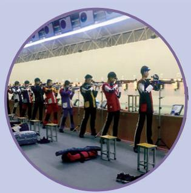

# 数学探究 杨辉三角的性质与应用 39

# 第七章 随机变量及其分布 43

7.1 条件概率与全概率公式 …… 44

阅读与思考 贝叶斯公式与人工智能 …… 53

7.2 离散型随机变量及其分布列 56

7.3 离散型随机变量的数字特征 …… 62

7.4 二项分布与超几何分布 …… 72

探究与发现 二项分布的性质 …… 81

7.5 正态分布 83

信息技术应用 概率分布图及概率计算 87

小结……89

复习参考题 7 …… 90

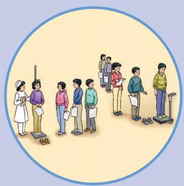

# 第八章 成对数据的统计分析 92

8.1 成对数据的统计相关性 93

8.2 一元线性回归模型及其应用…… 105

阅读与思考 回归与相关…… 122

8.3 列联表与独立性检验…… 124

小结 137

复习参考题8 138

# 数学建模 建立统计模型进行预测 …… 141

# 部分中英文词汇索引…… 147

# 第六章 计数原理

汽车号牌的序号一般是从26个英文字母、10个阿拉伯数字中选出若干个，并按适当顺序排列而成。随着人们生活水平的提高，家庭汽车拥有量迅速增长，汽车号牌序号需要扩容。那么，交通管理部门应如何确定序号的组成方法，才能满足民众的需求呢？这就需要“数（shǔ）出”某种汽车号牌序号的组成方案下所有可能的序号数，这就是计数。

日常生活、生产中类似的问题大量存在。例如，幼儿会通过一个一个地数的方法，统计自己拥有玩具的数量；学校要举行班际篮球比赛，在确定赛制后，体育组的老师需要知道共需要举行多少场比赛；用红、黄、绿三面旗帜组成航海信号，颜色的不同排列表示不同的信号，需要知道共可以组成多少种不同的信号……如果问题中数量很少，一个一个地数也不失为一种计数的好方法。但如果问题中数量很多，我们还一个一个地去数吗？

在小学我们学了加法和乘法，这是将若干个“小”的数结合成“较大”的数最基本的方法。这两种方法经过推广就成了本章将要学习的分类加法计数原理和分步乘法计数原理。这两个原理是解决计数问题的最基本、最重要的方法，利用两个计数原理还可以得到两类特殊计数问题的计数公式——排列数公式和组合数公式，应用公式就可以方便地解决一些计数问题。作为计数原理与计数公式的一个应用，我们还将学习在数学上有广泛应用的二项式定理。


## 6.1 分类加法计数原理与分步乘法计数原理

计数问题是我们从小就经常遇到的，通过列举一个一个地数是计数的基本方法。但当问题中的数量很大时，列举的方法效率不高。能否设计巧妙的“数法”，以提高效率呢？下面先分析一个简单的问题，并尝试从中得出巧妙的计数方法。

> [!think] 思考
用一个大写的英文字母或一个阿拉伯数字给教室里的一个座位编号，总共能编出多少种不同的号码？
因为英文字母共有 26 个，阿拉伯数字共有 10 个，所以总共可以编出
$2 6 + 1 0 = 3 6$

种不同的号码.

> [!explore] 探究
你能说一说这个问题的特征吗？

首先，这里要完成的事情是“给一个座位编号”；其次是“或”字的出现：一个座位编号用一个英文字母或一个阿拉伯数字表示。因为英文字母与阿拉伯数字互不相同，所以用英文字母编出的号码与用阿拉伯数字编出的号码也互不相同。这两类号码数相加就得到号码的总数。

上述计数过程的基本环节是：
（1）确定分类标准，根据问题条件分为字母号码和数字号码两类；  
（2） 分别计算各类号码的个数;  
（3）各类号码的个数相加，得出所有号码的个数.

一般地，有如下分类加法计数原理：

完成一件事有两类不同方案 $^{①}$ ，在第1类方案中有m种不同的方法，在第2类方案中有n种不同的方法，那么完成这件事共有

你能举一些生活中类似的例子吗？

①两类不同方案中的方法互不相同.
$N = m + n$

种不同的方法.

> [!example]- 例 1 在填写高考志愿表时，一名高中毕业生了解到，A，B两所大学各有一些自己感兴趣的强项专业，如表6.1-1.
表6.1-1

<table><tr><td>A 大学</td><td>B 大学</td></tr><tr><td>生物学</td><td>数学</td></tr><tr><td>化学</td><td>会计学</td></tr><tr><td>医学</td><td>经济学</td></tr><tr><td>物理学</td><td>法学</td></tr><tr><td>工程学</td><td></td></tr></table>
如果这名同学只能选一个专业，那么他共有多少种选择？
分析：要完成的事情是“选一个专业”。因为这名同学在A，B两所大学中只能选择一所，而且只能选择一个专业，又因为这两所大学没有共同的强项专业，所以符合分类加法计数原理的条件。
解：这名同学可以选择 A，B 两所大学中的一所。在 A 大学中有 5 种专业选择方法，在 B 大学中有 4 种专业选择方法。因为没有一个强项专业是两所大学共有的，所以根据分类加法计数原理，这名同学可能的专业选择种数为
$N = 5 + 4 = 9.$

> [!explore] 探究
如果完成一件事有三类不同方案，在第1类方案中有 $m_{1}$ 种不同的方法，在第2类方案中有 $m_{2}$ 种不同的方法，在第3类方案中有 $m_{3}$ 种不同的方法，那么完成这件事共有多少种不同的方法？
如果完成一件事有 $n$ 类不同方案，在每一类方案中都有若干种不同的方法，那么应当如何计数呢？

> [!think] 思考
用前 6 个大写英文字母和 1～9 这 9 个阿拉伯数字，以 $A_{1}$ ， $A_{2}$ ，…， $A_{9}$ ， $B_{1}$ ， $B_{2}$ ，…的方式给教室里的一个座位编号，总共能编出多少种不同的号码？

这里要完成的事情仍然是“给一个座位编号”，但与前一问题的要求不同。在前一问题中，用26个英文字母中的任意一个或10个阿拉伯数字中的任意一个，都可以给出一个座位号码. 但在这个问题中, 号码必须由一个英文字母和一个作为下标的阿拉伯数字组成, 即得到一个号码要经过先确定一个英文字母, 后确定一个阿拉伯数字这样两个步骤. 用图 6.1-1 所示的方法可以列出所有可能的号码.

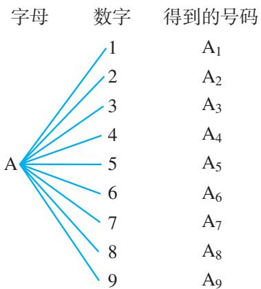

图6.1-1  
图6.1-1是解决计数问题常用的“树状图”。你能用树状图列出所有可能的号码吗？

也可以这样思考：
由于前 6 个英文字母中的任意一个都能与 9 个数字中的任意一个组成一个号码，而且它们互不相同，因此共有
$6 \times 9 = 5 4$

种不同的号码.

> [!explore] 探究
你能说一说这个问题的特征吗？

上述问题要完成的一件事情仍然是“给一个座位编号”，其中最重要的特征是“和”字的出现：一个座位编号由一个英文字母和一个阿拉伯数字构成。因此得到一个座位号要经过先确定一个英文字母，后确定一个阿拉伯数字这两个步骤，每一个英文字母与不同的数字组成的号码是互不相同的。

一般地，有如下分步乘法计数原理：

完成一件事需要两个步骤①，做第1步有 $m$ 种不同的方法，做第2步有 $n$ 种不同的方法，那么完成这件事共有
$N = m \times n$

种不同的方法.

①无论第1步采用哪种方法，与之对应的第2步都有相同的方法数.

> [!example]- 例2 某班有男生30名、女生24名，从中任选男生和女生各1名代表班级参加比赛，共有多少种不同的选法？
分析：要完成的一件事是“选男生和女生各1名”，可以分两个步骤：第1步，选男生；第2步，选女生.
解：任选男生和女生各1名，可以分两个步骤完成：第1步，从30名男生中选出1名，有30种不同选法；第2步，从24名女生中选出1名，有24种不同选法。根据分步乘法计数原理，共有不同选法的种数为
$N = 3 0 \times 2 4 = 7 2 0.$

> [!explore] 探究
如果完成一件事需要三个步骤，做第1步有 $m_{1}$ 种不同的方法，做第2步有 $m_{2}$ 种不同的方法，做第3步有 $m_{3}$ 种不同的方法，那么完成这件事共有多少种不同的方法？
如果完成一件事需要 $n$ 个步骤，做每一步都有若干种不同的方法，那么应当如何计数呢？

> [!example]- 例 3 书架的第 1 层放有 4 本不同的计算机书，第 2 层放有 3 本不同的文艺书，第 3 层放有 2 本不同的体育书.
（1）从书架上任取 1 本书，有多少种不同取法？  
（2）从书架的第1层、第2层、第3层各取1本书，有多少种不同取法？
分析：（1）要完成的一件事是“从书架上取1本书”，可以分从第1层、第2层和第3层中取三类方案；（2）要完成的一件事是“从书架的第1层、第2层、第3层各取1本书”，可以分三个步骤完成.
解：（1）从书架上任取 1 本书，有三类方案：第 1 类方案是从第 1 层取 1 本计算机书，有 4 种方法；第 2 类方案是从第 2 层取 1 本文艺书，有 3 种方法；第 3 类方案是从第 3 层取 1 本体育书，有 2 种方法．根据分类加法计数原理，不同取法的种数为
$N = 4 + 3 + 2 = 9.$
（2）从书架的第1层、第2层、第3层各取1本书，可以分三个步骤完成：第1步，从第1层取1本计算机书，有4种方法；第2步，从第2层取1本文艺书，有3种方法；第3步，从第3层取1本体育书，有2种方法．根据分步乘法计数原理，不同取法的种数为
$N = 4 \times 3 \times 2 = 2 4.$

#### 练习

1. 填空题
（1）一项工作可以用2种方法完成，有5人只会用第1种方法完成，另有4人只会用第2种方法完成，从中选出1人来完成这项工作，不同选法的种数是\_\_\_\_；  
（2） 从 A 村去 B 村的道路有 3 条, 从 B 村去 C 村的道路有 2 条, 则从 A 村经 B 村去 C 村, 不同路线的条数是 \_\_\_\_.

2. 在例 1 中，若数学也是 A 大学的强项专业，则 A 大学有 6 个专业可以选择，B 大学有 4 个专业可以选择，应用分类加法计数原理，得到这名同学可能的专业选择种数为 $6 + 4 = 10$ 。这种算法有什么问题？

3. 书架上层放有 6 本不同的数学书，下层放有 5 本不同的语文书.
（1）从书架上任取 1 本书，有多少种不同的取法？  
（2） 从书架上任取数学书和语文书各 1 本，有多少种不同的取法？

4. 现有高一年级的学生 3 名，高二年级的学生 5 名，高三年级的学生 4 名.
（1）从三个年级的学生中任选1人参加接待外宾的活动，有多少种不同的选法？  
（2） 从三个年级的学生中各选 1 人参加接待外宾的活动，有多少种不同的选法？

> [!example]- 例 4 要从甲、乙、丙 3 幅不同的画中选出 2 幅，分别挂在左、右两边墙上的指定位置，共有多少种不同的挂法？
分析：要完成的一件事是“从3幅画中选出2幅，并分别挂在左、右两边墙上”，可以分步完成.
解：从 3 幅画中选出 2 幅分别挂在左、右两边墙上，可以分两个步骤完成：第 1 步，从 3 幅画中选 1 幅挂在左边墙上，有 3 种选法；第 2 步，从剩下的 2 幅画中选 1 幅挂在右边墙上，有 2 种选法。根据分步乘法计数原理，不同挂法的种数为
$N = 3 \times 2 = 6.$

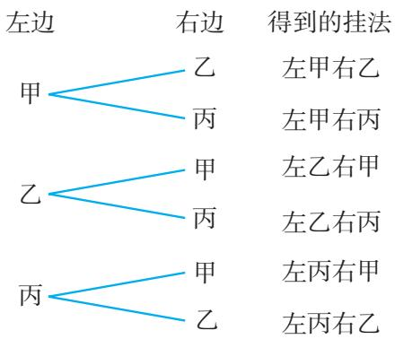

图6.1-2

这 6 种挂法如图 6.1-2 所示.

分类加法计数原理和分步乘法计数原理，回答的都是有关做一件事的不同方法种数的问题。区别在于：分类加法计数原理针对的是“分类”问题，其中各种方法相互独立，用其中任何一种方法都可以做完这件事；分步乘法计数原理针对的是“分步”问题，各个步骤中的方法互相依存，只有每一个步骤都完成才算做完这件事。

> [!example]- 例 5 给程序模块命名，需要用 3 个字符，其中首字符要求用字母 A～G 或 U～Z，后两个字符要求用数字 1～9，最多可以给多少个程序模块命名？
分析：要完成的一件事是“给一个程序模块命名”，可以分三个步骤完成：第1步，选首字符；第2步，选中间字符；第3步，选最后一个字符．而首字符又可以分为两类．
解：由分类加法计数原理，首字符不同选法的种数为
$7 + 6 = 1 3.$

后两个字符从 1～9 中选，因为数字可以重复，所以不同选法的种数都为 9.
由分步乘法计数原理，不同名称的个数是
$1 3 \times 9 \times 9 = 1 0 5 3,$

你还能给出不同的解法吗？
即最多可以给 1053 个程序模块命名.

> [!example]- 例6 电子元件很容易实现电路的通与断、电位的高与低等两种状态，而这也是最容易控制的两种状态。因此计算机内部就采用了每一位只有0或1两种数字的记数法，即二进制。为了使计算机能够识别字符，需要对字符进行编码，每个字符可以用1个或多个字节来表示，其中字节是计算机中数据存储的最小计量单位，每个字节由8个二进制位构成。
（1） 1个字节（8位）最多可以表示多少个不同的字符？  
（2）计算机汉字国标码包含了6763个汉字，一个汉字为一个字符，要对这些汉字进行编码，每个汉字至少要用多少个字节表示？
分析：（1）要完成的一件事是“确定1个字节各二进制位上的数字”。由于每个字节有8个二进制位，每一位上的数字都有0，1两种选择，而且不同的顺序代表不同的字符，因此可以用分步乘法计数原理求解；（2）只要计算出多少个字节所能表示的不同字符不少于6763个即可。
解：（1）用图 6.1-3 表示 1 个字节，每一格代表一位.
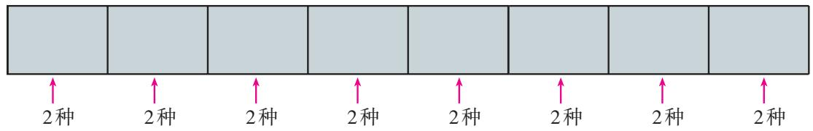

图6.1-3

1 个字节共有 8 位，每位上有 2 种选择。根据分步乘法计数原理，1 个字节最多可以表示不同字符的个数是
$2 \times 2 \times 2 \times 2 \times 2 \times 2 \times 2 \times 2 = 2 ^ {8} = 2 5 6.$
（2）由（1）知，1个字节所能表示的不同字符不够6763个，我们考虑2个字节能够表示多少个字符.前1个字节有256种不同的表示方法，后1个字节也有256种表示方法.根据分步乘法计数原理，2个字节可以表示不同字符的个数是
$2 5 6 \times 2 5 6 = 6 5 5 3 6.$

这已经大于汉字国标码包含的汉字个数 6763. 因此要对这些汉字进行编码，每个汉字至少要用 2 个字节表示.

#### 练习

1. 某电话局管辖范围内的电话号码由8位数字组成，其中前4位的数字是不变的，后4位数字都是0～9中的一个数字，这个电话局不同的电话号码最多有多少个？  
2. 从5名同学中选出正、副组长各1名，有多少种不同的选法？  
3. 从 $1, 2, \cdots, 19, 20$ 中任选一个数作被减数，再从 $1, 2, \cdots, 10$ 中任选一个数作减数，然后写成一个减法算式，共可得到多少个不同的算式？  
4. 在 1, 2, …, 500 中，被 5 除余 2 的数共有多少个？  
5. 由数字 1, 2, 3, 4, 5 可以组成多少个三位数（各位上的数字可以重复）?

> [!example]- 例7 计算机编程人员在编写好程序以后需要对程序进行测试。程序员需要知道到底有多少条执行路径（程序从开始到结束的路线），以便知道需要提供多少个测试数据。一般地，一个程序模块由许多子模块组成。图6.1-4是一个具有许多执行路径的程序模块，它有多少条执行路径？
另外，为了减少测试时间，程序员需要设法减少测试次数。你能帮助程序员设计一个测试方法，以减少测试次数吗？

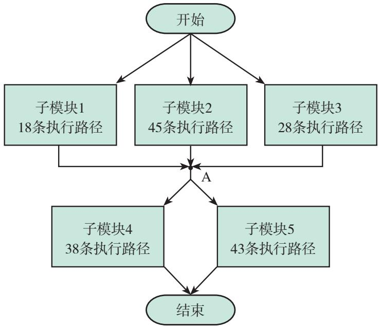

图6.1-4
分析：整个模块的任意一条执行路径都分两步完成：第1步是从开始执行到A点；第2步是从A点执行到结束。而第1步可由子模块1、子模块2、子模块3中任何一个来完成；第2步可由子模块4、子模块5中任何一个来完成。因此，分析一条指令在整个模块的执行路径需要用到两个计数原理。
解：由分类加法计数原理，子模块1、子模块2、子模块3中的子路径条数共为
$1 8 + 4 5 + 2 8 = 9 1;$

子模块4、子模块5中的子路径条数共为
$3 8 + 4 3 = 8 1.$
又由分步乘法计数原理，整个模块的执行路径条数共为
$9 1 \times 8 1 = 7 3 7 1.$

在实际测试中，程序员总是把每一个子模块看成一个黑箱，即通过只考察是否执行了正确的子模块的方式来测试整个模块。这样，他可以先分别单独测试5个模块，以考察每个子模块的工作是否正常。总共需要的测试次数为
$1 8 + 4 5 + 2 8 + 3 8 + 4 3 = 1 7 2.$

再测试各个模块之间的信息交流是否正常，只需要测试程序第1步中的各个子模块和第2步中的各个子模块之间的信息交流是否正常，需要的测试次数为
$3 \times 2 = 6.$
如果每个子模块都工作正常，并且各个子模块之间的信息交流也正常，那么整个程序模块就工作正常。这样，测试整个模块的次数就变为
$1 7 2 + 6 = 1 7 8.$
显然，178 与 7371 的差距是非常大的.

你看出了程序员是如何实现减少测试次数的吗？

> [!example]- 例 8 通常，我国民用汽车号牌的编号由两部分组成：第一部分为用汉字表示的省、自治区、直辖市简称和用英文字母表示的发牌机关代号，第二部分为由阿拉伯数字和英文字母组成的序号，如图 6.1-5 所示.
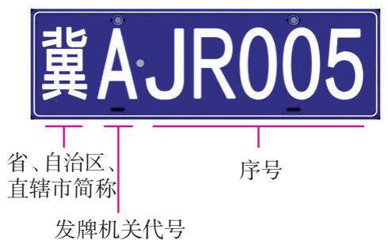

图6.1-5

对于省和自治区，发牌机关通常是指其地级市的公共交通管理部门，并用英文字母依次编码。例如，河北省石家庄市、唐山市的发牌机关代号分别为A，B.直辖市的发牌机关代号可备案后依次自行使用。

其中，序号的编码规则为：
（1）由 10 个阿拉伯数字和除 O，I 之外的 24 个英文字母组成；  
（2） 最多只能有 2 个英文字母.
如果某地级市发牌机关采用 5 位序号编码，那么这个发牌机关最多能发放多少张汽车号牌？
分析：由号牌编号的组成可知，序号的个数决定了这个发牌机关所能发放的最多号牌数。按序号编码规则可知，每个序号中的数字、字母都是可重复的，并且可将序号分为三类：没有字母，有1个字母，有2个字母。以字母所在位置为分类标准，可将有1个字母的序号分为五个子类，将有2个字母的序号分为十个子类。
解：由号牌编号的组成可知，这个发牌机关所能发放的最多号牌数就是序号的个数。根据序号编码规则，5位序号可以分为三类：没有字母，有1个字母，有2个字母。
（1）当没有字母时，序号的每一位都是数字．确定一个序号可以分5个步骤，每一步都可以从10个数字中选1个，各有10种选法．根据分步乘法计数原理，这类号牌张数为
$1 0 \times 1 0 \times 1 0 \times 1 0 \times 1 0 = 1 0 0 0 0 0.$
（2）当有 1 个字母时，这个字母可以分别在序号的第 1 位、第 2 位、第 3 位、第 4 位或第 5 位，这类序号可以分为五个子类.
当第1位是字母时，分5个步骤确定一个序号中的字母和数字：第1步，从24个字母中选 1 个放在第 1 位，有 24 种选法；第 2～5 步都是从 10 个数字中选 1 个放在相应的位置，各有 10 种选法。根据分步乘法计数原理，号牌张数为
$2 4 \times 1 0 \times 1 0 \times 1 0 \times 1 0 = 2 4 0 0 0 0.$
同样，其余四个子类号牌也各有 240 000 张.

根据分类加法计数原理，这类号牌张数一共为
$2 4 0 0 0 0 + 2 4 0 0 0 0 + 2 4 0 0 0 0 + 2 4 0 0 0 0 + 2 4 0 0 0 0 = 1 2 0 0 0 0 0.$
（3）当有 2 个字母时，根据这 2 个字母在序号中的位置，可以将这类序号分为十个子类：第 1 位和第 2 位，第 1 位和第 3 位，第 1 位和第 4 位，第 1 位和第 5 位，第 2 位和第 3 位，第 2 位和第 4 位，第 2 位和第 5 位，第 3 位和第 4 位，第 3 位和第 5 位，第 4 位和第 5 位.
当第 1 位和第 2 位是字母时，分 5 个步骤确定一个序号中的字母和数字：第 1，2 步都是从 24 个字母中选 1 个分别放在第 1 位、第 2 位，各有 24 种选法；第 3～5 步都是从 10 个数字中选 1 个放在相应的位置，各有 10 种选法。根据分步乘法计数原理，号牌张数为
$2 4 \times 2 4 \times 1 0 \times 1 0 \times 1 0 = 5 7 6 0 0 0.$
同样，其余九个子类号牌也各有 576 000 张.
于是，这类号牌张数一共为
$5 7 6 0 0 0 \times 1 0 = 5 7 6 0 0 0 0.$

综合（1）（2）（3），根据分类加法计数原理，这个发牌机关最多能发放的汽车号牌张数为
$1 0 0 0 0 0 + 1 2 0 0 0 0 0 + 5 7 6 0 0 0 0 = 7 0 6 0 0 0 0.$


> [!tip] 归纳

用两个计数原理解决计数问题时，最重要的是在开始计算之前要仔细分析两点：（1）要完成的“一件事”是什么；（2）需要分类还是需要分步.

分类要做到“不重不漏”。分类后再分别对每一类进行计数，最后用分类加法计数原理求和，得到总数。

分步要做到“步骤完整”，即完成了所有步骤，才能完成任务。分步后再计算每一步的方法数，最后根据分步乘法计数原理，把完成每一步的方法数相乘，得到总数。

> [!think] 思考
乘法运算是特定条件下加法运算的简化，分步乘法计数原理和分类加法计数原理也有这种类似的关系吗？

#### 练习

1. 乘积 $(a_{1} + a_{2} + a_{3})(b_{1} + b_{2} + b_{3})(c_{1} + c_{2} + c_{3} + c_{4} + c_{5})$ 展开后共有多少项？  
2. 在所有的两位数中，个位数字小于十位数字的有多少个？  
3. 某商场有 6 个门，如果某人从其中的任意一个门进入商场，并且要求从其他的门出去，那么共有多少种不同的进出商场的方式？  
4. 任意画一条直线，在直线上任取 $n$ 个分点.
（1）从这 $n$ 个分点中任取2个点形成一条线段，可得到多少条线段？  
（2）从这 $n$ 个分点中任取2个点形成两条有向线段，可得到多少条有向线段？

## 习题6.1

### 复习巩固

1. 一个商店销售某种型号的电视机，其中本地的产品有4种，外地的产品有7种。要买1台这种型号的电视机，有多少种不同的选法？  
2. 如图，从甲地到乙地有 2 条路，从乙地到丁地有 3 条路；从甲地到丙地有 4 条路，从丙地到丁地有 2 条路。从甲地到丁地共有多少条不同的路线？

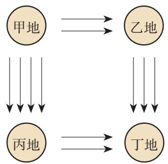

(第2题)

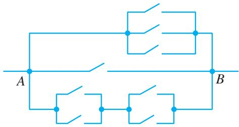

(第3题)

3. 如图，要让电路从 A 处到 B 处只有一条支路接通，可有多少条不同的路径？  
4. 用 1, 5, 9, 13 中的任意一个数作分子, 4, 8, 12, 16 中任意一个数作分母, 可构成多少个不同的分数? 可构成多少个不同的真分数?  
5. 一个口袋内装有 5 个小球，另一个口袋内装有 6 个小球，所有这些小球的颜色互不相同。从两个袋子中分别取 1 个球，共有多少种不同的取法？  
6.（1）在平面直角坐标系内，横坐标与纵坐标均在 $A = \{0, 1, 2, 3, 4, 5\}$ 内取值的不同点共有多少个？  
（2） 在平面直角坐标系内，斜率在集合 $B = \{1, 3, 5, 7\}$ 内取值， $y$ 轴上的截距在集合 $C = \{2, 4, 6, 8\}$ 内取值的不同直线共有多少条？

### 综合运用

7. 一种密码锁有 4 个拨号盘，每个拨号盘上有 0～9 共 10 个数字。现最后一个拨号盘出现了故障，只能在 0～5 这 6 个数字中拨号，这 4 个拨号盘可组成多少个四位数字号码？

8. （1） 4 名同学分别报名参加学校的足球队、篮球队、乒乓球队, 每人限报其中的一个运动队, 不同报法的种数是 $3^{4}$ 还是 $4^{3}$ ?
（2） 3个班分别从5个景点中选择一处游览，不同选法的种数是 $3^{5}$ 还是 $5^{3}$ ?

9.（1）从5件不同的礼物中选出4件送给4位同学，每人一件，有多少种不同的送法？
（2） 有 5 个编了号的抽屉, 要放进 3 本不同的书, 不同的放法有多少种? (一个抽屉可放多本书.)

10. 口袋中装有 8 个白球和 10 个红球，每个球编有不同的号码，现从中取出 2 个球.
（1） 恰好是白球、红球各一个的取法有多少种?
（2） 恰好是两个白球的取法有多少种?
（3）至少有一个白球的取法有多少种？
（4） 两球的颜色相同的取法有多少种?

### 拓广探索

11. 在国庆长假期间，要从7人中选若干人在7天假期值班（每天只需1人值班），不出现同一人连续值班2天，有多少种可能的安排方法？

12. 2160有多少个不同的正因数?


## 探究与发现

### 子集的个数有多少

问题 n 元集合 $A=\{a_{1}, a_{2}, \cdots, a_{n}\}$ 的子集有多少个？

为了解决这个问题，一个可行的思路是先研究一下某些具体集合，如 $S = \{a_{1}, a_{2}, a_{3}\}$ 的子集个数，从中获得启发，然后对一般的情况进行研究.
由于 $S$ 中的元素只有3个，因此可以用列举法列出它的所有子集：
$\begin{array}{c} \emptyset , \{a _ {1} \}, \{a _ {2} \}, \{a _ {3} \}, \{a _ {1}, a _ {2} \}, \{a _ {1}, \\ a _ {3} \}, \{a _ {2}, a _ {3} \}, S. \end{array}$

可见，一个含有3个元素的集合共有8个子集.
如果一个集合所含元素较少，可以用列举法确定其子集的个数。但如果集合中的元素较多，用这种方法确定子集个数就不太方便了。另外，

虽然列举法较“笨”，但它是计数的基本方法。请你列举一下4元集合 $\{a_1, a_2, a_3, a_4\}$ 、5元集合 $\{a_1, a_2, a_3, a_4, a_5\}$ 的子集。

从上述描述中较难发现集合 $S$ 中所含元素的个数3与其子集个数8之间的关系.

为了发现规律，需要采取另外的方法。一个自然的想法是，应当设法用两个计数原理。
显然，元素 $a_{i}(i = 1,2,3)$ 与各子集的关系只有两种： $a_{i}$ 属于子集或 $a_{i}$ 不属于子集．这样，我们可以考虑用考察 $S$ 中的每一个元素属不属于某个子集的方法来得到一个子集．因为 $S$ 中有3个元素，所以要得到集合 $S$ 的一个子集 $S_{1}$ ，可以分三个步骤：

第1步，考察元素 $a_1$ 是否在 $S_{1}$ 中，有2种可能 $(a_{1} \in S_{1}, a_{1} \notin S_{1})$

第2步，考察元素 $a_2$ 是否在 $S_{1}$ 中，有2种可能 $(a_{2} \in S_{1}, a_{2} \notin S_{1})$

第3步，考察元素 $a_3$ 是否在 $S_{1}$ 中，有2种可能 $(a_3\in S_1,a_3\notin S_1)$

只要完成上述三个步骤，那么集合 $S_{1}$ 中元素就完全确定了。根据分步乘法计数原理，对于由3个元素组成的集合，子集的个数为
$2 \times 2 \times 2 = 2 ^ {3} = 8.$

从上述过程，可以看到集合 S 中所含元素的个数 3 与其子集个数 8 之间的关系：3 是 $2^{3}$ 中的指数，而 8 是 $2^{3}$ 的运算结果.
由此，你是否对把空集及原集合自身作为子集的规定有进一步的理解？

一般地，我们有：

n 元集合 $A=\{a_{1}, a_{2}, \cdots, a_{n}\}$ 的不同子集有 $2^{n}$ 个.
证明：要得到集合 $A$ 的一个子集 $S_{1}$ ，可以分 $n$ 个步骤：

第1步，考察元素 $a_1$ 是否在 $S_{1}$ 中，有2种可能 $(a_{1} \in S_{1}, a_{1} \notin S_{1})$

第2步，考察元素 $a_2$ 是否在 $S_{1}$ 中，有2种可能 $(a_{2} \in S_{1}, a_{2} \notin S_{1})$

●●●●●●

第 $k$ 步，考察元素 $a_{k}$ 是否在 $S_{1}$ 中，有2种可能 $(a_{k} \in S_{1}, a_{k} \notin S_{1})$ ；
......

第 $n$ 步，考察元素 $a_{n}$ 是否在 $S_{1}$ 中，有2种可能 $(a_{n} \in S_{1}, a_{n} \notin S_{1})$ .

只要完成上述 $n$ 个步骤，那么集合 $S_{1}$ 中元素就完全确定了。根据分步乘法计数原理，对于由 $n$ 个元素组成的集合，子集的个数为
$\underbrace {2 \times 2 \times \cdots \times 2} _ {n {\text {个}} 2} = 2 ^ {n}.$

你还能用另外的方法证明上述结论吗？

## 6.2 排列与组合

在上节例8的解答中我们看到，用分步乘法计数原理解决问题时，因做了一些重复性工作而显得烦琐。能否对这类计数问题给出一种简捷的方法呢？为此，先来分析两个具体的问题。

### 6.2.1 排列

问题 1 从甲、乙、丙 3 名同学中选出 2 名参加一项活动，其中 1 名同学参加上午的活动，另 1 名同学参加下午的活动，有几种不同的选法？

此时，要完成的一件事是“选出2名同学参加活动，1名同学参加上午的活动，另1名同学参加下午的活动”，可以分两个步骤：

第 1 步，确定参加上午活动的同学，从 3 人中任选 1 人，有 3 种选法；
第 2 步，确定参加下午活动的同学，当参加上午活动的同学确定后，参加下午活动的同学只能从剩下的 2 人中去选，有 2 种选法.

根据分步乘法计数原理，不同的选法种数为
$3 \times 2 = 6.$

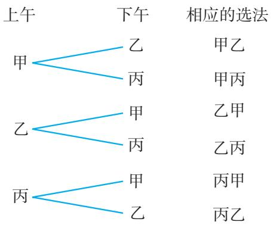

图6.2-1

这 6 种不同的选法如图 6.2-1 所示.
如果把上面问题中被取出的对象叫做元素，那么问题可叙述为：

从 3 个不同的元素 a, b, c 中任意取出 2 个，并按一定的顺序排成一列，共有多少种不同的排列方法？

所有不同的排列是
$a b, a c, b a, b c, c a, c b,$

不同的排列方法种数为
$3 \times 2 = 6.$

问题 1 中的 “顺序” 是什么？

问题2 从1，2，3，4这4个数字中，每次取出3个排成一个三位数，共可得到多少个不同的三位数？
显然，从 4 个数字中，每次取出 3 个，按 “百位、十位、个位” 的顺序排成一列，就得到一个三位数。因此有多少种不同的排列方法就有多少个不同的三位数。可以分三个步

骤来解决这个问题：

第 1 步，确定百位上的数字，从 1，2，3，4 这 4 个数字中任取 1 个，有 4 种方法；
第 2 步，确定十位上的数字，当百位上的数字确定后，十位上的数字只能从余下的 3 个数字中去取，有 3 种方法；
第 3 步，确定个位上的数字，当百位、十位上的数字确定后，个位的数字只能从余下的 2 个数字中去取，有 2 种方法.

根据分步乘法计数原理，从 1，2，3，4 这 4 个不同的数字中，每次取出 3 个数字，按 “百位、十位、个位” 的顺序排成一列，不同的排法种数为
$4 \times 3 \times 2 = 2 4.$

因而共可得到 24 个不同的三位数，如图 6.2-2 所示.

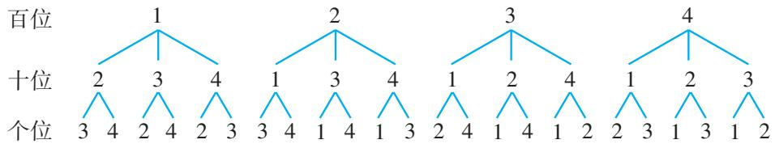

图6.2-2
由此可写出所有的三位数：
$\begin{array}{l} 1 2 3, 1 2 4, 1 3 2, 1 3 4, 1 4 2, 1 4 3, \\ 2 1 3, 2 1 4, 2 3 1, 2 3 4, 2 4 1, 2 4 3, \\ 3 1 2, 3 1 4, 3 2 1, 3 2 4, 3 4 1, 3 4 2, \\ 4 1 2, 4 1 3, 4 2 1, 4 2 3, 4 3 1, 4 3 2. \\ \end{array}$
同样，问题 2 可以归结为：

从 4 个不同的元素 a, b, c, d 中任意取出 3 个，并按照一定的顺序排成一列，共有多少种不同的排列方法？

所有不同的排列是
$\begin{array}{l} a b c, a b d, a c b, a c d, a d b, a d c, \\ b a c, b a d, b c a, b c d, b d a, b d c, \\ c a b, c a d, c b a, c b d, c d a, c d b, \\ d a b, d a c, d b a, d b c, d c a, d c b. \\ \end{array}$

问题 2 中的 “顺序” 是什么？

不同的排列方法种数为
$4 \times 3 \times 2 = 2 4.$

> [!think] 思考
上述问题 1，2 的共同特点是什么？你能将它们推广到一般情形吗？

问题1和问题2都是研究从一些不同元素中取出部分元素，并按照一定的顺序排成一列的方法数.

一般地，从 $n$ 个不同元素中取出 $m(m \leqslant n)$ 个元素，并按照一定的顺序排成一列，叫做从 $n$ 个不同元素中取出 $m$ 个元素的一个排列（arrangement）.

根据排列的定义，两个排列相同的充要条件是：两个排列的元素完全相同，且元素的排列顺序也相同。例如，在问题1中，“甲乙”与“甲丙”的元素不完全相同，它们是不同的排列；“甲乙”与“乙甲”虽然元素完全相同，但元素的排列顺序不同，它们也是不同的排列。又如，在问题2中，123与134的元素不完全相同，它们是不同的排列；123与132虽然元素完全相同，但元素的排列顺序不同，它们也是不同的排列。

> [!example]- 例 1 某省中学生足球赛预选赛每组有 6 支队，每支队都要与同组的其他各队在主、客场分别比赛 1 场，那么每组共进行多少场比赛？
分析：每组任意2支队之间进行的1场比赛，可以看作是从该组6支队中选取2支，按“主队、客队”的顺序排成的一个排列.
解：可以先从这 6 支队中选 1 支为主队，然后从剩下的 5 支队中选 1 支为客队。按分步乘法计数原理，每组进行的比赛场数为
$6 \times 5 = 3 0.$

> [!example]- 例 2 （1）一张餐桌上有 5 盘不同的菜，甲、乙、丙 3 名同学每人从中各取 1 盘菜，共有多少种不同的取法？
（2）学校食堂的一个窗口共卖5种菜，甲、乙、丙3名同学每人从中选一种，共有多少种不同的选法？
分析：3 名同学每人从 5 盘不同的菜中取 1 盘菜，可看作是从这 5 盘菜中任取 3 盘，放在 3 个位置（给 3 名同学）的一个排列；而 3 名同学每人从食堂窗口的 5 种菜中选 1 种，每人都有 5 种选法，不能看成一个排列.
解：（1）可以先从这 5 盘菜中取 1 盘给同学甲，然后从剩下的 4 盘菜中取 1 盘给同学乙，最后从剩下的 3 盘菜中取 1 盘给同学丙．按分步乘法计数原理，不同的取法种数为
$5 \times 4 \times 3 = 6 0.$
（2）可以先让同学甲从5种菜中选1种，有5种选法；再让同学乙从5种菜中选1种，也有5种选法；最后让同学丙从5种菜中选1种，同样有5种选法。按分步乘法计数原理，不同的选法种数为
$5 \times 5 \times 5 = 1 2 5.$

#### 练习

1. 写出：
（1）用 $0\sim 4$ 这5个自然数组成的没有重复数字的全部两位数；  
（2） 从 a, b, c, d 中取出 2 个字母的所有排列.

2. 一位老师要给4个班轮流做讲座，每个班讲1场，有多少种轮流次序？  
3. 学校乒乓团体比赛采用 5 场 3 胜制（5 场单打），每支球队派 3 名运动员参赛，前 3 场比赛每名运动员各出场 1 次，其中第 1，2 位出场的运动员在后 2 场比赛中还将各出场 1 次.
（1）从5名运动员中选3名参加比赛，前3场比赛有几种出场情况？
（2） 甲、乙、丙 3 名运动员参加比赛，写出所有可能的出场情况.

### 6.2.2 排列数

前面给出了排列的定义，下面探究计算排列个数的公式.

我们把从 n 个不同元素中取出 $m(m \leqslant n)$ 个元素的所有不同排列的个数，叫做从 n 个不同元素中取出 m 个元素的排列数，用符号 $A_{n}^{m}$ 表示.

符号 $A_{n}^{m}$ 中的 A 是英文 arrangement（排列）的第一个字母.

例如，前面问题1是求从3个不同元素中取出2个元素的排列数，表示为 $\mathrm{A}_3^2$ 。已经算得
$\mathrm{A} _ {3} ^ {2} = 3 \times 2 = 6.$

问题 2 是求从 4 个不同元素中取出 3 个元素的排列数，表示为 $A_{4}^{3}$ . 已经算得
$\mathrm{A} _ {4} ^ {3} = 4 \times 3 \times 2 = 2 4.$

> [!explore] 探究
从 $n$ 个不同元素中取出 $m$ 个元素的排列数 $\mathrm{A}_n^m (m\leqslant n)$ 是多少？

可以先从特殊情况开始探究，例如求排列数 $\mathrm{A}_n^2$ 。根据前面的求解经验，可以这样考虑：

假定有排好顺序的两个空位，如图6.2-3所示，从 $n$ 个不同元素中取出2个元素去填空，一个空位填上一个元素，每一种填法就得到一个排列；反之，任何一种排列总可以由这种填法得到。因此，所有不同填法的种数就是排列数 $\mathrm{A}_n^2$

现在来计算有多少种填法。完成“填空”这件事可以分为两个步骤完成：

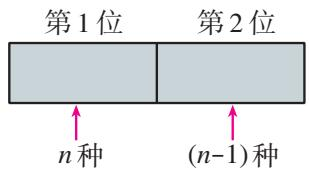

图6.2-3

第 1 步，填第 1 个位置的元素，可以从这 n 个不同元素中任选 1 个，有 n 种选法；
第 2 步，填第 2 个位置的元素，可以从剩下的 $(n-1)$ 个元素中任选 1 个，有 $(n-1)$ 种选法.

根据分步乘法计数原理，2个空位的填法种数为
$\mathrm{A} _ {n} ^ {2} = n (n - 1).$
同理，求排列数 $\mathrm{A}_n^3$ 可以按依次填3个空位来考虑，有
$\mathrm{A} _ {n} ^ {3} = n (n - 1) (n - 2).$

一般地，求排列数 $\mathrm{A}_n^m$ 可以按依次填 $m$ 个空位来考虑：

假定有排好顺序的 $m$ 个空位，如图6.2-4所示，从 $n$ 个不同元素中取出 $m$ 个元素去填空，一个空位填上一个元素，每一种填法就对应一个排列。因此，所有不同填法的种数就是排列数 $\mathrm{A}_n^m$ 。

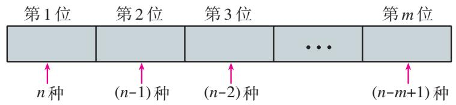

图6.2-4

填空可以分为 $m$ 个步骤完成：

第 1 步，从 n 个不同元素中任选 1 个填在第 1 位，有 n 种选法；
第 2 步，从剩下的 $(n-1)$ 个元素中任选 1 个填在第 2 位，有 $(n-1)$ 种选法；
第 3 步，从剩下的 $(n-2)$ 个元素中任选 1 个填在第 3 位，有 $(n-2)$ 种选法；
......

第 m 步，从剩下的 $\left[n-(m-1)\right]$ 个元素中任选 1 个填在第 m 位，有 $(n-m+1)$ 种选法.

根据分步乘法计数原理，m 个空位的填法种数为
$n (n - 1) (n - 2) \dots (n - m + 1).$

这样，我们就得到公式
$\mathrm{A} _ {n} ^ {m} = n (n - 1) (n - 2) \dots (n - m + 1).$

你能说一下排列数公式的特点吗？

这里， $m$ ， $n\in \mathbf{N}^*$ ，并且 $m\leqslant n$ .这个公式叫做排列数公式

根据排列数公式，我们就能方便地计算出从 $n$ 个不同元素中取出 $m(m \leqslant n)$ 个元素的所有排列的个数。例如，
$\mathrm{A} _ {5} ^ {2} = 5 \times 4 = 2 0,$
$\mathrm{A} _ {8} ^ {3} = 8 \times 7 \times 6 = 3 3 6.$

特别地，我们把 $n$ 个不同的元素全部取出的一个排列，叫做 $n$ 个元素的一个全排列.这时，排列数公式中 $m = n$ ，即有
$\mathrm{A} _ {n} ^ {n} = n \times (n - 1) \times (n - 2) \times \dots \times 3 \times 2 \times 1.$

也就是说，将 $n$ 个不同的元素全部取出的排列数，等于正整数1到 $n$ 的连乘积。正整数1到 $n$ 的连乘积，叫做 $n$ 的阶乘，用 $n!$ 表示。于是， $n$ 个元素的全排列数公式可以写成
$\mathrm{A} _ {n} ^ {n} = n!.$

另外，我们规定，0!=1.

> [!example]- 例3 计算：（1） $\mathrm{A}_7^3$ ； （2） $\mathrm{A}_7^4$ ； （3） $\frac{\mathrm{A}_7^7}{\mathrm{A}_4^4}$ ； （4） $\mathrm{A}_6^4\times \mathrm{A}_2^2.$
解：根据排列数公式，可得
（1） $\mathrm{A}_7^3 = 7\times 6\times 5 = 210;$   
（2） $\mathrm{A}_7^4 = 7\times 6\times 5\times 4 = 840$   
（3） $\frac{\mathrm{A}_7^7}{\mathrm{A}_4^4} = \frac{7!}{4!} = 7\times 6\times 5 = 210;$
（4） $\mathrm{A}_6^4\times \mathrm{A}_2^2 = 6\times 5\times 4\times 3\times 2\times 1 = 6! = 720.$

> [!think] 思考
由例3可以看到， $\mathrm{A}_7^3 = \frac{\mathrm{A}_7^7}{\mathrm{A}_4^4} = \frac{7!}{4!}$ ； $\mathrm{A}_6^4\times \mathrm{A}_2^2 = 6! = \mathrm{A}_6^6$ ，即 $\mathrm{A}_6^4 = \frac{\mathrm{A}_6^6}{\mathrm{A}_2^2} = \frac{6!}{2!}$ 观察这两个结果，从中你发现它们的共性了吗？
事实上，
$\begin{array}{l} \mathrm{A} _ {n} ^ {m} = n (n - 1) (n - 2) \dots (n - m + 1) \\ = \frac {n \times (n - 1) \times (n - 2) \times \cdots \times (n - m + 1) \times (n - m) \times \cdots \times 2 \times 1}{(n - m) \times \cdots \times 2 \times 1} \\ = \frac {\mathrm{A} _ {n} ^ {n}}{\mathrm{A} _ {n - m} ^ {n - m}} \\ = \frac {n !}{(n - m) !}. \\ \end{array}$
因此，排列数公式还可以写成
$\mathrm{A} _ {n} ^ {m} = \frac {n !}{(n - m) !}.$

> [!example]- 例 4 用 0\~9 这 10 个数字，可以组成多少个没有重复数字的三位数？
分析：在 0～9 这 10 个数字中，因为 0 不能在百位上，而其他 9 个数字可以在任意数位上，因此 0 是一个特殊的元素．一般地，我们可以从特殊元素的位置入手来考虑问题.
解法 1：如图 6.2-5 所示，由于三位数的百位上的数字不能是 0，所以可以分两步完成：第 1 步，确定百位上的数字，可以从 1～9 这 9 个数字中取出 1 个，有 $A_{9}^{1}$ 种取法；第 2 步，确定十位和个位上的数字，可以从剩下的 9 个数字中取出 2 个，有 $A_{9}^{2}$ 种取法。根据分步乘法计数原理，所求的三位数的个数为
$\mathrm{A} _ {9} ^ {1} \times \mathrm{A} _ {9} ^ {2} = 9 \times 9 \times 8 = 6 4 8.$<center>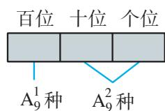</center><center>图6.2-5</center>
解法 2：如图 6.2-6 所示，符合条件的三位数可以分成三类：第 1 类，每一位数字都不是 0 的三位数，可以从 1～9 这 9 个数字中取出 3 个，有 $A_{9}^{3}$ 种取法；第 2 类，个位上的数字是 0 的三位数，可以从剩下的 9 个数字中取出 2 个放在百位和十位，有 $A_{9}^{2}$ 种取法；第 3 类，十位上的数字是 0 的三位数，可以从剩下的 9 个数字中取出 2 个放在百位和个位，有 $A_{9}^{2}$ 种取法。
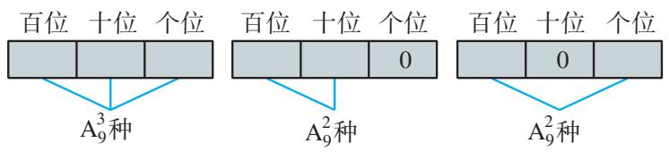

图6.2-6

根据分类加法计数原理，所求三位数的个数为
$\mathrm{A} _ {9} ^ {3} + \mathrm{A} _ {9} ^ {2} + \mathrm{A} _ {9} ^ {2} = 9 \times 8 \times 7 + 9 \times 8 + 9 \times 8 = 6 4 8.$
解法 3：从 0～9 这 10 个数字中选取 3 个的排列数为 $A_{10}^{3}$ ，其中 0 在百位上的排列数为 $A_{9}^{2}$ ，它们的差就是用这 10 个数组成的没有重复数字的三位数的个数，即所求三位数的个数为
$\mathrm{A} _ {1 0} ^ {3} - \mathrm{A} _ {9} ^ {2} = 1 0 \times 9 \times 8 - 9 \times 8 = 6 4 8.$

对于例 4 这类计数问题，从不同的角度就有不同的解题方法。解法 1 根据百位数字不能是 0 的要求，按分步乘法计数原理完成从 10 个数中取出 3 个数组成没有重复数字的三位数这件事；解法 2 是以 0 是否出现以及出现的位置为标准，按分类加法计数原理完成这件事；解法 3 是一种间接法，先求出从 10 个数中取出 3 个数的排列数，然后减去其中百位是 0 的排列数（不是三位数的个数），就得到没有重复数字的三位数的个数。

从上述问题的解答过程可以看到，引入排列的概念，归纳出排列数公式，我们就能便捷地求解“从 $n$ 个不同元素中取出 $m(m \leqslant n)$ 个元素的所有排列的个数”这类特殊的计数问题.

#### 练习

1. 先计算，然后用计算工具检验：
（1） $\mathrm{A}_{12}^{4}$ ;
（2） $\mathrm{A}_8^8$ ;
（3） $\mathrm{A}_{15}^{5} - 15\mathrm{A}_{14}^{4}$ ;
（4） $\frac{\mathrm{A}_{12}^{7}}{\mathrm{A}_{12}^{6}}.$

2. 求证：
（1） $\mathrm{A}_n^m = n\mathrm{A}_{n - 1}^{m - 1}$ ;
（2） $\mathrm{A}_8^8 - 8\mathrm{A}_7^7 + 7\mathrm{A}_6^6 = \mathrm{A}_7^7.$

3. 一个火车站有8股岔道，如果每股道只能停放1列火车，现要停放4列不同的火车，共有多少种不同的停放方法？

### 6.2.3 组合

> [!explore] 探究
从甲、乙、丙3名同学中选2名去参加一项活动，有多少种不同的选法？这一问题与6.2.1节的问题1有什么联系与区别？

在 6.2.1 节问题 1 的 6 种选法中，存在 “甲上午、乙下午” 和 “乙上午、甲下午” 2 种不同顺序的选法，我们可以将它看成是先选出甲、乙 2 名同学，然后再分配上午和下午而得到的。同样，先选出甲、丙或乙、丙，再分配上午和下午也都各有 2 种方法。而从甲、乙、丙 3 名同学中选 2 名去参加一项活动，就只需考虑将选出的 2 名同学作为一组，不需要考虑他们的顺序。于是，在 6.2.1 节问题 1 的 6 种选法中，将选出的 2 名同学作为一组的选法就只有如下 3 种情况：

甲乙，甲丙，乙丙.

将具体背景舍去，上述问题可以概括为：

从 3 个不同元素中取出 2 个元素作为一组，一共有多少个不同的组？

这就是我们要研究的问题.

一般地，从 $n$ 个不同元素中取出 $m(m \leqslant n)$ 个元素作为一组，叫做从 $n$ 个不同元素中取出 $m$ 个元素的一个组合（combination）.

> [!think] 思考
你能说一说排列与组合之间的联系与区别吗？

从排列与组合的定义可以知道，两者都是从 $n$ 个不同元素中取出 $m (m \leqslant n)$ 个元素，这是它们的共同点。但排列与元素的顺序有关，而组合与元素的顺序无关。只有元素相同且顺序也相同的两个排列才是相同的；而两个组合只要元素相同，不论元素的顺序如何，都是相同的。例如，在上述探究问题中，“甲乙”与“乙甲”的元素完全相同，但元素的排列顺序不同，因此它们是相同的组合，不同的排列。这样，以“元素相同”为标准分类，就可以建立起排列和组合之间的对应关系，如图6.2-7所示。

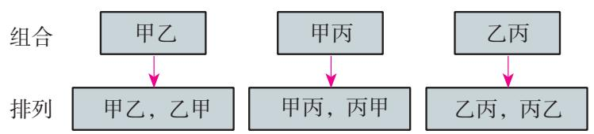

图6.2-7
由此，6.2.1节问题1的6个排列可以分成每组有2个不同排列的3个组，也就是上面探究问题的3个组合.

> [!think] 思考
校门口停放着9辆共享自行车，下面的问题是排列问题，还是组合问题？
（1） 从中选 3 辆，有多少种不同的方法？  
（2） 从中选 3 辆给 3 位同学, 有多少种不同的方法?

> [!example]- 例 5 平面内有 A, B, C, D 共 4 个点.
（1） 以其中 2 个点为端点的有向线段共有多少条?  
（2） 以其中 2 个点为端点的线段共有多少条?
分析：（1）确定一条有向线段，不仅要确定两个端点，还要考虑它们的顺序，是排列问题；（2）确定一条线段，只需确定两个端点，而不需考虑它们的顺序，是组合问题.
解：（1）一条有向线段的两个端点要分起点和终点，以平面内4个点中的2个为端点的有向线段的条数，就是从4个不同元素中取出2个元素的排列数，即有向线段条数为
$\mathrm{A} _ {4} ^ {2} = 4 \times 3 = 1 2.$

这12条有向线段分别为
$\overrightarrow {A B}, \overrightarrow {B A}, \overrightarrow {A C}, \overrightarrow {C A}, \overrightarrow {A D}, \overrightarrow {D A}, \overrightarrow {B C}, \overrightarrow {C B}, \overrightarrow {B D}, \overrightarrow {D B}, \overrightarrow {C D}, \overrightarrow {D C}.$
（2）由于不考虑两个端点的顺序，因此将（1）中端点相同、方向不同的2条有向线段作为一条线段，就是以平面内4个点中的2个点为端点的线段的条数，共有如下6条：
$A B, A C, A D, B C, B D, C D.$

> [!think] 思考
利用排列和组合之间的关系，以“元素相同”为标准分类，你能建立起例5（1）中排列和（2）中组合之间的对应关系吗？进一步地，能否从这种对应关系出发，由排列数求出组合的个数？

#### 练习

1. 甲、乙、丙、丁4支足球队举行单循环赛.
（1）列出所有各场比赛的双方；  
（2） 列出所有冠、亚军的可能情况.

2. 已知平面内 $A, B, C, D$ 这 4 个点中任何 3 个点都不在一条直线上，写出以其中任意 3 个点为顶点的所有三角形.

3. 现有 1, 3, 7, 13 这 4 个数.
（1）从这4个数中任取2个相加，可以得到多少个不相等的和？  
（2） 从这 4 个数中任取 2 个相减，可以得到多少个不相等的差？

### 6.2.4 组合数

类比排列数，我们引进组合数概念：

从 n 个不同元素中取出 $m(m \leqslant n)$ 个元素的所有不同组合的个数，叫做从 n 个不同元素中取出 m 个元素的组合数，用符号 $C_{n}^{m}$ 表示.

例如，从3个不同元素中取出2个元素的组合数表示为 $\mathrm{C}_3^2$ ，从4个不同元素中取出3个元素的组合数表示为 $\mathrm{C}_4^3$

符号 $C_{n}^{m}$ 中的 C 是英文 combination（组合）的第一个字母。组合数还可以用符号 $\binom{n}{m}$ 表示。

> [!explore] 探究
前面已经提到，组合和排列有关系，我们能否利用这种关系，由排列数 $\mathrm{A}_n^m$ 来求组合数 $C_n^m$ 呢？

前面，我们利用 “元素相同、顺序不同的两个组合相同” “元素相同、顺序不同的两个排列不同”，以 “元素相同” 为标准，建立了排列和组合之间的对应关系，并求得了从 3 个不同元素中取出 2 个元素的组合数
$\mathrm{C} _ {3} ^ {2} = 3.$

运用同样的方法，我们来求从4个不同元素中取出3个元素的组合数 $C_{4}^{3}$ 。设这4个元素为a，b，c，d，那么从中取出3个元素的排列数 $A_{4}^{3}=24$ ，以“元素相同”为标准将这24个排列分组，一共有4组，如图6.2-8所示，因此组合数 $C_{4}^{3}=4$ 。

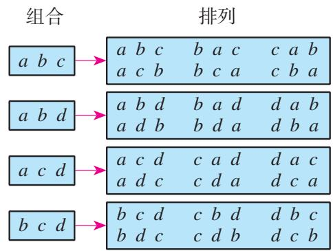

图6.2-8

观察图 6.2-8，也可以这样理解求 “从 4 个元素中取出 3 个元素的排列数 $A_{4}^{3}$ ”:

第 1 步，从 4 个元素中取出 3 个元素作为一组，共有 $C_{4}^{3}$ 种不同的取法；
第 2 步，将取出的 3 个元素作全排列，共有 $A_{3}^{3}$ 种不同的排法.
于是，根据分步乘法计数原理，有
$\mathrm{A} _ {4} ^ {3} = \mathrm{C} _ {4} ^ {3} \cdot \mathrm{A} _ {3} ^ {3},$
即
$\mathrm{C} _ {4} ^ {3} = \frac {\mathrm{A} _ {4} ^ {3}}{\mathrm{A} _ {3} ^ {3}} = 4.$
同样地，求“从 $n$ 个元素中取出 $m$ 个元素的排列数 $\mathrm{A}_n^m$ ”，可以看作由以下两个步骤得到：

第 1 步，从 n 个不同元素中取出 m 个元素作为一组，共有 $C_{n}^{m}$ 种不同的取法；
第 2 步，将取出的 m 个元素作全排列，共有 $A_{m}^{m}$ 种不同的排法.

根据分步乘法计数原理，有
$\mathrm{A} _ {n} ^ {m} = \mathrm{C} _ {n} ^ {m} \cdot \mathrm{A} _ {m} ^ {m}.$
因此，
$\mathrm{C} _ {n} ^ {m} = \frac {\mathrm{A} _ {n} ^ {m}}{\mathrm{A} _ {m} ^ {m}} = \frac {n (n - 1) (n - 2) \cdots (n - m + 1)}{m !}.$

这里 $n$ ， $m\in \mathbf{N}^*$ ，并且 $m\leqslant n$ 。这个公式叫做组合数公式.
因为
$\mathrm{A} _ {n} ^ {m} = \frac {n !}{(n - m) !},$
所以，上面的组合数公式还可以写成
$\mathrm{C} _ {n} ^ {m} = \frac {n !}{m ! (n - m) !}.$

另外，我们规定 $C_{n}^{0}=1$ .

> [!example]- 例6 计算：（1） $\mathrm{C}_{10}^{3}$ ； （2） $\mathrm{C}_{10}^{7}$ ； （3） $\mathrm{C}_{10}^{10}$ ； （4） $\mathrm{C}_{10}^{0}$
解：根据组合数公式，可得
（1） $C_{10}^{3} = \frac{A_{10}^{3}}{A_{3}^{3}} = \frac{10\times 9\times 8}{3!} = 120;$   
（2） $C_{10}^{7} = \frac{10!}{7!(10 - 7)!} = \frac{10\times 9\times 8\times 7!}{7!\times 3!} = \frac{10\times 9\times 8}{3!} = 120;$   
（3） $C_{10}^{10}=\frac{A_{10}^{10}}{A_{10}^{10}}=\frac{10!}{10!}=1;$   
（4） $C_{10}^{0}=1.$

> [!think] 思考
观察例 6 的（1）与（2），（3）与（4）的结果，你有什么发现？（1）与（2）分别用了不同形式的组合数公式，你对公式的选择有什么想法？

> [!example]- 例 7 在 100 件产品中，有 98 件合格品，2 件次品。从这 100 件产品中任意抽出 3 件。
（1） 有多少种不同的抽法?  
（2） 抽出的 3 件中恰好有 1 件是次品的抽法有多少种?  
（3） 抽出的 3 件中至少有 1 件是次品的抽法有多少种?
分析：（1）从 100 件产品中任意抽出 3 件，不需考虑顺序，因此这是一个组合问题；（2）可以先从 2 件次品中抽出 1 件，再从 98 件合格品中抽出 2 件，因此可以看作是一个分步完成的组合问题；（3）从 100 件产品抽出的 3 件中至少有 1 件是次品，包括有 1 件次品和有 2 件次品的情况，因此可以看作是一个分类完成的组合问题.
解：（1）所有的不同抽法种数，就是从 100 件产品中抽出 3 件的组合数，所以抽法种数为
$\mathrm{C} _ {1 0 0} ^ {3} = \frac {\mathrm{A} _ {1 0 0} ^ {3}}{\mathrm{A} _ {3} ^ {3}} = \frac {1 0 0 \times 9 9 \times 9 8}{3 !} = 1 6 1 7 0 0;$
（2）从 2 件次品中抽出 1 件的抽法有 $C_{2}^{1}$ 种，从 98 件合格品中抽出 2 件的抽法有 $C_{98}^{2}$ 种，因此抽出的 3 件中恰好有 1 件次品的抽法种数为
$\mathrm{C} _ {2} ^ {1} \times \mathrm{C} _ {9 8} ^ {2} = 2 \times \frac {9 8 \times 9 7}{2 !} = 9 5 0 6.$

从2件次品中抽出1件的抽法数可以是 $\mathrm{A}_2^1$ 吗？
（3）方法1 从100件产品抽出的3件中至少有1件是次品，包括有1件次品和有2件次品两种情况，因此根据分类加法计数原理，抽出的3件中至少有1件是次品的抽法种数为
$\mathrm{C} _ {2} ^ {1} \times \mathrm{C} _ {9 8} ^ {2} + \mathrm{C} _ {2} ^ {2} \times \mathrm{C} _ {9 8} ^ {1} = 9 5 0 6 + 9 8 = 9 6 0 4.$
方法 2 抽出的 3 件中至少有 1 件是次品的抽法种数，就是从 100 件产品中抽出 3 件的抽法种数减去 3 件都是合格品的抽法种数，即
$\mathrm{C} _ {1 0 0} ^ {3} - \mathrm{C} _ {9 8} ^ {3} = 1 6 1 7 0 0 - \frac {9 8 \times 9 7 \times 9 6}{3 !} = 9 6 0 4.$
当 $n$ 和 $m$ 取较小数值时，可以通过手算得出 $\mathrm{A}_n^m$ 和 $\mathrm{C}_n^m$ 。当 $n$ 和 $m$ 取较大数值时，可以使用信息技术工具，以使计算更快捷和准确。许多信息技术工具都有计算排列数 $\mathrm{A}_n^m$ 和组合数 $\mathrm{C}_n^m$ 的内置函数，输入 $n$ 和 $m$ 的值后，便可以直接得到结果。

#### 练习

1. 先计算，然后用计算工具检验：
（1） $\mathrm{C}_6^2$
（2） $C_{9}^{7}$ ;
（3） $\mathrm{C}_7^3 -\mathrm{C}_6^2$
（4） $3\mathrm{C}_8^3 -2\mathrm{C}_5^2$

2. 求证： $C_{n}^{m}=\frac{m+1}{n+1}C_{n+1}^{m+1}$

3. 有政治、历史、地理、物理、化学、生物这6门学科的学业水平考试成绩，现要从中选3门考试成绩.
（1） 共有多少种不同的选法?  
（2）如果物理和化学恰有1门被选，那么共有多少种不同的选法？  
（3）如果物理和化学至少有1门被选，那么共有多少种不同的选法？

## 习题6.2

### 复习巩固

1. 先计算，然后用计算工具检验：
（1） $5\mathrm{A}_5^3 +4\mathrm{A}_4^2$
（2） $\mathrm{A}_4^1 +\mathrm{A}_4^2 +\mathrm{A}_4^3 +\mathrm{A}_4^4.$

2. 先计算，然后用计算工具检验：
（1） $C_{15}^{3}$ ;
（2） $C_{200}^{197}$ ;
（3） $\mathrm{C}_6^3\div \mathrm{C}_8^4$
（4） $\mathrm{C}_{n + 1}^{n}\cdot \mathrm{C}_{n}^{n - 2}$

3. 壹圆、伍圆、拾圆、贰拾圆的人民币各1张，一共可以组成多少种币值？

4. 填空题
（1）有3张参观券，要在5人中确定3人去参观，不同方法的种数是\_\_\_\_；  
（2）要从 5 件不同的礼物中选出 3 件分别送 3 位同学，不同方法的种数是 \_\_\_\_；  
（3） 5 名工人各自在 3 天中选择 1 天休息, 不同方法的种数是\_\_\_\_;  
（4） 集合 $A$ 有 $m$ 个元素, 集合 $B$ 有 $n$ 个元素, 从两个集合中各取 1 个元素, 不同方法的种数是 \_\_\_\_.

5. 一名同学有 4 本不同的数学书，5 本不同的物理书，3 本不同的化学书，现要将这些书放在一个单层的书架上.
（1）如果要选其中的6本书放在书架上，那么有多少种不同的放法？  
（2）如果要将全部的书放在书架上，且不使同类的书分开，那么有多少种不同的放法？

6.（1）空间中有8个点，其中任何4个点不共面，过每3个点作一个平面，可以作多少个平面？
（2）空间中有10个点，其中任何4个点不共面，过每4个点为顶点作一个四面体，可以作多少个四面体？

7. 在一次考试的选做题部分，要求在第1题的4个小题中选做3个小题，在第2题的3个小题中选做2个小题，在第3题的2个小题中选做1个小题，有多少种不同的选法？

### 综合运用

8. 求证：
（1） $\mathrm{A}_{n + 1}^{n + 1} - \mathrm{A}_n^n = n^2\mathrm{A}_{n - 1}^{n - 1}$ ;
（2） $\frac{(n + 1)!}{k!} -\frac{n!}{(k - 1)!} = \frac{(n - k + 1)\cdot n!}{k!} (k\leqslant n).$

9. 学校要安排一场文艺晚会的 11 个节目的演出顺序。除第 1 个节目和最后 1 个节目已确定外，4 个音乐节目要求排在第 2，5，7，10 的位置，3 个舞蹈节目要求排在第 3，6，9 的位置，2 个曲艺节目要求排在第 4，8 的位置，有多少种不同的排法？

10. 班上每个小组有 12 名同学，现要从每个小组选 4 名同学代表本组与其他小组进行辩论赛.
（1） 每个小组有多少种选法?   
（2） 如果还要从选出的同学中指定 1 名作替补, 那么每个小组有多少种选法?  
（3）如果还要将选出的同学分别指定为第一、二、三、四辩手，那么每个小组有多少种选法？

11. 一个数阵有 $m$ 行 $n$ 列，第一行中的 $n$ 个数互不相同，其余行都由这 $n$ 个数以不同的顺序组成。如果要使任意两行的顺序都不相同，那么 $m$ 的值最大可取多少？

12. （1）从 0, 2, 4, 6 中任取 3 个数字，从 1, 3, 5 中任取 2 个数字，一共可以组成多少个没有重复数字的五位数？
（2）由数字0，1，2，3，4，5，6可以组成多少个没有重复数字，并且比5000000大的正整数？

13. 从 5 名男生和 4 名女生中选出 4 人去参加一项创新大赛.
（1）如果 4 人中男生女生各选 2 人，那么有多少种选法？  
（2） 如果男生中的甲和女生中的乙必须在内，那么有多少种选法？  
（3） 如果男生中的甲和女生中的乙至少要有 1 人在内，那么有多少种选法？  
（4）如果 4 人中必须既有男生又有女生，那么有多少种选法？

14. 一个宿舍的 6 名同学被邀请参加一个晚会.
（1）如果必须有人去，去几个人自行决定，有多少种不同的去法？  
（2） 如果其中甲和乙两位同学要么都去，要么都不去，有多少种去法？

15. 从含有 3 件次品的 100 件产品中，任意抽取 5 件进行检验.
（1） 抽出的产品都是合格品的抽法有多少种?  
（2） 抽出的产品中恰好有 2 件是次品的抽法有多少种?  
（3）抽出的产品中至少有2件是次品的抽法有多少种？  
（4） 抽出的产品中至多有 2 件是次品的抽法有多少种?

### 拓广探索

16. 根据某个福利彩票方案，每注彩票号码都是从 1～37 这 37 个数中选取 7 个数。如果所选 7 个数与开出的 7 个数一样（不管排列顺序），彩票即中一等奖。
（1） 多少注不同号码的彩票可有一个一等奖?  
（2） 如果要将一等奖的中奖机会提高到 $\frac{1}{3000000}$ 以上且不超过 $\frac{1}{2000000}$ , 可在 37 个数中取几个数?

17. 如图，现要用 5 种不同的颜色对某市的 4 个区县地图进行着色，要求有公共边的两个地区不能用同一种颜色，共有几种不同的着色方法？

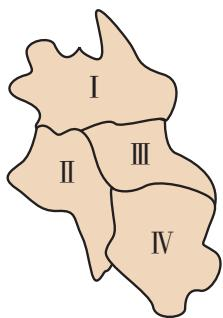

(第 17 题)

18. 移动互联网给人们的沟通交流带来了方便。某种移动社交软件平台，既可供用户彼此添加“好友”单独交流，又可供多个用户建立一个“群”（“群”里的人彼此不一定是“好友”关系）共同交流。如果某人在平台上发了信息，他的“好友”都可以看到，但“群”里的非“好友”

不能看到。现有一个10人的“群”，其中1人在平台上发了一条信息，“群”里有3人说看到了，那么这个“群”里与发信息这人是“好友”关系的情况可能有多少种？

19. 甲、乙、丙、丁、戊共5名同学进行劳动技术比赛，决出第1名到第5名的名次。甲和乙去询问成绩，回答者对甲说：“很遗憾，你和乙都没有得到冠军。”对乙说：“你当然不会是最差的。”从这两个回答分析，5人的名次排列可能有多少种不同情况？


## 探究与发现

### 组合数的两个性质

在例6中，我们已经发现 $\mathrm{C}_{10}^{3}$ 与 $\mathrm{C}_{10}^{7}$ ， $\mathrm{C}_{10}^{0}$ 与 $\mathrm{C}_{10}^{10}$ 都是相同的数。现在再用计算工具计算下列各组组合数的值，还能发现什么？你能解释你的发现吗？
$\mathrm{C} _ {1 2} ^ {5} \text {与} \mathrm{C} _ {1 2} ^ {7}, \mathrm{C} _ {1 5} ^ {4} \text {与} \mathrm{C} _ {1 5} ^ {1 1}, \mathrm{C} _ {1 8} ^ {3} \text {与} \mathrm{C} _ {1 8} ^ {1 5}.$

通过计算不难发现，各组的两个组合数都相等。观察同组的两个组合数，还可以发现，它们的上标之和等于下标，即
$5 + 7 = 1 2, 4 + 1 1 = 1 5, 3 + 1 5 = 1 8.$

如何解释上述结果呢？

等式的两边是对同一问题的两个等价解释，这启发我们，如果把 $C_{12}^{5}$ 解释为“从12名学生中选出5人参加某项活动的选法种数”，那么 $C_{12}^{7}$ 可以解释为“从12名学生中留下7人不参加活动的选法种数”。由于留下7人后其余5人就是参加活动的，所以不参加活动的人员选法种数 $C_{12}^{7}$ 就等于参加活动的人员选法种数 $C_{12}^{5}$ ，即有
$\mathrm{C} _ {1 2} ^ {5} = \mathrm{C} _ {1 2} ^ {7}.$

一般地，从 $n$ 个不同元素中取出 $m$ 个元素后，必然剩下 $(n - m)$ 个元素，因此从 $n$ 个不同元素中取出 $m$ 个元素的组合，与剩下的 $(n - m)$ 个元素的组合一一对应。这样，从 $n$ 个不同元素中取出 $m$ 个元素的组合数，等于从这 $n$ 个不同元素中取出 $(n - m)$ 个元素的组合数。于是我们有

性质1
$\mathrm{C} _ {n} ^ {m} = \mathrm{C} _ {n} ^ {n - m}.$
由于 $C_{n}^{0}=1$ ，因此上面的等式在m=n时也成立.

在推导性质1时，我们运用了说明组合等式的一个常用而重要的方法，即把等号两边的不同表达式解释为对同一个组合问题的两个不同的计数方案.

你能根据上述思想方法，利用分类加法计数原理，说明下面的组合数性质吗？

性质 2
$\mathrm{C} _ {n + 1} ^ {m} = \mathrm{C} _ {n} ^ {m} + \mathrm{C} _ {n} ^ {m - 1}.$

## 6.3 二项式定理

上一节学习了排列数公式和组合数公式，本节我们用它们解决一个在数学上有着广泛应用的 $(a + b)^n$ 展开的问题.

### 6.3.1 二项式定理

> [!explore] 探究
我们知道，
$\begin{array}{l} (a + b) ^ {2} = a ^ {2} + 2 a b + b ^ {2}, \\ (a + b) ^ {3} = a ^ {3} + 3 a ^ {2} b + 3 a b ^ {2} + b ^ {3}. \\ \end{array}$
（1）观察以上展开式，分析其运算过程，你能发现什么规律？  
（2） 根据你发现的规律，你能写出 $(a+b)^{4}$ 的展开式吗？  
（3） 进一步地，你能写出 $(a + b)^n$ 的展开式吗？

我们先来分析 $(a + b)^2$ 的展开过程．根据多项式乘法法则，
$\begin{array}{l} (a + b) ^ {2} = (a + b) (a + b) \\ = a (a + b) + b (a + b) \\ = a \times a + a \times b + b \times a + b \times b \\ = a ^ {2} + 2 a b + b ^ {2}. \\ \end{array}$

可以看到， $(a + b)^2$ 是 2 个 $(a + b)$ 相乘，只要从一个 $(a + b)$ 中选一项（ $a$ 或 $b$ ），再从另一个 $(a + b)$ 中选一项（ $a$ 或 $b$ ），相乘就得到展开式的一项。于是，由分步乘法计数原理，在合并同类项之前， $(a + b)^2$ 的展开式共有 $\mathrm{C}_2^1 \times \mathrm{C}_2^1 = 2^2$ 项，而且每一项都是 $a^{2 - k}b^k$ （ $k = 0, 1, 2$ ）的形式。

下面我们再来分析一下形如 $a^{2-k}b^{k}$ 的同类项的个数.
当 $k = 0$ 时， $a^{2 - k}b^k = a^2$ ，这是由2个 $(a + b)$ 中都不选 $b$ 得到的。因此， $a^2$ 出现的次数相当于从2个 $(a + b)$ 中取0个 $b$ （都取 $a$ ）的组合数 $\mathrm{C}_2^0$ ，即 $a^2$ 只有1个。
当 $k = 1$ 时， $a^{2 - k}b^k = ab$ ，这是由1个 $(a + b)$ 中选 $a$ ，另1个 $(a + b)$ 中选 $b$ 得到的。由于 $b$ 选定后， $a$ 的选法也随之确定，因此， $ab$ 出现的次数相当于从2个 $(a + b)$ 中取1个 $b$ 的组合数 $\mathrm{C}_2^1$ ，即 $ab$ 共有2个。
当 $k = 2$ 时， $a^{2 - k}b^k = b^2$ ，这是由2个 $(a + b)$ 中都选 $b$ 得到的。因此， $b^2$ 出现的次数相当于从2个 $(a + b)$ 中取2个 $b$ 的组合数 $\mathrm{C}_2^2$ ，即 $b^2$ 只有1个。
由上述分析可以得到
$(a + b) ^ {2} = \mathrm{C} _ {2} ^ {0} a ^ {2} + \mathrm{C} _ {2} ^ {1} a b + \mathrm{C} _ {2} ^ {2} b ^ {2}.$

> [!think] 思考
仿照上述过程，你能利用计数原理，写出 $(a + b)^{3}$ ， $(a + b)^{4}$ 的展开式吗？

从上述对具体问题的分析得到启发，对于任意正整数 $n$ ，我们有如下猜想：
$(a + b) ^ {n} = \mathrm{C} _ {n} ^ {0} a ^ {n} + \mathrm{C} _ {n} ^ {1} a ^ {n - 1} b ^ {1} + \dots + \mathrm{C} _ {n} ^ {k} a ^ {n - k} b ^ {k} + \dots + \mathrm{C} _ {n} ^ {n} b ^ {n}, n \in \mathbf {N} ^ {*}. \tag {1}$

下面我们对上述猜想的正确性予以说明.
由于 $(a+b)^{n}$ 是n个 $(a+b)$ 相乘，每个 $(a+b)$ 在相乘时有两种选择，选a或b，而且每个 $(a+b)$ 中的a或b都选定后，将它们相乘才能得到展开式的一项。因此，由分步乘法计数原理可知，在合并同类项之前， $(a+b)^{n}$ 的展开式共有 $2^{n}$ 项，其中每一项都是 $a^{n-k}b^{k}(k=0,1,\cdots,n)$ 的形式。

对于每个 $k$ ( $k=0, 1, 2, \cdots, n$ ), 对应的项 $a^{n-k}b^k$ 是由 $(n-k)$ 个 $(a+b)$ 中选 $a$ , 另外 $k$ 个 $(a+b)$ 中选 $b$ 得到的. 由于 $b$ 选定后, $a$ 的选法也随之确定, 因此, $a^{n-k}b^k$ 出现的次数相当于从 $n$ 个 $(a+b)$ 中取 $k$ 个 $b$ 的组合数 $C_n^k$ . 这样, $(a+b)^n$ 的展开式中, $a^{n-k}b^k$ 共有 $C_n^k$ 个, 将它们合并同类项, 就可以得到上述二项展开式.

公式（1）叫做二项式定理（binomial theorem），右边的多项式叫做 $(a+b)^{n}$ 的二项展开式，其中各项的系数 $C_{n}^{k}(k=0,1,2,\cdots,n)$ 叫做二项式系数。式中的 $C_{n}^{k}a^{n-k}b^{k}$ 叫做二项展开式的通项，用 $T_{k+1}$ 表示，即通项为展开式的第 $k+1$ 项：
$T _ {k + 1} = \mathrm{C} _ {n} ^ {k} a ^ {n - k} b ^ {k}.$

在二项式定理中，若设 a=1，b=x，则得到公式：
$(1 + x) ^ {n} = \mathrm{C} _ {n} ^ {0} + \mathrm{C} _ {n} ^ {1} x + \mathrm{C} _ {n} ^ {2} x ^ {2} + \dots + \mathrm{C} _ {n} ^ {k} x ^ {k} + \dots + \mathrm{C} _ {n} ^ {n} x ^ {n}.$

> [!example]- 例 1 求 $\left(x+\frac{1}{x}\right)^{6}$ 的展开式.
解：根据二项式定理，
$\begin{array}{l} \left(x + \frac {1}{x}\right) ^ {6} = (x + x ^ {- 1}) ^ {6} \\ = \mathrm{C} _ {6} ^ {0} x ^ {6} + \mathrm{C} _ {6} ^ {1} x ^ {5} x ^ {- 1} + \mathrm{C} _ {6} ^ {2} x ^ {4} x ^ {- 2} + \mathrm{C} _ {6} ^ {3} x ^ {3} x ^ {- 3} + \mathrm{C} _ {6} ^ {4} x ^ {2} x ^ {- 4} + \mathrm{C} _ {6} ^ {5} x ^ {1} x ^ {- 5} + \mathrm{C} _ {6} ^ {6} x ^ {- 6} \\ = x ^ {6} + 6 x ^ {4} + 1 5 x ^ {2} + 2 0 + 1 5 x ^ {- 2} + 6 x ^ {- 4} + x ^ {- 6}. \\ \end{array}$

> [!example]- 例 2 （1）求 $(1+2x)^{7}$ 的展开式的第4项的系数；
（2） 求 $\left(2\sqrt{x} - \frac{1}{\sqrt{x}}\right)^6$ 的展开式中 $x^2$ 的系数.
解：（1） $(1 + 2x)^{7}$ 的展开式的第4项是
$T _ {3 + 1} = \mathrm{C} _ {7} ^ {3} \times 1 ^ {7 - 3} \times (2 x) ^ {3}$
$(1+2x)^{7}$ 的展开式的第 4 项的二项式系数是 $C_{7}^{3}=35$ . 一个二项展开式的某一项的二项式系数与这一项的系数是两个不同的概念.
$= \mathrm{C} _ {7} ^ {3} \times 2 ^ {3} x ^ {3} = 3 5 \times 8 \times x ^ {3}$
$= 2 8 0 x ^ {3}.$
因此，展开式第4项的系数是280.
（2） $\left(2\sqrt{x} - \frac{1}{\sqrt{x}}\right)^6$ 的展开式的通项是
$\mathrm{C} _ {6} ^ {k} (2 \sqrt {x}) ^ {6 - k} \left(- \frac {1}{\sqrt {x}}\right) ^ {k} = (- 1) ^ {k} 2 ^ {6 - k} \mathrm{C} _ {6} ^ {k} x ^ {3 - k}.$

根据题意，得
$3 - k = 2,$
$k = 1.$
因此， $x^{2}$ 的系数是
$(- 1) \times 2 ^ {5} \times \mathrm{C} _ {6} ^ {1} = - 1 9 2.$

#### 练习

1. 写出 $(p + q)^5$ 的展开式.  
2. 求 $(2a+3b)^{6}$ 的展开式的第3项.  
3. 写出 $\left(\sqrt[3]{x} - \frac{1}{2\sqrt[3]{x}}\right)^n$ 的展开式的第 $r + 1$ 项.  
4. $(x - 1)^{10}$ 的展开式的第6项的系数是（ ）.

(A) $C_{10}^{6}$

(B) $-C_{10}^{6}$

(C) $C_{10}^{5}$

(D) $-\mathrm{C}_{10}^{5}$

5. 在 $(x - 1)(x - 2)(x - 3)(x - 4)(x - 5)$ 的展开式中，含 $x^4$ 的项的系数是

### 6.3.2 二项式系数的性质
$(a + b)^{n}$ 的展开式的二项式系数
$\mathrm{C} _ {n} ^ {0}, \mathrm{C} _ {n} ^ {1}, \mathrm{C} _ {n} ^ {2}, \dots , \mathrm{C} _ {n} ^ {k}, \dots , \mathrm{C} _ {n} ^ {n}$

有很多有趣的性质，而且我们可以从不同角度进行研究.

> [!explore] 探究
用计算工具计算 $(a + b)^n$ 的展开式的二项式系数，并填入表6.3-1.

表6.3-1

<table><tr><td>n</td><td colspan="8"> $(a+b)^{n}$ 的展开式的二项式系数</td></tr><tr><td>1</td><td></td><td></td><td></td><td></td><td></td><td></td><td></td><td></td></tr><tr><td>2</td><td></td><td></td><td></td><td></td><td></td><td></td><td></td><td></td></tr><tr><td>3</td><td></td><td></td><td></td><td></td><td></td><td></td><td></td><td></td></tr><tr><td>4</td><td></td><td></td><td></td><td></td><td></td><td></td><td></td><td></td></tr><tr><td>5</td><td></td><td></td><td></td><td></td><td></td><td></td><td></td><td></td></tr><tr><td>6</td><td></td><td></td><td></td><td></td><td></td><td></td><td></td><td></td></tr></table>

通过计算、填表，你发现了什么规律？

从表 6.3-1 可以发现，每一行中的系数具有对称性。除此以外还有什么规律呢？为了便于发现规律，上表还可以写成如图 6.3-1 所示的形式。

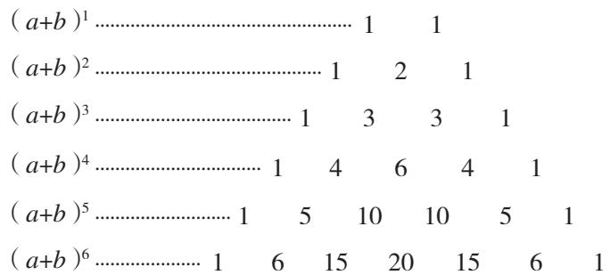

图6.3-1

表示形式的变化常常能帮助我们发现某些规律.

观察图 6.3-1，你还能发现哪些规律？

对于 $(a + b)^n$ 的展开式的二项式系数
$\mathrm{C} _ {n} ^ {0}, \mathrm{C} _ {n} ^ {1}, \mathrm{C} _ {n} ^ {2}, \dots , \mathrm{C} _ {n} ^ {n},$

我们还可以从函数的角度分析它们. $\mathrm{C}_n^r$ 可看成以 $r$ 为自变量的函数 $f(r)$ , 其定义域是
$\{0, 1, 2, \dots , n \}.$

对于确定的 $n$ ，我们还可以画出它的图象．例如，当 $n = 6$ 时，函数 $f(r) = \mathrm{C}_n^r (r\in \{0,1,2,3,4,5,6\})$ 的图象是7个离散点，如图6.3-2所示.

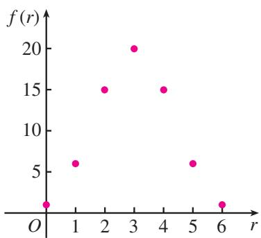

图6.3-2

> [!explore] 探究
（1） 观察图 6.3-2，你发现了什么规律？  
（2）请你分别画出 $n = 7, 8, 9$ 时函数 $f(r) = \mathrm{C}_n^r$ 的图象，比较它们的异同，你发现了什么规律？
分析图 6.3-1 和图 6.3-2，可以得到二项式系数的以下性质.

#### 1. 对称性

与首末两端“等距离”的两个二项式系数相等. 事实上，这一性质可直接由 $C_n^m = C_n^{n - m}$ 得到.

直线 $r=\frac{n}{2}$ 将函数 $f(r)=C_{n}^{r}$ 的图象分成对称的两部分，它是图象的对称轴.

①你能用组合的意义解释一下这个“组合等式”吗？

#### 2. 增减性与最大值
因为
$\mathrm{C} _ {n} ^ {k} = \frac {n (n - 1) \cdots (n - k + 2) (n - k + 1)}{(k - 1) ! k} = \mathrm{C} _ {n} ^ {k - 1} \frac {n - k + 1}{k},$
即
$\frac {\mathrm{C} _ {n} ^ {k}}{\mathrm{C} _ {n} ^ {k - 1}} = \frac {n - k + 1}{k},$
所以，当 $\frac{n - k + 1}{k} > 1$ ，即 $k < \frac{n + 1}{2}$ 时， $\mathrm{C}_n^k$ 随 $k$ 的增加而增大。由对称性知，二项式系数的后半部分， $\mathrm{C}_n^k$ 随 $k$ 的增加而减小。当 $n$ 是偶数时，中间的一项 $\mathrm{C}_n^{\frac{n}{2}}$ 取得最大值；当 $n$ 是奇数时，中间的两项 $\mathrm{C}_n^{\frac{n - 1}{2}}$ 与 $\mathrm{C}_n^{\frac{n + 1}{2}}$ 相等，且同时取得最大值。

#### 3. 各二项式系数的和

已知
$(1 + x) ^ {n} = \mathrm{C} _ {n} ^ {0} + \mathrm{C} _ {n} ^ {1} x + \mathrm{C} _ {n} ^ {2} x ^ {2} + \dots + \mathrm{C} _ {n} ^ {n} x ^ {n},$

令 $x = 1$ ，得
$2 ^ {n} = \mathrm{C} _ {n} ^ {0} + \mathrm{C} _ {n} ^ {1} + \mathrm{C} _ {n} ^ {2} + \dots + \mathrm{C} _ {n} ^ {n}.$
这就是说， $(a+b)^{n}$ 的展开式的各二项式系数的和等于 $2^{n}$ .

> [!example]- 例3 求证：在 $(a + b)^n$ 的展开式中，奇数项的二项式系数的和等于偶数项的二项式系数的和.
分析：奇数项的二项式系数的和为
$\mathrm{C} _ {n} ^ {0} + \mathrm{C} _ {n} ^ {2} + \mathrm{C} _ {n} ^ {4} + \dots ,$

偶数项的二项式系数的和为
$\mathrm{C} _ {n} ^ {1} + \mathrm{C} _ {n} ^ {3} + \mathrm{C} _ {n} ^ {5} + \dots .$
由于
$(a + b) ^ {n} = \mathrm{C} _ {n} ^ {0} a ^ {n} + \mathrm{C} _ {n} ^ {1} a ^ {n - 1} b + \mathrm{C} _ {n} ^ {2} a ^ {n - 2} b ^ {2} + \dots + \mathrm{C} _ {n} ^ {n} b ^ {n}$

中的 $a, b^{②}$ 可以取任意实数，因此我们可以通过对 $a, b$ 适当赋值来得到上述两个系数和.

② 实际上，a, b 既可以取任意实数，也可以取任意多项式，还可以是别的。我们可以根据具体问题的需要灵活选取 a, b 的值。
证明：在展开式
$(a + b) ^ {n} = \mathrm{C} _ {n} ^ {0} a ^ {n} + \mathrm{C} _ {n} ^ {1} a ^ {n - 1} b + \mathrm{C} _ {n} ^ {2} a ^ {n - 2} b ^ {2} + \dots + \mathrm{C} _ {n} ^ {n} b ^ {n}$

中，令 $a = 1$ ， $b = -1$ ，则得
$(1 - 1) ^ {n} = \mathrm{C} _ {n} ^ {0} - \mathrm{C} _ {n} ^ {1} + \mathrm{C} _ {n} ^ {2} + \dots + (- 1) ^ {k} \mathrm{C} _ {n} ^ {k} + \dots + (- 1) ^ {n} \mathrm{C} _ {n} ^ {n}.$
即
$\left(\mathrm{C} _ {n} ^ {0} + \mathrm{C} _ {n} ^ {2} + \mathrm{C} _ {n} ^ {4} + \dots\right) - \left(\mathrm{C} _ {n} ^ {1} + \mathrm{C} _ {n} ^ {3} + \mathrm{C} _ {n} ^ {5} + \dots\right) = 0.$
因此，
$\mathrm{C} _ {n} ^ {0} + \mathrm{C} _ {n} ^ {2} + \mathrm{C} _ {n} ^ {4} + \dots = \mathrm{C} _ {n} ^ {1} + \mathrm{C} _ {n} ^ {3} + \mathrm{C} _ {n} ^ {5} + \dots ,$
即在 $(a + b)^n$ 的展开式中，奇数项的二项式系数的和等于偶数项的二项式系数的和.

#### 练习

1. 填空题
（1） $C_{11}^{1}+C_{11}^{3}+C_{11}^{5}+\cdots+C_{11}^{11}=$ \_\_\_\_；
（2） $\frac{C_n^0 + C_n^1 + C_n^2 + \cdots + C_n^n}{C_{n+1}^0 + C_{n+1}^1 + C_{n+1}^2 + \cdots + C_{n+1}^{n+1}} = \underline{\quad}$ .

2. 证明： $C_{n}^{0} + C_{n}^{2} + C_{n}^{4} + \cdots + C_{n}^{n} = 2^{n-1}$ （n 是偶数）.

3. 写出 n 从 1 到 10 的二项式系数表.

4. 若一个集合含有 $n$ 个元素，则这个集合共有多少个子集？

## 习题6.3

### 复习巩固

1. 选择题
（1）在 $(1 - x)^{5} + (1 - x)^{6} + (1 - x)^{7} + (1 - x)^{8}$ 的展开式中，含 $x^{3}$ 的项的系数是（ ）.

(A) 74

(B) 121

(C) -74

(D) -121
（2） $(x + 1)^n$ 的展开式中 $x^{2}$ 的系数为15，则 $n = (\quad)$ .

(A) 7

(B) 6

(C) 5

(D) 4

2. $(x+y)(x-y)^{5}$ 的展开式中 $x^{3}y^{3}$ 的系数是 \_\_\_\_.

3. 用二项式定理展开：
（1） $(a + \sqrt[3]{b})^9$ ;
（2） $\left(\frac{\sqrt{x}}{2} -\frac{2}{\sqrt{x}}\right)^7$

4. 化简：
（1） $(1 + \sqrt{x})^5 + (1 - \sqrt{x})^5$ ;
（2） $(2x^{\frac{1}{2}} + 3x^{-\frac{1}{2}})^4 + (2x^{\frac{1}{2}} - 3x^{-\frac{1}{2}})^4.$

5.（1）求 $(1 - 2x)^{15}$ 的展开式的前4项；
（2） 求 $(2a^{3} - 3b^{2})^{10}$ 的展开式的第8项；
（3）求 $\left(\frac{\sqrt{x}}{3} -\frac{3}{\sqrt{x}}\right)^{12}$ 的展开式的中间一项；
（4） 求 $(x\sqrt{y}-y\sqrt{x})^{15}$ 的展开式的中间两项.

6. 求下列各式的二项展开式中指定项的系数：
（1） $\left(1-\frac{1}{2x}\right)^{10}$ 的含 $\frac{1}{x^{5}}$ 的项；
（2） $\left(2x^{3} - \frac{1}{2x^{3}}\right)^{10}$ 的常数项.

### 综合运用

7. 证明：
（1） $\left(x-\frac{1}{x}\right)^{2n}$ 的展开式中常数项是 $(-2)^{n}\frac{1\times3\times5\times\cdots\times(2n-1)}{n!}$ ;  
（2） $(1 + x)^{2n}$ 的展开式的中间一项是 $\frac{1\times 3\times 5\times\cdots\times(2n - 1)}{n!}(2x)^n.$

8. 已知 $(1 + x)^n$ 的展开式中第4项与第8项的二项式系数相等，求这两项的二项式系数.

9. 用二项式定理证明：
（1） $(n + 1)^{n} - 1$ 能被 $n^2$ 整除；  
（2） $99^{10} - 1$ 能被1000整除.

### 拓广探索

10. 求证： $2^{n}-C_{n}^{1}\times2^{n-1}+C_{n}^{2}\times2^{n-2}+\cdots+(-1)^{n-1}C_{n}^{n-1}\times2+(-1)^{n}=1$   
11. 下图反映了二项式定理产生、完备和推广所走过的漫长历程：

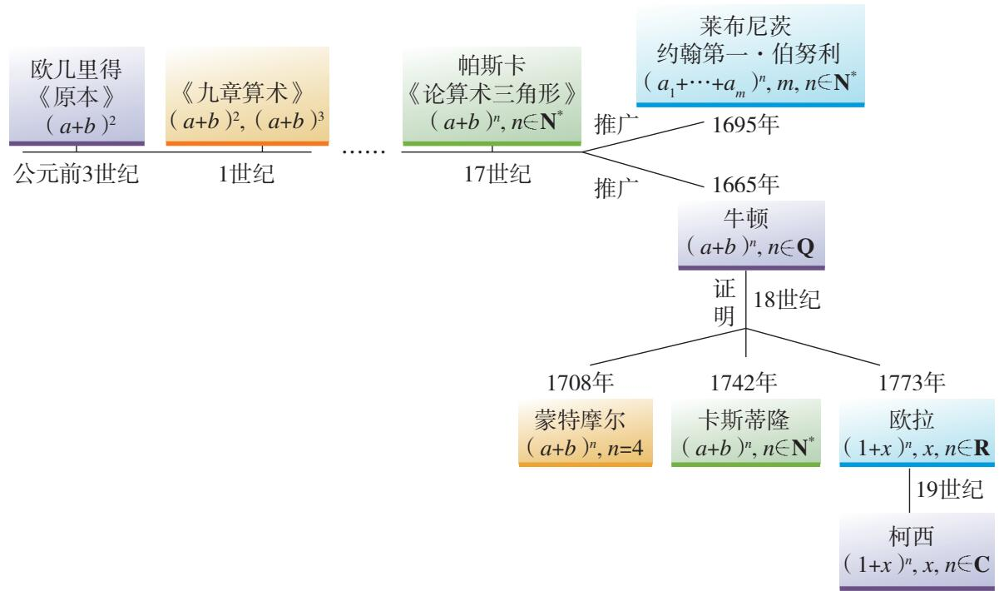

(第11题)
（1）在上述发展过程中，无论是推广还是证明，都是从特殊到一般。如今，数学研究的一个发展趋势就是尽可能地一般化。请你试一试，从 $(a+b)^{n}$ 推广到 $(a_{1}+a_{2}+\cdots+a_{m})^{n}$ $(m, n\in\mathbf{N}^{*})$ 。  
（2）请你查阅相关资料，细化上述历程中的某段过程，例如从3次到 $n$ 次，从二项到 $m$ 项等，说一说数学家是如何发现问题和解决问题的.

## 小结

### 一、本章知识结构

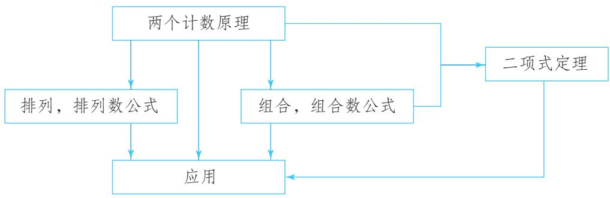

### 二、回顾与思考

本章我们首先学习了分类加法计数原理与分步乘法计数原理；然后，从一般到特殊，学习了两类特殊的计数问题——排列与组合，并用两个计数原理推导出排列数公式与组合数公式；最后，作为一个应用，根据多项式的乘法运算法则和计数原理推导出了二项式定理，并研究了二项式系数的一些性质.
当我们面对一个复杂问题时，通过分类或分步，将它分解成为一些简单的问题。先解决简单问题，然后再将它们整合起来得到整个问题的解答，达到以简驭繁的效果，这是一种重要而基本的思想方法。两个计数原理就是这种思想的体现。分类加法计数原理对应着“分类”活动，而且每一类方法都能完成相应的事情；分步乘法计数原理对应着“分步”活动，而且只有完成每一个步骤才能完成相应的事情。如果从集合的角度来考虑，那么分类加法计数原理表明了这样一个事实：将集合 $U$ 分成一些两两不交的子集 $S_{1}, S_{2}, \cdots, S_{k}$ ，而且 $S_{i} (i = 1, 2, \cdots, k)$ 的元素个数分别为 $n_{i}$ ，那么集合 $U$ 的元素个数
$n = n _ {1} + n _ {2} + \dots + n _ {k}.$

排列、组合是两类特殊的计数问题。排列的特殊性在于排列中元素的“互异性”和“有序性”，组合的特殊性在于它只有元素的“互异性”而不需要考虑顺序。我们看到，排列与组合之间有紧密的联系，从 $n$ 个不同元素中取出 $m(m \leqslant n)$ 个元素的组合可以看成是相应排列的一个步骤。

二项式定理是计数原理在多项式展开中的应用。把 $(a+b)^{n}$ 的展开相乘看成是作n次选取，每次有2种选择——a或b，因此，展开式中的每一项都是 $a^{n-k}b^{k}(k=0,1,\cdots,n)$ 的形式。利用分步乘法计数原理可知，合并同类项前共有 $2^{n}$ 项，每一项 $a^{n-k}b^{k}$ 都可以看作是在n个 $(a+b)$ 中恰好有k个取b得到的，从而同类项的个数为 $C_{n}^{k}$ 。

在本章中，无论是概念的得出还是数学公式的推导，都是从特殊到一般，从具体到抽象，通过归纳而得出的，这是代数中研究问题的基本方法，也是数学学习中经常使用的思维方法.

请你结合下面的问题，复习一下全章的内容吧！

1. 在数学学习中，举例是理解一般原理的好方法。例如，进入一个院子要通过一道墙，这道墙左边有 $m$ 个门，右边有 $n$ 个门，那么进入院子的方法数为 $m + n$ （ $m, n$ 分别表示走左、右边进入院子的方法数）；进入一个院子要通过两道墙，第一道墙有 $m$ 个门，第二道墙有 $n$ 个门，那么进入院子的方法数为 $m \times n$ （ $m, n$ 分别表示通过第一、第二道墙的方法数）。你能再举几个应用两个计数原理的例子吗？你觉得在分类和分步时需要注意些什么？  
2. 加强数学知识间的联系，是深入理解知识的重要方法。例如，把本章的知识与集合的有关内容联系起来，可以简洁地表述有关原理。你能举例说明吗？  
3. 举例说明排列和组合的特殊性.   
4. 运用计数原理和组合知识推导二项式定理，是一个有奇趣、有意味的过程。请回味这个过程，并和同学谈谈你的学习体会。  
5. 请你回顾本章学习过程，结合具体知识，如计数原理、排列数公式、组合数公式或二项式定理，谈谈这些知识的获得是如何从特殊到一般，或从具体到抽象的？

## 复习参考题6

### 复习巩固

#### 1. 填空题
（1） 乘积 $(a_{1}+a_{2}+\cdots+a_{n})(b_{1}+b_{2}+\cdots+b_{n})$ 展开后，共有 \_\_\_\_ 项；  
（2） 学生可从本年级开设的 7 门选修课中任意选择 3 门, 并从 6 种课外活动小组中选择 2 种, 不同的选法种数是\_\_\_\_;  
（3）安排 6 名歌手演出顺序时，要求某歌手不是第一个出场，也不是最后一个出场，不同排法的种数是\_\_\_\_；  
（4） 5个人分4张无座足球票, 每人至多分1张, 而且票必须分完, 那么不同分法的种数是\_\_\_\_;  
（5） 5 名同学去听同时举行的 3 个课外知识讲座, 每名同学可自由选择听其中的 1 个讲座, 不同选择的种数是\_\_\_\_;  
（6） 正十二边形的对角线的条数是 \_\_\_\_；
（7） $(1+x)^{2n}$ 的展开式中，系数最大的项是第\_\_\_\_项.

2. 一个集合有 5 个元素.
（1） 这个集合的含有 3 个元素的子集有多少个?  
（2） 这个集合的子集共有多少个?

3. 填空题
（1） 已知 $C_{n+1}^{n-1}=21$ ，那么 n= \_\_\_\_；  
（2） 某班一天上午有 4 节课, 下午有 2 节课, 现要安排该班一天中语文、数学、政治、英语、体育、艺术 6 堂课的课程表, 要求数学课排在上午, 体育课排在下午, 不同排法种数是\_\_\_\_;  
（3） 某人设计的电脑开机密码由 2 个英文字母（不区分大小写）后接 4 个数字组成，且 2 个英文字母不相同，该密码可能的个数是 \_\_\_\_；  
（4） 以正方体的顶点为顶点的三棱锥的个数是\_\_\_\_；  
（5） 在 $(1-2x)^{n}$ 的展开式中，各项系数的和是 \_\_\_\_.

4.（1）平面内有 $n$ 条直线，其中没有两条平行，也没有三条交于一点，共有多少个交点？
（2） 空间有 $n$ 个平面，其中没有两个互相平行，也没有三个交于一条直线，共有多少条交线？

### 综合运用

5.（1）求 $(1 - 2x)^{5}(1 + 3x)^{4}$ 的展开式中按 $x$ 的升幂排列的第3项；
（2） 求 $\left(9x + \frac{1}{3\sqrt{x}}\right)^{18}$ 的展开式的常数项；  
（3）已知 $(1 + \sqrt{x})^n$ 的展开式中第9项、第10项、第11项的二项式系数成等差数列，求 $n$ ；  
（4） 求 $(1+x+x^{2})(1-x)^{10}$ 的展开式中 $x^{4}$ 的系数；  
（5） 求 $(x^{2}+x+y)^{5}$ 的展开式中 $x^{5}y^{2}$ 的系数.

6. 用二项式定理证明 $55^{55} + 9$ 能被8整除。（提示： $55^{55} + 9 = (56 - 1)^{55} + 9.$ ）

7.（1）平面内有两组平行线，一组有 $m$ 条，另一组有 $n$ 条，这两组平行线相交，可以构成多少个平行四边形？
（2） 空间有三组平行平面, 第一组有 $m$ 个, 第二组有 $n$ 个, 第三组有 $l$ 个, 不同两组的平面都相交, 且交线不都平行, 可以构成多少个平行六面体?

8. 某种产品的加工需要经过 5 道工序.
（1）如果其中某道工序不能放在最后，那么有多少种加工顺序？  
（2） 如果其中某 2 道工序既不能放在最前, 也不能放在最后, 那么有多少种加工顺序?  
（3）如果其中某2道工序必须相邻，那么有多少种加工顺序？  
（4）如果其中某2道工序不能相邻，那么有多少种加工顺序？

### 拓广探索

9. 在 $(1+x)^{3}+(1+x)^{4}+\cdots+(1+x)^{n+2}$ 的展开式中，含 $x^{2}$ 项的系数是多少？  
10. 你能构造一个实际背景，对等式 $C_{n}^{k}\cdot C_{n-k}^{m-k}=C_{n}^{m}\cdot C_{m}^{k}$ 的意义作出解释吗？

# 杨辉三角的性质与应用

在探究 $(a + b)^n$ 的展开式的二项式系数性质时，我们曾把系数写成一张表（图1），借助它发现了系数的一些规律。事实上，在我国南宋数学家杨辉1261年所著的《详解九章算法》一书中，就已经出现了这个表。所不同的只是这里的表用阿拉伯数字表示，在那本书里是用汉字表示（图2）。我们称这个表为杨辉三角。

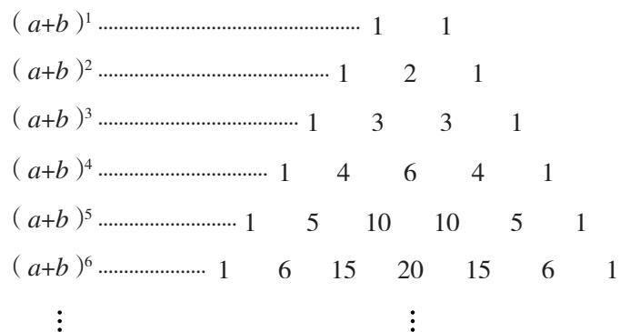

图1

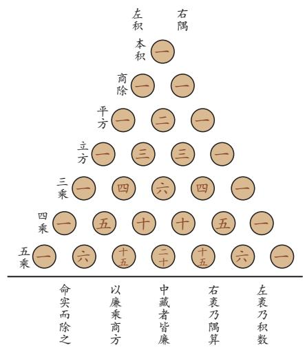

图2

杨辉是我国古代数学史上一位著述丰富的数学家，著有《详解九章算法》《日用算法》和《杨辉算法》。在编写这些算书时，杨辉广泛引用古代数学典籍，使得我们能够了解许多已经失传的数学方法。杨辉在《详解九章算法》里指出，杨辉三角这种方法出于《释锁》 $^{①}$ 算书，且我国北宋数学家贾宪（约11世纪上半叶）曾用过。由此可以推断，我国发现这个表不晚于11世纪上半叶。在欧洲，这个表被认为是法国数学家帕斯卡（B. Pascal，1623—1662）首先发现的，他们把这个表叫做帕斯卡三角。这就是说，杨辉三角的① “释锁”和开方有关。杨辉三角原名为“开方作法本源图”，也有人称它为“乘方求廉图”，在我国古代用来作为开方的工具。

发现要比欧洲早600年左右，由此可见我国古代数学的成就是非常值得中华民族自豪的。

杨辉三角本身包含了很多有趣的性质，利用这些性质，可以解决很多数学问题。下面让我们一起来探索吧！

### 一、探究的内容：杨辉三角的性质与应用

### （一）杨辉三角的性质

1. 观察杨辉三角的结构，即杨辉三角中数字排列的规律，例如每一行、相邻两行、斜行等，画一画，连一连，算一算，写出你发现的结论.

例如：
（1）结合图 1 和图 2，可以发现，杨辉三角的第 n 行的第 r 个数可以表示为 $C_{n}^{r-1}$ ，第 n 行就是 $(a+b)^{n}$ 的展开式的二项式系数，如图 3 所示.

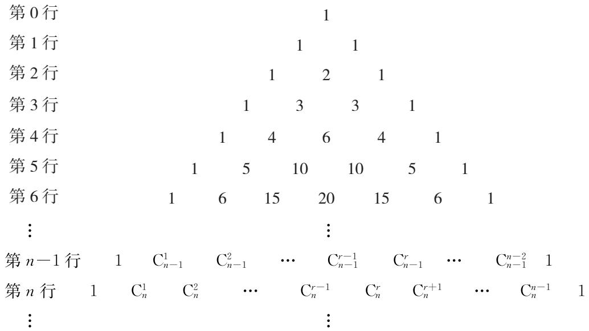

图3
（2）观察杨辉三角的相邻两行，可以发现，三角形的两个腰上的数都是1，其余的数都等于它肩上的两个数相加.

如图 4 所示， $2=1+1$ ， $3=1+2$ ， $4=1+3$ ， $6=3+3$ ，…一般地，有
$\mathrm{C} _ {n} ^ {r} = \mathrm{C} _ {n - 1} ^ {r - 1} + \mathrm{C} _ {n - 1} ^ {r}. \tag {①}$

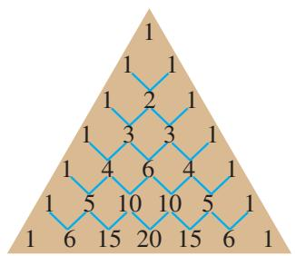

图4

2. 利用已学知识，尝试对所得结论进行证明.

例如，对于①式，可按如下方式进行证明.
因为
$\begin{array}{l} \mathrm{C} _ {n - 1} ^ {r - 1} + \mathrm{C} _ {n - 1} ^ {r} = \frac {(n - 1) !}{(r - 1) ! (n - r) !} + \frac {(n - 1) !}{r ! (n - 1 - r) !} \\ = \frac {(n - 1) !}{r ! (n - r) !} [ r + (n - r) ] \\ = \frac {n !}{r ! (n - r) !}, \\ \end{array}$
又
$\mathrm{C} _ {n} ^ {r} = \frac {n !}{r ! (n - r) !},$
所以
$\mathrm{C} _ {n} ^ {r} = \mathrm{C} _ {n - 1} ^ {r - 1} + \mathrm{C} _ {n - 1} ^ {r}.$

上式是杨辉三角最基本的性质，也是二项式系数和组合数的性质。 $^{①}$ 正因为杨辉三角中的数与开方、解方程，以及组合数学、概率论中的有关问题都有密切的关系，所以历代数学家从不同角度研究它的性质，例如帕斯卡在《论算术三角》一书中就给出了19条性质。你也来试一试吧，看能发现和证明多少性质！

①利用数学知识间的联系性，我们可以从不同角度研究这些性质。结合已有知识，对比一下不同角度发现和证明性质的过程，说一说自己的体会。

### （二）杨辉三角的应用

在我国古代，杨辉三角是解决很多数学问题的有力工具，像开方问题、数列问题等.

例如，开方古算题（出自杨辉《详解九章算法》）：

积一百三十三万六千三百三十六尺，问为三乘方几何.

在我国清中叶以前，称平方为自乘，立方为再自乘，四次方为三乘方．因此，这个问题相当于解方程 $x^{4} = 1336336$

杨辉三角（图 2）中的五句话，前三句 “左袤乃积数，右袤乃隅算，中藏者皆廉” 分别说明了图中数字代表的意义，后两句 “以廉乘商方，命实而除之” 说明了如何应用各行系数进行开方.

你可以查阅相关书籍或上网搜索相关资料，探究一下开方算法的具体操作及其中蕴含的算法思想，感受我国古代数学的独特风格.

再如，数列古算题（出自杨辉《详解九章算法》）：

三角垛，下广，一面十二个，上尖，问计几何.

在我国古代，很多数学家研究数列的问题，并取得了辉煌的成就。就像通过研究“三角垛”这样的一类问题——垛积问题，发现了一系列数列的求和公式。上述三角垛问题一般化后，就相当于如下将圆球堆成三角垛的问题：

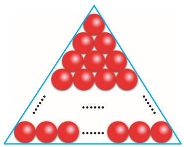

图5

底层是每边堆 $n$ 个圆球的三角形（如图5），向上逐层每边减少1个，顶层是1个，求总数.

利用杨辉三角，就可以解决以上问题，并获得每层圆球数所构成的数列的一般求和公式．你可以试一试.

除此之外，你还可以通过查阅相关书籍或上网搜索相关资料，从杨辉三角出发，一步步探究，拓展到更多类数列的问题.

### 二、对探究活动的要求

以独立探究和小组合作相结合的方式开展探究活动。建议按如下步骤完成：

1. 小组集体讨论探究方案，确定研究思路.

2. 小组成员各自开展独立探究，并以专题作业的形式撰写研究报告.  
3. 小组内进行交流讨论，完善研究成果，并形成一份小组研究报告.  
4. 全班进行成果交流、评价.

### 三、研究报告的参考形式

杨辉三角的性质与应用

<table><tr><td>年级班</td><td>完成时间:</td></tr></table>

<table><tr><td>1. 课题组成员及分工</td></tr><tr><td>2. 发现的数学结论及发现过程概述</td></tr><tr><td>3. 证明思路及其形成过程描述</td></tr><tr><td>4. 结论的证明或否定</td></tr><tr><td>5. 杨辉三角的应用举例</td></tr><tr><td>6. 收获与体会</td></tr></table>

# 第七章 随机变量及其分布

概率是随机事件发生可能性大小的度量。在必修课程的概率学习中，我们结合古典概型，研究了简单随机事件及其概率的计算方法，并讨论了概率的一些性质。本章将在此基础上，结合古典概型，研究随机事件的条件概率，建立概率的乘法公式和全概率公式，并用它们计算较复杂事件的概率。

为了利用数学工具，并以简洁、统一的形式研究随机试验的规律，本章我们还将把随机试验的结果数量化，引入随机变量的概念。对离散型随机变量，我们主要研究其分布列及数字特征，并对二项分布、超几何分布进行重点研究。对于连续型随机变量，我们只研究服从正态分布的情况。通过用随机变量描述和分析随机试验，解决一些简单的实际问题，进一步体会概率模型的作用及概率思想和方法的特点。

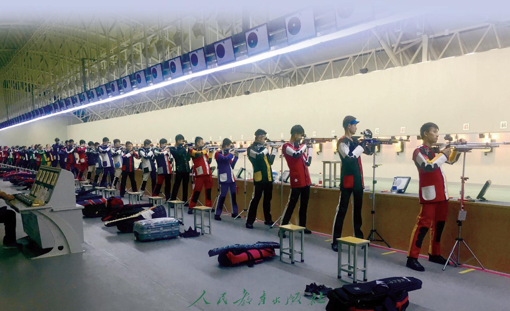

## 7.1 条件概率与全概率公式

在必修“概率”一章的学习中，我们遇到过求同一试验中两个事件 $A$ 与 $B$ 同时发生(积事件 $AB$ )的概率的问题。当事件 $A$ 与 $B$ 相互独立时，有
$P (A B) = P (A) P (B).$
如果事件 A 与 B 不相互独立，如何表示积事件 AB 的概率呢？下面我们从具体问题入手.

### 7.1.1 条件概率

问题 1 某个班级有 45 名学生，其中男生、女生的人数及团员的人数如表 7.1-1 所示.

表 7.1-1  
单位：人

<table><tr><td>性别</td><td>团员</td><td>非团员</td><td>合计</td></tr><tr><td>男生</td><td>16</td><td>9</td><td>25</td></tr><tr><td>女生</td><td>14</td><td>6</td><td>20</td></tr><tr><td>合计</td><td>30</td><td>15</td><td>45</td></tr></table>

在班级里随机选择一人做代表.
（1） 选到男生的概率是多少?   
（2） 如果已知选到的是团员, 那么选到的是男生的概率是多少?

随机选择一人做代表，则样本空间 $\Omega$ 包含 45 个等可能的样本点。用 A 表示事件“选到团员”，B 表示事件“选到男生”，根据表 7.1-1 中的数据可以得出， $n(\Omega)=45$ ， $n(A)=30$ ， $n(B)=25$ 。
（1）根据古典概型知识可知，选到男生的概率
$P (B) = \frac {n (B)}{n (\Omega)} = \frac {2 5}{4 5} = \frac {5}{9}.$
（2） “在选到团员的条件下, 选到男生”的概率就是 “在事件 $A$ 发生的条件下, 事件 $B$ 发生” 的概率, 记为 $P(B|A)$ . 此时相当于以 $A$ 为样本空间来考虑事件 $B$ 发生的概率, 而在新的样本空间中事件 $B$ 就是积事件 $AB$ , 包含的样本点数 $n(AB)=16$ . 根据古典概型知识可知,
$P (B \mid A) = \frac {n (A B)}{n (A)} = \frac {1 6}{3 0} = \frac {8}{1 5}.$

问题2 假定生男孩和生女孩是等可能的，现考虑有两个小孩的家庭。随机选择一个家庭，那么
（1） 该家庭中两个小孩都是女孩的概率是多大?  
（2） 如果已经知道这个家庭有女孩，那么两个小孩都是女孩的概率又是多大？

观察两个小孩的性别，用 $b$ 表示男孩， $g$ 表示女孩，则样本空间 $\Omega = \{bb, bg, gb, gg\}$ ，且所有样本点是等可能的。用 $A$ 表示事件“选择的家庭中有女孩”， $B$ 表示事件“选择的家庭中两个小孩都是女孩”，则 $A = \{bg, gb, gg\}$ ， $B = \{gg\}$ 。
（1）根据古典概型知识可知，该家庭中两个小孩都是女孩的概率
$P (B) = \frac {n (B)}{n (\Omega)} = \frac {1}{4}.$
（2）“在选择的家庭有女孩的条件下，两个小孩都是女孩”的概率就是“在事件 A 发生的条件下，事件 B 发生”的概率，记为 $P(B|A)$ 。此时 A 成为样本空间，事件 B 就是积事件 AB。根据古典概型知识可知，
$P (B \mid A) = \frac {n (A B)}{n (A)} = \frac {1}{3}.$

在上面两个问题中，在事件 A 发生的条件下，事件 B 发生的概率都是
$P (B \mid A) = \frac {n (A B)}{n (A)}.$

这个结论对于一般的古典概型仍然成立。事实上，如图7.1-1所示，若已知事件 $A$ 发生，则 $A$ 成为样本空间。此时，事件 $B$ 发生的概率是 $AB$ 包含的样本点数与 $A$ 包含的样本点数的比值，即
$P (B \mid A) = \frac {n (A B)}{n (A)}.$
因为
$P (B \mid A) = \frac {n (A B)}{n (A)} = \frac {\frac {n (A B)}{n (\Omega)}}{\frac {n (A)}{n (\Omega)}} = \frac {P (A B)}{P (A)},$

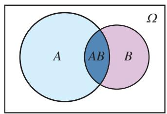

图7.1-1
所以，在事件 $A$ 发生的条件下，事件 $B$ 发生的概率还可以通过 $\frac{P(AB)}{P(A)}$ 来计算.

一般地，设 A，B 为两个随机事件，且 $P(A) > 0$ ，我们称
$P (B \mid A) = \frac {P (A B)}{P (A)}$

为在事件 A 发生的条件下，事件 B 发生的条件概率，简称条件概率（conditional probability）.

> [!explore] 探究
在问题1和问题2中，都有 $P(B|A) \neq P(B)$ 。一般地， $P(B|A)$ 与 $P(B)$ 不一定相等。如果 $P(B|A)$ 与 $P(B)$ 相等，那么事件 $A$ 与 $B$ 应满足什么条件？

直观上看，当事件 $A$ 与 $B$ 相互独立时，事件 $A$ 发生与否不影响事件 $B$ 发生的概率，这等价于 $P(B|A) = P(B)$ 成立.
事实上，若事件 $A$ 与 $B$ 相互独立，即 $P(AB) = P(A)P(B)$ ，且 $P(A) > 0$ ，则
$P (B \mid A) = \frac {P (A B)}{P (A)} = \frac {P (A) P (B)}{P (A)} = P (B);$

反之，若 $P(B|A)=P(B)$ ，且 $P(A)>0$ ，则
$P (B) = \frac {P (A B)}{P (A)} \Rightarrow P (A B) = P (A) P (B),$
即事件 A 与 B 相互独立.
因此，当 $P(A) > 0$ 时，当且仅当事件 A 与 B 相互独立时，有 $P(B | A) = P(B)$ .

> [!think] 思考
对于任意两个事件 A 与 B，如果已知 $P(A)$ 与 $P(B|A)$ ，如何计算 $P(AB)$ 呢？
由条件概率的定义，对任意两个事件 A 与 B，若 $P(A) > 0$ ，则
$P (A B) = P (A) P (B \mid A).$

我们称上式为概率的乘法公式.

> [!example]- 例 1 在 5 道试题中有 3 道代数题和 2 道几何题，每次从中随机抽出 1 道题，抽出的题不再放回. 求：
（1） 第 1 次抽到代数题且第 2 次抽到几何题的概率;  
（2） 在第 1 次抽到代数题的条件下, 第 2 次抽到几何题的概率.
分析：如果把“第1次抽到代数题”和“第2次抽到几何题”作为两个事件，那么问题（1）就是积事件的概率，问题（2）就是条件概率。可以先求积事件的概率，再用条件概率公式求条件概率；也可以先求条件概率，再用乘法公式求积事件的概率。
解：设 A = “第 1 次抽到代数题”，B = “第 2 次抽到几何题”，则“第 1 次抽到代数题且第 2 次抽到几何题”就是事件 AB.
方法1（1）从5道试题中每次不放回地随机抽取2道，试验的样本空间 $\Omega$ 包含20个等可能的样本点，即 $n(\Omega) = \mathrm{A}_5^2 = 5\times 4 = 20.$
因为 $n(AB)=A_{3}^{1}\times A_{2}^{1}=3\times2=6$ ，所以
$P (A B) = \frac {n (A B)}{n (\Omega)} = \frac {6}{2 0} = \frac {3}{1 0}.$
（2） “在第1次抽到代数题的条件下, 第2次抽到几何题”的概率就是事件 $A$ 发生的条件下, 事件 $B$ 发生的概率. 显然 $P(A)=\frac{3}{5}$ . 利用条件概率公式, 得
$P (B \mid A) = \frac {P (A B)}{P (A)} = \frac {\frac {3}{1 0}}{\frac {3}{5}} = \frac {1}{2}.$
方法 2 因为 $n(A)=3\times4=12$ ， $n(AB)=3\times2=6$ ，所以
$P (B \mid A) = \frac {n (A B)}{n (A)} = \frac {6}{1 2} = \frac {1}{2}.$
又 $P(A) = \frac{3}{5}$ ，利用乘法公式可得
$P (A B) = P (A) P (B \mid A) = \frac {3}{5} \times \frac {1}{2} = \frac {3}{1 0}.$

> [!example]- 例 1 求条件概率用了两种方法：一种是基于样本空间 $\Omega$ ，先计算 $P(A)$ 和 $P(AB)$ ，再利用条件概率公式求 $P(B|A)$ ；另一种是根据条件概率的直观意义，增加了 “A 发生” 的条件后，样本空间缩小为 A，求 $P(B|A)$ 就是以 A 为样本空间计算 AB 的概率.
在例 1 中，已知第 1 次抽到代数题，这时还余下 4 道试题，其中代数题和几何题各 2 道。显然，事件 A 发生的条件下，事件 B 发生的概率为 $P(B|A)=\frac{2}{4}=\frac{1}{2}$ 。这等价于将 A 中的 12 个样本点合并为 4 个等可能的样本点，通常用这种方法求 $P(B|A)$ 更便捷。

条件概率只是缩小了样本空间，因此条件概率同样具有概率的性质．设 $P(A)>0$ ，则
（1） $P(\Omega |A) = 1$   
（2） 如果 B 和 C 是两个互斥事件，则 $P(B \cup C | A) = P(B | A) + P(C | A)$ ;  
（3）设 $\overline{B}$ 和 $B$ 互为对立事件，则 $P(\overline{B}|A) = 1 - P(B|A)$ .

> [!example]- 例 2 已知 3 张奖券中只有 1 张有奖，甲、乙、丙 3 名同学依次不放回地各随机抽取 1 张．他们中奖的概率与抽奖的次序有关吗？
分析：要知道中奖概率是否与抽奖次序有关，只要考察甲、乙、丙3名同学的中奖概率是否相等。因为只有1张有奖，所以“乙中奖”等价于“甲没中奖且乙中奖”，“丙中奖”等价于“甲和乙都没中奖”，利用乘法公式可求出乙、丙中奖的概率。
解：用 A, B, C 分别表示甲、乙、丙中奖的事件，则 $B = \overline{A}B$ , $C = \overline{A}\overline{B}$ .
$P (A) = \frac {1}{3};$
$P (B) = P (\overline {{A}} B) = P (\overline {{A}}) P (B | \overline {{A}}) = \frac {2}{3} \times \frac {1}{2} = \frac {1}{3};$
$P (C) = P (\overline {{{A}}} \overline {{{B}}}) = P (\overline {{{A}}}) P (\overline {{{B}}} | \overline {{{A}}}) = \frac {2}{3} \times \frac {1}{2} = \frac {1}{3}.$
因为 $P(A)=P(B)=P(C)$ ，所以中奖的概率与抽奖的次序无关.
事实上，在抽奖问题中，无论是放回随机抽取还是不放回随机抽取，中奖的概率都与抽奖的次序无关.

> [!example]- 例 3 银行储蓄卡的密码由 6 位数字组成. 某人在银行自助取款机上取钱时, 忘记了密码的最后 1 位数字. 求:
（1）任意按最后 1 位数字，不超过 2 次就按对的概率；  
（2） 如果记得密码的最后 1 位是偶数，不超过 2 次就按对的概率.
分析：最后1位密码“不超过2次就按对”等价于“第1次按对，或者第1次按错但第2次按对”。因此，可以先把复杂事件用简单事件表示，再利用概率的性质求解。
解：（1）设 $A_{i} =$ “第 $i$ 次按对密码” $(i = 1,2)$ ，则事件“不超过2次就按对密码”可表示为
$A = A _ {1} \cup \overline {{{A}}} _ {1} A _ {2}.$

事件 $A_{1}$ 与事件 $\overline{A}_1A_2$ 互斥，由概率的加法公式及乘法公式，得
$P (A) = P \left(A _ {1}\right) + P \left(\bar {A} _ {1} A _ {2}\right) = P \left(A _ {1}\right) + P \left(\bar {A} _ {1}\right) P \left(A _ {2} \mid \bar {A} _ {1}\right) = \frac {1}{1 0} + \frac {9}{1 0} \times \frac {1}{9} = \frac {1}{5}.$
因此，任意按最后1位数字，不超过2次就按对的概率为 $\frac{1}{5}$
（2） 设 $B =$ “最后 1 位密码为偶数”，则
$P (A \mid B) = P (A _ {1} \mid B) + P (\overline {{{{A}}}} _ {1} A _ {2} \mid B) = \frac {1}{5} + \frac {4 \times 1}{5 \times 4} = \frac {2}{5}.$
因此，如果记得密码的最后1位是偶数，不超过2次就按对的概率为 $\frac{2}{5}$ .

#### 练习

1. 设 $A \subseteq B$ ，且 $P(A) = 0.3$ ， $P(B) = 0.6$ 。根据事件包含关系的意义及条件概率的意义，直接写出 $P(B|A)$ 和 $P(A|B)$ 的值，再由条件概率公式进行验证。  
2. 从一副不含大小王的52张扑克牌中，每次随机抽出1张扑克牌，抽出的牌不再放回。已知第1次抽到A牌，求第2次抽到A牌的概率。  
3. 袋子中有 10 个除颜色外完全相同的小球，其中 7 个白球，3 个黑球。每次从袋子中随机摸出 1 个球，摸出的球不再放回。求：
（1）在第 1 次摸到白球的条件下，第 2 次摸到白球的概率；
（2） 两次都摸到白球的概率.

### 7.1.2 全概率公式

在上节计算按对银行储蓄卡密码的概率时，我们首先把一个复杂事件表示为一些简单事件运算的结果，然后利用概率的加法公式和乘法公式求其概率。下面，再看一个求复杂事件概率的问题。

> [!think] 思考
从有 $a$ 个红球和 $b$ 个蓝球的袋子中，每次随机摸出1个球，摸出的球不再放回。显然，第1次摸到红球的概率为 $\frac{a}{a + b}$ 。那么第2次摸到红球的概率是多大？如何计算这个概率呢？
因为抽签具有公平性，所以第2次摸到红球的概率也应该是 $\frac{a}{a + b}$ 。但是这个结果并不显然，因为第2次摸球的结果受第1次摸球结果的影响。下面我们给出严格的推导。

用 $R_{i}$ 表示事件 “第 i 次摸到红球”， $B_{i}$ 表示事件 “第 i 次摸到蓝球”，i=1，2. 如图 7.1-2 所示，事件 $R_{2}$ 可按第 1 次可能的摸球结果(红球或蓝球)表示为两个互斥事件的并，即 $R_{2}=R_{1}R_{2}\cup B_{1}R_{2}$ ．利用概率的加法公式和乘法公式，得

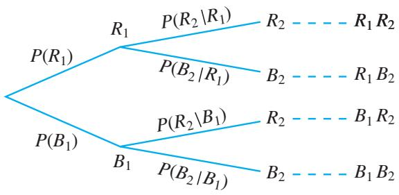

图7.1-2
$\begin{array}{l} P \left(R _ {2}\right) = P \left(R _ {1} R _ {2} \bigcup B _ {1} R _ {2}\right) = P \left(R _ {1} R _ {2}\right) + P \left(B _ {1} R _ {2}\right) \\ = P \left(R _ {1}\right) P \left(R _ {2} \mid R _ {1}\right) + P \left(B _ {1}\right) P \left(R _ {2} \mid B _ {1}\right) \\ = \frac {a}{a + b} \times \frac {a - 1}{a + b - 1} + \frac {b}{a + b} \times \frac {a}{a + b - 1} \\ = \frac {a}{a + b}. \\ \end{array}$

上述过程采用的方法是：按照某种标准，将一个复杂事件表示为两个互斥事件的并，再由概率的加法公式和乘法公式求得这个复杂事件的概率.

一般地，设 $A_{1}, A_{2}, \cdots, A_{n}$ 是一组两两互斥的事件， $A_{1} \cup A_{2} \cup \cdots \cup A_{n} = \Omega$ ，且 $P(A_{i}) > 0, i = 1, 2, \cdots, n$ ，则对任意的事件 $B \subseteq \Omega$ ，有
$P (B) = \sum_ {i = 1} ^ {n} P (A _ {i}) P (B | A _ {i}).$

我们称上面的公式为全概率公式（total probability formula）。全概率公式是概率论中最基本的公式之一。

> [!example]- 例 4 某学校有 A，B 两家餐厅，王同学第 1 天午餐时随机地选择一家餐厅用餐。如果第 1 天去 A 餐厅，那么第 2 天去 A 餐厅的概率为 0.6；如果第 1 天去 B 餐厅，那么第 2 天去 A 餐厅的概率为 0.8。计算王同学第 2 天去 A 餐厅用餐的概率。
分析：第2天去哪家餐厅用餐的概率受第1天在哪家餐厅用餐的影响，可根据第1天可能去的餐厅，将样本空间表示为“第1天去A餐厅”和“第1天去B餐厅”两个互斥事件的并，利用全概率公式求解.
解：设 $A_{1} =$ “第1天去A餐厅用餐”， $B_{1} =$ “第1天去B餐厅用餐”， $A_{2} =$ “第2天去A餐厅用餐”，则 $\Omega = A_{1}\cup B_{1}$ ，且 $A_{1}$ 与 $B_{1}$ 互斥．根据题意得
$P \left(A _ {1}\right) = P \left(B _ {1}\right) = 0. 5, P \left(A _ {2} \mid A _ {1}\right) = 0. 6, P \left(A _ {2} \mid B _ {1}\right) = 0. 8.$
由全概率公式，得
$\begin{array}{l} P \left(A _ {2}\right) = P \left(A _ {1}\right) P \left(A _ {2} \mid A _ {1}\right) + P \left(B _ {1}\right) P \left(A _ {2} \mid B _ {1}\right) \\ = 0. 5 \times 0. 6 + 0. 5 \times 0. 8 \\ = 0. 7. \\ \end{array}$
因此，王同学第2天去A餐厅用餐的概率为0.7.

> [!example]- 例 5 有 3 台车床加工同一型号的零件，第 1 台加工的次品率为 6%，第 2，3 台加工的次品率均为 5%，加工出来的零件混放在一起。已知第 1，2，3 台车床加工的零件数分别占总数的 25%，30%，45%。
（1）任取一个零件，计算它是次品的概率；  
（2） 如果取到的零件是次品，计算它是第 $i(i=1,2,3)$ 台车床加工的概率.
分析：取到的零件可能来自第1台车床，也可能来自第2台或第3台车床，有3种可能。设 $B =$ “任取一零件为次品”， $A_{i} =$ “零件为第 $i$ 台车床加工” $(i = 1,2,3)$ ，如图7.1-3所示，可将事件 $B$ 表示为3个两两互斥事件的并，利用全概率公式可以计算出事件 $B$ 的概率。
解：设 $B =$ “任取一个零件为次品”， $A_{i} =$ “零件为第 $i$ 台车床加工”（ $i = 1,2,3$ ），则 $\Omega = A_{1}\cup A_{2}\cup A_{3}$ ，且 $A_{1}, A_{2}, A_{3}$ 两两互斥。根据题意得
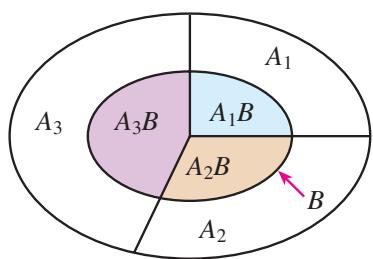

图7.1-3
$P \left(A _ {1}\right) = 0. 2 5, P \left(A _ {2}\right) = 0. 3, P \left(A _ {3}\right) = 0. 4 5,$
$P (B \mid A _ {1}) = 0. 0 6, P (B \mid A _ {2}) = P (B \mid A _ {3}) = 0. 0 5.$
（1） 由全概率公式，得
$\begin{array}{l} P (B) = P \left(A _ {1}\right) P \left(B \mid A _ {1}\right) + P \left(A _ {2}\right) P \left(B \mid A _ {2}\right) + P \left(A _ {3}\right) P \left(B \mid A _ {3}\right) \\ = 0. 2 5 \times 0. 0 6 + 0. 3 \times 0. 0 5 + 0. 4 5 \times 0. 0 5 \\ = 0. 0 5 2 5. \\ \end{array}$
（2） “如果取到的零件是次品, 计算它是第 $i (i = 1, 2, 3)$ 台车床加工的概率”, 就是

计算在 B 发生的条件下，事件 $A_{i}$ 发生的概率.
$P (A _ {1} \mid B) = \frac {P (A _ {1} B)}{P (B)} = \frac {P (A _ {1}) P (B \mid A _ {1})}{P (B)} = \frac {0 . 2 5 \times 0 . 0 6}{0 . 0 5 2 5} = \frac {2}{7}.$

类似地，可得
$P (A _ {2} \mid B) = \frac {2}{7}, P (A _ {3} \mid B) = \frac {3}{7}.$

> [!think] 思考
> [!example]- 例 5 中 $P(A_{i})$ ， $P(A_{i}|B)$ 的实际意义是什么？
$P(A_{i})$ 是试验之前就已知的概率，它是第 i 台车床加工的零件所占的比例，称为先验概率。当已知抽到的零件是次品(B 发生)， $P(A_{i}|B)$ 是这件次品来自第 i 台车床加工的可能性大小，通常称为后验概率。如果对加工的次品，要求操作员承担相应的责任，那么$\frac{2}{7}$ ， $\frac{2}{7}$ ， $\frac{3}{7}$ 就分别是第1，2，3台车床操作员应承担的份额.

将例 5 中的问题（2）一般化，可以得到贝叶斯公式.

\* 贝叶斯公式(Bayes formula): 设 $A_{1}, A_{2}, \cdots, A_{n}$ 是一组两两互斥的事件, $A_{1} \cup A_{2} \cup \cdots \cup A_{n} = \Omega$ , 且 $P(A_{i}) > 0$ , $i = 1, 2, \cdots, n$ , 则对任意的事件 $B \subseteq \Omega$ , $P(B) > 0$ , 有

贝叶斯公式是由英国数学家贝叶斯（T. Bayes, 1702—1761）发现的，它用来描述两个条件概率之间的关系.
$P (A _ {i} \mid B) = \frac {P (A _ {i}) P (B \mid A _ {i})}{P (B)} = \frac {P (A _ {i}) P (B \mid A _ {i})}{\sum_ {k = 1} ^ {n} P (A _ {k}) P (B \mid A _ {k})}, i = 1, 2, \dots , n.$

> [!example]- 例6 在数字通信中，信号是由数字0和1组成的序列。由于随机因素的干扰，发送的信号0或1有可能被错误地接收为1或0。已知发送信号0时，接收为0和1的概率分别为0.9和0.1；发送信号1时，接收为1和0的概率分别为0.95和0.05。假设发送信号0和1是等可能的。
（1） 分别求接收的信号为 0 和 1 的概率;

\* （2） 已知接收的信号为 0，求发送的信号是 1 的概率.
分析：设 A = “发送的信号为 0”，B = “接收到的信号为 0”。为便于求解，我们可将题目中所包含的各种信息用图 7.1-4 直观表示。<center>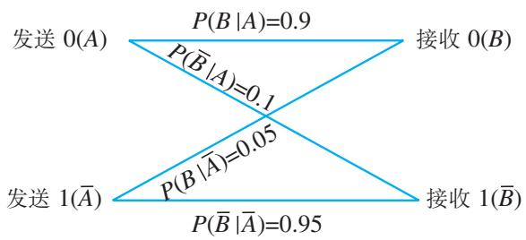</center><center>图7.1-4</center>
解：设 $A =$ “发送的信号为0”， $B =$ “接收到的信号为0”，则 $\overline{A} =$ “发送的信号为1”， $\overline{B} =$ “接收到的信号为1”。由题意得
$P (A) = P (\overline {{A}}) = 0. 5, P (B | A) = 0. 9, P (\overline {{B}} | A) = 0. 1,$
$P (B \mid \overline {{A}}) = 0. 0 5, P (\overline {{B}} \mid \overline {{A}}) = 0. 9 5.$
（1） $P(B) = P(A)P(B|A) + P(\overline{A})P(B|\overline{A}) = 0.5\times 0.9 + 0.5\times 0.05 = 0.475,$
$P (\overline {{{B}}}) = 1 - P (B) = 1 - 0. 4 7 5 = 0. 5 2 5.$
（2） $P(\overline{A}|B) = \frac{P(\overline{A})P(B|\overline{A})}{P(B)} = \frac{0.5\times 0.05}{0.475} = \frac{1}{19}.$

#### 练习

1. 现有 12 道四选一的单选题，学生张君对其中 9 道题有思路，3 道题完全没有思路。有思路的题做对的概率为 0.9，没有思路的题只好任意猜一个答案，猜对答案的概率为 0.25。张君从这 12 道题中随机选择 1 题，求他做对该题的概率。  
2. 两批同种规格的产品，第一批占 $40\%$ ，次品率为 $5\%$ ；第二批占 $60\%$ ，次品率为 $4\%$ 。将两批产品混合，从混合产品中任取1件。
（1） 求这件产品是合格品的概率;

\* （2） 已知取到的是合格品，求它取自第一批产品的概率.

## 习题7.1

### 复习巩固

1. 为了研究不同性别学生患色盲的比例，调查了某学校 2000 名学生，数据如右表所示。从这 2000 人中随机选择 1 人。
（1）已知选到的是男生，求他患色盲的概率；  
（2） 已知选到的学生患色盲，求他是男生的概率.

2. 从人群中随机选出 1 人，设 B = “选出的人患有心脏病”，C = “选出的人是年龄大于 50 岁的心脏病患者”，请你判断 $P(B)$ 和 $P(C)$ 的大小关系，并说明理由.  
3. 甲、乙两人向同一目标各射击1次，已知甲命中目标的概率为0.6，乙命中目标的概率为0.5。已知目标至少被命中1次，求甲命中目标的概率。  
4. 甲和乙两个箱子中各装有10个球，其中甲箱中有5个红球、5个白球，乙箱中有8个红球、2个白球。掷一枚质地均匀的骰子，如果点数为1或2，从甲箱子中随机摸出1个球；如果点数为3，4，5，6，从乙箱子中随机摸出1个球。求摸到红球的概率。

单位：人

<table><tr><td>性别</td><td>色盲</td><td>非色盲</td><td>合计</td></tr><tr><td>男生</td><td>60</td><td>1 140</td><td>1 200</td></tr><tr><td>女生</td><td>2</td><td>798</td><td>800</td></tr><tr><td>合计</td><td>62</td><td>1 938</td><td>2 000</td></tr></table>

5. 在 A, B, C 三个地区暴发了流感，这三个地区分别有 6%, 5%, 4% 的人患了流感。假设这三个地区的人口数的比为 5:7:8，现从这三个地区中任意选取一个人。
（1） 求这个人患流感的概率;

\* （2） 如果此人患流感，求此人选自 A 地区的概率.

6. 已知 $P(A) > 0, P(B) > 0, P(B|A) = P(B)$ ，证明： $P(A|B) = P(A)$ .

### 综合运用

7. 一批产品共有 100 件，其中 5 件为不合格品。收货方从中不放回地随机抽取产品进行检验，并按以下规则判断是否接受这批产品：如果抽检的第 1 件产品不合格，则拒绝整批产品；如果抽检的第 1 件产品合格，则再抽 1 件，如果抽检的第 2 件产品合格，则接受整批产品，否则拒绝整批产品。求这批产品被拒绝的概率。

8. 在孟德尔豌豆试验中，子二代的基因型为 DD，Dd，dd，其中 D 为显性基因，d 为隐性基因，且这三种基因型的比为 1:2:1。如果在子二代中任意选取 2 株豌豆进行随机交配，那么子三代中基因型为 dd 的概率是多大？

9. 证明条件概率的性质（1）和（2）.

### 拓广探索

10. 证明：当 $P(AB) > 0$ 时， $P(ABC) = P(A)P(B|A)P(C|AB)$ 。据此你能发现计算 $P(A_1A_2\cdots A_n)$ 的公式吗？


## 阅读与思考

### 贝叶斯公式与人工智能

人工智能(Artificial Intelligence，缩写为 AI)是研究用于模拟和延伸人类智能的技术科学，目的是理解人类智能的实质，并制造以近似人类智能方式工作的机器，如机器人、语言识别、图像识别、自然语言处理、自动驾驶等。人工智能被认为是21世纪最重要的尖端科技之一，其理论和技术正在日益成熟，应用领域也在不断扩大。人工智能理论背后的一个基本原理就是本节的贝叶斯公式。

贝叶斯公式的思想最早出现于贝叶斯的论文《论有关机遇问题的求解》，发表于他去世后的1763年。后来法国数学家拉普拉斯(P.-S. Laplace，1749—1827)独立地发现了这个公式。统计学家经过长期的努力，发展出了以贝叶斯公式为基础的系统的推理和决策方法，称为贝叶斯方法。该方法的基本程序是首先确定先验概率，然后利用贝叶斯公式计算得到后验概率，使先验概率得到修正和校对，再根据后验概率作出推理和决策。下面用一个例子说明这种方法。

在一个抽奖游戏中，主持人从编号为 1，2，3 的三个外观相同的空箱子中随机选择一个，放入一件奖品，再将三个箱子关闭。主持人知道奖品在哪个箱子里。游戏规则是主持人请抽奖人在三个箱子中选择一个，若奖品在此箱子里，则奖品由抽奖人获得。抽奖人当然希望选中有奖品的箱子！

假定你是抽奖人，不妨设你选择了1号箱。在打开1号箱之前，主持人先打开了另外两个箱子中的一个空箱子。按游戏规定，主持人只打开你的选择之外的空箱子，当两个都是空箱子时，他随机选择其中一个打开。不妨设主持人打开的是3号箱。现在给你一次重新选择的机会，你是坚持选1号箱，还是改选2号箱？
显然，由于随机性，你无法保证一定能够成功选中有奖品的箱子。因此，要不要改变选择是个风险决策问题，应以得到奖品的概率最大为准则。

对于是否应改选2号箱，人们有如下几种不同的观点：（1）三个箱子中有奖品的概率都是 $\frac{1}{3}$ ，不必换号；（2）既然3号是空箱，那么奖品在1号箱、2号箱中的概率都是 $\frac{1}{2}$ ，不必换号；（3）奖品在1号箱中的概率是 $\frac{1}{3}$ ，当知道3号是空箱后，2号箱中有奖品的概率就变为 $\frac{2}{3}$ ，应该改选2号.

哪种观点是正确的呢？下面用两种方法进行分析：
分析 1: 选择 1 号箱, 其中有奖品的概率为 $\frac{1}{3}$ , 无奖品的概率为 $\frac{2}{3}$ . 主持人打开了无奖品的 3 号箱, 若决策是不换号, 则你在 1 号箱里有奖品的情况下得奖, 成功的概率为 $\frac{1}{3}$ ; 若决策是换号, 则你在 1 号箱里无奖品的情况下得奖, 成功的概率为 $\frac{2}{3}$ . 所以改选 2 号是正确的决策.
分析2：利用全概率公式和贝叶斯公式，可以从条件概率的角度进行分析.用 $A_{1}$ ， $A_{2}$ ， $A_{3}$ 分别表示1，2，3号箱子里有奖品，用 $B_{1}$ ， $B_{2}$ ， $B_{3}$ 分别表示主持人打开1，2，3号箱子．如上所述，你初次选择了1号箱．因为你在做选择时不知道奖品在哪个箱子里，你的选择不影响奖品在三个箱子中的概率分配，所以事件 $A_{1}$ ， $A_{2}$ ， $A_{3}$ 的概率仍为 $\frac{1}{3}$ ，此为先验概率．主持人打开1号箱之外的一个空箱子，有以下几种可能情况：

奖品在1号箱里，主持人可打开2，3号箱，故 $P(B_{3}|A_{1}) = \frac{1}{2}$

奖品在2号箱里，主持人只能打开3号箱，故 $P(B_{3}|A_{2})=1$ ;

奖品在3号箱里，主持人只能打开2号箱，故 $P(B_{3}|A_{3}) = 0.$ 利用全概率公式，主持人打开3号箱的概率为
$P \left(B _ {3}\right) = \sum_ {i = 1} ^ {3} P \left(A _ {i}\right) P \left(B _ {3} \mid A _ {i}\right) = \frac {1}{3} \left(\frac {1}{2} + 1\right) = \frac {1}{2}.$

再根据贝叶斯公式，在3号箱打开的条件下，1号箱和2号箱里有奖品的条件概率分别为
$P \left(A _ {1} \mid B _ {3}\right) = \frac {P \left(A _ {1}\right) P \left(B _ {3} \mid A _ {1}\right)}{P \left(B _ {3}\right)} = \frac {1}{3}, P \left(A _ {2} \mid B _ {3}\right) = \frac {P \left(A _ {2}\right) P \left(B _ {3} \mid A _ {2}\right)}{P \left(B _ {3}\right)} = \frac {2}{3}.$

这两个条件概率是后验概率，它们修正了前面的先验概率。通过比较后验概率不难发现，改选2号箱是正确的决策。现在想一想，观点（1）和观点（2）错在哪里？

前面分析1给出的方法简单直接，也比较容易理解，但是分析2中基于贝叶斯公式的方法具有更广泛的适用性。事实上，只要把三个箱子改为四个或更多，主持人还是每次打开一个空箱子，此时再用分析1中的方法就比较复杂了。利用贝叶斯公式的方法可以发现，对于上述多个箱子的抽奖游戏，在你第1次选择后，当主持人打开此外的一个空箱子，并给你重新选择的机会时，你同样可以通过改变选择提高成功的概率。而且，假如在你第2次选择后，主持人又打开此外的一个空箱子，并再次给你重新选择的机会时，你仍然应该改变自己的选择，以获得更大的成功概率。因此，这个策略也适用于多次选择的情况。
事实上，在上述多次选择的游戏中，主持人每打开一个空箱子都提供了新的有用信息，抽奖人需要不断根据这些信息，利用贝叶斯公式计算出(新的)后验概率，并据此修正自己的选择以提高成功的概率。这种不断改进和校正决策的过程非常近似于人类的学习和思维模式，也是贝叶斯方法许多应用的关键。正是由于这个特点，贝叶斯方法在人工智能领域发挥了非常重要的作用，已经成为学习型人工智能的理论基础。

曾经被人们津津乐道的围棋人工智能系统阿尔法围棋(AlphaGo)系列就是学习型人工智能成功应用的典型例子。在战胜人类高手之前，阿尔法围棋结合人类自古以来积累的数百万部棋谱，进行了几个月的自我学习训练，最终超越了世界顶尖棋手。作为阿尔法围棋的升级版，阿尔法元(AlphaGo Zero)则不再需要人类积累的围棋数据，它通过自我博弈进行学习。经过几天的训练后，阿尔法元就轻松地击败了此前所有版本的阿尔法围棋。阿尔法元之所以有如此强大的自学能力，是因为采用了一种叫做强化学习的新模式。它从一个对围棋技术一无所知的神经网络开始，结合一个强力搜索算法，在自我对弈中调整升级，循环往复，不断提高，在几天内就走完了人类几千年的围棋历史，并探索出了不少新的招法和策略。人们认为，围棋人工智能系统象征着计算机技术已进入人工智能的新信息技术时代，其特征就是大数据、大计算、大决策，三位一体。贝叶斯方法在当今最先进的科技领域中扮演着重要角色，你是否感到非常神奇？是否觉得现在的学习很有意义？

请你上网查阅有关资料，进一步了解人工智能方面的最新发展。

## 7.2 离散型随机变量及其分布列

求随机事件的概率时，我们往往需要为随机试验建立样本空间，并会涉及样本点和随机事件的表示问题。类似函数在数集与数集之间建立对应关系，如果我们在随机试验的样本空间与实数集之间建立某种对应，将不仅可以为一些随机事件的表示带来方便，而且能更好地利用数学工具研究随机试验。

有些随机试验的样本点与数值有关系，我们可以直接与实数建立对应关系。例如，掷一枚骰子，用实数 $m(m=1,2,3,4,5,6)$ 表示“掷出的点数为 m”；又如，掷两枚骰子，样本空间为 $\Omega=\{(x,y)\mid x,y=1,2,\cdots,6\}$ ，用 $x+y$ 表示“两枚骰子的点数之和”，样本点 $(x,y)$ 就与实数 $x+y$ 对应。

有些随机试验的样本点与数值没有直接关系，我们可以根据问题的需要为每个样本点指定一个数值。例如，随机抽取一件产品，有“抽到次品”和“抽到正品”两种可能结果，它们与数值无关。如果“抽到次品”用1表示，“抽到正品”用0表示，即定义
$X = \left\{ \begin{array}{l l} 1, & \text {抽到次品，} \\ 0, & \text {抽到正品，} \end{array} \right.$

那么这个试验的样本点与实数就建立了对应关系.

类似地，掷一枚硬币，可将试验结果“正面朝上”用1表示，“反面朝上”用0表示；随机调查学生的体育综合测试成绩，可将等级成绩优、良、中等、及格、不及格分别赋值5，4，3，2，1；等等.

对于任何一个随机试验，总可以把它的每个样本点与一个实数对应。即通过引入一个取值依赖于样本点的变量 $X$ ，来刻画样本点和实数的对应关系，实现样本点的数量化。因为在随机试验中样本点的出现具有随机性，所以变量 $X$ 的取值也具有随机性。

> [!explore] 探究
考察下列随机试验及其引入的变量：

试验 1：从 100 个电子元件(至少含 3 个次品)中随机抽取三个进行检验，变量 X 表示三个元件中的次品数；
试验2：抛掷一枚硬币直到出现正面为止，变量 $Y$ 表示需要的抛掷次数.

这两个随机试验的样本空间各是什么？各个样本点与变量的值是如何对应的？变量 $X$ ， $Y$ 有哪些共同的特征？

对于试验 1，如果用 0 表示 “元件为合格品”，1 表示 “元件为次品”，用 0 和 1 构成的长度为 3 的字符串表示样本点，则样本空间
$\Omega_ {1} = \{0 0 0, 0 0 1, 0 1 0, 0 1 1, 1 0 0, 1 0 1, 1 1 0, 1 1 1 \}.$

各样本点与变量 X 的值的对应关系如图 7.2-1 所示.

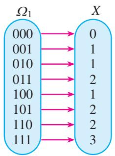

图7.2-1

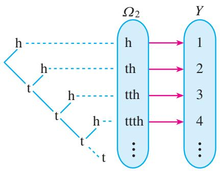

图7.2-2

对于试验 2，如果用 h 表示 “正面朝上”，t 表示 “反面朝上”，例如用 tth 表示第 3 次才出现 “正面朝上”，则样本空间
$\Omega_ {2} = \left\{\mathrm{h}, \text {th}, \text {tth}, \text {ttth}, \dots \right\},$
$\Omega_{2}$ 包含无穷多个样本点. 各样本点与变量 $Y$ 的值的对应关系如图7.2-2所示.

在上面两个随机试验中，每个样本点都有唯一的一个实数与之对应。变量 $X$ ， $Y$ 有如下共同点：
（1） 取值依赖于样本点;   
（2） 所有可能取值是明确的.

一般地，对于随机试验样本空间 $\Omega$ 中的每个样本点 $\omega$ ，都有唯一的实数 $X(\omega)$ 与之对应，我们称 X 为随机变量（random variable）。试验 1 中随机变量 X 的可能取值为 0，1，2，3，共有 4 个值；试验 2 中随机变量 Y 的可能取值为 1，2，3，…，有无限个取值，但可以一一列举出来。像这样，可能取值为有限个或可以一一列举的随机变量，我们称为离散型随机变量（discrete random variable）。通常用大写英文字母表示随机变量，例如 X，Y，Z；用小写英文字母表示随机变量的取值，例如 x，y，z。

随机变量的概念是俄国数学家切比雪夫（Chebyshev，1821—1894）在19世纪中叶建立和提倡使用的。

不难发现，随机变量的定义与函数的定义类似，这里的样本点 $\omega$ 相当于函数定义中的自变量，而样本空间 $\Omega$ 相当于函数的定义域，不同之处在于 $\Omega$ 不一定是数集。随机变量的取值 $X(\omega)$ 随着试验结果 $\omega$ 的变化而变化，这使我们可以比较方便地表示一些随机事件。

现实生活中，离散型随机变量的例子有很多。例如，某射击运动员射击一次可能命中的环数 X，它的可能取值为 0，1，2，…，10；某网页在 24 h 内被浏览的次数 Y，它的可能取值为 0，1，2，…；等等。

现实生活中还有大量不是离散型的随机变量的例子。例如，种子含水量的测量误差 $X_{1}$ ；某品牌电视机的使用寿命 $X_{2}$ ；测量某一个零件的长度产生的测量误差 $X_{3}$ 。这些都是可能取值充满了某个区间、不能一一列举的随机变量。本节我们只研究取有限个值的离散型随机变量。

你能再举出一些离散型随机变量和不是离散型的随机变量的例子吗？

根据问题引入合适的随机变量，有利于我们简洁地表示所关心的随机事件，并利用数学工具研究随机试验中的概率问题。例如，掷一枚质地均匀的骰子，X 表示掷出的点数，则事件“掷出 m 点”可以表示为 $\{X=m\}$ （m=1, 2, 3, 4, 5, 6），事件“掷出的点数不大于 2”可以表示为 $\{X\leqslant2\}$ ，事件“掷出偶数点”可以表示为 $\{X=2\}\cup\{X=4\}\cup\{X=6\}$ ，等等。由掷出各种点数的等可能性，可得
$P (X = m) = \frac {1}{6}, m = 1, 2, 3, 4, 5, 6.$

这一规律可以用表 7.2-1 表示.

表 7.2-1

<table><tr><td>X</td><td>1</td><td>2</td><td>3</td><td>4</td><td>5</td><td>6</td></tr><tr><td>P</td><td> $\frac{1}{6}$ </td><td> $\frac{1}{6}$ </td><td> $\frac{1}{6}$ </td><td> $\frac{1}{6}$ </td><td> $\frac{1}{6}$ </td><td> $\frac{1}{6}$ </td></tr></table>

一般地，设离散型随机变量 X 的可能取值为 $x_{1}, x_{2}, \cdots, x_{n}$ ，我们称 X 取每一个值 $x_{i}$ 的概率
$P (X = x _ {i}) = p _ {i}, i = 1, 2, \dots , n$

为 X 的概率分布列，简称分布列.

与函数的表示法类似，离散型随机变量的分布列也可以用表格表示(表7.2-2)，还可以用图形表示。例如，图7.2-3直观地表示了掷骰子试验中掷出的点数 $X$ 的分布列，称为 $X$ 的概率分布图。

表 7.2-2

<table><tr><td>X</td><td>$ x_{1} $</td><td>$ x_{2} $</td><td>...</td><td>$ x_{n} $</td></tr><tr><td>P</td><td>$ p_{1} $</td><td>$ p_{2} $</td><td>...</td><td>$ p_{n} $</td></tr></table>

根据概率的性质，离散型随机变量分布列具有下述两个性质：

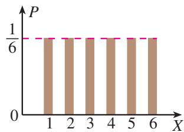

图7.2-3
（1） $p_{i} \geqslant 0, i = 1, 2, \cdots, n;$   
（2） $p_{1}+p_{2}+\cdots+p_{n}=1.$

利用分布列和概率的性质，可以计算由离散型随机变量表示的事件的概率。例如，在掷骰子试验中，由概率的加法公式，得事件“掷出的点数不大于2”的概率为
$P (X \leqslant 2) = P (X = 1) + P (X = 2) = \frac {1}{6} + \frac {1}{6} = \frac {1}{3}.$

类似地，事件“掷出偶数点”的概率为
$P (\{X = 2 \} \cup \{X = 4 \} \cup \{X = 6 \})$

# 人民教育出版社
$\begin{array}{l} = P (X = 2) + P (X = 4) + P (X = 6) \\ = \frac {1}{6} + \frac {1}{6} + \frac {1}{6} = \frac {1}{2}. \\ \end{array}$

> [!example]- 例 1 一批产品中次品率为 5%，随机抽取 1 件，定义
$X = \left\{ \begin{array}{l l} 1, & \text {抽到次品，} \\ 0, & \text {抽到正品．} \end{array} \right.$

求 $X$ 的分布列.
解：根据 X 的定义， $\{X=1\}$ = “抽到次品”， $\{X=0\}$ = “抽到正品”，X 的分布列为
$P (X = 0) = 0. 9 5, P (X = 1) = 0. 0 5.$

对于只有两个可能结果的随机试验，用 A 表示 “成功”， $\overline{A}$ 表示 “失败”，定义
$X = \left\{ \begin{array}{l l} 1, & A \text {发生}, \\ 0, & \overline {{A}} \text {发生}. \end{array} \right.$
如果 $P(A)=p$ ，则 $P(\overline{A})=1-p$ ，那么 X 的分布列如表 7.2-3 所示.

表7.2-3

<table><tr><td>X</td><td>0</td><td>1</td></tr><tr><td>P</td><td>1-p</td><td>p</td></tr></table>

我们称 X 服从两点分布（two-point distribution）或 0-1 分布。实际上，X 为在一次试验中成功（事件 A 发生）的次数（0 或 1）。像购买的彩券是否中奖，新生婴儿的性别，投篮是否命中等，都可以用两点分布来描述。

> [!example]- 例 2 某学校高二年级有 200 名学生，他们的体育综合测试成绩分 5 个等级，每个等级对应的分数和人数如表 7.2-4 所示.
表7.2-4

<table><tr><td>等级</td><td>不及格</td><td>及格</td><td>中等</td><td>良</td><td>优</td></tr><tr><td>分数</td><td>1</td><td>2</td><td>3</td><td>4</td><td>5</td></tr><tr><td>人数</td><td>20</td><td>50</td><td>60</td><td>40</td><td>30</td></tr></table>

从这200名学生中任意选取1人，求所选同学分数 $X$ 的分布列，以及 $P(X \geqslant 4)$ .
解：由题意知，X 是一个离散型随机变量，其可能取值为 1，2，3，4，5，且 $\{X=1\}$ = “不及格”， $\{X=2\}$ = “及格”， $\{X=3\}$ = “中等”， $\{X=4\}$ = “良”， $\{X=5\}$ = “优”。根据古典概型的知识，可得 X 的分布列，如表 7.2-5 所示。

表 7.2-5

<table><tr><td>X</td><td>1</td><td>2</td><td>3</td><td>4</td><td>5</td></tr><tr><td>P</td><td> $\frac{1}{10}$ </td><td> $\frac{1}{4}$ </td><td> $\frac{3}{10}$ </td><td> $\frac{1}{5}$ </td><td> $\frac{3}{20}$ </td></tr></table>
$P (X \geqslant 4) = P (X = 4) + P (X = 5) = \frac {1}{5} + \frac {3}{2 0} = \frac {7}{2 0}.$

> [!example]- 例 3 一批笔记本电脑共有 10 台，其中 A 品牌 3 台，B 品牌 7 台。如果从中随机挑选 2 台，求这 2 台电脑中 A 品牌台数的分布列。
解：设挑选的2台电脑中A品牌的台数为 $X$ ，则 $X$ 的可能取值为0，1，2.根据古典概型的知识，可得 $X$ 的分布列为
$P (X = 0) = \frac {\mathrm{C} _ {3} ^ {0} \mathrm{C} _ {7} ^ {2}}{\mathrm{C} _ {1 0} ^ {2}} = \frac {7}{1 5}, P (X = 1) = \frac {\mathrm{C} _ {3} ^ {1} \mathrm{C} _ {7} ^ {1}}{\mathrm{C} _ {1 0} ^ {2}} = \frac {7}{1 5}, P (X = 2) = \frac {\mathrm{C} _ {3} ^ {2} \mathrm{C} _ {7} ^ {0}}{\mathrm{C} _ {1 0} ^ {2}} = \frac {1}{1 5}.$

用表格表示 X 的分布列，如表 7.2-6 所示.

表 7.2-6

<table><tr><td>X</td><td>0</td><td>1</td><td>2</td></tr><tr><td>P</td><td>7/15</td><td>7/15</td><td>1/15</td></tr></table>

#### 练习

1. 举出两个离散型随机变量的例子.  
2. 下列随机试验的结果能否用离散型随机变量表示？若能，请写出各随机变量可能的取值，并说明这些值所表示的随机试验的结果。
（1）抛掷 2 枚骰子，所得点数之和；  
（2） 某足球队在 5 次点球中射进的球数；  
（3）任意抽取一瓶标有 $1500 \, mL$ 的饮料，其实际含量与规定含量之差.

3. 篮球比赛中每次罚球命中得 1 分，不中得 0 分．已知某运动员罚球命中的概率为 0.7，求他一次罚球得分的分布列.

4. 抛掷一枚质地均匀的硬币 2 次，写出正面向上次数 X 的分布列.

## 习题7.2

### 复习巩固

1. 张同学从学校回家要经过 4 个红绿灯路口，每个路口可能遇到红灯或绿灯.
（1） 写出随机试验的样本空间;   
（2）设他可能遇到红灯的次数为 $X$ ，写出 $X$ 的可能取值，并说明这些值所表示的随机事件.

2. 某位同学求得一个离散型随机变量的分布列为

<table><tr><td>X</td><td>0</td><td>1</td><td>2</td><td>3</td></tr><tr><td>P</td><td>0.2</td><td>0.3</td><td>0.15</td><td>0.45</td></tr></table>

试说明该同学的计算结果是否正确.

3. 在某项体能测试中，跑 $1\mathrm{km}$ 时间不超过 $4\mathrm{min}$ 为优秀。某位同学跑 $1\mathrm{km}$ 所花费的时间 $X$ 是离散型随机变量吗？如果只关心该同学是否能够取得优秀成绩，应该如何定义随机变量？  
4. 某位射箭运动员命中目标箭靶的环数 $X$ 的分布列为

<table><tr><td>X</td><td>6</td><td>7</td><td>8</td><td>9</td><td>10</td></tr><tr><td>P</td><td>0.05</td><td>0.15</td><td>0.25</td><td>0.35</td><td>0.20</td></tr></table>
如果命中9环或10环为优秀，那么他一次射击成绩为优秀的概率是多少？

### 综合运用

5. 老师要从 10 篇课文中随机抽 3 篇不同的课文让同学背诵，规定至少要背出其中 2 篇才能及格.
某位同学只能背诵其中的 6 篇，求：
（1）抽到他能背诵的课文的数量的分布列；  
（2） 他能及格的概率.

6. 某种资格证考试，每位考生一年内最多有3次考试机会。一旦某次考试通过，便可领取资格证书，不再参加以后的考试，否则就继续参加考试，直到用完3次机会。李明决定参加考试，如果他每次参加考试通过的概率依次为0.6，0.7，0.8，且每次考试是否通过相互独立，试求：
（1） 李明在一年内参加考试次数 X 的分布列;  
（2） 李明在一年内领到资格证书的概率.

## 7.3 离散型随机变量的数字特征

离散型随机变量的分布列全面地刻画了这个随机变量的取值规律。但在解决有些实际问题时，直接使用分布列并不方便。例如，要比较不同班级某次考试成绩，通常会比较平均成绩；要比较两名射箭运动员的射箭水平，一般会比较他们射箭的成绩(平均环数或总环数)以及稳定性。因此，类似于研究一组数据的均值和方差，我们也可以研究离散型随机变量的均值和方差，它们统称为随机变量的数字特征。

### 7.3.1 离散型随机变量的均值

问题 1 甲、乙两名射箭运动员射中目标箭靶的环数的分布列如表 7.3-1 所示.

表 7.3-1

<table><tr><td>环数 X</td><td>7</td><td>8</td><td>9</td><td>10</td></tr><tr><td>甲射中的概率</td><td>0.1</td><td>0.2</td><td>0.3</td><td>0.4</td></tr><tr><td>乙射中的概率</td><td>0.15</td><td>0.25</td><td>0.4</td><td>0.2</td></tr></table>

如何比较他们射箭水平的高低呢？

类似两组数据的比较，首先比较击中的平均环数，如果平均环数相等，再看稳定性.

假设甲射箭 $n$ 次，射中7环、8环、9环和10环的频率分别为 $\frac{n_1}{n}$ ， $\frac{n_2}{n}$ ， $\frac{n_3}{n}$ ， $\frac{n_4}{n}$ 。甲 $n$ 次射箭射中的平均环数为
$\overline {{{x}}} = 7 \times \frac {n _ {1}}{n} + 8 \times \frac {n _ {2}}{n} + 9 \times \frac {n _ {3}}{n} + 1 0 \times \frac {n _ {4}}{n}.$
当 $n$ 足够大时，频率稳定于概率，所以 $\overline{x}$ 稳定于
$7 \times 0. 1 + 8 \times 0. 2 + 9 \times 0. 3 + 1 0 \times 0. 4 = 9.$
即甲射中平均环数的稳定值(理论平均值)为9，这个平均值的大小可以反映甲运动员的射箭水平.
同理，乙射中环数的平均值为
$7 \times 0. 1 5 + 8 \times 0. 2 5 + 9 \times 0. 4 + 1 0 \times 0. 2 = 8. 6 5.$

从平均值的角度比较，甲的射箭水平比乙高.

一般地，若离散型随机变量 $X$ 的分布列如表7.3-2所示，

表7.3-2

<table><tr><td>X</td><td>$ x_{1} $</td><td>$ x_{2} $</td><td>...</td><td>$ x_{n} $</td></tr><tr><td>P</td><td>$ p_{1} $</td><td>$ p_{2} $</td><td>...</td><td>$ p_{n} $</td></tr></table>

则称
$\begin{array}{l} E (X) = x _ {1} p _ {1} + x _ {2} p _ {2} + \dots + x _ {n} p _ {n} \\ = \sum_ {i = 1} ^ {n} x _ {i} p _ {i} \\ \end{array}$

为随机变量 X 的均值(mean)或数学期望(mathematical expectation)，数学期望简称期望．均值是随机变量可能取值关于取值概率的加权平均数，它综合了随机变量的取值和取值的概率，反映了随机变量取值的平均水平.

> [!example]- 例 1 在篮球比赛中，罚球命中 1 次得 1 分，不中得 0 分。如果某运动员罚球命中的概率为 0.8，那么他罚球 1 次的得分 X 的均值是多少？
分析：罚球有命中和不中两种可能结果，命中时 $X = 1$ ，不中时 $X = 0$ ，因此随机变量 $X$ 服从两点分布． $X$ 的均值反映了该运动员罚球1次的平均得分水平．
解：因为
$P (X = 1) = 0. 8, P (X = 0) = 0. 2,$
所以
$E (X) = 0 \times 0. 2 + 1 \times 0. 8 = 0. 8.$
即该运动员罚球 1 次的得分 X 的均值是 0.8.

一般地，如果随机变量 $X$ 服从两点分布，那么
$E (X) = 0 \times (1 - p) + 1 \times p = p.$

> [!example]- 例 2 抛掷一枚质地均匀的骰子，设出现的点数为 X，求 X 的均值.
分析：先求出 X 的分布列，再根据定义计算 X 的均值.
解： $X$ 的分布列为
$P (X = k) = \frac {1}{6}, k = 1, 2, 3, 4, 5, 6.$
因此，
$E (X) = \frac {1}{6} (1 + 2 + 3 + 4 + 5 + 6) = 3. 5.$

> [!observe] 观察
掷一枚质地均匀的骰子，掷出的点数 $X$ 的均值为3.5.随机模拟这个试验，重复60次和重复300次各做6次，观测出现的点数并计算平均数．根据观测值的平均数（样本均值)绘制统计图，分别如图7.3-1（1）和（2）所示．观察图形，在两组试验中，随机变量的均值与样本均值有何联系与区别？

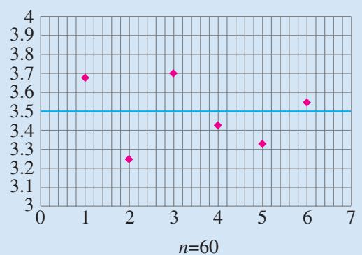

（1）

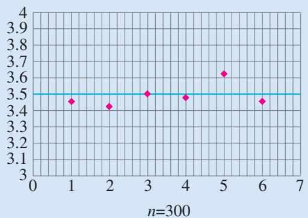

（2）   
图7.3-1

观察图7.3-1可以发现：在这12组掷骰子试验中，样本均值各不相同，但它们都在掷出点数 $X$ 的均值3.5附近波动，且重复掷300次的样本均值波动幅度明显小于重复60次的.
事实上，随机变量的均值是一个确定的数，而样本均值具有随机性，它围绕随机变量的均值波动。随着重复试验次数的增加，样本均值的波动幅度一般会越来越小。因此，我们常用随机变量的观测值的均值去估计随机变量的均值。

> [!explore] 探究
如果 $X$ 是一个离散型随机变量， $X$ 加一个常数或乘一个常数后，其均值会怎样变化？即 $E(X + b)$ 和 $E(aX)$ （其中 $a, b$ 为常数）分别与 $E(X)$ 有怎样的关系？
设 $X$ 的分布列为
$P (X = x _ {i}) = p _ {i}, i = 1, 2, \dots , n.$

根据随机变量均值的定义，
$\begin{array}{l} E (X + b) = \left(x _ {1} + b\right) p _ {1} + \left(x _ {2} + b\right) p _ {2} + \dots + \left(x _ {n} + b\right) p _ {n} \\ = \left(x _ {1} p _ {1} + x _ {2} p _ {2} + \dots + x _ {n} p _ {n}\right) + b \left(p _ {1} + p _ {2} + \dots + p _ {n}\right) \\ = E (X) + b. \\ \end{array}$

类似地，可以证明
$E (a X) = a E (X).$

你能给出证明吗？

一般地，下面的结论成立：
$E (a X + b) = a E (X) + b.$

> [!example]- 例 3 猜歌名游戏是根据歌曲的主旋律制成的铃声来猜歌名. 某嘉宾参加猜歌名节目, 猜对每首歌曲的歌名相互独立, 猜对三首歌曲 A, B, C 歌名的概率及猜对时获得相应的公益基金如表 7.3-3 所示.
表7.3-3

<table><tr><td>歌曲</td><td>A</td><td>B</td><td>C</td></tr><tr><td>猜对的概率</td><td>0.8</td><td>0.6</td><td>0.4</td></tr><tr><td>获得的公益基金额/元</td><td>1 000</td><td>2 000</td><td>3 000</td></tr></table>

规则如下：按照 A，B，C 的顺序猜，只有猜对当前歌曲的歌名才有资格猜下一首。求嘉宾获得的公益基金总额 X 的分布列及均值。
分析：根据规则，公益基金总额 X 的可能取值有四种情况：猜错 A，获得 0 元基金；猜对 A 而猜错 B，获得 1 000 元基金；猜对 A 和 B 而猜错 C，获得 3 000 元基金；A，B，C 全部猜对，获得 6 000 元基金。因此 X 是一个离散型随机变量。利用独立条件下的乘法公式可求分布列。
解：分别用 A, B, C 表示猜对歌曲 A, B, C 歌名的事件，则 A, B, C 相互独立.
$P (X = 0) = P (\overline {{A}}) = 0. 2,$
$P (X = 1 0 0 0) = P (A \overline {{B}}) = 0. 8 \times 0. 4 = 0. 3 2,$
$P (X = 3 0 0 0) = P (A B \bar {C}) = 0. 8 \times 0. 6 \times 0. 6 = 0. 2 8 8,$
$P (X = 6 0 0 0) = P (A B C) = 0. 8 \times 0. 6 \times 0. 4 = 0. 1 9 2.$

X 的分布列如表 7.3-4 所示.

表 7.3-4

<table><tr><td>X</td><td>0</td><td>1 000</td><td>3 000</td><td>6 000</td></tr><tr><td>P</td><td>0.2</td><td>0.32</td><td>0.288</td><td>0.192</td></tr></table>
$X$ 的均值为
$\begin{array}{l} E (X) = 0 \times 0. 2 + 1 0 0 0 \times 0. 3 2 + 3 0 0 0 \times 0. 2 8 8 + 6 0 0 0 \times 0. 1 9 2 \\ = 2 3 3 6. \\ \end{array}$
如果改变猜歌的顺序，获得公益基金的均值是否相同？如果不同，你认为哪个顺序获得的公益基金均值最大？

> [!example]- 例 4 根据天气预报，某地区近期有小洪水的概率为 0.25，有大洪水的概率为 0.01。该地区某工地上有一台大型设备，遇到大洪水时要损失 60 000 元，遇到小洪水时要损失 10 000 元。为保护设备，有以下 3 种方案：
方案 1 运走设备，搬运费为 3800 元；
方案 2 建保护围墙，建设费为 2 000 元，但围墙只能防小洪水；
方案 3 不采取措施.

工地的领导该如何决策呢？
分析：决策目标为总损失(投入费用与设备损失之和)越小越好。根据题意，各种方案在不同状态下的总损失如表7.3-5所示。

表 7.3-5

<table><tr><td rowspan="2" colspan="2"></td><td colspan="3">天气状况</td></tr><tr><td>大洪水</td><td>小洪水</td><td>没有洪水</td></tr><tr><td colspan="2">概率</td><td>0.01</td><td>0.25</td><td>0.74</td></tr><tr><td rowspan="3">总损失/元</td><td>方案1</td><td>3800</td><td>3800</td><td>3800</td></tr><tr><td>方案2</td><td>62000</td><td>2000</td><td>2000</td></tr><tr><td>方案3</td><td>60000</td><td>10000</td><td>0</td></tr></table>

方案 2 和方案 3 的总损失都是随机变量，可以采用期望总损失最小的方案.
解：设方案1、方案2、方案3的总损失分别为 $X_{1}$ ， $X_{2}$ ， $X_{3}$

采用方案 1，无论有无洪水，都损失 3800 元。因此，
$P (X _ {1} = 3 8 0 0) = 1.$

采用方案 2，遇到大洪水时，总损失为 $2\ 000 + 60\ 000 = 62\ 000$ 元；没有大洪水时，总损失为 2 000 元。因此，
$P \left(X _ {2} = 6 2 0 0 0\right) = 0. 0 1, P \left(X _ {2} = 2 0 0 0\right) = 0. 9 9.$

采用方案3，
$P \left(X _ {3} = 6 0 0 0 0\right) = 0. 0 1, P \left(X _ {3} = 1 0 0 0 0\right) = 0. 2 5, P \left(X _ {3} = 0\right) = 0. 7 4.$
于是，
$E (X _ {1}) = 3 8 0 0,$
$E (X _ {2}) = 6 2 0 0 0 \times 0. 0 1 + 2 0 0 0 \times 0. 9 9 = 2 6 0 0,$
$E \left(X _ {3}\right) = 6 0 0 0 0 \times 0. 0 1 + 1 0 0 0 0 \times 0. 2 5 + 0 \times 0. 7 4 = 3 1 0 0.$
因此，从期望损失最小的角度，应采取方案 2.

值得注意的是，上述结论是通过比较“期望总损失”而得出的。一般地，我们可以这样来理解“期望总损失”：如果问题中的天气状况多次发生，那么采用方案2将会使总损失减到最小。不过，因为洪水是否发生以及洪水发生的大小都是随机的，所以对于个别的一次决策，采用方案2也不一定是最好的。

#### 练习

1. 已知随机变量 $X$ 的分布列为

<table><tr><td>X</td><td>1</td><td>2</td><td>3</td><td>4</td><td>5</td></tr><tr><td>P</td><td>0.1</td><td>0.3</td><td>0.4</td><td>0.1</td><td>0.1</td></tr></table>
（1） 求 $E(X)$ ;
（2） 求 $E(3X+2)$ .

2. 抛掷一枚硬币，规定正面向上得 1 分，反面向上得 -1 分，求得分 X 的均值.  
3. 甲、乙两台机床生产同一种零件，它们生产的产量相同，在 $1\mathrm{h}$ 内生产出的次品数分别为 $X_{1}, X_{2}$ ，其分布列分别为

甲机床次品数的分布列

<table><tr><td> $X_{1}$ </td><td>0</td><td>1</td><td>2</td><td>3</td></tr><tr><td>P</td><td>0.4</td><td>0.3</td><td>0.2</td><td>0.1</td></tr></table>

乙机床次品数的分布列

<table><tr><td> $X_{2}$ </td><td>0</td><td>1</td><td>2</td></tr><tr><td>P</td><td>0.3</td><td>0.5</td><td>0.2</td></tr></table>

哪台机床更好？请解释你所得出结论的实际含义.

### 7.3.2 离散型随机变量的方差

随机变量的均值是一个重要的数字特征，它反映了随机变量取值的平均水平或分布的“集中趋势”。因为随机变量的取值围绕其均值波动，而随机变量的均值无法反映波动幅度的大小。所以我们还需要寻找反映随机变量取值波动大小的数字特征。

问题 2 从两名同学中挑出一名代表班级参加射击比赛. 根据以往的成绩记录, 甲、乙两名同学击中目标靶的环数 X 和 Y 的分布列如表 7.3-6 和表 7.3-7 所示.

表 7.3-6

<table><tr><td>X</td><td>6</td><td>7</td><td>8</td><td>9</td><td>10</td></tr><tr><td>P</td><td>0.09</td><td>0.24</td><td>0.32</td><td>0.28</td><td>0.07</td></tr></table>

表 7.3-7

<table><tr><td>Y</td><td>6</td><td>7</td><td>8</td><td>9</td><td>10</td></tr><tr><td>P</td><td>0.07</td><td>0.22</td><td>0.38</td><td>0.30</td><td>0.03</td></tr></table>

如何评价这两名同学的射击水平?

通过计算可得，
$E (X) = 8, E (Y) = 8.$
因为两个均值相等，所以根据均值不能区分这两名同学的射击水平.

评价射击水平，除了要了解击中环数的均值外，还要考虑稳定性，即击中环数的离散程度。图7.3-2和图7.3-3分别是 $X$ 和 $Y$ 的概率分布图，比较两个图形，可以发现乙同学的射击成绩更集中于8环，即乙同学的射击成绩更稳定。

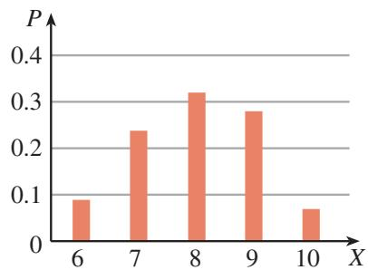

图7.3-2

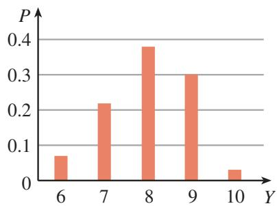

图7.3-3

> [!think] 思考
怎样定量刻画离散型随机变量取值的离散程度?

我们知道，样本方差可以度量一组样本数据的离散程度，它是通过计算所有数据与样本均值的“偏差平方的平均值”来实现的。一个自然的想法是，随机变量的离散程度能否用可能取值与均值的“偏差平方的平均值”来度量呢？
设离散型随机变量 X 的分布列如表 7.3-8 所示.

表7.3-8

<table><tr><td>X</td><td> $x_{1}$ </td><td> $x_{2}$ </td><td> $\cdots$ </td><td> $x_{n}$ </td></tr><tr><td>P</td><td> $p_{1}$ </td><td> $p_{2}$ </td><td> $\cdots$ </td><td> $p_{n}$ </td></tr></table>

考虑 X 所有可能取值 $x_{i}$ 与 $E(X)$ 的偏差的平方 $(x_{1}-E(X))^{2}$ ， $(x_{2}-E(X))^{2}$ ，…， $(x_{n}-E(X))^{2}$ 。因为 X 取每个值的概率不尽相同，所以我们用偏差平方关于取值概率的加权平均，来度量随机变量 X 取值与其均值 $E(X)$ 的偏离程度。我们称
$\begin{array}{l} D (X) = \left(x _ {1} - E (X)\right) ^ {2} p _ {1} + \left(x _ {2} - E (X)\right) ^ {2} p _ {2} + \dots + \left(x _ {n} - E (X)\right) ^ {2} p _ {n} \\ = \sum_ {i = 1} ^ {n} (x _ {i} - E (X)) ^ {2} p _ {i} \\ \end{array}$

为随机变量 X 的方差(variance)，有时也记为 $Var(X)$ ，并称 $\sqrt{D(X)}$ 为随机变量 X 的标准差(standard deviation)，记为 $\sigma(X)$ .

随机变量的方差和标准差都可以度量随机变量取值与其均值的偏离程度，反映了随机变量取值的离散程度。方差或标准差越小，随机变量的取值越集中；方差或标准差越大，随机变量的取值越分散。

现在，可以用两名同学射击成绩的方差和标准差来刻画他们射击成绩的稳定性。由方差和标准差的定义，两名同学射击成绩的方差和标准差分别为
$D (X) = \sum_ {i = 6} ^ {1 0} (i - 8) ^ {2} P (X = i) = 1. 1 6, \sqrt {D (X)} \approx 1. 0 7 7;$
$D (Y) = \sum_ {i = 6} ^ {1 0} (i - 8) ^ {2} P (Y = i) = 0. 9 2, \sqrt {D (Y)} \approx 0. 9 5 9.$
因为 $D(Y) < D(X)$ (等价地， $\sqrt{D(Y)} < \sqrt{D(X)}$ )，所以随机变量 Y 的取值相对更集中，即乙同学的射击成绩相对更稳定.

在方差的计算中，利用下面的结论经常可以使计算简化.
$\begin{array}{l} D (X) = \sum_ {i = 1} ^ {n} \left(x _ {i} - E (X)\right) ^ {2} p _ {i} \\ = \sum_ {i = 1} ^ {n} (x _ {i} ^ {2} - 2 E (X) x _ {i} + (E (X)) ^ {2}) p _ {i} \\ \end{array}$

# 人民教育出版社
$\begin{array}{l} = \sum_ {i = 1} ^ {n} x _ {i} ^ {2} p _ {i} - 2 E (X) \sum_ {i = 1} ^ {n} x _ {i} p _ {i} + (E (X)) ^ {2} \sum_ {i = 1} ^ {n} p _ {i} \\ = \sum_ {i = 1} ^ {n} x _ {i} ^ {2} p _ {i} - (E (X)) ^ {2}. \\ \end{array}$

方差描述随机变量取值的离散程度，了解方差的性质，除了简化计算外，还有助于更好地理解其本质.

> [!explore] 探究
离散型随机变量 $X$ 加上一个常数，方差会有怎样的变化？离散型随机变量 $X$ 乘以一个常数，方差又有怎样的变化？它们和期望的性质有什么不同？

离散型随机变量 $X$ 加上一个常数 $b$ ，其均值也相应加上常数 $b$ ，故不改变 $X$ 与其均值的离散程度，方差保持不变，即
$D (X + b) = D (X).$

而离散型随机变量 $X$ 乘以一个常数 $a$ ，其方差变为原方差的 $a^2$ 倍，即
$D (a X) = a ^ {2} D (X).$

一般地，可以证明下面的结论成立：
$D (a X + b) = a ^ {2} D (X).$

> [!example]- 例5 抛掷一枚质地均匀的骰子，求掷出的点数 $X$ 的方差.
解：随机变量 $X$ 的分布列为
$P (X = k) = \frac {1}{6}, k = 1, 2, 3, 4, 5, 6.$
因为
$E (X) = \frac {7}{2}, \sum_ {k = 1} ^ {6} \left(k ^ {2} \times \frac {1}{6}\right) = \frac {1}{6} \left(1 ^ {2} + 2 ^ {2} + 3 ^ {2} + 4 ^ {2} + 5 ^ {2} + 6 ^ {2}\right) = \frac {9 1}{6},$
所以
$D (X) = \sum_ {k = 1} ^ {6} \left(k ^ {2} \times \frac {1}{6}\right) - \left(\frac {7}{2}\right) ^ {2} = \frac {3 5}{1 2}.$

> [!example]- 例 6 投资 A, B 两种股票, 每股收益的分布列分别如表 7.3-9 和表 7.3-10 所示.
表 7.3-9 股票 A 收益的分布列

<table><tr><td>收益X/元</td><td>-1</td><td>0</td><td>2</td></tr><tr><td>概率</td><td>0.1</td><td>0.3</td><td>0.6</td></tr></table>

表 7.3-10 股票 B 收益的分布列

<table><tr><td>收益Y/元</td><td>0</td><td>1</td><td>2</td></tr><tr><td>概率</td><td>0.3</td><td>0.4</td><td>0.3</td></tr></table>
（1） 投资哪种股票的期望收益大?   
（2） 投资哪种股票的风险较高?
分析：股票投资收益是随机变量，期望收益就是随机变量的均值。投资风险是指收益的不确定性，在两种股票期望收益相差不大的情况下，可以用收益的方差来度量它们的投资风险高低，方差越大风险越高，方差越小风险越低。
解：（1）股票 A 和股票 B 投资收益的期望分别为
$E (X) = (- 1) \times 0. 1 + 0 \times 0. 3 + 2 \times 0. 6 = 1. 1,$
$E (Y) = 0 \times 0. 3 + 1 \times 0. 4 + 2 \times 0. 3 = 1.$
因为 $E(X) > E(Y)$ ，所以投资股票 A 的期望收益较大.
（2） 股票 A 和股票 B 投资收益的方差分别为
$D (X) = (- 1) ^ {2} \times 0. 1 + 0 ^ {2} \times 0. 3 + 2 ^ {2} \times 0. 6 - 1. 1 ^ {2} = 1. 2 9,$
$D (Y) = 0 ^ {2} \times 0. 3 + 1 ^ {2} \times 0. 4 + 2 ^ {2} \times 0. 3 - 1 ^ {2} = 0. 6.$
因为 $E(X)$ 和 $E(Y)$ 相差不大，且 $D(X) > D(Y)$ ，所以投资股票 A 比投资股票 B 的风险高.

在实际中，可以选择适当的比例投资两种股票，使期望收益最大或风险最小.

随机变量的方差是一个重要的数字特征，它刻画了随机变量的取值与其均值的偏离程度，或者说反映随机变量取值的离散程度。在不同的实际问题背景中，方差可以有不同的解释。例如，如果随机变量是某项技能的测试成绩，那么方差的大小反映了技能的稳定性；如果随机变量是加工某种产品的误差，那么方差的大小反映了加工的精度；如果随机变量是风险投资的收益，那么方差的大小反映了投资风险的高低；等等。

#### 练习

1. 已知随机变量 $X$ 的分布列为

<table><tr><td>X</td><td>1</td><td>2</td><td>3</td><td>4</td></tr><tr><td>P</td><td>0.2</td><td>0.3</td><td>0.4</td><td>0.1</td></tr></table>

求 $D(X)$ 和 $\sigma(2X+7)$ .

2. 若随机变量 X 满足 $P(X=c)=1$ ，其中 c 为常数，求 $D(X)$ .  
3. 甲、乙两个班级同学分别目测数学教科书的长度，其误差 $X$ 和 $Y$ （单位：cm)的分布列如下：

甲班的目测误差分布列

<table><tr><td>X</td><td>-2</td><td>-1</td><td>0</td><td>1</td><td>2</td></tr><tr><td>P</td><td>0.1</td><td>0.2</td><td>0.4</td><td>0.2</td><td>0.1</td></tr></table>

乙班的目测误差分布列

<table><tr><td>Y</td><td>-2</td><td>-1</td><td>0</td><td>1</td><td>2</td></tr><tr><td>P</td><td>0.05</td><td>0.15</td><td>0.6</td><td>0.15</td><td>0.05</td></tr></table>

先直观判断 X 和 Y 的分布哪一个离散程度大，再分别计算 X 和 Y 的方差，验证你的判断.

## 习题7.3

### 复习巩固

1. 某品牌手机投放市场，每部手机可能发生按定价售出、打折后售出、没有售出而收回三种情况。按定价售出每部利润 100 元，打折后售出每部利润 0 元，没有售出而收回每部利润 -300 元。据市场分析，发生这三种情况的概率分别为 0.6, 0.3, 0.1。求每部手机利润的均值和方差。  
2. 现要发行 10 000 张彩票，其中中奖金额为 2 元的彩票 1 000 张，10 元的彩票 300 张，50 元的彩票 100 张，100 元的彩票 50 张，1 000 元的彩票 5 张。1 张彩票中奖金额的均值是多少元？  
3. 随机变量 $X$ 的分布列为 $P(X = 0) = 0.2, P(X = 1) = a, P(X = 2) = b$ . 若 $E(X) = 1$ ，求 $a$ 和 $b$ .  
4. 在单项选择题中，每道题有四个选项，其中仅有一个选项正确。如果从四个选项中随机选一个，选对的概率为 0.25。请给选对和选错分别赋予合适的分值，使得随机选择时得分的均值为 0。  
5. 证明： $D(aX+b)=a^{2}D(X)$ .

### 综合运用

6. 有 A 和 B 两道谜语，张某猜对 A 谜语的概率为 0.8，猜对得奖金 10 元；猜对 B 谜语的概率为 0.5，猜对得奖金 20 元。规则规定：只有在猜对第一道谜语的情况下，才有资格猜第二道。如果猜谜顺序由张某选择，他应该选择先猜哪一道谜语？

7. 甲、乙两种品牌的手表，它们的日走时误差分别为 $X$ 和 $Y$ (单位：s)，其分布列为

甲品牌的走时误差分布列

<table><tr><td>X</td><td>-1</td><td>0</td><td>1</td></tr><tr><td>P</td><td>0.1</td><td>0.8</td><td>0.1</td></tr></table>

乙品牌的走时误差分布列

<table><tr><td>Y</td><td>-2</td><td>-1</td><td>0</td><td>1</td><td>2</td></tr><tr><td>P</td><td>0.1</td><td>0.2</td><td>0.4</td><td>0.2</td><td>0.1</td></tr></table>

试比较甲、乙两种品牌手表的性能.

### 拓广探索

8. 设 $E(X) = \mu$ ， $a$ 是不等于 $\mu$ 的常数，探究 $X$ 相对于 $\mu$ 的偏离程度与 $X$ 相对于 $a$ 的偏离程度的大小关系，并说明结论的意义.

## 7.4 二项分布与超几何分布

前面我们学习了离散型随机变量的有关知识，本节将利用这些知识研究两类重要的概率模型——二项分布和超几何分布.

### 7.4.1 二项分布

在实际问题中，有许多随机试验与掷硬币试验具有相同的特征，它们只包含两个可能结果。例如，检验一件产品结果为合格或不合格，飞碟射击时中靶或脱靶，医学检验结果为阳性或阴性等。我们把只包含两个可能结果的试验叫做伯努利试验（Bernoulli trials）。

我们将一个伯努利试验独立地重复进行 $n$ 次所组成的随机试验称为 $n$ 重伯努利试验。显然， $n$ 重伯努利试验具有如下共同特征：

① “重复”意味着各次试验成功的概率相同.
（1） 同一个伯努利试验重复 $^{①}$ 做 n 次；  
（2） 各次试验的结果相互独立.

> [!think] 思考
下面 3 个随机试验是否为 n 重伯努利试验？如果是，那么其中的伯努利试验是什么？对于每个试验，定义 “成功” 的事件为 A，那么 A 的概率是多大？重复试验的次数是多少？
（1） 抛掷一枚质地均匀的硬币 10 次.  
（2） 某飞碟运动员每次射击中靶的概率为 0.8，连续射击 3 次.  
（3）一批产品的次品率为 5%，有放回地随机抽取 20 件.

在伯努利试验中，我们关注某个事件 $A$ 是否发生，而在 $n$ 重伯努利试验中，我们关注事件 $A$ 发生的次数 $X$ 。进一步地，因为 $X$ 是一个离散型随机变量，所以我们实际关心的是它的概率分布列。例如，对产品抽样检验，随机抽取 $n$ 件，我们关心样本中不合格品数的概率分布列。

> [!explore] 探究
某飞碟运动员每次射击中靶的概率为0.8. 连续3次射击，中靶次数 $X$ 的概率分布列是怎样的？

用 $A_{i}$ 表示 “第 i 次射击中靶” (i=1, 2, 3)，用如图 7.4-1 的树状图表示试验的可能结果.<center>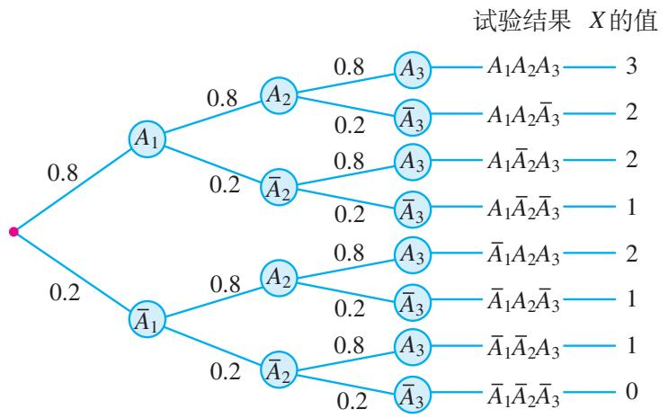</center><center>图7.4-1</center>
由分步乘法计数原理，3次独立重复试验共有 $2^{3} = 8$ 种可能结果，它们两两互斥，每个结果都是3个相互独立事件的积。由概率的加法公式和乘法公式得
$P (X = 0) = P \left(\overline {{A}} _ {1} \overline {{A}} _ {2} \overline {{A}} _ {3}\right) = 0. 2 ^ {3},$
$P (X = 1) = P \left(A _ {1} \overline {{A}} _ {2} \overline {{A}} _ {3}\right) + P \left(\overline {{A}} _ {1} A _ {2} \overline {{A}} _ {3}\right) + P \left(\overline {{A}} _ {1} \overline {{A}} _ {2} A _ {3}\right) = 3 \times 0. 8 \times 0. 2 ^ {2},$
$P (X = 2) = P \left(A _ {1} A _ {2} \overline {{A}} _ {3}\right) + P \left(A _ {1} \overline {{A}} _ {2} A _ {3}\right) + P \left(\overline {{A}} _ {1} A _ {2} A _ {3}\right) = 3 \times 0. 8 ^ {2} \times 0. 2,$
$P (X = 3) = P \left(A _ {1} A _ {2} A _ {3}\right) = 0. 8 ^ {3}.$

为了简化表示，每次射击用1表示中靶，用0表示脱靶，那么3次射击恰好2次中靶的所有可能结果可表示为011，110，101，这三个结果发生的概率都相等，均为 $0.8^{2}\times0.2$ ，并且与哪两次中靶无关。因此，3次射击恰好2次中靶的概率为 $C_{3}^{2}\times0.8^{2}\times0.2$ 。同理可求中靶0次、1次、3次的概率。于是，中靶次数X的分布列为
$P (X = k) = \mathrm{C} _ {3} ^ {k} \times 0. 8 ^ {k} \times 0. 2 ^ {3 - k}, k = 0, 1, 2, 3.$

> [!think] 思考
如果连续射击4次，类比上面的分析，表示中靶次数 $X$ 等于2的结果有哪些？写出中靶次数 $X$ 的分布列.

一般地，在 n 重伯努利试验中，设每次试验中事件 A 发生的概率为 $p(0 < p < 1)$ ，用 X 表示事件 A 发生的次数，则 X 的分布列为
$P (X = k) = \mathrm{C} _ {n} ^ {k} p ^ {k} (1 - p) ^ {n - k}, k = 0, 1, 2, \dots , n.$
如果随机变量 X 的分布列具有上式的形式，则称随机变量 X 服从二项分布（binomial distribution），记作 $X \sim B(n, p)$ .

对比二项分布与二项式定理，你能看出它们之间的联系吗？
由二项式定理，容易得到
$\sum_ {k = 0} ^ {n} P (X = k) = \sum_ {k = 0} ^ {n} \mathrm{C} _ {n} ^ {k} p ^ {k} (1 - p) ^ {n - k} = [ p + (1 - p) ] ^ {n} = 1.$

> [!example]- 例 1 将一枚质地均匀的硬币重复抛掷 10 次，求：
（1） 恰好出现 5 次正面朝上的概率;  
（2） 正面朝上出现的频率在 $[0.4, 0.6]$ 内的概率.
分析：抛掷一枚质地均匀的硬币，出现“正面朝上”和“反面朝上”两种结果且可能性相等，这是一个10重伯努利试验。因此，正面朝上的次数服从二项分布。
解：设 A = “正面朝上”，则 $P(A) = 0.5$ 。用 X 表示事件 A 发生的次数，则 $X \sim B(10, 0.5)$ 。
（1） 恰好出现 5 次正面朝上等价于 X=5，于是
$P (X = 5) = \mathrm{C} _ {1 0} ^ {5} \times 0. 5 ^ {1 0} = \frac {2 5 2}{1 0 2 4} = \frac {6 3}{2 5 6};$
（2）正面朝上出现的频率在 $[0.4, 0.6]$ 内等价于 $4 \leqslant X \leqslant 6$ ，于是
$P (4 \leqslant X \leqslant 6) = \mathrm{C} _ {1 0} ^ {4} \times 0. 5 ^ {1 0} + \mathrm{C} _ {1 0} ^ {5} \times 0. 5 ^ {1 0} + \mathrm{C} _ {1 0} ^ {6} \times 0. 5 ^ {1 0} = \frac {6 7 2}{1 0 2 4} = \frac {2 1}{3 2}.$

> [!example]- 例 2 图 7.4-2 是一块高尔顿板的示意图。在一块木板上钉着若干排相互平行但相互错开的圆柱形小木钉，小木钉之间留有适当的空隙作为通道，前面挡有一块玻璃。将小球从顶端放入，小球下落的过程中，每次碰到小木钉后都等可能地向左或向右落下，最后落入底部的格子中。格子从左到右分别编号为 0, 1, 2, …, 10，用 X 表示小球最后落入格子的号码，求 X 的分布列。
分析：小球落入哪个格子取决于在下落过程中与各小木钉碰撞的结果。设试验为观察小球碰到小木钉后下落的方向，有“向左下落”和“向右下落”两种可能结果，且概率都是0.5。在下落的过程中，小球共碰撞小木钉10次，且每次碰撞后下落方向不受上一次下落方向的影响，因此这是一个10重伯努利试验。小球最后落入格子的号码等于向右落下的次数，因此 $X$ 服从二项分布。
解：设 A = “向右下落”，则 $\overline{A} =$ “向左下落”，且 $P(A) = P(\overline{A}) = 0.5$ 。因为小球最后落入格子的号码 $X$ 等于事件 $A$ 发生的次数，而小球在下落的过程中共碰撞小木钉10次，所以 $X \sim B(10, 0.5)$ 。于是， $X$ 的分布列为
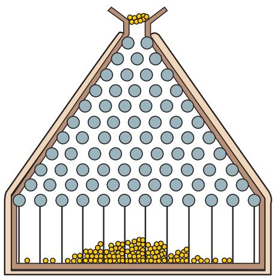

图7.4-2  
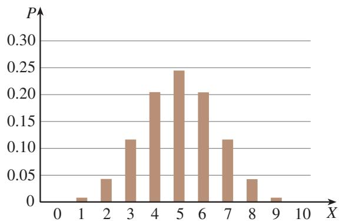

图7.4-3
$P (X = k) = \mathrm{C} _ {1 0} ^ {k} \times 0. 5 ^ {1 0}, k = 0, 1, 2, \dots , 1 0.$

X 的概率分布图如图 7.4-3 所示.

> [!example]- 例 3 甲、乙两选手进行象棋比赛，如果每局比赛甲获胜的概率为 0.6，乙获胜的概率为 0.4，那么采用 3 局 2 胜制还是采用 5 局 3 胜制对甲更有利？
分析：判断哪个赛制对甲有利，就是看在哪个赛制中甲最终获胜的概率大。可以把“甲最终获胜”这个事件，按可能的比分情况表示为若干事件的和，再利用各局比赛结果的独立性逐个求概率；也可以假定赛完所有 $n$ 局，把 $n$ 局比赛看成 $n$ 重伯努利试验，利用二项分布求“甲最终获胜”的概率。
解法 1：采用 3 局 2 胜制，甲最终获胜有两种可能的比分 2:0 或 2:1，前者是前两局甲连胜，后者是前两局甲、乙各胜一局且第 3 局甲胜。因为每局比赛的结果是独立的，甲最终获胜的概率为
$p _ {1} = 0. 6 ^ {2} + \mathrm{C} _ {2} ^ {1} \times 0. 6 ^ {2} \times 0. 4 = 0. 6 4 8.$

类似地，采用 5 局 3 胜制，甲最终获胜有 3 种比分 3:0，3:1 或 3:2。因为每局比赛的结果是独立的，所以甲最终获胜的概率为
$p _ {2} = 0. 6 ^ {3} + \mathrm{C} _ {3} ^ {2} \times 0. 6 ^ {3} \times 0. 4 + \mathrm{C} _ {4} ^ {2} \times 0. 6 ^ {3} \times 0. 4 ^ {2} = 0. 6 8 2 5 6.$
解法 2：采用 3 局 2 胜制，不妨设赛满 3 局，用 X 表示 3 局比赛中甲胜的局数，则 $X \sim B(3, 0.6)$ . 甲最终获胜的概率为
$p _ {1} = P (X = 2) + P (X = 3) = \mathrm{C} _ {3} ^ {2} \times 0. 6 ^ {2} \times 0. 4 + \mathrm{C} _ {3} ^ {3} \times 0. 6 ^ {3} = 0. 6 4 8.$

采用 5 局 3 胜制，不妨设赛满 5 局，用 X 表示 5 局比赛中甲胜的局数，则 $X \sim B(5, 0.6)$ 。甲最终获胜的概率为
$\begin{array}{l} p _ {2} = P (X = 3) + P (X = 4) + P (X = 5) \\ = \mathrm{C} _ {5} ^ {3} \times 0. 6 ^ {3} \times 0. 4 ^ {2} + \mathrm{C} _ {5} ^ {4} \times 0. 6 ^ {4} \times 0. 4 + \mathrm{C} _ {5} ^ {5} \times 0. 6 ^ {5} \\ = 0. 6 8 2 5 6. \\ \end{array}$
因为 $p_2 > p_1$ ，所以5局3胜制对甲有利.实际上，比赛局数越多，对实力较强者越有利.

为什么假定赛满3局或5局，不影响甲最终获胜的概率？


> [!tip] 归纳

一般地，确定一个二项分布模型的步骤如下：
（1）明确伯努利试验及事件 A 的意义，确定事件 A 发生的概率 p；  
（2） 确定重复试验的次数 n，并判断各次试验的独立性；  
（3） 设 X 为 n 次独立重复试验中事件 A 发生的次数，则 $X \sim B(n, p)$ .

对于一个离散型随机变量，除了关心它的概率分布列外，我们还关心它的均值和方差等数字特征。因此，一个服从二项分布的随机变量，其均值和方差也是我们关心的。

> [!explore] 探究
假设随机变量 $X$ 服从二项分布 $B(n, p)$ ，那么 $X$ 的均值和方差各是什么？

我们知道，抛掷一枚质地均匀的硬币，“正面朝上”的概率为0.5，如果掷100次硬币，期望有 $100\times0.5=50$ 次正面朝上。根据均值的含义，对于服从二项分布的随机变量X，我们猜想 $E(X)=np$ 。

我们不妨从简单开始，先考察 n 较小的情况.
（1）当 $n = 1$ 时， $X$ 服从两点分布，分布列为
$P (X = 0) = 1 - p, P (X = 1) = p.$

均值和方差分别为
$E (X) = p, D (X) = p (1 - p).$
（2） 当 n=2 时，X 的分布列为
$P (X = 0) = (1 - p) ^ {2}, P (X = 1) = 2 p (1 - p), P (X = 2) = p ^ {2}.$

均值和方差分别为
$E (X) = 0 \times (1 - p) ^ {2} + 1 \times 2 p (1 - p) + 2 \times p ^ {2} = 2 p.$
$D (X) = 0 ^ {2} \times (1 - p) ^ {2} + 1 ^ {2} \times 2 p (1 - p) + 2 ^ {2} \times p ^ {2} - (2 p) ^ {2} = 2 p (1 - p).$

一般地，可以证明：
如果 $X \sim B(n, p)$ ，那么 $E(X) = np$ ， $D(X) = np(1 - p)$ .

下面我们对均值进行证明.

令 $q = 1 - p$ ，由 $k\mathrm{C}_n^k = n\mathrm{C}_{n - 1}^{k - 1}$ ，可得
$E (X) = \sum_ {k = 0} ^ {n} k \mathrm{C} _ {n} ^ {k} p ^ {k} q ^ {n - k} = \sum_ {k = 1} ^ {n} n \mathrm{C} _ {n - 1} ^ {k - 1} p ^ {k} q ^ {n - k} = n p \sum_ {k = 1} ^ {n} \mathrm{C} _ {n - 1} ^ {k - 1} p ^ {k - 1} q ^ {n - 1 - (k - 1)}.$

令 $k - 1 = m$ ，则
$E (X) = n p \sum_ {m = 0} ^ {n - 1} \mathrm{C} _ {n - 1} ^ {m} p ^ {m} q ^ {n - 1 - m} = n p (p + q) ^ {n - 1} = n p.$

二项分布的应用非常广泛。例如，生产过程中的质量控制和抽样方案，都是以二项分布为基础的；参加某保险的人群中发生保险事故的人数，试制药品治愈某种疾病的人数，感染某种病毒的家禽数等，都可以用二项分布来描述。

#### 练习

1. 将一枚质地均匀的硬币连续抛掷 4 次，X 表示 “正面朝上” 出现的次数.
（1） 求 X 的分布列;
（2） $E(X)=$ ， $D(X)=$ 。

2. 鸡接种一种疫苗后，有 80% 不会感染某种病毒。如果 5 只鸡接种了疫苗，求：
（1） 没有鸡感染病毒的概率;  
（2） 恰好有 1 只鸡感染病毒的概率.

3. 判断下列表述正确与否，并说明理由：
（1）12道四选一的单选题，随机猜结果，猜对答案的题目数 $X\sim B(12,0.25)$   
（2） 100 件产品中包含 10 件次品，不放回地随机抽取 6 件，其中的次品数 $Y \sim B(6, 0.1)$ .

4. 举出两个服从二项分布的随机变量的例子.

### 7.4.2 超几何分布

问题 已知 100 件产品中有 8 件次品，分别采用有放回和不放回的方式随机抽取 4 件．设抽取的 4 件产品中次品数为 X，求随机变量 X 的分布列.

我们知道，如果采用有放回抽样，则每次抽到次品的概率为 0.08，且各次抽样的结果相互独立，此时 X 服从二项分布，即 $X \sim B(4, 0.08)$ .

> [!think] 思考
如果采用不放回抽样，那么抽取的4件产品中次品数 $X$ 是否也服从二项分布？如果不服从，那么 $X$ 的分布列是什么？

采用不放回抽样，虽然每次抽到次品的概率都是 0.08，但每次抽取不是同一个试验，而且各次抽取的结果也不独立，不符合 n 重伯努利试验的特征，因此 X 不服从二项分布.

可以根据古典概型求 $X$ 的分布列．由题意可知， $X$ 可能的取值为0，1，2，3，4．从100件产品中任取4件，样本空间包含 $\mathrm{C}_{100}^{4}$ 个样本点，且每个样本点都是等可能发生的．其中4件产品中恰有 $k$ 件次品的结果数为 $\mathrm{C}_8^k\mathrm{C}_{92}^{4 - k}$ ．由古典概型的知识，得 $X$ 的分布列为
$P (X = k) = \frac {\mathrm{C} _ {8} ^ {k} \mathrm{C} _ {9 2} ^ {4 - k}}{\mathrm{C} _ {1 0 0} ^ {4}}, k = 0, 1, 2, 3, 4.$

计算结果数时，考虑抽取的次序和不考虑抽取的次序，对分布列的计算有影响吗？为什么？

计算的具体结果(精确到 0.00001)如表 7.4-1 所示.

表 7.4-1

<table><tr><td>X</td><td>0</td><td>1</td><td>2</td><td>3</td><td>4</td></tr><tr><td>P</td><td>0.712 57</td><td>0.256 21</td><td>0.029 89</td><td>0.001 31</td><td>0.000 02</td></tr></table>

一般地，假设一批产品共有 $N$ 件，其中有 $M$ 件次品。从 $N$ 件产品中随机抽取 $n$ 件（不放回），用 $X$ 表示抽取的 $n$ 件产品中的次品数，则 $X$ 的分布列为
$P (X = k) = \frac {\mathrm{C} _ {M} ^ {k} \mathrm{C} _ {N - M} ^ {n - k}}{\mathrm{C} _ {N} ^ {n}}, k = m, m + 1, m + 2, \dots , r.$

其中 $n$ ， $N$ ， $M \in \mathbb{N}^*$ ， $M \leqslant N$ ， $n \leqslant N$ ， $m = \max\{0, n - N + M\}$ ， $r = \min\{n, M\}$ 。如果随机变量 $X$ 的分布列具有上式的形式，那么称随机变量 $X$ 服从超几何分布 (hypergeometric distribution)。

> [!example]- 例4 从50名学生中随机选出5名学生代表，求甲被选中的概率.
解：设 X 表示选出的 5 名学生中含甲的人数（只能取 0 或 1），则 X 服从超几何分布，且 N=50, M=1, n=5. 因此甲被选中的概率为
$P (X = 1) = \frac {\mathrm{C} _ {1} ^ {1} \mathrm{C} _ {4 9} ^ {4}}{\mathrm{C} _ {5 0} ^ {5}} = \frac {1}{1 0}.$

容易发现，每个人被抽到的概率都是 $\frac{1}{10}$ 。这个结论非常直观，这里给出了严格的推导。

> [!example]- 例 5 一批零件共有 30 个，其中有 3 个不合格。随机抽取 10 个零件进行检测，求至少有 1 件不合格的概率。
解：设抽取的10个零件中不合格品数为 $X$ ，则 $X$ 服从超几何分布，且 $N = 30$ ， $M = 3$ ， $n = 10$ 。 $X$ 的分布列为
$P (X = k) = \frac {\mathrm{C} _ {3} ^ {k} \mathrm{C} _ {2 7} ^ {1 0 - k}}{\mathrm{C} _ {3 0} ^ {1 0}}, k = 0, 1, 2, 3.$

至少有1件不合格的概率为
$P (X \geqslant 1) = P (X = 1) + P (X = 2) + P (X = 3)$
$= \frac {\mathrm{C} _ {3} ^ {1} \mathrm{C} _ {2 7} ^ {9}}{\mathrm{C} _ {3 0} ^ {1 0}} + \frac {\mathrm{C} _ {3} ^ {2} \mathrm{C} _ {2 7} ^ {8}}{\mathrm{C} _ {3 0} ^ {1 0}} + \frac {\mathrm{C} _ {3} ^ {3} \mathrm{C} _ {2 7} ^ {7}}{\mathrm{C} _ {3 0} ^ {1 0}} \approx 0. 7 1 9 2.$

也可以按如下方法求解：
$P (X \geqslant 1) = 1 - P (X = 0) = 1 - \frac {\mathrm{C} _ {3} ^ {0} \mathrm{C} _ {2 7} ^ {1 0}}{\mathrm{C} _ {3 0} ^ {1 0}} \approx 0. 7 1 9 2.$

> [!explore] 探究
服从超几何分布的随机变量的均值是什么？
设随机变量 X 服从超几何分布，则 X 可以解释为从包含 M 件次品的 N 件产品中，不放回地随机抽取 n 件产品中的次品数。令 $p=\frac{M}{N}$ ，则 p 是 N 件产品的次品率，而 $\frac{X}{n}$ 是抽取的 n 件产品的次品率，我们猜想 $E\left(\frac{X}{n}\right)=p$ ，即 $E(X)=np$ 。

实际上，令 $m = \max \{0, n - N + M\}$ ， $r = \min \{n, M\}$ ，由随机变量均值的定义：
当 $m > 0$ 时，
$E (X) = \sum_ {k = m} ^ {r} k \frac {\mathrm{C} _ {M} ^ {k} \mathrm{C} _ {N - M} ^ {n - k}}{\mathrm{C} _ {N} ^ {n}} = M \sum_ {k = m} ^ {r} \frac {\mathrm{C} _ {M - 1} ^ {k - 1} \mathrm{C} _ {N - M} ^ {n - k}}{\mathrm{C} _ {N} ^ {n}}. \tag {1}$
因为 $\sum_{k = m}^{r}\mathrm{C}_{M - 1}^{k - 1}\mathrm{C}_{N - M}^{n - k} = \mathrm{C}_{N - 1}^{n - 1}$ ，所以
$E (X) = \frac {M}{C _ {N} ^ {n}} \sum_ {k = m} ^ {r} C _ {M - 1} ^ {k - 1} C _ {N - M} ^ {n - k} = \frac {M C _ {N - 1} ^ {n - 1}}{C _ {N} ^ {n}} = \frac {n M}{N} = n p.$
当 $m = 0$ 时，注意到（1）式中间求和的第一项为0，类似可以证明结论依然成立.

> [!example]- 例6 一个袋子中有100个大小相同的球，其中有40个黄球、60个白球，从中随机地摸出20个球作为样本。用 $X$ 表示样本中黄球的个数。
（1）分别就有放回摸球和不放回摸球，求 X 的分布列；  
（2）分别就有放回摸球和不放回摸球，用样本中黄球的比例估计总体中黄球的比例，求误差的绝对值不超过0.1的概率.
分析：因为只有两种颜色的球，每次摸球都是一个伯努利试验。摸出20个球，采用有放回摸球，各次试验的结果相互独立， $X \sim B(20, 0.4)$ ；而采用不放回摸球，各次试验的结果不独立，X服从超几何分布。
解：（1）对于有放回摸球，每次摸到黄球的概率为0.4，且各次试验之间的结果是独立的，因此 $X \sim B(20, 0.4)$ ， $X$ 的分布列为
$p _ {1 k} = P (X = k) = \mathrm{C} _ {2 0} ^ {k} \times 0. 4 ^ {k} \times 0. 6 ^ {2 0 - k}, k = 0, 1, 2, \dots , 2 0.$

对于不放回摸球，各次试验的结果不独立， $X$ 服从超几何分布， $X$ 的分布列为
$p _ {2 k} = P (X = k) = \frac {\mathrm{C} _ {4 0} ^ {k} \mathrm{C} _ {6 0} ^ {2 0 - k}}{\mathrm{C} _ {1 0 0} ^ {2 0}}, k = 0, 1, 2, \dots , 2 0.$
（2）利用统计软件计算出两个分布列的概率值（精确到0.00001），如表7.4-2所示.

表7.4-2

<table><tr><td>k</td><td> $p_{1k}$ </td><td> $p_{2k}$ </td><td>k</td><td> $p_{1k}$ </td><td> $p_{2k}$ </td></tr><tr><td>0</td><td>0.000 04</td><td>0.000 01</td><td>11</td><td>0.070 99</td><td>0.063 76</td></tr><tr><td>1</td><td>0.000 49</td><td>0.000 15</td><td>12</td><td>0.035 50</td><td>0.026 67</td></tr><tr><td>2</td><td>0.003 09</td><td>0.001 35</td><td>13</td><td>0.014 56</td><td>0.008 67</td></tr><tr><td>3</td><td>0.012 35</td><td>0.007 14</td><td>14</td><td>0.004 85</td><td>0.002 17</td></tr><tr><td>4</td><td>0.034 99</td><td>0.025 51</td><td>15</td><td>0.001 29</td><td>0.000 41</td></tr><tr><td>5</td><td>0.074 65</td><td>0.065 30</td><td>16</td><td>0.000 27</td><td>0.000 06</td></tr><tr><td>6</td><td>0.124 41</td><td>0.124 22</td><td>17</td><td>0.000 04</td><td>0.000 01</td></tr><tr><td>7</td><td>0.165 88</td><td>0.179 72</td><td>18</td><td>0.000 00</td><td>0.000 00</td></tr><tr><td>8</td><td>0.179 71</td><td>0.200 78</td><td>19</td><td>0.000 00</td><td>0.000 00</td></tr><tr><td>9</td><td>0.159 74</td><td>0.174 83</td><td>20</td><td>0.000 00</td><td>0.000 00</td></tr><tr><td>10</td><td>0.117 14</td><td>0.119 24</td><td></td><td></td><td></td></tr></table>

样本中黄球的比例 $f_{20} = \frac{X}{20}$ 是一个随机变量，根据表7.4-2，计算得：

有放回摸球： $P(|f_{20} - 0.4|\leqslant 0.1) = P(6\leqslant X\leqslant 10)\approx 0.7469.$

不放回摸球： $P(|f_{20} - 0.4|\leqslant 0.1) = P(6\leqslant X\leqslant 10)\approx 0.7988.$
由例 6 可以发现，在相同的误差限制下，采用不放回摸球估计的结果更可靠些.

两种摸球方式下，随机变量 X 分别服从二项分布和超几何分布。虽然这两种分布有相等的均值(都是 8)，但从两种分布的概率分布图(图 7.4-4)看，超几何分布更集中在均值附近。

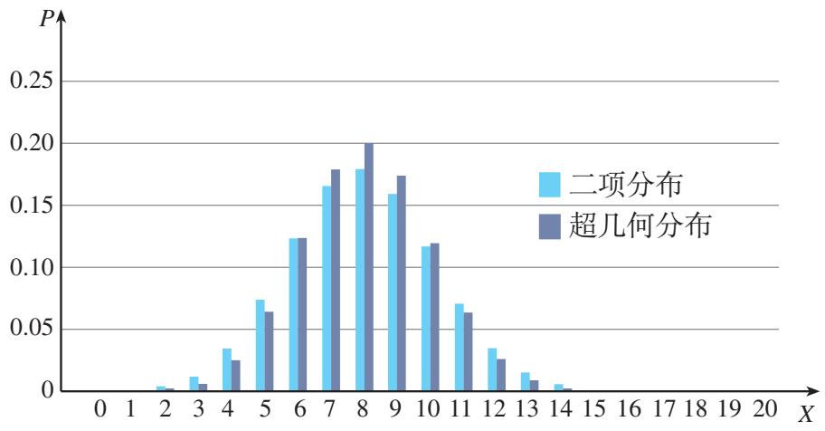

图7.4-4

二项分布和超几何分布都可以描述随机抽取的 $n$ 件产品中次品数的分布规律，并且二者的均值相同。对于不放回抽样，当 $n$ 远远小于 $N$ 时，每抽取一次后，对 $N$ 的影响很小，此时，超几何分布可以用二项分布近似。

#### 练习

1. 一箱24罐的饮料中4罐有奖券，每张奖券奖励饮料一罐，从中任意抽取2罐，求这2罐中有奖券的概率.  
2. 学校要从 12 名候选人中选 4 名同学组成学生会，已知有 4 名候选人来自甲班。假设每名候选人都有相同的机会被选到，求甲班恰有 2 名同学被选到的概率。  
3. 举出两个服从超几何分布的随机变量的例子.

## 习题7.4

### 复习巩固

1. 抛掷一枚骰子，当出现5点或6点时，就说这次试验成功，求在30次试验中成功次数 $X$ 的均值和方差.  
2. 若某射手每次射击击中目标的概率为0.9，每次射击的结果相互独立，则在他连续4次射击

中，恰好有一次未击中目标的概率是多大？

3. 如图，一个质点在随机外力的作用下，从原点0出发，每隔 $1\mathrm{s}$ 等可能地向左或向右移动一个单位，共移动6次．求下列事件的概率.

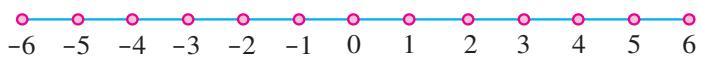

(第3题)
（1） 质点回到原点;   
（2） 质点位于 4 的位置.

4. 从一副不含大小王的 52 张扑克牌中任意抽出 5 张，求至少有 2 张 A 牌的概率（精确到 0.00001）.

### 综合运用

5. 某射手每次射击击中目标的概率为 0.8，共进行 10 次射击，求(精确到 0.01):
（1） 恰有 8 次击中目标的概率;  
（2） 至少有 8 次击中目标的概率.

6. 有一个摸奖游戏，在一个口袋中装有 10 个红球和 20 个白球，这些球除颜色外完全相同，一次从中摸出 5 个球，至少摸到 3 个红球就中奖。求中奖的概率(精确到 0.001)。  
7. 一个车间有 3 台车床，它们各自独立工作。设在一段时间内发生故障的车床数为 $X$ ，在下列两种情形下分别求 $X$ 的分布列。
（1）假设这3台车床型号相同，它们发生故障的概率都是20%；  
（2） 这 3 台车床中有 A 型号 2 台，B 型号 1 台，A 型车床发生故障的概率为 $10\%$ ，B 型车床发生故障的概率为 $20\%$ .

### 拓广探索

8. 某药厂研制一种新药，宣称对治疗某种疾病的有效率为 $90\%$ 。随机选择了10名患者，经过使用该药治疗后，治愈的人数不超过6人，你是否怀疑药厂的宣传？


## 探究与发现

### 二项分布的性质
设随机变量 $X \sim B(n, p)$ ，则 X 的分布列为
$P (X = k) = \mathrm{C} _ {n} ^ {k} p ^ {k} (1 - p) ^ {n - k}, k = 0, 1, \dots , n.$

对不同的 n 和 p 的值，绘制的概率分布图如图 1 所示.

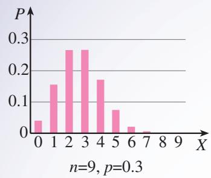

（1）

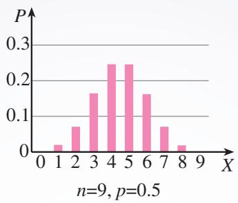

（2）

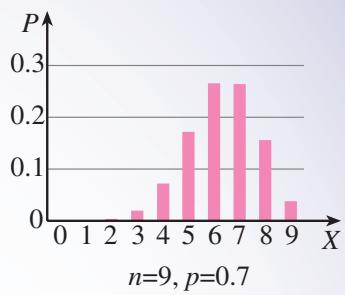

（3）

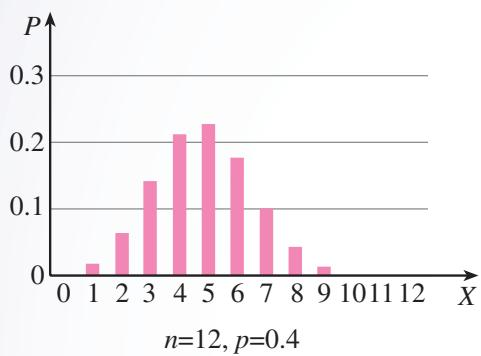

（4）

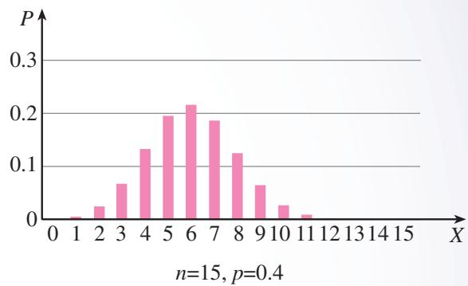

（5）   
图1

观察图形，类比函数性质的研究，你能发现二项分布的哪些性质？提出你的猜想.

记 $p_k = P(X = k)$ ，观察图形我们发现：当 $k$ 由0增大到 $n$ 时， $p_k$ 先增后减，在某一个(或两个) $k$ 值处达到最大。二项分布当 $p = 0.5$ 时是对称的，当 $p < 0.5$ 时向左偏倚，当 $p > 0.5$ 时向右偏倚。

下面，我们利用分布列的表达式来研究 $p_k$ 的增减变化及最大值.
$\begin{array}{l} \frac {p _ {k}}{p _ {k - 1}} = \frac {\mathrm{C} _ {n} ^ {k} p ^ {k} (1 - p) ^ {n - k}}{\mathrm{C} _ {n} ^ {k - 1} p ^ {k - 1} (1 - p) ^ {n - k + 1}} = \frac {(n - k + 1) p}{k (1 - p)} \\ = \frac {k (1 - p) + (n + 1) p - k}{k (1 - p)} = 1 + \frac {(n + 1) p - k}{k (1 - p)}. \\ \end{array}$
当 $k < (n + 1)p$ 时， $p_k > p_{k - 1}$ ， $p_k$ 随 $k$ 值的增加而增加；当 $k > (n + 1)p$ 时， $p_k < p_{k - 1}$ ， $p_k$ 随 $k$ 值的增加而减小.
如果 $(n + 1)p$ 为正整数，当 $k = (n + 1)p$ 时， $p_k = p_{k - 1}$ ，此时这两项概率均为最大值。如果 $(n + 1)p$ 为非整数，而 $k$ 取 $(n + 1)p$ 的整数部分，则 $p_k$ 是唯一的最大值。

对你发现的二项分布的其他性质，你能给出证明吗？

## 7.5 正态分布

现实中，除了前面已经研究过的离散型随机变量外，还有大量问题中的随机变量不是离散型的，它们的取值往往充满某个区间甚至整个实轴，但取一点的概率为0，我们称这类随机变量为连续型随机变量（continuous random variable）。下面我们看一个具体问题。

问题 自动流水线包装的食盐，每袋标准质量为 400 g. 由于各种不可控制的因素，任意抽取一袋食盐，它的质量与标准质量之间或多或少会存在一定的误差(实际质量减去标准质量). 用 X 表示这种误差，则 X 是一个连续型随机变量. 检测人员在一次产品检验中，随机抽取了 100 袋食盐，获得误差 X(单位：g) 的观测值如下：

<table><tr><td>-0.6</td><td>-1.4</td><td>-0.7</td><td>3.3</td><td>-2.9</td><td>-5.2</td><td>1.4</td><td>0.1</td><td>4.4</td><td>0.9</td></tr><tr><td>-2.6</td><td>-3.4</td><td>-0.7</td><td>-3.2</td><td>-1.7</td><td>2.9</td><td>0.6</td><td>1.7</td><td>2.9</td><td>1.2</td></tr><tr><td>0.5</td><td>-3.7</td><td>2.7</td><td>1.1</td><td>-3.0</td><td>-2.6</td><td>-1.9</td><td>1.7</td><td>2.6</td><td>0.4</td></tr><tr><td>2.6</td><td>-2.0</td><td>-0.2</td><td>1.8</td><td>-0.7</td><td>-1.3</td><td>-0.5</td><td>-1.3</td><td>0.2</td><td>-2.1</td></tr><tr><td>2.4</td><td>-1.5</td><td>-0.4</td><td>3.8</td><td>-0.1</td><td>1.5</td><td>0.3</td><td>-1.8</td><td>0.0</td><td>2.5</td></tr><tr><td>3.5</td><td>-4.2</td><td>-1.0</td><td>-0.2</td><td>0.1</td><td>0.9</td><td>1.1</td><td>2.2</td><td>0.9</td><td>-0.6</td></tr><tr><td>-4.4</td><td>-1.1</td><td>3.9</td><td>-1.0</td><td>-0.6</td><td>1.7</td><td>0.3</td><td>-2.4</td><td>-0.1</td><td>-1.7</td></tr><tr><td>-0.5</td><td>-0.8</td><td>1.7</td><td>1.4</td><td>4.4</td><td>1.2</td><td>-1.8</td><td>-3.1</td><td>-2.1</td><td>-1.6</td></tr><tr><td>2.2</td><td>0.3</td><td>4.8</td><td>-0.8</td><td>-3.5</td><td>-2.7</td><td>3.8</td><td>1.4</td><td>-3.5</td><td>-0.9</td></tr><tr><td>-2.2</td><td>-0.7</td><td>-1.3</td><td>1.5</td><td>-1.5</td><td>-2.2</td><td>1.0</td><td>1.3</td><td>1.7</td><td>-0.9</td></tr></table>
（1） 如何描述这 100 个样本误差数据的分布?  
（2） 如何构建适当的概率模型刻画误差 X 的分布?

根据已学的统计知识，可用频率分布直方图描述这组误差数据的分布，如图 7.5-1 所示。频率分布直方图中每个小矩形的面积表示误差落在相应区间内的频率，所有小矩形的面积之和为 1。

观察图形可知：误差观测值有正有负，并大致对称地分布在 X=0 的两侧，而且小误差比大误差出现得更频繁.

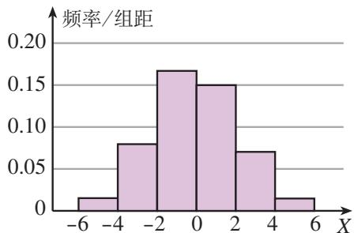

图7.5-1

随着样本数据量越来越大，让分组越来越多，组距越来越小，由频率的稳定性可知，频率分布直方图的轮廓就越来越稳定，接近一条光滑的钟形曲线，如图7.5-2所示.


图7.5-2


图7.5-3

根据频率与概率的关系，可用图7.5-3中的钟形曲线(曲线与水平轴之间的区域的面积为1)来描述袋装食盐质量误差的概率分布。例如，任意抽取一袋食盐，误差落在 $[-2, -1]$ 内的概率，可用图中黄色阴影部分的面积表示。
由函数知识可知，图7.5-3中的钟形曲线是一个函数。那么，这个函数是否存在解析式呢？

答案是肯定的. 在数学家的不懈努力下, 找到了以下刻画随机误差分布的解析式:
$f (x) = \frac {1}{\sigma \sqrt {2 \pi}} \mathrm{e} ^ {- \frac {(x - \mu) ^ {2}}{2 \sigma^ {2}}}, x \in \mathbf {R}.$

其中 $\mu\in R,\sigma>0$ 为参数.
显然，对任意的 $x \in R$ ， $f(x) > 0$ ，它的图象在 x 轴的上方。可以证明 x 轴和曲线之间的区域的面积为 1。我们称 $f(x)$ 为正态密度函数，称它的图象为正态密度曲线，简称正态曲线，如图 7.5-4 所示。若随机变量 X 的概率分布密度函数为 $f(x)$ ，则称随机变量 X 服从正态分布（normal distribution），记为 $X \sim N(\mu, \sigma^{2})$ 。特别地，当 $\mu = 0, \sigma = 1$ 时，称随机变量 X 服从标准正态分布。


图7.5-4

若 $X \sim N(\mu, \sigma^2)$ ，则如图7.5-4所示， $X$ 取值不超过 $x$ 的概率 $P(X \leqslant x)$ 为图中区域 $A$ 的面积，而 $P(a \leqslant X \leqslant b)$ 为图中区域 $B$ 的面积.

早在 1733 年，法国数学家棣莫弗（A. De Moivre，1667—1754）在研究二项概率的近似计算时，已提出了正态密度函数的形式，但当时只是作为一个数学表达式。直到德国数学家高斯（C. F. Gauss，1777—1855）提出“正态误差”的理论后，正态密度函数才取得“概率分布”的身份。因此，人们也称正态分布为高斯分布。
$P(X \leqslant x)$ 只能通过数值积分近似计算. 可以查正态分布表或利用计算机软件计算. Excel 中对应的函数为 NORM. DIST.

正态分布在概率和统计中占有重要地位，它广泛存在于自然现象、生产和生活实践之中。在现实生活中，很多随机变量都服从或近似服从正态分布。例如，某些物理量的测量误差，某一地区同年龄人群的身高、体重、肺活量等，一定条件下生长的小麦的株高、穗长、单位面积产量，自动流水线生产的各种产品的质量指标(如零件的尺寸、纤维的纤度、电容器的电容)，某地每年7月的平均气温、平均湿度、降水量等，一般都近似服从正态分布。

> [!observe] 观察
观察正态曲线及相应的密度函数，你能发现正态曲线的哪些特点？
由 $X$ 的密度函数及图象可以发现，正态曲线还有以下特点：
（1）曲线是单峰的，它关于直线 $x=\mu$ 对称；  
（2） 曲线在 $x=\mu$ 处达到峰值 $\frac{1}{\sigma\sqrt{2\pi}}$ ;  
（3）当 $|x|$ 无限增大时，曲线无限接近 $x$ 轴.

> [!think] 思考
一个正态分布由参数 $\mu$ 和 $\sigma$ 完全确定，这两个参数对正态曲线的形状有何影响？它们反映正态分布的哪些特征？

我们知道，函数 $y = f(x - \mu)$ 的图象可由 $y = f(x)$ 的图象平移得到。因此，在参数 $\sigma$ 取固定值时，正态曲线的位置由 $\mu$ 确定，且随着 $\mu$ 的变化而沿 $x$ 轴平移，如图7.5-5所示。


图7.5-5


图7.5-6
当 $\mu$ 取定值时，因为正态曲线的峰值 $\frac{1}{\sigma \sqrt{2\pi}}$ 与 $\sigma$ 成反比，而且对任意的 $\sigma > 0$ ，正态曲线与 $x$ 轴之间的区域的面积总为1．因此，当 $\sigma$ 较小时，峰值高，正态曲线“瘦高”，表示随机变量 $X$ 的分布比较集中；当 $\sigma$ 较大时，峰值低，正态曲线“矮胖”，表示随机变量 $X$ 的分布比较分散，如图7.5-6所示.

观察图7.5-5和图7.5-6可以发现，参数 $\mu$ 反映了正态分布的集中位置， $\sigma$ 反映了随机变量的分布相对于均值 $\mu$ 的离散程度。实际上，我们有

若 $X \sim N(\mu, \sigma^2)$ ，则 $E(X) = \mu$ ， $D(X) = \sigma^2$ .

在实际问题中，参数 $\mu, \sigma$ 可以分别用样本均值和样本标准差来估计.

例 李明上学有时坐公交车，有时骑自行车。他各记录了50次坐公交车和骑自行车所花的时间，经数据分析得到：坐公交车平均用时 $30\mathrm{min}$ ，样本方差为36；骑自行车平均用时 $34\mathrm{min}$ ，样本方差为4。假设坐公交车用时 $X$ 和骑自行车用时 $Y$ 都服从正态分布。
（1） 估计 X, Y 的分布中的参数;  
（2）根据（1）中的估计结果，利用信息技术工具画出 X 和 Y 的分布密度曲线；
（3）如果某天有 38 min 可用，李明应选择哪种交通工具？如果某天只有 34 min 可用，又应该选择哪种交通工具？请说明理由.
分析：对于第（1）问，正态分布由参数 $\mu$ 和 $\sigma$ 完全确定，根据正态分布参数的意义，可以分别用样本均值和样本标准差来估计。对于第（3）问，这是一个概率决策问题，首先要明确决策的准则，在给定的时间内选择不迟到概率大的交通工具；然后结合图形，根据概率的表示，比较概率的大小，作出判断。
解：（1）随机变量 $X$ 的样本均值为30，样本标准差为6；随机变量 $Y$ 的样本均值为34，样本标准差为2．用样本均值估计参数 $\mu$ ，用样本标准差估计参数 $\sigma$ ，可以得到
$X \sim N (3 0, 6 ^ {2}), Y \sim N (3 4, 2 ^ {2}).$
（2） X 和 Y 的分布密度曲线如图 7.5-7 所示.  
（3）应选择在给定时间内不迟到的概率大的交通工具。由图7.5-7可知，
$P (X \leqslant 3 8) <   P (Y \leqslant 3 8), P (X \leqslant 3 4) > P (Y \leqslant 3 4).$
所以，如果有 38 min 可用，那么骑自行车不迟到的概率大，应选择骑自行车；如果只有 34 min 可用，那么坐公交车不迟到的概率大，应选择坐公交车.


图7.5-7

假设 $X \sim N(\mu, \sigma^2)$ ，可以证明：对给定的 $k \in \mathbf{N}^*$ ， $P(\mu - k\sigma \leqslant X \leqslant \mu + k\sigma)$ 是一个只与 $k$ 有关的定值。特别地，
$P (\mu - \sigma \leqslant X \leqslant \mu + \sigma) \approx 0. 6 8 2 7,$
$P (\mu - 2 \sigma \leqslant X \leqslant \mu + 2 \sigma) \approx 0. 9 5 4 5,$
$P (\mu - 3 \sigma \leqslant X \leqslant \mu + 3 \sigma) \approx 0. 9 9 7 3.$

上述结果可用图 7.5-8 表示.
由此看到，尽管正态变量的取值范围是 $(-∞,+∞)$ ，但在一次试验中，X 的取值几乎总是落在区间 $\left[\mu-3σ,\mu+3σ\right]$ 内，而在此区间以外取值的概率大约只有 0.0027，通常认为这种情况几乎不可能发生。


图7.5-8

在实际应用中，通常认为服从于正态分布 $N(\mu, \sigma^2)$ 的随机变量 $X$ 只取 $[\mu - 3\sigma, \mu + 3\sigma]$ 中的值，这在统计学中称为 $3\sigma$ 原则.

#### 练习

1. 设随机变量 $X \sim N(0, 1)$ ，则 $X$ 的密度函数为 \_\_\_\_， $P(X \leqslant 0) =$ \_\_\_\_， $P(|X| \leqslant 1) =$ \_\_\_\_， $P(X \leqslant 1) =$ \_\_\_\_， $P(X > 1) =$ \_\_\_\_。（精确到 0.0001。）

2. 设随机变量 $X \sim N(0, 2^2)$ ，随机变量 $Y \sim N(0, 3^2)$ ，画出分布密度曲线草图，并指出 $P(X \leqslant -2)$ 与 $P(X \leqslant 2)$ 的关系，以及 $P(|X| \leqslant 1)$ 与 $P(|Y| \leqslant 1)$ 之间的大小关系.

3. 举出两个服从正态分布的随机变量的例子.

## 习题7.5

### 复习巩固

1. 对某地区数学考试成绩的数据分析，男生成绩 X 服从正态分布 $N(72, 8^{2})$ ，女生成绩 Y 服从正态分布 $N(74, 6^{2})$ 。请你从不同角度比较男生、女生的考试成绩。  
2. 某市高二年级男生的身高 X (单位: cm) 近似服从正态分布 $N(170, 5^{2})$ ，随机选择一名本市高二年级的男生，求下列事件的概率：
（1） $\{165 < X \leqslant 175\}$ ;
（2） $\{X\leqslant 165\}$
（3） $\{X > 175\}$ .

3. 若 $X \sim N(\mu, \sigma^{2})$ ，则 X 位于区域 $[\mu, \mu + \sigma]$ 内的概率是多少？

### 综合运用

4. 袋装食盐标准质量为 $400 \mathrm{~g}$ ，规定误差的绝对值不超过 $4 \mathrm{~g}$ 就认为合格。假设误差服从正态分布，随机抽取 100 袋食盐，误差的样本均值为 0，样本方差为 4。请你估计这批袋装食盐的合格率。


## 信息技术应用

# 概率分布图及概率计算

利用GeoGebra动态教学软件，可以画二项分布、超几何分布、正态分布等概率分布图，计算随机变量取值于某区间内的概率.

打开软件，进入 GeoGebra 的界面，点击右侧边框中的小三角，在显示的经典菜单中选择“概率统计”.

#### 1. 二项分布

选择二项分布，输入试验次数 $n = 20$ 及成功概率 $p = 0.5$ ，即 $B(20,0.5)$ 如图1，绘图区显示二项概率分布图，右侧显示分布列．输入随机变量的取值范围，窗口底部显示随机变量落在该范围的概率，例如
$P (8 \leqslant X \leqslant 1 2) = 0. 7 3 6 8.$


图1


图2

#### 2. 超几何分布

选择超几何分布，输入总体 N=100，M=10 及样本 n=30，即 h(30, 100, 10)。如图 2，绘图区显示超几何概率分布图，右侧显示分布列。输入随机变量的取值范围，窗口底部显示随机变量落在该范围的概率，例如
$P (1 \leqslant X \leqslant 5) = 0. 9 3 8 3.$

#### 3. 正态分布

选择正态分布，输入均值 $\mu = 0$ ，标准差 $\sigma = 1$ ，即 $N(0,1)$ .如图3，绘图区显示正态密度曲线图．输入随机变量的取值范围，窗口底部显示随机变量落在该范围的概率，例如
$P (- 1 \leqslant X \leqslant 1) = 0. 6 8 2 7,$
$P (- 2 \leqslant X \leqslant 2) = 0. 9 5 4 5,$
$P (- 3 \leqslant X \leqslant 3) = 0. 9 9 7 3.$


图3

通过窗口左下角的按钮，还可以求变量落在单边区间内的概率，例如
$P (X \leqslant 1. 5) = 0. 9 3 3 2.$

请你再选择一些正态分布 $N(\mu, \sigma^2)$ ，分别计算 $P(\mu - \sigma \leqslant X \leqslant \mu + \sigma)$ ， $P(\mu - 2\sigma \leqslant X \leqslant \mu + 2\sigma)$ ， $P(\mu - 3\sigma \leqslant X \leqslant \mu + 3\sigma)$ 的值，并总结这些值的规律。

## 小结

### 一、本章知识结构


### 二、回顾与思考

本章我们在已有概率学习的基础上，研究了在一个事件发生的条件下，求另一个事件发生的概率问题，从而得到了条件概率的计算方法。这一方法的基本思想是利用一些已知条件，通过缩小样本空间的方法计算概率。利用条件概率，我们得到了一般的概率乘法公式。特别地，当两个事件相互独立时，乘法公式就是求两个独立事件的积事件的概率公式。有了这些知识，当我们面对一个复杂事件时，就可以先把它表示为一些简单事件运算的结果，再利用概率的加法公式和乘法公式计算出复杂事件的概率。这是全概率公式蕴含的数学思想方法，体现了利用研究对象的性质探寻解决问题的方法、将复杂问题化归为简单问题的数学思想。

在古典概型的学习中我们发现，为了计算随机事件的概率，往往需要为不同背景的问题建立不同的样本空间，这样“单个地”处理问题显然是麻烦而不经济的。类似于引入函数概念，通过函数描述现实世界中变量关系和规律一样，本章我们先引入随机变量的概念，建立起样本空间到实数集的对应关系，为随机事件的表示带来方便；然后再引入分布列概念，建立起随机变量取值与其概率的对应关系。有了随机变量及其分布列的概念，就可以将不同背景的概率问题转化为统一的数学问题，从而为我们利用各种数学工具，系统、全面地研究随机现象的规律奠定基础。

本章的学习中，我们重点关注了随机变量的分布列和数字特征。分布列全面彻底地刻画了随机变量的取值规律；均值和方差是随机变量的两个重要的数字特征，均值反映了随机变量取值的平均水平，而方差反映了随机变量取值的离散程度，它们在推断随机现象的规律进而作出决策中有重要作用.

在函数的学习中我们有这样的经验：通过学习幂函数、指数函数、对数函数、三角函数等基本函数类，不仅加深了对一般函数概念的理解，而且奠定了建立适当的函数模型解决不同类型实际问题的数学基础。类似地，我们通过研究二项分布、超几何分布等离散型随机变量的分布，以及正态分布这一连续型随机变量的分布，不仅进一步理解了随机变量在描述随机现象中的作用，而且对随机思想在解决实际问题中的作用也有了更深入的理解。

请你带着下面的问题，复习一下全章的内容吧！

1. 两个随机事件的独立性和条件概率有什么关系？  
2. 用全概率公式求一个复杂事件的概率的思路是什么？  
3. 离散型随机变量的分布列与样本频率分布有什么联系与区别？  
4. 离散型随机变量的均值与方差的意义和作用是什么？它们与随机变量的观测值的平均值和方差的联系与区别是什么？  
5. 归纳二项分布模型的特征。有人说：“随机掷一枚质地均匀的硬币，出现正面的概率是0.5。因此，随机抛掷100次硬币，出现50次正面的可能性应该也是0.5。”你认为正确吗？为什么？  
6. 离散型随机变量的分布规律与服从正态分布的随机变量的分布规律的区别是什么？

## 复习参考题7

### 复习巩固

1. 举例说明 $P(B)$ 与 $P(B|A)$ 没有确定的大小关系.  
2. 抛掷两枚质地均匀的骰子，求：
（1） 两个点数都出现偶数的概率;
（2）已知第一枚骰子的点数是偶数的条件下，第二枚骰子的点数也是偶数的概率.

3. 假设有两箱零件，第一箱内装有10件，其中有2件次品；第二箱内装有20件，其中有3件次品。现从两箱中随意挑选一箱，然后从该箱中随机取1个零件。
（1）求取出的零件是次品的概率；  
\* （2） 已知取出的是次品，求它是从第一箱取出的概率.

4. 已知离散型随机变量 X 的分布列如下表所示.

<table><tr><td>X</td><td>0</td><td>1</td><td>2</td></tr><tr><td>P</td><td>0.36</td><td> $1-2q$ </td><td> $q^{2}$ </td></tr></table>

求：（1）常数 $q$ 的值； （2） $E(X)$ 和 $D(X)$

5. 已知随机变量 X 取所有的值 1, 2, …, n 是等可能的，且 $E(X)=10$ ，求 n 的值.  
6. 已知每门大炮击中目标的概率都是 0.3，现在 n 门大炮同时对某一目标各射击一次.
（1）当 n=10 时，求恰好击中目标 3 次的概率（精确到 0.001）；
（2） 如果使目标至少被击中一次的概率超过 95%，至少需要多少门大炮？

### 综合运用

7. 长时间玩手机可能影响视力。据调查，某校学生大约 $40\%$ 的人近视，而该校大约有 $20\%$ 的学生每天玩手机超过 $1\mathrm{h}$ ，这些人的近视率约为 $50\%$ 。现从每天玩手机不超过 $1\mathrm{h}$ 的学生中任意调查一名学生，求他近视的概率。  
8. 某商场要在国庆节开展促销活动，促销活动可以在商场内举行，也可以在商场外举行。统计资料表明，每年国庆节商场内的促销活动可获得利润 2 万元；商场外的促销活动，如果不遇到有雨天气可获得利润 8 万元，如果遇到有雨天气则会带来经济损失 3 万元。9 月 30 日气象台预报国庆节当地的降水概率是 40%，商场应该选择哪种促销方式？  
9. 假设一份某种意外伤害保险费为 20 元，每次赔付金额为 50 万元。一家保险公司一年能销售 10 万份保单，而每一份保单需要赔付的概率为 $10^{-5}$ 。利用计算工具求（精确到 0.0001）：
（1）这家保险公司在这个险种上亏本的概率；  
（2） 这家保险公司在这个险种上一年内获利不少于 100 万元的概率.

### 拓广探索

10. 甲、乙、丙三人相互做传球训练，第1次由甲将球传出，每次传球时，传球者都等可能地将球传给另外两个人中的任何一人。求 $n$ 次传球后球在甲手中的概率。  
11. 某单位有 10 000 名职工，想通过验血的方法筛查乙肝病毒携带者。假设每人携带乙肝病毒的概率为 5%，如果对每人的血样逐一化验，就需要化验 10 000 次。统计专家提出了一种化验方法：随机地按 5 人一组分组，然后将各组 5 人的血样混合再化验。如果混合血样呈阴性，说明这 5 人全部阴性；如果混合血样呈阳性，说明其中至少有一人的血样呈阳性，就需要对每人再分别化验一次。
（1） 按照这种化验方法能减少化验次数吗?   
（2）如果每人携带乙肝病毒的概率为 $2\%$ ，按照 $k$ 人一组， $k$ 取多大时化验次数最少？

12. 某城市高中数学统考，假设考试成绩服从正态分布 $N(75, 8^2)$ 。如果按照 $16\%$ ， $34\%$ ， $34\%$ ， $16\%$ 的比例将考试成绩分为 A，B，C，D 四个等级，试确定各等级的分数线（精确到 1）。

# 第八章 成对数据的统计分析

在必修课程中，我们学习了单个变量的观测数据的直观表示和统计特征的刻画等知识与方法。例如，用直方图描述样本数据的分布规律，用均值刻画样本数据的集中趋势，用方差刻画样本数据的离散程度等。这些方法主要适用于通过样本认识单个变量的统计规律。在现实中，我们还经常需要了解两个或两个以上变量之间的关系。例如，教育部门为掌握学生身体健康状况，需要了解身高变量和体重变量之间的关系；医疗卫生部门要制定预防青少年近视的措施，需要了解有哪些因素会影响视力，以及这些因素是如何影响视力的；商家要根据顾客的意见改进服务水平，希望了解哪些因素影响服务水平，以及这些因素是如何起作用的；等等。为此，我们需要进一步学习通过样本推断变量之间关系的知识和方法。

本章的学习内容有成对数据的统计相关性、一元线性回归模型和 $2 \times 2$ 列联表等，这些知识与方法在解决实际问题中非常有用。可以发现，两个随机变量的相关性可以通过成对样本数据进行分析；利用一元线性回归模型可以研究变量之间的随机关系，进行预测；利用 $2 \times 2$ 列联表可以检验两个随机变量的独立性。本章的学习对于提高我们解决实际问题的能力，提升数据分析、数学建模等素养都是非常有帮助的。


## 8.1 成对数据的统计相关性

我们知道，如果变量 $y$ 是变量 $x$ 的函数，那么由 $x$ 就可以唯一确定 $y$ 。然而，现实世界中还存在这样的情况：两个变量之间有关系，但密切程度又达不到函数关系的程度。例如，人的体重与身高存在关系，但由一个人的身高值并不能确定他的体重值。那么，该如何刻画这两个变量之间的关系呢？下面我们就来研究这个问题。

### 8.1.1 变量的相关关系

我们知道，一个人的体重与他的身高有关系。一般而言，个子高的人往往体重值较大，个子矮的人往往体重值较小。但身高并不是决定体重的唯一因素，例如生活中的饮食习惯、体育锻炼、睡眠时间以及遗传因素等也是影响体重的重要因素。像这样，两个变量有关系，但又没有确切到可由其中的一个去精确地决定另一个的程度，这种关系称为相关关系（correlation）。

两个变量具有相关关系的事例在现实中大量存在．例如：

1. 子女身高 $y$ 与父亲身高 $x$ 之间的关系。一般来说，父亲的个子高，其子女的个子也会比较高；父亲个子矮，其子女的个子也会比较矮。但影响子女身高的因素，除父亲身高外还有其他因素，例如母亲身高、饮食结构、体育锻炼等，因此父亲身高又不能完全决定子女身高。  
2. 商品销售收入 $y$ 与广告支出 $x$ 之间的关系。一般来说，广告支出越多，商品销售收入越高。但广告支出并不是决定商品销售收入的唯一因素，商品销售收入还与商品质量、居民收入等因素有关。  
3. 空气污染指数 $y$ 与汽车保有量 $x$ 之间的关系。一般来说，汽车保有量增加，空气污染指数会上升。但汽车保有量并不是造成空气污染的唯一因素，气象条件、工业废气排放、居民生活和取暖、垃圾焚烧等都是影响空气污染指数的因素。  
4. 粮食亩产量 $y$ 与施肥量 $x$ 之间的关系。在一定范围内，施肥量越大，粮食亩产量就越高。但施肥量并不是决定粮食亩产量的唯一因素，粮食亩产量还要受到土壤质量、降水量、田间管理水平等因素的影响。
因为在相关关系中，变量 $y$ 的值不能随变量 $x$ 的值的确定而唯一确定，所以我们无法直接用函数去描述变量之间的这种关系。对上述各例中两个变量之间的相关关系，我们往往会根据自己以往积累的经验作出推断。“经验之中有规律”，经验的确可以为我们的决策提供一定的依据，但仅凭经验推断又有不足。例如，不同经验的人对同一情形可能会得出不同结论，不是所有的情形都有经验可循等。因此，在研究两个变量之间的相关关系时，我们需要借助数据说话，即通过样本数据分析，从数据中提取信息，并构建适当的模型，再利用模型进行估计或推断。

> [!explore] 探究
在对人体的脂肪含量和年龄之间关系的研究中，科研人员获得了一些年龄和脂肪含量的简单随机样本数据，如表8.1-1所示。表中每个编号下的年龄和脂肪含量数据都是对同一个体的观测结果，它们构成了成对数据。

表 8.1-1

<table><tr><td>编号</td><td>1</td><td>2</td><td>3</td><td>4</td><td>5</td><td>6</td><td>7</td></tr><tr><td>年龄/岁</td><td>23</td><td>27</td><td>39</td><td>41</td><td>45</td><td>49</td><td>50</td></tr><tr><td>脂肪含量/%</td><td>9.5</td><td>17.8</td><td>21.2</td><td>25.9</td><td>27.5</td><td>26.3</td><td>28.2</td></tr><tr><td>编号</td><td>8</td><td>9</td><td>10</td><td>11</td><td>12</td><td>13</td><td>14</td></tr><tr><td>年龄/岁</td><td>53</td><td>54</td><td>56</td><td>57</td><td>58</td><td>60</td><td>61</td></tr><tr><td>脂肪含量/%</td><td>29.6</td><td>30.2</td><td>31.4</td><td>30.8</td><td>33.5</td><td>35.2</td><td>34.6</td></tr></table>

根据以上数据，你能推断人体的脂肪含量与年龄之间存在怎样的关系吗？

为了更加直观地描述上述成对样本数据中脂肪含量与年龄之间的关系，类似于用直方图描述单个变量样本数据的分布特征，我们用图形展示成对样本数据的变化特征。用横轴表示年龄，纵轴表示脂肪含量，则表8.1-1中每个编号下的成对样本数据都可用直角坐标系中的点表示出来，由这些点组成了如图8.1-1所示的统计图。我们把这样的统计图叫做散点图（scatter plot）。


图8.1-1

利用统计软件画散点图，有些电子表格软件可以通过插入图表，从图表类型中选取散点图；R 软件可以用函数 plot.

观察图 8.1-1，可以发现，这些散点大致落在一条从左下角到右上角的直线附近，表明随年龄值的增加，相应的脂肪含量值呈现增加的趋势。这样，由成对样本数据的分布规律，我们可以推断脂肪含量变量和年龄变量之间存在着相关关系。

从整体上看，当一个变量的值增加时，另一个变量的相应值也呈现增加的趋势，我们就称这两个变量正相关（positive correlation）；当一个变量的值增加时，另一个变量的相应值呈现减小的趋势，则称这两个变量负相关（negative correlation）。
由图 8.1-1，能够推断脂肪含量与年龄这两个变量正相关.

> [!think] 思考
（1） 两个变量负相关时，成对样本数据的散点图有什么特点？  
（2） 你能举出生活中两个变量正相关或负相关的一些例子吗?

散点图是描述成对数据之间关系的一种直观方法。观察散点图8.1-1，从中我们不仅可以大致看出脂肪含量和年龄呈现正相关，而且从整体上可以看出散点落在某条直线附近。一般地，如果两个变量的取值呈现正相关或负相关，而且散点落在一条直线附近，我们就称这两个变量线性相关。

观察散点图 8.1-2，我们发现：图（1）中的散点落在某条曲线附近，而不是落在一条直线附近，说明这两个变量具有相关性，但不是线性相关；类似地，图（2）中的散点落在一条折线附近，这两个变量也具有相关性，但它们既不是正相关，也不是负相关；图（3）中的散点杂乱无章，无规律可言，看不出这两个变量有什么相关性。


（1）


（2）


（3）   
图8.1-2

一般地，如果两个变量具有相关性，但不是线性相关，那么我们就称这两个变量非线性相关或曲线相关.

#### 练习

1. 举例说明什么叫相关关系。相关关系与函数关系有什么区别？  
2. 根据下面的散点图，推断图中的两个变量是否存在相关关系.


（1）


（2）


（3）


（4）   
(第2题)

3. 下表给出了一些地区的鸟的种类数与该地区的海拔高度的数据，鸟的种类数与海拔高度是否存在相关关系？如果是，那么这种相关关系有什么特点？

<table><tr><td>地区</td><td>A</td><td>B</td><td>C</td><td>D</td><td>E</td><td>F</td><td>G</td><td>H</td><td>I</td><td>J</td><td>K</td></tr><tr><td>海拔高度/m</td><td>1 250</td><td>1 158</td><td>1 067</td><td>457</td><td>701</td><td>731</td><td>610</td><td>670</td><td>1 493</td><td>762</td><td>549</td></tr><tr><td>鸟的种类/种</td><td>36</td><td>30</td><td>37</td><td>11</td><td>11</td><td>13</td><td>17</td><td>13</td><td>29</td><td>4</td><td>15</td></tr></table>

### 8.1.2 样本相关系数

通过观察散点图中成对样本数据的分布规律，我们可以大致推断两个变量是否存在相关关系、是正相关还是负相关、是线性相关还是非线性相关等。散点图虽然直观，但无法确切地反映成对样本数据的相关程度，也就无法量化两个变量之间相关程度的大小。能否像引入均值、方差等数字特征对单个变量数据进行分析那样，引入一个适当的“数字特征”，对成对样本数据的相关程度进行定量分析呢？

对于变量 x 和变量 y，设经过随机抽样获得的成对样本数据为 $(x_{1}, y_{1})$ ， $(x_{2}, y_{2})$ ， $\cdots$ ， $(x_{n}, y_{n})$ ，其中 $x_{1}, x_{2}, \cdots, x_{n}$ 和 $y_{1}, y_{2}, \cdots, y_{n}$ 的均值分别为 $\overline{x}$ 和 $\overline{y}$ 。为了刻画每个变量的观测数据相对其均值的增减情况，将每个变量的观测数据减去其均值，得到成对数据为
$\left(x _ {1} - \bar {x}, y _ {1} - \bar {y}\right), \left(x _ {2} - \bar {x}, y _ {2} - \bar {y}\right), \dots , \left(x _ {n} - \bar {x}, y _ {n} - \bar {y}\right),$

并绘制散点图.

利用上述方法处理表8.1-1中的数据，得到图8.1-3．我们发现，这时的散点大多数分布在第一象限、第三象限，大多数散点的横、纵坐标同号．显然，这样的规律是由人体脂肪含量与年龄正相关所决定的.


图8.1-3

一般地，如果变量 $x$ 和 $y$ 正相关，那么关于均值平移后的大多数散点将分布在第一象限、第三象限，对应的成对数据同号的居多，如图8.1-4（1）所示；如果变量 $x$ 和 $y$ 负相关，那么关于均值平移后的大多数散点将分布在第二象限、第四象限，对应的成对数据异号的居多，如图8.1-4（2）所示.


（1）


（2）   
图8.1-4

> [!think] 思考
根据上述分析，你能利用正相关变量和负相关变量的成对样本数据平移后呈现的规律，构造一个度量成对样本数据是正相关还是负相关的数字特征吗？

从上述讨论得到启发，利用散点 $(x_{i}-\overline{x},y_{i}-\overline{y})$ （ $i=1,2,\cdots,n$ ）的横、纵坐标是否同号，可以构造一个量
$L _ {x y} = \frac {1}{n} \left[ \left(x _ {1} - \bar {x}\right) \left(y _ {1} - \bar {y}\right) + \left(x _ {2} - \bar {x}\right) \left(y _ {2} - \bar {y}\right) + \dots + \left(x _ {n} - \bar {x}\right) \left(y _ {n} - \bar {y}\right) \right].$

一般情形下， $L_{xy}>0$ 表明成对样本数据正相关； $L_{xy}<0$ 表明成对样本数据负相关.

> [!think] 思考
你认为 $L_{xy}$ 的大小一定能度量出成对样本数据的相关程度吗？
因为 $L_{xy}$ 的大小与数据的度量单位有关，所以不宜直接用它度量成对样本数据相关程度的大小。例如，在研究体重与身高之间的相关程度时，如果体重的单位不变，把身高的单位由米改为厘米，则相应的 $L_{xy}$ 将变为原来的 100 倍，但单位的改变并不会导致体重与身高之间相关程度的改变。

为了消除度量单位的影响，需要对数据作进一步的“标准化”处理. 我们用
$s _ {x} = \sqrt {\frac {1}{n} \sum_ {i = 1} ^ {n} (x _ {i} - \overline {{{{x}}}}) ^ {2}}, s _ {y} = \sqrt {\frac {1}{n} \sum_ {i = 1} ^ {n} (y _ {i} - \overline {{{{y}}}}) ^ {2}}$

分别除 $x_{i}-\overline{x}$ 和 $y_{i}-\overline{y}(i=1,2,\cdots,n)$ ，得
$\left(\frac {x _ {1} - \overline {{x}}}{s _ {x}}, \frac {y _ {1} - \overline {{y}}}{s _ {y}}\right), \left(\frac {x _ {2} - \overline {{x}}}{s _ {x}}, \frac {y _ {2} - \overline {{y}}}{s _ {y}}\right), \dots , \left(\frac {x _ {n} - \overline {{x}}}{s _ {x}}, \frac {y _ {n} - \overline {{y}}}{s _ {y}}\right).$

为简单起见，把上述“标准化”处理后的成对数据分别记为
$\left(x _ {1} ^ {'}, y _ {1} ^ {'}\right), \left(x _ {2} ^ {'}, y _ {2} ^ {'}\right), \dots , \left(x _ {n} ^ {'}, y _ {n} ^ {'}\right),$

仿照 $L_{xy}$ 的构造，可以得到
$\begin{array}{l} r = \frac {1}{n} (x _ {1} ^ {'} y _ {1} ^ {'} + x _ {2} ^ {'} y _ {2} ^ {'} + \dots + x _ {n} ^ {'} y _ {n} ^ {'}) \\ = \frac {\sum_ {i = 1} ^ {n} (x _ {i} - \overline {{{x}}}) (y _ {i} - \overline {{{y}}})}{\sqrt {\sum_ {i = 1} ^ {n} (x _ {i} - \overline {{{x}}}) ^ {2}} \sqrt {\sum_ {i = 1} ^ {n} (y _ {i} - \overline {{{y}}}) ^ {2}}}. \tag {1} \\ \end{array}$

我们称 r 为变量 x 和变量 y 的样本相关系数（sample correlation coefficient）.

这样，我们利用成对样本数据构造了样本相关系数 $r$ 。样本相关系数 $r$ 是一个描述成对样本数据的数字特征，它的正负性可以反映成对样本数据的变化特征：
当 $r > 0$ 时，称成对样本数据正相关。这时，当其中一个数据的值变小时，另一个数据的值通常也变小；当其中一个数据的值变大时，另一个数据的值通常也变大。
当 $r < 0$ 时，称成对样本数据负相关。这时，当其中一个数据的值变小时，另一个数据的值通常会变大；当其中一个数据的值变大时，另一个数据的值通常会变小。

那么，样本相关系数 $r$ 的大小与成对样本数据的相关程度有什么内在联系呢？为此，我们先考察一下 $r$ 的取值范围.

观察 r 的结构，联想到二维（平面）向量、三维（空间）向量数量积的坐标表示，我们将向量的维数推广到 n 维，n 维向量 a，b 的数量积仍然定义为
$\boldsymbol {a} \cdot \boldsymbol {b} = | \boldsymbol {a} | | \boldsymbol {b} | \cos \theta ,$

其中 $\theta$ 为向量 $a, b$ 的夹角. 类似于平面或空间向量的坐标表示, 对于向量 $a = (a_{1}, a_{2},$
$\cdots, a_{n}$ 和 $\boldsymbol{b}=(b_{1}, b_{2}, \cdots, b_{n})$ ，我们有
$\boldsymbol {a} \cdot \boldsymbol {b} = a _ {1} b _ {1} + a _ {2} b _ {2} + \dots + a _ {n} b _ {n}.$
设 “标准化” 处理后的成对数据 $(x_{1}', y_{1}')$ ， $(x_{2}', y_{2}')$ ，…， $(x_{n}', y_{n}')$ 的第一分量构成 n 维向量
$\boldsymbol {x} ^ {'} = \left(x _ {1} ^ {'}, x _ {2} ^ {'}, \dots , x _ {n} ^ {'}\right),$

第二分量构成 $n$ 维向量
$\mathbf {y} ^ {'} = \left(y _ {1} ^ {'}, y _ {2} ^ {'}, \dots , y _ {n} ^ {'}\right),$

则有
$r = \frac {1}{n} \boldsymbol {x} ^ {'} \cdot \boldsymbol {y} ^ {'} = \frac {1}{n} | \boldsymbol {x} ^ {'} | | \boldsymbol {y} ^ {'} | \cos \theta .$
因为 $|\mathbf{x}'| = |\mathbf{y}'| = \sqrt{n}$ ，所以样本相关系数
$r = \cos \theta ,$

其中 $\theta$ 为向量 $x'$ 和向量 $y'$ 的夹角.
由 $-1 \leqslant \cos \theta \leqslant 1$ ，可知
$- 1 \leqslant r \leqslant 1.$

> [!think] 思考
当 $|r|=1$ 时，成对样本数据之间具有怎样的关系呢？
当 $|r|=1$ 时， $r=\cos\theta$ 中的 $\theta=0$ 或 $\pi$ ，向量 $x'$ 和 $y'$ 共线。由向量的知识可知，存在实数 $\lambda$ ，使得 $y'=λx'$ ，即
$\frac {y _ {i} - \overline {{{{y}}}}}{s _ {y}} = \lambda \frac {x _ {i} - \overline {{{{x}}}}}{s _ {x}}, i = 1, 2, \dots , n.$

这表明成对样本数据 $(x_{i},y_{i})$ 都落在直线
$y - \overline {{y}} = \frac {\lambda s _ {y}}{s _ {x}} (x - \overline {{x}})$

上．这时，成对样本数据的两个分量之间满足一种线性关系.
由此可见，样本相关系数 r 的取值范围为 $[-1, 1]$ . 样本相关系数 r 的绝对值大小可以反映成对样本数据之间线性相关的程度：
当 $|r|$ 越接近1时，成对样本数据的线性相关程度越强；
当 $|r|$ 越接近0时，成对样本数据的线性相关程度越弱.

样本相关系数 r 有时也称样本线性相关系数， $|r|$ 刻画了样本点集中于某条直线的程度。当 r=0 时，只表明成对样本数据间没有线性相关关系，但不排除它们之间有其他相关关系。

图 8.1-5 是不同成对样本数据的散点图和相应的样本相关系数。图（1）中的散点有明显的从左下角到右上角沿直线分布的趋势，说明成对样本数据呈现出线性相关关系；样本相关系数 r=0.97，表明成对样本数据的正线性相关程度很强。图（2）中的散点有明显的从左上角到右下角沿直线分布的趋势，说明成对样本数据也呈现出线性相关关系；样本相关系数 $r = -0.85$ ，表明成对样本数据的负线性相关程度比较强。从样本相关系数来看，图（1）中成对样本数据的线性相关程度要比图（2）中强一些；图（3）和图（4）中的成对样本数据的线性相关程度很弱，其中图（4）中成对样本数据的线性相关程度极弱。


（1）


（2）


（3）


（4）   
图8.1-5

综上可知，两个随机变量的相关性可以通过成对样本数据进行分析，而样本相关系数 $r$ 可以反映两个随机变量之间的线性相关程度： $r$ 的符号反映了相关关系的正负性； $|r|$ 的大小反映了两个变量线性相关的程度，即散点集中于一条直线的程度.

在有限总体中，若要确切地了解两个变量之间相关关系的正负性及线性相关的程度，我们可以利用这两个变量取值的所有成对数据，通过公式（1）就可以计算出两个变量的相关系数。例如，要确切了解脂肪含量 $y$ 与年龄 $x$ 的线性相关程度，需要调查所有人的年龄及其脂肪含量，再将得到的成对数据代入公式（1），计算出相关系数。这个相关系数就能确切地反映变量之间的相关程度。

不过，在实际中，获得总体中所有的成对数据往往是不容易的。因此，我们还是要用样本估计总体的思想来解决问题。也就是说，我们先要通过抽样获取两个变量的一些成对样本数据，再计算出样本相关系数，通过样本相关系数去估计总体相关系数，从而了解两个变量之间的相关程度。对于简单随机样本而言，样本具有随机性，因此样本相关系数 $r$ 也具有随机性。一般地，样本容量越大，用样本相关系数估计两个变量的相关系数的效果越好。

> [!example]- 例 1 根据表 8.1-1 中脂肪含量和年龄的样本数据，推断两个变量是否线性相关，计算样本相关系数，并推断它们的相关程度.
解：先画出散点图，如图8.1-1所示．观察散点图，可以看出样本点都集中在一条直线附近，由此推断脂肪含量和年龄线性相关.

根据样本相关系数的定义，
$r = \frac {\sum_ {i = 1} ^ {1 4} (x _ {i} - \overline {{x}}) (y _ {i} - \overline {{y}})}{\sqrt {\sum_ {i = 1} ^ {1 4} (x _ {i} - \overline {{x}}) ^ {2}} \sqrt {\sum_ {i = 1} ^ {1 4} (y _ {i} - \overline {{y}}) ^ {2}}} = \frac {\sum_ {i = 1} ^ {1 4} x _ {i} y _ {i} - 1 4 \overline {{x}} \overline {{y}}}\sqrt {\sum_ {i = 1} ^ {1 4} x _ {i} ^ {2} - 1 4 \overline {{x}} ^ {2}} \sqrt {\sum_ {i = 1} ^ {1 4} y _ {i} ^ {2} - 1 4 \overline {{y}} ^ {2}}. \tag {①}$

利用计算工具计算可得
$\overline {{{x}}} \approx 4 8. 0 7, \overline {{{y}}} \approx 2 7. 2 6, \sum_ {i = 1} ^ {1 4} x _ {i} y _ {i} = 1 9 4 0 3. 2,$
$\sum_ {i = 1} ^ {1 4} x _ {i} ^ {2} = 3 4 1 8 1, \sum_ {i = 1} ^ {1 4} y _ {i} ^ {2} = 1 1 0 5 1. 7 7.$

代入 ① 式，得

利用统计软件计算样本相关系数，有些电子表格软件用函数 CORREL；R 软件用函数 cor.
$r \approx \frac {1 9 4 0 3 . 2 - 1 4 \times 4 8 . 0 7 \times 2 7 . 2 6}{\sqrt {3 4 1 8 1 - 1 4 \times 4 8 . 0 7 ^ {2}} \times \sqrt {1 1 0 5 1 . 7 7 - 1 4 \times 2 7 . 2 6 ^ {2}}} \approx 0. 9 7.$
由样本相关系数 $r \approx 0.97$ ，可以推断脂肪含量和年龄这两个变量正线性相关，且相关程度很强.

> [!example]- 例 2 有人收集了某城市居民年收入（所有居民在一年内收入的总和）与 A 商品销售额的 10 年数据，如表 8.1-2 所示.
表8.1-2

<table><tr><td>第n年</td><td>1</td><td>2</td><td>3</td><td>4</td><td>5</td><td>6</td><td>7</td><td>8</td><td>9</td><td>10</td></tr><tr><td>居民年收入/亿元</td><td>32.2</td><td>31.1</td><td>32.9</td><td>35.8</td><td>37.1</td><td>38.0</td><td>39.0</td><td>43.0</td><td>44.6</td><td>46.0</td></tr><tr><td>A商品销售额/万元</td><td>25.0</td><td>30.0</td><td>34.0</td><td>37.0</td><td>39.0</td><td>41.0</td><td>42.0</td><td>44.0</td><td>48.0</td><td>51.0</td></tr></table>

画出散点图，推断成对样本数据是否线性相关，并通过样本相关系数推断 A 商品销售额与居民年收入的相关程度和变化趋势的异同.
解：画出成对样本数据的散点图，如图8.1-6所示。从散点图看，A商品销售额与居民年收入的样本数据呈现出线性相关关系。


图8.1-6
由样本数据计算得样本相关系数 $r \approx 0.95$ 。由此可以推断，A 商品销售额与居民年收入正线性相关，即 A 商品销售额与居民年收入有相同的变化趋势，且相关程度很强。

> [!example]- 例 3 在某校高一年级中随机抽取 25 名男生，测得他们的身高、体重、臂展等数据，如表 8.1-3 所示.
表8.1-3

<table><tr><td>编号</td><td>身高/ cm</td><td>体重/kg</td><td>臂展/ cm</td><td>编号</td><td>身高/ cm</td><td>体重/kg</td><td>臂展/ cm</td></tr><tr><td>1</td><td>173</td><td>55</td><td>169</td><td>14</td><td>166</td><td>66</td><td>161</td></tr><tr><td>2</td><td>179</td><td>71</td><td>170</td><td>15</td><td>176</td><td>61</td><td>166</td></tr><tr><td>3</td><td>175</td><td>52</td><td>172</td><td>16</td><td>176</td><td>49</td><td>165</td></tr><tr><td>4</td><td>179</td><td>62</td><td>177</td><td>17</td><td>175</td><td>60</td><td>173</td></tr><tr><td>5</td><td>182</td><td>82</td><td>174</td><td>18</td><td>169</td><td>48</td><td>162</td></tr><tr><td>6</td><td>173</td><td>63</td><td>166</td><td>19</td><td>184</td><td>86</td><td>189</td></tr><tr><td>7</td><td>180</td><td>55</td><td>174</td><td>20</td><td>169</td><td>58</td><td>164</td></tr><tr><td>8</td><td>170</td><td>81</td><td>169</td><td>21</td><td>182</td><td>54</td><td>170</td></tr><tr><td>9</td><td>169</td><td>54</td><td>166</td><td>22</td><td>171</td><td>58</td><td>164</td></tr><tr><td>10</td><td>177</td><td>54</td><td>176</td><td>23</td><td>177</td><td>61</td><td>173</td></tr><tr><td>11</td><td>177</td><td>59</td><td>170</td><td>24</td><td>173</td><td>58</td><td>165</td></tr><tr><td>12</td><td>178</td><td>67</td><td>174</td><td>25</td><td>173</td><td>51</td><td>169</td></tr><tr><td>13</td><td>174</td><td>56</td><td>170</td><td></td><td></td><td></td><td></td></tr></table>

体重与身高、臂展与身高分别具有怎样的相关性？
解：根据样本数据画出体重与身高、臂展与身高的散点图，分别如图 8.1-7(1) 和 （2） 所示，两个散点图都呈现出线性相关的特征.


图8.1-7

通过计算得到体重与身高、臂展与身高的样本相关系数分别约为0.34和0.78，都为正线性相关。其中，臂展与身高的相关程度更高。

#### 练习

1. 由简单随机抽样得到的成对样本数据的样本相关系数是否一定能确切地反映变量之间的相关关系？为什么？  
2. 已知变量 $x$ 和变量 $y$ 的 3 对随机观测数据（2，2），（3，-1），（5，-7），计算成对样本数据的样本相关系数。能据此推断这两个变量线性相关吗？为什么？  
3. 画出下列成对数据的散点图，并计算样本相关系数。据此，请你谈谈样本相关系数在刻画成对样本数据相关关系上的特点。
（1） $(-2, -3)$ , $(-1, -1)$ , $(0, 1)$ , $(1, 3)$ , $(2, 5)$ , $(3, 7)$ ;   
（2） $(0, 0)$ , $(1, 1)$ , $(2, 4)$ , $(3, 9)$ , $(4, 16)$ ;   
（3） $(-2, -8)$ , $(-1, -1)$ , $(0, 0)$ , $(1, 1)$ , $(2, 8)$ , $(3, 27)$ ;   
（4） (2, 0), (1, $\sqrt{3}$ ), (0, 2), (-1, $\sqrt{3}$ ), (-2, 0).

4. 随机抽取7家超市，得到其广告支出与销售额数据如下：

<table><tr><td>超市</td><td>A</td><td>B</td><td>C</td><td>D</td><td>E</td><td>F</td><td>G</td></tr><tr><td>广告支出/万元</td><td>1</td><td>2</td><td>4</td><td>6</td><td>10</td><td>14</td><td>20</td></tr><tr><td>销售额/万元</td><td>19</td><td>32</td><td>44</td><td>40</td><td>52</td><td>53</td><td>54</td></tr></table>

请推断超市的销售额与广告支出之间的相关关系的类型、相关程度和变化趋势的特征.

## 习题8.1

### 复习巩固

1. 在以下4幅散点图中，推断哪些图中的 $y$ 和 $x$ 之间存在相关关系？其中哪些正相关，哪些负相关？哪些图所对应的成对样本数据呈现出线性相关关系？哪些图所对应的成对样本数据呈现出非线性相关关系？


（1）


（2）


（3）


（4）   
(第1题)

### 综合运用

2. 随机抽取 10 家航空公司，对其最近一年的航班正点率和顾客投诉次数进行调查，所得数据如下：

<table><tr><td>航空公司编号</td><td>1</td><td>2</td><td>3</td><td>4</td><td>5</td><td>6</td><td>7</td><td>8</td><td>9</td><td>10</td></tr><tr><td>航班正点率/%</td><td>81.8</td><td>76.8</td><td>76.6</td><td>75.7</td><td>73.8</td><td>72.2</td><td>71.2</td><td>70.8</td><td>91.4</td><td>68.5</td></tr><tr><td>顾客投诉/次</td><td>21</td><td>58</td><td>85</td><td>68</td><td>74</td><td>93</td><td>72</td><td>122</td><td>18</td><td>125</td></tr></table>

顾客投诉次数和航班正点率之间是否呈现出线性相关关系？它们之间的相关程度如何？变化趋势有何特征？

3. 根据物理中的胡克定律，在弹性限度内，弹簧伸长的长度与所受的外力成正比。在弹性限度内，测得一根弹簧伸长长度 $x$ 和相应所受外力 $F$ 的一组数据如下：

<table><tr><td>编号</td><td>1</td><td>2</td><td>3</td><td>4</td><td>5</td><td>6</td><td>7</td><td>8</td><td>9</td><td>10</td></tr><tr><td>x/cm</td><td>1</td><td>1.2</td><td>1.4</td><td>1.6</td><td>1.8</td><td>2.0</td><td>2.2</td><td>2.4</td><td>2.8</td><td>3.0</td></tr><tr><td>F/N</td><td>3.08</td><td>3.76</td><td>4.31</td><td>5.02</td><td>5.51</td><td>6.25</td><td>6.74</td><td>7.40</td><td>8.54</td><td>9.24</td></tr></table>

两个变量的样本相关系数是否为 1？请你解释其中的原因.

### 拓广探索

4. 某地区的环境条件适合天鹅栖息繁衍。有人发现了一个有趣的现象，该地区有5个村庄，其中3个村庄附近栖息的天鹅较多，婴儿出生率也较高；2个村庄附近栖息的天鹅较少，婴儿的出生率也较低。有人认为婴儿出生率和天鹅数之间存在相关关系，并得出一个结论：天鹅能够带来孩子。你同意这个结论吗？为什么？

## 8.2 一元线性回归模型及其应用

通过前面的学习我们已经了解到，根据成对样本数据的散点图和样本相关系数，可以推断两个变量是否存在相关关系、是正相关还是负相关，以及线性相关程度的强弱等。进一步地，如果能像建立函数模型刻画两个变量之间的确定性关系那样，通过建立适当的统计模型刻画两个随机变量的相关关系，那么我们就可以利用这个模型研究两个变量之间的随机关系，并通过模型进行预测。

下面我们研究当两个变量线性相关时，如何利用成对样本数据建立统计模型，并利用模型进行预测的问题.

### 8.2.1 一元线性回归模型

生活经验告诉我们，儿子的身高与父亲的身高不仅线性相关，而且还是正相关，即父亲的身高较高时，儿子的身高通常也较高。为了进一步研究两者之间的关系，有人调查了某所高校14名男大学生的身高及其父亲的身高，得到的数据如表8.2-1所示。

表8.2-1

<table><tr><td>编号</td><td>1</td><td>2</td><td>3</td><td>4</td><td>5</td><td>6</td><td>7</td><td>8</td><td>9</td><td>10</td><td>11</td><td>12</td><td>13</td><td>14</td></tr><tr><td>父亲身高/cm</td><td>174</td><td>170</td><td>173</td><td>169</td><td>182</td><td>172</td><td>180</td><td>172</td><td>168</td><td>166</td><td>182</td><td>173</td><td>164</td><td>180</td></tr><tr><td>儿子身高/cm</td><td>176</td><td>176</td><td>170</td><td>170</td><td>185</td><td>176</td><td>178</td><td>174</td><td>170</td><td>168</td><td>178</td><td>172</td><td>165</td><td>182</td></tr></table>

利用前面表示数据的方法，以横轴表示父亲身高、纵轴表示儿子身高建立直角坐标系，再将表8.2-1中的成对样本数据表示为散点图，如图8.2-1所示。可以发现，散点大致分布在一条从左下角到右上角的直线附近，表明儿子身高和父亲身高线性相关。利用统计软件，求得样本相关系数为 $r\approx0.886$ ，表明儿子身高和父亲身高正线性相关，且相关程度较高。


图8.2-1

> [!think] 思考
根据表8.2-1中的数据，儿子身高和父亲身高这两个变量之间的关系可以用函数模型刻画吗？

在表 8.2-1 的数据中，存在父亲身高相同，而儿子身高不同的情况。例如，第 6 个和第 8 个观测的父亲身高均为 172 cm，而对应的儿子身高分别为 176 cm 和 174 cm；同样，第 3，4 两个观测中，儿子身高都是 170 cm，而父亲身高分别为 173 cm 和 169 cm。可见儿子身高和父亲身高之间不是函数关系，也就不能用函数模型刻画。

图 8.2-1 中的散点大致分布在一条直线附近，表明儿子身高和父亲身高这两个变量之间有较强的线性相关关系，因此我们可以用一次函数来刻画父亲身高对儿子身高的影响，而把影响儿子身高的其他因素，如母亲身高、生活环境、饮食习惯等作为随机误差，得到刻画两个变量之间关系的线性回归模型。其中，随机误差是一个随机变量。

用 $x$ 表示父亲身高， $Y$ 表示儿子身高， $e$ 表示随机误差。假定随机误差 $e$ 的均值为 0，方差为与父亲身高无关的定值 $\sigma^2$ ，则它们之间的关系可以表示为
$\left\{ \begin{array}{l} Y = b x + a + e, \\ E (e) = 0, D (e) = \sigma^ {2}. \end{array} \right. \tag {1}$

为什么假设 $E(e) = 0$ ，而不假设其为某个不为0的常数？

我们称（1）式为 Y 关于 x 的一元线性回归模型（simple linear regression model）。其中，Y 称为因变量或响应变量，x 称为自变量或解释变量；a 和 b 为模型的未知参数，a 称为截距参数，b 称为斜率参数；e 是 Y 与 $bx + a$ 之间的随机误差。模型中的 Y 也是随机变量，其值虽然不能由变量 x 的值确定，但是却能表示为 $bx + a$ 与 e 的和（叠加），前一部分由 x 所确定，后一部分是随机的。如果 e = 0，那么 Y 与 x 之间的关系就可用一元线性函数模型来描述。

对于父亲身高 $x$ 和儿子身高 $Y$ 的一元线性回归模型（1），可以解释为父亲身高为 $x_{i}$ 的所有男大学生的身高组成一个子总体，该子总体的均值为 $bx_{i} + a$ ，即该子总体的均值与父亲身高是线性函数关系。而对于父亲身高为 $x_{i}$ 的某一名男大学生，他的身高 $y_{i}$ 并不一定为 $bx_{i} + a$ ，它仅是该子总体中的一个观测值，这个观测值与均值有一个误差项 $e_i = y_i - (bx_i + a)$ 。

> [!think] 思考
你能结合具体实例解释产生模型（1）中随机误差项的原因吗？

在研究儿子身高与父亲身高的关系时，产生随机误差 $e$ 的原因有：
（1）除父亲身高外，其他可能影响儿子身高的因素，比如母亲身高、生活环境、饮食习惯和锻炼时间等；  
（2）在测量儿子身高时，由于测量工具、测量精度所产生的测量误差；  
（3）实际问题中，我们不知道儿子身高和父亲身高的相关关系是什么，可以利用一元线性回归模型来近似这种关系，这种近似也是产生随机误差 $e$ 的原因.

#### 练习

1. 说明函数模型与回归模型的区别，并分别举出两个应用函数模型和回归模型的例子.  
2. 在一元线性回归模型（1）中，参数 $b$ 的含义是什么？  
3. 将图8.2-1中的点按父亲身高的大小次序用折线连起来，所得到的图象是一个折线图，可以用这条折线表示儿子身高和父亲身高之间的关系吗？

### 8.2.2 一元线性回归模型参数的最小二乘估计

在一元线性回归模型中，表达式 $Y = bx + a + e$ 刻画的是变量 $Y$ 与变量 $x$ 之间的线性相关关系，其中参数 $a$ 和 $b$ 未知，需要根据成对样本数据进行估计。由模型的建立过程可知，参数 $a$ 和 $b$ 刻画了变量 $Y$ 与变量 $x$ 的线性关系，因此通过成对样本数据估计这两个参数，相当于寻找一条适当的直线，使表示成对样本数据的这些散点在整体上与这条直线最接近。

> [!explore] 探究
利用散点图 8.2-1 找出一条直线，使各散点在整体上与此直线尽可能接近.

有的同学可能会想，可以采用测量的方法，先画出一条直线，测量出各点与它的距离，然后移动直线，到达一个使距离的和最小的位置。测量出此时的斜率和截距，就可得到一条直线，如图8.2-2所示。


图8.2-2


图8.2-3

有的同学可能会想，可以在图中选择这样的两点画直线，使得直线两侧的点的个数基本相同，把这条直线作为所求直线，如图8.2-3所示.

还有的同学会想，在散点图中多取几对点，确定出几条直线的方程，再分别求出这些直线的斜率、截距的平均数，将这两个平均数作为所求直线的斜率和截距如图8.2-4所示.


图8.2-4

同学们不妨去实践一下，看看这些方法是不是真的可行.

上面这些方法虽然有一定的道理，但比较难操作，我们需要另辟蹊径.

先进一步明确我们面临的任务：从成对样本数据出发，用数学的方法刻画“从整体上看，各散点与直线最接近”.

通常，我们会想到利用点到直线 $y=bx+a$ 的“距离”来刻画散点与该直线的接近程度，然后用所有“距离”之和刻画所有样本观测数据与该直线的接近程度。我们设满足一元线性回归模型的两个变量的 n 对样本数据为 $(x_{1}, y_{1}), (x_{2}, y_{2}), \cdots, (x_{n}, y_{n})$ ,由 $y_{i}=bx_{i}+a+e_{i}(i=1,2,\cdots,n)$ ，得 $\left|y_{i}-(bx_{i}+a)\right|=\left|e_{i}\right|$ 。显然 $\left|e_{i}\right|$ 越小，表示点 $(x_{i},y_{i})$ 与点 $(x_{i},bx_{i}+a)$ 的“距离”越小，即样本数据点离直线 $y=bx+a$ 的竖直距离越小，如图 8.2-5 所示。特别地，当 $e_{i}=0$ 时，表示点 $(x_{i},y_{i})$ 在这条直线上。
因此，可以用这 $n$ 个竖直距离之和
$\sum_ {i = 1} ^ {n} \left| y _ {i} - (b x _ {i} + a) \right|$


图8.2-5

来刻画各样本观测数据与直线 $y=bx+a$ 的 “整体接近程度”.

在实际应用中，因为绝对值使得计算不方便，所以人们通常用各散点到直线的竖直距离的平方之和
$Q = \sum_ {i = 1} ^ {n} (y _ {i} - b x _ {i} - a) ^ {2}$

来刻画“整体接近程度”.

在上式中， $x_{i}$ ， $y_{i}(i=1,2,3,\cdots,n)$ 是已知的成对样本数据，所以 Q 由 a 和 b 所决定，即它是 a 和 b 的函数。因为 Q 还可以表示为 $\sum_{i=1}^{n} e_{i}^{2}$ ，即它是随机误差的平方和，这个和当然越小越好，所以我们取使 Q 达到最小的 a 和 b 的值，作为截距和斜率的估计值。

下面利用成对样本数据求使 Q 取最小值的 a, b.

记 $\overline{x} = \frac{1}{n}\sum_{i = 1}^{n}x_{i},\overline{y} = \frac{1}{n}\sum_{i = 1}^{n}y_{i}$ 因为
$\begin{array}{l} Q (a, b) = \sum_ {i = 1} ^ {n} \left(y _ {i} - b x _ {i} - a\right) ^ {2} \\ = \sum_ {i = 1} ^ {n} \left[ y _ {i} - b x _ {i} - (\bar {y} - b \bar {x}) + (\bar {y} - b \bar {x}) - a \right] ^ {2} \\ = \sum_ {i = 1} ^ {n} \left[ \left(y _ {i} - \bar {y}\right) - b \left(x _ {i} - \bar {x}\right) + (\bar {y} - b \bar {x}) - a \right] ^ {2} \\ = \sum_ {i = 1} ^ {n} \left[ \left(y _ {i} - \bar {y}\right) - b \left(x _ {i} - \bar {x}\right) \right] ^ {2} + 2 \sum_ {i = 1} ^ {n} \left[ \left(y _ {i} - \bar {y}\right) - b \left(x _ {i} - \bar {x}\right) \right] \times \\ \left[ (\bar {y} - b \bar {x}) - a \right] + n \left[ (\bar {y} - b \bar {x}) - a \right] ^ {2}, \\ \end{array}$

注意到
$\sum_ {i = 1} ^ {n} \left[ \left(y _ {i} - \bar {y}\right) - b \left(x _ {i} - \bar {x}\right) \right] (\bar {y} - b \bar {x} - a)$
$= (\overline {{{y}}} - b \overline {{{x}}} - a) \sum_ {i = 1} ^ {n} \left[ (y _ {i} - \overline {{{y}}}) - b (x _ {i} - \overline {{{x}}}) \right]$
$= (\bar {y} - b \bar {x} - a) \left[ \sum_ {i = 1} ^ {n} \left(y _ {i} - \bar {y}\right) - b \sum_ {i = 1} ^ {n} \left(x _ {i} - \bar {x}\right) \right]$
$= (\bar {y} - b \bar {x} - a) [ (n \bar {y} - n \bar {y}) - b (n \bar {x} - n \bar {x}) ]$
$= 0,$
所以
$Q (a, b) = \sum_ {i = 1} ^ {n} \left[ \left(y _ {i} - \overline {{{y}}}\right) - b \left(x _ {i} - \overline {{{x}}}\right) \right] ^ {2} + n (\overline {{{y}}} - b \overline {{{x}}} - a) ^ {2}.$

上式右边各项均为非负数，且前 $n$ 项与 $a$ 无关．所以，要使 $Q$ 取到最小值， $n(\overline{y} - b\overline{x} - a)^2$ 的值应为0，即 $a = \overline{y} - b\overline{x}$ ．此时
$\begin{array}{l} Q (a, b) = \sum_ {i = 1} ^ {n} \left[ \left(y _ {i} - \bar {y}\right) - b \left(x _ {i} - \bar {x}\right) \right] ^ {2} \\ = b ^ {2} \sum_ {i = 1} ^ {n} (x _ {i} - \overline {{{{x}}}}) ^ {2} - 2 b \sum_ {i = 1} ^ {n} (x _ {i} - \overline {{{{x}}}}) (y _ {i} - \overline {{{{y}}}}) + \sum_ {i = 1} ^ {n} (y _ {i} - \overline {{{{y}}}}) ^ {2}. \\ \end{array}$

上式是关于 b 的二次函数，因此要使 Q 取得最小值，当且仅当 b 的取值为
$\hat {b} = \frac {\sum_ {i = 1} ^ {n} (x _ {i} - \overline {{x}}) (y _ {i} - \overline {{y}})}{\sum_ {i = 1} ^ {n} (x _ {i} - \overline {{x}}) ^ {2}}.$

综上，当 $a, b$ 的取值为
$\left\{ \begin{array}{l} \hat {b} = \frac {\sum_ {i = 1} ^ {n} \left(x _ {i} - \bar {x}\right) \left(y _ {i} - \bar {y}\right)}{\sum_ {i = 1} ^ {n} \left(x _ {i} - \bar {x}\right) ^ {2}}, \\ \hat {a} = \bar {y} - \hat {b} \bar {x} \end{array} \right. \tag {2}$

时， $Q$ 达到最小.

我们将 $\hat{y}=\hat{b}x+\hat{a}$ 称为 Y 关于 x 的经验回归方程，也称经验回归函数或经验回归公式，其图形称为经验回归直线。这种求经验回归方程的方法叫做最小二乘法 $^{①}$ ，求得的 $\hat{b}, \hat{a}$ 叫做 b, a 的最小二乘估计（least squares estimate）。

对于表 8.2-1 中的数据，利用公式（2）可以计算出 $\hat{b}=0.839,\quad\hat{a}=28.957$ ，得到儿子身高 Y 关于父亲身高 x 的经验回归方程为
$\hat {y} = 0. 8 3 9 x + 2 8. 9 5 7,$

相应的经验回归直线如图 8.2-6 所示.


图8.2-6

①这里的“二乘”是平方的意思.

利用统计软件求经验回归模型，有些电子表格软件可以用数据分析中的“回归”分析工具或通过“添加趋势线”得到；R软件可以用函数lm计算参数的最小二乘估计结果.

> [!think] 思考
当 $x = 176$ 时， $\hat{y} \approx 177$ 。如果一位父亲的身高为 $176 \mathrm{~cm}$ ，他儿子长大成人后的身高一定是 $177 \mathrm{~cm}$ 吗？为什么？
显然不一定，因为还有其他影响儿子身高的因素，父亲身高不能完全决定儿子身高。不过，我们可以作出推测，当父亲身高为 176 cm 时，儿子身高一般在 177 cm 左右。

实际上，如果把这所学校父亲身高为 $176 \, cm$ 的所有儿子身高作为一个子总体，那么 $177 \, cm$ 是这个子总体的均值的估计值.

这里的经验回归方程 $\hat{y}=0.839x+28.957$ ，其斜率可以解释为父亲身高每增加1 cm，其儿子身高平均增加0.839 cm。分析模型还可以发现，高个子父亲有生高个子儿子的趋势，但一群高个子父亲的儿子们的平均身高要低于父亲们的平均身高，例如
$x = 1 8 5 (\mathrm{cm}), \text {则} \hat {y} = 1 8 4. 1 7 2 (\mathrm{cm});$

矮个子父亲有生矮个子儿子的趋势，但一群矮个子父亲的儿子们的平均身高要高于父亲们的平均身高，例如

英国著名统计学家高尔顿（F. Galton，1822—1911）把这种后代的身高向中间值靠近的趋势称为“回归现象”。后来，人们把由一个或多个变量的变化去推测另一个变量的变化的方法称为回归分析。

根据模型，父亲身高为多少时，长大成人的儿子的平均身高与父亲的一样？你怎么看这个判断？
$x = 1 7 0 (\mathrm{cm}), \text {则} \hat {y} = 1 7 1. 5 8 7 (\mathrm{cm}).$

对于响应变量 Y，通过观测得到的数据称为观测值，通过经验回归方程得到的 $\hat{y}$ 称为预测值，观测值减去预测值所得的差称为残差。残差是随机误差的估计结果，通过对残差的分析可以判断模型刻画数据的效果，以及判断原始数据中是否存在可疑数据等，这方面工作称为残差分析。

例如，对于表 8.2-1 中的第 6 个观测，父亲身高为 172 cm，其儿子身高的观测值为
$y _ {6} = 1 7 6 (\mathrm{cm}),$

预测值为
$\hat {y} _ {6} = 0. 8 3 9 \times 1 7 2 + 2 8. 9 5 7 = 1 7 3. 2 6 5 (\mathrm{cm}),$

残差为
$1 7 6 - 1 7 3. 2 6 5 = 2. 7 3 5 (\mathrm{cm}).$

类似地，可以得到其他的残差，如表 8.2-2 所示.

表8.2-2

<table><tr><td>编号</td><td>父亲身高/cm</td><td>儿子身高观测值/cm</td><td>儿子身高预测值/cm</td><td>残差/cm</td></tr><tr><td>1</td><td>174</td><td>176</td><td>174.943</td><td>1.057</td></tr><tr><td>2</td><td>170</td><td>176</td><td>171.587</td><td>4.413</td></tr><tr><td>3</td><td>173</td><td>170</td><td>174.104</td><td>-4.104</td></tr><tr><td>4</td><td>169</td><td>170</td><td>170.748</td><td>-0.748</td></tr><tr><td>5</td><td>182</td><td>185</td><td>181.655</td><td>3.345</td></tr><tr><td>6</td><td>172</td><td>176</td><td>173.265</td><td>2.735</td></tr><tr><td>7</td><td>180</td><td>178</td><td>179.977</td><td>-1.977</td></tr><tr><td>8</td><td>172</td><td>174</td><td>173.265</td><td>0.735</td></tr><tr><td>9</td><td>168</td><td>170</td><td>169.909</td><td>0.091</td></tr><tr><td>10</td><td>166</td><td>168</td><td>168.231</td><td>-0.231</td></tr><tr><td>11</td><td>182</td><td>178</td><td>181.655</td><td>-3.655</td></tr><tr><td>12</td><td>173</td><td>172</td><td>174.104</td><td>-2.104</td></tr><tr><td>13</td><td>164</td><td>165</td><td>166.553</td><td>-1.553</td></tr><tr><td>14</td><td>180</td><td>182</td><td>179.977</td><td>2.023</td></tr></table>

为了使数据更加直观，用父亲身高作为横坐标，残差作为纵坐标，可以画出残差图，如图 8.2-7 所示.


图8.2-7

观察表 8.2-2 可以看到，残差有正有负，残差的绝对值最大是 4.413。观察残差的散点图可以发现，残差比较均匀地分布在横轴的两侧。说明残差比较符合一元线性回归模型的假定，是均值为 0、方差为 $\sigma^{2}$ 的随机变量的观测值。可见，通过观察残差图可以直观判断模型是否满足一元线性回归模型的假设。

一般地，建立经验回归方程后，通常需要对模型刻画数据的效果进行分析。借助残差分析还可以对模型进行改进，使我们能根据改进模型作出更符合实际的预测与决策。

> [!think] 思考
观察图8.2-8中四幅残差图，你认为哪一个残差满足一元线性回归模型中对随机误差的假定？


（1）


（2）


（3）


（4）   
图8.2-8 四种类型的残差图

根据一元线性回归模型中对随机误差的假定，残差应是均值为0、方差为 $\sigma^2$ 的随机变量的观测值。在图8.2-8中，图（1）显示残差与观测时间有线性关系，应将时间变量纳入模型；图（2）显示残差与观测时间有非线性关系，应在模型中加入时间的非线性函数部分；图（3）说明残差的方差不是一个常数，随观测时间变大而变大；图（4）的残差比较均匀地分布在以取值为0的横轴为对称轴的水平带状区域内。可见，在图8.2-8中，只有图（4）满足一元线性回归模型对随机误差的假设。

#### 练习

1. 对一元线性回归模型参数 $a$ 和 $b$ 的估计中，有人认为：“估计方法不止一种，根据不同的样本观测数据到直线‘整体接近程度’的定义，可以得到参数 $a$ 和 $b$ 不同的估计，只要‘整体接近程度’定义合理即可。”你觉得这个说法对吗？  
2. 假如女儿身高 $y$ （单位：cm）关于父亲身高 $x$ （单位：cm）的经验回归方程为 $\hat{y} = 0.81x + 25.82$ . 已知父亲身高为 $175\mathrm{cm}$ ，请估计女儿的身高.  
3. 根据 8.1.1 节表 8.1-1 中的数据，建立人体的脂肪含量关于年龄的经验回归方程，画出残差图，描述残差图的特点.  
4. 计算表8.2-2中的所有残差之和，你能发现什么规律？  
5. 假设变量 x 与变量 Y 的 n 对观测数据为 $(x_{1}, y_{1})$ ， $(x_{2}, y_{2})$ ，…， $(x_{n}, y_{n})$ ，两个变量满足一元线性回归模型
$\left\{ \begin{array}{l} Y = b x + e, \\ E (e) = 0, D (e) = \sigma^ {2}. \end{array} \right.$

请写出参数 b 的最小二乘估计.

例 经验表明，一般树的胸径（树的主干在地面以上 1.3 m 处的直径）越大，树就越高。由于测量树高比测量胸径困难，因此研究人员希望由胸径预测树高。在研究树高与胸径之间的关系时，某林场收集了某种树的一些数据（表 8.2-3），试根据这些数据建立树高关于胸径的经验回归方程。

表8.2-3

<table><tr><td>编号</td><td>1</td><td>2</td><td>3</td><td>4</td><td>5</td><td>6</td></tr><tr><td>胸径/cm</td><td>18.1</td><td>20.1</td><td>22.2</td><td>24.4</td><td>26.0</td><td>28.3</td></tr><tr><td>树高/m</td><td>18.8</td><td>19.2</td><td>21.0</td><td>21.0</td><td>22.1</td><td>22.1</td></tr><tr><td>编号</td><td>7</td><td>8</td><td>9</td><td>10</td><td>11</td><td>12</td></tr><tr><td>胸径/cm</td><td>29.6</td><td>32.4</td><td>33.7</td><td>35.7</td><td>38.3</td><td>40.2</td></tr><tr><td>树高/m</td><td>22.4</td><td>22.6</td><td>23.0</td><td>24.3</td><td>23.9</td><td>24.7</td></tr></table>
分析：因为要由胸径预测树高，所以要以成对样本数据的胸径为横坐标、树高为纵坐标画出散点，进而得到散点图，再根据散点图推断树高与胸径是否线性相关．如果是，再利用公式（2）计算出 $\hat{b}$ ， $\hat{a}$ 即可.
解：以胸径为横坐标、树高为纵坐标作散点图，得到图 8.2-9.

在图 8.2-9 中，散点大致分布在一条从左下角到右上角的直线附近，表明两个变量线性相关，并且是正相关，因此可以用一元线性回归模型刻画树高与胸径之间的关系.


图8.2-9

用 $d$ 表示胸径， $h$ 表示树高，根据最小二乘法，计算可得经验回归方程为
$\hat {h} = 0. 2 4 9 3 d + 1 4. 8 4,$

相应的经验回归直线如图 8.2-10 所示.


图8.2-10

根据经验回归方程，由表 8.2-3 中胸径的数据可以计算出树高的预测值（精确到 0.1）以及相应的残差，如表 8.2-4 所示.

表 8.2-4

<table><tr><td>编号</td><td>胸径/cm</td><td>树高观测值/m</td><td>树高预测值/m</td><td>残差/m</td></tr><tr><td>1</td><td>18.1</td><td>18.8</td><td>19.4</td><td>-0.6</td></tr><tr><td>2</td><td>20.1</td><td>19.2</td><td>19.9</td><td>-0.7</td></tr><tr><td>3</td><td>22.2</td><td>21.0</td><td>20.4</td><td>0.6</td></tr><tr><td>4</td><td>24.4</td><td>21.0</td><td>20.9</td><td>0.1</td></tr><tr><td>5</td><td>26.0</td><td>22.1</td><td>21.3</td><td>0.8</td></tr><tr><td>6</td><td>28.3</td><td>22.1</td><td>21.9</td><td>0.2</td></tr><tr><td>7</td><td>29.6</td><td>22.4</td><td>22.2</td><td>0.2</td></tr><tr><td>8</td><td>32.4</td><td>22.6</td><td>22.9</td><td>-0.3</td></tr><tr><td>9</td><td>33.7</td><td>23.0</td><td>23.2</td><td>-0.2</td></tr><tr><td>10</td><td>35.7</td><td>24.3</td><td>23.7</td><td>0.6</td></tr><tr><td>11</td><td>38.3</td><td>23.9</td><td>24.4</td><td>-0.5</td></tr><tr><td>12</td><td>40.2</td><td>24.7</td><td>24.9</td><td>-0.2</td></tr></table>

以胸径为横坐标，残差为纵坐标，作残差图，得到图 8.2-11.


图8.2-11

观察残差表和残差图，可以看到，残差的绝对值最大是0.8，所有残差分布在以横轴为对称轴、宽度小于2的带状区域内。可见经验回归方程较好地刻画了树高与胸径的关系，我们可以根据经验回归方程由胸径预测树高。

问题 人们常将男子短跑 $100\mathrm{m}$ 的高水平运动员称为“百米飞人”。表8.2-5给出了1968年之前男子短跑 $100\mathrm{m}$ 世界纪录产生的年份和世界纪录的数据。试依据这些成对数据，建立男子短跑 $100\mathrm{m}$ 世界纪录关于纪录产生年份的经验回归方程。

表8.2-5

<table><tr><td>编号</td><td>1</td><td>2</td><td>3</td><td>4</td><td>5</td><td>6</td><td>7</td><td>8</td></tr><tr><td>年份</td><td>1896</td><td>1912</td><td>1921</td><td>1930</td><td>1936</td><td>1956</td><td>1960</td><td>1968</td></tr><tr><td>纪录/s</td><td>11.80</td><td>10.60</td><td>10.40</td><td>10.30</td><td>10.20</td><td>10.10</td><td>10.00</td><td>9.95</td></tr></table>

以成对数据中的世界纪录产生年份为横坐标，世界纪录为纵坐标作散点图，得到图8.2-12.


图8.2-12

在图8.2-12中，散点看上去大致分布在一条直线附近，似乎可用一元线性回归模型建立经验回归方程.

用 Y 表示男子短跑 100 m 的世界纪录，t 表示纪录产生的年份，利用一元线性回归模型
$\left\{ \begin{array}{l} Y = b t + a + e, \\ E (e) = 0, D (e) = \sigma^ {2} \end{array} \right.$

来刻画世界纪录和世界纪录产生年份之间的关系. 根据最小二乘法, 由表中的数据得到经验回归方程为
$\hat {y} _ {1} = - 0. 0 2 0 3 3 7 4 3 t + 4 9. 7 6 9 1 3 0 3 1. \tag {①}$

将经验回归直线叠加到散点图，得到图 8.2-13.


图8.2-13

> [!observe] 观察
从图8.2-13中可以看到，经验回归方程①较好地刻画了散点的变化趋势．请再仔细观察图形，你能看出其中存在的问题吗？

以经验回归直线为参照，可以发现经验回归方程的不足之处，以及散点的更为精细的分布特征。例如，第一个世界纪录所对应的散点远离经验回归直线，并且前后两时间段中的散点都在经验回归直线的上方，中间时间段的散点都在经验回归直线的下方。这说明散点并不是随机分布在经验回归直线的周围，而是围绕着经验回归直线有一定的变化规律，即成对样本数据呈现出明显的非线性相关的特征。

> [!think] 思考
你能对模型进行修改，以使其更好地反映散点的分布特征吗？

仔细观察图 8.2-12，可以发现散点更趋向于落在中间下凸且递减的某条曲线附近。回顾已有的函数知识，可以发现函数 $y = -\ln x$ 的图象具有类似的形状特征。注意到 100 m 短跑的第一个世界纪录产生于 1896 年，因此可以认为散点是集中在曲线
$y = f (t) = c _ {1} + c _ {2} \ln (t - 1 8 9 5)$

的周围，其中 $c_{1}$ 和 $c_{2}$ 为未知的参数，且 $c_{2}<0$ .

用上述函数刻画数据变化的趋势，这是一个非线性经验回归函数，其中 $c_{1}$ ， $c_{2}$ 是待定参数。现在问题转化为如何利用成对数据估计参数 $c_{1}$ 和 $c_{2}$ 。

为了利用一元线性回归模型估计参数 $c_{1}$ 和 $c_{2}$ ，我们引进一个中间变量 $x$ ，令 $x = \ln (t - 1895)$ 。通过 $x = \ln (t - 1895)$ ，将年份变量数据进行变换，得到新的成对数据（精确到0.01），如表8.2-6所示。

表 8.2-6

<table><tr><td>编号</td><td>1</td><td>2</td><td>3</td><td>4</td><td>5</td><td>6</td><td>7</td><td>8</td></tr><tr><td>x</td><td>0.00</td><td>2.83</td><td>3.26</td><td>3.56</td><td>3.71</td><td>4.11</td><td>4.17</td><td>4.29</td></tr><tr><td>Y/s</td><td>11.80</td><td>10.60</td><td>10.40</td><td>10.30</td><td>10.20</td><td>10.10</td><td>10.00</td><td>9.95</td></tr></table>
如果表8.2-6对应的散点图呈现出很强的线性相关特征，我们就可以借助一元线性回归模型和新的成对数据，对参数 $c_{1}$ 和 $c_{2}$ 作出估计，进而可以得到 $Y$ 关于 $t$ 的非线性经验回归方程.

在直角坐标系中画出表8.2-6中成对数据的散点图，如图8.2-14所示，散点的分布呈现出很强的线性相关特征.


图8.2-14
因此，用一元线性回归模型
$\left\{ \begin{array}{l} Y = c _ {2} x + c _ {1} + u, \\ E (u) = 0, D (u) = \delta^ {2} \end{array} \right.$

拟合表8.2-6中的成对数据，得到经验回归方程
$\hat {y} _ {2} = - 0. 4 2 6 4 3 9 8 x + 1 1. 8 0 1 2 6 5 3, \tag {*}$

再在图 8.2-14 中画出（\*）式所对应的经验回归直线，得到图 8.2-15.


图8.2-15

图 8.2-15 表明，经验回归方程（\*）对于表 8.2-6 中的成对数据具有非常好的拟合精度。将图 8.2-15 与图 8.2-13 进行对比，可以发现 x 和 Y 之间的线性相关程度比原始样本数据的线性相关程度强得多。

将 $x = \ln (t - 1895)$ 代入（ $*$ ）式，得到由创纪录年份预报世界纪录的经验回归方程
$\hat {y} _ {2} = - 0. 4 2 6 4 3 9 8 \ln (t - 1 8 9 5) + 1 1. 8 0 1 2 6 5 3. \tag {②}$

在同一直角坐标系中画出成对数据散点图、非线性经验回归方程②的图象（蓝色）以及经验回归方程①的图象（红色），如图8.2-16所示．我们发现，散点图中各散点都非常靠近②的图象，表明非线性经验回归方程②对于原始数据的拟合效果远远好于经验回归方程①.

下面通过残差来比较这两个经验回归方程对数据刻画的好坏。在表8.2-5中，用 $t_i$ 表示编号为 $i$ 的年份数据，用 $y_i$ 表示编号为 $i$ 的纪录数据，则经验回归方程①和②的残差计算公式分别为
$\hat {e} _ {i} = y _ {i} + 0. 0 2 0 3 3 7 4 3 t _ {i} - 4 9. 7 6 9 1 3 0 3 1, i = 1, 2, \dots , 8;$
$\hat {u} _ {i} = y _ {i} + 0. 4 2 6 4 3 9 8 \ln (t _ {i} - 1 8 9 5) - 1 1. 8 0 1 2 6 5 3, i = 1, 2, \dots , 8.$


图8.2-16

两个经验回归方程的残差（精确到0.001）如表8.2-7所示．观察各项残差的绝对值，发现经验回归方程②远远小于①，即经验回归方程②的拟合效果要远远好于①.

表 8.2-7

<table><tr><td>编号</td><td>1</td><td>2</td><td>3</td><td>4</td><td>5</td><td>6</td><td>7</td><td>8</td></tr><tr><td>t</td><td>1896</td><td>1912</td><td>1921</td><td>1930</td><td>1936</td><td>1956</td><td>1960</td><td>1968</td></tr><tr><td> $\hat{e}$ </td><td>0.591</td><td>-0.284</td><td>-0.301</td><td>-0.218</td><td>-0.196</td><td>0.111</td><td>0.092</td><td>0.205</td></tr><tr><td> $\hat{u}$ </td><td>-0.001</td><td>0.007</td><td>-0.012</td><td>0.015</td><td>-0.018</td><td>0.052</td><td>-0.021</td><td>-0.022</td></tr></table>

在一般情况下，直接比较两个模型的残差比较困难，因为在某些散点上一个模型的残差的绝对值比另一个模型的小，而另一些散点的情况则相反．可以通过比较残差的平方和来比较两个模型的效果．由
$Q _ {1} = \sum_ {i = 1} ^ {8} (\hat {e} _ {i}) ^ {2} \approx 0. 6 6 9, Q _ {2} = \sum_ {i = 1} ^ {8} (\hat {u} _ {i}) ^ {2} \approx 0. 0 0 4,$

可知 $Q_{2}$ 小于 $Q_{1}$ ，因此在残差平方和最小的标准下，非线性回归模型
$\left\{ \begin{array}{l} Y = c _ {2} \ln (t - 1 8 9 5) + c _ {1} + u, \\ E (u) = 0, D (u) = \delta^ {2} \end{array} \right.$

的拟合效果要优于一元线性回归模型的拟合效果.

也可以用决定系数 $R^{2}$ 来比较两个模型的拟合效果， $R^{2}$ 的计算公式为
$R ^ {2} = 1 - \frac {\sum_ {i = 1} ^ {n} \left(y _ {i} - \hat {y} _ {i}\right) ^ {2}}{\sum_ {i = 1} ^ {n} \left(y _ {i} - \overline {{{{y}}}}\right) ^ {2}}.$

在 $R^2$ 表达式中， $\sum_{i = 1}^{n}(y_i - \overline{y})^2$ 与经验回归方程无关，残差平方和 $\sum_{i = 1}^{n}(y_i - \hat{y}_i)^2$ 与经验回归方程有关．因此 $R^2$ 越大，表示残差平方和越小，即模型的拟合效果越好； $R^2$ 越小，表示残差平方和越大，即模型的拟合效果越差.
由表 8.2-7 容易算出经验回归方程①和②的 $R^{2}$ 分别约为 0.7325 和 0.9983，因此经验回归方程②的刻画效果比经验回归方程①的好很多.

另外，我们还可以用新的观测数据来检验模型的拟合效果。事实上，我们还有1968年之后的男子短跑 $100\mathrm{m}$ 世界纪录数据，如表8.2-8所示。

表8.2-8

<table><tr><td>编号</td><td>9</td><td>10</td><td>11</td><td>12</td><td>13</td><td>14</td></tr><tr><td>t</td><td>1983</td><td>1988</td><td>1991</td><td>1991</td><td>1994</td><td>1996</td></tr><tr><td>Y/s</td><td>9.93</td><td>9.92</td><td>9.90</td><td>9.86</td><td>9.85</td><td>9.84</td></tr><tr><td>编号</td><td>15</td><td>16</td><td>17</td><td>18</td><td>19</td><td>20</td></tr><tr><td>t</td><td>1999</td><td>2005</td><td>2007</td><td>2008</td><td>2008</td><td>2009</td></tr><tr><td>Y/s</td><td>9.79</td><td>9.77</td><td>9.74</td><td>9.72</td><td>9.69</td><td>9.58</td></tr></table>

在散点图 8.2-12 中，绘制表 8.2-8 中的散点（绿色），再添加经验回归方程①所对应的经验回归直线（红色），以及经验回归方程②所对应的经验回归曲线（蓝色），得到图 8.2-17．显然绿色散点分布在蓝色经验回归曲线的附近，远离红色经验回归直线，表明经验回归方程②对于新数据的预报效果远远好于①．


图8.2-17

> [!think] 思考
在上述问题情境中，男子短跑 $100\mathrm{m}$ 世界纪录和纪录产生年份之间呈现出对数关系，能借助于样本相关系数刻画这种关系的强弱吗？

在使用经验回归方程进行预测时，需要注意下列问题：
（1）经验回归方程只适用于所研究的样本的总体。例如，根据我国父亲身高与儿子身高的数据建立的经验回归方程，不能用来描述美国父亲身高与儿子身高之间的关系。同样，根据生长在南方多雨地区的树高与胸径的数据建立的经验回归方程，不能用来描述北方干旱地区的树高与胸径之间的关系。  
（2）经验回归方程一般都有时效性．例如，根据20世纪80年代的父亲身高与儿子身高的数据建立的经验回归方程，不能用来描述现在的父亲身高与儿子身高之间的关系.  
（3）解释变量的取值不能离样本数据的范围太远。一般解释变量的取值在样本数据范围内，经验回归方程的预报效果会比较好，超出这个范围越远，预报的效果越差。  
（4）不能期望经验回归方程得到的预报值就是响应变量的精确值。事实上，它是响应变量的可能取值的平均值。

#### 练习

1. 在回归分析中，分析残差能够帮助我们解决哪些问题？  
2. 2003—2012年我国的国内生产总值（GDP）的数据（摘自国家统计局网站）如下：

<table><tr><td>年份</td><td>GDP/亿元</td><td>年份</td><td>GDP/亿元</td></tr><tr><td>2003</td><td>137 422.0</td><td>2008</td><td>319 244.6</td></tr><tr><td>2004</td><td>161 840.2</td><td>2009</td><td>348 517.7</td></tr><tr><td>2005</td><td>187 318.9</td><td>2010</td><td>412 119.3</td></tr><tr><td>2006</td><td>219 438.5</td><td>2011</td><td>487 940.2</td></tr><tr><td>2007</td><td>270 092.3</td><td>2012</td><td>538 580.0</td></tr></table>
（1）作 GDP 和年份的散点图，根据该图猜想它们之间的关系可以用什么模型描述；  
（2）建立年份为解释变量，GDP为响应变量的一元线性回归模型，并计算残差；  
（3）根据你得到的一元线性回归模型，预测 2023 年的 GDP，看看你的预测值与实际的 GDP 的误差是多少；  
（4）你认为这个模型能较好地刻画 GDP 和年份的关系吗？请说明理由.  
（5）随着时间的发展，又收集到2013—2022年的GDP数据（摘自国家统计局网站）如下：

<table><tr><td>年份</td><td>GDP/亿元</td><td>年份</td><td>GDP/亿元</td></tr><tr><td>2013</td><td>592 963.2</td><td>2018</td><td>919 281.1</td></tr><tr><td>2014</td><td>643 563.1</td><td>2019</td><td>986 515.2</td></tr><tr><td>2015</td><td>688 858.2</td><td>2020</td><td>1 013 567.0</td></tr><tr><td>2016</td><td>746 395.1</td><td>2021</td><td>1 149 237.0</td></tr><tr><td>2017</td><td>832 035.9</td><td>2022</td><td>1 204 724.0</td></tr></table>

建立年份（2003—2022）为解释变量，GDP 为响应变量的经验回归方程，并预测 2023 年的 GDP，与实际的 GDP 误差是多少？你能发现什么？

## 习题8.2

### 复习巩固

1. 如果散点图中所有的散点都落在一条斜率为非0的直线上，请回答下列问题：
（1） 解释变量和响应变量的关系是什么?  
（2） $R^2$ 是多少?

2. 一个车间为了规定工时定额，需要确定加工零件所花费的时间，为此进行了10次试验，收集数据如表所示.

<table><tr><td>零件数/个</td><td>10</td><td>20</td><td>30</td><td>40</td><td>50</td><td>60</td><td>70</td><td>80</td><td>90</td><td>100</td></tr><tr><td>加工时间/min</td><td>62</td><td>68</td><td>75</td><td>81</td><td>89</td><td>95</td><td>102</td><td>108</td><td>115</td><td>122</td></tr></table>
（1） 画出散点图；  
（2） 建立加工时间关于零件数的一元线性回归模型；  
（3）关于加工零件的个数与加工时间，你能得出什么结论？

3. 根据 8.1.2 节例 2 中某城市居民年收入与 A 商品销售额的数据：
（1）建立A商品销售额关于居民年收入的一元线性回归模型；  
（2）如果这座城市居民的年收入为 40 亿元，估计 A 商品的销售额是多少.

### 综合运用

4. 人口问题是关乎国计民生的大问题. 下表是 1949—2022 年我国的人口总数（摘自国家统计局网站）.

<table><tr><td>年份</td><td>总人口/万人</td><td>年份</td><td>总人口/万人</td><td>年份</td><td>总人口/万人</td></tr><tr><td>1949</td><td>54 167</td><td>1984</td><td>104 357</td><td>2004</td><td>129 988</td></tr><tr><td>1950</td><td>55 196</td><td>1985</td><td>105 851</td><td>2005</td><td>130 756</td></tr><tr><td>1951</td><td>56 300</td><td>1986</td><td>107 507</td><td>2006</td><td>131 448</td></tr><tr><td>1955</td><td>61 465</td><td>1987</td><td>109 300</td><td>2007</td><td>132 129</td></tr><tr><td>1960</td><td>66 207</td><td>1988</td><td>111 026</td><td>2008</td><td>132 802</td></tr><tr><td>1965</td><td>72 538</td><td>1989</td><td>112 704</td><td>2009</td><td>133 450</td></tr><tr><td>1970</td><td>82 992</td><td>1990</td><td>114 333</td><td>2010</td><td>134 091</td></tr><tr><td>1971</td><td>85 229</td><td>1991</td><td>115 823</td><td>2011</td><td>134 916</td></tr><tr><td>1972</td><td>87 177</td><td>1992</td><td>117 171</td><td>2012</td><td>135 922</td></tr><tr><td>1973</td><td>89 211</td><td>1993</td><td>118 517</td><td>2013</td><td>136 726</td></tr><tr><td>1974</td><td>90 859</td><td>1994</td><td>119 850</td><td>2014</td><td>137 646</td></tr><tr><td>1975</td><td>92 420</td><td>1995</td><td>121 121</td><td>2015</td><td>138 326</td></tr><tr><td>1976</td><td>93 717</td><td>1996</td><td>122 389</td><td>2016</td><td>139 232</td></tr><tr><td>1977</td><td>94 974</td><td>1997</td><td>123 626</td><td>2017</td><td>140 011</td></tr><tr><td>1978</td><td>96 259</td><td>1998</td><td>124 761</td><td>2018</td><td>140 541</td></tr><tr><td>1979</td><td>97 542</td><td>1999</td><td>125 786</td><td>2019</td><td>141 008</td></tr><tr><td>1980</td><td>98 705</td><td>2000</td><td>126 743</td><td>2020</td><td>141 212</td></tr><tr><td>1981</td><td>100 072</td><td>2001</td><td>127 627</td><td>2021</td><td>141 260</td></tr><tr><td>1982</td><td>101 654</td><td>2002</td><td>128 453</td><td>2022</td><td>141 175</td></tr><tr><td>1983</td><td>103 008</td><td>2003</td><td>129 227</td><td></td><td></td></tr></table>
（1） 画出散点图;  
（2） 建立总人口数关于年份的一元线性回归模型；  
（3）直接用上面建立的回归模型预测2023年的我国人口总数，得到的结果合理吗？为什么？

5. 在某地区的一段时间内观测到的不小于某震级 $x$ 的地震数 $N$ 的数据如下表：

<table><tr><td>震级x</td><td>3.0</td><td>3.2</td><td>3.4</td><td>3.6</td><td>3.8</td><td>4.0</td><td>4.2</td><td>4.4</td><td>4.6</td><td>4.8</td><td>5.0</td></tr><tr><td>地震数N</td><td>28 381</td><td>20 380</td><td>14 795</td><td>10 695</td><td>7 641</td><td>5 502</td><td>3 842</td><td>2 698</td><td>1 919</td><td>1 356</td><td>973</td></tr><tr><td>震级x</td><td>5.2</td><td>5.4</td><td>5.6</td><td>5.8</td><td>6.0</td><td>6.2</td><td>6.4</td><td>6.6</td><td>6.8</td><td>7.0</td><td></td></tr><tr><td>地震数N</td><td>746</td><td>604</td><td>435</td><td>274</td><td>206</td><td>148</td><td>98</td><td>57</td><td>41</td><td>25</td><td></td></tr></table>

试建立经验回归方程表示二者之间的关系，该模型对预测地震有帮助吗？

### 拓广探索

6. 生活中有许多变量之间的关系是值得我们去研究的。例如，数学成绩、物理成绩和化学成绩两两之间是相关的吗？哪两个学科成绩之间相关性更大，你能解释其中的原因吗？语文成绩对数学成绩有影响吗？等等，请用你们班的某次考试成绩，研究它们之间的关系。如果它们之间有关系，请建立统计模型进行分析。


## 阅读与思考

### 回归与相关

回归分析法和相关分析法是统计学中的两种重要方法，前者用于由一个或多个变量的变化去推测另一个变量的变化，后者研究随机变量间的相关关系，它们是由英国科学家高尔顿创立的.

高尔顿的科研兴趣十分广泛，在地理学、气象学、统计学、心理学、人类学等众多领域都有建树。他在遗传学的研究中发现了一个令人困惑的问题。通常，高个子的人会和高个子的人结婚，矮个子的人会和矮个子的人结婚，而人类的遗传是把上一代的优势性状传递给下一代。这样，在人群中，高个子、矮个子的比例都应逐渐增多，而中等个子的比例应逐渐下降。但事实并非如此，为什么呢？这个问题一直萦绕在他的心头。

1875 年，为了确定豌豆尺寸的遗传规律，他将自己精心挑选的 490 粒甜豌豆按照尺寸大小分成 7 组，在 7 个不同地区各种植 70 粒（每组 10 粒）。豌豆成熟后，他仔细测量了新豌豆（子代）的尺寸，并与豌豆种子（母代）的尺寸进行比较。数据分析发现，母代尺寸大的子代尺寸较大，母代尺寸小的子代尺寸也较小。但无论尺寸大小，都有子代向母代的平均值（7 种尺寸豌豆的平均值）靠近的趋势。

这一结论在遗传学上是否具有普遍性呢？能否用它来解释人的个子高矮的遗传现象呢？为此，在1885年，高尔顿随机选取了205对夫妇及其928个成年子女的身高数据进行研究。由于男女身高存在差异，他采用女子身高乘1.08的方法将女子身高换算成男子身高。他将父母的平均身高称为“中亲身高”，用
$\frac {a \times 1 . 0 8 + b}{2}$

进行计算，其中 $a$ 为母亲身高， $b$ 为父亲身高。记中亲身高为 $X$ （母代变量），子女身高为 $Y$ （子代变量），分析 $X$ 和 $Y$ 的数据，他惊奇地发现， $X$ 和 $Y$ 的平均值均为 $173.4 \mathrm{~cm}$ 。在此基础上，他还发现：当中亲身高大于平均值时，他们的子女相对较高，但与父母相比还是矮一些，例如，当中亲身高为 $181.6 \mathrm{~cm}$ 时，他们子女的平均身高仅为 $177.5 \mathrm{~cm}$ ；当中亲身高小于平均值时，他们的子女相对较矮，但比父母又要高一些，例如，当中亲身高为 $166.4 \mathrm{~cm}$ 时，他们子女的平均身高为 $169.4 \mathrm{~cm}$ 。这表明，子女身高有向平均值“回归”的倾向。1886年，高尔顿将这一研究成果写成了论文《遗传身高向平均身高的回归》，文中正式引入了“回归”这个概念。1888年，高尔顿发表了统计史上第一篇有关相关系数值的论文，文中用到了一种用图形估计相关系数值的方法。

高尔顿提出的回归和相关思想是开创性的，但他的工作做得还不够彻底。后来，埃奇沃思（F. Y. Edgeworth，1845—1926）和皮尔逊（K. Pearson，1857—1936）等一批学者加入到研究中来，使回归和相关理论得到了完善与发展。埃奇沃思不仅给出了常见的样本相关系数的公式，还赋予“回归”以纯数学的意义，为这一方法的广泛应用奠定了基础。皮尔逊则系统整理和完善了当时的已有成果，用极大似然法对相关系数的估计问题做了改进，并把相关和回归方法运用到生物测量数据，推动了这一方法在生物领域的应用。

回归和相关方法的创立，为统计方法增添了重要的工具，推动了统计学的应用和发展，标志着统计学描述时代的结束和推断时代的开始。随着时代的发展，“回归”一词的内涵得到了极大扩展，它可以泛指在任何情况下自变量与因变量之间的统计关系；回归分析、相关分析也在科学研究的各个方面得到广泛应用，成为探索变量之间关系的重要方法。

请你进一步查阅资料，了解回归与相关的发展和应用.

## 8.3 列联表与独立性检验

前面两节所讨论的变量，如人的身高、树的胸径、树的高度、短跑 100 m 世界纪录和创纪录的时间等，都是数值变量。数值变量的取值为实数，其大小和运算都有实际含义。

在现实生活中，人们经常需要回答一定范围内的两种现象或性质之间是否存在关联性或相互影响的问题。例如，就读不同学校是否对学生的成绩有影响，不同班级学生用于体育锻炼的时间是否有差别，吸烟是否会增加患肺癌的风险，等等。本节将要学习的独立性检验方法为我们提供了解决这类问题的方案。

在讨论上述问题时，为了表述方便，我们经常会使用一种特殊的随机变量，以区别不同的现象或性质，这类随机变量称为分类变量。分类变量的取值可以用实数表示，例如，学生所在的班级可以用1，2，3等表示，男性、女性可以用1，0表示，等等。在很多时候，这些数值只作为编号使用，并没有通常的大小和运算意义。本节我们主要讨论取值于 $\{0,1\}$ 的分类变量的关联性问题。

### 8.3.1 分类变量与列联表

如何利用统计数据判断一对分类变量之间是否具有关联性呢？对于这样的统计问题，有时可以利用普查数据，通过比较相关的比率给出问题的准确回答，但在大多数情况下，需要借助概率的观点和方法。我们先看下面的具体问题。

问题 为了有针对性地提高学生体育锻炼的积极性，某中学需要了解性别因素是否对本校学生体育锻炼的经常性有影响，为此对学生是否经常锻炼的情况进行了普查。全校学生的普查数据如下：523名女生中有331名经常锻炼；601名男生中有473名经常锻炼。你能利用这些数据，说明该校女生和男生在体育锻炼的经常性方面是否存在差异吗？

这是一个简单的统计问题. 最直接的解答方法是, 比较经常锻炼的学生在女生和男生中的比率. 为了方便, 我们设
$f _ {0} = \frac {\text {经常锻炼的女生数}}{\text {女生总数}}, f _ {1} = \frac {\text {经常锻炼的男生数}}{\text {男生总数}}.$

那么，只要求出 $f_{0}$ 和 $f_{1}$ 的值，通过比较这两个值的大小，就可以知道女生和男生在锻

炼的经常性方面是否有差异．由所给的数据，经计算得到
$f _ {0} = \frac {3 3 1}{5 2 3} \approx 0. 6 3 3, f _ {1} = \frac {4 7 3}{6 0 1} \approx 0. 7 8 7.$
由
$f _ {1} - f _ {0} \approx 0. 7 8 7 - 0. 6 3 3 = 0. 1 5 4$

可知，男生经常锻炼的比率比女生高出 15.4 个百分点，所以该校的女生和男生在体育锻炼的经常性方面有差异，而且男生更经常锻炼。

上面的问题还可以通过建立一个古典概型，使用条件概率的语言，给出另外一种解答方法。用 $\Omega$ 表示该校全体学生构成的集合，这是我们所关心的对象的总体。考虑以 $\Omega$ 为样本空间的古典概型，并定义一对分类变量 $X$ 和 $Y$ 如下：对于 $\Omega$ 中的每一名学生，分别令
$X = \left\{ \begin{array}{l l} 0, & \text {该生为女生，} \\ 1, & \text {该生为男生，} \end{array} \quad Y = \left\{ \begin{array}{l l} 0, & \text {该生不经常锻炼，} \\ 1, & \text {该生经常锻炼．} \end{array} \right. \right.$

我们希望通过比较条件概率 $P(Y=1 \mid X=0)$ 和 $P(Y=1 \mid X=1)$ 回答上面的问题。按照条件概率的直观解释，如果从该校女生和男生中各随机选取一名学生，那么该女生属于经常锻炼群体的概率是 $P(Y=1 \mid X=0)$ ，而该男生属于经常锻炼群体的概率是 $P(Y=1 \mid X=1)$ 。因此，“性别对体育锻炼的经常性没有影响”可以描述为
$P (Y = 1 \mid X = 0) = P (Y = 1 \mid X = 1);$

而 “性别对体育锻炼的经常性有影响” 可以描述为
$P (Y = 1 \mid X = 0) \neq P (Y = 1 \mid X = 1).$

为了清楚起见，我们用表格整理数据，如表 8.3-1 所示.

表 8.3-1  
单位：人

<table><tr><td rowspan="2">性别</td><td colspan="2">锻炼</td><td rowspan="2">合计</td></tr><tr><td>不经常(Y=0)</td><td>经常(Y=1)</td></tr><tr><td>女生(X=0)</td><td>192</td><td>331</td><td>523</td></tr><tr><td>男生(X=1)</td><td>128</td><td>473</td><td>601</td></tr><tr><td>合计</td><td>320</td><td>804</td><td>1 124</td></tr></table>

我们用 $\{X = 0, Y = 1\}$ 表示事件 $\{X = 0\}$ 和 $\{Y = 1\}$ 的积事件，用 $\{X = 1, Y = 1\}$ 表示事件 $\{X = 1\}$ 和 $\{Y = 1\}$ 的积事件。根据古典概型和条件概率的计算公式，我们有
$P (Y = 1 \mid X = 0) = \frac {n (X = 0 , Y = 1)}{n (X = 0)} = \frac {3 3 1}{5 2 3} \approx 0. 6 3 3,$
$P (Y = 1 \mid X = 1) = \frac {n (X = 1 , Y = 1)}{n (X = 1)} = \frac {4 7 3}{6 0 1} \approx 0. 7 8 7.$
由 $P(Y = 1|X = 1)$ 大于 $P(Y = 1|X = 0)$ 可以作出判断，在该校的学生中，性别对体育锻炼的经常性有影响，即该校的女生和男生在体育锻炼的经常性方面存在差异，而且男生更经常锻炼.

在实践中，由于保存原始数据的成本较高，人们经常按研究问题的需要，将数据分类统计，并做成表格加以保存。我们将如表8.3-1这种形式的数据统计表称为 $2 \times 2$ 列联表(contingency table). $2 \times 2$ 列联表给出了成对分类变量数据的交叉分类频数。以表8.3-1为例，它包含了 $X$ 和 $Y$ 的如下信息：最后一行的前两个数分别是事件 $\{Y = 0\}$ 和 $\{Y = 1\}$ 中样本点的个数；最后一列的前两个数分别是事件 $\{X = 0\}$ 和 $\{X = 1\}$ 中样本点的个数；中间的四个格中的数是表格的核心部分，给出了事件 $\{X = x, Y = y\} (x, y = 0, 1)$ 中样本点的个数；右下角格中的数是样本空间中样本点的总数。

在上面问题的两种解答中，使用了学校全部学生的调查数据，利用这些数据能够完全确定解答问题所需的比率和条件概率。然而，对于大多数实际问题，我们无法获得所关心的全部对象的数据，因此无法准确计算出有关的比率或条件概率。在这种情况下，上述古典概型和条件概率的观点为我们提供了一个解决问题的思路。比较简单的做法是利用随机抽样获得一定数量的样本数据，再利用随机事件发生的频率稳定于概率的原理对问题答案作出推断。

将所关心的对象的全体看成古典概型的样本空间，就可以用概率的语言刻画相关的问题，进而用频率稳定于概率的原理推断问题的答案。很多统计方法都是基于这种思想建立起来的。

> [!example]- 例 1 为比较甲、乙两所学校学生的数学水平，采用简单随机抽样的方法抽取 88 名学生．通过测验得到了如下数据：甲校 43 名学生中有 10 名数学成绩优秀；乙校 45 名学生中有 7 名数学成绩优秀．试分析两校学生中数学成绩优秀率之间是否存在差异.
解：用 $\Omega$ 表示两所学校的全体学生构成的集合．考虑以 $\Omega$ 为样本空间的古典概型.对于 $\Omega$ 中每一名学生，定义分类变量 $X$ 和 $Y$ 如下：
$X = \left\{ \begin{array}{l l} 0, & \text {该生来自甲校，} \\ 1, & \text {该生来自乙校，} \end{array} \quad Y = \left\{ \begin{array}{l l} 0, & \text {该生数学成绩不优秀，} \\ 1, & \text {该生数学成绩优秀.} \end{array} \right. \right.$

我们将所给数据整理成表 8.3-2.

表8.3-2  
单位：人

<table><tr><td rowspan="2">学校</td><td colspan="2">数学成绩</td><td rowspan="2">合计</td></tr><tr><td>不优秀 (Y=0)</td><td>优秀 (Y=1)</td></tr><tr><td>甲校 (X=0)</td><td>33</td><td>10</td><td>43</td></tr><tr><td>乙校 (X=1)</td><td>38</td><td>7</td><td>45</td></tr><tr><td>合计</td><td>71</td><td>17</td><td>88</td></tr></table>

表 8.3-2 是关于分类变量 X 和 Y 的抽样数据的 $2 \times 2$ 列联表：最后一行的前两个数分别是事件 $\{Y=0\}$ 和 $\{Y=1\}$ 的频数；最后一列的前两个数分别是事件 $\{X=0\}$ 和 $\{X=1\}$ 的频数；中间的四个格中的数是事件 $\{X=x, Y=y\}$ （x, y=0, 1）的频数；右下角格中的数是样本容量。因此，甲校学生中数学成绩不优秀和数学成绩优秀的频率分别为
$\frac {3 3}{4 3} \approx 0. 7 6 7 4 \text {和} \frac {1 0}{4 3} \approx 0. 2 3 2 6;$

乙校学生中数学成绩不优秀和数学成绩优秀的频率分别为
$\frac {3 8}{4 5} {\approx} 0. 8 4 4 4 \text {和} \frac {7}{4 5} {\approx} 0. 1 5 5 6.$

我们可以用等高堆积条形图直观地展示上述计算结果，如图 8.3-1 所示.


图8.3-1

利用统计软件画条形图，有些电子表格软件可以通过插入图表，从图表类型中选取条形图；R 软件可以用函数 barplot.

在图8.3-1中，左边的蓝色和红色条的高度分别是甲校学生中数学成绩不优秀和数学成绩优秀的频率；右边的蓝色和红色条的高度分别是乙校学生中数学成绩不优秀和数学成绩优秀的频率。通过比较发现，两个学校学生抽样数据中数学成绩优秀的频率存在差异，甲校的频率明显高于乙校的频率。依据频率稳定于概率的原理，我们可以推断 $P(Y = 1|X = 0) > P(Y = 1|X = 1)$ 。也就是说，如果从甲校和乙校各随机选取一名学生，那么甲校学生数学成绩优秀的概率大于乙校学生数学成绩优秀的概率。因此，可以认为两校学生的数学成绩优秀率存在差异，甲校学生的数学成绩优秀率比乙校学生的高。

> [!think] 思考
你认为“两校学生的数学成绩优秀率存在差异”这一结论是否有可能是错误的？
事实上，“两校学生的数学成绩优秀率存在差异”这个结论是根据两个频率间存在差异推断出来的。有可能出现这种情况：在随机抽取的这个样本中，两个频率间确实存在差异，但两校学生的数学成绩优秀率实际上是没有差别的。这就是说，样本的随机性导致了两个频率间出现较大差异。在这种情况下，我们推断出的结论就是错误的。后面我们将讨论犯这种错误的概率大小问题。

#### 练习

1. 成语 “名师出高徒” 可以解释为 “知名老师指导出高水平学生的概率较大”，即老师的名声与学生的水平之间有关联。你能举出更多的描述生活中两种属性或现象之间关联的成语吗？

2. 例1中的随机抽样数据是否足够确定与 $X$ 和 $Y$ 有关的所有概率和条件概率？为什么？  
3. 根据有关规定，香烟盒上必须印上“吸烟有害健康”的警示语。那么
（1） 吸烟是否对每位烟民一定会引发健康问题?
（2） 有人说吸烟不一定引起健康问题，因此可以吸烟。这种说法对吗？

4. 假设在本小节“问题”中，只是随机抽取了44名学生，按照性别和体育锻炼情况整理为如下的列联表：

单位：人

<table><tr><td rowspan="2">性别</td><td colspan="2">锻炼</td><td rowspan="2">合计</td></tr><tr><td>不经常</td><td>经常</td></tr><tr><td>女生</td><td>5</td><td>15</td><td>20</td></tr><tr><td>男生</td><td>6</td><td>18</td><td>24</td></tr><tr><td>合计</td><td>11</td><td>33</td><td>44</td></tr></table>
（1）据此推断性别因素是否影响学生锻炼的经常性；  
（2） 说明你的推断结论是否可能犯错，并解释原因.

### 8.3.2 独立性检验

前面我们通过 $2 \times 2$ 列联表整理成对分类变量的样本观测数据，并根据随机事件频率的稳定性推断两个分类变量之间是否有关联。对于随机样本而言，因为频率具有随机性，频率与概率之间存在误差，所以我们的推断可能犯错误，而且在样本容量较小时，犯错误的可能性会较大。因此，需要找到一种更为合理的推断方法，同时也希望能对出现错误推断的概率有一定的控制或估算。

考虑以 $\Omega$ 为样本空间的古典概型. 设 $X$ 和 $Y$ 为定义在 $\Omega$ 上, 取值于 $\{0, 1\}$ 的成对分类变量. 我们希望判断事件 $\{X = 1\}$ 和 $\{Y = 1\}$ 之间是否有关联. 注意到 $\{X = 0\}$ 和 $\{X = 1\}$ , $\{Y = 0\}$ 和 $\{Y = 1\}$ 都是互为对立事件, 与前面的讨论类似, 我们需要判断下面的假定关系
$H _ {0}: P (Y = 1 \mid X = 0) = P (Y = 1 \mid X = 1)$

是否成立，通常称 $H_0$ 为零假设或原假设（null hypothesis）。这里， $P(Y = 1|X = 0)$ 表示从 $\{X = 0\}$ 中随机选取一个样本点，该样本点属于 $\{X = 0, Y = 1\}$ 的概率；而 $P(Y = 1|X = 1)$ 表示从 $\{X = 1\}$ 中随机选取一个样本点，该样本点属于 $\{X = 1, Y = 1\}$ 的概率。
由条件概率的定义可知，零假设 $H_{0}$ 等价于
$\frac {P (X = 0 , Y = 1)}{P (X = 0)} = \frac {P (X = 1 , Y = 1)}{P (X = 1)},$

或
$P (X = 0, Y = 1) P (X = 1) = P (X = 1, Y = 1) P (X = 0). \tag {①}$

注意到 $\{X = 0\}$ 和 $\{X = 1\}$ 为对立事件，于是 $P(X = 0) = 1 - P(X = 1)$ 。再由概率的性质，我们有
$P (X = 0, Y = 1) = P (Y = 1) - P (X = 1, Y = 1).$
由此推得①式等价于
$P (X = 1) P (Y = 1) = P (X = 1, Y = 1).$
因此，零假设 $H_0$ 等价于 $\{X = 1\}$ 与 $\{Y = 1\}$ 独立.

根据已经学过的概率知识，下面的四条性质彼此等价：
$\{X=0\}$ 与 $\{Y=0\}$ 独立； $\{X=0\}$ 与 $\{Y=1\}$ 独立；
$\{X = 1\}$ 与 $\{Y = 0\}$ 独立； $\{X = 1\}$ 与 $\{Y = 1\}$ 独立.
如果这些性质成立，我们就称分类变量 $X$ 和 $Y$ 独立．这相当于下面四个等式成立：
$P (X = 0, Y = 0) = P (X = 0) P (Y = 0);$
$P (X = 0, Y = 1) = P (X = 0) P (Y = 1);$
$\begin{array}{l} P (X = 0, Y = 1) = P (X = 0) P (Y = 1), \\ P (X = 1, Y = 0) = P (X = 1) P (Y = 0); \end{array} \tag {②}$
$P (X = 1, Y = 1) = P (X = 1) P (Y = 1).$
因此，我们可以用概率语言，将零假设改述为
$H_{0}$ ：分类变量 X 和 Y 独立.

假定我们通过简单随机抽样得到了 X 和 Y 的抽样数据列联表，如表 8.3-3 所示.

表8.3-3

<table><tr><td rowspan="2">X</td><td colspan="2">Y</td><td rowspan="2">合计</td></tr><tr><td>Y=0</td><td>Y=1</td></tr><tr><td>X=0</td><td>a</td><td>b</td><td>a+b</td></tr><tr><td>X=1</td><td>c</td><td>d</td><td>c+d</td></tr><tr><td>合计</td><td>a+c</td><td>b+d</td><td>n=a+b+c+d</td></tr></table>

表 8.3-3 是关于分类变量 X 和 Y 的抽样数据的 $2 \times 2$ 列联表：最后一行的前两个数分别是事件 $\{Y=0\}$ 和 $\{Y=1\}$ 的频数；最后一列的前两个数分别是事件 $\{X=0\}$ 和 $\{X=1\}$ 的频数；中间的四个数 a, b, c, d 是事件 $\{X=x, Y=y\}$ （x, y=0, 1）的频数；右下角格中的数 n 是样本容量.

对于随机样本，表8.3-3中的频数 $a, b, c, d$ 都是随机变量，而表8.3-2中的相应数据是这些随机变量的一次观测结果.

> [!think] 思考
如何基于②中的四个等式及列联表8.3-3中的数据，构造适当的统计量，对成对分类变量 $X$ 和 $Y$ 是否相互独立作出推断？

在零假设 $H_0$ 成立的条件下，根据频率稳定于概率的原理，由②中的第一个等式，我们可以用概率 $P(X = 0)$ 和 $P(Y = 0)$ 对应的频率的乘积
$\frac {(a + b) (a + c)}{n ^ {2}}$

估计概率 $P(X=0, Y=0)$ ，而把
$\frac {(a + b) (a + c)}{n}$

视为事件 $\{X = 0, Y = 0\}$ 发生的频数的期望值（或预期值）. 这样，该频数的观测值 $a$ 和期望值 $\frac{(a + b)(a + c)}{n}$ 应该比较接近.

综合②中的四个式子，如果零假设 $H_0$ 成立，下面四个量的取值都不应该太大：
$\begin{array}{l} \left| a - \frac {(a + b) (a + c)}{n} \right|, \left| b - \frac {(a + b) (b + d)}{n} \right|, \\ \left| c - \frac {(c + d) (a + c)}{n} \right|, \left| d - \frac {(c + d) (b + d)}{n} \right|. \tag {③} \\ \end{array}$

反之，当这些量的取值较大时，就可以推断 $H_0$ 不成立.

但是，我们并不能直接用③中的值的大小来推断 $H_0$ 是否成立。为此需要找到一个既合理又能够计算分布的统计量。一般来说，若频数的期望值较大，则③中相应的差的绝对值也会较大；而若频数的期望值较小，则③中相应的差的绝对值也会较小。为了合理地平衡这种影响，我们将四个差的绝对值取平方后分别除以相应的期望值再求和，得到如下的统计量：
$\chi^ {2} = \frac {\left(a - \frac {(a + b) (a + c)}{n}\right) ^ {2}}{\frac {(a + b) (a + c)}{n}} + \frac {\left(b - \frac {(a + b) (b + d)}{n}\right) ^ {2}}{\frac {(a + b) (b + d)}{n}} +$
$\frac {\left(c - \frac {(c + d) (a + c)}{n}\right) ^ {2}}{\frac {(c + d) (a + c)}{n}} + \frac {\left(d - \frac {(c + d) (b + d)}{n}\right) ^ {2}}{\frac {(c + d) (b + d)}{n}}.$

该表达式可化简为
$\chi^ {2} = \frac {n (a d - b c) ^ {2}}{(a + b) (c + d) (a + c) (b + d)}. \tag {1}$

统计学家建议，用随机变量 $\chi^2$ 取值的大小作为判断零假设 $H_0$ 是否成立的依据，当它比较大时推断 $H_0$ 不成立，否则认为 $H_0$ 成立。那么，究竟 $\chi^2$ 大到什么程度，可以推断 $H_0$ 不成立呢？或者说，怎样确定判断 $\chi^2$ 大小的标准呢？

根据小概率事件在一次试验中不大可能发生的规律，上面的想法可以通过确定一个与 $H_0$ 相矛盾的小概率事件来实现。在假定 $H_0$ 的条件下，对于有放回简单随机抽样，当样本容量 $n$ 充分大时，统计学家得到了 $\chi^2$ 的近似分布。忽略 $\chi^2$ 的实际分布与该近似分布的误差后，对于任何小概率值 $\alpha$ ，可以找到相应的正实数 $x_{\alpha}$ ，使得下面关系成立：
$P \left(\chi^ {2} \geqslant x _ {\alpha}\right) = \alpha . \tag {4}$

我们称 $x_{\alpha}$ 为 $\alpha$ 的临界值，这个临界值就可作为判断 $\chi^2$ 大小的标准。概率值 $\alpha$ 越小，临界值 $x_{\alpha}$ 越大。当总体很大时，抽样有、无放回对 $\chi^2$ 的分布影响较小。因此，在应用中往往不严格要求抽样必须是有放回的。
由④式可知，只要把概率值 $\alpha$ 取得充分小，在假设 $H_{0}$ 成立的情况下，事件 $\{\chi^{2}\geqslant x_{\alpha}\}$ 是不大可能发生的。根据这个规律，如果该事件发生，我们就可以推断 $H_{0}$ 不成立。不过这个推断有可能犯错误，但犯错误的概率不会超过 $\alpha$ 。

基于小概率值 $\alpha$ 的检验规则是：
当 $\chi^2 \geqslant x_{\alpha}$ 时，我们就推断 $H_0$ 不成立，即认为 $X$ 和 $Y$ 不独立，该推断犯错误的概率不超过 $\alpha$ ；
当 $\chi^2 < x_{\alpha}$ 时，我们没有充分证据推断 $H_0$ 不成立，可以认为 $X$ 和 $Y$ 独立.

这种利用 $\chi^2$ 的取值推断分类变量 $X$ 和 $Y$ 是否独立的方法称为 $\chi^2$ 独立性检验，读作“卡方独立性检验”，简称独立性检验（test of independence).

表 8.3-4 给出了 ${\chi }^{2}$ 独立性检验中 5 个常用的小概率值和相应的临界值.

表8.3-4

<table><tr><td> $\alpha$ </td><td>0.1</td><td>0.05</td><td>0.01</td><td>0.005</td><td>0.001</td></tr><tr><td> $x_{\alpha}$ </td><td>2.706</td><td>3.841</td><td>6.635</td><td>7.879</td><td>10.828</td></tr></table>

例如，对于小概率值 $\alpha=0.05$ ，我们有如下的具体检验规则：
（1）当 $\chi^2\geqslant x_{0.05} = 3.841$ 时，我们推断 $H_0$ 不成立，即认为 $X$ 和 $Y$ 不独立，该推断犯错误的概率不超过0.05；
（2） 当 $\chi^{2}<x_{0.05}=3.841$ 时，我们没有充分证据推断 $H_{0}$ 不成立，可以认为 X 和 Y 独立.

> [!example]- 例2 依据小概率值 $\alpha = 0.1$ 的 $\chi^2$ 独立性检验，分析例1中的抽样数据，能否据此推断两校学生的数学成绩优秀率有差异？
解：零假设为
$H_{0}$ ：分类变量 X 与 Y 相互独立，即两校学生的数学成绩优秀率无差异.

根据表8.3-2中的数据，计算得到
$\chi^ {2} = \frac {8 8 \times (3 3 \times 7 - 1 0 \times 3 8) ^ {2}}{4 3 \times 4 5 \times 7 1 \times 1 7} \approx 0. 8 3 7 <   2. 7 0 6 = x _ {0. 1}.$

根据小概率值 $\alpha = 0.1$ 的 $\chi^2$ 独立性检验，没有充分证据推断 $H_0$ 不成立，因此可以认为 $H_0$ 成立，即认为两校的数学成绩优秀率没有差异.

> [!think] 思考
> [!example]- 例1和例2都是基于同一组数据的分析，但却得出了不同的结论，你能说明其中的原因吗？
事实上，如前所述，例1只是根据一个样本的两个频率间存在差异得出两校学生数学成绩优秀率有差异的结论，并没有考虑由样本随机性可能导致的错误，所以那里的推断依据不太充分。在例2中，我们用 $\chi^2$ 独立性检验对零假设 $H_0$ 进行了检验。通过计算，发现 $\chi^2\approx 0.837$ 小于 $\alpha = 0.1$ 所对应的临界值2.706，因此认为没有充分证据推断 $H_0$ 不成立，
所以接受 $H_0$ ，推断出两校学生的数学成绩优秀率没有显著差异的结论．这个检验结果意味着，抽样数据中两个频率的差异很有可能是由样本随机性导致的．因此，只根据频率的差异得出两校学生的数学成绩优秀率有差异的结论是不可靠的.
由此可见，相对于简单比较两个频率的推断，用 $\chi^2$ 独立性检验得到的结果更理性、更全面，理论依据也更充分.
当我们接受零假设 $H_0$ 时，也可能犯错误.我们不知道犯这类错误的概率 $p$ 的大小，但是知道，若 $\alpha$ 越大，则 $p$ 越小.

> [!example]- 例 3 某儿童医院用甲、乙两种疗法治疗小儿消化不良。采用有放回简单随机抽样的方法对治疗情况进行检查，得到了如下数据：抽到接受甲种疗法的患儿 67 名，其中未治愈 15 名，治愈 52 名；抽到接受乙种疗法的患儿 69 名，其中未治愈 6 名，治愈 63 名。试根据小概率值 $\alpha=0.005$ 的独立性检验，分析乙种疗法的效果是否比甲种疗法好。
解：零假设为
$H_{0}$ ：疗法与疗效独立，即两种疗法效果没有差异.

将所给数据进行整理，得到两种疗法治疗数据的列联表，如表 8.3-5 所示.

表8.3-5  
单位：人

<table><tr><td rowspan="2">疗法</td><td colspan="2">疗效</td><td rowspan="2">合计</td></tr><tr><td>未治愈</td><td>治愈</td></tr><tr><td>甲</td><td>15</td><td>52</td><td>67</td></tr><tr><td>乙</td><td>6</td><td>63</td><td>69</td></tr><tr><td>合计</td><td>21</td><td>115</td><td>136</td></tr></table>

根据列联表中的数据，经计算得到
$\chi^ {2} = \frac {1 3 6 \times (1 5 \times 6 3 - 5 2 \times 6) ^ {2}}{6 7 \times 6 9 \times 2 1 \times 1 1 5} \approx 4. 8 8 1 <   7. 8 7 9 = x _ {0. 0 0 5}.$

根据小概率值 $\alpha = 0.005$ 的独立性检验，没有充分证据推断 $H_0$ 不成立，因此可以认为 $H_0$ 成立，即认为两种疗法效果没有差异.

> [!observe] 观察
在表 8.3-5 中，若对调两种疗法的位置或对调两种疗效的位置，则表达式（1）中 a, b, c, d 的赋值都会相应地改变．这样做会影响 $\chi^{2}$ 取值的计算结果吗？

> [!example]- 例4 为研究吸烟是否与肺癌有关，某肿瘤研究所采取有放回简单随机抽样的方法，调查了9965人，得到成对样本观测数据的分类统计结果，如表8.3-6所示。依据小概率值 $\alpha = 0.001$ 的独立性检验，分析吸烟是否会增加患肺癌的风险。
表8.3-6  
单位：人

<table><tr><td rowspan="2">吸烟</td><td colspan="2">肺癌</td><td rowspan="2">合计</td></tr><tr><td>非肺癌患者</td><td>肺癌患者</td></tr><tr><td>非吸烟者</td><td>7 775</td><td>42</td><td>7 817</td></tr><tr><td>吸烟者</td><td>2 099</td><td>49</td><td>2 148</td></tr><tr><td>合计</td><td>9 874</td><td>91</td><td>9 965</td></tr></table>
解：零假设为
$H_{0}$ ：吸烟与患肺癌之间无关联.

根据列联表中的数据，经计算得到
$\chi^ {2} = \frac {9 9 6 5 \times (7 7 7 5 \times 4 9 - 4 2 \times 2 0 9 9) ^ {2}}{7 8 1 7 \times 2 1 4 8 \times 9 8 7 4 \times 9 1} \approx 5 6. 6 3 2 > 1 0. 8 2 8 = x _ {0. 0 0 1}.$

根据小概率值 $\alpha = 0.001$ 的独立性检验，我们推断 $H_0$ 不成立，即认为吸烟与患肺癌有关联，此推断犯错误的概率不大于0.001.

根据表 8.3-6 中的数据计算，不吸烟者中不患肺癌和患肺癌的频率分别为
$\frac {7 7 7 5}{7 8 1 7} \approx 0. 9 9 4 6 \text {和} \frac {4 2}{7 8 1 7} \approx 0. 0 0 5 4;$

吸烟者中不患肺癌和患肺癌的频率分别为
$\frac {2 0 9 9}{2 1 4 8} \approx 0. 9 7 7 2 \text {和} \frac {4 9}{2 1 4 8} \approx 0. 0 2 2 8.$
由
$\frac {0 . 0 2 2 8}{0 . 0 0 5 4} \approx 4. 2$

可见，在被调查者中，吸烟者患肺癌的频率是不吸烟者患肺癌的频率的4倍以上。于是，根据频率稳定于概率的原理，我们可以认为吸烟者患肺癌的概率明显大于不吸烟者患肺癌的概率，即吸烟更容易引发肺癌。

总结上面的例子，应用独立性检验解决实际问题大致应包括以下几个主要环节：
（1） 提出零假设 $H_{0}$ ：X 和 Y 相互独立，并给出在问题中的解释.  
（2） 根据抽样数据整理出 $2 \times 2$ 列联表，计算 $\chi^{2}$ 的值，并与临界值 $x_{\alpha}$ 比较.  
（3） 根据检验规则得出推断结论.  
（4）在 $X$ 和 $Y$ 不独立的情况下，根据需要，通过比较相应的频率，分析 $X$ 和 $Y$ 间的影响规律.

注意，上述几个环节的内容可以根据不同情况进行调整。例如，在有些时候，分类变量的抽样数据列联表是问题中给定的。

> [!think] 思考
独立性检验的思想类似于我们常用的反证法，你能指出二者之间的相同和不同之处吗？

简单地说，反证法是在某种假设 $H_0$ 之下，推出一个矛盾结论，从而证明 $H_0$ 不成立；而独立性检验是在零假设 $H_0$ 之下，如果出现一个与 $H_0$ 相矛盾的小概率事件，就推断 $H_0$ 不成立，且该推断犯错误的概率不大于这个小概率。另外，在全部逻辑推理正确的情况下，反证法不会犯错误，但独立性检验会犯随机性错误。

独立性检验的本质是比较观测值与期望值之间的差异，由 $\chi^2$ 所代表的这种差异的大小是通过确定适当的小概率值进行判断的。这是一种非常重要的推断方法，不仅有相当广泛的应用，也开启了人类认识世界的一种新的思维方式。

#### 练习

1. 对于例 3 中的抽样数据，采用小概率值 $\alpha=0.05$ 的独立性检验，分析乙种疗法的效果是否比甲种疗法好.  
2. 根据同一抽查数据推断两个分类变量之间是否有关联，应用不同的小概率值，是否会得出不同的结论？为什么？  
3. 为考察某种药物 A 对预防疾病 B 的效果，进行了动物试验，根据 105 个有放回简单随机样本的数据，得到如下列联表：

单位：只

<table><tr><td rowspan="2">药物A</td><td colspan="2">疾病B</td><td rowspan="2">合计</td></tr><tr><td>未患病</td><td>患病</td></tr><tr><td>未服用</td><td>29</td><td>15</td><td>44</td></tr><tr><td>服用</td><td>47</td><td>14</td><td>61</td></tr><tr><td>合计</td><td>76</td><td>29</td><td>105</td></tr></table>

依据 $\alpha=0.05$ 的独立性检验，分析药物 A 对预防疾病 B 的有效性.

4. 从某学校获取了容量为 400 的有放回简单随机样本，将所得数学和语文期末考试成绩的样本观测数据整理如下：

单位：人

<table><tr><td rowspan="2">数学成绩</td><td colspan="2">语文成绩</td><td rowspan="2">合计</td></tr><tr><td>不优秀</td><td>优秀</td></tr><tr><td>不优秀</td><td>212</td><td>61</td><td>273</td></tr><tr><td>优秀</td><td>54</td><td>73</td><td>127</td></tr><tr><td>合计</td><td>266</td><td>134</td><td>400</td></tr></table>

依据 $\alpha = 0.05$ 的独立性检验，能否认为数学成绩与语文成绩有关联？

## 习题8.3

### 复习巩固

1. 为什么必须基于成对样本数据推断两个分类变量之间是否有关联？  
2. 为什么 $\chi^2$ 独立性检验方法不适用于普查数据？  
3. 等高堆积条形图在两个分类变量之间关联性的研究中能够起到什么作用?  
4. 对于已经获取的成对样本数据，检验结论 “两个变量之间有关联” 的实际含义是什么？检验结论 “两个变量之间没有关联” 的实际含义又是什么？

### 综合运用

5. 为了研究高三年级学生的性别和身高是否大于 $170 \mathrm{~cm}$ 的关联性, 调查了某中学所有高三年级的学生, 整理得到如下列联表:

单位：人

<table><tr><td rowspan="2">性别</td><td colspan="2">身高</td><td rowspan="2">合计</td></tr><tr><td>低于170 cm</td><td>不低于170 cm</td></tr><tr><td>女</td><td>81</td><td>16</td><td>97</td></tr><tr><td>男</td><td>28</td><td>75</td><td>103</td></tr><tr><td>合计</td><td>109</td><td>91</td><td>200</td></tr></table>

请画出列联表的等高堆积条形图，判断该中学高三年级学生的性别和身高是否有关联。如果结论是性别与身高有关联，请解释它们之间如何相互影响。

6. 第 5 题中的身高变量是数值型变量还是分类变量？为什么？  
7. 从第5题的高三学生中获取容量为40的有放回简单随机样本，由样本数据整理得到如下列联表：

单位：人

<table><tr><td rowspan="2">性别</td><td colspan="2">身高</td><td rowspan="2">合计</td></tr><tr><td>低于170 cm</td><td>不低于170 cm</td></tr><tr><td>女</td><td>14</td><td>7</td><td>21</td></tr><tr><td>男</td><td>8</td><td>11</td><td>19</td></tr><tr><td>合计</td><td>22</td><td>18</td><td>40</td></tr></table>
（1）依据 $\alpha = 0.05$ 的独立性检验，能否认为该中学高三年级学生的性别与身高有关联？解释所得结论的实际含义.  
（2）得到的结论与第5题的一致吗？如果不一致，你认为原因是什么.

8. 调查某医院一段时间内婴儿出生的时间和性别的关联性，得到如下的列联表：

单位：人

<table><tr><td rowspan="2">性别</td><td colspan="2">出生时间</td><td rowspan="2">合计</td></tr><tr><td>晚上</td><td>白天</td></tr><tr><td>女</td><td>24</td><td>31</td><td>55</td></tr><tr><td>男</td><td>8</td><td>26</td><td>34</td></tr><tr><td>合计</td><td>32</td><td>57</td><td>89</td></tr></table>

依据 $\alpha=0.1$ 的独立性检验，能否认为性别与出生时间有关联？解释所得结论的实际含义.

### 拓广探索

9. 对例 1 列联表 8.3-2 中的数据，依据 $\alpha = 0.1$ 的独立性检验，我们已经知道独立性检验的结论是学校和成绩无关。如果表 8.3-2 中所有数据都扩大为原来的 10 倍，在相同的检验标准下，再用独立性检验推断学校和数学成绩之间的关联性，结论还一样吗？请你试着解释其中的原因。

## 小结

### 一、本章知识结构


### 二、回顾与思考

在必修课程中学习过用样本观测数据推断变量的统计特征的方法，本章我们学习用成对样本观测数据推断两个变量之间关系的方法。贯穿本章的主要思想依然是通过样本估计总体的思想。

对两个数值型变量，通过样本散点图可以直观描述它们之间的相关关系，通过样本相关系数可以定量地度量它们之间线性相关的程度，进而推断两个变量之间的相关关系。对两个相关的变量，我们常常用回归模型刻画一个变量对另一个变量的影响，不同的相关关系用不同的回归模型。一元线性回归模型主要用于刻画线性相关的两个变量之间的关系，通常根据样本数据，用最小二乘法估计出模型的参数，得到经验回归模型。通过分析残差可以对模型进行评价和改进，使模型不断完善。如果模型比较好地刻画了两个变量的关系，我们就可以根据自变量的取值去预测因变量的取值，进而帮助我们决策。

对于两个分类变量，可以通过 $2 \times 2$ 列联表反映两个变量之间的有关统计信息，据此我们可以从直观上推断两个变量是否有关联。独立性检验是对变量之间的关联性进行统计推断，这种推断基于小概率原理，这与基于逻辑矛盾的反证法有所不同。为了使拒绝零假设犯错误的概率更小，就要取更小的概率值 $\alpha$ 。

回归分析和独立性检验都是基于成对样本观测数据进行估计或推断，采用了归纳推理的方法，所以得出的结论都可能犯错误，这是用样本估计总体所得出的统计结论的一个特点，体现了统计学的特性。事实上，统计学面向随机现象，探究或然性下的规律性，即使是同样的数据，也允许人们根据自己对数据背景的理解，采用不同的推断方法进行分析，得出不同的推断结论，其判断结论的准则是“好”与“坏”。当然，所采用的方法越好，所得结论犯错误的概率越小。所以，面对具体问题，我们要尽量选择合适的、好的统计方法。

请你带着下面的问题，复习一下全章的内容吧！

1. 举例说明成对数据是如何形成的.  
2. 举例说明什么叫相关关系，它与函数关系有什么区别？  
3. 借助样本相关系数和回归模型，可以刻画两个变量的非线性相关程度的高低吗？  
4. 一元线性回归模型中，模型参数 $a$ 和 $b$ 的统计意义是什么？  
5. 最小二乘原理是什么？你能说一说它的基本思想吗？  
6. 举例说明用条件概率的语言刻画两个分类变量关联性的关键点是什么？  
7. 分类变量和数值变量有何本质不同?  
8. 独立性检验的基本思想是什么？它和反证法有何异同？  
9. 若依据 $\alpha = 0.05$ 的独立性检验，结论是两个变量之间有关联，如何解释这个结论？如果是两个变量之间没有关联，又该如何解释这个结论？  
10. 通过本章的学习，你对统计方法和确定性方法的差异性有哪些新的认识？

## 复习参考题8

### 复习巩固

1. 变量 $x$ 与 $y$ 的成对样本数据的散点图如下图所示，据此可以推断变量 $x$ 与 $y$ 之间（ ）.<center></center><center>（第1题）</center>

(A) 很可能存在负相关  
(B) 一定存在正相关  
(C) 很可能存在正相关  
(D) 一定不存在负相关

2. 根据变量 Y 和 x 的成对样本数据，由一元线性回归模型 $\left\{\begin{aligned}Y&=bx+a+e,\\ E(e)&=0,D(e)=\sigma^{2}\end{aligned}\right.$ 得到经验回归模型 $\hat{y}=\hat{b}x+\hat{a}$ ，对应的残差如图所示．模型误差（）.<center></center><center>（第2题）</center>

(A) 满足一元线性回归模型的所有假设   
(B) 不满足一元线性回归模型的 $E(e) = 0$ 的假设  
(C) 不满足一元线性回归模型的 $D(e)=\sigma^{2}$ 的假设  
(D) 不满足一元线性回归模型的 $E(e) = 0$ 和 $D(e) = \sigma^2$ 的假设

3. 根据分类变量 $x$ 与 $y$ 的成对样本数据，计算得到 $\chi^2 = 2.974$ 。依据 $\alpha = 0.05$ 的独立性检验，结论为（ ）.

(A) 变量 $x$ 与 $y$ 不独立  
(B) 变量 $x$ 与 $y$ 不独立，这个结论犯错误的概率不超过0.05  
(C) 变量 $x$ 与 $y$ 独立  
(D) 变量 $x$ 与 $y$ 独立，这个结论犯错误的概率不超过0.05

4.8.3节例4中推断吸烟与患肺癌是有关联的，能用一元线性回归模型建立它们之间的关系吗？为什么？

### 综合运用

5. 根据 8.1.2 节例 3 中的数据，建立臂展关于身高的经验回归模型，画出残差图，描述残差图的特点.  
6. 下表是 1896—2021 年男子三级跳远奥运会冠军的成绩，请分析这组数据，能用一元线性回归模型刻画这组数据吗？

<table><tr><td>年份</td><td>成绩/m</td><td>年份</td><td>成绩/m</td><td>年份</td><td>成绩/m</td><td>年份</td><td>成绩/m</td></tr><tr><td>1896</td><td>13.71</td><td>1932</td><td>15.72</td><td>1972</td><td>17.35</td><td>2004</td><td>17.79</td></tr><tr><td>1900</td><td>14.47</td><td>1936</td><td>16.00</td><td>1976</td><td>17.29</td><td>2008</td><td>17.67</td></tr><tr><td>1904</td><td>14.35</td><td>1948</td><td>15.40</td><td>1980</td><td>17.35</td><td>2012</td><td>17.81</td></tr><tr><td>1908</td><td>14.92</td><td>1952</td><td>16.22</td><td>1984</td><td>17.25</td><td>2016</td><td>17.86</td></tr><tr><td>1912</td><td>14.64</td><td>1956</td><td>16.35</td><td>1988</td><td>17.61</td><td>2021</td><td>17.98</td></tr><tr><td>1920</td><td>14.50</td><td>1960</td><td>16.81</td><td>1992</td><td>18.17</td><td></td><td></td></tr><tr><td>1924</td><td>15.53</td><td>1964</td><td>16.85</td><td>1996</td><td>18.09</td><td></td><td></td></tr><tr><td>1928</td><td>15.21</td><td>1968</td><td>17.39</td><td>2000</td><td>17.71</td><td></td><td></td></tr></table>

7. 汽车轮胎凹槽深度是影响汽车刹车的因素，汽车行驶会导致轮胎胎面磨损。某实验室通过试验测得行驶里程与某品牌轮胎凹槽深度的数据，请根据数据建立轮胎凹槽深度和汽车行驶里程的关系，并解释模型的含义。

<table><tr><td>行驶里程/万km</td><td>0.00</td><td>0.64</td><td>1.29</td><td>1.93</td><td>2.57</td><td>3.22</td><td>3.86</td><td>4.51</td><td>5.15</td></tr><tr><td>轮胎凹槽深度/mm</td><td>10.02</td><td>8.37</td><td>7.39</td><td>6.48</td><td>5.82</td><td>5.20</td><td>4.55</td><td>4.16</td><td>3.82</td></tr></table>

8. 为考察某种药物预防疾病的效果，进行动物试验，得到如下列联表：

单位：只

<table><tr><td rowspan="2">药物</td><td colspan="2">疾病</td><td rowspan="2">合计</td></tr><tr><td>未患病</td><td>患病</td></tr><tr><td>未服用</td><td>75</td><td>66</td><td>141</td></tr><tr><td>服用</td><td>112</td><td>47</td><td>159</td></tr><tr><td>合计</td><td>187</td><td>113</td><td>300</td></tr></table>

依据 $\alpha = 0.05$ 的独立性检验，能否认为药物有效呢？如何解释得到的结论？

### 拓广探索

9. 气象部门由每天的最高气温的数据，得到每月最高气温的平均数，简称平均高温。下表是2017年31个城市1月和7月的平均高温数据。

<table><tr><td>城市</td><td>1月平均高温/°C</td><td>7月平均高温/°C</td><td>城市</td><td>1月平均高温/°C</td><td>7月平均高温/°C</td></tr><tr><td>北京</td><td>3</td><td>32</td><td>南京</td><td>9</td><td>35</td></tr><tr><td>成都</td><td>12</td><td>32</td><td>南宁</td><td>20</td><td>33</td></tr><tr><td>重庆</td><td>12</td><td>36</td><td>上海</td><td>10</td><td>36</td></tr><tr><td>福州</td><td>17</td><td>36</td><td>沈阳</td><td>-3</td><td>31</td></tr><tr><td>广州</td><td>21</td><td>33</td><td>石家庄</td><td>3</td><td>33</td></tr><tr><td>贵阳</td><td>9</td><td>28</td><td>太原</td><td>3</td><td>32</td></tr><tr><td>哈尔滨</td><td>-11</td><td>30</td><td>天津</td><td>3</td><td>33</td></tr><tr><td>海口</td><td>22</td><td>32</td><td>乌鲁木齐</td><td>-3</td><td>32</td></tr><tr><td>杭州</td><td>11</td><td>36</td><td>武汉</td><td>10</td><td>34</td></tr><tr><td>合肥</td><td>9</td><td>35</td><td>西安</td><td>8</td><td>36</td></tr><tr><td>呼和浩特</td><td>-3</td><td>30</td><td>西宁</td><td>4</td><td>27</td></tr><tr><td>济南</td><td>6</td><td>33</td><td>银川</td><td>2</td><td>32</td></tr><tr><td>昆明</td><td>17</td><td>24</td><td>长春</td><td>-8</td><td>29</td></tr><tr><td>拉萨</td><td>8</td><td>23</td><td>长沙</td><td>11</td><td>35</td></tr><tr><td>兰州</td><td>5</td><td>33</td><td>郑州</td><td>7</td><td>34</td></tr><tr><td>南昌</td><td>13</td><td>35</td><td></td><td></td><td></td></tr></table>
（1）画出并观察各城市 1 月与 7 月的平均高温的散点图，你认为 1 月与 7 月的平均高温有线性趋势吗？描述散点图的特点.  
（2） 结合地理知识并用统计方法分析表中的数据, 解释这两个月平均高温的关系.

# 建立统计模型进行预测

在现实世界中有许多随机现象需要研究。已有的学习告诉我们，研究随机现象，就是要在明确研究对象和问题的基础上，通过收集数据、整理数据、提取信息、构建数学模型，再利用模型进行推断，得出结论。通过这样的研究所得出的结论，可以为我们作出决策提供有力的依据。

下面我们看一个通过建立统计模型进行随机现象的分析和决策的实际事例.

背景 大气污染物 $PM_{2.5}$ （大气中直径小于或等于 $2.5 \mu m$ 的颗粒物）的浓度超过一定的限度会影响人的身体健康。为了研究 $PM_{2.5}$ 的浓度是否受到汽车流量、气候状况等因素的影响，研究人员选择了 24 个社会经济发展水平相近的城市，在每个城市选择一个交通点建立监测点，统计每个监测点 24 h 内过往的汽车流量（单位：千辆），同时在低空相同的高度测定每个监测点该时间段的平均气温（单位：℃）、风速（单位：m/s）、空气湿度（绝对湿度，单位： $g/m^{3}$ ）以及空气中 $PM_{2.5}$ 的平均浓度（单位： $\mu g/m^{3}$ ），得到的数据如表 1 所示。

表 1 24 个城市交通点空气中 ${\mathrm{{PM}}}_{2.5}$ 浓度监测数据

<table><tr><td>城市编号</td><td>汽车流量</td><td>平均气温</td><td>空气湿度</td><td>风速</td><td> $PM_{2.5}$ 浓度</td><td>城市编号</td><td>汽车流量</td><td>平均气温</td><td>空气湿度</td><td>风速</td><td> $PM_{2.5}$ 浓度</td></tr><tr><td>1</td><td>1.300</td><td>20.0</td><td>80</td><td>0.45</td><td>66</td><td>13</td><td>0.948</td><td>22.5</td><td>69</td><td>2.00</td><td>35</td></tr><tr><td>2</td><td>1.444</td><td>23.0</td><td>57</td><td>0.50</td><td>76</td><td>14</td><td>1.440</td><td>21.5</td><td>79</td><td>2.40</td><td>58</td></tr><tr><td>3</td><td>0.786</td><td>26.5</td><td>64</td><td>1.50</td><td>21</td><td>15</td><td>1.084</td><td>28.5</td><td>59</td><td>3.00</td><td>29</td></tr><tr><td>4</td><td>1.652</td><td>23.0</td><td>84</td><td>0.40</td><td>170</td><td>16</td><td>1.844</td><td>26.0</td><td>73</td><td>1.00</td><td>140</td></tr><tr><td>5</td><td>1.756</td><td>29.5</td><td>72</td><td>0.90</td><td>156</td><td>17</td><td>1.116</td><td>35.0</td><td>92</td><td>2.80</td><td>43</td></tr><tr><td>6</td><td>1.754</td><td>30.0</td><td>76</td><td>0.80</td><td>120</td><td>18</td><td>1.656</td><td>20.0</td><td>83</td><td>1.45</td><td>69</td></tr><tr><td>7</td><td>1.200</td><td>22.5</td><td>69</td><td>1.80</td><td>72</td><td>19</td><td>1.536</td><td>23.0</td><td>57</td><td>1.50</td><td>87</td></tr><tr><td>8</td><td>1.500</td><td>21.8</td><td>77</td><td>0.60</td><td>120</td><td>20</td><td>0.960</td><td>24.8</td><td>67</td><td>1.50</td><td>45</td></tr><tr><td>9</td><td>1.200</td><td>27.0</td><td>58</td><td>1.70</td><td>100</td><td>21</td><td>1.784</td><td>23.3</td><td>83</td><td>0.90</td><td>222</td></tr><tr><td>10</td><td>1.476</td><td>27.0</td><td>65</td><td>0.65</td><td>129</td><td>22</td><td>1.496</td><td>27.0</td><td>65</td><td>0.65</td><td>145</td></tr><tr><td>11</td><td>1.820</td><td>22.0</td><td>83</td><td>0.40</td><td>135</td><td>23</td><td>1.060</td><td>26.0</td><td>58</td><td>1.83</td><td>34</td></tr><tr><td>12</td><td>1.436</td><td>28.0</td><td>68</td><td>2.00</td><td>99</td><td>24</td><td>1.436</td><td>28.0</td><td>68</td><td>2.00</td><td>105</td></tr></table>

我们希望通过这些数据，定量探究与 $\mathrm{PM}_{2.5}$ 浓度相关的影响因素，为作出控制空气污染的决策提供依据.

建立统计模型进行预测的一般流程如图 1 所示. 我们按照这个流程, 对上述问题进行研究.


图1

### 一、问题背景分析

影响 $\mathrm{PM}_{2.5}$ 浓度的因素很多，原因也比较复杂，我们甚至不能确切地了解 $\mathrm{PM}_{2.5}$ 产生的原因，但我们可以先从简单的问题入手开展研究。

例如，如果只考虑 $\mathrm{PM}_{2.5}$ 浓度与汽车流量的关系，我们可以以汽车流量为自变量， $\mathrm{PM}_{2.5}$ 浓度为因变量，采用回归分析的方法进行研究.

这时，我们需要考虑以下三个方面的问题：

1. 统计描述，即直观描述成对样本数据的统计相关性。例如， $\mathrm{PM}_{2.5}$ 浓度是否随汽车流量的增加而增加？ $\mathrm{PM}_{2.5}$ 浓度与汽车流量的关系是线性关系还是非线性关系？如果汽车流量每增加100辆， $\mathrm{PM}_{2.5}$ 浓度平均增加多少？等等。  
2. 统计建模与推断，即建立回归模型，检验并估计模型参数。例如， $\mathrm{PM}_{2.5}$ 浓度是否随汽车流量的变化而变化？汽车流量对 $\mathrm{PM}_{2.5}$ 浓度的影响有多大？汽车流量对 $\mathrm{PM}_{2.5}$ 浓度的影响是否具有统计学意义？等等。  
3. 统计应用，即利用模型进行统计预测或控制。例如，如何由汽车流量预测大气中 $\mathrm{PM}_{2.5}$ 的浓度？如何通过控制汽车流量达到控制空气中 $\mathrm{PM}_{2.5}$ 浓度的目的？等等。

### 二、建立统计模型

#### 1. 绘制散点图

绘制散点图是进行回归分析的第一步，可以直观地考察两个变量之间的关系，为我们分析两个变量之间的关系类型提供帮助.

以汽车流量为横轴、 $\mathrm{PM}_{2.5}$ 浓度为纵轴绘制散点图。为了研究方便，我们使用 R 软件。首先将表 1 中的数据建立一个“csv”文件，例如建立“pm25.csv”文件（图 2）。然后在工作区域中输入 “w=read.csv(“pm25.csv”)”，读入数据。再用 “plot（PM2.5 浓度～汽车流量，w）” 函数，画出散点图（图 3）。

<table><tr><td>#</td><td>A</td><td>B</td><td>C</td><td>D</td><td>E</td><td>F</td></tr><tr><td>1</td><td>城市编号</td><td>汽车流量</td><td>气温</td><td>湿度</td><td>风速</td><td>PM2.5浓度</td></tr><tr><td>2</td><td>1</td><td>1.3</td><td>20</td><td>80</td><td>0.45</td><td>66</td></tr><tr><td>3</td><td>2</td><td>1.444</td><td>23</td><td>57</td><td>0.5</td><td>76</td></tr><tr><td>4</td><td>3</td><td>0.786</td><td>26.5</td><td>64</td><td>1.5</td><td>21</td></tr><tr><td>5</td><td>4</td><td>1.652</td><td>23</td><td>84</td><td>0.4</td><td>170</td></tr><tr><td>6</td><td>5</td><td>1.756</td><td>29.5</td><td>72</td><td>0.9</td><td>156</td></tr><tr><td>7</td><td>6</td><td>1.754</td><td>30</td><td>76</td><td>0.8</td><td>120</td></tr><tr><td>8</td><td>7</td><td>1.2</td><td>22.5</td><td>69</td><td>1.8</td><td>72</td></tr><tr><td>9</td><td>8</td><td>1.5</td><td>21.8</td><td>77</td><td>0.6</td><td>120</td></tr><tr><td>10</td><td>9</td><td>1.2</td><td>27</td><td>58</td><td>1.7</td><td>100</td></tr><tr><td>11</td><td>10</td><td>1.476</td><td>27</td><td>65</td><td>0.65</td><td>129</td></tr><tr><td>12</td><td>11</td><td>1.82</td><td>22</td><td>83</td><td>0.4</td><td>135</td></tr><tr><td>13</td><td>12</td><td>1.436</td><td>28</td><td>68</td><td>2</td><td>99</td></tr><tr><td>14</td><td>13</td><td>0.948</td><td>22.5</td><td>69</td><td>2</td><td>35</td></tr><tr><td>15</td><td>14</td><td>1.44</td><td>21.5</td><td>79</td><td>2.4</td><td>58</td></tr><tr><td>16</td><td>15</td><td>1.084</td><td>28.5</td><td>59</td><td>3</td><td>29</td></tr><tr><td>17</td><td>16</td><td>1.844</td><td>26</td><td>73</td><td>1</td><td>140</td></tr><tr><td>18</td><td>17</td><td>1. 116</td><td>35</td><td>92</td><td>2.8</td><td>43</td></tr><tr><td>19</td><td>18</td><td>1.656</td><td>20</td><td>83</td><td>1.45</td><td>69</td></tr><tr><td>20</td><td>19</td><td>1.536</td><td>23</td><td>57</td><td>1.5</td><td>87</td></tr><tr><td>21</td><td>20</td><td>0.96</td><td>24.8</td><td>67</td><td>1.5</td><td>45</td></tr><tr><td>22</td><td>21</td><td>1.784</td><td>23.3</td><td>83</td><td>0.9</td><td>222</td></tr><tr><td>23</td><td>22</td><td>1.496</td><td>27</td><td>65</td><td>0.65</td><td>145</td></tr><tr><td></td><td></td><td></td><td></td><td></td><td></td><td></td></tr><tr><td></td><td></td><td></td><td></td><td></td><td></td><td></td></tr><tr><td></td><td></td><td></td><td></td><td></td><td></td><td></td></tr><tr><td></td><td></td><td></td><td></td><td></td><td></td><td></td></tr><tr><td></td><td></td><td></td><td></td><td></td><td></td><td></td></tr></table>

图2


图3
由图 3 可以发现， $PM_{2.5}$ 浓度随着汽车流量的增加呈线性增长趋势，但在汽车流量相近时， $PM_{2.5}$ 的浓度有时相差很大，说明 $PM_{2.5}$ 浓度除了受汽车流量的影响外，可能还受到其他一些已知或未知的因素（如风速、空气温度、空气湿度等）影响。因此 $PM_{2.5}$ 浓度与汽车流量之间是一种相关关系。

#### 2. 建立线性回归方程

一元线性回归模型为 $\left\{ \begin{array}{l} Y = bx + a + e, \\ E(e) = 0, D(e) = \sigma^2, \end{array} \right.$ 根据样本数据，利用最小二乘法对模型参数 $a$ ， $b$ 进行估计，得到经验回归模型 $\hat{y} = \hat{b}x + \hat{a}$ .

在 R 软件的工作区域输入 “a=lm(PM2.5 浓度～汽车流量，w)”，建立 $PM_{2.5}$ 浓度与汽车流量之间的回归方程并进行相关的分析。我们可以用 “abline(a)” 画出回归直线（图 4），用 “summary(a)” 输出回归结果（图 5）。这样，我们得到了 $PM_{2.5}$ 浓度关于汽车流量的回归方程
$\hat {y} = 1 3 8. 6 0 x - 9 9. 6 9. \tag {①}$


图4


图5

#### 3. 回归结果分析
（1） 回归系数估计的输出结果如下:

<table><tr><td colspan="5">Coefficients:</td></tr><tr><td></td><td>Estimate</td><td>Std. Error</td><td>t value</td><td>Pr(&gt;|t|)</td></tr><tr><td>(Intercept)</td><td>-99.69</td><td>29.58</td><td>-3.370</td><td>0.00276</td></tr><tr><td>汽车流量</td><td>138.60</td><td>20.62</td><td>6.721</td><td>9.37e-07</td></tr></table>

在输出结果中，估计量（Estimate）对应的列是回归系数 $a$ 和 $b$ 的估计值，即 $\hat{a} = -99.69$ ， $\hat{b} = 138.60$ 。由 $\hat{b} = 138.60$ ，说明 $\mathrm{PM}_{2.5}$ 浓度随着汽车流量的增加而增加，汽车流量每增加100辆（0.1千辆），空气中的 $\mathrm{PM}_{2.5}$ 浓度平均可能增加 $13.86~\mu \mathrm{g / m^3}$ 。

汽车流量对应的 t 值（t value）是检验回归系数 b 是否为 0 的指标。结果显示：t 统计量的值为 6.721，自由度 n-2=22。给定显著性水平 $\alpha=0.05$ ，临界值 $t_{0.025}（22）=2.074$ 。由于 $t=6.721>t_{0.025}（22）$ ，表明 b 显著地不为 0，说明汽车流量是影响 $PM_{2.5}$ 浓度的一个显著性因素。或者根据 p 值 $(Pr(>|t|))9.37\times10^{-7}<0.05$ ，也说明汽车流量是影响 $PM_{2.5}$ 浓度的一个显著性因素。
（2） 线性关系显著性检验的输出结果如下:

```txt
Residual standard error: 29.97 on 22 degrees of freedom
F-statistic: 45.17 on 1 and 22 DF, p-value: 9.366e-07 
```

在输出结果中，F 统计量（F-statistics）是检验两变量线性关系显著性的指标。结果显示：F 统计量的值为 45.17，分子自由度 df=1，分母自由度 df=n-2=22。给定显著性水平 $\alpha=0.05$ ，临界值 $F_{0.05}(1,22)=4.301$ ，由于 $F=45.17>F_{0.05}(1,22)$ ，或 p 值 (p-value) $9.366\times10^{-7}<0.05$ ，表明 $PM_{2.5}$ 浓度与汽车流量的线性关系是显著的。可以认为 $PM_{2.5}$ 浓度与汽车流量之间的回归方程①具有统计学意义。
（3） 决定系数和调整的决定系数的输出结果如下:

```txt
Multiple R-squared: 0.6725, Adjusted R-squared: 0.6576 
```

决定系数 $R^2$ 是回归分析中重要的统计量， $R^2$ 数值的大小反映了自变量对回归的贡献，也就是在因变量的总变异中回归关系所能解释的百分比。决定系数也反映了回归模型的拟合效果。当自变量与因变量均为随机变量时，决定系数等于样本相关系数 $r$ 的平方。其中调整的决定系数 $R' = 0.6576 = 65.76\%$ ，说明 $\mathrm{PM}_{2.5}$ 浓度总变异的 $65.76\%$ 与汽车流量有关。

### 三、模型的应用

回归模型的重要应用之一是预测，在给定 $x$ 值时，根据回归方程，计算 $Y$ 的预测值 $\hat{y}$ 。我国规定空气中 $\mathrm{PM}_{2.5}$ 浓度的安全标准为年平均浓度 $35\mu \mathrm{g} / \mathrm{m}^3$ ， $24\mathrm{h}$ 平均浓度 $75\mu \mathrm{g} / \mathrm{m}^3$ 。当汽车流量为1300辆，即 $x = 1.3$ 时， $\hat{y} = 80.49$ ，说明 $\mathrm{PM}_{2.5}$ 浓度在安全标准附近；当汽车流量为2300辆，即 $x = 2.3$ 时， $\hat{y} = 219.09$ ，说明 $\mathrm{PM}_{2.5}$ 浓度严重超标，需要预警和采取措施进行干预.

某城市为使 $PM_{2.5}$ 浓度的平均值在 60～120，拟对汽车流量作适当控制，可以利用回归方程得到汽车流量。当 $\hat{y}_{1}=60$ 时， $x_{1}=1.152$ ；当 $\hat{y}_{2}=120$ 时， $x_{2}=1.585$ 。因此要使该城市的 $PM_{2.5}$ 浓度的平均值控制在 60～120，24 h 的汽车流量就要控制在 1152～1585 辆。

### 四、数学建模活动的选题

请同学们仿照上述过程，开展建立统计模型进行预测的活动。可以从下列选题中选择一个，继续研究 $\mathrm{PM}_{2.5}$ 浓度与各相关因素的关系（可借助信息技术工具如R软件，Excel，图形计算器等）：

1. 依照上面的研究方法与过程，研究影响 $\mathrm{PM}_{2.5}$ 浓度的其他因素（如气温、空气湿度、风速等）与 $\mathrm{PM}_{2.5}$ 浓度的回归模型；  
2. 影响 $PM_{2.5}$ 浓度的各因素之间是否独立，这些因素的选择是否合理；  
3. $\mathrm{PM}_{2.5}$ 浓度实际上是受到多个因素的影响，你可以在上述研究的基础上，利用信息技术工具，采用多元线性回归模型进行预测或控制，使分析更加客观和精确.

也可以根据自己的兴趣，与老师协商后确定一个课题进行研究.

### 五、数学建模活动的要求

#### 1. 组建合作团队

数学建模实践活动需要团队协作。首先在班级中组成 $3 \sim 5$ 人的研究小组，每位同学参加其中一个小组。在小组内，要确定一个课题负责人，使每位成员都有明确的分工。拟定研究课题、确定研究方案、规划研究步骤、编制研究手册。然后在班里进行一次开题报告。

#### 2. 开展研究活动

根据开题报告所规划的研究流程，通过背景分析、数据收集、数据分析、数学建模、获得结论等过程，完成课题研究。在研究过程中，可以借助信息技术解决问题。

#### 3. 撰写研究报告

以小组为单位，撰写一份研究报告.

#### 4. 交流展示
（1）对同一个课题，先由 3～4 个小组进行小组交流，每个小组都展示自己的研究成果，相互借鉴、取长补短。在小组报告的基础上形成大组的研究报告。选定代表，制作向全班汇报的演示文稿。  
（2）与老师一起进行全班研究成果展示与交流，在各大组代表作研究报告的基础上，通过质疑、辩论、评价，总结成果，分享体会，分析不足。开展自我评价、同学间相互评价和老师评价，完成本次数学建模活动。

说明：数学建模可能需要用到一些数学软件工具，还有可能涉及一些课外的知识，同学们可以通过阅读一些课外的学习材料获得相关的知识.

### 六、数学建模活动研究报告的参考形式

\_\_\_\_年级\_\_\_\_班

完成时间：\_\_\_\_

<table><tr><td>1. 课题名称</td></tr><tr><td>2. 课题组成员及分工</td></tr><tr><td>3. 选题的意义</td></tr><tr><td>4. 研究计划(包括对选题的分析、解决问题的思路等)</td></tr><tr><td>5. 研究过程(包括收集数据、分析数据、建立模型、求解模型的过程,以及过程中出现的难点、解决方案等)</td></tr><tr><td>6. 研究结果</td></tr><tr><td>7. 收获与体会</td></tr><tr><td>8. 对此研究的评价(由评价小组或老师填写)</td></tr></table>

# 部分中英文词汇索引

<table><tr><td>中文</td><td>英文</td><td>页码</td></tr><tr><td>排列</td><td>arrangement</td><td>16</td></tr><tr><td>组合</td><td>combination</td><td>21</td></tr><tr><td>二项式定理</td><td>binomial theorem</td><td>30</td></tr><tr><td>条件概率</td><td>conditional probability</td><td>45</td></tr><tr><td>全概率公式</td><td>total probability formula</td><td>49</td></tr><tr><td>贝叶斯公式</td><td>Bayes formula</td><td>51</td></tr><tr><td>随机变量</td><td>random variable</td><td>57</td></tr><tr><td>离散型随机变量</td><td>discrete random variable</td><td>57</td></tr><tr><td>两点分布</td><td>two-point distribution</td><td>59</td></tr><tr><td>均值</td><td>mean</td><td>63</td></tr><tr><td>数学期望</td><td>mathematical expectation</td><td>63</td></tr><tr><td>方差</td><td>variance</td><td>68</td></tr><tr><td>标准差</td><td>standard deviation</td><td>68</td></tr><tr><td>伯努利试验</td><td>Bernoulli trials</td><td>72</td></tr><tr><td>二项分布</td><td>binomial distribution</td><td>73</td></tr><tr><td>超几何分布</td><td>hypergeometric distribution</td><td>78</td></tr><tr><td>连续型随机变量</td><td>continuous random variable</td><td>83</td></tr><tr><td>正态分布</td><td>normal distribution</td><td>84</td></tr><tr><td>相关关系</td><td>correlation</td><td>93</td></tr><tr><td>散点图</td><td>scatter plot</td><td>94</td></tr><tr><td>正相关</td><td>positive correlation</td><td>95</td></tr><tr><td>负相关</td><td>negative correlation</td><td>95</td></tr><tr><td>样本相关系数</td><td>sample correlation coefficient</td><td>98</td></tr><tr><td>一元线性回归模型</td><td>simple linear regression model</td><td>106</td></tr><tr><td>最小二乘估计</td><td>least squares estimate</td><td>110</td></tr><tr><td>列联表</td><td>contingency table</td><td>126</td></tr><tr><td>零假设</td><td>null hypothesis</td><td>128</td></tr><tr><td>独立性检验</td><td>test of independence</td><td>131</td></tr></table>

# 后记

本册教科书是人民教育出版社课程教材研究所中学数学课程教材研究开发中心依据教育部《普通高中数学课程标准（2017年版）》编写的，2019年经国家教材委员会专家委员会审核通过.

本册教科书的编写，集中反映了我国十余年来普通高中课程改革的成果，吸取了2004年版《普通高中课程标准实验教科书·数学（A版）》的编写经验，凝聚了参与课改实验的教育专家、学科专家、教材编写专家、教研人员和一线教师，以及教材设计装帧专家的集体智慧。本册教科书的编写者还有李增沪、张伟等；本书插图绘制为王俊宏。

我们感谢2004年版《普通高中课程标准实验教科书·数学（A版）》的主编刘绍学，副主编钱珮玲、章建跃，以及所有编写人员。我们感谢所有对教科书的编写、出版、试教等提供过帮助与支持的同仁和社会各界朋友。

本册教科书出版之前，我们通过多种渠道与教科书选用作品（包括照片、画作）的作者进行了联系，得到了他们的大力支持。对此，我们表示衷心的感谢！恳请未联系到的作者与我们联系，以便及时支付稿酬。

本册教科书投入使用后，我们根据各方意见作了修订，真诚希望广大师生和家长继续提出宝贵意见！

联系方式

电话：010-58758866

电子邮箱：jcfk@pep.com.cn

人民教育出版社 课程教材研究所

中学数学课程教材研究开发中心

2024年7月

# PUTONG GAOZHONG JIAOKESHU SHUXUE