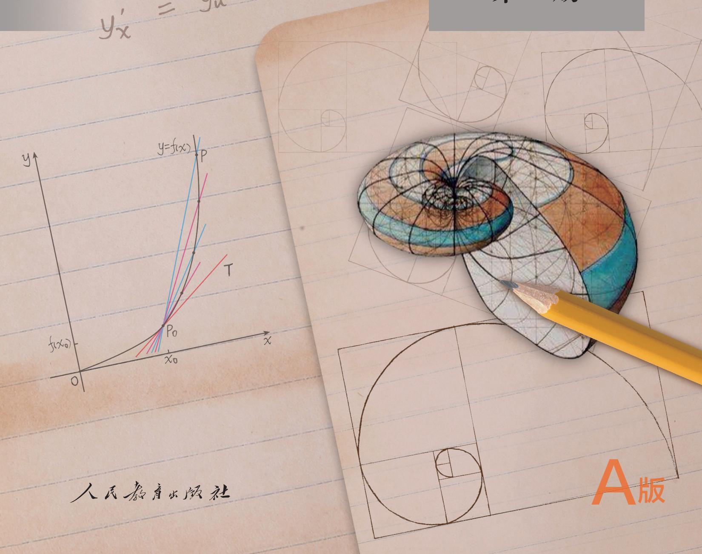
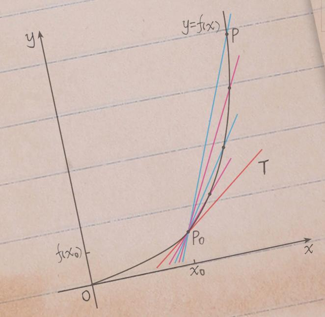

#### 数学

选择性必修

第二册

人民教育出版社

普通高中教科书

#### 数学

选择性必修

第二册

人民教育出版社 课程教材研究所

中学数学课程教材研究开发中心

编著

人民教育出版社

· 北京 ·

A版

主 编：章建跃 李增沪

副主编：李勇 李海东 李龙才

本册主编：李龙才 周远方

编写人员：李龙才 宋莉莉 张艳娇 周远方 桂思铭 郭慧清

责任编辑：张艳娇

美术编辑：王俊宏

普通高中教科书 数学 选择性必修 第二册

人民教育出版社 课程教材研究所

中学数学课程教材研究开发中心

编著

出版 人民教育出版社

（北京市海淀区中关村南大街17号院1号楼 邮编：100081）

网址 http://www.pep.com.cn

#### 本册导引

本书根据《普通高中数学课程标准(2017年版)》编写，包括“数列”“一元函数的导数及其应用”两章内容.

数列是一类特殊的函数，是数学重要的研究对象，是研究其他函数的基本工具，在日常生活中也有着广泛的应用。在“数列”中，同学们将学习数列的概念和表示方法；研究两类特殊的数列——等差数列和等比数列，探索它们的取值规律，建立它们的通项公式、前 $n$ 项和公式；在运用等差数列、等比数列解决实际问题和数学问题的过程中，体会数学模型的现实意义与应用；通过建立等差数列与一次函数、等比数列与指数函数的联系，感受数列与函数的共性和差异，体会数学的整体性。同学们还将学习一种特殊的证明方法——数学归纳法，并用它证明与数列相关的一些简单命题。

导数是微积分的核心内容之一，是现代数学的基本概念，蕴含着微积分的基本思想；导数定量地刻画了函数的局部变化，是研究函数性质的基本工具。在“一元函数的导数及其应用”中，同学们将通过丰富的实际背景，经历由平均变化率过渡到瞬时变化率的过程，学习导数的概念及其几何意义，导数的运算法则；并在运用导数研究函数的性质、解决简单的实际问题的过程中，体会导数的内涵与思想，感受导数的作用。

祝愿同学们通过本册书的学习，不但学到更多的数学知识，而且在数学能力、数学核心素养等方面都有较大的提高，并培养起更高的数学学习兴趣，形成对数学的更加全面的认识.

- [[第四章 数列]]
- [[第五章 一元函数的导数及其应用]]
- [[部分中英文词汇索引]]
